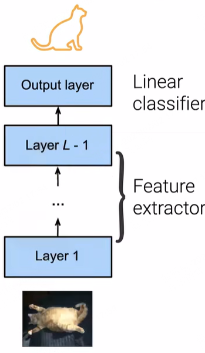
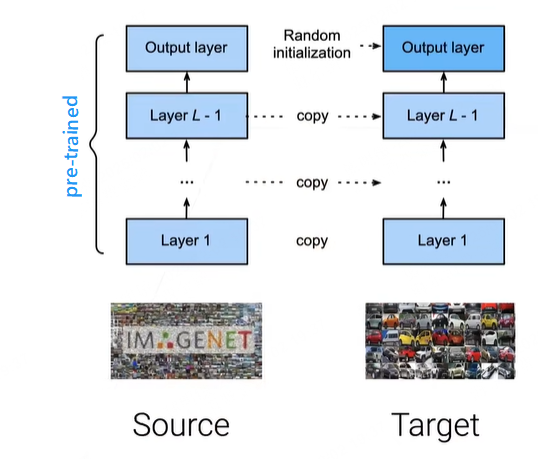
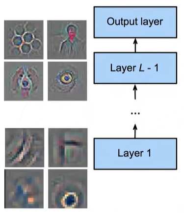

# 迁移学习

迁移学习（Transfer Learning）主要是在深度学习开始流行起来，主要因为神经网络的训练需要非常多的数据，且训练成本也非常高，这意味着现实世界中无法对每一个任务都制作非常大的数据集，且耗费非常高的成本进行训练。

针对这个问题，迁移学习的目标便是通过在一个任务上学习出一个模型，进而解决一些相关的其他任务，这样做的好处在于将过往在模型探索上所花费的时间、研究方法、计算资源、领域知识比较容易地应用到新的地方，以提升目标领域的学习效果以及成本。其核心思想是利用源领域的已有知识，减少目标领域对大量标注数据的依赖，从而加速学习过程并提高性能。

实现迁移学习的途径主要有以下几种：

- 特征抽取（例如 Word2Vec、ResNet50、I3D）
- 将相关任务上训练好的模型在另外一个任务上进行使用
- 对一个预训练模型进行微调（Fine-Tuning）

与此相关的课题还有：半监督学习（Semi-supervised Learning）、Zero-shot / Few-shot learning，以及多任务学习(1)。
{ .annotate }

1. 每一个任务都应该有自己的数据，但实际上这些任务的数据可能都不是很够，但这些任务都比较相关，把这些多个任务的数据放在一起，同时训练出多个任务出来，以期望每个任务可以从其他任务获益。

## 1. 微调在计算机视觉中的应用

### 1.1 知识迁移

计算机视觉中已经有大量已标注的数据，尤其是图像分类

### 1.2 预训练模型（Pre-Trained Model）

<figure markdown="span">
{ width="300" }
<figcaption>编码器和解码器</figcaption>
</figure>

一般来说，神经网络可以看成 **编码器** 和 **解码器** 两部分：

- 编码器：所有的卷积层可以看做是特征提取器，例如将原始像素映射到线性可分的语义特征，也称作前表示。
- 解码器：通常是简单的线性分类器，进行决策分类。

> 值得注意是，解码器并非一定是最后一层，我们也可以将后面几个都称作是解码器，这个并没有特别严格的定义。

预训练模型通常是在比较大的数据集上训练出来的一个神经网络模型，因为所使用的数据集比较大，通常我们会认为该模型具备**比较好的泛化能力**。例如我们使用 ImageNet 数据集训练好一版模型，虽然实际的任务目标可能与 ImageNet 图像分类并不相同，但是该模型所学习的对于像素等处理能力也是通用的，在如下的任务上也能多多少少起到一些作用：

- 其他数据集：例如医学、卫星的图像
- 其他任务：例如目标检测、图像分割

### 1.3 微调技术（Fine-Tuning）

微调是在新的任务上重新训练一个模型，新模型的架构需要与预训练模型保持一致，如果想要在我们的任务上通过微调预训练模型获得较好的效果，则需要找到一个性能比较好的预训练模型，这里推荐大家去 [HuggingFace](https://huggingface.co)、[ModelScope](https://www.modelscope.cn/home) 这样的平台上寻找合适的模型。

<figure markdown="span">

<figcaption>微调时模型权重的初始化</figcaption>
</figure>

在找到合适的预训练模型后，我们就可以初始化模型，整个初始化过程可以简述为：

- 模型的特征提取器（卷积层、全连接层等）的权重直接使用预训练模型相同的权重，而非随机。
- 对于最后一层的输出层，我们依然使用随机初始化权重，这是因为预训练模型的输出层所学到知识以及决策边界只在它的任务上有价值，对于我们的任务来说，并没有太多的应用价值。
- 在局部最小点开始参数优化。

!!! note "微调时权重参数的补充"

    1. 微调主要是针对解码器层的权重参数重新学习，实际上训练过程中编码器（特征提取器）的权重也会略微调整，以让模型更好地提取到目标任务的信息。此过程允许对编码器和解码器的权重参数都学习和调整，所以微调也是能够被广泛应用的原因之一。

    2. 因为预训练模型的权重可能已经在局部最小点，所以微调时通常采用一个比较小的学习率以及少量的 Epochs，这么做的目的在于将整个搜索空间变小。值得一提的是，没有必要过度非常低的训练损失值，因为预训练模型是在更大的数据集上训练的，它的泛化能力会更好，之所以称之为微调，实际上就是让我们不要在编码器上过多调整。

### 1.3 固定底部的网络层

<figure markdown="span">

<figcaption>底层和高层所学习到的知识维度</figcaption>
</figure>

通常我们会认为神经网络是一个层次性的学习过程，例如底层学习到的一般是通用性、泛化性好的特征，例如曲线、边、斑点等。上层所学习的更多是与目标任务以及特定数据集相关的知识，例如分类标签。

通过上述对于神经网络中不同层的特征表示含义的介绍，我们可以认为整个神经网络的训练过程实际上是比较平滑的，那么我们在进行模型微调时可以

