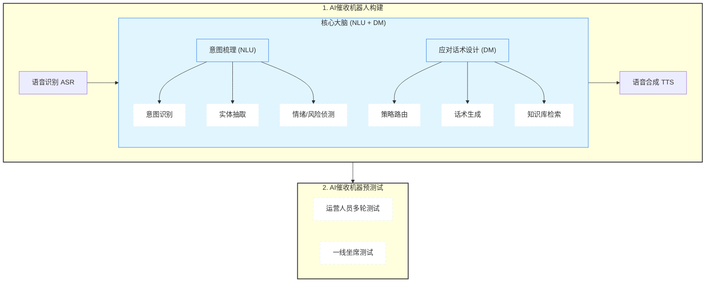

# 项目介绍

在互金以及消金行业的 “客服、营销、催收” 这三类业务场景有着大量 AI 外呼的需求，像马消、科大讯飞、百度、捷通等公司纷纷推出了自家的 AI 外呼产品。催收机器人则是针对贷后电催领域的一次重大技术变革，通过 AI 外呼工具高效触达逾期用户，改变了以往需要大量 “铺人工坐席” 的外呼作业模式。

AI 催收机器人在业务、合规甚至技术上，都有着其独特的价值，导致不少公司开始投入大量资源打造自家的 AI 催收机器人。接下来，我们将详细介绍如何从零搭建一个 AI 催收机器人，并围绕该核心建设 AI 外呼策略、效果评估、指标监控、人机协同等。

## 1. 价值体系

我们先来介绍一下 AI 外呼机器人的价值体系，主要体现在以下几方面：

**业务价值**：

- **降低人力成本**：将一些容易催回或者小金额案件让 AI 催收，人工处理一下难催回以及大金额案件，优化催收资源的合理配置。
- **提高催收效率**：传统人工催收的产能天花板极低，且大量时间耗费在空号、拒接等无效触达上。一方面可以先使用 AI 外呼工具进行触达，筛选出有效的号码以及易回收案件，提高催员挑案效率；另外一方面，基于用户画像、话术推荐、坐席陪练等人机协同方式，提升催收效果。
- **加强风险管控**：针对 AI 提取出的客户标签（例如，生病、失业、自杀等高风险信息），制定策略动态分案，加强逾期用户的及时管控。例如，情绪激动或者有投诉倾向的用户，及时通过分案调整到易投诉队列。
- **策略驱动**：基于逾期天数、逾期金额、C卡、历史投诉情况等多维度数据对客群进行分层，逐步探索 AI 独有的触达策略。例如，什么样客群适合 AI 催收，不同客群应该运用何种应对话术。

**合规价值**：

- **话术标准化**：AI催收机器人的应对话术较为标准化，不会在与用户的沟通中造成矛盾升级，能大幅降低用户投诉概率。
- **守住监管红线**：人工会出现在非规定时间拨打，或者超频拨打的监管红线问题，而 AI 催收机器人在系统限制下作业，自动识别并过滤非合规时段，严格控制对同一客户的触达频次，确保作业行为 100% 合规。
- **数据最小化**：AI催收机器人只使用必要的用户信息，避免了人工催收中常见的私自留存、违规查询或泄露客户通讯录等隐私风险。
- **数据留痕**：拨打记录、通话文本全程留痕，应对监管检查和客户投诉能提供完整的证据链。

**技术价值**：

- **提升科技属性**：AI催收机器人作为一个比较重大的项目，经常在年终财报中用以体现公司的科技能力，当然这也能提升公司股价等。

**数据价值**：

- **沉淀高质量非结构化数据资产**：催收场景中每天会产生海量的语音交互数据，通过 ASR（语音识别）和 NLP（自然语言处理）技术，这些非结构化的语音对话被转化为文本，并从中精准提取出用户的 `还款意愿`、`逾期原因`、`情绪状态` 等关键标签，联动催收策略进行风险管控。此外，这些数据还可以反哺给数据工程或者风险模型团队，能够极大地丰富债务人画像，为贷前风控模型的迭代提供极具价值的贷后表现反馈（如识别新型欺诈特征或共债风险）。
- **三方数据产品**：很多公司推出自己的 AI 催收机器人产品，可以获取到很多外部公司的逾期用户信息，例如手机号、逾期天数、逾期金额，从而打造打造或加强自家**逾期类**三方数据产品。
- **数据化驱动**：传统人工与用户的沟通语音属于非结构化数据，较难从中解析出对话轮次维度的意图标签和应对话术，而AI催收机器人很容易给出相关数据，使得催收过程的决策更加透明且完整。此外，基于数据驱动的方式优化AI能力，针对各漏斗节点进行查漏补缺，改善意图识别的准确率，以及应对话术的合理性。

## 2. 核心环节

完整的 AI 催收机器人涉及上下游业务环节非常多，这里梳理一下核心环节：

