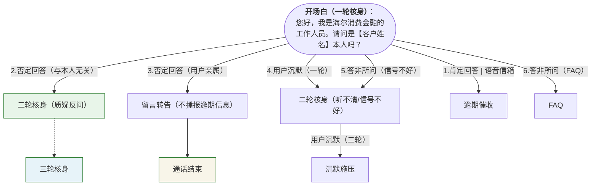

# 话术体系

根据人工催收流程的经验，我们将 AI 催收划分几个

## 1. 核身阶段

核身作为整个电催流程的第一步，主要目的是确认被催收对象是否为用户本人（监管要求），如果在未确认通话对象为用户本人的情况下便开始催收，容易引起用户投诉举报（投诉内容一般为泄露用户隐私）。

接下来，我们拆解下核身流程不同场景的应对话术：

### 1.1 用户回复

因为整个对话是以询问“是否为【xxx】本人？”开始的，所以用户对于核身问题的回复类型比较容易枚举出来，具体可以参照下表：

| 回复类型| 回复示例 | 是否核身通过 | 下一步动作 | 应对话术 |
| --- | --- | --- | --- | --- |
| 肯定回答 | 嗯，是，是的，是我，我是，是我本人，我说我是，是怎么了 | ✅ | 逾期催收 | 您在海尔消费金融的借款已逾期【x】天，请您在【上午/中午/下午】【x】点 |
| 语音信箱 | 我是机主的语音助理，有什么事你可以和我说 | ✅ | 逾期催收 | 您在海尔消费金融的借款已逾期【x】天，持续逾期可能造成您的征信影响，请您在【上午/中午/下午】【x】点前尽处理。 |
| 否定回答（与本人无关） | 不是，我不是，不认识，打错了 | ❌ | 二次核身（质疑话术） | 1.您是最新办理的手机号么？  2.不好意思，xxx在我们平台预留了这个手机号进行联系，再和您确认下，您确定不是xxx本人么？ |
| 否定回答（用户亲属） | 我是他爸，我是他家人 | ❌  | 礼貌结束通话 | 1.请问【xxx】在您旁边么，能否让他接听一下电话？ 2.不好意思，xxx在我们平台预留了这个手机号进行联系，麻烦您转告一下他联系下海尔消费金融的客服。 |
| 用户沉默（一轮） | | ❌  | 二次核身（听不清/信号不好） | 听不见您说话，您那边是信号不好么？我是海消消费金融的工作人员，请问是【客户姓名】本人吗？|
| 用户沉默（二轮） | | ❌  | 沉默施压 | 先生不说话解决不了问题，来电是为了和您沟通协商，这里先不打扰您，稍后再给您来电，请您保持电话畅通。 |
| 模糊回答（暗示本人） | 奥，什么事，你说，你讲 | ❓ | 二核核身？是否可以放开 |
| 答非所问（信号不好）| 啊，喂，我听不清，你再说一遍，我信号不好 |  ❌ | 二次核身（听不清/信号不好） | 您那边是信号不好么？我是海消消费金融的工作人员，请问是【客户姓名】本人吗？|
| 答非所问（FAQ）| 你个平台的？你谁啊？是诈骗电话吧？怎么知道我信息的？你工号多少 |  ❌ | FAQ+还款引导 |具体场景具体话术 |

其中，核身阶段的用户沉默话术，我们做一小节专门进行介绍。

### 1.2 核身阶段的沉默应对话术

按合规要求的话，理论上每一通电话都必须得先确认沟通对象为本人，但很多时候用户会采取沉默应对，

## 2. 确认还款时间

## 3. 用户沉默

