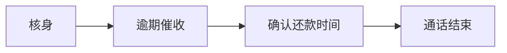
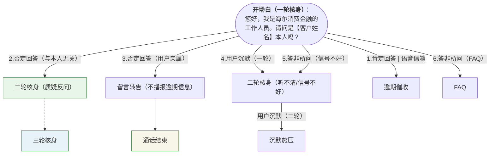

# 话术体系

!!! note "参考资料"

    - [AI催收机器人话术逻辑 0904](https://haiercash.feishu.cn/wiki/KBDAwQZfeiSsnfkxOascPjQCnSe)
    - [AI催收机器人话术逻辑 0915严厉版](https://haiercash.feishu.cn/wiki/KBDAwQZfeiSsnfkxOascPjQCnSe)

根据人工催收流程的经验，我们将 AI 催收划分几个阶段：

```mermaid
flowchart LR

    A1["核身"]
    A2["逾期催收"]
    A3["确认还款时间"]
    A4["通话结束"]

    A1 --> A2 --> A3 --> A4
```

## 1. 核身阶段

核身作为整个电催流程的第一步，主要目的是确认被催收对象是否为用户本人（监管要求），如果在未确认通话对象为用户本人的情况下便开始催收，容易引起用户投诉举报（投诉内容一般为泄露用户隐私）。

接下来，我们拆解下核身流程不同场景的应对话术：

```mermaid
flowchart TD

    Start(["<strong>开场白（一轮核身）</strong>：<br>您好，我是海尔消费金融的工作人员。请问是【客户姓名】本人吗？"])
    IDCheck21["二轮核身（质疑反问）"]
    IDCheck22["二轮核身（听不清/信号不好）"]
    ZhuanGao["留言转告（不播报逾期信息）"]
    IDCheck3["三轮核身"]
    Clt1["逾期催收"]
    END["通话结束"]

    Start --> |"1.肯定回答 | 语音信箱"| Clt1
    Start --> |"2.否定回答（与本人无关）"| IDCheck21
    Start --> |"3.否定回答（用户亲属）"| ZhuanGao --> END
    

    %%沉默应对
    Start --> |"4.用户沉默（一轮）"| IDCheck22
    IDCheck22 --> |"用户沉默（二轮）"| CltSilent["沉默施压"]

    %%答非所问
    Start --> |"5.答非所问（信号不好）"| IDCheck22
    Start --> |"6.答非所问（FAQ）"| FAQ

    %%模糊回答


    
    IDCheck21 -.-> IDCheck3

    style IDCheck21 fill:#e8f5e9,stroke:#2e7d32
    style IDCheck3 fill:#e7f3f9,stroke:#2e7d32
    style END fill:#f8f5e9,stroke:#2e7d32
```

### 1.1 用户回复

因为整个对话是以询问“是否为【xxx】本人？”开始的，所以用户对于核身问题的回复类型比较容易枚举出来，具体可以参照下表：

| 回复类型| 回复示例 | 是否核身通过 | 下一步动作 | 应对话术 |
| --- | --- | --- | --- | --- |
| 肯定回答 | 嗯，是，是的，是我，我是，是我本人，我说我是，是怎么了 | ✅ | 逾期催收 | 您在海尔消费金融的借款已逾期【x】天，请您在【上午/中午/下午】【x】点 |
| 语音信箱 | 我是机主的语音助理，有什么事你可以和我说 | ✅ | 逾期催收 | 您在海尔消费金融的借款已逾期【x】天，持续逾期可能造成您的征信影响，请您在【上午/中午/下午】【x】点前尽处理。 |
| 否定回答（与本人无关） | 不是，我不是，不认识，打错了 | ❌ | 二次核身（质疑话术） | 1.您是最新办理的手机号么？  2.不好意思，xxx在我们平台预留了这个手机号进行联系，再和您确认下，您确定不是xxx本人么？ |
| 否定回答（用户亲属） | 我是他爸，我是他家人 | ❌  | 礼貌结束通话 | 1.请问【xxx】在您旁边么，能否让他接听一下电话？ 2.不好意思，xxx在我们平台预留了这个手机号进行联系，麻烦您转告一下他联系下海尔消费金融的客服。 |
| 用户沉默（一轮） | | ❌  | 二次核身（听不清/信号不好） | 听不见您说话，您那边是信号不好么？我是海消消费金融的工作人员，请问是【客户姓名】本人吗？|
| 用户沉默（二轮） | | ❌  | 沉默施压 | 先生不说话解决不了问题，来电是为了和您沟通协商，这里先不打扰您，稍后再给您来电，请您保持电话畅通。 |
| 模糊回答（暗示本人） | 奥，什么事，你说，你讲 | ❓ | 二核核身？是否可以放开 |
| 答非所问（信号不好）| 啊，喂，我听不清，你再说一遍，我信号不好 |  ❌ | 二次核身（听不清/信号不好） | 您那边是信号不好么？我是海消消费金融的工作人员，请问是【客户姓名】本人吗？|
| 答非所问（FAQ）| 你个平台的？你谁啊？是诈骗电话吧？怎么知道我信息的？你工号多少 |  ❌ | FAQ+还款引导 |具体场景具体话术 |

其中，核身阶段的用户沉默话术，我们做一小节专门进行介绍。

### 1.2 核身阶段的沉默应对话术

按合规要求的话，理论上每一通电话都必须得先确认沟通对象为本人，但很多时候用户会采取沉默应对

## 2. 逾期催收

核身通过后，一般会进入逾期催收环节，如果仅使用通用性催收话术，很难保证能有较好的回收效果，所以如何根据**用户的状态以及历史信息**构建**千人千面的差异化话术**，这里面有着大量的工作和难题需要去解决。

### 2.1 基于历史逾期标签

基于用户的历史逾期情况，可将客群划分为以下五类：

1. **从未逾期**（30天回收率 75%）：历史从未逾期过；
2. **惯性短逾**（30天回收率 90%）：近半年最大逾期天数 <= 7 且逾期次数 >= 2；
3. **轻度逾期**（30天回收率 80%）：近半年最大逾期天数 <= 7 且逾期次数 < 2；
4. **中度逾期**（30天回收率 70%）：近半年最大逾期天数 ∈ `(7, 15]`；
5. **重度逾期**（30天回收率 60%）：近半年最大逾期天数 > 15；

这些标签能反映出逾期用户的还款意愿强弱，使用针对性的话术能让 AI 更拟人，使得催收具备更强的交互性。

#### 2.1.1 从未逾期

#### 2.1.2 惯性短逾

#### 2.1.3 轻度逾期

#### 2.1.4 中度逾期

#### 2.1.5 重度逾期

因为 “重度逾期” 客群近半年已经逾期超过 ==**15**== 天了，且还款意愿也非常低，所以在话术设计上应该偏 “**强施压**” 风格。此外，在话术中可以使用 `历史逾期天数`以及 `逾期金额` 等来达到更强的施压效果。

**逾期 1 天**：

| 序号 | 类型 | 话术模板 |
| --- | --- | --- |
| 1 | 温和提醒 | `#先生/女士#`， |

## 3. 确认还款时间

## 4. FAQ

