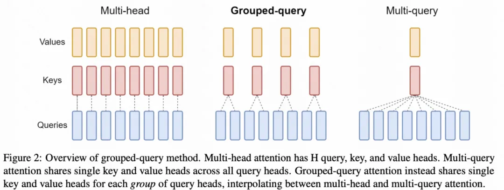
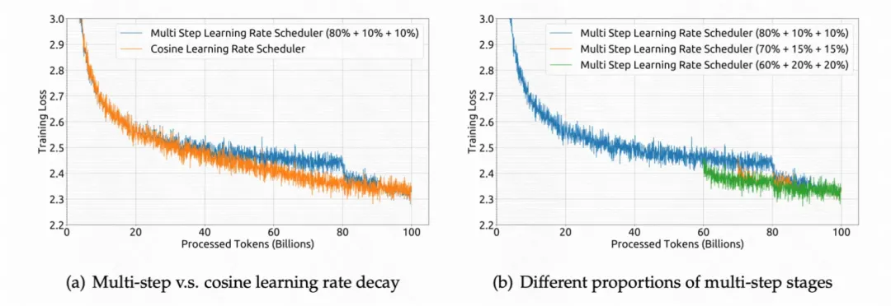
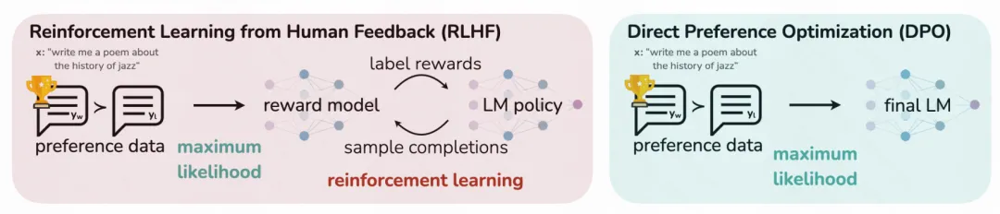
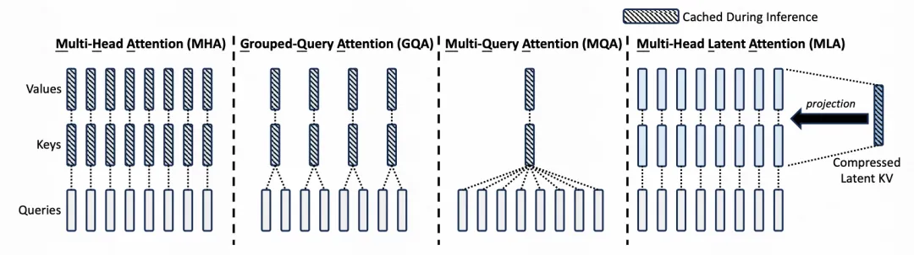
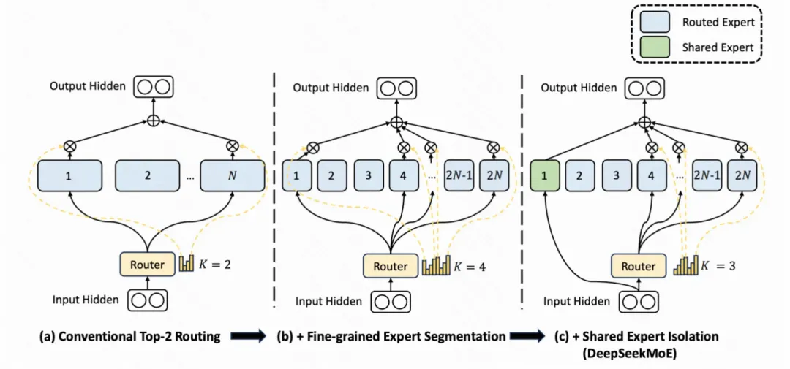
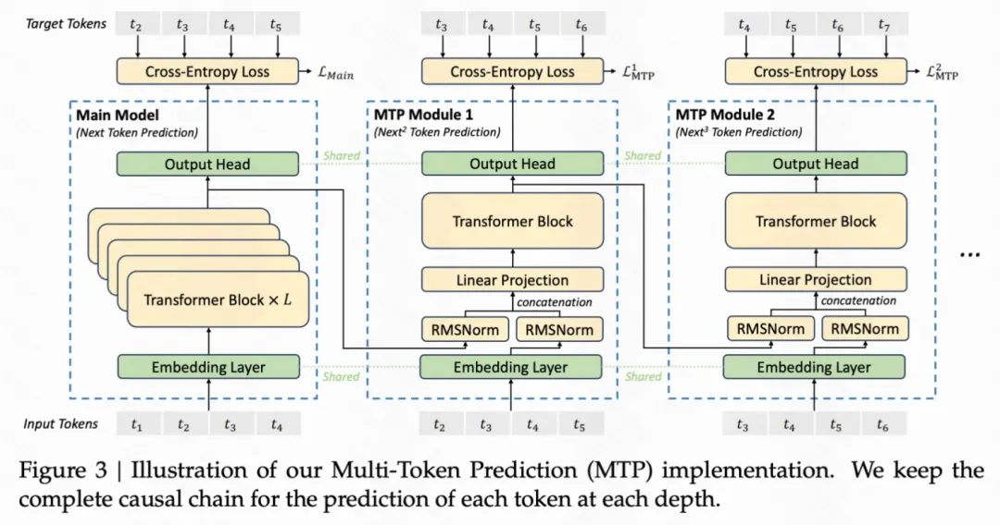

# DeepSeek V1-V3 核心技术点简明解析

> 原文地址: https://mp.weixin.qq.com/s/PWcDZCluDmc7vRBk7ZN5RA?poc_token=HGlhp2ejfYvO0EmplK2g4MC5y2urO6-treKExOfN

最近，DeepSeek 在国际上很火，一方面其效果比肩非开源模型 ChatGPT，另一方面其运行成本很低。可以说，DeepSeek 是目前为止最先进的大模型之一。

今天这篇文章，就带大家梳理一下从 2024 年至今 DeepSeek 发布的 V1~V3 版本的核心技术点，看看 DeepSeek 采用了哪些技术构建了最先进的大模型，每一次的升级基本都伴随着训练数据的优化、模型结构的升级、优化方式的更新。

为了方便大家阅读，本文会用比较简洁的语言进行主要技术的介绍，一些其他相关的技术细节深度解析，后续也会陆续进行更新。

<!-- more -->

## 1. DeepSeek V1

DeepSeek V1 是 2024 年 1 月份发布的第一版DeepSeek模型，包含DeepSeek的核心构建方式，核心技术点分为 **数据端、模型端、优化端、对齐** 4 个部分，前面 3 个部分处于模型的预训练阶段，对齐阶段使用 **SFT** 进行人类风格对齐。

**数据端**：在数据的处理上，包括 **去重、过滤、混合** 3 个步骤，目的是构建一个多样性强、纯净的高质量预训练数据。

- 在去重阶段，对于通用爬虫数据集进行全局的去重过滤，可以提升去重比例。
- 在过滤阶段，构建了一套详细的包括文法语法分析在内的评估流程，去除低质量数据。
- 在混合阶段，对不同领域的数据进行采样，平衡不同领域数据量，让数据量较少的领域也能有足够的样本占比，提升数据集多样性和全面性。

此外，在数据处理方面，使用 **Byte-level Byte-Pair Encoding** (BBPE) 作为 tokenizer，相比 BPE 是在字符粒度进行字符串分割，BBPE 则是在 **字节粒度** 进行处理，整体算法逻辑和 BPE 类似。

整体参与预训练的 token 数量为2 trillion，在 V2 和 V3 中，训练的 token 数量不断上升，V2 为 8 trillion，V3 为 14 trillion。

**模型端**：模型的主体结构基本沿用 LLaMA。LLaMA 主体就是 Transformer 结构，主要差异包括 ==RMSNorm== 的 Pre-normalization（每层 Transformer 输入使用 RMSNorm 进行归一化）、激活函数采用 SwiGLU、位置编码采用 Rotary Embeddings。模型包括 7B 和 67B 两种尺寸，其中 67B 尺寸的 Transformer 中的 Attention 采用了 ==Grouped Query Attention(1)== 代替最普通的 Self-Attention ==降低推理开销==。
{.annotate}

1. Grouped Query Attention 每组 query 共用同一组 key 和 value。

**优化端**：使用 ==Multi-Step Learning Rate== 代替 LLaMA 中的 Cosine Learning Rate Schedule，主要原因是实验发现两者虽然最终收敛到的 Loss 差不多，但是前者在连续学习上 Loss 能够保证一致性，连续学习更加方便。先用 2000 个 step 的 WarmUp 将学习率提升到最大值，然后在训练完 80% 的训练数据后将学习率降低到 31.6%，在训练完 90% 的训练数据后进一步降低到 10%。

**对齐**：使用 Supervised Fine-Tuning（SFT）、DPO 两种方式进行预训练模型的微调（finetune），进行风格对齐。

- SFT 使用 120w 搜集到的监督数据（一些根据指令给出答案的文本，由人类标注的高质量数据，帮助预训练模型迁移人类风格）进行微调。
- DPO 是针对之前 ChatGPT 中基于强化学习的 RHLF 风格迁移的一种升级，不用强化学习，只使用一个指定对应的两个答案之前的相对偏好关系作为损失函数加入到模型中。

## 2. DeepSeek V2

DeepSeek V2 最核心的两处改动都在模型结构上，一是提出了一种 **多头浅注意力**（Multi-head Latent Attention，MLA） 提升了推理效率；另一个是构建了基于 DeepSeekMoE 的语言模型结构。

**多头浅注意力**：MLA 的主要目的是减少 KV 缓存占用的空，KV 缓存是大模型都会使用的技术，在推理阶段，每一个 token 的输出都要和历史所有 token 计算 attention，每次新增 token 都有很多重复计算，因此可以将前面 token 计算出的 key 和 value 缓存起来。但是直接缓存 key 和 value 占用较大的空间，因此 MLA 对 KV 进行了一个低维映射，只存储这个低维的向量，节省了缓存存储空间。

**DeepSeekMoE**：MoE 是目前大模型在探索应用的一项技术，基础的 MoE 将原来的每个 token 的单个 ==FFN== 层变成多个并行的 FFN 层（对应多个专家模型），并根据输入生成一个路由到各个 FFN 的打分，选择 topN 个专家，实现在单 token 运算量没有显著提升的前提下，扩大模型的参数空间的目的。如下图a中，即是一个激活2个专家的MoE。

DeepSeekMoE 相比 MoE 有两处核心优化：

1. 把 Expert 变多了（文中称为 Fine-Grained Expert），其实就是把原来每个 Expert 的 FFN 维度调小，增加 Expert 数量，并且最终激活的 Expert 数量也变多。
2. 增加了几个所有 token 都走的公用 Expert，通过让所有 token 都走这些 Expert，让这些Expert 提取通用信息，其他 Expert 就能更专注于提取差异化的信息。

## 3. DeepSeek V3

DeepSeekV3 在模型结构上做了两处核心优化:

1. 对 DeepSeekMoE 中的多专家 **负载均衡** 问题，提出了一种 **不需要辅助 loss** 就能实现的解决方案，相比使用辅助 loss 提升了模型性能；
2. 引入了 ==多 Token 预测==（Multi-Token Prediction，MTP） 技术，相比原来每次只能预测一个 token，显著提升了推理的速度。

**Auxiliary-Loss-Free Load Balancing**：MoE 的一个核心问题是有可能会出现 ==坍缩== 问题，即训练到最后，激活的总是那么几个 Expert，没有实现各个 Expert 的均衡，从而失去了多专家的意义。一般的解决方法会显式引入一个负载均衡 Loss（DeepSeek-V2 以及一些其他 MoE 的做法），但是显式引入一个和目标不相关的 Loss 会影响训练效果。因此，DeepSeek-V3 采用了无需 Loss 的负载均衡方法，在每个 Expert 打分增加一个这个相应的 bias 项（bias 项只影响路由不影响后续的 Expert 加权求和计算），每个 step 都会监控各个 Expert 的负载均衡情况，对于过载的 Expert 降低 bias 项减少其相应的激活数量，对于比较稀疏的 Expert 增大其 bias 项提升激活其的样本比例。

**MTP**：语言模型都是逐个预测的，每次将当前预测结果作为最新的一个输入，再次预测下一个。改成多 token 预测，一方面可以显著提升推理的速度，另一方面也可以让模型在生成后续 token 的时候有一个全局性，提升生成效果，对训练数据利用的也更加充分，加速收敛。

具体做法为：在训练阶段，除了原来的主模型外，还会有几个并行的 MTP 模块，这些 MTP 模块的Embedding 层和 Output Head 和主模型共享，内部有一个 Transformer 层。在主模型预测了 ==next token== 后，将这个预测 token 的表征和之前 token 的 Embedding 拼接到一起，生成一个新的输入（超出长度的更久远的 token 被裁剪掉）。这个拼接好的 Embedding 输入到第一个 MTP 中预测 ==next next token==。以此类推，将 MTP Module1 的当前预测 token 表征和历史 token 拼接到一起，作为 MTP Module2 的输入，再预测 ==next next next token==。

文中引入 Multi-Token Prediction 主要为了提升训练效果，推理阶段直接去掉这些 MTP 模块，也可以引入这些MTP模块提升inference效率。

