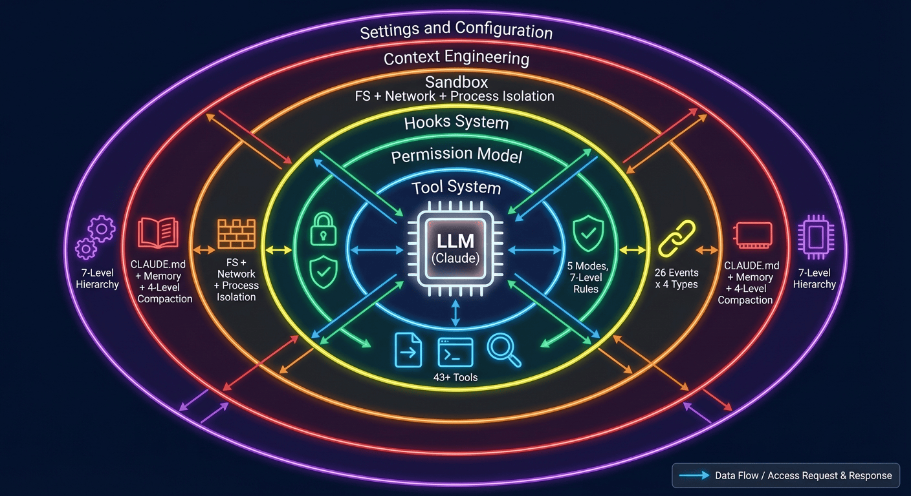

# 前言

本教程基于 Claude Code 源码（约 512,664 行 TypeScript）的逆向工程与系统性分析，以教科书的体例深入剖析 AI Agent Harness 的每一个设计决策、工程取舍与实现细节。全文遵循学术写作规范，在代码分析之上构建理论框架，将零散的实现细节提炼为可复用的设计原则。

**读者对象**：AI 工程师、Agent 系统架构师、对 LLM 应用基础设施感兴趣的研究者。

**前置知识**：TypeScript 基础、LLM API 调用经验、基本的系统设计概念。

{width="80%"}
///caption
Harness Engineering架构全景
///

LLM 被六层 Harness 基础设施环绕：工具系统（43+）、权限模型（5种模式）、Hooks 系统（26事件x4类型）、沙盒（文件+网络+进程隔离）、上下文工程（CLUADE.md+记忆+四级压缩）、设置与配置（7级层级）。

