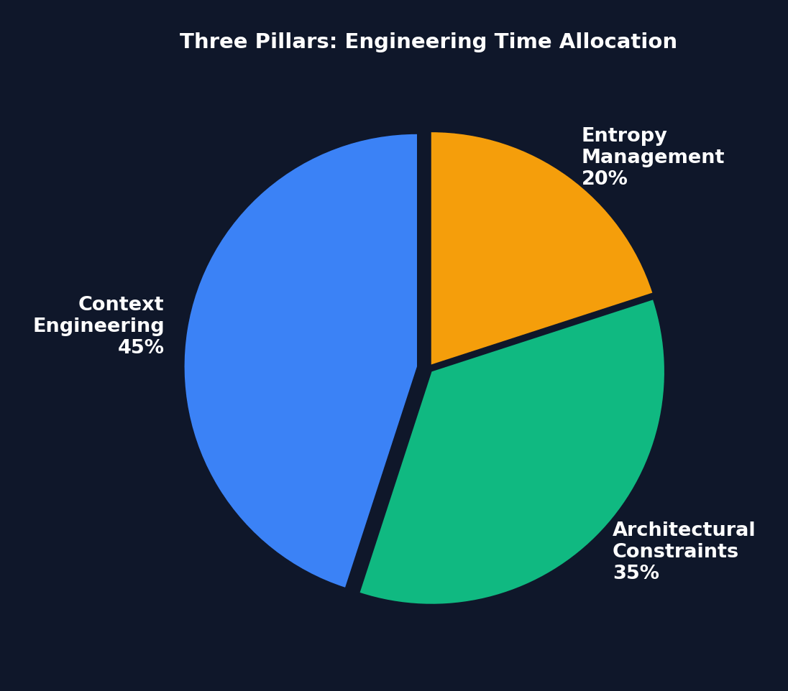

# 第一章：什么是Harness Engineering？

> 原文地址：https://wanlanglin.github.io/-awesome-cc-harness/zh/#%E7%AC%AC%E4%B8%80%E7%AB%A0%E4%BB%80%E4%B9%88%E6%98%AF-harness-engineering

想象你要训练一匹野马。你不会直接骑上去——你会先搭建围栏、准备缰绳、铺好跑道。这些”基础设施”不是马本身，但没有它们，再好的马也只是一匹野马。

AI Agent 也是如此。模型（LLM）是那匹马——强大但未被驯化。Harness Engineering 就是搭围栏、做缰绳、铺跑道的工程学科。

## 1. 定义


**Harness Engineering**（线束工程，也称为驾驭工程）是设计环境、约束、反馈循环和基础设施以使 AI Agent 在规模化场景下可靠运行的工程学科。

这个术语在 2026 年初由 OpenAI 工程团队正式提出，他们描述了内部系统”用超过一百万行代码，没有一行是人类写的”——工程师不再直接写代码，而是”设计让 AI Agent 可靠编写代码的系统”。

一个简单的类比帮助你理解：

```bash
┌─────────────────────────────────────────────────┐
│                                                 │
│   Agent = Model (LLM)                           │
│   Harness = Everything Else                     │
│                                                 │
│   ┌──────────┐     ┌────────────────────────┐   │
│   │  Claude  │ ←── │  Tools, Permissions,   │   │
│   │  Opus/   │ ──→ │  Hooks, Sandbox,       │   │
│   │  Sonnet  │     │  Memory, Settings,     │   │
│   │          │     │  MCP, Skills, Agents   │   │
│   └──────────┘     └────────────────────────┘   │
│      Model              Harness                 │
│                                                 │
└─────────────────────────────────────────────────┘
```

## 2. 三大支柱

要理解 Harness Engineering，把它拆成三根柱子来看最清晰。你可以把它想象成盖房子：Context Engineering 是打地基（确保信息到位），Architectural Constraints 是承重墙（确保结构不塌），Entropy Management 是物业维护（确保房子不老化）。

- **上下文工程**(Context Engineering)：时间占比 45%，对于模型来说，看不到信息等于不存在，它管理的信息可访问性、结构和时机。
    - 静态上下文：CLUADE.md、AGENTS.md、设计文档
    - 动态上下文：日志与指标、GIT状态、CI/CD 状态 
    - 上下文压缩：四级管道、按需加载、记忆系统

- **架构约束**(Architectural Constraints)：时间占比 35%，通过机械执行而非建议来建立边界。
    - 权限模型：支持 5 种模式
    - 7级规则层级：AI分类器、工具约束、Schema验证、并发标记安全、延迟加载、安全边界、沙盒隔离、硬编码拒绝、终深防御。

- **熵管理**(Entropy Management)：时间占比20%，但对长期稳定性至关重要。
    - 定期清理：死代码检测、文档一致性、约束验证（依赖审计、模式强制执行）
    - 性能监控
    - 覆盖率守：卫回归检测。

{width="80%"}
///caption
图1：三大支柱
///

## 3. Harness Engineering VS. 相关学科

| 学科 | 关系 |
| --- | --- |
| Prompt Engineering | Context Engineering 的子集（单次交互 vs 系统）|
| ML Engineering | 独立学科；假设模型已部署 |
| Agent Engineering | 互补；Harness 工程师为 Agent 构建基础设施 |
| DevOps | 重叠的基础设施技能，应用于 AI 上下文 |

## 4. 停下来想一想

在继续之前，试着回答这个问题：“如果你今天要构建一个 AI 编码助手，你会把 80% 的工程时间花在哪里——改进模型，还是改进模型周围的系统？”。

如果你的回答是”模型”，那么 Harness Engineering 会挑战你的直觉。LangChain 的案例证明，仅改变 Harness 就能在基准测试上提升 14 个百分点。模型是”给定的”，Harness 才是你能控制的。

## 5 定量证据：Harness 的投资回报率


