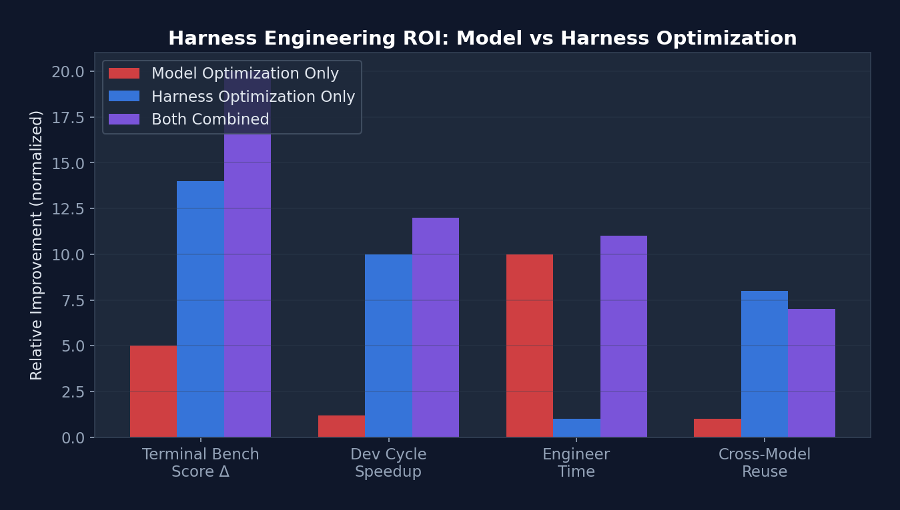

# 第一章：什么是Harness Engineering？

> 原文地址：https://wanlanglin.github.io/-awesome-cc-harness/zh/#%E7%AC%AC%E4%B8%80%E7%AB%A0%E4%BB%80%E4%B9%88%E6%98%AF-harness-engineering

想象你要训练一匹野马。你不会直接骑上去——你会先搭建围栏、准备缰绳、铺好跑道。这些”基础设施”不是马本身，但没有它们，再好的马也只是一匹野马。

AI Agent 也是如此。模型（LLM）是那匹马——强大但未被驯化。Harness Engineering 就是搭围栏、做缰绳、铺跑道的工程学科。

## 1. 定义


**Harness Engineering**（线束工程，也称为驾驭工程）是设计环境、约束、反馈循环和基础设施以使 AI Agent 在规模化场景下可靠运行的工程学科。

这个术语在 2026 年初由 OpenAI 工程团队正式提出，他们描述了内部系统”用超过一百万行代码，没有一行是人类写的”——工程师不再直接写代码，而是”设计让 AI Agent 可靠编写代码的系统”。

一个简单的类比帮助你理解：

```bash
┌─────────────────────────────────────────────────┐
│                                                 │
│   Agent = Model (LLM)                           │
│   Harness = Everything Else                     │
│                                                 │
│   ┌──────────┐     ┌────────────────────────┐   │
│   │  Claude  │ ←── │  Tools, Permissions,   │   │
│   │  Opus/   │ ──→ │  Hooks, Sandbox,       │   │
│   │  Sonnet  │     │  Memory, Settings,     │   │
│   │          │     │  MCP, Skills, Agents   │   │
│   └──────────┘     └────────────────────────┘   │
│      Model              Harness                 │
│                                                 │
└─────────────────────────────────────────────────┘
```

## 2. 三大支柱

要理解 Harness Engineering，把它拆成三根柱子来看最清晰。你可以把它想象成盖房子：**Context Engineering** 是打地基（确保信息到位），**Architectural Constraints** 是承重墙（确保结构不塌），**Entropy Management** 是物业维护（确保房子不老化）。

- **上下文工程**(Context Engineering)：时间占比 45%，对于模型来说，看不到信息等于不存在，它管理着信息可访问性、结构和时机。
    - 静态上下文：CLUADE.md、AGENTS.md、设计文档
    - 动态上下文：日志与指标、GIT状态、CI/CD 状态 
    - 上下文压缩：四级管道、按需加载、记忆系统

- **架构约束**(Architectural Constraints)：时间占比约 35%，通过机械执行而非建议来建立边界。这里有一个反直觉的收益是，约束解空间让 Agent 更高效，而非更低效——通过阻止无用探索。
    - 权限模型：5 种模式、7种规则层级、AI 分类器，依赖层级（Types → Config → Repo → Service → Runtime → UI）。
    - 工具约束：Schema验证、并发标记安全、延迟加载。
        - 确定性 Linter 执行自定义规则
        - 基于 LLM 的审计员审查 Agent 合规性
    - 安全边界：沙盒隔离、硬编码拒绝、终深防御。
        - 结构性测试和 pre-commit hooks
    

- **熵管理**(Entropy Management)：时间占比20%，但对长期稳定性至关重要。
    - 定期清理
    - 代码检测
    - 文档一致性
    - 约束验证（依赖审计、模式强制执行）。
    - 覆盖率守：卫回归检测。
    - 性能监控

{width="80%"}
///caption
图1：三大支柱
///

## 3. Harness Engineering VS. 相关学科

| 学科 | 关系 |
| --- | --- |
| Prompt Engineering | Context Engineering 的子集（单次交互 vs 系统）|
| ML Engineering | 独立学科；假设模型已部署 |
| Agent Engineering | 互补；Harness 工程师为 Agent 构建基础设施 |
| DevOps | 重叠的基础设施技能，应用于 AI 上下文 |

## 4. 停下来想一想

在继续之前，试着回答这个问题：“如果你今天要构建一个 AI 编码助手，你会把 80% 的工程时间花在哪里——改进模型，还是改进模型周围的系统？”。

如果你的回答是”模型”，那么 Harness Engineering 会挑战你的直觉。LangChain 的案例证明，仅改变 Harness 就能在基准测试上提升 14 个百分点。模型是”给定的”，Harness 才是你能控制的。

## 5 定量证据：Harness 的投资回报率

在深入”为什么现在”之前，让我们用数据说话：

{width="80%"}
///caption
图2：Harness 优化 vs 模型优化的投资回报率对比 
///

显然，在 Terminal Bench 得分和开发周期缩短上，Harness 优化的收益远超模型优化，且所需工程时间仅为后者的十分之一。

| 指标 | 仅模型优化	| 仅 Harness 优化 |两者结合 |
| --- | --- | --- | --- |
| Terminal Bench 2.0 得分 |	+3-5% (模型升级) | +14% (LangChain 案例) | +18-20% |
| 开发周期缩短 | 微不足道 | 10x (OpenAI 百万行案例)	| >10x |
| 工程师投入时间 | 数月（训练/微调） | 1-2 小时（Level 1 Harness）| 数月 |
| 可迁移性	模型特定 | 跨模型复用 | 部分复用 |

!!! note "关键洞察"

    Harness 优化的投资回报率（ROI）远高于模型优化，一个精心设计的 CLAUDE.md 文件只需 30 分钟，但可以将 Agent 在特定项目上的表现提升 20-40%。相比之下，模型微调需要数周时间和大量计算资源，且只对特定任务有效。

## 6. 为什么现在？

三个趋同因素催生了需求：

模型商品化 — 竞争优势从模型转向系统
生产部署 — Agent 从演示走向面向客户的可靠性要求
基准局限 — 标准指标无法衡量多小时、多步骤的 Agent 稳定性
实际影响：LangChain 仅修改 Harness 架构（不换模型），在 Terminal Bench 2.0 上从 52.8% 提升到 66.5%，从 Top 30 跃升至 Top 5。
