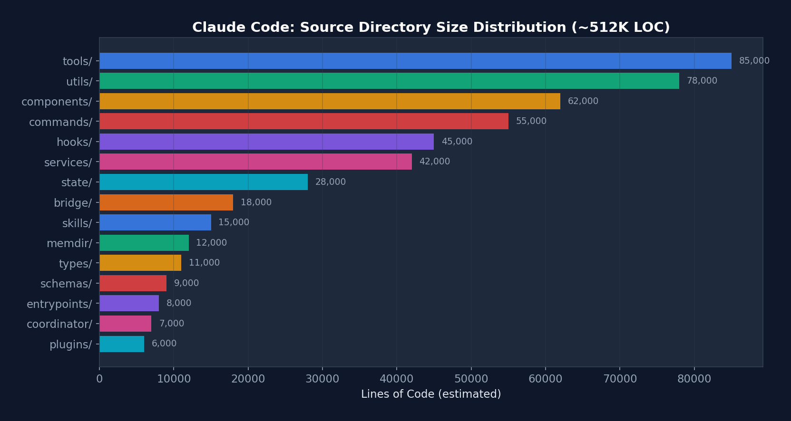
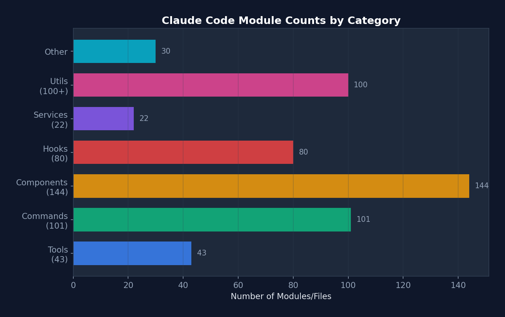
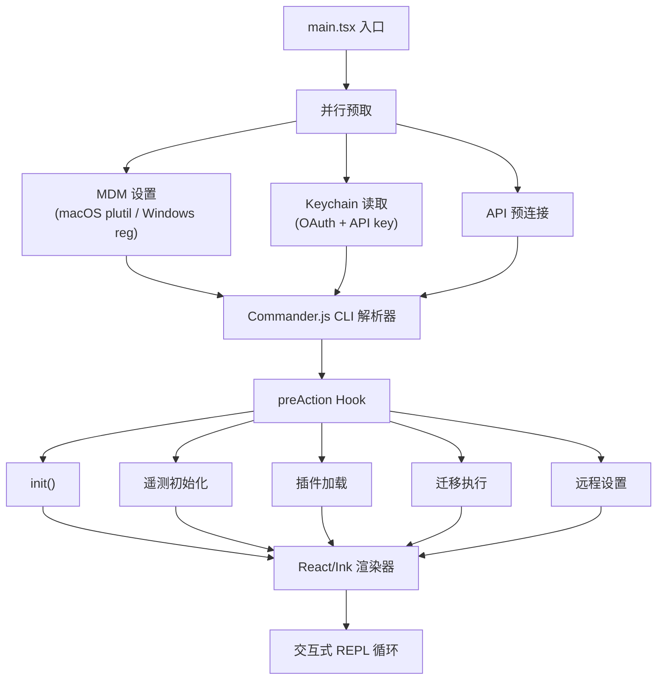

# 第二章：Cluade Code架构全景

在上一章我们建立了理论框架。从这一章开始，我们将用一个真实的、正在生产环境运行的系统来验证这些理论。这个系统就是 Claude Code——Anthropic 的官方 AI 编码助手 CLI，拥有超过 50 万行 TypeScript 代码，是目前最完整的生产级 Agent Harness 参考实现。

为什么选择 Claude Code？因为它不是一个教学项目——它是每天被数以万计的开发者使用的真实产品。它的每一个设计决策背后，都有真实的用户痛点和工程取舍。通过逆向工程它的架构，我们能学到”课本上不会写”的实战智慧。

## 1. 技术栈

| 类别                  | 技术                                        |
| :-------------------- | :------------------------------------------ |
| **Runtime**           | Bun（TypeScript 原生，高性能）              |
| **Language**          | TypeScript（严格模式）                      |
| **UI Framework**      | React + Ink（终端组件）                     |
| **CLI Parser**        | Commander.js（@commander-js/extra-typings） |
| **Schema Validation** | Zod v4                                      |
| **Search Engine**     | ripgrep（通过 BashTool 调用）               |
| **API Client**        | @anthropic-ai/sdk                           |
| **Protocols**         | MCP SDK, LSP                                |
| **State Management**  | 自定义 Zustand-like Store + React Context   |
| **Telemetry**         | OpenTelemetry + gRPC                        |
| **Feature Flags**     | GrowthBook + Bun `bun:bundle`               |
| **Auth**              | OAuth 2.0, JWT, macOS Keychain              |


{width="60%"}
///caption
图1：Cluade Code各目录代码行数分布
///

我们来看下 Claude Code 各个目录的代码行数分布，`tools/` 和 `utils/` 是最大的两个目录，合计占约 **32%** 的代码量，反映出工具系统和基础设施工具是 Harness 的核心。

{width="60%"}
///caption
图2：各类别模块数量
///

再看一下各类别模块数量，`components`（144）和 `commands`（101）数量最多，体现了 Claude Code 作为终端 UI 应用的特征。

## 2. 规模

- **~1,884** TypeScript/TSX 文件
- **512,664** 行代码
- **43+** 工具
- **100+** Slash 命令
- **80+** React Hooks
- **144+** UI 组件
- **22+** 服务模块
- **26+** Hook 事件

## 3. 目录结构

```bash
src/
├── main.tsx                    # 入口点，CLI 引导（803 KB）
├── query.ts                    # 核心 Agent 循环（68 KB）
├── QueryEngine.ts              # LLM 查询引擎（46 KB）
├── Tool.ts                     # Tool 基础接口（29 KB）
├── tools.ts                    # Tool 注册表（25 KB）
├── Task.ts                     # 任务类型定义
├── commands.ts                 # 命令注册
│
├── tools/                      # 43 个工具目录
│   ├── BashTool/              # Shell 命令执行
│   ├── FileReadTool/          # 文件读取
│   ├── FileWriteTool/         # 文件创建
│   ├── FileEditTool/          # 部分文件修改
│   ├── GlobTool/              # 文件模式匹配
│   ├── GrepTool/              # ripgrep 内容搜索
│   ├── AgentTool/             # 子 Agent 生成
│   ├── SkillTool/             # Skill 执行
│   ├── MCPTool/               # MCP 服务器调用
│   ├── WebFetchTool/          # URL 内容抓取
│   ├── WebSearchTool/         # 网页搜索
│   └── ...                    # 更多工具
│
├── commands/                   # ~101 个命令目录
│   ├── commit/                # Git 提交
│   ├── review/                # 代码审查
│   ├── mcp/                   # MCP 管理
│   ├── skills/                # Skill 管理
│   └── ...
│
├── components/                 # 144+ React/Ink 终端组件
├── hooks/                      # 80+ 自定义 React Hooks
├── services/                   # 22 个服务子目录
│   ├── api/                   # Anthropic API 客户端
│   ├── mcp/                   # MCP 协议连接
│   ├── oauth/                 # OAuth 认证
│   ├── lsp/                   # 语言服务器协议
│   ├── compact/               # 对话压缩
│   ├── plugins/               # 插件加载
│   └── ...
│
├── utils/                      # 33+ 子目录，100+ 文件
│   ├── permissions/           # 权限逻辑
│   ├── hooks.ts               # Hook 执行引擎
│   ├── hooks/                 # Hook 配置管理
│   ├── sandbox/               # 沙盒适配器
│   ├── settings/              # 设置管理
│   ├── bash/                  # Shell 工具
│   ├── memdir/                # 持久记忆目录
│   └── ...
│
├── state/                      # 应用状态管理
├── entrypoints/                # CLI/MCP/SDK 入口
├── bridge/                     # IDE 双向通信
├── coordinator/                # 多 Agent 编排
├── skills/                     # Skill 系统
├── plugins/                    # 插件系统
├── memdir/                     # 记忆目录系统
├── schemas/                    # Zod 验证 Schema
├── types/                      # 类型定义
└── constants/                  # 应用常量
```


## 4. 入口点流程

**设计哲学**：Claude Code 的入口点 main.tsx（803 KB）采用延迟加载策略。重型模块（OpenTelemetry, gRPC, analytics）在需要时才加载，而关键路径（MDM 设置、Keychain）则并行预取，确保启动速度。



## 5. 核心数据流全景图

```
┌─────────────────────────────────────────────────────────────────────
│                    Claude Code 数据流全景                             
│                                                                     
│  用户输入 ──→ UserPromptSubmit Hook ──→ Slash Command 解析           
│     │                                                               
│     v                                                               
│  QueryEngine.submitMessage()                                        
│     │                                                               
│     ├─→ 系统提示构建: base + tools + CLAUDE.md + MCP + memory        
│     ├─→ 消息规范化: normalizeMessagesForAPI()                        
│     │   ├─ 重排序 attachment 消息                                    
│     │   ├─ 合并连续 user/assistant 消息                              
│     │   ├─ 剥离 PDF/图片错误的重复内容                               
│     │   ├─ 规范化工具名称（别名→正式名）                             
│     │   └─ 工具搜索引用块处理                                        
│     │                                                                
│     v                                                                
│  queryLoop() [while(true)]                                           
│     │                                                                
│     ├─→ 压缩管道: snip → micro → collapse → auto                     
│     ├─→ API 调用: deps.sample() [流式]                               
│     │                                                                
│     ├─→ 工具执行: StreamingToolExecutor (并发) / runTools (顺序)     
│     │   │                                                            
│     │   ├─→ 工具分区: partitionToolCalls()                           
│     │   │   ├─ isConcurrencySafe=true → 并发执行                     
│     │   │   └─ isConcurrencySafe=false → 串行执行                    
│     │   │                                                            
│     │   └─→ 每个工具:                                                
│     │       ├─ Zod schema 验证                                       
│     │       ├─ tool.validateInput()                                  
│     │       ├─ PreToolUse Hook                                       
│     │       ├─ 权限检查 (rules → mode → classifier)                 
│     │       ├─ Sandbox 包装 (BashTool)                               
│     │       ├─ tool.call() [实际执行]                                
│     │       └─ PostToolUse Hook                                      
│     │                                                               
│     ├─→ 错误恢复: 7 个 continue 站点                                 
│     └─→ Stop Hook → 终止或继续                                       
│                                                                     
│  终止 → SessionEnd Hook → 转录保存 → 退出                              
└─────────────────────────────────────────────────────────────────────
```

## 6 消息类型系统

Claude Code 定义了丰富的消息类型系统，每种类型在 Agent Loop 中有不同的处理路径：

```ts title="src/types/message.ts"
type Message =
  | UserMessage           // 人类输入（或工具结果）
  | AssistantMessage      // 模型响应（文本 + 工具调用）
  | AttachmentMessage     // 记忆/资源附件
  | SystemMessage         // 系统消息
  | SystemLocalCommandMessage  // 本地工具结果（bash, read 等）
  | ToolUseSummaryMessage // 压缩后的工具历史
  | TombstoneMessage      // 已删除消息标记
  | ProgressMessage       // 流式进度更新
```

消息规范化（`normalizeMessagesForAPI`）是一个复杂的管道，处理包括：

- **连续用户消息合并**：Bedrock 不支持多个连续 user 消息，API 层面将它们合并。
- **PDF/图片错误内容剥离**：如果上传的 PDF 太大触发错误，后续轮次中自动剥离该内容，防止重复发送。
- **工具名称规范化**：别名（如旧名称）映射到当前正式名称。
- **Tool Reference 处理**：当 Tool Search 启用时保留引用块，禁用时剥离。
- **虚拟消息过滤**：REPL 内部工具调用的显示消息不发送给 API。
