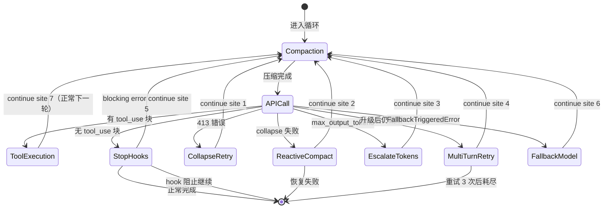
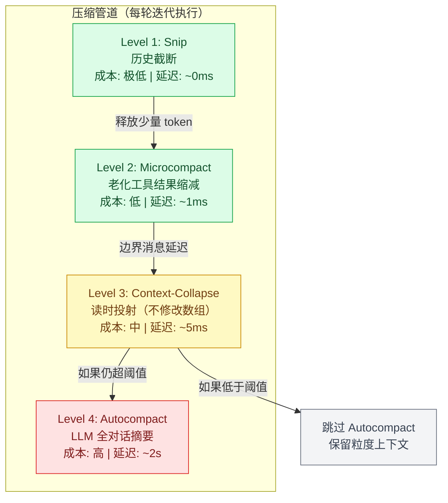

# 第三章：Agent Loop — Harness 的心脏

如果 Harness 是一辆汽车，Agent Loop 就是它的发动机。不管你的座椅多豪华、安全气囊多先进，没有发动机车就不能跑。

本章是全书最重要的一章。我们将逐行拆解 Claude Code 的核心循环—— `queryLoop()` ——看它如何用一个 `while(true)` 驱动整个 AI 编码助手。读完本章，你会对”Agent 是如何工作的”有一个从底层到顶层的完整理解。

**Agent Loop** 是整个 Harness 最核心的组件，Claude Code 的实现位于 `src/query.ts` 的 `queryLoop()` 函数。

## 1. 基本架构：无限循环 + Async Generator

以下是 Claude Code 真实源码中 `queryLoop` 的签名和初始化（`src/query.ts`）：

```ts linenums="1" title="src/query.ts"
async function* queryLoop(
    params: QueryParams,
    consumedCommandUuids: string[],
    ): AsyncGenerator<
    | StreamEvent
    | RequestStartEvent
    | Message
    | TombstoneMessage
    | ToolUseSummaryMessage,
    Terminal
> {
  // ===== 不可变参数 — 循环期间永不重新赋值 =====
    const {
        systemPrompt, userContext, systemContext,
        canUseTool, fallbackModel, querySource,
        maxTurns, skipCacheWrite,
    } = params
    const deps = params.deps ?? productionDeps()

    // ===== 可变跨迭代状态 =====
    // 循环体在每次迭代开始时解构此对象以保持裸名读取。
    // Continue 站点写入 `state = { ... }` 而不是 9 个独立赋值。
    let state: State = {
        messages: params.messages,
        toolUseContext: params.toolUseContext,
        maxOutputTokensOverride: params.maxOutputTokensOverride,
        autoCompactTracking: undefined,
        stopHookActive: undefined,
        maxOutputTokensRecoveryCount: 0,
        hasAttemptedReactiveCompact: false,
        turnCount: 1,
        pendingToolUseSummary: undefined,
        transition: undefined,  // 为什么上次迭代 continue 了
    }

    // 预算跟踪跨压缩边界（循环局部，不在 State 上）
    let taskBudgetRemaining: number | undefined = undefined

    // 查询配置快照（一次性捕获环境/statsig/会话状态）
    const config = buildQueryConfig()

  // 记忆预取（使用 `using` 确保在生成器退出时清理）
    using pendingMemoryPrefetch = startRelevantMemoryPrefetch(
        state.messages, state.toolUseContext,
    )

    while (true) {
        // ... 循环体（下文详解）
    }
}
```

State 类型定义（这是循环的”骨架”）：

```ts linenums="1"
type State = {
    messages: Message[]
    toolUseContext: ToolUseContext
    autoCompactTracking: AutoCompactTrackingState | undefined
    maxOutputTokensRecoveryCount: number
    hasAttemptedReactiveCompact: boolean
    maxOutputTokensOverride: number | undefined
    pendingToolUseSummary: Promise<ToolUseSummaryMessage | null> | undefined
    stopHookActive: boolean | undefined
    turnCount: number
    transition: Continue | undefined  // 上次迭代为何 continue
}
```

下面用状态图展示 `queryLoop` 的完整生命周期——每个状态对应循环中的一个阶段，每条边对应一个 transition reason：



简化后的逻辑流（帮助理解）：

```ts
while (true) {
    // 1. 解构状态
    const { messages, toolUseContext, ... } = state;

    // 2. 压缩管道
    // 3. 构建系统提示 + 规范化消息
    // 4. 调用 LLM API（流式）
    // 5. 收集 tool_use 块
    // 6. 错误恢复（7 个 continue 站点）
    // 7. 工具执行
    // 8. Stop Hook → 终止或继续
    // 9. 更新状态 → continue
}
```

**设计哲学**：

- **Async Generator**：不是返回最终结果，而是 `yield` 每一个中间事件（流式事件、消息、墓碑消息）。这使客户端可以在 API 调用完成前就开始渲染。
- **无限循环 + 显式退出**：循环只在 `return Terminal` 时退出。这比有限循环更灵活，因为很多恢复路径需要重新迭代。
- **单一 State 对象**：每次迭代开始时解构 State，在 continue 站点整体重新赋值，维护伪不可变语义。

## 2. 循环的七个 Continue 站点

Claude Code 的 `queryLoop` 有 7+ 个 continue 站点，每个对应不同的恢复场景：

```bash
┌─────────────────────────────────────────────────
│                 queryLoop()                      
│                                                  
│  ┌──────────────────────────────────────────┐   
│  │ Continue Site 1: Proactive Compaction    │   
│  │ 触发: token 超过阈值                       │  
│  │ 动作: autocompact → 新消息 → continue      │  
│  └──────────────────────────────────────────┘   
│                                                 
│  ┌──────────────────────────────────────────┐   
│  │ Continue Site 2: Prompt Too Long         │   
│  │ 触发: API 返回 prompt-too-long 错误        │  
│  │ 动作: context-collapse → reactive compact │  
│  └──────────────────────────────────────────┘   
│                                                 
│  ┌──────────────────────────────────────────┐   
│  │ Continue Site 3: Max Output Tokens       │   
│  │ 触发: 模型输出截断                          │ 
│  │ 动作: 升级 8k→64k → 多轮重试（最多3次）       
│  └──────────────────────────────────────────┘   
│                                                 
│  ┌──────────────────────────────────────────┐   
│  │ Continue Site 4: Fallback Model          │   
│  │ 触发: FallbackTriggeredError              │  
│  │ 动作: 切换模型 → 重试请求                    │
│  └──────────────────────────────────────────┘   
│                                                 
│  ┌──────────────────────────────────────────┐   
│  │ Continue Site 5: Stop Hook Blocking      │   
│  │ 触发: 用户 Hook 要求额外轮次                 │
│  │ 动作: 注入 Hook 消息 → continue            │  
│  └──────────────────────────────────────────┘   
│                                                 
│  ┌──────────────────────────────────────────┐   
│  │ Continue Site 6: Image/Media Errors      │   
│  │ 触发: ImageSizeError / ImageResizeError   │  
│  │ 动作: 反应式压缩（移除图片）→ continue        
│  └──────────────────────────────────────────┘   
│                                                 
│  ┌──────────────────────────────────────────┐   
│  │ Continue Site 7: Tool Execution          │   
│  │ 触发: 正常工具执行完成                       │
│  │ 动作: 收集结果 → 更新状态 → continue         │
│  └──────────────────────────────────────────┘   
│                                                 
│  ┌──────────────────────────────────────────┐   
│  │ return Terminal — 唯一的退出点             │  
│  │ 条件: 无工具调用 + Stop Hook 不阻止         │ 
│  └──────────────────────────────────────────┘   
└─────────────────────────────────────────────────
```

## 3. 压缩管道（Compaction Pipeline）

上下文窗口是有限的——即使是 1M token 的窗口，在长对话中也会被填满。Claude Code 实现了一个四级压缩管道，这是它最精巧的子系统之一。



!!! note "源码批注分析"
    
    关于 Microcompact 和 Snip 的执行顺序，源码注释道：“Apply snip before microcompact (both may run — they are not mutually exclusive)… snipTokensFreed is plumbed to autocompact: snip’s threshold check must reflect what snip removed.” 这揭示了一个微妙的数据流依赖：Snip 释放的 token 数必须传递给 Autocompact 的阈值检查，否则 Autocompact 会低估已释放的空间，导致不必要的全对话摘要。

    关于 Context-Collapse，注释道：
    
    > “Nothing is yielded — the collapsed view is a read-time projection… summary messages live in the collapse store, not the REPL array.”
    
    这意味着 Level 3 不修改任何数据结构——它只是改变了”读取方式”。这种设计使得 collapse 可以跨轮次持久化，而且完全可逆。

每级独立运作，但有严格的执行顺序约束：

```bash
┌────────────────────────────────────────────────────────┐
│                  Compaction Pipeline                     │
│                                                         │
│  Level 1: Snip Compact（每轮）                          │
│  ├─ Feature-gated 历史截断                              │
│  ├─ 追踪释放的 token 数                                  │
│  └─ 最轻量，几乎无延迟                                   │
│                                                         │
│  Level 2: Microcompact（每轮）                           │
│  ├─ 将 3 轮前的工具结果替换为 "[Previous: used {tool}]"  │
│  ├─ 缓存压缩结果                                        │
│  └─ 延迟边界消息直到 API 响应（知道 cache_deleted_input） │
│                                                         │
│  Level 3: Context-Collapse（读时投射）                   │
│  ├─ 不修改消息数组，而是在读取时投射                      │
│  ├─ 按粒度排空可折叠上下文                               │
│  └─ 低成本，渐进式                                      │
│                                                         │
│  Level 4: Autocompact（>50k tokens 时触发）              │
│  ├─ 保存完整转录到磁盘                                   │
│  ├─ LLM 总结所有消息                                     │
│  ├─ 用摘要替换所有消息                                   │
│  └─ 最重量级，但释放最多空间                              │
│                                                         │
│  执行顺序: snip → micro → context-collapse → auto        │
│  各级互不排斥，可组合运行                                 │
└────────────────────────────────────────────────────────┘
```

设计哲学：

- 渐进式：先尝试轻量操作，只在必要时升级到重量操作。
- 边界延迟：Microcompact 的边界消息延迟到 API 响应后，因为此时才知道缓存命中情况。
- 预算追踪跨压缩边界：`taskBudgetRemaining` 在压缩前捕获最终窗口，累计跨多次压缩。

