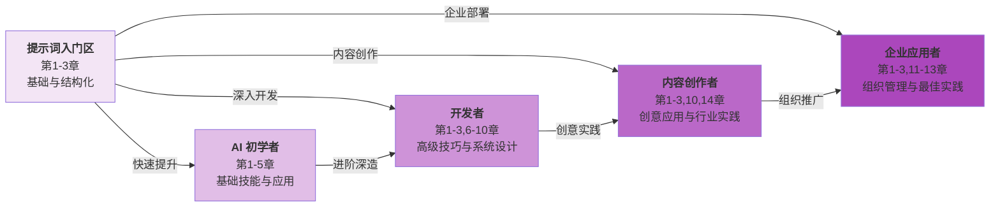

# 大模型提示词工程指南

> 原文地址：https://yeasy.gitbook.io/prompt_engineering_guide

## 1. 关于本书

在人工智能飞速发展的时代，大语言模型（Large Language Models, LLMs）已成为推动各行业变革的核心力量。无论是 [OpenAI 的 GPT 系列](https://chatgpt.com/)、[Anthropic 的 Claude](https://anthropic.com/claude)、[Google 的 Gemini](https://gemini.google.com/)，还是众多开源模型，这些 AI 系统正在重塑人们的工作方式、创作流程和问题解决思路。

然而，仅仅拥有访问权限并不足以释放这些模型的全部潜力。**提示词工程** —— 这门新兴学科正是连接人类意图与 AI 能力的关键桥梁。一个精心设计的提示词可以将模糊的想法转化为精确的输出，将复杂的任务分解为可执行的步骤，将潜在的错误降到最低。

本书系统性地介绍提示词工程的核心概念、技术原理、实用技巧和高级策略。从基础的提示词结构设计，到高级的思维链推理、多模态提示、智能体（Agent） 系统构建，再到企业级的提示词运维最佳实践，本书将引导读者逐步掌握这门关键技能。

## 2. 目标读者

本书适合以下读者群体：

- **AI 应用开发者**：希望在产品中集成大语言模型，需要掌握高效的提示词设计方法。
- **产品经理与设计师**：需要理解如何通过提示词工程优化 AI 产品的用户体验。
- **内容创作者与知识工作者**：希望利用 AI 工具提升写作、研究和创作效率。
- **数据科学家与机器学习工程师**：希望深入理解提示词技术的原理及其在模型调优中的应用。
- **企业决策者**：需要了解提示词工程在组织 AI 战略中的地位和价值。
- **AI 爱好者与学习者**：对人工智能技术感兴趣，希望系统性学习提示词技能。

无论技术背景如何，只要具备基本的计算机使用能力和对 AI 的好奇心，都能从本书中获益。

## 3. 阅读收获

通过阅读本书，读者将能够：

**理论基础**：

- 理解大语言模型的工作原理及其与提示词的交互机制
- 掌握提示词工程的核心概念、术语和理论框架
- 了解不同 AI 模型的特性及相应的提示词策略

**实践技能**：

- 设计清晰、高效、可复用的提示词模板
- 运用少样本学习、思维链、ReAct 等高级提示技术
- 处理多模态输入（文本、图像、音频、视频）的提示词设计
- 构建复杂的提示词链和 智能体（Agent） 工作流

**高级应用**：

- 实现检索增强生成系统的提示词优化
- 设计安全可靠的企业级提示词架构
- 建立提示词测试、评估和持续优化的工作流程
- 掌握自动化提示词生成与优化技术

**行业洞察**：

* 了解提示词工程在各行业的应用案例和最佳实践
* 把握提示词工程的最新发展趋势和未来方向
* 理解从“提示词工程”到“上下文工程”的范式演进

## 4. 本书特色

1. **体系完整**：从零基础到高级应用，构建完整的知识体系。
2. **内容权威**：整合 OpenAI、Anthropic、Google 等官方指南及最新研究成果。
3. **实践导向**：大量真实案例和可运行的代码示例。
4. **与时俱进**：涵盖最新的技术趋势和最佳实践。
5. **深入浅出**：复杂概念通过图解和类比使其易于理解。

## 5. 如何使用本书

本书按照“从入门到精通”的逻辑组织，建议读者按顺序阅读：

- **第一部分**（第 1-4 章）介绍基础知识，适合所有读者
- **第二部分**（第 5-7 章）深入核心技术，适合希望提升技能的实践者
- **第三部分**（第 8-11 章）探讨高级应用，适合有一定基础的开发者和专业人员
- **第四部分**（第 12-14 章）展望前沿趋势和行业实践，适合所有读者拓展视野

每章末尾设有“本章小结”，帮助读者巩固关键知识点。

面向生产落地时，不要直接从提示词跳到多智能体。请按**生产落地脊柱**依次完成提示词合同、评测、上下文、确定性工作流、单智能体和多智能体六道验收门。

## 6. 五分钟快速上手

写出第一个高质量提示词，只需这 3 个步骤：

1. **理解提示词基础（ch1-2）**：掌握提示词的核心要素——角色、背景、任务、约束，理解为什么好提示词会产生好输出（2 分钟）
2. **动手写出结构化提示词（ch3）**：按照模板编写你的第一个专业级提示词，包含系统提示、用户需求、输出格式（2 分钟）
3. **对比优化效果（ch3 案例）**：看同一个需求的“差提示词”vs“好提示词”的输出差异，直观体会提示词优化的价值（1 分钟）

完成这 3 步，你将掌握提示词工程的核心精髓！

### 6.1 学习路线图

#### 学习角色对比

| 角色         | 推荐章节                      | 学习重点                       | 预期成果            |
| ---------- | ------------------------- | -------------------------- | --------------- |
| **AI 初学者** | 第 1-5 章                   | 基础概念、提示词结构、基础技巧、常见陷阱       | 掌握提示词的基本规律和写法   |
| **开发者**    | 第 1-3→6-10 章              | 高级技巧、链式提示、RAG、智能体集成、测试评估   | 构建生产级提示词系统      |
| **内容创作者**  | 第 1-3 章 → 第 10 章 → 第 14 章 | 创意写作、多模态提示、行业应用案例          | 运用 AI 提升创作效率和质量 |
| **企业应用者**  | 第 1-3 章 → 第 11-13 章       | 企业级安全、PromptOps、跨平台策略与治理框架 | 在组织内推行提示词工程最佳实践 |

