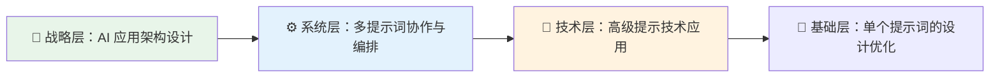
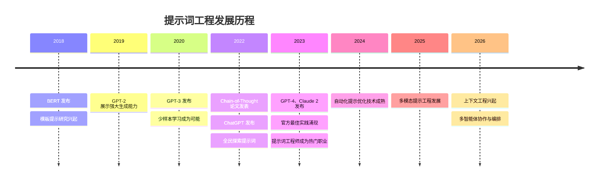
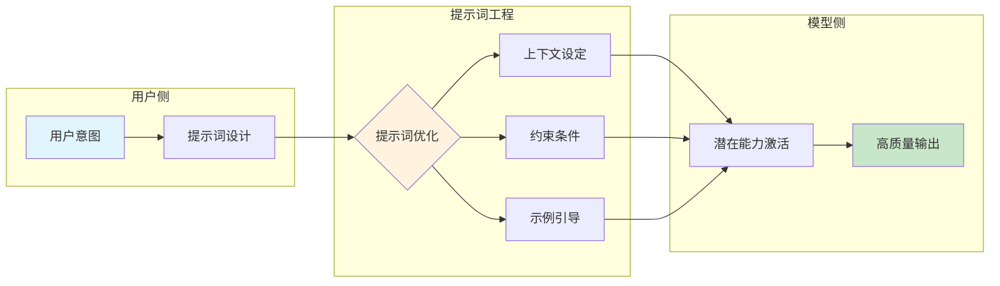
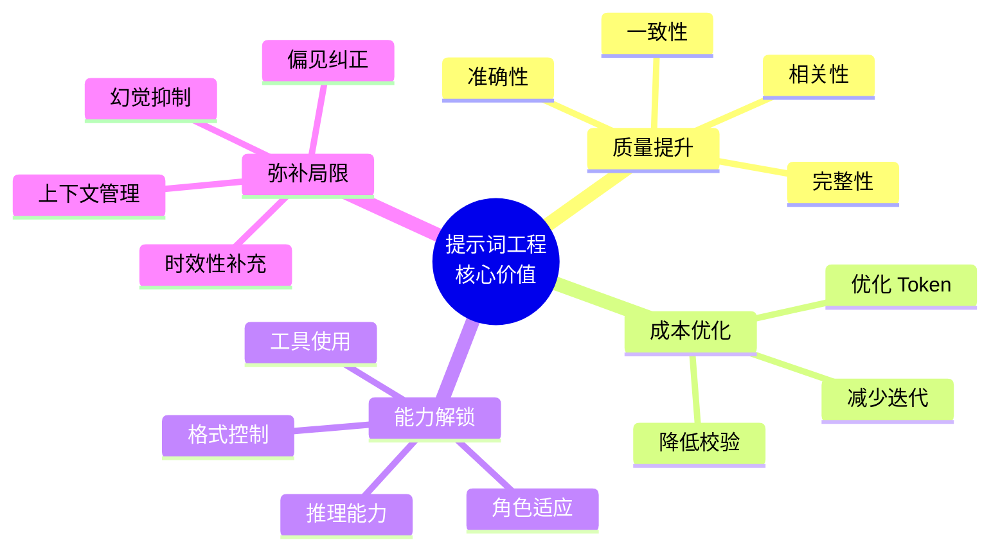
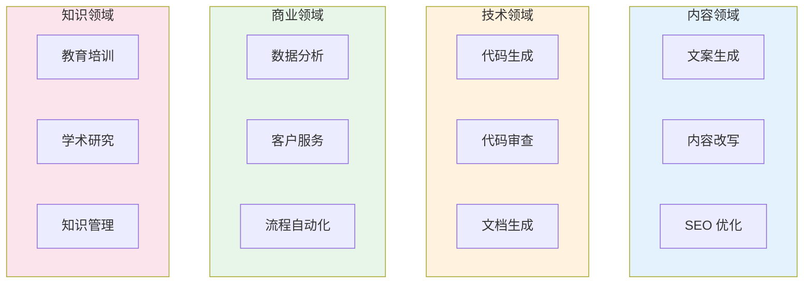

# 第一章 提示词工程概述

在人工智能技术快速演进的时代，大语言模型（Large Language Models, LLMs）正以前所未有的速度改变着人们与计算机交互的方式。从日常对话助手到专业代码生成，从创意写作到复杂数据分析，这些强大的 AI 系统展现出令人惊叹的能力。然而，释放这些能力的关键，往往不在于模型本身的规模或参数，而在于如何与之有效沟通——这正是提示词工程的核心价值所在。

提示词工程是一门新兴的技术学科，专注于设计、优化和管理输入给 AI 模型的指令与上下文信息。一个精心设计的提示词可以将模糊的需求转化为精确的输出，将复杂的任务分解为可执行的步骤，将潜在的错误和偏差降到最低。相反，一个草率或含糊的提示词可能导致无关、错误甚至有害的回应。

本章将从宏观视角审视提示词工程这一学科：什么是提示词工程？它如何从简单的文本输入演变为一门系统性的技术实践？为什么它在当今 AI 应用中如此重要？以及它能为不同领域的从业者带来怎样的价值？

通过本章的学习，读者将建立起对提示词工程的整体认知框架，为深入学习后续章节的具体技术和方法奠定坚实基础。

**本章目标**

- 理解本章核心概念与适用场景
- 掌握可复用的提示词/工作流模式
- 能将方法迁移到自己的任务中

**先修知识**

- 无需先修章节，建议具备基本的 AI 工具使用经验
- 如涉及代码示例，具备基本编程与 API 调用常识

## 1. 什么是提示词工程

### 1.1 提示词的基本概念

在与大语言模型交互的过程中，**提示词** 是指用户输入给模型的任何文本内容，包括问题、指令、示例、上下文信息或这些元素的组合。提示词是人类意图与 AI 能力之间的桥梁，决定了模型理解任务的方式以及生成输出的方向。

从技术角度来看，提示词本质上是一段经过精心设计的文本序列，它利用大语言模型在预训练阶段学习到的语言模式和知识，**引导模型在其概率分布空间中生成符合预期的输出**。当模型接收到提示词时，会根据词与词之间的条件概率关系，预测最可能的后续文本序列。

一个简单的提示词可以是：

```
请解释什么是机器学习。
```

而一个更复杂的提示词可能包含多个组成部分：

```
你是一位经验丰富的数据科学家。请用通俗易懂的语言向一位没有技术背景的企业管理者解释什么是机器学习。
要求：
1. 使用日常生活中的类比
2. 控制在 200 字以内
3. 避免使用专业术语
```

### 1.2 提示词工程的定义

**提示词工程** 是指系统性地设计、构建、测试和优化提示词的过程与方法论，旨在引导大语言模型生成高质量、准确且符合特定需求的输出。

这一定义包含几个关键要素：

1. **系统性**：提示词工程不是随机的试错，而是遵循一套原则、模式和最佳实践的结构化方法。
2. **设计与构建**：涉及对提示词结构、语言、格式的精心规划。
3. **测试与优化**：强调通过迭代实验不断改进提示词的效果。
4. **目标导向**：以获得高质量、准确、符合需求的输出为最终目标。

从学科属性来看，提示词工程融合了多个领域的知识与技能：

- **自然语言处理**：理解语言模型如何解析和生成文本。
- **软件工程**：应用模块化、可复用、可测试的设计原则。
- **用户体验设计**：关注如何清晰表达意图并获得预期结果。
- **认知科学**：理解人类如何组织和表达思维。
- **领域专业知识**：在特定行业应用中融入专业术语和规范。

### 1.3 提示词工程的核心任务

提示词工程的核心任务可以概括为以下几个方面：

#### 1.3.1 意图表达

将人类的需求、目标和期望转化为模型能够理解的语言形式。这需要考虑：

- 如何清晰地描述任务目标
- 如何提供必要的背景信息
- 如何设定合适的约束条件

#### 1.3.2 输出引导

通过提示词的设计控制模型输出的方向、格式和质量：

- 指定输出的结构（如列表、表格、JSON 等）
- 定义输出的长度和详细程度
- 设定语气、风格和专业程度

#### 1.3.3 能力激发

充分利用模型在预训练中获得的知识和能力：

- 通过合适的提示激活模型的推理能力
- 利用示例引导模型学习特定模式
- 通过角色设定调整模型的行为方式

#### 1.3.4 风险控制

降低模型输出中的错误、偏见和不当内容：

- 设计提示词以减少“幻觉”（生成虚假信息）
- 引导模型在不确定时承认知识边界
- 防止提示词注入等安全风险

### 1.4 提示词与传统编程的比较

理解提示词工程的独特性，可以通过与传统编程的对比来阐明：

| 维度        | 传统编程       | 提示词工程        |
| --------- | ---------- | ------------ |
| **交互方式**  | 精确的语法规则    | 自然语言表达       |
| **执行确定性** | 相同输入产生相同输出 | 存在随机性和变异性    |
| **错误类型**  | 语法错误、逻辑错误  | 语义误解、输出偏离    |
| **调试方式**  | 断点、日志、单元测试 | 迭代调整、对比分析    |
| **知识来源**  | 显式编码的规则    | 模型预训练获得的隐式知识 |

传统编程是“精确指令”，告诉计算机执行什么操作；提示词工程更像是“意图沟通”，引导 AI 理解目标并自主生成解决方案。

### 1.5 提示词工程的层次模型

提示词工程可以从不同层次进行理解和实践：



<p align="center">图 1-1：提示词工程的四层次模型</p>

- **基础层**：关注单个提示词的结构、语言和格式设计
- **技术层**：应用思维链、少样本学习等高级技术
- **系统层**：设计多个提示词的协作流程和数据传递
- **战略层**：在整体 AI 应用架构中规划提示词策略

本书将从基础层开始，逐步引导读者掌握各个层次的知识与技能。

### 1.6 想一想

1. 回顾你最近一次与 AI 对话的经历，你的提示词更接近“精确指令”还是“意图沟通”？效果如何？
2. 在提示词工程的四层次模型中，你目前处于哪一层？下一步最值得突破的是哪一层？

## 2. 提示词工程的发展历程

提示词工程并非一夜之间出现的全新学科，它的演进与自然语言处理技术和大语言模型的发展紧密交织。理解这段发展历程，有助于把握提示词工程的本质特征和未来方向。

### 2.1 早期探索：规则与模板时代（2010 年代前）

在深度学习主导 NLP 之前，人机交互主要依赖于预设的规则系统和模板匹配。

#### 2.1.1 基于规则的对话系统

早期的聊天机器人（如 ELIZA，1966 年）通过模式匹配和预定义规则响应用户输入。开发者需要手工编写大量的“如果-那么”规则：

```
用户输入包含"难过" → 回复"请告诉我更多关于你难过的原因"
用户输入包含"母亲" → 回复"请详细说说你的家庭情况"
```

这种方式虽然称不上真正的“提示词工程”，但体现了设计输入-输出映射的核心思想。

#### 2.1.2 信息检索中的查询优化

搜索引擎时代，用户逐渐学会使用关键词、布尔运算符和高级搜索语法来优化查询结果。这种“查询工程”可以视为提示词工程的早期雏形——用户需要理解系统的工作方式，并据此调整输入以获得更好的结果。

### 2.2 预训练语言模型的兴起（2018-2020 年）

2018 年标志着 NLP 领域的重大转折。BERT（Bidirectional Encoder Representations from Transformers）和 GPT（Generative Pre-trained Transformer）的发布开创了预训练语言模型的新时代。

#### 2.2.1 BERT 与完形填空

Google 的 BERT 模型采用掩码语言建模，通过预测被遮盖的词来学习语言表示。使用 BERT 时，研究者发现可以通过设计特定的“完形填空”模板来执行分类任务：

```
[输入文本] 总的来说，这部电影 [MASK] 极了。
```

如果模型预测 \[MASK] 为“精彩”，则判断情感为正面；若为“糟糕”，则为负面。这种将任务转化为填空问题的方法，被称为 **模板提示**，是提示词工程的学术起源之一。

#### 2.2.2 GPT 系列的崛起

OpenAI 的 GPT 系列采用自回归语言模型，通过预测下一个词来生成连贯文本。GPT-2（2019 年）展示了惊人的文本生成能力，而 GPT-3（2020 年）凭借其 1750 亿参数规模，展现出真正的“少样本学习”能力——仅通过在提示词中提供少量示例，模型就能完成从未经过专门训练的任务。

GPT-3 的论文[《Language Models are Few-Shot Learners》](https://arxiv.org/abs/2005.14165)明确指出，模型的能力可以通过设计合适的提示词来激发，而无需对模型进行微调。这一发现将提示词设计从学术实验推向了实际应用。

### 2.3 提示词工程的形成与爆发（2021-2022 年）

这一时期，提示词工程从研究领域逐步走向广泛的实践应用。

#### 2.3.1 思维链的突破

2022 年，Google 研究团队发表了具有里程碑意义的论文[《Chain-of-Thought Prompting Elicits Reasoning in Large Language Models》](https://arxiv.org/abs/2201.11903)。研究发现，在提示词中加入“让我们一步一步思考”这样的指令，或提供展示推理过程的示例，可以显著提升模型在数学推理、逻辑分析等复杂任务上的表现。

这一发现揭示了一个重要原理：**提示词不仅可以描述任务，还可以引导模型的思维过程**。

#### 2.3.2 ChatGPT 的现象级发布

2022 年 11 月，OpenAI 发布 ChatGPT，这款基于 GPT-3.5 的对话 AI 产品迅速成为现象级应用。仅两个月内，用户数突破 1 亿，创造了软件产品增长速度的新纪录。

ChatGPT 的成功引发了全民对 AI 对话的探索，无数用户开始尝试各种提示词技巧：

* 角色扮演提示（“你是一位专业的法律顾问...”）
* 格式指定（“请用 Markdown 表格形式...”）
* 迭代对话（“在之前的回答基础上...”）

社交媒体上涌现出大量“提示词技巧”分享，提示词工程从专业领域进入公众视野。

### 2.4 成熟与专业化（2023-2026 年）

随着 GPT-4、Claude、Gemini 等更强大模型的发布，提示词工程进入了快速成熟的阶段。

#### 2.4.1 官方最佳实践的发布

主要 AI 厂商陆续发布官方提示词工程指南：

- **OpenAI**：发布[《Prompt Engineering Guide》](https://developers.openai.com/api/docs/guides/prompt-engineering)，系统阐述提示词设计策略
- **Anthropic**：针对 Claude 模型发布[详细的提示词技巧文档](https://platform.claude.com/docs/zh-CN/build-with-claude/prompt-engineering/overview)，特别强调 XML 标签的使用
- **Google**：为 Gemini 提供[提示设计策略指南](https://ai.google.dev/gemini-api/docs/prompting-strategies)

这些官方指南的发布标志着提示词工程从经验分享走向系统化知识体系。

#### 2.4.2 技术体系的深化

一系列高级技术得到深入研究和广泛应用：

- **ReAct**（Reasoning and Acting）：结合推理与行动的提示框架
- **Self-Consistency**：通过多路径推理提高答案一致性
- **Tree of Thoughts**：探索多条推理路径的高级策略
- **RAG**（Retrieval-Augmented Generation）：将检索与生成结合的架构

#### 2.4.3 工具化与自动化

提示词工程开始工具化、自动化：

- **提示词管理平台**：LangChain、PromptLayer 等工具支持提示词版本控制和协作
- **自动优化**：APE（Automatic Prompt Engineering）等技术实现提示词的自动生成和优化
- **评估框架**：建立系统性的提示词效果评估方法

#### 2.4.4 职业化趋势

“提示词工程师”成为新兴职业：

- 大型科技公司开始招聘专门的提示词工程师岗位
- 培训课程和认证项目涌现
- 提示词设计成为产品经理、开发者的必备技能

### 2.5 当下与未来：从提示词工程到上下文工程

进入 2026 年，行业开始讨论提示词工程的下一步演进——**上下文工程**。

上下文工程的核心观点是：优化 AI 输出质量不仅仅是优化提示词文本本身，而是要 **系统性地管理整个上下文窗口**，包括：

- 系统指令的合理设计
- 动态检索和注入相关信息
- 对话历史的有效管理
- 工具调用结果的整合

这一转变反映了提示词工程正在从“单点优化”走向“系统性设计”的更高层次。

### 2.6 发展历程时间线



<p align="center">图 1-2：提示词工程发展历程时间线</p>

### 2.7 延伸思考

1. 从“规则模板时代”到“上下文工程”，每一次范式转变的共同驱动力是什么？
2. ChatGPT 发布后，社交媒体上传播的“提示词技巧”与本书所说的“系统性提示词工程”有何本质区别？

## 3. 提示词工程的重要性与应用场景

在大语言模型技术快速普及的今天，提示词工程已从一项专业技术演变为广泛需求的核心技能。本节将从重要性和应用场景两个维度，全面阐释提示词工程的价值。

### 3.1 模型能力与实际效果的鸿沟

现代大语言模型拥有令人印象深刻的原始能力：它们在海量文本数据上训练，学习了人类语言的各种模式、知识和推理方式。然而，这些能力是“潜在”的——模型本身并不知道用户想要什么，也不会主动调整自己的行为方式。

**提示词是激活和引导这些潜在能力的关键。** 如下图所示，提示词工程在用户意图和模型能力之间架起了桥梁：



<p align="center">图 1-3：提示词工程作为用户意图与模型能力之间的桥梁</p>

考虑以下两个提示词获得的不同结果：

**提示词 A（模糊）：**

```
写一篇关于气候变化的文章。
```

**可能的输出**：一篇泛泛而谈的科普文章，篇幅不定，深度不明，可能偏离用户的实际需求。

**提示词 B（精确）：**

``` markdown
为一份面向企业高管的月度简报撰写一段关于气候变化的摘要：
- 聚焦于过去 30 天内的主要政策变化和商业影响
- 篇幅控制在 300 字以内
- 使用数据支撑关键论点
- 结尾提供 2-3 条可行动建议
```

**可能的输出**：一段结构清晰、针对性强、可直接使用的商业简报内容。

两个提示词调用的是同一个模型，但输出的实用性却天差地别。这个差异正是提示词工程价值的直观体现。

### 3.2 核心价值体系

提示词工程的价值可从 **通用价值** 和 **角色价值** 两个层面来理解。

#### 3.2.1 通用四维价值



<p align="center">图 1-4：提示词工程的四大核心价值维度</p>

1. **提升输出质量**：通过提供明确的上下文和约束条件，减少模型“猜测”带来的错误，确保输出更准确、更相关、更一致。OpenAI 的[提示设计指南](https://developers.openai.com/api/docs/guides/prompt-engineering)强调，清晰指令、示例和约束条件能够显著改善特定任务上的输出质量，但实际提升幅度需要结合具体任务、模型和评测方法来验证。
2. **降低使用成本**：好的提示词能够“一次成功”，避免反复尝试。高效的提示词用更少的 Token 传达更丰富的信息，减少 API 调用费用和人工校验成本。
3. **解锁高级能力**：通过[思维链提示](https://arxiv.org/abs/2201.11903)激发推理能力，通过角色设定模拟专家视角，通过结构化指令控制输出格式，通过 [ReAct 框架](https://arxiv.org/abs/2210.03629)实现工具使用。
4. **弥补模型局限**：通过提供最新信息补充时效性，通过要求引用来源减少幻觉，通过任务分解应对上下文限制，通过明确指令纠正潜在偏见。

#### 3.2.2 角色差异化价值

| 角色        | 核心价值               | 典型场景           |
| --------- | ------------------ | -------------- |
| **开发者**   | 加速原型开发、简化架构、提升代码效率 | 代码生成、审查、文档编写   |
| **产品团队**  | 优化用户体验、降低风险、差异化竞争  | AI 功能设计、用户交互优化 |
| **内容创作者** | 创意激发、效率提升、质量保障     | 文案生成、风格改写、批量创作 |
| **企业组织**  | 流程自动化、知识管理、成本优化    | 报告生成、智能客服、数据分析 |

## 1.3.3 典型应用场景

提示词工程的应用范围广泛，涵盖多个领域：



<p align="center">图 1-5：提示词工程的典型应用场景分类</p>

#### 1.3.4 内容创作与营销

以下是一个营销文案提示词的示例：

```
示例：营销文案提示词

产品：智能水杯
目标受众：25-35 岁注重健康的都市白领
营销渠道：微信朋友圈广告
限制：50 字以内
风格：轻松幽默但不失专业感

请生成 3 个版本的广告文案。
```

#### 1.3.5 编程与软件开发

从代码生成到代码审查、文档编写和重构建议，提示词工程已成为开发工作流的重要组成部分。

````
示例提示词：
请审查以下 Python 函数，指出潜在的性能问题、安全风险和代码风格改进建议：

```python
def process_user_data(user_input: str):
    query = "SELECT * FROM users WHERE name = '" + user_input + "'"
    return execute_sql(query)
```

请按以下格式输出审查结果：
1. 问题描述
2. 风险等级（高/中/低）
3. 修复建议
4. 修复后的代码
````

#### 1.3.6 数据分析与商业智能

提示词工程让非技术人员也能进行复杂的数据分析：自然语言转 SQL 查询、分析报告撰写、关键洞察提炼。

#### 1.3.7 客户服务与支持

AI 驱动的客户服务涵盖智能问答、工单处理、情感分析等场景。设计客服提示词需注意维护品牌一致性、处理敏感话题边界、适时转接人工。

#### 1.3.8 教育与研究

个性化学习辅导、课程材料生成、文献研究辅助等场景正在快速增长。

### 3.4 应用场景选择矩阵

在选择提示词工程的应用场景时，可参考以下矩阵进行评估：

| 评估维度         | 高适用性场景      | 低适用性场景      |
| ------------ | ----------- | ----------- |
| **任务可描述性**   | 能用语言清晰描述的任务 | 高度隐性/直觉性任务  |
| **错误容忍度**    | 可接受一定误差的任务  | 零容错的高风险场景   |
| **时效性要求**    | 对实时性要求不高的任务 | 需要毫秒级响应的任务  |
| **规模化需求**    | 需要批量处理的任务   | 偶发的一次性任务    |
| **创意 vs 规范** | 需要创造性输出的任务  | 严格遵守固定规则的任务 |

### 3.5 战略意义

从更宏观的视角来看，提示词工程具有三重战略意义：

- **模型无关的能力**：核心提示词设计原则——清晰表达、提供上下文、示例驱动，适用于大多数语言模型，技能可迁移。
- **低门槛的能力放大器**：相比模型训练或微调，提示词工程入门门槛低，是一种“高杠杆”技能。
- **人机协作的核心界面**：随着 AI 在各行各业渗透，提示词将成为人类与 AI 协作的主要界面。

### 3.6 思考

1. 尝试对比“提示词 A”和“提示词 B”的范式：找一个你日常工作中的任务，分别写出模糊版和精确版的提示词，预测两者的输出差异。
2. 用“应用场景选择矩阵”评估你当前工作中的一个任务，判断它是否适合用提示词工程来优化。

## 4. 本章小结

本章系统性地介绍了提示词工程的基础概念和宏观框架，为后续深入学习奠定了基础。以下是本章的核心要点回顾：

### 4.1 关键概念

- **提示词**：输入给大语言模型的任何文本内容，是人类意图与 AI 能力之间的桥梁。
- **提示词工程**：系统性地设计、构建、测试和优化提示词的过程与方法论，旨在引导模型生成高质量、准确且符合需求的输出。

## 核心要点

1. **提示词工程的本质**
    - 融合了自然语言处理、软件工程、用户体验设计等多学科知识
    - 核心任务包括意图表达、输出引导、能力激发和风险控制
    - 可从基础层、技术层、系统层、战略层四个层次理解和实践
2. **发展历程的关键节点**
    - 2018 年：BERT 发布，模板提示研究兴起
    - 2020 年：GPT-3 展示少样本学习能力
    - 2022 年：思维链技术突破，ChatGPT 引发全民关注
    - 2023-2026 年：技术成熟化、工具化、职业化
3. **提示词工程的重要性**
    - 弥合模型能力与实际效果的鸿沟
    - 提升输出质量与可靠性
    - 降低使用成本
    - 解锁模型高级能力
    - 弥补模型固有局限性
4. **核心价值与应用场景**
    - 对开发者、产品团队、内容创作者、企业组织提供差异化价值
    - 典型应用涵盖内容创作、编程开发、数据分析、客户服务、教育培训、研究知识工作等领域

### 4.2 核心技能图谱

```
提示词工程师技能图谱
├── 语言表达能力：清晰、准确、结构化地表达意图
├── 模型理解能力：了解不同模型的特性和局限
├── 系统思维能力：设计多步骤、多模块的复杂流程
├── 迭代优化能力：通过测试和反馈持续改进
└── 领域专业能力：在特定领域深入应用
```

### 4.3 延伸阅读

#### 4.3.1 概念基础

- [A Systematic Survey of Prompt Engineering](https://arxiv.org/abs/2402.07927) - 2024 年发布的全面提示词工程综述
- [The Prompt Report](https://arxiv.org/abs/2406.06608) - 最全面的提示词技术综述（58 种技术+33 个术语）
- [Prompting Guide](https://www.promptingguide.ai/) - DAIR.AI 提供的提示词学习指南
- [Pre-train, Prompt, and Predict](https://arxiv.org/abs/2107.13586) - 提示词范式的综述论文

#### 4.3.2 发展历史

- [BERT: Pre-training of Deep Bidirectional Transformers](https://arxiv.org/abs/1810.04805) - BERT 原始论文
- [Language Models are Few-Shot Learners](https://arxiv.org/abs/2005.14165) - GPT-3 论文，开启少样本学习时代
- [Chain-of-Thought Prompting](https://arxiv.org/abs/2201.11903) - 思维链提示的里程碑论文
- [ReAct: Synergizing Reasoning and Acting](https://arxiv.org/abs/2210.03629) - 推理与行动结合的创新框架

### 4.3.3 重要性与应用场景

- [OpenAI Prompt Engineering Guide](https://developers.openai.com/api/docs/guides/prompt-engineering) - OpenAI 官方提示词工程指南
- [Anthropic Prompt Engineering](https://platform.claude.com/docs/en/build-with-claude/prompt-engineering/overview) - Anthropic Claude 提示词最佳实践
- [Google AI Prompt Design](https://ai.google.dev/gemini-api/docs/prompting-strategies) - Google Gemini 提示词设计指南
- [OpenAI Cookbook](https://developers.openai.com/cookbook) - OpenAI 官方示例和最佳实践集合
- [Claude Prompting Best Practices](https://platform.claude.com/docs/en/build-with-claude/prompt-engineering/claude-prompting-best-practices) - Claude 提示词最佳实践与示例（原 Prompt Library 已并入此页）
- [LangChain](https://langchain.com/) - 流行的 LLM 应用开发框架
- [Awesome Prompt Engineering](https://github.com/promptslab/Awesome-Prompt-Engineering) - 提示词工程资源汇总
