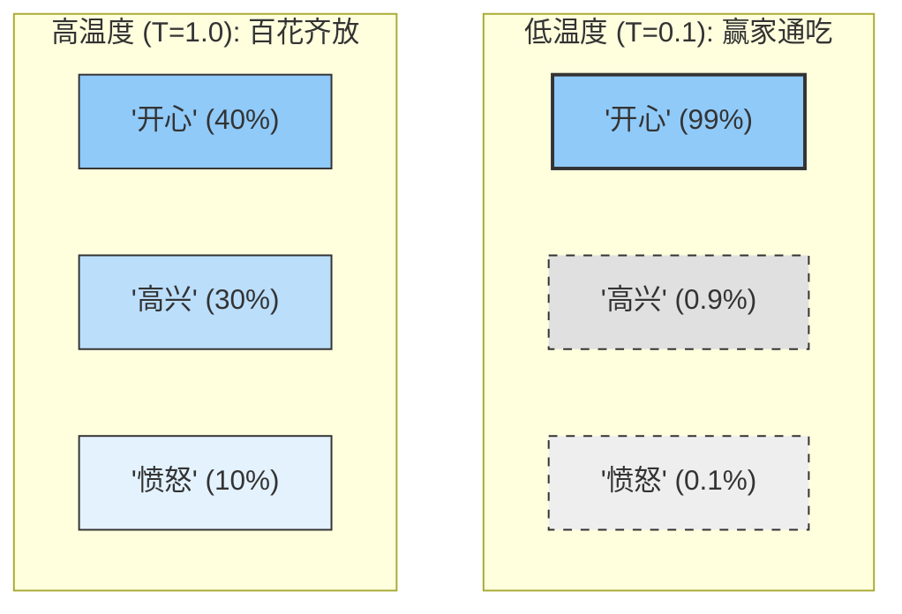
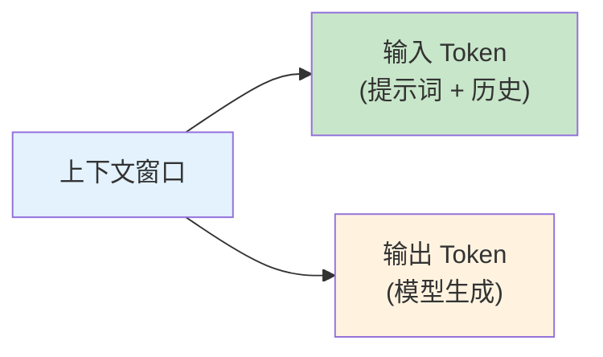

# 第二章 大语言模型基础

要精通提示词工程，首先需要理解其作用对象——大语言模型（Large Language Models, LLMs）的基本工作原理。正如驾驶员需要了解汽车的基本机械原理才能更好地操控车辆，提示词工程师也需要理解语言模型的运作机制，才能设计出更有效的提示词。

本章将从技术角度介绍大语言模型的核心概念，包括它们如何理解和生成文本、当前主流模型的特点与差异、关键参数对输出的影响，以及上下文窗口这一重要概念。这些知识将帮助读者从更深层次理解提示词为何有效，以及如何根据模型特性调整提示策略。

值得注意的是，本章的目标不是深入探讨机器学习的数学原理，而是提供足够的背景知识，使读者能够更有意识地、更有针对性地进行提示词设计。

**本章目标**

- 理解本章核心概念与适用场景
- 掌握可复用的提示词/工作流模式
- 能将方法迁移到自己的任务中

**先修知识**

- 建议先阅读上一章或同等基础内容
- 如涉及代码示例，具备基本编程与 API 调用常识

## 1. 大语言模型的工作原理

理解大语言模型的工作原理，是掌握提示词工程的重要基础。本节将用相对直观的方式解释这些复杂系统的核心机制，重点关注与提示词设计相关的概念。

### 1.1 从语言建模说起

大语言模型的核心任务是 **语言建模**（ Language Modeling），即学习和表示人类语言的概率分布。简单来说，模型在训练过程中学会了一件事：**给定一段文本，预测下一个最可能出现的词是什么**。

例如，给定文本“今天天气真”，模型会计算各个可能续写词的概率：

- “好” — 概率 45%
- “不错” — 概率 20%
- “糟糕” — 概率 15%
- “热” — 概率 10%
- 其他 — 概率 10%

然后根据这个概率分布选择下一个词，并重复这个过程直到生成完整的回复。

这个看似简单的 “下一词预测” 任务，当在海量文本数据上进行训练后，会涌现出令人惊讶的能力：模型不仅学会了语法规则，还学会了事实知识、推理模式，甚至创意表达。

### 1.2 Transformer 架构

现代大语言模型几乎都基于 **Transformer** 架构。Transformer 的核心创新是 **自注意力机制**（Self-Attention），它使模型能够在处理文本时动态计算不同部分之间的关联强度，从而捕捉长距离的语义依赖关系。

> 💡 关于大语言模型工作原理的详细介绍（包括 Transformer 架构、注意力机制、位置编码等细节），请参阅《AI 入门指南》第六章或《大语言模型底层解析》。

### 1.3 Token：模型理解的基本单位

大语言模型不直接处理字符或完整单词，而是处理 **Token**——一种介于字符和单词之间的文本单位。

#### 1.3.1 什么是 Token

Token 是模型词汇表中的基本单元，可能是：

- 一个完整的常用词（如 'the'，“是”）
- 一个词的一部分（如 'understanding' 可能被拆分为 'under' + 'stand' + 'ing'）
- 一个汉字（中文通常每个字是一个 Token）
- 标点符号或空格

不同模型使用不同的分词器，因此相同文本在不同模型中的 Token 数量可能不同。

#### 1.3.2 Token 与提示词工程的关系

理解 Token 对提示词设计有实际意义：

- **成本计算**： API 定价通常基于 Token 数量，输入和输出 Token 数直接影响费用。
- **长度限制**：模型的上下文窗口以 Token 计量，过长的提示词可能被截断。

- **估算方式**：

    - 英文：1 个 Token ≈ 4 个字符或 0.75 个单词
    - 中文：1 个汉字 ≈ 1-2 个 Token

例如，一段 1000 词的英文文章大约是 1300-1500 个 Token ，而 1000 字的中文文章大约是 1000-2000 个 Token。

### 1.4 训练过程：预训练与微调

大语言模型的能力来源于其训练过程，通常分为两个主要阶段：

#### 1.4.1 预训练

在预训练阶段，模型在海量文本数据上进行训练，学习预测下一个 Token。这些数据可能包括：

- 网页内容（如 Common Crawl）
- 书籍和文献
- 代码仓库
- 维基百科等百科全书
- 新闻文章

预训练需要巨大的计算资源，可能需要数千个 GPU 训练数周甚至数月。在这个过程中，模型学会了：

- 语言的语法规则
- 世界知识和事实
- 推理模式
- 各种文本风格和格式

#### 1.4.2 微调与对齐

预训练后的模型具有强大的语言能力，但可能不太“听话”——它只会续写文本，而不是按照指令完成任务。

微调阶段使用更小但更精心策划的数据集来调整模型行为：

**监督微调（ Supervised Fine-tuning, SFT）**：使用高质量的指令-回复对训练模型遵循指令。

**人类反馈强化学习（Reinforcement Learning from Human Feedback, RLHF）**：收集人类对模型输出的偏好评价，训练模型生成人类更喜欢的回复。

这些对齐技术使模型从“文本预测器”转变为“智能助手”，能够理解指令、遵循格式要求，并避免生成有害内容。

### 1.5 推理过程：从提示词到输出

当用户发送提示词给模型时，会经历以下推理过程：


<p align="center">图 2-1：从提示词到输出的推理流程</p>

#### 1.5.1 逐 Token 生成

模型是一个 Token 一个 Token 地生成回复。每生成一个新 Token ，它就被添加到上下文中，作为预测下一个 Token 的输入。这个过程称为 **自回归生成**（ Autoregressive Generation）。

这解释了为什么：

- 模型生成长文本需要更多时间
- 模型“知道”自己之前说了什么（因为前文在上下文中）
- 一旦生成了某些内容，可能会影响后续生成的方向

#### 1.5.2 概率采样

模型不总是选择概率最高的 Token。通过调整采样参数（如 temperature），可以控制生成的随机性：

- 低随机性：更确定、更一致的输出
- 高随机性：更多样、更有创意的输出

这些参数将在 2.3 节详细讨论。

### 1.6 涌现能力

当模型规模（参数量、训练数据、计算资源）达到一定阈值时，会出现一些较小模型不具备的能力，这被称为 **涌现能力**（ Emergent Abilities）：

- **少样本学习**：只需少量示例就能学会新任务
- **思维链推理**：能够展示推理步骤
- **指令遵循**：理解并执行复杂的指令
- **代码生成**：编写和理解程序代码

涌现能力解释了为什么某些提示词技术（如思维链）在大模型上效果显著，而在小模型上可能无效。

### 1.7 对提示词设计的启示

理解模型工作原理后，可以得出以下提示词设计启示：

1. **提示词是条件信号，而非简单指令**：大模型的本质是在计算“给定输入文本，下一个 Token 的概率分布”。从这个视角看，提示词工程的本质不是“沟通技巧”，而是对模型输出概率分布的精确操控。改变提示词就是改变概率分布的形状，从而影响采样结果。
2. **上下文决定输出**：模型根据完整的上下文生成回复，提示词中的每个部分都可能影响输出。
3. **清晰的信号更有效**：模型需要明确的“信号”来理解任务，模糊的提示词会导致模型“猜测”。
4. **顺序和位置有影响**：由于注意力机制和位置编码，信息在提示词中的位置可能影响其权重。
5. **示例是强引导**：由于训练方式，模型擅长从示例中学习模式并应用到新情况。

### 1.8 想一想

1. 模型是逐 Token 生成的——这对你在设计长文本输出提示词时有什么启示？
2. 预训练阶段和对齐阶段各自解决了什么问题？如果跳过对齐训练，用户体验会有什么变化？

## 2. 主流大语言模型概览

当前的大语言模型市场呈现百花齐放的态势，不同模型在能力特点、使用方式和适用场景上各有差异。了解主流模型的特性，有助于根据具体需求选择合适的模型，并针对性地设计提示词。

### 2.1 OpenAI GPT 系列

[OpenAI](https://openai.com/) 是大语言模型商业化的先驱，其 GPT 系列模型在行业内具有标杆地位。

#### 2.1.1 GPT-4/GPT-5 系列

GPT-4 是 OpenAI 于 2023 年发布的旗舰模型，而 GPT-5 系列（2025-2026 年）则代表了新一代能力。

!!! warning "注意"
    
    OpenAI 于 2026-07-09 发布 **GPT-5.6** 系列：Sol 面向前沿能力，Terra 平衡能力与成本，Luna 面向高吞吐。`gpt-5.6` 别名路由到 `gpt-5.6-sol`；生产系统应保存实际 model snapshot，并以官方文档和回归测试决定迁移。

**核心特点**：

- 多模态能力：支持图像输入（ GPT-4V/GPT-4o/GPT-5）
- 强大的推理能力：在复杂逻辑和数学问题上表现优异
- 长上下文支持：OpenAI 官方文档显示 GPT-5.5 / GPT-5.4 支持 1M 上下文，GPT-5.4 mini 支持 400K 上下文；旧版 GPT-5.x 快照若仍用于兼容系统，应按历史模型页或现有合同单独核验
- 工具与计算机使用能力：GPT-5 系列持续增强工具调用、代码与计算机使用工作流
- 函数调用：原生支持结构化的 API 调用

**提示词特点**：

- 响应格式化能力强，善于遵循复杂的输出格式要求
- 对系统提示词有良好的遵从性
- 适合使用 Markdown 格式组织提示词

#### 2.1.2 o 系列推理模型

2024-2025 年，OpenAI 推出了专注于推理能力的 o 系列模型。这条路线后续又进一步演进到了 GPT-5 主线。

**核心特点**：

- 内置思维链：模型内部进行多步推理，外部只显示最终结果
- 数学和编程能力突出：在竞赛级别的问题上表现优异
- 更长的“思考时间”：可通过推理预算控制推理深度

**提示词特点**：

- 不需要显式要求“逐步思考”，模型会自动进行
- 更适合直接描述问题，让模型自主规划解决方案
- 对复杂任务的分解能力更强

### 2.2 Anthropic Claude 系列

[Anthropic](https://www.anthropic.com/) 由前 OpenAI 研究人员创立，其 Claude 系列以安全性和长上下文能力著称。

#### 2.2.1 Claude 模型系列

Claude 目前提供多个层级的模型以满足不同需求：

| 模型                | 特点                                                                                                                 | 适用场景                       |
| ----------------- | ------------------------------------------------------------------------------------------------------------------ | -------------------------- |
| Claude Fable 5    | 已列入官方 Legacy models（仍可用，建议迁移到 Fable 5.1）；2026-06-09 GA，1M 上下文、128K 输出、Adaptive Thinking 常开、$10/$50；2026-07-01 恢复访问 | 长时代理、高难度推理；需处理分类器拒绝与回退     |
| Claude Sonnet 5   | `claude-sonnet-5`，Adaptive Thinking 默认开启                                                                           | 编码、Agent 与企业工作流            |
| Claude Opus 5     | `claude-opus-5`（2026-07-24 发布），$5/$25、1M 上下文、128K 输出；官方模型页建议“不确定用哪个模型时先从 Opus 5 开始”                                | 复杂代理式编码与企业工作流              |
| Claude Opus 4.8   | 已列入 Legacy models；1M 上下文与 $5/$25 定价不变                                                                              | 存量集成维护；新项目建议迁移到 Opus 5     |
| Claude Sonnet 4.6 | 已列入 Legacy models；领先编码能力， VS Code 集成                                                                               | 存量企业应用维护；新项目建议迁移到 Sonnet 5 |
| Claude Haiku 4.5  | 快速响应，低成本                                                                                                           | 简单任务、高并发                   |

**核心特点**：

- **超长上下文**：Anthropic 官方文档显示 Fable 5、Opus 5 与 Sonnet 5 支持 1M Token 上下文，Haiku 4.5 支持 200K Token；已移入 Legacy models 折叠区的 Opus 4.8 与 Sonnet 4.6 同样是 1M；Fable 5 / Mythos 5 在 2026-06-12 暂停后于 2026-07-01 恢复访问，Mythos 5 仍限 Project Glasswing 获批客户，生产默认模型仍应回到官方模型页核验
- **安全对齐**：在有害内容防护上表现出色
- **代码能力**：在代码生成、代码库分析和代理式编码方面表现优异
- **诚实性**：更倾向于承认不确定性
- **Token 预算**：模型升级可能改变计数和价格，应使用 Anthropic Models API 或 token counting API 按目标模型实测

**提示词特点**：

- **XML 标签**： Claude 对 XML 格式的提示词有特别好的响应

```xml linenums="1"
<context>
这里是背景信息
</context>

<task>
请完成以下任务...
</task>

<output_format>
请按以下格式输出...
</output_format>
```

- **预填充**：可以预先设定回复的开头，引导输出格式（注：Claude Fable 5、Mythos 5、Mythos Preview、Opus 4.8、Opus 4.7、Opus 4.6、Sonnet 5、Sonnet 4.6 已不支持 assistant prefill；Sonnet 4.5 仍出现在 Anthropic 官方 prefill 示例中，详见 13.2 章）
- **思考标签**：使用 `<thinking>` 标签可以引导模型展示推理过程

### 2.3 Google Gemini 系列

[Google](https://ai.google.dev/) 的 Gemini 系列是原生多模态设计的大语言模型。

#### 2.3.1 Gemini 3.6/3.5 Flash / 3.1 Pro Preview / 2.5 Pro

**核心特点**：

- 原生多模态：从设计之初就支持文本、图像、音频、视频
- 超长上下文：Gemini 3.6 Flash、Gemini 3.5 Flash 与 Gemini 2.5 Pro 的官方文档都列出 1,048,576 输入 token 与 65,536 输出 token；Gemini 3.1 Pro Preview 属于预览模型，Gemini 3.6 Flash 与 Gemini 3.5 Flash 是当前的 Stable 候选，实际限制应以 Google 最新模型页为准
- Google 生态集成：与 Google Workspace、Search 等产品深度整合
- Personal Intelligence（2026 新功能）：Gemini 可在授权范围内跨 Google 应用整合个人数据

**提示词特点**：

- 多模态提示：可以自然地在提示词中混合文本和其他媒体
- 结构化指令：对角色设定和任务分解响应良好
- 详细性偏好：倾向于生成详尽的回复，需要明确限制长度

#### 2.3.1 稳定版与预览版选择

实际选型时，生产系统应优先选择 Google 当前标记为 Stable 且未进入关闭窗口的模型。Gemini 2.5 Pro / Flash 仍可用于既有系统迁移，但 Google deprecations 页面已给出 2026 年的关闭窗口；新系统应评估 Gemini 3.6 Flash、Gemini 3.5 Flash、Gemini 3.1 Flash-Lite 或后续稳定替代。Gemini 3.1 Pro Preview 更适合非生产评测和前沿能力试验。

**核心特点**：

- 增强推理能力：预览版用于评估最新复杂推理和 agent 工作流能力
- 1M Token 上下文：适合长文档、多文件和多模态长上下文任务
- 改进的多模态处理：对图像、音频、视频的理解更加精准
- Google 生态集成：同步支持 Google Search、Workspace 等生态能力

**提示词特点**：

- 适合复杂推理任务：可处理更高难度的逻辑推导和多步骤工作流
- 保持多模态提示能力：仍可自然地混合文本和其他媒体
- 迁移时应按 Google GenAI SDK 与目标模型文档核对可用参数

### 2.4 Meta Llama 系列

[Meta](https://developer.meta.com/ai/docs/overview/) 的 Llama 系列是最具影响力的开放权重大语言模型之一。

#### 2.4.1 Llama 3.x

**核心特点**：

- 开放权重：模型权重公开，可在许可条款允许的范围内本地部署和微调
- 多种规格：提供 8B、70B、405B 等不同参数规模
- 社区生态：丰富的微调版本和工具支持

**提示词特点**：

- 需要注意不同微调版本可能有不同的提示词模板
- 官方推荐的提示词格式：

```
<|begin_of_text|><|start_header_id|>system<|end_header_id|>
{系统提示词}<|eot_id|>
<|start_header_id|>user<|end_header_id|>
{用户消息}<|eot_id|>
<|start_header_id|>assistant<|end_header_id|>
```

- 对于经过指令微调的版本，可以使用更自然的对话格式

#### 2.4.2 Llama 4 Scout & Maverick

Meta 在 2025 年 4 月发布的 Llama 4 系列采用混合专家（MoE）架构，代表了新一代高效能开放权重模型。

**核心特点**：

- 混合专家架构：通过专家路由机制实现高效的参数利用
- Llama 4 Scout：109B 总参数，17B 活跃参数，16 个专家，支持 1000 万 Token 上下文窗口
- Llama 4 Maverick：400B 总参数，17B 活跃参数，128 个专家，支持 100 万 Token 上下文窗口
- 开放权重：遵循 Meta Llama 社区许可，支持在许可范围内本地部署

**提示词特点**：

- 官方对话模板与 Llama 3 不同，部署时应使用对应 tokenizer/chat template 生成的格式
- MoE 架构对专业领域的知识理解更加精准
- 适合在资源受限环境下部署的高性能推理

```
<|begin_of_text|><|header_start|>system<|header_end|>
{系统提示词}<|eot|><|header_start|>user<|header_end|>
{用户消息}<|eot|><|header_start|>assistant<|header_end|>
```

### 2.5 国产大语言模型

中国市场涌现出众多优秀的大语言模型：

#### 2.5.1 文心一言

百度推出的大语言模型，在中文理解和生成方面表现优秀。

**特点**：

- 中文优化：对中文语境、成语、文化有深入理解
- 知识图谱增强：与百度知识图谱结合，提升事实准确性
- 多模态能力：支持图像理解和生成

#### 2.5.2 通义千问

阿里云推出的系列模型，包括开源版本。

**特点**：

- 开源生态： Qwen 系列部分开源，支持本地部署
- 多语言能力：在多语言任务上表现出色
- 代码能力： Code-Qwen 在代码生成上有专项优化

#### 2.5.3 其他重要模型

- **智谱 ChatGLM**：清华技术背景，开源社区活跃
- **讯飞星火**：语音技术见长，语音交互能力强
- **Moonshot Kimi**：长上下文能力突出，支持超长文档处理
- **DeepSeek**：在代码和数学推理方面表现优异

### 2.6 模型选择指南

选择模型时可以考虑以下维度：

| 考量因素      | 建议                                                                 |
| --------- | ------------------------------------------------------------------ |
| **任务复杂度** | 复杂推理优先评测 GPT-5.6 Sol、Claude Thinking；成本与吞吐优先时评测 Terra/Luna 或其他轻量模型 |
| **上下文长度** | 长文档处理选 Claude、Gemini、Kimi                                          |
| **多模态需求** | 图像理解评测 GPT-5.6 Sol、Claude、Gemini；视频处理按厂商当前正式能力与自有样本集选择             |
| **成本敏感**  | 高并发低成本选 Claude Haiku、开放权重/本地模型                                     |
| **数据隐私**  | 敏感数据选开放权重/本地模型部署                                                   |
| **中文优化**  | 中文应用可考虑国产模型                                                        |
| **安全要求**  | 高安全要求选 Claude                                                      |

### 2.7 跨模型的提示词策略

虽然不同模型有各自的特点，但以下提示词原则具有普适性：

1. **清晰明确**：无论哪个模型，清晰的指令都比模糊的更有效
2. **提供上下文**：充分的背景信息有助于模型理解任务
3. **示例驱动**：少样本学习在大多数模型上都有效
4. **格式指定**：明确要求输出格式可以提高一致性

同时，也要注意模型特定的优化：

- Claude：使用 XML 标签
- GPT：利用系统提示词和函数调用
- Gemini：充分利用多模态能力
- 开放权重/本地模型：使用正确的提示词模板

### 2.8 讨论

1. 如果你的项目对数据隐私要求极高但预算有限，你会在 API 模型和开放权重/本地模型之间如何取舍？
2. 各模型厂商都有自己的“提示词偏好”（如 Claude 偏好 XML 标签）——你觉得这种差异未来会收敛还是会持续分化？

## 3. 模型参数与输出控制

除了提示词本身，大语言模型还提供了一系列可调参数来控制输出的特性。理解这些参数的作用，可以更精细地调控模型行为，获得更符合需求的结果。

### 3.1 Temperature（温度）

Temperature 是控制模型输出“创意度”或“随机性”的最关键参数。为了直观理解，你可以将其想象为调节模型的“**胆量**”。

#### 3.1.1 直观理解：保守派 vs 冒险家

- **低温度（如 0.1）—— 保守派**： 模型会变得非常谨慎，只敢选择概率最高的词。它的输出会非常稳定、确定，但也可能显得刻板。这就像一个只背标准答案的学生，每次回答都一模一样。
- **高温度（如 0.8+）—— 冒险家**： 模型变得大胆，愿意尝试那些概率稍低、但可能更有趣的词。这就像一个充满想象力的诗人，愿意打破常规，使用更有新意的表达，但有时也可能说出不合逻辑的话。

#### 3.1.2 核心机制：概率的“锐化”与“拉平”

从技术上讲， Temperature 并不是直接改变词语，而是改变了模型选择下一个词的 **概率分布形状**：

- **Temperature < 1（冷却）**：概率分布被“锐化”。原本概率高的词，优势被无限放大（强者愈强）；概率低的词，机会被无限压缩。
- **Temperature > 1（加热）**：概率分布被“拉平”。高概率词的优势被削弱，各种词被选中的机会变得更加均等，增加了多样性。



<p align="center">图 2-2：Temperature 对候选词概率分布的影响</p>

#### 3.1.2 实践指南：如何设置参数？

| 场景                                            | 推荐值            | 理由                          |
| --------------------------------------------- | -------------- | --------------------------- |
| **需要准确性**<br>（代码、数学、事实问答）| **0 - 0.2**    | 你希望答案是唯一且正确的，容忍度极低。         |
| **日常写作**<br>（邮件、摘要、文章润色  | **0.5 - 0.7**  | 你希望文笔通顺自然，允许微小的措辞变化，但不希望离题。 |
| **需要创意**<br>（头脑风暴、写小说、取名） | **0.8 - 1.0+** | 你希望模型提供新颖的思路，即使偶尔不够严谨也无所谓。  |

!!! note "提示"

    Temperature 为 0 通常意味着“贪婪解码”（ Greedy Decoding），即永远只选概率最高的那一个词，这在复现结果或测试调试时非常有用。

### 3.2 Top-p（核采样）

Top-p（也称为 Nucleus Sampling）是另一种控制随机性的方法，与 Temperature 互补使用。

##### 3.2.1 工作原理

Top-p 设定一个概率阈值，模型只从累积概率达到该阈值的最小 Token 集合中采样：

- **Top-p = 0.1**：只从最可能的少数 Token 中选择
- **Top-p = 0.9**：从覆盖 90% 概率质量的 Token 中选择
- **Top-p = 1.0**：考虑所有可能的 Token

```
假设预测分布：
"快乐" 40% | "高兴" 25% | "开心" 20% | "愉快" 10% | 其他 5%

Top-p = 0.65: 只从 "快乐"(40%) + "高兴"(25%) 中选择
Top-p = 0.90: 从 "快乐" + "高兴" + "开心" + "愉快" 中选择（累积 95%，前三个只有 85%，不足 0.90）
```

#### 3.2.2 使用建议

- Top-p 和 Temperature 通常不需要同时调整
- 推荐做法：固定其中一个，调整另一个
- 常见组合： Temperature = 1 + Top-p 调整，或 Top-p = 1 + Temperature 调整

### 3.3 Top-k

Top-k 是更简单的采样限制方法，只从概率最高的 k 个 Token 中采样。

- **Top-k = 1**：贪婪解码，总是选最高概率
- **Top-k = 50**：从 top 50 个候选中采样

Top-k 的问题在于它不考虑概率分布的实际形状，在某些情况下可能排除合理选项或包含不合理选项。因此现代实践中 Top-p 更为常用。

!!! warning "兼容性提示"
    
    采样参数并非在所有模型上都可调。Anthropic 已把 `temperature`、`top_p`、`top_k` 标为弃用参数——在 Claude Opus 4.7 及之后的模型（含 Opus 5、Opus 4.8、Sonnet 5、Fable 5、Mythos 5）上传入非默认值会直接返回 400 错误，无论是否开启 thinking；更早的模型只在 thinking 开启时受限。本节的取值建议因此适用于仍开放采样参数的模型（如 OpenAI 与多数开源模型），在这些新款 Claude 模型上应改用提示词而非参数来控制风格与确定性，详见 [13.2 节](/prompt_engineering_guide/di-si-bu-fen-jin-jie-yu-zhan-wang/13_platform_specific/13.2_anthropic_claude.md)。

### 3.4 Max Tokens（最大 Token 数）

Max Tokens 设定模型输出的最大长度限制。

#### 3.4.1 注意事项

- 这是输出的 **上限**，不是固定长度
- 如果任务需要更多内容，模型可能在达到限制时突然截断
- 需要在成本控制和内容完整性之间权衡

#### 3.4.2 合理设置

```
任务类型        建议 Max Tokens
短答案问答      50 - 200
摘要生成        200 - 500
文章写作        500 - 2000
代码生成        500 - 4000
长文档处理      根据需要设置更高
```

### 3.5 停止序列

停止序列告诉模型在生成特定字符串时停止输出。

#### 3.5.1 应用场景

**格式控制**：

```
提示词：请列出三个要点，每个要点一行。

停止序列：["4.", "四、"]  // 防止生成超过三个要点
```

**结构化输出**：

```
提示词：生成一个 JSON 对象...

停止序列：["}"]  // 在 JSON 结束时停止（需谨慎使用）
```

**多轮对话**：

```
停止序列：["User:", "Human:"]  // 防止模型模拟用户输入
```

### 3.6 Presence Penalty（存在惩罚）

Presence Penalty 减少模型重复已经出现过的 Token 的倾向。

- **正值**：鼓励模型涉及新话题，减少重复
- **负值**：允许更多重复（少见）
- **取值范围**：通常 -2.0 到 2.0

适用场景：

- 需要多样化内容时增加此值
- 撰写涉及广泛话题的文章

## 3.7 Frequency Penalty（频率惩罚）

Frequency Penalty 根据 Token 在当前输出中的出现次数进行惩罚，出现越多，惩罚越重。

与 Presence Penalty 的区别：

- Presence Penalty：只看是否出现过（二元）
- Frequency Penalty：按出现次数累积惩罚

适用场景：

- 避免同一个词反复出现
- 需要词汇多样性的写作任务

### 3.8 参数组合策略

针对不同任务类型，以下是推荐的参数组合：

#### 3.8.1 精确型任务（事实问答、代码、数据提取）

```json
{
    "temperature": 0,
    "top_p": 1,
    "presence_penalty": 0,
    "frequency_penalty": 0
}
```

#### 3.8.2 平衡型任务（商业写作、技术文档）

```json
{
    "temperature": 0.5,
    "top_p": 0.9,
    "presence_penalty": 0.3,
    "frequency_penalty": 0.3
}
```

#### 3.8.3 创意型任务（故事创作、头脑风暴）

```json
{
    "temperature": 0.9,
    "top_p": 0.95,
    "presence_penalty": 0.6,
    "frequency_penalty": 0.5
}
```

### 3.9 参数调优流程

```
1. 确定任务类型
   ↓
2. 选择初始参数组合
   ↓
3. 对相同提示词运行多次
   ↓
4. 评估输出质量和一致性
   ↓
5. 微调单个参数
   ↓
6. 重复测试直到满意
```

### 3.10 与提示词设计的协同

参数设置和提示词设计应该协同考虑：

**互补关系**：

- 清晰的提示词可以降低对参数调整的依赖
- 好的参数设置可以增强提示词的效果

**冲突避免**：

- 如果提示词要求“发挥创意”，但 Temperature 设为 0，效果会受影响
- 如果提示词要求“精确回答”，但 Temperature 过高，可能导致不稳定

**综合考虑**：

```
任务需求 → 提示词设计 + 参数选择 → 测试验证 → 迭代优化
```

### 3.11 动手试试

1. 选一个你常用的模型，分别将 temperature 设为 0、0.7、1.5 来回答同一个问题，对比三次输出有何不同。
2. 在什么业务场景下你需要把 temperature 调到接近 0？什么时候又该调高？

## 4. 上下文窗口与信息处理

上下文窗口是大语言模型的核心概念之一，直接影响着提示词设计的方方面面。理解上下文窗口的特性，有助于更有效地组织和呈现信息。

### 4.1 什么是上下文窗口

上下文窗口是指模型在单次推理中能够“看到”和处理的最大 Token 数量，包括输入（提示词）和输出（生成内容）的总和。



<p align="center">图 4-3：上下文窗口的输入与输出构成</p>

### 4.2 主流模型的上下文限制

不同模型的上下文窗口大小差异显著。下表按官方文档与**快变事实核验表** 整理（最近核验日期见该表）；模型名称、限制和访问状态变化很快，接入前应再次核对目标模型页。

| 模型                                  | 上下文窗口              | 约等于                                         |
| ----------------------------------- | ------------------ | ------------------------------------------- |
| GPT-5.6 Sol / Terra / Luna          | 1,050,000 token    | 英文粗估约 787,500 词                             |
| GPT-5.4 mini                        | 400K               | 约 300,000 词                                 |
| Claude Fable 5                      | 1M                 | 约 555,000 词；2026-06-12 暂停后于 2026-07-01 恢复访问 |
| Claude Opus 5                       | 1M                 | 约 555,000 词                                 |
| Claude Sonnet 5                     | 1M                 | 约 555,000 词                                 |
| Claude Opus 4.8                     | 1M                 | 约 555,000 词（已列入 Legacy models）              |
| Claude Sonnet 4.6                   | 1M                 | 约 750,000 词                                 |
| Claude Haiku 4.5                    | 200K               | 约 150,000 词                                 |
| Gemini 2.5 Pro / Flash / Flash-Lite | 1,048,576 输入 token | 约 750,000 词                                 |
| Gemini 3.6 Flash / Gemini 3.5 Flash | 1,048,576 输入 token | 约 750,000 词                                 |
| Gemini 3.1 Pro Preview              | 限制以 Google 最新模型页为准 | 不建议写死                                       |
| DeepSeek V3                         | 128K               | 约 96,000 词                                  |
| Kimi                                | 200K - 2M          | 约 1,500,000 词                               |
| Llama 4 Scout                       | 10M                | 约 7,500,000 词                               |
| Llama 4 Maverick                    | 1M                 | 约 750,000 词                                 |

!!! note "备注"

    同为 1M 上下文，约 555,000 词（Fable 5、Opus 5、Sonnet 5、Opus 4.8）与约 750,000 词（Sonnet 4.6 等）的差异源于 Opus 4.7 起引入的新 tokenizer——同样文本的 token 数约多 30%（官方模型页口径），并非表内矛盾。

### 4.3 上下文窗口的组成

在典型的 API 调用中，上下文窗口包含以下部分：

#### 4.3.1 系统提示词

设定模型的行为准则、角色定义和全局约束，在整个对话过程中保持不变。

``` markdown
系统提示词示例：
你是一位专业的法律顾问，专注于中国合同法领域。
- 回答时引用相关法条
- 使用专业但易懂的语言
- 对于超出专业范围的问题，建议用户咨询其他专家
```

#### 4.3.2 对话历史

多轮对话场景中，之前的用户消息和助手回复被包含在上下文中，使模型能够理解对话脉络。

```
User: 什么是违约责任？
Assistant: 违约责任是指...

User: 那违约金如何计算？
Assistant: [根据上文理解用户是在讨论合同违约]
```

#### 4.3.3 当前用户输入

用户最新的问题或指令。

#### 4.3.4 附加上下文

通过检索增强或其他方式注入的外部信息，如相关文档片段、数据库查询结果等。

### 4.4 上下文窗口的有效利用

#### 4.4.1 信息优先级排序

并非所有位置的信息都同等重要。研究表明，模型对上下文中不同位置的信息有不同的关注度：


<p align="center">图 2-4：上下文不同位置的信息关注度差异</p>

**“迷失在中间”现象**（Lost in the Middle）：当上下文很长时，中间部分的信息可能被模型忽略或弱化。

**应对策略**：

- 将最重要的指令和信息放在开头或结尾
- 使用清晰的分隔符突出关键内容
- 将核心指令重复放置在结尾

#### 4.4.2 上下文压缩技术

当需要包含大量信息时，可以采用压缩策略：

**摘要替代原文**：

```
原始方式：将 10 页文档完整放入上下文
压缩方式：先让模型生成文档摘要，然后使用摘要进行后续任务
```

**关键信息提取**：

```
原始方式：包含完整的用户数据记录
压缩方式：只提取与当前问题相关的字段
```

**分层处理**：

```
第一层：粗粒度筛选相关内容
第二层：对筛选结果进行精细处理
```

### 4.5 对话历史管理

在多轮对话中，上下文窗口会被对话历史逐渐填满，需要有效的管理策略。

#### 4.5.1 滑动窗口策略

保留最近的 N 轮对话，丢弃更早的历史：

```
对话轮次：1 → 2 → 3 → 4 → 5 → 6 → 7
窗口(N=4)：         [4 → 5 → 6 → 7]
```

**优点**：简单直接 **缺点**：可能丢失重要的早期上下文

### 摘要合并策略

将早期对话压缩成摘要，加上最近的完整对话：

```
[早期对话摘要] + [最近 3 轮完整对话]
```

**优点**：保留关键历史信息 **缺点**：摘要过程可能丢失细节

### 重要信息固定

识别并固定对话中的关键信息（如用户名、重要偏好），始终保留在上下文中：

```
[固定信息：用户偏好 + 核心设定]
+ [动态历史：最近对话]
+ [当前输入]
```

## 2.4.6 长上下文的挑战与应对

### 计算成本

更长的上下文意味着更高的计算成本和 API 费用。需要权衡信息完整性与成本效益。

### 注意力稀释

上下文越长，每个 Token 获得的“注意力”相对越少，可能影响模型对特定信息的关注。

**应对策略**：

* 使用结构化格式（标题、列表、分隔符）组织长内容
* 明确指出需要重点关注的部分
* 在提示词末尾重申关键要求

### 一致性维护

长对话中，模型可能逐渐“忘记”或偏离早期设定的规则。

**应对策略**：

* 在系统提示词中明确核心规则
* 周期性地在用户提示词中重申重要约束
* 使用 RAG 动态注入相关规则

## 2.4.7 上下文窗口与提示词设计

理解上下文窗口对提示词设计有直接指导意义：

### 简洁优先

在不影响效果的前提下，追求更简洁的提示词表达：

```
冗余写法（约 50 tokens）：
我想请你帮我做一件事情，这件事情是这样的，我需要你
能够帮我把下面这段文字翻译成英文...

简洁写法（约 15 tokens）：
请将以下中文翻译为英文：
```

### 结构化组织

用清晰的结构帮助模型理解长提示词：

```markdown

## 任务背景

[背景信息]

## 具体任务

[任务描述]

## 输出要求

[格式要求]

## 输入内容

[实际内容]
```

### 预估与规划

在设计提示词时预估 Token 用量：

```
系统提示词：~200 tokens
对话历史容量：~2000 tokens
RAG 内容预留：~1000 tokens
用户输入预留：~500 tokens
输出预留：~1000 tokens
────────────────────────
总计：~4700 tokens（在 8K 窗口内安全）
```

## 延伸思考

1. 上下文窗口越大就越好吗？更大的窗口可能带来哪些新问题（提示：成本、注意力稀释）？
2. 当你的输入文本超过模型的上下文限制时，你会优先选择“摘要压缩”还是“分块处理”？各有什么利弊？
