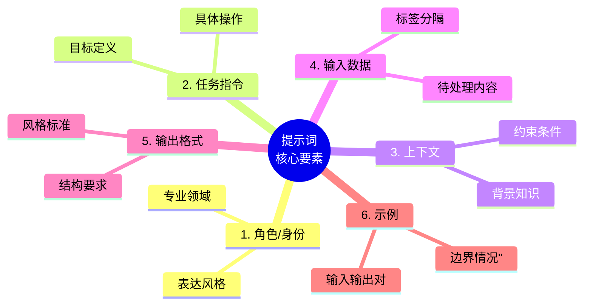

# 第三章 提示词的基本结构

掌握了大语言模型的基础知识后，本章将进入提示词设计的核心内容——如何构建一个结构良好、表达清晰的提示词。就像写作需要遵循一定的结构和规范，提示词设计也有其内在的逻辑和组成要素。

一个有效的提示词不是随意堆砌的文字，而是经过精心组织的信息集合。它需要清晰地传达任务目标、提供必要的上下文、展示期望的输出格式，并在需要时给出示例或约束条件。不同的结构元素相互配合，共同引导模型产出高质量的结果。

本章将系统性地介绍提示词的核心组成要素，探讨各个要素的作用和设计原则，并通过丰富的示例帮助读者理解如何将这些要素有机地整合在一起。

**本章目标**

- 理解本章核心概念与适用场景
- 掌握可复用的提示词/工作流模式
- 能将方法迁移到自己的任务中

## 1. 提示词的核心组成要素

一个结构完整的提示词通常由多个核心要素组成，每个要素承担特定的功能。理解这些要素的作用和组织方式，是设计有效提示词的基础。




<p align="center">图 3-1：提示词的六大核心要素</p>

并非每个提示词都需要包含所有要素，应根据任务复杂度和具体需求灵活选择。

### 1.1 要素一：角色/身份

角色设定告诉模型应该以什么身份、从什么视角来处理任务。

#### 1.1.1 作用

- 设定专业领域和知识范围
- 确定语气和表达风格
- 建立回应的权威性和可信度
- 聚焦于特定视角的分析

#### 1.1.2 设计方法

**基本模式**：

```
你是一位 [专业领域] 的 [具体角色]，拥有 [相关经验/能力]。
```

**示例**：

```
你是一位拥有 15 年经验的资深 Python 开发工程师，熟悉各种设计模式和代码优化技术。

你是一位专注于 B2C 市场的品牌营销顾问，擅长社交媒体策略和内容营销。

你是一位儿童教育专家，能够用生动有趣的方式解释复杂概念。
```

#### 1.1.4 进阶技巧

**复合角色**：

```
你是一位同时具备技术和商业背景的产品经理，能够平衡技术可行性和商业价值来评估产品决策。
```

**视角限定**：

```
你是一位持怀疑态度的审计师，任务是找出这份财务报告中的潜在问题。
```

### 1.2 要素二：任务指令

任务指令是提示词的核心，明确告诉模型需要做什么。

#### 1.2.1 作用

- 定义任务的目标和范围
- 指明需要执行的具体操作
- 设定任务的边界和约束

#### 1.2.2 设计原则

**明确动作**：使用清晰的动词开始指令

```
分析...    总结...    比较...    生成...
解释...    转换...    评估...    设计...
```

**具体化目标**：避免模糊的描述

```
❌ 写一些关于这个产品的内容
✓ 为这款智能手表撰写一段 100 字的产品卖点描述
```

**分步骤表达**：复杂任务拆解为步骤

```
请完成以下任务：
1. 阅读下方的客户反馈
2. 识别提到的主要问题类别
3. 对每个类别计数
4. 按频率从高到低排序输出
```

### 1.3 要素三：上下文

上下文为模型提供完成任务所需的背景信息，帮助模型更好地理解任务环境。

#### 1.3.1 类型

**背景知识**：任务相关的领域知识或事实

```
背景：我们公司是一家成立于 2018 年的教育科技创业公司，主要产品是面向 K12 学生的在线学习平台，目前用户数约 50 万。
```

**约束条件**：限制或规范模型行为的规则

``` markdown
约束：
- 只使用公开可查证的信息
- 不要提及竞争对手的具体名称
- 所有建议须符合 GDPR 合规要求
```

**目标受众**：输出内容的目标读者

```
目标读者：没有技术背景的中小企业主，年龄在 40-55 岁之间
```

#### 1.3.2 设计原则

- **相关性**：只包含与任务直接相关的信息
- **准确性**：确保提供的信息是正确的
- **简洁性**：用最少的词汇传达必要信息
- **结构化**：使用列表或分节组织复杂上下文

### 1.4 要素四：输入数据

输入数据是需要模型处理的具体内容，可以是文本、代码、数据或其他形式。

#### 1.4.1 常见类型

- 待翻译/改写的文本
- 待分析的数据或代码
- 待总结的文档
- 待回答的问题
- 待评估的方案

#### 1.4.2 组织方式

**明确分隔**：使用分隔符区分输入数据

``` markdown
请分析以下客户评论：

---
评论内容：
"产品质量不错，但配送太慢了，等了整整一周才收到。客服态度还可以。"
---
```

**标签标注**：使用标签明确数据范围

```xml
<review>
产品质量不错，但配送太慢了，等了整整一周才收到。客服态度还可以。
</review>
```

**多输入处理**：清晰区分多个输入

```` markdown
请比较以下两段代码的性能差异：

代码 A：
```python
result = [x**2 for x in range(1000)]
```

代码 B：
```python
result = list(map(lambda x: x**2, range(1000)))
```
````

### 1.5 要素五：输出格式

输出格式指定模型回复的结构、形式和风格要求。

#### 1.5.1 常见格式类型

**结构化格式**：

- JSON / XML
- Markdown 表格
- 编号列表
- 层级大纲

**内容格式**：

- 字数/段落限制
- 语气风格（正式/非正式）
- 技术深度（入门/专业）

#### 1.5.2 设计示例

```markdown
输出格式要求：
1. 使用 Markdown 格式
2. 包含一个总结段落（不超过 100 字）
3. 列出 3-5 个要点，每个要点用无序列表
4. 最后提供一个表格对比优缺点
请以 JSON 格式输出，包含以下字段：
{
    "sentiment": "positive/negative/neutral",
    "confidence": 0-1 之间的数值,
    "key_points": ["要点 1", "要点 2", ...]
}
```

### 1.6 要素六：示例

示例通过展示期望的输入输出对，帮助模型理解任务模式。

#### 1.6.1 作用

- 消除指令的歧义
- 展示期望的输出风格
- 引导特定的解决思路
- 设定输出的质量标准

#### 1.6.2 设计原则

- **代表性**：选择能覆盖常见情况的示例 
- **多样性**：包含不同类型或边界情况 
- **清晰性**：示例本身要准确、无歧义 
- **简洁性**：示例应精炼，不包含无关细节

#### 1.6.3 示例格式

``` markdown
示例：

输入：今天天气真好，阳光明媚。
输出：{"sentiment": "positive", "confidence": 0.95}

输入：产品还行，就是价格有点贵。
输出：{"sentiment": "neutral", "confidence": 0.70}

输入：服务态度太差了，再也不来了！
输出：{"sentiment": "negative", "confidence": 0.92}

---
现在请分析以下输入：
输入：虽然等了很久，但是东西质量确实不错。
```

### 1.7 要素组合示例

以下是一个包含所有核心要素的完整提示词示例：

``` markdown
# 角色

你是一位专业的产品评论分析师，擅长从用户评论中提取洞察。

# 任务

分析电商平台的产品评论，提取关键信息并进行情感分类。

# 上下文

- 这是一款新上市的无线蓝牙耳机
- 分析结果将用于产品改进决策
- 需要识别的维度：音质、舒适度、续航、价格

# 输出格式

请以 JSON 格式输出：
{
  "overall_sentiment": "正面/负面/中性",
  "dimensions": {
    "音质": {"sentiment": "...", "comment": "..."},
    "舒适度": {"sentiment": "...", "comment": "..."},
    "续航": {"sentiment": "...", "comment": "..."},
    "价格": {"sentiment": "...", "comment": "..."}
  },
  "improvement_suggestions": ["建议 1", "建议 2"]
}

# 示例

输入：音质很棒，低音很有力，就是戴久了耳朵有点疼。
输出：
{
  "overall_sentiment": "正面",
  "dimensions": {
    "音质": {"sentiment": "正面", "comment": "低音表现好"},
    "舒适度": {"sentiment": "负面", "comment": "长时间佩戴不适"},
    "续航": {"sentiment": "未提及", "comment": ""},
    "价格": {"sentiment": "未提及", "comment": ""}
  },
  "improvement_suggestions": ["优化耳罩材质提升舒适度"]
}

# 待分析评论

"""
买来一个月了，音质确实可以，降噪效果也不错。电量能用一整天没问题。就是价格偏贵，而且蓝牙偶尔会断连。
"""
```

### 1.8  动手试试

1. 拿出你最近写过的一条提示词，用本节的“六大核心要素”逐项检查——缺了哪些要素？补上后效果有变化吗？
2. “角色设定”和“指令”如果互相矛盾（例如角色是“儿童教师”，但指令要求“使用学术论文风格”），模型会怎么处理？

## 2. 指令设计的基本原则

指令是提示词的核心部分，决定了模型需要执行什么任务。一个设计良好的指令可以显著提升模型输出的质量和一致性。本节将介绍指令设计的基本原则和实用技巧。

### 2.1 原则一：清晰明确

清晰的指令是有效提示词的基础。模型不会“猜测”用户的真实意图，它只会按照字面意义理解和执行指令。

#### 2.1.1 避免模糊表达

``` markdown
❌ 模糊指令：
帮我改进一下这段文字。

✓ 明确指令：
请改写以下段落，使其更加简洁，同时保持原意，并确保语法正确。目标字数：减少 20%。
```

### 具体化任务目标

```
❌ 宽泛目标：
写一篇关于人工智能的文章。

✓ 具体目标：
撰写一篇 800 字的科普文章，向普通读者介绍什么是大语言模型、
它的工作原理以及日常生活中的应用场景。
```

#### 2.1.2 明确边界和范围

```
请总结这篇论文的主要贡献，只关注方法论创新部分，
不需要涉及实验细节和相关工作回顾。输出 3-5 个要点。
```

### 2.2 原则二：具体细致

越具体的指令，输出越可控。细节决定了输出的质量和可用性。

#### 2.2.1 指定数量和范围

``` markdown
❌ 无数量约束：
列出一些建议。

✓ 明确数量：
列出 5 条具体可行的改进建议，每条建议包含：
1. 具体措施（一句话）
2. 预期效果（一句话）
3. 实施难度（高/中/低）
```

#### 2.2.2 定义质量标准

``` markdown
请撰写产品描述文案，需满足：
- 情感诉求：激发好奇心和信任感
- 语言风格：专业但不生硬，亲切但不随意
- 必须包含：核心功能、差异化优势、适用人群
- 禁止使用："最好"、"第一"等绝对化用语
```

#### 2.2.3 分解复杂任务

将复杂任务拆解为明确的步骤：

```
请按以下步骤分析这段代码：

第一步：识别代码的主要功能
第二步：列出所有外部依赖
第三步：指出潜在的性能瓶颈
第四步：提供优化建议
第五步：给出优化后的代码示例

每个步骤单独输出，用 ## 标题分隔。
```

### 2.3 原则三：使用行动导向的语言

以明确的动词开始指令，告诉模型需要执行什么操作。

#### 2.3.1 常用指令动词

| 动词类别    | 示例           | 适用场景    |
| ------- | ------------ | ------- |
| **生成类** | 写、创建、生成、设计   | 内容创作    |
| **分析类** | 分析、评估、比较、诊断  | 数据和问题分析 |
| **转换类** | 翻译、转换、改写、简化  | 格式或风格转换 |
| **提取类** | 提取、总结、归纳、识别  | 信息抽取    |
| **组织类** | 分类、排序、整理、结构化 | 信息组织    |
| **解释类** | 解释、说明、阐述、定义  | 知识讲解    |

#### 2.3.2 动词使用示例

```
分析：分析这封客户投诉邮件的核心诉求和情绪倾向。

比较：比较 React 和 Vue 这两个前端框架的优缺点。

转换：将这段技术文档转换为面向产品用户的帮助指南。

提取：从这份合同中提取所有涉及金额的条款。
```

### 2.4 原则四：逻辑顺序

按照合理的逻辑顺序组织指令，帮助模型理解任务流程。

#### 2.4.1 常见的逻辑结构

**时间序列**：

``` markdown
1. 首先，阅读并理解用户需求
2. 然后，分析现有方案的优缺点
3. 接着，提出改进方案
4. 最后，总结实施步骤
```

**层次结构**：

``` markdown
请分析这个业务问题：
- 宏观层面：行业趋势和市场环境
- 中观层面：竞争格局和公司定位
- 微观层面：具体产品和用户反馈
```

**优先级结构**：

``` markdown
评估这个方案，按重要性排序关注：
1. 安全风险（最高优先级）
2. 性能影响
3. 开发成本
4. 用户体验
```

### 2.5 原则五：正向表达

告诉模型“应该做什么”比“不要做什么”更有效。

#### 2.5.1 正向表达的优势

模型更容易理解和遵循正向指令，否定指令可能导致理解偏差。

```
❌ 负向指令：
不要使用复杂的专业术语。
不要写太长。
不要跑题。

✓ 正向指令：
使用通俗易懂的日常语言。
控制篇幅在 200 字以内。
始终围绕产品的核心功能展开。
```

#### 2.5.2 补充否定约束

在必要时，可以将正向指令和否定约束结合使用：

```
请撰写新闻稿：
- 使用客观中立的语气（正向）
- 基于提供的事实进行报道（正向）
- 避免使用夸张或情绪化的形容词（否定，作为补充）
```

### 2.6 原则六：考虑边界情况

预先考虑可能的边界情况和异常场景，在指令中给出处理方式。

#### 2.6.1 处理不确定性

```
分析用户反馈数据。
如果某个类别的样本量少于 5 条，请标注为"样本不足，结论供参考"。
如果反馈内容无法明确分类，请归入"其他"类别并说明原因。
```

#### 2.6.2 处理缺失信息

```
根据提供的信息回答问题。
如果必要信息缺失导致无法给出确定答案，请明确说明需要哪些额外信息。
不要猜测或编造缺失的信息。
```

#### 2.6.3 处理多种可能

```
分析这段代码的 Bug。
如果存在多种可能的原因，请列出所有可能性，并按可能性从高到低排序。
如果代码没有明显问题，请说明"未发现明显 Bug"并提供代码质量评估。
```

### 2.7 原则七：迭代优化

指令设计是一个迭代过程，基于实际输出不断优化。

#### 2.7.1 迭代流程

```
初始指令 → 测试输出 → 识别问题 → 调整指令 → 再次测试 → ...
```

#### 2.7.2 常见优化方向

**输出太简短**：

```
添加：请详细展开，每个要点至少用 2-3 句话说明。
```

**输出太冗长**：

```
添加：保持简洁，直接给出关键信息，总字数不超过 300 字。
```

**格式不一致**：

```
添加：严格按照提供的模板格式输出。
```

**遗漏关键点**：

```
添加：必须涵盖以下方面：[具体列表]
```

### 2.8 实战示例：指令优化过程

**任务**：为一款新的健康 App 撰写应用商店描述

**版本 1：初始指令**

```
写一个 App 描述。
```

问题：太模糊，缺乏关键信息

**版本 2：添加基本信息**

```
为一款健康追踪 App 写应用商店描述。
```

问题：仍不够具体

**版本 3：增加细节和约束**

```
为一款健康追踪 App「HealthyMe」撰写应用商店描述：
- 核心功能：步数追踪、睡眠监测、饮食记录
- 字数：150-200 字
- 包含：功能亮点、适用人群、独特卖点
```

问题：输出还行，但风格不够吸引人

**版本 4：添加风格和格式**

```
为健康追踪 App「HealthyMe」撰写应用商店描述：

功能：
- 步数追踪（GPS 精准记录）
- 睡眠监测（智能分析睡眠质量）
- 饮食记录（扫码快速录入）

目标用户：25-40 岁注重健康的都市白领

写作要求：
1. 开头用一个吸引眼球的短句
2. 用三个 emoji 图标分隔功能介绍
3. 结尾设置行动号召语
4. 总字数 150-200 字
5. 语气亲切积极，激发下载欲望
```

### 2.9 延伸思考

1. 本节建议“一个指令只做一件事”——但现实中你经常需要在一个提示词里完成多件事。你会如何平衡？
2. “正向指令”（做什么）和“负向指令”（不做什么），哪种对模型的引导力更强？试着设计实验来验证。

## 3. 上下文与背景信息的提供

上下文是提示词中容易被忽视但至关重要的组成部分。充分且相关的上下文可以帮助模型更准确地理解任务需求，生成更符合预期的输出。本节将探讨如何有效地构建和提供上下文信息。

### 3.1 上下文的重要性

大语言模型虽然在训练中学习了大量知识，但它并不了解：

- 用户的具体情境和背景
- 任务的特定约束条件
- 输出的最终用途
- 行业或组织的特殊规范

上下文信息填补了这些空白，使模型能够在正确的框架内思考和生成内容。

#### 3.1.1 对比示例

**无上下文**：

```
指令：帮我回复这封邮件。

邮件内容：
"您好，请问你们的产品保修期是多久？"
```

模型可能给出一个通用的、可能不准确的回复。

**有上下文**：

```
上下文：
- 角色：某电子产品公司的客服代表
- 产品线：笔记本电脑（保修 2 年）、配件（保修 1 年）
- 公司政策：保修期从购买日期开始计算，需保留购买凭证
- 沟通风格：专业友好，称呼客户为"客户"而非"亲"

指令：帮我回复这封邮件。

邮件内容：
"您好，请问你们的产品保修期是多久？"
```

模型可以生成准确、专业且符合公司规范的回复。

### 3.2 上下文的类型

#### 3.2.1 背景知识

与任务相关的事实信息、专业知识或规则说明。

```
背景知识：
在中国法律框架下，劳动合同应当具备以下条款：
（一）用人单位的名称、住所和法定代表人或者主要负责人
（二）劳动者的姓名、住址和居民身份证或者其他有效身份证件号码
（三）劳动合同期限
（四）工作内容和工作地点
...

任务：检查这份劳动合同是否符合法律要求。
```

#### 3.2.2 场景描述

说明任务发生的具体情境或环境。

```
场景描述：
这是一家初创公司的首次产品发布会，面对 100 位潜在投资人和合作伙伴。
公司主营业务是企业级 SaaS 解决方案，成立 2 年，已有 50 个付费客户。
CEO 将亲自演讲，时间约 15 分钟。

任务：为这场发布会撰写演讲稿大纲。
```

#### 3.2.3 目标受众

描述输出内容的目标读者或用户。

```
目标受众：
- 年龄：45-60 岁
- 技术背景：基本无编程或 IT 经验
- 需求：了解如何使用智能手机的基本功能
- 阅读习惯：偏好简短、步骤清晰的说明

任务：编写一份智能手机使用指南。
```

#### 3.2.4 约束条件

限制模型输出的规则或边界。

```
约束条件：
- 所有数据须来源于 2023 年之后的公开报告
- 不得使用任何未经验证的第三方估算
- 涉及竞争对手时使用中性表述
- 符合公司品牌指南要求

任务：撰写行业分析报告。
```

#### 3.2.5 参考材料

可供模型参考的文档、数据或示例。

```
参考材料：
以下是公司过去三封成功的销售邮件模板：

[模板 1]
主题：...
正文：...

[模板 2]
主题：...
正文：...

任务：参考这些模板的风格，为新产品撰写一封销售邮件。
```

### 3.3 上下文组织的最佳实践

#### 3.3.1 使用清晰的分隔和标签

```markdown
## 背景信息

[背景内容]

## 任务要求

[具体任务]

## 待处理内容

[输入数据]
```

或使用 XML 标签（特别适合 Claude）：

```xml
<context>
公司背景和业务介绍...
</context>

<constraints>
必须遵守的规则...
</constraints>

<task>
需要完成的任务...
</task>
```

#### 3.3.2 信息分层组织

先提供最重要、最相关的信息，次要信息放在后面：

```
核心上下文：[最关键的信息，必须理解]

补充上下文：[有帮助但非必需的信息]

参考资料：[可选参考的材料]
```

#### 3.3.3 简洁不冗余

只包含必要信息，避免信息过载：

```
❌ 冗余上下文：
我是一家公司的员工。这家公司成立于 2010 年，总部在北京，
有约 500 名员工，业务覆盖全国主要城市。我们的 CEO 是张三，
他是北大毕业的，之前在某大公司工作过。公司去年收入约
2 亿元人民币...（继续大段无关信息）

任务：帮我写一封请假邮件。

✓ 精炼上下文：
角色：公司员工
请假原因：家中有事需处理
请假时间：明天（周三）一天
请假审批人：直属经理李四

任务：写一封简短正式的请假邮件。
```

### 3.4 上下文来源策略

#### 3.4.1 手动编写

适用于固定场景的系统提示词，内容来自人工整理的知识。

优点：质量可控、针对性强 缺点：维护成本高、更新不及时

#### 3.4.2 检索增强

从知识库或文档中动态检索相关信息注入上下文。

```
[系统自动检索的相关文档片段]

---
基于以上参考资料，请回答用户问题：
{用户问题}
```

优点：信息时效性好、覆盖面广 缺点：依赖检索质量、可能引入噪音

#### 3.4.3 用户输入

从用户交互中收集必要的上下文信息。

```
在处理用户请求之前，模型需要询问：
1. 请问您的具体使用场景是什么？
2. 您希望输出的大致长度和格式是怎样的？
3. 是否有任何特殊要求或限制？
```

优点：高度个性化 缺点：增加用户负担

### 3.5 上下文的动态管理

在多轮对话或复杂任务中，上下文需要动态管理。

#### 3.5.1 关键信息持久化

某些重要信息应在整个会话中保持：

```
[固定上下文 - 始终存在]
用户偏好：简洁回答，技术导向

[动态上下文 - 根据对话更新]
当前讨论话题：数据库索引优化
用户的数据库类型：MySQL 8.0
表数据量：约 1000 万行
```

#### 3.5.2 上下文刷新策略

当对话主题发生重大变化时，适当刷新上下文：

```
检测到话题从"产品功能咨询"转变为"投诉处理"，
切换相应的上下文模板和回复策略。
```

### 3.6 常见问题与解决方案

#### 问题 1：上下文太长

**症状**：超出上下文窗口限制，或模型注意力稀释

**解决方案**：

* 压缩和摘要：提炼核心信息
* 分块处理：将任务拆分为多个步骤
* 优先级排序：保留最相关的信息

### 问题 2：上下文冲突

**症状**：上下文中包含相互矛盾的信息

**解决方案**：

* 明确优先级：指定冲突时应遵循的规则
* 清理数据：确保上下文来源一致
* 显式处理：要求模型识别并说明冲突

```
如果提供的参考资料与背景规则有冲突，请优先遵循背景规则，
并在回复中说明发现的冲突点。
```

#### 问题 3：上下文被忽略

**症状**：模型输出未反映提供的上下文

**解决方案**：

* 强调关键信息：使用加粗或单独提及
* 调整位置：将重要信息放在开头或结尾
* 明确引用要求：指示模型必须使用特定信息

```
重要提示：回答必须引用以下产品规格数据，不得使用其他来源的参数。
```

### 3.7 思考

1. 提供过多的背景信息是否反而会降低输出质量？你认为“信息量”和“信噪比”之间的最佳平衡点在哪里？
2. 如果背景信息本身包含错误，模型是会纠正还是会忠实地使用这些错误信息？这对你的提示词设计意味着什么？

## 4. 输出格式的定义与约束

输出格式的明确定义是提示词工程的重要环节。清晰的格式约束不仅使输出更易于使用和解析，还能提高输出的一致性和可预测性。本节将介绍如何有效地定义和约束模型的输出格式。

### 4.1 为什么输出格式很重要

#### 4.1.1 提高可用性

结构化的输出可以直接用于后续处理：

```
非结构化输出：
这款产品评价不错，用户普遍反馈质量好，价格合理，
物流快速，但也有少数人提到包装简陋。

结构化输出：
{
  "overall_rating": 4.2,
  "positive_aspects": ["质量好", "价格合理", "物流快速"],
  "negative_aspects": ["包装简陋"],
  "recommendation": true
}
```

#### 4.1.2 确保一致性

格式约束使多次调用产生一致的输出结构，便于批量处理和比较。

#### 4.1.3 便于集成

API 调用场景中，结构化输出可以被程序直接解析和使用。

### 4.2 常见输出格式类型

#### 4.2.1 JSON 格式

最常用的结构化输出格式，便于程序解析。

```
请以 JSON 格式输出分析结果：
{
  "category": "产品类别",
  "sentiment": "positive/negative/neutral",
  "score": 0-10 的数值,
  "keywords": ["关键词列表"],
  "summary": "一句话总结"
}
```

**使用技巧**：

- 提供完整的 JSON 模板示例
- 明确每个字段的含义和取值范围
- 说明是否允许空值或可选字段

```
输出格式要求：
以有效的 JSON 格式输出，请确保：
- 所有字符串使用双引号
- 数值类型不使用引号
- 数组可以为空但不能省略
- 字段名使用 snake_case 命名
```

#### 4.2.2 Markdown 格式

适合生成文档、报告等需要阅读的内容。

``` markdown
请使用以下 Markdown 格式输出：

# 主标题

## 1. 第一部分

[内容]

## 2. 第二部分

- 要点一
- 要点二
- 要点三

## 3. 总结

[总结段落]

| 列 1 | 列 2 | 列 3 |
|-----|-----|-----|
| 数据 | 数据 | 数据 |
```

#### 4.2.3 表格格式

适合对比和罗列信息。

```
请以表格形式输出，包含以下列：
| 功能名称 | 描述 | 优先级(P0-P3) | 预计工时 |
```

使用 Markdown 表格或 CSV 格式都可以：

```
CSV 格式输出：
功能名称,描述,优先级,预计工时
"用户登录","支持邮箱和手机号登录",P0,3 天
...
```

#### 4.2.4 列表格式

适合罗列要点、步骤等。

```
请以编号列表形式输出实施步骤，每个步骤包含：
1. **步骤名称**
   - 具体操作
   - 预期结果
   - 注意事项
```

#### 4.2.5 XML 格式

适合层级结构复杂的数据。

```html
请以 XML 格式输出：
<analysis>
  <summary>总结内容</summary>
  <findings>
    <finding priority="high">发现 1</finding>
    <finding priority="medium">发现 2</finding>
  </findings>
  <recommendations>
    <item>建议 1</item>
    <item>建议 2</item>
  </recommendations>
</analysis>
```

### 4.3 格式约束的设计方法

#### 4.3.1 明确结构模板

提供具体的模板，而非抽象的描述：

```
❌ 抽象描述：
输出一个包含标题、正文和结论的报告。

✓ 具体模板：
请按以下模板格式输出报告：

---
标题：[简洁的标题，不超过 15 字]

摘要：
[100 字以内的核心观点概述]

正文：
[200-300 字的详细分析]

结论与建议：
1. [第一条建议]
2. [第二条建议]
---
```

#### 4.3.2 指定长度限制

对各部分的长度设置明确的约束：

``` markdown
输出要求：
- 标题：10 字以内
- 导语：50 字以内
- 正文：每段 100-150 字，共 3 段
- 结语：30 字以内
- 总字数控制在 500 字左右
```

#### 4.3.3 定义取值范围

对于特定字段，明确允许的取值：

```
输出字段说明：
- priority: 只能是 "high", "medium", "low" 之一
- score: 1-5 的整数
- status: "pending", "approved", "rejected" 之一
- date: 格式为 YYYY-MM-DD
```

### 4.4 高级格式控制技巧

#### 4.4.1 预填充技术

!!! warning "兼容性提示"
    
    Prefill 已在 Claude Fable 5、Mythos 5、Mythos Preview、Claude Opus 4.8、Opus 4.7、Opus 4.6、Sonnet 5、Sonnet 4.6 上停止支持，使用会返回 400 错误（详见 13.2 节）。Anthropic 官方 Messages 示例仍使用 Claude Sonnet 4.5 展示 prefill；新项目若目标模型支持 Structured Outputs，优先使用 Structured Outputs、System Prompt 控制或 `output_config.format`。

通过预填充回复的开头来强制输出格式（特别适用于 Claude）：

````
用户：分析这段文本的情感倾向。
助手：```json
{"sentiment":
````

通过预填充 JSON 开头，引导模型继续以 JSON 格式输出。

#### 4.4.2 格式验证提示

要求模型输出后进行自我验证：

```
请以 JSON 格式输出结果。
输出后，检查 JSON 是否有效，如果发现格式错误，请修正后重新输出。
```

#### 4.4.3 结构化思维与输出分离

区分思考过程和最终输出：

```
处理方式：
1. 在 <thinking> 标签内进行分析思考
2. 在 <output> 标签内提供最终结果

最终结果必须是有效的 JSON，不包含任何解释性文字。

请开始处理：
```

### 4.5 特殊格式需求

#### 4.5.1 代码输出

指定编程语言和代码块格式：

```` markdown
请输出 Python 代码，要求：
- 使用 ```python 代码块包裹
- 包含必要的注释
- 符合 PEP 8 规范
- 包含使用示例

示例格式：
```python
def example_function(param: str) -> dict:
    """
    函数说明

    Args:
        param: 参数说明

    Returns:
        返回值说明
    """

    # 实现代码

    pass

# 使用示例

result = example_function("test")
```
````

#### 4.5.2 多部分输出

当需要多个输出部分时，清晰分隔：

```
请输出以下三个部分，用 === 分隔：

第一部分：摘要（50 字以内）
===
第二部分：详细分析（200 字）
===
第三部分： JSON 格式的结构化数据
```

#### 4.5.3 条件格式

根据不同情况使用不同格式：

``` markdown
输出格式要求：
- 如果找到匹配结果：输出 JSON 格式的详细信息
- 如果未找到结果：输出 “未找到匹配项：” + 原因说明
- 如果发生错误：输出 “处理错误：” + 错误描述
```

### 4.6 格式一致性保障与检查清单

#### 4.6.1 使用示例强化

提供完整的输出示例：

```
输入示例：
“这个产品太贵了，质量还行”

期望输出：
{
  “text”: “这个产品太贵了，质量还行”,
  "aspects": [
    {“aspect”: “价格”, “sentiment”: “negative”},
    {“aspect”: “质量”, “sentiment”: “positive”}
  ],
  "overall": "mixed"
}

现在请处理以下输入：
“送货很快，包装也完好”
```

### 4.6.2 格式检查清单

在提示词末尾添加检查提醒：

```
输出前请确认：
□ JSON 格式有效，可以被解析
□ 所有必填字段都已包含
□ 数值在规定范围内
□ 不包含额外的解释性文字
```

### 4.7 常见问题处理

#### 问题 1：输出包含多余内容

```
问题：模型在 JSON 前后添加解释文字
解决：
明确要求：只输出 JSON ，不要包含任何其他文字、解释或代码块标记。
或使用预填充技术。
```

#### 问题 2：格式不完全符合要求

```
问题：输出的 JSON 字段名与要求不一致
解决：
提供精确的模板，强调字段名必须完全一致：
“字段名必须严格按照示例，包括大小写”
```

#### 问题 3：嵌套结构错误

```
问题：复杂的嵌套 JSON 结构容易出错
解决：
1. 简化结构设计
2. 分步骤生成复杂结构
3. 提供完整的正确示例
```

### 4.8 想一想

1. JSON 和 Markdown 是两种常见的输出格式。在什么场景下你会选择一种而非另一种？
2. 如果你要求模型输出严格格式（如 JSON Schema），但模型偶尔不遵守，你有哪些应对手段？

## 5. 结构化输出的定义与约束

在生产环境中，大语言模型往往不只是作为一个“聊天机器人”存在，而是作为数据处理流水线中的一个节点。为了让下游程序能够解析模型的输出，我们需要模型返回严格的结构化数据（如 JSON、XML 或 YAML），而不是自由格式的自然语言文本。

本节将深入探讨如何通过提示词设计，稳定地获取结构化输出。

### 5.1 主流结构化格式对比

不同格式在解析友好度、Token 消耗和模型适配性上有所差异：

| 格式           | 优点                            | 缺点                        | 适用场景                       |
| ------------ | ----------------------------- | ------------------------- | -------------------------- |
| **JSON**     | 生态最完善，几乎所有语言原生支持；OpenAI 有特殊优化 | 括号和引号占用较多 Token；对人类阅读略不友好 | **API 交互、数据抽取的主力格式**       |
| **XML**      | 结构清晰；Claude 模型原生偏好            | 闭合标签占用大量 Token            | **Claude 模型** 任务；长文本分块处理   |
| **YAML**     | Token 消耗最少（免去大量括号大括号）；人类可读性极佳 | 强依赖缩进，模型偶尔会缩进错误导致解析失败     | 配置生成；复杂层级但不要求 100% 稳定解析的场景 |
| **Markdown** | 最自然的输出方式，几乎不会翻车               | 解析成结构化数据较复杂（需要正则或专用解析器）   | 表格生成；直接面向最终展示的报告           |

### 5.2 JSON 模式的提示词设计

强制模型输出真实的 JSON 数据，通常需要遵循以下三步法：

#### 5.2.1 明确的输出指令

在系统提示词或指令开头，必须非常坚定地说明输出格式。

````
❌ 错误示范：
请将结果输出为 JSON。
（模型可能回复："好的，以下是为您生成的 JSON：\n```json\n..."，这包含了多余的自然语言文本。）

✅ 正确示范：
你是一个数据提取 API。请严格以 JSON 格式输出结果。
你的输出必须是合法的、可解析的单一 JSON 对象，不要包含任何自然语言解释，也不要包含 Markdown 代码块标记（如 ```json）。
````

#### 5.2.2 提供 JSON Schema（模式定义）

通过提供目标 JSON 的结构定义，可以大幅度降低字段遗漏或类型错误的概率。

```jsonc
输出 JSON 必须严格遵循以下结构：
{
  "user_intent": "提取的用户意图（字符串）",
  "confidence_score": 0.95, // 置信度评分（0-1 之间的浮点数）
  "extracted_entities": [
    {
      "entity_type": "实体类型：'PERSON', 'LOCATION', 'DATE'",
      "entity_value": "实体具体内容（字符串）"
    }
  ]
}
```

#### 5.2.3 容错与逃生通道

考虑到模型可能遇到无法处理的情况，必须在 JSON 结构中设计“逃生通道”，避免模型强行捏造数据。

```jsonc
{
  "success": true,               // 处理是否成功
  "error_message": null,         // 如果失败，简要说明原因
  "data": { ... }                // 实际的数据载荷
}
```

### 5.3 各平台的结构化输出特性

主流模型厂商为了提高结构化输出的稳定性，在 API 层面提供了专属支持：

#### 5.3.1 OpenAI 结构化输出

OpenAI 在 Responses API 上通过 `text.format` 提供结构化输出，在旧的 Chat Completions API 上则是 `response_format` 参数。当设置为 `json_schema` 并启用严格 Schema 时，API 会在普通成功回答中约束输出匹配 Schema；但仍要处理拒绝回答、内容截断、工具调用分支、API 错误和模型升级导致的边界差异。生产系统应继续在服务边界做 JSON Schema 校验，并为失败路径设计重试或降级。 *（注：详见 13.1 OpenAI GPT 系列最佳实践）*

#### 5.2.4 Anthropic Claude 与 XML

Claude 在大规模训练时使用了广泛的 XML 标签。因此在使用 Claude 时，用 `<xml-tag>` 来包裹指令和限定输出格式会得到超出预期的效果。

```xml
<instruction>
请分析下面文本的情感，并将结果放入 <sentiment> 标签中，原因放入 <reason> 标签中。
</instruction>

<text>
这件衣服质量太棒了，虽然由于下雪晚到了两天，但完全值得等待！
</text>
```

#### 5.2.5 Gemini 与 JSON 约束

Google Gemini 的 API 同样支持传递 JSON Schema 来限定输出格式（`responseMimeType: "application/json"`）。对长文本提取，Gemini 的长上下文窗口结合 JSON 约束非常强悍。

### 5.4 解析错误处理策略

即使提示词设计得再好，普通的 API 调用（未使用强制 Schema 的情况）依然有千分之一的概率输出损坏的格式。在工程实现时，你需要：

1. **自动清理**：使用正则剥离模型可能产生的多余前缀/后缀（例如去除开头结尾的 Markdown 代码块标记）。
2. **多重重试机制**：如果解析（如 `json.loads`）失败，触发重试。
3. **反射纠错**：将报错信息重新发给 LLM：“你刚才输出的 JSON 在第 14 行缺少逗号导致了解析失败，请修复并重新发送。”

### 5.4 思考

1. 在你的项目中，如果 LLM 未能返回合法的 JSON，你会如何优雅地降级处理？
2. 对比 JSON 和 XML，试着将本节 3.5.2 中的 JSON Schema 转换为针对 Claude 模型优化的 XML 格式约束提示词。

## 6. 本章小结

本章系统性地介绍了提示词的基本结构，涵盖核心组成要素、指令设计原则、上下文构建和输出格式定义。以下是本章的核心要点回顾：

### 6.1 关键概念

- **提示词结构**：由角色、指令、上下文、输入、格式、示例六大要素组成
- **指令设计**：遵循清晰、具体、行动导向、正向表达等原则
- **上下文**：为模型提供背景知识、约束条件和参考材料
- **输出格式**：通过模板和约束控制输出的结构和形式

### 6.2 核心要点

1. **六大核心要素**

    | 要素  | 功能        | 设计要点       |
    | --- | --------- | ---------- |
    | 角色  | 设定专业视角和风格 | 明确专业领域和经验  |
    | 指令  | 定义任务目标    | 使用行动动词，具体化 |
    | 上下文 | 提供背景信息    | 相关、简洁、结构化  |
    | 输入  | 待处理的内容    | 清晰分隔，标签标注  |
    | 格式  | 规范输出形式    | 提供模板，明确约束  |
    | 示例  | 展示期望模式    | 代表性、多样性    |

2. **指令设计七大原则**
    - 清晰明确：避免模糊表达
    - 具体细致：指定数量、质量标准
    - 行动导向：使用明确的动词
    - 逻辑顺序：按合理结构组织
    - 正向表达：告诉模型“做什么”
    - 边界考虑：处理异常情况
    - 迭代优化：持续测试改进

3. **上下文管理**
    - 类型：背景知识、场景描述、目标受众、约束条件、参考材料
    - 组织：使用标签分隔，分层呈现
    - 原则：相关、简洁、不冲突

4. **输出格式控制**
    - 常用格式：JSON、Markdown、表格、列表
    - 控制方法：模板示例、长度限制、取值范围
    - 高级技巧：预填充、格式验证

5. **结构化输出**
    - 格式对比：JSON、XML、YAML 的适用场景
    - JSON 模式：清晰指令、提供 Schema、设计逃生通道
    - 平台特性：OpenAI Structured Outputs、Claude XML、Gemini JSON
    - 容错策略：自动清理、多重重试、反射纠错

#### 6.2.1 提示词结构模板

```markdown
# 角色定义

[模型应扮演的角色和具备的能力]

# 任务背景

[任务的上下文和相关信息]

# 具体任务

[清晰的任务指令和要求]

# 约束条件

[必须遵守的规则和限制]

# 输出格式

[期望的输出结构和形式]

# 示例（可选）

[输入输出示例]

# 待处理内容

[实际输入数据]
```

#### 6.2.2 实践检查清单

设计提示词时，可以使用以下清单自检：

- [ ] 角色设定是否有助于任务完成？
- [ ] 指令是否清晰、具体、无歧义？
- [ ] 是否提供了必要的上下文信息？
- [ ] 输入数据是否已清晰标识？
- [ ] 输出格式是否明确定义？
- [ ] 是否需要添加示例来消除歧义？
- [ ] 是否考虑了边界情况的处理？
- [ ] 提示词长度是否在合理范围内？

#### 6.2.3 延伸阅读

**核心要素**

- [OpenAI Prompt Engineering Guide](https://developers.openai.com/api/docs/guides/prompt-engineering) - OpenAI 官方提示词指南
- [Anthropic Prompt Design](https://platform.claude.com/docs/en/build-with-claude/prompt-engineering/claude-prompting-best-practices#general-principles) - Claude 提示词结构指南
- [Google Prompt Design Strategies](https://ai.google.dev/gemini-api/docs/prompting-strategies) - Gemini 提示词策略

**指令设计**

- [Tactic: Include Details](https://developers.openai.com/api/docs/guides/prompt-engineering) - OpenAI 具体化指令技巧
- [Give Claude a Role](https://platform.claude.com/docs/en/build-with-claude/prompt-engineering/claude-prompting-best-practices#give-claude-a-role) - Anthropic 角色设定指南

**上下文**

- [Provide Reference Text](https://developers.openai.com/api/docs/guides/prompt-engineering) - OpenAI 提供参考文本技巧
- [Use XML Tags](https://platform.claude.com/docs/en/build-with-claude/prompt-engineering/claude-prompting-best-practices#structure-prompts-with-xml-tags) - Anthropic XML 标签使用指南
- [Long Context Best Practices](https://platform.claude.com/docs/en/build-with-claude/prompt-engineering/claude-prompting-best-practices#long-context-prompting) - Claude 长上下文技巧

**输出格式**

- [Control Output Format](https://platform.claude.com/docs/en/build-with-claude/prompt-engineering/claude-prompting-best-practices#control-the-format-of-responses) - Anthropic 输出格式控制
- [Structured Outputs](https://developers.openai.com/api/docs/guides/structured-outputs) - OpenAI 结构化输出指南
- [JSON Mode](https://developers.openai.com/api/docs/guides/structured-outputs#json-mode) - OpenAI JSON 模式
