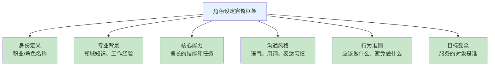

# 第四章 提示词设计最佳实践

掌握了提示词的基本结构后，本章将深入探讨一系列经过验证的最佳实践，这些实践源自主流 AI 厂商的官方指南、研究者的实验发现以及从业者的实战经验。

最佳实践不是死板的规则，而是在大量试错和优化中总结出的有效模式。它们帮助提示词设计者避开常见的陷阱，更快地达到期望的效果。同时，这些实践也需要根据具体任务和模型特点灵活调整。

本章将从清晰性原则、结构化技巧、角色设定和迭代优化四个维度，系统性地介绍提示词设计的实用方法。

**本章目标**

- 理解本章核心概念与适用场景
- 掌握可复用的提示词/工作流模式
- 能将方法迁移到自己的任务中

## 1. 清晰性与具体性原则

清晰性和具体性是有效提示词的两大基石。模型不会“猜测”用户的真实意图，也不会“补全”缺失的信息，它只会按照提示词的字面含义去理解和执行。因此，提示词的表达越清晰、越具体，输出就越接近预期。

### 1.1 清晰性原则

#### 1.1.1 使用简单直接的语言

避免复杂的句式和晦涩的表达，使用模型最容易理解的语言方式。

```
❌ 复杂表达：
如果可能的话，能否请你考虑一下，基于下面的内容，
尝试给出一些你认为可能有帮助的建议，当然如果你觉得不合适也没关系。

✓ 简单表达：
请基于以下内容，提供 3-5 条具体的改进建议。
```

#### 1.1.2 避免歧义

确保每个词语和句子只有一种理解方式。

```
❌ 有歧义：
把这篇文章改短一点。
（"短一点"是减少 10%还是 50%？）

✓ 无歧义：
将这篇文章压缩至原长度的 50%左右，保留核心论点。
❌ 有歧义：
分析一下最近的数据。
（"最近"是今天？本周？本月？）

✓ 无歧义：
分析 2026 年 1 月 1 日至 1 月 10 日期间的销售数据。
```

#### 1.1.2 明确主语和对象

清楚地说明“谁”对“什么”做“什么操作”。

```
❌ 主语不明：
需要翻译并校对。
（谁来翻译？翻译什么？）

✓ 主语明确：
请将以下中文段落翻译成英文，翻译后自行校对一遍，
确保语法正确、表达地道。
```

### 1.2 具体性原则

#### 1.2.1 量化要求

将模糊的要求转化为可量化的指标。

```
模糊 → 具体：
"写长一点" → "至少 500 字"
"几个例子" → "3-5 个例子"
"尽快完成" → "在 5 个步骤内完成"
"简化表达" → "控制在 50 字以内"
```

#### 1.2.2 定义标准

明确什么样的输出是“好的”。

```
模糊 → 具体：

❌ 写一篇高质量的文章。

✓ 写一篇文章，需满足：
   - 结构清晰：引言、正文（3-4 段）、结论
   - 论据充分：每个论点至少有一个具体案例支撑
   - 语言规范：无语法错误，用词专业但不晦涩
   - 字数要求：800-1000 字
```

#### 1.2.3 说明原因和目的

告诉模型“为什么”需要这样做，有助于生成更有针对性的内容。

```
无目的说明：
写一段产品介绍。

有目的说明：
写一段产品介绍，用于应用商店的产品描述页面。
目标是吸引用户下载，所以需要突出核心功能和差异化优势，
语言要简洁有吸引力。
```

### 1.3 清晰性与简洁性的平衡

清晰不等于冗长。理想的提示词应该在保持清晰的同时尽量简洁。

#### 1.3.1 剔除无关信息

```
❌ 冗余信息：
我是一个对人工智能很感兴趣的人，最近在学习相关知识。
我听说大语言模型很厉害，想了解更多。
另外我英语不太好，所以希望用中文。
今天天气不错。
请解释什么是 Transformer。

✓ 精炼表达：
请用通俗的中文解释 Transformer 架构的核心原理，面向 AI 初学者。
```

#### 1.3.2 使用简洁的结构

用列表代替长句，用标签代替说明性文字。

```
❌ 长句表达：
我希望你能先分析问题，然后提出解决方案，
接着评估每个方案的可行性，最后给出你的推荐。

✓ 结构化表达：
请按以下步骤处理：
1. 问题分析
2. 方案列举（至少 3 个）
3. 可行性评估
4. 最终推荐
```

### 1.4 实用技巧

#### 技巧 1：首句点题

在提示词开头直接点明核心任务。

```
✓ 首句点题：
为一款儿童教育 App 撰写应用商店描述。

该 App 的核心功能是...
目标用户是...
请包含以下内容：...
```

#### 技巧 2：使用“必须”和“不要”强调约束

```
必须包含：产品的三个核心功能
必须遵循：公司品牌调性指南
不要包含：竞争对手的任何提及
不要使用："最好"、"第一"等绝对化表述
```

#### 技巧 3：提供反面示例

展示不期望的输出，帮助模型理解边界。

```
期望的输出风格：
"这款智能手表可以连续监测 14 天的睡眠数据。"

不期望的风格（避免）：
"这款超级无敌厉害的智能手表能疯狂监测你的睡眠！！！"
```

#### 技巧 4：拆分复杂描述

将复杂的要求拆分为易理解的小块。

```
❌ 一长段复杂要求：
写一篇关于气候变化的科普文章，要面向普通读者但也不能太浅，
需要引用一些数据但不要太多专业术语，结构要清晰，
开头要吸引人，结尾要有行动号召，字数大概 1000 字左右。

✓ 拆分后的表达：
任务：撰写气候变化科普文章

目标读者：
- 普通公众，高中以上教育水平
- 对环境话题感兴趣但非专业人士

内容要求：
- 引用 3-5 个具体数据
- 解释专业术语时提供通俗对照
- 包含 1-2 个生活化的例子

结构要求：
- 开头：用引人入胜的问题或场景切入
- 正文：3-4 个逻辑清晰的段落
- 结尾：提供 2-3 个个人可采取的行动

字数：1000±100 字
```

### 1.5 检查清单

完成提示词设计后，用以下问题自检清晰性和具体性：

**清晰性检查**：

- [ ] 每个句子是否只有一种理解方式？
- [ ] 是否使用了简单直接的语言？
- [ ] 核心任务是否在前 3 句内明确？
- [ ] 是否去除了无关的信息？

**具体性检查**：

- [ ] 数量要求是否已量化？
- [ ] 质量标准是否已定义？
- [ ] 输出格式是否已指定？
- [ ] 目标用途是否已说明？

### 1.6 动手试试

1. 用本节的检查清单审查你最近写的一条提示词，哪些方面可以改进？改进后实际运行对比一下效果。
2. “清晰”和“简洁”有时互相矛盾——你在实际工作中倾向于牺牲哪一方？为什么？

## 2. 分隔符与结构化表达

分隔符和结构化表达是提高提示词可读性和有效性的重要技巧。它们帮助模型更准确地区分指令、上下文、输入数据等不同部分，减少理解偏差。

### 2.1 分隔符的作用

分隔符像是提示词中的“标点符号”，用于：

- 明确区分不同类型的内容
- 防止用户输入与指令混淆
- 提高复杂提示词的可读性
- 便于模型识别输入数据的边界

### 2.2 常用分隔符类型

#### 2.2.1 三引号和反引号

适用于包裹需要处理的文本内容。

```` markdown
请总结以下文章的主要观点：

"""
这里是需要总结的文章内容...
文章可能包含多个段落...
"""
请检查以下代码的语法错误：

```python
def hello_world()
    print("Hello, World!")
```
````

#### 2.2.2 XML/HTML 标签

结构化程度最高，特别适合 Claude 模型。

```xml
<system_context>
你是一位专业的技术文档编写人员。
</system_context>

<task>
将以下技术规格转换为用户友好的产品描述。
</task>

<input>
处理器：M3 芯片，8 核 CPU
内存：16GB 统一内存
存储：512GB SSD
</input>

<output_requirements>
- 面向普通消费者
- 强调实际使用价值
- 150-200 字
</output_requirements>
```

#### 2.2.3 Markdown 标题和分隔线

使用 Markdown 格式增强可读性。

```markdown
# 任务说明

请完成客户反馈分析。

---

## 背景信息

这是一款面向年轻用户的社交 App，上线 3 个月。

---

## 待分析数据

以下是最近一周的用户评论：
[评论内容]

---

## 输出要求

请以表格形式总结主要问题类别。
```

#### 2.2.4 符号分隔符

使用特殊符号序列作为分隔。

```
任务：翻译并润色以下内容

###

待翻译内容：
大语言模型是一种...

###

===输出格式===
1. 直译版本
2. 润色版本
==================
```

### 2.3 选择分隔符的原则

#### 2.3.1 避免与内容冲突

选择在待处理内容中不太可能出现的分隔符。

````
❌ 可能冲突：
如果输入内容包含代码，使用 ``` 作为分隔符可能导致混淆

✓ 避免冲突：
使用 <<CODE>> ... <</CODE>> 或其他不常见的标记
````

### 保持一致性

在同一个提示词或提示词系统中保持分隔符风格一致。

```
❌ 不一致：
"""文本 1"""
<text>文本 2</text>
###文本 3###

✓ 一致：
<text>文本 1</text>
<text>文本 2</text>
<text>文本 3</text>
```

#### 2.3.2 匹配模型偏好

不同模型对不同格式的响应可能不同：

* **Claude**：对 XML 标签响应特别好
* **GPT**：对 Markdown 和三引号响应良好
* **通用**：三引号 `"""` 是较安全的选择

### 2.4 结构化表达技术

#### 2.4.1 分节组织

将提示词按逻辑分成清晰的小节。

``` markdown
## 1. 角色设定

你是一位资深的用户体验设计顾问。

## 2. 任务描述

评估一款移动 App 的用户界面设计。

## 3. 评估维度

- 可用性
- 一致性
- 美观性
- 可访问性

## 4. 输出格式

每个维度给出 1-10 分评分，并附简短说明。

## 5. 待评估内容

[App 截图或描述]
```

#### 2.4.2 表格呈现

用表格组织成对或多维度的信息。

```markdown
请根据以下对照表翻译术语：

| 英文 | 中文翻译 | 说明 |
|------|----------|------|
| Prompt | 提示词 | AI 输入 |
| Token | Token/令牌 | 保留英文或翻译 |
| Fine-tuning | 微调 | 技术术语 |

待翻译内容：
"The prompt engineering process involves..."
```

#### 2.4.3 编号列表

为步骤或选项使用编号，便于模型和用户理解顺序。

```
请按以下步骤处理用户请求：

1. 识别用户意图
    - 判断是询问、投诉还是建议

2. 提取关键信息
    - 涉及的产品或服务
    - 具体问题描述

3. 生成回复
    - 针对性解答
    - 提供后续行动建议

4. 格式化输出
    - 使用规定的回复模板
```

#### 2.4.4 层级缩进

用缩进表示信息的层级关系。

```
输出结构要求：
报告标题
├── 1. 执行摘要
│   ├── 背景
│   └── 主要发现
├── 2. 详细分析
│   ├── 2.1 数据概览
│   ├── 2.2 趋势分析
│   └── 2.3 异常识别
└── 3. 建议与下一步
    ├── 短期建议
    └── 长期建议
```

### 2.5 实战案例：提示词结构化改造

**改造前（非结构化）**：

```
我需要你帮我分析一份客户反馈，这是一份电商平台的评论数据，
主要是关于我们的蓝牙耳机产品的，我想知道用户主要关心什么，
有哪些好评点和差评点，另外能不能给我一些改进建议，
对了输出最好用中文，格式整齐一点。评论内容如下：...
```

**改造后（结构化）**：

``` markdown
# 任务：电商产品评论分析

## 产品信息

- 类别：蓝牙耳机
- 平台：电商平台
- 数据类型：用户评论

## 分析维度

1. 用户关注点分布
2. 好评关键词及频率
3. 差评问题分类
4. 改进建议（优先级排序）

## 输出要求

- 语言：中文
- 格式：结构化分节输出
- 每个维度单独一节
- 使用列表和表格提高可读性

## 待分析评论

"""
[评论内容]
"""
```

### 2.6 安全性考虑

结构化分隔也有助于防止提示词注入攻击。

```
系统指令（用户不可见）：
你是一个客服助手。只回答与产品相关的问题。

---用户输入开始---
{user_input}
---用户输入结束---

请根据系统指令处理上述用户输入。
```

通过明确标记用户输入的边界，模型更容易区分指令和输入，减少恶意输入影响系统行为的风险。

### 2.7 常见问题处理

#### 问题 1：分隔符被模型输出

有时模型会在回复中重复分隔符。

**解决方案**：

```
输出要求：不要在回复中包含分隔符或标签。只输出分析结果本身。
```

#### 问题 2：嵌套结构过于复杂

**解决方案**：

- 简化层级，控制在 3 层以内
- 使用扁平化结构加上明确的编号
- 拆分为多个提示词处理

#### 问题 3：分隔符在不同模型表现不同

**解决方案**：

* 测试并记录不同模型的偏好
* 建立模型-分隔符对照表
* 在代码中使用可配置的分隔符

### 2.8 想一想

1. XML 标签、Markdown 标记、三引号——这些分隔符各自最适合什么场景？有没有你混用过导致混乱的经历？
2. 当提示词本身需要包含分隔符字符时（例如要求模型输出 XML），你如何避免歧义？

## 3. 角色设定与人格赋予

角色设定是提示词工程中的一项强大技术，通过为模型定义特定的身份、专业背景和行为准则，可以显著影响输出的风格、深度和适用性。

从概率分布的视角理解，角色设定的机制是：“你是一名资深工程师”这条角色提示并不会改变模型的参数，而是将输出的采样区域从整个概率空间 **缩窄** 到训练数据中对应角色的文本分布子集上（例如专家文本更专业严谨）。同理，“用小学生能听懂的方式”则将分布导向通俗化方向。理解这一机制，有助于设计出更精确的角色设定。

### 3.1 角色设定的价值

#### 3.1.1 聚焦专业视角

不同角色具有不同的知识结构和思维方式：

```
同一个问题，不同角色的回答视角：

问题：如何评估一个创业项目的价值？

投资人视角：关注市场规模、盈利模式、团队背景、退出机制
创业导师视角：关注创始人动机、产品市场匹配、执行能力
财务顾问视角：关注现金流、估值方法、融资策略
技术专家视角：关注技术可行性、壁垒、扩展性
```

#### 3.1.2 设定沟通风格

角色决定了语言风格和表达方式：

```
严肃专业：作为资深律师，使用法律术语，严谨措辞
友善亲和：作为热心邻居，使用口语化表达，拉近距离
专业科普：作为科学记者，将复杂概念用通俗语言解释
```

#### 3.1.3 建立边界

角色设定帮助定义模型的行为边界：

``` markdown
你是一位医学信息助手。
- 可以：解释医学术语、提供一般性健康知识
- 不可以：提供具体诊断建议、替代专业医疗意见
- 必须：建议用户就具体症状咨询医生
```

### 3.2 角色设定的构成要素

一个完整的角色设定通常包含以下要素：



<p align="center">图 4-1：角色设定的六大构成要素</p>

### 3.3 角色设定的层次

#### 3.3.1 基础层：简单角色标签

最基本的角色设定，只需一句话。

```
你是一位 Python 编程专家。
你是一位专业的英语翻译。
你是一位创意文案写手。
```

这种设定简单直接，适用于任务边界清晰的场景。

#### 3.3.2 中级层：角色+背景+风格

增加更多细节以获得更精确的输出。

```
你是一位拥有 10 年经验的前端开发工程师，
专注于 React 和 Vue 框架，
熟悉现代前端最佳实践和性能优化。
在回答问题时，偏好给出可运行的代码示例，
并解释关键技术决策的原因。
```

#### 3.3.3 高级层：完整角色画像

为复杂或长期应用场景创建完整的角色定义。

```markdown
# 角色定义：企业培训顾问

## 身份背景

资深企业培训师，15 年培训行业经验，
专注于领导力发展和团队建设，
曾为多家财富 500 强企业提供咨询服务。

## 核心能力

- 培训需求诊断
- 课程设计与开发
- 培训效果评估
- 团队动力学分析

## 沟通风格

- 专业但平易近人
- 善于使用案例和类比
- 鼓励互动和反思
- 注重可操作性

## 行为准则

- 建议须基于成熟的管理理论和实践
- 承认培训有其局限性，不夸大效果
- 尊重不同企业文化差异
- 保护客户信息保密性

## 服务对象

- HR 培训负责人
- 企业中高层管理者
- 内部培训师
```

## 4.3.4 角色设定的技巧

### 技巧 1：结合任务特点选择角色

```
任务类型          推荐角色设定
─────────────────────────────────
代码审查          资深工程师、代码质量专家
产品文案          创意总监、品牌策略师
法律咨询          律师、法务顾问
教育内容          教师、科普作家
数据分析          数据分析师、商业智能专家
用户研究          用户体验研究员、产品经理
```

### 技巧 2：使用“模拟专家”模式

让模型模拟一位具体领域的顶尖专家。

```
请以诺贝尔经济学奖得主的视角，分析当前全球通胀形势。
注意：你不需要假装自己是某位真实人物，而是采用该领域
顶尖学者的思维方式和分析框架。
```

### 技巧 3：多角色协作

在复杂任务中设定多个角色，模拟不同视角的讨论。

```
请从以下三个角色的视角分析这个商业决策：

1. 【CFO 视角】关注财务可行性和 ROI
2. 【CTO 视角】关注技术实现和资源需求
3. 【CMO 视角】关注市场影响和品牌价值

最后，作为 CEO 综合三方意见给出决策建议。
```

### 技巧 4：角色+受众组合

同时设定角色和目标受众，形成完整的沟通场景。

```
角色：儿童科普作家
受众：8-12 岁的小学生

任务：解释为什么天空是蓝色的
要求：使用儿童能理解的语言和有趣的比喻
```

## 4.3.5 角色设定的注意事项

### 避免不当角色

某些角色设定可能带来风险：

```
❌ 避免的角色设定：
- 冒充真实公众人物
- 设定为能突破伦理限制的"越狱"角色
- 声称拥有实际上不具备的能力（如"我可以访问实时数据"）
```

### 角色与能力匹配

确保角色设定与模型的实际能力相匹配：

```
❌ 不匹配：
"你是一位能预测股价走势的投资大师"
（模型无法准确预测股价）

✓ 合理设定：
"你是一位投资教育者，能解释投资理论和分析方法"
```

### 保持角色一致性

在多轮对话中，需要机制保持角色的一致性：

```
系统提示词：
你是一位数据分析顾问。在整个对话过程中保持这一角色，
不要回答与数据分析无关的问题。如果用户询问其他话题，
请礼貌地将对话引导回数据分析领域。
```

## 4.3.6 角色设定模板

提供一个可复用的角色设定模板：

```markdown

## 角色：[角色名称]

**身份定义**
[一句话描述角色的核心身份]

**专业背景**
- 领域：[专业领域]
- 经验：[年限或成就]
- 专长：[具体技能]

**沟通风格**
- 语气：[正式/非正式/友好/严肃]
- 特点：[其他表达特点]

**行为准则**
应该：
- [行为 1]
- [行为 2]

避免：
- [行为 1]
- [行为 2]

**目标受众**
[描述主要服务对象]
```

## 讨论

1. 角色设定是否总是必要的？有没有你加了角色设定反而让输出变差的场景？
2. “多专家辩论”模式听起来很强大，但也消耗大量 Token。在什么场景下这个成本是值得的？

