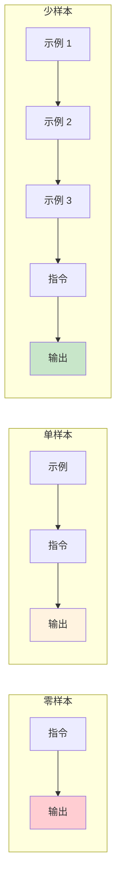

# 第五章 少样本学习与示例驱动

进入第二部分核心技术篇，本章将介绍提示词工程中最有效的技术之一——少样本学习。这项技术通过在提示词中提供少量示例，引导模型理解任务模式并将其应用到新输入上。

少样本学习的强大之处在于其通用性：无论是文本分类、信息提取、格式转换还是创意生成，只要能提供恰当的示例，模型就能迅速“学会”任务的核心模式。与其花费大量时间描述规则，有时一两个好的示例更能清晰地传达意图。

本章将深入探讨少样本学习的原理、方法和应用，帮助读者掌握这一关键技能。

**本章目标**

- 理解本章核心概念与适用场景
- 掌握可复用的提示词/工作流模式
- 能将方法迁移到自己的任务中

## 1. 零样本与少样本提示

在提示词工程中，根据是否提供示例以及示例数量的多少，可以将提示方式分为零样本、单样本和少样本三种类型。这些概念源自 [GPT-3 论文](https://arxiv.org/abs/2005.14165)，理解它们的区别和适用场景，是有效应用示例驱动技术的基础。

### 1.1 零样本提示

零样本提示是指在不提供任何示例的情况下，仅通过指令描述任务，让模型直接生成输出。

#### 1.1.1 基本形式

```
指令：[任务描述]
输入：[待处理内容]
```

#### 1.1.2 示例

```
请将以下英文翻译成中文：

"The quick brown fox jumps over the lazy dog."
判断以下评论的情感倾向是正面、负面还是中性：

"这家餐厅的环境不错，但等位时间太长了。"
```

#### 1.1.3 适用场景

零样本提示适用于：

- 任务定义清晰，无歧义
- 模型已经在预训练中接触过类似任务
- 输出格式要求不严格
- 快速原型验证

#### 1.1.4 局限性

- 对复杂或非常规任务效果不佳
- 输出格式可能不一致
- 边界情况处理不可控

### 1.2 单样本提示

单样本提示提供一个示例来展示任务模式。

#### 1.2.1 基本形式

```
示例：
输入：[示例输入]
输出：[示例输出]

请处理：
输入：[待处理内容]
```

#### 1.2.2 示例

```
请按照示例的格式提取信息：

示例：
文本：张三，男，1990 年出生，工程师
输出：姓名=张三；性别=男；出生年份=1990；职业=工程师

请处理：
文本：李四，女，1985 年出生，医生
```

#### 1.2.3 作用

- 消除指令的歧义
- 展示期望的输出格式
- 设定输出的风格和详细程度

### 1.3 少样本提示

少样本提示提供多个示例（通常 2-6 个），使模型能够更好地理解任务模式和边界情况。

#### 1.3.1 基本形式

```
示例 1：
输入：[输入 1]
输出：[输出 1]

示例 2：
输入：[输入 2]
输出：[输出 2]

示例 3：
输入：[输入 3]
输出：[输出 3]

请处理：
输入：[待处理内容]
```

#### 1.3.2 示例

```
请分类以下客户咨询的类型：

咨询："我的订单什么时候能到？"
类型：物流查询

咨询："这个产品支持 7 天无理由退货吗？"
类型：退换货政策

咨询："你们有没有红色款的？"
类型：产品咨询

咨询："付款后能开发票吗？"
类型：支付与发票

请处理：
咨询："我想改一下收货地址"
```

#### 1.3.3 为什么有效

少样本学习的有效性源于大语言模型的以下特性：

1. **模式识别**：模型能够从示例中识别输入到输出的映射模式
2. **类比推理**：将识别的模式应用到新的输入上
3. **格式学习**：从示例中学习输出的结构和格式
4. **边界理解**：多个示例帮助模型理解任务的边界

### 1.4 三种方式的对比



<p align="center">图 5-1：零样本、单样本和少样本提示的对比</p>

| 特性       | 零样本 | 单样本 | 少样本  |
| -------- | --- | --- | ---- |
| 示例数量     | 0   | 1   | 2-6+ |
| 指令依赖     | 高   | 中   | 低    |
| 格式一致性    | 低   | 中   | 高    |
| Token 消耗 | 最低  | 低   | 较高   |

### 1.5 选择合适的方式

#### 1.5.1 选择零样本的情况

```
✓ 标准化任务：翻译、摘要等模型熟悉的任务
✓ 格式灵活：对输出格式没有严格要求
✓ 资源受限：上下文窗口紧张，需节省 Token
✓ 快速验证：初步测试可行性
```

#### 1.5.2 选择单样本的情况

```
✓ 格式明确：需要展示特定输出格式
✓ 简单任务：任务逻辑简单，一个示例足够说明
✓ 平衡需求：在效果和 Token 成本之间取得平衡
```

#### 1.5.3 选择少样本的情况

```
✓ 复杂任务：任务规则复杂，需多个示例说明
✓ 边界处理：需要展示边界情况的处理方式
✓ 高一致性：要求输出格式高度一致
✓ 非标准任务：模型不常见的特殊任务
```

### 1.6 由零到多的渐进策略

在实践中，建议采用渐进策略：

```
1. 先尝试零样本
   ↓ 效果不满意
2. 添加单个示例
   ↓ 仍有问题
3. 增加到 3-5 个示例
   ↓ 覆盖边界情况
4. 如果仍不满意，考虑其他技术
   （如思维链、任务分解等）
```

### 1.7 上下文学习的本质

少样本学习的本质是 **上下文学习**——模型在推理时通过上下文中的示例“临时学习”任务规则，而无需更新模型参数。

这里需要理解一个关键区别：模型并不是在从示例中“学习新知识”，而是通过示例 **识别任务格式和输入输出结构**，从而激活参数中已有的能力回路。研究显示，即使示例中的标签是错误的（例如将正面评论标为负面），模型在标准基准上的表现也不会大幅下降。这进一步证实了“示例的核心价值在于定位任务模式，而非提供知识”这一观点。

这与传统机器学习的关键区别：

| 方面   | 传统机器学习 | 上下文学习 |
| ---- | ------ | ----- |
| 学习时机 | 训练阶段   | 推理阶段  |
| 参数变化 | 参数更新   | 参数不变  |
| 示例需求 | 大量标注数据 | 少量示例  |
| 任务切换 | 需重新训练  | 只需换示例 |

### 1.8 思考

1. 在您的具体业务场景中，有哪些任务必须使用 **少样本提示 (Few-Shot)** 才能保证输出的稳定性？又有哪些任务使用**零样本提示 (Zero-Shot)** 就足够了？
2. 尝试将一个原本使用零样本提示效果不佳的任务，改写为单样本和三样本提示，观察效果有何变化。

## 2. 示例的选择与设计策略

少样本学习的效果很大程度上取决于示例的质量。精心设计的示例可以使模型快速理解任务，而不当的示例可能导致误解或偏差。本节将介绍示例选择和设计的关键策略。

### 2.1 优质示例的特征

#### 2.1.1 代表性

示例应该代表任务中常见的典型情况。

```
任务：客户咨询分类

✓ 代表性示例：
- 物流查询（高频）
- 产品咨询（高频）
- 退换货（中频）

✗ 非代表性示例：
- 投诉 CEO（极罕见）
- 请求定制产品（特殊情况）
```

#### 2.1.2 多样性

示例应该覆盖任务的不同类型或情况。

```
任务：情感分析

✓ 多样化示例集：
- 明确正面："非常满意，五星好评！"
- 明确负面："太差了，再也不买了。"
- 中性/混合："还行吧，没什么特别的。"
- 隐含情感："等了一周才到。"（隐含负面）

✗ 同质化示例：
- "很好"
- "挺好的"
- "非常好"
（都是正面，缺乏多样性）
```

#### 2.1.3 清晰性

示例本身应该是正确、清晰、无歧义的。

```
✓ 清晰的示例：
输入：今天上海的天气怎么样？
输出：{"intent": "weather_query", "location": "上海", "time": "今天"}

✗ 不清晰的示例：
输入：天气
输出：查询天气
（输入太模糊，输出格式不明确）
```

#### 2.1.4 一致性

所有示例应该遵循相同的格式和风格。

```
✓ 一致的格式：
示例 1：输入 → 输出 A 格式
示例 2：输入 → 输出 A 格式
示例 3：输入 → 输出 A 格式

✗ 不一致的格式：
示例 1：输入 → JSON 格式
示例 2：输入 → 纯文本
示例 3：输入 → Markdown 列表
```

### 2.2 示例数量的选择

#### 2.2.1 理想数量

研究和实践表明，3-5 个示例通常是较好的选择：

```
1 个示例：可能不够，无法展示多样性
2-3 个示例：适合简单任务
4-6 个示例：适合复杂任务，覆盖更多情况
7+个示例：收益递减，需权衡 Token 成本
```

#### 2.2.2 影响因素

**任务复杂度**：

- 简单任务（如格式转换）：2-3 个示例
- 中等任务（如分类、提取）：3-5 个示例
- 复杂任务（如多步骤推理）：5-6 个示例

**类别数量**：

- 如果是分类任务，每个类别至少包含一个示例

**边界情况**：

- 需要额外示例来展示边界情况的处理

### 2.3 示例的组织结构

#### 2.3.1 标准结构

```
[系统/任务描述]

示例 1：
输入：[输入内容 1]
输出：[输出内容 1]

示例 2：
输入：[输入内容 2]
输出：[输出内容 2]

...

请处理：
输入：[待处理内容]
输出：
```

#### 2.3.2 带分隔符的结构

```
任务：[任务描述]

===示例===

【用户】[示例输入 1]
【助手】[示例输出 1]

【用户】[示例输入 2]
【助手】[示例输出 2]

===待处理===

【用户】[待处理内容]
```

#### 2.3.3 表格结构

对于映射类任务，表格格式清晰简洁：

```
请按以下映射规则转换：

| 输入 | 输出 |
|------|------|
| 红色 | red |
| 蓝色 | blue |
| 绿色 | green |

请转换：黄色
```

### 2.4 示例选择策略

#### 策略 1：覆盖边界情况

特别为可能出错的边界情况提供示例：

```
任务：判断年龄是否成年（>=18 岁）

常规示例：
- 25 岁 → 成年
- 10 岁 → 未成年

边界示例（重要）：
- 18 岁 → 成年（边界值）
- 17 岁 → 未成年（边界值）
- 无年龄信息 → 无法判断（异常情况）
```

#### 策略 2：平衡类别分布

分类任务中，尽量平衡各类别的示例数量：

```
三分类任务：情感正面/负面/中性

推荐：
- 正面示例：2 个
- 负面示例：2 个
- 中性示例：2 个

避免：
- 正面示例：5 个
- 负面示例：1 个
- 中性示例：0 个
（严重不平衡可能导致模型偏向多示例的类别）
```

#### 策略 3：从简单到复杂

按复杂度顺序排列示例：

```
示例 1（简单）：
输入："很好"
输出：正面

示例 2（中等）：
输入："产品不错，就是配送慢了点"
输出：混合

示例 3（复杂）：
输入："说实话，之前看差评我还有点犹豫，但实际收到后觉得还行"
输出：正面
```

#### 策略 4：包含负面示例

展示“不应该”怎么做可以帮助模型理解边界：

```
正确示例：
输入：帮我查一下北京到上海的航班
输出：{"intent": "flight_query", "from": "北京", "to": "上海"}

反例（展示不识别的情况）：
输入：今天真是开心
输出：{"intent": "chitchat", "from": null, "to": null}
（不是航班查询，无法提取地点信息）
```

### 2.5 示例设计的注意事项

#### 2.5.1 避免过于简化

示例应该足够真实，接近实际输入的复杂度：

```
❌ 过于简化：
输入：好
输出：正面

✓ 真实场景：
输入：买了两周了，总体来说还可以，续航比预期要好
输出：正面
```

#### 2.5.2 避免示例中的偏见

确保示例不会引导模型产生不当的偏见：

```
❌ 有偏见的示例集：
- 所有正面评价都是女性用户
- 所有负面评价都是男性用户

✓ 中立的示例集：
- 正面/负面评价与用户特征无关
```

#### 2.5.3 避免泄露测试答案

如果在评估场景使用，确保示例与测试数据无关

### 2.6 动态示例选择

在实际应用中，可以根据待处理输入动态选择最相关的示例：

```
流程：
1. 接收用户输入
2. 从示例库中检索与输入最相似的 N 个示例
3. 将这些示例组装进提示词
4. 发送给模型处理

优势：
- 示例与当前任务高度相关
- 可以维护大型示例库，按需选取
- 提高处理效果
```

### 2.7 思考

1. 在您的领域中，为了防止模型犯某种特定错误，您会如何设计一个 **负面示例** (Negative Example)？
2. 回顾您最近设计的一个提示词，检查其中的示例是否具备足够的代表性和多样性？如果不够，您计划如何改进？

## 3. 少样本学习的应用场景

少样本学习是一种通用性很强的技术，可以应用于各种任务类型。本节将通过具体场景和实例，展示如何在不同任务中应用少样本提示。

### 3.1 场景一：文本分类

文本分类是少样本学习最常见的应用之一。

#### 3.1.1 情感分析

```
任务：判断产品评论的情感倾向

示例：

评论："质量很好，物超所值，会回购！"
情感：正面

评论："等了半个月才收到，包装还是破的。"
情感：负面

评论："普通，没什么特别的，凑合用吧。"
情感：中性

评论："本来以为便宜没好货，结果惊喜了。"
情感：正面

请分析：
评论："颜色和图片差太多了，不过用起来还行"
情感：
```

#### 3.1.2 意图识别

```
任务：识别客服对话中的用户意图

示例：

用户："我订单的快递到哪了？"
意图：物流查询

用户："我想退掉这个商品"
意图：退货请求

用户："这个手机的电池能用多久？"
意图：产品咨询

用户："你们客服电话是多少？"
意图：联系方式查询

请识别：
用户："买贵了可以补差价吗？"
意图：
```

### 3.2 场景二：信息提取

从非结构化文本中提取结构化信息。

#### 3.2.1 实体提取

```
任务：从文本中提取人物信息

示例：

文本："李明，1985 年出生于北京，现任某科技公司 CTO。"
提取：
- 姓名：李明
- 出生年份：1985
- 出生地：北京
- 职位：CTO

文本："张红是清华大学计算机系的教授，主要研究人工智能。"
提取：
- 姓名：张红
- 单位：清华大学
- 职位：教授
- 研究方向：人工智能

请提取：
文本："王刚，90 后创业者，2020 年创办了一家 AI 教育公司，目前担任 CEO。"
```

#### 3.2.2 关系提取

```
任务：提取文本中的人物关系

示例：

文本："张三是李四的导师，他们在同一个课题组工作。"
关系：张三 -[导师]-> 李四

文本："公司 CEO 王明宣布任命张华为新的技术总监。"
关系：王明 -[任命]-> 张华

请提取：
文本："据悉，马云创办的阿里巴巴已经投资了蚂蚁集团。"
```

### 3.3 场景三：格式转换

将内容从一种格式转换为另一种格式。

#### 3.3.1 文本转 JSON

```
任务：将产品描述转换为结构化 JSON

示例：

输入："苹果 iPhone 15 Pro，256GB，深灰色，售价 8999 元"
输出：
{
  "brand": "苹果",
  "model": "iPhone 15 Pro",
  "storage": "256GB",
  "color": "深灰色",
  "price": 8999
}

输入："小米 14 Ultra，512GB，白色，售价 6499 元"
输出：
{
  "brand": "小米",
  "model": "14 Ultra",
  "storage": "512GB",
  "color": "白色",
  "price": 6499
}

请转换：
输入："华为 Mate 60 Pro+，1TB，雅丹黑，售价 10999 元"
```

### SQL 生成

```
任务：将自然语言查询转换为 SQL

数据表：employees（id, name, department, salary, hire_date）

示例：

查询：查找销售部门的所有员工
SQL：SELECT * FROM employees WHERE department = '销售'

查询：找出工资最高的前 5 个员工
SQL：SELECT * FROM employees ORDER BY salary DESC LIMIT 5

查询：统计每个部门的员工数量
SQL：SELECT department, COUNT(*) as count FROM employees GROUP BY department

请转换：
查询：找出 2024 年入职的员工姓名和部门
```

## 5.3.4 场景四：风格转换

改变文本的风格、语气或表达方式。

### 正式化改写

```
任务：将口语化表达改写为正式书面语

示例：

原文："这东西超好用的！买它！"
改写："该产品使用体验优异，值得推荐购买。"

原文："搞不懂为啥老出 bug，烦死了"
改写："该问题持续性发生的原因尚不明确，需要进一步排查。"

请改写：
原文："老板说周五必须搞定，不然就完蛋了"
```

### 简化改写

```
任务：将复杂句子简化，保持核心信息

示例：

原文："在不远的将来，随着人工智能技术的进一步发展和广泛应用，人类社会的各个领域都将迎来深刻而根本性的变革。"
简化："人工智能技术发展将深刻改变社会各领域。"

原文："本研究通过对来自不同地区、不同年龄段的一千多名受访者进行的问卷调查和深度访谈，试图揭示当代青年群体在职业选择过程中所面临的主要困境和挑战。"
简化："本研究调查了 1000 多名受访者，分析青年职业选择中的主要困境。"

请简化：
原文："鉴于当前国际形势的复杂性和不确定性，以及国内经济面临的下行压力，公司决定暂时搁置原定于第三季度启动的海外市场扩张计划。"
```

## 5.3.5 场景五：翻译与本地化

### 术语一致的翻译

```
任务：翻译技术文档，保持术语一致

术语表：
- prompt → 提示词
- token → Token
- fine-tuning → 微调
- hallucination → 幻觉

示例：

原文："The model may produce hallucinations when the prompt lacks context."
译文："当提示词缺乏上下文时，模型可能会产生幻觉。"

原文："Fine-tuning requires a large number of tokens for training."
译文："微调需要大量的 Token 进行训练。"

请翻译：
原文："Effective prompt engineering can reduce hallucinations and save tokens."
```

## 5.3.6 场景六：创意生成

### 标题生成

```
任务：为文章生成吸引人的标题

示例：

文章主题：人工智能在医疗诊断中的应用
标题选项：
1. AI 医生来了：人工智能如何改变医疗诊断?
2. 比医生更准确？AI 诊断的突破与挑战
3. 未来医疗的关键：AI 诊断技术全解析

文章主题：远程办公对员工效率的影响
标题选项：
1. 在家办公效率更高？数据告诉你真相
2. 远程办公两年后：效率是涨是跌？
3. 办公室会消失吗？远程工作效率研究

请生成：
文章主题：电动汽车电池技术的最新突破
```

## 5.3.7 实践技巧总结

```
场景类型          建议示例数    关键考虑点
──────────────────────────────────────────
文本分类          3-5 个       类别覆盖、边界处理
信息提取          3-4 个       字段完整性、格式一致
格式转换          2-4 个       格式精确、异常处理
风格转换          2-3 个       风格明确、保留原意
翻译与本地化      2-4 个       术语一致、语境适配
创意生成          2-4 个       多样化、风格示范
```

## 动手试试

1. 为你所在行业的一个实际分类任务编写 3 个少样本示例，测试模型是否能泛化到新的输入。
2. 比较“精心挑选的 2 个示例”和“随机选取的 5 个示例”的效果差异，哪种策略更省 Token 且更有效？
