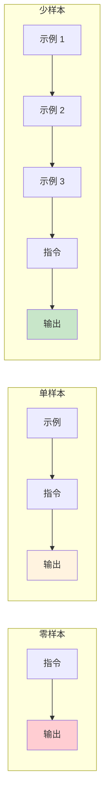

# 第五章 少样本学习与示例驱动

进入第二部分核心技术篇，本章将介绍提示词工程中最有效的技术之一——少样本学习。这项技术通过在提示词中提供少量示例，引导模型理解任务模式并将其应用到新输入上。

少样本学习的强大之处在于其通用性：无论是文本分类、信息提取、格式转换还是创意生成，只要能提供恰当的示例，模型就能迅速“学会”任务的核心模式。与其花费大量时间描述规则，有时一两个好的示例更能清晰地传达意图。

本章将深入探讨少样本学习的原理、方法和应用，帮助读者掌握这一关键技能。

**本章目标**

- 理解本章核心概念与适用场景
- 掌握可复用的提示词/工作流模式
- 能将方法迁移到自己的任务中

## 1. 零样本与少样本提示

在提示词工程中，根据是否提供示例以及示例数量的多少，可以将提示方式分为零样本、单样本和少样本三种类型。这些概念源自 [GPT-3 论文](https://arxiv.org/abs/2005.14165)，理解它们的区别和适用场景，是有效应用示例驱动技术的基础。

### 1.1 零样本提示

零样本提示是指在不提供任何示例的情况下，仅通过指令描述任务，让模型直接生成输出。

#### 1.1.1 基本形式

```
指令：[任务描述]
输入：[待处理内容]
```

#### 1.1.2 示例

```
请将以下英文翻译成中文：

"The quick brown fox jumps over the lazy dog."
判断以下评论的情感倾向是正面、负面还是中性：

"这家餐厅的环境不错，但等位时间太长了。"
```

#### 1.1.3 适用场景

零样本提示适用于：

- 任务定义清晰，无歧义
- 模型已经在预训练中接触过类似任务
- 输出格式要求不严格
- 快速原型验证

#### 1.1.4 局限性

- 对复杂或非常规任务效果不佳
- 输出格式可能不一致
- 边界情况处理不可控

### 1.2 单样本提示

单样本提示提供一个示例来展示任务模式。

#### 1.2.1 基本形式

```
示例：
输入：[示例输入]
输出：[示例输出]

请处理：
输入：[待处理内容]
```

#### 1.2.2 示例

```
请按照示例的格式提取信息：

示例：
文本：张三，男，1990 年出生，工程师
输出：姓名=张三；性别=男；出生年份=1990；职业=工程师

请处理：
文本：李四，女，1985 年出生，医生
```

#### 1.2.3 作用

- 消除指令的歧义
- 展示期望的输出格式
- 设定输出的风格和详细程度

### 1.3 少样本提示

少样本提示提供多个示例（通常 2-6 个），使模型能够更好地理解任务模式和边界情况。

#### 1.3.1 基本形式

```
示例 1：
输入：[输入 1]
输出：[输出 1]

示例 2：
输入：[输入 2]
输出：[输出 2]

示例 3：
输入：[输入 3]
输出：[输出 3]

请处理：
输入：[待处理内容]
```

#### 1.3.2 示例

```
请分类以下客户咨询的类型：

咨询："我的订单什么时候能到？"
类型：物流查询

咨询："这个产品支持 7 天无理由退货吗？"
类型：退换货政策

咨询："你们有没有红色款的？"
类型：产品咨询

咨询："付款后能开发票吗？"
类型：支付与发票

请处理：
咨询："我想改一下收货地址"
```

#### 1.3.3 为什么有效

少样本学习的有效性源于大语言模型的以下特性：

1. **模式识别**：模型能够从示例中识别输入到输出的映射模式
2. **类比推理**：将识别的模式应用到新的输入上
3. **格式学习**：从示例中学习输出的结构和格式
4. **边界理解**：多个示例帮助模型理解任务的边界

### 1.4 三种方式的对比



<p align="center">图 5-1：零样本、单样本和少样本提示的对比</p>

| 特性       | 零样本 | 单样本 | 少样本  |
| -------- | --- | --- | ---- |
| 示例数量     | 0   | 1   | 2-6+ |
| 指令依赖     | 高   | 中   | 低    |
| 格式一致性    | 低   | 中   | 高    |
| Token 消耗 | 最低  | 低   | 较高   |

### 1.5 选择合适的方式

#### 1.5.1 选择零样本的情况

```
✓ 标准化任务：翻译、摘要等模型熟悉的任务
✓ 格式灵活：对输出格式没有严格要求
✓ 资源受限：上下文窗口紧张，需节省 Token
✓ 快速验证：初步测试可行性
```

#### 1.5.2 选择单样本的情况

```
✓ 格式明确：需要展示特定输出格式
✓ 简单任务：任务逻辑简单，一个示例足够说明
✓ 平衡需求：在效果和 Token 成本之间取得平衡
```

#### 1.5.3 选择少样本的情况

```
✓ 复杂任务：任务规则复杂，需多个示例说明
✓ 边界处理：需要展示边界情况的处理方式
✓ 高一致性：要求输出格式高度一致
✓ 非标准任务：模型不常见的特殊任务
```

### 1.6 由零到多的渐进策略

在实践中，建议采用渐进策略：

```
1. 先尝试零样本
   ↓ 效果不满意
2. 添加单个示例
   ↓ 仍有问题
3. 增加到 3-5 个示例
   ↓ 覆盖边界情况
4. 如果仍不满意，考虑其他技术
   （如思维链、任务分解等）
```

### 1.7 上下文学习的本质

少样本学习的本质是 **上下文学习**——模型在推理时通过上下文中的示例“临时学习”任务规则，而无需更新模型参数。

这里需要理解一个关键区别：模型并不是在从示例中“学习新知识”，而是通过示例 **识别任务格式和输入输出结构**，从而激活参数中已有的能力回路。研究显示，即使示例中的标签是错误的（例如将正面评论标为负面），模型在标准基准上的表现也不会大幅下降。这进一步证实了“示例的核心价值在于定位任务模式，而非提供知识”这一观点。

这与传统机器学习的关键区别：

| 方面   | 传统机器学习 | 上下文学习 |
| ---- | ------ | ----- |
| 学习时机 | 训练阶段   | 推理阶段  |
| 参数变化 | 参数更新   | 参数不变  |
| 示例需求 | 大量标注数据 | 少量示例  |
| 任务切换 | 需重新训练  | 只需换示例 |

### 1.8 思考

1. 在您的具体业务场景中，有哪些任务必须使用 **少样本提示 (Few-Shot)** 才能保证输出的稳定性？又有哪些任务使用**零样本提示 (Zero-Shot)** 就足够了？
2. 尝试将一个原本使用零样本提示效果不佳的任务，改写为单样本和三样本提示，观察效果有何变化。

## 2. 示例的选择与设计策略

少样本学习的效果很大程度上取决于示例的质量。精心设计的示例可以使模型快速理解任务，而不当的示例可能导致误解或偏差。本节将介绍示例选择和设计的关键策略。

### 2.1 优质示例的特征

#### 2.1.1 代表性

示例应该代表任务中常见的典型情况。

```
任务：客户咨询分类

✓ 代表性示例：
- 物流查询（高频）
- 产品咨询（高频）
- 退换货（中频）

✗ 非代表性示例：
- 投诉 CEO（极罕见）
- 请求定制产品（特殊情况）
```

#### 2.1.2 多样性

示例应该覆盖任务的不同类型或情况。

```
任务：情感分析

✓ 多样化示例集：
- 明确正面："非常满意，五星好评！"
- 明确负面："太差了，再也不买了。"
- 中性/混合："还行吧，没什么特别的。"
- 隐含情感："等了一周才到。"（隐含负面）

✗ 同质化示例：
- "很好"
- "挺好的"
- "非常好"
（都是正面，缺乏多样性）
```

#### 2.1.3 清晰性

示例本身应该是正确、清晰、无歧义的。

```
✓ 清晰的示例：
输入：今天上海的天气怎么样？
输出：{"intent": "weather_query", "location": "上海", "time": "今天"}

✗ 不清晰的示例：
输入：天气
输出：查询天气
（输入太模糊，输出格式不明确）
```

#### 2.1.4 一致性

所有示例应该遵循相同的格式和风格。

```
✓ 一致的格式：
示例 1：输入 → 输出 A 格式
示例 2：输入 → 输出 A 格式
示例 3：输入 → 输出 A 格式

✗ 不一致的格式：
示例 1：输入 → JSON 格式
示例 2：输入 → 纯文本
示例 3：输入 → Markdown 列表
```

### 2.2 示例数量的选择

#### 2.2.1 理想数量

研究和实践表明，3-5 个示例通常是较好的选择：

```
1 个示例：可能不够，无法展示多样性
2-3 个示例：适合简单任务
4-6 个示例：适合复杂任务，覆盖更多情况
7+个示例：收益递减，需权衡 Token 成本
```

#### 2.2.2 影响因素

**任务复杂度**：

- 简单任务（如格式转换）：2-3 个示例
- 中等任务（如分类、提取）：3-5 个示例
- 复杂任务（如多步骤推理）：5-6 个示例

**类别数量**：

- 如果是分类任务，每个类别至少包含一个示例

**边界情况**：

- 需要额外示例来展示边界情况的处理

### 2.3 示例的组织结构

#### 2.3.1 标准结构

```
[系统/任务描述]

示例 1：
输入：[输入内容 1]
输出：[输出内容 1]

示例 2：
输入：[输入内容 2]
输出：[输出内容 2]

...

请处理：
输入：[待处理内容]
输出：
```

#### 2.3.2 带分隔符的结构

```
任务：[任务描述]

===示例===

【用户】[示例输入 1]
【助手】[示例输出 1]

【用户】[示例输入 2]
【助手】[示例输出 2]

===待处理===

【用户】[待处理内容]
```

#### 2.3.3 表格结构

对于映射类任务，表格格式清晰简洁：

```
请按以下映射规则转换：

| 输入 | 输出 |
|------|------|
| 红色 | red |
| 蓝色 | blue |
| 绿色 | green |

请转换：黄色
```

### 2.4 示例选择策略

#### 策略 1：覆盖边界情况

特别为可能出错的边界情况提供示例：

```
任务：判断年龄是否成年（>=18 岁）

常规示例：
- 25 岁 → 成年
- 10 岁 → 未成年

边界示例（重要）：
- 18 岁 → 成年（边界值）
- 17 岁 → 未成年（边界值）
- 无年龄信息 → 无法判断（异常情况）
```

#### 策略 2：平衡类别分布

分类任务中，尽量平衡各类别的示例数量：

```
三分类任务：情感正面/负面/中性

推荐：
- 正面示例：2 个
- 负面示例：2 个
- 中性示例：2 个

避免：
- 正面示例：5 个
- 负面示例：1 个
- 中性示例：0 个
（严重不平衡可能导致模型偏向多示例的类别）
```

#### 策略 3：从简单到复杂

按复杂度顺序排列示例：

```
示例 1（简单）：
输入："很好"
输出：正面

示例 2（中等）：
输入："产品不错，就是配送慢了点"
输出：混合

示例 3（复杂）：
输入："说实话，之前看差评我还有点犹豫，但实际收到后觉得还行"
输出：正面
```

#### 策略 4：包含负面示例

展示“不应该”怎么做可以帮助模型理解边界：

```
正确示例：
输入：帮我查一下北京到上海的航班
输出：{"intent": "flight_query", "from": "北京", "to": "上海"}

反例（展示不识别的情况）：
输入：今天真是开心
输出：{"intent": "chitchat", "from": null, "to": null}
（不是航班查询，无法提取地点信息）
```

### 2.5 示例设计的注意事项

#### 2.5.1 避免过于简化

示例应该足够真实，接近实际输入的复杂度：

```
❌ 过于简化：
输入：好
输出：正面

✓ 真实场景：
输入：买了两周了，总体来说还可以，续航比预期要好
输出：正面
```

#### 2.5.2 避免示例中的偏见

确保示例不会引导模型产生不当的偏见：

```
❌ 有偏见的示例集：
- 所有正面评价都是女性用户
- 所有负面评价都是男性用户

✓ 中立的示例集：
- 正面/负面评价与用户特征无关
```

#### 2.5.3 避免泄露测试答案

如果在评估场景使用，确保示例与测试数据无关

### 2.6 动态示例选择

在实际应用中，可以根据待处理输入动态选择最相关的示例：

```
流程：
1. 接收用户输入
2. 从示例库中检索与输入最相似的 N 个示例
3. 将这些示例组装进提示词
4. 发送给模型处理

优势：
- 示例与当前任务高度相关
- 可以维护大型示例库，按需选取
- 提高处理效果
```

### 2.7 思考

1. 在您的领域中，为了防止模型犯某种特定错误，您会如何设计一个 **负面示例** (Negative Example)？
2. 回顾您最近设计的一个提示词，检查其中的示例是否具备足够的代表性和多样性？如果不够，您计划如何改进？

## 3. 少样本学习的应用场景

少样本学习是一种通用性很强的技术，可以应用于各种任务类型。本节将通过具体场景和实例，展示如何在不同任务中应用少样本提示。

### 3.1 场景一：文本分类

文本分类是少样本学习最常见的应用之一。

#### 3.1.1 情感分析

```
任务：判断产品评论的情感倾向

示例：

评论："质量很好，物超所值，会回购！"
情感：正面

评论："等了半个月才收到，包装还是破的。"
情感：负面

评论："普通，没什么特别的，凑合用吧。"
情感：中性

评论："本来以为便宜没好货，结果惊喜了。"
情感：正面

请分析：
评论："颜色和图片差太多了，不过用起来还行"
情感：
```

#### 3.1.2 意图识别

```
任务：识别客服对话中的用户意图

示例：

用户："我订单的快递到哪了？"
意图：物流查询

用户："我想退掉这个商品"
意图：退货请求

用户："这个手机的电池能用多久？"
意图：产品咨询

用户："你们客服电话是多少？"
意图：联系方式查询

请识别：
用户："买贵了可以补差价吗？"
意图：
```

### 3.2 场景二：信息提取

从非结构化文本中提取结构化信息。

#### 3.2.1 实体提取

```
任务：从文本中提取人物信息

示例：

文本："李明，1985 年出生于北京，现任某科技公司 CTO。"
提取：
- 姓名：李明
- 出生年份：1985
- 出生地：北京
- 职位：CTO

文本："张红是清华大学计算机系的教授，主要研究人工智能。"
提取：
- 姓名：张红
- 单位：清华大学
- 职位：教授
- 研究方向：人工智能

请提取：
文本："王刚，90 后创业者，2020 年创办了一家 AI 教育公司，目前担任 CEO。"
```

#### 3.2.2 关系提取

```
任务：提取文本中的人物关系

示例：

文本："张三是李四的导师，他们在同一个课题组工作。"
关系：张三 -[导师]-> 李四

文本："公司 CEO 王明宣布任命张华为新的技术总监。"
关系：王明 -[任命]-> 张华

请提取：
文本："据悉，马云创办的阿里巴巴已经投资了蚂蚁集团。"
```

### 3.3 场景三：格式转换

将内容从一种格式转换为另一种格式。

#### 3.3.1 文本转 JSON

```
任务：将产品描述转换为结构化 JSON

示例：

输入："苹果 iPhone 15 Pro，256GB，深灰色，售价 8999 元"
输出：
{
  "brand": "苹果",
  "model": "iPhone 15 Pro",
  "storage": "256GB",
  "color": "深灰色",
  "price": 8999
}

输入："小米 14 Ultra，512GB，白色，售价 6499 元"
输出：
{
  "brand": "小米",
  "model": "14 Ultra",
  "storage": "512GB",
  "color": "白色",
  "price": 6499
}

请转换：
输入："华为 Mate 60 Pro+，1TB，雅丹黑，售价 10999 元"
```

#### 3.3.2 SQL 生成

```
任务：将自然语言查询转换为 SQL

数据表：employees（id, name, department, salary, hire_date）

示例：

查询：查找销售部门的所有员工
SQL：SELECT * FROM employees WHERE department = '销售'

查询：找出工资最高的前 5 个员工
SQL：SELECT * FROM employees ORDER BY salary DESC LIMIT 5

查询：统计每个部门的员工数量
SQL：SELECT department, COUNT(*) as count FROM employees GROUP BY department

请转换：
查询：找出 2024 年入职的员工姓名和部门
```

### 3.4 场景四：风格转换

改变文本的风格、语气或表达方式。

#### 3.4.1 正式化改写

```
任务：将口语化表达改写为正式书面语

示例：

原文："这东西超好用的！买它！"
改写："该产品使用体验优异，值得推荐购买。"

原文："搞不懂为啥老出 bug，烦死了"
改写："该问题持续性发生的原因尚不明确，需要进一步排查。"

请改写：
原文："老板说周五必须搞定，不然就完蛋了"
```

#### 3.4.2 简化改写

```
任务：将复杂句子简化，保持核心信息

示例：

原文："在不远的将来，随着人工智能技术的进一步发展和广泛应用，人类社会的各个领域都将迎来深刻而根本性的变革。"
简化："人工智能技术发展将深刻改变社会各领域。"

原文："本研究通过对来自不同地区、不同年龄段的一千多名受访者进行的问卷调查和深度访谈，试图揭示当代青年群体在职业选择过程中所面临的主要困境和挑战。"
简化："本研究调查了 1000 多名受访者，分析青年职业选择中的主要困境。"

请简化：
原文："鉴于当前国际形势的复杂性和不确定性，以及国内经济面临的下行压力，公司决定暂时搁置原定于第三季度启动的海外市场扩张计划。"
```

### 3.5 场景五：翻译与本地化

#### 3.5.1 术语一致的翻译

```
任务：翻译技术文档，保持术语一致

术语表：
- prompt → 提示词
- token → Token
- fine-tuning → 微调
- hallucination → 幻觉

示例：

原文："The model may produce hallucinations when the prompt lacks context."
译文："当提示词缺乏上下文时，模型可能会产生幻觉。"

原文："Fine-tuning requires a large number of tokens for training."
译文："微调需要大量的 Token 进行训练。"

请翻译：
原文："Effective prompt engineering can reduce hallucinations and save tokens."
```

### 3.6 场景六：创意生成

#### 3.6.1 标题生成

```
任务：为文章生成吸引人的标题

示例：

文章主题：人工智能在医疗诊断中的应用
标题选项：
1. AI 医生来了：人工智能如何改变医疗诊断?
2. 比医生更准确？AI 诊断的突破与挑战
3. 未来医疗的关键：AI 诊断技术全解析

文章主题：远程办公对员工效率的影响
标题选项：
1. 在家办公效率更高？数据告诉你真相
2. 远程办公两年后：效率是涨是跌？
3. 办公室会消失吗？远程工作效率研究

请生成：
文章主题：电动汽车电池技术的最新突破
```

### 3.7 实践技巧总结

```
场景类型          建议示例数    关键考虑点
──────────────────────────────────────────
文本分类          3-5 个       类别覆盖、边界处理
信息提取          3-4 个       字段完整性、格式一致
格式转换          2-4 个       格式精确、异常处理
风格转换          2-3 个       风格明确、保留原意
翻译与本地化      2-4 个       术语一致、语境适配
创意生成          2-4 个       多样化、风格示范
```

### 3.8 动手试试

1. 为你所在行业的一个实际分类任务编写 3 个少样本示例，测试模型是否能泛化到新的输入。
2. 比较“精心挑选的 2 个示例”和“随机选取的 5 个示例”的效果差异，哪种策略更省 Token 且更有效？

## 4. 常见问题与解决方案

在应用少样本学习时，可能会遇到各种问题。本节总结常见问题及其解决方案，帮助读者更有效地使用这一技术。

### 4.1 问题一：示例数量不足或过多

#### 症状

- 示例太少：模型理解不准确，输出不稳定
- 示例太多：消耗过多 Token，可能引入噪音

### 解决方案

**找到最佳平衡点**：

```
优化策略：
1. 从 3 个示例开始
2. 测试效果，记录准确率
3. 逐步增加示例，观察边际收益
4. 当增加示例效果提升不明显时停止
5. 确保 Token 成本可接受
```

**分场景配置**：

```
简单任务（如明确的格式转换）：2-3 个示例
中等任务（如多类别分类）：3-5 个示例
复杂任务（如需要推理的任务）：5-6 个示例
```

### 4.2 问题二：示例与实际输入差异大

#### 症状

- 模型输出与示例相似，但与实际需求不符
- 遇到与示例不同类型的输入时表现差

### 解决方案

**提高示例的多样性**：

```
优化前示例：
- 示例 1："这个产品质量很好" → 正面
- 示例 2："非常满意" → 正面
- 示例 3："推荐购买" → 正面
（都是简短的正面评价）

优化后示例：
- 示例 1："这个产品质量很好" → 正面（简短正面）
- 示例 2："等了一周，包装还破了" → 负面（简短负面）
- 示例 3："产品还行，价格有点贵" → 混合（复杂判断）
- 示例 4："嗯。" → 无法判断（信息不足）
```

**使用动态示例选择**：

```
根据输入的特点，从示例库中选择最相关的示例：

输入：长篇复杂评论
→ 选择包含长篇评论的示例

输入：包含讽刺语气
→ 选择包含讽刺识别的示例
```

### 4.3 问题三：输出格式不一致

#### 症状

- 模型有时遵循示例格式，有时不遵
- 同一提示词多次运行格式不同

#### 解决方案

**强化格式说明**：

```
增加明确的格式指令：

请严格按照示例的格式输出。
输出必须是有效的 JSON，不包含任何其他文字。

[示例]
...

严格遵循上述格式。
```

**使用预填充技术**（仅适用于 Claude Sonnet 4 / 3.5 等早期模型 — Claude 4.6+ 已停止支持 prefill 并返回 400，详见 13.2 节）：

```
请分析以下文本的情感：

[示例]
...

请分析："这个产品还不错"

分析结果：{"sentiment":
```

模型会从预填充的位置继续生成。

**降低 Temperature**：

Temperature 设为 0 或很低的值可以增加输出的确定性。

### 4.4 问题四：模型复制示例而非学习模式

#### 症状

- 模型输出与某个示例高度相似
- 对新输入生成类似示例中的输出而非正确输出

#### 解决方案

**确保示例多样化**：

避免示例之间太相似，增加差异性。

**增加明确的泛化指令**：

```
以下示例展示了任务的模式，请将这个模式应用到新的输入上：

[示例]
...

请注意：不要复制示例的内容，而是理解任务模式并应用到新输入。

请处理：[新输入]
```

**使用不同领域的示例**：

如果新输入与示例在内容上差异大，可以减少直接复制的倾向。

### 4.5 问题五：边界情况处理不当

#### 症状

- 对于模糊、异常或特殊输入，模型表现差
- 模型强行分类，不会说“无法判断”

#### 解决方案

**添加边界情况示例**：

```
常规示例：
输入："产品质量很好"
输出：{"sentiment": "positive", "confident": true}

边界示例：
输入："还行"
输出：{"sentiment": "neutral", "confident": false}

异常示例：
输入："....."
输出：{"sentiment": "unknown", "reason": "无有效内容"}
```

**明确边界处理规则**：

```
处理规则：
1. 如果情感明确，输出对应类别
2. 如果情感模糊，输出"混合"或"中性"
3. 如果内容无效或无法判断，输出"无法判断"并说明原因
```

## 4.6 问题六：示例顺序影响结果

#### 症状

- 调换示例顺序后，模型输出发生变化
- 后面的示例似乎比前面的权重更高

#### 解决方案

**将重要示例放在最后**：

由于近因效应，靠后的示例可能影响更大。

**将多样化示例均匀分布**：

```
不是：
[正面 1][正面 2][正面 3][负面 1][中性 1]

而是：
[正面 1][负面 1][正面 2][中性 1][正面 3]
```

**多次测试不同顺序**：

评估顺序敏感程度，选择效果最稳定的顺序。

### 4.7 问题七：Token 限制

#### 症状

- 示例过多导致上下文窗口不足
- 无法容纳足够的示例和输入内容

#### 解决方案

**简化示例**：

```
优化前：
输入："我买了一台华为 Mate60 Pro 手机，使用了一个月后感觉
      非常满意，屏幕显示效果很好，拍照功能也很强大，
      电池续航超过了我的预期，而且系统运行非常流畅..."
输出：正面

优化后：
输入："手机很好，屏幕清晰，电池持久"
输出：正面
（保留核心特征，减少冗余）
```

**使用更紧凑的格式**：

```
优化前（每个示例 3 行）：
示例 1：
输入：xxx
输出：yyy

优化后（表格格式，更紧凑）：
| 输入 | 输出 |
|------|------|
| xxx | yyy |
```

**分层示例策略**：

```
核心示例（始终包含）：2-3 个最重要的
可选示例（按需添加）：根据上下文窗口余量动态添加
```

### 4.8 问题诊断流程

```
遇到少样本学习问题时的诊断步骤：

1. 确认问题类型
   ├── 格式问题：输出格式不符合要求
   ├── 准确度问题：理解或判断错误
   └── 稳定性问题：多次运行结果不一致

2. 检查示例质量
   ├── 代表性够吗？
   ├── 多样性够吗？
   ├── 清晰性够吗？
   └── 一致性够吗？

3. 尝试解决方案
   ├── 调整示例数量
   ├── 优化示例内容
   ├── 改进格式说明
   └── 调整参数设置

4. 验证效果
   └── 使用测试集验证改进效果
```

### 4.9 想一想

1. 你遇到过“示例越多效果反而越差”的情况吗？可能的原因是什么？
2. 当少样本学习在某个任务上失败时，你会先调整示例、增加示例，还是改用其他技术（如思维链）？判断依据是什么？

## 5. 本章实战练习

### 5.1 本章实战练习

本节提供递进式的练习题，帮助读者巩固少样本学习的知识，并应用到实际场景中。

#### 练习一：情感分析对比实验（基础通用）

**目标**：亲身体验零样本与少样本在处理模糊文本时的效果差异。

**任务描述**： 你需要构建一个简单的提示词，判断用户评论的情感倾向（正面、负面、中性）。

**测试数据**：

1. “这东西说实话不错，就是物流慢了点，客服态度也一般。”（混合情感）
2. “价格是便宜，但质量真不敢恭维。”（转折句，实贬）
3. “还行吧。”（中性偏弱）

**步骤**：

1. **零样本测试**：直接编写指令，让模型判断上述三条评论的情感。
2. **少样本构建**：编写 3 个示例（正面、负面、混合各一个），加入到提示词中。
3. **少样本测试**：使用带有示例的提示词再次测试上述三条评论。

**思考**：

* 在处理混合情感（如第 1 条）时，加入示例后模型的判断依据是否更明确了？
* 示例的格式（如 JSON 输出）是否帮助模型更准确地输出了你期望的结构？

***

#### 练习二：脏数据清洗与提取（进阶技巧）

**目标**：学习利用少样本示例处理格式混乱的脏数据。

**任务描述**： 从格式不统一的用户地址输入中，提取标准的结构化信息（省、市、区、详细地址）。

**输入数据（脏数据）**：

1. “北京朝阳区建国路 88 号 SOHO 现代城”（缺少“市”）
2. “广东省深圳市南山区深南大道 TX 大厦”（标准）
3. “杭州余杭区文一西路（梦想小镇）”（包含括号备注，缺少“省”）

**挑战**： 模型往往容易忽略缺失的行政区划，或者保留括号内的无关备注。

**练习要求**：

* 设计 2-3 个示例，专门展示如何处理：
  * 省略“省”或“市”的情况（示例中自动补全或留空，取决于你的定义）。
  * 去除地址中的噪音（如括号备注）。
* 验证模型是否能按照你示例中的逻辑正确处理第 1 和第 3 条数据。

***

#### 练习三：构建动态意图识别器（实战场景）

**目标**：模拟客服场景，设计一个能够根据少样本准确识别用户意图的系统。

**场景背景**： 你正在为一个电商平台开发智能客服。主要的意图类型包括：

* `logistics_inquiry`（物流查询）
* `return_request`（退换货申请）
* `product_consultation`（商品咨询）
* `human_agent`（转人工）

**任务**：

1. 为每个意图编写 1-2 个典型示例（ Input -> Intent）。
2. **负面示例设计**（重要）：设计一个示例，教模型区分“抱怨物流慢”（属于`logistics_inquiry`或`complaint`）与“我要退货”（属于`return_request`）。很多模型容易混淆这两者。
3. 编写提示词，要求模型输出 JSON 格式，包含 `intent` 和 `confidence`（置信度）。

**代码实现思路（ Python 伪代码）**：

```python
system_prompt = """
你是一个电商客服意图识别助手。请参考以下示例进行分类：

示例 1：
用户：我的快递到哪了？都三天了。
输出：{"intent": "logistics_inquiry", "confidence": "high"}

示例 2：
用户：这衣服质量太差，我要退款！
输出：{"intent": "return_request", "confidence": "high"}

示例 3（区分抱怨与退货）：
用户：你们发货太慢了，下次不买了。
输出：{"intent": "complaint", "confidence": "medium"}  # 注意：这不是退货请求

请处理：
用户：{user_input}
"""

# 调用 API 进行测试...

```

**扩展思考**： 如果用户说：“我想问问退货的运费是谁出？”，这应该属于 `return_request` 还是 `product_consultation`（或 `policy_inquiry`）？尝试通过添加示例来微调模型的判断边界。

#### 参考实现代码

以下是本章练习的参考 Python 实现。

##### 1. 零样本与少样本对比：Zero-Shot vs Few-Shot

`zero_vs_few_shot.py`

```python
import os

# 模拟 LLM 调用函数 (在实际使用中请替换为真实的 OpenAI/Anthropic API 调用)

def mock_llm_call(prompt):
    print(f"\n[Sending to LLM]...\n{prompt}\n-------------------")
    # 模拟返回
    if "示例" not in prompt and "不错" in prompt and "慢" in prompt:
        return "中性 (Zero-shot default)"
    elif "示例" in prompt and "不错" in prompt and "慢" in prompt:
        return "混合 (Few-shot learned)"
    return "Positive"

def zero_shot_demo():
    print("=== Zero-Shot Demo ===")
    instruction = "判断以下评论的情感：\n"
    user_input = "这东西说实话不错，就是物流慢了点，客服态度也一般。"
    prompt = instruction + user_input
    response = mock_llm_call(prompt)
    print(f"[LLM Response]: {response}\n")

def few_shot_demo():
    print("=== Few-Shot Demo ===")
    examples = """
示例 1：
输入：今天的饭真好吃。
情感：正面

示例 2：
输入：完全是浪费钱。
情感：负面

示例 3：
输入：虽然有点贵，但质量确实好。
情感：混合
"""
    instruction = "请参考示例判断情感：\n"
    user_input = "这东西说实话不错，就是物流慢了点，客服态度也一般。"
    prompt = instruction + examples + "\n 输入：" + user_input
    response = mock_llm_call(prompt)
    print(f"[LLM Response]: {response}\n")

if __name__ == "__main__":
    zero_shot_demo()
    few_shot_demo()
```

##### 2. 动态示例选择器（ Dynamic Selector）

`dynamic_selector.py`

```python
import random

class DynamicSelector:
    def __init__(self):
        self.examples = {
            "logistics": [
                {"input": "我的快递到哪了？", "intent": "logistics_inquiry"},
                {"input": "为什么还不发货？", "intent": "logistics_inquiry"}
            ],
            "return": [
                {"input": "我要退货", "intent": "return_request"},
                {"input": "这衣服尺码不对", "intent": "return_request"}
            ],
            "complaint": [
                {"input": "你们服务太差了", "intent": "complaint"},
                {"input": "我要投诉你们经理", "intent": "complaint"}
            ]
        }

    def get_examples(self, query):
        # 在实际场景中，这里可以使用向量相似度检索 (Vector Search)
        # 这里仅用简单的关键词匹配作为演示
        selected = []
        if "快递" in query or "发货" in query:
            selected.extend(self.examples["logistics"])
        if "退" in query or "尺码" in query:
             selected.extend(self.examples["return"])

        # 如果没有匹配到，随机返回几个作为通用示例 (Fallback)
        if not selected:
             all_ex = [item for sublist in self.examples.values() for item in sublist]
             selected = random.sample(all_ex, 2)

        return selected

    def construct_prompt(self, query):
        examples = self.get_examples(query)
        prompt = "请根据以下示例判断用户意图：\n\n"
        for ex in examples:
            prompt += f"用户：{ex['input']}\n 意图：{ex['intent']}\n\n"

        prompt += f"用户：{query}\n 意图："
        return prompt

# 演示

if __name__ == "__main__":
    selector = DynamicSelector()

    query1 = "帮我查下快递"
    print(f"Query: {query1}")
    print(selector.construct_prompt(query1))
    print("-" * 30)

    query2 = "我想退这件衣服"
    print(f"Query: {query2}")
    print(selector.construct_prompt(query2))
```

## 6. 本章小结

本章深入介绍了少样本学习技术，这是提示词工程中最有效且应用最广泛的核心技术之一。以下是本章的核心要点回顾：

### 6.1 关键概念

- **零样本提示**：不提供示例，仅通过指令描述任务
- **少样本提示**：提供 2-6 个示例来展示任务模式
- **上下文学习**：模型在推理时通过示例激活已有能力回路（而非学习新知识），即使标签错误也不会大幅影响表现

### 6.2 核心要点

1. **三种提示方式的对比**

    | 特征       | 零样本  | 单样本  | 少样本  |
    | -------- | ---- | ---- | ---- |
    | 示例数      | 0    | 1    | 2-6+ |
    | 效果可控性    | 低    | 中    | 高    |
    | Token 消耗 | 最低   | 低    | 较高   |
    | 适用场景     | 标准任务 | 简单任务 | 复杂任务 |

2. **优质示例的四大特征**
    - **代表性**：覆盖典型常见情况
    - **多样性**：包含不同类型和边界情况
    - **清晰性**：示例本身正确无歧义
    - **一致性**：格式和风格统一

3. **示例设计策略**
    - 数量：通常 3-5 个为宜
    - 覆盖：确保包含边界情况
    - 平衡：分类任务各类别均衡
    - 顺序：从简单到复杂排列

4. **广泛的应用场景**
    - 文本分类：情感分析、意图识别
    - 信息提取：实体提取、关系提取
    - 格式转换：文本转 JSON、SQL 生成
    - 风格转换：正式化、简化
    - 翻译本地化：术语一致翻译
    - 创意生成：标题生成、文案创作

### 6.3 常见问题速查

| 问题       | 解决方案                  |
| -------- | --------------------- |
| 示例数量不足   | 增加示例数量，测试最佳平衡点        |
| 格式不一致    | 强化格式说明，降低 Temperature |
| 复制而非学习   | 增加示例多样性，添加泛化指令        |
| 边界处理差    | 添加边界情况示例              |
| Token 限制 | 简化示例，使用紧凑格式           |

### 6.4 最佳实践检查清单

设计少样本提示词时：

* [ ] 示例数量是否在 3-5 个范围？
* [ ] 示例是否覆盖主要的任务类型？
* [ ] 是否包含边界情况的处理示例？
* [ ] 所有示例格式是否一致？
* [ ] 分类任务各类别是否平衡？
* [ ] 示例是否从简单到复杂排列？
* [ ] Token 消耗是否在可接受范围？

### 6.5 延伸阅读

**基础概念**

* [Language Models are Few-Shot Learners](https://arxiv.org/abs/2005.14165) - GPT-3 论文，少样本学习的基础
* [Rethinking the Role of Demonstrations: What Makes In-Context Learning Work?](https://arxiv.org/abs/2202.12837) - 示例作用与上下文学习机制的深入研究

**示例设计与应用**

* [Few-Shot Prompting Guide](https://www.promptingguide.ai/techniques/fewshot) - 少样本提示技术详解
