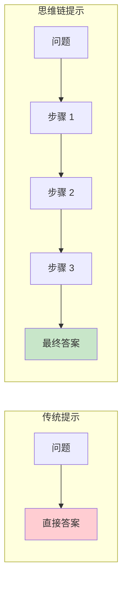
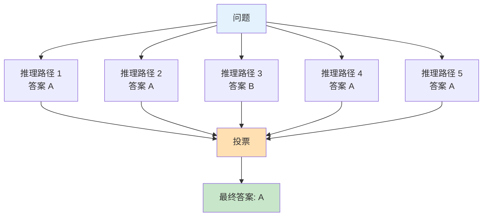
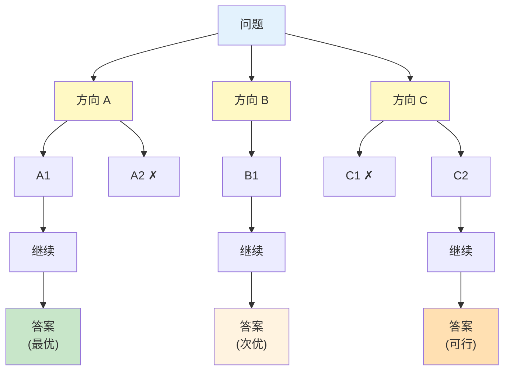
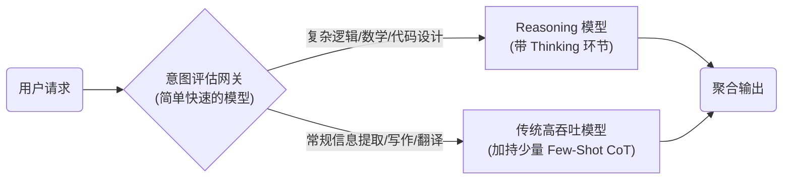
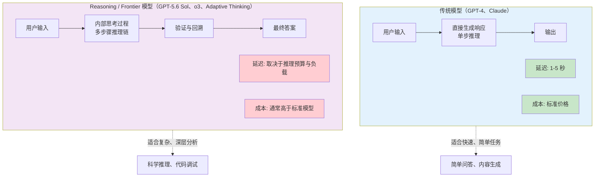
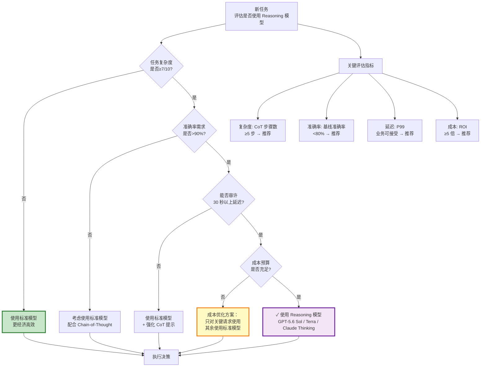
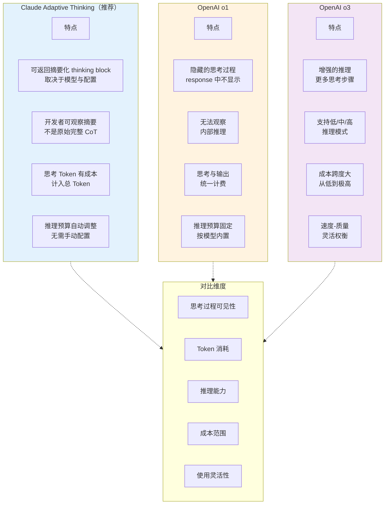
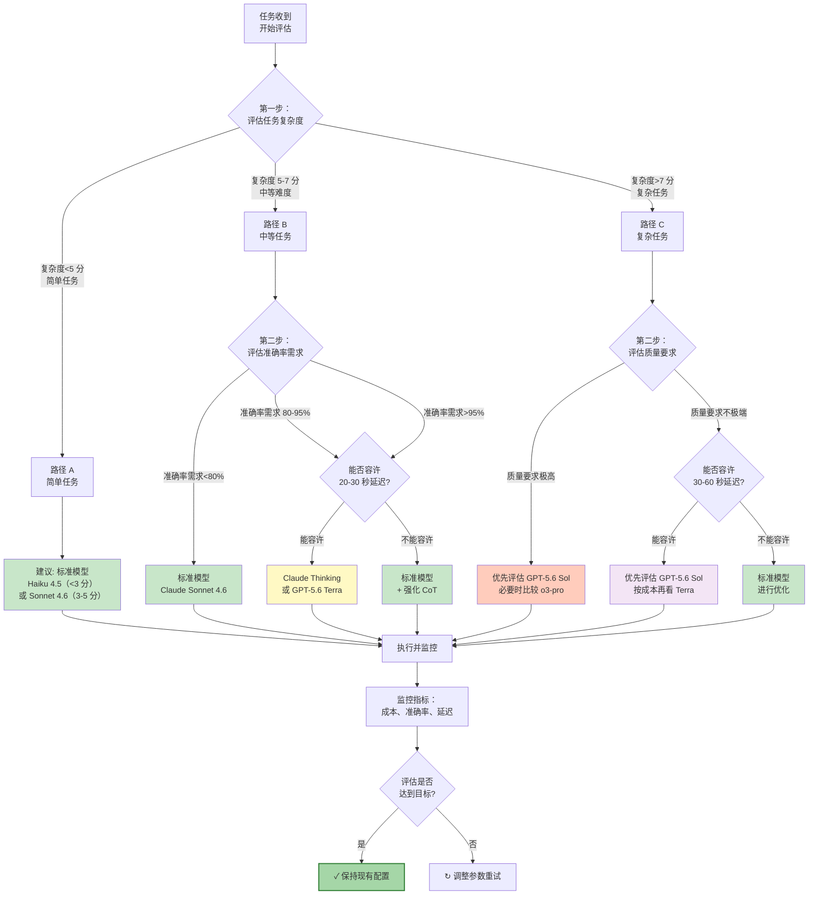

# 第六章 思维链与推理增强

思维链（Chain-of-Thought, CoT）是提示词工程领域的一项里程碑式技术。2022 年，Google 研究团队发现，通过在提示词中引导模型展示推理步骤，可以显著提升其在复杂推理任务上的表现。这一发现改变了人们对语言模型能力边界的认识。

思维链提示的核心思想是：不仅要求模型给出答案，还要求它展示得出答案的推理过程。这种方式激活了模型的推理能力，使其能够处理需要多步骤思考的复杂问题。

本章将深入探讨思维链技术的原理、变体和高级应用，帮助读者掌握这一提升模型推理能力的关键技术。

**本章目标**

- 理解本章核心概念与适用场景
- 掌握可复用的提示词/工作流模式
- 能将方法迁移到自己的任务中

## 1. 思维链提示的原理与价值

思维链（Chain-of-Thought, CoT）提示是一种通过引导模型展示中间推理步骤来提升复杂任务表现的技术，最早由 [Wei et al. (2022)](https://arxiv.org/abs/2201.11903) 提出。本节将介绍其基本原理、工作机制和应用价值。

### 6.1.1 什么是思维链提示

传统的提示方式直接要求模型输出最终答案：

```
问题：商店有 23 个苹果，卖出了 15 个，又进货了 12 个，现在有多少个？
答案：
```

模型可能直接输出一个数字，有时对有时错。

思维链提示则引导模型展示推理过程：

```
问题：商店有 23 个苹果，卖出了 15 个，又进货了 12 个，现在有多少个？

让我们一步步思考：
1. 初始数量：23 个
2. 卖出后剩余：23 - 15 = 8 个
3. 进货后总数：8 + 12 = 20 个

答案：20 个
```

通过展示中间步骤，模型的准确率显著提升。

!!! note "说明"
    
    上面的“逐步推理输出”是教学示例。真实业务/对外产品中，通常 **不建议强制要求模型输出冗长的完整推理过程**（会增加 Token 成本，也可能暴露不必要的细节）。更稳妥的做法是：让模型进行多步推理，但只输出 **关键步骤/核对点 + 最终答案**。



<p align="center">图 6-1：传统提示与思维链提示的对比</p>

### 1.2 为什么思维链有效

#### 1.2.1 分解复杂问题

思维链将复杂问题分解为一系列简单的子问题，每一步都是模型更容易处理的简单操作。

```
复杂问题："如果 A 比 B 高，B 比 C 高，C 比 D 高，那么 A 和 D 谁高？"

分解后：
步骤 1：A 比 B 高 → A > B
步骤 2：B 比 C 高 → B > C
步骤 3：C 比 D 高 → C > D
步骤 4：综合：A > B > C > D
结论：A 比 D 高
```

#### 1.2.2 利用生成的中间结果

模型在生成过程中可以“看到”自己之前输出的内容。当中间推理步骤被显式生成后，这些信息成为上下文的一部分，可以被后续推理利用。

#### 1.2.3 激活训练中的推理模式

大语言模型在训练过程中接触过大量包含推理过程的文本（如教科书、论文、解题过程等）。思维链提示激活了这些模式。

#### 1.2.4 减少跳跃性错误

直接输出答案时，模型可能“跳过”某些关键步骤导致错误。明确要求展示步骤可以减少这类遗漏。

### 5. 以生成长度换计算深度

从计算原理角度理解，思维链的核心是用生成长度换取计算深度——将原本单次前向传播里“压缩式”的推理，转化为多次前向传播分步执行。每一步的输出成为下一步的上下文输入，使模型在每一步都只需要完成较简单的判断，大幅降低了累积出错的概率。这解释了思维链在复杂推理任务上效果如此显著的原因——它把一个难题的“难度”分散到了多个简单步骤里。

### 1.3 思维链的适用场景

#### 1.3.1 高度适用

- **数学推理**：算术问题、方程求解
- **逻辑推理**：逻辑谜题、条件判断
- **多步骤问题**：需要多个步骤才能得出结论
- **常识推理**：需要结合多个常识知识点

#### 1.3.2 效果一般

* **简单事实问答**：直接提取即可，无需推理
* **创意生成**：不需要严格的逻辑步骤
* **格式转换**：规则明确的机械任务

### 1.4 与模型规模的关系

研究发现，思维链的效果与模型规模密切相关：

```
模型规模与 CoT 效果关系：

小模型（<10B 参数）：效果有限，可能产生无意义的推理步骤
中型模型（10-50B 参数）：有一定提升，但不稳定
大模型（>50B 参数）：效果显著，推理质量高
超大模型（>100B 参数）：效果最佳，复杂推理能力强
```

这种“涌现”特性源于 Wei et al. 2022 的早期发现，主要针对 base model。2024 年后，通过 SFT/distill 等训练手段，小模型（&lt;10B）也能获得稳定的 CoT 能力，因此本结论应理解为“在未经推理训练的 base model 上更适合大型模型”。

### 1.5 思维链提示的基本形式

#### 1.5.1 直接添加推理要求

```
问题：[问题描述]

请先完成推理并给出答案，然后用 3-5 条要点列出关键推导/核对点（不要输出冗长推理过程）。
```

#### 1.5.2 使用触发词

```
问题：[问题描述]

让我们逐步分析：
```

#### 1.5.3 结构化推理框架

```
问题：[问题描述]

请按以下结构分析：
1. 理解：这个问题要求我们做什么？
2. 已知：问题中给出了哪些信息？
3. 推理：如何从已知信息得出答案？
4. 结论：最终答案是什么？
```

### 1.6 思维链的输出示例

**问题**： 一列火车从 A 站出发，以每小时 80 公里的速度行驶。B 站位于 A 站前方 40 公里处。2 小时后，另一列火车从 B 站出发，以每小时 120 公里的速度同向追赶。问第二列火车何时能追上第一列？

**思维链回答**：

``` markdown
让我们一步步分析这个问题。

1. 理解问题：
   - 火车 1 从 A 站出发，速度 80km/h
   - B 站位于 A 站前方 40km
   - 2 小时后，火车 2 从 B 站出发，速度 120km/h，同向追赶
   - 问火车 2 何时追上火车 1

2. 计算初始状态：
   - 火车 1 行驶 2 小时后的位置：80 × 2 = 160km（距 A 站）
   - 此时火车 2 刚出发，位于 B 站
   - 两车距离：160km - 40km = 120km（火车 1 领先）

3. 计算追赶速度：
   - 速度差：120 - 80 = 40 km/h
   - 这是火车 2 相对于火车 1 的追赶速度

4. 计算追赶时间：
   - 需要追赶的距离：120km
   - 追赶时间：120 ÷ 40 = 3 小时

5. 得出结论：
   火车 2 在出发后 3 小时可以追上火车 1。
   如果从火车 1 出发时算起，是 2 + 3 = 5 小时后。
```

### 1.7 思维链的价值总结

```
价值维度        效果
───────────────────────
准确性提升      复杂推理任务准确率可提升 20-50%
可解释性        推理过程可见，便于验证和调试
可教学性        模型的推理可供人类学习参考
可纠错性        错误更容易被定位和纠正
适配性广        适用于多种需要推理的任务类型
```

### 1.8 思考

1. 设计一个特定的业务场景，在这个场景中，模型输出的“中间推理步骤”比“最终答案”更有价值？
2. 尝试对比一个数学问题在“有思维链”和“无思维链”情况下的输出，分析思维链是如何纠正逻辑错误的。

## 2. 零样本与少样本思维链

思维链提示可以分为零样本和少样本两种形式。两者各有特点和适用场景，本节将详细介绍它们的方法和应用。

### 2.1 零样本思维链

零样本思维链不需要提供推理示例，仅通过简单的触发语句即可激发模型的推理能力。

#### 2.1.1 核心方法

最著名的零样本 CoT 触发语是：

```
Let's think step by step.
```

或中文版本：

```
让我们一步一步思考。
```

#### 2.1.2 使用示例

```
问题：一个农场有 24 只鸡和 12 只鸭。农场主又买了 6 只鸡和卖出 4 只鸭。
现在农场总共有多少只家禽？

让我们一步一步思考：
```

模型会自动生成推理步骤并得出答案。

#### 2.1.3 常用触发语变体

```
基础版：
- "Let's think step by step."
- "让我们逐步分析。"

详细版：
- "让我们仔细思考这个问题，一步一步来。"
- "请先推理后回答，并用不超过 5 条要点列出关键步骤/核对点。"

引导版：
- "解决这个问题需要几个步骤，让我们依次进行。"
- "首先，让我们理解问题......"
```

#### 2.1.4 零样本 CoT 的优势

- **简单易用**：只需添加一句话
- **Token 高效**：不需要长篇示例
- **通用性强**：适用于各种推理任务
- **模型无关**：无需针对特定任务设计示例

### 2.2 少样本思维链

少样本思维链通过提供包含完整推理过程的示例，引导模型学习推理模式。

#### 2.2.1 基本结构

```
示例 1：
问题：[问题 1]
推理：
[详细的推理步骤]
答案：[答案 1]

示例 2：
问题：[问题 2]
推理：
[详细的推理步骤]
答案：[答案 2]

请解答：
问题：[新问题]
推理：
```

#### 2.2.2 完整示例

```
请按照示例的方式解答数学问题。

示例 1：
问题：小明有 5 个苹果，小红给了他 3 个，他又吃了 2 个。小明现在有几个苹果？
推理：
1. 初始：小明有 5 个苹果
2. 小红给了 3 个：5 + 3 = 8 个
3. 吃了 2 个：8 - 2 = 6 个
答案：6 个苹果

示例 2：
问题：商店有 30 件玩具，上午卖出 12 件，下午又进货 8 件。商店现在有多少件玩具？
推理：
1. 初始：商店有 30 件玩具
2. 上午卖出 12 件：30 - 12 = 18 件
3. 下午进货 8 件：18 + 8 = 26 件
答案：26 件玩具

请解答：
问题：图书馆有 120 本书，借出去 35 本，新购入 20 本。图书馆现在有多少本书？
推理：
```

### 2.3 零样本与少样本对比

```
维度              零样本 CoT          少样本 CoT
─────────────────────────────────────────────────
使用复杂度        简单              需要设计示例
Token 消耗         低                较高
推理格式控制      较弱              较强
错误示范风险      无                有可能
适用场景          通用推理          特定领域任务
```

### 2.4 选择策略

#### 2.4.1 选择零样本 CoT 的情况

```
✓ 快速原型验证
✓ 上下文窗口紧张
✓ 标准的数学/逻辑推理
✓ 对推理格式要求不严格
```

#### 2.4.2 选择少样本 CoT 的情况

```
✓ 需要特定的推理格式
✓ 非标准的推理任务
✓ 需要展示领域特定的推理步骤
✓ 准确性要求高
```

### 2.5 少样本 CoT 的示例设计

#### 2.5.1 推理步骤清晰

每个步骤应该清晰独立，有明确的输入和输出：

```
✓ 清晰的步骤：
步骤 1：提取已知条件 → 速度=60km/h，时间=2 小时
步骤 2：应用公式 → 距离=速度×时间
步骤 3：计算结果 → 距离=60×2=120km

✗ 模糊的步骤：
考虑了各种因素后，答案大概是 120km
```

#### 2.5.2 覆盖典型推理模式

示例应该覆盖任务中常见的推理模式：

```
算术推理示例：展示基本加减乘除的应用
逻辑推理示例：展示条件判断和推导
多步骤示例：展示如何组合多个步骤
```

#### 2.5.3 展示错误处理

有时可以包含如何处理特殊情况的示例：

```
问题：计算 10 ÷ 0 的结果。
推理：
1. 这是一个除法运算
2. 检查：除数为 0
3. 任何数除以 0 是未定义的
答案：无法计算（除以零未定义）
```

### 2.6 增强零样本 CoT 的技巧

#### 2.6.1 结构化触发

```
请按以下步骤思考：
1. 首先，理解问题要求什么
2. 其次，识别所有已知信息
3. 然后，确定解决问题的方法
4. 接着，逐步执行计算
5. 最后，检验答案并给出结论

问题：[问题描述]
```

#### 2.6.2 角色结合

```
你是一位数学老师，需要向学生展示解题过程。
请详细解释每一步的思路，让学生能够理解和学习。

问题：[问题描述]
```

#### 2.6.3 反思要求

```
问题：[问题描述]

请一步一步思考，得出答案后再检查一遍推理过程是否正确。
```

### 2.7 常见问题与解决方案

#### 问题 1：推理步骤过于冗长

``` markdown
解决方案：
- 在指令中限制步骤数量："用 3-5 个核心步骤解答"
- 要求简洁推理："给出简洁但完整的推理过程"
```

#### 问题 2：推理偏离正轨

``` markdown
解决方案：
- 使用结构化框架限定推理方向
- 少样本 CoT 提供正确的推理模式
- 增加"检验"步骤
```

#### 问题 3：最终答案格式不规范

```
解决方案：
在推理要求后添加格式约束：
"推理完成后，请用以下格式给出最终答案：【答案】：..."
```

### 2.8 延伸思考

1. “让我们一步步思考”这种零样本思维链为什么对大模型有效？它对小模型是否同样有效？
2. 设计一个少样本思维链提示来解决你工作中的一个推理任务，对比有无推理步骤的输出差异。

## 3. 自一致性与多路径推理

标准的思维链提示生成单一的推理路径，但这条路径可能是错误的。由 [Wang et al. (2022)](https://arxiv.org/abs/2203.11171) 提出的自一致性技术，通过生成多条推理路径并进行一致性投票，显著提升了推理的可靠性。

### 3.1 自一致性的核心思想

自一致性基于一个直觉：**如果多条不同的推理路径都得出相同的答案，那么这个答案更可能是正确的**。



<p align="center">图 6-2：自一致性的多路径采样与投票机制</p>

### 3.2 实现方法

#### 步骤一：多次采样

对同一问题使用相同的思维链提示，但设置较高的 Temperature（如 0.7-0.9），生成多条不同的推理路径。

```markdown
设置：
- 提示词：[包含思维链引导的提示]
- Temperature：0.7
- 采样次数：5-10 次
```

#### 步骤二：提取答案

从每条推理路径中提取最终答案：

```
推理路径 1：
...经过计算，结果是 25...
答案：25

推理路径 2：
...所以最终答案是 25...
答案：25

推理路径 3：
...因此得出 30...
答案：30
```

#### 步骤三：多数投票

对所有答案进行投票，选择出现次数最多的作为最终答案：

```
答案统计：
25：出现 4 次
30：出现 1 次

最终答案：25
```

### 3.3 自一致性的优势

#### 3.3.1 提升准确率

在 Wang et al. (2022) 的实验中，自一致性相对标准思维链的绝对提升为 GSM8K +17.9%、SVAMP +11.0%、AQuA +12.2%、StrategyQA +6.4%、ARC-challenge +3.9%；收益随任务与模型变化，不宜当作通用值。

#### 3.3.2 提供置信度指标

投票一致程度可以作为答案置信度的估计：

```
5/5 路径一致：高置信度
4/5 路径一致：中高置信度
3/5 路径一致：中等置信度
仅略多数一致：低置信度
```

#### 3.3.3 识别困难问题

如果多条路径给出分散的答案，说明这可能是一个困难问题，需要特别关注。

### 3.4 实现示例

```python linenums="1"
# 自一致性伪代码

def self_consistency(prompt, question, n_samples=5):
    answers = []

    # 生成多条推理路径
    for i in range(n_samples):
        response = call_llm(
            prompt=prompt + question,
            temperature=0.7
        )
        # 从回复中提取答案
        answer = extract_answer(response)
        answers.append(answer)

    # 多数投票
    from collections import Counter
    vote = Counter(answers)
    final_answer = vote.most_common(1)[0][0]
    confidence = vote.most_common(1)[0][1] / n_samples

    return final_answer, confidence
```

### 3.5 采样策略

#### 3.5.1 采样数量

```
推荐配置：
- 简单问题：3-5 次采样
- 中等问题：5-10 次采样
- 困难问题：10-20 次采样

权衡：
- 更多采样 → 更高准确率 → 更高成本
- 建议从 5 次开始，根据效果和成本调整
```

#### 3.5.2 Temperature 设置

```
Temperature 太低（<0.3）：路径多样性不足，很多采样重复
Temperature 太高（>1.0）：推理质量下降
推荐范围：0.5-0.8
```

### 3.6 变体技术

#### 3.6.1 加权投票

根据推理路径的质量给予不同权重：

``` markdown
评估推理质量的标准：
- 推理步骤的完整性
- 逻辑连贯性
- 中间计算的正确性

高质量路径的答案获得更高权重
```

#### 3.6.2 分组一致性

对于复杂问题，可以对每个子问题分别应用自一致性：

```
问题：计算表达式 (5 + 3) × (12 - 4) / 2

分组一致性：
1. 对 5 + 3 采样 5 次 → 一致性答案：8
2. 对 12 - 4 采样 5 次 → 一致性答案：8
3. 对 8 × 8 采样 5 次 → 一致性答案：64
4. 对 64 / 2 采样 5 次 → 一致性答案：32

最终答案：32
```

### 3.7 适用场景

#### 3.7.1 高度适用

```
✓ 有明确正确答案的任务（数学、逻辑）
✓ 可以从输出中清晰提取答案
✓ 对准确性要求高
✓ 可接受多次 API 调用的成本
```

#### 3.7.2 不太适用

```
✗ 开放性创意任务
✗ 没有"正确答案"的任务
✗ 需要实时响应的场景
✗ 成本敏感的应用
```

### 3.8 实践建议

1. **答案提取要准确**：确保能够从不同格式的回复中正确提取答案
2. **处理答案等价性**：相同答案可能有不同表述

   ```
   "25"、"二十五"、"25 个"应该被识别为同一答案
   ```
3. **设置合理的超时**：多次采样需要更多时间
4. **监控成本**：自一致性会成倍增加 API 调用次数

### 3.9 讨论

1. 自一致性需要多次 API 调用——在预算有限的场景下，你如何决定采样次数和成本之间的平衡？
2. 多数投票适合有“唯一正确答案”的问题，但对于开放性创作任务呢？你会如何改造这一策略？

## 4. 思维树与高级推理策略

思维链将推理过程表达为单一的线性链条，而一些更复杂的问题可能需要探索多个分支路径。思维树（Tree of Thoughts, ToT）及其他高级推理策略正是为解决这类问题而设计的。ToT 最初由 [Yao et al. (2023)](https://arxiv.org/abs/2305.10601) 和 [Long (2023)](https://arxiv.org/abs/2305.08291) 独立提出。

## 6.4.1 思维树概述

思维树是思维链的推广，它将推理过程组织为树形结构，允许在每个决策点探索多个可能的方向。



<p align="center">图 6-3：思维树的分支探索与路径剪枝</p>

### 4.2 思维树的核心组件

#### 4.2.1 思维生成

在每个节点生成多个可能的下一步：

```
当前状态：[已知条件]
可能的下一步：
1. [思路 1]
2. [思路 2]
3. [思路 3]
```

#### 4.2.2 状态评估

评估每个节点的质量或潜力：

```
评估标准：
- 该思路是否在正确方向上？
- 是否违反了任何约束？
- 继续这条路径的前景如何？

评分：1-10 分
```

#### 4.2.3 搜索策略

决定如何探索树结构：

```
常用搜索策略：
- 广度优先：先探索同层所有节点
- 深度优先：先沿一条路径探索到底
- beam search：保留评分最高的 K 条路径
```

### 4.3 思维树的应用示例

**问题**：24 点游戏——使用 4、6、8、9 四个数字和加减乘除运算，得到 24。

**思维树方法**：

```
初始状态：4, 6, 8, 9

第一层思维（选择运算）：
├─ 尝试乘法：4 × 6 = 24
│  剩余：8, 9, 24
│  评估：有 24 了，但需要处理 8 和 9 变成 0（困难）
│  评分：4/10
│
├─ 尝试：8 - 4 = 4
│  剩余：6, 9, 4
│  评估：没有明显接近 24 的路径
│  评分：3/10
│
└─ 尝试：9 - 6 = 3
   剩余：4, 8, 3
   评估：可以继续尝试
   评分：5/10

选择评分较高的路径继续；若探索后走入死路（如 9 - 6 = 3，剩下 4、8 无法凑出 24），
则回溯到其他分支重新探索。

最终在乘法分支上找到完整解：4 × 6 × (9 - 8) = 24
（四个数字各用一次：先算 9 - 8 = 1，再乘以 4 × 6 = 24）
```

### 4.4 提示词实现思维树

虽然完整的思维树通常需要编程实现，但可以通过提示词模拟简化版本：

```
你需要解决一个问题。请使用以下方法：

1. 生成阶段：列出 3 个可能的解决方向
2. 评估阶段：给每个方向评分（1-10）并说明理由
3. 选择阶段：选择最有前途的方向继续深入
4. 重复直到找到解决方案

问题：[问题描述]

---
第一轮：

可能的方向：
1. [方向 1]
2. [方向 2]
3. [方向 3]

评估：
- 方向 1：[评估理由] 评分：X/10
- 方向 2：[评估理由] 评分：X/10
- 方向 3：[评估理由] 评分：X/10

选择方向[最高分]继续...
```

### 4.5 其他高级推理策略

#### 4.5.1 递归自我改进

让模型反复审视和改进自己的输出：

```
步骤 1：生成初始答案
步骤 2：批判性评估答案的问题
步骤 3：基于批评改进答案
步骤 4：重复步骤 2-3 直到满意

提示词模板：
请解答问题：[问题]

【初始解答】
[生成解答]

【自我评估】
检查上述解答：
- 逻辑是否严密？
- 是否有遗漏？
- 答案是否完整？
[评估结果]

【改进版解答】
基于评估，改进如下：
[改进后的解答]
```

#### 4.5.2 分解-组合策略

将复杂问题分解为子问题，分别解决后再组合：

```
问题：分析公司的 SWOT 并提出战略建议

分解：
1. 子问题 1：分析 Strengths
2. 子问题 2：分析 Weaknesses
3. 子问题 3：分析 Opportunities
4. 子问题 4：分析 Threats
5. 子问题 5：基于 SWOT 提出建议

组合：综合所有子问题的答案，形成完整分析
```

#### 4.5.3 多视角推理

从不同角度分析同一问题：

```
请从以下三个视角分析这个决策：

【乐观者视角】
假设一切顺利，可能的收益是...

【悲观者视角】
如果出现问题，风险是...

【务实者视角】
平衡考虑后，合理的预期是...

【综合结论】
综合三个视角的分析...
```

### 4.6 选择合适的推理策略

```
问题类型                推荐策略
──────────────────────────────────────────
简单推理              标准思维链
需要探索多个方案        思维树
需要反复优化           递归自我改进
大问题可分解           分解-组合
需要全面视角           多视角推理
需要高可靠性           自一致性
```

### 4.7 实践建议

1. **从简单开始**：先尝试标准思维链，不够用再升级
2. **控制复杂度**：高级策略会增加 Token 消耗和响应时间
3. **结合使用**：可以将多个策略组合，如“思维树 + 自一致性”
4. **评估效果**：复杂策略不一定总是更好，需要测试验证

### 4.8 思考

1. 思维树相比思维链增加了“分支探索”和“回溯”能力——在什么类型的问题上这种额外成本是值得的？
2. 如果让你用思维树方法来规划一个实际项目（如产品上线方案），你会如何设计评估函数来打分各个方案？

## 5. Reasoning 模型专题：内置推理范式

自 2024 年末起，随着 OpenAI o 系列、后续 GPT-5.4 主线，以及 DeepSeek-R1 等 **Reasoning 模型（推理模型）** 的出现，大语言模型的推理能力经历了一次范式转换。这深刻地改变了思维链相关的提示词工程最佳实践。

本节将探讨在新一代推理模型上如何调整我们的提示词策略。

### 5.1 Reasoning 模型的工作原理

传统的大语言模型（如 GPT-4, Claude Sonnet 4.5, Llama 3）采用的是 **隐式推理** 或纯基于外部提示词触发的推理。而在推理模型的训练阶段，研究者利用强化学习不仅教导模型“如何给出正确答案”，更教导模型“**如何自己构建思维链**”。

这些模型在回答用户问题之前，会产生大量的 **思考 Token（Reasoning Tokens / Thinking Tokens）**。它们会在内部执行：

- **自发分解问题**
- **尝试多种路径**（类似于内置的思维树 ToT）
- **自我纠错**（发现死胡同后回溯）
- **综合得出结论**

由于推理过程已经被“内化”，这使得对它们的提示词设计必须彻底转变。

### 5.2 传统 CoT 模型 vs Reasoning 模型的提示策略

当面对一个困难的逻辑推理题时，两类模型的处理方式和期望的输入是截然不同的：

| 特性            | 传统 GPT-4 / Claude           | Reasoning 模型（OpenAI o1/o3、Claude Fable 5 / Opus 4.8 / Sonnet 4.6 的 Adaptive Thinking、DeepSeek-R1） |
| ------------- | --------------------------- | ------------------------------------------------------------------------------------------------- |
| **需要提示词触发？**  | ✅ 是（“让我们一步步思考”）             | ❌ 否（模型自动触发内部思考）                                                                                   |
| **需要给出推理示例？** | ✅ 是（Few-shot 会提升格式和准确性）     | ❌ 不建议（可能干扰模型原生的寻优路径）                                                                              |
| **提示词核心重点**   | 搭建推理支架、提供操作步骤               | **清晰准确地定义问题的条件与目标**                                                                               |
| **格式策略**      | 常见做法是输出关键步骤/核对点（不必强制冗长推理过程） | 推理过程对用户/API 是“透明或折叠”的，通常只输出结果                                                                     |
| **适合的任务**     | 结构化任务、文案写作、快速响应             | 复杂数学证明、硬核算法编写、高级逻辑谬误纠察                                                                            |

### 5.3 针对 Reasoning 模型的最佳实践

如果你正在使用 o1、o3、DeepSeek-R1 或 Claude 的 Adaptive Thinking（Fable 5 / Opus 4.8 / Opus 4.7 / Opus 4.6 / Sonnet 5 / Sonnet 4.6），请遵循以下“少即是多”的策略：

!!! warning "注意" 
    
    Claude Opus 5 的 thinking 默认开启——不写 `thinking` 字段即按 adaptive 思考（Opus 4.8 相反，不写就不思考），可用 `type: "disabled"` 关闭，但仅在 `effort` 为 `high` 及以下时接受，与 `xhigh` / `max` 同时使用会返回 400。Claude Sonnet 5 默认开启 Adaptive Thinking，并移除了手动 Extended Thinking；Fable 5 / Mythos 5 的 Adaptive Thinking 常开且不提供手动 Extended Thinking，二者已于 2026-07-01 恢复访问，Mythos 5 仍限获批客户。Opus 4.8 / 4.7 只支持 adaptive；Opus 4.6 与 Sonnet 4.6 上的手动 Extended Thinking（`type: "enabled"` + `budget_tokens`）已被标为 deprecated。不同 Claude 模型的 thinking 配置不能互换，接入前请按官方文档核对支持矩阵。

#### 5.3.1 移除显式的“思维链”指令

不要在提示词中要求模型“思考”或“展示中间步骤”。这不仅多余，还可能扰乱模型原生的强化学习思考范式。

- **✗ 避免**：“请详细写出你的思考过程，分三步走，第一步分析条件，第二步……”
- **✓ 推荐**：“解答以下微分方程系统：...”

!!! warning "注意" 

    此建议仅适用于 Reasoning 模型（如 o1、o3、Claude 的 Adaptive Thinking）。对于普通模型（如 GPT-4、Claude Sonnet），Chain-of-Thought 提示仍然有效且推荐使用，包括在提示词中请求“思考”或“深入思考”（参见第 6.2 节）。

#### 5.3.2 注重“限制条件”与“清晰目标”

推理模型最怕的不是“问题难”，而是“问题表述有歧义”或“边界不清晰”。

- **✗ 避免**：“帮我优化这段代码的性能。”（由于目标不明确，模型可能会往奇怪的优化方向上钻牛角尖耗尽推理 Token）。
- **✓ 推荐**：“优化以下 Python 函数：目标是将时间复杂度从 $O(n^2)$ 降低到 $O(n \log n)$。不可改变输入参数数量。保证兼容 Python 3.8。”

#### 5.3.3 简化格式和角色设定

推理模型天然对复杂的、强行加入的“人格设定”（Persona）或非必要的系统角色不敏感，有时甚至会因为过度关注角色而偏离逻辑核心。

- 保持 Prompt 极高密度的信息量（纯事实、纯条件）。

#### 5.3.4 控制 Reasoning Token 预算

在 API 层面，通常允许开发者控制推理模型应该思考多长时间。以 OpenAI Responses API 为例，当前形状是 `reasoning={"effort": "low"}`；可选值随模型变化，可能包括 `none`、`minimal`、`low`、`medium`、`high`、`xhigh`。

- **Low / minimal**：适合常规编码、中等逻辑题，优先控制延迟和 token 用量。
- **Medium**：适合大多数复杂问题。
- **High / xhigh**：耗时和成本更高，仅用于证明、复杂架构设计或长时间未解出的困难缺陷。

推理 token 通常不会作为可见答案返回，但会占用上下文空间，并按输出 token 口径计费；生产系统应同时设置 `max_output_tokens`，并监控 `usage.output_tokens_details.reasoning_tokens`。

### 5.4 混合架构的未来：Router 模式

在实际的企业应用中，我们并不应该把所有的请求都发给 Reasoning 模型——这会造成巨大的计算资源浪费。未来的成熟应用架构必然是 **Router（路由）模式**：



<p align="center">图 6-4：Reasoning 模型与快速模型的 Router 混合架构</p>

- **对于简单任务**：人工设计 Few-Shot 思维链并在快速模型上运行，性价比最高。
- **对于未知难度的深水区任务**：将其抛给 Reasoning 模型并给予充分的 Thinking Token 预算。

### 5.5 思考

1. 既然 Reasoning 模型已经内置了如此强大的思考能力，你认为提示词工程师的职责正在发生什么变化？
2. 在你的业务系统中，有哪些具体模块是值得引入这种“慢结题但高精度”的推理模型的？

## 6. Reasoning 模型决策框架：何时使用与最佳实践

Reasoning 模型（如 OpenAI GPT-5.6 Sol / Terra / Luna、o 系列、Claude 的 Adaptive Thinking）代表了 LLM 推理范式的重大进步。然而，这些模型的高成本和长延迟特性决定了它们并非适用于所有场景。本节深入探讨 Reasoning 模型的工作原理、应用条件和决策框架。

!!! warning "注意"
    
    OpenAI 于 2026-07-09 发布 GPT-5.6 系列；Sol 面向前沿能力，Terra 平衡能力与成本，Luna 面向高吞吐。Claude 的思考配置与模型版本绑定：Opus 5 的 thinking 默认开启，关闭时受 `effort` 限制（仅 `high` 及以下接受 `type: "disabled"`）；Sonnet 5 默认启用 Adaptive Thinking，并移除了手动 Extended Thinking；Fable 5 / Mythos 5 的 Adaptive Thinking 常开，二者已于 2026-07-01 恢复访问，Mythos 5 仍限获批客户。Opus 4.8 / 4.7 不再支持手动 Extended Thinking，Opus 4.6 与 Sonnet 4.6 上的 `type: "enabled"` + `budget_tokens` 仍可用但已 deprecated。模型选择以快变事实核验表、官方文档和自有评测为准，不能把某个型号的配置泛化到整个系列。

### 6.1 Reasoning 模型的核心机制

#### 6.1.1 传统模型 vs Reasoning 模型

下图展示了传统模型与 Reasoning 模型在执行方式上的关键差异：



<p align="center">图 6-5：传统模型与 Reasoning 模型的执行方式对比</p>

#### 6.1.2 内部思考机制对比

```
【传统模型执行流程】
输入: "2+2 等于多少?"
直接计算: "2+2 等于 4"
Token 消耗: ~20 tokens
耗时: 0.5 秒
成本: $0.00001

【Reasoning 模型执行流程】
输入: "证明：对于任意正整数 n，n(n+1)(2n+1)/6 的求和公式是否成立?"

内部思考过程（对用户隐藏）:
  步骤 1: 理解问题的数学含义
  步骤 2: 识别这是一个归纳法证明问题
  步骤 3: 尝试多种证明方法
  步骤 4: 验证每种方法的正确性
  步骤 5: 选择最清晰的证明路径
  步骤 6: 检查逻辑严密性

思考 Token 消耗: 可能显著高于普通生成，具体取决于模型和推理预算
输出 Token 消耗: 与最终答案长度相关
总 Token 消耗: 输入、输出和推理 token 共同决定
耗时: 随模型、负载、推理力度和输出长度变化
成本: 通常高于标准模型；上线前应按真实流量测算
质量: 在复杂任务上通常更稳，但必须用自有评测集验证
```

### 6.2 何时应该使用 Reasoning 模型

#### 6.2.1 任务特征评估矩阵

以下矩阵展示了评估是否使用 Reasoning 模型的关键维度：

```
适合 Reasoning 模型的任务特征：

┌─────────────────────────────────────────────────────────┐
│ 高复杂度 + 高准确率要求 + 容许延迟 = 强烈推荐使用              │
└─────────────────────────────────────────────────────────┘

【维度 1：任务复杂度】
低 ← ─────────────── → 高

  复杂度低的任务        中等复杂度              复杂度高的任务
  ✗ 不推荐              ⚠️ 可选                 ✓ 强烈推荐

  - 事实查询            - 需要多步思考         - 科学问题证明
  - 翻译                - 需要分析比较         - 数学问题求解
  - 信息提取            - 需要逻辑推理         - 代码调试复杂问题
  - 简单问答            - 需要创意组合         - 法律论证
                        - 需要因果分析         - 战略规划

【维度 2：准确率需求】
低 ← ─────────────── → 高

  准确率需求低          中等准确率需求        极高准确率需求
  ✗ 不推荐              ⚠️ 可选                ✓ 强烈推荐

  - 娱乐内容            - 一般商业分析         - 医学诊断辅助
  - 灵感激发            - 基础教育             - 法律意见书
  - 头脑风暴            - 技术文档             - 金融合规审查
  - 概念解释            - 代码审查             - 论文撰写

【维度 3：时间容限】
实时 ← ─────────────── → 延迟容限

  需要实时响应          中等延迟容限          大延迟容限
  ✗ 不推荐              ⚠️ 可选                ✓ 强烈推荐

  - 聊天应用            - 邮件自动回复         - 离线报告生成
  - 实时翻译            - 内容审核              - 学术论文审阅
  - 问题答疑            - 代码补全              - 研究分析
  - 客服对话            - 自动化测试

【维度 4：成本敏感度】
不敏感 ← ────────── → 极度敏感

  成本不敏感            中等成本敏感          成本极度敏感
  ✓ 推荐                ⚠️ 可选                ✗ 不推荐

  - 关键业务            - 普通商业应用         - 大批量生成
  - 高利润业务          - 中等规模应用         - 成本驱动的应用
  - 医疗诊断            - 教育应用             - 日常内容生成
  - 法律合规            - 技术支持             - 实时翻译
```

#### 6.2.2 决策框架与具体场景

以下决策树帮助你系统地评估是否使用 Reasoning 模型：



<p align="center">图 6-6：是否采用 Reasoning 模型的决策树</p>

### 6.3 动态复杂度检测与自动化决策

#### 6.3.1 自动化的复杂度评估策略

实现动态复杂度检测需要多个评估维度的综合分析：

``` markdown
【为什么需要动态复杂度检测】

现实场景: 不是每个任务都能提前标记为"简单"或"复杂"

问题:
  - 用户的请求多样化，无法预先分类
  - 同一类型的请求也存在复杂度差异
  - 手动判断成本高，且容易出错
  - 需要自动化系统在运行时判断

解决: 使用启发式规则和小模型进行快速复杂度评估

【复杂度检测维度 1：关键词分析】

低复杂度信号:
  - 事实查询关键词: "什么是", "定义", "怎么拼写"
  - 简单操作: "翻译", "列出", "总结"
  - 单一主体: 只涉及一个对象/概念

高复杂度信号:
  - 逻辑推理: "为什么", "如何证明", "有什么影响"
  - 多步骤: "首先...然后...最后"
  - 比较分析: "对比", "权衡", "优缺点"
  - 假设情景: "假如", "如果...会怎样"
  - 数学/科学: 包含公式、定理、计算
```

示例检测:

```python linenums="1"
def detect_complexity_by_keywords(query):
    simple_keywords = ["什么是", "定义", "翻译", "列出"]
    complex_keywords = ["为什么", "证明", "对比", "假如"]

    if any(kw in query for kw in simple_keywords):
        return "low"  # 复杂度低
    elif any(kw in query for kw in complex_keywords):
        return "high"  # 复杂度高
    else:
        return "medium"
```

【复杂度检测维度 2：数学符号密度】

``` markdown
公式/符号出现率:

0 个符号 → 复杂度低 (纯文本)
1-3 个符号 → 复杂度中 (一些技术内容)
4+ 个符号 → 复杂度高 (数学/科学)

符号类型权重:
  微积分符号 (∫, ∂, ∇) → +2
  统计符号 (Σ, μ, σ) → +1.5
  逻辑符号 (∃, ∀, ⇒) → +1.5
  基础算术 (+, -, ×, ÷) → +0.5
```

【复杂度检测维度 3：多步骤指标】

```python linenums="1"
def count_logical_steps(query):
    """估计任务需要的逻辑步骤"""

    indicators = {
        "首先": 1,
        "然后": 1,
        "最后": 1,
        "但是": 0.5,  # 表示比较
        "其次": 1,
        "分别": 1,
        "并且": 0.5,  # 多维分析
    }

    step_count = sum(query.count(kw) * weight for kw, weight in indicators.items())

    if step_count == 0:
        return "single_step"  # 单步骤 → 简单
    elif step_count <= 2:
        return "few_steps"  # 2 步以内 → 中等
    else:
        return "many_steps"  # 超过 2 步 → 复杂
```

【复杂度检测维度 4：依赖性分析】

```
问题依赖的外部因素:

依赖数 = 0 → 自包含 → 简单
依赖数 = 1-2 → 中等
依赖数 = 3+ → 复杂

什么算“依赖”：
  - 需要查询外部数据库
  - 需要调用多个 API
  - 需要访问多个不同的知识领域
  - 需要实时信息（股票价格、天气等）

示例:
“北京明天的天气是什么？”
  依赖: 1 (实时天气数据) → 中等

“基于历史股价数据，预测科技股明年的涨跌，
 并比较三大互联网公司的相对价值“
  依赖: 3 (历史数据、预测模型、公司数据) → 高
```

【集成的复杂度评分系统】

```python linenums="1"
class ComplexityDetector:
    def __init__(self):
        self.weights = {
            "keywords": 0.3,
            "math_density": 0.2,
            "logical_steps": 0.3,
            "dependencies": 0.2
        }

    def assess_query(self, query):
        """综合评估查询复杂度（0-10 分）"""

        ## 维度 1：关键词分析

        keyword_score = self.analyze_keywords(query)  # 0-10

        ## 维度 2：数学符号

        math_score = self.count_math_symbols(query)  # 0-10

        ## 维度 3：逻辑步骤

        step_score = self.count_steps(query)  # 0-10

        ## 维度 4：依赖性

        dependency_score = self.analyze_dependencies(query)  # 0-10

        ## 加权求和

        total_score = (
            self.weights["keywords"] * keyword_score +
            self.weights["math_density"] * math_score +
            self.weights["logical_steps"] * step_score +
            self.weights["dependencies"] * dependency_score
        )

        return total_score  # 0-10

    def recommend_model(self, complexity_score):
        """基于复杂度推荐模型"""

        if complexity_score < 3:
            return "haiku"  # 最简单的任务
        elif complexity_score < 5:
            return "sonnet"  # 标准模型
        elif complexity_score < 7:
            return "adaptive_or_extended_low"  # 中等推理
        elif complexity_score < 8.5:
            return "gpt-5.6-terra"  # 能力与成本平衡
        else:
            return "gpt-5.6-sol"  # 前沿能力优先
```

【实时决策流程】

```
用户输入
  ↓
[快速复杂度评估] < 100ms
  ├─ 关键词扫描
  ├─ 符号计数
  ├─ 结构分析
  └─ 依赖评估
  ↓
[复杂度评分] (0-10)
  ↓
[模型推荐决策树]
  ├─ score < 3 → Haiku (最便宜)
  ├─ score 3-5 → Sonnet (均衡)
  ├─ score 5-7 → Adaptive Thinking/Extended Thinking Low (推理力)
  ├─ score 7-8.5 → GPT-5.6 Terra（平衡能力与成本）
  └─ score > 8.5 → GPT-5.6 Sol 或 o3-pro（按质量、延迟和成本评测选择）
  ↓
[模型调用] + [成本追踪]
```

【常见场景的复杂度示例】

```
【场景 1】
查询: “什么是区块链？”
- 关键词: “什么是” (简单) → 2 分
- 数学符号: 0 → 0 分
- 逻辑步骤: 0 → 0 分
- 依赖: 0 → 0 分
- 总分: 0.3×2 + 0.2×0 + 0.3×0 + 0.2×0 = 0.6 分 → 推荐: Haiku

【场景 2】
查询: “请为我的创业公司制定 1 年的产品路线图，
      考虑市场趋势、竞争对手分析、技术可行性。“
- 关键词: “为什么”隐含、比较、多个维度 → 6 分
- 数学符号: 0 → 0 分
- 逻辑步骤: “首先分析...然后制定...” → 6 分
- 依赖: 市场数据、竞争数据、技术评估 → 7 分
- 总分: 0.3×6 + 0.2×0 + 0.3×6 + 0.2×7 = 5.0 分
- 推荐: Claude Adaptive Thinking（目标模型支持时）或 GPT-5.6 Terra

【场景 3】
查询: “请证明：对任意正整数 n，1+2+...+n = n(n+1)/2”
- 关键词: “证明” → 8 分
- 数学符号: +, =, n → 6 分
- 逻辑步骤: 多步数学论证 → 8 分
- 依赖: 数学知识库（内部） → 3 分
- 总分: 0.3×8 + 0.2×6 + 0.3×8 + 0.2×3 = 6.6 分
- 推荐: Claude Adaptive Thinking 或 GPT-5.6 Terra；若评测要求极高再升级到 GPT-5.6 Sol
```

【生产实施建议】

1. **快速评估层**
    - 在接收查询的 100ms 内完成（与上面流程图的预算一致）
    - 使用简单的规则和正则表达式
    - 成本几乎为零

2. **精细化评估**
    - 对于 score 4-6 之间的“边界情况”
    - 可以先用 Sonnet 进行“预分析”
    - 再决定是否升级到 Reasoning 模型

3. **反馈循环**
    - 记录用户反馈：对于推荐的模型，实际效果如何
    - 调整权重和阈值
    - 每月评估一次检测准确率

4. **成本优化**

    ```python linenums="1" title="决策逻辑"
    if complexity_score < 5:
        use_cheap_model()  # 立即决定
    else:
        # Edge case: use Sonnet for quick evaluation
        initial_response = sonnet.process(query)
        if initial_response.confidence < 0.7:
            # If Sonnet is uncertain, upgrade to the selected reasoning model
            final_response = reasoning_model.process(query)
        else:
            final_response = initial_response
    ```

### 6.4 何时不应该使用 Reasoning 模型

#### 6.4.1 成本陷阱分析

```
【反面案例 1：简单任务的过度推理】
任务: “提取文章中的关键词”

❌ 错误做法（直接使用高预算推理模型）:
  输入: “文章内容（500 tokens）”
  模型内部思考: “让我深度分析这篇文章的语义...”
  思考 Token: 远高于任务本身需要
  输出: [“关键词 1”, “关键词 2”, ...] (150 tokens)

  成本: 明显高于标准模型
  耗时: 明显变长
  质量提升: 通常有限，需用自有评测集验证

  ROI 分析: 成本和延迟增加，但收益不一定覆盖投入

✓ 正确做法（使用 Claude Sonnet 4.6）:
  成本: 更低
  耗时: 更短
  质量: 对关键词抽取这类任务通常已经足够

  对比: 先用标准模型建立基线，再决定是否只对少量疑难样本升级

【反面案例 2：大批量任务】
任务: 每天处理 100,000 个客户评论的情感分析

❌ 错误做法（全部使用高预算推理模型）:
  日成本: 随流量线性放大
  年成本: 可能超出业务预算
  性能: 未必比标准模型带来足够增益

  问题:
  - 成本过高
  - 延迟过长，吞吐受限
  - 实时性差

✓ 正确做法（混合策略）:
  - 90%用 Sonnet (简单评论): 成本低、速度快
  - 10%用推理模型 (复杂评论): 提高疑难样本质量

  预算方法: 用真实输入/输出长度、推理 token、并发和重试率建立成本模型
  处理时间: 通过批处理、并发和缓存优化

【反面案例 3：实时应用】
任务: 聊天应用中的实时问题回答

❌ 错误做法（默认使用高预算推理模型）:
  用户期望: 即时回复 (<2 秒)
  实际响应时间: 可能明显超过交互容忍范围
  用户体验: ⭐⭐ (差)
  流失风险: 上升

✓ 正确做法（分层策略）:
  - 简单问题用 Sonnet 回复 (<2 秒)
  - 复杂问题标记为“正在深入分析...”
  - 后台用推理模型处理，稍后推送结果
  - 用户体验: ⭐⭐⭐⭐ (好)
```

#### 6.4.2 避免的反模式

```
反模式 1: “一刀切”策略
  ❌ 所有请求都使用高成本推理模型
  → 导致成本爆炸
  → 大量浪费

反模式 2: 完全忽视 Reasoning 能力
  ❌ 即使是复杂问题也坚持使用便宜模型
  → 导致准确率不足
  → 用户体验差

反模式 3: 没有监控成本与效果
  ❌ 上线 Reasoning 模型后不跟踪 ROI
  → 无法判断是否值得
  → 难以优化

反模式 4: 错误的问题分类
  ❌ 根据输入长度而非复杂度选择模型
  ❌ 根据用户等级而非任务特征选择模型
  → 选择决策不科学

反模式 5: 忽视缓存与优化
  ❌ 不使用 Prompt Caching
  ❌ 不利用并发处理
  ❌ 不进行批处理
  → 浪费成本优化机会
```

### 6.5 Reasoning 模型的内部思考过程

#### 6.5.1 Claude Adaptive Thinking vs OpenAI 推理路线 对比



<p align="center">图 6-7：Claude Adaptive Thinking 与 OpenAI o1、o3 的推理机制对比</p>

#### 6.5.2 推理预算配置

```
【Claude Thinking 推理配置】

不同厂商和模型的参数名不同，可能是 `thinking` 类型、推理 effort、reasoning budget 或专门的模型 ID。以下是定性选型，不是固定 SLA；实际延迟、成本和质量必须按你的输入、输出、推理 token、模型版本和并发负载评测。

low
├─ 适合场景: 中等复杂度，需要快速结果
├─ 成本/延迟: 低于更高推理档
├─ 质量: 高于普通回答的概率更高，但需评测验证
└─ 用例: 代码审查、文档总结

medium
├─ 适合场景: 复杂分析，可容许一定延迟
├─ 成本/延迟: 中等
├─ 质量: 适合多数复杂专业任务的候选配置
└─ 用例: 技术方案设计、研究分析

high
├─ 适合场景: 高难度问题，质量要求至关重要
├─ 成本/延迟: 高
├─ 质量: 更适合疑难样本或关键决策
└─ 用例: 科学问题、法律论证、论文审阅

max
├─ 适合场景: 极高难度，不限制成本
├─ 成本/延迟: 极高
├─ 质量: 只应在关键少量任务上使用并人工复核
└─ 用例: 前沿研究、关键决策、学位论文

【OpenAI 最新模型选择】

GPT-5.6 Sol (前沿能力优先)
├─ 适合高复杂度、代码、研究和多步骤推理
├─ 用高价值疑难样本验证收益
└─ 不作为所有请求的无条件默认

GPT-5.6 Terra (能力与成本平衡)
├─ 适合多数复杂生产工作流
├─ 用作 Sol 的成本敏感候选
└─ 按质量、延迟和总成本与其他模型比较

GPT-5.6 Luna (高吞吐与效率优先)
├─ 适合批量、低延迟子任务
├─ 只承接经评测确认的低风险路径
└─ 失败或低置信度请求路由到 Terra/Sol

GPT-5.5 / GPT-5.4 (历史迁移与兼容基线)
├─ 仅用于存量系统回归、迁移对比或合同兼容
└─ 新工作流不再把它们写成当前默认候选

o3-pro (最高质量推理)
├─ 属于较旧的 o 系列高强度推理路径
├─ 质量高，但延迟和成本更高
└─ 适用: 极难推理、历史兼容或专门评测

```

### 6.6 完整决策树与实施指南

#### 6.6.1 多维决策树



<p align="center">图 6-8：Reasoning 模型选型与监控的多维决策树</p>

#### 6.6.2 基准测试数据对比

```
【模型性能对比测试模板】

测试任务:
1. MATH-L4 (高难度数学问题)
2. Code Debug (复杂代码调试)
3. Logic Puzzle (逻辑推理)

┌──────────────────────┬──────────┬──────────┬──────────┬────────────┐
│ 模型                 │ 质量     │ 延迟     │ 成本/题  │ 适用性     │
├──────────────────────┼──────────┼──────────┼──────────┼────────────┤
│ Haiku                │ 自测填写 │ 自测填写 │ 自测填写 │ 简单任务   │
│ Sonnet (标准)        │ 自测填写 │ 自测填写 │ 自测填写 │ 通用任务   │
│ Claude Thinking      │ 自测填写 │ 自测填写 │ 自测填写 │ 复杂分析   │
│ GPT-5.6 Terra        │ 自测填写 │ 自测填写 │ 自测填写 │ 能力成本平衡 │
│ GPT-5.6 Sol          │ 自测填写 │ 自测填写 │ 自测填写 │ 高复杂度任务 │
│ GPT-5.6 Luna         │ 自测填写 │ 自测填写 │ 自测填写 │ 高吞吐子任务 │
│ o3-pro               │ 自测填写 │ 自测填写 │ 自测填写 │ 历史兼容/专门评测 │
└──────────────────────┴──────────┴──────────┴──────────┴────────────┘

【成本-效益分析】

收益递减曲线应由自己的评测数据生成：

核心洞察：
- 从标准模型升级到推理模型时，质量收益通常递减，成本和延迟通常上升
- 只看平均分会掩盖长尾风险，应单独分析失败样本和高价值样本
- 是否值得升级取决于业务损失函数，而不是通用排行榜

最优选择取决于具体场景的质量需求阈值
```

### 6.7 提示词优化：与 Reasoning 模型协作

#### 6.7.1 专为 Reasoning 模型设计的提示词

```
【原则 1：明确任务要求】

❌ 不好的提示词（模糊）:
“解释这个数学问题”

✓ 好的提示词（明确）:
"请证明以下数学定理，使用你的思考过程：
- 清晰陈述假设条件
- 解释每一步的逻辑
- 验证边界情况
- 提供反例（如果存在）"

原因: Reasoning 模型需要明确的推理目标，
      才能有效分配思考预算

【原则 2：要求显示推理步骤】

❌ 不好的提示词:
“这道代码有 bug 吗？修复它。”

✓ 好的提示词:
"请分析以下代码的问题：
1. 首先，逐行追踪执行流程
2. 识别可能的边界情况
3. 列出所有潜在的 bug
4. 对每个 bug 进行验证
5. 提供完整的修复方案"

原因: 显式要求推理步骤能够引导
      Reasoning 模型更深入地思考

【原则 3：设定质量标准】

❌ 不好的提示词:
“写一个研究论文摘要”

✓ 好的提示词:
"请撰写学位论文摘要，满足：
- 准确性：引用的所有数据来自原始论文
- 完整性：覆盖研究目标、方法、结果、结论
- 学术性：使用专业术语，避免主观表述
- 创新性：突出研究的新贡献
- 字数：200-250 字内

请深入思考每个部分的组织逻辑，
确保论述的严密性。"

原因: 明确的质量标准和约束条件能够
      帮助 Reasoning 模型更好地规划推理

【原则 4：避免干扰思考过程】

❌ 不好的做法:
“我认为答案是 X，你能证实吗？”
→ 可能引导模型确认而非独立思考

✓ 好的做法:
"请独立分析这个问题，
不受任何预设答案的影响。"

原因: 确保 Reasoning 模型进行真正的
      独立推理，而非确认偏见
```

#### 6.7.2 费用优化提示

【成本优化提示词】

场景: 使用 Claude Adaptive Thinking 处理一系列任务

推荐方案:

```yaml linenums="1"
system: |
  你是一个深度思考的分析师。
  对于以下任务，请：

  1. 首先明确关键问题
  2. 识别必要的思考步骤
  3. 进行深入分析
  4. 验证结论

  思考预算: 您有 10,000 个思考 Token
  - 对最关键的问题分配 80%预算
  - 对验证和检查分配 20%预算
  - 避免在已确认的部分重复思考

user: "分析这份财务报告..."
```

【推理预算分配规则】

预算分配策略:

```
总预算 = 20,000 tokens

问题分类:
├─ 分析阶段 (40%) = 8,000 tokens
│  ├─ 理解题意
│  ├─ 识别关键信息
│  └─ 列出假设
│
├─ 推理阶段 (40%) = 8,000 tokens
│  ├─ 主体分析
│  ├─ 多角度验证
│  └─ 考虑边界情况
│
└─ 验证与输出 (20%) = 4,000 tokens
   ├─ 逻辑检查
   ├─ 矛盾查验
   └─ 结论推敲
```

### 6.8 实施案例

#### 案例 1：金融风险评估

【背景】 任务: 评估高风险贷款申请 特征: 涉及多个风险因素的综合判断 准确率要求: >99%；实时性: 可容许 1-2 分钟延迟；成本预算: 充足。

【方案选择】 评估过程: 复杂度: 8.5/10（多维度风险分析） 准确率需求: >99%（关键业务）；延迟容限: 1-2 分钟（充足）；成本预算: 充足。

结论: ✓ 优先评估 GPT-5.6 Sol，必要时比较 Terra、o3-pro 或 Claude Thinking

【实施方案】 选择: Claude Thinking 或 GPT-5.6 Sol（按自有评测比较质量、成本、延迟和可审计性）

提示词设计:

```yaml
system: |
  你是高级金融风险分析师。

  对于以下贷款申请，请进行深度风险评估：

  评估框架：
  1. 申请人信用风险
     - 历史征信记录分析
     - 还款能力评估
     - 负债率计算

  2. 项目风险
     - 抵押物价值评估
     - 行业前景分析
     - 市场风险识别

  3. 宏观经济风险
     - 利率趋势
     - 经济周期影响
     - 政策风险

  4. 综合风险结论
     - 风险评级
     - 建议额度
     - 特殊条款

  深度思考指导：
  - 充分考虑历史类似案例
  - 识别隐藏的风险信号
  - 验证所有关键假设
  - 考虑黑天鹅事件

user: |
  申请人: 张三
  ...详细贷款信息...
```

【结果】

- 评估时间: 在业务可接受的离线审批窗口内
- 推荐额度: $500,000
- 风险评级: B+（可接受）
- 特殊条款: 季度业绩报告核实
- 成本: 按实际输入、输出和推理 token 估算
- 用户反馈: 评估透彻，理由充分

【ROI 分析】

- 年申请数: 1,000
- 年成本: 用生产日志中的 token、重试率和人工复核成本计算
- 收益: 以减少坏账、减少审查时间和提升一致性衡量
- ROI: 必须用真实业务数据回算

#### 案例 2：法律文件审查

【背景】 任务: 审查合同条款的法律合规性 特征: 需要综合法律知识和详细分析 准确率要求: >98% 实时性: 可容许 5 分钟延迟 成本预算: 中等

【方案选择】 结论: ✓ 使用成本敏感的推理模型候选，并用合同评测集验证收益

【实施】 预算: 标准预算（自动）

提示词:

```yaml
system: |
  你是资深企业法律顾问。

  请审查以下合同，在以下方面提供专业意见：

  1. 合规性检查
     - 与当前法律的一致性
     - 国家/地方法规要求
     - 行业标准

  2. 风险识别
     - 对我方的风险条款
     - 对对方的风险条款
     - 争议解决机制的公平性

  3. 改进建议
     - 需要修改的条款
     - 建议的修改文本
     - 优先级排序

  4. 谈判策略
     - 可以让步的条款
     - 必须坚守的条款
     - 替代方案

user: |
  合同内容...
```

【结果】

- 审查时间: 取决于合同长度、模型和推理预算
- 识别的关键风险: 3 个
- 建议修改: 8 处
- 质量: 用律师标注集和上线后抽检验证
- 成本: 按输入/输出 token、模型价格和人工复核成本估算

【成本对比】

- LLM 成本: 只覆盖模型调用，不包含人工复核、数据清洗和系统运行
- 人工律师成本: 需要按地区、合同类型和复核深度估算
- 节省: 用实际工时减少量与质量指标共同计算

### 6.9 监控与持续优化

#### 6.9.1 关键指标追踪

```
建立监控仪表板:

[Reasoning 模型性能仪表板]
┌─────────────────────────────────────┐
│ 模型: Adaptive Thinking（Claude）    │
├─────────────────────────────────────┤
│ 月度请求数:        2,500            │
│ 质量指标:          自有评测集趋势   │
│ 延迟指标:          P50/P95/P99      │
│ 成本指标:          每类任务平均成本 │
│ 成本效益比:        按业务收益回算   │
├─────────────────────────────────────┤
│ 用户满意度:        4.7/5.0          │
│ 问题率:            0.3%             │
│ 推荐度:            95%              │
└─────────────────────────────────────┘

定期评估周期:
- 日监控: 实时错误告警
- 周评估: 性能趋势分析
- 月评审: ROI 与成本评估
- 季规划: 策略调整与优化
```

### 6.10 小结与最佳实践

```
Reasoning 模型决策框架总结：

█ 核心判断标准
  ├─ 任务复杂度 ≥ 7/10
  ├─ 准确率需求 > 90%
  ├─ 可容许延迟 > 20 秒
  └─ 成本预算充足

█ 不使用 Reasoning 的信号
  ├─ 简单任务 (CoT 能解决)
  ├─ 大批量处理 (成本爆炸)
  ├─ 实时应用 (延迟太长)
  └─ 成本极度敏感的场景

█ 最佳实践
  ├─ 使用分层策略 (只对关键任务用 Reasoning)
  ├─ 配置适当的推理预算
  ├─ 提供明确的推理目标
  ├─ 持续监控成本-性能指标
  └─ 定期评估 ROI 与优化空间

█ 模型选择建议
  ├─ Claude Thinking: 可返回摘要化 thinking block，是否可用取决于目标模型
  ├─ GPT-5.6 Sol: 前沿能力优先的复杂任务候选
  ├─ GPT-5.6 Terra: 能力与成本平衡的生产候选
  ├─ GPT-5.6 Luna: 高吞吐、低延迟子任务候选
  ├─ o3-pro: 极高准确率要求或历史兼容需求，再按质量和延迟权衡
  └─ 考虑组合使用多个模型进行成本优化
```

## 7. 本章实战练习

本节包含一系列循序渐进的实战练习，帮助你掌握思维链与推理增强技术。

### 练习 1：基础思维链构造

请为以下问题构造一个完整的思维链提示词：

**问题**：一个三角形的三条边分别是 5、12 和 13。这是否是一个直角三角形？为什么？

**要求**：

- 指导模型逐步推理
- 包含中间验证步骤
- 明确说明推理逻辑

### 练习 2：少样本思维链应用

设计一个少样本思维链提示词来教会模型解决逻辑推理问题。

**任务类型**：从给定的前提推导结论

**示例**：

- 前提 1：所有管理者都参加了会议
- 前提 2：张三是管理者
- 结论：？

### 练习 3：自一致性多路径推理

设计一个提示词，让模型生成同一个问题的多个推理路径，然后选择最一致的答案。

**示例问题**：一家餐厅有 30 个座位，每个座位收费 50 元。午餐时段有 80% 的座位被占用。该餐厅午餐时段的总收入是多少？

### 练习 4：树形思维推理

使用树形思维（ToT）方法分解一个复杂决策问题。

**问题示例**：一个创业公司应该优先开发哪个功能？（给定多个候选功能和约束条件）

### 练习 5：Reasoning 模型决策

选择一个复杂问题，决定是否应该使用 Reasoning 模型（如 GPT-5.6 Sol、o3-pro 或 Claude Adaptive Thinking），并说明理由。

!!! warning "注意"
    
    Opus 5 的 thinking 默认开启，且仅在 `effort` 为 `high` 及以下时才接受 `type: "disabled"`；Sonnet 5 默认启用 Adaptive Thinking，并移除了手动 Extended Thinking；Fable 5 / Mythos 5 的 Adaptive Thinking 常开，二者已于 2026-07-01 恢复访问，Mythos 5 仍限获批客户。Opus 4.6 与 Sonnet 4.6 上的手动 Extended Thinking (`type: "enabled"` + `budget_tokens`) 已被标为 deprecated 但仍可用；Opus 4.8 / 4.7 只支持 adaptive；Haiku 4.5 当前仅有 Extended Thinking 路径。具体支持矩阵以 Anthropic 当前 [Adaptive Thinking 文档](https://platform.claude.com/docs/en/build-with-claude/adaptive-thinking)和 [Extended Thinking 文档](https://platform.claude.com/docs/en/build-with-claude/extended-thinking) 为准。

**评估维度**：

- 问题复杂度
- 推理深度需求
- 成本考虑
- 实时性要求

### 验收标准

- 思维链输出清晰、逻辑严密
- 推理步骤完整、可验证
- 最终答案准确率 ≥ 90%
- 提示词可复用性强

## 8. 本章小结

本章深入介绍了思维链及其变体技术，这些技术通过引导模型展示推理过程，显著提升了在复杂任务上的表现。以下是本章的核心要点回顾：

### 8.1 关键概念

- **思维链**：引导模型展示中间推理步骤的技术
- **零样本 CoT**：通过触发语激发推理，无需示例
- **少样本 CoT**：通过推理示例展示推理模式
- **自一致性**：多路径采样 + 多数投票
- **思维树**：树形结构的探索性推理

### 8.2 核心要点

1. **思维链的原理与价值**
    - 分解复杂问题为简单子步骤
    - 利用中间结果进行后续推理
    - 激活模型训练中的推理模式
    - 以生成长度换取计算深度，将单次压缩推理分散为多步
    - 大模型上效果更显著

2. **零样本与少样本 CoT 对比**

    | 特征       | 零样本 CoT | 少样本 CoT |
    | -------- | ------- | ------- |
    | 使用方式     | 触发语     | 推理示例    |
    | Token 消耗 | 低       | 较高      |
    | 格式控制     | 较弱      | 较强      |
    | 通用性      | 高       | 需要设计示例  |

3. **自一致性技术**
    - 多次采样生成不同推理路径
    - 多数投票选择最终答案
    - 提供置信度指标
    - 原论文报告的绝对提升为 +3.9%\~+17.9%（随基准与模型变化）

4. **高级推理策略**
    - 思维树：探索多个分支路径
    - 递归自我改进：反复审视和优化
    - 分解-组合：拆解后分别处理
    - 多视角推理：从不同角度分析

5. **Reasoning 模型策略**
    - 范式转换：模型内置思考环节，外部提示变瘦
    - 设计要点：限制条件要清晰、目标明确、舍弃显式思维链引导
    - 预算管理：控制 Thinking Token 的耗时和成本
    - 架构应用：路由网关 (Router) 分发难易请求

### 8.3 推理策略选择指南

```
任务特点           推荐策略
─────────────────────────────
标准推理任务       零样本 CoT
特定格式要求       少样本 CoT
高准确性要求       自一致性
探索性问题        思维树
可迭代优化        递归自我改进
大问题可拆解       分解-组合
```

### 8.4 实践技巧

1. **触发语选择**：“让我们一步一步思考”简单有效；在对外输出时可要求“只列关键步骤/核对点”，避免冗长推理
2. **Temperature 设置**：自一致性用 0.7 左右，普通 CoT 可用 0.3-0.5
3. **步骤控制**：可要求“用 3-5 个步骤”避免过于冗长
4. **答案提取**：确保能从推理输出中准确提取答案

### 8.5 延伸阅读

**思维链基础**

- [Chain-of-Thought Prompting](https://arxiv.org/abs/2201.11903) - 思维链原始论文
- [Large Language Models are Zero-Shot Reasoners](https://arxiv.org/abs/2205.11916) - 零样本思维链研究
- [Towards Understanding Chain-of-Thought Prompting](https://arxiv.org/abs/2212.10001) - 思维链原理深入分析

**零样本与少样本**

- [Chain-of-Thought Prompting](https://arxiv.org/abs/2201.11903) - 思维链原始论文
- [Prompting Guide CoT](https://www.promptingguide.ai/techniques/cot) - 思维链技术详解

**进阶技术**

- [Self-Consistency Improves Chain of Thought Reasoning](https://arxiv.org/abs/2203.11171) - 自一致性原始论文
- [Tree of Thoughts: Deliberate Problem Solving with Large Language Models](https://arxiv.org/abs/2305.10601) - 思维树原始论文
