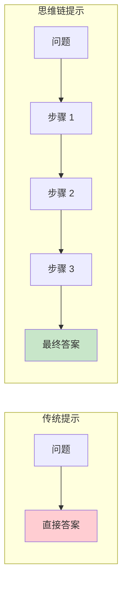
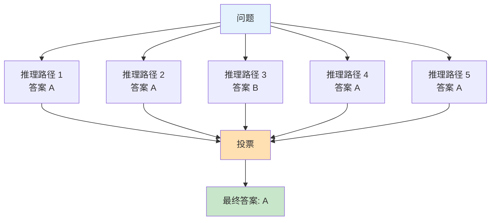
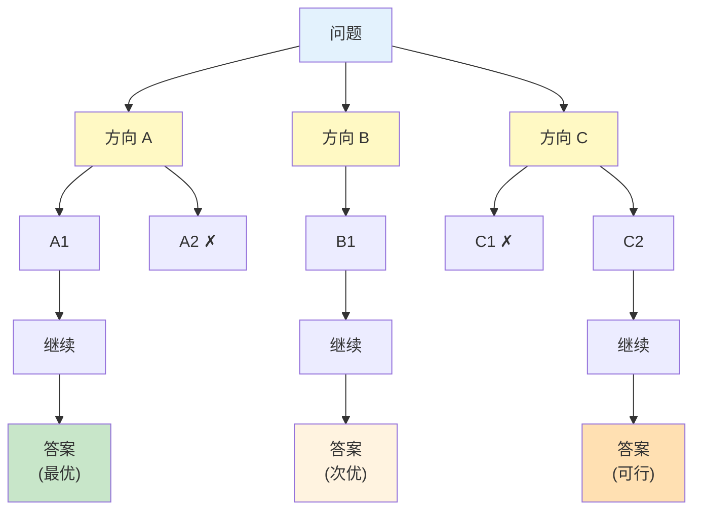
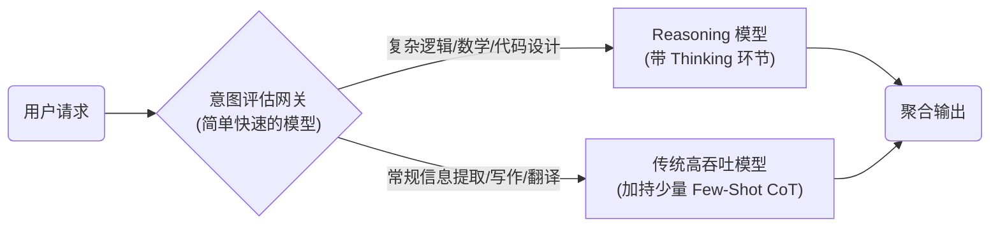

# 第六章 思维链与推理增强

思维链（Chain-of-Thought, CoT）是提示词工程领域的一项里程碑式技术。2022 年，Google 研究团队发现，通过在提示词中引导模型展示推理步骤，可以显著提升其在复杂推理任务上的表现。这一发现改变了人们对语言模型能力边界的认识。

思维链提示的核心思想是：不仅要求模型给出答案，还要求它展示得出答案的推理过程。这种方式激活了模型的推理能力，使其能够处理需要多步骤思考的复杂问题。

本章将深入探讨思维链技术的原理、变体和高级应用，帮助读者掌握这一提升模型推理能力的关键技术。

**本章目标**

- 理解本章核心概念与适用场景
- 掌握可复用的提示词/工作流模式
- 能将方法迁移到自己的任务中

## 1. 思维链提示的原理与价值

思维链（Chain-of-Thought, CoT）提示是一种通过引导模型展示中间推理步骤来提升复杂任务表现的技术，最早由 [Wei et al. (2022)](https://arxiv.org/abs/2201.11903) 提出。本节将介绍其基本原理、工作机制和应用价值。

### 6.1.1 什么是思维链提示

传统的提示方式直接要求模型输出最终答案：

```
问题：商店有 23 个苹果，卖出了 15 个，又进货了 12 个，现在有多少个？
答案：
```

模型可能直接输出一个数字，有时对有时错。

思维链提示则引导模型展示推理过程：

```
问题：商店有 23 个苹果，卖出了 15 个，又进货了 12 个，现在有多少个？

让我们一步步思考：
1. 初始数量：23 个
2. 卖出后剩余：23 - 15 = 8 个
3. 进货后总数：8 + 12 = 20 个

答案：20 个
```

通过展示中间步骤，模型的准确率显著提升。

!!! note "说明"
    
    上面的“逐步推理输出”是教学示例。真实业务/对外产品中，通常 **不建议强制要求模型输出冗长的完整推理过程**（会增加 Token 成本，也可能暴露不必要的细节）。更稳妥的做法是：让模型进行多步推理，但只输出 **关键步骤/核对点 + 最终答案**。



<p align="center">图 6-1：传统提示与思维链提示的对比</p>

### 1.2 为什么思维链有效

#### 1.2.1 分解复杂问题

思维链将复杂问题分解为一系列简单的子问题，每一步都是模型更容易处理的简单操作。

```
复杂问题："如果 A 比 B 高，B 比 C 高，C 比 D 高，那么 A 和 D 谁高？"

分解后：
步骤 1：A 比 B 高 → A > B
步骤 2：B 比 C 高 → B > C
步骤 3：C 比 D 高 → C > D
步骤 4：综合：A > B > C > D
结论：A 比 D 高
```

#### 1.2.2 利用生成的中间结果

模型在生成过程中可以“看到”自己之前输出的内容。当中间推理步骤被显式生成后，这些信息成为上下文的一部分，可以被后续推理利用。

#### 1.2.3 激活训练中的推理模式

大语言模型在训练过程中接触过大量包含推理过程的文本（如教科书、论文、解题过程等）。思维链提示激活了这些模式。

#### 1.2.4 减少跳跃性错误

直接输出答案时，模型可能“跳过”某些关键步骤导致错误。明确要求展示步骤可以减少这类遗漏。

### 5. 以生成长度换计算深度

从计算原理角度理解，思维链的核心是用生成长度换取计算深度——将原本单次前向传播里“压缩式”的推理，转化为多次前向传播分步执行。每一步的输出成为下一步的上下文输入，使模型在每一步都只需要完成较简单的判断，大幅降低了累积出错的概率。这解释了思维链在复杂推理任务上效果如此显著的原因——它把一个难题的“难度”分散到了多个简单步骤里。

### 1.3 思维链的适用场景

#### 1.3.1 高度适用

- **数学推理**：算术问题、方程求解
- **逻辑推理**：逻辑谜题、条件判断
- **多步骤问题**：需要多个步骤才能得出结论
- **常识推理**：需要结合多个常识知识点

#### 1.3.2 效果一般

* **简单事实问答**：直接提取即可，无需推理
* **创意生成**：不需要严格的逻辑步骤
* **格式转换**：规则明确的机械任务

### 1.4 与模型规模的关系

研究发现，思维链的效果与模型规模密切相关：

```
模型规模与 CoT 效果关系：

小模型（<10B 参数）：效果有限，可能产生无意义的推理步骤
中型模型（10-50B 参数）：有一定提升，但不稳定
大模型（>50B 参数）：效果显著，推理质量高
超大模型（>100B 参数）：效果最佳，复杂推理能力强
```

这种“涌现”特性源于 Wei et al. 2022 的早期发现，主要针对 base model。2024 年后，通过 SFT/distill 等训练手段，小模型（&lt;10B）也能获得稳定的 CoT 能力，因此本结论应理解为“在未经推理训练的 base model 上更适合大型模型”。

### 1.5 思维链提示的基本形式

#### 1.5.1 直接添加推理要求

```
问题：[问题描述]

请先完成推理并给出答案，然后用 3-5 条要点列出关键推导/核对点（不要输出冗长推理过程）。
```

#### 1.5.2 使用触发词

```
问题：[问题描述]

让我们逐步分析：
```

#### 1.5.3 结构化推理框架

```
问题：[问题描述]

请按以下结构分析：
1. 理解：这个问题要求我们做什么？
2. 已知：问题中给出了哪些信息？
3. 推理：如何从已知信息得出答案？
4. 结论：最终答案是什么？
```

### 1.6 思维链的输出示例

**问题**： 一列火车从 A 站出发，以每小时 80 公里的速度行驶。B 站位于 A 站前方 40 公里处。2 小时后，另一列火车从 B 站出发，以每小时 120 公里的速度同向追赶。问第二列火车何时能追上第一列？

**思维链回答**：

``` markdown
让我们一步步分析这个问题。

1. 理解问题：
   - 火车 1 从 A 站出发，速度 80km/h
   - B 站位于 A 站前方 40km
   - 2 小时后，火车 2 从 B 站出发，速度 120km/h，同向追赶
   - 问火车 2 何时追上火车 1

2. 计算初始状态：
   - 火车 1 行驶 2 小时后的位置：80 × 2 = 160km（距 A 站）
   - 此时火车 2 刚出发，位于 B 站
   - 两车距离：160km - 40km = 120km（火车 1 领先）

3. 计算追赶速度：
   - 速度差：120 - 80 = 40 km/h
   - 这是火车 2 相对于火车 1 的追赶速度

4. 计算追赶时间：
   - 需要追赶的距离：120km
   - 追赶时间：120 ÷ 40 = 3 小时

5. 得出结论：
   火车 2 在出发后 3 小时可以追上火车 1。
   如果从火车 1 出发时算起，是 2 + 3 = 5 小时后。
```

### 1.7 思维链的价值总结

```
价值维度        效果
───────────────────────
准确性提升      复杂推理任务准确率可提升 20-50%
可解释性        推理过程可见，便于验证和调试
可教学性        模型的推理可供人类学习参考
可纠错性        错误更容易被定位和纠正
适配性广        适用于多种需要推理的任务类型
```

### 1.8 思考

1. 设计一个特定的业务场景，在这个场景中，模型输出的“中间推理步骤”比“最终答案”更有价值？
2. 尝试对比一个数学问题在“有思维链”和“无思维链”情况下的输出，分析思维链是如何纠正逻辑错误的。

## 2. 零样本与少样本思维链

思维链提示可以分为零样本和少样本两种形式。两者各有特点和适用场景，本节将详细介绍它们的方法和应用。

### 2.1 零样本思维链

零样本思维链不需要提供推理示例，仅通过简单的触发语句即可激发模型的推理能力。

#### 2.1.1 核心方法

最著名的零样本 CoT 触发语是：

```
Let's think step by step.
```

或中文版本：

```
让我们一步一步思考。
```

#### 2.1.2 使用示例

```
问题：一个农场有 24 只鸡和 12 只鸭。农场主又买了 6 只鸡和卖出 4 只鸭。
现在农场总共有多少只家禽？

让我们一步一步思考：
```

模型会自动生成推理步骤并得出答案。

#### 2.1.3 常用触发语变体

```
基础版：
- "Let's think step by step."
- "让我们逐步分析。"

详细版：
- "让我们仔细思考这个问题，一步一步来。"
- "请先推理后回答，并用不超过 5 条要点列出关键步骤/核对点。"

引导版：
- "解决这个问题需要几个步骤，让我们依次进行。"
- "首先，让我们理解问题......"
```

#### 2.1.4 零样本 CoT 的优势

- **简单易用**：只需添加一句话
- **Token 高效**：不需要长篇示例
- **通用性强**：适用于各种推理任务
- **模型无关**：无需针对特定任务设计示例

### 2.2 少样本思维链

少样本思维链通过提供包含完整推理过程的示例，引导模型学习推理模式。

#### 2.2.1 基本结构

```
示例 1：
问题：[问题 1]
推理：
[详细的推理步骤]
答案：[答案 1]

示例 2：
问题：[问题 2]
推理：
[详细的推理步骤]
答案：[答案 2]

请解答：
问题：[新问题]
推理：
```

#### 2.2.2 完整示例

```
请按照示例的方式解答数学问题。

示例 1：
问题：小明有 5 个苹果，小红给了他 3 个，他又吃了 2 个。小明现在有几个苹果？
推理：
1. 初始：小明有 5 个苹果
2. 小红给了 3 个：5 + 3 = 8 个
3. 吃了 2 个：8 - 2 = 6 个
答案：6 个苹果

示例 2：
问题：商店有 30 件玩具，上午卖出 12 件，下午又进货 8 件。商店现在有多少件玩具？
推理：
1. 初始：商店有 30 件玩具
2. 上午卖出 12 件：30 - 12 = 18 件
3. 下午进货 8 件：18 + 8 = 26 件
答案：26 件玩具

请解答：
问题：图书馆有 120 本书，借出去 35 本，新购入 20 本。图书馆现在有多少本书？
推理：
```

### 2.3 零样本与少样本对比

```
维度              零样本 CoT          少样本 CoT
─────────────────────────────────────────────────
使用复杂度        简单              需要设计示例
Token 消耗         低                较高
推理格式控制      较弱              较强
错误示范风险      无                有可能
适用场景          通用推理          特定领域任务
```

### 2.4 选择策略

#### 2.4.1 选择零样本 CoT 的情况

```
✓ 快速原型验证
✓ 上下文窗口紧张
✓ 标准的数学/逻辑推理
✓ 对推理格式要求不严格
```

#### 2.4.2 选择少样本 CoT 的情况

```
✓ 需要特定的推理格式
✓ 非标准的推理任务
✓ 需要展示领域特定的推理步骤
✓ 准确性要求高
```

### 2.5 少样本 CoT 的示例设计

#### 2.5.1 推理步骤清晰

每个步骤应该清晰独立，有明确的输入和输出：

```
✓ 清晰的步骤：
步骤 1：提取已知条件 → 速度=60km/h，时间=2 小时
步骤 2：应用公式 → 距离=速度×时间
步骤 3：计算结果 → 距离=60×2=120km

✗ 模糊的步骤：
考虑了各种因素后，答案大概是 120km
```

#### 2.5.2 覆盖典型推理模式

示例应该覆盖任务中常见的推理模式：

```
算术推理示例：展示基本加减乘除的应用
逻辑推理示例：展示条件判断和推导
多步骤示例：展示如何组合多个步骤
```

#### 2.5.3 展示错误处理

有时可以包含如何处理特殊情况的示例：

```
问题：计算 10 ÷ 0 的结果。
推理：
1. 这是一个除法运算
2. 检查：除数为 0
3. 任何数除以 0 是未定义的
答案：无法计算（除以零未定义）
```

### 2.6 增强零样本 CoT 的技巧

#### 2.6.1 结构化触发

```
请按以下步骤思考：
1. 首先，理解问题要求什么
2. 其次，识别所有已知信息
3. 然后，确定解决问题的方法
4. 接着，逐步执行计算
5. 最后，检验答案并给出结论

问题：[问题描述]
```

#### 2.6.2 角色结合

```
你是一位数学老师，需要向学生展示解题过程。
请详细解释每一步的思路，让学生能够理解和学习。

问题：[问题描述]
```

#### 2.6.3 反思要求

```
问题：[问题描述]

请一步一步思考，得出答案后再检查一遍推理过程是否正确。
```

### 2.7 常见问题与解决方案

#### 问题 1：推理步骤过于冗长

``` markdown
解决方案：
- 在指令中限制步骤数量："用 3-5 个核心步骤解答"
- 要求简洁推理："给出简洁但完整的推理过程"
```

#### 问题 2：推理偏离正轨

``` markdown
解决方案：
- 使用结构化框架限定推理方向
- 少样本 CoT 提供正确的推理模式
- 增加"检验"步骤
```

#### 问题 3：最终答案格式不规范

```
解决方案：
在推理要求后添加格式约束：
"推理完成后，请用以下格式给出最终答案：【答案】：..."
```

### 2.8 延伸思考

1. “让我们一步步思考”这种零样本思维链为什么对大模型有效？它对小模型是否同样有效？
2. 设计一个少样本思维链提示来解决你工作中的一个推理任务，对比有无推理步骤的输出差异。

## 3. 自一致性与多路径推理

标准的思维链提示生成单一的推理路径，但这条路径可能是错误的。由 [Wang et al. (2022)](https://arxiv.org/abs/2203.11171) 提出的自一致性技术，通过生成多条推理路径并进行一致性投票，显著提升了推理的可靠性。

### 3.1 自一致性的核心思想

自一致性基于一个直觉：**如果多条不同的推理路径都得出相同的答案，那么这个答案更可能是正确的**。



<p align="center">图 6-2：自一致性的多路径采样与投票机制</p>

### 3.2 实现方法

#### 步骤一：多次采样

对同一问题使用相同的思维链提示，但设置较高的 Temperature（如 0.7-0.9），生成多条不同的推理路径。

```markdown
设置：
- 提示词：[包含思维链引导的提示]
- Temperature：0.7
- 采样次数：5-10 次
```

#### 步骤二：提取答案

从每条推理路径中提取最终答案：

```
推理路径 1：
...经过计算，结果是 25...
答案：25

推理路径 2：
...所以最终答案是 25...
答案：25

推理路径 3：
...因此得出 30...
答案：30
```

#### 步骤三：多数投票

对所有答案进行投票，选择出现次数最多的作为最终答案：

```
答案统计：
25：出现 4 次
30：出现 1 次

最终答案：25
```

### 3.3 自一致性的优势

#### 3.3.1 提升准确率

在 Wang et al. (2022) 的实验中，自一致性相对标准思维链的绝对提升为 GSM8K +17.9%、SVAMP +11.0%、AQuA +12.2%、StrategyQA +6.4%、ARC-challenge +3.9%；收益随任务与模型变化，不宜当作通用值。

#### 3.3.2 提供置信度指标

投票一致程度可以作为答案置信度的估计：

```
5/5 路径一致：高置信度
4/5 路径一致：中高置信度
3/5 路径一致：中等置信度
仅略多数一致：低置信度
```

#### 3.3.3 识别困难问题

如果多条路径给出分散的答案，说明这可能是一个困难问题，需要特别关注。

### 3.4 实现示例

```python linenums="1"
# 自一致性伪代码

def self_consistency(prompt, question, n_samples=5):
    answers = []

    # 生成多条推理路径
    for i in range(n_samples):
        response = call_llm(
            prompt=prompt + question,
            temperature=0.7
        )
        # 从回复中提取答案
        answer = extract_answer(response)
        answers.append(answer)

    # 多数投票
    from collections import Counter
    vote = Counter(answers)
    final_answer = vote.most_common(1)[0][0]
    confidence = vote.most_common(1)[0][1] / n_samples

    return final_answer, confidence
```

### 3.5 采样策略

#### 3.5.1 采样数量

```
推荐配置：
- 简单问题：3-5 次采样
- 中等问题：5-10 次采样
- 困难问题：10-20 次采样

权衡：
- 更多采样 → 更高准确率 → 更高成本
- 建议从 5 次开始，根据效果和成本调整
```

#### 3.5.2 Temperature 设置

```
Temperature 太低（<0.3）：路径多样性不足，很多采样重复
Temperature 太高（>1.0）：推理质量下降
推荐范围：0.5-0.8
```

### 3.6 变体技术

#### 3.6.1 加权投票

根据推理路径的质量给予不同权重：

``` markdown
评估推理质量的标准：
- 推理步骤的完整性
- 逻辑连贯性
- 中间计算的正确性

高质量路径的答案获得更高权重
```

#### 3.6.2 分组一致性

对于复杂问题，可以对每个子问题分别应用自一致性：

```
问题：计算表达式 (5 + 3) × (12 - 4) / 2

分组一致性：
1. 对 5 + 3 采样 5 次 → 一致性答案：8
2. 对 12 - 4 采样 5 次 → 一致性答案：8
3. 对 8 × 8 采样 5 次 → 一致性答案：64
4. 对 64 / 2 采样 5 次 → 一致性答案：32

最终答案：32
```

### 3.7 适用场景

#### 3.7.1 高度适用

```
✓ 有明确正确答案的任务（数学、逻辑）
✓ 可以从输出中清晰提取答案
✓ 对准确性要求高
✓ 可接受多次 API 调用的成本
```

#### 3.7.2 不太适用

```
✗ 开放性创意任务
✗ 没有"正确答案"的任务
✗ 需要实时响应的场景
✗ 成本敏感的应用
```

### 3.8 实践建议

1. **答案提取要准确**：确保能够从不同格式的回复中正确提取答案
2. **处理答案等价性**：相同答案可能有不同表述

   ```
   "25"、"二十五"、"25 个"应该被识别为同一答案
   ```
3. **设置合理的超时**：多次采样需要更多时间
4. **监控成本**：自一致性会成倍增加 API 调用次数

### 3.9 讨论

1. 自一致性需要多次 API 调用——在预算有限的场景下，你如何决定采样次数和成本之间的平衡？
2. 多数投票适合有“唯一正确答案”的问题，但对于开放性创作任务呢？你会如何改造这一策略？

## 4. 思维树与高级推理策略

思维链将推理过程表达为单一的线性链条，而一些更复杂的问题可能需要探索多个分支路径。思维树（Tree of Thoughts, ToT）及其他高级推理策略正是为解决这类问题而设计的。ToT 最初由 [Yao et al. (2023)](https://arxiv.org/abs/2305.10601) 和 [Long (2023)](https://arxiv.org/abs/2305.08291) 独立提出。

## 6.4.1 思维树概述

思维树是思维链的推广，它将推理过程组织为树形结构，允许在每个决策点探索多个可能的方向。



<p align="center">图 6-3：思维树的分支探索与路径剪枝</p>

### 4.2 思维树的核心组件

#### 4.2.1 思维生成

在每个节点生成多个可能的下一步：

```
当前状态：[已知条件]
可能的下一步：
1. [思路 1]
2. [思路 2]
3. [思路 3]
```

#### 4.2.2 状态评估

评估每个节点的质量或潜力：

```
评估标准：
- 该思路是否在正确方向上？
- 是否违反了任何约束？
- 继续这条路径的前景如何？

评分：1-10 分
```

#### 4.2.3 搜索策略

决定如何探索树结构：

```
常用搜索策略：
- 广度优先：先探索同层所有节点
- 深度优先：先沿一条路径探索到底
- beam search：保留评分最高的 K 条路径
```

### 4.3 思维树的应用示例

**问题**：24 点游戏——使用 4、6、8、9 四个数字和加减乘除运算，得到 24。

**思维树方法**：

```
初始状态：4, 6, 8, 9

第一层思维（选择运算）：
├─ 尝试乘法：4 × 6 = 24
│  剩余：8, 9, 24
│  评估：有 24 了，但需要处理 8 和 9 变成 0（困难）
│  评分：4/10
│
├─ 尝试：8 - 4 = 4
│  剩余：6, 9, 4
│  评估：没有明显接近 24 的路径
│  评分：3/10
│
└─ 尝试：9 - 6 = 3
   剩余：4, 8, 3
   评估：可以继续尝试
   评分：5/10

选择评分较高的路径继续；若探索后走入死路（如 9 - 6 = 3，剩下 4、8 无法凑出 24），
则回溯到其他分支重新探索。

最终在乘法分支上找到完整解：4 × 6 × (9 - 8) = 24
（四个数字各用一次：先算 9 - 8 = 1，再乘以 4 × 6 = 24）
```

### 4.4 提示词实现思维树

虽然完整的思维树通常需要编程实现，但可以通过提示词模拟简化版本：

```
你需要解决一个问题。请使用以下方法：

1. 生成阶段：列出 3 个可能的解决方向
2. 评估阶段：给每个方向评分（1-10）并说明理由
3. 选择阶段：选择最有前途的方向继续深入
4. 重复直到找到解决方案

问题：[问题描述]

---
第一轮：

可能的方向：
1. [方向 1]
2. [方向 2]
3. [方向 3]

评估：
- 方向 1：[评估理由] 评分：X/10
- 方向 2：[评估理由] 评分：X/10
- 方向 3：[评估理由] 评分：X/10

选择方向[最高分]继续...
```

### 4.5 其他高级推理策略

#### 4.5.1 递归自我改进

让模型反复审视和改进自己的输出：

```
步骤 1：生成初始答案
步骤 2：批判性评估答案的问题
步骤 3：基于批评改进答案
步骤 4：重复步骤 2-3 直到满意

提示词模板：
请解答问题：[问题]

【初始解答】
[生成解答]

【自我评估】
检查上述解答：
- 逻辑是否严密？
- 是否有遗漏？
- 答案是否完整？
[评估结果]

【改进版解答】
基于评估，改进如下：
[改进后的解答]
```

#### 4.5.2 分解-组合策略

将复杂问题分解为子问题，分别解决后再组合：

```
问题：分析公司的 SWOT 并提出战略建议

分解：
1. 子问题 1：分析 Strengths
2. 子问题 2：分析 Weaknesses
3. 子问题 3：分析 Opportunities
4. 子问题 4：分析 Threats
5. 子问题 5：基于 SWOT 提出建议

组合：综合所有子问题的答案，形成完整分析
```

#### 4.5.3 多视角推理

从不同角度分析同一问题：

```
请从以下三个视角分析这个决策：

【乐观者视角】
假设一切顺利，可能的收益是...

【悲观者视角】
如果出现问题，风险是...

【务实者视角】
平衡考虑后，合理的预期是...

【综合结论】
综合三个视角的分析...
```

### 4.6 选择合适的推理策略

```
问题类型                推荐策略
──────────────────────────────────────────
简单推理              标准思维链
需要探索多个方案        思维树
需要反复优化           递归自我改进
大问题可分解           分解-组合
需要全面视角           多视角推理
需要高可靠性           自一致性
```

### 4.7 实践建议

1. **从简单开始**：先尝试标准思维链，不够用再升级
2. **控制复杂度**：高级策略会增加 Token 消耗和响应时间
3. **结合使用**：可以将多个策略组合，如“思维树 + 自一致性”
4. **评估效果**：复杂策略不一定总是更好，需要测试验证

### 4.8 思考

1. 思维树相比思维链增加了“分支探索”和“回溯”能力——在什么类型的问题上这种额外成本是值得的？
2. 如果让你用思维树方法来规划一个实际项目（如产品上线方案），你会如何设计评估函数来打分各个方案？

## 5. Reasoning 模型专题：内置推理范式

自 2024 年末起，随着 OpenAI o 系列、后续 GPT-5.4 主线，以及 DeepSeek-R1 等 **Reasoning 模型（推理模型）** 的出现，大语言模型的推理能力经历了一次范式转换。这深刻地改变了思维链相关的提示词工程最佳实践。

本节将探讨在新一代推理模型上如何调整我们的提示词策略。

### 5.1 Reasoning 模型的工作原理

传统的大语言模型（如 GPT-4, Claude Sonnet 4.5, Llama 3）采用的是 **隐式推理** 或纯基于外部提示词触发的推理。而在推理模型的训练阶段，研究者利用强化学习不仅教导模型“如何给出正确答案”，更教导模型“**如何自己构建思维链**”。

这些模型在回答用户问题之前，会产生大量的 **思考 Token（Reasoning Tokens / Thinking Tokens）**。它们会在内部执行：

- **自发分解问题**
- **尝试多种路径**（类似于内置的思维树 ToT）
- **自我纠错**（发现死胡同后回溯）
- **综合得出结论**

由于推理过程已经被“内化”，这使得对它们的提示词设计必须彻底转变。

### 5.2 传统 CoT 模型 vs Reasoning 模型的提示策略

当面对一个困难的逻辑推理题时，两类模型的处理方式和期望的输入是截然不同的：

| 特性            | 传统 GPT-4 / Claude           | Reasoning 模型（OpenAI o1/o3、Claude Fable 5 / Opus 4.8 / Sonnet 4.6 的 Adaptive Thinking、DeepSeek-R1） |
| ------------- | --------------------------- | ------------------------------------------------------------------------------------------------- |
| **需要提示词触发？**  | ✅ 是（“让我们一步步思考”）             | ❌ 否（模型自动触发内部思考）                                                                                   |
| **需要给出推理示例？** | ✅ 是（Few-shot 会提升格式和准确性）     | ❌ 不建议（可能干扰模型原生的寻优路径）                                                                              |
| **提示词核心重点**   | 搭建推理支架、提供操作步骤               | **清晰准确地定义问题的条件与目标**                                                                               |
| **格式策略**      | 常见做法是输出关键步骤/核对点（不必强制冗长推理过程） | 推理过程对用户/API 是“透明或折叠”的，通常只输出结果                                                                     |
| **适合的任务**     | 结构化任务、文案写作、快速响应             | 复杂数学证明、硬核算法编写、高级逻辑谬误纠察                                                                            |

### 5.3 针对 Reasoning 模型的最佳实践

如果你正在使用 o1、o3、DeepSeek-R1 或 Claude 的 Adaptive Thinking（Fable 5 / Opus 4.8 / Opus 4.7 / Opus 4.6 / Sonnet 5 / Sonnet 4.6），请遵循以下“少即是多”的策略：

!!! warning "注意" 
    
    Claude Opus 5 的 thinking 默认开启——不写 `thinking` 字段即按 adaptive 思考（Opus 4.8 相反，不写就不思考），可用 `type: "disabled"` 关闭，但仅在 `effort` 为 `high` 及以下时接受，与 `xhigh` / `max` 同时使用会返回 400。Claude Sonnet 5 默认开启 Adaptive Thinking，并移除了手动 Extended Thinking；Fable 5 / Mythos 5 的 Adaptive Thinking 常开且不提供手动 Extended Thinking，二者已于 2026-07-01 恢复访问，Mythos 5 仍限获批客户。Opus 4.8 / 4.7 只支持 adaptive；Opus 4.6 与 Sonnet 4.6 上的手动 Extended Thinking（`type: "enabled"` + `budget_tokens`）已被标为 deprecated。不同 Claude 模型的 thinking 配置不能互换，接入前请按官方文档核对支持矩阵。

#### 5.3.1 移除显式的“思维链”指令

不要在提示词中要求模型“思考”或“展示中间步骤”。这不仅多余，还可能扰乱模型原生的强化学习思考范式。

- **✗ 避免**：“请详细写出你的思考过程，分三步走，第一步分析条件，第二步……”
- **✓ 推荐**：“解答以下微分方程系统：...”

!!! warning "注意" 

    此建议仅适用于 Reasoning 模型（如 o1、o3、Claude 的 Adaptive Thinking）。对于普通模型（如 GPT-4、Claude Sonnet），Chain-of-Thought 提示仍然有效且推荐使用，包括在提示词中请求“思考”或“深入思考”（参见第 6.2 节）。

#### 5.3.2 注重“限制条件”与“清晰目标”

推理模型最怕的不是“问题难”，而是“问题表述有歧义”或“边界不清晰”。

- **✗ 避免**：“帮我优化这段代码的性能。”（由于目标不明确，模型可能会往奇怪的优化方向上钻牛角尖耗尽推理 Token）。
- **✓ 推荐**：“优化以下 Python 函数：目标是将时间复杂度从 $O(n^2)$ 降低到 $O(n \log n)$。不可改变输入参数数量。保证兼容 Python 3.8。”

#### 5.3.3 简化格式和角色设定

推理模型天然对复杂的、强行加入的“人格设定”（Persona）或非必要的系统角色不敏感，有时甚至会因为过度关注角色而偏离逻辑核心。

- 保持 Prompt 极高密度的信息量（纯事实、纯条件）。

#### 5.3.4 控制 Reasoning Token 预算

在 API 层面，通常允许开发者控制推理模型应该思考多长时间。以 OpenAI Responses API 为例，当前形状是 `reasoning={"effort": "low"}`；可选值随模型变化，可能包括 `none`、`minimal`、`low`、`medium`、`high`、`xhigh`。

- **Low / minimal**：适合常规编码、中等逻辑题，优先控制延迟和 token 用量。
- **Medium**：适合大多数复杂问题。
- **High / xhigh**：耗时和成本更高，仅用于证明、复杂架构设计或长时间未解出的困难缺陷。

推理 token 通常不会作为可见答案返回，但会占用上下文空间，并按输出 token 口径计费；生产系统应同时设置 `max_output_tokens`，并监控 `usage.output_tokens_details.reasoning_tokens`。

### 5.4 混合架构的未来：Router 模式

在实际的企业应用中，我们并不应该把所有的请求都发给 Reasoning 模型——这会造成巨大的计算资源浪费。未来的成熟应用架构必然是 **Router（路由）模式**：



<p align="center">图 6-4：Reasoning 模型与快速模型的 Router 混合架构</p>

- **对于简单任务**：人工设计 Few-Shot 思维链并在快速模型上运行，性价比最高。
- **对于未知难度的深水区任务**：将其抛给 Reasoning 模型并给予充分的 Thinking Token 预算。

### 5.5 思考

1. 既然 Reasoning 模型已经内置了如此强大的思考能力，你认为提示词工程师的职责正在发生什么变化？
2. 在你的业务系统中，有哪些具体模块是值得引入这种“慢结题但高精度”的推理模型的？

