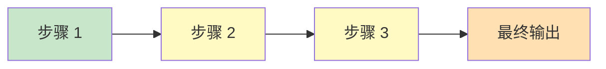
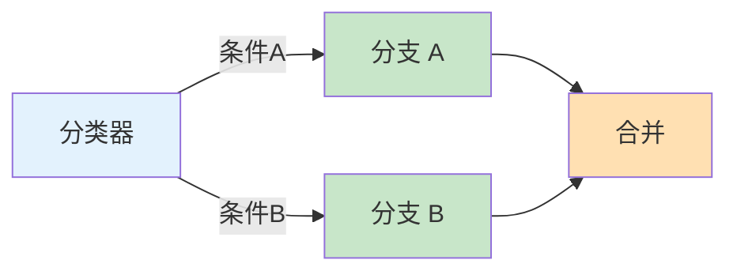
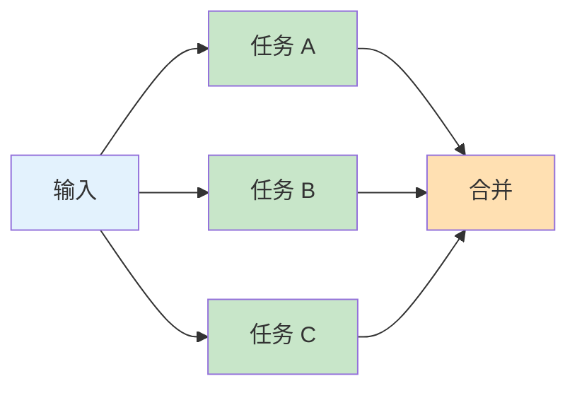
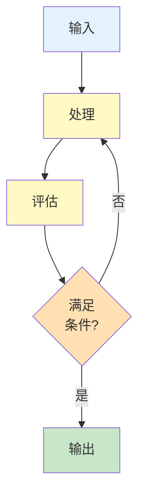
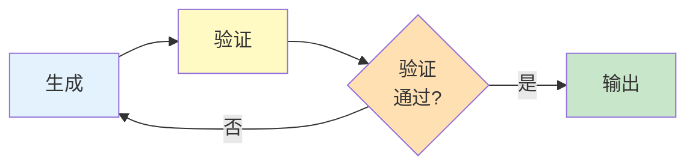
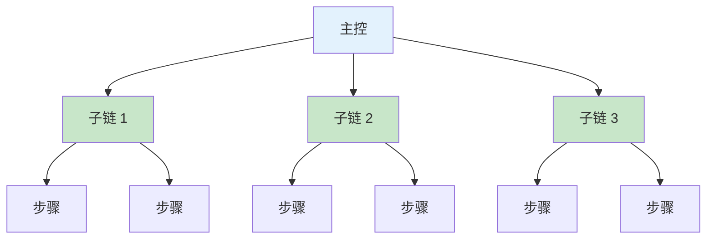
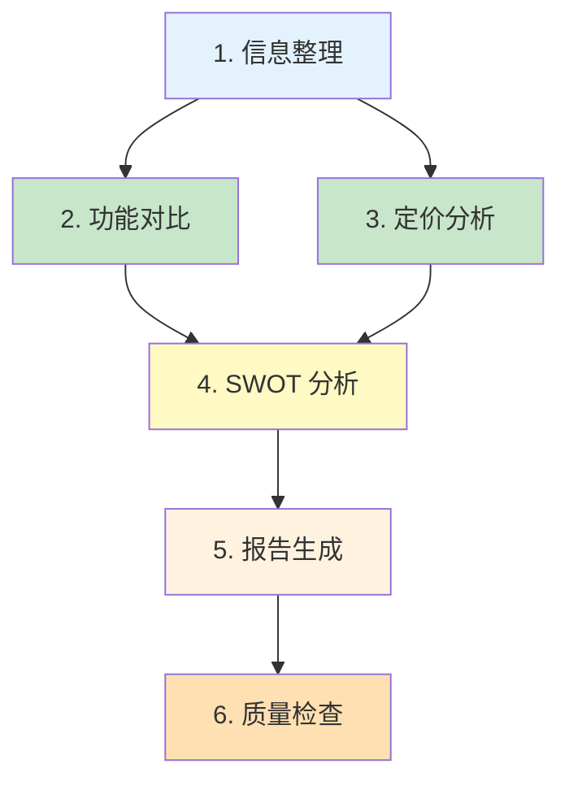
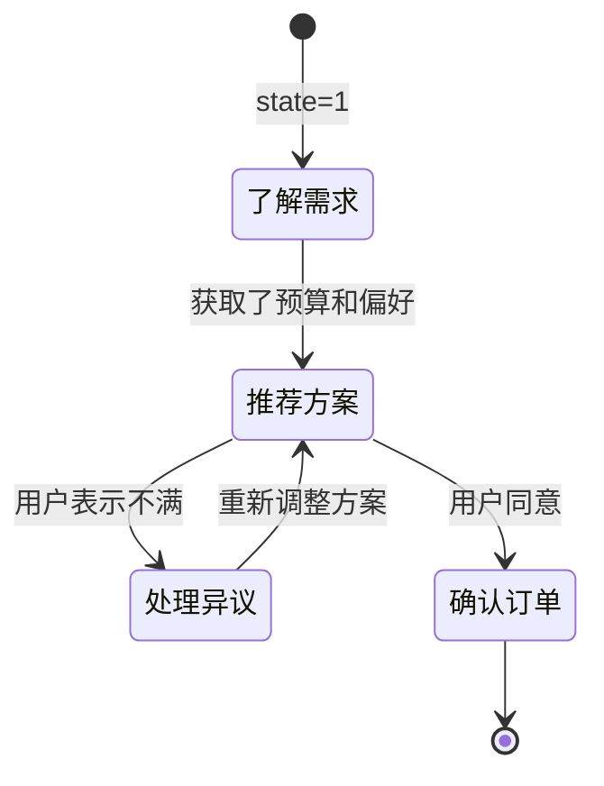

# 第七章 提示词链与任务分解

当面对复杂的工作流程时，单个提示词往往无法满足需求。提示词链技术通过将多个提示词调用串联起来，使前一个调用的输出成为后一个调用的输入，从而实现更复杂的自动化任务。

提示词链的核心思想是“分而治之”——将一个大型、复杂的任务分解为多个小型、可管理的子任务，每个子任务由专门设计的提示词处理。这种方法不仅提高了每个步骤的准确性，还使整个流程更加可控和可调试。

本章将介绍任务分解的方法论、链式模式的设计原则，以及如何在实践中构建可靠的多步骤工作流。

**本章目标**

- 理解本章核心概念与适用场景
- 掌握可复用的提示词/工作流模式
- 能将方法迁移到自己的任务中

## 1. 复杂任务的分解艺术

当任务规模超出单个提示词能够有效处理的范围时，任务分解成为必要的策略。本节将介绍如何识别可分解的任务，以及分解的基本方法和原则。

### 1.1 为什么需要任务分解

#### 1.1.1 单提示词的局限性

随着任务复杂度的增加，单个提示词面临以下挑战：

* **注意力分散**：多个子目标竞争模型的注意力
* **上下文限制**：大量信息可能超出上下文窗口
* **指令冲突**：多个要求可能相互干扰
* **错误累积**：一步错误可能影响全局

#### 1.1.2 分解的优势

- **精准聚焦**：每个步骤专注于单一目标
- **可控可调**：可以对单个步骤进行优化和调试
- **错误隔离**：一个步骤的问题不会影响其他步骤
- **可复用性**：通用的步骤可以在多个流程中复用

### 1.2 识别可分解的任务

#### 1.2.1 信号特征

以下特征表明任务可能需要分解：

```
✓ 涉及多个明显不同的子任务
✓ 需要多种不同类型的处理（分析、生成、验证）
✓ 单个提示词效果不稳定
✓ 输出结果过长或结构复杂
✓ 后续步骤需要前序步骤的结果
```

#### 1.2.2 任务类型示例

``` markdown
适合分解的任务：
- 文档处理流水线：提取 → 分析 → 总结 → 生成报告
- 多语言内容创作：构思 → 写作 → 审核 → 翻译
- 数据分析报告：数据理解 → 分析 → 可视化建议 → 报告生成
- 代码生成：需求分析 → 设计 → 编码 → 测试用例生成

不适合分解的任务：
- 简单翻译
- 单一格式转换
- 简短文本生成
```

### 1.3 分解策略

#### 策略一：按处理阶段分解

将任务分解为输入阶段、处理阶段和输出阶段。

``` markdown
示例：客户反馈分析

阶段 1：输入处理
- 清洗和标准化反馈文本
- 识别语言和翻译（如需要）

阶段 2：分析处理
- 情感分类
- 主题提取
- 问题识别

阶段 3：输出生成
- 统计汇总
- 洞察提炼
- 报告格式化
```

#### 策略二：按功能模块分解

将任务分解为不同的功能单元。

```
示例：技术文档生成

模块 1：结构规划
- 生成文档大纲

模块 2：内容生成
- 各章节内容创作

模块 3：技术验证
- 代码示例验证
- 技术准确性检查

模块 4：格式优化
- 格式标准化
- 术语一致性检查
```

#### 策略三：按决策点分解

在需要判断和选择的关键节点进行分解。

```
示例：智能客服路由

节点 1：意图识别
- 判断用户意图类别

节点 2：路由决策
- 根据意图选择处理路径

节点 3A：产品咨询处理
节点 3B：订单查询处理
节点 3C：投诉处理
```

### 1.4 分解原则

#### 原则一：单一职责

每个步骤只负责一个明确的任务。

```
❌ 混合职责：
提示词：分析用户评论的情感，提取关键词，生成回复，并翻译成英文

✓ 单一职责：
步骤 1：情感分析
步骤 2：关键词提取
步骤 3：回复生成
步骤 4：翻译
```

#### 原则二：明确边界

步骤之间的输入输出应该有明确定义。

```
定义接口：
步骤 1 输出 → 步骤 2 输入

输出格式：
{
  "sentiment": "positive",
  "confidence": 0.85,
  "raw_text": "原始文本..."
}

步骤 2 必须能处理此格式
```

#### 原则三：适度粒度

分解不宜过细也不宜过粗。

```
❌ 过细（增加额外开销）：
步骤 1：读取文本第一句
步骤 2：读取文本第二句
...

❌ 过粗（回到单提示词问题）：
步骤 1：完成所有处理

✓ 适度：
步骤 1：文本预处理（清洗、分段）
步骤 2：核心分析
步骤 3：结果整合
```

#### 原则四：可独立验证

每个步骤都应该能够独立测试和验证。

```
步骤 1：输入 A → 输出 B
测试：给定 A，验证 B 是否正确

步骤 2：输入 B → 输出 C
测试：给定 B，验证 C 是否正确

如果步骤 2 出问题，可以单独调试步骤 2
```

### 1.5 分解流程

```
1. 分析任务
   ├── 理解最终目标
   ├── 识别核心子任务
   └── 确定依赖关系

2. 设计分解方案
   ├── 选择分解策略
   ├── 定义步骤边界
   └── 设计数据流转

3. 实现各步骤
   ├── 为每个步骤设计提示词
   ├── 定义输入输出格式
   └── 实现步骤连接逻辑

4. 测试和优化
   ├── 单步骤测试
   ├── 端到端测试
   └── 迭代优化
```

### 1.6 动手试试

1. 选一个你日常工作中的复杂任务（如写周报、做竞品分析），尝试将它拆解为 3-5 个串行步骤，并为每步写一条独立的提示词。
2. 拆得太细会增加延迟和成本，拆得太粗又会丢失精度——你会用什么标准来判断“这里该不该再拆”？

## 2. 提示词链的设计模式

提示词链的设计模式是经过验证的解决方案模板，可以帮助快速构建可靠的多步骤工作流。本节将介绍几种常用的设计模式。

### 2.1 模式一：顺序链

最基本的模式，步骤按顺序执行，前一步的输出是后一步的输入。



<p align="center">图 7-1：顺序链模式的执行流程</p>

**适用场景**：流水线式处理，如文档处理管道

**实现示例**：

```

# 文档摘要生成管道

步骤 1：文档预处理
输入：原始文档
输出：清理后的文本

步骤 2：关键信息提取
输入：清理后的文本
输出：关键信息列表

步骤 3：摘要生成
输入：关键信息列表
输出：最终摘要
```

### 2.2 模式二：分支链

根据条件选择不同的处理路径。



<p align="center">图 7-2：分支链模式的条件路由</p>

**适用场景**：不同类型输入需要不同处理

**实现示例**：

```python linenums="1" title="智能客服分支处理"
def process_query(user_input):
    # 步骤 1：意图分类
    intent = classify_intent(user_input)

    # 步骤 2：分支处理
    if intent == "product_inquiry":
        response = handle_product_inquiry(user_input)
    elif intent == "order_status":
        response = handle_order_status(user_input)
    elif intent == "complaint":
        response = handle_complaint(user_input)
    else:
        response = handle_general(user_input)

    return response
```

### 2.3 模式三：并行链

多个步骤同时执行，最后合并结果。



<p align="center">图 7-3：并行链模式的任务分发与合并</p>

**适用场景**：多个独立分析可并行执行

**实现示例**：

``` markdown
# 产品评论多维度分析

并行任务：
任务 A：情感分析 → {"sentiment": "positive", ...}
任务 B：主题提取 → {"topics": ["质量", "价格"], ...}
任务 C：建议提取 → {"suggestions": ["改进包装"], ...}

合并步骤：
综合三个分析结果生成完整报告
```

## 7.2.4 模式四：循环链

重复执行某个步骤直到满足条件。



<p align="center">图 7-4：循环链模式的迭代与退出条件</p>

**适用场景**：需要迭代优化直到达标

**实现示例**：

``` markdown
# 文本改写迭代优化

初始文本 → 改写版本 1 → 质量评估(不满足)
                          ↓
          改写版本 2 ← 反馈优化方向
                ↓
          质量评估(满足) → 输出最终版本

最大迭代次数限制：3 次
```

### 2.5 模式五：验证链

生成结果后进行验证，必要时重新生成。



<p align="center">图 7-5：验证链模式的生成与验证闭环</p>

**适用场景**：需要确保输出符合特定标准

**实现示例**：

``` markdown
# JSON 生成与验证

步骤 1：生成 JSON
提示词："将以下信息转换为 JSON 格式..."
输出：{"name": "张三", "age": 25, ...}

步骤 2：验证
检查项：
- JSON 格式是否有效？
- 必填字段是否完整？
- 字段值是否在有效范围？

验证通过 → 返回结果
验证失败 → 附带错误信息重新生成（最多 3 次）
```

### 2.6 模式六：层级链

多层级的任务分解和执行。



<p align="center">图 7-6：层级链模式的多级任务分解</p>

**适用场景**：大型复杂任务的多级分解

**实现示例**：

``` markdown
# 完整报告生成

主控：报告规划
├── 子链 1：数据收集与处理
│   ├── 数据提取
│   └── 数据清洗
├── 子链 2：分析模块
│   ├── 趋势分析
│   ├── 对比分析
│   └── 异常检测
└── 子链 3：报告生成
    ├── 内容撰写
    ├── 图表建议
    └── 格式化输出
```

### 2.7 模式选择指南

```
任务特征                    推荐模式
───────────────────────────────────────
线性处理流程                顺序链
需要根据类型分类处理         分支链
多个独立分析可并行           并行链
需要迭代优化                循环链
输出需要验证                验证链
多层级复杂任务              层级链
```

### 2.8 模式组合

实际应用中，通常需要组合多种模式：

``` markdown
示例：智能文档处理系统

1. 顺序链：文档上传 → 格式转换 → 文本提取
2. 分支链：根据文档类型选择处理策略
3. 并行链：同时进行摘要、关键词、实体提取
4. 验证链：验证提取结果的准确性
5. 顺序链：整合结果 → 生成报告
```

### 2.9 延伸思考

1. 顺序链、并行链、条件链——哪种模式最能减少总延迟？哪种最能提高输出质量？
2. 在“生成-验证”模式中，如果验证步骤也可能犯错，你会如何设计“验证的验证”？

## 3. 上下文传递与状态管理

在提示词链中，如何有效地在步骤之间传递信息和管理状态是关键的技术挑战。本节将介绍相关的策略和最佳实践。

### 3.1 上下文传递的挑战

- **信息丢失**：每个步骤都是独立的模型调用，如果不主动传递，前序步骤的信息会丢失
- **信息冗余**：传递过多信息会导致 Token 浪费和注意力稀释
- **格式不匹配**：前后步骤的数据格式需要兼容

### 3.2 传递策略

#### 策略一：全量传递

将前序步骤的完整输出传递给后续步骤。

```
步骤 2 的输入：
{
  "previous_output": "[步骤 1 的完整输出]",
  "current_task": "[步骤 2 的任务描述]"
}
```

**优点**：信息完整 **缺点**： Token 消耗大，可能包含无关信息

#### 策略二：摘要传递

提取前序步骤输出的关键信息传递。

```
步骤 2 的输入：
{
  "step1_summary": "[步骤 1 输出的摘要]",
  "current_task": "[步骤 2 的任务描述]"
}
```

**优点**：节省 Token ，聚焦关键信息 **缺点**：可能丢失某些细节

#### 策略三：结构化传递

使用结构化格式传递必要信息。

```json
{
  "metadata": {
    "doc_id": "12345",
    "source": "step1"
  },
  "key_findings": [
    "发现 1",
    "发现 2"
  ],
  "data": {
    "field1": "value1",
    "field2": "value2"
  }
}
```

**优点**：结构清晰，易于解析 **缺点**：需要预先定义格式

### 3.3 状态管理模式

#### 模式一：无状态模式

每个步骤完全独立，所需信息全部通过输入传递。

```
步骤 N 的所有输入 = f(步骤 N-1 的输出)
```

**适用**：简单的线性流程

#### 模式二：累积状态模式

维护一个累积的状态对象，每个步骤可以读取和更新。

```python linenums="1"
result1 = {"summary": "（示例）步骤 1 的输出结果"}

state = {
    "original_input": "...",
    "step1_result": None,
    "step2_result": None,
    "errors": []
}

# 步骤 1 执行后
state["step1_result"] = result1

# 步骤 2 可以访问
step2_input = f"""
原始输入：{state["original_input"]}
步骤 1 结果：{state["step1_result"]}
当前任务：...
"""

print(step2_input.strip())
```

**适用**：需要访问历史信息的流程

#### 模式三：外部存储模式

将状态存储在外部系统（数据库、缓存等），步骤通过标识符访问。

```python linenums="1"
class InMemoryStorage:
    def __init__(self):
        self._data = {}

    def save(self, session_id, key, value):
        self._data[(session_id, key)] = value

    def load(self, session_id, key):
        return self._data[(session_id, key)]

storage = InMemoryStorage()
session_id = "demo-session"
result1 = {"summary": "（示例）步骤 1 的输出结果"}

# 步骤 1 完成后

storage.save(session_id, "step1_result", result1)

# 步骤 2 需要时

step1_result = storage.load(session_id, "step1_result")

print(step1_result)
```

**适用**：长时间运行或可恢复的流程

### 3.4 实现最佳实践

#### 3.4.1 定义清晰的接口

为每个步骤定义明确的输入输出格式：

```python linenums="1" title="步骤接口定义"
class Step1:
    input_schema = {
        "text": str,
        "config": dict
    }
    output_schema = {
        "entities": list,
        "sentiment": str,
        "confidence": float
    }
```

#### 3.4.2 使用模板构建提示词

```python linenums="1"
def build_step2_prompt(step1_output, step2_config):
    return f"""

## 上一步结果

{json.dumps(step1_output, ensure_ascii=False)}

## 当前任务

{step2_config['task_description']}

## 输出要求

{step2_config['output_format']}
"""
```

#### 错误处理

```python linenums="1"
def execute_chain(steps, initial_input):
    current_input = initial_input
    results = []

    for i, step in enumerate(steps):
        try:
            output = step.execute(current_input)
            results.append({
                "step": i + 1,
                "status": "success",
                "output": output
            })
            current_input = output
        except Exception as e:
            results.append({
                "step": i + 1,
                "status": "error",
                "error": str(e)
            })
            # 决定是否继续
            if step.critical:
                break

    return results
```

### 3.5 上下文压缩技术

当需要传递大量信息时，可以使用压缩技术：

#### 3.5.1 摘要压缩

```
步骤：总结压缩

输入：[1000 字的详细分析]

输出：[200 字的核心摘要]

将摘要传递给后续步骤
```

#### 3.5.2 关键信息提取

```
从以下文本中提取关键信息：
- 最重要的 3 个发现
- 关键数据点
- 主要结论

[原始文本]
```

#### 3.5.3 结构化压缩

将非结构化文本转换为结构化格式：

```
输入：大段文字描述
输出：
{
  "main_topic": "主题",
  "key_points": ["要点 1", "要点 2"],
  "action_items": ["行动 1"]
}
```

### 3.6 想一想

1. 随着链条变长，前面步骤的上下文信息可能丢失或走形。你会用什么策略来保持信息的完整传递？
2. 在多步骤链中，“全量传递上下文”和“只传递摘要”各有什么利弊？什么时候该用哪种？

## 4. 实战案例：构建多步骤工作流

本节通过一个完整的实战案例，展示如何设计和实现一个多步骤的提示词链工作流。

### 4.1 案例背景

**场景**：构建一个“竞品分析报告生成器”，能够根据输入的产品名称和竞品信息，自动生成结构化的竞品分析报告。

**输入**：

* 目标产品：产品名称和基本信息
* 竞品列表：2-3 个竞争对手产品

**输出**：

* 结构化的竞品分析报告（ Markdown 格式）

### 4.2 任务分解

经过分析，将任务分解为以下步骤：



<p align="center">图 7-7：竞品分析报告生成器的任务分解</p>

### 4.3 各步骤提示词设计

#### 步骤 1：信息整理

```markdown
# 步骤 1：信息整理

你是一位产品分析师。请整理以下产品信息，提取关键属性。

## 输入信息

{raw_product_info}

## 任务

1. 提取每个产品的核心属性：
   - 产品名称
   - 所属公司
   - 产品定位
   - 核心功能（3-5 个）
   - 目标用户
   - 定价模式

2. 以 JSON 格式输出整理后的结构化信息

## 输出格式

```

{ "target\_product": {...}, "competitors": \[...] }

#### 步骤 2：功能对比

```markdown
# 步骤 2：功能对比分析

你是一位产品功能专家。基于整理的产品信息，进行功能对比。

## 产品信息

{step1_output}

## 任务

1. 列出所有产品提及的功能点
2. 创建功能对比矩阵
3. 分析目标产品的功能优势和劣势

## 输出格式

```

{ "feature\_matrix": \[...], "target\_advantages": \[...], "target\_disadvantages": \[...], "analysis\_summary": "..." }

#### 步骤 3：定价分析

```markdown
# 步骤 3：定价分析

你是一位定价策略专家。分析各产品的定价策略。

## 产品信息

{step1_output}

## 任务

1. 整理各产品的定价信息
2. 分析定价策略差异
3. 评估目标产品的价格竞争力

## 输出格式

```

{ "pricing\_comparison": \[...], "pricing\_strategy\_analysis": "...", "price\_competitiveness": "..." }

#### 步骤 4： SWOT 分析

```markdown
# 步骤 4：SWOT 分析

你是一位战略分析师。基于前面的分析，为目标产品进行 SWOT 分析。

## 功能对比结果

{step2_output}

## 定价分析结果

{step3_output}

## 任务

对目标产品进行 SWOT 分析：
- Strengths（优势）：产品的内部优势
- Weaknesses（劣势）：产品的内部劣势
- Opportunities（机会）：外部市场机会
- Threats（威胁）：外部竞争威胁

## 输出格式

```

{ "strengths": \[...], "weaknesses": \[...], "opportunities": \[...], "threats": \[...] }

#### 步骤 5：报告生成

```markdown
# 步骤 5：综合报告生成

你是一位资深分析师，擅长撰写专业的竞品分析报告。

## 分析数据

### 产品信息

{step1_output}

### 功能对比

{step2_output}

### 定价分析

{step3_output}

### SWOT 分析

{step4_output}

## 任务

基于以上分析结果，生成一份完整的竞品分析报告。

## 报告结构

1. 执行摘要（200 字以内）
2. 竞品概览（表格形式）
3. 功能对比分析
4. 定价策略对比
5. SWOT 分析
6. 战略建议（3-5 条）

## 格式要求

- 使用 Markdown 格式
- 使用表格呈现对比数据
- 语言专业简洁
```

#### 步骤 6：质量检查

```markdown
# 步骤 6：报告质量检查

你是一位资深编辑。请审核以下竞品分析报告。

## 报告内容

{step5_output}

## 检查项目

1. 结构完整性：是否包含所有必需章节？
2. 内容一致性：各部分数据是否一致？
3. 逻辑连贯性：分析逻辑是否清晰？
4. 格式规范性：Markdown 格式是否正确？
5. 语言质量：是否有语病或不专业表达？

## 输出格式

```

{ "quality\_score": 1-10, "issues\_found": \[...], "suggestions": \[...], "approved": true/false }

```

如果 approved 为 false，请说明需要修改的地方。
```

### 4.4 工作流实现框架

```python linenums="1"
class CompetitorAnalysisWorkflow:

    def __init__(self, llm_client):
        self.llm = llm_client

    def run(self, product_info):
        # 步骤 1：信息整理
        step1_result = self.execute_step(
            "信息整理",
            STEP1_PROMPT.format(raw_product_info=product_info)
        )

        # 步骤 2 和 3：并行执行
        step2_result = self.execute_step(
            "功能对比",
            STEP2_PROMPT.format(step1_output=step1_result)
        )
        step3_result = self.execute_step(
            "定价分析",
            STEP3_PROMPT.format(step1_output=step1_result)
        )

        # 步骤 4：SWOT 分析
        step4_result = self.execute_step(
            "SWOT 分析",
            STEP4_PROMPT.format(
                step2_output=step2_result,
                step3_output=step3_result
            )
        )

        # 步骤 5：报告生成
        step5_result = self.execute_step(
            "报告生成",
            STEP5_PROMPT.format(
                step1_output=step1_result,
                step2_output=step2_result,
                step3_output=step3_result,
                step4_output=step4_result
            )
        )

        # 步骤 6：质量检查（带重试）
        final_report = self.quality_check_with_retry(step5_result)

        return final_report

    def execute_step(self, step_name, prompt):
        print(f"执行步骤: {step_name}")
        response = self.llm.generate(prompt)
        return response

    def quality_check_with_retry(self, report, max_retries=2):
        for attempt in range(max_retries + 1):
            # 步骤 6 的提示词要求返回 JSON，这里必须解析后才能取字段
            check_result = json.loads(self.execute_step(
                "质量检查",
                STEP6_PROMPT.format(step5_output=report)
            ))

            if check_result.get("approved", False):
                return report

            # 如果未通过，进行修正
            report = self.revise_report(
                report,
                check_result.get("suggestions", [])
            )

        return report

    def revise_report(self, report, suggestions):
        """按质检意见修订报告"""
        suggestion_text = "\n".join(suggestions)
        return self.execute_step(
            "报告修订",
            f"请根据以下修改建议修订这份竞品分析报告。\n\n"
            f"## 修改建议\n{suggestion_text}\n\n"
            f"## 原报告\n{report}"
        )
```

### 4.5 关键实现细节

1. **错误处理**：每个步骤添加 try-catch ，记录错误并决定是否继续
2. **超时控制**：为每个步骤设置合理的超时时间
3. **结果验证**：解析 JSON 输出时验证格式正确性
4. **日志记录**：记录每个步骤的输入输出，便于调试

### 4.6 讨论

1. 案例中的“竞品分析报告生成器”把流程拆成了 6 步。如果你要砍掉一步以减少成本，你会砍哪一步？为什么？
2. 试着把这个案例的思路迁移到你自己的业务场景——设计一个 3-5 步的工作流原型。

## 5. 多轮对话管理

在传统的单轮提示词工程中，我们将所有指令、背景和问题一次性发送给模型，模型返回结果，任务结束。但在实际应用（如 AI 助手、客服机器人、互动式数据分析）中，**多轮对话** 是最常见的交互模式。

将提示词工程扩展到多轮对话场景，会面临指令漂移、上下文长度爆炸、状态丢失等独特挑战。本节将介绍管理多轮对话状态的最佳实践。

### 5.1 对话历史的剪裁与摘要策略

随着对话轮数增加，保留完整的对话历史很快会耗尽模型的上下文窗口，并大幅增加 API 调用成本。

常用的历史压缩策略包括：

1. **固定窗口截断 (Sliding Window)**：最简单的策略，始终保留 **系统提示词**（system prompt） 和最近 $N$ 轮对话。 *优点*：实现极简，成本可控。 *缺点*：会导致模型彻底“忘记” $N$ 轮之前的重要设定或前提条件。
2. **动态摘要 (Dynamic Summarization)**：当对话长度达到阈值时，在后台启动一个独立模型调用，将早期的闲聊摘要成一句核心状态。

    ```
    [前 10 轮对话压缩]
    System Context: "用户正在计划去日本东京的蜜月旅行，预算两万人民币，偏好美食和自然风光，已经排除了浅草寺和迪士尼。"
    ```
3. **关键实体提取 (Key-Value State)**：针对表单填写、客诉登记等特定领域对话，使用信息抽取技术，时刻维护一个状态共享对象。

    ```json
    {
        "user_name": "张三",
        "order_id": null,
        "issue_type": "refund",
        "sentiment": "angry"
    }
    ```

### 5.2 多轮上下文中的指令漂移

**指令漂移** 是指在长对话中，随着最新一轮 User 输入的增加，模型逐渐“忘记”了 系统提示词（system prompt） 中定义的初始行为准则。

假设 系统提示词（system prompt） 要求：“你是一个法务助手，请始终以中日双语输出结果。” 在第 1 轮对话时模型做得很好，但到第 15 轮，用户输入大段中文案卷材料后，模型可能直接就用中文回答了。

**应对指令漂移的提示词“刷新”技巧：**

1. **指令后置 (Late-binding Prompt)** 不要仅仅依赖 系统提示词（system prompt）。在组装 API 请求时，在整个对话数组的最后（即最新的一条 User Message 中），隐式地附加或者重复最核心的约束规则。

    ```python linenums="1"
    # 请求组装时
    messages.append({
        "role": "user",
        "content": f"{user_input}\n\n[系统规则提示：请务必确保以中日双语回复，且使用敬语。]"
    })
    ```
2. **强制结构化响应** 通过前文 3.5 结构化输出 的技巧，强制模型每轮回答都必须填入规范格式，以此锁死它的行为边界，极大降低漂移概率。

### 5.3 状态机模式：管理复杂的引导流程

对于多轮问卷、面试陪练或剧本杀等应用，对话不仅是闲聊，而是有阶段性的。这时应当结合 **状态机 (State Machine)** 进行提示词管理。

系统维护一个内部 `state`，根据当前状态组装不同的提示词：



<p align="center">图 7-8：多轮对话状态机的状态流转</p>

**对应每种状态的后台逻辑**：

- **State=1（了解需求）**：提示词重点是“尽可能多提问，提取必填实体”。
- **State=2（推荐方案）**：提示词重点是“根据提取的实体检索知识库，以专业话术进行推销”。
- **State=3（处理异议）**：提示词重点是“安抚情绪，提供备选方案”。

在这种架构下，实际上 **每一轮对话发给大模型的 系统提示词（system prompt） 都是不一样的**。这比试图用一个大而全的 系统提示词（system prompt） 去覆盖所有可能的分支，效果要稳定得多。

### 5.4 思考

1. 设想你正在开发一个“模拟面试官” AI，面试分为自我介绍、专业技能问答、反问三个环节。你会如何设计它的多轮提示词策略？
2. 在固定窗口截断、动态摘要、关键实体提取中，哪个方案对延迟的要求最高？哪个方案的 API 成本最低？

## 6. 对话历史管理的深度指南

在上一节中我们介绍了多轮对话的基础概念，本小节将深入探讨在实际应用中如何有效管理对话上下文、防止信息丢失和成本爆炸。

### 6.1 对话上下文的压力测试

#### 问题：Token 数量随轮数线性累积

```
假设每轮对话平均 200 tokens：

轮数    总 Token 数    成本(GPT-4)    延迟
1       200          $0.003         0.5s
10      2000         $0.03          2s
50      10000        $0.15          5s
100     20000        $0.30          8s
500     100000       $1.50          20s
1000    200000       $3.00          30s

观察：
1. 成本与对话轮数成正比增长
2. 延迟随着上下文增加显著增加
3. 超过某个阈值后，模型效果反而下降
```

这就是我们需要对话历史管理策略的原因。

### 6.2 滑动窗口策略详解

#### 基础实现

```python linenums="1"
class SlidingWindowDialogueManager:
    """滑动窗口对话管理器"""

    def __init__(self, window_size: int = 10, system_prompt: str = ""):
        self.window_size = window_size
        self.system_prompt = system_prompt
        self.full_history = []

    def add_message(self, role: str, content: str):
        """添加消息到对话历史"""
        self.full_history.append({
            "role": role,
            "content": content,
            "timestamp": self._get_timestamp()
        })

    def get_context_for_api(self) -> List[Dict]:
        """获取用于 API 调用的上下文

        包含系统提示词和最近 N 轮对话
        """

        # 总是包含系统提示词
        context = [{"role": "system", "content": self.system_prompt}]

        # 添加最近 N 轮对话
        recent_messages = self.full_history[-self.window_size * 2:]
        context.extend(recent_messages)

        return context

    def get_stats(self) -> Dict:
        """获取对话统计信息"""
        return {
            "total_messages": len(self.full_history),
            "window_messages": min(self.window_size * 2, len(self.full_history)),
            "estimated_tokens": self._estimate_tokens(self.get_context_for_api()),
            "api_history_size": len(self.full_history),
            "context_loss": self._get_loss_percentage()
        }

    def _estimate_tokens(self, messages: List[Dict]) -> int:
        """估算 Token 数量（粗略）"""
        # 简化估算：1 个 token ≈ 4 个字符
        total_chars = sum(len(m.get("content", "")) for m in messages)
        return total_chars // 4

    def _get_loss_percentage(self) -> float:
        """计算因窗口截断而丢失的信息百分比"""
        total = len(self.full_history)
        kept = min(self.window_size * 2, total)
        return (total - kept) / total if total > 0 else 0

    def _get_timestamp(self) -> str:
        from datetime import datetime
        return datetime.now().isoformat()


# 使用示例

manager = SlidingWindowDialogueManager(window_size=5)
manager.system_prompt = "你是一个旅游顾问。"

# 模拟一个长对话

for i in range(20):
    manager.add_message("user", f"问题 {i}")
    manager.add_message("assistant", f"回答 {i}")

# 获取用于 API 的上下文

api_context = manager.get_context_for_api()
print(f"API 调用将包含 {len(api_context)} 条消息")
print(f"预估 Token: {manager.get_stats()['estimated_tokens']}")
print(f"丢失信息: {manager.get_stats()['context_loss']:.1%}")
```

**滑动窗口的优缺点**：

```
✓ 优点
- 实现极其简单
- 成本固定可控
- 无额外的 API 调用

✗ 缺点
- 早期信息完全丢失
- 无法追踪对话初期的关键设定
- 对长期一致性要求高的任务不适合
```

### 6.3 动态摘要策略（ Smart Summarization）

#### 6.3.1 实现原理

``` markdown
对话历史过长时：
1. 后台启动一个摘要提示词
2. 将早期对话压缩成 1-2 句总结
3. 将摘要替换原始的对话段落
4. 保留最近的完整对话用于上下文
```

#### 6.3.2 代码实现

```python linenums="1"
class DynamicSummarizationManager:
    """动态摘要对话管理器"""

    def __init__(
        self,
        llm_client,
        max_context_tokens: int = 3000,
        system_prompt: str = ""
    ):
        self.llm = llm_client
        self.max_context_tokens = max_context_tokens
        self.system_prompt = system_prompt
        self.messages = []
        self.summaries = []  # 存储历史摘要

    def add_message(self, role: str, content: str):
        """添加消息"""
        self.messages.append({
            "role": role,
            "content": content,
            "timestamp": self._get_timestamp()
        })

        # 检查是否需要摘要
        if self._should_summarize():
            self._trigger_summarization()

    def _should_summarize(self) -> bool:
        """检查是否需要进行摘要"""
        current_tokens = self._estimate_tokens(self.messages)
        return current_tokens > self.max_context_tokens

    def _trigger_summarization(self):
        """触发摘要过程"""

        # 获取需要摘要的消息（保留最后 10 条）
        to_summarize = self.messages[:-10]
        remaining = self.messages[-10:]

        if len(to_summarize) < 4:
            return  # 太短，不需要摘要

        # 构建摘要提示词
        summary_prompt = self._build_summary_prompt(to_summarize)

        # 调用 LLM 进行摘要
        summary = self.llm.generate(summary_prompt)

        # 存储摘要
        self.summaries.append({
            "content": summary,
            "messages_count": len(to_summarize),
            "timestamp": self._get_timestamp()
        })

        # 替换消息
        self.messages = [
            {
                "role": "system",
                "content": f"[早期对话摘要] {summary}"
            }
        ] + remaining

    def _build_summary_prompt(self, messages: List[Dict]) -> str:
        """构建摘要提示词"""

        conversation_text = "\n".join([
            f"{m['role']}: {m['content']}"
            for m in messages
        ])

        return f"""请总结以下对话的核心内容和关键信息，用 1-2 句话表达。
总结应该保留用户的主要需求、已做的决定和重要的上下文信息。

对话内容：
{conversation_text}

摘要："""

    def get_context_for_api(self) -> List[Dict]:
        """获取用于 API 调用的上下文"""
        context = [{"role": "system", "content": self.system_prompt}]
        context.extend(self.messages)
        return context

    def get_stats(self) -> Dict:
        """获取统计信息"""
        return {
            "total_messages": len(self.messages),
            "summaries_count": len(self.summaries),
            "estimated_tokens": self._estimate_tokens(self.get_context_for_api()),
            "compression_ratio": self._calculate_compression_ratio()
        }

    def _estimate_tokens(self, messages: List[Dict]) -> int:
        total_chars = sum(len(m.get("content", "")) for m in messages)
        return total_chars // 4

    def _calculate_compression_ratio(self) -> float:
        """计算压缩比"""
        total_summarized = sum(s["messages_count"] for s in self.summaries)
        total_current = len(self.messages)
        return total_summarized / (total_summarized + total_current) if total_summarized > 0 else 0

    def _get_timestamp(self) -> str:
        from datetime import datetime
        return datetime.now().isoformat()


# 使用示例

manager = DynamicSummarizationManager(
    llm_client=openai_client,
    max_context_tokens=3000
)

# 长对话模拟

for i in range(50):
    manager.add_message("user", f"用户问题 {i}: 详细的问题内容...")
    manager.add_message("assistant", f"助手回答 {i}: 详细的回答内容...")

stats = manager.get_stats()
print(f"摘要数: {stats['summaries_count']}")
print(f"压缩比: {stats['compression_ratio']:.1%}")
```

**动态摘要的优缺点**：

```
✓ 优点
- 保留长期信息
- 智能地维护上下文
- 对话可以无限长

✗ 缺点
- 额外 API 调用成本
- 摘要本身可能丢失细节
- 增加系统复杂度
```

### 6.4 关键信息提取与持久化

#### 6.4.1 结构化状态维护

当对话涉及数据填充（如表单、客服）时，最好维护一个结构化的“对话状态”对象：

```python linenums="1"
from dataclasses import dataclass, asdict
from typing import Optional
from datetime import datetime

@dataclass
class DialogueState:
    """对话状态快照"""
    user_id: str
    conversation_id: str
    intent: Optional[str] = None  # 用户的主要意图
    entities: dict = None  # 关键实体
    sentiment: Optional[str] = None  # 情感状态
    stage: Optional[str] = None  # 对话阶段
    last_updated: str = None

    def __post_init__(self):
        if self.entities is None:
            self.entities = {}
        if self.last_updated is None:
            self.last_updated = datetime.now().isoformat()


class StatefulDialogueManager:
    """有状态对话管理器"""

    def __init__(self, llm_client, db_client, state_schema: dict):
        self.llm = llm_client
        self.db = db_client  # 数据库客户端
        self.state_schema = state_schema  # 定义哪些字段需要追踪
        self.current_state = None

    def process_turn(self, user_input: str, conversation_id: str) -> str:
        """处理一轮对话"""

        # 1. 加载或初始化状态
        self.current_state = self._load_state(conversation_id)

        # 2. 使用 LLM 提取关键信息
        extracted = self._extract_entities(user_input)

        # 3. 更新状态
        self._update_state(extracted)

        # 4. 根据当前状态生成响应
        response = self._generate_response(user_input)

        # 5. 持久化状态
        self._save_state(conversation_id)

        return response

    def _extract_entities(self, user_input: str) -> dict:
        """使用 LLM 提取实体"""

        extraction_prompt = f"""从以下用户输入中提取关键信息。

当前状态：{self.current_state.entities}

用户输入：{user_input}

请提取以下字段（如果不存在则为 null）：
- 用户名
- 订单 ID
- 问题类型
- 优先级
- 情感（positive/negative/neutral）

返回 JSON 格式。"""

        response = self.llm.generate(extraction_prompt)
        # 解析 JSON 响应
        return self._parse_json_response(response)

    def _update_state(self, extracted: dict):
        """更新状态对象"""

        for key, value in extracted.items():
            if key not in self.state_schema:
                continue
            if hasattr(self.current_state, key):
                # sentiment 等已在 DialogueState 中声明的字段，直接写入属性
                setattr(self.current_state, key, value)
            else:
                # 其余字段统一放进 entities，否则 asdict() 不会持久化它们
                self.current_state.entities[key] = value

        self.current_state.last_updated = datetime.now().isoformat()

    def _generate_response(self, user_input: str) -> str:
        """根据当前状态生成响应"""

        # 构建包含状态的提示词
        prompt = f"""你是一个客服助手。

当前用户状态：
- 名字：{self.current_state.entities.get('user_name')}
- 订单 ID：{self.current_state.entities.get('order_id')}
- 问题类型：{self.current_state.entities.get('issue_type')}
- 情感：{self.current_state.sentiment}

用户输入：{user_input}

请生成合适的回应。"""

        return self.llm.generate(prompt)

    def _load_state(self, conversation_id: str) -> DialogueState:
        """从数据库加载状态"""
        stored = self.db.get(f"dialogue_state:{conversation_id}")
        if stored:
            return DialogueState(**stored)
        return DialogueState(
            user_id="",
            conversation_id=conversation_id
        )

    def _save_state(self, conversation_id: str):
        """保存状态到数据库"""
        self.db.set(
            f"dialogue_state:{conversation_id}",
            asdict(self.current_state),
            ttl=86400  # 24 小时过期
        )

    def _parse_json_response(self, text: str) -> dict:
        """解析 LLM 返回的 JSON"""
        import json
        import re

        # 尝试找到 JSON 块
        match = re.search(r'\{.*\}', text, re.DOTALL)
        if match:
            try:
                return json.loads(match.group())
            except json.JSONDecodeError:
                pass

        return {}


# 使用示例

manager = StatefulDialogueManager(
    llm_client=openai_client,
    db_client=redis_client,
    state_schema={
        "user_name": str,
        "order_id": str,
        "issue_type": str,
        "sentiment": str
    }
)

# 模拟对话

conversation_id = "conv_12345"

# 第一轮

response1 = manager.process_turn("我是王五，我想退货。", conversation_id)

# 第二轮 - 状态被自动恢复

response2 = manager.process_turn("订单号是 ORD-20240115-001", conversation_id)

# 此时，state.entities 会包含用户名和订单号

print(manager.current_state.entities)
```

### 6.5 多轮对话中的角色一致性维护

#### 问题：指令漂移

```
案例：
系统提示词规定："你必须始终用日语回应"

第一轮：✓ 用户：Hello (英文)
       ✓ 助手：こんにちは (日语)

第五轮：用户输入大段日文，然后问了一个英文问题
       ✗ 助手：用英文回答了，违反了规则！
```

#### 防御策略

**策略 1：强制格式化**

```python
def add_format_anchor(response: str, required_format: str) -> str:
    """强制确保响应格式"""

    format_instructions = {
        "json": {
            "wrapper": lambda x: f'{{"response": {x}}}',
            "validator": lambda x: x.startswith('{') and x.endswith('}')
        },
        "markdown_list": {
            "wrapper": lambda x: f"- {x}",
            "validator": lambda x: x.startswith('- ')
        },
        "japanese": {
            "wrapper": lambda x: f"[日本語] {x}",
            "validator": lambda x: "[日本語]" in x
        }
    }

    if required_format in format_instructions:
        spec = format_instructions[required_format]
        if not spec["validator"](response):
            response = spec["wrapper"](response)

    return response


# 使用

response = model.generate(prompt)
response = add_format_anchor(response, "japanese")
```

**策略 2：指令后置（ Late-Binding）**

```python linenums="1"
def inject_system_rules_at_end(
    user_input: str,
    core_rules: List[str]
) -> str:
    """在用户输入末尾注入关键规则，提高权重"""

    rules_text = "\n".join([f"- {rule}" for rule in core_rules])

    return f"""{user_input}

【重要系统规则 - 必须执行】
{rules_text}"""


# 使用

messages.append({
    "role": "user",
    "content": inject_system_rules_at_end(
        user_input,
        [
            "必须用日语回答",
            "不要使用 markdown",
            "字数控制在 100 以内"
        ]
    )
})
```

**策略 3：显式验证与修正**

```python
class ConsistencyValidator:
    """一致性验证器"""

    def __init__(self, expected_language: str = None):
        self.expected_language = expected_language

    def validate_and_fix(self, response: str) -> str:
        """验证响应的一致性，必要时修正"""

        issues = []

        # 检查语言
        if self.expected_language:
            if not self._is_language(response, self.expected_language):
                issues.append("language_mismatch")

        # 如果发现问题，重新生成
        if issues:
            return self._regenerate_with_emphasis(response, issues)

        return response

    def _is_language(self, text: str, language: str) -> bool:
        """检测文本语言"""
        # 使用 langdetect 库
        from langdetect import detect

        try:
            detected = detect(text)
            lang_map = {
                "japanese": "ja",
                "chinese": "zh-cn",
                "english": "en"
            }
            return detected == lang_map.get(language)
        except:
            return False

    def _regenerate_with_emphasis(self, original: str, issues: List[str]) -> str:
        """强化指令后重新生成"""

        emphasis_map = {
            "language_mismatch": f"你上次的回答不是{self.expected_language}！"
                                f"请用{self.expected_language}重新回答：{original}"
        }

        issue = issues[0]
        corrected_prompt = emphasis_map.get(issue, original)

        return model.generate(corrected_prompt)
```

### 6.6 长对话的上下文预算管理

#### 6.6.1 预算框架

```python linenums="1"
@dataclass
class ContextBudget:
    """上下文预算"""
    max_total_tokens: int = 4000  # 模型上下文限制
    system_prompt_tokens: int = 200
    buffer_tokens: int = 500  # 为响应预留

    @property
    def available_for_history(self) -> int:
        return (self.max_total_tokens -
                self.system_prompt_tokens -
                self.buffer_tokens)


class ContextBudgetManager:
    """上下文预算管理器"""

    def __init__(self, budget: ContextBudget):
        self.budget = budget
        self.messages = []
        self.usage = []

    def try_add_message(self, message: Dict) -> bool:
        """尝试添加消息，如果超预算则返回 False"""

        estimated_tokens = self._estimate_tokens(message)
        current_usage = sum(u["tokens"] for u in self.usage)

        if current_usage + estimated_tokens > self.budget.available_for_history:
            return False

        self.messages.append(message)
        self.usage.append({
            "timestamp": self._get_timestamp(),
            "tokens": estimated_tokens,
            "message_id": id(message)
        })

        return True

    def get_pruned_history(self) -> List[Dict]:
        """获取修剪后的历史

        如果超预算，移除最旧的消息
        """

        # 系统提示词的开销已由 budget.system_prompt_tokens 单独预留，
        # 这里只返回历史消息，避免重复计入
        context = []

        # 从最新消息开始添加
        for msg in reversed(self.messages):
            estimated = self._estimate_tokens(msg)

            if sum(self._estimate_tokens(m) for m in context) + estimated > self.budget.available_for_history:
                break

            context.insert(0, msg)

        return context

    def _estimate_tokens(self, message: Dict) -> int:
        """估算消息的 Token 数"""
        content = message.get("content", "")
        return len(content) // 4  # 粗略估算

    def _get_timestamp(self) -> str:
        from datetime import datetime
        return datetime.now().isoformat()


# 使用示例

budget = ContextBudget(
    max_total_tokens=4096,
    system_prompt_tokens=200,
    buffer_tokens=500
)

manager = ContextBudgetManager(budget)

# 添加消息，超预算时拒绝

for msg in dialogue_messages:
    if not manager.try_add_message(msg):
        print(f"超过上下文预算，无法添加更多消息")
        break

# 获取用于 API 的历史

pruned = manager.get_pruned_history()
```

### 6.7 最佳实践总结

| 场景            | 推荐方案    | 理由       |
| ------------- | ------- | -------- |
| 简短对话（<10 轮）   | 保留完整历史  | 信息完整，成本低 |
| 中等对话（10-50 轮） | 滑动窗口    | 平衡成本和信息  |
| 长对话（>50 轮）    | 动态摘要    | 保留长期上下文  |
| 数据填充任务        | 结构化状态   | 高效追踪关键信息 |
| 需要严格一致性       | 指令后置+验证 | 防止指令漂移   |

### 6.8 实践任务

1. 为一个客服场景设计完整的对话状态管理系统，包括哪些字段、如何持久化、如何从状态生成提示词
2. 实现一个“智能预算管理器”，在保持对话连贯的前提下，最大化利用上下文窗口

## 7. 本章实战练习

### 7.1 本章实战练习

本节提供递进式的练习题，帮助读者巩固提示词链与任务分解的知识，并在实际场景中应用。

#### 练习一：构建简单的顺序链（基础设计）

**目标**：体验如何将一个复杂任务拆解成流水线式的两步操作。

**场景**：你需要分析一份长篇的用户调研访谈记录，并生成一份面向开发团队的简短需求清单。

**输入文本示例**：

> “访谈者 A：我平时最常用的就是你们的搜索功能，但是每次搜索结果出来都没有按时间排序的选项，找以前的内容太费劲了。还有就是，我觉得系统默认的深色模式对比度太强，看着有点刺眼，希望能自己调。其实总体来说还是挺好用的，就是这两个点让我觉得不舒服。”

**任务**： 设计一个两步的提示词链：

1. **\[Step 1] 信息抽取 (Extraction)**：提取文本中提到的所有“用户痛点”和“具体功能诉求”，输出 JSON 数组。
2. **\[Step 2] 需求转化 (Translation)**：将 Step 1 输出的 JSON 转化为标准的 “User Story” 格式（作为\[角色]，我想要\[功能]，以便于\[价值]）。

**思考**：

* 如果不用链式结构，而是一个提示词让大模型直接输出最终结果，这两种方式在输出的 **结构一致性**和**追溯便利性** 上有什么区别？


#### 练习二：设计带验证环节的并行链（进阶架构）

**目标**：掌握并行调度与验证节点的应用。

**场景背景**： 你正在开发一个“自动代码审阅助手”。用户提交一段 Python 代码，系统需要审查其 **安全性（安全漏洞）** 和**性能（时间/空间复杂度）**，最后必须确保不能有互相矛盾的建议。

**任务**： 请设计这个工作流的架构。不一定需要写出完整的提示词，只需画出/写出带有判断逻辑的流程节点：

1. **并行节点设计**：同时触发“安全审查” Prompt 和“性能审查” Prompt。思考：为什么这里适合并行而不是串行？
2. **验证/融合节点设计**：设计第三个 Prompt，接收前两步的输出，并进行冲突检查。
   * 设计一个负面测试用例：假设性能审查建议“为了加速应该关闭所有的输入校验”，而安全审查建议“必须添加严格的输入校验”。验证节点应该如何处理？


#### 练习三：复杂长表单的多轮实体抽取架构（实战挑战）

**目标**：结合 7.5 节多轮对话管理，设计一个稳健的对话状态机。

**场景描述**： 你需要开发一个帮用户定机票的 AI 客服。必须收集以下五个必填实体： `出发地`、`目的地`、`出发日期`、`舱位等级`、`乘客人数`。 用户可能一次性给出 3 个条件，也可能分 5 句话一点点说，甚至中间会修改条件。

**架构设计任务**： 为了保证极高的稳定性，我们不使用单次对话的记忆，而是每轮对话都更新一个 **状态 JSON**。

1. 设计一个 **状态更新 Prompt**。
    - **输入：** 当前累积的 JSON 状态 + 用户最新的一句话
    - **指令：** 根据用户的最新发言，更新或填充 JSON 中的字段。

2. 设计一个 **回复生成 Prompt**。
    - **输入：** 更新后的 JSON。
    - **指令：** 判断还有哪些必填项为空。如果不为空，则继续自然地询问用户；如果全满，则输出“正在为您查询机票...”。

**实践验证**： 手工模拟这几轮对话：

- 初始状态：全空
- 轮次 1：用户：“我想订两张明天去上海的机票。”（更新状态：人数=2，目的地=上海，日期=明天。缺失：出发地，舱位）
- 轮次 2：客服（基准回复）：“请问您从哪里出发？对舱位有要求吗？”
- 轮次 3：用户：“哦对了，我带个小孩，一共三人。从北京走。没要求，便宜就行。”（测试点：能否跨轮更新人数从 2 变 3，能否将“便宜就行”映射为经济舱）。

!!! question "思考"

    采用这种 **累积状态模式 (State Accumulation)**，与传统的把所有历史消息直接发给模型的截断窗口模式相比，遇到上下文超长时的表现会有什么差异？

## 8. 本章小结

本章介绍了提示词链技术，通过将复杂任务分解为多个连接的步骤，实现更强大和可控的自动化能力。以下是本章的核心要点回顾：

### 8.1 关键概念

- **提示词链**：多个提示词调用串联，前一步输出作为后一步输入
- **任务分解**：将复杂任务拆分为可管理的子任务
- **设计模式**：解决常见场景的标准化方案
- **状态管理**：在步骤间有效传递和维护信息

### 8.2 核心要点

1. **任务分解原则**
    - 单一职责：每个步骤只做一件事
    - 明确边界：清晰定义输入输出
    - 适度粒度：不过细也不过粗
    - 可独立验证：每个步骤可单独测试

2. **常用设计模式**

    | 模式  | 特点   | 适用场景  |
    | --- | ---- | ----- |
    | 顺序链 | 线性执行 | 流水线处理 |
    | 分支链 | 条件路由 | 分类处理  |
    | 并行链 | 同时执行 | 独立任务  |
    | 循环链 | 迭代优化 | 质量迭代  |
    | 验证链 | 结果校验 | 质量保证  |
    | 层级链 | 多层分解 | 复杂任务  |


3. **上下文传递策略**
    - 全量传递：完整但 Token 消耗大
    - 摘要传递：节省 Token 但可能丢失细节
    - 结构化传递：结构清晰易解析

4. **状态管理模式**
    - 无状态模式：简单场景
    - 累积状态模式：需要历史信息
    - 外部存储模式：可恢复的长流程

5. **多轮对话管理**
    - 历史剪裁：固定窗口、动态摘要、实体提取
    - 应对指令漂移：指令后置刷新、强制结构化响应
    - 复杂引导：基于状态机 (State Machine) 架构动态装配提示词

### 8.3 实战案例要点

竞品分析报告生成器案例展示了：

- 将复杂报告生成分解为 6 个专注步骤
- 使用并行链加速独立分析
- 通过验证链确保输出质量
- 结构化的上下文传递

### 8.4 实践检查清单

构建提示词链时：

* [ ] 任务是否已合理分解？
* [ ] 每个步骤职责是否单一明确？
* [ ] 步骤间接口是否定义清晰？
* [ ] 上下文传递策略是否适当？
* [ ] 是否有必要的错误处理？
* [ ] 是否有质量检查机制？

### 8.5 延伸阅读

**任务分解**

- [Least-to-Most Prompting](https://arxiv.org/abs/2205.10625) - 任务分解策略论文

**设计模式**

- [LangChain Chains](https://docs.langchain.com/oss/python/langgraph/workflows-agents) - LangChain 链式调用核心概念
- [Prompt Chaining Guide](https://www.promptingguide.ai/techniques/prompt_chaining) - 提示词链模式指南

**上下文传递与状态管理**

- [Mem0 (Memory for AI)](https://github.com/mem0ai/mem0) - 大模型记忆与状态管理框架

**多轮对话管理**

- [Conversation state](https://developers.openai.com/api/docs/guides/conversation-state) - OpenAI 对话状态管理指南
