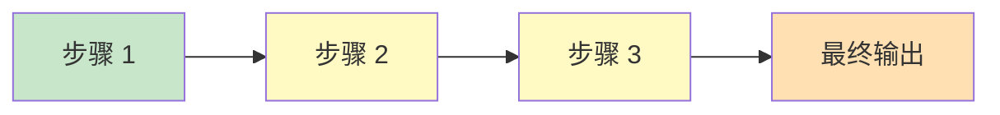
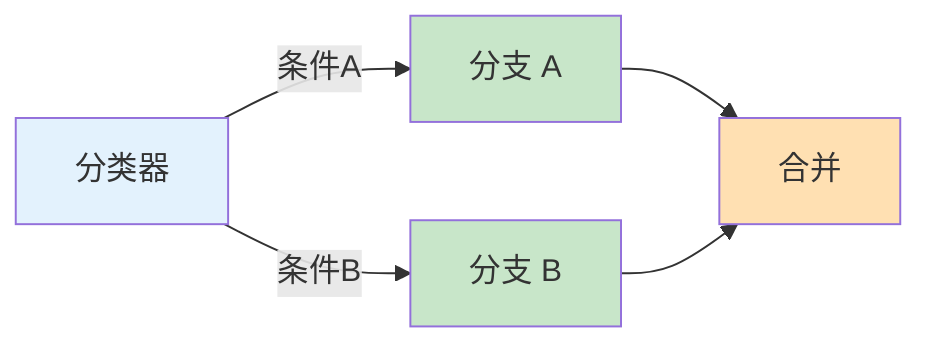
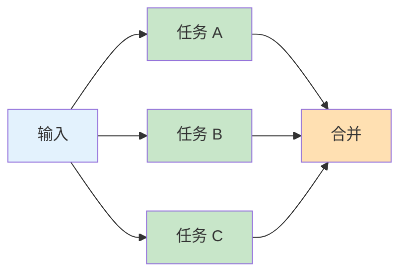
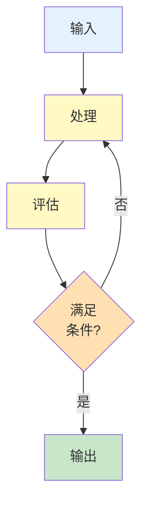
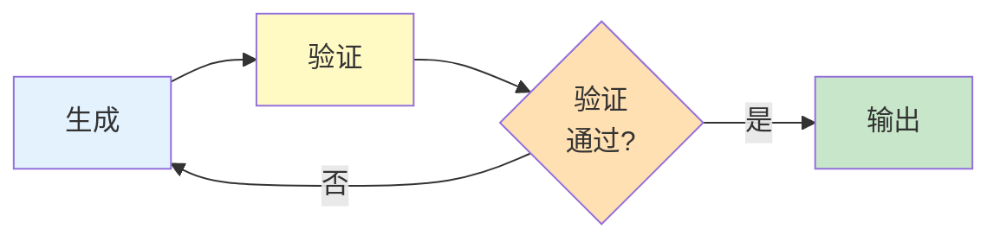
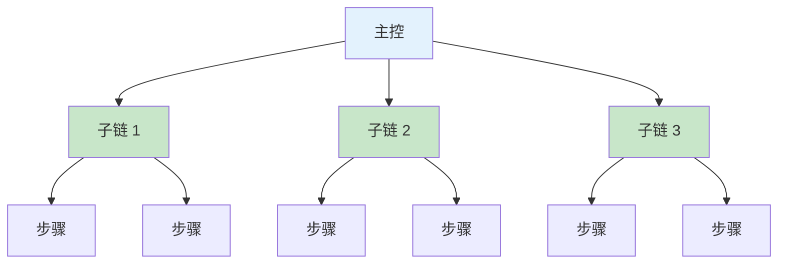

# 第七章 提示词链与任务分解

当面对复杂的工作流程时，单个提示词往往无法满足需求。提示词链技术通过将多个提示词调用串联起来，使前一个调用的输出成为后一个调用的输入，从而实现更复杂的自动化任务。

提示词链的核心思想是“分而治之”——将一个大型、复杂的任务分解为多个小型、可管理的子任务，每个子任务由专门设计的提示词处理。这种方法不仅提高了每个步骤的准确性，还使整个流程更加可控和可调试。

本章将介绍任务分解的方法论、链式模式的设计原则，以及如何在实践中构建可靠的多步骤工作流。

**本章目标**

- 理解本章核心概念与适用场景
- 掌握可复用的提示词/工作流模式
- 能将方法迁移到自己的任务中

## 1. 复杂任务的分解艺术

当任务规模超出单个提示词能够有效处理的范围时，任务分解成为必要的策略。本节将介绍如何识别可分解的任务，以及分解的基本方法和原则。

### 1.1 为什么需要任务分解

#### 1.1.1 单提示词的局限性

随着任务复杂度的增加，单个提示词面临以下挑战：

* **注意力分散**：多个子目标竞争模型的注意力
* **上下文限制**：大量信息可能超出上下文窗口
* **指令冲突**：多个要求可能相互干扰
* **错误累积**：一步错误可能影响全局

#### 1.1.2 分解的优势

- **精准聚焦**：每个步骤专注于单一目标
- **可控可调**：可以对单个步骤进行优化和调试
- **错误隔离**：一个步骤的问题不会影响其他步骤
- **可复用性**：通用的步骤可以在多个流程中复用

### 1.2 识别可分解的任务

#### 1.2.1 信号特征

以下特征表明任务可能需要分解：

```
✓ 涉及多个明显不同的子任务
✓ 需要多种不同类型的处理（分析、生成、验证）
✓ 单个提示词效果不稳定
✓ 输出结果过长或结构复杂
✓ 后续步骤需要前序步骤的结果
```

#### 1.2.2 任务类型示例

``` markdown
适合分解的任务：
- 文档处理流水线：提取 → 分析 → 总结 → 生成报告
- 多语言内容创作：构思 → 写作 → 审核 → 翻译
- 数据分析报告：数据理解 → 分析 → 可视化建议 → 报告生成
- 代码生成：需求分析 → 设计 → 编码 → 测试用例生成

不适合分解的任务：
- 简单翻译
- 单一格式转换
- 简短文本生成
```

### 1.3 分解策略

#### 策略一：按处理阶段分解

将任务分解为输入阶段、处理阶段和输出阶段。

``` markdown
示例：客户反馈分析

阶段 1：输入处理
- 清洗和标准化反馈文本
- 识别语言和翻译（如需要）

阶段 2：分析处理
- 情感分类
- 主题提取
- 问题识别

阶段 3：输出生成
- 统计汇总
- 洞察提炼
- 报告格式化
```

#### 策略二：按功能模块分解

将任务分解为不同的功能单元。

```
示例：技术文档生成

模块 1：结构规划
- 生成文档大纲

模块 2：内容生成
- 各章节内容创作

模块 3：技术验证
- 代码示例验证
- 技术准确性检查

模块 4：格式优化
- 格式标准化
- 术语一致性检查
```

#### 策略三：按决策点分解

在需要判断和选择的关键节点进行分解。

```
示例：智能客服路由

节点 1：意图识别
- 判断用户意图类别

节点 2：路由决策
- 根据意图选择处理路径

节点 3A：产品咨询处理
节点 3B：订单查询处理
节点 3C：投诉处理
```

### 1.4 分解原则

#### 原则一：单一职责

每个步骤只负责一个明确的任务。

```
❌ 混合职责：
提示词：分析用户评论的情感，提取关键词，生成回复，并翻译成英文

✓ 单一职责：
步骤 1：情感分析
步骤 2：关键词提取
步骤 3：回复生成
步骤 4：翻译
```

#### 原则二：明确边界

步骤之间的输入输出应该有明确定义。

```
定义接口：
步骤 1 输出 → 步骤 2 输入

输出格式：
{
  "sentiment": "positive",
  "confidence": 0.85,
  "raw_text": "原始文本..."
}

步骤 2 必须能处理此格式
```

#### 原则三：适度粒度

分解不宜过细也不宜过粗。

```
❌ 过细（增加额外开销）：
步骤 1：读取文本第一句
步骤 2：读取文本第二句
...

❌ 过粗（回到单提示词问题）：
步骤 1：完成所有处理

✓ 适度：
步骤 1：文本预处理（清洗、分段）
步骤 2：核心分析
步骤 3：结果整合
```

#### 原则四：可独立验证

每个步骤都应该能够独立测试和验证。

```
步骤 1：输入 A → 输出 B
测试：给定 A，验证 B 是否正确

步骤 2：输入 B → 输出 C
测试：给定 B，验证 C 是否正确

如果步骤 2 出问题，可以单独调试步骤 2
```

### 1.5 分解流程

```
1. 分析任务
   ├── 理解最终目标
   ├── 识别核心子任务
   └── 确定依赖关系

2. 设计分解方案
   ├── 选择分解策略
   ├── 定义步骤边界
   └── 设计数据流转

3. 实现各步骤
   ├── 为每个步骤设计提示词
   ├── 定义输入输出格式
   └── 实现步骤连接逻辑

4. 测试和优化
   ├── 单步骤测试
   ├── 端到端测试
   └── 迭代优化
```

### 1.6 动手试试

1. 选一个你日常工作中的复杂任务（如写周报、做竞品分析），尝试将它拆解为 3-5 个串行步骤，并为每步写一条独立的提示词。
2. 拆得太细会增加延迟和成本，拆得太粗又会丢失精度——你会用什么标准来判断“这里该不该再拆”？

## 2. 提示词链的设计模式

提示词链的设计模式是经过验证的解决方案模板，可以帮助快速构建可靠的多步骤工作流。本节将介绍几种常用的设计模式。

### 2.1 模式一：顺序链

最基本的模式，步骤按顺序执行，前一步的输出是后一步的输入。



<p align="center">图 7-1：顺序链模式的执行流程</p>

**适用场景**：流水线式处理，如文档处理管道

**实现示例**：

```

# 文档摘要生成管道

步骤 1：文档预处理
输入：原始文档
输出：清理后的文本

步骤 2：关键信息提取
输入：清理后的文本
输出：关键信息列表

步骤 3：摘要生成
输入：关键信息列表
输出：最终摘要
```

### 2.2 模式二：分支链

根据条件选择不同的处理路径。



<p align="center">图 7-2：分支链模式的条件路由</p>

**适用场景**：不同类型输入需要不同处理

**实现示例**：

```python linenums="1" title="智能客服分支处理"
def process_query(user_input):
    # 步骤 1：意图分类
    intent = classify_intent(user_input)

    # 步骤 2：分支处理
    if intent == "product_inquiry":
        response = handle_product_inquiry(user_input)
    elif intent == "order_status":
        response = handle_order_status(user_input)
    elif intent == "complaint":
        response = handle_complaint(user_input)
    else:
        response = handle_general(user_input)

    return response
```

### 2.3 模式三：并行链

多个步骤同时执行，最后合并结果。



<p align="center">图 7-3：并行链模式的任务分发与合并</p>

**适用场景**：多个独立分析可并行执行

**实现示例**：

``` markdown
# 产品评论多维度分析

并行任务：
任务 A：情感分析 → {"sentiment": "positive", ...}
任务 B：主题提取 → {"topics": ["质量", "价格"], ...}
任务 C：建议提取 → {"suggestions": ["改进包装"], ...}

合并步骤：
综合三个分析结果生成完整报告
```

## 7.2.4 模式四：循环链

重复执行某个步骤直到满足条件。



<p align="center">图 7-4：循环链模式的迭代与退出条件</p>

**适用场景**：需要迭代优化直到达标

**实现示例**：

``` markdown
# 文本改写迭代优化

初始文本 → 改写版本 1 → 质量评估(不满足)
                          ↓
          改写版本 2 ← 反馈优化方向
                ↓
          质量评估(满足) → 输出最终版本

最大迭代次数限制：3 次
```

### 2.5 模式五：验证链

生成结果后进行验证，必要时重新生成。



<p align="center">图 7-5：验证链模式的生成与验证闭环</p>

**适用场景**：需要确保输出符合特定标准

**实现示例**：

``` markdown
# JSON 生成与验证

步骤 1：生成 JSON
提示词："将以下信息转换为 JSON 格式..."
输出：{"name": "张三", "age": 25, ...}

步骤 2：验证
检查项：
- JSON 格式是否有效？
- 必填字段是否完整？
- 字段值是否在有效范围？

验证通过 → 返回结果
验证失败 → 附带错误信息重新生成（最多 3 次）
```

### 2.6 模式六：层级链

多层级的任务分解和执行。



<p align="center">图 7-6：层级链模式的多级任务分解</p>

**适用场景**：大型复杂任务的多级分解

**实现示例**：

``` markdown
# 完整报告生成

主控：报告规划
├── 子链 1：数据收集与处理
│   ├── 数据提取
│   └── 数据清洗
├── 子链 2：分析模块
│   ├── 趋势分析
│   ├── 对比分析
│   └── 异常检测
└── 子链 3：报告生成
    ├── 内容撰写
    ├── 图表建议
    └── 格式化输出
```

### 2.7 模式选择指南

```
任务特征                    推荐模式
───────────────────────────────────────
线性处理流程                顺序链
需要根据类型分类处理         分支链
多个独立分析可并行           并行链
需要迭代优化                循环链
输出需要验证                验证链
多层级复杂任务              层级链
```

### 2.8 模式组合

实际应用中，通常需要组合多种模式：

``` markdown
示例：智能文档处理系统

1. 顺序链：文档上传 → 格式转换 → 文本提取
2. 分支链：根据文档类型选择处理策略
3. 并行链：同时进行摘要、关键词、实体提取
4. 验证链：验证提取结果的准确性
5. 顺序链：整合结果 → 生成报告
```

### 2.9 延伸思考

1. 顺序链、并行链、条件链——哪种模式最能减少总延迟？哪种最能提高输出质量？
2. 在“生成-验证”模式中，如果验证步骤也可能犯错，你会如何设计“验证的验证”？
