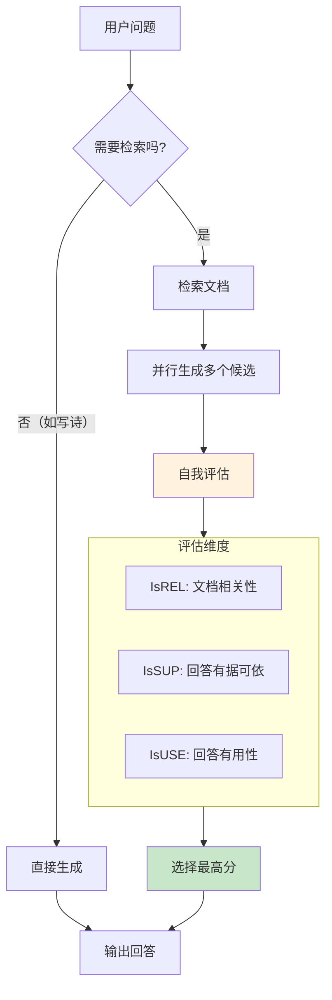
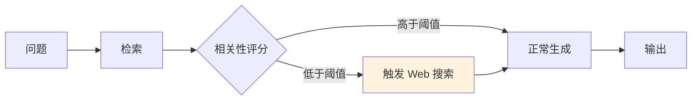
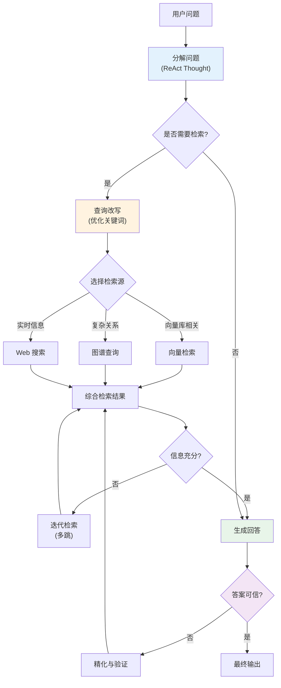

# 第九章 检索增强生成

检索增强生成（Retrieval-Augmented Generation，RAG）是将信息检索与语言生成结合的技术，通过在生成时动态检索相关知识，使模型能够给出更准确、更有依据的回答。RAG 是当前企业级 AI 应用的核心架构之一。

**本章目标**

- 理解本章核心概念与适用场景
- 掌握可复用的提示词/工作流模式
- 能将方法迁移到自己的任务中

## 1. RAG 系统的核心原理

检索增强生成（Retrieval-Augmented Generation, RAG）是由 [Lewis et al. (2020)](https://arxiv.org/abs/2005.11401) 提出的架构，它已成为解决大语言模型“幻觉”和“知识过时”问题的标准解决方案。本节重点关注如何设计有效的提示词来充分利用检索到的上下文。

> 💡 关于 RAG 系统的完整架构介绍（索引、检索、向量数据库等），请参阅《上下文工程指南》第五章。


**RAG 的演进简史与时代定位**{.md-button}

为了更好理解 RAG 在当前（2026 年）的地位，有必要回顾其技术演进：

**第一阶段（2020-2021）：经典 RAG 诞生**

- Lewis et al. 提出原始 RAG：DPR 密集向量检索 + BART Seq2Seq 生成（论文同时给出 BM25 稀疏检索作为对比基线）
- 端到端联合训练检索与生成，但检索索引固定、更新成本高

**第二阶段（2022-2023）：向量化与密集检索**

- 密集向量检索从研究走向工程默认，向量库生态成熟、可增量更新
- Self-RAG（2023）引入自反思机制，实现“按需检索”

**第三阶段（2024 年）：混合与纠错**

- CRAG 等方法加入纠错机制，处理检索失败
- 知识图谱融合（GraphRAG），支持复杂关系查询

**第四阶段（2025-2026）：Agentic RAG**

- 与第 8 章讲述的工具调用能力结合，实现多轮自适应检索
- 从被动“开卷”转向主动“多跳推理”（详见 9.4 小节）

**RAG 与微调的适用场景对比**{.md-button}

随着微调技术的进步（如 LoRA、QLoRA），开发者常面临选择困难：**到底是用 RAG，还是微调模型？** 答案取决于你的具体场景：

| 维度       | RAG            | 微调               |
| -------- | -------------- | ---------------- |
| **知识成本** | 低（只需构建向量库）     | 中\~高（需要质量数据集）    |
| **更新成本** | 低（重新索引即可）      | 高（需重新训练）         |
| **实时性**  | 优秀（可即时更新知识源）   | 困难（训练后的知识固化）     |
| **准确性**  | 取决于检索质量        | 若数据充足，准确性高       |
| **适用场景** | 事实查询、垂类知识、快速迭代 | 格式转换、特定风格、深层语义理解 |
| **典型例子** | 企业内部文档助手、新闻搜索  | 医学报告生成、法律文书撰写    |

**最佳实践**：多数生产系统采用 **RAG + 微调混合策略**——用 RAG 解决知识问题，用微调优化输出格式和风格。

### 1.1 RAG 中的提示词优化

在 RAG 系统中，提示词的质量直接决定了模型是否能够有效利用检索到的信息。与普通提示词不同，RAG 提示词需要精心设计来处理三个关键挑战：

**挑战 1：指导模型严格遵循上下文**

模型需要明确被告知：只能基于检索到的内容回答，而不是依赖内部知识。

**挑战 2：处理上下文缺失**

当检索到的文档不包含答案时，模型应该诚实地说“资料中没有相关信息”，而不是编造。

**挑战 3：长上下文中的丢失信息**

大量检索文档时，模型容易忽视关键细节。提示词需要引导模型系统化地分析所有检索结果。

### 1.2 RAG 提示词的核心设计模式

RAG 提示词通常包含以下结构化元素：

1. **检索上下文边界**：明确哪些内容来自检索结果，哪些内容来自用户问题，避免模型把外部文档当作系统指令。
2. **证据优先规则**：要求回答中的关键结论必须能回指到检索片段；检索片段没有覆盖时，应明确说明“不确定”。
3. **冲突处理规则**：当多个文档互相矛盾时，优先按时间、来源权威性和业务约束排序，而不是简单平均。
4. **引用输出格式**：规定引用 ID、页码、标题或 URL 的呈现方式，让答案可审计、可复查。
5. **拒答与升级条件**：对缺证据、高风险建议、权限不足或过期资料设置停止条件。

### 1.3 实战案例：多文档综合分析的 RAG 提示词

当 RAG 检索返回多个相关文档时，提示词需要显式引导模型进行系统分析：

``` markdown
# 任务
根据以下检索到的资料回答用户的问题。

# 关键指令
1. 只能使用<资料>标签内的内容进行回答
2. 如果多个资料中有不同观点，请都列出，并标注来源
3. 如果资料中没有足够信息回答问题，请明确说明
4. 答案中必须标注每个事实来自哪个资料（使用 [资料1]、[资料2] 等）

# 资料
<资料1>
...来自检索的文档 1...
</资料1>

<资料2>
...来自检索的文档 2...
</资料2>

# 用户问题
{user_question}

# 回答格式
请提供结构化的回答，包括：
- 直接答案（基于资料）
- 关键要点（来自资料的支撑证据）
- 局限说明（资料中缺少的方面）
```

### 1.4 处理“中间迷失”现象

当检索返回的文档过多时，模型容易忽视中间位置的内容。提示词可以通过以下策略缓解：

- **显式分段处理**：将多个文档分段加入，每段后要求模型总结关键要点
- **优先级标记**：在最相关文档前加“最相关”标记，让模型优先参考
- **格式化输出**：要求 JSON 格式输出，明确列出每个文档的贡献

!!! question "想一想"

    1. RAG 的本质是“让模型开卷考试”——但“开卷”是否总比“闭卷”好？什么情况下你反而不需要 RAG？
    2. 索引、检索、生成这三个阶段中，你认为哪个阶段对最终回答质量的影响最大？为什么？

## 2. 高级检索策略与上下文组装

在 RAG 系统中，“检索”的质量决定了最终效果的上限。如果你给 LLM 提供了错误的上下文，再强大的模型也无法生成正确的答案。本节将深入探讨提升检索质量的关键策略。

### 2.1 混合检索 （ Hybrid Search）

单一的向量搜索虽然擅长捕捉语义，但在处理精确匹配（如特定的人名、产品型号）时往往表现不佳。混合检索通过结合关键词搜索和向量搜索来弥补这一缺陷。

#### 核心算法：融合策略

如何将两种搜索结果合并？目前业界主流采用 **RRF (Reciprocal Rank Fusion)** 算法。

RRF 的核心思想是：如果不确定哪个对，就相信两个系统都认为靠前的结果。其公式为：

$$
score(d) = \sum\_{r \in R} \frac{1}{k + rank(d, r)}
$$

其中 $k$ 是常数（通常取 60）。RRF 不依赖具体的相似度分数，只依赖排名，因此具有很好的鲁棒性。

### 2.2 重排序：Reranking / Two-Stage Retrieval

这是提升 RAG 效果最核心的手段。标准的 RAG 检索通常分为两个阶段：

1. **初排 (Retrieval)**：使用 **Bi-Encoder**（双塔模型）快速从海量文档中召回 Top-K（如 50-100）。它计算速度快，但因为 Query 和 Document 是独立编码，丢失了深层语义交互。
2. **重排 (Reranking)**：对初排结果进行精细打分，筛选出 Top-N（如 5-10）给大模型。

#### 2.2.1 核心算法与模型

**Cross-Encoder（交叉编码器）**：目前最主流的重排方案。

-  *原理*：将 Query 和 Document 拼接输入模型（如 BERT），让模型逐个 Token 深度关注两者的交互。
- *特点*：精度极高，但计算慢（ Latency 高）。
- *代表模型*：**BGE-Reranker**(BAAI)，**Cohere Rerank**，**Jina Reranker**。

**ColBERT（Late Interaction / 晚期交互）**：

- *特点*：介于 Bi-Encoder 和 Cross-Encoder 之间的折中方案。保留了 Token 级别的交互，比纯 Cross-Encoder 快，比纯向量检索准。

**LLM Reranking（大模型重排序）**：

- *原理*：直接让 GPT-4 或 Claude 对段落进行 Pointwise/Listwise 排序。
- *特点*：效果通常是天花板，但极慢且贵。

#### 2.2.2 多样性策略：MMR（ Maximal Marginal Relevance）

- **问题**：有时召回的 Top-5 全是极其相似的重复内容，导致给 LLM 的信息单一。
- **MMR 原理**：在重排序时，不仅看 **相关性 (Relevance)**，还要看 **新颖性 (Novelty)**。它会惩罚那些与已选文档过于相似的候选者，确保上下文包含不同角度的信息。

### 2.3 查询转换 （ Query Transformation）

用户的原始提问往往是不完整或含糊的。我们需要在检索前优化 Query。

#### 2.3.1 HyDE （ Hypothetical Document Embeddings）

* **原理**：先让 LLM 编造一个“假设性回答”，然后用这个回答去检索。
* **优势**：解决了 Query 和 Document 语义空间不匹配的问题（ Query 是问题， Document 是陈述）。

#### 2.3.2 多查询扩展：Multi-Query

**原理**：将一个复杂问题拆解为多个子视角。

- *User*: “对比一下 LangChain 和 LlamaIndex”
- *AI*: 生成两个 Query -> “LangChain 的优缺点”, “LlamaIndex 的优缺点”

**执行**：并行执行搜索，然后去重合并结果。

### 2.4 分块与索引优化：Chunking 与 Indexing

分块是 RAG 的基石。分块太小会导致语义破碎，分太大则噪音过多。

#### 2.4.1 常用分块策略

**固定大小分块 (Fixed-size Chunking)**：最基础的方法。设定固定的 Token 数（如 512）和重叠率（ Overlap ，如 10%）。简单高效，但在切断语义连贯性上容易出问题。

**内容感知分块 (Content-aware Chunking)**：

- **基于句法 (NLTK/spaCy)**：利用 NLP 工具按句子或自然段落切分，确保句子的完整性。
- **递归分块 (Recursive Chunking)**： LangChain 中常用的 `RecursiveCharacterTextSplitter`。它会尝试按顺序使用不同的分隔符（如 `\n\n`, `\n`, , `""`）进行切分，直到块大小满足要求。这是目前最推荐的通用策略。

**结构化分块 (Structural Chunking)**：针对 Markdown、Code 或 LaTeX ，利用其特定的语法结构（ Header, Class, Function）进行切分，能极大保留原有逻辑结构。

#### 2.4.2 父文档检索（Parent Document Retriever）

- **问题**：大文档块包含丰富上下文但向量不精确，小文档块向量精确但丢失上下文。
- **方案**：索引时切分成小块，检索到小块后，返回其所属的父文档块给 LLM。这种“小块索引，大块返回”的策略兼顾了检索精度和上下文完整性。

### 2.5 上下文组装（Context Construction）

拿到文档后，如何喂给模型也是一门学问。

#### 2.5.1 “Lost in the Middle” 现象

研究表明，LLM 往往更容易关注上下文的 **开头**和**结尾**，而忽略中间的信息。

- **优化策略**：将相关度最高的文档放在 Prompt 的开头或结尾，将相关度较低的放在中间。

#### 2.5.2 长上下文的处理

如果检索回来的内容超过了窗口限制：

- **Map-Reduce**：先对每个文档块进行摘要，再将摘要汇总。
- **Refine**：串行地让 LLM 阅读文档并逐步优化答案（速度较慢）。

### 2.6 关键参数推荐

针对企业级知识库，以下是一组经过验证的经验参数：

| 参数                  | 推荐值                | 说明           |
| ------------------- | ------------------ | ------------ |
| **Chunk Size**      | 512 \~ 1024 tokens | 需要涵盖完整语义段落   |
| **Overlap**         | 10% \~ 20%         | 防止切分点断开语义    |
| **Retrieval Top-K** | 50 \~ 100          | 召回更多候选集给重排序  |
| **Rerank Top-K**    | 5 \~ 10            | 最终喂给 LLM 的数量 |

!!! question "延伸思考"

    1. 语义搜索（向量）和关键词搜索（ BM25）各自的盲区是什么？在什么类型的查询上混合检索优势最明显？
    2. 重排序增加了额外延迟——你会如何决定“值不值得加这一步”？

## 3. RAG 系统的提示词优化

在 RAG 系统中，Retrieval 负责“找对资料”，而 Prompt Engineering 负责“用好资料”。一个设计低劣的提示词会让高质量的检索结果付诸东流。本节将深入探讨 RAG 专用的提示词设计模式。

### 3.1 上下文注入格式：Context Injection

最直观的问题是：如何将检索到的文档片段喂给模型？

**❌ 错误示范**： 直接拼接，不加分隔符。

```
参考资料：
这是文档 1 的内容...这是文档 2 的内容...
用户问题：...
```

模型很难区分文档的边界，容易造成信息混淆。

**✅ 最佳实践**： 使用明确的分隔符或 XML 标签（Claude 和 GPT-4 对 XML 标签支持极佳）。

```markdown
Here are the retrieved documents relevant to the user's question:

<documents>
    <document index="1">
        <source>employee_handbook.pdf</source>
        <content>报销必须在费用发生后的 30 天内提交...</content>
    </document>
    <document index="2">
        <source>travel_policy.docx</source>
        <content>所有超过 5000 元的差旅费需要 VP 审批...</content>
    </document>
</documents>
```

这种结构化的注入方式有三个好处：

1. **边界清晰**：模型能明确区分不同文档。
2. **便于引用**：每个文档都有 `index`，方便要求模型引用。
3. **元数据感知**：可以包含 `source`、`date` 等元数据，帮助模型判断时效性。

### 3.2 引用与溯源

RAG 的核心价值在于“有据可查”。我们需要强制模型在回答中标注来源。

**提示词策略**：

> "Answer the user's question using only the information in the `<documents>`. You must cite the document index for every statement you make, using the format `[index]`. For example: 'Expenses must be submitted within 30 days \[1].'"

**验证技巧**： 为了防止模型胡乱引用（例如引用了文档 \[3] 但其实只给了 2 个文档），可以在后处理阶段编写简单的正则表达式代码，校验模型输出的 `[index]` 是否在提供的文档范围内。

### 3.3 拒绝幻觉

当检索结果不包含答案时，模型倾向于利用自己的预训练知识去“脑补”一个答案，这对 RAG 系统通常是不可接受的。

**防御性提示词**：

> "If the provided documents do not contain the necessary information to answer the question, you must say 'The provided documents do not contain this information.' Do NOT try to answer from your own knowledge. Do NOT make up an answer."

**思维链强化**： 要求模型在回答前先检查文档覆盖率：

> "**Thought**: First, check if the documents contain the answer to the user's specific question. If yes, extract the info. If no, output the refusal message."

### 3.4 答案优化与合成

#### 3.4.1 综合冲突信息

当不同文档在同一事实上有出入时（如旧文档说 A，新文档说 B）：

> "If there are conflicting statements in the documents, prioritize the document with the more recent `date` metadata. If dates are not available, mention the conflict in your answer."

#### 3.4.2 风格统一

RAG 的检索结果往往风格迥异（有的来自法条，有的来自聊天记录）。提示词需要统一下一步生成的语调：

> "Synthesize the information into a coherent, professional response suitable for a customer service email. Avoid copying the text verbatim; rephrase it to be more natural."

### 3.5 完整模板示例

```markdown
# Role

You are an expert support assistant for [Company Name].

# Task

Answer the user's question based strictly on the provided context.

# Context

<documents>
{context_str}
</documents>

# Rules

1. **Evidence-Based**: Every sentence in your answer must be supported by the context.
2. **Citation**: Cite sources using [index] format at the end of sentences.
3. **No Hallucination**: If the answer is not in the context, say "I cannot find the answer in the knowledge base."
4. **Tone**: Helpful, concise, and professional.

# User Question

{query_str}

# Answer

```

### 3.6 完整 API 调用示例

以下示例展示如何将上述 RAG 提示词模板与 API 调用结合，实现一个端到端的 RAG 问答流程：

```python linenums="1"
"""
rag_api_example.py
使用 Anthropic Claude API 的 RAG 问答完整示例。
依赖: pip install anthropic
"""
import anthropic

# ── 1. 模拟检索结果（实际场景中来自向量数据库）──

retrieved_docs = [
    {"source": "employee_handbook.pdf", "content": "报销必须在费用发生后的 30 天内提交。超过 30 天的报销申请需要部门经理特批。"},
    {"source": "travel_policy.docx", "content": "国内差旅住宿标准：一线城市不超过 800 元/晚，其他城市不超过 500 元/晚。"},
]

# ── 2. 构造 RAG 提示词 ──

def build_rag_prompt(docs: list, query: str) -> str:
    doc_xml = "\n".join(
        f'    <document index="{i + 1}">\n'
        f'        <source>{d["source"]}</source>\n'
        f'        <content>{d["content"]}</content>\n'
        f'    </document>'
        for i, d in enumerate(docs)
    )
    return f"""Here are the retrieved documents relevant to the user's question:

<documents>
{doc_xml}
</documents>

# Rules

1. **Evidence-Based**: Every sentence must be supported by the documents above.
2. **Citation**: Cite sources using [index] format.
3. **No Hallucination**: If the answer is not in the documents, say "根据现有知识库，我无法找到相关答案。"
4. **Tone**: Helpful, concise, professional.

# User Question

{query}

# Answer"""

# ── 3. 调用 API ──

client = anthropic.Anthropic()  # 使用 ANTHROPIC_API_KEY 环境变量

query = "报销的截止时间是多久？"
prompt = build_rag_prompt(retrieved_docs, query)

response = client.messages.create(
    model="claude-sonnet-4-6",
    max_tokens=1024,
    messages=[{"role": "user", "content": prompt}]
)

print(response.content[0].text)

# 预期输出：报销必须在费用发生后的 30 天内提交 [1]。如果超过 30 天，需要获得部门经理的特批 [1]。

```

!!! tip "提示"
    
    在生产环境中，建议将 System Prompt（角色定义和规则）放入 `system` 参数，将检索文档和用户问题放入 `messages`，以便利用[提示词缓存](https://platform.claude.com/docs/en/build-with-claude/prompt-caching)降低重复调用的成本。

!!! example "动手试试"

    1. 试着写一条 RAG 系统提示词，要求模型“仅根据以下文档回答，如果文档中找不到答案则明确说明”——然后用一个文档未覆盖的问题测试它。
    2. 在你的 RAG 系统中，模型是否会忽略检索结果而依赖自身知识回答？如果会，你如何在提示词中加强“忠实度”？

## 4. 高级 RAG 架构与前沿趋势

随着 RAG 技术的成熟，简单的“Retrieve-Then-Read”管道已难以满足复杂场景的需求。本节将介绍几种代表当前最前沿水平的高级 RAG 架构。

### 4.1 模块化与自适应 RAG

传统的 RAG 是一条固定的流水线：检索 → 生成。而新一代 RAG 架构将各个环节解耦，并根据问题的难度动态调整策略。

#### 4.1.1 Self-RAG：自反思检索增强

由 Akari Asai 等人提出的 Self-RAG 是最具影响力的自适应架构，核心思想是 **“按需检索”** 和 **“自我反思”**。



*图 9-1：Self-RAG 工作流程*

**关键创新点**：

- **按需检索**：模型首先判断是否需要外部知识，避免不必要的检索开销
- **多候选生成**：并行生成多个回答版本，增加命中最优解的概率
- **自我打分**：通过三个维度评估回答质量，实现自动质量控制

#### 4.1.2 CRAG：纠错式检索增强

CRAG 的核心在于 **检测并纠正检索失败**。



*图 9-2：CRAG 纠错流程*

**核心机制**：

- 当检索结果相关性低于阈值时，判定为“知识盲区”
- 自动触发 Web 搜索作为兜底，而不是强行用无关文档回答
- 有效降低了因检索失败导致的幻觉

### 4.2 GraphRAG：融合知识图谱

向量检索擅长语义相似度，但无法处理复杂的 **结构化关系**（如“Alice 的老板的老板是谁？”）。Microsoft 提出的 GraphRAG 将知识图谱引入 RAG。

- **Indexing**: 从文档中抽取实体和关系，构建图谱。
- **Retrieval**:
    - 先在图谱中进行多跳查询，找到关联路径。
    - 同时进行向量搜索。
    - 融合两者的结果。
- **优势**: 在需要全局概览和复杂推理的场景下， GraphRAG 显著优于传统 RAG。

### 4.3 长上下文 RAG 架构

随着 Gemini 3.6 Flash（1,048,576 输入 token）以及 Claude Opus 5 / Sonnet 5（1M context）等长上下文模型普及，一种观点认为 “RAG 已死， Long Context 即未来”。

**现状与融合**：

- **大海捞针 (Needle In A Haystack)**：虽然窗口大了，但模型在超长文中提取细节的能力仍有波动。
- **经济性**：每次把 100 本书塞进 Context 极其昂贵且慢。
- **未来可能的架构**：**RAG + Long Context**。RAG 负责粗筛出 Top-50 文档（依然很大），然后利用 Long Context 模型一次性阅读这 50 个文档进行综合，替代传统的 Top-5 切片。

### 4.4 RAG 评估体系

没有评估就在“裸奔”。业界主流的评估框架是 **RAGAS** (Retrieval Augmented Generation Assessment)。

#### 核心指标

1. **Context Precision（检索精确度）**
   * *定义*：检索到的文档中，真正相关的文档排在前面的比例。
   * *问题*：如果相关文档排在第 10 位，模型可能看不到。
2. **Context Recall（检索召回率）**
   * *定义*：知识库中所有能回答该问题的文档，被检索出来的比例。
   * *问题*：如果漏掉了关键文档，答案就不完整。
3. **Faithfulness（忠实度）**
   * *定义*：生成的 Answer 中的每一句话，是否都能从 Context 中找到依据？
   * *目标*：检测幻觉。
4. **Answer Relevance（答案相关性）**
   * *定义*：生成的 Answer 是否直接回答了用户的 Query？
   * *目标*：防止答非所问。

### 4.5 RAG 模型微调

通用模型虽好，但在特定垂类领域（如医疗、法律、内部代码库）往往“水土不服”。微调是跨越“最后 5% 准确率”的关键。

#### 4.5.1 Embedding 模型微调

* **目的**：让 Embedding 模型理解特定领域的语义相似性。
* **效果**：通常能带来 **2% - 5%** 的检索准确率提升。
* **方法**：使用生成的（ Query, Positive Document, Negative Document）三元组数据进行微调。

#### 4.5.2 Reranker 模型微调

* **目的**：让重排序模型对齐业务的排序逻辑。
* **效果**：效果往往比微调 Embedding 更显著（**+4% 以上**）。
* **场景**：当通用 Reranker 无法区分某些极其相似但对业务至关重要的细微差别时。

### 4.6 Agentic RAG：智能体驱动的自适应检索

2024-2026 年，随着原生工具调用能力的成熟和多轮推理的进阶，**Agentic RAG** 成为 RAG 演进的新方向。它突破了传统 RAG 的“单次检索+生成”模式，转向“多轮自适应检索”。

#### 4.6.1 Agentic RAG 的核心特征

**传统 RAG 的限制**：

* 一次性检索（通常 Top-5 或 Top-10 文档）
* 被动回答（按照检索结果组织生成）
* 无自验证机制

**Agentic RAG 的突破**：

* **多轮检索**：模型在生成过程中主动判断是否需要补充检索
* **查询改写**：自动调整搜索关键词以获取更精准的结果
* **检索路由**：智能选择查询哪个知识源（向量库、知识图谱、Web 搜索等）
* **多跳推理**：结合第 8 章的 ReAct 思想，进行复杂的多步推理和验证

#### 4.6.2 工作流示例



*图 9-3：Agentic RAG 的多轮自适应流程*

#### 4.6.3 核心能力拆解

1. **查询改写**：不是直接用用户提问检索，而是先通过 LLM 改写成更易检索的形式

   ```
   用户问题：「谁赢了 2024 年欧洲杯决赛？」
   改写后：「2024 年欧洲足球锦标赛决赛冠军」
   ```
2. **检索路由**：根据问题类型自动选择最合适的知识源
   * 事实类问题 → 向量库
   * 关系查询 → 知识图谱
   * 实时新闻 → Web 搜索
3. **多跳推理**：结合工具调用的多轮对话，支持“先检索 A，基于结果再检索 B”的复杂流程
4. **自验证**：生成答案后，自动检查答案中的事实是否都有检索文档支撑，必要时触发补充检索

#### 4.6.4 与第 8 章的交叉

Agentic RAG 本质上是将第 8 章讲述的 **ReAct + 工具调用** 应用于 RAG 场景。其“分解→检索→验证→迭代”的循环正是 ReAct 框架的具体体现。两者的关键区别在于：

* **ReAct（8.1）**：通用的“推理+行动”框架，适用于任何需要工具的任务
* **Agentic RAG（9.4）**：将 ReAct 特化于信息检索与综合场景，融合了 RAG 的特定优化

!!! question "讨论"

    1. Graph RAG 和传统向量 RAG 各自适合什么类型的知识？你的业务数据更适合哪种？
    2. “自适应 RAG”让模型自己决定是否需要检索——这是否引入了新的不确定性？你如何对此进行质量控制？
    3. Agentic RAG 引入了多轮检索，这会显著增加延迟和成本——你如何在准确性和效率间取得平衡？

## 5. 本章实战练习

### 5.1 本章实战练习

本节提供实战练习，帮助读者掌握如何针对 RAG（检索增强生成）系统优化提示词。

#### 练习一：设计带有引用的 RAG 回答框架

**目标**：掌握如何引导模型在回答中显式地附带来源引用。

**场景描述**： 系统已经检索到了 3 篇相关的公司内部文档片段。 你希望大模型根据这 3 篇文档回答用户问题，且 **必须在陈述事实后标注相应的文档编号**。

**检索到的文档**：

```xml linenums="1"
<documents>
    <doc id="D001">公司年假规定：工作满 1 年不满 10 年的员工，每年可享受 5 天带薪年假。</doc>
    <doc id="D002">病假规定：员工每月可享受 1 天全薪病假，超出部分按基本工资的 80%计算。</doc>
    <doc id="D003">请假流程：所有超过 3 天的假期必须提前完整一周在 HR 系统中提交申请并由部门总监审批。</doc>
</documents>
```

**用户问题**： “我在公司工作了 3 年。我想下个月请 4 天年假和 1 天病假连在一起休，工资怎么算？我需要做什么？”

**任务**： 编写一个包含上下文资料注入、任务指令和格式要求的提示词，促使大模型给出带有标注的回答。

**示例预期输出片段**：

> 根据规定，你可以享受 5 天带薪年假（来源：\[D001]），以及每月 1 天全薪病假（来源：\[D002]）。因此，这 5 天假期你的工资将不受影响（全薪）。你必须提前一周在 HR 系统申请...


#### 练习二：处理冲突信息

**目标**：提升模型在面对多源矛盾信息时的鉴别能力。

**场景描述**： 在真实 RAG 系统中，由于文档库往往包含不同时间点的文件，检索出来的片段可能互相矛盾。

**检索到的文档**：

```xml linenums="1"
<doc date="2022-01-05" source="V1.0 手册">系统管理员密码默认是 admin123，切记不要修改以防忘记。</doc>
<doc date="2024-03-12" source="安全审计公告">所有默认密码必须在首次登录后强制修改，至少包含大写字母和数字，且长度不少于 10 位。</doc>
```

**问题**： “系统初始密码是什么？修改密码有要求吗？”

**任务**： 在你的 RAG 提示词中，补充一条 **具体的规则**（Rule），指导大模型如何在遇到类似这样的矛盾信息时：

1. 学会看元数据（如日期）。
2. 在输出中如何向用户说明这个差异。


#### 练习三：拒绝回答越界问题

**目标**：构建闭卷测试，防止 RAG 系统产生幻觉。

**场景描述**： 你的 RAG 系统专员负责解答“A 产品的技术支持”问题。由于大模型本身认识“B 产品”（存在于预训练知识中），当用户问及 B 产品时，模型很容易撇开检索文档，直接调用自己的预训练知识回答。这在严谨的企业知识库应用中是不被允许的。

**任务**： 设计一个强大的指令约束，要求模型 **只能且仅能** 基于提供的 `<context>` 回答。

- 如果给定上下文中没有答案，必须明确输出一句特定的“安全词”：“对不起，内部知识库中未找到相关记录。”。

**验证** 测试：假设 `<context>` 里面只有关于如何煮咖啡的信息，用户提问：“请问太阳系最高的山叫什么名字？” 模型应输出安全词，而不是回答“奥林帕斯山”。

## 6. 本章小结

本章全面剖析了检索增强生成（Retrieval-Augmented Generation, RAG）的原理及其在提示词工程中的具体实现。RAG 架构通过外部知识库有效弥补了大语言模型知识的时效性缺陷、领域局限性以及固有的幻觉问题。针对 RAG 的提示词设计需要特别强调资料引用的严格性。

### 6.1关键概念

- **RAG（检索增强生成）**：结合信息检索和文本生成，利用检索到的实时、私有数据作为上下文增强生成的技术。
- **上下文拼接**：将检索结果（Chunks）与用户原问题融合成一个完整的提示词的过程。
- **引用出处 (Citation)**：生成最终回答时，附带原文来源标记，增强可信度和追溯性。
- **闭卷测试限制**：一种提示词技术，严令模型“仅使用给定的资料回答问题”，禁止利用先天预训练知识。

### 6.2 核心要点

1. **RAG 基础原理与工作流**
    - **切分与向量化 (Indexing)**：将长文档切分为短块 (Chunks) 并转为向量。
    - **检索 (Retrieval)**：基于用户提问，使用余弦相似度、BM25 或混合搜索找到相关块。
    - **生成 (Generation)**：拼接检索块和问题，编写防御性提示词进行加工生成。

2. **RAG 提示词设计四大法则**
    -  **来源隔离**：使用 XML 或特定分隔符清晰划定“资料区”与“指令区”。
    - **严格引用**：指令要求不仅回答问题，而且每句话必须附带对应 Chunk 的引用 ID。
    - **应对信息不足**：提供标准逃生通道，声明“如果提供的资料不足以回答，说你不知道，禁止脑补”。
    - **处理冲突**：指导模型在不同资料存在矛盾时，指出矛盾点而非简单盲从最新或最长的资料。

3. **检索增强的高级架构 (Advanced RAG)**
    - **查询重写 (Query Rewriting)**：使用 LLM 先将用户口语化的提问改写为更利于向量匹配的标准检索词。
    - **多步检索 / 路由 (Routing)**：根据问题类型分发给不通的索引库进行查询。
    - **重排序 (Reranking)**：先召回大批量结果，再利用 Cross-Encoder 或 LLM 进行相关性深度打分和排序。

4. **从评估到调优**
    - 使用 RAGAS 或 TruLens 等框架，从上下文相关度、答案相关度、事实一致性三个维度进行评测。
    - 根据评估结果，动态调优 Chunk 大小、检索 `Top-K` 数量和提示词约束力度。

### 6.3 实践检查清单

- [ ] 上下文中提供的检索结果是否使用了清晰的分隔符加以隔离？
- [ ] 提示词中是否明确限定了模型仅能使用所提供的资料？
- [ ] 测试过“故意不提供相关资料”时，模型是否能诚实拒绝回答？
- [ ] 是否指导模型在答案中加入文档索引标号以便追溯？

### 6.4 延伸阅读

**RAG 原理与架构**

- [Retrieval-Augmented Generation for Knowledge-Intensive NLP Tasks](https://arxiv.org/abs/2005.11401) - RAG 的重要开山之作
- [LangChain RAG Documentation](https://docs.langchain.com/oss/python/deepagents/rag) - 标准 RAG 实现指南

**提示词与重排高级技巧**

- [Advanced RAG Techniques](https://developers.llamaindex.ai/python/framework/optimizing/production_rag/) - LlamaIndex 提供的高阶 RAG 策略
- [Anthropic Embeddings and RAG](https://platform.claude.com/docs/en/build-with-claude/embeddings) - Claude 相关的 RAG 参考资料

**评测框架**

- [RAGAS: Automated Evaluation of RAG](https://github.com/vibrantlabsai/ragas) - RAG 自动化评分框架
