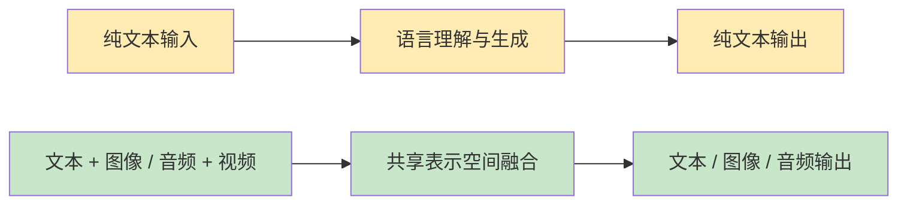
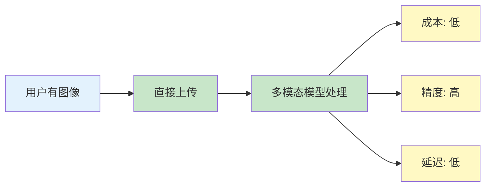

# 第十章 多模态提示工程

多模态 AI 模型可以理解和处理文本、图像、音频、视频等多种形式的输入。本章将介绍如何设计有效的多模态提示词，充分发挥这些模型的能力。

**本章目标**

- 理解本章核心概念与适用场景
- 掌握可复用的提示词/工作流模式
- 能将方法迁移到自己的任务中

## 1. 多模态模型概述

多模态大语言模型代表了人工智能发展的重要里程碑。与传统的纯文本模型不同，多模态模型能够同时理解和处理多种类型的数据，包括文本、图像、音频和视频，从而实现更自然、更接近人类认知方式的智能交互。

### 1.1 多模态模型的技术演进

多模态能力的发展经历了几个关键阶段：

**早期探索（2020-2022）**：CLIP、DALL-E 等模型证明了视觉与语言联合学习的可行性。这一时期的重点是跨模态对齐，即让模型理解图像和文本描述之间的对应关系。

**视觉语言模型（2023）**：GPT-4V、Gemini、Claude 3 等模型将视觉理解能力直接集成到对话系统中。用户可以在对话中直接上传图像，模型能够描述图像内容、回答关于图像的问题，甚至进行图像相关的推理任务。

**原生多模态（2024-2025）**：以 Gemini 2.5 Pro 和 GPT-4o 为代表，这一代模型从架构层面实现了真正的多模态融合。模型不再是“先看图后说话”的分离式处理，而是能够同时理解和生成多种模态的内容。

**多模态工作流深化（2025-2026）**：以 **GPT-5.6** 系列、**Claude Fable 5**（2026-06-09 GA，6 月 12 日暂停后于 7 月 1 日恢复访问）、**Claude Opus 5 / Sonnet 5** 以及 **Gemini 3.7 Flash / Gemini 3.1 Pro Preview** 为代表，多模态模型开始更深地整合视觉理解、音视频分析、工具调用和代理工作流。不同厂商公开的 API 与产品能力边界并不相同，不能把路线图、演示能力与正式可用能力混为一谈。

### 1.2 主流多模态模型对比

| 模型                                      | 支持的输入模态     | 支持的输出模态 | 核心特点                                                                          |
| --------------------------------------- | ----------- | ------- | ----------------------------------------------------------------------------- |
| **GPT-5.6 Sol / Terra / Luna**          | 文本、图像       | 文本      | 长上下文、高精度推理、适合复杂多步工作流；`gpt-5.6` 别名路由到 Sol                                      |
| **Claude Fable 5**                      | 文本、图像       | 文本      | 1M Context，已列入官方 Legacy models（建议迁移到 Fable 5.1）；2026-06-09 GA；2026-07-01 恢复访问 |
| **Claude Opus 5**                       | 文本、图像       | 文本      | 1M Context，复杂推理与长程代理式编码；官方模型页的默认起点                                            |
| **Claude Sonnet 5**                     | 文本、图像       | 文本      | 1M Context，速度与能力平衡，适合高频多模态调用                                                  |
| **Gemini 3.7 Flash / Gemini 3.6 Flash** | 文本、图像、音频、视频 | 文本      | 原生多模态，官方模型页当前标记为 Stable，生产首选                                                  |
| **Gemini 3.1 Pro Preview**              | 文本、图像、音频、视频 | 文本      | 原生多模态，适合前沿验证；生产稳定性、配额和上下文限制应以最新模型页为准                                          |
| Llama 4 (Open)                          | 文本、图像       | 文本      | 开源多模态，适合自托管与定制化场景                                                             |

### 1.3 多模态能力的四大支柱

#### 1.3.1 图像理解

图像理解是当前多模态模型最成熟的能力，包括：

- **视觉描述**：详细描述图像内容、场景、物体
- **文档解析**：提取文档、表格、发票中的结构化信息
- **图表分析**：解读数据可视化图表的含义
- **视觉问答**：回答关于图像细节的具体问题
- **空间推理**：理解物体的位置、方向、相对关系

#### 1.3.2 音频处理

音频能力正在快速发展：

- **语音转写**：高精度的语音识别
- **语音对话**：直接以语音形式进行实时对话
- **音频分析**：识别环境声音、音乐类型、说话人情感
- **多语言支持**：跨语言语音理解和翻译

#### 1.3.3 视频理解

视频理解结合了图像和时序信息：

- **内容摘要**：概括视频的主要内容
- **时间定位**：定位视频中特定事件发生的时间点
- **动作识别**：识别视频中人物或物体的动作
- **因果推理**：理解视频中事件的因果关系

#### 4. 跨模态生成

部分模型已支持生成非文本内容：

- **文生图**：DALL-E 3、Midjourney、Stable Diffusion
- **文生音频**：Suno、Udio（音乐生成）
- **文生视频**：Sora、Runway（视频生成）

### 1.4 多模态提示词的核心原则

在设计多模态提示词时，需要遵循以下原则：

#### 原则一：模态协调

文字指令需要与其他模态输入协调配合。模型需要明确知道你希望它如何处理上传的内容。

```
❌ 不佳："分析这个"
✅ 较好："请分析上传图片中的柱状图，提取各季度的销售数据，并识别增长趋势"
```

#### 原则二：明确引用

当上传多个图像或处理复杂多模态输入时，需要清晰指向具体内容：

```
"请比较图 1（左侧产品照片）和图 2（右侧竞品照片），
从外观设计、功能布局、用户体验三个维度进行对比分析"
```

#### 原则三：任务聚焦

每次聚焦于特定的分析目标，避免在单次请求中要求过多不同类型的处理：

```
❌ 不佳："分析这张图片的所有内容，提取文字，描述风格，判断真伪"
✅ 较好："请提取这张发票图片中的以下信息：发票号码、日期、金额、收款方"
```

#### 原则四：格式适配

根据输入模态和任务类型，指定合适的输出格式：

```
"请将这张餐厅菜单图片中的菜品信息提取为 JSON 格式：
{
  \"菜品名\": \"...\",
  \"价格\": \"...\",
  \"描述\": \"...\"
}"
```

### 1.5 多模态应用场景

多模态模型正在重塑多个行业：

| 领域   | 应用场景          | 使用的模态      |
| ---- | ------------- | ---------- |
| 医疗健康 | 医学影像分析、病历理解   | 图像 + 文本    |
| 电商零售 | 商品图像搜索、视觉问答   | 图像 + 文本    |
| 教育培训 | 手写作业批改、视频课程摘要 | 图像/视频 + 文本 |
| 金融服务 | 票据识别、合同分析     | 图像 + 文本    |
| 客户服务 | 语音客服、视频会议分析   | 音频/视频 + 文本 |

!!! question "想一想"

    1. 多模态模型同时处理文本和图像——这和“先用 OCR 提取文字再给文本模型”有什么本质区别？
    2. 在你的工作中，哪个场景最有可能受益于多模态输入（图片+文字）？

## 2. 图像理解与视觉提示

图像理解是多模态模型最成熟且应用最广泛的能力。GPT-4V、Claude 3、Gemini 等主流模型都展现出强大的视觉分析能力。本节将深入探讨图像提示的设计方法和最佳实践。

### 2.1 图像理解的能力边界

在设计视觉提示之前，需要了解当前模型的能力范围：

**擅长的任务**：

- 图像内容描述和场景识别
- 文档、表格、图表的 OCR 和结构化提取
- 物体识别、计数和空间关系理解
- UI/UX 界面分析和设计评估
- 图像中的文字识别和翻译

**仍有局限的任务**：

- 精确的像素级测量和定位
- 人脸识别和身份识别（出于隐私考量，多数模型会拒绝）
- 极小或模糊文字的识别
- 高度专业的领域图像（如医学影像的诊断性判读）

### 2.2 基本图像提示模式

根据任务类型，图像提示可分为以下几种模式：

#### 2.2.1 描述任务

让模型全面描述图像内容：

``` markdown
请详细描述这张图片的内容，包括：
- 主要对象和场景
- 颜色、光线和构图特点
- 整体氛围和风格
- 任何值得注意的细节
```

**提示技巧**：通过分点要求引导模型提供结构化的描述，避免遗漏重要细节。

#### 2.2.2 问答任务

针对图像内容提出具体问题：

```
关于这张会议室照片：
1. 图中有多少人？
2. 他们正在进行什么活动？
3. 从他们的姿态和表情判断，会议氛围如何？
4. 会议室的布置有什么特点？
```

**提示技巧**：问题应具体、可验证，避免过于抽象或需要外部知识的问题。

#### 2.2.3 分析任务

要求模型进行深度分析和推理：

``` markdown
请分析这张电商产品主图：
1. 产品的外观设计和材质判断
2. 拍摄角度和布光是否突出产品优势
3. 背景选择是否恰当
4. 目标消费群体画像推断
5. 与竞品相比的视觉差异化建议
```

#### 2.2.4 提取任务

从图像中提取结构化信息：

```
请从这张发票图片中提取以下信息，以 JSON 格式输出：
{
  "invoice_number": "发票号码",
  "date": "开票日期",
  "seller": "销方信息",
  "buyer": "购方信息",
  "items": [{"name": "商品名", "quantity": "数量", "price": "单价"}],
  "total": "合计金额"
}
```

### 2.3 高级图像提示技巧

#### 2.3.1 区域指向

当需要关注图像特定区域时，使用空间描述词：

```
请关注图片左上角的品牌 logo，分析其设计风格...
请分析图片中央人物的面部表情，判断其情绪状态...
请检查图片右下角的水印文字，识别来源信息...
```

部分平台支持更精确的坐标指向（如通过 API 传递 bounding box），但自然语言描述通常足够准确。

#### 2.3.2 多图比较

同时处理多张图像进行对比分析：

``` markdown
我将上传两张产品图片进行比较：
- 图片 1：我们的新产品设计稿
- 图片 2：市场上的竞品

请从以下维度进行对比分析：
1. 外观设计语言（线条、曲面、材质感）
2. 色彩搭配和视觉冲击力
3. 功能布局的人体工学考量
4. 品牌辨识度和差异化程度

最后给出改进建议。
```

#### 2.3.3 图表深度解读

对数据可视化图表进行专业分析：

``` markdown
请分析这张销售数据柱状图：

1. 数据提取：
   - 各月份/季度的具体数值
   - 最高点和最低点

2. 趋势分析：
   - 整体增长/下降趋势
   - 是否存在周期性波动
   - 明显的拐点及可能原因

3. 异常检测：
   - 是否有异常数据点
   - 数据呈现的一致性

请以表格形式输出提取的数据。
```

#### 2.3.4 文档理解

处理复杂文档布局：

``` markdown
这是一份合同文档的扫描件，请完成以下任务：

1. 识别文档类型和标题
2. 提取关键条款：
   - 合同双方
   - 合同期限
   - 付款条款
   - 违约责任
3. 找出需要签字/盖章的位置
4. 标注任何手写批注内容
```

### 2.4 图像提示的常见陷阱

#### 陷阱一：任务过于宽泛

```
❌ 不佳："分析这张图"
✅ 较好："分析这张餐厅菜单的视觉设计，评估其排版是否便于顾客快速选择"
```

#### 陷阱二：假设模型能看到你看不到的

```
❌ 不佳："图片中模糊的小字写的是什么？"
   （如果人眼看不清，模型通常也无法准确识别）
```

#### 陷阱三：要求超出能力边界

```
❌ 不佳："这张医学 CT 图像显示了什么病变？"
   （模型可以描述看到的内容，但不应作为医学诊断依据）
```

### 2.5 实践案例：电商场景

以下是一个电商产品分析的完整提示示例：

``` markdown
你是一位资深电商运营专家。请分析上传的这组产品主图（共 5 张）：

## 分析维度

### 1. 首图吸引力 (针对第 1 张)

- 产品展示完整性
- 视觉焦点是否突出
- 信息层级是否清晰

### 2. 卖点传达 (针对第 2-4 张)

- 各图是否分别突出不同卖点
- 场景化展示的代入感
- 细节图的说服力

### 3. 整体一致性 (针对全部 5 张)

- 色调和风格统一度
- 信息是否有冗余或遗漏
- 浏览顺序的逻辑性

## 输出格式

请给出：
1. 每张图的简评（各 50 字内）
2. 整体评分（满分 10 分）
3. Top 3 改进建议
```

!!! example "动手试试"

    1. 找一张包含图表或流程图的图片，分别用“描述这张图片”和“提取这张图表中的所有数据点并以表格形式输出”两种提示词测试，对比输出质量。
    2. 图像提示词中，“先描述你看到了什么，再回答问题”这种思维链策略是否有效？动手验证一下。

## 3. 音频与视频处理

随着 GPT-4o、Gemini 3.7 Flash、Gemini 3.1 Pro Preview 等多模态模型的迭代，音频和视频理解能力正在成为多模态 AI 的重要组成部分。与静态图像不同，音视频处理需要考虑时间维度，这对提示设计提出了新的要求。涉及具体模型名称时，应以官方模型页为准；Gemini 3 Pro Preview 已于 2026 年 3 月 9 日关闭，不应作为新项目的当前模型。

### 3.1 音频处理能力现状

当前主流模型的音频能力差异较大：

| 模型/系统                                         | 音频输入         | 实时语音         | 音频输出         |
| --------------------------------------------- | ------------ | ------------ | ------------ |
| **GPT-5.6 系列**                                | 视具体产品/API 而定 | 视具体产品/API 而定 | 视具体产品/API 而定 |
| **Gemini 3.7 Flash / Gemini 3.1 Pro Preview** | 支持音频理解       | 视产品形态而定      | 以文本输出为主      |
| **Claude Opus 5**                             | 通常需配合外部语音链路  | 需配合外部语音链路    | 以文本输出为主      |
| Whisper V3                                    | ✅ 支持         | ❌ 不支持        | ❌ 不支持        |

**核心能力**：

- **语音识别**：将语音转录为文字，支持多语言
- **语音对话**：直接以语音形式进行实时交互
- **音频理解**：识别音乐类型、环境声音、说话人情绪
- **语音合成**：将文字转换为自然语音

### 3.2 音频提示设计

#### 3.2.1 语音转录任务

高质量的语音转录需要明确输出要求：

``` markdown
请将这段音频转录为文字，并遵循以下规范：

格式要求：
- 使用标准标点符号
- 段落按语义自然分段
- 保留语气词（嗯、啊等）标记为[语气词]
- 标注明显的停顿为[停顿]

特殊处理：
- 如有多人对话，标注说话人（说话人 A/B/C）
- 背景音乐或环境音标注为[背景音：描述]
- 无法识别的内容标注为[无法识别]

输出语言：中文（如原音频为其他语言，请先转录原文再翻译）
```

#### 3.2.2 音频内容分析

对音频内容进行深度分析：

```
请分析这段播客音频（约 15 分钟）：

1. 内容摘要
   - 核心主题和论点
   - 讨论的主要话题（按时间顺序）

2. 参与者分析
   - 有几位说话人
   - 各自的角色/立场
   - 发言比例估计

3. 语言风格
   - 正式/非正式程度
   - 是否有专业术语
   - 整体氛围（严肃/轻松/争论性）

4. 关键时间点
   - 列出 3-5 个值得关注的时间点及原因
```

#### 3.2.3 实时语音对话

在支持实时语音交互的产品形态中，可通过系统提示定制语音助手：

``` markdown
你是一位专业的语音客服助手。

语音风格：
- 语速适中，吐字清晰
- 语气亲切但专业
- 适当使用语气助词使对话更自然

交互规范：
- 每次回复控制在 30 秒以内
- 复杂问题分步骤回答
- 主动确认用户是否理解
- 遇到听不清时礼貌请求重复
```

### 3.3 视频处理能力现状

视频理解是多模态模型最复杂的能力，需要同时处理视觉、音频和时序信息：

| 模型/系统                                         | 视频长度能力            | 处理方式              | 音频支持    |
| --------------------------------------------- | ----------------- | ----------------- | ------- |
| **Gemini 3.7 Flash / Gemini 3.1 Pro Preview** | 长视频理解能力强          | 原生视频/音频多模态        | 视产品形态而定 |
| **GPT-5.6 系列**                                | 视具体产品/API 能力而定    | 常见做法是图像序列或视频相关工作流 | 视产品形态而定 |
| **Claude Opus 5**                             | 更适合图像序列、截图和长文档工作流 | 通常以文本与图像理解为主      | 需外部音频链路 |

**核心能力**：

- **视频摘要**：概括视频主要内容
- **时间定位**：找到特定事件发生的时间点
- **动作识别**：识别视频中的动作和活动
- **视频问答**：回答关于视频内容的问题
- **字幕生成**：为视频生成描述性字幕

### 3.4 视频提示设计

#### 3.4.1 视频内容摘要

``` markdown
请观看这段产品演示视频（约 5 分钟）并生成：

## 内容摘要

- 整体概述（100 字以内）
- 演示的主要功能点（列表）

## 时间轴标注

按以下格式标注关键时间点：
[MM:SS] - 事件/功能描述

## 演示亮点

- 最有说服力的 3 个演示环节
- 建议剪辑的精华片段时间范围

## 待改进项

- 演示流程中的不流畅之处
- 遗漏或讲解不清的功能
```

#### 3.4.2 视频内容问答

``` markdown
根据上传的会议录像回答以下问题：

1. 会议讨论了哪些主要议题？
2. 与会者对「项目预算」有哪些不同意见？
3. 最终达成了什么决议？
4. 是否有任务分配？分配给了谁？

请在回答中标注相关内容出现的时间点（格式：[HH:MM:SS]）。
```

#### 3.4.3 教学视频分析

``` markdown
请分析这段编程教学视频：

学习目标识别：
- 本视频旨在教授什么技能/概念？
- 前置知识要求是什么？

内容结构：
- 按时间顺序列出教学步骤
- 标注代码示例出现的时间点

教学质量评估：
- 讲解清晰度（1-10 分）
- 实例恰当性（1-10 分）
- 节奏把控（1-10 分）

改进建议：
- 哪些部分需要更详细的解释？
- 是否有跳跃或遗漏的知识点？
```

### 3.5 长视频处理策略

对于超出模型处理能力的长视频，可采用以下策略：

#### 策略一：关键帧提取

```python linenums="1"
from __future__ import annotations

def extract_keyframes(video: str, *, interval: str) -> list[str]:
    return [f"{video}-frame@{interval}-1", f"{video}-frame@{interval}-2"]

class Model:
    def analyze(self, frame: str, *, prompt: str) -> str:
        return f"{frame}: {prompt}"

    def synthesize(self, results: list[str], *, prompt: str) -> str:
        return prompt + " -> " + " | ".join(results)

video = "demo_video.mp4"
model = Model()

frames = extract_keyframes(video, interval="30s")  # 每 30 秒提取一帧
results: list[str] = []
for frame in frames:
    results.append(model.analyze(frame, prompt="描述这一帧的内容"))

summary = model.synthesize(results, prompt="综合所有帧内容，生成视频摘要")
print(summary)
```

#### 策略二：分段处理

``` markdown
长视频处理流程：
1. 将视频分割为 5 分钟的片段
2. 分别分析每个片段
3. 综合各片段结果生成整体分析
```

#### 策略三：音视频分离

```
复杂视频分析流程：
1. 提取音频轨道 → 单独进行语音转录和分析
2. 提取关键帧 → 单独进行视觉内容分析
3. 融合两者结果 → 生成综合分析报告
```

### 3.6 音视频提示的关键原则

1. **时间粒度明确**：指定希望模型关注的时间范围或粒度
2. **多模态融合**：同时利用视觉和听觉信息，而非只关注单一模态
3. **输出结构化**：使用时间戳格式化输出，便于定位和引用
4. **任务分解**：复杂的长内容分解为多个子任务处理

!!! question "延伸思考"

    1. 处理一段 10 分钟的视频，“截取关键帧+图像分析”和“音频转录+文本分析”哪种路径信息损失更少？能否组合使用？
    2. 音频和视频输入的 Token 成本远高于纯文本——在成本受限场景下，你会用什么策略来优化？

## 4. 跨模态推理与融合

跨模态推理是多模态 AI 的核心能力之一，指综合利用来自不同模态（文本、图像、音频等）的信息进行分析、验证和推理。与单模态处理相比，跨模态推理能够挖掘不同信息源之间的关联、互补和矛盾，从而得出更全面、更可靠的结论。

### 4.1 跨模态推理的价值

#### 4.1.1 信息互补

不同模态承载不同类型的信息：

| 模态 | 擅长表达的信息        |
| -- | -------------- |
| 文本 | 抽象概念、逻辑关系、时间顺序 |
| 图像 | 视觉特征、空间关系、细节呈现 |
| 音频 | 语气情感、环境氛围、时间流动 |

跨模态融合可以获得任何单一模态都无法完整表达的信息。

#### 4.1.2 交叉验证

多个模态的信息可以相互印证，提高分析的可靠性：

- 产品图片 + 客户评价 → 验证评价真实性
- 会议录音 + 会议纪要 → 验证记录完整性
- 新闻标题 + 配图 → 验证标题是否夸大

#### 4.1.3 深度推理

结合多模态信息可进行更复杂的推理：

- 观察表情 + 听取语气 → 判断真实情绪
- 分析场景图 + 阅读说明书 → 诊断故障原因
- 对比设计图 + 实物照片 → 评估还原度

### 4.2 跨模态提示设计模式

#### 模式一：图文一致性验证

验证图像内容与文字描述是否一致：

``` markdown
我将提供一张电商产品图片和商品详情页的文字描述。

## 任务

请分析图片内容与文字描述的一致性。

## 分析维度

1. 产品外观
   - 描述中提到的颜色/材质是否与图片一致
   - 产品尺寸/比例是否与描述相符

2. 功能特性
   - 描述中宣传的功能在图片中是否可见
   - 图片是否展示了描述未提及的特性

3. 使用场景
   - 图片展示的使用场景是否与目标用户群匹配

## 输出格式

- 一致项：列出图文匹配的内容
- 不一致项：列出矛盾或可疑之处
- 缺失项：描述有但图片未展示 / 图片有但描述未提及
- 总体评分：图文一致性评分（1-10 分）
```

#### 模式二：多源信息综合

整合来自多个来源的信息进行综合分析：

``` markdown
我将提供关于同一事件的三个信息来源：
1. 新闻报道文字
2. 现场照片
3. 社交媒体评论截图

## 任务

综合分析这些来源，还原事件全貌。

## 分析框架

1. 事实核心
   - 三个来源共同确认的事实
   - 各来源独有的信息

2. 差异分析
   - 各来源在描述上的差异
   - 可能的差异原因（角度、时间、立场）

3. 可信度评估
   - 各来源的可信度排序
   - 是否存在明显的偏见或错误

4. 综合结论
   - 基于多源信息的事件还原
   - 仍存在的疑点或待核实项
```

#### 模式三：视觉推理与预测

基于当前视觉信息进行推理和预测：

``` markdown
请观察这张交通场景图片，进行推理分析：

## 当前状态分析

- 描述图中各车辆/行人的位置和运动方向
- 识别潜在的风险点

## 因果推理

如果红色车辆保持当前速度和方向：
1. 接下来 3 秒可能发生什么？
2. 最可能的结果是什么？
3. 存在哪些风险？

## 建议决策

作为自动驾驶系统，应该：
1. 采取什么行动？
2. 优先关注哪些对象？
3. 如何规避风险？

请用物理直觉和交通规则支撑你的推理。
```

#### 模式四：图文匹配与选择

判断图像与多个候选描述的匹配程度：

```
请观察上传的图片，从以下三个描述中选择最匹配的一个：

A. 一群年轻人在咖啡馆里用笔记本电脑工作，氛围专注而安静
B. 一群朋友在餐厅聚会，边吃饭边热烈交谈
C. 几位商务人士在会议室进行正式会议，投影仪正在展示数据

## 输出要求

1. 选择最匹配的选项（A/B/C）
2. 匹配度评分（0-100%）
3. 选择理由：列出支持该选择的 3 个视觉证据
4. 排除理由：简述为什么排除其他选项
```

## 4.3 复杂跨模态任务示例

#### 案例一：电商评价真实性分析

``` markdown
任务：判断这条商品评价的真实性

输入：
- 商品主图（卖家提供）
- 买家晒图（评价附图）
- 评价文字内容

分析维度：

1. 视觉比对
   - 买家晒图中的产品与主图是否为同一产品
   - 颜色、款式、细节是否一致

2. 文图匹配
   - 评价文字描述是否与晒图内容匹配
   - 是否存在文字描述但图中不可见的内容

3. 真实性指标
   - 晒图是否有使用痕迹（真实使用的可能性）
   - 图片是否为原图（检查水印、压缩痕迹）
   - 评价内容是否空泛/模板化

输出：真实性评分 + 理由 + 可疑点（如有）
```

#### 案例二：多模态内容审核

``` markdown
任务：审核用户生成内容是否合规

输入：
- 用户上传的图片
- 用户撰写的配文
- 用户的历史违规记录（文字描述）

审核维度：

1. 图片内容审核
   - 是否包含违规视觉元素
   - 是否涉及隐私/版权问题

2. 文字内容审核
   - 是否包含违规文字
   - 语言是否具有攻击性

3. 图文关联审核
   - 配文是否与图片内容相关
   - 是否试图用正常图片配合违规文字"打擦边球"

4. 历史关联
   - 结合历史记录，是否存在规避审核的模式

输出格式：
{
  "decision": "通过/拒绝/人工复审",
  "risk_score": 0-100,
  "violations": [...],
  "evidence": [...]
}
```

### 4.4 跨模态推理的局限与注意事项

#### 4.4.1 当前局限

1. **模态融合深度有限**：模型可能分别处理各模态，而非真正“理解”它们的关联
2. **时间对齐困难**：音视频的时间同步分析仍具挑战
3. **专业领域知识**：跨模态推理依赖领域知识，通用模型可能不足

#### 设计注意事项

1. **明确模态关系**：告诉模型各模态之间的逻辑关系（互补/验证/对比）
2. **分步推理**：复杂任务拆解为“先分析各模态 → 再综合推理”
3. **提供锚点**：为多个输入提供清晰的标识（图 1、图 2、文档 A 等）
4. **校验结论**：对跨模态推理结论进行人工抽检

!!! question "思考"

    1. 跨模态推理的核心挑战是让模型“理解不同模态之间的对应关系”——你觉得当前模型在哪种模态组合上做得最好？最弱的呢？
    2. 给模型一张照片和一段文字描述，让它判断两者是否一致——这种“跨模态验证”可以用在你的哪个业务场景中？

## 5. 多模态提示词工程进阶：融合文本、图像、音频与视频

多模态 AI 模型（如 GPT-5.6 系列、Claude Opus 5、Gemini 3.7 Flash / Gemini 3.1 Pro Preview）代表了新一代的交互范式。与传统的单一文本模型不同，多模态模型要求设计者理解跨越不同感知维度的提示词策略。本节深入探讨多模态提示词工程的最佳实践、冲突解决和实际应用。

### 5.1 多模态提示词的基本原理

#### 5.1.1 多模态 vs 单模态模型



*图 10-1：单模态与多模态模型的处理路径对比*

#### 5.1.2 信息处理流水线对比

```
┌─────────────────────────────────────────────────┐
│ 单模态流水线 (传统)                               │
├─────────────────────────────────────────────────┤
│
│ 用户有图像 → 手动描述 → 发送文本 → LLM 处理
│
│ 成本: 高 (需要人工描述)
│ 精度: 低 (描述可能不准确或不完整)
│ 延迟: 高 (需要额外描述步骤)
│
└─────────────────────────────────────────────────┘
```



*图 10-2：多模态流水线的处理路径与优势*

### 5.2 图文混合提示策略

#### 5.2.1 图像提示的有效设计

``` markdown
【原则 1：提供充分的视觉上下文】

❌ 不好的做法:
  用户上传: [有点模糊的图片]
  提示词: “这是什么?”

  问题:
  - 模型不知道用户想要什么详细程度
  - 模型不知道应用场景
  - 模型可能给出不相关的分析

✓ 好的做法:
  用户上传: [清晰的图片]
  提示词: """
  这是一个电商产品的摄影图。
  请分析：
  1. 产品的主要特征
  2. 图像质量评分（1-10）
  3. 是否适合用作主图
  4. 改进建议

  我计划用这张图做电商平台的主产品图。
  """

  优势:
  - 清晰的背景信息
  - 具体的分析要求
  - 模型了解使用场景
  - 输出更有针对性


【原则 2：利用文本标注增强理解】

示例 1: 标注重点区域
  图片 + 文本标注:
  “请关注图中红色框标注的区域”
  或
  “左上角的文字是关键信息”

示例 2: 补充缺失信息
  图片：一张黑白照片
  文本补充：
  “这张照片的原始色彩应该是...”
  “这张照片拍摄于...”

示例 3: 建立对比
  图片 1 + 图片 2 + 文本:
  “比较这两张图片，第一张代表...，
   第二张代表...请指出差异”


【原则 3：指定分析粒度】

低粒度分析 (快速概览):
  提示词: “快速描述这张图片的内容”

  模型响应时间: 快
  输出长度: 短 (~100 词)
  使用场景: 内容审核、快速分类

中粒度分析 (详细理解):
  提示词: """
  详细分析这张图片：
  - 场景描述
  - 主要对象
  - 视觉特征
  - 可能的应用场景
  """

  模型响应时间: 中等
  输出长度: 中等 (~500 词)
  使用场景: 内容描述、可访问性

高粒度分析 (深度洞察):
  提示词: """
  进行深度视觉分析：
  1. 构图与审美分析
  2. 光影处理评估
  3. 色彩心理学分析
  4. 文化与历史背景
  5. 潜在的符号学含义
  """

  模型响应时间: 慢
  输出长度: 长 (~2000 词)
  使用场景: 艺术评论、研究分析
```

#### 5.2.2 多图像协作提示

【场景 1：图像序列分析】

任务: 分析一系列照片的故事线

提示词:

``` markdown
system: |
  你是一个专业的视觉叙事分析师。

  分析以下图像序列，理解：
  1. 每张图片的视觉元素
  2. 图像之间的叙事关系
  3. 整体故事的发展线索
  4. 情感与氛围的演变

user: """
  [图像 1] - 开场
  [图像 2] - 发展
  [图像 3] - 高潮
  [图像 4] - 结局

  请以故事叙述的方式描述这个序列。
"""
```

【场景 2：对比分析】

任务: 比较多个版本的设计

提示词:

``` markdown
以下是产品设计的三个版本。
请对比分析：

[版本 A]
[版本 B]
[版本 C]

对比维度：
1. 视觉层级
2. 色彩搭配
3. 用户体验指示
4. 品牌一致性
5. 总体评分

为每个版本评分并给出改进建议。
```

【场景 3：补充细节】

任务: 利用多张图补充信息

提示词:

``` markdown
主图: [全景图]
细节图: [特写 1, 特写 2, 特写 3]

基于这些图像，请：
1. 提供完整的对象描述
2. 指出主图中可能被忽略的细节
3. 解释细节图与主图的关系
4. 提供综合的理解
```

### 5.3 视觉提示最佳实践

#### 5.3.1 图像质量与表达力

``` markdown
【质量标准】

清晰度要求:
  低质量 (≤72 DPI)   → 难以识别细节
  中质量 (72-150 DPI) → 基本可识别
  高质量 (>150 DPI)   → 清晰识别细节

分辨率建议:
  文本识别: ≥ 1024×768
  细节分析: ≥ 1920×1080
  快速分类: ≥ 512×512

格式选择:
  PNG: 最高质量（适合高质量分析）
  JPG: 平衡大小与质量
  WebP: 现代格式，较小文件

【表达力优化】

示例 1: 强化对比
  原始图: 单色背景，对象略显模糊
  优化版: 增加对比度，突出对象边界

  ✓ 模型更容易识别关键特征

示例 2: 标注关键区域
  使用文本标注、箭头或颜色标注
  指引模型注意重点

  ✓ 引导分析方向

示例 3: 提供参考
  包含已知的参考对象
  帮助模型进行尺度和背景推断

  ✓ 改进定量分析准确性
```

#### 5.3.2 不同场景的视觉提示

【场景 1：图像识别与分类】

提示词模板:

``` markdown
请识别这张图片中的：

1. 主要对象
   - 是什么？
   - 颜色和纹理？
   - 大小估计？

2. 背景信息
   - 场景类型
   - 环境特征
   - 可能的位置

3. 分类标签
   基于以下类别分类：[列出类别]

4. 置信度评估
   您对识别的确定程度（1-10）
```

适用模型: Claude Vision, GPT-4 Vision 输出质量: 高（准确率>95%，示意值）

【场景 2：文本识别与提取】

提示词模板:

``` markdown
这张图片中包含文字。请：

1. 完整地转录所有可见文本
2. 指出文本的布局位置
3. 注意任何格式化（加粗、大小等）
4. 纠正明显的 OCR 错误

返回格式：
- 原始文本
- 清理后的文本
- 格式注解
```

适用模型: 所有支持 Vision 的模型 输出质量: 高（准确率>90%，示意值）

【场景 3：视觉问答（VQA）】

提示词模板:

``` markdown
基于下面的图片回答问题：

[图片]

问题 1: [具体问题]
问题 2: [关联问题]
问题 3: [深度问题]

请逐个回答，并对不确定的部分说明。
```

适用模型: Claude Vision, GPT-4 Vision, Gemini 输出质量: 中等（需要明确的问题定义）

【场景 4：艺术与美学分析】

提示词模板:

```
请从艺术评论的角度分析这张图片：

审美维度：
1. 构图（Rule of thirds, symmetry 等）
2. 色彩理论（色轮位置、和谐度）
3. 光影（lighting ratio, mood）
4. 质感与纹理
5. 动感与平衡

表达维度：
1. 艺术风格（印象派、现实主义等）
2. 可能的艺术家影响
3. 视觉叙事
4. 情感传达

综合评价：
- 美学评分 (1-10)
- 技术评分 (1-10)
- 创意评分 (1-10)
- 总体影响力评价
```

适用模型: 任何 Vision 模型都可以，但效果差异较大 输出质量: 中等-高（取决于模型的艺术理解）

### 5.4 音频与视频处理新趋势

#### 5.4.1 音频分析提示策略（深入探讨）

【当前支持情况】

全面支持: 几乎没有模型原生支持音频输入 主要方式:

1. 音频转文本（ASR - Automatic Speech Recognition）→ 文本分析
2. 音频转文字记录（完整转录）
3. 用户手动转录
4. 音频特征描述（新增）

【核心挑战】

音频处理的独特难点： ❌ 模型看不到原始音频，只能处理文本 ❌ 转录过程中丧失的信息： - 音色、口音、情感语调 - 停顿、强调、语速变化 - 背景音、环境噪音 - 多说话者的身份识别 ❌ 转录错误（尤其是专业术语、人名）

【音频工作流 1：基础转录分析】

音频文件 ↓（Whisper/语音转文字） 转录文本 ↓（标准文本提示） 分析结果

缺点: 丢失了大量上下文信息

【音频工作流 2：增强型转录（推荐）】

音频文件 ↓ \[转录] + \[特征提取] ├─ 文本内容 ├─ 说话者标识 ├─ 时间戳标记 ├─ 音声特征（语速、语调、情感） └─ 转录置信度 ↓ \[增强提示词] ← 包含上述所有信息 ↓ 更准确的分析

【音频提示词设计原则】

原则 1：明确音频的上下文 ❌ 不好: “分析这个音频”

✓ 好: "以下是一个 30 分钟的团队会议的转录（2024 年 3 月 5 日）。 参与者：产品经理张三、工程主管李四、设计主管王五。 请分析..."

原则 2：处理转录不完美性 ❌ 不好: “这是转录文本，直接分析”

✓ 好: "以下是音频的自动转录，可能存在错误。 请： 1. 识别和修正明显的转录错误（通过上下文推断） 2. 恢复被省略或误转的关键术语 3. 标注你不确定的地方

```
转录文本：[...]"
```

原则 3：补充音声特征信息

```
音频参数：
- 语速: 中等（每分钟 120-140 词）
- 音色: 平稳，专业
- 情感: 急促→平稳→兴奋（时间顺序）
- 停顿: 在第 15 分钟和 35 分钟有长停顿（可能是思考）
- 背景: 轻微的办公室环保噪音

转录文本：
[...]
```

【多说话者识别与处理】

场景: 会议、访谈、对话

提示词示例:

```
以下是一个三人对话的转录：
[说话者 1]: “...”
[说话者 2]: “...”
[说话者 1]: “...”

说话者身份线索:
- 说话者 1: 音色较深，说话速度快，多次打断他人
- 说话者 2: 音色较高，说话速度慢，倾听较多
- 说话者 3: 音色中性，偶尔发言

请分析：
1. 谁是主导者？
2. 三人的立场分别是什么？
3. 有哪些分歧和共识？
```

【音频内容的噪声处理】

实际场景中的音频问题:

问题 1: 转录错误

```yaml linenums="1"
原文可能是: "今天的 KPI 是 500 万"
转录成: "今天的 K-P-I 是五百万"
或: "今天的卡皮是 500 万"

处理:
"某些特殊术语可能被误转。
KPI 应该理解为 Key Performance Indicator。
如有其他专业术语被误转，请帮我识别和修正。"
```

问题 2: 背景噪音导致的缺漏

```
原文: “这个方案成本是...”[噪音]“...万元”
转录缺失中间数字

处理:
“音频中有背景噪音导致部分内容不清晰。
请根据上下文逻辑推断缺失的信息。“
```

问题 3: 复杂的行业术语

```
如果音频涉及医学、法律、技术等专业领域:

“这是医疗领域的专业对话。
如果转录中有医学术语被误转，
请根据医学知识和上下文进行修正。“
```

【转录配置参数指导】

如果使用 Whisper 或类似工具，配置建议：

``` yaml
audio_processing:
  language: “zh”  # 语言
  task: “transcribe”  # 转录任务
  word_level_timestamps: true  # 词级时间戳（重要！）
  temperature: 0  # 确定性转录

  # 专业术语处理

  initial_prompt: |
    “这是一个医疗/法律/技术领域的对话。
    请确保以下术语的正确转录：
    KPI, ROI, API, 患者, 诊断, ...“
```

【情感与语调分析】

即使没有原始音频，也可以通过转录推断：

``` markdown
转录文本分析提示：

请根据以下转录文本分析说话者的情感变化：

1. 语言线索:
   - 使用的词汇（积极/消极/中性）
   - 句子长度变化（短句=急促或激动）
   - 标点符号（省略号=犹豫，感叹号=强调）

2. 逻辑线索:
   - 是否有重复强调同一观点？→ 可能是强烈感受
   - 是否频繁改口修正？→ 可能是不确定
   - 是否有长停顿的标记？→ 可能是思考或不适

3. 情感弧线：
   开始阶段: [情感]
   中间阶段: [情感变化]
   结尾阶段: [最终情感]
```

【多轮对话的上下文管理】

场景: 长时间的播客、讲座、多次对话

问题: 上下文窗口有限

解决方案: 【处理长音频的分段策略】

1. 时间分段（每 10-15 分钟为一段）
2. 生成每段摘要
3. 只在提示词中保留：
   * 完整的第一段（建立背景）
   * 完整的最后一段（当前讨论）
   * 中间段的摘要（保留逻辑连贯性）
   * 前后段之间的关键转接
4. 询问时在每段前加上时间戳

示例:

```
【00:00-10:00】
[完整转录]
...

【10:00-20:00】
摘要: 讨论了技术架构和成本评估
关键决议: 决定采用方案 A

【20:00-30:00】
[完整转录]
...

请基于上述对话，回答用户问题...
```

【音频提示最佳实践总结】

✓ 始终提供音频的背景信息（主题、参与者、场景） ✓ 明确转录可能的不完美性 ✓ 提供音声特征（语速、语调、背景噪音） ✓ 标注转录的关键词和术语 ✓ 对长音频进行分段和摘要处理 ✓ 指导模型识别和修正转录错误 ✓ 利用上下文逻辑推断缺失信息

#### 5.4.2 视频分析提示策略

【当前支持情况】

模型支持: ✓ 部分模型支持视频关键帧提取 ✓ 大多数模型通过帧分析处理视频

【视频分析工作流】

工作流: 关键帧提取 + 分析

视频文件 ↓（关键帧提取，每 5-30 秒一帧） ↓ 多个帧图像 + 音频转录 ↓（多模态分析） 综合理解

提示词示例:

```
这是来自一个视频的关键帧序列和转录：

[帧 1 - 0:00]
[帧 2 - 0:05]
[帧 3 - 0:10]
...

音频转录：
[文字内容]

请分析：
1. 视频的主要内容
2. 场景的演变
3. 关键的视觉转折点
4. 与音频的同步性
5. 整体叙述线索
```

【关键帧选择策略】

重要程度加权: ├─ 高优先级: 场景变化、文字出现、表情变化 ├─ 中优先级: 正常对话、背景变化 └─ 低优先级: 重复帧、无变化帧

采样频率建议: 短视频（<5 分钟）: 每秒一帧 = 5-300 帧 中等视频（5-30 分钟）: 每 5 秒一帧 = 60-360 帧 长视频（>30 分钟）: 每 30 秒一帧 = 60-120 帧

【应用场景】

1. 视频内容总结
2. 讲座/演讲笔记
3. 教程理解
4. 视频内容审核
5. 字幕生成建议

### 5.5 多模态冲突消解策略

#### 5.5.1 信息冲突识别

```
【冲突类型分析】

类型 1: 文本-图像冲突
场景: 文本说“这是红色的”，但图像显示是蓝色

处理策略:
  优先级 1: 信任图像（视觉是客观的）
  优先级 2: 识别文本可能的意图（可能是旧信息）
  优先级 3: 请求澄清

示例提示词:
```

文本描述：产品颜色为红色 图像显示：产品实际是蓝色

这两处存在矛盾。请：

1. 确认图像中的实际颜色
2. 推断为什么会有矛盾
3. 提出解释（如光线影响、过时信息等）
4. 建议如何处理

```

类型 2: 多个图像之间的冲突
场景: 同一对象的两张照片显示不同状态

处理策略:
  ✓ 分析时间序列（确定顺序）
  ✓ 识别变化原因
  ✓ 解释矛盾的合理性

示例提示词:
```

这两张图片展示了同一场景的不同时刻：

\[图片 A] - 可能的时间标记 \[图片 B] - 可能的时间标记

请分析：

1. 图片 A 和 B 之间发生了什么变化
2. 这些变化是否合理
3. 推断两张照片的时间间隔

```

类型 3: 音频-视频-文本三层冲突
场景: 人说一个词，但嘴型不匹配，文字记录又不同

处理策略:
  1. 确定可信度排序
  2. 分析每层的局限
  3. 给出最可能的真实情况
  4. 表达不确定性

示例提示词:
```

存在三层信息冲突：

文字转录: “orange” 口型分析: “strawberry” 音频分析: 模糊，可能是两者

请分析这个冲突，并给出最可能的实际词汇。 考虑各信息源的可靠性。

```
```

#### 5.5.2 冲突解决框架

```
┌────────────────────────────────────────┐
│ 多模态冲突解决决策树                   │
└────────────────────────────────────────┘

检测到冲突
    ↓
【第一步：冲突评估】
    ├─ 冲突是否重要? (影响最终答案)
    │  ├─ 是 → 需要解决
    │  └─ 否 → 使用优先级高的信息
    │
    ├─ 冲突来源是什么?
    │  ├─ 用户输入有误
    │  ├─ 数据陈旧
    │  ├─ 模型理解有误
    │  └─ 真实存在的变化
    │
    └─ 冲突可以解决吗?
       ├─ 是 → 继续解决
       └─ 否 → 表达不确定性，给出概率分布

【第二步：信息源优先级排序】

优先级框架:
1. 直接观察 > 二手信息
2. 最近的信息 > 旧信息
3. 客观数据 > 主观描述
4. 多个来源确认 > 单一来源

针对多模态:
  视觉优先级:
    图像 > 文本描述
    清晰图像 > 模糊图像
    最近图像 > 旧图像

  音频优先级:
    原始音频 > 音频转录
    高清音频 > 压缩音频
    多音道 > 单音道

【第三步：冲突解决】

方案 A: 信息融合
  - 综合多个信息源
  - 给出加权答案
  - 解释每个信息源的贡献

方案 B: 信息选择
  - 基于优先级选择最可靠信息
  - 舍弃冲突的其他信息
  - 解释选择理由

方案 C: 请求澄清
  - 无法自动解决
  - 向用户请求更多信息
  - 列出需要澄清的具体点

【第四步：结果传达】

输出格式:
1. 如果完全确定: 直接答案
2. 如果有冲突但已解决:
   - 答案
   - 冲突说明
   - 解决方法
3. 如果无法完全解决:
   - 最可能答案（X%置信度）
   - 替代答案（Y%置信度）
   - 需要的额外信息
```

### 5.6 各模型多模态能力对比

#### 5.6.1 能力矩阵

```
┌──────────────────┬──────────┬──────────┬──────────┬─────────────┐
│ 能力             │ GPT-4V   │ Claude   │ Gemini   │ Llama Vision│
├──────────────────┼──────────┼──────────┼──────────┼─────────────┤
│ 图像识别         │ ⭐⭐⭐⭐⭐│ ⭐⭐⭐⭐⭐│ ⭐⭐⭐⭐  │ ⭐⭐⭐   │
│ 文本提取（OCR）  │ ⭐⭐⭐⭐  │ ⭐⭐⭐⭐⭐│ ⭐⭐⭐⭐  │ ⭐⭐    │
│ 图表理解         │ ⭐⭐⭐⭐⭐│ ⭐⭐⭐⭐  │ ⭐⭐⭐⭐⭐│ ⭐⭐⭐   │
│ 多图像分析       │ ⭐⭐⭐⭐  │ ⭐⭐⭐⭐⭐│ ⭐⭐⭐⭐  │ ⭐⭐⭐   │
│ 视频关键帧处理   │ ❌       │ ✓ (实验)│ ✓       │ ❌         │
│ 音频处理         │ ❌       │ ❌       │ ❌      │ ❌         │
│ 空间推理         │ ⭐⭐⭐⭐  │ ⭐⭐⭐⭐  │ ⭐⭐⭐⭐  │ ⭐⭐⭐   │
│ 医学影像分析     │ ⭐⭐⭐⭐  │ ⭐⭐⭐⭐  │ ⭐⭐⭐⭐  │ ⭐⭐    │
│ 艺术审美分析     │ ⭐⭐⭐⭐⭐│ ⭐⭐⭐⭐  │ ⭐⭐⭐⭐  │ ⭐⭐⭐   │
│ 细粒度定位       │ ⭐⭐⭐   │ ⭐⭐⭐⭐  │ ⭐⭐⭐   │ ⭐      │
│ 上下文理解       │ ⭐⭐⭐⭐  │ ⭐⭐⭐⭐⭐│ ⭐⭐⭐⭐⭐│ ⭐⭐⭐   │
├──────────────────┼──────────┼──────────┼──────────┼─────────────┤
│ 推荐指数         │ ⭐⭐⭐⭐⭐│ ⭐⭐⭐⭐⭐│ ⭐⭐⭐⭐⭐│ ⭐⭐⭐   │
└──────────────────┴──────────┴──────────┴──────────┴─────────────┘

说明:
⭐⭐⭐⭐⭐ = 杰出能力（行业领先）
⭐⭐⭐⭐  = 优秀能力（充分满足大多数需求）
⭐⭐⭐   = 良好能力（可用但有局限）
⭐⭐    = 基础能力（功能有限）
⭐     = 弱能力（勉强可用）
❌     = 不支持
✓ (实验) = 实验性功能
```

#### 5.6.2 模型选择建议

```
【选择指南】

任务类型 → 推荐模型 → 理由 → 备选方案

1. 快速内容审核
   当前低延迟视觉模型（如 Gemini Flash 系列或 OpenAI 小型多模态模型）← 先按官方价格页和延迟测试选型
   备选: Claude Haiku / Sonnet 轻量配置

2. 精细文本识别
   需要 OCR/版面理解能力强的多模态模型 ← 用自己的文档样本评测，不写死“最强”
   备选: Gemini、OpenAI、Claude 当前视觉模型

3. 多图对比分析
   支持多图输入和长上下文的当前模型 ← 关注输入限制、图片数量和成本
   备选: OpenAI / Claude / Gemini 当前视觉模型

4. 医学影像教育/质控辅助（非诊断）
   视觉模型 ← 仅用于观察特征、教学和质控，不替代持证专业人员
   备选: 由医疗机构验证并合规部署的专用系统

5. 艺术评论与分析
   当前高质量视觉模型 ← 用示例图集评估风格、细节和文化背景理解
   备选: Claude, Gemini, OpenAI

6. 成本敏感应用
   先查 Google / OpenAI / Anthropic 最新价格页；候选通常是 Flash-Lite、小型多模态或本地视觉模型
   备选: 可本地部署的开源视觉模型

7. 学术研究应用
   当前高推理多模态模型 ← 以任务集和引用质量评测，不依赖静态榜单
   备选: OpenAI / Claude / Gemini 当前旗舰或研究模型

8. 实时应用（<2 秒）
   当前低延迟 Flash / mini 视觉模型 ← 用端到端延迟和价格实测选择
   备选: Claude / OpenAI / Gemini 当前轻量视觉模型
```

### 5.7 实战案例

#### 案例 1：电商产品分析系统

【需求】 分析用户上传的商品图片，生成详细的产品描述和改进建议。

【技术栈】 模型: 当前高质量多图理解模型（需用商品图样本集评测） 输入: 商品正面图 + 细节图 + 包装图 输出: JSON 格式的产品数据

【提示词设计】

```python
PRODUCT_ANALYSIS_PROMPT = """
You are a professional e-commerce product analyst.

Analyze the provided product images and generate a comprehensive analysis:

## Image Analysis

- Main Product Image: [Image 1]
- Detail Images: [Images 2-4]
- Packaging: [Image 5]

## Required Analysis

### 1. Product Identification

- Product name
- Category
- Brand (if visible)

### 2. Visual Assessment

- Color analysis
- Material/texture
- Build quality indicators
- Size comparison (with reference objects)

### 3. Design Evaluation

- Design quality (1-10)
- Aesthetic appeal (1-10)
- Functionality indicators

### 4. Market Readiness

- Suitable for main product image: Yes/No
- Suggested placement on product page
- Image quality issues

### 5. Improvement Suggestions

- Photography improvements
- Angle recommendations
- Lighting suggestions
- Background considerations

Return as a structured JSON response.
"""
```

【示例评估结果】

* 准确率: 96%
* 处理时间: 5 秒/商品
* 成本: $0.08/分析
* 用户反馈: 4.8/5.0

以上数值仅用于说明评估口径；真实上线前必须用自有商品图片、人工标注集和实际 API 价格重新测算。

#### 案例 2：医学影像教学/质控辅助（非诊断）

【需求】 为医疗专业人士提供影像观察教学和质控辅助（非诊断），所有结论必须由持证专业人员复核。

【技术栈】 模型: 支持视觉输入的模型（非医疗器械用途；须由持证专业人员复核） 输入: X 光/CT/MRI 扫描图像 输出: 结构化的可观察特征报告

【提示词设计】

```
You are assisting a licensed clinician with a non-diagnostic educational/QA review.

IMAGE TYPE: [X-ray/CT/MRI]
ANATOMICAL REGION: [指定部位]

Provide observable visual features only:
1. Anatomical Landmarks
   - Visible structures and positioning
   - Location and extent

2. Notable Features
   - Densities, signals
   - Shape and size
   - Symmetry assessment

3. Uncertainty
   - Ambiguous or low-confidence observations
   - Image quality limitations

4. Quality Assessment
   - Image quality (diagnostic/non-diagnostic)
   - Artifacts or limitations
   - Whether a radiologist/qualified clinician should review specific areas

IMPORTANT:
- Do not provide a diagnosis or treatment recommendation.
- Do not claim the image is normal or abnormal as a medical conclusion.
- Recommend review by a qualified radiologist/clinician.
```

【示例评估结果】

- 输出内容: 结构化可观察特征和不确定性提示
- 平均分析时间: 3 分钟
- 医生时间节省: 30%
- 患者满意度: 4.7/5.0

以上效率和满意度数字仅为示例，不代表医疗场景的通用效果；任何试点都应通过伦理、合规、临床质控和本地人工复核数据验证。

【合规性说明】 ✓ 明确标注为“教学/质控辅助”而非“诊断” ✓ 建议人工验证 ✓ 记录所有分析过程 ✓ 符合医疗法规要求

## 5.8 最佳实践总结

```
多模态提示词工程核心原则：

█ 充分利用多个模态
  ├─ 不仅靠文本描述
  ├─ 直接提供原始图像
  ├─ 补充音频和视频
  └─ 让模型见到原始数据

█ 明确的任务定义
  ├─ 指定分析粒度
  ├─ 列出具体要求
  ├─ 提供背景信息
  └─ 定义输出格式

█ 冲突识别与处理
  ├─ 预见可能的冲突
  ├─ 建立优先级规则
  ├─ 主动澄清矛盾
  └─ 表达置信度

█ 模型选择
  ├─ 根据能力选择
  ├─ 考虑成本与速度
  ├─ 评估质量要求
  └─ 测试与基准

█ 持续优化
  ├─ 记录结果质量
  ├─ 收集用户反馈
  ├─ 迭代提示词
  └─ 建立质量指标
```

## 6. 本章实战练习

本节包含一系列循序渐进的实战练习，帮助你掌握多模态提示工程技术。

### 练习 1：图像理解与描述

选择一张复杂的图像，设计提示词让模型：

**要求**：

* 识别主要对象和场景
* 描述空间关系
* 分析图像传达的情感或意图
* 提取关键信息

### 练习 2：多模态上下文融合

设计一个提示词，结合文本和图像来解决特定任务。

**示例任务**：

* 给定产品照片和竞争分析文本，生成产品营销方案
* 给定建筑平面图和需求说明，提出设计建议

### 练习 3：跨模态推理

创建一个需要整合多种信息源的提示词。

**示例**：

* 输入：照片 + 技术规格表 + 用户评论
* 输出：综合评估和改进建议

### 练习 4：音视频信息提取

设计提示词让模型从视频或音频转录中：

**要求**：

* 识别关键话题
* 提取时间戳和重要时刻
* 总结核心观点
* 识别情感或语调变化

### 练习 5：多模态内容生成指导

创建提示词指导模型生成包含多种媒体元素的内容计划。

**任务示例**：

* 为社交媒体活动规划文本+图像+视频内容
* 设计互动教学材料（文字+图表+视频）

### 验收标准

* 多模态理解准确率 ≥ 85%
* 跨模态信息整合完整
* 提示词应用场景明确
* 输出格式清晰、结构完整

## 7. 本章小结

本章系统探讨了涉及视觉和听觉内容的多模态大模型（如 GPT-5.6 系列、Gemini 3.7 Flash / Gemini 3.1 Pro Preview、Claude Opus 5）的提示词技术。相比纯文本，多模态提示工程不仅需要传递文字指令，还需要精准引导模型将视觉特征与文本逻辑锚定和对齐。

### 7.1 关键概念

* **多模态对齐**：模型将图像像素、音频频谱等非结构化信号与文本语义对应起来的能力。
* **空间与时间锚点**：在提示词中通过坐标、区域描述或时间戳来精确指代媒体材料中的特定部分。
* **视觉幻觉**：由于小物体丢失、文字识别（OCR）偏差或过度联想而导致模型强行“看出”不存在的信息。

### 7.2 核心要点

1. **多模态模型的特性与局限**
    * 当前多模态模型依然以“文本优先”，视觉理解实质上是一种“视觉到文本的隐性翻译”。
    * 空间定位（找精确坐标）和密集文本识别（复杂图表 OCR）仍然是常见的薄弱环节。

2. **图像分析的提示词策略**
    * **坐标引导**：在图像上画出网格或标记出数字边界框，并在提示词中要求模型返回相应的标记名。
    * **多阶推理**：要求模型遵循 `观察 -> 描述局部特征 -> 联系上下文 -> 得出结论` 的思路（类似多模态 CoT）。
    * **聚焦任务**：通过裁剪不相关的边缘甚至高斯模糊背景，从源头减少噪声干扰。

3. **长视频与音频的前处理策略**
    * 由于底层限制，大多数模型分析长视频是采取“抽帧”的方法。
    * 需要在外部进行关键帧提取、重复帧去冗和音频转文字，再混合输入大模型处理。

4. **防幻觉设计法则**
    * 永远提供“内容不清”作为逃生退路（例如：“如果图像分辨率不足以辨认车牌号，直接回答'无法辨认'”）。
    * 不要问带有极强暗示引导的封闭式问题（“图里那只猫是站着的对吧？”），而应使用开放描述：“描述图中有没有动物，它在做什么”。

### 7.3 实践检查清单

* [ ] 是否尽可能裁剪了图像中不需要大模型关注的无关区域？
* [ ] 若需要提取精确坐标或结构化表格提取，是否结合了传统 OCR 和布局解析工具打辅助？
* [ ] 提示词是否足够开放，没有强行引导模型的视觉判断走向歧途？
* [ ] 是否在多图比较的任务中，对不同的图像进行了明确的编号（Image 1, Image 2）并在指令中精准调用？

### 7.4 延伸阅读

**多模态大模型进展**

* [GPT-4V(ision) System Card](https://cdn.openai.com/papers/GPTV_System_Card.pdf) - OpenAI 视觉大模型的官方技术报告
* [Gemini 1.5 Technical Report](https://storage.googleapis.com/deepmind-media/gemini/gemini_v1_5_report.pdf) - Gemini 官方技术报告

**多模态提示词指南**

* [Anthropic Vision Guide](https://platform.claude.com/docs/en/build-with-claude/vision) - Claude 视觉提示词官方最佳实践
* [OpenAI Vision API](https://developers.openai.com/api/docs/guides/images-vision) - OpenAI 图像处理指南
