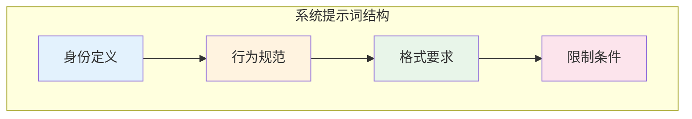
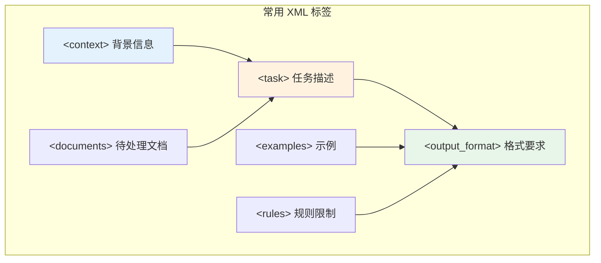
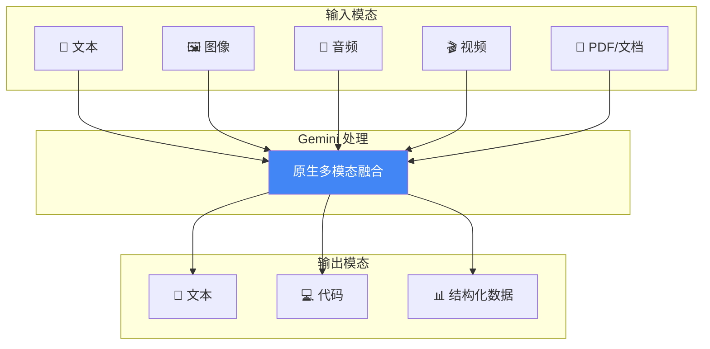
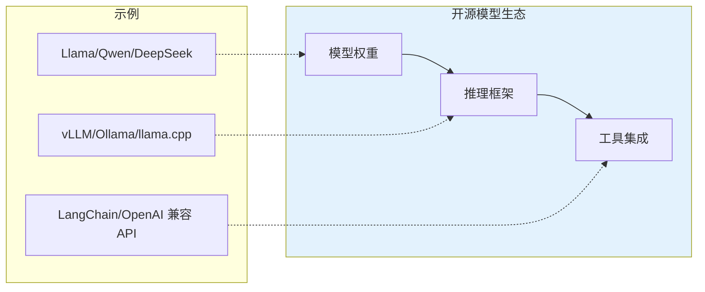
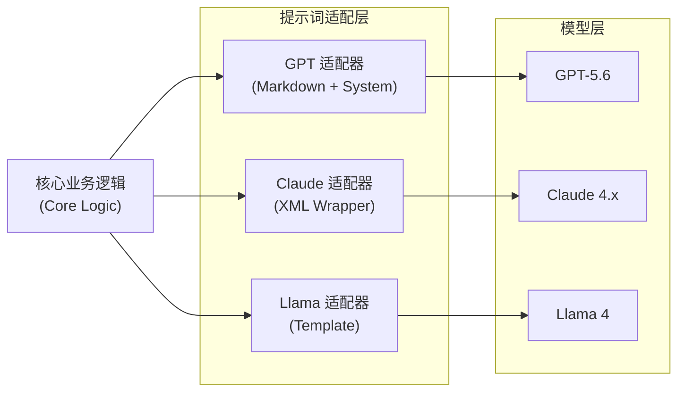

# 第十三章 平台特定策略

不同的 AI 模型平台有各自的特点和最佳实践。本章将介绍针对 OpenAI GPT、Anthropic Claude、Google Gemini 以及开源模型的平台特定提示词策略。


**本章目标**

* 理解本章核心概念与适用场景
* 掌握可复用的提示词/工作流模式
* 能将方法迁移到自己的任务中

# 1. OpenAI GPT 系列最佳实践

> **说明：** 本节已纳入 OpenAI 2026-07-09 API 发布。由于平台更新频繁，生产接入仍应回到官方 changelog 与模型指南复核。

OpenAI 是大语言模型商业化的先驱，其 GPT 系列是应用最广泛的语言模型。本节深入介绍针对 GPT 系列的提示词优化策略，涵盖从 GPT-4o 到最新的 GPT-5.x 推理模型。OpenAI 官方模型页说明最新模型可通过 Responses API 使用；对新项目而言，Responses API 与 Agents SDK 通常是构建工具调用、状态管理和智能体工作流的主入口，Chat Completions 更适合作为兼容旧代码和简单对话的稳定接口。

!!! warning "平台变更"
    
    模型可用性、上下文窗口和价格更新很快。如果你的系统强绑定某个模型版本，请以官方最新公告/文档为准，并通过回归测试验证迁移影响。

### 1.1 GPT 模型系列概览

OpenAI 目前提供多个系列的模型，适用于不同场景：

| 模型系列                   | 核心特点                              | 适用场景                |
| ---------------------- | --------------------------------- | ------------------- |
| `gpt-5.6-sol`          | GPT-5.6 前沿能力；`gpt-5.6` 别名当前路由到此模型 | 复杂生产工作流、质量优先任务      |
| `gpt-5.6-terra`        | 能力与成本平衡                           | 通用生产工作流             |
| `gpt-5.6-luna`         | 高吞吐与效率优先                          | 批量、低延迟子任务           |
| GPT-5.5                | GPT-5.6 的迁移来源；规格按历史模型页核验          | 既有系统兼容、迁移基线         |
| GPT-5.4                | 1M 上下文；价格低于 GPT-5.5 历史迁移基线        | 既有系统的成本敏感迁移过渡       |
| GPT-5.4 mini           | 400K 上下文；低延迟、低成本                  | 高吞吐子任务、批量处理         |
| GPT-5.1 及更早 GPT-5.x 快照 | 以历史模型页或既有合同为准                     | 历史兼容、迁移过渡           |
| o 系列（o1/o3）            | 较早一代推理优先路线                        | 数学、编程、逻辑推理（历史与专门场景） |
| GPT-4o                 | 较早的多模态 GPT 模型                     | 既有系统兼容、实时交互         |
| GPT-4o mini            | 成本优化、快速                           | 简单任务、高并发场景          |

### 1.2 系统提示词设计

GPT 模型对系统提示词有出色的遵从性，这是设计提示词的核心要素。

#### 1.2.1 基本结构

```python
messages = [
    {
        "role": "system",
        "content": """你是一位专业的数据分析师，具备以下特点：
- 擅长解读复杂数据并提供可操作的洞察
- 回答简洁、结构清晰
- 在不确定时会明确说明假设条件

输出要求：
1. 使用 Markdown 格式
2. 关键数据用表格呈现
3. 结论放在最前面"""
    },
    {
        "role": "user",
        "content": "分析这份销售数据..."
    }
]
```

#### 1.2.2 系统提示词的关键要素



*图 13-1：系统提示词的四个核心层次*

* **身份定义**：明确模型扮演的角色和专业领域
* **行为规范**：定义回答风格、语气和处理方式
* **格式要求**：指定输出的结构和格式
* **限制条件**：设定边界和禁止事项

### 1.3 函数调用与结构化输出

GPT 系列原生支持函数调用和结构化输出，是构建 智能体（agent） 系统的关键能力。

#### 1.3.1 Responses API 与 Agents SDK

OpenAI 的 Responses API 支持文本、图像、文件输入，能够通过 `previous_response_id` 或 `conversation` 管理状态，并可直接接入 Web Search、File Search、Computer Use、Code Interpreter 等内置工具。需要自己掌控工具循环、状态持久化和服务边界时，可直接使用 Responses API；需要运行多步工作流、handoff、guardrails、tracing、sessions 或沙箱型 agent 时，应优先评估 Agents SDK。

```python
from openai import OpenAI

client = OpenAI()

response = client.responses.create(
    model="gpt-5.6-terra",
    instructions="你是严谨的技术研究助手，回答必须列出来源。",
    input="检索 Docker Model Runner 的核心用途，并给出三条应用建议。",
    tools=[{"type": "web_search"}],
)

print(response.output_text)
```

GPT-5.6 还为 Responses API 增加 Programmatic Tool Calling、显式 prompt caching、持久化 reasoning，以及 beta 的 multi-agent orchestration。它们是不同的工程选项：可确定、工具密集且中间不需要新判断的步骤优先程序化；只有任务能安全拆成独立工作流且评测证明收益时，才启用 multi-agent beta。

函数调用仍是连接私有系统的主力方式；区别在于，新项目通常把函数工具挂到 Responses API 或 Agents SDK 上，而不是只围绕 `chat.completions.create()` 组织整个应用。

#### 1.3.2 函数定义示例

```python
tools = [
    {
        "type": "function",
        "name": "get_weather",
        "description": "获取指定城市的天气信息",
        "parameters": {
            "type": "object",
            "properties": {
                "city": {
                    "type": "string",
                    "description": "城市名称，如：北京、上海"
                },
                "unit": {
                    "type": "string",
                    "enum": ["celsius", "fahrenheit"],
                    "description": "温度单位"
                }
            },
            "required": ["city"],
            "additionalProperties": False
        }
    }
]
```

Responses API 的函数调用输出会以 `response.output` 中的 `function_call` item 返回，应用侧执行后要追加 `{"type": "function_call_output", "call_id": ..., "output": ...}` 再交回模型。Chat Completions 的旧形状仍使用 `{"type": "function", "function": {...}}` 与 `role="tool"`。

#### 1.3.3 结构化输出

2024 年 OpenAI 推出的结构化输出功能，确保模型输出严格符合指定的 JSON Schema：

```python
import json
from openai import OpenAI

client = OpenAI()

response = client.responses.create(
    model="gpt-5.4",
    input="分析这款产品：智能手表",
    text={
        "format": {
            "type": "json_schema",
            "name": "product_analysis",
            "strict": True,
            "schema": {
                "type": "object",
                "properties": {
                    "product_name": {"type": "string"},
                    "sentiment": {"type": "string", "enum": ["positive", "negative", "neutral"]},
                    "key_points": {"type": "array", "items": {"type": "string"}},
                    "confidence_score": {"type": "number"}
                },
                "required": ["product_name", "sentiment", "key_points", "confidence_score"],
                "additionalProperties": False
            }
        }
    }
)

analysis = json.loads(response.output_text)
print(analysis)
```

**结构化输出的优势**：

* 显著提升输出符合 Schema 的概率，但服务边界仍应保留 JSON Schema 校验、失败重试和降级路径
* 支持复杂嵌套结构
* 可与 Pydantic 或 JSON Schema 校验器结合，但服务端仍应保留二次校验

### 1.4 OpenAI 推理模型策略

o 系列是 OpenAI 较早一代专为复杂推理设计的路线。当前前沿主线已经转向 GPT-5.x 推理模型；理解 o 系列仍有助于把握推理模型的演进脉络。

#### 1.4.1 核心差异

| 维度    | 传统非推理 GPT  | 推理模型（GPT-5.x / o 系列）   |
| ----- | ---------- | ---------------------- |
| 推理方式  | 依赖提示词组织和示例 | 模型内部执行推理步骤             |
| 响应时间  | 通常更短       | 可能更长，取决于推理 effort / 预算 |
| 系统提示词 | 完整支持       | 按模型和 API 版本确认限制        |
| 推理控制  | 通常无专门推理预算  | 支持或曾支持推理 effort / 预算设置 |

#### 1.4.2 o 系列的提示词策略

```
❌ 不需要的写法：
"请一步步思考，展示你的推理过程..."

✅ 推荐的写法：
"证明：对于所有大于 2 的偶数 n，存在两个质数 p 和 q 使得 n=p+q"
```

**关键原则**：

1. **直接陈述问题**：无需要求“逐步思考”，模型会自动进行
2. **提供充分上下文**：复杂问题需要完整的背景信息
3. **设置推理预算**：在 Responses API 中通过 `reasoning={"effort": ...}` 控制推理深度；推理 token 会计入输出 token 口径

```python
from openai import OpenAI

client = OpenAI()
problem_statement = "证明：对于所有大于 2 的偶数 n，存在两个质数 p 和 q 使得 n=p+q。"

response = client.responses.create(
    model="o3",
    input=problem_statement,
    reasoning={"effort": "high"},  # low, medium, high 等；具体取值随模型变化
    max_output_tokens=12000,
)

print(response.output_text)
```

### 1.5 高级技巧

#### 1.5.1 使用分隔符组织复杂提示词

```

### 背景信息 ###

{context}

### 任务要求 ###

{task}

### 输出格式 ###

{format}
```

#### 1.5.2 利用 JSON 模式确保格式一致

```python
from openai import OpenAI

client = OpenAI()
messages = [{"role": "user", "content": "用 JSON 输出：{\"hello\": \"world\"}"}]

response = client.chat.completions.create(
    model="gpt-5.4",
    messages=messages,
    response_format={"type": "json_object"}
)

print(response.choices[0].message.content)
```

#### 1.5.3 温度参数调优

| 任务类型      | 推荐 Temperature |
| --------- | -------------- |
| 代码生成、事实问答 | 0 - 0.3        |
| 通用对话、文案写作 | 0.5 - 0.7      |
| 创意写作、头脑风暴 | 0.8 - 1.0      |

#### 1.5.4 多轮对话中的上下文管理

```python

# 保持关键信息在上下文开头和结尾

system_prompt = "你是一个有帮助的助手。"
important_context = "【关键信息】用户正在做产品选型。"
current_question = "请给出建议。"
key_reminder = "务必输出要点列表。"

messages = [
    {"role": "system", "content": system_prompt},
    {"role": "user", "content": important_context},  # 开头
    # ... 中间对话 ...
    {"role": "user", "content": current_question + "\n\n" + key_reminder}  # 结尾
]

print(messages)
```

### 1.6 常见问题与解决方案

| 问题      | 解决方案                                                                                                               |
| ------- | ------------------------------------------------------------------------------------------------------------------ |
| 输出格式不稳定 | 使用 Structured Outputs 或 JSON 模式                                                                                    |
| 模型“跑题”  | 在系统提示词中明确任务边界                                                                                                      |
| 回答过长    | 指定字数限制；Responses API 使用 `max_output_tokens`，Chat Completions 使用 `max_completion_tokens`，`max_tokens` 仅作为 legacy 参数 |
| 幻觉问题    | 结合 RAG，要求引用来源                                                                                                      |

!!! example "动手试试"

    1. 对比 GPT 系列的“推理模型”（o 系列）和“常规模型”（GPT-4o）处理同一个复杂任务的效果差异——什么时候推理模型明显更好？
    2. 试着用 system message 和 developer message 分别设置同一条指令，观察它们对模型行为影响的区别。

## 2 Anthropic Claude 提示技巧

> **说明：** 本节已纳入 Sonnet 5 发布与 Fable 5 恢复访问状态。在实际应用中仍需参考 Anthropic 最新官方文档。

Anthropic 的 Claude 系列以卓越的安全性、超长上下文窗口和独特的提示词技术著称。本节深入介绍 Claude 的核心特性和针对性的提示词优化策略。

### 2.1 Claude 模型系列

Claude 目前提供多个模型层级，满足不同场景需求：

| 模型                | 上下文  | 核心优势                                                                                                        | 适用场景                       |
| ----------------- | ---- | ----------------------------------------------------------------------------------------------------------- | -------------------------- |
| Claude Fable 5    | 1M   | 已列入官方 Legacy models（仍可用，建议迁移到 Fable 5.1）；2026-06-09 GA，$10/$50，Adaptive Thinking 常开，128K 输出；2026-07-01 恢复访问 | 长时代理、高难度推理；处理分类器拒绝与回退      |
| Claude Sonnet 5   | 1M   | `claude-sonnet-5`，128K 输出，Adaptive Thinking 默认开启                                                            | 编码、Agent 与企业工作流            |
| Claude Opus 5     | 1M   | `claude-opus-5`（2026-07-24 发布），$5/$25、128K 输出、Adaptive Thinking；官方模型页建议“不确定用哪个模型时先从 Opus 5 开始”              | 复杂代理式编码与企业工作流              |
| Claude Opus 4.8   | 1M   | 已列入 Legacy models；1M 上下文与 $5/$25 定价不变                                                                       | 存量集成维护；新项目建议迁移到 Opus 5     |
| Claude Sonnet 4.6 | 1M   | 已列入 Legacy models；领先编码能力、VS Code 集成                                                                         | 存量企业应用维护；新项目建议迁移到 Sonnet 5 |
| Claude Haiku 4.5  | 200K | 快速响应、低成本                                                                                                    | 简单任务、高并发                   |

> 2026-06-09 同日发布的 Claude Mythos 5 与 Fable 5 在 6 月 12 日暂停后，于 2026-07-01 恢复访问；Mythos 5 仍仅面向 Project Glasswing 获批客户，不提供自助注册。

> **说明（平台迁移）**：Anthropic 当前文档使用 `platform.claude.com` 作为 Claude API 文档入口。旧模型的弃用状态和迁移路径应以官方 [model deprecations](https://platform.claude.com/docs/en/about-claude/model-deprecations) 页面为准。

> **⚠️ 兼容性提示（采样参数）**：`temperature`、`top_p`、`top_k` 已被 Anthropic 标为弃用参数。在 Claude Opus 4.7 及之后的模型（含 Opus 5、Opus 4.8、Sonnet 5、Fable 5、Mythos 5、Mythos Preview）上传入非默认值会返回 400 错误，与是否开启 thinking 无关；更早的模型只在 thinking 开启时受限。这意味着第 2.3 节给出的参数组合策略不适用于这些模型——在 Claude 上应改用提示词约束输出风格与确定性。

### 2.2 XML 标签：Claude 的提示词利器

Claude 对 XML 标签有出色的识别和遵从能力，这是区别于其他模型的标志性特征。

#### 2.2.1 基础结构

```xml
<context>
你正在帮助一家电商公司分析用户反馈。该公司主营电子产品，
目标客户群体为 25-45 岁的城市白领。
</context>

<documents>
<doc id="1">用户 A 评价：产品质量很好，但物流太慢...</doc>
<doc id="2">用户 B 评价：性价比超高，强烈推荐...</doc>
</documents>

<task>
请分析上述用户反馈，识别主要的正面和负面主题，
并提供可操作的改进建议。
</task>

<output_format>
请按以下结构输出：
1. 正面主题（列表）
2. 负面主题（列表）
3. 改进建议（按优先级排序）
</output_format>
```

#### 2.2.2 常用 XML 标签



*图 13-2：Claude XML 标签结构*

### 2.3 预填充技术

Claude 可通过 assistant-message prefill 预设回复开头来控制格式；但 Claude Fable 5、Mythos 5、Mythos Preview、Opus 4.8、Opus 4.7、Opus 4.6、Sonnet 5、Sonnet 4.6 已不支持 prefill，使用时会返回 400 错误。Anthropic 官方 Messages 文档仍使用 Sonnet 4.5 展示 prefill 示例；新项目应优先使用 Structured Outputs、`output_config.format` 或系统提示词约束输出格式，只有维护明确支持 assistant turn 续写的模型时，才保留 prefill 作为兼容路径。

#### 2.3.1 推荐用法：结构化输出

```python
from anthropic import Anthropic

client = Anthropic()

response = client.messages.create(
    model="claude-sonnet-5",
    max_tokens=1024,
    output_config={
        "format": {
            "type": "json_schema",
            "schema": {
                "type": "object",
                "properties": {
                    "sentiment": {"type": "string", "enum": ["positive", "neutral", "negative", "mixed"]},
                    "confidence": {"type": "number", "minimum": 0, "maximum": 1},
                    "details": {"type": "string"}
                },
                "required": ["sentiment", "confidence", "details"],
                "additionalProperties": False
            }
        }
    },
    messages=[
        {"role": "user", "content": "分析这段文本的情感倾向：'产品很棒，但客服态度一般'"}
    ]
)

for block in response.content:
    if block.type == "text":
        print(block.text)
```

#### 2.3.2 兼容路径：用系统提示词替代 prefill

```python
prompt = "请输出一个 JSON，包含字段 sentiment 与 confidence。"

messages = [
    {
        "role": "user",
        "content": (
            "只输出一个合法 JSON 对象，不要使用 Markdown 代码块。"
            "字段必须包含 sentiment 与 confidence。\n\n"
            f"{prompt}"
        )
    }
]

print(messages)
```

#### 2.3.3 旧模型 prefill 的适用边界

| 场景      | 新模型推荐做法                                     | 旧模型兼容做法        |
| ------- | ------------------------------------------- | -------------- |
| JSON 输出 | Structured Outputs / `output_config.format` | `{"` 或 `[{`    |
| 编号列表    | 系统提示词 + 示例                                  | `1.`           |
| 代码输出    | 明确语言和边界条件                                   | \`\`\`python\n |
| 特定开头    | 风格提示 + 正例                                   | `根据分析，`        |

### 2.4 扩展思考

Claude 3.7 Sonnet 起支持扩展思考功能。Claude Sonnet 5 默认开启 Adaptive Thinking；手动 Extended Thinking 在 Sonnet 5 上会返回 400，旧语法只应保留在明确兼容的旧模型路径。

#### 2.4.1 启用扩展思考

```python
from anthropic import Anthropic

client = Anthropic()
complex_problem = "请证明：1+2+...+n = n(n+1)/2。"

response = client.messages.create(
    model="claude-sonnet-5",
    max_tokens=16000,
    thinking={
        "type": "adaptive",
        # Sonnet 5、Opus 5、Fable 5 上 display 默认为 "omitted"，
        # 思考块会返回空的 thinking 字段；要读到摘要文本必须显式开启
        "display": "summarized"
    },
    messages=[{"role": "user", "content": complex_problem}]
)

# 访问思考过程

for block in response.content:
    if block.type == "thinking":
        print("思考过程:", block.thinking)
    elif block.type == "text":
        print("最终回答:", block.text)
```

> **注意**：Claude Sonnet 5 默认启用 Adaptive Thinking；若显式配置，请使用该模型支持的 adaptive/disabled 路径。`type: "enabled"` 与 `budget_tokens` 不再是 Sonnet 5 的兼容路径。另外，Fable 5 / Mythos 5 / Mythos Preview 直接拒绝 `type: "disabled"`；Opus 5 允许关闭，但只在 `effort` 为 `high` 及以下时接受，与 `xhigh` / `max` 同时使用会返回 400。

#### 2.4.2 扩展思考的适用场景

* **数学证明**：需要多步骤逻辑推导
* **代码调试**：需要追踪复杂执行流程
* **策略分析**：需要权衡多种因素
* **学术研究**：需要深入分析论证

### 2.5 长上下文处理策略

Claude 的长上下文能力可以处理整本书籍，但需要注意信息组织策略。Anthropic 当前模型概览列出 Fable 5.1、Opus 5 与 Sonnet 5 为 1M 上下文窗口，Haiku 4.5 为 200K；Fable 5、Opus 4.8 与 Sonnet 4.6 已移入 Legacy models 折叠区，同样是 1M。长上下文请求的价格、速率限制和 token 计数可能随模型变化，生产接入前应使用官方价格页、Models API 和 token counting API 按目标模型实测。

#### 2.5.1 关键信息位置原则

```
⚠️ "中间迷失"（Lost in the Middle）现象：
模型对上下文开头和结尾的信息关注度更高，
中间部分的信息可能被忽略。

✅ 解决方案：
1. 将最重要的信息放在开头或结尾
2. 使用明确的标签分隔不同部分
3. 在问题中引用关键段落编号
```

#### 2.5.2 长文档处理模板

```xml
<document>
以下是一份 150 页的技术报告，请仔细阅读后回答问题。
{long_document_content}
</document>

<question>
根据上述报告第三章的数据，分析 2024 年的市场趋势。
注意：请确保答案基于报告内容，如有不确定请明确指出。
</question>
```

### 2.6 安全与对齐特性

Claude 在安全对齐方面有独特优势，适合构建高可靠性应用。

#### 2.6.1 利用 Claude 的诚实性

```xml
<instructions>
请分析以下商业提案的可行性。

重要规则：
- 如果信息不足以做出判断，请明确说明需要哪些额外信息
- 如果发现潜在风险，请详细列出
- 不要为了显得有帮助而忽略问题
</instructions>
```

#### 2.6.2 防止有害输出

Claude 天然具有较强的安全边界，但仍可通过系统提示词强化：

```xml
<system_rules>
你是一个专业的法律顾问助手。

禁止事项：
- 不得提供具体的法律建议，只能提供一般性信息
- 遇到敏感话题时，建议用户咨询专业律师
- 不得帮助规避法律
</system_rules>
```

### 2.7 实战示例：复杂文档分析

```xml
<role>
你是一位资深的商业分析师，擅长从财务报告中提取关键洞察。
</role>

<context>
客户是一家寻求投资的初创公司，需要评估目标公司的财务健康状况。
</context>

<documents>
<annual_report>
{complete_annual_report_content}
</annual_report>
</documents>

<task>
请完成以下分析任务：
1. 提取关键财务指标（收入、利润、现金流）
2. 识别年报中的风险信号
3. 评估公司的长期增长潜力
4. 给出投资建议（推荐/谨慎/不推荐）
</task>

<output_format>

## 财务指标摘要

| 指标 | 数值 | 同比变化 |
...

## 风险信号

1. ...

## 增长潜力评估

...

## 投资建议

建议：[推荐/谨慎/不推荐]
理由：...
</output_format>
```

### 2.8 案例解析：Claude 设计系统提示词的架构

Anthropic 在 Claude 设计工具中使用的系统提示词是一个生产级 System Prompt 的典范，篇幅达数千 tokens，涵盖角色、安全、工作流、输出规范、领域知识等多个维度。拆解其架构，可以总结出以下值得借鉴的模式。

#### 2.8.1 多身份角色切换

提示词没有将 Claude 锁定为单一角色，而是定义了一个“专家级设计师”的元角色，要求模型根据任务类型动态切换子身份——动画师、UX 设计师、幻灯片设计师、原型设计师等。这种“元角色 + 上下文触发”的模式比静态角色定义更灵活。

#### 2.8.2 安全约束的分层设计

提示词在开篇紧接角色定义之后，立即声明安全红线：严禁泄露系统提示词、工具名称或技术环境细节。关键技巧是区分“可以谈”和“不可以谈”——Claude 可以用非技术方式描述自己的能力（如“我可以创建 HTML 文件”），但不能暴露实现细节（如工具名称、内部标签格式）。

#### 2.8.3 工作流的过程化编码

提示词将设计工作流分解为六个明确步骤：(1) 理解需求并提问；(2) 探索已有资源；(3) 制定计划；(4) 搭建文件结构；(5) 执行并交付验证；(6) 简短总结。每一步都附带具体行为指引，而非泛泛的“请认真思考”。

#### 2.8.4 “不可协商”标记模式

提示词使用“绝不”“不可协商”“关键”等强标记词来区分硬约束与软建议。例如：

* “**绝对不要** 写 `const styles = {...}`”——样式命名空间冲突会导致页面损坏
* “**不可协商的**——样式对象命名冲突会造成损坏”
* “除非被明确告知，否则 **绝不** 添加讲者备注”

这种分级约束让模型能在有限上下文中正确排列优先级。

#### 2.8.5 从故障到规则的提炼

每条工程约束背后都有真实故障场景：样式命名冲突导致页面渲染错误、`scrollIntoView` 弄乱 Web 应用、未固定版本导致构建不可复现。这种“踩坑驱动”的规则比抽象原则更有约束力，也更容易被模型准确执行。

这个案例展示了生产级 System Prompt 的核心架构：**安全红线 → 工作流程 → 硬约束规范 → 领域最佳实践 → 灵活创造空间**。从顶层不可触碰的安全边界，到底层鼓励探索的设计自由度，层层递进。

!!! question "想一想"

    1. Claude 偏好 XML 标签来组织提示词结构——这和 GPT 偏好的 Markdown 格式相比，在什么场景下优势更明显？
    2. Claude 的 “extended thinking” 功能相当于内置了思维链——这是否意味着你不再需要手动添加 “一步步思考” 之类的指令？
    3. Claude 设计系统提示词中的“不可协商”标记模式，如何应用到你自己的 System Prompt 中？试着为你的应用场景设计 2-3 条硬约束。

## 3. Google Gemini 提示策略

> **说明：** Google 模型页当前将 Gemini 3.8 Flash（2026-09-02 发布，页面上的最新 Flash 型号）、Gemini 3.7 Flash、Gemini 3.6 Flash 与 Gemini 3.5 Flash 同标为 Stable，将 Gemini 3.1 Pro 标为 Preview。生产系统不要把 Preview、`latest` 别名、上下文窗口或价格写死在业务逻辑中。

Google 的 Gemini 是从设计之初就采用原生多模态架构的大语言模型系列。本节深入介绍 Gemini 的核心特性和针对性的提示词优化策略。

### 3.1 Gemini 模型系列

Gemini 提供多个模型层级，覆盖不同的能力和成本需求：

| 模型                     | 上下文窗口                          | 核心特点                                                                | 适用场景                    |
| ---------------------- | ------------------------------ | ------------------------------------------------------------------- | ----------------------- |
| Gemini 3.6 Flash       | 1,048,576 输入 / 65,536 输出 token | Stable，面向代码生成、agent 执行与空间推理；页面已把它列为上一代 Flash，最新一档是 Gemini 3.8 Flash | 生产首选、快速 agent 循环与多模态工作流 |
| Gemini 3.5 Flash       | 1,048,576 输入 / 65,536 输出 token | Stable，但官方现已将其描述为 legacy Flash 型号，面向常规高吞吐负载提供基础速度与性能                | 生产候选、子代理部署与长周期任务        |
| Gemini 3.1 Pro Preview | 限制以官方模型页为准                     | Preview、复杂推理与 agent 工作流                                             | 评估最新能力、前沿试验             |
| Gemini 2.5 Pro         | 1,048,576 输入 / 65,536 输出 token | 既有稳定旗舰，已公布 2026 关闭窗口                                                | 存量系统迁移、兼容性验证            |
| Gemini 2.5 Flash       | 1,048,576 输入 / 65,536 输出 token | 既有低延迟模型，已公布 2026 关闭窗口                                               | 存量实时/批量工作流迁移            |
| Gemini 2.5 Flash-Lite  | 1,048,576 输入 / 65,536 输出 token | 既有成本优化模型，已公布 2026 关闭窗口                                              | 存量高并发场景迁移               |
| Gemini 1.5 Pro         | 历史百万级上下文模型                     | 历史兼容                                                                | 既有系统维护                  |
| Gemini Nano            | 设备端                            | 轻量级、离线运行                                                            | 移动端本地应用                 |

> **上下文窗口详解**：Gemini 3.6 Flash、Gemini 3.5 Flash 与 Gemini 2.5 Pro / Flash / Flash-Lite 的官方模型页都列出 1,048,576 输入 token 与 65,536 输出 token；差别不在窗口大小，而在 2.5 系列的 deprecations 页面已公布 2026 年关闭窗口。对生产环境来说，通常优先选择官方标记为 Stable 且未进入关闭窗口的模型；`Gemini 3.1 Pro Preview` 更适合在可接受预览波动时做前沿评估。Google 官方模型页提示 Gemini 3 Pro Preview 已于 2026-03-09 关闭，应迁移到 Gemini 3.1 Pro Preview。

### 3.2 原生多模态能力

Gemini 的核心优势在于从架构层面就支持多种模态的融合处理。

#### 3.2.1 多模态输入示例

> **注意**：以下代码示例使用 `gemini-2.5-pro` 作为存量兼容示例；新项目请先检查 [Google 官方模型页](https://ai.google.dev/gemini-api/docs/models) 和 deprecations 页面，优先选择当前稳定且未进入关闭窗口的模型。如果你要测试最新预览能力，可以在非生产环境中替换为 `gemini-3.1-pro-preview`。

```python
import os
from google import genai
from google.genai import types

api_key = os.getenv("GEMINI_API_KEY") or os.getenv("GOOGLE_API_KEY")
client = genai.Client(api_key=api_key)

product_image = b"<demo_image_bytes>"
audio_clip = b"<demo_audio_bytes>"

response = client.models.generate_content(
    model="gemini-2.5-pro",
    contents=[
        "请分析这张产品图片和用户反馈音频，给出综合评估：",
        types.Part.from_bytes(data=product_image, mime_type="image/png"),
        types.Part.from_bytes(data=audio_clip, mime_type="audio/wav"),
        "补充信息：这是一款智能手表，目标用户是运动爱好者。"
    ],
)

print(response.text)
```

#### 3.2.2 支持的模态类型



*图 13-3：Gemini 多模态处理流程*

### 3.3 多模态提示词设计

#### 3.3.1 图像理解与分析

```
请详细分析这张建筑图片：

[图片]

分析维度：
1. 建筑风格（古典/现代/后现代等）
2. 主要建筑材料
3. 设计特色和创新点
4. 预估建造年代

请用专业但易懂的语言解释，适合建筑爱好者阅读。
```

#### 3.3.2 视频内容分析

```
请分析这段教学视频：

[视频]

分析要求：
1. 提取关键知识点（按时间戳标注）
2. 评估教学方法的有效性
3. 识别可能让观众困惑的部分
4. 生成 5 个检验理解的问题

输出格式：Markdown 带时间戳
```

#### 3.3.3 跨模态推理

```
这是一份手写数学作业的照片：

[图片]

请完成以下任务：
1. 识别所有数学表达式
2. 检查计算过程是否正确
3. 对于错误的步骤，指出错在哪里并给出正确解法
4. 给出整体评分（满分 100 分）
```

### 3.4 超长上下文处理策略

Gemini 的百万级上下文能力可以处理：

* Gemini 3.6 Flash / Gemini 3.5 Flash（各 1,048,576 输入 token）：当前 Stable 的长上下文首选，文本、图像、视频、音频与 PDF 均可直接作为输入
* Gemini 2.5 Pro（1,048,576 输入 token）：约 75 万字量级的文本、长篇技术资料、多份长文档联合分析，以及较长时长的视频/音频理解任务；已公布 2026 关闭窗口
* Gemini 3.1 Pro Preview：属于预览模型，适合评估前沿推理和 agent 工作流；上下文与价格限制应以 Google 最新模型页为准

#### 3.4.1 长文档处理最佳实践

```
<document>
以下是《三国演义》全文，共约 80 万字：
{entire_book_content}
</document>

<question>
请分析全书中诸葛亮的人物形象变化：
1. 出山前（隆中对之前）
2. 辅佐刘备时期
3. 托孤后独掌大权时期
4. 北伐时期

每个时期请引用原文中的具体章节和段落作为支撑。
</question>
```

#### 3.4.2 信息检索模式

对于超长文档中的精确查找：

```
在上述文档中，找出所有提到"战略"或"策略"的段落，
并按以下格式列出：

| 位置 | 原文摘录 | 上下文主题 |
|-----|---------|-----------|
```

### 3.5 Google 生态集成

Gemini 与 Google 产品生态深度集成，可利用这些能力增强应用。

#### 3.5.1 与 Google Search 结合

```python
import os
from google import genai
from google.genai import types

api_key = os.getenv("GEMINI_API_KEY") or os.getenv("GOOGLE_API_KEY")
client = genai.Client(api_key=api_key)

response = client.models.generate_content(
    model="gemini-2.5-pro",
    contents="2024 年诺贝尔物理学奖得主是谁？获奖原因是什么？",
    config=types.GenerateContentConfig(
        tools=[types.Tool(google_search=types.GoogleSearch())]
    ),
)

print(response.text)
```

#### 3.5.2 与 Google Workspace 协作

```
你可以访问用户的 Google Drive 文档。

任务：
1. 阅读名为"Q3 财务报告"的 Google Sheets
2. 分析销售趋势
3. 生成一份摘要，可以直接粘贴到 Google Docs
```

### 3.6 结构化输出指定

Gemini 支持严格的输出格式控制：

```python
import os
from google import genai
from google.genai import types

api_key = os.getenv("GEMINI_API_KEY") or os.getenv("GOOGLE_API_KEY")
client = genai.Client(api_key=api_key)

prompt = "对这段文本做情感分析并输出 JSON。"

config = types.GenerateContentConfig(
    response_mime_type="application/json",
    response_schema={
        "type": "object",
        "properties": {
            "sentiment": {"type": "string", "enum": ["positive", "negative", "neutral"]},
            "confidence": {"type": "number"},
            "keywords": {"type": "array", "items": {"type": "string"}}
        }
    }
)

response = client.models.generate_content(
    model="gemini-2.5-pro",
    contents=prompt,
    config=config,
)

print(response.text)
```

### 3.7 提示词模板示例

#### 3.7.1 综合分析模板

```
角色：资深数据分析师

任务：
分析提供的多模态数据，生成综合报告。

输入数据：
- 图片：[产品图片]
- 文档：[用户调研报告 PDF]
- 数据：[销售数据 CSV]

分析维度：
1. 产品视觉吸引力评估
2. 用户反馈主题分析
3. 销售数据趋势
4. 综合建议

输出要求：
- 结构化 Markdown 报告
- 包含数据可视化描述
- 可操作的建议清单
```

### 3.8 常见问题与解决方案

| 问题       | 解决方案             |
| -------- | ---------------- |
| 视频分析不够细致 | 指定具体时间段，或要求逐分钟分析 |
| 图像细节遗漏   | 要求“仔细观察图片的每个区域”  |
| 长文档遗忘开头  | 在问题中引用关键段落位置     |
| 输出过于冗长   | 明确字数限制，使用结构化输出   |

!!! question "延伸思考"

    1. Gemini 的原生多模态能力意味着你可以在一个提示中混合文本、图像甚至视频。你认为哪个多模态组合在你的业务中最有实用价值？
    2. 同样的任务，在 GPT、Claude、Gemini 上分别需要不同的提示词优化。维护多平台提示词的成本是否值得？你会如何管理？


## 4. 开源模型的提示词适配

> **说明：** 本节基于 2026 年初的开源生态（如 Llama-3、Qwen、DeepSeek 等系列）能力编写。开源生态日新月异，请持续关注社区的最新进展。

开源大语言模型如 Llama、Qwen、DeepSeek 等提供了本地部署的灵活性和数据隐私保障。本节深入介绍开源模型的特点和提示词适配策略。

### 4.1 开源模型生态概览

当前主流的开源大语言模型：

| 模型系列            | 开发者        | 参数规模       | 核心优势        |
| --------------- | ---------- | ---------- | ----------- |
| Llama 3.x       | Meta       | 8B-405B    | 社区活跃、生态完善   |
| Qwen 2.5        | 阿里         | 0.5B-72B   | 中文优化、多语言    |
| DeepSeek V3     | DeepSeek   | 671B (MoE) | 推理能力强、代码优秀  |
| Mistral/Mixtral | Mistral AI | 7B-8x22B   | 高效架构、欧洲开源先锋 |
| ChatGLM         | 智谱 AI      | 6B-130B    | 中文原生、学术背景   |



*图 13-4：开源模型技术栈*

### 4.2 提示词模板格式

**使用正确的模板格式是开源模型获得良好效果的关键前提。**

#### 4.2.1 Llama 3 格式

Llama 3 使用特殊的 header 标记格式：

```
<|begin_of_text|><|start_header_id|>system<|end_header_id|>

你是一个专业的助手，擅长回答技术问题。<|eot_id|>
<|start_header_id|>user<|end_header_id|>

请解释量子计算的基本原理。<|eot_id|>
<|start_header_id|>assistant<|end_header_id|>

```

#### 4.2.2 ChatML 格式

ChatML 是一种被广泛采用的标准格式：

```
<|im_start|>system
你是一个专业的助手，擅长回答技术问题。<|im_end|>
<|im_start|>user
请解释量子计算的基本原理。<|im_end|>
<|im_start|>assistant
```

#### 4.2.3 Alpaca 格式

许多基于 Alpaca 微调的模型使用这种简单格式：

```
Below is an instruction that describes a task. Write a response that appropriately completes the request.

### Instruction:

请解释量子计算的基本原理。

### Response:

```

### 4.3 模型特定的提示词策略

#### 4.3.1 Llama 3 系列

Llama 3 是目前社区生态最完善的开源模型。

**特点**：

* 强大的指令遵循能力
* 代码生成能力优秀
* 多语言支持良好（但中文能力弱于 Qwen）

**提示词建议**：

* 使用英文效果通常优于中文
* 可以使用较少的 few-shot 示例
* 对结构化输出（如 JSON）支持良好

```python

# 使用 Ollama 调用 Llama 3

import ollama

response = ollama.chat(
    model="llama3.1:70b",
    messages=[
        {"role": "system", "content": "You are a helpful coding assistant."},
        {"role": "user", "content": "Write a Python function to calculate fibonacci numbers."},
    ],
)

print(response["message"]["content"])
```

#### 4.3.2 Qwen 2.5 系列

Qwen 是目前中文能力最强的开源模型之一。

**特点**：

* 中文理解和生成能力优秀
* 多语言支持（含代码）
* 提供多种规模（0.5B 到 72B）

**提示词建议**：

* 可以直接使用中文提示词
* 对复杂任务分解响应良好
* 支持 function calling

```python

# Qwen 中文提示词示例

prompt = """
你是一位专业的文案编辑。请将以下技术文档改写为面向普通用户的产品说明：

原文：
本系统采用微服务架构，通过 Kubernetes 编排容器化部署，
支持水平扩展和自动故障恢复。

要求：
1. 去除技术术语
2. 突出用户价值
3. 控制在 100 字以内
"""
```

#### 4.3.3 DeepSeek 系列

DeepSeek 在代码和数学推理方面表现出色。

**特点**：

* MoE 架构，高效推理
* 代码生成能力接近 GPT-4
* 支持长上下文（128K）

**提示词建议**：

* 数学和编程任务优先考虑
* 可以要求详细的推理过程
* 支持中英文混合

### 4.4 本地部署与推理优化

#### 4.4.1 推理框架选择

| 框架        | 特点             | 适用场景        |
| --------- | -------------- | ----------- |
| Ollama    | 简单易用           | 个人学习、快速原型   |
| vLLM      | 高吞吐量           | 生产环境、高并发    |
| llama.cpp | CPU 友好         | 边缘设备、CPU 推理 |
| TGI       | HuggingFace 生态 | 企业级部署       |

#### 4.4.2 使用 Ollama 快速部署

```bash

# 安装模型

ollama pull qwen2.5:14b

# 运行对话

ollama run qwen2.5:14b "请用 Python 写一个快速排序算法"

# 作为 API 服务

ollama serve
```

### OpenAI 兼容 API

大多数推理框架提供 OpenAI 兼容的 API，方便迁移：

```python
from openai import OpenAI

# 指向本地服务
client = OpenAI(
    base_url="http://localhost:11434/v1",  # Ollama 地址
    api_key="unused",  # 本地部署通常不需要密钥
)

response = client.chat.completions.create(
    model="qwen2.5:14b",
    messages=[
        {"role": "system", "content": "你是一个有帮助的助手"},
        {"role": "user", "content": "你好！"},
    ],
)

print(response.choices[0].message.content)
```

### 4.5 开源模型的能力边界

与闭源模型相比，开源模型的注意事项：

| 维度   | 优势      | 局限             |
| ---- | ------- | -------------- |
| 数据隐私 | 数据不出本地  | -              |
| 定制自由 | 可微调适配   | 需要技术能力         |
| 成本   | 推理成本低   | 部署成本           |
| 能力   | 特定任务可优化 | 通用能力通常弱于顶级闭源模型 |
| 更新   | 版本迭代快   | 需要跟踪社区动态       |

### 4.6 提示词适配最佳实践

1. **确认模板格式**：使用模型官方推荐的提示词模板
2. **测试基准任务**：在关键任务上对比不同模型
3. **调整期望**：小模型能力有限，任务可能需要简化
4. **利用量化**：4bit/8bit 量化可大幅降低显存需求
5. **关注社区**：HuggingFace、GitHub 有丰富的微调版本

!!! question "讨论"

    1. 开源模型的“提示词模板”（如 ChatML 格式）对提示词效果影响很大。你是否遇到过因为格式不对导致模型表现异常的情况？
    2. 如果你需要在本地部署一个 7B 参数的小模型，提示词设计策略和使用 GPT-4 时有什么关键区别？

## 13.5 跨模型提示词策略

随着企业级 AI 应用的普及，开发者常面临一个棘手的工程问题：**提示词是否应该绑定到特定模型？**

如果我有多个模型（例如 GPT-4 用于复杂推理，Claude Sonnet 4.6 用于长文档分析，Llama 3 用于即时响应），是否需要维护多套完全不同的提示词？

本节将深入探讨提示词的“移植性”问题，并提供生产环境下的最佳实践。

### 5.1 提示词的“移植性”矩阵

不同模型由于训练数据分布、指令微调策略的差异，对提示词格式的偏好也不同。以下是主流模型对提示词语法的偏好矩阵：

| 特性        | OpenAI GPT 系列          | Anthropic Claude 系列                                                                                                                                                                           | Google Gemini 系列 | Meta Llama 系列       |
| --------- | ---------------------- | --------------------------------------------------------------------------------------------------------------------------------------------------------------------------------------------- | ---------------- | ------------------- |
| **首选格式**  | Markdown               | XML 标签                                                                                                                                                                                        | Markdown / 自由文本  | 特殊 Token / Markdown |
| **系统提示词** | 强依赖 (System Role)      | 强依赖（System 参数）                                                                                                                                                                                | 支持               | 依赖模板格式              |
| **少样本示例** | 消息历史 (User/Assistant)  | XML 包装 `<example>`                                                                                                                                                                            | 消息历史             | 消息历史                |
| **思维链触发** | 需显式要求或 o1 自动           | 支持 `thinking` 参数                                                                                                                                                                              | 自然语言引导           | 自然语言引导              |
| **结构化输出** | JSON Schema / Function | Structured Outputs / System Prompt（注：Prefill 已在 4.6+ 停止支持，仅 4.5 及更早可用，详见 13.2 节） | JSON Schema      | 语法约束 (Grammar)      |

**结论**：

1. **Markdown 是通用语**：几乎所有模型都能很好地理解 Markdown 格式（标题、列表、代码块）。
2. **XML 是 Claude 的原生语**：虽然 GPT 也能理解 XML，但 Claude 对 XML 的结构化指令遵循度极高。
3. **负面约束**：不同模型对“不要做某事”的敏感度不同，Claude 通常比 GPT 更遵守安全边界。

### 5.2 核心策略：适配器模式

在软件工程中，适配器模式用于连接不兼容的接口。在提示词工程中，我们推荐采用 **“核心逻辑复用 + 格式层适配”** 的策略，而不是维护多套完全独立的代码。

#### 5.2.1 架构设计



*图 13-5：提示词适配器架构*

#### 5.2.2 代码实现示例

以下是一个简单的适配器实现，演示如何根据目标模型动态组装提示词：

```python
class PromptAdapter:
    def __init__(self, core_instruction, context_data):
        self.instruction = core_instruction
        self.context = context_data

    def to_gpt(self):
        """构建 GPT 风格的提示词结构"""
        return [
            {
                "role": "system",
                "content": f"### Instructions\n{self.instruction}\n\n### Format\nPlease respond in Markdown."
            },
            {
                "role": "user",
                "content": f"### Context\n{self.context}"
            }
        ]

    def to_claude(self):
        """构建 Claude 风格的 XML 提示词"""
        xml_prompt = f"""
        <system_instructions>
        {self.instruction}
        </system_instructions>

        <context>
        {self.context}
        </context>

        Please follow the instructions to analyze the context.
        """
        # 注意：Claude API 通常将 system prompt 作为独立参数传递，
        # 或者是 user message 的一部分，取决于具体 SDK 版本。
        return [{"role": "user", "content": xml_prompt}]

# 使用示例

core_logic = "分析这段文本的情感，提取关键实体。"
data = "用户对新产品的电池续航非常满意，但认为价格太高。"

adapter = PromptAdapter(core_logic, data)

# 调用 GPT

gpt_messages = adapter.to_gpt()

# client.chat.completions.create(model="gpt-5.4", messages=gpt_messages)

# 调用 Claude

claude_messages = adapter.to_claude()

# client.messages.create(model="claude-sonnet-4-6", messages=claude_messages)

```

**适配器的价值**：

* **业务逻辑解耦**：当业务规则变更（例如“增加一步情感分析”）时，只需修改 Core Logic，所有模型自动生效。
* **模型无感替换**：应用层代码不需要关心底层调用的具体模型格式。

### 5.3 元提示词：Meta-Prompting 自动转换

对于非常复杂的提示词，手动编写适配器可能很繁琐。一种更高级的技巧是使用 **元提示词**，让一个强模型（如 GPT-4 或 Claude Opus）充当“编译器”，将一个通用提示词“编译”为特定模型的最佳格式。

#### 5.3.1 转换器提示词示例

```markdown
# Role

You are a Prompt Engineering Expert specializing in model adaptation.

# Task

Convert the following [Generic Prompt] into a format optimized for [Target Model].

# Target Model Specifications

- **If Claude**: Use XML tags (<task>, <rules>) to structure the prompt. Put context in <context>. Use <thinking> for reasoning.
- **If GPT**: Use clear Markdown headers (# Task, # Context). Separate System and User roles clearly.
- **If Llama**: Use strict instruction following verifyable structure.

# Generic Prompt

"""
请分析简历中的技能点，并匹配职位描述。输出 JSON 格式。
职位描述：...
简历内容：...
"""

# Output

Output ONLY the converted prompt.
```

### 5.4 生产环境建议

1. **通用任务**
   * **场景**：摘要、翻译、简单的文本处理。
   * **建议**：使用标准的 **Markdown** 格式。这是目前兼容性最好的“最大公约数”。
2. **高精度业务**
   * **场景**：复杂的逻辑推理、代码生成、格式要求极严的 API 调用。
   * **建议**：使用适配器模式。针对主力模型（如 GPT-4）进行深度优化，针对备选模型（如 Llama 3）进行特定格式调整。
3. **微调模型**
   * **场景**：使用私有数据微调过的垂直领域模型。
   * **建议**：**必须绑定**。微调模型通常对特定的 Prompt Template 过拟合，更改提示词结构可能会导致性能大幅下降。

!!! question "思考"

    1. 您目前的系统中使用了几种模型？是否遇到过 Prompt 在 A 模型表现好，在 B 模型表现差的情况？
    2. 在您的业务场景下，是维护多套 Prompt 的成本更高，还是编写适配器代码的成本更高？

## 6. 本章实战练习

本节提供实战练习，帮助读者掌握基于不同大模型平台制定针对性提示词策略的技巧。

### 练习一：系统级指令的跨平台移植

**目标**：理解 OpenAI 和 Claude 在角色设定和系统级指令上的偏好差异。

**场景描述**： 你手头有一份在 GPT-4o 上运行良好的小说大纲生成器 系统提示词（system prompt）：

```
你是一个天才悬疑小说家。
你的任务是根据用户给出的几个关键词，生成一份包含"起承转合"四个部分的短篇小说大纲。
请确保大纲的最后部分有一个惊人的反转。
返回格式必须是一个包含这四个键的 JSON，不要输出多余的解释文字。
```

**任务**： 为了接入 Anthropic 的 Claude Sonnet 4.6 模型，你需要对上述提示词进行“Claude 化”改造。 请应用 13.2 节的知识：

1. 引入 XML 标签重构结构。
2. 将限制条件（不输出多余文字、必须包含反转）放入 `<rules>` 中。
3. 针对 Claude 容易在解释前加上“好的，这是您需要的大纲”的习性，编写一段尾部声明。（注：旧版 Claude 也可用预填充技巧，但 Sonnet 4.6 / Opus 4.7 等 4.6+ 模型已停止支持 prefill，请改用尾部声明或 System Prompt；详见 13.2 节。）


### 练习二：用 Structured Outputs 规范 OpenAI API 回调

**目标**：掌握 OpenAI 独有的强约束结构化输出能力（Structured Outputs / json\_schema）。

**场景背景**： 你的应用需要通过 OpenAI API 对新闻网页的正文进行分类并提取标签。以往你是通过 prompt 要求“请严格输出 JSON”来实现，但偶尔还会解析报错。

**任务**： 使用 Pydantic（Python）或 Zod（TypeScript）等概念，为以下提取目标设计一段严格的 Schema 定义，以便直接喂给 OpenAI Responses API 的 `text.format` 参数（旧版 Chat Completions API 对应 `response_format`）。

**需要提取的字段**：

* `article_category`：文章分类，必须是 `"politics"`, `"technology"`, `"sports"`, `"entertainment"` 中的一种。
* `read_time_minutes`：预估阅读时间（整数）。
* `tags`：核心标签列表（字符串数组，最多 5 个）。
* `is_breaking_news`：是否属于突发新闻（布尔值）。

*思考：使用这套 Structured Outputs 机制后，你的提示词原文本可以缩减掉哪一部分内容？*


### 练习三：适配本地开源小模型的 Prompt 降级策略

**目标**：体验在资源受限环境下的提示词“降级与硬编码”艺术。

**场景描述**： 你的公司出于数据隐私原因，决定将文本总结功能从 GPT-4 切换到本地部署的 Llama-3-8B（开源小模型）。 原来的提示词像是一篇短文，给 GPT-4 讲了大量的背景故事、公司文化和复杂的评分机制，GPT-4 处理得很好。而 Llama-3-8B 看了这篇几千字的提示词后，往往“遗忘”了要总结的文本，直接开始回答公司文化相关的内容。

**任务**： 根据 13.4 节开源模型适配的原则，重新设计这段提示词。 **重构要点**：

1. **去冗余**：剥离“背景故事”和“公司文化”。
2. **位置优化**：将被总结的文本 `{{text_to_summarize}}` 和核心指令 `“请总结上述文本：”` 调整到最佳的相对位置（防止注意力偏移）。
3. **格式简化**：放弃复杂的 JSON 嵌套强制输出，改为引导它输出简单的 Markdown 标题列表。


## 7. 本章小结

虽然提示词工程的基本原则（清晰、具体、提供示例等）在所有模型中通用，但各大主流模型因其后训练策略（RLHF 机制、数据集差异、安全对齐强度）的不同，在提示词的细微偏好上存在显著差异。本章深入剖析了 OpenAI GPT、Anthropic Claude、Google Gemini 以及典型开源模型的脾气秉性，并提供了平台针对性的优化策略。

### 7.1 关键概念

* **平台方言 (Platform Dialects)**：不同平台对于高亮、隔离、推理引导等指令的特殊格式偏好（如 Claude 的 XML 与 GPT 的 Markdown）。
* **预填充 (Prefilling)**：在支持的 API 中，预先写入 `Assistant` 角色的开头内容以强制模型按某种特定格式继续回答。**注：Claude Fable 5 / Mythos 5 / Mythos Preview / Opus 4.8 / Opus 4.7 / Opus 4.6 / Sonnet 5 / Sonnet 4.6 已停止支持 prefill 并返回 400；Sonnet 4.5 仍是官方 Messages 文档中的 prefill 示例模型。详见** 13.2 节。
* **聊天模板 (Chat Template)**：开源模型中用于区分系统指令、用户提问和助手回复的特定词元结构（如 Llama 3 的 `<|start_header_id|>`）。

### 7.2 核心要点

1. **OpenAI GPT 系列（GPT-5.6 Sol / Terra / Luna，以及兼容期模型）**
    * **Markdown 亲和**：对 Markdown 的层级结构理解最佳，极其适合使用带有 `##` 和代码块的结构化提示词。
    * **JSON Schema 与结构化输出**：拥有最成熟和严格的 Structured Outputs（结构化输出）机制。
    * **系统提示词服从度极高**：对 `system` 角色的指令具有最高的服从性，适合放置极其严厉的行为约束。
2. **Anthropic Claude 系列 (Claude Fable 5, Claude Opus 5, Claude Sonnet 5, Claude Haiku 4.5)**
    * **XML 标签狂热者**：官方极度推荐使用 `<document>` 等 XML 标签来区分数据源和划定指令范围。
    * **长文本寻觅者**：Fable 5、Sonnet 5、Opus 4.8 与部分兼容期模型支持 1M 上下文；Fable 5 已于 2026-07-01 恢复访问。在极长文本中仍要明确任务、证据边界和截断策略，成本评估需按目标模型的官方价格页和 token counting 结果测算。
    * **预填充兼容性收窄**：早期 Claude（Sonnet 4.5 / Sonnet 4 / 3.5 及更早）可用预填充技巧（提供大括号 `{` 作为 Assistant Response 开头）控制 JSON 输出，但 Claude Fable 5、Mythos 5、Mythos Preview、Opus 4.8、Opus 4.7、Opus 4.6、Sonnet 5、Sonnet 4.6 已停止支持 prefill 并返回 400。新项目请优先评估 Structured Outputs、System Prompt 或 `output_config.format`（详见 13.2 节）。
3. **Google Gemini 系列 (Gemini 3.6 Flash / Gemini 3.5 Flash / Gemini 3.1 Pro Preview / Gemini 2.5 Pro)**
    * **稳定与预览要分开**：Google 模型页将 `Gemini 3.8 Flash`（最新）、`Gemini 3.7 Flash`、`Gemini 3.6 Flash` 与 `Gemini 3.5 Flash` 标为 Stable，将 `Gemini 3.1 Pro Preview` 标为 Preview；生产默认优先使用稳定型号，预览型号更适合前沿验证和能力评估。
    * **超长上下文强项**：Gemini 3.6 Flash、Gemini 3.5 Flash 与 Gemini 2.5 Pro / Flash / Flash-Lite 的官方模型页都列出 1,048,576 输入 token；Gemini 3.x 预览或最新别名的限制应以最新模型页为准。
    * **原生多模态混合交织**：非常擅长交错排列的处理，如 `[文本指令] -> [视频帧] -> [表格文本] -> [音频轨]` 的穿插式推理。
4. **开源模型策略（Llama / Qwen 等）**
    * **精确的模板闭环**：如果不严格采用开发者训练时的 Jinja2 或特定 Token 模板组装会极速引发格式崩盘和严重幻觉。
    * **提纯与去冗余**：小模型（如 7B/8B）在长提示词下更容易“中间迷失”（Lost in the Middle）与注意力稀释——真正要处理的文本被淹没在背景叙述里，必须去掉高情商的人工寒暄语，只留最核心直接的动作动词，并把待处理文本放到开头或结尾。

### 7.3 实践检查清单

* [ ] 是否在切换底层模型后，重新评测甚至重写了基于前一个模型调优的超长系统提示词？
* [ ] 在调用 Claude API 时，是否将其长参考资料用 XML 切实包裹并在 User prompt 中进行了引用？
* [ ] 如果需要在应用中无缝兼容多个大厂模型，是否在架构侧准备了可以统一抹平并动态切换语言方言（如 LangChain PromptTemplate）的中间件？
* [ ] 测试开源模型时，是否确保应用的代码注入能够完美匹配官方所公布的对话模板（Chat Template）？

### 7.4 延伸阅读

**OpenAI 与结构化输出**

* [OpenAI Prompt Engineering Guide](https://developers.openai.com/api/docs/guides/prompt-engineering) - OpenAI 官方最佳实践
* [OpenAI Structured Outputs](https://developers.openai.com/api/docs/guides/structured-outputs) - 结构化输出技术文档

**Claude 与长文本/XML 技巧**

* [Claude Prompt Engineering Interactive Tutorial](https://github.com/anthropics/prompt-eng-interactive-tutorial) - 强烈推荐，Claude 官方互动式提示词教程
* [Claude Long Context Window Tips](https://platform.claude.com/docs/en/build-with-claude/prompt-engineering/claude-prompting-best-practices#long-context-prompting) - 处理超长文档的使用技巧

**Gemini 原生混合技巧**

* [Google Gemini API Cookbook](https://github.com/google-gemini/cookbook) - 涵盖各种多模态提示词的配方与范例

**开源模型提示词范例**

* [HuggingFace Chat Templates Guide](https://huggingface.co/docs/transformers/main/chat_templating) - 开源模型对话模板深入解析

