# 第十四章 未来趋势与展望

作为本书的最后一章，我们将展望提示词工程的未来发展方向，包括从提示词工程到上下文工程的演进、多智能体协作、职业发展以及行业应用案例。

**本章目标**

* 理解本章核心概念与适用场景
* 掌握可复用的提示词/工作流模式
* 能将方法迁移到自己的任务中

## 1. 从提示词工程到上下文工程

上下文工程代表了 AI 系统架构设计的更高层次思考。与其优化单个提示词，不如系统性地设计整个上下文窗口。

> 💡 关于上下文工程的基础概念和核心策略，请参阅《上下文工程指南》。本节重点介绍生产级智能体系统所需的高级技术。

### 1.1 上下文失效模式

在设计复杂的上下文系统时，必须警惕随着上下文增长而出现的“衰退”现象。主要有三种典型的失效模式：

1. **中段丢失** 模型倾向于关注上下文的开头（系统指令）和结尾（最新对话），而忽略中间部分的信息。这意味着检索到的关键文档如果被埋没在长上下文的中间，可能会被模型“视而不见”。
2. **上下文中毒** 当检索器召回了大量表面相关但实际无关的信息时，这些噪音会显著降低模型的推理能力。与其提供大量低质量的参考资料，不如提供少量高精度的信息。
3. **上下文冲突** 当系统提示词、记忆模块和检索内容中包含相互矛盾的指令或事实时，模型的行为将变得不可预测。优秀的上下文工程需要包含冲突消解机制。

### 1.2 上下文工程的核心组件

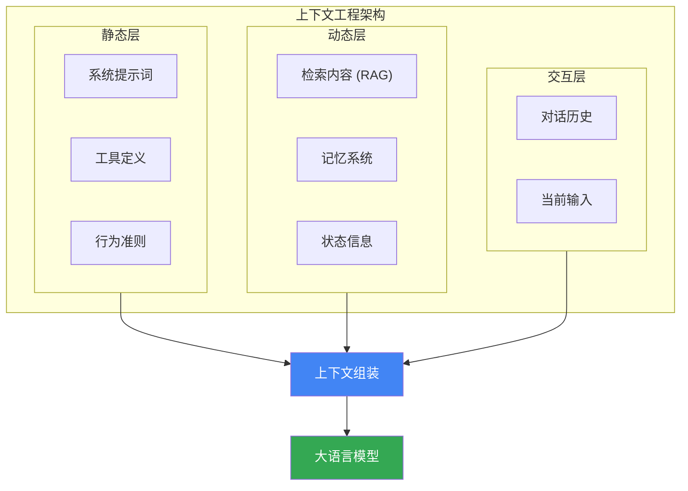

*图 14-1：上下文工程的核心组件架构*

#### 静态层：系统级设定

* **系统提示词**：定义 智能体（agent） 的身份、能力边界和行为规范
* **工具定义**：描述可调用的外部能力（API、函数等）
* **行为准则**：安全规则、输出格式、交互风格

#### 动态层：实时信息注入

* **检索内容**：通过 RAG 获取的相关知识
* **记忆系统**：短期工作记忆和长期知识存储
* **状态信息**：当前任务进度、环境变量等

#### 交互层：对话上下文

* **对话历史**：多轮交互的完整记录
* **当前输入**：用户的即时请求

### 1.3 MCP：上下文工程的标准化

**MCP（Model Context Protocol）** 是 Anthropic 于 2024 年发布的开放协议，旨在标准化 AI 应用与上下文源之间的连接方式。

#### MCP 的核心理念

MCP 解决的核心问题是：**如何让 AI 应用安全、高效地访问各种数据源和工具？**

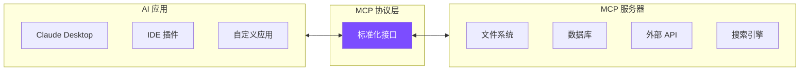

*图 14-2：MCP 协议连接 AI 应用与数据源*

#### MCP 的三大核心能力

1. **Resources（资源）**
   * 提供数据读取接口
   * 例如：读取文件、查询数据库
2. **Tools（工具）**
   * 提供可执行的操作
   * 例如：发送邮件、调用 API
3. **Prompts（提示模板）**
   * 提供可复用的提示词模板
   * 例如：代码审查模板、文档总结模板

### MCP 配置示例

```json
{
  "mcpServers": {
    "filesystem": {
      "command": "npx",
      "args": ["-y", "@modelcontextprotocol/server-filesystem", "/Users/user/projects"]
    },
    "github": {
      "command": "npx",
      "args": ["-y", "@modelcontextprotocol/server-github"],
      "env": {
        "GITHUB_TOKEN": "<GITHUB_TOKEN from environment; do not commit real token>"
      }
    }
  }
}
```

### 1.4 上下文工程的关键技术

#### 1. 动态上下文组装

根据任务需求实时构建最优上下文：

```python
class ContextBuilder:
    def build_context(self, user_query: str) -> str:
        context_parts = []

        # 基础系统指令（始终包含）
        context_parts.append(self.system_prompt)

        # 根据查询检索相关知识
        if self.requires_knowledge(user_query):
            relevant_docs = self.rag.retrieve(user_query, top_k=5)
            context_parts.append(self.format_documents(relevant_docs))

        # 加载相关记忆
        if self.has_relevant_memory(user_query):
            memories = self.memory.recall(user_query)
            context_parts.append(self.format_memories(memories))

        # 添加当前对话历史（保留最近 N 轮）
        context_parts.append(self.format_history(self.conversation[-10:]))

        return self.compose(context_parts)
```

#### 2. 上下文压缩与优化

面对有限的上下文窗口，需要智能压缩：

* **对话历史压缩**：保留关键信息，摘要化早期对话
* **检索结果去重**：合并语义相似的片段
* **重要性排序**：将关键信息放在开头和结尾

#### 3. 上下文卸载

生产级 智能体（agent） 系统的核心策略是：**不要把所有东西都硬塞进上下文窗口，而是将信息卸载到外部存储，在需要时精确检索回来**。

这种模式的核心思想是：将文件系统作为 智能体（agent） 的“外部记忆”。

**典型应用场景**：

| 场景      | 卸载策略             |
| ------- | ---------------- |
| 冗长的工具输出 | 写入文件，上下文中只保留文件路径 |
| 对话历史    | 压缩为摘要，完整版存为日志文件  |
| 终端会话输出  | 同步到本地文件系统        |

```python

# 上下文卸载示例：将工具输出写入文件

def execute_tool_with_offloading(tool_name, args):
    result = execute_tool(tool_name, args)

    if len(result) > MAX_CONTEXT_LENGTH:
        # 卸载到文件系统
        file_path = f"/tmp/tool_output_{tool_name}_{timestamp}.log"
        write_to_file(file_path, result)
        return f"结果已保存到 {file_path}，可用 tail 或 grep 命令查看"

    return result
```

**关键优势**：

* 让 智能体（agent） 可以用 `tail`、`grep` 等命令按需检索信息
* 避免上下文窗口被一次性填满
* 信息未丢失，只是“外部化”了

#### 4. 动态上下文发现

与传统的“静态注入”模式不同，动态发现模式让 智能体（agent） 自己去查找需要的信息：

```
传统模式：将所有可能相关的信息一次性塞入上下文
     ↓
动态发现：在上下文中只放索引，让 Agent 按需检索详情
```

**实现思路**：

1. **索引层**：系统提示词中只包含资源的名称列表
2. **发现层**：详细定义存储在文件系统中，智能体（agent） 用搜索工具主动查找

```xml
<available_tools>
以下工具可用，详细定义见 /docs/tools/ 目录：
- web_search
- database_query
- file_processor
- mcp_client

需要使用工具时，请先查阅对应的定义文件。
</available_tools>
```

这种模式的效果：对于调用了多种工具的任务，按需加载工具定义相比一次性全量注入，通常可观地降低 Token 消耗（示意值约 40-50%，具体取决于工具数量与调用频率）。

#### 5. 结构化的上下文缩减系统

当上下文持续增长时，需要分阶段执行缩减：

**第一阶段：紧凑化**

这是一种 **无损、可逆** 的缩减，剥离任何能从外部状态重建的信息：

```python

# 紧凑化示例

def compact_tool_history(history):
    for record in history:
        if record["tool"] == "write_file":
            # 文件内容可从磁盘重建，只保留路径
            record["content"] = f"[已写入: {record['path']}]"
    return history
```

> **提示：** 紧凑化通常只应用于最早的 50% 历史记录，保留最新的完整工具调用作为 Few-shot 示例。

**第二阶段：摘要化**

当紧凑化收益有限时，启动有损压缩：

1. 将完整上下文转储到日志文件（创建快照）
2. 生成摘要替代原始内容
3. 保留最后几次完整的工具调用记录

```xml
<context_summary>

## 之前的工作摘要

- 完成了用户数据分析（详见 /logs/session_001.log）
- 生成了 3 份报告草稿
- 最新修改：更新了执行摘要部分

如需详细信息，可搜索上述日志文件。
</context_summary>
```

#### 6. 记忆系统分层

```
短期记忆（上下文窗口内）
    ↓ 选择性持久化
工作记忆（会话级存储）
    ↓ 提取关键信息
长期记忆（向量数据库）
```

记忆系统不等于把历史对话、用户偏好和项目背景不断追加到越来越长的提示词里。更稳妥的做法是：后台抽取和综合稳定偏好、项目状态与约束，只在当前任务需要时注入；同时提供可审阅的记忆摘要，让用户能够纠正、删除或限制某些记忆的使用范围。提示词工程师需要把“记忆写入规则”和“当前上下文注入规则”分开设计，否则很容易把临时状态污染成长期事实。

### 1.5 实践指南：设计上下文工程系统

#### 设计原则

1. **模块化**：将上下文来源拆分为独立模块
2. **优先级**：明确不同信息的重要程度排序
3. **可观测性**：记录每次上下文的组成结构
4. **容错性**：单个模块失败不影响整体

#### 上下文预算分配示例

对于 128K token 的上下文窗口：

| 组件    | 预算分配 | 说明        |
| ----- | ---- | --------- |
| 系统提示词 | 5K   | 核心指令和规则   |
| 工具定义  | 5K   | 函数签名和说明   |
| 检索内容  | 50K  | RAG 返回的知识 |
| 对话历史  | 30K  | 最近的对话轮次   |
| 工作记忆  | 20K  | 任务相关记忆    |
| 用户输入  | 8K   | 当前请求      |
| 预留输出  | 10K  | 模型生成空间    |

### 1.6 上下文工程的未来方向

1. **自适应上下文**：AI 自主决定需要哪些上下文信息
2. **跨模态上下文**：统一管理文本、图像、音频等多模态信息
3. **协作式上下文**：多个 智能体（agent） 共享和协调上下文状态
4. **上下文安全**：防止敏感信息泄露和上下文污染

### 1.7 从上下文工程到驭具工程

上下文工程解决了“给模型看什么信息”的问题，但在构建生产级智能体时，还需要解决更广泛的工程挑战：工具权限管理、错误恢复、安全守卫、状态持久化等。这些需求催生了**驭具工程（Harness Engineering）**——通过构建包围模型的运行环境和保障系统，让智能体具备生产级的可靠性。

两者的关系可以这样理解：

```
提示词工程 → 优化"怎么问"
上下文工程 → 管理"模型看到什么"
驭具工程   → 保障"模型如何安全可靠地执行"
```

上下文工程是驭具工程的核心支柱之一，负责其中“上下文动态管理”的职能。随着智能体从 Demo 走向生产，开发者的重心正在从“调词”转向“调环境”——设计鲁棒的重试机制、守卫逻辑和状态管理，而非仅仅优化提示词本身。

> 💡 关于驭具工程的系统讲解，请参阅《驭具工程指南》（Harness Engineering Guide）。

### 1.8 设计哲学：避免过度工程化

来自生产级 智能体（agent） 系统的经验表明，上下文工程的核心哲学是：

> **“少即是多”** — 提供给模型的初始细节越少，效果反而越好，因为能让 智能体（agent） 更轻松地自行抓取相关上下文。

> **“少构建，多理解”** — 上下文工程的目标是让模型的工作变得更简单，而不是更难。

实践中最大的突破往往不是来自增加更多的上下文管理层或巧妙的检索技巧，而是来自 **简化**——移除不必要的技巧，对模型多一点信任。

设计思路的转变：

```
从：如何把更多信息塞进上下文
到：怎么给 Agent 创建一个信息丰富、易于探索的外部环境
```

随着基础模型能力的提升，把主动权交给模型将成为趋势。

!!! question "思考"

    1. “提示词工程”聚焦于优化输入文本，“上下文工程”则要管理整个上下文窗口。在你当前的项目中，瓶颈更多出在“提示词写得不好”还是“上下文管理不当”？
    2. 上下文工程要求动态组装系统指令、检索结果、对话历史等元素——你会如何决定各部分的优先级和 Token 预算分配？

## 2. 多智能体协作与编排

> **当前边界**：OpenAI 已在 Responses API 为 GPT-5.6 提供 multi-agent orchestration beta。beta 能力只应在可独立拆分、可记录子任务证据并有单 Agent 基线的场景评测；它不是默认架构。

多智能体（Agent）系统是 AI 应用的重要发展方向，通过让多个专业化智能体（Agent）分工协作，可以解决单一智能体（Agent）难以处理的复杂任务。本节深入探讨多智能体（Agent）架构设计、协作模式和提示词策略。

### 2.1 为什么需要多智能体

单一智能体（Agent）面临的挑战：

| 挑战    | 单智能体（Agent）局限 | 多智能体（Agent）优势 |
| ----- | ------------- | ------------- |
| 能力边界  | 需要全能型提示词      | 专业化分工         |
| 上下文限制 | 所有信息挤在一个窗口    | 各自维护相关上下文     |
| 复杂任务  | 难以处理多步骤流程     | 流水线式处理        |
| 可维护性  | 巨型提示词难以调试     | 模块化易于优化       |

### 2.2 多智能体架构模式

#### 1. 层级式架构

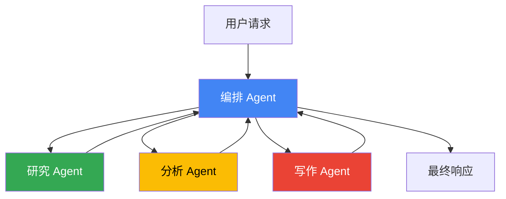

*图 14-3：层级式多智能体（Agent）架构*

**特点**：

* 中央编排智能体（Agent）负责任务分解和结果整合
* 子智能体（Agent）专注各自领域
* 通信清晰，便于调试

**编排智能体（Agent）提示词示例**：

```xml
<role>
你是一个任务编排专家，负责分解复杂任务并协调多个专业 Agent 完成工作。
</role>

<available_agents>
- ResearchAgent: 负责信息检索和资料收集
- AnalysisAgent: 负责数据分析和逻辑推理
- WritingAgent: 负责内容创作和文档输出
</available_agents>

<instructions>
1. 分析用户任务，确定需要哪些 Agent 参与
2. 制定执行计划（顺序或并行）
3. 调用 Agent 并传递必要上下文
4. 整合各 Agent 结果，生成最终响应
</instructions>

<output_format>
{
  "plan": [执行步骤],
  "agent_calls": [调用详情],
  "final_response": "整合后的回答"
}
</output_format>
```

### 2. 对话式协作

多个智能体（Agent）通过对话讨论得出结论：

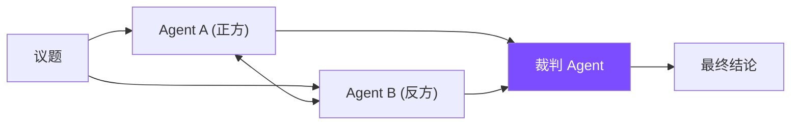

*图 14-4：对话式协作模式*

**应用场景**：

* 需要多角度分析的决策问题
* 代码审查（一方写代码，一方审查）
* 创意评估（提出方案 vs 挑战方案）

#### 3. 流水线模式

任务在多个智能体（Agent）间顺序传递：

```
用户输入 → Agent A（理解）→ Agent B（处理）→ Agent C（输出）→ 最终结果
```

**示例：内容创作流水线**

```python
pipeline = [
    {"agent": "ResearchAgent", "task": "收集相关资料"},
    {"agent": "OutlineAgent", "task": "生成文章大纲"},
    {"agent": "DraftAgent", "task": "撰写初稿"},
    {"agent": "EditorAgent", "task": "编辑润色"},
    {"agent": "FactCheckAgent", "task": "事实核查"}
]
```

#### 4. 并行协作模式

多个智能体（Agent）同时处理不同子任务：

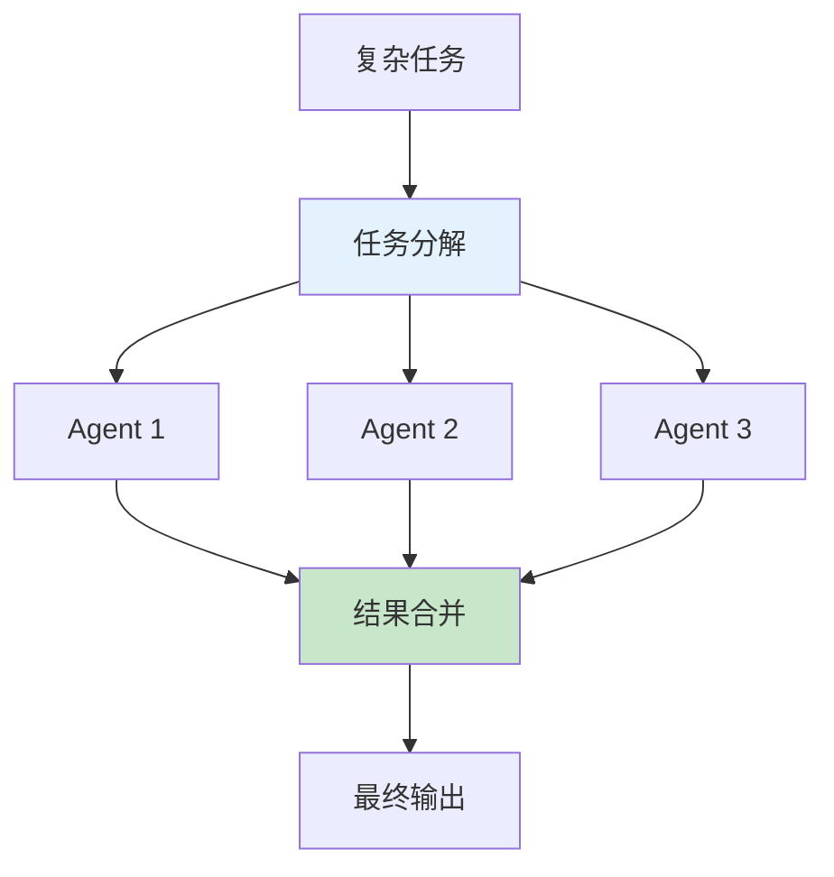

*图 14-5：并行协作模式*

#### 5. 蜂群模式

不同于层级式架构，蜂群模式是一种去中心化的协作方式：

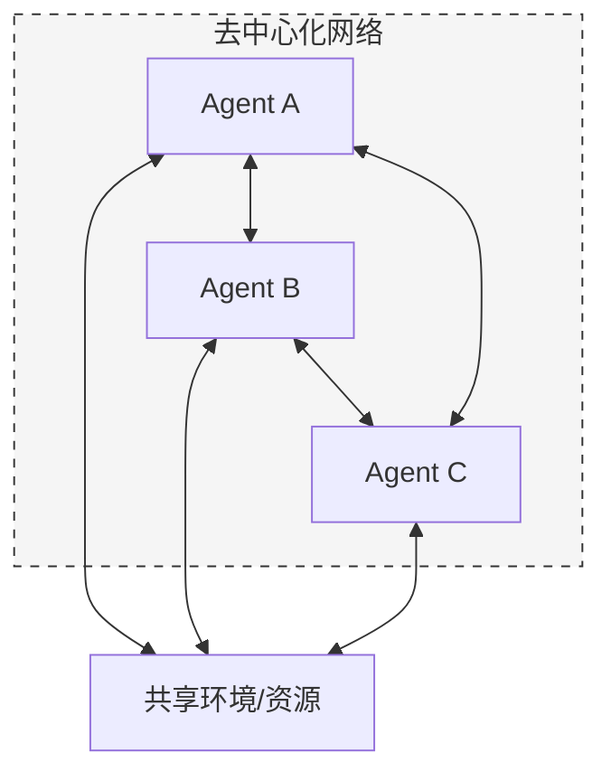

*图 14-6：蜂群模式的去中心化智能体（Agent）网络*

**特点**：

* **去中心化**：没有指挥官，智能体（Agent）之间平等交互。
* **自我组织**：通过简单的个体交互涌现出复杂的群体行为。
* **高鲁棒性**：单个智能体（Agent）的失败不会导致系统瘫痪。

**应用场景**：

* 下一代游戏 NPC 生态
* 大规模社会模拟
* 开放结局的创意写作及头脑风暴

### 2.3 主流多智能体框架

#### LangGraph

LangGraph 使用图结构表示智能体（Agent）工作流：

```python
from typing import TypedDict

from langgraph.graph import StateGraph, END

def research_agent(state: dict) -> dict:
    return {"current_agent": "research", "result": "（示例）research done"}

def analysis_agent(state: dict) -> dict:
    return {"current_agent": "analyze", "result": (state.get("result", "") + " -> analysis")}

def writing_agent(state: dict) -> dict:
    return {"current_agent": "write", "result": (state.get("result", "") + " -> write")}

def should_continue(state: dict) -> str:
    # 分析阶段已产出结果就继续写作，否则直接结束
    return "continue" if state.get("result") else "end"

user_query = "写一份关于 AI 发展趋势的简短综述。"

# 定义状态

class AgentState(TypedDict):
    messages: list
    current_agent: str
    result: str

# 构建图

workflow = StateGraph(AgentState)

# 添加节点

workflow.add_node("research", research_agent)
workflow.add_node("analyze", analysis_agent)
workflow.add_node("write", writing_agent)

# 定义边（流转逻辑）

# 入口必须显式声明，否则 compile() 会报 "Graph must have an entrypoint"
workflow.set_entry_point("research")
workflow.add_edge("research", "analyze")
workflow.add_conditional_edges(
    "analyze",
    should_continue,
    {"continue": "write", "end": END}
)

# 编译运行

app = workflow.compile()
result = app.invoke({"messages": [user_query]})

print(result)
```

#### CrewAI

CrewAI 采用“团队”隐喻组织多个智能体（Agent）：

```python
from crewai import Agent, Task, Crew

def search_tool(q: str) -> str:
    return f"search({q})"

def scrape_tool(url: str) -> str:
    return f"scrape({url})"

# 定义 Agent

researcher = Agent(
    role='研究员',
    goal='收集和整理相关信息',
    backstory='你是一位经验丰富的研究员...',
    tools=[search_tool, scrape_tool]
)

writer = Agent(
    role='作家',
    goal='撰写高质量的内容',
    backstory='你是一位资深内容创作者...'
)

# 定义任务

research_task = Task(
    description='研究{topic}的最新动态',
    agent=researcher
)

write_task = Task(
    description='基于研究结果撰写文章',
    agent=writer,
    context=[research_task]  # 依赖研究任务的结果
)

# 组建团队执行

crew = Crew(agents=[researcher, writer], tasks=[research_task, write_task])
result = crew.kickoff(inputs={'topic': 'AI 发展趋势'})

print(result)
```

#### AutoGen

Microsoft 的 AutoGen 支持灵活的多智能体（Agent）对话：

```python
import asyncio

from autogen_agentchat.agents import AssistantAgent
from autogen_agentchat.conditions import MaxMessageTermination
from autogen_agentchat.teams import RoundRobinGroupChat
from autogen_ext.models.openai import OpenAIChatCompletionClient


async def main() -> None:
    model_client = OpenAIChatCompletionClient(model="gpt-5.6-terra")

    assistant = AssistantAgent(
        "assistant",
        model_client=model_client,
        system_message="你是一个有帮助的 AI 助手。",
    )

    code_reviewer = AssistantAgent(
        "code_reviewer",
        model_client=model_client,
        system_message="你是一个严格的代码审查员，关注代码质量和安全性。",
    )

    team = RoundRobinGroupChat(
        [assistant, code_reviewer],
        termination_condition=MaxMessageTermination(4),
    )

    result = await team.run(task="审查这段代码并给出改进建议：print('hello')")
    print(result)
    await model_client.close()


asyncio.run(main())
```

### 2.4 智能体间通信设计

#### A2A Protocol

Google 提出的 A2A 协议标准化了智能体（Agent）间通信：

```jsonc
{
  "message_type": "task_request",
  "from_agent": "orchestrator",
  "to_agent": "research_agent",
  "task": {
    "id": "task_001",
    "description": "搜索 2024 年 AI 发展趋势",
    "context": {...},
    "expected_output": "研究报告"
  },
  "priority": "high",
  "timeout_seconds": 300
}
```

#### 状态共享策略

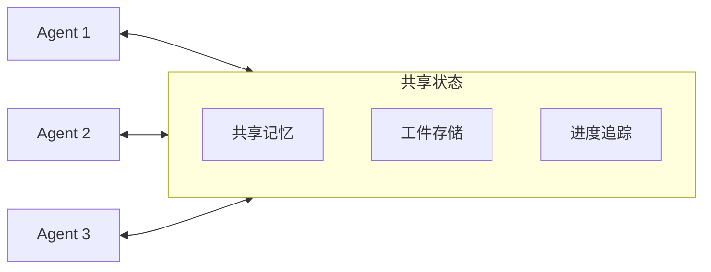

*图 14-7：智能体（Agent）状态共享机制*

### 2.5 实战协作模式

生产级多智能体（Agent）系统通常采用以下两种通信模式：

#### 模式一：任务委托（通过通信实现隔离）

这是经典的主-子智能体（Agent）设置，核心思想是：**主智能体（Agent）发任务，子智能体（Agent）交结果，中间过程免打扰**。

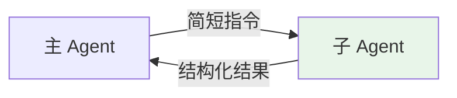

*图 14-8：任务委托模式下的主子智能体（Agent）通信*

**特点**：

* 子智能体（Agent）的上下文完全独立，从零开始
* 适用于“过程不重要，只关心结果”的任务
* 例如：代码搜索、数据查询、格式转换

从主智能体（Agent）视角，它只是调用了一个函数，但背后实际上是另一个拥有独立工作流的子智能体（Agent）在执行。这种模式也被称为 **“智能体（Agent）即工具”**。

#### 模式二：信息同步（通过共享上下文实现协作）

对于高度依赖历史信息的复杂任务，子智能体（Agent）需要继承完整的上下文：

```xml
<inherited_context>
<!-- 子 Agent 获得主 Agent 的完整历史记录 -->
<!-- 但拥有自己独立的系统提示词和行动空间 -->
</inherited_context>
```

**适用场景**：

* 深度研究报告（需要综合大量中间结果）
* 跨步骤的分析任务
* 需要上下文连贯性的创作任务

> **警告：** 共享上下文模式成本较高：每个子智能体（Agent）启动时都需要 Prefill 大量输入，且无法复用主智能体（Agent）的 KV 缓存。应根据任务性质灵活选择。

#### 智能体化的 MapReduce

当需要从多个并行子智能体（Agent）收集结果时，关键挑战是如何获得结构一致的输出：

**解决方案三要素**：

1. **共享沙箱**：所有智能体（Agent）共享同一个文件系统，信息传递只需传递文件路径
2. **输出 Schema**：主智能体（Agent）预先定义结构化的输出模式
3. **约束解码**：强制子智能体（Agent）的输出严格符合 Schema

```python

# 定义输出 Schema

result_schema = {
    "status": "enum: success | partial | failed",
    "summary": "string",
    "data": "array",
    "confidence": "float"
}

# 子 Agent 必须按此格式提交结果

class SubAgent:
    def submit_result(self, *, schema: dict) -> None:
        print("submit_result schema keys:", list(schema.keys()))

sub_agent = SubAgent()
sub_agent.submit_result(schema=result_schema)
```

这种设计的核心思路是：**使用结构化输出作为“契约”，保证信息在智能体（Agent）间完整、一致地传递**。

### 2.6 多智能体提示词设计原则

#### 1. 明确角色边界

```xml
<role>
你是研究 Agent，专注于信息收集和整理。

你的职责：
- 使用搜索工具查找信息
- 整理和总结发现
- 标注信息来源

你不负责：
- 最终决策
- 内容创作
- 与用户直接交互
</role>
```

#### 2. 定义交接协议

```xml
<handoff_protocol>
当完成任务后，请输出以下格式：

## 任务完成报告

- 状态: [完成/部分完成/需要帮助]
- 结果摘要: [核心发现]
- 详细内容: [完整结果]
- 下一步建议: [给后续 Agent 的建议]
- 需要上报的问题: [如有]
</handoff_protocol>
```

#### 3. 错误处理机制

```xml
<error_handling>
如果遇到以下情况，请采取相应措施：

1. 工具调用失败 → 重试最多 3 次，仍失败则报告编排 Agent
2. 信息不足 → 明确列出缺少什么信息
3. 任务超出能力范围 → 说明原因并建议转交给哪个 Agent
4. 结果置信度低 → 标注不确定性，建议人工审核
</error_handling>
```

!!! question "延伸思考"

    1. 多智能体（Agent）协作和“一个智能体（Agent）+ 多工具”相比，优势在哪里？什么程度的复杂性才值得引入多智能体（Agent）架构？
    2. 当两个智能体（Agent）对同一问题给出矛盾的建议时，系统应该如何仲裁？你会如何在编排层面解决这个问题？

## 3. 提示词工程的职业发展

提示词工程已成为一个新兴的专业领域，催生了相关的职业机会和技能需求。本节探讨提示词工程师的职业路径、核心技能和发展方向。

### 3.1 新兴职业角色

随着 AI 应用的普及，与提示词工程相关的职业角色不断涌现：

| 职业角色       | 核心职责          | 技能侧重  |
| ---------- | ------------- | ----- |
| 提示词工程师     | 设计和优化提示词系统    | 技术+语言 |
| AI 产品经理    | 定义 AI 产品需求和体验 | 产品+用户 |
| AI 解决方案架构师 | 设计企业级 AI 架构   | 架构+集成 |
| AI 安全专家    | 保障 AI 系统安全合规  | 安全+风控 |
| AI 训练师     | 优化模型行为和输出     | 数据+评估 |
| AI 应用开发者   | 构建 AI 驱动的应用   | 开发+集成 |

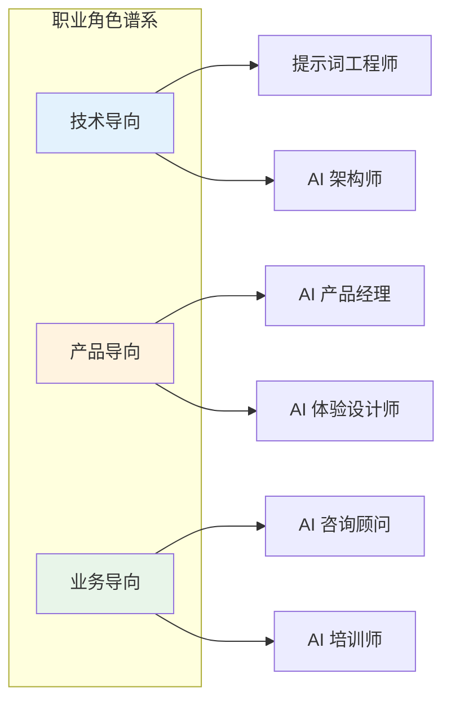

*图 14-9：AI 相关职业角色分布*

### 3.2 核心技能体系

#### 技术技能

1. **语言模型原理**
    * 理解 Transformer 架构和注意力机制
    * 掌握 Token、上下文窗口等核心概念
    * 了解不同模型的能力特点
2. **提示词设计**
    * 掌握各类提示技术（Few-shot、CoT、ReAct 等）
    * 能够针对不同任务设计有效提示词
    * 熟悉多个平台的特定技巧
3. **系统集成**
    * RAG 系统设计与实现
    * 智能体（agent） 工作流编排
    * API 集成与工具调用
4. **评估与优化**
    * 设计评估指标和测试用例
    * A/B 测试与迭代优化方法
    * 性能监控与分析

```
技术技能层级：
┌────────────────────────────────────────┐
│ 高级：上下文工程、多智能体系统、自动化优化  │
├────────────────────────────────────────┤
│ 中级：RAG、Agent、函数调用、安全防护      │
├────────────────────────────────────────┤
│ 基础：提示词结构、Few-shot、CoT、格式控制  │
└────────────────────────────────────────┘
```

#### 软技能

1. **清晰的语言表达**
   * 将复杂需求转化为精确指令
   * 理解语言的歧义和精确性
2. **系统思维**
   * 从整体架构角度思考问题
   * 考虑边界条件和异常处理
3. **持续学习**
   * AI 领域技术更新极快
   * 需要持续跟踪最新进展
4. **跨领域沟通**
   * 与业务、产品、技术团队协作
   * 将专业知识转化为通俗表达

### 3.3 职业发展路径

#### 路径一：技术专家路线

```
初级提示词工程师
    ↓ 2-3 年
高级提示词工程师（专注特定领域/平台）
    ↓ 3-5 年
AI 解决方案架构师 / 技术负责人
    ↓ 持续深耕
首席 AI 架构师 / 技术顾问
```

### 路径二：产品管理路线

```
AI 产品助理
    ↓ 2-3 年
AI 产品经理
    ↓ 3-5 年
高级 AI 产品经理 / 产品总监
    ↓ 持续发展
AI 产品负责人 / CPO
```

#### 路径三：咨询与培训路线

```
AI 应用实践者
    ↓ 积累案例
AI 咨询顾问 / 培训讲师
    ↓ 建立影响力
独立顾问 / 行业专家 / 创业者
```

### 3.4 学习资源与路径

#### 入门阶段（1-3 个月）

| 资源类型 | 推荐内容                          |
| ---- | ----------------------------- |
| 官方指南 | OpenAI、Anthropic、Google 官方文档  |
| 在线课程 | DeepLearning.AI 提示词工程课程       |
| 实践平台 | ChatGPT、Claude、AI Studio 日常使用 |

#### 进阶阶段（3-6 个月）

| 资源类型 | 推荐内容                    |
| ---- | ----------------------- |
| 高级技术 | RAG、智能体（agent）、多模态提示    |
| 开发框架 | LangChain、LlamaIndex 实战 |
| 项目实践 | 构建完整的 AI 应用             |

#### 专业阶段（6-12 个月）

| 资源类型 | 推荐内容               |
| ---- | ------------------ |
| 深度专精 | 选择特定领域（如代码生成、客服系统） |
| 社区参与 | 开源贡献、技术分享、行业交流     |
| 认证考试 | 相关平台的开发者认证         |

### 3.5 行业薪资参考（2025-2026）

以下为美国市场参考数据：

| 职位级别       | 年薪范围          |
| ---------- | ------------- |
| 初级提示词工程师   | $80K - $120K  |
| 高级提示词工程师   | $130K - $180K |
| AI 产品经理    | $150K - $250K |
| AI 解决方案架构师 | $180K - $300K |

> **注**：薪资因地区、公司规模、个人能力差异较大，以上仅供参考。

### 3.6 保持竞争力的建议

1. **建立作品集**
   * 记录优化案例和效果数据
   * 开源个人项目或工具
   * 撰写技术博客或教程
2. **跟踪前沿发展**
   * 关注主要模型厂商的更新
   * 阅读最新的研究论文
   * 参与技术社区讨论
3. **发展复合能力**
   * 结合特定领域专业知识
   * 培养产品思维和商业理解
   * 提升沟通和协作能力
4. **构建人脉网络**
   * 参加行业会议和活动
   * 加入专业社区和组织
   * 与同行建立联系

!!! question "想一想"

    1. “提示词工程师”作为独立职位是否会长期存在，还是最终会融入其他角色（如产品经理、软件工程师）？你怎么看？
    2. 如果你要在简历上展示提示词工程能力，你会用什么具体的项目成果来证明？

## 4. 行业应用案例与最佳实践

提示词工程在各行各业都有广泛应用。本节通过深入的行业案例，展示提示词技术如何在实际场景中创造价值。

### 4.1 客户服务行业

#### 应用场景

* 智能客服与 FAQ 问答
* 工单分类与路由
* 客户反馈分析

#### 架构设计

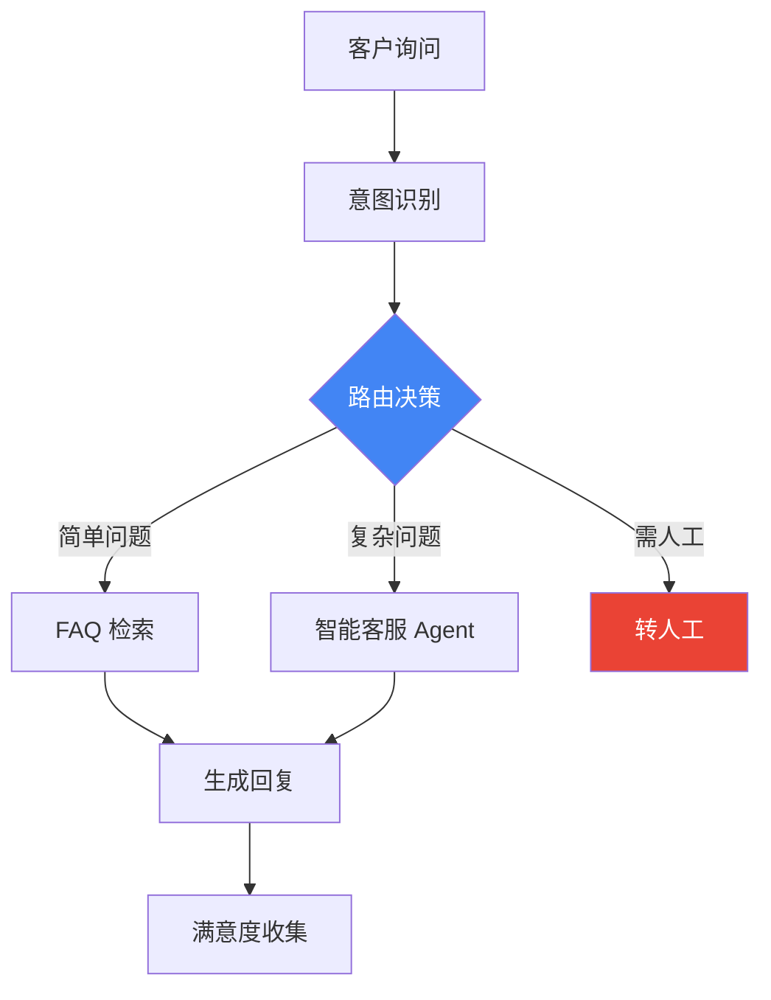

*图 14-10：智能客服系统架构*

#### 关键提示词模式

```xml
<role>
你是一位专业的客服代表，代表 {company_name} 公司。

核心原则：
1. 始终保持友善和专业的态度
2. 优先使用知识库中的信息回答
3. 不确定时坦诚说明，并提供替代方案
4. 涉及账户敏感操作时，引导用户通过安全渠道处理
</role>

<knowledge_base>
{retrieved_documents}
</knowledge_base>

<conversation_history>
{chat_history}
</conversation_history>

<current_question>
{user_question}
</current_question>

<guidelines>
- 如果知识库中有答案，引用并回答
- 如果需要进一步信息，礼貌询问
- 如果超出能力范围，说明原因并转人工
- 回答语气温和，避免机械感
</guidelines>
```

#### 示例评估口径

* 首次响应时间：从 5 分钟降至 30 秒
* 人工客服工作量：减少 40-60%
* 客户满意度：维持或提升

这些数值是用于说明衡量方式的示例，不应直接写入对外 ROI 承诺；真实项目需要以自己的工单、排队时长、转人工率和满意度数据复核。


### 4.2 内容创作行业

#### 应用场景

* 营销文案生成
* 技术文档撰写
* 多语言内容本地化
* SEO 优化内容

#### 创作流水线设计

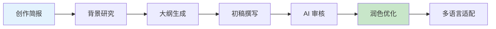

*图 14-11：AI 辅助内容创作流程*

#### 关键提示词模式

**品牌调性融入**：

```xml
<brand_voice>
品牌：科技初创公司
调性：专业但不冷漠，创新但不浮夸
目标受众：25-40 岁技术决策者
禁用词：革命性、颠覆性、史无前例
偏好词：实用、高效、可靠
</brand_voice>

<task>
为以下产品特性撰写营销文案：
{product_features}
</task>

<requirements>
1. 标题：8 字以内，突出核心价值
2. 正文：100-150 字，讲清楚用户收益
3. CTA：明确的行动号召
</requirements>
```

**迭代优化流程**：

```
第一轮：生成基础内容
    ↓ 人工反馈
第二轮：根据反馈调整（如"更口语化"、"突出价格优势"）
    ↓ 品控审核
第三轮：最终润色和格式规范
```

***

### 4.3 软件开发行业

#### 应用场景

* 代码生成与补全
* 代码审查与优化
* 文档自动生成
* 测试用例生成
* 遗留代码解释

#### 开发辅助架构

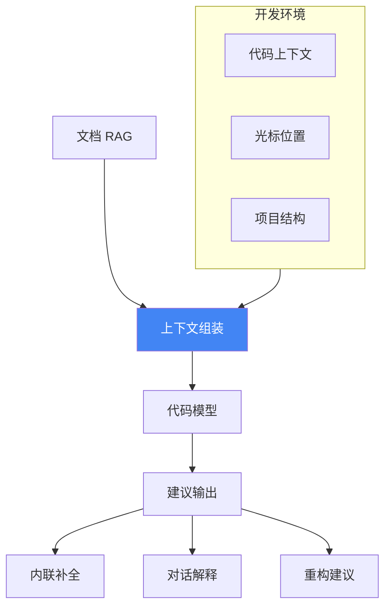

*图 14-12：AI 代码助手架构*

#### 关键提示词模式

**代码生成**：

```xml
<context>
项目语言：Python 3.11
框架：FastAPI
现有代码：
```

{surrounding\_code}

```
</context>

<task>
在标记位置实现以下功能：
{function_description}
</task>

<requirements>
1. 遵循项目现有代码风格
2. 添加类型注解
3. 处理常见异常
4. 包含简洁的 docstring
</requirements>
```

**代码审查**：

```
请审查以下代码变更：

```

{git\_diff}

```

审查维度：
1. 逻辑正确性
2. 潜在的性能问题
3. 安全隐患
4. 代码可读性
5. 边界条件处理

请标注问题严重程度：🔴严重 🟡警告 🟢建议
```

***

### 4.4 数据分析行业

#### 应用场景

* 自然语言转 SQL
* 数据洞察生成
* 自动化报告
* 异常检测解释

#### 分析系统架构

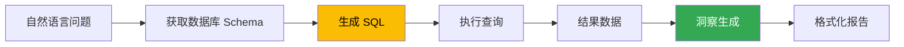

*图 14-13：自然语言数据分析流程*

#### 关键提示词模式

**Text-to-SQL**：

```xml
<database_schema>
表名：sales
列：
- order_id (INT, 主键)
- customer_id (INT, 外键)
- product_name (VARCHAR)
- amount (DECIMAL)
- order_date (DATE)

表名：customers
列：
- customer_id (INT, 主键)
- name (VARCHAR)
- region (VARCHAR)
- signup_date (DATE)
</database_schema>

<rules>
1. 只使用 SELECT 语句，禁止修改数据
2. 使用明确的表别名
3. 日期使用 YYYY-MM-DD 格式
4. 大表查询添加 LIMIT
</rules>

<question>
{user_question}
</question>

请生成 SQL 查询，并解释查询逻辑。
```


### 4.5 教育培训行业

#### 应用场景

* 个性化学习路径
* 智能答疑解惑
* 自适应测试
* 学习内容生成

#### 教育 AI 设计原则

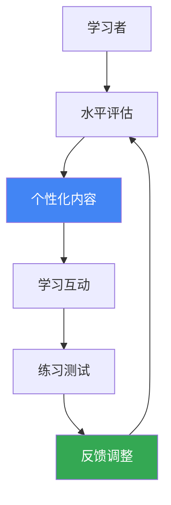

*图 14-14：自适应学习循环*

#### 关键提示词模式

**苏格拉底式引导**：

```xml
<role>
你是一位耐心的导师，采用苏格拉底式教学法。

核心原则：
1. 通过提问引导学生自己发现答案
2. 不直接给出答案，而是给予提示
3. 根据学生的回答调整问题难度
4. 鼓励学生解释自己的思考过程
</role>

<student_context>
年级：{grade}
科目：{subject}
当前理解水平：{level}
学习目标：{goal}
</student_context>

<question_from_student>
{student_question}
</question_from_student>

<teaching_approach>
1. 先了解学生已经知道什么
2. 找到最近发展区，设计引导问题
3. 逐步引导，每次只推进一小步
4. 学生得到正确答案后，帮助总结方法
</teaching_approach>
```

***

### 4.6 医疗健康行业

#### 应用场景

* 医学文献检索
* 临床决策支持
* 患者教育材料
* 医疗记录摘要

#### 安全设计要点

```xml
<critical_guidelines>
⚠️ 医疗 AI 应用必须遵守：

1. 不提供诊断或治疗建议
2. 始终建议咨询专业医生
3. 来源必须可追溯
4. 敏感信息严格保护
5. 符合 HIPAA 等法规要求
</critical_guidelines>

<response_template>
这些信息仅供参考，不能替代专业医疗建议。
请务必咨询您的医生或医疗专业人员。

[信息内容]

参考来源：[可信来源列表]
</response_template>
```

### 4.7 跨行业通用最佳实践

| 实践领域       | 最佳做法               |
| ---------- | ------------------ |
| **安全边界**   | 明确定义 AI 的能力边界和禁止事项 |
| **人工兜底**   | 设计清晰的转人工机制         |
| **持续优化**   | 收集反馈数据，迭代改进提示词     |
| **可观测性**   | 记录输入输出，便于调试和审计     |
| **A/B 测试** | 对比不同提示词版本的效果       |

!!! question "实践建议"

    1. 从本节的行业案例中选一个最接近你所在行业的案例，分析其提示词设计思路中有哪些可以直接借鉴到你的项目中。
    2. 这些案例中的提示词模板是否可以通用化？试着抽象出一个跨行业的“万能”提示词框架，看看它的局限性在哪里。

## 5. 本章小结

本章展望了提示词工程的未来发展方向。

### 5.1 核心趋势

1. **上下文工程**：从单一提示词到整体上下文管理
2. **多智能体协作**：专业化分工的 Agent 团队
3. **职业发展**：新兴职业和技能需求
4. **行业深入**：各领域的深度应用

### 5.2 关键洞察

* 提示词工程正在向更系统化的方向演进
* 持续学习和适应能力至关重要
* 结合领域知识才能创造真正价值

### 5.3 延伸阅读

**上下文工程**

* [Building Effective Agents](https://www.anthropic.com/engineering/building-effective-agents) - Anthropic 智能体构建指南
* [Model Context Protocol](https://modelcontextprotocol.io/) - MCP 官方文档
* [LangChain Memory](https://docs.langchain.com/oss/python/langchain/short-term-memory) - LangChain 记忆系统
* [LlamaIndex](https://www.llamaindex.ai/) - 上下文增强框架

**多智能体协作**

* [Building Effective Agents](https://www.anthropic.com/engineering/building-effective-agents) - Anthropic 智能体构建指南
* [LangGraph Documentation](https://langchain-ai.github.io/langgraph/) - LangGraph 官方文档
* [CrewAI Documentation](https://docs.crewai.com/) - CrewAI 使用指南
* [AutoGen](https://microsoft.github.io/autogen/) - Microsoft AutoGen 框架
* [A2A Protocol](https://a2a-protocol.org/latest/) - 智能体-to-智能体 协议

**职业发展**

* [DeepLearning.AI Prompt Engineering Course](https://www.deeplearning.ai/courses/chatgpt-prompt-eng) - 入门课程
* [Anthropic Prompt Engineering Guide](https://platform.claude.com/docs/en/build-with-claude/prompt-engineering/overview) - Claude 提示词指南
* [AI Engineer World's Fair](https://www.ai.engineer/) - AI 工程师社区
* [LangChain Cookbook](https://docs.langchain.com/oss/python/langchain/quickstart) - 实战教程

**行业应用**

* [OpenAI Customer Stories](https://openai.com/customer-stories) - OpenAI 客户案例
* [Anthropic Case Studies](https://claude.com/customers) - Anthropic 客户案例
* [Google AI Case Studies](https://cloud.google.com/customers) - Google Cloud AI 案例
* [LangChain Templates](https://www.langchain.com/templates) - 行业模板参考

### 5.4 结语

提示词工程是一个快速发展的领域。本书提供的知识和方法是坚实的基础，但真正的精通需要持续的实践和学习。希望本书能够帮助读者在 AI 时代掌握这一关键技能，创造更多价值。

