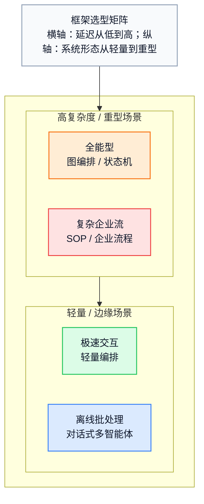

# 第八章 开发框架全景

纸上得来终觉浅，现在进入实战。本章深入当前最热门的智能体开发框架生态。核心分层：流程编排（图/状态机）→ 多智能体协作 → 数据/RAG 驱动 → 企业级 SDK → 平台级接口。帮助你在不同场景下做出正确的技术选型。

完成本章后，你将能够：

1. **理解** 不同框架形态的设计哲学与权衡
2. **选择** 适合场景的框架与架构
3. **实现** 流程编排、多智能体、RAG 驱动等典型模式
4. **对比** 开源与平台级方案的取舍

**快速选型参考**

| 场景           | 推荐形态        | 核心理由            |
| ------------ | ----------- | --------------- |
| 企业核心业务流      | 图编排/状态机     | 状态可控、支持人工介入、容错强 |
| 代码生成/数据分析    | 生成-执行闭环     | 可运行、可验证、可修复     |
| 内容创作/快速 Demo | 角色任务编排      | 上手快、交付形态清晰      |
| 数据检索/RAG 应用  | 数据/RAG 驱动   | 索引与检索能力强、多格式支持  |
| 企业现有系统集成     | 企业级 SDK/连接器 | 权限、审计与连接器生态完善   |

## 1. 框架生态概览与选型指南

随着智能体工程化需求增加，各类开发框架快速涌现：它们把“提示词 + 工具 + 状态 + 评估”封装成更可维护的系统结构。

为什么需要框架？因为手写 Prompt 和 API 调用虽然灵活，但在处理 **多智能体通信**、**状态管理**、**错误重试**、**上下文窗口优化** 以及 **流式输出** 时，原生代码会迅速变成难以维护的“意大利面条”。

目前市场上已经形成了一个丰富但略显拥挤的生态。如何根据业务需求选择合适的工具，是每个开发者面临的第一个挑战。

### 1.1 核心框架图谱

与其记住每个框架的名字，更重要的是理解它们在工程抽象上的差异。常见的框架形态可以按“主矛盾”划分：

#### 形态 A：链式编排

代表框架：**LangChain LCEL**、**Haystack Pipeline**

* 适合把多个模型调用与工具调用按固定顺序串起来。
* 优点：上手快、心智负担小。
* 局限：难以表达复杂控制流（分支/循环/回退）。

#### 形态 B：图编排与类型安全

代表框架：**LangGraph**、**LlamaIndex Workflows**

* 把工作流建模为状态机/有向图，强调可控性与可回放。
* 常见能力：条件路由、循环、检查点（checkpoint）、中断/恢复、人机协作节点。

#### 形态 C：多智能体协作

代表框架：**CrewAI**、**AG2/AutoGen**

* 目标是让多个角色分工协作：研究、写作、执行、审阅、裁判等。
* 典型模式：对话编排（群聊/轮次控制）与角色任务编排（SOP/流水线/层级）。

#### 形态 D：数据/RAG 驱动

* 把“索引/检索/后处理/权限隔离”作为第一等公民。
* 适合知识密集型智能体：文档问答、对比分析、跨数据源查询。

#### 形态 E：企业级 SDK / 治理优先框架

代表框架：**Semantic Kernel（存量项目）**、**Microsoft Agent Framework（1.0 GA，2026-04-03）**

* 把身份、权限、审计、连接器与治理作为核心能力。
* 适合在既有系统中落地，而不是从零搭建智能体平台。
* 在 Microsoft 生态里，Microsoft Agent Framework 已成为承接 Semantic Kernel 与 AutoGen 思路的统一主线。

#### 形态 F：低代码托管平台

代表框架：**Dify**、**LangFlow**、**Flowise**

* 提供可视化拖拽界面与零代码/低代码开发体验。
* 内置编排、评估、部署一体化工具。
* 适合快速原型与非技术用户。

### 1.2 选型决策矩阵

| 维度          | 链式编排 | 图编排/状态机 | 多智能体协作 | 数据/RAG 驱动 | 企业级 SDK |
| ----------- | ---- | ------- | ------ | --------- | ------- |
| **可控性**     | 中    | 高       | 中到高    | 中         | 高       |
| **易用性**     | 高    | 中       | 中      | 中         | 中       |
| **代码执行闭环**  | 依赖外部 | 可集成     | 常见强项   | 依赖外部      | 可集成     |
| **知识/检索能力** | 依赖外部 | 依赖外部    | 依赖外部   | 强         | 依赖外部    |
| **治理与审计**   | 依赖外部 | 可增强     | 需要额外设计 | 需要额外设计    | 强       |

### 1.3 选型建议

1. **企业级业务流（审批、客服）**：优先图编排/状态机形态，确保可控、可追踪、可回放。
2. **知识密集型任务（法律/政策/内部知识库）**：优先数据/RAG 驱动形态，投入索引、权限与后处理。
3. **创意与自动化任务（内容生成、运营流程）**：优先角色任务编排形态，强调 SOP 与交付模板。
4. **代码生成与执行闭环**：优先具备沙箱执行、错误回传、评审回路的组合方案。
5. **传统企业系统集成**：优先企业级 SDK/连接器形态，把权限、审计与连接器放在第一位。

### 1.4 小结

框架没有绝对的优劣，只有“适合”与“不适合”。

* **智能体本质是 While 循环**，框架只是封装了这个循环里的脏活累活。
* 不要被框架绑定。理解底层的 Prompt 设计、工具调用和记忆管理才是核心。
* 很多时候，**混合使用** 也是一种策略（例如把数据/RAG 能力封装成工具，再挂载到多智能体编排系统中）。

下一节将通过一个“从链到图”的例子解释流程编排的演进。

## 2. 从链到图：流程编排进化

本节用 LangChain / LangGraph 的当前官方抽象，解释智能体框架为什么会从“链式调用”走向“图编排 / 状态机”：前者适合确定性流水线，后者更适合循环、分支、检查点、容错和 Human-in-the-Loop（HITL）等生产级控制流。

### 2.0 过去：LCEL 适合确定性流水线

早期大家常把多个 LLM 调用按顺序串起来。这个抽象今天仍然有价值，只是它更适合 **确定性流程**，而不是需要反复决策的智能体回路。

```python
from langchain_core.output_parsers import StrOutputParser
from langchain_core.prompts import ChatPromptTemplate
from langchain_openai import ChatOpenAI

prompt = ChatPromptTemplate.from_template("将以下文本翻译成{language}: {text}")
llm = ChatOpenAI(model="gpt-5.5")
chain = prompt | llm | StrOutputParser()

result = chain.invoke({"language": "英文", "text": "你好世界"})
```

**局限**：LCEL 很适合“先做 A，再做 B”的流水线，但它不会天然提供工具循环、检查点恢复、人工审核暂停等能力。

### 2.1 现在的 LangChain：默认从 `create_agent` 起步

#### 2.1.1 标准工具循环的最小写法

LangChain 官方推荐把“标准工具调用循环”先写成 `create_agent(...)`。它底层已经运行在 LangGraph 之上，所以天然具备持久化、流式输出和 HITL 扩展能力。

```python
from langchain.agents import create_agent
from langchain.tools import tool

@tool
def get_order_status(order_id: str) -> str:
    """Return order status."""
    return f"{order_id}: shipped"

agent = create_agent(
    model="openai:gpt-5.5",
    tools=[get_order_status],
    system_prompt="你是客服助理，需要时先调用工具再回答。",
)

result = agent.invoke(
    {"messages": [{"role": "user", "content": "帮我查一下 ORD-001"}]}
)
print(result["messages"][-1].content)
```

这类写法适合：

* 你需要“模型决定是否调用工具”的标准 agent loop。
* 你希望先用高层抽象跑通业务，再按需下沉到底层图编排。

#### 2.1.2 为高风险工具加上 HITL

LangChain 当前官方的 HITL 语义不是“手写一个阻塞式 `wait_for_human()` 节点”，而是：**当模型提出某个工具调用后，由 middleware 触发 interrupt，保存状态，然后用同一个 `thread_id` 恢复执行。**

```python
from langchain.agents import create_agent
from langchain.agents.middleware import HumanInTheLoopMiddleware
from langgraph.checkpoint.memory import InMemorySaver
from langgraph.types import Command

agent = create_agent(
    model="openai:gpt-5.5",
    tools=[lookup_order, refund_order],
    middleware=[
        HumanInTheLoopMiddleware(
            interrupt_on={
                "lookup_order": False,
                "refund_order": {
                    "allowed_decisions": ["approve", "edit", "reject"]
                },
            }
        )
    ],
    checkpointer=InMemorySaver(),
)

config = {"configurable": {"thread_id": "customer-123"}}

paused = agent.invoke(
    {"messages": [{"role": "user", "content": "给 ORD-001 办理退款"}]},
    config=config,
    version="v2",
)

approved = agent.invoke(
    Command(resume={"decisions": [{"type": "approve"}]}),
    config=config,
    version="v2",
)
```

这里的关键点是：

* 中断发生在 **工具真正执行前**，而不是执行后补救。
* 恢复靠 `Command(resume=...)`，并且要复用同一个 `thread_id`。
* 决策语义是 `approve` / `edit` / `reject`，而不是随便往消息历史里塞一条“人工审核通过”。

### 2.2 需要显式控制流时，下沉到 LangGraph

当你需要自己定义循环、路由、子图、检查点和自定义中断逻辑时，应该直接使用 LangGraph 的 `StateGraph`。

```python
from langchain.chat_models import init_chat_model
from langchain.messages import ToolMessage
from langchain.tools import tool
from langgraph.checkpoint.memory import InMemorySaver
from langgraph.graph import END, START, MessagesState, StateGraph
from langgraph.types import Command, interrupt

model = init_chat_model("openai:gpt-5.5", temperature=0)

@tool
def lookup_order(order_id: str) -> str:
    """Look up the order."""
    return f"{order_id}: delivered"

@tool
def refund_order(order_id: str, reason: str) -> str:
    """Submit refund request."""
    return f"{order_id}: refund requested for {reason}"

tools = [lookup_order, refund_order]
tools_by_name = {tool.name: tool for tool in tools}
model_with_tools = model.bind_tools(tools)

class CustomerState(MessagesState):
    customer_id: str

def llm_node(state: CustomerState):
    return {"messages": [model_with_tools.invoke(state["messages"])]}

def tool_or_review_node(state: CustomerState):
    results = []
    for call in state["messages"][-1].tool_calls:
        if call["name"] == "refund_order":
            decision = interrupt(
                {
                    "kind": "refund_review",
                    "tool": call["name"],
                    "args": call["args"],
                    "allowed_decisions": ["approve", "edit", "reject"],
                }
            )
            if decision["type"] == "reject":
                results.append(
                    ToolMessage(
                        content=f"人工拒绝退款：{decision['message']}",
                        tool_call_id=call["id"],
                    )
                )
                continue
            if decision["type"] == "edit":
                call = {**call, "args": decision["edited_action"]["args"]}

        tool = tools_by_name[call["name"]]
        output = tool.invoke(call["args"])
        results.append(ToolMessage(content=output, tool_call_id=call["id"]))
    return {"messages": results}

def should_continue(state: CustomerState):
    return "tool_or_review" if state["messages"][-1].tool_calls else END

builder = StateGraph(CustomerState)
builder.add_node("llm", llm_node)
builder.add_node("tool_or_review", tool_or_review_node)
builder.add_edge(START, "llm")
builder.add_conditional_edges("llm", should_continue, ["tool_or_review", END])
builder.add_edge("tool_or_review", "llm")

graph = builder.compile(checkpointer=InMemorySaver())

config = {"configurable": {"thread_id": "customer-123"}}

paused = graph.invoke(
    {
        "messages": [{"role": "user", "content": "先查询 ORD-001，必要时退款"}],
        "customer_id": "customer-123",
    },
    config=config,
)

resumed = graph.invoke(
    Command(
        resume={
            "type": "edit",
            "edited_action": {
                "name": "refund_order",
                "args": {"order_id": "ORD-001", "reason": "duplicate charge"},
            },
        }
    ),
    config=config,
)
```

这里更接近 LangGraph 官方语义：

* `interrupt()` 暂停图执行，并把一个 JSON-serializable payload 暴露给调用方。
* `Command(resume=...)` 的值会直接成为该次 `interrupt()` 的返回值。
* 图节点恢复时会从节点开头重新执行，因此中断前的副作用必须保持幂等。

### 2.3 高级特性

#### 2.3.1 子图

LangGraph 支持把复杂步骤封成子图，再作为节点挂到主图里：

```python
from langgraph.graph import START, END, StateGraph

research_builder = StateGraph(ResearchState)
research_builder.add_node("search", search_node)
research_builder.add_node("summarize", summarize_node)
research_builder.add_edge(START, "search")
research_builder.add_edge("search", "summarize")
research_builder.add_edge("summarize", END)

research_graph = research_builder.compile()
main_builder.add_node("research", research_graph)
```

#### 2.3.2 流式输出

当前官方更推荐直接使用 `stream(..., stream_mode=["updates", "messages"], version="v2")`，把 token 流和状态更新放到同一个事件流里处理：

```python
for chunk in agent.stream(
    {"messages": [{"role": "user", "content": "帮我处理退款"}]},
    config=config,
    stream_mode=["updates", "messages"],
    version="v2",
):
    if chunk["type"] == "messages":
        token, metadata = chunk["data"]
        if token.content:
            print(token.content, end="", flush=True)
    elif chunk["type"] == "updates" and "__interrupt__" in chunk["data"]:
        print("\n等待人工审核...")
```

#### 2.3.3 节点级容错

生产环境里的图节点会遇到 LLM 限流、工具 5xx、网络抖动。LangGraph 把容错做成**节点级声明式配置**：重试、超时、以及重试耗尽后的兜底处理都直接挂在 `add_node` 上，不必在每个节点里手写退避循环和 try/except（参见 LangGraph 的[官方容错文档](https://docs.langchain.com/oss/python/langgraph/fault-tolerance)）。

```python
from langgraph.types import RetryPolicy, TimeoutPolicy
from langgraph.errors import NodeError

def on_llm_failed(state: CustomerState, error: NodeError):
    # 仅在重试全部耗尽后触发;error.node / error.error 提供失败上下文
    return {"messages": [{"role": "assistant", "content": "系统繁忙，请稍后再试。"}]}

builder.add_node(
    "llm",
    llm_node,
    retry_policy=RetryPolicy(max_attempts=4, backoff_factor=2.0),  # 指数退避重试瞬时故障
    timeout=TimeoutPolicy(run_timeout=30, idle_timeout=5),         # 墙钟超时 + 无进展超时
    error_handler=on_llm_failed,                                   # 兜底:降级回复 / 转人工 / 补偿
)
```

要点：

* `RetryPolicy` 默认只重试瞬时类异常（如 5xx、连接重置），不会重试 `ValueError` 这类代码缺陷。
* `TimeoutPolicy` 区分 `run_timeout`（单次尝试的硬墙钟上限）与 `idle_timeout`（一段时间没有可观测进展才触发），因此正常的流式节点不会被误杀。
* `error_handler` 只在重试耗尽后运行；它可以返回 `Command(goto=...)` 路由到补偿节点，从而实现 Saga 式补偿。用 `set_node_defaults(...)` 可一次性给所有节点设默认值，单个节点仍可覆盖。

### 2.4 小结

图编排框架的核心优势：

| 特性       | 说明                     |
| -------- | ---------------------- |
| **图结构**  | 支持循环、分支、并行             |
| **状态管理** | 类型安全的状态传递              |
| **检查点**  | 支持暂停、恢复、回放             |
| **容错**   | 节点级重试、超时与失败兜底          |
| **人机协作** | 原生支持 Human-in-the-loop |
| **可观测性** | 可与日志/指标/追踪系统集成         |

这类图编排框架适合构建生产级智能体，下一节将讨论数据/RAG 驱动的框架形态。


## 3. 数据驱动的 RAG 框架

一类数据/RAG 框架专注于数据连接与检索增强生成（RAG）。它们通常也提供智能体构建能力，适合需要处理大量非结构化数据的知识密集型应用。

### 3.1 核心哲学

这类框架的设计理念是 **“以数据为中心的 AI”**：

```
传统智能体:  用户 → LLM → 工具 → 结果
数据/RAG:  用户 → LLM → 数据索引 → 知识检索 → 结果
```

### 3.2 与流程编排框架的侧重点差异

| 维度    | 流程编排框架    | 数据/RAG 框架   |
| ----- | --------- | ----------- |
| 核心关注  | 工作流与控制流   | 数据索引与检索     |
| 强项    | 多步骤编排与状态机 | 知识管理与检索增强   |
| 智能体模式 | 通用任务型智能体  | 知识密集型智能体    |
| 适用场景  | 端到端任务闭环   | 文档/知识库问答与分析 |

### 3.3 核心组件：索引

核心能力之一是多种索引类型：

```python
from llama_index.core import VectorStoreIndex, Document

# 从文档创建向量索引

documents = [
    Document(text="人工智能的历史可以追溯到1950年代..."),
    Document(text="机器学习是人工智能的一个分支..."),
]

index = VectorStoreIndex.from_documents(documents)
```

**索引类型**：

| 类型     | 用途   | 适用场景   |
| ------ | ---- | ------ |
| 向量存储索引 | 语义搜索 | 通用问答   |
| 摘要索引   | 全文摘要 | 文档总结   |
| 树索引    | 层级检索 | 结构化文档  |
| 知识图谱索引 | 知识图谱 | 实体关系查询 |

### 3.4 查询引擎

查询引擎是索引的查询接口：

```python

# 创建查询引擎

query_engine = index.as_query_engine(
    similarity_top_k=5,
    response_mode="tree_summarize"
)

# 执行查询

response = query_engine.query("什么是机器学习？")
print(response)
```

### 3.5 高级 RAG 策略

基础检索之外，常用的增强手段是在检索结果进入模型前再加一层后处理，例如相似度过滤与长上下文重排。

```python
from llama_index.core.postprocessor import (
    SimilarityPostprocessor,
    LongContextReorder
)

query_engine = index.as_query_engine(
    similarity_top_k=10,
    node_postprocessors=[
        SimilarityPostprocessor(similarity_cutoff=0.7),
        LongContextReorder()  # 重排序优化长上下文
    ]
)
```

### 3.6 基本智能体

这类框架通常提供“查询引擎作为工具”的能力：

```python
from llama_index.core.agent.workflow import ReActAgent
from llama_index.core.tools import QueryEngineTool
from llama_index.core.workflow import Context
from llama_index.llms.openai import OpenAI

# 配置LLM
llm = OpenAI(model="gpt-5.5")

# 将查询引擎封装为工具
query_engine_tool = QueryEngineTool.from_defaults(
    query_engine=query_engine,
    name="knowledge_base",
    description="用于查询公司内部知识库的工具"
)

# 添加其他工具
tools = [
    query_engine_tool,
    search_web_tool,
    calculator_tool
]

# 创建智能体
agent = ReActAgent(
    tools=tools,
    llm=llm,
    verbose=True
)

# 使用
ctx = Context(agent)
response = await agent.run(user_msg="公司的休假政策是什么？", ctx=ctx)
```

### 3.7 多索引智能体

处理多个数据源的智能体：

```python
from llama_index.core import VectorStoreIndex
from llama_index.core.tools import QueryEngineTool
from llama_index.core.agent.workflow import ReActAgent
from llama_index.core.workflow import Context
from llama_index.llms.openai import OpenAI

llm = OpenAI(model="gpt-5.5")

# 为不同数据源创建索引
hr_index = VectorStoreIndex.from_documents(hr_docs)
finance_index = VectorStoreIndex.from_documents(finance_docs)
tech_index = VectorStoreIndex.from_documents(tech_docs)

# 创建多个查询引擎工具
tools = [
    QueryEngineTool.from_defaults(
        query_engine=hr_index.as_query_engine(),
        name="hr_knowledge",
        description="人力资源相关问题：休假、福利、考勤"
    ),
    QueryEngineTool.from_defaults(
        query_engine=finance_index.as_query_engine(),
        name="finance_knowledge",
        description="财务相关问题：报销、预算、账务"
    ),
    QueryEngineTool.from_defaults(
        query_engine=tech_index.as_query_engine(),
        name="tech_knowledge",
        description="技术文档：API、架构、部署"
    )
]

# 智能体会自动选择合适的知识库
agent = ReActAgent(tools=tools, llm=llm)

ctx = Context(agent)
response = await agent.run(user_msg="请对比一下HR和财务相关的最新政策", ctx=ctx)
```

### 3.8 子问题查询引擎

自动将复杂问题分解为子问题：

```python
from llama_index.core.query_engine import SubQuestionQueryEngine
from llama_index.core.tools import QueryEngineTool, ToolMetadata
from llama_index.llms.openai import OpenAI

llm = OpenAI(model="gpt-5.5")

# 创建子问题查询引擎
sub_question_engine = SubQuestionQueryEngine.from_defaults(
    query_engine_tools=[
        QueryEngineTool(
            query_engine=sales_engine,
            metadata=ToolMetadata(
                name="sales_data",
                description="销售数据查询"
            )
        ),
        QueryEngineTool(
            query_engine=marketing_engine,
            metadata=ToolMetadata(
                name="marketing_data",
                description="营销数据查询"
            )
        )
    ],
    llm=llm
)

# 复杂问题会被自动分解
response = sub_question_engine.query(
    "对比去年和今年的销售额，分析营销活动的效果"
)

# 内部会生成子问题：
# 1. 去年的销售额是多少？
# 2. 今年的销售额是多少？
# 3. 去年的营销活动有哪些？
# 4. 今年的营销活动有哪些？
# 然后综合回答
```

### 3.9 实战：文档分析智能体

### 场景描述

构建一个能够分析多种格式文档（PDF、Word、Excel）的智能助手。

### 实现代码

把上述场景组装起来，核心是先建索引，再把查询引擎包成工具交给智能体。

```python
from llama_index.core import (
    VectorStoreIndex,
    SimpleDirectoryReader,
    Settings
)
from llama_index.core.agent.workflow import ReActAgent
from llama_index.core.tools import QueryEngineTool, FunctionTool
from llama_index.core.workflow import Context
from llama_index.llms.openai import OpenAI
from llama_index.embeddings.openai import OpenAIEmbedding

# 1. 配置全局 Settings
Settings.llm = OpenAI(model="gpt-5.5")
Settings.embed_model = OpenAIEmbedding(model="text-embedding-3-small")

# 2. 加载文档
documents = SimpleDirectoryReader(
    input_dir="./documents",
    recursive=True,
    required_exts=[".pdf", ".docx", ".xlsx", ".txt"]
).load_data()

# 3. 创建索引
index = VectorStoreIndex.from_documents(documents)

# 4. 定义工具
def summarize_document(doc_name: str) -> str:
    """生成指定文档的摘要"""
    # 过滤特定文档
    doc_index = VectorStoreIndex.from_documents(
        [d for d in documents if doc_name in d.metadata.get("file_name", "")]
    )
    engine = doc_index.as_query_engine(response_mode="tree_summarize")
    return engine.query("请总结这个文档的主要内容").response

def compare_documents(doc1: str, doc2: str, aspect: str) -> str:
    """对比两个文档在某个方面的差异"""
    query = f"对比 {doc1} 和 {doc2} 在 {aspect} 方面的差异"
    return index.as_query_engine().query(query).response

# 包装为工具
summarize_tool = FunctionTool.from_defaults(fn=summarize_document)
compare_tool = FunctionTool.from_defaults(fn=compare_documents)

# 5. 创建智能体
tools = [
    QueryEngineTool.from_defaults(
        query_engine=index.as_query_engine(),
        name="document_search",
        description="搜索文档内容，回答关于文档的问题"
    ),
    summarize_tool,
    compare_tool
]

agent = ReActAgent(
    tools=tools,
    llm=Settings.llm,
    verbose=True
)

# 6. 使用
ctx = Context(agent)
response = await agent.run(
    user_msg="帮我总结一下合同文档，并对比与上一版的主要变化",
    ctx=ctx
)
print(response)
```

### 3.10 与向量存储集成

在工程落地中，索引层通常会对接外部向量存储（托管型或自托管型）。关键在于：

* 向量写入/更新策略（增量、重建、版本化）
* 元数据过滤与权限隔离（租户、文档级权限）
* 检索后处理（阈值、重排序、长上下文重排）

多数框架都会提供统一的 VectorStore 接口，便于在不同后端之间切换。

### 3.11 小结

数据/RAG 框架的核心优势：

* **数据连接能力**：支持数十种数据源格式
* **灵活的索引**：多种索引类型满足不同需求
* **RAG 优化**：内置多种检索和后处理策略
* **Query Engine as Tool**：将知识库封装为智能体工具

适用场景：

* 企业知识库问答
* 文档分析和比较
* 数据驱动的决策支持
* 需要处理大量非结构化数据的应用

下一节将探讨多智能体框架的代表性形态。


## 4. 多智能体协作：多智能体框架实战

单体智能体受限于上下文窗口和角色的单一性，难以处理极其复杂的任务。这就好比一个人再厉害，也无法独自完成一部电影的拍摄。

**多智能体系统**（Multi-Agent System，简称 MAS）通过模拟人类团队的协作模式，让多个专注于不同领域的智能体共同解决问题。本节将通过实战案例，用两类代表性范式来理解多智能体框架：对话编排与角色任务编排。

### 4.1 对话编排范式：对话即计算

这类框架的核心特点是 **对话即计算**：智能体通过对话驱动任务推进，并结合受控执行环境实现“生成→执行→反馈→修复”的闭环。

> **生态现状**：Microsoft AutoGen 官方仓库已明确进入 maintenance mode，并建议新项目转向 **Microsoft Agent Framework**；AG2 官方则把自己定义为 **AG2 (formerly AutoGen)**，也就是从 AutoGen 演化出的社区主线。与此同时，CrewAI 的稳定发布线已经进入 **1.14.x**。

#### 核心概念：执行智能体与规划智能体

一种常见抽象是把系统拆成两个基本角色：

1. **规划 / 生成智能体**：负责分析、规划与生成代码/操作。
2. **执行智能体**：负责在沙箱中执行、收集结果与报错并回传。

**工作流**：

1. 任务：“请画一张股价走势图”。
2. Assistant：生成一段 Python 代码。
3. 执行智能体：在受控沙箱中运行，报错提示“缺少依赖”。
4. 执行智能体：将报错信息发回给 Assistant。
5. Assistant：根据报错重写代码。
6. 执行智能体：再次运行，直到产出满足要求。

#### 适用场景与风险

这种范式适合“需要在环境中反复试错”的任务，例如编程、数据分析与自动化操作。但也要注意两类风险：

* **成本失控**：一旦陷入重试循环，Token 与工具成本可能快速飙升，需要步数上限与熔断。
* **安全边界**：执行智能体必须在沙箱内运行，并对文件、网络与高风险操作设置硬限制。

### 4.2 实战：构建自动编程团队

下面用一个最小例子说明如何用群聊模式，把编写与执行两个角色组织成一个自动编程团队。

```python
# AG2 示例：使用当前文档中的 ConversableAgent + AutoPattern 风格

import logging
from autogen import ConversableAgent, LLMConfig
from autogen.agentchat import run_group_chat
from autogen.agentchat.group.patterns import AutoPattern

logging.basicConfig(level=logging.INFO)

llm_config = LLMConfig.from_json(path="OAI_CONFIG_LIST")

planner = ConversableAgent(
    name="planner",
    system_message="把需求拆成可执行的开发任务。",
    description="负责任务拆解与推进。",
    llm_config=llm_config,
)
coder = ConversableAgent(
    name="coder",
    system_message="根据任务编写代码，并说明如何运行与测试。",
    description="负责实现。",
    llm_config=llm_config,
)
reviewer = ConversableAgent(
    name="reviewer",
    system_message="审查代码、指出问题，满足要求时输出 DONE。",
    description="负责质量把关。",
    is_termination_msg=lambda x: "DONE" in (x.get("content", "") or "").upper(),
    llm_config=llm_config,
)

pattern = AutoPattern(
    agents=[planner, coder, reviewer],
    initial_agent=planner,
    group_manager_args={"name": "group_manager", "llm_config": llm_config},
)

response = run_group_chat(
    pattern=pattern,
    messages="做一个简单的贪吃蛇游戏，并给出运行说明。",
    max_rounds=12,
)
response.process()
print(response.summary)
```

**运行结果**：Planner 会先拆任务，Coder 负责实现，Reviewer 负责挑错和收敛。当 `DONE` 出现时，说明这一轮群聊已经收敛到可交付结果。对于仍在使用旧 AutoGen 风格群聊的团队，AG2 是更自然的延续路径。

> **扩展阅读**：如果你需要 Microsoft 官方支持、长期维护和更强的企业治理能力，应优先评估 **Microsoft Agent Framework**。如果你已经采用 AutoGen 风格的对话式多智能体编排，AG2 的迁移心智更接近原范式。

### 4.3 角色任务编排范式：像导演一样编排团队

另一类框架更强调 **角色扮演** 与 **任务流编排**：先定义谁做什么、每步交付什么，再把任务按顺序或层级组织起来。

#### 核心概念：角色、任务、工作流

这类框架通常要求你先回答三个问题：

1. **Who**：谁来做？例如角色、目标、背景设定。
2. **What**：做什么？例如任务描述、预期输出。
3. **How**：怎么配合？例如顺序式或层级式流程。

#### 模板化与验收标准

为了让角色任务编排在生产环境中可控，建议把“角色卡”“交付物模板”“验收清单”做成可复用模板，并在每个关键节点进行自动校验（格式、字段完整性、引用证据、风险动作审批等）。

### 4.4 实战：构建市场调研团队

同样的任务换成“角色 + 任务流”的组织方式，代码形态会明显不同。

```python
# CrewAI 示例（1.14.x 系列 API）：用"角色 + 任务流"构建市场调研团队

from crewai import Agent, Task, Crew

researcher = Agent(
    role="研究员",
    goal="收集信息并给出可验证依据",
    backstory="你是一名严谨的研究员，擅长检索并核验信息来源。",
    verbose=True
)
writer = Agent(
    role="写作者",
    goal="把研究结果组织成可读文章",
    backstory="你是一名结构化写作专家，擅长把零散材料组织成清晰文章。",
    verbose=True
)

research_task = Task(
    description="调研某主题的关键趋势",
    agent=researcher,
    expected_output="包含可验证来源的调研报告"
)
write_article_task = Task(
    description="基于调研产出文章",
    agent=writer,
    expected_output="结构清晰的最终文章",
    context=[research_task]
)

crew = Crew(
    agents=[researcher, writer],
    tasks=[research_task, write_article_task],
    verbose=True
)

crew_output = crew.kickoff()
print(crew_output.raw)
print(crew_output.tasks_output)
```

### 4.5 两类范式对比与框架选择

| 维度       | 对话编排范式                                                           | 角色任务编排范式           |
| -------- | ---------------------------------------------------------------- | ------------------ |
| **代表框架** | AG2（社区延续，AutoGen 风格） / Microsoft Agent Framework（Microsoft 当前主线） | CrewAI（1.14.x 稳定线） |
| **强项**   | 生成-执行闭环、快速迭代修复                                                   | 角色分工清晰、流程可控、输出预期明确 |
| **交互模式** | 对话流（自由度高）                                                        | 任务流（结构化更强）         |
| **底层**   | 框架自带编排                                                           | 依赖通用组件/生态          |
| **上手难度** | 取决于沙箱/工具链集成复杂度                                                   | 取决于流程抽象与模板完善度      |
| **社区状态** | AG2：社区驱动；MAF：Microsoft 官方                                        | 活跃，定期更新特性与优化       |

### 4.6 跨智能体通信：Branch Agent 与进度快照模式

当多个智能体需要实时协作时，传统的串行或简单的消息队列可能引入延迟。一种高效的模式是 **Branch Agent 通信**，结合定期的进度快照。

### 状态隔离与缓存共享

Branch Agent 通常通过以下方式平衡隔离与协作：

* **克隆隔离**：每个 Branch Agent 获得独立的 LRU 缓存和 AbortController，防止会话间状态污染
* **缓存前缀共享**：系统提示、工具定义等稳定前缀通过缓存共享，利用推理引擎的前缀复用机制降本
* **Agent 摘要**：使用 Haiku 等轻量模型每 30 秒生成 3-5 词的进度快照，作为其他 Agent 的上下文更新

### 跨智能体实时消息

通过 `SendMessage` 机制支持即时通信：

* **广播模式**：主 Agent 可向所有 Branch Agent 广播任务更新或中断信号
* **跨会话通信**：Branch Agent 间可通过共享消息队列或事件总线通信，无需重新启动会话
* **消息可溯源**：每条消息携带源 Agent 的 ID 与时间戳，支持调试与审计

这种设计避免了过度的上下文复制，同时保证了 Agent 间的实时协调。

### 4.7 小结

多智能体系统不仅是“人多力量大”，更是 **分而治之** 思想的体现。

* 通过让 Researcher 专注搜索，Writer 专注写作，每个智能体的系统提示词 (System Prompt) 都可以更短、更聚焦，从而降低幻觉，提升质量。
* 一类框架更偏“执行闭环”（写代码/跑代码/修复），典型如 AG2（社区延续）或 Microsoft Agent Framework（Microsoft 官方主线）。
* 一类框架更偏“角色流程”（研究→写作→审阅→交付），典型如 CrewAI（稳定线已进入 1.14.x）。
* 在并行多智能体场景中，利用 Branch Agent 的缓存共享与定期快照可显著降低通信开销与上下文膨胀。

**框架选择指南**：

* 如果项目已采用 AutoGen 风格群聊与对话编排，迁移至 **AG2** 往往最平滑。
* 如果新项目需要 Microsoft 官方支持、企业治理和统一主线，优先看 **Microsoft Agent Framework**。
* 如果关注明确的角色卡、任务依赖和流程控制，**CrewAI** 更贴近 SOP 驱动的团队协作。

下节将探讨如何将这些智能体集成到现有的企业系统中。

## 5. 企业级集成：与现有系统整合

在小团队与大型企业环境中，由于合规、安全、技术栈限制（如必须用 Java/.NET），引入智能体技术往往面临巨大阻力。

一类企业级智能体 SDK 正是为了解决这一问题：它们不是要颠覆现有架构，而是作为 **“AI 编排层”** 平滑嵌入既有系统。

> **重要变化**：Microsoft Agent Framework 已成为 Semantic Kernel 与 AutoGen 之后的统一智能体框架方向。由于 SDK 版本和迁移策略变化很快，本节只保留稳定的架构差异和代码形态；实际项目应以 Microsoft 官方文档和当前 release notes 选择版本。

### 5.1 企业级智能体 SDK 的核心理念

这类 SDK 往往采用传统软件工程的抽象方式，把 LLM 能力组织为可组合的构件：

#### Kernel（内核对象）

系统的核心对象，负责管理服务、插件和执行上下文。它更适合作为一个轻量的运行时容器按次创建，而不是长期持有的单例；因为插件集合是可变的，官方也更推荐按使用周期创建和释放 Kernel。

#### Plugins（插件化业务能力）

很多企业 SDK 倾向于把工具称为 Plugins（插件），强调复用现有业务代码。这体现了它的定位：**将现有的业务代码“插件化”给 AI 使用**。

* 一个 Plugin 就是一个普通的 C#/Python 类。
* 只要给函数加上 `@kernel_function` 装饰器，它就变成了 AI 可调用的技能。

#### Function Calling（函数调用编排）

现代企业 SDK 更常把编排建立在 **函数调用（Function Calling）** 上：模型根据用户目标自动选择已注册的插件函数，运行时再负责执行、回填结果与继续推理。相比早期的 Planner 抽象，这种方式更贴近主流模型的原生能力，也更容易跨模型迁移。

#### 生态演进

* **Semantic Kernel 1.x 时代**：成熟稳定，适合存量生产环境。
* **Microsoft Agent Framework 时代**（新方向）：统一了 Semantic Kernel 与 AutoGen，提供更强的事件驱动与多智能体协作能力。

### 5.2 实战：为 ERP 系统添加 AI 助手

假设有一个传统的 ERP 系统，现在想给它加一个“自然语言查询库存”的功能。

#### 步骤 1: 定义插件

你不需要重写业务逻辑，只需要简单封装现有的 API。

```python
from semantic_kernel.functions import kernel_function

class InventoryPlugin:
    @kernel_function(
        description="根据产品ID查询当前库存数量",
        name="GetStockCount"
    )
    def get_stock_count(self, product_id: str) -> int:
        # 这里调用旧系统的 API 或数据库

        print(f"Checking database for {product_id}...")
        return 42

    @kernel_function(
        description="当库存低于阈值时发送补货邮件",
        name="SendRestockEmail"
    )
    def send_restock_email(self, product_id: str, quantity: int) -> str:
        return f"Email sent for {quantity} units of {product_id}"
```

#### 步骤 2: 定义语义函数

有些逻辑适合写代码（如查库），有些逻辑适合问 AI（如写邮件）。这类 SDK 允许你把 Prompt 也定义为函数。

```python

# 定义一个写邮件的 Prompt 模板

email_prompt = """
请为产品 {{$product_name}} 写一封补货申请邮件。
当前库存: {{$current_stock}}
建议补货: {{$amount}}
语气: 正式且紧急
"""
```

#### 步骤 3: 初始化 Kernel 并运行

以下示例展示了如何初始化 Kernel、注册服务与插件，并启用自动函数调用： 阅读时重点关注“注册服务”与“自动函数调用配置”这两段，它们决定了旧系统能力如何被模型稳定编排。

```python

# Semantic Kernel 1.x 示例：初始化 Kernel、注册服务与插件，并启用自动函数调用

import os
from semantic_kernel import Kernel
from semantic_kernel.connectors.ai.open_ai import OpenAIChatCompletion
from semantic_kernel.connectors.ai import FunctionChoiceBehavior
from semantic_kernel.connectors.ai.prompt_execution_settings import PromptExecutionSettings

async def main():
    # 1. 初始化 Kernel

    kernel = Kernel()

    # 2. 配置 AI 服务（具体方法名请按当前 release notes 核对）

    service_id = "default"
    kernel.add_service(
        OpenAIChatCompletion(
            service_id=service_id,
            ai_model_id="gpt-5.5",
            api_key=os.getenv("OPENAI_API_KEY"),
        )
    )

    # 3. 注册插件

    # 导入原生插件

    kernel.add_plugin(InventoryPlugin(), "Inventory")

    # 导入语义插件 (Prompt)

    kernel.add_function(
        plugin_name="Office",
        function_name="WriteEmail",
        prompt=email_prompt
    )

    # 4. 启用自动函数调用
    settings = PromptExecutionSettings()
    settings.function_choice_behavior = FunctionChoiceBehavior.Auto()

    # 用户的模糊指令
    goal = "查询某产品的库存，如果低于阈值，就生成一封补货申请邮件。"

    # 模型会在对话循环中自动选择 Inventory 与 Office 函数
    result = await kernel.invoke_prompt(goal, settings=settings)

    print(result)

if __name__ == "__main__":
    import asyncio
    asyncio.run(main())
```

> **API 变更说明**：
>
> * `add_model_service()` 已改为 `add_service()`（请以当前 Semantic Kernel release notes 为准）
> * `import_plugin_from_object()` 已改为 `add_plugin()`
> * `FunctionChoiceBehavior` 保持稳定，支持 `Auto()`、`Required()` 与 `None()` 三种模式
> * `create_function_from_prompt()` 已改为 `add_function()`

### 5.3 企业级特性

#### 多语言与技术栈适配

企业级 SDK 往往提供多语言绑定或多运行时支持，便于在既有技术栈内落地。Semantic Kernel 提供 Python、.NET（C#）与 JavaScript 支持，Microsoft Agent Framework 进一步统一跨语言体验。

#### 过滤器：类似 AOP 的机制

这类 SDK 常支持类似切面编程（AOP）的过滤器机制：你可以在任何函数被调用前后插入审计、鉴权、脱敏等逻辑。

* **审计**：记录谁在什么时间调用了什么插件。
* **鉴权**：在调用敏感插件前，检查用户权限。
* **脱敏**：在把数据传给 LLM 前，自动掩盖 PII 信息。

#### 连接器生态

企业落地的关键不只是“能调用工具”，而是能否与身份、权限、审计、数据源连接器体系集成。常见连接器类型包括：

* 结构化数据源（数据库、数据仓库）
* 文档系统与知识库
* 工单/协作系统
* 向量存储与检索服务

#### Microsoft Agent Framework 的新增能力

Microsoft Agent Framework 在 Semantic Kernel 基础上增强了：

* **事件驱动架构**：支持更复杂的多智能体协作与实时反馈。
* **统一的中间层**：无缝整合了原 AutoGen 的群聊编排与 Semantic Kernel 的函数调用。
* **Model Context Protocol (MCP) 支持**：与开源生态的标准交互能力。
* **Agent-to-Agent (A2A) 消息传递**：跨系统的智能体通信。

### 5.4 企业落地常见挑战

企业部署智能体时，难点往往集中在工程与治理，而不是“能不能对话”：

* **与现有系统集成**：身份、权限、数据访问与审计如何统一？
* **数据访问与质量**：数据是否可用、可解释、可追责？
* **变更管理**：流程如何改造、岗位如何协同、如何培训与验收？
* **风险控制**：越权调用、提示词注入、数据泄露如何防护与回溯？

### 5.5 小结与迁移路径

企业级智能体 SDK 往往没有“炫技式”的 Demo，但更擅长把智能体能力嵌入现有 IT 架构。

它没有试图重造轮子，而是把 AI 变成了一个可以被标准软件工程调用的 **组件**。对于正在进行数字化转型的传统企业，这类 SDK 往往更适合作为“可治理、可审计、可集成”的智能体基座。

**2026 年的选择指南**：

* **维持现状**：如果已采用 Semantic Kernel 1.x，继续维护至少 1 年无压力，建议定期审视新特性。
* **逐步迁移**：考虑在新项目中试用 Microsoft Agent Framework（RC → GA），体验统一的编排模型。
* **长期规划**：Microsoft Agent Framework 代表未来方向，建议在技术选型时纳入评估。

下一节将探讨平台级智能体产品形态，重点对比平台接口与开源框架在能力边界与适用场景上的差异。

## 6. 平台级产品：接口原语与托管运行时

除了开源框架，主流模型平台也在提供“平台级智能体能力”。但这里有两个常被混淆的维度：

* **接口原语（API primitive）**：你直接调用一个统一 API，让模型自己完成多轮、工具调用和部分状态管理。
* **托管运行时 / 平台套件**：平台不仅给模型接口，还给执行环境、权限、会话、观测、连接器和部署面。

本节只讨论这两个维度。**低代码平台（如 Dify、LangFlow、Flowise）已经在** [**8.1 节**](/agentic_ai_guide/di-san-bu-fen-gong-cheng-shi-jian-yu-luo-di/08_frameworks/8.1_ecosystem.md) **的“形态 F”中讨论，这里不再和 API / runtime 混成同一张表。**

### 6.1 统一交互 API：把“多轮 + 工具 + 状态”压进一个接口

这类产品的核心价值是：你不必自己手工维护完整的消息回放逻辑，而是围绕一个更高层的“响应 / 交互”对象工作。

#### OpenAI Responses API

OpenAI 当前把 **Responses API** 作为统一原语：它支持内置工具、多轮交互、远程 MCP、以及服务端状态管理。工程上最重要的不是“有没有线程对象”这个名字，而是它已经提供了多种状态托管方式：

* `previous_response_id`：基于上一次响应继续多轮。
* `store: true`：让平台保留响应状态。
* **Conversations API**：把会话状态持久化为更长期的对象。

这意味着它不是“只能应用侧自己拼接上下文”的薄封装接口，而是 **API 原语 + 可选状态托管** 的组合。

#### Google Interactions API

Google 的 **Interactions API** 也在走相似路线：以 `Interaction` 为中心资源，支持 `previous_interaction_id` 续接上下文，并允许 `store` 控制是否服务端保留交互记录。

但它仍明确处于 **beta / preview** 阶段，官方也直接提示 schema 和 SDK 仍可能发生 breaking changes。因此在选型上，更适合把它看成“值得关注的下一代统一交互原语”，而不是已经完全稳定的默认主路径。

#### 统一交互 API 的典型写法

两家的统一交互 API 形态接近：一次调用同时承载输入、工具与状态，再用上一次的响应 ID 续接下一轮。

```python
client = UnifiedAPIClient()
response = client.create(
    model="...",
    input="分析上传的数据，并在需要时调用工具",
    tools=[...],
    store=True,
)

next_response = client.create(
    model="...",
    previous_response_id=response.id,
    input="继续，顺便给我结论摘要",
)
```

### 6.2 托管运行时 / 平台套件：平台直接负责执行边界

另一类产品不只是“统一 API”，而是直接提供一个带工具链和权限系统的运行时，或者一整套部署 / 治理平台。

#### Claude Agent SDK（原 Claude Code SDK）

Anthropic 当前把它定位为 **Claude Agent SDK**。它的特点不是“多一个聊天接口”，而是把 Claude Code 背后的 agent loop 暴露成可编程运行时：

* 内置文件读取、代码编辑、命令执行、Web 等工具。
* 通过 `allowed_tools` 等参数控制工具边界。
* 原生支持 MCP、会话续跑和多 agent / subagent 能力。

```python
from claude_agent_sdk import query, ClaudeAgentOptions

async for message in query(
    prompt="Review this repository for security issues",
    options=ClaudeAgentOptions(allowed_tools=["Read", "Glob", "Grep"]),
):
    print(message)
```

这更像“托管 agent runtime”，而不是单纯的模型调用 API。

> **同期产品**：2026-04-09 Anthropic 还发布了 **Claude Managed Agents**（公开测试中，Anthropic 云端托管的 Agent harness，含沙盒、工具内置与按 session 计费，定位为 SDK 之上的“全托管运行时”）；同日 **Claude Cowork** 转为 GA（面向非开发者的桌面 Agent 体验）；2026-04-14 发布 **Routines**（Claude Code 自动化任务，研究预览）；2026-04 还发布 **Claude Mythos Preview**（仅邀请制，Project Glasswing 防御性网络安全研究）。这些与 Claude Agent SDK 共同构成 Anthropic 当前的智能体产品矩阵；具体可用特性、计费与 ZDR 覆盖应以 [Anthropic 官方文档](https://platform.claude.com/docs/en/managed-agents/overview) 为准。

#### Gemini Enterprise Agent Platform（原 Vertex AI Agent Builder）

Google Cloud 的 **Gemini Enterprise Agent Platform**（[平台概览](https://docs.cloud.google.com/gemini-enterprise-agent-platform/overview)）则是更完整的平台套件。它于 2026-04-22 发布，官方定位是 **as an evolution of Vertex AI** 的统一平台，用来 **build, deploy, govern, and optimize** 企业级 agent；下面再细分为 Agent Development Kit、Agent Studio、Agent Garden、Model Garden，以及运行侧的 Agent Runtime（原 Agent Engine）、Agent Platform Sessions 与 Memory Bank 等组件。

它的关注点不只是单次调用，而是：

* 部署与托管运行
* 企业连接器与治理
* 生产级可观测、评测与安全
* 与 Google Cloud 体系的身份和基础设施打通

因此它和 Gemini Interactions API 并不是同一层：前者更像平台套件，后者更像统一交互原语。

### 6.3 平台能力矩阵

以下矩阵只比较 **接口原语 / 托管运行时 / 平台套件** 三种层次，不再把低代码产品混进来。

| 名称                                            | 类别                       | 服务端状态                                                 | 工具与执行边界                         | 适用场景                                 |
| --------------------------------------------- | ------------------------ | ----------------------------------------------------- | ------------------------------- | ------------------------------------ |
| OpenAI Responses API                          | 统一交互 API                 | `store`、`previous_response_id`，并可配合 Conversations API | 内置工具、远程 MCP、自定义函数；执行边界主要由请求参数定义 | 需要 API 级灵活编排，又希望平台代管部分状态             |
| Google Interactions API                       | 统一交互 API（beta / preview） | `store`、`previous_interaction_id`                     | 每次交互需重新声明工具和生成配置；适合 Gemini 原生生态 | 想用统一 interaction 资源承载多轮与工具调用         |
| Claude Agent SDK                              | 托管运行时                    | 会话 / resume 由 SDK 管理                                  | 内置工具、MCP、权限控制、subagents         | 代码执行、自动化、需要细粒度工具权限的 agentic workflow |
| Gemini Enterprise Agent Platform（原 Vertex AI） | 平台套件                     | 平台级 session / memory / deployment 能力                  | 连接器、托管运行、评测与治理一体化               | 企业级部署、平台治理、Google Cloud 集成           |

### 6.4 选型建议

**优先统一交互 API 的场景**：

* 你主要想要一个“更高级的模型接口”，而不是整套托管运行时。
* 你希望自己掌控业务编排，但不想完全手写状态拼接。
* 你的工具主要还是应用侧自管，只是想用平台提供的一些 hosted tools。

**优先托管运行时 / 平台套件的场景**：

* 你需要平台直接提供执行环境、权限系统、会话续跑和治理能力。
* 你希望把工具调用、安全边界和观测体系一起标准化。
* 你面对的是企业内自动化或生产部署，而不只是一个 API demo。

**回到开源框架的场景**：

* 你需要更高的可移植性，或者必须私有化部署。
* 你希望跨模型、跨云、跨运行时保持最大控制权。
* 你要比较的是“编排框架本身”，而不是“平台 + 托管工具 + 执行环境”的组合能力。

### 6.5 小结

平台能力最好按层次来理解，而不是按品牌名堆在一起：

| 层次       | 典型问题                    | 代表能力         |
| -------- | ----------------------- | ------------ |
| 统一交互 API | “我想少写状态管理代码”            | 多轮、工具、服务端续接  |
| 托管运行时    | “我想直接运行 agent，并限制它能做什么” | 工具权限、会话、执行环境 |
| 平台套件     | “我想把 agent 放进企业生产体系”    | 部署、治理、连接器、观测 |

这也是为什么低代码平台不应与上述三者放进同一维度重复分类：它们讨论的是**开发方式**，而本节讨论的是**平台抽象层级**。

## 7. 框架性能基准评测

在选择智能体框架时，功能往往是第一考量，但随着应用从原型走向生产，**性能** 逐渐成为决定生死的关键。如今，模型推理速度已不再是唯一瓶颈，框架本身的运行时开销在端侧和高频场景下愈发凸显。

但在这一主题上，最容易犯的错误恰恰是：把某个环境下测出来的一组数字，误写成“框架的客观排名”。对智能体系统而言，延迟、内存、Token 开销和并发能力都高度依赖 **模型、工具、网络、状态持久化方式、以及是否使用托管运行时**。

因此，本节的重点不是给出一张“看起来精确”的排行榜，而是说明 **如何做一套可复现、可解释、可迁移的 benchmark**。

### 7.1 基准评测套件设计

框架性能对比高度依赖运行环境与任务形态。在任何企业级评测项目中，**最核心的产出往往不是一份结论数据，而是一套可复现的基准评测套件 (Benchmark Suite)**。

强烈建议该套件遵循标准化的工程组织，以下给出一个标准的性能基准套件 `README.md` 结构模板参考：

````markdown
# Agent Framework Benchmark Suite

## 1. 环境声明

- **硬件配置**：CPU / GPU 型号、网络带宽、内存容量
- **基础依赖**：操作系统版本、基座语言环境（如 Python 3.11+）
- **模型服务**：精确模型 ID（如 `gpt-5.4-mini` 或 `gemini-2.5-flash`）、部署形态（公有云 SaaS / 私有化 vLLM）

## 2. 评测指标定义

- **Time To First Token (TTFT)**: 收到请求到返回第一个生成 Token 的 P95 时间 (ms)
- **End-to-End Latency**: 包含工具调用与框架编排的全链路端到端 P95 延迟 (ms)
- **Token Amplification Rate**: 框架隐式注入协议与路由配置导致的 Token 膨胀系数
- **Peak Memory Usage**: 满载并发压测下的进程峰值内存开销 (MB)

## 3. 运行指南

```bash
# 启动压测示例

export TARGET_FRAMEWORK="langgraph"
export MOCK_API_DELAY_MS=200
export CONCURRENCY_LEVEL=50
pytest tests/benchmarks/ --benchmark-only
```
````

具体来说，在设计上述套件时，需重点监控以下四个维度的指标波动：

* **延迟**：端到端 TTFT、工具调用往返、队列等待。
* **内存**：空闲占用、峰值占用、并发增长曲线。
* **Token 开销**：系统提示词/协议头/中间消息的隐性膨胀。
* **并发能力**：异步模型、批处理能力、背压与限流策略。

还要补上一条经常被忽略的约束：**如果你的评测包含平台托管工具（如 hosted shell / code interpreter / browser），那测到的其实是“框架 + 平台运行时 + 工具环境”的组合开销，而不是纯编排层开销。**

### 7.2 延迟分析

延迟主要来自三部分：模型推理、工具执行、以及框架编排开销。评测时建议拆分并分别记录：

* **模型层**：请求排队、首字延迟、流式输出速度。
* **工具层**：外部 API 延迟、重试/退避策略、并发限制。
* **编排层**：状态序列化/反序列化、消息路由、检查点与恢复。

对实时交互应用，优先关注“最坏情况延迟（P95/P99）”与“中断/恢复”的用户体验。

### 7.3 推理引擎与框架的性能耦合

智能体框架的性能最终受底层推理引擎的制约。现代推理引擎（如 SGLang）为多轮智能体对话设计的优化包括：

* **RadixAttention 前缀缓存**：系统提示、工具定义等公共前缀可跨会话复用，对多轮工具调用场景重复调用显著降本
* **FSM 受限生成**：确保工具调用结果严格符合结构定义，消除格式错误导致的重试
* **投机解码**：草稿模型预测候选 Token，目标模型并行验证，接近零额外成本加速多 Token 生成

在评测框架性能时，应确认底层推理引擎的版本与优化特性，否则对比可能混淆“框架差异”与“引擎差异”。

### 7.4 内存占用

内存占用通常由：依赖库体积、索引/缓存常驻、并发会话状态、以及中间结果存储决定。端侧/Serverless 场景建议：

* 避免常驻大索引与大对象缓存
* 对工具结果做卸载（文件/对象存储）
* 对会话状态做裁剪与摘要

### 7.5 Token 开销

Token 开销常被低估：框架可能隐式注入系统提示词、协议头、路由说明、工具 Schema 与中间对话。建议把“实际发送的输入 Token”作为一等指标。

**测量方法**：

在评估框架性能时，一个常被忽视的指标是 **框架自身对 Token 的膨胀效应**。除了用户业务逻辑所需的 Token，框架可能在幕后注入额外的协议、路由配置、中间步骤说明等，这些“看不见的 Token”会直接影响成本。

**测量步骤**：

1. **基线测试**（最小化框架干预）：
   * 直接调用 LLM API，发送最小必要的提示词
   * 记录实际发送的 Input Tokens（从 API 响应的 `usage.prompt_tokens` 读取）
   * 这个数值作为“理论最优 Token 数” `T_baseline`
2. **框架测试**（完整编排）：
   * 通过目标框架执行同一任务（工具定义、系统提示、中间步骤完整）
   * 监控框架发送给 LLM API 的所有请求，累计 Input Tokens
   * 记录为 `T_framework`
3. **计算膨胀系数**：

```
框架开销比 = T_framework / T_baseline

示例：
- T_baseline = 2,000 tokens (用户 prompt)
- T_framework = 2,800 tokens (用户 prompt + 系统提示词 + 工具 Schema)
- 膨胀系数 = 2,800 / 2,000 = 1.4 (额外 40% 开销)
```

4. **归因分析**：拆解这 800 个额外 Token 的来源：
   * 系统提示词：X tokens
   * 工具定义（JSON Schema）：Y tokens
   * 中间对话记录（工具调用历史）：Z tokens
   * 协议头与路由信息：W tokens

**优化策略**（包括提示词缓存、上下文压缩、计划缓存等）详见[第 9.4 节](/agentic_ai_guide/di-san-bu-fen-gong-cheng-shi-jian-yu-luo-di/09_agentops/9.4_optimization.md)。本节重点在于**如何测量和解释 Token 膨胀系数**，而不是在缺乏统一实验条件时轻率比较具体框架的绝对高低。

### 7.6 并发与吞吐量

并发能力取决于框架是否支持异步执行、是否能批处理模型请求、以及是否能对工具调用做限流与背压。建议评测：

* 并发会话数从 1→N 时的吞吐量曲线
* 工具调用限流下的排队与超时
* 失败重试对系统稳定性的影响

**极简性能打点模板**：

为了方便在真实的业务代码中落地性能指标搜集，以下提供一个极简的 Python 评测上下文管理器脚手架。建议在重构智能体框架的关键执行节点包裹此代码，以建立基线：

```python
import time
import tracemalloc

class AgentBenchmark:
    def __init__(self, name: str):
        self.name = name
        self.metrics = {}

    def __enter__(self):
        tracemalloc.start()
        self.start_time = time.perf_counter()
        return self

    def __exit__(self, exc_type, exc_val, exc_tb):
        self.metrics["latency_ms"] = (time.perf_counter() - self.start_time) * 1000
        current, peak = tracemalloc.get_traced_memory()
        self.metrics["peak_memory_mb"] = peak / 10**6
        tracemalloc.stop()
        # 实际生产中应写入 Prometheus 或可观测背板
        print(
            f"[{self.name}] Latency: {self.metrics['latency_ms']:.2f}ms | "
            f"Peak RAM: {self.metrics['peak_memory_mb']:.2f}MB"
        )

# 使用示例：
# with AgentBenchmark("Agent_Tool_Call_Chain"):
#     response = agent_executor.invoke("分析财务数据并绘图")
```

### 7.7 示意读表示例（非公开 benchmark 结论）

下表**不是**某组公开基准的真实测量结果，而是一个**明确标注的假设示意表**，只用于说明“应该如何读这类表”。如果你要比较 LangGraph、CrewAI、AG2、LlamaIndex Workflows 等具体框架，必须在同一模型、同一工具、同一网络条件、同一状态持久化策略下重新实测。

| 编排形态（示意）      | 端到端延迟 (P95, ms) | 峰值内存占用 (MB) | Token 膨胀系数 | 并发能力评级 |
| ------------- | --------------- | ----------- | ---------- | ------ |
| 轻量链式编排（假设）    | 180             | 60          | 1.10×      | 高      |
| 图编排 / 状态机（假设） | 260             | 90          | 1.25×      | 高      |
| 角色任务编排（假设）    | 420             | 140         | 1.60×      | 中      |
| 对话式多智能体（假设）   | 520             | 160         | 1.90×      | 中      |

**这个示意表想表达的只有三点**：

* 控制流越复杂、轮次越多，编排层开销通常越高。
* “更慢”不一定代表“更差”，因为多轮协作可能换来更好的成功率、可审计性或恢复能力。
* 如果工具调用本身远慢于模型推理，编排层差异可能被外部 I/O 完全淹没。

### 7.8 选型建议矩阵

根据上述方法学，可以给出更稳妥的选型建议：



**图 8-1：框架选型象限图**

* **实时交互 / 边缘侧**：优先轻量、低状态的编排形态，并尽量把工具延迟和网络抖动单独测出。
* **企业级业务流**：优先图编排 / 状态机，接受一定编排开销，换取可控、可审计、可恢复。
* **多智能体仿真 / 离线分析**：可以接受更高延迟和 Token 放大，以换取更强的协作、验证与分工。
* **平台能力对比**：若对比对象混入托管运行时或 hosted tools，应把“平台执行环境”单列为实验变量，避免把平台优势误写成框架优势。


###  本章小结

本章全面介绍了智能体开发框架生态。核心分层：流程编排（图/状态机）→ 多智能体协作 → 数据/RAG 驱动 → 企业级 SDK → 平台级接口。每种形态适应不同的应用场景，选型时应优先考虑：控制流复杂度、工具体系规模、数据侧矛盾、可观测性需求。

**关键概念清单**

* **流程编排**：强控制、强追踪、适合生产流程
* **多智能体协作**：分工交接、适合任务分解
* **数据/RAG 驱动**：索引检索、适合知识密集
* **企业级 SDK**：权限审计、适合现有系统集成
* **平台级接口**：托管便捷、适合快速验证
* **选型决策树**：控制流强度 → 工具复杂度 → 数据矛盾 → 可观测性需求

**选型参考**

| 场景           | 推荐形态        | 核心理由            |
| ------------ | ----------- | --------------- |
| 企业核心业务流      | 图编排/状态机     | 状态可控、支持人工介入、容错强 |
| 代码生成/数据分析    | 生成-执行闭环     | 可运行、可验证、可修复     |
| 内容创作/快速 Demo | 角色任务编排      | 上手快、交付形态清晰      |
| 数据检索/RAG 应用  | 数据/RAG 驱动   | 索引与检索能力强、多格式支持  |
| 企业现有系统集成     | 企业级 SDK/连接器 | 权限、审计与连接器生态完善   |


写出代码只是第一步，让智能体在生产环境稳定运行才是真正的挑战。下一章探讨系统架构与工程化：鲁棒性、成本与性能。

## 6. 平台级产品：接口原语与托管运行时

除了开源框架，主流模型平台也在提供“平台级智能体能力”。但这里有两个常被混淆的维度：

* **接口原语（API primitive）**：你直接调用一个统一 API，让模型自己完成多轮、工具调用和部分状态管理。
* **托管运行时 / 平台套件**：平台不仅给模型接口，还给执行环境、权限、会话、观测、连接器和部署面。

本节只讨论这两个维度。**低代码平台（如 Dify、LangFlow、Flowise）已经在** [**8.1 节**](/agentic_ai_guide/di-san-bu-fen-gong-cheng-shi-jian-yu-luo-di/08_frameworks/8.1_ecosystem.md) **的“形态 F”中讨论，这里不再和 API / runtime 混成同一张表。**

### 6.1 统一交互 API：把“多轮 + 工具 + 状态”压进一个接口

这类产品的核心价值是：你不必自己手工维护完整的消息回放逻辑，而是围绕一个更高层的“响应 / 交互”对象工作。

#### OpenAI Responses API

OpenAI 当前把 **Responses API** 作为统一原语：它支持内置工具、多轮交互、远程 MCP、以及服务端状态管理。工程上最重要的不是“有没有线程对象”这个名字，而是它已经提供了多种状态托管方式：

* `previous_response_id`：基于上一次响应继续多轮。
* `store: true`：让平台保留响应状态。
* **Conversations API**：把会话状态持久化为更长期的对象。

这意味着它不是“只能应用侧自己拼接上下文”的薄封装接口，而是 **API 原语 + 可选状态托管** 的组合。

### Google Interactions API

Google 的 **Interactions API** 也在走相似路线：以 `Interaction` 为中心资源，支持 `previous_interaction_id` 续接上下文，并允许 `store` 控制是否服务端保留交互记录。

但它仍明确处于 **beta / preview** 阶段，官方也直接提示 schema 和 SDK 仍可能发生 breaking changes。因此在选型上，更适合把它看成“值得关注的下一代统一交互原语”，而不是已经完全稳定的默认主路径。

#### 统一交互 API 的典型写法

两家的统一交互 API 形态接近：一次调用同时承载输入、工具与状态，再用上一次的响应 ID 续接下一轮。

```python
client = UnifiedAPIClient()
response = client.create(
    model="...",
    input="分析上传的数据，并在需要时调用工具",
    tools=[...],
    store=True,
)

next_response = client.create(
    model="...",
    previous_response_id=response.id,
    input="继续，顺便给我结论摘要",
)
```

### 6.2 托管运行时 / 平台套件：平台直接负责执行边界

另一类产品不只是“统一 API”，而是直接提供一个带工具链和权限系统的运行时，或者一整套部署 / 治理平台。

#### Claude Agent SDK（原 Claude Code SDK）

Anthropic 当前把它定位为 **Claude Agent SDK**。它的特点不是“多一个聊天接口”，而是把 Claude Code 背后的 agent loop 暴露成可编程运行时：

* 内置文件读取、代码编辑、命令执行、Web 等工具。
* 通过 `allowed_tools` 等参数控制工具边界。
* 原生支持 MCP、会话续跑和多 agent / subagent 能力。

```python
from claude_agent_sdk import query, ClaudeAgentOptions

async for message in query(
    prompt="Review this repository for security issues",
    options=ClaudeAgentOptions(allowed_tools=["Read", "Glob", "Grep"]),
):
    print(message)
```

这更像“托管 agent runtime”，而不是单纯的模型调用 API。

> **同期产品**：2026-04-09 Anthropic 还发布了 **Claude Managed Agents**（公开测试中，Anthropic 云端托管的 Agent harness，含沙盒、工具内置与按 session 计费，定位为 SDK 之上的“全托管运行时”）；同日 **Claude Cowork** 转为 GA（面向非开发者的桌面 Agent 体验）；2026-04-14 发布 **Routines**（Claude Code 自动化任务，研究预览）；2026-04 还发布 **Claude Mythos Preview**（仅邀请制，Project Glasswing 防御性网络安全研究）。这些与 Claude Agent SDK 共同构成 Anthropic 当前的智能体产品矩阵；具体可用特性、计费与 ZDR 覆盖应以 [Anthropic 官方文档](https://platform.claude.com/docs/en/managed-agents/overview) 为准。

#### Gemini Enterprise Agent Platform（原 Vertex AI Agent Builder）

Google Cloud 的 **Gemini Enterprise Agent Platform**（[平台概览](https://docs.cloud.google.com/gemini-enterprise-agent-platform/overview)）则是更完整的平台套件。它于 2026-04-22 发布，官方定位是 **as an evolution of Vertex AI** 的统一平台，用来 **build, deploy, govern, and optimize** 企业级 agent；下面再细分为 Agent Development Kit、Agent Studio、Agent Garden、Model Garden，以及运行侧的 Agent Runtime（原 Agent Engine）、Agent Platform Sessions 与 Memory Bank 等组件。

它的关注点不只是单次调用，而是：

* 部署与托管运行
* 企业连接器与治理
* 生产级可观测、评测与安全
* 与 Google Cloud 体系的身份和基础设施打通

因此它和 Gemini Interactions API 并不是同一层：前者更像平台套件，后者更像统一交互原语。

### 6.3 平台能力矩阵

以下矩阵只比较 **接口原语 / 托管运行时 / 平台套件** 三种层次，不再把低代码产品混进来。

| 名称                                            | 类别                       | 服务端状态                                                 | 工具与执行边界                         | 适用场景                                 |
| --------------------------------------------- | ------------------------ | ----------------------------------------------------- | ------------------------------- | ------------------------------------ |
| OpenAI Responses API                          | 统一交互 API                 | `store`、`previous_response_id`，并可配合 Conversations API | 内置工具、远程 MCP、自定义函数；执行边界主要由请求参数定义 | 需要 API 级灵活编排，又希望平台代管部分状态             |
| Google Interactions API                       | 统一交互 API（beta / preview） | `store`、`previous_interaction_id`                     | 每次交互需重新声明工具和生成配置；适合 Gemini 原生生态 | 想用统一 interaction 资源承载多轮与工具调用         |
| Claude Agent SDK                              | 托管运行时                    | 会话 / resume 由 SDK 管理                                  | 内置工具、MCP、权限控制、subagents         | 代码执行、自动化、需要细粒度工具权限的 agentic workflow |
| Gemini Enterprise Agent Platform（原 Vertex AI） | 平台套件                     | 平台级 session / memory / deployment 能力                  | 连接器、托管运行、评测与治理一体化               | 企业级部署、平台治理、Google Cloud 集成           |

### 6.4 选型建议

**优先统一交互 API 的场景**：

* 你主要想要一个“更高级的模型接口”，而不是整套托管运行时。
* 你希望自己掌控业务编排，但不想完全手写状态拼接。
* 你的工具主要还是应用侧自管，只是想用平台提供的一些 hosted tools。

**优先托管运行时 / 平台套件的场景**：

* 你需要平台直接提供执行环境、权限系统、会话续跑和治理能力。
* 你希望把工具调用、安全边界和观测体系一起标准化。
* 你面对的是企业内自动化或生产部署，而不只是一个 API demo。

**回到开源框架的场景**：

* 你需要更高的可移植性，或者必须私有化部署。
* 你希望跨模型、跨云、跨运行时保持最大控制权。
* 你要比较的是“编排框架本身”，而不是“平台 + 托管工具 + 执行环境”的组合能力。

### 6.5 小结

平台能力最好按层次来理解，而不是按品牌名堆在一起：

| 层次       | 典型问题                    | 代表能力         |
| -------- | ----------------------- | ------------ |
| 统一交互 API | “我想少写状态管理代码”            | 多轮、工具、服务端续接  |
| 托管运行时    | “我想直接运行 agent，并限制它能做什么” | 工具权限、会话、执行环境 |
| 平台套件     | “我想把 agent 放进企业生产体系”    | 部署、治理、连接器、观测 |

这也是为什么低代码平台不应与上述三者放进同一维度重复分类：它们讨论的是**开发方式**，而本节讨论的是**平台抽象层级**。

## 7. 框架性能基准评测

在选择智能体框架时，功能往往是第一考量，但随着应用从原型走向生产，**性能** 逐渐成为决定生死的关键。如今，模型推理速度已不再是唯一瓶颈，框架本身的运行时开销在端侧和高频场景下愈发凸显。

但在这一主题上，最容易犯的错误恰恰是：把某个环境下测出来的一组数字，误写成“框架的客观排名”。对智能体系统而言，延迟、内存、Token 开销和并发能力都高度依赖 **模型、工具、网络、状态持久化方式、以及是否使用托管运行时**。

因此，本节的重点不是给出一张“看起来精确”的排行榜，而是说明 **如何做一套可复现、可解释、可迁移的 benchmark**。

### 7.1 基准评测套件设计

框架性能对比高度依赖运行环境与任务形态。在任何企业级评测项目中，**最核心的产出往往不是一份结论数据，而是一套可复现的基准评测套件 (Benchmark Suite)**。

强烈建议该套件遵循标准化的工程组织，以下给出一个标准的性能基准套件 `README.md` 结构模板参考：

````markdown
# Agent Framework Benchmark Suite

## 1. 环境声明

- **硬件配置**：CPU / GPU 型号、网络带宽、内存容量
- **基础依赖**：操作系统版本、基座语言环境（如 Python 3.11+）
- **模型服务**：精确模型 ID（如 `gpt-5.4-mini` 或 `gemini-2.5-flash`）、部署形态（公有云 SaaS / 私有化 vLLM）

## 2. 评测指标定义

- **Time To First Token (TTFT)**: 收到请求到返回第一个生成 Token 的 P95 时间 (ms)
- **End-to-End Latency**: 包含工具调用与框架编排的全链路端到端 P95 延迟 (ms)
- **Token Amplification Rate**: 框架隐式注入协议与路由配置导致的 Token 膨胀系数
- **Peak Memory Usage**: 满载并发压测下的进程峰值内存开销 (MB)

## 3. 运行指南

```bash
# 启动压测示例

export TARGET_FRAMEWORK="langgraph"
export MOCK_API_DELAY_MS=200
export CONCURRENCY_LEVEL=50
pytest tests/benchmarks/ --benchmark-only
```
````

具体来说，在设计上述套件时，需重点监控以下四个维度的指标波动：

* **延迟**：端到端 TTFT、工具调用往返、队列等待。
* **内存**：空闲占用、峰值占用、并发增长曲线。
* **Token 开销**：系统提示词/协议头/中间消息的隐性膨胀。
* **并发能力**：异步模型、批处理能力、背压与限流策略。

还要补上一条经常被忽略的约束：**如果你的评测包含平台托管工具（如 hosted shell / code interpreter / browser），那测到的其实是“框架 + 平台运行时 + 工具环境”的组合开销，而不是纯编排层开销。**

### 7.2 延迟分析

延迟主要来自三部分：模型推理、工具执行、以及框架编排开销。评测时建议拆分并分别记录：

* **模型层**：请求排队、首字延迟、流式输出速度。
* **工具层**：外部 API 延迟、重试/退避策略、并发限制。
* **编排层**：状态序列化/反序列化、消息路由、检查点与恢复。

对实时交互应用，优先关注“最坏情况延迟（P95/P99）”与“中断/恢复”的用户体验。

### 7.3 推理引擎与框架的性能耦合

智能体框架的性能最终受底层推理引擎的制约。现代推理引擎（如 SGLang）为多轮智能体对话设计的优化包括：

* **RadixAttention 前缀缓存**：系统提示、工具定义等公共前缀可跨会话复用，对多轮工具调用场景重复调用显著降本
* **FSM 受限生成**：确保工具调用结果严格符合结构定义，消除格式错误导致的重试
* **投机解码**：草稿模型预测候选 Token，目标模型并行验证，接近零额外成本加速多 Token 生成

在评测框架性能时，应确认底层推理引擎的版本与优化特性，否则对比可能混淆“框架差异”与“引擎差异”。

### 7.4 内存占用

内存占用通常由：依赖库体积、索引/缓存常驻、并发会话状态、以及中间结果存储决定。端侧/Serverless 场景建议：

* 避免常驻大索引与大对象缓存
* 对工具结果做卸载（文件/对象存储）
* 对会话状态做裁剪与摘要

### 7.5 Token 开销

Token 开销常被低估：框架可能隐式注入系统提示词、协议头、路由说明、工具 Schema 与中间对话。建议把“实际发送的输入 Token”作为一等指标。

**测量方法**：

在评估框架性能时，一个常被忽视的指标是 **框架自身对 Token 的膨胀效应**。除了用户业务逻辑所需的 Token，框架可能在幕后注入额外的协议、路由配置、中间步骤说明等，这些“看不见的 Token”会直接影响成本。

**测量步骤**：

1. **基线测试**（最小化框架干预）：
   * 直接调用 LLM API，发送最小必要的提示词
   * 记录实际发送的 Input Tokens（从 API 响应的 `usage.prompt_tokens` 读取）
   * 这个数值作为“理论最优 Token 数” `T_baseline`
2. **框架测试**（完整编排）：
   * 通过目标框架执行同一任务（工具定义、系统提示、中间步骤完整）
   * 监控框架发送给 LLM API 的所有请求，累计 Input Tokens
   * 记录为 `T_framework`
3. **计算膨胀系数**：

```
框架开销比 = T_framework / T_baseline

示例：
- T_baseline = 2,000 tokens (用户 prompt)
- T_framework = 2,800 tokens (用户 prompt + 系统提示词 + 工具 Schema)
- 膨胀系数 = 2,800 / 2,000 = 1.4 (额外 40% 开销)
```

4. **归因分析**：拆解这 800 个额外 Token 的来源：
   * 系统提示词：X tokens
   * 工具定义（JSON Schema）：Y tokens
   * 中间对话记录（工具调用历史）：Z tokens
   * 协议头与路由信息：W tokens

**优化策略**（包括提示词缓存、上下文压缩、计划缓存等）详见[第 9.4 节](/agentic_ai_guide/di-san-bu-fen-gong-cheng-shi-jian-yu-luo-di/09_agentops/9.4_optimization.md)。本节重点在于**如何测量和解释 Token 膨胀系数**，而不是在缺乏统一实验条件时轻率比较具体框架的绝对高低。

### 7.6 并发与吞吐量

并发能力取决于框架是否支持异步执行、是否能批处理模型请求、以及是否能对工具调用做限流与背压。建议评测：

* 并发会话数从 1→N 时的吞吐量曲线
* 工具调用限流下的排队与超时
* 失败重试对系统稳定性的影响

**极简性能打点模板**：

为了方便在真实的业务代码中落地性能指标搜集，以下提供一个极简的 Python 评测上下文管理器脚手架。建议在重构智能体框架的关键执行节点包裹此代码，以建立基线：

```python
import time
import tracemalloc

class AgentBenchmark:
    def __init__(self, name: str):
        self.name = name
        self.metrics = {}

    def __enter__(self):
        tracemalloc.start()
        self.start_time = time.perf_counter()
        return self

    def __exit__(self, exc_type, exc_val, exc_tb):
        self.metrics["latency_ms"] = (time.perf_counter() - self.start_time) * 1000
        current, peak = tracemalloc.get_traced_memory()
        self.metrics["peak_memory_mb"] = peak / 10**6
        tracemalloc.stop()
        # 实际生产中应写入 Prometheus 或可观测背板
        print(
            f"[{self.name}] Latency: {self.metrics['latency_ms']:.2f}ms | "
            f"Peak RAM: {self.metrics['peak_memory_mb']:.2f}MB"
        )

# 使用示例：
# with AgentBenchmark("Agent_Tool_Call_Chain"):
#     response = agent_executor.invoke("分析财务数据并绘图")
```

### 7.7 示意读表示例（非公开 benchmark 结论）

下表**不是**某组公开基准的真实测量结果，而是一个**明确标注的假设示意表**，只用于说明“应该如何读这类表”。如果你要比较 LangGraph、CrewAI、AG2、LlamaIndex Workflows 等具体框架，必须在同一模型、同一工具、同一网络条件、同一状态持久化策略下重新实测。

| 编排形态（示意）      | 端到端延迟 (P95, ms) | 峰值内存占用 (MB) | Token 膨胀系数 | 并发能力评级 |
| ------------- | --------------- | ----------- | ---------- | ------ |
| 轻量链式编排（假设）    | 180             | 60          | 1.10×      | 高      |
| 图编排 / 状态机（假设） | 260             | 90          | 1.25×      | 高      |
| 角色任务编排（假设）    | 420             | 140         | 1.60×      | 中      |
| 对话式多智能体（假设）   | 520             | 160         | 1.90×      | 中      |

**这个示意表想表达的只有三点**：

* 控制流越复杂、轮次越多，编排层开销通常越高。
* “更慢”不一定代表“更差”，因为多轮协作可能换来更好的成功率、可审计性或恢复能力。
* 如果工具调用本身远慢于模型推理，编排层差异可能被外部 I/O 完全淹没。

### 7.8 选型建议矩阵

根据上述方法学，可以给出更稳妥的选型建议：


**图 8-1：框架选型象限图**

* **实时交互 / 边缘侧**：优先轻量、低状态的编排形态，并尽量把工具延迟和网络抖动单独测出。
* **企业级业务流**：优先图编排 / 状态机，接受一定编排开销，换取可控、可审计、可恢复。
* **多智能体仿真 / 离线分析**：可以接受更高延迟和 Token 放大，以换取更强的协作、验证与分工。
* **平台能力对比**：若对比对象混入托管运行时或 hosted tools，应把“平台执行环境”单列为实验变量，避免把平台优势误写成框架优势。

## 8.本章小结

本章全面介绍了智能体开发框架生态。核心分层：流程编排（图/状态机）→ 多智能体协作 → 数据/RAG 驱动 → 企业级 SDK → 平台级接口。每种形态适应不同的应用场景，选型时应优先考虑：控制流复杂度、工具体系规模、数据侧矛盾、可观测性需求。

### 8.1 关键概念清单

* **流程编排**：强控制、强追踪、适合生产流程
* **多智能体协作**：分工交接、适合任务分解
* **数据/RAG 驱动**：索引检索、适合知识密集
* **企业级 SDK**：权限审计、适合现有系统集成
* **平台级接口**：托管便捷、适合快速验证
* **选型决策树**：控制流强度 → 工具复杂度 → 数据矛盾 → 可观测性需求

### 选型参考

| 场景           | 推荐形态        | 核心理由            |
| ------------ | ----------- | --------------- |
| 企业核心业务流      | 图编排/状态机     | 状态可控、支持人工介入、容错强 |
| 代码生成/数据分析    | 生成-执行闭环     | 可运行、可验证、可修复     |
| 内容创作/快速 Demo | 角色任务编排      | 上手快、交付形态清晰      |
| 数据检索/RAG 应用  | 数据/RAG 驱动   | 索引与检索能力强、多格式支持  |
| 企业现有系统集成     | 企业级 SDK/连接器 | 权限、审计与连接器生态完善   |
