# 第九章 AgentOps 与生产化落地

写好提示词只是第一步。将智能体发布到生产环境面临着并发、延迟、成本、错误处理等工程挑战。本章探讨如何构建健壮、可观测、可扩展的智能体系统。核心路径：架构设计模式 → 鲁棒性与可观测性 → 成本与性能优化 → 企业安全治理 → 故障恢复与上线清单。

完成本章后，你将能够：

1. **选择** 合适的架构模式（ReAct/编排-执行/反思）
2. **实现** 全链路可观测性与监控调试
3. **优化** 成本控制与延迟性能
4. **部署** 企业级安全与合规治理
5. **诊断** 故障与实现韧性设计

## 1. 设计模式：从 Workflow 到智能体

最成功的系统往往不是用最复杂的框架构建的，而是使用了简单、可组合的模式。在构建 LLM 应用时，常面临一个核心选择：**谁来负责编排多个智能体和任务？**

根据编排方式的不同，可将系统划分为两种典型的架构：

* **静态编排**：
    * **核心**: 代码主导 (Code-driven)。开发者预先定义好执行路径（如 `if/else`, `loop`）。
    * LLM 可以参与决策，但仅限于在 **预定义的路径** 中进行选择，无法改变系统预设的 **控制流拓扑**。
    * **特点**: 确定性强，路径固定，性能可控。
* **自主编排**：
    * **核心**: 模型主导 (Model-driven)。系统给予 LLM 目标和工具，由 LLM 自主决定执行步骤。
    * 模型根据环境反馈动态调整策略，决定“下一步做什么”。
    * **特点**: 适应性强，能应对未知情况，但不可控性增加。

!!! warning "注意"
    
    实际上，静态编排和自主编排并非对立，实践中往往是两者的结合。越接近自主编排，系统越灵活，但可靠性越难保证；越接近静态编排，系统越稳定，但泛化能力越弱。

本节将详细解析这两种架构下的核心设计模式。

### 1.1 静态编排：代码主导的工作流

当任务可以被清晰分解时，应优先使用 **静态编排**。它们能提供更高的可预测性和更低的延迟。

#### 1.1.1 提示词链

最基础的模式。将任务分解为一系列线性步骤，上一步的输出作为下一步的输入。

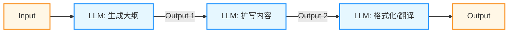

图 9-1：提示词链模式

* **适用场景**：文案生成（大纲 -> 初稿 -> 润色）、简单的数据处理管道。
* **优势**：延迟较低，易于调试；每个节点可以使用不同规格的模型（例如大纲用高质量模型，扩写用低成本模型）。
* **权衡**：如果中间某一步出错，错误会级联传导。

#### 1.1.2 路由分发

根据输入内容的分类，将其导向不同的后续流程。这不仅是分类，更是 **专业化分工** 的体现。

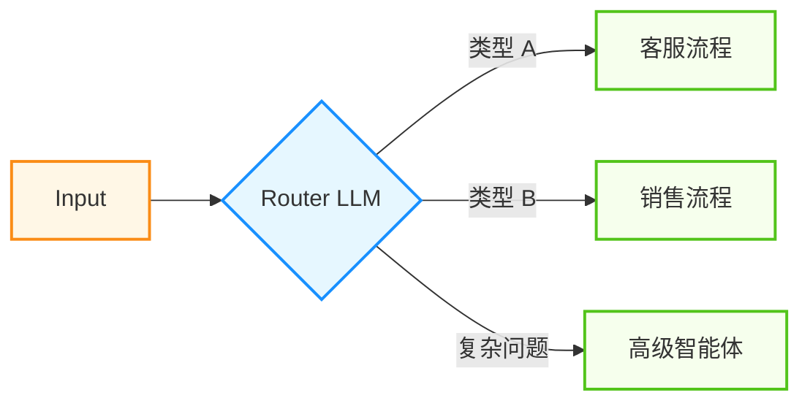

图 9-2：路由分发模式

* **适用场景**：
  * **客服分流**：根据用户意图（售后/投诉/咨询）路由到不同处理模块。
  * **模型分层**：简单问题路由给低成本模型，复杂问题路由给高质量模型。
* **实现技巧**：Router 可以是一个专门微调过的分类小模型，也可以是基于 Embedding 的向量相似度匹配，只需极低的开销。

#### 1.1.3 并行执行

利用 LLM 并行处理能力，同时执行多个任务，提升速度或质量。包括两个变体：

* **切片**: 将大任务拆解为独立的子任务并行处理。
  * *例子*: 给出一段长代码，同时运行三个 LLM 分别检查“安全性”、“性能”和“代码风格”，最后汇总。
* **投票 (Voting / Majority Vote)**: 对同一任务运行多次，通过投票减少幻觉。
  * *例子*: 让 3 个模型分别“找出文中的事实错误”，取交集或多数票。

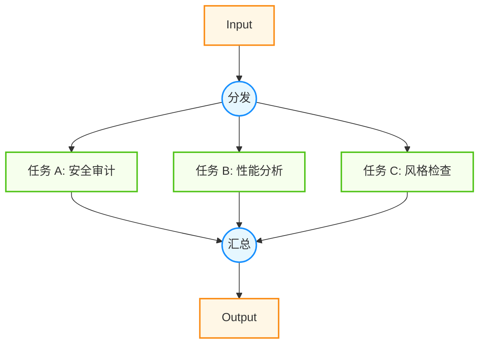

图 9-3：并行执行模式

#### 1.1.4 编排者-工作者

当子任务无法预知或需要动态生成时，通过一个中心编排者来分派任务。这就像是一个“包工头”带着一群“工人”。

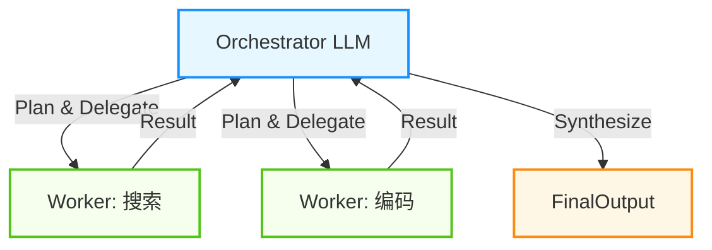

图 9-4：编排者-工作者模式

* **流程**:
    1. Orchestrator 分析用户请求，分解出需要执行的子任务。
    2. 并行或串行调用相应的 Worker LLM 或工具。
    3. 收集 Worker 的结果，进行综合（Synthesize），生成最终回复。
* **适用场景**：复杂编码任务（修改一个功能涉及多个文件）、多源信息调研。
* **区别**：虽然子任务列表是动态的，但 **执行模式是固定的**（例如：Split -> Map -> Reduce），依然属于静态编排；而自主智能体可以自主决定是否循环、调用何种工具，流程拓扑是动态的。

#### 1.1.5 评估者-优化者

评估者-优化者模式即经典的 **反思** 模式。在一个循环流程中，引入“评估者”角色来提升质量。

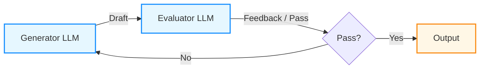

图 9-5：评估者-优化者模式

* **流程**：生成器 (Generator) 生成初稿 -> 评估者 (Evaluator) 提出修改意见 -> 生成器 (Generator) 优化 -> 循环。
* **适用场景**：高质量翻译、复杂代码生成。
* **关键点**：必须设置明确的终止条件（如最大循环次数或评分阈值），防止死循环。
* **max\_iterations 降级处理**：当达到最大迭代次数而未通过评估时，应返回迄今为止质量最优的方案，而非抛出异常。

```python linenums="1" title="评估者-优化者的健壮实现"
best_result = None
best_score = -1

for iteration in range(max_iterations):
    result = generator.generate(task)
    score = evaluator.score(result)

    if score > best_score:
        best_score = score
        best_result = result

    if score >= pass_threshold:
        return result  # 通过评估，立即返回

    if iteration == max_iterations - 1:
        # 最后一轮未通过，返回最优方案
        return {
            "result": best_result,
            "score": best_score,
            "status": "max_iterations_reached",
            "message": f"未在 {max_iterations} 轮内通过评估，返回最优方案"
        }
```

### 1.2 自主编排：智能体与动态决策

当无法预定义路径时，需要让 LLM 接管控制权，即 **自主编排** 模式。此时，智能体不仅仅是调用工具，更是模拟这种 **认知循环**。

常见的自主编排模式包括：ReAct、规划与执行、多智能体协作。

#### 1.2.1 ReAct

这是最经典的单智能体模式（详见 2.3 节）。

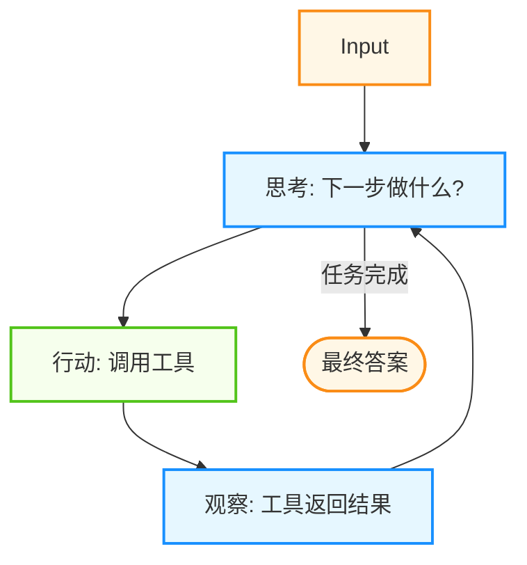

图 9-6：ReAct 循环模式

* **Traces 示例**:

    ```
    Thought: 用户想知道北京现在的天气。我需要调用天气查询工具。
    Action: search_weather(city="Beijing")
    Observation: 25°C, Sunny.
    Thought: 此时天气不错。用户还问了适合穿什么。基于天气...
    Action: search_clothing_recommendation(temp="25°C")
    ...
    ```
* **核心挑战**: 容易陷入循环，或在高压环境下（如复杂多步推理）迷失目标。

#### 1.2.2 规划与执行

为了解决 ReAct “走一步看一步”导致的短视问题，引入了显式的 **规划** 阶段。

* **阶段一：规划 (Planner)**：LLM 接收复杂请求，不直接执行，而是输出一个 `Step-by-Step Plan`。
* **阶段二：执行 (Executor)**：按照 Plan 逐条执行。如果执行中遇到阻碍，可以请求 Planner **重规划 (Replanning)**。

!!! tip "提示"
    
    **Cursor 的 Plan Mode** 就是这种模式的最佳实践。它先扫描代码库，生成 Implementation Plan，用户确认后，再一步步 Apply Changes。

#### 1.2.3 多智能体协作

当单体智能体复杂度过高时，通常将其拆分为多智能体系统。

* **层级制**:
    * 类似于公司组织架构。
    * **管理智能体**: 负责拆解目标，监督进度，协调资源。
    * **专家智能体**: 专注特定领域（如 DB 设计专家、前端专家、QA 专家）。
    * *优势*: 权责分明，管理者可以纠正下属的错误。
* **协作制**:
    * 类似于头脑风暴会议。
    * 多个智能体（如 Developer + Tester）处于同一个会话中，都能通过消息总线发言。
    * 通常需要一个发言选择（Speaker Selection）机制来决定谁下一个发言。
* **竞争制**:
    * 多个智能体对同一问题持不同立场，通过辩论提升决策质量。
    * 详见 6.3 节博弈论视角下的冲突解决。

## 1.3 模式选择指南

如何决定使用哪种模式？主要参考 **不确定性** 和 **复杂性** 两个维度。这对应了认知科学中的 **快思考** 与 **慢思考** 理论。

| 模式            | 认知模式 | 适用场景           | 复杂度   | 成本       |
| ------------- | ---- | -------------- | ----- | -------- |
| **提示词链**      | 快思考  | 任务固定，步骤明确      | ⭐     | 💲       |
| **路由分发**      | 快思考  | 任务有几个明确变体      | ⭐⭐    | 💲       |
| **并行执行**      | 快思考  | 独立子任务，关注速度/覆盖面 | ⭐⭐    | 💲💲     |
| **编排者模式**     | 混合态  | 动态子任务，需要统一协调   | ⭐⭐⭐   | 💲💲     |
| **评估优化**      | 慢思考  | 质量优先，容忍高延迟     | ⭐⭐⭐   | 💲💲💲   |
| **ReAct 智能体** | 慢思考  | 开放式探索，步骤未知     | ⭐⭐⭐⭐  | 💲💲💲   |
| **自主规划**      | 慢思考  | 极度复杂，长跨度任务     | ⭐⭐⭐⭐⭐ | 💲💲💲💲 |

!!! note "重要"
    
    **Start Simple**: 总是从简单的静态编排开始。只有当固定流程无法应对需求的变化时，才引入自主编排。过早引入自主编排会导致系统变得不可预测且难以调试。

### 1.4 行业最佳实践

#### 1.4.1 Agentic Workflows：把模式编排成生产流水线

如果把前面的 ReAct、规划与执行、多智能体协作、评估优化放在一起看，就会发现它们并不是彼此割裂的技巧，而是同一个更大范式的组成部分：**Agentic Workflows**。

它的核心思想不是“让一个更聪明的模型一次性回答所有问题”，而是围绕模型设计一条可重复、可观测、可纠错的工作流。常见的四个积木是：

1. **Reflection**：让系统检查自己的工作
2. **Tool Use**：让系统调用外部工具与环境交互
3. **Planning**：让系统先拆任务、再执行
4. **Multi-Agent Collaboration**：让多个角色分工协作

可以把它理解为一个分层工作流：

| 层       | 典型模式                   | 解决什么问题       |
| ------- | ---------------------- | ------------ |
| **执行层** | Tool Use / ReAct       | 当前这一步该做什么    |
| **规划层** | Plan-and-Execute       | 整个任务应该怎么拆    |
| **质量层** | Reflection / Evaluator | 当前结果是否足够好    |
| **组织层** | Multi-Agent            | 谁来做、谁来审、谁来汇总 |

在真正的生产系统里，这四层往往是组合出现的。例如：

* Orchestrator 先生成全局计划
* 每个子任务内部再跑一轮小型 ReAct 循环
* 关键结果交给 Reviewer 做 Reflection
* 最终由多智能体协作完成整体交付

这也是智能体系统从“会调用几个工具的 Demo”走向“能稳定交付业务结果的生产系统”的关键分水岭。

#### 1.4.2 行业共识

工程实践中，一个反复被验证的经验是：**优先使用简单、可组合的静态模式**，在必要时再引入更强的自主性与动态规划。

同时，围绕“跨模型/跨工具互操作”的标准化工作也在推进，例如将“工具描述、权限边界、上下文传递、可观测性事件”做成可移植的协议与数据结构（相关内容可结合 4.3 节 阅读）。这些努力使得上述设计模式更容易跨框架复用。

#### 1.4.3 落地清单

如果你需要把设计模式从“概念”落到“能上线”，可以先用这份最小清单做自检：

* 明确任务完成条件与最大步数，避免无限循环
* 为高风险工具设置审批与最小权限，并在运行时硬拦截
* 为关键链路打上 `trace_id`，并记录工具调用与结果作为证据链
* 维护回归样例集，支持版本对比与灰度发布

#### 1.4.4 案例：Claude 设计系统的智能体工作流

Anthropic 在 Claude 设计工具中实现了一套完整的 Agent 工作流，其系统提示词为 Agent 设计模式提供了极具参考价值的生产实践。

**六步 Agent 循环**。该系统将设计任务分解为：(1) 理解需求——对新任务提出澄清问题，明确输出物、保真度、约束条件；(2) 探索资源——阅读设计系统定义及关联文件；(3) 制定计划——创建待办清单；(4) 搭建结构——准备文件夹和资源；(5) 执行交付——产出设计文件并验证无错误；(6) 简短总结——只写注意事项与下一步。这个循环体现了典型的 Plan-Act-Observe 模式，但在每一步都注入了领域特定的行为约束。

**上下文窗口管理**。该系统引入了 `snip` 机制——当一个工作阶段完成（一次探索已解决、一次迭代已收敛），Agent 标记该区间可被移除。标记是延迟执行的：只有当上下文压力增大时才统一清理。这种“惰性回收”策略避免了两个极端——频繁清理导致丢失有用上下文，和从不清理导致窗口溢出。对于长期运行的 Agent 系统，这是一个值得借鉴的设计。

**工具使用规范与信息隐藏**。系统严格区分了“能力描述”和“实现细节”：Agent 可以告诉用户“我能创建 HTML 和 PPTX 文件”，但绝不暴露工具名称、系统标签或内部机制。这种信息隐藏原则不仅是安全需要，也减少了用户试图直接操控工具链的风险，是 Agent 系统 API 设计的重要参考。

### 1.5 长期运行的智能体设计模式

当智能体任务跨越数小时甚至数天时，设计模式需要特殊考量。学术界与工业界在 2025-2026 年总结了几个关键的长期运行模式。

#### 1.5.1 计划、文档与 Git 驱动

在长期科学计算和代码生成任务中，**蓝图文件（Blueprint File）** 模式被证实有效。核心要素包括：

1. **CLAUDE.md 计划蓝图**：项目初期，生成一份结构化计划文件，列举可交付成果、成功标准、架构决策。这个文件在整个开发过程中保持在智能体的上下文中，作为目标锚点。
2. **CHANGELOG.md 进度记录**：维护一份“实验室笔记”，记录已完成任务、失败的尝试、性能基准和已知限制。**失败的方案同样重要**——它们防止后续会话重复踩坑。
3. **版本控制驱动的进度监控**：指示智能体在有意义的工作段后执行 Git 提交，并在提交前运行测试套件。Commit 历史成为可审计的进度证明。
4. **测试预言与量化目标**：建立可测试的参考标准（如单位测试、性能基准、精度指标）。Long-term Agent 相比短期 Agent 更需要显式的成功标准，而非模糊的“质量好”。

#### 1.5.2 编排循环与任务验证

应对“智能体懒惰”的常见策略是 **Ralph Loop**——反复验证任务完成情况，直到满足规范。这个模式的核心是：不依赖单次推理就“认为”任务完成，而是通过多轮检查确保交付物达标。

#### 1.5.3 看板驱动的持续编排：Symphony 模式

OpenAI 于 2026 年 4 月开源的 **Symphony** 规范提供了长期运行智能体的另一个生产级参照。它的核心理念是：**将项目管理看板（如 Linear）变为智能体的控制平面**。

Symphony 的运行模型是一个持续轮询的守护进程：

1. **Poll**：从 Issue Tracker 读取待处理任务。
2. **Dispatch**：为每个任务创建隔离工作区（独立 git clone）。
3. **Resolve**：在隔离环境中运行 coding agent 会话，直到交付物通过验证。
4. **Land**：生成 PR 并交由人工审查，合格后合入主线。

其设计要点包括：每个任务拥有独立的沙箱与分支，避免并发冲突；规范本身以 Markdown（`SPEC.md`）形式存在于仓库中，可版本化、可审计；人工始终保留最终审批权。这是“编排者-工作者”模式（9.1 第 4 节）在持续运行场景下的具体工程化实现。

## 2. Harness架构：智能体的执行与治理层

上一节介绍了从 Workflow 到 Agent 的各种设计模式。但把一个 Agent “跑起来”和“跑得稳”之间，存在巨大的鸿沟。2025 年证明了智能体能完成复杂任务；2026 年，行业发现 **构建智能体并不难，难的是让它在生产环境中可靠、可控、可审计地持续运行**。

填补这道鸿沟的关键，是一个被称为 **Harness（驭具）** 的架构层。

### 2.1 什么是智能体 Harness

**Agent Harness** 是包裹在 AI 模型外围的软件基础设施，负责管理模型推理之外的一切：工具执行、状态持久化、安全边界、错误恢复和生命周期管理。

一个直观的类比：

> **模型是 CPU，上下文窗口是 RAM，Harness 是操作系统。** CPU 只负责计算，操作系统负责调度进程、管理文件系统、控制硬件访问、处理异常。同样，模型只负责推理，Harness 负责让推理在真实环境中安全、持续地运行。

用一个公式表达：

```
Agent = Model + Harness
```

模型是“大脑”，Harness 是“身体”——它为大脑提供感官输入、运动控制、免疫系统和能量管理。没有 Harness 的模型只能进行一次性对话；有了 Harness，模型才能成为能持续工作的智能体。

### 2.2 从 Prompt 到 Harness：工程范式的三次跃迁

理解 Harness 的最好方式，是把它放在工程范式演进的时间线上：

| 阶段        | 范式                      | 核心关注点         | 工程对象                             |
| --------- | ----------------------- | ------------- | -------------------------------- |
| 2023      | **Prompt Engineering**  | 这一轮推理怎么答      | 单次输入文本                           |
| 2024–2025 | **Context Engineering** | 模型每一步看到什么     | 系统提示词 + 检索文档 + 工具结果 + 对话历史       |
| 2025–2026 | **Harness Engineering** | 智能体如何在环境中持续运行 | 工具执行 + 状态管理 + 安全边界 + 生命周期 + 可观测性 |

三者是递进关系，而非替代关系：

* **Prompt Engineering** 解决“说什么”——如何措辞让模型理解意图。
* **Context Engineering** 解决“看什么”——如何组装完整的信息环境（详见 3.6 节）。
* **Harness Engineering** 解决“怎么跑”——如何让智能体在真实环境中安全、持续、可恢复地执行任务。

Harness 包含 Context Engineering 作为子系统（决定每一步喂给模型什么），但远不止于此——它还要管理工具调用的权限、处理执行失败的恢复、维护跨会话的状态、以及在整个过程中保证安全与合规。

### 2.3 Harness 的核心子系统

一个生产级 Harness 通常由以下四个核心子系统构成：

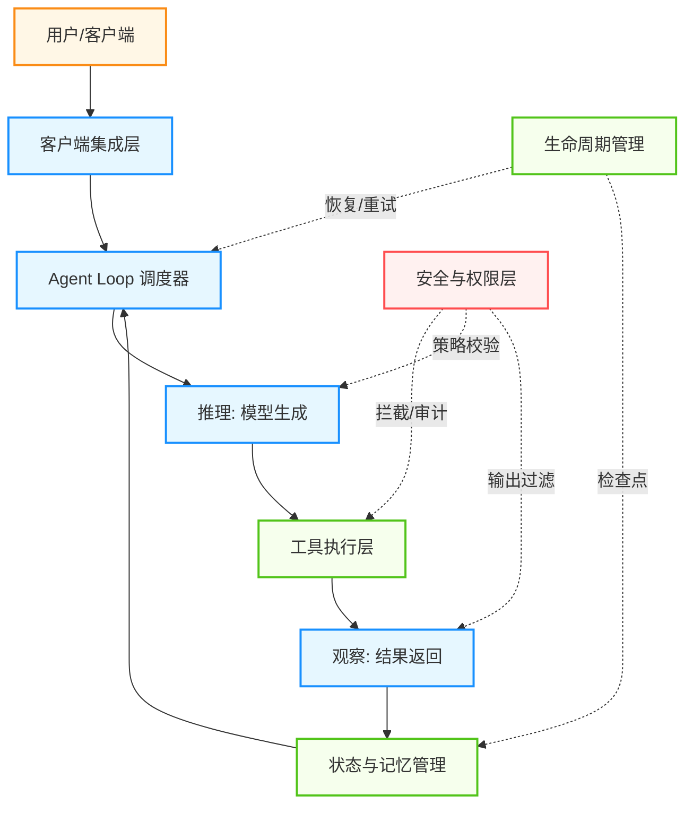

图 9-7：Agent Harness 四大核心子系统

#### 2.3.1 工具执行层（Tool Integration Layer）

Harness 负责暴露可调用的工具接口、校验调用参数、在沙箱中执行、并将清洗后的结果返回给模型。

核心职责包括：

* **调用校验**：在执行前验证参数合法性和权限范围
* **沙箱隔离**：文件系统隔离 + 网络隔离，防止越权操作（详见 4.3 节 MCP 协议的权限治理）
* **结果清洗**：过滤敏感信息，截断过长输出，格式化返回结构
* **超时与熔断**：单次工具调用超时自动终止，连续失败触发熔断

#### 2.3.2 状态与记忆管理（Memory & State Management）

无状态的 LLM 依赖 Harness 来维护跨步骤、跨会话的状态。Harness 通常管理三层记忆：

| 记忆层       | 生命周期 | 内容            | 实现方式       |
| --------- | ---- | ------------- | ---------- |
| **工作上下文** | 单次推理 | 当前提示词 + 工具结果  | 上下文窗口      |
| **会话状态**  | 单次任务 | 执行日志、中间结果、检查点 | 文件/数据库     |
| **长期记忆**  | 跨任务  | 用户偏好、历史经验、知识库 | 向量数据库/知识图谱 |

当上下文窗口接近容量上限时，Harness 通过 **上下文压缩**（将历史对话浓缩为摘要笔记）和 **选择性检索**（每步只召回相关文档）来维持推理质量（详见 3.2 节 和 3.4 节）。

**进阶：把状态搬出 Harness。** 上表把“会话状态”放在 Harness 的管辖范围内，这在单机场景下成立；但要把智能体做成可规模化的托管服务时，这一点会成为瓶颈。Anthropic 在 [Scaling Managed Agents: Decoupling the brain from the hands](https://www.anthropic.com/engineering/managed-agents)（2026-04-08）中给出的做法，是把智能体拆成三个可独立虚拟化的部件：

| 部件              | 是什么                            |
| --------------- | ------------------------------ |
| **会话（session）** | 记录已发生一切的**只追加日志**              |
| **Harness**     | 调用模型、并把模型的工具调用路由到相应基础设施的**循环** |
| **沙箱（sandbox）** | 模型执行代码、编辑文件的**执行环境**           |

他们把**模型加 Harness** 称为“大脑”，把**沙箱与执行动作的工具**称为“手”，把**会话事件日志**单列为“会话”。关键的一步是**让会话日志坐落在 Harness 之外**：Harness 在循环中通过 `emitEvent(id, event)` 持续写入日志，于是 **Harness 内部不再有任何需要在崩溃中幸存的东西**。某个实例挂掉后，新实例通过 `wake(sessionId)` 唤起、用 `getSession(id)` 取回事件日志，从最后一个事件继续。扩容也随之变得简单——文中的说法是“启动很多个无状态的 Harness”，只在需要时才把它们接到“手”上。

第二步是**让 Harness 离开容器**。解耦之后，Harness 不再住在容器里，而是像调用任何其他工具那样调用它：`execute(name, input) → string`。容器由此从“宠物”变成了“牲口”（pets vs cattle：前者是精心照料、丢不起的个体，后者可互换）。容器死掉时，Harness 只是收到一个工具调用错误并把它交回给模型；模型若决定重试，用 `provision({resources})` 按标准配方起一个新的即可——**不必再把出故障的容器抢救回来**。

这个拆法对本节的启示是：9.2.3 中“状态与记忆管理”和“生命周期管理”两个子系统，在托管场景下的正确答案不是把状态管得更好，而是**把状态挪到 Harness 之外**，让 Harness 本身变成可随时丢弃、可随时新建的一层。

#### 2.3.3 安全与权限层（Safety & Permissions）

这是 Harness 区别于普通“脚本 wrapper”的关键层。在 1.3 节中，我们引入了 **可信计算基（TCB）** 的概念——策略网关 + 权限校验 + 沙箱隔离。Harness 的安全层正是 TCB 的工程实现。

在企业级场景中，安全层的典型实现包括：

* **输入清洗**：在数据到达模型之前，屏蔽 PII（个人身份信息）等敏感字段。Salesforce 的 Einstein Trust Layer 就是这种模式的典型案例——它在 Prompt 送入 LLM 之前自动识别并遮蔽敏感信息
* **输出校验**：模型生成的每个动作都经过策略引擎审核，阻止越权操作
* **最小权限原则**：每个会话仅授予完成当前任务所需的最小工具集和数据范围
* **审计日志**：每一次工具调用、每一条模型输出都附带 `trace_id`，形成完整的证据链（详见 9.3 节和 11.1 节）

##### 智能体工学：为智能体设计更好用的软件

Harness 的设计不仅涉及技术实现，还涉及一个更深层的问题：**如何为 Agent 设计更符合人机协作理念的软件**。黄东旭提出“智能体工学”的概念，核心原则包括：

1. **最小化使用摩擦（Minimize Friction）**：
   * 统一平台集成：避免让 Agent 在多个系统间切换，减少转换成本
   * 简化接口设计：降低 Agent 理解和调用工具的认知负担
2. **最大化信息密度（Maximize Information Density）**：
   * 优先使用 Markdown 而非 HTML，便于 Agent 快速解析结构信息
   * 在有限的上下文窗口内，让每个字都承载更多语义价值
3. **信任模型能力而非限制流程（Trust Capabilities, Not Process）**：
   * 从“规定 Agent 必须怎么做”转向“定义 Agent 能做什么，让它自决”
   * 通过能力声明而非步骤限制，给予 Agent 更多策略灵活性
   * 安全约束应该在能力边界（权限）而非过程控制（强制工作流）

这些原则背后的哲学是：与其把 Agent 当作需要严密流程约束的执行工具，不如把它当作具有一定智能化权限的协作伙伴。

#### 2.3.4 生命周期管理（Lifecycle & Recovery）

传统软件的函数调用以毫秒计；智能体的任务执行可能持续数分钟甚至数小时。Harness 必须处理长时间运行带来的各种挑战：

* **检查点与恢复**：定期保存执行状态快照。如果发生故障，Harness 可以从最近的检查点恢复，而不是从头开始
* **循环终止**：设置最大步数、最大 Token 消耗、最大执行时间等硬性上限，防止无限循环（详见 9.6 节 故障模式）
* **优雅降级**：当达到资源上限但任务未完成时，返回迄今为止的最优中间结果，而非抛出异常
* **会话续接**：在 Agent 中断后，Harness 将知识外化到文件和提交历史中，使新会话能无缝接续

#### 2.3.5 上下文重置（Context Reset）策略

在长时间运行的智能体中，上下文窗口会逐步被历史对话、工具输出和中间状态填满。虽然 Harness 通过压缩和检索机制来缓解这个问题，但当推理环路复杂或上下文污染严重时，增量式的“压缩”不如激进的“重置”有效。

**核心洞察**：与其试图将所有历史信息浓缩进有限的上下文，不如在关键节点执行一次清晰的上下文重置。这是 Anthropic 在生产编码智能体中采用的模式。

三步重置流程：

1. **检查点保存**（Checkpoint）：将任务的关键状态（当前目标、已执行步骤总结、重要中间结果）持久化到外部存储（数据库或文件）
2. **上下文清空**（Clear）：清除当前上下文窗口中的历史对话、工具结果日志等冗余信息
3. **精简重载**（Reload）：从检查点只恢复三类信息：(1) 原始任务描述，(2) 迄今为止的执行进度摘要，(3) 关键学习（常见陷阱、已验证的方案）

这与传统的“上下文压缩”不同。压缩试图保留所有信息但缩小体积；重置则是承认某些中间细节在任务进行到一定阶段后已经无关，大胆丢弃它们。实践中，重置常常能带来更清晰的推理轨迹和更好的指令遵循。

伪代码示例（Python 风格）：

```python linenums="1"
def context_reset_checkpoint(agent, task_state):
    """智能体执行中的上下文重置"""
    # 步骤1：关键状态持久化
    checkpoint = {
        'task_id': task_state['id'],
        'original_goal': task_state['goal'],
        'progress_summary': compress_steps(task_state['history']),
        'learned_patterns': extract_patterns(task_state['failed_attempts']),
        'key_artifacts': task_state['important_files'],
        'timestamp': now()
    }
    storage.save_checkpoint(checkpoint)

    # 步骤2：当前上下文清空
    agent.context_window.clear()

    # 步骤3：精简信息重载
    refreshed_context = {
        'system_prompt': agent.system_prompt,
        'goal': checkpoint['original_goal'],
        'progress': checkpoint['progress_summary'],
        'learnings': checkpoint['learned_patterns'],
        'current_artifacts': checkpoint['key_artifacts']
    }
    agent.load_context(refreshed_context)
```

何时触发重置：结合上下文利用率、摘要质量、任务边界和重复循环信号判断；Anthropic 的长程智能体实践更强调用 progress artifacts 跨上下文窗口保留目标、进展和关键产物，而不是依赖单一百分比阈值。若检测到同一个工具被调用超过 N 次却无进展，也应触发重置或人工介入。

#### 2.3.6 规划-生成-评估（PGE）三角色分离

生产级智能体常面临一个问题：生成阶段（Generator）和评估阶段（Evaluator）共享同一个上下文和模型，导致评估者易于陷入“确认偏差”——倾向于给自己的输出评高分。

PGE 框架通过 **分离三个认知角色** 来解决这个问题：

| 角色                 | 职责                    | 关键约束                     |
| ------------------ | --------------------- | ------------------------ |
| **规划者（Planner）**   | 任务分解、设计执行步骤、制定策略      | 输出必须是清晰的、可验证的子任务         |
| **生成者（Generator）** | 执行具体步骤、调用工具、生成内容      | 严格按规划执行，不自主改变策略          |
| **评估者（Evaluator）** | 检查生成物质量、验证目标完成、诊断失败原因 | **必须与生成者隔离**，拥有独立的上下文和提示 |

核心设计原则：**评估者必须获得“新鲜的眼睛”**。它不应该看到生成者的详细推理过程（这会造成认知锚定），而应该只看到：任务定义、规划结果和生成物本身。

PGE 流程示意：

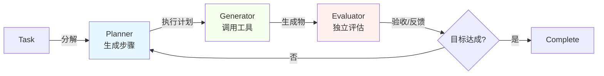

图 9-8：PGE 三角色分离流程

在生产系统中，这三个角色更适合按**能力层**分配，而不是把某个营销版本号写死为推荐常量：

* **Planner**：使用规划能力更强的模型，或专门的规划提示，生成结构化的步骤清单；如果需要在系统里固化模型选择，优先使用供应商文档中的稳定 snapshot / alias，而不是在架构文档里写死短周期版本号
* **Generator**：使用执行成本更低、工具调用更稳定的模型，严格遵循计划
* **Evaluator**：独立的上下文和系统提示，专注于验收标准而非执行细节。常见做法是给 Evaluator 一份“成功准则清单”，使其能以目标为导向进行评估

关键收益：

1. **消除确认偏差**：Evaluator 不知道 Generator 的内部状态，只看结果
2. **可审计性**：每个角色的输出都可独立验证，提高了系统的透明度（与 9.3 节的可观测性相呼应）
3. **支持失败诊断**：当 Evaluator 拒收时，能清晰指出是规划问题、执行问题还是评估标准问题（见 9.7.7 节的“黑盒代码”反模式）
4. **启用并行化**：Planner 可以规划多个独立任务，多个 Generator 并行执行，再由 Evaluator 汇总验收

行业验证：LangChain 在 [Improving Deep Agents with harness engineering](https://www.langchain.com/blog/improving-deep-agents-with-harness-engineering) 中报告，其 Deep Agents CLI 在模型固定为 `gpt-5.2-codex` 的前提下，仅靠一系列 Harness 改进就在 Terminal Bench 2.0 上从 52.8 提升到 66.5。这个结果与更好的规划、任务分解和独立验收设计相一致，但不宜简单归因为 PGE 单一因素；更准确的说法是，Harness 级编排优化可以在模型不变的前提下显著影响结果。

### 2.4 Harness vs. Framework：开发时 vs. 运行时

一个常见的混淆是 Harness 与 Framework（如 LangChain、LlamaIndex）的关系。两者的核心区别在于：

| 维度       | Framework                     | Harness           |
| -------- | ----------------------------- | ----------------- |
| **作用时机** | 开发时                           | 运行时               |
| **核心职责** | 提供积木（链、图、工具抽象）                | 提供执行环境（调度、安全、恢复）  |
| **类比**   | 编程语言的标准库                      | 操作系统的进程管理器        |
| **关注点**  | 怎么构建智能体                       | 怎么运行智能体           |
| **可替换性** | 框架可以换（LangChain → LlamaIndex） | Harness 通常与部署环境绑定 |

Framework 帮你在开发阶段快速组装一个智能体原型（详见 [第八章](/agentic_ai_guide/di-san-bu-fen-gong-cheng-shi-jian-yu-luo-di/08_frameworks.md)）；Harness 确保这个原型在生产环境中 7×24 小时稳定运行。两者互补，不可替代。

### 2.5 行业实践

#### OpenAI Codex：百万行代码零人工编写

2026 年初，OpenAI 团队在严格的“禁止人工写代码”约束下，使用 Codex 智能体构建并交付了一个超过 100 万行代码的内部产品。工程师的角色从编写代码转变为 **设计 Harness**。

他们的 Harness 包含三类组件：

1. **上下文工程**：将架构规范、领域知识、编码约定等以 Markdown 和 Schema 的形式嵌入代码仓库本身，让智能体从仓库中直接获取所需上下文
2. **架构约束**：用确定性的 linter 和结构性测试强制执行分层依赖规则（Types → Config → Repo → Service → Runtime → UI），既由 LLM 监控也由传统工具监控
3. **垃圾回收**：周期性运行的智能体，专门扫描文档不一致和架构违规，对抗代码库的熵增

这个案例说明了一个关键洞察：**当智能体足够强大时，工程师的核心产出不再是代码，而是 Harness。**

### OpenAI Agents SDK：执行层与计算层分离

OpenAI 在 2026 年 4 月发布的 Agents SDK 更新，将 Harness 工程的核心理念产品化：把文件检查、代码编辑、命令执行、MCP 工具、skills、AGENTS.md 指令和沙箱运行时原生并入同一个 agent harness，同时将**执行层（harness）与计算层（sandbox）显式分离**。

这种分离的关键设计是：harness 持有认证凭证和策略状态，sandbox 被视为不可信环境。沙箱内的代码执行、文件操作和 shell 命令无法直接接触凭证，所有需要认证的操作都通过 harness 代理完成。这与 11.1.6 节讨论的“沙箱 + 注入”架构（第 5 阶段）完全一致，但以 SDK 形式降低了实现门槛。

在持久性方面，Codex 的 App Server（基于 Rust 的双向协议）将 agent 循环抽象为三个原语：Items（原子 I/O 单元）、Turns（分组的 agent 工作）和 Threads（持久化会话容器）。当 token 接近上限时，SDK 通过“压缩”机制将模型的隐式理解编码为不透明摘要，而非简单截断历史——这对应 9.2.3 节第 5 条讨论的上下文重置策略。

原生沙箱支持（通过 Blaxel、Cloudflare、Daytona、E2B、Modal、Runloop、Vercel 等提供商）替代了过去需要团队自行搭建的容器编排，使“分离计算”从架构原则变成了开箱即用的能力。

#### Martin Fowler 的反馈转向模型

Martin Fowler 将 Harness 的控制机制分为两类：

* **前馈引导（Feedforward Guides）**：在智能体执行之前提供约束——规则文件、文档规范、架构模板。相当于“防患于未然”
* **反馈传感（Feedback Sensors）**：在智能体执行之后检测问题——linter、测试套件、类型检查。相当于“亡羊补牢”

最佳实践是 **将低成本的确定性检查前置**（如 pre-commit hook 中的 linter），**将高成本的推理性检查后置**（如 AI code review）。这与 9.3 节的可观测性和 9.7 节的反模式形成呼应。

#### Salesforce Agentforce：企业级安全 Harness

Salesforce 将 Harness 定位为模型的“安全外壳”，其 Agentforce 平台的 Harness 层重点包含：

* **Einstein Trust Layer**：所有 Prompt 在送入 LLM 之前经过 PII 自动识别和遮蔽
* **基础设施级策略执行**：安全策略在 Harness 层（而非应用层）强制执行，确保敏感数据永远不离开企业环境
* **全链路审计**：每个智能体动作都记录日志，满足企业合规需求

这种方法的核心理念是：**安全不是智能体的可选附加功能，而是 Harness 的内建属性**。

### 2.6 GAN 式 Harness 的成本-收益分析

生成对抗网络（GAN）的灵感来自于博弈论——两个对立的角色（生成器和评估器）通过竞争来相互推进。在 Harness 设计中，**多智能体架构（分离的生成和评估）** 遵循了类似的原理，但带来了显著的成本差异。

#### 成本对比：单独生成 vs. 多智能体 Harness

一个真实的案例是**全栈应用开发**任务。一种简单的方式是让单个智能体负责规划、代码生成和测试——快速但结果不稳定：

| 指标           | 单 Agent（20 分钟） | 多 Agent Harness（6 小时） |
| ------------ | -------------- | --------------------- |
| **成本**       | $9             | $200                  |
| **功能完整性**    | 核心功能破损         | 完整可用                  |
| **代码质量**     | 基础             | 生产就绪                  |
| **自动化测试通过率** | <30%           | >90%                  |

表面上看，多 Agent 方案成本是单 Agent 的 22 倍。但换个角度：如果任务失败，返工成本会吞掉更多资源。在实际工程中，**失败成本往往是初始成本的 10 倍以上**。

#### Harness 复杂度应随模型能力阶跃

关键洞见是：**Harness 的复杂度应该与当前模型的能力相匹配，而非固定不变**。当升级到 Claude Opus 4.6 时，研究者发现原本需要的冗长规划-检查-修正的多轮交互可以简化。新的架构虽然仍然保持三角色分离（规划-生成-评估），但每个角色的提示和检查点数量大幅减少，总成本从 $200 降至 $120 左右。

这反映了一个普遍原则：**更强的模型需要更轻的 Harness**。不要过度工程化——持续评估 Harness 的每一层是否仍然必要。

### 2.7 Harness 设计清单

在设计生产级 Harness 时，可以用以下清单进行自检：

```markdown
## Harness 设计自检

### 工具执行
- [ ] 所有工具调用在执行前经过参数校验
- [ ] 高风险操作（写入、删除、支付）需要人工审批
- [ ] 单次调用有超时限制，连续失败有熔断机制
- [ ] 工具结果经过清洗后才返回给模型

### 状态管理
- [ ] 定期保存执行检查点，支持故障恢复
- [ ] 上下文窗口有压缩/摘要策略，防止溢出
- [ ] 跨会话状态通过外部存储持久化

### 安全边界
- [ ] 遵循最小权限原则，每次会话仅授予必要权限
- [ ] 输入数据经过 PII 过滤
- [ ] 输出动作经过策略引擎审核
- [ ] 全链路 trace_id 支持事后审计

### 生命周期
- [ ] 设置最大步数、最大 Token 和最大时间上限
- [ ] 达到上限时优雅降级，返回最优中间结果
- [ ] 支持中断后从检查点恢复继续执行
```

### 2.8 与本书其他章节的关系

Harness 是一个横切关注点，它与本书多个章节的内容形成体系：

| Harness 子系统 | 对应章节 | 关键概念            |
| ----------- | -------------- | --------------- |
| 上下文管理       | 3.6 上下文工程      | 信息环境设计          |
| 工具执行        | 4.2 工具使用机制4.3 MCP 协议         | 权限治理、沙箱隔离       |
| 安全边界        | 1.3 核心组件（TCB）、11.1 安全边界 | 可信计算基、多层防御      |
| 可观测性        | 9.3 可观测性与调试       | 链路追踪、Trace/Span |
| 故障恢复        | 9.6 故障模式与韧性设计     | 熔断、降级、重试        |
| 反模式         | 9.7 架构陷阱与反模式    | 状态污染、成本溢出       |

理解 Harness 的意义在于：它提供了一个 **统一的架构视角**，将分散在各章节的工具执行、安全治理、状态管理、可观测性等概念，整合为一个协调工作的整体。

## 3. 可观测性与调试

在传统的软件开发中，通常通过查看 **调用栈** (Call Stack) 来调试报错。但在智能体开发中，“Bug” 往往不是代码崩溃（Crash），而是智能体 “一本正经地胡说八道” 或者 “陷入了无意义的死循环”。

当智能体出错时，你不能只看最后一行输出。你需要像黑匣子一样，记录下它每一次思考、每一次工具调用和每一次状态更新。这就是智能体的 **可观测性**。

### 3.1 为什么智能体难以调试

传统软件的行为由预先编写的代码决定，出了问题可以回溯代码逻辑。但智能体的行为路径是 LLM 在运行时动态生成的——这些“暗码（Dark Code）”执行完毕后即消散，无法像源代码一样被事先审查或精确复现。这一根本性差异使得可观测性从“有则更好”升级为“没有就是黑盒”。

1. **非确定性**：同样的提示词，上午跑是通的，下午跑就挂了。这使得复现 Bug 变得极其困难。
2. **黑盒推理**：LLM 为什么决定调用 Search 而不是 Calculator？这种决策过程不可见。
3. **多步级联**：第 5 步的错误可能是第 1 步的一个微小偏差导致的蝴蝶效应。
4. **成本隐患**：一个死循环的智能体可能在一夜之间烧掉几千美元。
5. **行为即逝**：Agent 的决策链在运行时生成、运行后消散，缺乏追踪机制就无法事后审计（参见 9.7.7 暗码反模式）。

### 3.2 核心指标：链路与跨度

借鉴 **分布式追踪** 的概念，可以构建智能体的监控数据模型：

* **链路**：代表用户的一次请求（Request）处理全过程。
* **跨度**：链路中的执行片段（Execution Step）。它既可以指代一次简单的工具调用，也可以包含多个子步骤，共同构成树状结构。

#### 可视化结构

一条链路展开后是若干嵌套的跨度，下图用一次天气查询说明它们之间的时间关系。

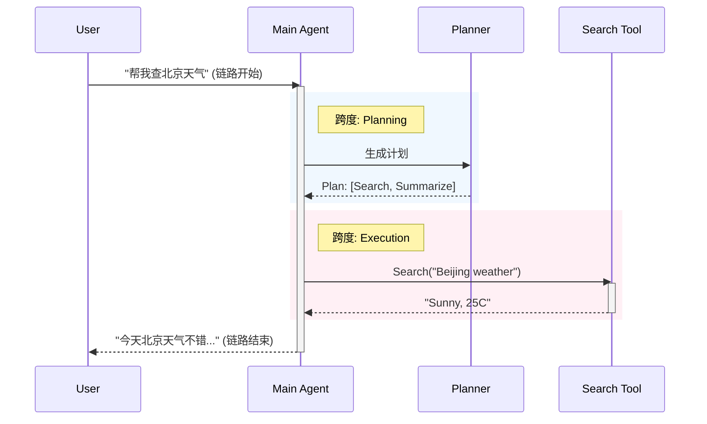

图 9-9：智能体链路追踪示例

在实际的链路追踪平台中，你不仅能看到这个时序图，还能点击每个跨度查看具体的 **输入**、**输出**、**延迟** 和 **成本**。

#### 指标命名与采样

为了让追踪数据在高并发下仍然可用，建议从一开始就统一命名与采样策略：

* **命名一致**：对工具调用、规划、检索、摘要等跨度使用固定命名，便于聚合分析。
* **采样分层**：成功链路低采样，失败链路高采样；高风险动作全量记录。
* **脱敏与权限**：对日志做脱敏，并按角色控制可见范围，避免追踪系统成为数据泄露入口。

#### OpenTelemetry：跨框架可观测性的统一标准

到 2026 年，智能体可观测性已经越来越像传统分布式系统：**追踪的关键不再是你用了哪个框架，而是是否使用统一的语义标准**。在工程上，最值得优先对齐的是 **OpenTelemetry (OTel)** 及其 OTLP 传输协议。

需要注意当前官方口径：OpenTelemetry 官方规范页已到 Semantic Conventions 1.41.0，GenAI schema URL 已到 1.42.0，但 **GenAI 语义约定仍处于 `Development` 成熟度**，尚未稳定定版。对已经发出旧版字段的埋点，不应在无迁移策略的情况下静默切换；官方建议通过 `OTEL_SEMCONV_STABILITY_OPT_IN=gen_ai_latest_experimental` 这类机制显式选择新版实验语义。

它的重要性在于：

1. **跨供应商互通**：链路数据可以在不同追踪后端之间迁移，而不被某个框架或厂商锁死。
2. **跨进程贯通**：Agent 编排层、工具服务、检索层、评估器与业务 API 可以共享同一个 `trace_id`。
3. **统一语义字段**：当前应优先使用 `gen_ai.*` 命名空间，例如 `gen_ai.operation.name`、`gen_ai.provider.name`、`gen_ai.request.model`、`gen_ai.response.model`、`gen_ai.tool.name`、`gen_ai.usage.input_tokens`、`gen_ai.usage.output_tokens`。不要把旧的 `tool.name`、`input_tokens`、`output_tokens` 与新字段混写在同一套规范里。
4. **便于混合系统接入**：一个链路里即使同时有 LangGraph、应用服务、数据库和自定义工具，也能在同一张 trace 中串起来。

在工具调用场景中，OTel 当前建议把工具执行建模为 `execute_tool` span，并使用 `gen_ai.tool.name` 参与 span 命名与聚合。这比各家平台自定义的 `tool_*` 字段更利于跨后端互通。

实践上，建议把 OTel 视为“底层数据面”，再把 Langfuse、LangSmith 或内部平台视为“上层分析面”。这样即使追踪产品调整，也不需要重写全部埋点。

#### 跨节点上下文透传

在复杂的系统或者多智能体场景中，链路可能会跨越不同的编排引擎或微服务节点。为了防范“断链”，必须在所有的服务之间传递统一的标识符。

正如第 3.6 章 上下文工程 中所强调的，工程上我们强烈建议引入标准化的 `ContextPack` 作为智能体间的记忆与请求载荷，并强制将其 `trace_id` 作为全局追踪主键：

1. **注入**：每次收到新的外部（人类或系统）请求，网关生成全局唯一的 `trace_id` 并初始化首个 `ContextPack`。
2. **透传**：在后续的工具调用（Tool Use）、RAG 检索、以及智能体间任务委派（第 6.5 章）时，强制携带该 `trace_id` 并衍生 `span_id`。
3. **聚合**：当在可观测平台查询该 `trace_id` 时，即可拼装出围绕该请求发生的所有内部状态流转、子模型调用和网络请求截面，彻底消除黑盒排障瓶颈。

### 3.3 评估体系：从离线到在线

仅仅记录链路是不够的，你还需要回答两个问题：

1. 这条链路最后有没有完成任务？
2. 它完成任务的过程是否健康、可复用、可扩展？

这正对应了 2026 年生产系统中越来越常见的两类评估：

* **Outcome Evaluation**：看最终结果对不对，任务是否完成。
* **Trajectory Evaluation**：看执行轨迹是否合理，是否存在多余步骤、错误路由、违规动作、重复工具调用等。

#### 3.3.1 离线评估

离线评估的目标是为系统建立一个稳定基线。最低配置通常包括：

* **Golden Dataset**：覆盖核心任务、长尾场景、高风险边界与历史事故样本。
* **Outcome Eval**：例如准确率、完成率、引用覆盖率、格式合规率。
* **Trajectory Eval**：例如平均步数、无效工具调用率、重复调用率、人工接管率。

一个典型的黄金数据集可以包含三类样本：

1. **主路径样本**：最常见、最有业务价值的任务。
2. **对抗样本**：歧义输入、噪声文档、冲突事实、异常工具返回。
3. **事故回流样本**：线上 Bad Cases，经修正后重新纳入回归集。

##### LLM-as-a-Judge 的正确用法

在开放式任务里，仅靠字符串匹配往往无法评估真实质量，因此很多团队会使用 **LLM-as-a-Judge**。这很有用，但必须注意边界：

* 它适合比较“版本 A 是否优于版本 B”，不适合完全替代人工。
* 它擅长评估结构、完整性、论证质量，较弱于极细粒度事实核查。
* 它应当被抽样人工校准，否则评审器本身也会漂移。

**评估范围的局限**：在多智能体系统评估中需要注意一个重要挑战：**创意解决方案可能超越预设的评估范围**。当多智能体系统面对开放式问题时，智能体可能探索出设计者未曾预见但同样有效的路径。此时，单纯的固定答案评分可能无法捕捉真实价值。

解决方案包括：

* 采用混合评估：在定量评分之外加入人工抽检。
* 定期审视评估标准：把新的高价值输出纳入黄金数据集。
* 记录轨迹而不只记录答案：让评审者能够判断“为什么它有效”。

#### 3.3.2 在线评估

离线评估用于“发布前把关”，在线评估用于“发布后守门”。既然无法人工检查每一条日志，就需要部署异步审计流水线，对生产 trace 做实时打分。

* **原理**：
    * 主智能体处理用户请求。
    * 监控智能体或规则引擎异步读取 trace、输入输出和工具结果。
    * 评估器给出分数、标签和是否告警的判断。
* **常见检测项**：
    * **幻觉检测**：回答中的关键事实是否可被检索证据支持。
    * **轨迹健康度**：是否存在异常步数、重复工具调用、错误路由。
    * **毒性与安全**：是否包含攻击性内容、越权动作、潜在泄露。
    * **格式与协议**：是否输出符合规范的 JSON、Schema 或工具参数。
    * **业务指标**：是否真正完成任务，而不是只生成一段看起来很像答案的文本。

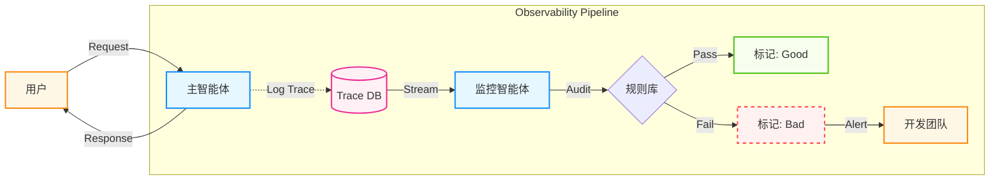

图 9-10：在线评估与可观测性管道

#### 把评估接入 CI/CD

成熟团队会把评估直接接入发布流程，而不是作为“上线后再看”的可选项：

1. **Prompt 变更**：触发黄金集回归。
2. **模型切换**：同时比较成本、延迟、Outcome 和 Trajectory。
3. **工具或检索逻辑变更**：重点检查事实性错误、空结果处理和回退逻辑。
4. **编排策略变更**：重点检查平均步数、循环率、人工接管率。

如果没有这层自动评估，任何“优化”都只是主观感觉。

### 3.4 多智能体系统的失败诊断

当多智能体系统（MAS）出现问题时，系统性地定位根因往往比“盯着最后一句回复”更有效。一种常见做法是把失败归因拆成三类：系统设计、协调问题、验证问题。当你面对一个错误的链路时，可以按此表检索：

| 类别           | 失败模式              | 典型表现                   | 修复策略                      |
| ------------ | ----------------- | ---------------------- | ------------------------- |
| **FC1：系统设计** | **FM-1.1 违反任务规范** | 忽略了“只能使用 JSON 格式”的硬性要求 | 将关键约束移至系统提示词开头            |
|              | **FM-1.2 违反角色规范** | 客服智能体突然开始写代码           | 强化角色设定                    |
|              | **FM-1.3 步骤重复**   | 智能体反复调用同一个工具，参数也不变     | 增加 `max_retries` 和去重逻辑    |
|              | **FM-1.4 上下文丢失**  | 多轮对话后智能体忘了初始目标         | 检查记忆截断策略                  |
|              | **FM-1.5 无法停止**   | 任务完成了但智能体继续闲聊          | 明确系统提示词中的停止条件             |
| **FC2：协调问题** | **FM-2.1 对话重置**   | 莫名其妙地重新打招呼，上下文丢失       | 检查消息历史拼接逻辑                |
|              | **FM-2.2 未请求澄清**  | 信息不足时强行猜测，而不是提问        | 增加“不确定时请追问”的指令            |
|              | **FM-2.3 任务脱轨**   | 聊着聊着跑题到了无关话题           | 增加专门的监督智能体 (Supervisor)   |
|              | **FM-2.4 信息扣留**   | 知道关键信息但没传给下游智能体        | 优化智能体间的消息传递协议             |
|              | **FM-2.5 忽略输入**   | 智能体 B 忽略了智能体 A 的关键输出   | 结构化智能体间的消息传递格式            |
|              | **FM-2.6 言行不一**   | 思考里说“我要查天气”，手里调了“计算器”  | 优化提示词或更换指令遵循能力更强的模型       |
| **FC3：验证问题** | **FM-3.1 过早终止**   | 任务没做完就自信地说“完成了”        | 增加评审智能体进行结果校验             |
|              | **FM-3.2 缺失验证**   | 从不检查工具执行结果是否正确         | 引入“双重检查”步骤 (Double Check) |
|              | **FM-3.3 错误验证**   | 检查了但把对的判成错的            | 提升验证者的能力或增加冗余校验           |

上表用于人工排查，而在高吞吐的生产环境中还需要 **机器可聚合** 的失败标签。建议为每条失败链路打上结构化标签，使日志系统能自动统计 Top-K 失败模式：

```json
{
  "trace_id": "trace-abc-123",
  "failure": {
    "category": "FC1_system_design",
    "code": "FM-1.3",
    "label": "step_repetition",
    "root_cause": "工具连续 5 次使用相同参数调用 search API",
    "severity": "medium",
    "recovery_action": "injected_intervention_prompt"
  }
}
```

**字段说明**：

| 字段                | 类型     | 说明                                                          |
| ----------------- | ------ | ----------------------------------------------------------- |
| `category`        | enum   | `FC1_system_design` / `FC2_coordination` / `FC3_validation` |
| `code`            | string | 对应上表的失败模式编号                                                 |
| `label`           | string | 机器可检索的短标签                                                   |
| `root_cause`      | string | 自动或人工归因的根因描述                                                |
| `severity`        | enum   | `low` / `medium` / `high` / `critical`                      |
| `recovery_action` | string | 系统采取的恢复动作                                                   |

### 3.5 持续改进

可观测性的终极价值，在于打通 **“线上监控”** 与 **“模型优化”** 的闭环。这是一个持续的改进循环：

1. **捕获**:
   * 全量记录线上链路。
2. **筛选**:
   * 利用 **在线评估** 自动筛选出得分低的 `Bad Cases`。
   * 这是最高价值的数据，因为它们代表了当前系统的短板。
3. **修正**:
   * 人工介入，修正这些 Bad Cases 的预期输出（Expected Output）。
   * 将它们加入到 **离线评估数据集** 中。
4. **改进**:
   * 利用新数据集进行提示词优化或微调 (Fine-tuning)。
   * 运行回归测试，确保新版本解决了旧问题且未引入新 Bug。

> **重要**： **数据即代码 (Data is the new Code)** 你的智能体代码可能只有 500 行，但你的 Dataset 应该有 5000 个 Case。随着 Dataset 的增长，你的智能体将变得不可战胜。

### 3.6 自主度指标如何进入监控面板

自主度的一手实证数据见 9.9 节。在可观测性系统里，本节更关心的是：**这些“自主度”信号该如何被埋点、聚合和告警**。

建议把以下几类指标直接纳入 trace 与 dashboard：

* **自主持续时长**：一次 turn 或一次任务在无人干预下持续了多久；通常从 `trace` 级别统计 tail latency，而不是只看均值。
* **监督事件**：人工审批、人工中断、Agent 主动澄清三类事件分别计数，并在 trace 上打标签，便于区分“被叫停”和“主动求助”。
* **风险动作**：对写入、删除、外部调用、资金或生产发布类动作增加结构化标签，区分“可逆”与“需审批”。
* **收敛质量**：把循环次数、重试次数、回滚次数和最终是否人工接管统一到同一条链路中，避免只看结果不看过程。

这里的重点不是复述某个研究里的具体百分比，而是把自主度转化为**可操作的运行时信号**：能回放、能聚合、能告警、能进入回归集。

### 3.7 工具生态

不同团队会选择不同的可观测性产品形态，但能力结构大体一致：

* **追踪与回放**：按链路与跨度回放一次请求的全流程，支持查看每一步输入输出与中间状态。
* **指标与告警**：延迟、错误率、工具调用失败率、超时率、成本与吞吐。
* **评估与标注**：离线数据集评测、线上抽样评测、人工标注与回归。
* **提示词与配置管理**：提示词模板、版本管理、灰度发布与回滚。

到 2026 年，主流产品的差异越来越集中在“分析体验”和“协作能力”，而底层追踪模型则越来越向 OTel 语义靠拢。无论使用 Langfuse、LangSmith 还是内部平台，都建议优先保证以下几点：

* trace/span 命名和字段语义一致；
* 可以导出或接收 OTLP；
* 评估结果能回写到 trace；
* 可以把线上 Bad Cases 直接沉淀为离线回归集。

有了设计模式、执行治理 和可观测性，目前已经构建了一个可靠的系统。接下来将探讨如何优化系统性能和成本。

## 4. 性能优化与成本控制

智能体系统的运营成本主要来自 LLM API 调用。一个设计不当的智能体可能每个任务消耗数万 Token，导致成本失控。本节探讨如何在保证质量的前提下优化性能和控制成本。

### 4.1 成本构成与分析

#### 4.1.1 大语言模型调用成本

以“托管式大模型 API”的常见计费方式为例，成本通常由以下部分组成：

* **输入词元**：请求中提示词与上下文的计费。
* **输出词元**：模型生成内容的计费。
* **缓存/折扣机制**：部分平台对缓存命中或重复前缀提供优惠。

**典型智能体任务的词元消耗**： 一个包含多轮规划与多次工具调用的任务，词元消耗会显著高于“单次问答”。因此，成本分析应基于真实链路的采样统计，而不是只看单次调用。

#### 4.1.2 基础设施成本

智能体系统的配套设施成本通常不容忽视：

* **向量数据库**: 长期记忆存储和索引查询费用。
* **网络传输**: 跨区域/跨洋调用的流量与延迟成本。

#### 4.1.3 自建推理决策

随着规模扩大，可能需要评估从 API 转为自建推理的盈亏平衡点。建议按 TCO（算力、运维、弹性、可用性、合规、峰谷负载）做详细核算，而不是用单一阈值一刀切。

### 4.2 提示词与上下文优化

提示词压缩的核心原则：消除冗余描述，保留指令本质（目标缩减 50-80% Token）。上下文管理应采用滑动窗口+摘要策略，避免无限累积历史。详细指导见《提示词工程指南》；本章重点关注智能体系统整体成本优化。

### 4.3 缓存策略

缓存是计算机科学领域最有效的优化手段之一，在智能体体系中也不例外。

#### 4.3.1 提示词缓存

提示词缓存将静态上下文前缀（系统提示、工具定义、文档）缓存在 KV Cache 中复用，可显著降低输入成本；在支持原生 Prompt Caching 的 API 中，合理使用 `cache_control` 一类的前缀缓存能力，常能把重复前缀的输入成本压缩一个数量级。

核心原则：

* **稳定前缀**：把系统提示、工具定义、固定政策文档锁定在前缀。
* **动态信息后置**：把用户输入、会话状态、临时参数放在缓存断点之后。
* **避免前缀抖动**：中途增删工具、插入动态日期、切换模型，都会导致缓存失效。
* **监控命中率**：命中率低于 80%，通常说明前缀设计不稳定。

一个常见反模式是在系统提示里拼接动态变量，例如“今天是 2026-03-28”或“用户位于北京”。这会让几乎每次请求都变成不同前缀，缓存价值接近归零。

#### 4.3.2 语义缓存

对相似查询返回缓存结果，无需调用 LLM。

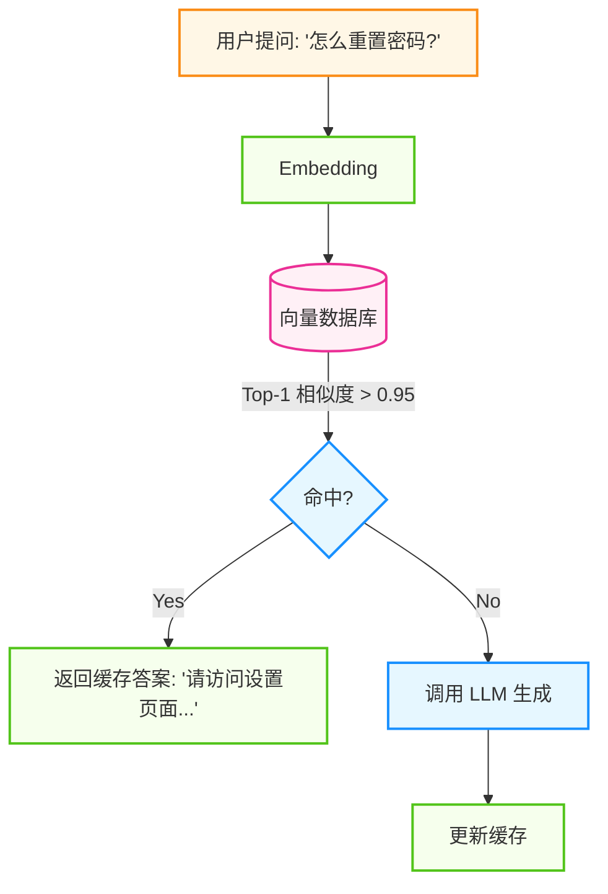

图 9-11：语义缓存工作流程

* **适用场景**: FAQ、重复性高的查询。
* **收益**：在高重复场景下，可能显著降低成本并改善延迟。
* **注意事项**：语义缓存不是“只要相似就复用”。对价格、库存、政策、实时数据等时效性强的任务，必须设置 TTL、版本戳或来源校验，否则缓存会把旧答案稳定放大。

#### 4.3.3 预加载

结合提示词缓存，在用户打开页面的瞬间，将相关的知识库上下文预加载到 KV 缓存中。

#### 4.3.4 Agentic Plan Caching

很多智能体任务真正昂贵的并不是最终生成，而是前置的“先想一遍怎么做”。如果你的业务里存在大量结构相似的任务，可以缓存的就不仅是 Prompt，还包括**计划**。

所谓 **Agentic Plan Caching**，就是把成功链路中的高质量执行计划抽取出来，供相似任务直接复用：

```
用户任务 -> 相似任务匹配 -> 命中历史计划
       -> 复用计划骨架 -> 仅重算必要步骤
```

它尤其适合：

* 工单处理、报表生成、固定研究流程；
* 工具链稳定、步骤相对固定的任务；
* 多轮任务中“规划成本高于执行成本”的场景。

实践时应注意三点：

1. **缓存的是计划骨架，不是盲目复用全部中间结果**。
2. **计划要带版本信息**，避免工具或业务流程变更后使用旧计划。
3. **仍需运行验证器**，确认计划适配当前输入，而不是照抄历史轨迹。

### 4.4 模型选择与蒸馏

**“大模型教小模型”** 是降低常态化运营成本的终极手段。

#### 4.4.1 模型蒸馏

如果不加控制，系统为了保证效果可能会倾向于长期使用高规格模型。但对于固定场景（如“SQL 生成”或“格式化输出”），通过微调或蒸馏得到的小模型往往也能胜任。

**蒸馏流水线**:

1. **收集数据**：使用高规格模型作为“教师”运行一段时间，收集输入输出对。
2. **筛选黄金数据**：结合人工抽检与自动规则筛选出高质量样本。
3. **微调**：使用这些数据微调一个更小、更便宜的“学生”模型。
4. **替换上线**：灰度替换并回归评测，观察质量与成本的变化。

#### 4.4.2 混合路由

即使有了微调模型，也可保留一个“兜底”机制：

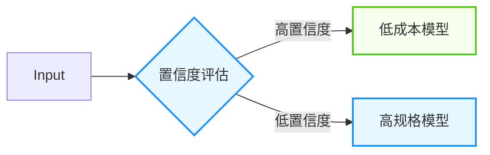

图 9-12：大小模型混合路由策略

### 4.5 延迟优化与推理引擎选择

要降低延迟，架构层面的优化往往比代码层面的微调更有效。尤其对于多轮智能体场景，推理引擎的性能直接决定整体吞吐量。

**高级推理引擎** 通过多项优化技术显著提升智能体性能：

* **前缀缓存与 RadixAttention**：SGLang 等引擎通过 RadixAttention 在多轮智能体对话中缓存公共前缀（系统提示、工具定义等）。[SGLang 论文](https://arxiv.org/abs/2312.07104)在多类结构化工作负载上报告最高 **6.4 倍吞吐量提升**；该数字是特定基准结果，不应视为所有智能体对话相对 vLLM 的固定收益。
* **结构化输出的零罚参数化**：受限生成（Constrained Decoding）通过 FSM 压缩确保 100% 符合 JSON/XML 格式，对工具调用强制结构化至关重要。SGLang 将 FSM 掩码生成与 GPU forward pass 重叠，消除吞吐量开销。
* **投机解码**：引入极轻的草稿模型生成 5 个候选 Token，由目标模型在单个批次验证。由于 Decode 阶段访存密集，并行验证多个 Token 的耗时与生成 1 个 Token 基本相同，实现“接近零成本”的多 Token 加速。
* **动态多 LoRA 路由**：多租户或多任务智能体平台常需百级微调适配器。通过动态路由在毫秒级加载 LoRA，单一基础模型可服务数百专业化智能体，大幅降低部署成本。
* **不对称 Prefill/Decode 集群**：独立的计算优化集群（Prefill）和显存优化集群（Decode），配合 KV 缓存亲和路由，彻底解除计算与访存的竞争。

#### 4.5.1 分离式架构

对于自建模型或私有化部署，**预填充（Prefill）与解码（Decode）的分离** 是解决高并发延迟的关键架构。

* **物理瓶颈互斥**: 计算处理极长的输入提示词（Prefill 阶段）对 GPU 是计算密集型的；而逐字生成答案（Decode 阶段）则因为参数搬运缓慢而属于访存密集型。混合部署会导致突发长 Prompt 请求瞬间霸占所有算力，引发其他并发对话被严重卡顿（队头阻塞）。
* **解耦方案**: 领军系统将机器拆分为独立的 **Prefill 集群**（主打算力）和 **Decode 集群**（主打显存带宽），两者通过超敏捷的高速 RDMA 网络在微秒级实现海量 KV Cache 状态的跨节点传输，彻底抚平算力与显存毛刺。

#### 4.5.2 投机解码

打破自回归模型必须“串行龟速生成”的宿命，尤其适合消除智能体冗长思维链过程的时间消耗。

* **机制**: 引入一个极其小巧且飞快的“草稿模型”（或并行的辅助预测头），它先快速猜想出后续的 5 个候选 Token，接着交由庞大的“目标模型”在一个并行批次中同时验证。
* **收益**: 因为大模型在 Decode 时其实多数算力处于闲置，并行验证多个 Token 的耗时与生成 1 个 Token 基本相同。只要目标模型接受了草稿输出，就等于在零时间成本下“免费”生成了多个字。在完全不损失生成智商的前提下，能将整个任务时延降低几倍。

#### 4.5.3 并行推测

在智能体的应用层，可以预判工具调用结果并提前触发下游操作：

* **预判分支**: 如果 Agent 大概率会调用某个 API，可以在等待 LLM 生成最终决策的同时，提前异步发起该 API 请求。
* **并行工具调用**: 当多个工具调用之间无依赖关系时，并行执行而非串行等待。

#### 4.5.4 网络优化

* **跨地域延迟**：使用边缘节点或多区域部署来减少跨地域联网的 RTT。
* **协议优化**: 使用 HTTP/2 或 WebSocket 减少连接建立开销。

### 4.6 成本监控

FinOps 是一种将财务问责制引入云和 AI 支出的文化与实践。在智能体体系中，它意味着工程团队需要对每一次 Token 消耗的 ROI 负责。

1. **预算告警**: 设置每日/每月硬性预算。
2. **归因分析**: 给每个 Trace 打上 `User_ID`, `Feature_ID` 标签，分析哪个功能最烧钱。
3. **异常检测**: 监控 `Cost / Request` 指标，发现异常突增（通常意味着死循环）。

### 4.7 智能体系统 TCO 分析框架

一个完整的智能体系统 TCO（Total Cost of Ownership）分析应覆盖以下维度：

| 成本维度 | 组成项                | 典型占比   | 优化杠杆          |
| ---- | ------------------ | ------ | ------------- |
| 模型推理 | Token 消耗、模型选择、推理次数 | 40-60% | 缓存、模型路由、提示词压缩 |
| 基础设施 | 向量数据库、消息队列、存储      | 15-25% | 按需扩缩容、冷热分层    |
| 开发维护 | 提示词迭代、框架升级、调试      | 10-20% | 自动化测试、CI/CD   |
| 人工干预 | HITL 审核、异常处理、标注    | 5-15%  | 提升自动化率、优化触发阈值 |
| 监控运维 | 日志存储、告警系统、可观测性     | 5-10%  | 采样策略、日志分级     |

**关键决策公式**：

```
单任务成本 = Σ(每步 Token 数 × 模型单价) + 工具调用成本 + 人工干预概率 × 人工成本
```

**单智能体 vs 多智能体成本对比**：

多智能体架构通常带来 2-5 倍的 Token 消耗增长（因智能体间通信开销），但可能在以下场景中实现净成本下降：

* **任务并行度高**：多智能体并行处理，总延迟降低，间接节省人力等待成本
* **专业化路由**：简单子任务用小模型，复杂子任务用大模型，平均成本反而更低
* **失败隔离**：单个子智能体失败不影响整体，减少全量重试的浪费

**不要忽略通信成本**：

```
多智能体额外成本
= Σ(Agent 间消息 Token × 单价)
+ 协调器额外推理
+ 中间摘要与状态同步
+ 额外验证与重试
```

当系统从“一个 Agent + 三个工具”演化为“一个协调器 + 四个专家 + 一个评审器”时，真正增加的往往不是最终答案长度，而是这些中间沟通消息。设计阶段应单独监控 `coordination_tokens / total_tokens`，否则很容易误判成本来源。

**实践建议**：在系统设计阶段就建立成本模型，将 Token 预算作为架构约束之一。参考第 7.5 节推理预算分配中的分级策略。建议按月对 TCO 各维度进行回溯分析，识别成本热点，并驱动优化循环。同时要警惕“假优化”陷阱：盲目削减监控成本可能导致生产故障成本翻倍；过度压缩模型规格可能引发质量严重下滑和人工补救成本激增。

在架构设计阶段，以下模板可帮助团队快速建立定量的成本预期，避免上线后才发现账单失控。

**Step 1: 单任务成本采样**

对典型任务进行 50-100 次采样，统计 Token 消耗的分布：

仓库提供了[使用 Decimal 的离线成本采样夹具](https://github.com/yeasy/agentic_ai_guide/tree/main/examples/offline_smoke.py)，可先验证输入、输出与工具费用的确定性计算，再把真实追踪数据接入下方统计模板。

```python linenums="1" title="成本采样分析模板"
import statistics

sample_costs = []  # 收集 N 次真实任务的 Token 消耗

for task in sample_tasks:
    result = run_agent(task)
    sample_costs.append({
        "input_tokens": result.input_tokens,
        "output_tokens": result.output_tokens,
        "tool_calls": result.tool_call_count,
        "steps": result.total_steps,
        "latency_ms": result.latency_ms,
    })

input_tokens = [c["input_tokens"] for c in sample_costs]
output_tokens = [c["output_tokens"] for c in sample_costs]

print(f"输入 Token - P50: {statistics.median(input_tokens)}, "
      f"P95: {sorted(input_tokens)[int(len(input_tokens)*0.95)]}, "
      f"Max: {max(input_tokens)}")
print(f"输出 Token - P50: {statistics.median(output_tokens)}, "
      f"P95: {sorted(output_tokens)[int(len(output_tokens)*0.95)]}, "
      f"Max: {max(output_tokens)}")
```

**Step 2: 月度成本预测公式**

```
月度推理成本 = 日均任务数 × 30 × (P95_输入Token × 输入单价 + P95_输出Token × 输出单价)
              × (1 - 缓存命中率 × 缓存折扣率)
              × 安全系数(1.2~1.5)

总月度成本 = 月度推理成本 + 基础设施固定成本 + 人工干预率 × 人工单价 × 日均任务数 × 30
```

!!! tip "提示"
    
    使用 **P95**（而非平均值）做成本预测，因为智能体任务的 Token 消耗往往呈长尾分布——少量复杂任务的消耗可能是平均值的 5-10 倍。

**Step 3: ROI 评估框架**

智能体系统的 ROI 不应简单地用“省了多少人力”来衡量。建议采用四象限评估：

| ROI 维度     | 衡量指标         | 计算方法                     |
| ---------- | ------------ | ------------------------ |
| **直接成本节约** | 替代人工的工时价值    | （原人工耗时 - 人机协作耗时）× 人力时薪   |
| **质量提升价值** | 错误率下降带来的损失减少 | 历史错误率 × 单次错误成本 × 错误率下降比例 |
| **速度红利**   | 交付周期缩短的商业价值  | 缩短的天数 × 每日延误的机会成本        |
| **规模弹性**   | 业务量波动时的边际成本  | 峰值人力成本 vs 峰值推理成本         |

**ROI 计算公式**：

```
净 ROI = (直接成本节约 + 质量提升价值 + 速度红利 + 规模弹性收益)
         / (推理成本 + 基础设施成本 + 开发维护成本 + 人工干预成本)
         - 1
```

**典型陷阱**：

* **只算推理成本，忽略集成成本**：提示词迭代、评测体系搭建、故障排查的工程投入通常占总成本的 15-25%。
* **用 Demo 效果预测生产 ROI**：生产环境的长尾任务、边缘情况和并发压力会显著改变成本结构。
* **忽视人工干预的隐性成本**：即使自动化率达到 95%，剩余 5% 的人工兜底可能需要更高技能的员工，单位成本反而更高。

## 5. 企业级智能体平台：架构、安全与治理

在本地 Notebook 里跑通一个智能体只是第一步，将其转化为可扩展、安全且合规的企业级服务则面临着完全不同的挑战。

企业级部署不仅关注 **高可用性**，更核心的是 **安全性**、**多租户隔离** 和 **治理**。本节将深入探讨如何构建一个生产就绪的智能体平台。

### 5.1 多租户与隔离架构

智能体应用通常是 **有状态** 且 **长运行** 的，这决定了其架构必须能够处理复杂的资源隔离和状态管理。

#### 5.1.1 异步任务队列与状态管理

由于智能体执行可能持续数分钟甚至更久，同步 HTTP 请求不可行。推荐使用 **异步事件驱动架构**，如下图所示。

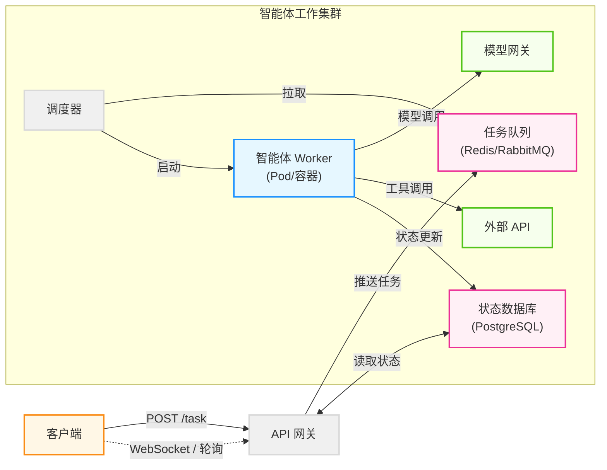

图 9-13：异步事件驱动架构

* **提交**: 返回 `TaskID`，状态 `Accepted`。
* **执行**: Worker 异步执行，状态持久化到数据库。
* **流式**: 通过 WebSocket 推送思考过程和增量结果，缓解用户焦虑。

#### 5.1.2 多租户工作池

在企业内部或者 SaaS 平台，不同部门（如财务部与研发部）的智能体需要严格隔离。

* **计算隔离**: 使用 Kubernetes Namespaces 或不同的 Node Pools 隔离不同租户的 Worker。
* **网络隔离**:
  * **Egress Control**: 财务部的 Agent 只能访问 ERP 系统，严禁访问外网。
  * **Service Mesh**: 使用 Istio/Cilium 实施细粒度的网络策略。

### 5.2 深度防御体系

安全不仅仅是 Prompt 上的约束，必须构建多层防御体系。随着工具连接协议与工具服务的普及，Agent 可调用的工具范围大幅扩展，安全防御的重要性也随之倍增。

关于 Agent 安全威胁的完整分类（提示词注入 vs 越狱、供应链攻击等）和通用防御策略，详见第 11.1 节。本节重点关注**企业级部署中的工程实现与运维观点**。

#### 5.2.1 多层防御架构速览

| 防御层级      | 关键技术              | 主要作用                        | 详见章节      |
| --------- | ----------------- | --------------------------- | --------- |
| Layer 1-3 | Prompt 工程、护栏、应用鉴权 | 在应用逻辑层防止越权与不当调用             | 11.1.2    |
| Layer 4   | 结构化输出约束           | 确保模型输出符合 Schema，防止注入导致的格式污染 | 9.5.2（下文） |
| Layer 5   | 基础设施沙箱            | 隔离代码执行环境，防止恶意代码逃逸           | 9.5.2（下文） |
| Layer 6   | 侧车代理安全联网          | 对外网访问的密钥与域名白名单管理            | 9.5.2（下文） |

#### 5.2.2 Layer 4: 结构化输出约束

在企业级智能体核心链路上，底层大模型往往被要求精确输出符合特定语法（如 JSON 或 XML Schema）的数据以供下游 API 解析消费。完全依赖“基于 Prompt 提示配合事后校验和重试”会导致高频的失败及高昂的成本，这在严苛的生产环境中不可接受。

* **系统层面极高的 Schema 一致性保证**: 现代高性能推理引擎（例如 vLLM, SGLang, TensorRT-LLM）在模型自回归生成循环底层引入了高度压缩的有限状态机（FSM）或正则表达式。它在每一步生成时动态计算，通过掩码（Logits Masking）直接在模型的输出概率矩阵中屏蔽掉所有潜在的不合规词汇，从物理层面提供了极高可靠的格式确定性（Schema Reliability）。且这类引擎通过异步与 GPU 前向并发的底层设计，使得加上护栏后完全不再拖累系统的原生吞吐。

#### 5.2.3 Layer 5: 基础设施沙箱

这是最后一道防线，防止 Agent 执行恶意代码。

* **MicroVM 沙箱**：可选用轻量虚拟化或容器隔离方案来运行不可信代码。
  * **托管式沙箱**：也可以使用第三方沙箱服务，按需启动受控执行环境。
* **文件系统隔离**: 沙箱内只能访问临时 `/tmp`，任务结束后立即销毁，不留任何痕迹。

#### 5.2.4 Layer 6: 侧车代理安全联网

当智能体需要访问外部 API 或互联网时，直接暴露网络权限会带来密钥泄露和越权访问的风险。**侧车代理（Sidecar Proxy）** 模式通过在智能体容器旁部署一个独立的网络代理进程，实现对所有出站请求的拦截、过滤和增强。

**核心架构**

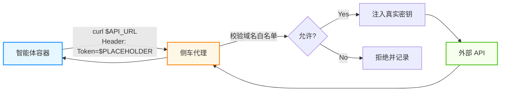

图 9-14：侧车代理的出站请求拦截与密钥注入

**三大安全机制**

* **域名白名单**：开发者预先配置允许访问的域名列表。智能体发出的所有 HTTP 请求必须匹配白名单，否则被侧车代理直接拦截并返回错误。这防止了模型被提示词注入攻击诱导去访问恶意 URL。
* **密钥占位符注入**：智能体在容器内永远看不到真实的 API Key 或 OAuth Token。它只能使用预定义的占位符（如 `$API_KEY`）。侧车代理在请求真正发出时，仅对白名单内的目标域名注入真实凭证。即使智能体试图将密钥发送到非授权域名，侧车也会拒绝注入。
* **请求审计与限流**：侧车代理记录所有出站请求的目标、频率和响应状态码，为事后审计提供完整的网络行为日志。同时支持按域名配置速率限制，防止智能体因循环调用而产生意外的高额账单。

**与传统方案的对比**

| 方案         | 密钥安全    | 访问控制粒度    | 审计能力   | 运维复杂度 |
| ---------- | ------- | --------- | ------ | ----- |
| 环境变量直接注入   | ❌ 模型可读取 | 无         | 无      | 低     |
| API 网关集中管理 | ✅ 集中存储  | 中（按路由）    | 中      | 中     |
| **侧车代理**   | ✅ 占位符隔离 | 高（按域名+路径） | 高（逐请求） | 中     |

侧车代理模式是一种常见的工程落地选项，适合把工具访问、密钥代理和审计策略从智能体应用逻辑中解耦。不同生产级智能体平台的实现形态并不相同：有的平台把工具执行、沙箱、文件和审计能力封装在托管运行时中，有的平台则通过企业网关或本地代理承接这些边界。

### 5.3 治理与合规

随着 Agent 自主性增强，“谁运行了什么？做了什么？”变得至关重要。工程上需要把互操作协议、鉴权模型、审计事件与可追溯的数据结构统一起来，才能让跨团队的协作与治理真正落地。

#### 5.3.1 角色访问控制

* **Agent 定义权限**: 谁可以创建/修改 Agent 的 Prompt 和工具集？
* **Agent 执行权限**: 谁可以向 Agent 下达指令？
* **工具调用权限**：
  * **静态授权**：管理员为智能体绑定可调用的工具与资源范围。
  * **动态授权**：智能体代表用户执行操作时，以用户身份的访问令牌进行代理调用，确保不越权。
* **跨智能体通信授权**：智能体之间通信时，需验证双方身份与权限范围，防止冒充或越权请求。

#### 5.3.2 审计日志

所有操作必须 **不可篡改** 地记录：

1. **输入**: 用户的原始 Prompt。
2. **思考**: Agent 的中间推理步骤。
3. **工具**: 调用的函数名、参数、以及 **返回结果**（这是取证的关键）。
4. **输出**: 最终响应。

#### 5.3.3 法规合规

不同司法辖区对 AI 系统的合规要求差异较大。面向强监管行业与市场的企业级智能体系统，通常需要重点关注：

* **风险分级与技术文档**：哪些场景属于高风险，需要更严格的验证与记录。
* **透明度义务**：用户是否被明确告知正在与 AI 系统交互。
* **人类监督**：高风险操作是否保留有效的人工介入机制。

#### 5.3.4 成本治理

企业级 Agent 平台还需从组织治理角度管控 Token 消耗（详见 9.4 节的成本优化策略）：按团队/部门设定 Agent 调用预算上限，并将成本归因到具体 Agent 实例，配合异常熔断机制防止成本失控。

### 5.4 PII 网关与数据隐私

在金融和医疗场景，严禁将客户 PII（个人可识别信息）发送给公有 LLM 模型商。

**架构模式：PII Sidecar / Gateway**

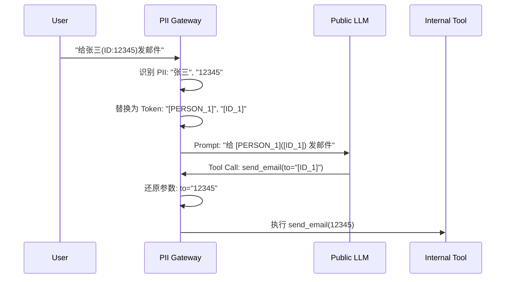

图 9-15：PII 网关脱敏流程

* **PII 识别组件**：可选用开源或商用的 PII 识别与脱敏工具。
* **核心思想**: LLM 只处理逻辑，不接触真实敏感数据。

### 5.5 部署策略与可观测性集成

#### 5.5.1 蓝绿部署与影子测试

Agent 的行为难以预测，V2 版本的 Prompt 微调可能导致回归。

* **影子模式**: 将线上流量复制一份给 V2 Agent，记录其响应但不返回给用户。后台运行 **Evaluator Agent** 对比 V1 和 V2 的结果质量。

#### 5.5.2 SIEM 集成

将 Agent 的审计日志对接企业 SIEM 系统。

* **异常检测**: 监控 “工具调用失败率骤增” 或 “Token 消耗异常暴涨”（可能遭受 DoS 攻击或陷入死循环）。

### 5.6 企业采用现状

企业落地智能体通常会经历从“试点”到“有限生产”再到“规模化”的过程。可以用权限与自动化程度来粗略划分阶段：

| 阶段      | 特征                      |
| ------- | ----------------------- |
| **实验期** | 在非生产环境尝试，无严格 SLA        |
| **辅助型** | 多为只读权限，辅助检索与总结          |
| **行动型** | 开始引入写权限与自动执行，但有明确的审批与边界 |
| **自治型** | 跨系统自动执行为主，人类介入较少，治理成本高  |

阶段越靠后，越需要把“权限、审计、回滚、成本与故障恢复”做成平台能力，而不是靠应用侧临时补丁。这些平台级能力——从系统指令预设、工具调用管理到生命周期钩子——共同构成了所谓的 **智能体运行壳（Agent Harness）**：一个包裹在模型外围、专门管理长周期任务的操作系统级基础设施层（详见 9.2 节）。

下面通过一个完整案例，展示 Harness 各层如何协同工作。

### 5.7 实战案例：长周期自主编码智能体的 Harness 架构

#### 5.7.1 场景描述

一个企业级自主编码智能体需要独立完成大规模 Web 应用的全栈开发。单次任务跨越多个上下文窗口，累计运行时间可达数小时。任务包括：根据 200+ 功能需求列表，逐项实现前后端代码、编写端到端测试、在浏览器中验证结果。

传统做法是给模型一个高层级 Prompt 然后期望它“一次成型”。实践表明，即使是前沿模型也会因上下文丢失、进度遗忘、环境漂移等问题导致任务失败。Harness 的职责正是解决这些模型本身无法处理的**运行时治理**问题。

#### 5.7.2 Harness 分层架构

下图展示了 Harness 如何包裹在模型外围，形成六层治理结构：

```
┌─────────────────────────────────────────────────┐
│              Layer 6: 人类监督与升级              │
│  置信度门禁 · 高风险操作审批 · 异常升级           │
├─────────────────────────────────────────────────┤
│              Layer 5: 成本与资源治理              │
│  Token 预算硬切断 · 会话时长上限 · 并发限流        │
├─────────────────────────────────────────────────┤
│              Layer 4: 可观测性与审计              │
│  全链路 Trace · 工具调用日志 · 决策归因            │
├─────────────────────────────────────────────────┤
│              Layer 3: 故障恢复与韧性              │
│  Git 回滚 · 会话重启 · 环境自检 · 降级策略        │
├─────────────────────────────────────────────────┤
│              Layer 2: 跨会话状态管理              │
│  进度文件 · 功能清单 · Git 历史 · 环境快照         │
├─────────────────────────────────────────────────┤
│              Layer 1: 沙箱与权限隔离              │
│  文件系统隔离 · 网络白名单 · 密钥占位符            │
├─────────────────────────────────────────────────┤
│                  LLM（模型层）                    │
│          理解需求 · 推理 · 生成代码                │
└─────────────────────────────────────────────────┘
```

图 9-16：长周期编码智能体的 Harness 分层架构

模型只负责“思考和生成”，其余所有运行时关注点——状态持久化、故障恢复、安全隔离、成本控制、人类升级——全部由 Harness 各层承担。

#### 5.7.3 核心机制详解

**1. 跨会话状态管理（Layer 2）**

长周期任务最大的挑战是上下文窗口的边界：每个新会话启动时，模型对之前的工作一无所知。Harness 通过三个持久化机制解决这个问题：

* **进度文件**（`claude-progress.txt`）：每次会话结束前，Harness 指示模型将当前进度、遇到的问题、下一步计划写入该文件。新会话启动时，模型首先读取此文件恢复上下文。
* **结构化功能清单**（`feature-list.json`）：包含全部功能需求，每条附带端到端测试描述和 `passes` 布尔字段。模型每完成一个功能就标记为通过，Harness 据此判断整体进度。
* **Git 历史**：每个功能实现后立即提交，提交消息包含功能编号和摘要。Git 日志成为可回溯的“工作日记”。

**2. 会话初始化协议**

每个新会话遵循固定的启动序列，避免模型浪费 Token 在“搞清楚现在在哪”：

```
Step 1: pwd → 确认工作目录
Step 2: 读取 claude-progress.txt → 恢复上下文
Step 3: 读取 feature-list.json → 选择下一个未完成的功能
Step 4: 运行端到端测试 → 验证环境健康，捕获继承的 Bug
Step 5: 开始实现单个功能
```

这个协议由 Harness 的系统指令强制执行，而非依赖模型自发遵循。

**3. 防止“虚假完成”（Layer 6）**

长周期智能体最危险的失败模式之一是在任务未真正完成时声称已完成。Harness 通过以下机制防范：

* **测试驱动验证**：模型不能自行编辑或删除测试用例。功能是否完成由独立的端到端测试判定，而非模型的自我评估。
* **进度文件交叉校验**：Harness 对比 `feature-list.json` 中的 `passes` 字段与实际测试结果，不一致时拒绝标记为完成。
* **人类升级门禁**：连续 3 次测试失败、或单次会话 Token 消耗超过预算的 80% 时，自动暂停并通知人类审查。

**4. 故障恢复（Layer 3）**

```
故障检测                    恢复策略
─────────                  ─────────
端到端测试失败         →    git revert 到上一个绿色提交，重新尝试
开发服务器崩溃         →    执行 init.sh 重建环境，从进度文件恢复
模型陷入循环           →    Harness 检测重复输出模式，强制结束会话并记录
依赖服务不可用         →    切换到 Mock 服务，标记为降级模式
```

关键原则：每次故障恢复后，Harness 都会将故障原因和恢复措施追加到进度文件中，防止后续会话重蹈覆辙。

**5. 成本治理（Layer 5）**

| 控制维度      | 机制   | 触发条件                  |
| --------- | ---- | --------------------- |
| 单会话 Token | 硬切断  | 超过预设上限（如 200K Tokens） |
| 单功能耗时     | 超时中断 | 单个功能实现超过 30 分钟        |
| 累计成本      | 预算熔断 | 项目总 Token 成本超过预算阈值    |
| 工具调用频率    | 限流   | 同一工具 60 秒内调用超过 20 次   |

#### 5.7.4 与全书知识点的映射

| Harness 层 | 对应章节          | 本案例中的具体体现                 |
| --------- | ------------- | ------------------------- |
| 沙箱与权限隔离   | 11.1.2 多层防御体系 | 文件系统隔离、侧车代理管控外部访问         |
| 跨会话状态管理   | 3.6 上下文工程     | 进度文件 + 功能清单 + Git 历史三层持久化 |
| 故障恢复与韧性   | 9.6 故障模式与韧性设计 | Git 回滚、环境重建、循环检测、降级策略     |
| 可观测性与审计   | 9.3 可观测性与调试   | 全链路 Trace、工具调用日志、决策归因     |
| 成本与资源治理   | 9.4 性能优化与成本控制 | Token 预算硬切断、超时中断、频率限流     |
| 人类监督与升级   | 5.4 人机协作      | 测试失败升级、高风险操作审批、置信度门禁      |

#### 5.7.5 经验总结

* **Harness 不是框架，是运行时治理层**：框架（如 LangGraph）解决的是开发时的编排问题；Harness 解决的是运行时的安全、状态和恢复问题。二者互补而非替代。
* **状态管理的核心是“让新会话在 5 步内恢复完整上下文”**：进度文件、功能清单、Git 日志、环境自检——每一层都在缩短模型的“冷启动”时间。
* **模型的自我评估不可信**：功能是否完成、代码是否正确，必须由 Harness 管理的独立测试来判定，而非模型的文本输出。
* **Harness 的复杂度应随智能体自主性增长而升级**：实验阶段可以只有日志和预算限制；生产环境则需要完整的六层治理。这与 9.5.6 的企业采用阶段相呼应。

## 6. 故障模式与韧性设计

本节只讨论一类问题：**系统已经进入运行态之后，如何发现故障、诊断故障并恢复服务**。这与下一节的“架构陷阱与反模式”不同。9.6（本节）关注的是运行时症状、告警、熔断与修复；9.7 关注的是设计阶段就埋下的错误决策。

对智能体系统而言，真正昂贵的事故通常不是进程崩溃，而是系统继续“正常运行”，却在错误方向上稳定放大：死循环烧钱、幻觉触发错误动作、上游异常被下游当成事实继续传播。因此，韧性设计的核心不是“尽量不报错”，而是**在错误不可避免时，尽快发现、限制爆炸半径并恢复到安全状态**。

### 6.1 运行时故障的四种类型

从排障视角看，生产环境中的智能体故障通常可归为四类：

1. **控制流故障**：陷入死循环、异常重试、过早终止、长时间卡住。
2. **认知故障**：上下文漂移、目标遗忘、幻觉、错误的工具选择。
3. **依赖与执行故障**：外部 API 超时、Schema 变更、工具返回不完整数据、权限异常。
4. **级联故障**：一个智能体或一个步骤的错误输出，被下游链路当成可信输入继续放大。

这四类问题并不互斥。实际事故往往是“依赖故障 + 认知故障 + 级联传播”的组合：例如上游工具返回半截 JSON，主智能体误判任务未完成，随后反复重试并触发成本雪崩。

### 6.2 故障诊断的标准流程

面对异常链路，建议按下面的顺序排查，而不是直接改 Prompt：

1. **先止血**：暂停高风险动作，必要时触发 `kill switch`、熔断器或只读降级。
2. **再定位症状**：确认是成本激增、延迟异常、成功率下降、格式错误，还是事实性错误。
3. **回放链路**：查看完整 trace，确认错误发生在规划、检索、工具执行、评审还是输出阶段。
4. **识别首个异常点**：不是看“最后一句错在哪”，而是找出第一个偏离预期的跨度。
5. **分类根因**：归入控制流、认知、依赖或级联问题，避免把所有问题都归咎为“模型不稳定”。
6. **验证恢复策略**：确认重试、回滚、人工接管、降级路由是否真的生效。

一个成熟团队的目标不是“完全没有事故”，而是把平均诊断时间（MTTD）和平均恢复时间（MTTR）压到足够低。

### 6.3 案例一：死循环与成本雪崩

> **类型**：控制流故障

**事故描述**： 某金融智能体在夜间批处理窗口中突然发起数万次 API 调用，短时间内打满数据库连接并触发异常账单。

**故障还原**：

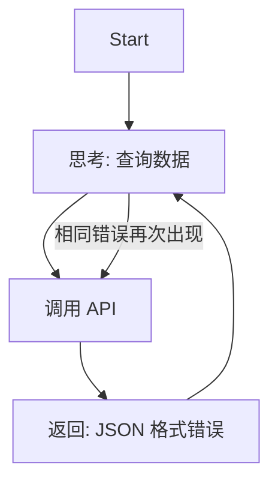

图 9-17：死循环故障模式

根因并不复杂：工具返回了格式错误，但系统没有把它标记成“不可恢复错误”。主智能体把它误解为“尚未完成”，于是继续重复同一动作。

**运行时修复策略**：

* **步数预算**：设置 `MAX_ITERATIONS`、`MAX_TOOL_CALLS`、`MAX_WALL_CLOCK_TIME` 三种硬限制，而不只是一种。
* **错误去重**：连续出现相同工具、相同参数、相同报错时，立即判定为循环。
* **成本熔断**：一旦单条链路成本超过预算阈值，自动终止并标记为 `budget_exceeded`。
* **策略降级**：从“自主重试”切换到“结构化错误返回”或“人工接管”。

```python
# 死循环检测与成本熔断

consecutive_same_errors = 0
last_signature = None
spent_usd = 0.0

for step in range(MAX_ITERATIONS):
    result = agent.execute(task)

    # 预算是整条链路的，必须累加；只看单步会让 10 步各 0.4 美元的链路永不熔断
    spent_usd += result.cost_usd
    if spent_usd > TASK_BUDGET_USD:
        return fail("budget_exceeded")

    signature = (result.tool_name, result.tool_args, result.error)

    if result.error:
        if signature == last_signature:
            consecutive_same_errors += 1
        else:
            consecutive_same_errors = 1
            last_signature = signature

        if consecutive_same_errors >= 3:
            return fallback_strategy(task)
    else:
        return result

return fail("max_iterations_exceeded")
```

### 6.4 案例二：上下文漂移与目标遗忘

> **类型**：认知故障

**事故描述**： 客服机器人在长对话后逐渐偏离“客服”角色，开始闲聊、编造政策，甚至暴露内部指令摘要。

**故障还原**：

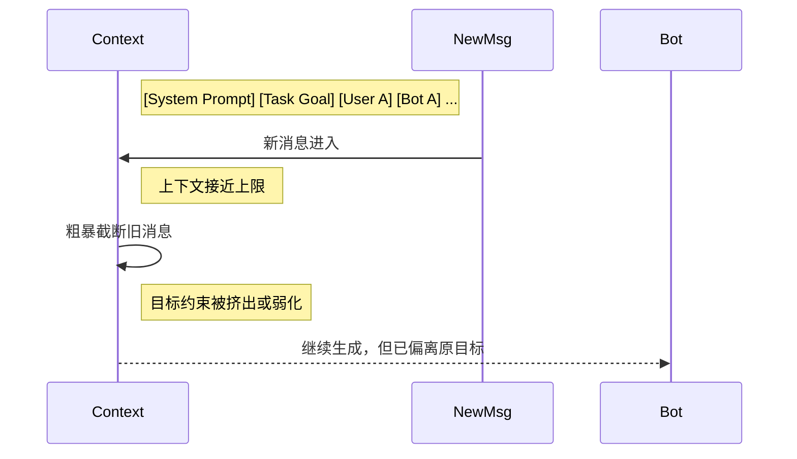

图 9-18：上下文遗忘与目标漂移

这类故障常被误判为“模型胡说八道”，但更常见的根因是上下文管理策略错误：系统提示、任务目标、已确认事实与用户历史被同等看待，导致关键约束被冲掉。

**运行时修复策略**：

* **系统提示与任务目标固定置顶**：不参与 FIFO 轮转。
* **状态分层**：把“系统约束、任务目标、事实摘要、最近对话”拆成不同槽位，而不是放进一条消息流。
* **记忆摘要而非硬截断**：上下文接近上限时，先压缩旧对话为结构化摘要。
* **目标心跳检查**：每经过若干步，让评审器检查“当前动作是否仍服务于初始目标”。

### 6.5 案例三：幻觉输出与错误执行

> **类型**：认知故障

**事故描述**： 运维辅助智能体在“清理无用文件”任务中，把关键配置目录误判为垃圾目录并执行删除。

这里最危险的不是“答错一道题”，而是**幻觉进入执行面**。一旦模型把未验证的判断当成事实，再配合写权限，事故就从内容错误升级为系统破坏。

#### 6.5.1 最新的幻觉检测与抑制方法

在 2026 年的生产实践中，仅靠“让模型更谨慎一些”已经不够。更可靠的做法通常是多层组合：

1. **证据绑定输出**：要求结论显式引用检索证据，而不是自由生成。
2. **Graph-RAG**：对实体、关系和来源做图结构约束，降低跨文档拼接时的事实漂移。
3. **实时信任评分**：综合检索覆盖率、来源一致性、工具成功率、校验器得分，计算 `trust_score`。
4. **多智能体交叉验证**：生成器、验证器、事实核查器彼此独立，避免单点幻觉直接落地。
5. **不确定时拒答或升级**：当证据不足、冲突过高或置信度过低时，优先返回“不足以执行”。

#### 6.5.2 一个可执行的信任评分思路

把上述信号加权合成一个 0\~1 的信任分，就可以据此决定是直接返回，还是转人工复核。

```python
def compute_trust_score(result) -> float:
    evidence_coverage = result.supported_claims / max(result.total_claims, 1)
    source_agreement = result.consistent_sources / max(result.total_sources, 1)
    tool_success = 1.0 if result.tool_errors == 0 else 0.5
    verifier_score = result.verifier_score  # 0~1

    return (
        0.35 * evidence_coverage +
        0.25 * source_agreement +
        0.15 * tool_success +
        0.25 * verifier_score
    )


trust_score = compute_trust_score(result)
if trust_score < 0.7:
    return escalate_to_human(result)
```

**运行时修复策略**：

* **默认只读**：高风险工具默认不可写。
* **高风险动作双重确认**：`rm`、`drop`、`delete`、`transfer`、`publish` 等动作必须经过 HITL。
* **先校验后执行**：把“生成计划”和“真正执行”拆成两个阶段。
* **执行后验证**：不仅校验输出文本，也校验环境状态是否符合预期。

### 6.6 案例四：多智能体级联故障

> **类型**：级联故障

**事故描述**： 一个数据分析流水线由数据采集智能体、分析智能体、报告智能体组成。采集智能体因 API 超时返回了不完整数据，但未显式标记异常；后续两个智能体都把不完整结果视为事实，最终生成并发送错误报告。

这类事故说明，多智能体系统的核心风险不是“每个 Agent 单独出错”，而是**错误被包装成结构化结果后更容易被信任**。

**运行时修复策略**：

* **输出必须带元数据**：如 `completeness`、`confidence`、`source_count`、`requires_review`。
* **下游设置前置断言**：不满足条件时拒绝继续，而不是“勉强生成”。
* **链路级熔断**：上游异常时暂停整条流水线。
* **检查点与可恢复重放**：允许从最近的稳定节点重跑，而不是全链路重试。

### 6.7 韧性设计清单

如果只保留一页运行手册，建议至少覆盖下面这些机制：

| 机制        | 作用           | 建议做法                   |
| --------- | ------------ | ---------------------- |
| **预算限制**  | 防止成本与时长失控    | 限制步数、时间、工具调用次数、单请求预算   |
| **结构化错误** | 避免模型误解异常     | 工具层返回标准错误码与可读错误信息      |
| **幂等与补偿** | 避免重复写入和半成功状态 | 写操作带幂等键，失败后有补偿事务       |
| **熔断与降级** | 快速止血         | 失败率超阈值时切换只读模式或规则模式     |
| **检查点**   | 提升恢复效率       | 关键状态可快照，可从中间节点恢复       |
| **人工接管**  | 防止高风险误操作     | 低信任分数或高风险动作自动升级        |
| **回放能力**  | 支持复盘与再现      | 保留 trace、输入输出、工具结果和版本号 |

### 6.8 事故响应与复盘

当事故已经发生时，目标不是“解释为什么模型这么笨”，而是把事故转化为新的工程约束。一个可执行的 SOP 通常包括：

1. **熔断止损**：暂停写操作、限制预算、冻结异常版本。
2. **影响面评估**：确认受影响用户、数据范围、下游系统与时间窗口。
3. **恢复服务**：切换到降级路径、回滚版本或启用人工流程。
4. **根因归档**：记录首个异常点，而不是只记录最终症状。
5. **测试固化**：把事故样本沉淀为数据集、回归测试和告警规则。

```markdown
# 智能体事故复盘报告

## 1. 事故摘要

- 现象：成本在 15 分钟内增长 18 倍。
- 影响：订单查询链路失败率从 1.2% 升至 17.6%。
- 触发时间：2026-03-17 02:15 UTC

## 2. 首个异常点

- Trace ID: trace-abc-123
- Span: tool.search_orders
- 异常：上游返回 schema 变更，字段 `status_code` 缺失

## 3. 根因分析

- 为什么会循环重试？ -> 智能体把结构化错误当成"可重试的未完成状态"
- 为什么没有被熔断？ -> 单请求没有预算上限
- 为什么没有提前发现？ -> 未对"重复相同工具 + 相同参数"建立告警

## 4. 改进措施

- [ ] [P0] 增加单请求成本预算与步数预算
- [ ] [P0] 工具错误统一返回标准错误码
- [ ] [P1] 新增循环检测规则与告警
- [ ] [P1] 将该事故样本加入回归评测集
```

本节的关键结论是：**运行时韧性不是某一个 Prompt 技巧，而是一组强制性的系统护栏**。下一节将进一步讨论，如果在架构设计阶段就做错了决策，会如何把这些运行时故障系统性地放大。

## 7. 架构陷阱与反模式

如果说上一节讨论的是“系统跑起来之后怎么出故障”，那么本节讨论的是**系统为什么会从一开始就朝着容易出故障的方向被设计出来**。反模式不是某次偶发事故，而是那些在设计阶段看起来省事、上线后却持续放大成本、延迟、风险与复杂度的决策。

一个实用的区分方法是：

* **9.6 故障模式**：运行时如何诊断、止血、恢复。
* **9.7 反模式**（本节）：设计阶段哪些决策会系统性制造更多运行时事故。

### 7.1 反模式一：万能 Prompt——一个大上下文解决一切

许多早期智能体实现采用“一个大 Prompt 解决一切”的思路：

```python
# ❌ 反模式

def execute_complex_task(user_request):
    prompt = f"""
    你有以下全部工具：
    {serialize_all_100_tools()}

    所有系统规则如下：
    {all_system_rules}

    用户历史：
    {full_user_history}

    请完成任务：{user_request}
    """

    return model.generate(prompt)
```

这种方案的问题不是“它绝对不能工作”，而是**一旦任务复杂度稍微上升，系统会进入不可控区间**：

1. **工具选择噪声过高**：模型必须在大量无关工具中做选择。
2. **推理链条混乱**：角色、约束、业务规则混杂在一起，注意力分散。
3. **成本线性放大**：每次调用都在重复发送大体量上下文。
4. **调试几乎无从下手**：出了问题，你不知道是路由错、上下文错，还是工具定义错。

#### 7.1.1 反模式案例

一个客服系统把退款、换货、投诉、物流、会员、营销等能力全部交给同一个 Agent。结果一个“退货请求”需要加载所有工具和全部历史，原本 3 步能完成的任务变成 20 多步，平均成本上涨近一个数量级。

#### 7.1.2 最佳实践：分层路由与职责隔离

对应的改法是先用一个轻量模型分流，再把请求交给各自领域的专家子系统。

```python
# ✅ 推荐方案：分类 + 专家子系统

class StratifiedAgent:
    def __init__(self):
        self.classifier = LLM(model="lightweight")
        self.specialists = {
            "refund": RefundAgent(),
            "replacement": ReplacementAgent(),
            "complaint": ComplaintAgent(),
        }

    def execute(self, request: str):
        task_type = self.classifier.classify(request)
        specialist = self.specialists[task_type]
        return specialist.solve(request)
```

**关键原则**：

* 用“分类-分发”代替“万能大脑”。
* 每个专家 Agent 只携带完成当前任务必需的工具和上下文。
* 让失败边界清晰可见，便于追踪和回放。

### 7.2 反模式二：把长上下文当作记忆系统

#### 7.2.1 陷阱描述

长上下文模型并不等于“可以把所有历史都丢进去”。常见错误做法如下：

```python
# ❌ 反模式：长上下文滥用

def chat_with_memory(user_message):
    history = load_all_messages(user_id, days=365)
    kb = load_entire_knowledge_base()
    docs = retrieve_all_related_documents(user_message)

    prompt = f"""
    用户历史：{history}
    知识库：{kb}
    文档：{docs}
    当前问题：{user_message}
    """

    return model.generate(prompt)
```

问题在于：

1. **检索精度下降**：相关信息被大量噪声淹没。
2. **注意力偏差更明显**：模型更容易高估首尾信息、忽略中间关键事实。
3. **成本与延迟同步膨胀**：上下文越大，输入成本与 Prefill 延迟越高。
4. **错误更隐蔽**：系统表面上“什么都带上了”，实际上没有真正管理记忆。

#### 7.2.2 最佳实践：预算化上下文与分层记忆

* **短期工作记忆**：最近 5 到 20 条交互。
* **任务状态记忆**：结构化目标、已确认事实、待办步骤。
* **长期知识记忆**：通过检索按需加载，而不是常驻上下文。
* **摘要快照**：对旧对话做压缩摘要，而不是保留完整日志。

换句话说，长上下文应被视为一种**带预算的资源**，而不是懒惰的默认方案。

### 7.3 反模式三：在没有证明单体不够之前，过早引入多智能体

多智能体系统不是“更高级的默认选项”，它只是某些场景下更合适的架构。很多团队在单体智能体还没有建立可靠基线时，就急于引入 5 到 10 个角色：

```python
# ❌ 反模式：未经验证就多智能体化

def solve_complex_task(task):
    agents = [
        ResearchAgent(),
        WritingAgent(),
        EditingAgent(),
        FactCheckingAgent(),
        FormattingAgent(),
    ]

    results = [agent.run(task) for agent in agents]
    return aggregate_results(results)
```

这种做法的代价通常被低估了：

1. **通信成本**：每增加一个 Agent，就增加消息传递、状态同步和额外推理开销。
2. **延迟开销**：哪怕每个子任务很快，协调与等待也会叠加。
3. **故障放大**：一个错误输出会被后续多个 Agent 重复相信。
4. **状态一致性问题**：不同 Agent 持有不同版本的事实和目标。

#### 7.3.1 多智能体通信成本的简单估算

在系统设计阶段，应显式把 Agent 间通信成本纳入 TCO：

```
总成本 ≈ 主任务推理成本
      + Σ(Agent 间消息 token × 模型单价)
      + 协调器额外推理次数
      + 重试与验证开销
```

如果一条链路需要 4 个 Agent，每个 Agent 之间都要交换 2 轮上下文摘要，那么真正烧钱的往往不是最终答案，而是中间协调消息。

#### 7.3.2 最佳实践：渐进式扩展

* 先证明单体 Agent 的基线质量、成本和延迟。
* 当任务天然可并行、需要明确角色隔离或需要失败隔离时，再引入多智能体。
* 先从“单体 + 工具”升级到“管道 + 检查点”，最后才是“协调者 + 多专家”。

### 7.4 反模式四：没有评估体系就开始优化，甚至直接上线

#### 7.4.1 陷阱描述

这是 2026 年最常见、也最昂贵的错误之一。团队往往会说：

* “我们看了十几个 Demo，感觉效果不错。”
* “Prompt A 比 Prompt B 看起来更聪明。”
* “用户好像没有明显投诉，先上线再说。”

问题在于，没有评估体系，你根本不知道自己在优化什么，更不知道某次改动是修复了问题还是制造了新的回归。

#### 7.4.2 反模式案例

一个内部知识问答 Agent 在演示环境里表现优秀，于是团队直接接入生产文档库。上线两周后才发现：

* 回答更长了，但事实性错误也变多了。
* 新 Prompt 提升了“写作流畅度”，却降低了工具调用成功率。
* 某次模型切换让成本下降了 30%，但完成任务的成功率也下降了 12%。

之所以迟迟没有发现，是因为系统只记录了用户点赞率，没有记录轨迹质量、证据覆盖率和任务完成率。

#### 7.4.3 最佳实践：评估先行

至少建立四层评估：

1. **Outcome Eval**：最终答案是否正确、任务是否完成。
2. **Trajectory Eval**：中间步骤是否合理，是否有多余调用、错误路由或违规动作。
3. **Golden Dataset**：沉淀一组代表性任务，覆盖核心路径与高风险边界。
4. **CI/CD 回归评测**：每次 Prompt、模型、工具或编排逻辑变更后自动回归。

对于开放式任务，可以进一步加入：

* **LLM-as-a-Judge**：自动审阅输出质量，但必须做抽样人工校准。
* **Pairwise Eval**：对比版本 A/B，而不是只看单个版本绝对分数。
* **线上审计样本**：从生产 trace 中回流坏例子，持续扩展黄金集。

### 7.5 反模式五：在没有安全边界时开放写权限

#### 7.5.1 陷阱描述

另一类高危决策是：系统还没有建立护栏、权限边界与审计能力，就给智能体开放数据库写入、文件删除、工单提交、消息发送等执行权限。

这种架构往往有一个危险假设：**“只要 Prompt 写得够清楚，模型就不会乱来。”**

这是错误的。运行时出现幻觉、提示词注入、工具误调用、上下文漂移时，最终承担后果的是权限系统，而不是 Prompt 本身。

#### 7.5.2 最佳实践：先建护栏，再给动作能力

设计阶段至少要有以下约束：

* **最小权限**：默认只读。
* **动作分级**：读、写、破坏性动作、对外发送分开建模。
* **护栏分层**：输入过滤、策略引擎、Schema 校验、执行网关、审计日志。
* **人工确认**：高风险动作强制 HITL。
* **沙箱与代理**：真实密钥、真实写权限、真实网络出口不直接暴露给模型。

如果这些能力还没建好，正确做法不是“先把功能做完”，而是先把系统限制在安全的只读模式。

### 7.6 反模式六：只看模型单价，不看总拥有成本

#### 7.6.1 陷阱描述

很多团队讨论成本时，只盯着“这个模型每百万 Token 多少钱”，却忽略了更大的成本项：

* 失败重试
* 人工兜底
* 监控与日志
* 向量库与缓存
* 多智能体协调
* 事故恢复与支持成本

这会带来两种常见误判：

1. **假节省**：换了更便宜的模型，单次调用成本下降，但错误率上升，人工复核成本更高。
2. **假优化**：为了省日志与评测费用，减少追踪和标注，结果故障定位更慢，停机损失更大。

#### 7.6.2 最佳实践：用 TCO 做架构决策

把成本模型写进设计文档，而不是事后对账：

```
TCO = 推理成本
    + 基础设施成本
    + 监控与评估成本
    + 人工干预成本
    + 事故与回滚成本
```

对生产系统而言，真正应该优化的是**单位业务价值成本**，而不是表面上的“单次 API 单价”。

### 7.7 反模式七：忽视暗码（Dark Code）——运行时行为的不可审计性

#### 7.7.1 陷阱描述

前面六个反模式都假设了一个前提：**出了问题，至少可以回头看代码找原因**。但智能体系统存在一种更根本的困境——Agent 的执行路径不是预先编写的代码，而是 LLM 在运行时动态生成的行为序列。这些行为“跑完即逝”，无法像传统代码一样被事先审查或精确复现。

这种“即生即灭”的运行时行为，被称为**暗码（Dark Code）**。

如果说传统软件像建筑图纸——提前画好、可反复检查，那么 Agent 的运行时行为更像爵士乐即兴演奏——每次都不同、无法提前审批、只有录音才能事后回顾。

```python
# ❌ 反模式：假设 Agent 行为可以通过审查 Prompt 来保证

def deploy_agent(task):
    # "Prompt 写得够清楚，不会出问题"
    response = model.generate(carefully_written_prompt + task)
    execute_actions(response)  # 直接执行，没有行为记录
```

问题在于：

1. **不可复现**：同样的 Prompt，不同时间运行可能产生完全不同的工具调用序列。
2. **不可审查**：出了问题，你只有最终输出，没有中间决策过程的完整记录。
3. **权限失配**：Agent 每次运行需要的权限组合都不同，静态分配要么过宽要么过窄。
4. **责任模糊**：数据泄露后，无法确定是 Prompt 的错、模型的错、工具的错还是编排的错。

#### 7.7.2 最佳实践：让暗码“可见”

对应的改法是让每一步都留下痕迹：先声明意图，再申请临时权限，全过程进入同一条追踪链。

```python
# ✅ 推荐方案：全链路追踪 + 意图声明 + 临时权限

class ObservableAgent:
    def execute(self, task: str):
        trace = Trace.start(task)

        for step in self.plan(task):
            # 1. 记录意图声明
            intent = step.declare_intent()
            trace.log_intent(intent)

            # 2. 动态申请最小权限
            with temporary_permission(step.required_scope) as perm:
                # 3. 在沙箱中执行，记录全部输入输出
                result = trace.span(step.name)(
                    lambda: step.execute(perm)
                )

            # 4. 验证结果是否符合预期
            trace.log_result(result)

        trace.finalize()
        return trace.summary()
```

**核心原则**：

* **全链路追踪**是底线，不是可选项。没有 Trace 的 Agent 等于黑盒执行。
* **权限应跟随行为**，而不是预先分配给角色。每个工具调用前申请、调用后回收。
* **意图声明**为审计提供“行为签名”——Agent 在执行关键操作前必须输出结构化的意图，作为事后追责的依据。
* 传统安全审查“代码”，Agent 安全必须审查“行为”。

### 7.8 反模式总结：设计阶段的七个必答问题

在进入实现之前，团队至少应该回答下面七个问题：

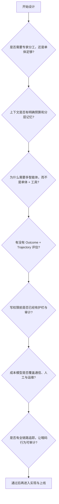

图 9-19：架构设计前的七个检查点

如果这些问题没有明确答案，继续堆 Prompt、加 Agent、扩上下文，通常只会让问题更难排查。

## 8. 从实验到生产：决策路线图与检查清单

在 AI 开发中，最常见的陷阱不是技术本身，而是在错误的时机做出错误的决策。一个在实验室中表现完美的智能体可能在生产环境中崩溃，而一个“看起来简单”的规则引擎反而能稳定运行三年。

本节提供一份清晰的决策路线图，帮助团队在实验、原型和生产三个阶段之间做出正确的抽象和工程决策。


图 9-20：实验-原型-生产三阶段流程

### 8.1 实验阶段：快速验证想法的可行性

**定义**：

* **目标**：快速迭代，验证“这个想法是否可行”
* **用户**：内部团队
* **规模**：<=100 个测试用例
* **质量标准**：概念证明，70% 的成功率可以接受
* **时间框架**：1-2 周

**特点**：

* 代码不需要整洁（只要能运行）
* 可以硬编码参数和阈值
* 错误日志与可观测性不是优先级
* 可以使用任意技术栈
* 目标是快速反馈

**典型问题与答案**：

```
Q: 是否应该写单元测试？
A: 不需要。用手工测试验证想法更快。

Q: 是否应该处理错误情况？
A: 最小化处理。只处理会导致任务完全失败的错误。

Q: 是否需要监控成本？
A: 不需要。重点是验证可行性。

Q: 数据来源应该是真实数据吗？
A: 可以用样本或合成数据。速度更重要。
```

**实验阶段的脚本示例**：

```python
# ❌ 这样可以，虽然很丑陋

def simple_agent_experiment(user_query):
    # 硬编码的配置
    MODEL = "gpt-4"
    TOOLS = ["search", "calculator"]

    # 直接调用，不考虑错误处理
    result = llm.generate(f"""
    User query: {user_query}
    Available tools: {TOOLS}
    Please solve this step by step.
    """)

    return result

# 快速测试

print(simple_agent_experiment("What is 2+2?"))
```

### 8.2 原型阶段：验证架构的有效性

**定义**：

* **目标**：验证“我们选择的架构能否扩展到生产”
* **用户**：内部团队 + 早期用户/测试用户
* **规模**：100-10,000 个测试用例
* **质量标准**：85% 的成功率
* **时间框架**：2-4 周

**特点**：

* 代码结构开始重要（便于后续扩展）
* 开始考虑错误处理和日志
* 建立评估框架
* 开始区分 **Outcome Eval**（结果是否完成任务）与 **Trajectory Eval**（过程是否合理）
* 建立首版 **Golden Dataset**，把主路径、长尾样本和已知坏例子沉淀下来
* 准备把评估接入 CI/CD，而不是只靠人工体验
* 不同模块可以被替换
* 准备做 A/B 测试

**原型阶段的决策清单**：

```
[ ] 是否定义了清晰的模块化结构？
[ ] 错误处理覆盖了主要失败场景吗？
[ ] 是否有基础的日志和可观测性？
[ ] 是否定义了 Outcome Eval 与 Trajectory Eval？
[ ] 是否建立了 Golden Dataset，并覆盖核心坏例子？
[ ] Prompt/模型变更后，是否能自动回归评测？
[ ] 成本在可控范围内吗（<$100/天）？
[ ] 是否可以轻松替换模型或工具？
[ ] 是否有自动化测试？
[ ] 是否定义了生产的关键指标？
[ ] 团队是否都理解了设计决策？
```

**原型阶段的代码示例**：

```python
class AgentPrototype:
    """原型版本：更结构化，但仍然简化"""

    def __init__(self, model_name="gpt-4"):
        self.model = LLMFactory.create(model_name)
        self.tools = ToolRegistry()
        self.logger = logging.getLogger(__name__)

    def run(self, task: str) -> dict:
        """执行任务，带基础错误处理"""
        try:
            self.logger.info(f"Starting task: {task}")

            # 结构化执行
            history = []  # 观察必须回灌，否则每一步的输入完全相同、永远不收敛
            for step in range(10):  # 最多10步
                thought, action = self._generate_next_action(task, step, history)

                if action.type == "finish":
                    self.logger.info(f"Task completed: {action.result}")
                    return {"success": True, "result": action.result}

                try:
                    observation = self.tools.execute(action)
                except ToolError as e:
                    self.logger.warning(f"Tool error on step {step}: {e}")
                    # 工具失败，让Agent知道并重试
                    observation = f"Error: {e}"

                history.append({"thought": thought, "action": action,
                                "observation": observation})

            # 超过最大步数
            self.logger.error("Max steps exceeded")
            return {"success": False, "error": "max_steps"}

        except Exception as e:
            self.logger.error(f"Unexpected error: {e}", exc_info=True)
            return {"success": False, "error": str(e)}

    def _generate_next_action(self, task: str, step: int):
        """生成下一步操作"""
        # 实现细节
        pass
```

### 8.3 生产阶段：保证稳定性与可维护性

**定义**：

* **目标**：稳定运行，满足 SLA，可维护性高
* **用户**：真实用户（数万到数百万）
* **规模**：任意规模
* **质量标准**：99.5% 可用性，<2% 错误率
* **时间框架**：持续运营

**特点**：

* 完整的错误处理与降级策略
* 详细的可观测性（日志、指标、追踪）
* 自动化评估门禁（上线前必须通过 Golden Dataset 回归）
* 同时监控结果质量与轨迹质量，而不是只看用户点赞
* 自动化测试覆盖率 >80%
* 明确的运维手册和应急预案
* 成本预算与监控
* 安全与权限管理
* 多层安全护栏：输入检测、PII 处理、越狱/注入防护、执行网关、审计日志
* 明确的合规控制：数据保留、用户删除、审计可追溯、区域与供应商约束
* 版本管理与灰度部署

详细的生产部署检查清单见 9.8.7 节。

### 8.4 阶段转移的触发条件

### 从实验到原型：何时进行

**绿灯信号**（应该进入原型）：

* 在 20 个不同的测试用例上，成功率稳定 >70%
* 团队对解决方案的架构有共识
* 成本在预期范围内
* 有明确的“为什么这个方法可行”的理由

**红灯信号**（继续实验）：

* 成功率波动剧烈（差异 >30%）
* 团队对架构有分歧
* 已尝试多个方向但都效果不佳
* 成本远超预期

### 从原型到生产：何时进行

**绿灯信号**（可以上生产）：

```
成功率 > 85%（在有代表性的测试集上）
AND
自动化测试通过率 > 80%
AND
Outcome Eval 与 Trajectory Eval 均达到预设阈值
AND
平均成本/请求 < 预算的 50%
AND
平均延迟 < SLA 的 80%
AND
团队对运维有信心（至少进行过一次压力测试）
AND
已有清晰的降级与应急方案
AND
关键安全护栏已经实装并做过红队或对抗测试
```

**黄灯信号**（有条件地上生产）：

```
成功率 > 80% 但 < 85%
→ 可以上生产，但需要：
   1. 灰度部署（先给5%用户）
   2. 24/7 监控
   3. 快速回滚计划

OR

成本/请求接近预算
→ 可以上生产，但需要：
   1. 实时成本预警
   2. 自动降级策略
   3. 定期成本优化
```

**红灯信号**（不应该上生产）：

* 成功率 < 80%
* 错误类型复杂且难以诊断
* 没有有效的降级方案
* 团队对运维没有把握
* 没有明确的 SLA 承诺

### 8.5 成本-延迟-可靠性三角权衡

在不同阶段，这三个指标的优先级不同：

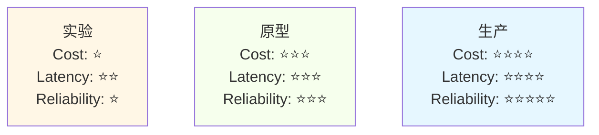

图 9-21：成本-延迟-可靠性三阶段权衡

| 维度   | 实验阶段           | 原型阶段            | 生产阶段            |
| ---- | -------------- | --------------- | --------------- |
| 模型   | 最强模型（不计成本）     | 主模型 + 降级备选      | 主模型 + 降级 + 规则兜底 |
| 重试   | 100 次（尽情试）     | 5 次             | 受 SLA 约束        |
| 超时   | 60s            | 10s             | P99 < 2s        |
| 错误处理 | 最小化            | 全面              | 全面 + 熔断 + 自动回滚  |
| 成本预期 | $10-100/天（不在乎） | $100-1000/天（监控） | 严格预算，80% 告警     |
| 可靠性  | 70%            | 85%             | 99.5% SLA       |

### 8.6 何时选择简单规则 vs 智能体

这是最常被忽视的决策，但也是最重要的。

```mermaid
graph TD
    Task["任务到来"]

    Task --> Q1{"任务足够简单吗?<br/>规则<5条?"}

    Q1 -->|是| Rules["✅ 使用规则系统<br/>100%可靠<br/>0成本<br/>毫秒延迟"]

    Q1 -->|否| Q2{"有明确的SLA吗?<br/>并且愿意为<br/>偶尔失败付费?"}

    Q2 -->|否| Rules

    Q2 -->|是| Q3{"任务足够通用吗?<br/>会不断变化吗?"}

    Q3 -->|否| Rules

    Q3 -->|是| Agent["✅ 使用智能体<br/>灵活<br/>但需成本预算<br/>延迟>1秒"]

    style Rules fill:#f6ffed,stroke:#52c41a,stroke-width:2px
    style Agent fill:#e6f7ff,stroke:#1890ff,stroke-width:2px
```

图 9-22：规则系统与智能体决策树

**案例一：订单分类**

```
任务：根据订单类型（退货/换货/投诉）进行分类

规则方案：
if "退货" in message or "return" in message:
    category = "return"
elif "换货" in message or "exchange" in message:
    category = "exchange"
...
→ 准确率：95%，成本：$0，延迟：1ms

智能体方案：
使用LLM分类
→ 准确率：98%，成本：$0.01/次，延迟：2s

推荐：规则方案。5%的差异不值得付代价。
```

**案例二：复杂查询应答**

```
任务：用户问一个关于公司政策的复杂问题
"如果我在第一年就升职了，是否仍然可以享受离职补偿?"

规则方案：
维护1000条规则，维护成本极高
→ 准确率：50%（很多问题覆盖不了）

智能体方案：
使用RAG + LLM从文档中检索并回答
→ 准确率：90%，成本：$0.05/次，延迟：5s

推荐：智能体方案。规则无法覆盖。
```

### 8.7 生产部署检查清单

在部署到生产前，确保以下清单全部完成：

```markdown
### 生产部署清单

### 功能完整性

- [ ] 核心功能实现完毕
- [ ] 所有主要用例都有测试
- [ ] A/B测试已完成，有明确的赢家
- [ ] 文档已更新

### 性能与成本

- [ ] 延迟P95 < SLA限制
- [ ] 成本/请求 < 预算
- [ ] 缓存策略已实施
- [ ] 成本监控告警已配置

### 可靠性

- [ ] 故障处理覆盖所有主要错误
- [ ] 降级策略已实现并测试
- [ ] 自动重试逻辑已验证
- [ ] 熔断机制已配置

### 可观测性

- [ ] 关键路径的日志已添加
- [ ] 错误追踪已配置（Sentry/ELK等）
- [ ] 性能指标已收集
- [ ] 仪表板已创建

### 评估门禁

- [ ] Golden Dataset 已建立并持续维护
- [ ] Outcome Eval 达到上线阈值
- [ ] Trajectory Eval 达到上线阈值
- [ ] 历史事故样本已加入回归集
- [ ] Prompt/模型/工具变更会自动触发评测
- [ ] LLM-as-a-Judge 已做人工抽检校准

### 安全性

- [ ] 敏感数据加密
- [ ] 权限管理已实施
- [ ] API速率限制已配置
- [ ] PII 检测与脱敏已配置
- [ ] 提示词注入/越狱检测已配置
- [ ] 高风险动作具备人工确认或执行网关
- [ ] 安全审计已通过

### 合规与治理

- [ ] 数据保留与删除策略已定义
- [ ] 审计日志可追溯到用户、版本、trace
- [ ] 模型供应商与数据流向已完成登记
- [ ] 适用的 GDPR/EU AI Act/行业监管要求已完成评估
- [ ] 法务、隐私和安全团队已完成上线评审

### 运维准备

- [ ] 运维手册已编写
- [ ] 常见问题与解决方案已文档化
- [ ] 应急流程已定义
- [ ] On-call安排已确认

### 用户准备

- [ ] 用户文档已准备
- [ ] FAQ已更新
- [ ] 支持团队已培训
- [ ] 反馈渠道已开通

### 部署策略

- [ ] 部署步骤已规划
- [ ] 回滚流程已测试
- [ ] 灰度部署时间表已制定
- [ ] 成功指标已定义
```

### 8.8 关键决策点的重新审视机制

部署到生产后，需要定期重新审视关键决策。

| 时间节点  | 关注重点 | 关键动作                        |
| ----- | ---- | --------------------------- |
| 第 1 周 | 应急观察 | 成功率 <85% 立即回滚；用户投诉 >10 立即排查 |
| 第 1 月 | 优化调整 | 评估是否降级为混合方案；错误率 >5% 考虑更强模型  |
| 每季度   | 战略审视 | 对标行业最佳实践；决定是否继续维护           |

### 8.9 小结：路线图速查表

| 阶段     | 主要目标 | 成功标准     | 典型时间  | 关键决策       |
| ------ | ---- | -------- | ----- | ---------- |
| **实验** | 验证想法 | >70% 成功率 | 1-2 周 | 该想法值得继续吗？  |
| **原型** | 验证架构 | >85% 成功率 | 2-4 周 | 架构能扩展到生产吗？ |
| **生产** | 稳定运营 | >99% 可用性 | 持续    | 是否需要优化？    |

**永远记得**：

* 🔴 不要跳过原型阶段直接上生产
* 🟡 不要因为“技术上可行”就做不必要的复杂化
* 🟢 最简单的解决方案往往是最好的

### 8.10 框架选型与互操作检查清单

框架选型的详细指南见第 8 章。在此仅强调互操作性要点：工具定义统一为 MCP 格式、Agent 间通信标准化、日志格式统一、全链路追踪覆盖。确保每个框架选型都经过第 8 章的完整评估后再做决策。

### 8.11 长期运行智能体的有效设计模式

在跨越多个 context window 的复杂、长时间运行任务中，Agent 需要克服一个关键挑战：**如何在持续的多轮迭代中保持生产力、防止过早宣布完成，并确保增量工作具有可合并性**。本节基于 Anthropic 工程博客的研究总结了这一关键模式。

#### 8.11.1 双层智能体架构

对于需要跨越多个 session 和 context window 完成的复杂任务（如大规模代码重构、知识系统构建等），推荐采用 **双层 Agent 架构**：

**第一层：Initializer Agent**

* 在项目首次运行时负责环境搭建和初始化
* 职责：
  * 创建标准的 `init.sh` 启动脚本，用于后续 session 快速恢复环境
  * 初始化 `claude-progress.txt` 进度文件，记录已完成的里程碑
  * 执行首个 git commit，确保版本控制从一个清晰的基线开始
  * 建立项目的目录结构和配置文件
  * 编写或收集初始文档

**第二层：Coding Agent**

* 在每个后续 session 中负责增量工作和迭代开发
* 职责：
  * 通过执行 `init.sh` 快速恢复上个 session 的环境
  * 读取 `claude-progress.txt` 了解历史进度和已知的设计决策
  * 在前人工作的基础上做增量改进
  * 确保每一段代码都是可以正确合并的（mergeable）
  * 主动运行测试验证，保持向前的动力

这种设计的核心优势是：**打破了单个 session 的限制，让多轮 Agent 工作可以有机地累积而不是相互覆盖**。Initializer Agent 需要编写 `init.sh` 启动脚本（用于后续恢复环境）、初始化 `claude-progress.txt` 进度文件、执行首个 git commit，从而为后续 Coding Agent 奠定基础。

#### 8.11.2 结构化功能清单：防止过早宣布完成

长期运行的 Agent 最常见的问题是 **对“完成”的定义过于乐观**。一个 Agent 在改进了几个功能后就宣布项目完毕，但实际上有数十个边界情况和细节需要处理。

**解决方案：使用 JSON 格式的结构化功能清单**

与其依赖 Markdown 来追踪功能状态（容易被 Agent 随意修改），不如使用 JSON 格式的功能清单。模型对 JSON 结构有更强的“敬畏感”，不容易随意删除或编辑测试条目。

```json
{
  "features": [
    {"id": "func_001", "description": "用户可以打开新对话并看到 AI 回复", "passes": false, "priority": "critical"},
    {"id": "func_002", "description": "Agent 可以调用自定义工具", "passes": false, "priority": "critical"},
    {"id": "edge_001", "description": "工具超时时正确处理", "passes": false, "priority": "high"}
  ]
}
```

**为什么用 JSON？**

1. **结构强制**：JSON 的格式严格，Agent 不能随意添加/删除字段
2. **可编程验证**：可以写脚本检查是否有新增功能未标记为 `"passes": false`
3. **防止幻觉**：Markdown 清单很容易让 Agent 编造已完成的功能；JSON 的严格性能降低这种风险
4. **易于统计**：自动计算完成率、按分类统计、识别高风险的未完成功能

**功能清单的使用规则**：

* Agent **只能修改** `"passes"` 字段（从 `false` 改为 `true`）
* Agent **不能删除** 或 **编辑** 任何测试条目
* 每次提交前，验证通过的功能数 ≤ 前一个 session 的数 + 新增合理数量
* 定期审视高优先级但未通过的功能，评估是否需要调整实现策略

#### 8.11.3 强制单功能增量开发

在每个 session 中，Agent 应该遵循严格的优先级并 **每次只处理一个功能**：

```bash
1. 执行 init.sh，恢复环境
2. 读取 feature-list.json，选择优先级最高的失败功能
3. 实现该功能并运行测试直到全部通过
4. 将结果更新到 feature-list.json，执行 git commit
5. 保存 claude-progress.txt 和状态文件
```

这种方法的好处：

* **可追踪性强**：每个 commit 对应一个已验证的功能
* **容易回滚**：如果发现某个功能有问题，可以轻松找到相关 commit 并回滚
* **防止功能蔓延**：限制每个 session 的范围，防止 Agent“跑题”
* **透明的进度**：通过 git 历史和功能清单，实时知道完成百分比

#### 8.11.4 Git Commit 状态追踪

每一步增量进展都应该用描述性的 commit message 记录在 git 中：

```bash
# 初始化 commit（由 Initializer Agent 创建）
git commit -m "Initial project setup: environment, structure, and baselines"

# 功能完成 commit（由 Coding Agent 创建，每次 session）
git commit -m "Feature func_001: Add user-facing conversation interface (e2e tested)"
git commit -m "Feature func_002: Implement tool call parsing and execution"
git commit -m "Edge case edge_001: Handle tool timeout gracefully"

# 优化 commit
git commit -m "Perf optimization: Cache tool responses to reduce latency"
```

通过 git 历史，下一个 session 的 Agent 可以：

1. 查看 `git log` 了解项目演进
2. 用 `git diff` 对比版本，检查哪些功能可能引入了新问题
3. 用 `git blame` 追踪特定功能的实现细节
4. 快速 rollback 到稳定版本

#### 8.11.5 浏览器自动化端到端测试

为了验证功能的真实可用性（不仅仅是单元测试通过），应该集成浏览器自动化框架进行 E2E 测试：使用 Playwright 或 Selenium 等浏览器自动化框架进行 E2E 测试，验证功能的真实可用性。

#### 8.11.6 Session 开头的恢复与基线测试

每个新 session 开始时，Agent 应该遵循标准的恢复流程：

1. **环境恢复**：执行 `init.sh` 脚本，安装依赖，验证环境就绪
2. **上下文读取**：读取 `claude-progress.txt` 理解历史决策，读取 `feature-list.json` 查看当前进度百分比
3. **基线测试**：运行关键单元测试确保前一个 session 的工作未被破坏

#### 8.11.7 实践检查清单

在采用长期 Agent 模式时，确保以下要点得到满足：

```markdown
### 长期 Agent 实施检查清单

#### 架构与初始化
- [ ] Initializer Agent 已创建 init.sh 和 claude-progress.txt
- [ ] 首个 git commit 包含完整的初始项目结构

#### 功能追踪
- [ ] feature-list.json 已创建，包含详细的功能描述
- [ ] 优先级标注正确，critical 功能明确

#### 开发流程
- [ ] 每个 session 只处理一个功能
- [ ] 定义了"通过"的明确标准（单元测试 + E2E 验证）
- [ ] 每个 commit 对应一个已验证的功能

#### 测试与验证
- [ ] E2E 测试覆盖了所有 critical 功能
- [ ] 基线测试脚本 <30 秒执行完毕
- [ ] CI/CD 流程配置完毕，每次 commit 自动运行测试

#### 文档与通信
- [ ] Git 历史是项目进展的"黄金记录"
- [ ] 月度审查机制已建立，评估进度和调整策略
```

#### 8.11.8 小结

长期运行 Agent 的成功取决于 **结构化设计与强制纪律**：

| 组件                    | 目的       | 关键实施点                      |
| --------------------- | -------- | -------------------------- |
| **Initializer Agent** | 一次性环境搭建  | init.sh、初始 git commit      |
| **Coding Agent**      | 增量迭代开发   | 单功能 per session，E2E 验证     |
| **功能清单**              | 防止过早完成宣言 | JSON 格式，200+ 条详细描述         |
| **Git 历史**            | 状态追踪与审计  | 每功能一个 commit，clear message |
| **E2E 测试**            | 真实可用性验证  | Playwright/浏览器自动化          |
| **Session 流程**        | 恢复与持续性   | 固定的启动序列和基线测试               |

这种模式已被证明能够有效支持跨越数十个 context window 的复杂工程任务，显著提高了多轮 AI 协作的生产力和可维护性。

> **参考**：Anthropic 工程博客 *Effective Harnesses for Long-Running Agents*（2025）

###  智能体自主度实证分析与监控

在企业部署 AI Agent 时，一个关键问题是：“Agent 应该有多少自主权，用户应该多频繁地介入？”这个问题不是纯粹的技术决策，而是涉及信任、风险、用户体验和业务价值的综合考量。本节基于 Anthropic 实证研究，阐述如何量化和监控 Agent 自主度。

#### 1 实证基准：真实世界的自主度演变

Anthropic 在 [Measuring AI agent autonomy in practice](https://www.anthropic.com/research/measuring-agent-autonomy) 中分析了数百万条人-Agent 交互日志，追踪了 Claude Code 和公开 API 用户的行为模式（2025 年 10 月至 2026 年 1 月）。

##### 1.1 关键指标：长尾单轮时长

**发现 1：长尾单轮执行时间显著增长**

* **99.9 百分位数单轮时长（turn duration）**：从不足 25 分钟增长到超过 45 分钟。注意这里的口径是**单轮**，不是整个任务：原文用的是 turn duration，并特意提醒它与 METR 那类「任务时长」不可直接比较——METR 测的是理想条件下模型*能*撑多久（无人干预、无真实后果），这里测的是实际发生了什么（Claude 会停下来征求反馈，用户也会中断）
* **演变轨迹**：在数月内平滑上升，而不是伴随每次模型发布出现尖锐跳变
* **解读**：这不仅反映了模型能力提升，也体现了用户对 Agent 的信任度提高和产品功能改进的综合效应

Anthropic 公开披露的重点是**长尾自主时长正在变长**，而不是给出一套可直接推广到所有任务的完整时长分布。因此，这里不再反推 P50 / P95 一类未在一手文章中明确给出的数值。

##### 1.2 用户批准行为的悖论转变

**发现 2：老用户的“双重行为”**

经验用户展现出看似矛盾的模式：

* **自动批准率上升**：新用户大约有五分之一的会话使用完全自动批准，经验用户则上升到四成以上
* **中断频率也上升**：用户更频繁地主动停止 Agent 进程

**深层含义**： 这不是矛盾，而是**策略升级**。原文给出的解释是：新用户倾向于在每个动作执行前逐一批准，因此很少需要中途打断；经验用户则更愿意放手让 Claude 自己跑，只在出岔子或需要改方向时才介入。

（原文只给了会话数与中断率这两类量，并未给出「几分钟该看一眼」的时间阈值；把节奏折算成具体分钟数需要结合自己的任务形态实测，不能照搬。）

这种行为模式表明，**有效的 Agent 治理不是“审批每一步”，而是“在关键节点做出战略决策”**。

#### 2 智能体自我校准与复杂度感知

##### 2.1 模型不确定性的信号

**发现 3：Claude 在复杂任务上自发寻求澄清**

Anthropic 在一手文章中的表述是：在**最复杂的任务上**，Claude Code 主动停下来请求澄清的次数，超过了人类主动中断它的次数两倍以上。

**关键洞察**：

* Agent 的不确定性识别机制在起作用
* 当任务复杂度超过阈值时，模型倾向于主动暂停而非盲目尝试
* 这是**积极信号**：表明模型有能力自我检测风险

**实施建议**：

1. **不要在 system prompt 中强制禁止澄清请求**——让模型有机会表达不确定性
2. **在可观测性系统中追踪澄清请求的频率和类型**——这是复杂度感知的健康信号
3. **分析澄清请求与最终结果的关系**——把它作为值得单独分析的运行时信号，而不是预设其必然带来更好结果

##### 2.2 复杂度分层与资源分配

根据任务复杂度，推荐不同的 Agent 治理策略：

| 复杂度等级  | 特征               | 建议的自主度 | 监控频率         | 模型策略                  |
| ------ | ---------------- | ------ | ------------ | --------------------- |
| **简单** | 单一工具、短链路、低外部影响   | 高      | 抽样检查         | 优先成本更低、执行稳定的模型        |
| **中等** | 多工具协调、需要阶段性验证    | 中      | 里程碑检查        | 选择速度与稳定性平衡的通用模型       |
| **高**  | 多轮推理、长运行、涉及多系统状态 | 低      | 持续监控 + 明确检查点 | 规划/评估可用更强推理模型，执行可与之分离 |
| **极高** | 跨域决策、强监管、不可逆后果   | 最小     | 实时监控         | 模型选择从属于治理设计，必须保留人类闭环  |

如果需要把模型写进配置，优先使用供应商文档里的稳定 snapshot 或 alias，而不是在治理策略中把某个短周期版本号写成长期推荐常量。

#### 3 领域分布与风险画像

##### 3.1 工具调用的领域构成

**发现 4：软件工程绝对主导，但高风险领域已开始出现**

**关键观察**：

* 软件工程约占 Anthropic 观察到的 agentic activity 的近一半，是目前最成熟的使用领域
* 医疗、金融、网络安全等高风险领域已经出现，但文章明确强调这类使用“尚未形成规模”

##### 3.2 可逆性与成本评估

**发现 5：大多数操作低风险且可逆，但高风险高自主簇并非不存在**

**风险控制的含义**：

* Anthropic 的高层结论是：其 public API 上的大多数 agent action 属于低风险、可逆操作
* 但在风险与自主度分布的高端，已经能观察到安全、金融、医疗等敏感任务簇，因此治理设计不能只围绕“主流低风险场景”
* 这些结论建立在 Anthropic 对工具调用级样本的聚类和估计上，更适合指导**监控与分级治理**，不应被误读为企业内部绝对风险账本

#### 4 政策建议：超越“审批一切”的治理模式

##### 4.1 反模式：规范性交互强制

**错误做法**：

```python
# ❌ 强制模式：每一步都需要人类批准

while not task_complete:
    action = agent.plan_next_action()
    approval = human.request_approval(action)  # 总是阻塞等待
    if not approval:
        break
    agent.execute(action)
```

**为什么不工作**：

1. **引入人为延迟**：长任务会被显著拉长，原本连续的探索过程被切碎
2. **疲劳驱动的批准**：用户倾向于无条件同意以加快进度
3. **失去 Agent 自主的价值**：若干次中断后，不如直接让用户操作
4. **审批流成为瓶颈**：关键决策点淹没在无关细节中

##### 4.2 正确做法：部署后监控与容量界定

**推荐策略**：

**1. 明确的能力边界**

```python
# ✅ 根据复杂度定义自主区间

class AgentAutonomyPolicy:
    def __init__(self):
        # 高自主度区：金额 <1000, 影响范围 <10 用户
        self.high_autonomy_threshold = {
            'financial_impact': 1000,
            'user_scope': 10,
            'data_size_mb': 100
        }

        # 需要批准的操作：金额 >10000, 或删除操作
        self.approval_required = {
            'financial_impact': 10000,
            'irreversible_delete': True,
            'system_config_change': True
        }
```

**2. 时间预算与重试次数限制**

```python
# ✅ 在系统 prompt 中注入明确的约束

system_constraints = """
你有以下约束来保护系统稳定性：
- 单个任务的最大时间预算：45 分钟（或 50 次工具调用）
- 如果超过 30 分钟仍未完成，主动请求用户确认是否继续
- 失败重试最多 3 次；第 4 次失败时停止并报告错误
- 对于不熟悉的工具，在首次使用前请求用户确认
"""
```

**3. 分层监控而非实时审批**

```
Layer 1（实时监控）：成本/风险异常检测
  └─ 单个操作成本 >100x 平均 → 立即告警
  └─ 检测到不可逆操作 → 日志记录 + 告警

Layer 2（定时检查点）：每 10-15 分钟
  └─ 检查整体进度是否合理
  └─ 验证是否偏离预期路径

Layer 3（人工审查）：任务完成后
  └─ 审计日志，检查是否有异常模式
  └─ 评估是否需要调整未来的自主度政策
```

##### 4.3 组织级政策框架

**基于成熟度的分阶段部署**：

| 阶段          | 组织特征              | 推荐策略                     |
| ----------- | ----------------- | ------------------------ |
| **Pilot**   | 小团队，高信任，低风险试点     | 在受控范围内给予较高自主度；重点先把可观测性做全 |
| **Scaling** | 团队扩展，用户增加，流程开始标准化 | 分层自主度；关键决策点保留批准          |
| **Mature**  | 企业级，数千用户，成熟的合规框架  | 动态自主度；基于风险评分的自适应治理       |

#### 5 监控与反馈循环

##### 5.1 关键性能指标

建议按以下维度定期监控（周度或月度）：

```
自主度健康看板
├─ 任务完成率
│  ├─ 按任务类型分层统计
│  ├─ 关注长尾失败
│  └─ 不把单一均值当成健康度
├─ 用户满意度
│  ├─ 无人工干预的成功任务比例
│  ├─ 平均任务完成时间
│  └─ Agent 暂停/澄清率
├─ 安全指标
│  ├─ 不可逆操作的发生频率
│  ├─ 成本超支占比
│  └─ 异常操作序列检测率
└─ 成本效率
   ├─ 人工干预成本（节省的人力时间）
   ├─ Agent 执行成本（API 调用）
   └─ 总体 ROI
```

##### 5.2 自适应调整机制

有了这些指标，自主度就不必靠人拍板，而可以按实际表现自动升降。

```python
# ✅ 基于历史数据的自主度自适应

def update_autonomy_policy(performance_metrics):
    completion_rate = performance_metrics["completion_rate"]
    human_interruptions = performance_metrics["human_interruptions"]
    cost_variance = performance_metrics["cost_variance"]
    cost_overruns = performance_metrics["cost_overruns"]

    if (completion_rate > 0.95 and
        human_interruptions < 0.05 and
        cost_variance < 0.10):
        # 提高自主度
        performance_metrics["autonomy_level"] = min(
            performance_metrics["autonomy_level"] + 0.1,
            1.0
        )
        performance_metrics["approval_threshold"] *= 1.2

    elif (completion_rate < 0.70 or
          cost_overruns > 0.20):
        # 降低自主度，进行人工审计
        performance_metrics["autonomy_level"] = max(
            performance_metrics["autonomy_level"] - 0.2,
            0.0
        )
        performance_metrics["approval_threshold"] *= 0.8
        trigger_audit()

    return performance_metrics
```

#### 6 小结与决策矩阵

| 问题                | 数据支撑                               | 推荐做法                     |
| ----------------- | ---------------------------------- | ------------------------ |
| **Agent 能否完全自主？** | 最长尾的自主运行时长已从不足 25 分钟增长到超过 45 分钟    | 根据场景定义能力边界，不强制每步审批       |
| **多频繁要检查一次？**     | 经验用户更常自动批准，但也更常在必要时中断              | 分层监控：实时告警 + 里程碑检查点       |
| **什么操作必须人类确认？**   | 大多数动作低风险且可逆，但高风险簇已经出现              | 针对删除、高成本、跨域和强监管操作设置门槛    |
| **如何处理不确定性？**     | 在最复杂任务上，Agent 主动澄清超过人类中断两倍以上       | 鼓励而非压制澄清请求               |
| **成本与自主度的权衡？**    | Anthropic 的核心结论是要依赖部署后监控，而不是只靠前置规则 | 用预算、告警和回放能力管理自主度，而不是硬性禁令 |

**最重要的原则**：

* 🟢 **部署后监控优于预先规范**：实际数据比预测更可靠
* 🟢 **避免频繁的微观管理审批**：容易演化为形式主义且降低效率
* 🟢 **让 Agent 有机会表达不确定性**：这是系统自我保护的重要机制
* 🟢 **定期审查与调整自主度政策**：基于实际运营数据而非假设

## 10. 智能体还是自动化：为需求匹配最简形态

前九节讲的都是怎么把智能体**建好**：设计模式、Harness、可观测性、成本优化、企业集成、失败处理、反模式、上生产、量自主度。本节是这一章的判断力收尾——**知道什么时候不该建智能体，和知道怎么建同样重要**。这不是反对智能体，而是给它划一条不被滥用的边界：只有把最简形态用尽之后，自主智能体才真正开始增值。

### 10.1 需求侧的错位：要“一个智能体”的人，通常在描述一个自动化问题

一个在本书别处没有专门点破、却在落地时反复出现的现象是：**提出需求的人开口要的是“一个智能体”，拆开看要的却是一个确定性结果**。

* “做一个完全自主的 AI 前台” → 真实需要的是一段工作流：读入表单、按规则路由到对应处理人。
* “做一个全自动的财务副驾” → 真实需要的是在差异进入争议队列前自动对账——一次 LLM 调用读非结构化备注，其余全是普通代码。
* “做一个 AI 自动营销工具” → 真实需要的是一个定时任务：监控某类事件、触发一条固定动作。

三个需求开口都说智能体，交付的最优解都是自动化。原因很简单：智能体是当下最惹眼的形态，demo 里自己规划、自己动手，观感极强；但**观感最强的形态，和交付结果最经济、最可靠的形态，是两回事**。

> **重要**：需求评审的第一步不是选模式，而是把“要什么技术”翻译回“要解决什么问题”。需求一旦从**机制**（agent）还原成**结果**（outcome），大多数会落回确定性自动化的射程。把这一步做在设计之前，能省掉后面九节的大部分工程代价。

这与后面几节讨论的简化决策是**不同的轴**，容易混淆，先说清楚：

* 9.7.3 讲的是**单体 vs 多智能体**——在证明单体不够之前不要多智能体化；
* 本节讲的是**智能体 vs 自动化**——在证明自动化不够之前不要智能体化。

两者是同一种克制在不同层级的应用：9.7.3 问“要不要加一个团队”，9.10 问“要不要用团队里的这个人”。

### 10.2 采纳形态阶梯：先把最简形态用尽

把实现同一个结果的形态排成一条阶梯，从左到右，**决策空间**（留给系统自己拿主意的余地）逐级放大，灵活性、成本、延迟和审计难度也一起抬升。

```mermaid
graph LR
    A["固定脚本/规则<br/>if-else、报表"] --> B["确定性工作流<br/>DAG、RPA、定时任务"]
    B --> C["受约束工作流+LLM节点<br/>routing/固定编排"] --> D["自主智能体<br/>自行规划下一步"]
    style A fill:#f6ffed,stroke:#52c41a,stroke-width:2px
    style B fill:#f6ffed,stroke:#52c41a,stroke-width:2px
    style C fill:#fff7e6,stroke:#fa8c16,stroke-width:2px
    style D fill:#e6f7ff,stroke:#1890ff,stroke-width:2px
```

图 9-23：采纳形态阶梯（决策空间从左到右放大）

| 形态              | 决策空间               | 可靠性 / 成本              | 适合的任务             |
| --------------- | ------------------ | --------------------- | ----------------- |
| 固定脚本 / 规则       | 无                  | 100% 可复现、近零成本、毫秒级、可审计 | 分支少、规则清楚、几乎不变     |
| 确定性工作流          | 无（路径固定）            | 高可靠、低运营成本、每步留痕        | 路径可枚举、要的是吞吐       |
| 受约束工作流 + LLM 节点 | 局部（在固定编排里由模型填空/分流） | 中等，需评测线兜底             | 少数环节要语义理解，整体流程仍固定 |
| 自主智能体           | 大（自行规划步骤与工具）       | 概率化、需成本预算与失败处理、难审计    | 输入不可枚举、每步都要判断     |

选择原则是一句老话，本书在多处以不同粒度说过，这里把它落到形态层：**从最简单够用的那一档开始，只有当固定流程确实无法应对需求的变化时，才向右移一档**（9.1.3 的 “Start Simple” 与 9.1.4 的行业共识）。规则与智能体之间的可操作判定树（图 9-22）、以及“订单分类用规则、复杂查询应答用智能体”两个标杆案例，已在 9.8.6 节给出，本节不重画，只强调：**决策树要从阶梯最左端往右走，而不是默认落在最右端再往回砍**。这条阶梯也可以对齐 1.4.2 节 的认知层级——层级越高成本越高，不要盲目追高。

### 10.3 为生产可靠性约束决策空间

智能体在 demo 里出彩、在生产里翻车，根因往往只有一个：**给了它过大的决策空间**。给一个目标让它自己想办法，凌晨两点在真实客服系统里，它可能给出的就是一条没人预料到的动作。这引出本节要点名的一条一等原则——

> **约束决策空间以换取生产可靠性**：好的自动化，每一步只有一个决策点，每个分支都有明确规则，行为可预测、可回放、可审计；智能体则把多个决策点交给概率模型，可靠性随决策空间指数级变难保证。因此**能用确定性形态锁死的决策，就不要留给模型即兴发挥**。

这不是新观点，而是本书早期教训的操作化：1.1.4 节 记录的幻觉传递、无限循环、上下文爆炸、错误处理缺失，本质上都是决策空间失控的表现。工程上收敛决策空间的手段，本章前面已经给全：受约束的静态编排（9.1）、防御性时间/迭代预算（9.6/9.7）、结构化输出的约束解码、以及人在关键决策点的介入。把它们叠加起来看，会发现一个反直觉的结论：**一个“生产级智能体”的大部分工程量，恰恰是在给智能体做减法、把它压回到尽可能像确定性自动化的形态**。

### 10.4 让形态匹配技术当前所处的位置

最后一层判断是时间维度：形态选择不只匹配任务的可变性，还要匹配**技术当前的可靠性位置**，而且这个位置在移动。Anthropic 在《Building Effective Agents》中给出的建议正是这条线的权威表述——**先找最简单的解决方案，只有当更强的自主性能被证明确实改善结果时，才引入它**；能用单次 LLM 调用加检索解决的，就不要上智能体。

因为前沿能力的可靠性、价格和延迟每隔几个月都在变，形态的判决是**滚动**的：今天只配用受约束工作流的任务，随着模型在该类任务上的可靠性越过阈值，明年可能就值得放开成自主智能体。反过来也成立——不要因为技术上“能做智能体”就现在做，为不成熟的自主性付出的可靠性代价，往往吃掉它带来的灵活性收益。

> **提示**：把形态选择写成一条可复查的记录（当前选了哪一档、依据的任务判据与技术判据是什么、下次在什么信号下重判），而不是一次性拍板。这与 9.9 “部署后监控优于预先规范” 是同一种工程纪律：让判断跟着实测数据滚动更新。

一句话收束本节：**先问该不该建智能体，再问怎么建**——多数“想要智能体”的需求，用确定性自动化交付得更可预测、更可回放、更好守住生产边界；把最简形态用尽、把决策空间压到最小，是这一章所有工程手段共同服务的目标，也是对智能体真正的尊重。

## 11. 本章小结

本章从软件工程和架构设计角度，探讨了如何打造健壮、高效且经济的智能体系统。核心四层：架构设计模式（ReAct/编排-执行/反思/工具路由）→ 鲁棒性设计（防御编程/错误恢复/状态管理/沙箱）→ 企业集成与性能优化（成本控制/延迟优化/结构化输出/可观测性）→ 工程化落地（组织工程/数据飞轮/概率系统/人机协作）。

**关键概念清单**

* **架构模式**：ReAct/编排-执行/反思/工具路由的选择与组合
* **防御编程**：时间预算、最大迭代次数约束
* **错误恢复**：结构化校验与自动修复机制
* **状态管理**：隔离、压缩、快照回滚防止污染
* **沙箱机制**：容器化隔离代码执行
* **成本控制**：提示词缓存、语义缓存、计划缓存、模型级联
* **延迟优化**：分离式架构、投机解码
* **结构化输出**：约束解码保证高可靠性
* **可观测性**：OTel 统一追踪、Outcome/Trajectory 评估、回放定位
* **形态匹配**：先问该不该建智能体——多数要智能体的需求其实是确定性自动化；按任务可变性与技术成熟度匹配最简形态，把决策空间压到最小以换取生产可靠性


