# 第十章 智能体编程实践

本章探讨 AI 智能体如何改变软件开发范式。不只是代码生成，而是深入 Agentic Coding 的核心——让 AI 作为自主智能体，参与需求理解、架构规划、代码编写、调试修复的全生命周期。从范式转移(Vibe → Agentic) → Agent Loop 原理 → 工具选择 → P-D-E-R 开发闭环 → 工程化实践的完整路径。

完成本章后，你将能够：

1. **理解** Agentic Coding 的原理与思维范式
2. **掌握** Agent Loop、Stop Sequences、上下文窗口等核心概念
3. **选择** 适合场景的开发工具与平台
4. **构建** 高效的 AI 编码工作流与最佳实践

# 1. 编程范式转移

软件开发正在经历一场由智能体驱动的范式转变。工具的角色从“代码补全”演进到“端到端交付的协作者”，开发者也从“写代码的人”逐步转型为“编排 AI 的人”。

### 1.1 什么是 Vibe Coding

**Vibe Coding** 用来描述一种“以自然语言驱动、快速迭代”的编程风格：

> 完全沉浸在“氛围”中，拥抱快速迭代，暂时忘掉代码细节。

#### 1.1.1 核心理念

下图对比了传统编程与 Vibe Coding 的区别：


图 10-1：传统编程与 Vibe Coding 的流程对比

#### 1.1.2 Vibe Coding 的特点

| 特点     | 描述          | 典型场景        |
| ------ | ----------- | ----------- |
| 自然语言驱动 | 用口语化的方式描述需求 | “帮我写一个登录页面” |
| 快速原型   | 分钟级别生成可运行代码 | 黑客马拉松、概念验证  |
| 迭代对话   | 通过对话不断调整优化  | “把按钮改成蓝色”   |
| 低门槛    | 非程序员也能“编程”  | 产品经理生成原型    |

#### 1.1.3 Vibe Coding 的局限

尽管 Vibe Coding 降低了编程门槛，但它也存在明显的局限性：

1. **技术债务累积**：AI 生成的代码可能包含隐藏的设计缺陷
2. **调试困难**：当 AI 生成的代码出错时，不理解代码的用户难以定位问题
3. **安全风险**：未经审查的 AI 代码可能包含安全漏洞
4. **幻觉污染**：AI 可能编造不存在的 API 或逻辑，导致难以排查的隐蔽 Bug
5. **可维护性差**：缺乏系统设计的代码难以长期维护

!!! warning "警告"

    **Vibe Coding 的生产边界 (The Production Boundary)**：Vibe Coding 极其适合黑客马拉松、概念验证 (PoC) 或个人玩具项目，但 **绝不能以此方式将未经严谨审查的代码直接推向生产环境**。一旦进入到需要考虑高可用、安全审查与性能调优的深水区，开发者必须切换回系统化的 Agentic Coding 或传统工程控制流，并对生成的每一行逻辑负责。

### 1.2 什么是 Agentic Coding

**Agentic Coding** 是 Vibe Coding 的进化版：AI 不仅仅生成代码，而是作为一个自主智能体，通过“执行-观察-修正”的反馈闭环，能够：

1. **理解**：深度分析整个代码库的结构和上下文
2. **规划**：制定实现方案并分解为可执行任务
3. **执行**：自主编写、修改、重构代码
4. **验证**：运行测试、分析错误、修复 Bug
5. **迭代**：根据反馈自我改进

!!! note "详细机制"
    
    这个反馈闭环的完整内部机制——思考→行动→观察的三个阶段、循环何时终止、并发控制等实现细节，详见第 10.2 节。

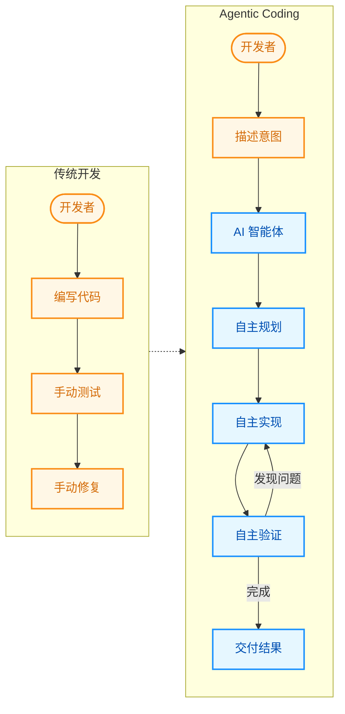

图 10-2：传统开发与 Agentic Coding 的工作流演进对比

#### 1.2.1 Agentic Coding 的关键特征

| 特征        | Vibe Coding | Agentic Coding |
| --------- | ----------- | -------------- |
| **代码库理解** | 单文件/片段      | 全项目索引          |
| **任务分解**  | 用户手动分解      | 智能体自主分解        |
| **错误修复**  | 用户描述问题      | 智能体自主发现和修复     |
| **测试**    | 用户请求生成      | 智能体主动验证        |
| **上下文管理** | 用户手动提供      | 智能体动态检索        |
| **多文件操作** | 逐文件进行       | 跨文件协调          |

#### 1.2.2 真实案例：API 迁移任务

假设需要将一个 Flask API 迁移到 FastAPI：

**Vibe Coding 方式**：

```
用户：帮我把这个 Flask 路由改成 FastAPI
AI：[生成一个文件的代码]
用户：还有这个文件...
AI：[生成另一个文件]
用户：依赖也要改...
AI：[生成 requirements.txt]
（重复多次，容易遗漏）
```

**Agentic Coding 方式**：

``` markdown
用户：帮我把这个项目从 Flask 迁移到 FastAPI

智能体：
[1] 分析项目结构... 发现 12 个路由文件，3 个中间件
[2] 制定迁移计划：
    - 更新依赖
    - 迁移路由定义
    - 转换中间件
    - 更新测试
    - 验证功能
[3] 执行迁移...
[4] 运行测试... 发现 2 个失败
[5] 修复问题...
[6] 所有测试通过，迁移完成

生成变更摘要：修改 15 个文件，新增 3 个文件
```

### 1.3 编程范式演进历程

编程范式随着抽象层级的提升不断演进，先后经历了机器码、结构化编程、面向对象编程、敏捷与 IDE、AI 辅助编程、AI 原生编辑器、Agentic Coding 等阶段。

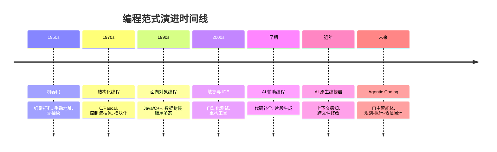

图 10-3：编程范式演进时间线

这一演进的底层驱动力——模型推理能力提升、标准化交互协议与记忆扩展——已在第 1.1.3 节「为什么现在爆发？」中详细论述。从编程视角看，这些驱动力具体映射为：

1. **模型能力进步**：更强的代码理解、规划与生成能力（对应 1.1 节“推理能力的临界点”）。
2. **工具使用能力**：模型能调用 shell、编辑器、测试框架等工具形成闭环（对应 1.1 节“标准化的交互协议”）。
3. **工程化基础设施**：可观测性、权限控制、沙箱与评测体系逐步成熟。
4. **标准化与可移植性**：工具描述、上下文传递、轨迹事件等逐步走向标准化。

#### 1.3.1 个体层面的能力迁移

在个人层面，Agentic Coding 要求开发者把注意力从“语法与 API 细节”迁移到“目标表达与验证闭环”：

- 把需求拆解为可验收的子任务与检查点
- 用最小上下文驱动智能体工作，并能快速定位缺失信息
- 以测试、运行与审查清单作为质量护栏，而不是依赖一次性生成

#### 1.3.2 组织级演进与效能陷阱

在企业级落地过程中，单纯推广 AI 编程工具往往会遭遇 **“AI 提效陷阱”**——这与第 1.1.6 节「核心演进总结」中“从点状提效到系统性提效”的趋势一脉相承：

> **用 AI 开发工具 ≠ 个人提效 ≠ 组织提效**。实践中常见的现象是：个人编码环节变快了，但如果需求澄清、评审、测试、发布与治理不升级，组织整体交付速度不一定同步提升。

关于智能体研发成熟度模型的三个等级（L1 辅助 → L2 协同 → L3 自主），已在术语表中的 “Agentic Development Maturity Model” 条目给出定义。下面从编程实践角度补充各等级的具体协作方式：

| 等级     | 模式        | 编程协作方式                    | 典型工具形态                     |
| ------ | --------- | ------------------------- | -------------------------- |
| **L1** | **AI 辅助** | AI 在编码环节提供片段补全，开发流程基本不变   | GitHub Copilot 式内联补全       |
| **L2** | **AI 协同** | AI 参与设计/编码/测试多环节，人负责审查与集成 | Cursor、Windsurf 等 AI 原生编辑器 |
| **L3** | **AI 自主** | 人定义需求与验收标准，AI 端到端推进交付     | Claude Code、Codex 等终端智能体   |

这一演进路径说明：真正的增益来自“流程 + 治理”的升级，而不只是“更强的代码生成”。关于安全控制从“Prompt 约束”到“独立策略引擎”的演进，参见第 1.1.6 节「核心演进总结」。

### 1.4 范式溯源：从“文学编程”到 Agentic Coding

如果寻找 Agentic Coding 这种 **“自然语言优先 (Natural Language First)”** 的开发方式，其思想渊源可以追溯到 1984 年。

当年，著名计算机科学家、图灵奖得主 **高德纳（Donald Knuth）** 提出了 **“文学编程”（Literate Programming）** 的概念。他在同名论文中写道：

> “让我们改变编写程序的态度，不要把主要精力放在指导计算机做什么，而是放在向人类解释我们要让计算机做什么。”

在文学编程范式下，程序员并不直接编写供编译器阅读的源代码，而是编写一篇包含代码片段的“文章（Document）”。这篇文章主要用自然语言解释代码的逻辑、设计意图和数据结构。随后，通过两种工具处理这篇文章：

* **Weave（编排）**：将文档渲染为适合人类阅读的精美排版（如 TeX）。
* **Tangle（编织）**：将文档中的代码片段提取、重组为供机器编译的源代码。

尽管思想超前，但受限于当时的工具链和人类在两个上下文间切换的认知负担，文学编程一直属于相对小众的极客实践。

然而在 40 年后大语言模型（LLM）的催化下，这一理念在 Agentic Coding 乃至 Vibe Coding 中迎来了真正意义上的复兴与超越：

1. **缺失的“Tangle”工具被补齐**：在过去，Tangle 只是简单的文本提取拼接工具，程序员仍需逐行编写出精确的代码片段。而在智能体时代，最强大的 Tangle 工具正是 LLM 本身。
2. **意图驱动生成**：如今，开发者所维护的系统设计文档、API 规约、需求拆解 Markdown 与项目说明文件（Rules），本质上就是一篇篇的“文学编程”文档。开发者只需用自然语言解释好“我们要让计算机做什么”，Agent 就能自动将其转化为可执行代码。
3. **从解释代码到生成代码**：高德纳的初衷是用自然语言解释代码以利于人类维护；而在当下的范式中，自然语言本身已经成为了最高级的编程语言。

Agentic Coding 本质上就是高度自动化闭环时代的 **终极文学编程**。

### 1.5 开发者角色的转变

#### 1.5.1 从“写代码”到“编排 AI”

随着编程范式的转移，开发者的角色也发生了根本性的变化。下面从技能栈的转变、新型开发者画像以及职业发展三个方面进行探讨。

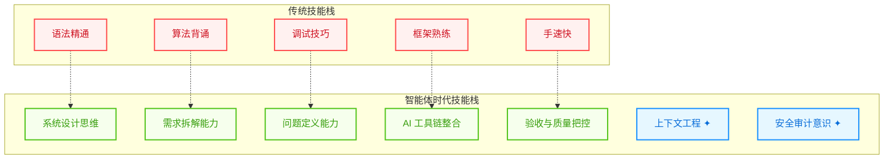

图 10-4：开发者技能栈的转变

#### 1.5.2 新型开发者画像

| 能力维度  | 传统开发者     | 智能体时代开发者      |
| ----- | --------- | ------------- |
| 核心竞争力 | 编码速度和技巧   | 问题定义和系统思维     |
| 日常工作  | 写代码、调试    | 需求拆解、审查 AI 输出 |
| 学习重点  | 新框架、新语言   | 提示词工程、上下文工程   |
| 质量保证  | 代码审查、单元测试 | AI 输出验证、护栏设计  |
| 团队协作  | 人-人协作     | 人-AI-人协作      |

#### 1.5.3 职业发展影响

**重要**： **智能体编程不会取代开发者，而是改变开发者的工作方式。** 重复性编码工作将被自动化，但以下能力将更加重要：

* 理解业务需求并转化为技术方案
* 设计可维护、可扩展的系统架构
* 审查 AI 生成代码的质量和安全性
* 处理 AI 无法解决的复杂边缘情况

### 1.6 三代范式演进：从提示词到驾驭工程

#### 1.6.1 三代范式的定义与演进

自 2023 年以来，在如何有效驱动大语言模型方面，工程实践经历了三个递进的范式演变。它们分别关注“我们说什么”、“模型看见什么”和“整个系统怎么运转”：

**提示词工程（Prompt Engineering）** 关注：*“我对模型说什么”*

这是最初的范式。开发者通过精心设计提示词、调整 temperature 和 top-k 等参数，试图在一次请求中获得完美输出。这本质上是一种 **开环控制** 思路——把指令塞进去，期待模型一次做对。

| 特点   | 描述             |
| ---- | -------------- |
| 控制方式 | 开环（输入→输出）      |
| 关键技术 | 思维链、少样本提示、角色扮演 |
| 失败模式 | 随机失败、无纠错机制     |
| 应用范围 | 单步任务、结构化输出     |

**上下文工程（Context Engineering）** 关注：*“模型此刻看见什么”*

随着应用复杂化，开发者发现输出质量往往受限于“模型能看见什么”。上下文工程通过 RAG（检索增强生成）、记忆管理、上下文压缩等动态策划信息环境，让模型在最优信息基础上做决策。这是一种 **改进的输入**，但仍缺少 **纠错机制**。详见第 3.6 节。

| 特点   | 描述                 |
| ---- | ------------------ |
| 控制方式 | 开环（优化的输入→输出）       |
| 关键技术 | RAG、向量检索、信息检索、记忆蒸馏 |
| 改进点  | 提高信噪比、减少幻觉         |
| 局限   | 仍无反馈修正能力           |

**驾驭工程（Harness Engineering）** 关注：*“整个系统如何运转”*

真正的突破来自将智能体嵌入完整的 **闭环控制系统**。驾驭工程不只关注提示词或信息，而是设计包裹在模型外围的整套运行环境架构——**沙箱、反馈回路、权限治理、状态管理、可观测性、断路器**。这使得智能体能够自动发现错误、修正错误并根据反馈调整策略。

核心洞察是：***智能在模型里，可靠性在 Harness 里。*** LLM 的能力强大但不确定，Harness 将这种不确定性转化为可控的风险——允许系统犯错、发现错、修正错。与“人在回路中”的逐件审批不同，驾驭工程倡导“人在回路之上”：人负责 **设计规则和环境**，AI 自主运行并在遇到例外情况才需人工介入。

驾驭系统的详细架构与实现见第 10.2.5 节「智能体驾驭系统」。

下图展示了三代范式的演进：

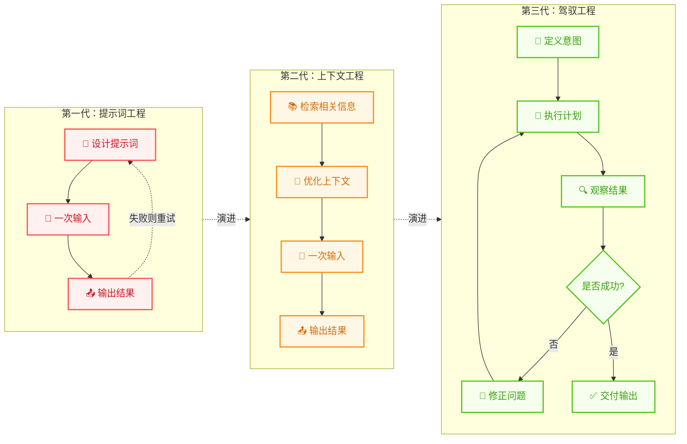

图 10-5：三代范式的演进路径

#### 1.6.2 控制论的复兴

驾驭工程的理论基础来自控制论（Cybernetics），这门学科由 **诺伯特·维纳（Norbert Wiener）** 在 1948 年著作《控制论》中正式奠基。维纳的核心洞察是：通过 **误差反馈**——监测系统状态与目标的偏差，据此调整控制参数，周而复始使偏差趋近于零——可以构建可靠的控制系统。

这个原理早已渗透现代工程的每个角落（TCP 拥塞控制、Kubernetes 自动扩缩容、智能手机自动亮度等），但 LLM 是人类构建的最大的 **非线性黑盒系统**，让控制论迎来了最严苛的试验场。同一提示词在不同时刻可能产生完全不同的结果，微小的幻觉在多步推理中被指数放大。因此，没有闭环反馈机制的智能体如同“没有陀螺仪的火箭”。

关于可观测性与反馈回路的详细工程实现，参见第 9.3 节；关于故障韧性与断路器设计，参见第 9.6 节；关于上下文工程的详细策略，参见第 3.6 节。

### 1.7 Agentic Coding 的工程挑战

尽管前景广阔，Agentic Coding 在工程实践中仍面临挑战：

#### 1.7.1 确定性与可重复性

智能体的行为具有一定的随机性，同样的输入可能产生不同的输出。

**应对策略**：

* 使用低温度（temperature）参数
* 建立测试套件验证输出
* 版本控制智能体配置

#### 1.7.2 上下文管理

大型代码库可能超出上下文窗口限制。

**应对策略**：

* 动态上下文检索
* 代码库索引和语义搜索
* 分层上下文注入

#### 1.7.3 安全性

智能体可能执行危险操作或生成不安全代码。

**应对策略**：

* 沙箱执行环境
* 敏感操作审批机制
* 代码安全扫描

#### 1.7.4 调试困难

当智能体的输出不符合预期时，很难追踪问题根源。

**应对策略**：

* 详细的执行日志
* 思维链可视化
* 分步执行模式

## 2. 智能体编程原理

要真正掌握 Agentic Coding，必须打开 AI 的“黑盒”，看看它是如何工作的。本节深入解析智能体的核心工作机制，帮助你从原理层面理解智能体编程。

智能体并不是能一次性生成完整代码的魔术师，而是一个 **状态机**。它的工作流程是一个被“展开”的循环：

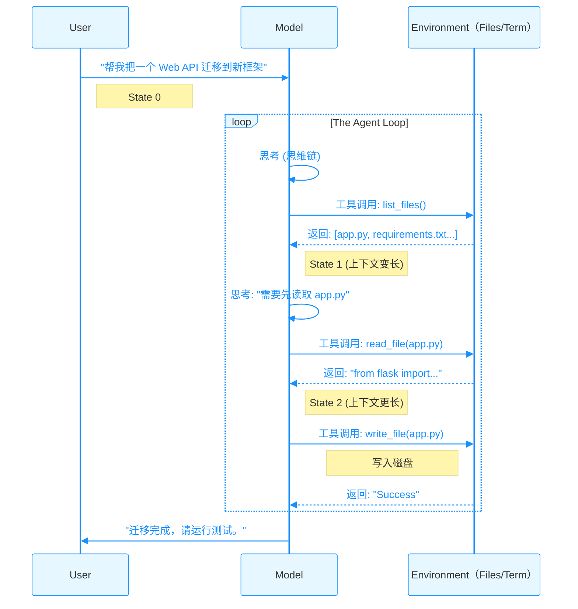

图 10-6：智能体循环序列图

### 2.1 微观循环：智能体循环的三个阶段

这里说的 **Agent Loop** 是执行器内部的微观闭环，回答的是“这一轮下一步做什么”。它和后文 [10.4 节](/agentic_ai_guide/di-san-bu-fen-gong-cheng-shi-jian-yu-luo-di/10_agentic_coding/10.4_workflow.md)讨论的任务级 workflow 不是两套互斥概念，而是嵌套关系：

* **Think → Act → Observe**：单次迭代的微观闭环
* **Gather → Action → Verify**：把多轮微观迭代折叠后的执行策略视角
* **Plan → Decompose → Execute → Review**：开发者与智能体协作的任务级工作流闭环

换句话说，workflow 包裹多个 agent loop；agent loop 则是 workflow 真正落地执行时反复转动的引擎。

#### 2.1.1 Think-Act-Observe：单次迭代

每次循环都包含以下三个阶段：

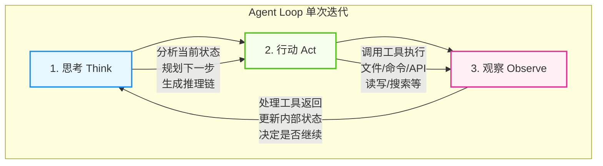

图 10-7：智能体循环的三个阶段

#### 2.1.2 Gather-Action-Verify：执行阶段的中观视角

前面的 **Think → Act → Observe** 描述了单次迭代内的微观流程：模型如何思考、执行和接收反馈。而从更宏观的工程视角看，一个完整任务在执行阶段又可以抽象为 **Gather（收集） → Action（行动） → Verify（验证）**。它关注的不是某一轮循环内部发生了什么，而是多轮迭代合在一起时，这个阶段采用了哪些工程策略。

因此，Gather-Action-Verify 不是对 Think-Act-Observe 的替代，而是更粗粒度的“折叠视图”：Gather 往往对应若干轮搜索/读取 loop，Action 往往对应若干轮编辑/执行 loop，Verify 则往往对应若干轮测试/审查 loop。到 [10.4 节](/agentic_ai_guide/di-san-bu-fen-gong-cheng-shi-jian-yu-luo-di/10_agentic_coding/10.4_workflow.md) 再往上一层，就会进入任务级的 P-D-E-R 闭环。

**Gather 阶段**（收集上下文）有四种主要策略：

1. **Agentic 搜索**：智能体像开发者一样，使用 `ls`、`grep` 等工具主动探索文件系统，动态发现所需文件而非预加载全部内容
2. **语义搜索（Semantic Search）**：通过向量化和相似度计算快速定位相关文档片段；比 agentic 搜索快但精度较低
3. **子智能体（Subagents）**：派遣专门的子智能体去并行收集信息，返回摘要结果来减轻主智能体的上下文压力
4. **上下文压缩（Compaction）**：当上下文接近窗口限制时，自动总结历史对话并重启新的上下文窗口，保持连贯性

**Action 阶段**（执行行动）支持五种主要的行动方式：

1. **工具调用（Tools）**：如文件读写、数据库查询等；是智能体最基本的行动单位
2. **Bash 命令与脚本**：通过 Shell 执行系统级操作，适合复杂的环境交互
3. **代码生成**：生成 Python、JavaScript 等代码来执行复杂的计算或数据处理任务
4. **模型上下文协议（MCP）**：标准化的集成接口，连接 Slack、GitHub、Asana 等第三方服务；预构建服务可封装具体 API 调用，但受保护的 HTTP MCP 服务仍需按规范配置授权发现、token 传递与权限边界
5. **复合行动**：在单个迭代中并发执行多个独立的工具调用，充分利用并发能力

**Verify 阶段**（验证结果）有三种常见的验证方法：

1. **规则与检查清单**：定义明确的成功标准。例如代码生成后运行 linter，或在文件写入后验证格式
2. **视觉反馈**：对 UI 生成或渲染类任务，通过截图让智能体直观确认结果是否符合预期
3. **LLM-as-Judge**：由另一个 LLM 实例来审核第一个智能体的输出，评分是否满足质量标准

#### 2.1.3 循环何时终止？

Agent Loop 在以下情况下终止：

1. **任务完成**：智能体判断目标已达成
2. **达到最大迭代次数**：防止无限循环
3. **遇到错误**：无法恢复的错误导致终止
4. **用户中断**：用户手动停止执行
5. **Token 预算耗尽**：上下文窗口接近限制

> **重要**：当多个终止条件同时满足时，应遵循以下优先级：
>
> 1. **用户中断** （最高优先级，立即停止）
> 2. **Token 预算耗尽** （防止上下文溢出）
> 3. **最大迭代次数** （防止死循环）
> 4. **无法恢复的错误** （记录状态并退出）
> 5. **任务完成** （正常终止，生成总结）

#### 2.1.4 从零构建：最小可运行智能体

前面几节用图和文字描述了 Agent Loop 的原理。下面用约 50 行 Python 将其落地为一个 **完整可运行的最小智能体**，帮助读者从代码层面理解循环、工具调用、停止判断和错误处理是如何协作的。

```python
import anthropic, json

# 1. 定义工具——描述越详细，模型的工具选择越准确
tools = [
    {
        "name": "read_file",
        "description": "读取本地文件系统中指定路径的文件，返回其完整文本内容。"
                       "适用于需要查看文件当前状态的场景。路径为相对或绝对路径。",
        "input_schema": {
            "type": "object",
            "properties": {"path": {"type": "string", "description": "文件路径"}},
            "required": ["path"],
        },
    },
    {
        "name": "write_file",
        "description": "将指定内容写入本地文件。如果文件已存在则覆盖，不存在则创建。"
                       "写入前请先用 read_file 确认当前内容，避免意外覆盖。",
        "input_schema": {
            "type": "object",
            "properties": {
                "path": {"type": "string", "description": "目标文件路径"},
                "content": {"type": "string", "description": "要写入的完整文件内容"},
            },
            "required": ["path", "content"],
        },
    },
]

# 2. 工具执行器：将模型的工具调用映射到真实操作
def execute_tool(name: str, args: dict) -> str:
    if name == "read_file":
        return open(args["path"]).read()
    elif name == "write_file":
        open(args["path"], "w").write(args["content"])
        return f"已写入 {args['path']}"
    return f"未知工具: {name}"

# 3. Agent Loop：核心循环
def agent_loop(task: str, max_turns: int = 10):
    client = anthropic.Anthropic()
    system = (
        "你是一个文件编辑助手。仅操作用户指定的文件，不要访问其他路径。"
        "修改文件前必须先读取当前内容，确认变更范围后再写入。"
        "如果操作失败，向用户说明原因，不要自行重试超过 2 次。"
    )
    messages = [{"role": "user", "content": task}]

    for turn in range(max_turns):
        # Think: 模型基于当前上下文生成响应
        response = client.messages.create(
            model="claude-sonnet-4-6",
            max_tokens=4096,
            system=system,
            tools=tools,
            messages=messages,
        )

        # 将模型响应追加到消息历史
        messages.append({"role": "assistant", "content": response.content})

        # 终止条件：模型不再请求工具调用
        if response.stop_reason == "end_turn":
            final = [b.text for b in response.content if b.type == "text"]
            print(f"✅ 完成: {final[0] if final else '(无文本)'}")
            return

        # Act + Observe: 模型请求了工具调用，逐一执行
        if response.stop_reason == "tool_use":
            tool_results = []
            for block in response.content:
                if block.type == "tool_use":
                    print(f"🔧 调用 {block.name}({json.dumps(block.input, ensure_ascii=False)})")
                    try:
                        result = execute_tool(block.name, block.input)
                        is_error = False
                    except Exception as e:
                        result = f"错误: {e}"
                        is_error = True
                    tool_results.append({
                        "type": "tool_result",
                        "tool_use_id": block.id,
                        "content": result,
                        "is_error": is_error,
                    })
            # 工具结果以 user 消息形式回注（tool_result 必须紧跟对应的 tool_use）
            messages.append({"role": "user", "content": tool_results})

    print("⚠️ 达到最大迭代次数，终止")

# 运行
agent_loop("读取 config.yaml，将其中的 debug: true 改为 debug: false 后写回")
```

这段代码完整实现了前述的三个阶段：**Think**（模型推理）→ **Act**（执行工具）→ **Observe**（结果回注）。几个值得注意的设计决策：

* **`stop_reason` 驱动控制流**：API 返回 `"tool_use"` 表示模型请求调用工具，返回 `"end_turn"` 表示任务完成。这是 Anthropic Messages API 的标准模式。
* **工具描述的详细度**：官方文档指出，工具描述是影响工具调用准确性的最重要因素。即使在最小示例中，也应提供清晰的使用场景和注意事项。
* **`system` 参数**：系统提示词通过 API 的顶层 `system` 参数传入（而非作为消息），用于设定智能体的角色和行为边界。
* **消息顺序**：`assistant` 消息（含 `tool_use` 块）必须紧接 `user` 消息（含对应的 `tool_result` 块），这是 API 的格式要求。
* **上下文增长**：每轮循环后 `messages` 列表都在变长——模型响应和工具结果不断追加。这就是 10.2.4 节“冰山之下”的不可见状态。
* **错误容忍**：工具执行失败时，错误信息格式化后回传给模型，并通过 `is_error: true` 标志明确告知模型这是一次失败的调用（而非正常返回），模型据此决定重试或换一种方式——这正是闭环反馈的力量。
* **护栏**：`max_turns` 防止无限循环，对应 10.2.1.3 的终止条件。

> **提示**：生产环境不会直接使用这段代码，但它展示了所有智能体框架的核心骨架。无论是 LangGraph、CrewAI 还是 Claude Code，底层都是这个“循环 + 工具调用 + 结果回注”的模式，只是在此基础上增加了并发、状态持久化、权限控制和可观测性等工程层。

### 2.2 并发执行与输出控制

在单步循环中，模型有时需要同时执行多个独立的操作——例如同时搜索文件、获取 API 数据和验证中间结果。现代智能体平台支持在一轮迭代中提出多个工具调用，并发执行以缩短总延迟。

#### 2.2.1 并发调度

当模型在一次响应中提出多个工具调用时，编排器需要判断这些调用之间是否存在依赖关系：

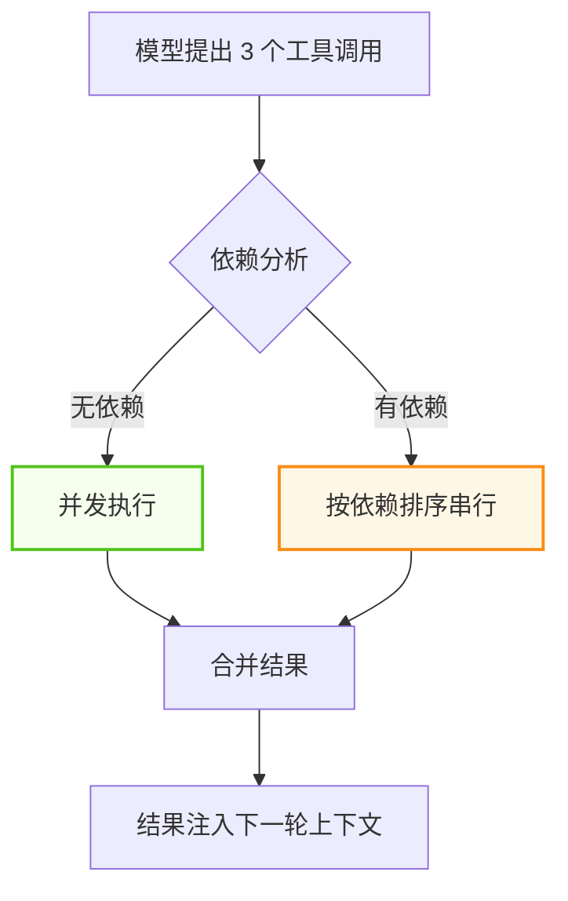

图 10-8：多工具调用的依赖分析与并发调度

无依赖的调用可以通过多个容器会话并发执行，每个会话独立流式返回输出。编排器将这些输出整合为结构化的工具结果，再统一提供给模型作为上下文。

#### 2.2.2 输出截断策略

当工具调用涉及文件操作或数据处理时（如 `npm install` 的安装日志、大型 CSV 的查询结果），输出可能非常庞大。如果这些内容全部进入上下文窗口，会迅速消耗 Token 预算却未必提供有效信息。

解决方案是为每个工具调用设置 **输出上限**。编排器强制执行这个限制，返回被截断但保留首尾的结果：

```
命令输出（原始 50,000 字符）：
前 1,500 字符完整保留
... [47,000 chars truncated] ...
后 1,500 字符完整保留
```

这种“保留首尾、截断中间”的策略，让模型既能看到命令的初始状态（如安装开始）又能看到最终结果（如成功/失败），而不会被中间的冗长日志淹没。

并发执行与输出截断结合在一起，使智能体循环既快速又节省上下文空间。

### 2.3 停止序列的魔法

模型本质上是一个“文本补全机”。如果没有约束，它会在生成 `tool_call()` 后继续幻想出工具的返回结果。

智能体工作的关键在于 **停止序列（Stop Sequence）**。

#### 2.3.1 工作原理

停止序列的作用是把一次生成切成“模型说话”和“宿主执行”两段，下图给出一次完整往返。

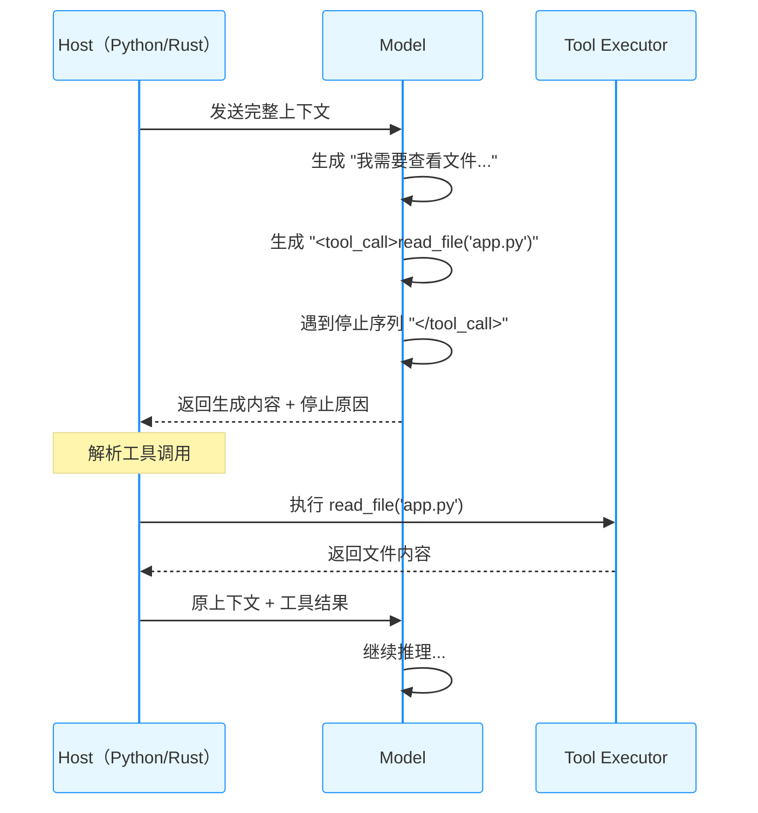

图 10-9：停止序列工作原理

#### 2.3.2 关键机制

* 当模型生成特定的停止符（如 `\nObservation:` 或 `</tool_call>`）时，推理 **强制暂停**
* 控制权交还给 Python/Rust 宿主程序
* 宿主程序执行真正的 Shell 命令或文件读写
* 宿主将结果拼接到上下文后面，**再次调用模型**

这就是为什么有时候你会感觉到智能体“卡顿”了一下——那正是它停止生成、等待工具执行完并返回结果的时刻。

#### 2.3.3 不同接口的停止序列设计

| 接口形态     | 停止序列格式              | 工具调用格式      | 典型代表                            |
| -------- | ------------------- | ----------- | ------------------------------- |
| 函数调用接口   | 内置 function calling | JSON Schema | OpenAI / Anthropic Messages API |
| XML 标签风格 | `</tool_use>`       | XML-like    | 早期 Claude XML 模式                |
| 文本标记风格   | `\nObservation:`    | 自然语言 + JSON | LangChain ReAct                 |
| 端侧工具协议   | 模型内部标记              | 专有格式        | 端侧推理引擎                          |

> **注意**：现代主流 API（如 Anthropic Messages API、OpenAI Chat Completions）已将停止序列机制封装到结构化的响应中——开发者无需手动解析 XML 标签或文本标记，只需检查 `stop_reason`（Anthropic）或 `finish_reason`（OpenAI）字段即可判断模型是否请求了工具调用。10.2.1.4 的代码示例正是使用了这种封装后的接口。

### 2.4 不可见的状态

在 Chat 界面上，你只看到了“你好”和“结果”。但在冰山之下，上下文窗口里堆积了成千上万行你没看见的内容：

#### 2.4.1 冰山图

用户能看到的只是对话与文件改动，真正决定行为的大部分状态都在水面之下。

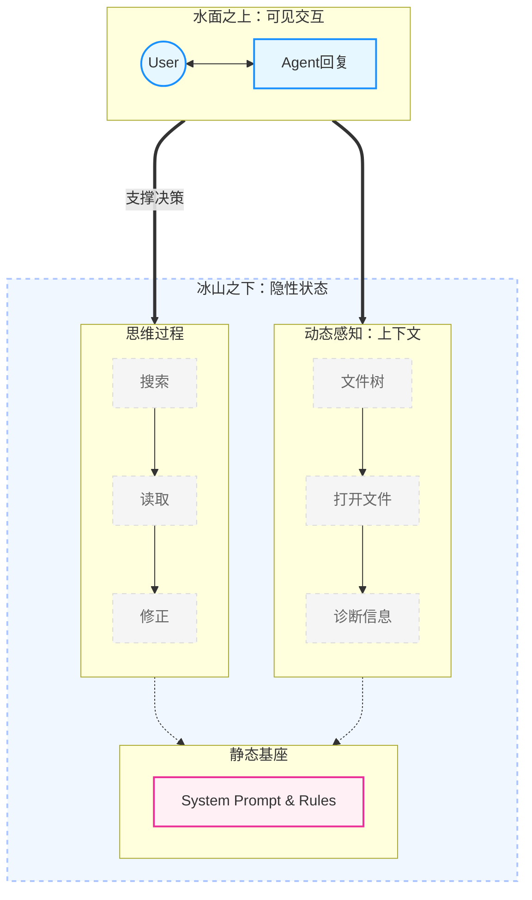

图 10-10：智能体不可见状态：冰山模型

#### 2.4.2 隐藏状态的类型

1. **LSP 诊断信息**：你没运行代码，但智能体已在后台运行了 Linter 并看到了报错
2. **文件树快照**：智能体默默看了一眼目录结构
3. **当前打开的文件（Active Tabs）**：这是最容易被忽视的隐形杀手。IDE 往往会将你当前打开的所有文件的摘要甚至全文自动注入上下文。打开太多无关文件会让智能体“分心”。
4. **搜索结果**：智能体执行了多次代码搜索
5. **自我修正历史**：智能体可能尝试了 3 次修改失败，第 4 次才成功，但只展示了最后的结果
6. **系统提示词**：框架注入的规则和约束

#### 2.4.3 为什么这很重要？

理解这一点，你就会明白：

> **当智能体表现不佳时，往往不是它“笨”，而是不可见的状态（上下文）被污染了。**

**常见污染场景**：

* 早期对话中的错误假设被保留
* 无关文件的内容占用了上下文空间
* 失败尝试的堆积导致智能体“困惑”

**解决方案**：

* 重置对话（New Chat）——清空不可见噪音的最有效手段
* 使用 @ 引用精确控制上下文
* 定期检查智能体“看到了什么”

### 2.5 智能体驾驭系统

[10.1.6 节「三代范式演进：从提示词到驾驭工程」](/agentic_ai_guide/di-san-bu-fen-gong-cheng-shi-jian-yu-luo-di/10_agentic_coding/10.1_paradigm.md)介绍了驾驭工程（Harness Engineering）的理论基础——通过闭环控制系统让智能体自主运行并自我纠错。本节聚焦于**具体的组件实现**：在实际的智能体编程产品中，驾驭系统是如何通过消息、工具和指令三层结构落地的。

一个完整的智能体驾驭系统通常由三层核心组件构成：消息、工具和指令。

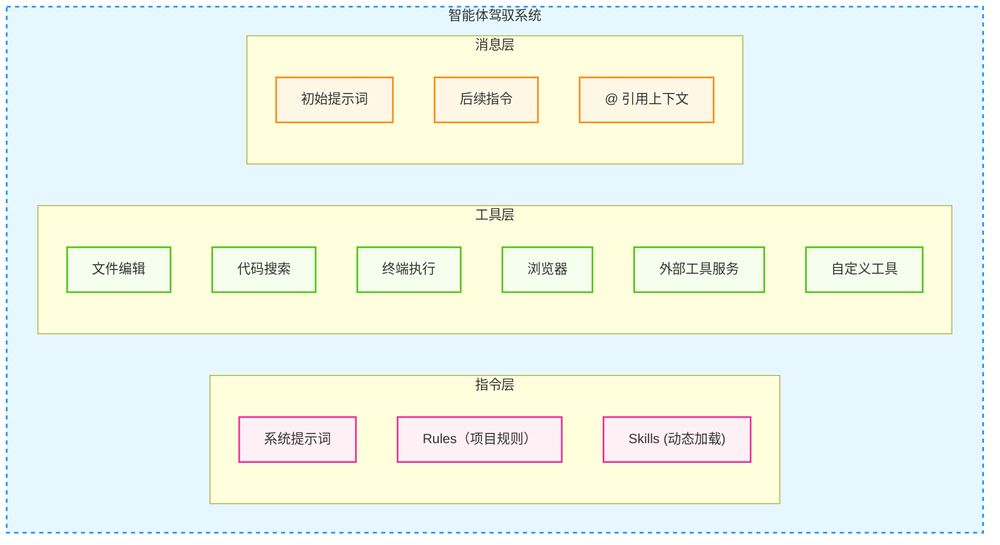

图 10-11：智能体驾驭系统组件架构

**三大组件详解**

#### 2.5.1 用户消息

驱动智能体行动的输入：

* **初始提示词**：描述任务目标
* **后续指令**：提供反馈和调整
* **@ 引用**：精确注入上下文

#### 2.5.2 工具

赋予智能体执行能力。典型的编程智能体工具集包括：

| 工具                         | 能力      | 说明                     |
| -------------------------- | ------- | ---------------------- |
| `file_read`                | 读取文件    | 查看源码、配置文件等的当前内容        |
| `file_write` / `file_edit` | 写入/编辑文件 | 创建新文件或修改已有文件           |
| `file_search`              | 语义搜索    | 基于向量相似度定位相关代码片段        |
| `grep_search`              | 正则搜索    | 精确匹配符号名、字符串等           |
| `run_command`              | 终端命令    | 执行构建、测试、Git 等 Shell 操作 |
| `browser_action`           | 浏览器操作   | 预览 UI、截图、抓取文档          |
| `tool_service`             | 外部工具服务  | 通过 MCP 等协议调用第三方 API    |

#### 2.5.3 指令

控制智能体的行为和风格：

| 类型     | 位置     | 作用     | 加载时机 |
| ------ | ------ | ------ | ---- |
| 系统提示词  | 框架内置   | 定义基本行为 | 始终加载 |
| Rules  | 项目规则目录 | 项目特定约定 | 始终加载 |
| Skills | 技能目录   | 领域知识   | 按需加载 |
| 项目说明文件 | 项目根目录  | 约定与说明  | 始终加载 |

#### 2.5.4 模型差异

不同模型对同一套驾驭机制的反应可能不同，例如指令遵循、工具调用鲁棒性、长任务稳定性等。实践中应通过小规模评测与回归测试来选择模型组合。

> **提示**：高效的 Agentic Coding 需要学会通过 Rules 和 Skills 来调整驾驭机制，以适配不同模型的特点。

### 2.6 编程场景下的上下文管理

上下文工程的通用原理——持久化、筛选、压缩、隔离——已在[第 3.6 节](/agentic_ai_guide/di-yi-bu-fen-dan-ti-zhi-neng-jia-gou/03_memory/3.6_context_engineering.md)中详细讨论。本节聚焦于 **编程场景下的特殊挑战**：代码库的上下文远比普通对话复杂，文件数量多、依赖关系深、中间产物（编译日志、测试输出）体量大。

#### 2.6.1 编程上下文的组成

与一般对话不同，编程智能体的上下文窗口有独特的组成结构：

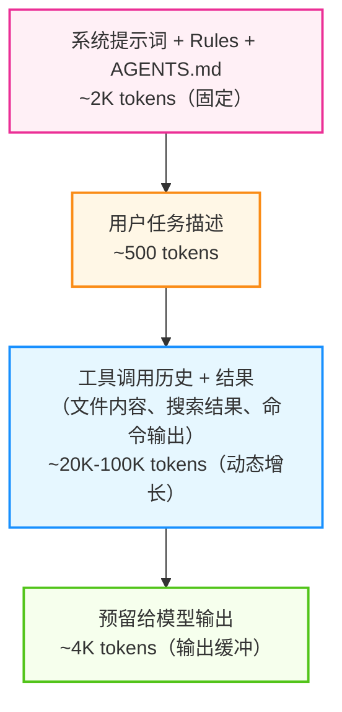

图 10-12：上下文窗口组成结构

其中“动态增长区域”是编程场景的最大变量——一次 `grep` 搜索可能返回数千行匹配，一次 `npm install` 日志可能占用数万 Token。10.2.2 节讨论的输出截断策略正是为了控制这部分增长。

#### 2.6.2 编程场景的四个特有陷阱

| 陷阱           | 表现                              | 应对                                                 |
| ------------ | ------------------------------- | -------------------------------------------------- |
| **IDE 隐式注入** | 编辑器将所有打开文件的摘要自动注入上下文，无关文件占用大量空间 | 关闭无关标签页，只保留当前任务相关文件                                |
| **失败尝试堆积**   | 智能体连续 3 次修改失败，失败代码和报错信息全部留在上下文中 | 及时重置对话（New Chat），用 `@` 引用只保留成功路径                   |
| **大型工具输出**   | 编译日志、测试报告、搜索结果等体量巨大             | 依赖编排器的输出截断（保留首尾，截断中间）                              |
| **跨文件依赖链**   | 修改 A 文件需要理解 B、C、D 的接口，上下文迅速膨胀   | 用类型定义和接口文件代替完整源码，优先注入 `.d.ts`、`__init__.py` 等摘要性文件 |

#### 2.6.3 上下文恢复技巧

当上下文被污染（智能体重复犯错、提到无关文件、忘记约定、响应变慢）时，**重置对话是最有效的手段**。但很多开发者不愿重置，因为怕丢失进度。

解决方案是 **“交接文档”模式**：在重置前，将当前进度总结到一个文件中：

```markdown
<!-- handoff_note.md -->
## 已完成
- 用户认证模块迁移完成（src/auth/）
- 数据库 Schema 已更新

## 下一步
- 迁移支付模块（src/payment/）
- 关键决策：使用 Stripe SDK v3，不用 v2

## 注意事项
- payment_service.py 第 45 行有一个已知的竞态条件，暂不处理
```

在新对话中只需 `@handoff_note.md`，智能体即可恢复“工作记忆”，而不必背负之前几百轮对话的 Token 债务。

### 2.7 智能体调试与问题定位

当智能体表现异常时，如何定位问题？

#### 2.7.1 调试清单

智能体出问题时，按输入、配置、执行、输出的顺序逐层排查，比直接改提示词更快定位。

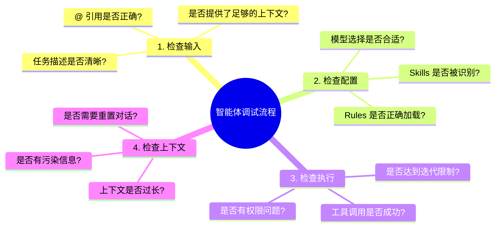

图 10-13：智能体调试流程

#### 2.7.2 常见问题及解决方案

| 问题          | 可能原因        | 解决方案           |
| ----------- | ----------- | -------------- |
| 智能体不调用工具    | 任务描述不明确     | 明确说“请修改文件”     |
| 智能体修改错误文件   | 上下文中有多个相似文件 | 使用 @ 精确引用      |
| 智能体重复失败尝试   | 上下文污染       | 重置对话           |
| 智能体响应变慢     | 上下文过长       | 精简引用内容         |
| 智能体忽略 Rules | Rules 格式错误  | 检查 Markdown 格式 |

***

**下一节**: [10.3 常见工具](/agentic_ai_guide/di-san-bu-fen-gong-cheng-shi-jian-yu-luo-di/10_agentic_coding/10.3_tools.md)

