# 第十章 智能体编程实践

本章探讨 AI 智能体如何改变软件开发范式。不只是代码生成，而是深入 Agentic Coding 的核心——让 AI 作为自主智能体，参与需求理解、架构规划、代码编写、调试修复的全生命周期。从范式转移(Vibe → Agentic) → Agent Loop 原理 → 工具选择 → P-D-E-R 开发闭环 → 工程化实践的完整路径。

完成本章后，你将能够：

1. **理解** Agentic Coding 的原理与思维范式
2. **掌握** Agent Loop、Stop Sequences、上下文窗口等核心概念
3. **选择** 适合场景的开发工具与平台
4. **构建** 高效的 AI 编码工作流与最佳实践

## 1. 编程范式转移

软件开发正在经历一场由智能体驱动的范式转变。工具的角色从“代码补全”演进到“端到端交付的协作者”，开发者也从“写代码的人”逐步转型为“编排 AI 的人”。

### 1.1 什么是 Vibe Coding

**Vibe Coding** 用来描述一种“以自然语言驱动、快速迭代”的编程风格：

> 完全沉浸在“氛围”中，拥抱快速迭代，暂时忘掉代码细节。

#### 1.1.1 核心理念

下图对比了传统编程与 Vibe Coding 的区别：

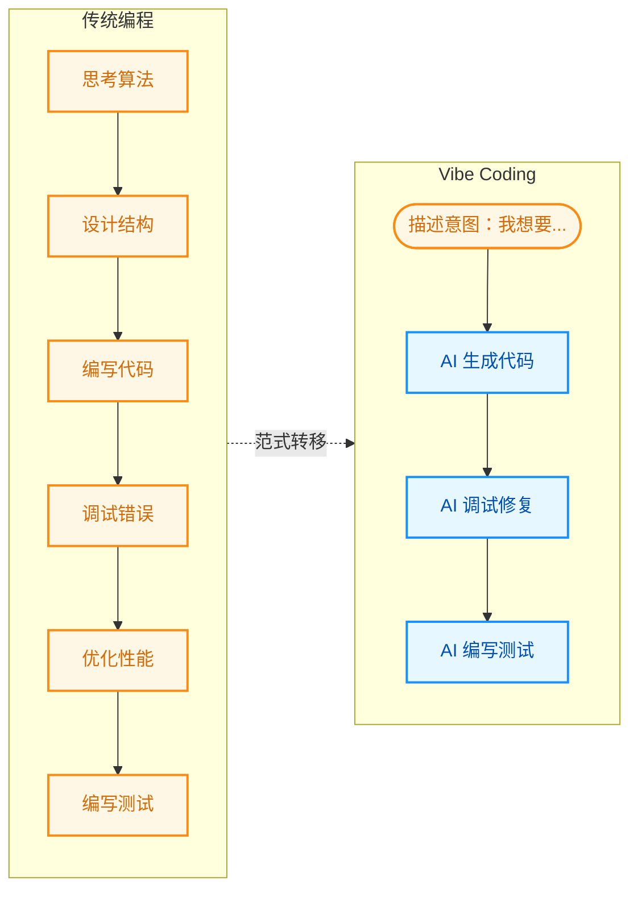

图 10-1：传统编程与 Vibe Coding 的流程对比

#### 1.1.2 Vibe Coding 的特点

| 特点     | 描述          | 典型场景        |
| ------ | ----------- | ----------- |
| 自然语言驱动 | 用口语化的方式描述需求 | “帮我写一个登录页面” |
| 快速原型   | 分钟级别生成可运行代码 | 黑客马拉松、概念验证  |
| 迭代对话   | 通过对话不断调整优化  | “把按钮改成蓝色”   |
| 低门槛    | 非程序员也能“编程”  | 产品经理生成原型    |

#### 1.1.3 Vibe Coding 的局限

尽管 Vibe Coding 降低了编程门槛，但它也存在明显的局限性：

1. **技术债务累积**：AI 生成的代码可能包含隐藏的设计缺陷
2. **调试困难**：当 AI 生成的代码出错时，不理解代码的用户难以定位问题
3. **安全风险**：未经审查的 AI 代码可能包含安全漏洞
4. **幻觉污染**：AI 可能编造不存在的 API 或逻辑，导致难以排查的隐蔽 Bug
5. **可维护性差**：缺乏系统设计的代码难以长期维护

!!! warning "警告"

    **Vibe Coding 的生产边界 (The Production Boundary)**：Vibe Coding 极其适合黑客马拉松、概念验证 (PoC) 或个人玩具项目，但 **绝不能以此方式将未经严谨审查的代码直接推向生产环境**。一旦进入到需要考虑高可用、安全审查与性能调优的深水区，开发者必须切换回系统化的 Agentic Coding 或传统工程控制流，并对生成的每一行逻辑负责。

### 1.2 什么是 Agentic Coding

**Agentic Coding** 是 Vibe Coding 的进化版：AI 不仅仅生成代码，而是作为一个自主智能体，通过“执行-观察-修正”的反馈闭环，能够：

1. **理解**：深度分析整个代码库的结构和上下文
2. **规划**：制定实现方案并分解为可执行任务
3. **执行**：自主编写、修改、重构代码
4. **验证**：运行测试、分析错误、修复 Bug
5. **迭代**：根据反馈自我改进

!!! note "详细机制"
    
    这个反馈闭环的完整内部机制——思考→行动→观察的三个阶段、循环何时终止、并发控制等实现细节，详见第 10.2 节。


图 10-2：传统开发与 Agentic Coding 的工作流演进对比

#### 1.2.1 Agentic Coding 的关键特征

| 特征        | Vibe Coding | Agentic Coding |
| --------- | ----------- | -------------- |
| **代码库理解** | 单文件/片段      | 全项目索引          |
| **任务分解**  | 用户手动分解      | 智能体自主分解        |
| **错误修复**  | 用户描述问题      | 智能体自主发现和修复     |
| **测试**    | 用户请求生成      | 智能体主动验证        |
| **上下文管理** | 用户手动提供      | 智能体动态检索        |
| **多文件操作** | 逐文件进行       | 跨文件协调          |

#### 1.2.2 真实案例：API 迁移任务

假设需要将一个 Flask API 迁移到 FastAPI：

**Vibe Coding 方式**：

```
用户：帮我把这个 Flask 路由改成 FastAPI
AI：[生成一个文件的代码]
用户：还有这个文件...
AI：[生成另一个文件]
用户：依赖也要改...
AI：[生成 requirements.txt]
（重复多次，容易遗漏）
```

**Agentic Coding 方式**：

``` markdown
用户：帮我把这个项目从 Flask 迁移到 FastAPI

智能体：
[1] 分析项目结构... 发现 12 个路由文件，3 个中间件
[2] 制定迁移计划：
    - 更新依赖
    - 迁移路由定义
    - 转换中间件
    - 更新测试
    - 验证功能
[3] 执行迁移...
[4] 运行测试... 发现 2 个失败
[5] 修复问题...
[6] 所有测试通过，迁移完成

生成变更摘要：修改 15 个文件，新增 3 个文件
```

### 1.3 编程范式演进历程

编程范式随着抽象层级的提升不断演进，先后经历了机器码、结构化编程、面向对象编程、敏捷与 IDE、AI 辅助编程、AI 原生编辑器、Agentic Coding 等阶段。

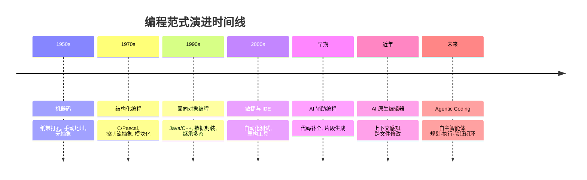

图 10-3：编程范式演进时间线

这一演进的底层驱动力——模型推理能力提升、标准化交互协议与记忆扩展——已在第 1.1.3 节「为什么现在爆发？」中详细论述。从编程视角看，这些驱动力具体映射为：

1. **模型能力进步**：更强的代码理解、规划与生成能力（对应 1.1 节“推理能力的临界点”）。
2. **工具使用能力**：模型能调用 shell、编辑器、测试框架等工具形成闭环（对应 1.1 节“标准化的交互协议”）。
3. **工程化基础设施**：可观测性、权限控制、沙箱与评测体系逐步成熟。
4. **标准化与可移植性**：工具描述、上下文传递、轨迹事件等逐步走向标准化。

#### 1.3.1 个体层面的能力迁移

在个人层面，Agentic Coding 要求开发者把注意力从“语法与 API 细节”迁移到“目标表达与验证闭环”：

- 把需求拆解为可验收的子任务与检查点
- 用最小上下文驱动智能体工作，并能快速定位缺失信息
- 以测试、运行与审查清单作为质量护栏，而不是依赖一次性生成

#### 1.3.2 组织级演进与效能陷阱

在企业级落地过程中，单纯推广 AI 编程工具往往会遭遇 **“AI 提效陷阱”**——这与第 1.1.6 节「核心演进总结」中“从点状提效到系统性提效”的趋势一脉相承：

> **用 AI 开发工具 ≠ 个人提效 ≠ 组织提效**。实践中常见的现象是：个人编码环节变快了，但如果需求澄清、评审、测试、发布与治理不升级，组织整体交付速度不一定同步提升。

关于智能体研发成熟度模型的三个等级（L1 辅助 → L2 协同 → L3 自主），已在术语表中的 “Agentic Development Maturity Model” 条目给出定义。下面从编程实践角度补充各等级的具体协作方式：

| 等级     | 模式        | 编程协作方式                    | 典型工具形态                     |
| ------ | --------- | ------------------------- | -------------------------- |
| **L1** | **AI 辅助** | AI 在编码环节提供片段补全，开发流程基本不变   | GitHub Copilot 式内联补全       |
| **L2** | **AI 协同** | AI 参与设计/编码/测试多环节，人负责审查与集成 | Cursor、Windsurf 等 AI 原生编辑器 |
| **L3** | **AI 自主** | 人定义需求与验收标准，AI 端到端推进交付     | Claude Code、Codex 等终端智能体   |

这一演进路径说明：真正的增益来自“流程 + 治理”的升级，而不只是“更强的代码生成”。关于安全控制从“Prompt 约束”到“独立策略引擎”的演进，参见第 1.1.6 节「核心演进总结」。

### 1.4 范式溯源：从“文学编程”到 Agentic Coding

如果寻找 Agentic Coding 这种 **“自然语言优先 (Natural Language First)”** 的开发方式，其思想渊源可以追溯到 1984 年。

当年，著名计算机科学家、图灵奖得主 **高德纳（Donald Knuth）** 提出了 **“文学编程”（Literate Programming）** 的概念。他在同名论文中写道：

> “让我们改变编写程序的态度，不要把主要精力放在指导计算机做什么，而是放在向人类解释我们要让计算机做什么。”

在文学编程范式下，程序员并不直接编写供编译器阅读的源代码，而是编写一篇包含代码片段的“文章（Document）”。这篇文章主要用自然语言解释代码的逻辑、设计意图和数据结构。随后，通过两种工具处理这篇文章：

* **Weave（编排）**：将文档渲染为适合人类阅读的精美排版（如 TeX）。
* **Tangle（编织）**：将文档中的代码片段提取、重组为供机器编译的源代码。

尽管思想超前，但受限于当时的工具链和人类在两个上下文间切换的认知负担，文学编程一直属于相对小众的极客实践。

然而在 40 年后大语言模型（LLM）的催化下，这一理念在 Agentic Coding 乃至 Vibe Coding 中迎来了真正意义上的复兴与超越：

1. **缺失的“Tangle”工具被补齐**：在过去，Tangle 只是简单的文本提取拼接工具，程序员仍需逐行编写出精确的代码片段。而在智能体时代，最强大的 Tangle 工具正是 LLM 本身。
2. **意图驱动生成**：如今，开发者所维护的系统设计文档、API 规约、需求拆解 Markdown 与项目说明文件（Rules），本质上就是一篇篇的“文学编程”文档。开发者只需用自然语言解释好“我们要让计算机做什么”，Agent 就能自动将其转化为可执行代码。
3. **从解释代码到生成代码**：高德纳的初衷是用自然语言解释代码以利于人类维护；而在当下的范式中，自然语言本身已经成为了最高级的编程语言。

Agentic Coding 本质上就是高度自动化闭环时代的 **终极文学编程**。

### 1.5 开发者角色的转变

#### 1.5.1 从“写代码”到“编排 AI”

随着编程范式的转移，开发者的角色也发生了根本性的变化。下面从技能栈的转变、新型开发者画像以及职业发展三个方面进行探讨。

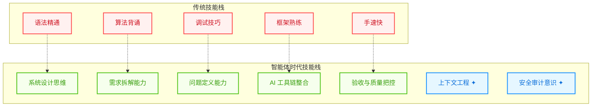

图 10-4：开发者技能栈的转变

#### 1.5.2 新型开发者画像

| 能力维度  | 传统开发者     | 智能体时代开发者      |
| ----- | --------- | ------------- |
| 核心竞争力 | 编码速度和技巧   | 问题定义和系统思维     |
| 日常工作  | 写代码、调试    | 需求拆解、审查 AI 输出 |
| 学习重点  | 新框架、新语言   | 提示词工程、上下文工程   |
| 质量保证  | 代码审查、单元测试 | AI 输出验证、护栏设计  |
| 团队协作  | 人-人协作     | 人-AI-人协作      |

#### 1.5.3 职业发展影响

**重要**： **智能体编程不会取代开发者，而是改变开发者的工作方式。** 重复性编码工作将被自动化，但以下能力将更加重要：

* 理解业务需求并转化为技术方案
* 设计可维护、可扩展的系统架构
* 审查 AI 生成代码的质量和安全性
* 处理 AI 无法解决的复杂边缘情况

### 1.6 三代范式演进：从提示词到驾驭工程

#### 1.6.1 三代范式的定义与演进

自 2023 年以来，在如何有效驱动大语言模型方面，工程实践经历了三个递进的范式演变。它们分别关注“我们说什么”、“模型看见什么”和“整个系统怎么运转”：

**提示词工程（Prompt Engineering）** 关注：*“我对模型说什么”*

这是最初的范式。开发者通过精心设计提示词、调整 temperature 和 top-k 等参数，试图在一次请求中获得完美输出。这本质上是一种 **开环控制** 思路——把指令塞进去，期待模型一次做对。

| 特点   | 描述             |
| ---- | -------------- |
| 控制方式 | 开环（输入→输出）      |
| 关键技术 | 思维链、少样本提示、角色扮演 |
| 失败模式 | 随机失败、无纠错机制     |
| 应用范围 | 单步任务、结构化输出     |

**上下文工程（Context Engineering）** 关注：*“模型此刻看见什么”*

随着应用复杂化，开发者发现输出质量往往受限于“模型能看见什么”。上下文工程通过 RAG（检索增强生成）、记忆管理、上下文压缩等动态策划信息环境，让模型在最优信息基础上做决策。这是一种 **改进的输入**，但仍缺少 **纠错机制**。详见第 3.6 节。

| 特点   | 描述                 |
| ---- | ------------------ |
| 控制方式 | 开环（优化的输入→输出）       |
| 关键技术 | RAG、向量检索、信息检索、记忆蒸馏 |
| 改进点  | 提高信噪比、减少幻觉         |
| 局限   | 仍无反馈修正能力           |

**驾驭工程（Harness Engineering）** 关注：*“整个系统如何运转”*

真正的突破来自将智能体嵌入完整的 **闭环控制系统**。驾驭工程不只关注提示词或信息，而是设计包裹在模型外围的整套运行环境架构——**沙箱、反馈回路、权限治理、状态管理、可观测性、断路器**。这使得智能体能够自动发现错误、修正错误并根据反馈调整策略。

核心洞察是：***智能在模型里，可靠性在 Harness 里。*** LLM 的能力强大但不确定，Harness 将这种不确定性转化为可控的风险——允许系统犯错、发现错、修正错。与“人在回路中”的逐件审批不同，驾驭工程倡导“人在回路之上”：人负责 **设计规则和环境**，AI 自主运行并在遇到例外情况才需人工介入。

驾驭系统的详细架构与实现见第 10.2.5 节「智能体驾驭系统」。

下图展示了三代范式的演进：

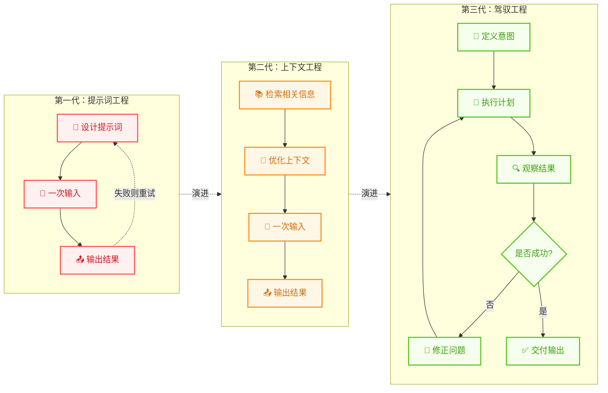

图 10-5：三代范式的演进路径

#### 1.6.2 控制论的复兴

驾驭工程的理论基础来自控制论（Cybernetics），这门学科由 **诺伯特·维纳（Norbert Wiener）** 在 1948 年著作《控制论》中正式奠基。维纳的核心洞察是：通过 **误差反馈**——监测系统状态与目标的偏差，据此调整控制参数，周而复始使偏差趋近于零——可以构建可靠的控制系统。

这个原理早已渗透现代工程的每个角落（TCP 拥塞控制、Kubernetes 自动扩缩容、智能手机自动亮度等），但 LLM 是人类构建的最大的 **非线性黑盒系统**，让控制论迎来了最严苛的试验场。同一提示词在不同时刻可能产生完全不同的结果，微小的幻觉在多步推理中被指数放大。因此，没有闭环反馈机制的智能体如同“没有陀螺仪的火箭”。

关于可观测性与反馈回路的详细工程实现，参见第 9.3 节；关于故障韧性与断路器设计，参见第 9.6 节；关于上下文工程的详细策略，参见第 3.6 节。

### 1.7 Agentic Coding 的工程挑战

尽管前景广阔，Agentic Coding 在工程实践中仍面临挑战：

#### 1.7.1 确定性与可重复性

智能体的行为具有一定的随机性，同样的输入可能产生不同的输出。

**应对策略**：

* 使用低温度（temperature）参数
* 建立测试套件验证输出
* 版本控制智能体配置

#### 1.7.2 上下文管理

大型代码库可能超出上下文窗口限制。

**应对策略**：

* 动态上下文检索
* 代码库索引和语义搜索
* 分层上下文注入

#### 1.7.3 安全性

智能体可能执行危险操作或生成不安全代码。

**应对策略**：

* 沙箱执行环境
* 敏感操作审批机制
* 代码安全扫描

#### 1.7.4 调试困难

当智能体的输出不符合预期时，很难追踪问题根源。

**应对策略**：

* 详细的执行日志
* 思维链可视化
* 分步执行模式

## 2. 智能体编程原理

要真正掌握 Agentic Coding，必须打开 AI 的“黑盒”，看看它是如何工作的。本节深入解析智能体的核心工作机制，帮助你从原理层面理解智能体编程。

智能体并不是能一次性生成完整代码的魔术师，而是一个 **状态机**。它的工作流程是一个被“展开”的循环：

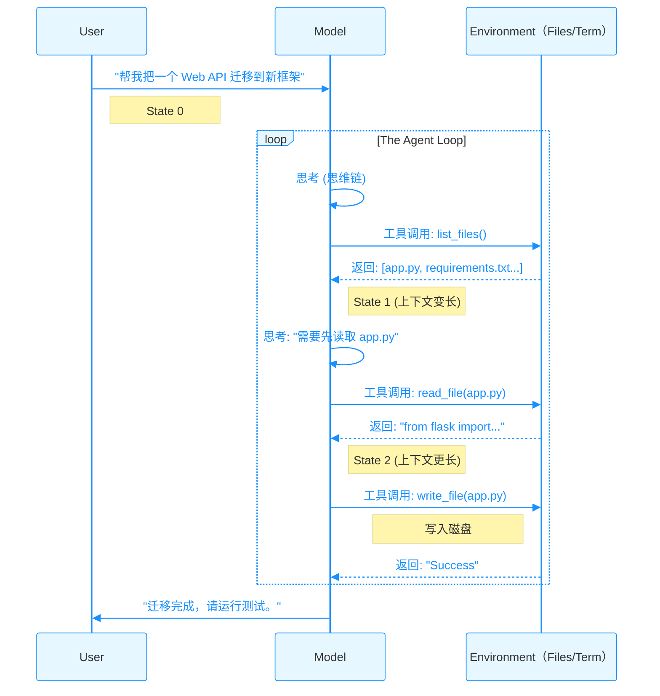

图 10-6：智能体循环序列图

### 2.1 微观循环：智能体循环的三个阶段

这里说的 **Agent Loop** 是执行器内部的微观闭环，回答的是“这一轮下一步做什么”。它和后文 [10.4 节](/agentic_ai_guide/di-san-bu-fen-gong-cheng-shi-jian-yu-luo-di/10_agentic_coding/10.4_workflow.md)讨论的任务级 workflow 不是两套互斥概念，而是嵌套关系：

* **Think → Act → Observe**：单次迭代的微观闭环
* **Gather → Action → Verify**：把多轮微观迭代折叠后的执行策略视角
* **Plan → Decompose → Execute → Review**：开发者与智能体协作的任务级工作流闭环

换句话说，workflow 包裹多个 agent loop；agent loop 则是 workflow 真正落地执行时反复转动的引擎。

#### 2.1.1 Think-Act-Observe：单次迭代

每次循环都包含以下三个阶段：

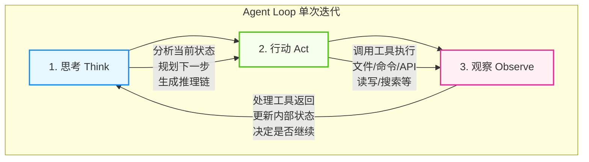

图 10-7：智能体循环的三个阶段

#### 2.1.2 Gather-Action-Verify：执行阶段的中观视角

前面的 **Think → Act → Observe** 描述了单次迭代内的微观流程：模型如何思考、执行和接收反馈。而从更宏观的工程视角看，一个完整任务在执行阶段又可以抽象为 **Gather（收集） → Action（行动） → Verify（验证）**。它关注的不是某一轮循环内部发生了什么，而是多轮迭代合在一起时，这个阶段采用了哪些工程策略。

因此，Gather-Action-Verify 不是对 Think-Act-Observe 的替代，而是更粗粒度的“折叠视图”：Gather 往往对应若干轮搜索/读取 loop，Action 往往对应若干轮编辑/执行 loop，Verify 则往往对应若干轮测试/审查 loop。到 [10.4 节](/agentic_ai_guide/di-san-bu-fen-gong-cheng-shi-jian-yu-luo-di/10_agentic_coding/10.4_workflow.md) 再往上一层，就会进入任务级的 P-D-E-R 闭环。

**Gather 阶段**（收集上下文）有四种主要策略：

1. **Agentic 搜索**：智能体像开发者一样，使用 `ls`、`grep` 等工具主动探索文件系统，动态发现所需文件而非预加载全部内容
2. **语义搜索（Semantic Search）**：通过向量化和相似度计算快速定位相关文档片段；比 agentic 搜索快但精度较低
3. **子智能体（Subagents）**：派遣专门的子智能体去并行收集信息，返回摘要结果来减轻主智能体的上下文压力
4. **上下文压缩（Compaction）**：当上下文接近窗口限制时，自动总结历史对话并重启新的上下文窗口，保持连贯性

**Action 阶段**（执行行动）支持五种主要的行动方式：

1. **工具调用（Tools）**：如文件读写、数据库查询等；是智能体最基本的行动单位
2. **Bash 命令与脚本**：通过 Shell 执行系统级操作，适合复杂的环境交互
3. **代码生成**：生成 Python、JavaScript 等代码来执行复杂的计算或数据处理任务
4. **模型上下文协议（MCP）**：标准化的集成接口，连接 Slack、GitHub、Asana 等第三方服务；预构建服务可封装具体 API 调用，但受保护的 HTTP MCP 服务仍需按规范配置授权发现、token 传递与权限边界
5. **复合行动**：在单个迭代中并发执行多个独立的工具调用，充分利用并发能力

**Verify 阶段**（验证结果）有三种常见的验证方法：

1. **规则与检查清单**：定义明确的成功标准。例如代码生成后运行 linter，或在文件写入后验证格式
2. **视觉反馈**：对 UI 生成或渲染类任务，通过截图让智能体直观确认结果是否符合预期
3. **LLM-as-Judge**：由另一个 LLM 实例来审核第一个智能体的输出，评分是否满足质量标准

#### 2.1.3 循环何时终止？

Agent Loop 在以下情况下终止：

1. **任务完成**：智能体判断目标已达成
2. **达到最大迭代次数**：防止无限循环
3. **遇到错误**：无法恢复的错误导致终止
4. **用户中断**：用户手动停止执行
5. **Token 预算耗尽**：上下文窗口接近限制

**重要**：当多个终止条件同时满足时，应遵循以下优先级：

1. **用户中断** （最高优先级，立即停止）
2. **Token 预算耗尽** （防止上下文溢出）
3. **最大迭代次数** （防止死循环）
4. **无法恢复的错误** （记录状态并退出）
5. **任务完成** （正常终止，生成总结）

#### 2.1.4 从零构建：最小可运行智能体

前面几节用图和文字描述了 Agent Loop 的原理。下面用约 50 行 Python 将其落地为一个 **完整可运行的最小智能体**，帮助读者从代码层面理解循环、工具调用、停止判断和错误处理是如何协作的。

```python
import anthropic, json

# 1. 定义工具——描述越详细，模型的工具选择越准确
tools = [
    {
        "name": "read_file",
        "description": "读取本地文件系统中指定路径的文件，返回其完整文本内容。"
                       "适用于需要查看文件当前状态的场景。路径为相对或绝对路径。",
        "input_schema": {
            "type": "object",
            "properties": {"path": {"type": "string", "description": "文件路径"}},
            "required": ["path"],
        },
    },
    {
        "name": "write_file",
        "description": "将指定内容写入本地文件。如果文件已存在则覆盖，不存在则创建。"
                       "写入前请先用 read_file 确认当前内容，避免意外覆盖。",
        "input_schema": {
            "type": "object",
            "properties": {
                "path": {"type": "string", "description": "目标文件路径"},
                "content": {"type": "string", "description": "要写入的完整文件内容"},
            },
            "required": ["path", "content"],
        },
    },
]

# 2. 工具执行器：将模型的工具调用映射到真实操作
def execute_tool(name: str, args: dict) -> str:
    if name == "read_file":
        return open(args["path"]).read()
    elif name == "write_file":
        open(args["path"], "w").write(args["content"])
        return f"已写入 {args['path']}"
    return f"未知工具: {name}"

# 3. Agent Loop：核心循环
def agent_loop(task: str, max_turns: int = 10):
    client = anthropic.Anthropic()
    system = (
        "你是一个文件编辑助手。仅操作用户指定的文件，不要访问其他路径。"
        "修改文件前必须先读取当前内容，确认变更范围后再写入。"
        "如果操作失败，向用户说明原因，不要自行重试超过 2 次。"
    )
    messages = [{"role": "user", "content": task}]

    for turn in range(max_turns):
        # Think: 模型基于当前上下文生成响应
        response = client.messages.create(
            model="claude-sonnet-4-6",
            max_tokens=4096,
            system=system,
            tools=tools,
            messages=messages,
        )

        # 将模型响应追加到消息历史
        messages.append({"role": "assistant", "content": response.content})

        # 终止条件：模型不再请求工具调用
        if response.stop_reason == "end_turn":
            final = [b.text for b in response.content if b.type == "text"]
            print(f"✅ 完成: {final[0] if final else '(无文本)'}")
            return

        # Act + Observe: 模型请求了工具调用，逐一执行
        if response.stop_reason == "tool_use":
            tool_results = []
            for block in response.content:
                if block.type == "tool_use":
                    print(f"🔧 调用 {block.name}({json.dumps(block.input, ensure_ascii=False)})")
                    try:
                        result = execute_tool(block.name, block.input)
                        is_error = False
                    except Exception as e:
                        result = f"错误: {e}"
                        is_error = True
                    tool_results.append({
                        "type": "tool_result",
                        "tool_use_id": block.id,
                        "content": result,
                        "is_error": is_error,
                    })
            # 工具结果以 user 消息形式回注（tool_result 必须紧跟对应的 tool_use）
            messages.append({"role": "user", "content": tool_results})

    print("⚠️ 达到最大迭代次数，终止")

# 运行
agent_loop("读取 config.yaml，将其中的 debug: true 改为 debug: false 后写回")
```

这段代码完整实现了前述的三个阶段：**Think**（模型推理）→ **Act**（执行工具）→ **Observe**（结果回注）。几个值得注意的设计决策：

* **`stop_reason` 驱动控制流**：API 返回 `"tool_use"` 表示模型请求调用工具，返回 `"end_turn"` 表示任务完成。这是 Anthropic Messages API 的标准模式。
* **工具描述的详细度**：官方文档指出，工具描述是影响工具调用准确性的最重要因素。即使在最小示例中，也应提供清晰的使用场景和注意事项。
* **`system` 参数**：系统提示词通过 API 的顶层 `system` 参数传入（而非作为消息），用于设定智能体的角色和行为边界。
* **消息顺序**：`assistant` 消息（含 `tool_use` 块）必须紧接 `user` 消息（含对应的 `tool_result` 块），这是 API 的格式要求。
* **上下文增长**：每轮循环后 `messages` 列表都在变长——模型响应和工具结果不断追加。这就是 10.2.4 节“冰山之下”的不可见状态。
* **错误容忍**：工具执行失败时，错误信息格式化后回传给模型，并通过 `is_error: true` 标志明确告知模型这是一次失败的调用（而非正常返回），模型据此决定重试或换一种方式——这正是闭环反馈的力量。
* **护栏**：`max_turns` 防止无限循环，对应 10.2.1.3 的终止条件。

> **提示**：生产环境不会直接使用这段代码，但它展示了所有智能体框架的核心骨架。无论是 LangGraph、CrewAI 还是 Claude Code，底层都是这个“循环 + 工具调用 + 结果回注”的模式，只是在此基础上增加了并发、状态持久化、权限控制和可观测性等工程层。

### 2.2 并发执行与输出控制

在单步循环中，模型有时需要同时执行多个独立的操作——例如同时搜索文件、获取 API 数据和验证中间结果。现代智能体平台支持在一轮迭代中提出多个工具调用，并发执行以缩短总延迟。

#### 2.2.1 并发调度

当模型在一次响应中提出多个工具调用时，编排器需要判断这些调用之间是否存在依赖关系：

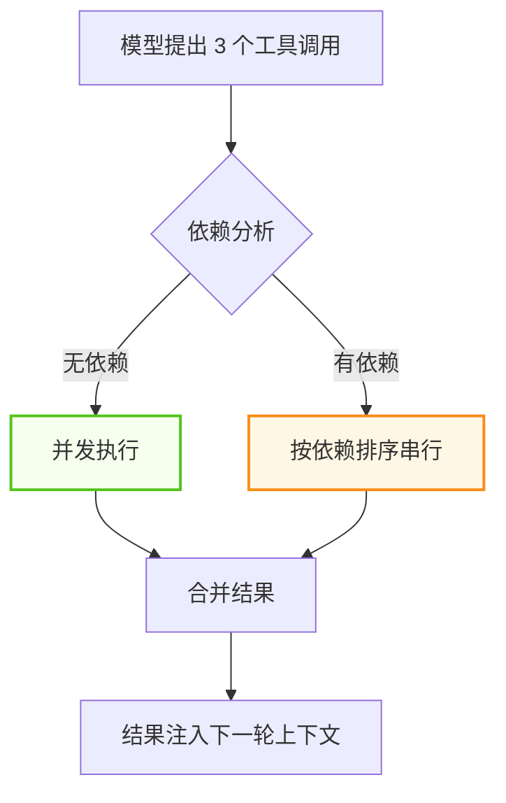

图 10-8：多工具调用的依赖分析与并发调度

无依赖的调用可以通过多个容器会话并发执行，每个会话独立流式返回输出。编排器将这些输出整合为结构化的工具结果，再统一提供给模型作为上下文。

#### 2.2.2 输出截断策略

当工具调用涉及文件操作或数据处理时（如 `npm install` 的安装日志、大型 CSV 的查询结果），输出可能非常庞大。如果这些内容全部进入上下文窗口，会迅速消耗 Token 预算却未必提供有效信息。

解决方案是为每个工具调用设置 **输出上限**。编排器强制执行这个限制，返回被截断但保留首尾的结果：

```
命令输出（原始 50,000 字符）：
前 1,500 字符完整保留
... [47,000 chars truncated] ...
后 1,500 字符完整保留
```

这种“保留首尾、截断中间”的策略，让模型既能看到命令的初始状态（如安装开始）又能看到最终结果（如成功/失败），而不会被中间的冗长日志淹没。

并发执行与输出截断结合在一起，使智能体循环既快速又节省上下文空间。

### 2.3 停止序列的魔法

模型本质上是一个“文本补全机”。如果没有约束，它会在生成 `tool_call()` 后继续幻想出工具的返回结果。

智能体工作的关键在于 **停止序列（Stop Sequence）**。

#### 2.3.1 工作原理

停止序列的作用是把一次生成切成“模型说话”和“宿主执行”两段，下图给出一次完整往返。

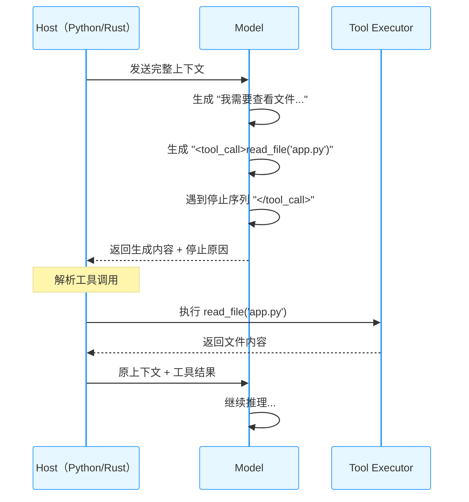

图 10-9：停止序列工作原理

#### 2.3.2 关键机制

* 当模型生成特定的停止符（如 `\nObservation:` 或 `</tool_call>`）时，推理 **强制暂停**
* 控制权交还给 Python/Rust 宿主程序
* 宿主程序执行真正的 Shell 命令或文件读写
* 宿主将结果拼接到上下文后面，**再次调用模型**

这就是为什么有时候你会感觉到智能体“卡顿”了一下——那正是它停止生成、等待工具执行完并返回结果的时刻。

#### 2.3.3 不同接口的停止序列设计

| 接口形态     | 停止序列格式              | 工具调用格式      | 典型代表                            |
| -------- | ------------------- | ----------- | ------------------------------- |
| 函数调用接口   | 内置 function calling | JSON Schema | OpenAI / Anthropic Messages API |
| XML 标签风格 | `</tool_use>`       | XML-like    | 早期 Claude XML 模式                |
| 文本标记风格   | `\nObservation:`    | 自然语言 + JSON | LangChain ReAct                 |
| 端侧工具协议   | 模型内部标记              | 专有格式        | 端侧推理引擎                          |

> **注意**：现代主流 API（如 Anthropic Messages API、OpenAI Chat Completions）已将停止序列机制封装到结构化的响应中——开发者无需手动解析 XML 标签或文本标记，只需检查 `stop_reason`（Anthropic）或 `finish_reason`（OpenAI）字段即可判断模型是否请求了工具调用。10.2.1.4 的代码示例正是使用了这种封装后的接口。

### 2.4 不可见的状态

在 Chat 界面上，你只看到了“你好”和“结果”。但在冰山之下，上下文窗口里堆积了成千上万行你没看见的内容：

#### 2.4.1 冰山图

用户能看到的只是对话与文件改动，真正决定行为的大部分状态都在水面之下。

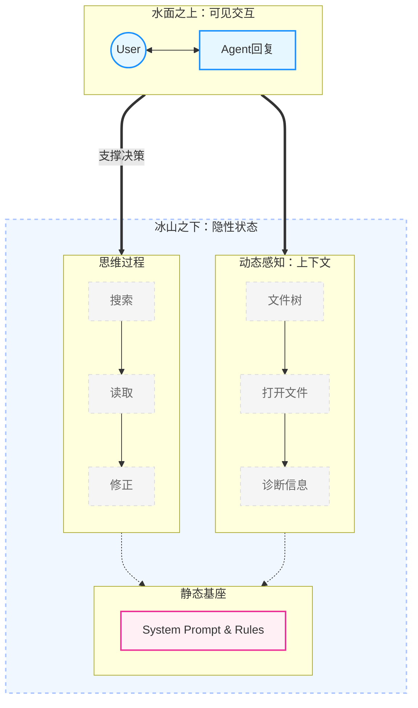

图 10-10：智能体不可见状态：冰山模型

#### 2.4.2 隐藏状态的类型

1. **LSP 诊断信息**：你没运行代码，但智能体已在后台运行了 Linter 并看到了报错
2. **文件树快照**：智能体默默看了一眼目录结构
3. **当前打开的文件（Active Tabs）**：这是最容易被忽视的隐形杀手。IDE 往往会将你当前打开的所有文件的摘要甚至全文自动注入上下文。打开太多无关文件会让智能体“分心”。
4. **搜索结果**：智能体执行了多次代码搜索
5. **自我修正历史**：智能体可能尝试了 3 次修改失败，第 4 次才成功，但只展示了最后的结果
6. **系统提示词**：框架注入的规则和约束

#### 2.4.3 为什么这很重要？

理解这一点，你就会明白：

> **当智能体表现不佳时，往往不是它“笨”，而是不可见的状态（上下文）被污染了。**

**常见污染场景**：

* 早期对话中的错误假设被保留
* 无关文件的内容占用了上下文空间
* 失败尝试的堆积导致智能体“困惑”

**解决方案**：

* 重置对话（New Chat）——清空不可见噪音的最有效手段
* 使用 @ 引用精确控制上下文
* 定期检查智能体“看到了什么”

### 2.5 智能体驾驭系统

[10.1.6 节「三代范式演进：从提示词到驾驭工程」](/agentic_ai_guide/di-san-bu-fen-gong-cheng-shi-jian-yu-luo-di/10_agentic_coding/10.1_paradigm.md)介绍了驾驭工程（Harness Engineering）的理论基础——通过闭环控制系统让智能体自主运行并自我纠错。本节聚焦于**具体的组件实现**：在实际的智能体编程产品中，驾驭系统是如何通过消息、工具和指令三层结构落地的。

一个完整的智能体驾驭系统通常由三层核心组件构成：消息、工具和指令。

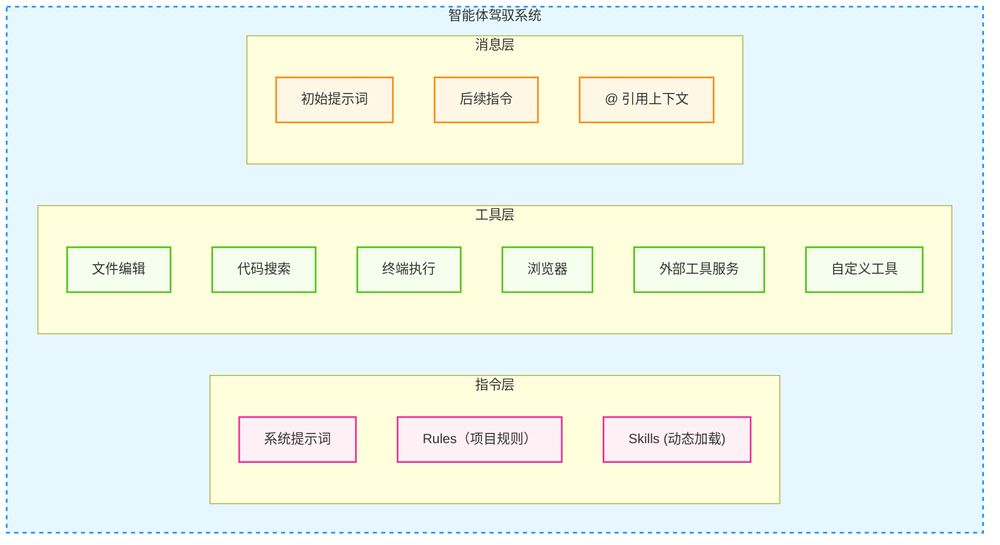

图 10-11：智能体驾驭系统组件架构

**三大组件详解**

#### 2.5.1 用户消息

驱动智能体行动的输入：

* **初始提示词**：描述任务目标
* **后续指令**：提供反馈和调整
* **@ 引用**：精确注入上下文

#### 2.5.2 工具

赋予智能体执行能力。典型的编程智能体工具集包括：

| 工具                         | 能力      | 说明                     |
| -------------------------- | ------- | ---------------------- |
| `file_read`                | 读取文件    | 查看源码、配置文件等的当前内容        |
| `file_write` / `file_edit` | 写入/编辑文件 | 创建新文件或修改已有文件           |
| `file_search`              | 语义搜索    | 基于向量相似度定位相关代码片段        |
| `grep_search`              | 正则搜索    | 精确匹配符号名、字符串等           |
| `run_command`              | 终端命令    | 执行构建、测试、Git 等 Shell 操作 |
| `browser_action`           | 浏览器操作   | 预览 UI、截图、抓取文档          |
| `tool_service`             | 外部工具服务  | 通过 MCP 等协议调用第三方 API    |

#### 2.5.3 指令

控制智能体的行为和风格：

| 类型     | 位置     | 作用     | 加载时机 |
| ------ | ------ | ------ | ---- |
| 系统提示词  | 框架内置   | 定义基本行为 | 始终加载 |
| Rules  | 项目规则目录 | 项目特定约定 | 始终加载 |
| Skills | 技能目录   | 领域知识   | 按需加载 |
| 项目说明文件 | 项目根目录  | 约定与说明  | 始终加载 |

#### 2.5.4 模型差异

不同模型对同一套驾驭机制的反应可能不同，例如指令遵循、工具调用鲁棒性、长任务稳定性等。实践中应通过小规模评测与回归测试来选择模型组合。

> **提示**：高效的 Agentic Coding 需要学会通过 Rules 和 Skills 来调整驾驭机制，以适配不同模型的特点。

### 2.6 编程场景下的上下文管理

上下文工程的通用原理——持久化、筛选、压缩、隔离——已在[第 3.6 节](/agentic_ai_guide/di-yi-bu-fen-dan-ti-zhi-neng-jia-gou/03_memory/3.6_context_engineering.md)中详细讨论。本节聚焦于 **编程场景下的特殊挑战**：代码库的上下文远比普通对话复杂，文件数量多、依赖关系深、中间产物（编译日志、测试输出）体量大。

#### 2.6.1 编程上下文的组成

与一般对话不同，编程智能体的上下文窗口有独特的组成结构：

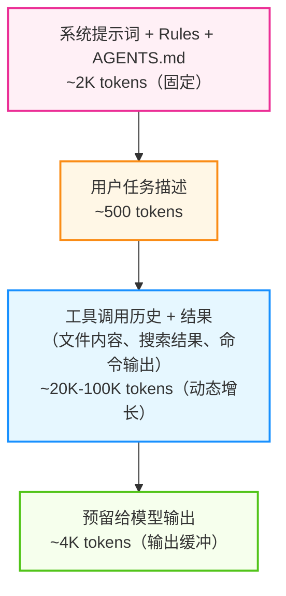

图 10-12：上下文窗口组成结构

其中“动态增长区域”是编程场景的最大变量——一次 `grep` 搜索可能返回数千行匹配，一次 `npm install` 日志可能占用数万 Token。10.2.2 节讨论的输出截断策略正是为了控制这部分增长。

#### 2.6.2 编程场景的四个特有陷阱

| 陷阱           | 表现                              | 应对                                                 |
| ------------ | ------------------------------- | -------------------------------------------------- |
| **IDE 隐式注入** | 编辑器将所有打开文件的摘要自动注入上下文，无关文件占用大量空间 | 关闭无关标签页，只保留当前任务相关文件                                |
| **失败尝试堆积**   | 智能体连续 3 次修改失败，失败代码和报错信息全部留在上下文中 | 及时重置对话（New Chat），用 `@` 引用只保留成功路径                   |
| **大型工具输出**   | 编译日志、测试报告、搜索结果等体量巨大             | 依赖编排器的输出截断（保留首尾，截断中间）                              |
| **跨文件依赖链**   | 修改 A 文件需要理解 B、C、D 的接口，上下文迅速膨胀   | 用类型定义和接口文件代替完整源码，优先注入 `.d.ts`、`__init__.py` 等摘要性文件 |

#### 2.6.3 上下文恢复技巧

当上下文被污染（智能体重复犯错、提到无关文件、忘记约定、响应变慢）时，**重置对话是最有效的手段**。但很多开发者不愿重置，因为怕丢失进度。

解决方案是 **“交接文档”模式**：在重置前，将当前进度总结到一个文件中：

```markdown
<!-- handoff_note.md -->
## 已完成
- 用户认证模块迁移完成（src/auth/）
- 数据库 Schema 已更新

## 下一步
- 迁移支付模块（src/payment/）
- 关键决策：使用 Stripe SDK v3，不用 v2

## 注意事项
- payment_service.py 第 45 行有一个已知的竞态条件，暂不处理
```

在新对话中只需 `@handoff_note.md`，智能体即可恢复“工作记忆”，而不必背负之前几百轮对话的 Token 债务。

### 2.7 智能体调试与问题定位

当智能体表现异常时，如何定位问题？

#### 2.7.1 调试清单

智能体出问题时，按输入、配置、执行、输出的顺序逐层排查，比直接改提示词更快定位。

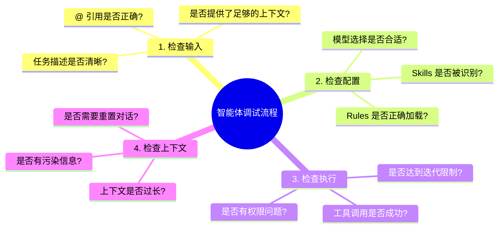

图 10-13：智能体调试流程

#### 2.7.2 常见问题及解决方案

| 问题          | 可能原因        | 解决方案           |
| ----------- | ----------- | -------------- |
| 智能体不调用工具    | 任务描述不明确     | 明确说“请修改文件”     |
| 智能体修改错误文件   | 上下文中有多个相似文件 | 使用 @ 精确引用      |
| 智能体重复失败尝试   | 上下文污染       | 重置对话           |
| 智能体响应变慢     | 上下文过长       | 精简引用内容         |
| 智能体忽略 Rules | Rules 格式错误  | 检查 Markdown 格式 |


## 3. 常见工具

本节用“工具类型与能力结构”的方式，介绍常见的智能体编程工具与工作流形态，帮助你建立选型与组合的视角。

## 3.1 GitHub Copilot

GitHub Copilot 的云端 coding agent 深度集成在 GitHub 协作面中，更像“在代码托管平台里运行的后台开发者”：任务通常从 issue、Copilot Chat、PR 评论或安全活动里发起，在 GitHub 提供的短暂开发环境中研究仓库、修改代码并迭代。

#### 3.1.1 核心场景

| 场景                          | 描述                        | 典型入口                                           |
| --------------------------- | ------------------------- | ---------------------------------------------- |
| **Issue / Prompt → 分支或 PR** | 接收任务后研究仓库、规划、改代码，并按需创建 PR | 指派 issue 给 Copilot，或在 GitHub/VS Code 中要求它创建 PR |
| **PR 迭代**                   | 在现有 PR 上继续修改              | 在 PR 评论里 `@copilot` 提出后续要求                     |
| **安全修复**                    | 从安全活动中接任务并提交修复            | 安全 campaign / alert 工作流                        |
| **代码审查协作**                  | 围绕 PR 日志和 diff 继续协作       | agents panel、PR 页面、Copilot Chat                |

#### 3.1.2 常见入口示例

相比“自己写一个 YAML 去触发它”，GitHub Copilot cloud agent 更常见的使用方式是直接从 GitHub 的协作入口发起任务：

```markdown
1. 在 GitHub Issue 页面把 assignee 设为 Copilot
2. 在 GitHub Copilot Chat 中要求：
   "Research this repository, implement the fix, and open a pull request."
3. 在现有 PR 评论中继续追单：
   "@copilot fix the failing tests and update the PR."
```

#### 3.1.3 平台机器人与交互式环境

需要区分两个概念：

* **平台机器人**：运行在 CI/CD 或平台自动化环境中的机器人，处理异步任务。
* **交互式环境**：IDE 或 Web 端的对话式/多文件编辑体验，用于人机协作完成开发。

在 IDE 端协作时，常见的工作区级提问方式如下；不同产品的具体命令名会不同：

```markdown
@workspace /explain 解释这个项目的架构
@workspace /fix 修复当前文件的所有警告
@workspace /tests 为选中的代码生成测试
@workspace /doc 更新这个函数的文档
```

### 3.2 Cursor

Cursor 是典型的 AI 原生编辑器。当前官方文档把能力中心放在 Agent、Rules、Terminal、MCP 和 Background Agents 上，而不是早期材料里常见的若干旧命名。理解它时，最好把“上下文控制”“工具执行”和“自动运行权限”分开看。

#### 3.2.1 核心能力

| 能力                        | 描述                             | 典型入口                                  |
| ------------------------- | ------------------------------ | ------------------------------------- |
| **Agent**                 | 多文件修改、终端执行、错误修复                | Chat / Agent 面板                       |
| **@ 引用**                  | 精确选择文件、文件夹与其他上下文               | `@`                                   |
| **Rules / AGENTS.md**     | 注入持续生效的项目指令                    | `.cursor/rules`、项目根 `AGENTS.md`       |
| **MCP 工具**                | 连接数据库、API 与外部服务                | MCP 配置与工具列表                           |
| **Auto-run / Guardrails** | 控制是否自动执行命令、自动接受编辑，以及允许哪些操作自动运行 | Agent 设置、Custom Modes、CLI `/auto-run` |

#### 3.2.2 @ 引用系统

“@ 引用”能力用于精确控制上下文，按需指定要分析的文件、文件夹、文档或历史记录。这让 IDE 智能体可以集中分析并跨文件修改，而不是逐个处理。常见的引用类型包括：`@file`（单个文件）、`@folder`（文件夹）、`@code`（代码片段）、`@git`（历史记录）等。

**使用建议**：

* 明确指定上下文范围，减少模型的搜索成本
* 使用 `@definitions` 引用跨文件的符号定义，确保修改的一致性
* 对复杂重构任务，先通过 `@folder` 引用整个子模块理解架构

#### 3.2.3 上下文与规则管理

Cursor 当前官方支持的核心约束层主要是 **Rules** 与 **`AGENTS.md`**。其中，`.cursor/rules` 提供可复用、可分作用域的规则；`AGENTS.md` 是更简单的 Markdown 指令文件；CLI 还会在项目根同时读取 `AGENTS.md` 与 `CLAUDE.md` 并作为规则应用。它们都属于“指令层”，不是权限执行面。

#### 3.2.4 工具与权限控制

Cursor 的“能做什么”和“会不会自动做”需要分开理解：

* **前台 Agent / CLI**：默认会对终端命令和 MCP 工具请求批准；Cursor CLI 文档也明确写到，运行终端命令前会要求用户批准。
* **Auto-run**：可以自动接受编辑、自动运行终端命令和 MCP 工具，但应配合 guardrails 或 allowlist 使用。
* **非交互式 CLI**：适合集成到脚本和 CI；官方文档明确说明此模式下 Cursor 具有完整写权限。
* **Background Agents**：运行在 Cursor 的远程环境中，会自动运行终端命令；这和前台 Agent 的逐次批准模型不同。

### 3.3 Cline

Cline（原 Claude Dev）是一个优秀的开源 VS Code 自主智能体扩展。它不仅支持连接云端模型，也完美支持本地模型（如 Ollama），是“本地化与自托管”场景的最佳代表。如果对数据隐私有严格要求，或希望更强的可控性与成本边界，可以选择 Cline 配合本地模型运行时。

典型的本地化开源组合方案如下：

**Cline（VS Code 扩展）**+**本地模型运行时**+**代码模型**

* **编辑器侧扩展**：读取文件、执行终端命令和编辑代码。
* **本地模型运行时**：在本机或内网部署模型推理。
* **代码模型**：用于补全、重构与解释。

Cline 支持连接本地模型运行时（如 Ollama）和云端模型。具体配置请参考 Cline 官方文档。

**选型对比**：

| 维度     | 本地模型       | 云端模型    |
| ------ | ---------- | ------- |
| **隐私** | ✅ 数据不出域    | ❌ 需上传云端 |
| **成本** | ✅ API 可控   | ❌ 按词元计费 |
| **能力** | ⚠️ 取决于本地算力 | ✅ 通常更强  |

**典型场景**：混合模式（日常补全用本地模型，复杂任务用托管模型）或企业内网统一部署。

### 3.4 Claude Code

Claude Code 是一款强大的 CLI 工具，擅长与终端工作流融合：批量修改、运行脚本、分析 Git 历史、生成变更摘要等。目前也已支持 IDE 插件和桌面版本。

#### 3.4.1 安装与配置

安装完成后，验证命令入口可用：

```bash
claude --version
```

#### 3.4.2 基本使用

常见的命令形态：

```bash
claude "重构这个目录下的测试文件，使用 pytest 风格"
claude -p "分析 src/ 目录，找出所有未使用的导入"
claude "分析最近 10 个 commit，生成 CHANGELOG"
claude "审查 src/api/auth.py 的安全性"
```

#### 3.4.3 交互模式

启动交互模式后可连续提问，Claude Code 会分析代码库、执行任务并生成 Git 变更摘要。

#### 3.4.4 项目级指令文件

Claude Code 使用 `CLAUDE.md` 作为项目级指令文件。包含技术栈、代码约定、已知问题等信息，便于智能体做出符合上下文的决策。

Claude Code 支持 `.claude/skills/` 目录加载自定义技能，以及 Hooks 在提交前、后执行自定义逻辑。技能系统可兼容标准化工具服务协议，让智能体安全地操作数据库、聊天工具等，无需胶水代码。

### 3.4.5 Effort 分级与示意性 AutoDream

Claude Code 支持 `effort` 参数控制推理深度（`low` / `medium` / `high` / `xhigh` / `max`）。按 [Anthropic 官方 effort 文档](https://platform.claude.com/docs/en/build-with-claude/effort)（核验于 2026-09-04），`xhigh` 是较新的档位，可用于 Fable 5.1、Mythos 5.1、Fable 5、Mythos 5、Opus 5、Opus 4.8、Opus 4.7 和 Sonnet 5；`max` 的可用范围更广（Claude 4.6 及之后的模型），因此有的模型支持 `max` 却不支持 `xhigh`。官方 API 默认档位是 `high`，使用 `xhigh` 或 `max` 时需要显式设置。`xhigh` 适合复杂重构、多文件迁移和架构级任务，通常会投入更多 token 来覆盖边界条件与跨模块依赖；`max` 提供最深度推理但 token 消耗最高。推荐策略是日常使用 `high`，深度推理场景切换到 `xhigh`，仅在评测显示 `xhigh` 仍有提升空间时使用 `max`。

这里的 AutoDream 不是 Claude Code 当前公开文档中的官方功能名，而是本书用于说明后台记忆整理的示意性称呼。更稳妥的写法是：可以基于 `CLAUDE.md`、`/memory`、`/compact`、subagents 与 hooks 等公开机制，工程化组合出一个在会话间隙整理记忆、修剪过期条目、解决冲突记录并补充时间戳的维护流程；除非目标仓库或一手文档给出证据，不应把 AutoDream 写成 Claude Code 内置机制。

### 3.5 Codex

Codex 是 OpenAI 的 coding agent 家族，覆盖 app、CLI、IDE extension 与 cloud task 等运行面；其中 CLI 是最典型的本地入口。当前官方文档列出的能力包括：在选定目录中读取、修改和运行代码，以及使用 subagents、web search、MCP 和 cloud tasks。

常见命令：

```bash
codex
codex "优化这个函数的性能"
codex exec "为当前仓库生成变更摘要"
```

Codex 使用 `AGENTS.md` 作为项目级指令来源之一，把仓库约束和协作要求注入上下文；但真正决定“能否自动编辑、能否执行命令、可访问哪些文件/网络”的，是单独的 **approval mode** 与 **sandbox configuration**。把 `AGENTS.md` 和权限控制混为一谈，会把“指令层”和“执行层”说乱。

### 3.6 工具对比

#### 3.6.1 工具执行与权限控制对比

图 10-14：智能体编程工具功能对比

| 工具                             | 主要运行面                             | 典型工具执行面                                       | 指令 / 规则面                                       | 权限与安全控制                                                |
| ------------------------------ | --------------------------------- | --------------------------------------------- | ---------------------------------------------- | ------------------------------------------------------ |
| **GitHub Copilot cloud agent** | GitHub.com + GitHub Actions 短暂环境  | 研究仓库、改代码、跑测试/linters、生成或迭代 PR                 | prompt、仓库上下文、平台配置                              | 仓库权限、分支保护、必需检查、PR 审批流                                  |
| **Cursor**                     | IDE、CLI、Background Agents         | 编辑、终端、MCP；Background Agent 在远程环境运行            | `.cursor/rules`、`AGENTS.md`、CLI 下的 `CLAUDE.md` | 前台默认逐项批准，支持 auto-run / guardrails；后台 agent 自动运行命令      |
| **Claude Code**                | CLI + IDE 集成                      | 文件、终端、MCP、hooks 驱动的校验与自动化                     | `CLAUDE.md`、memory、settings                    | approval / sandbox 配置，hooks 可在会话、回合、工具事件上插入控制          |
| **Codex**                      | App、CLI、IDE extension、cloud tasks | 编辑、shell、web search、MCP、subagents             | `AGENTS.md`、skills、配置文件                        | 显式的 approval mode + sandbox configuration，网络与外部工具可单独启用 |
| **Cline**                      | IDE 扩展 + 可选本地/云模型运行时              | 编辑、终端、浏览器/工具调用依赖宿主扩展与模型运行时                    | 项目说明文件、扩展设置                                    | 权限边界主要由扩展配置、宿主 IDE 与所接入运行时共同决定                         |
| **Mistral Vibe**               | CLI + Le Chat Web + 云端异步          | 远程沙箱中的文件编辑、shell、GitHub/Linear/Jira/Sentry 集成 | Le Chat Work mode 配置                           | 显式审批触发、diff 可视化、自动开 PR 而非直接推送                          |

> **其他工具**：除了上述主流类型，还有一些值得关注的创新形态：
>
> * **Aider**：CLI 工具的杰出代表，以其稳健的代码编辑能力和 Git 集成著称，常被视为“流式编辑”的标杆。
> * **Windsurf**：主打“Flow”（心流）体验的 IDE，通过 Cascade 引擎实现深度的上下文感知。
> * **Augment**：专注于极速的代码库索引与补全，强调对大型单体仓库（Monorepo）的即时感知能力。
> * **OpenHands**：开源社区的自主智能体平台（原 OpenDevin），探索多智能体协作与完全自主开发的未来形态。

Mistral Vibe 代表了一种新兴的“异步云端编码智能体”范式：agent 脱离本地终端，在远程隔离沙箱中并行运行、持续执行，完成后通过 diff 可视化和 PR 输出将结果交还开发者审批。这种模式将 agent 的生命周期从“交互式会话”延伸到“后台任务”，与 Cursor Background Agents 和 GitHub Copilot cloud agent 形成不同路线的对照。Mistral Medium 3.5（128B 参数，256k 上下文，Modified MIT 开放权重）在 SWE-Bench Verified 上达到 77.6%，为开放权重模型在 agentic coding 领域建立了新的基线。

#### 3.6.2 场景选择指南

根据不同任务选择合适的工具：

| 场景           | 推荐工具           |
| ------------ | -------------- |
| 日常开发/多文件编辑   | Cursor         |
| DevOps/脚本/终端 | Claude Code    |
| 代码托管工作流      | GitHub Copilot |
| 批量自动化任务      | Codex          |
| 异步后台编码       | Mistral Vibe   |
| 数据隐私优先       | Cline          |

### 3.7 工具组合策略

在实际项目中，典型的组合是：Cursor（日常开发）→ Claude Code / Codex（自动化任务）→ GitHub Copilot（流程自动化）。

**配置统一**：通过项目级指令文件和规则目录（如 `CLAUDE.md`、`AGENTS.md`、`.cursor/rules`）统一行为约定；再用各工具自己的 approvals、sandbox、guardrails 与仓库权限定义安全边界。

**分工边界**：

* **IDE 工具**：多文件编辑、局部重构、交互式调试
* **CLI 智能体**：批处理、仓库级扫描、测试与变更摘要
* **平台机器人**：事件驱动的自动化（Issue→PR、代码审查、定时任务）

## 4. 开发方法论

本节聚焦智能体编程的核心方法论，探讨如何将智能体融入日常开发工作流，实现从“写代码”到“编排 AI”的角色转变。

### 4.1 智能体开发闭环

在传统的开发流中，开发者亲自执行每一个循环。而在智能体工作流中，开发者上升为 **循环的管理者**。

这里说的“闭环”是**任务级闭环**，不是 [10.2 节](/agentic_ai_guide/di-san-bu-fen-gong-cheng-shi-jian-yu-luo-di/10_agentic_coding/10.2_loop.md) 的单次 Agent Loop。10.2 的 **Think → Act → Observe** 发生在一次执行迭代内部；本节讨论的是开发者如何把许多轮微观迭代组织成一个可交付、可审查、可回退的工作流。至于审批、沙箱、Hooks 和规则等工程护栏，则放在 [10.5 节](/agentic_ai_guide/di-san-bu-fen-gong-cheng-shi-jian-yu-luo-di/10_agentic_coding/10.5_best_practices.md) 处理。

#### 4.1.1 任务级工作流：P-D-E-R 闭环

我们将智能体开发工作流概括为 **P-D-E-R** 四步循环：

* **Plan** - 规划任务目标
* **Decompose** - 拆解任务为原子任务
* **Execute** - 执行原子任务
* **Review** - 审查结果并迭代

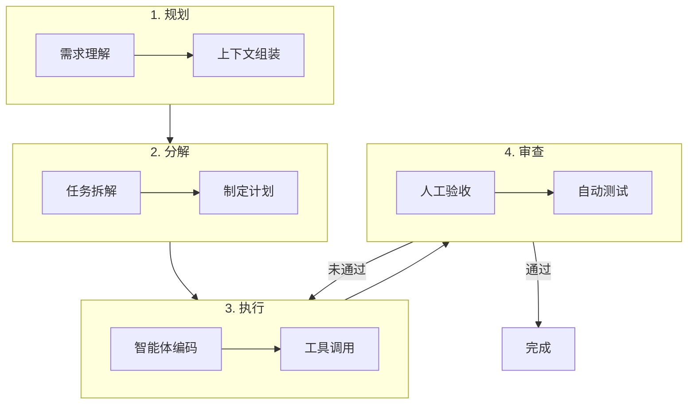

图 10-15：P-D-E-R 智能体开发循环

其中 **Execute** 往往会展开成多轮 Think-Act-Observe 微观循环；而 **Review** 的反馈既可能回到 Execute 继续修正，也可能上卷到 Plan / Decompose 重新定义任务边界。

#### 4.1.2 工作流核心步骤

1. **准备上下文**：收集需求相关背景
2. **拆解为原子任务**：分化复杂需求
3. **智能体执行**：编码与迭代，直到反馈通过
4. **集成与交付**：系统测试与部署

#### 4.1.3 规划先于执行

在现代智能体工具中，**规划模式** 是提升开发质量的核心功能。进入规划模式后，智能体不会立即编写代码，而是：

1. **调研代码库**：搜索相关文件，理解现有结构
2. **提出澄清问题**：确认需求边界和约束条件
3. **创建实施计划**：生成可编辑的 Markdown 计划文档
4. **等待批准**：用户确认后才开始实现

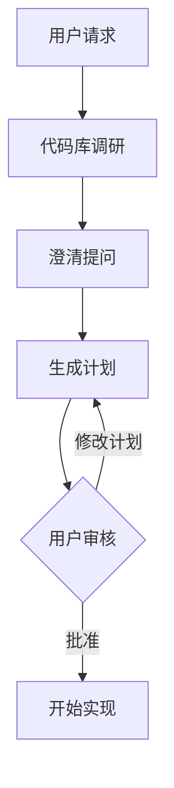

图 10-16：规划优先的开发流程

#### 4.1.4 时间分配的重构

这种工作流的变化导致了开发者时间分配的显著转移：

| 活动        | 传统开发 | 智能体开发（典型变化）      |
| --------- | ---- | ---------------- |
| **需求与架构** | 相对较少 | 占比上升，需要更精确地定义问题  |
| **编写代码**  | 占比较高 | 占比下降，更多变成“审查与整合” |
| **调试与测试** | 稳定投入 | 更依赖自动化与回归测试      |
| **审查与验收** | 相对较少 | 占比上升，为 AI 产出把关   |

### 4.2 任务分解与提示词设计

好的任务分解和精准的提示词是智能体编程的两大基础能力。本节将 DECOMPOSE 任务分解框架与 CLEAR 提示词框架结合，形成 **“需求→分解→表达”** 的完整方法论。

#### 4.2.1 DECOMPOSE 框架

为了让任务分解有章可循，可以把它拆成九个可逐条检查的动作。

```
D - Define     定义：明确任务目标和边界
E - Explore    探索：了解现有代码和约束
C - Chunk      切分：将大任务分解为小任务
O - Order      排序：确定执行顺序和依赖
M - Map        映射：为每个任务分配工具/智能体
P - Prompt     提示：为每个任务设计清晰的提示词
O - Observe    观察：监控执行过程
S - Synthesize 综合：整合结果并验证
E - Evolve     进化：总结经验更新规则
```

#### 4.2.2 任务分解示例

**需求**：“实现一个用户认证模块”

**分解步骤**：

1. **需求理解**：确认认证方式（令牌/会话/第三方）、用户模型、安全要求（MFA、密码策略）
2. **技术调研**：查看现有代码结构、确认框架版本、选择依赖库
3. **实现**（可并行）：用户模型 → 认证逻辑 → API 路由（依赖前两项） → 前端集成
4. **测试**：单元测试、集成测试、安全测试
5. **文档与部署**：API 文档、部署配置、变更日志

#### 4.2.3 CLEAR 提示词框架

分解完任务后，需要用精准的提示词向智能体表达每个子任务。本书提出 CLEAR 框架作为结构化的表达方式（注：此处的 CLEAR 为本书定义的实践框架，与其他同名框架定义不同）：

```
C - Context    上下文：提供相关背景信息
L - Location   位置：指明具体的文件和位置
E - Expected   预期：描述期望的行为或结果
A - Actual     实际：描述当前的问题或行为
R - Reference  参考：提供相关的参考实现
```

**示例应用**：

```markdown
C：API 使用某 Web 框架，认证采用令牌方案
L：@src/api/auth.py 的 verify_token 函数
E：Token 过期时应返回 401 并提示刷新
A：目前返回 500 错误，没有有意义的错误信息
R：参考 @src/api/middleware.py 中的错误处理模式
```

#### 4.2.4 提示词实践技巧

**提供充足上下文**：指明文件位置、预期行为、参考实现。 例：`@src/api/users.py get_user 函数在 ID 为空时返回 500 错误。预期返回 400 + 清晰错误信息。参考 @src/api/orders.py 的处理模式。`

**分步骤执行复杂任务**：逐项拆解而非一步完成。 例：(1) 设计 Schema → (2) ORM 模型 → (3) 认证模块 → (4) CRUD API → (5) 订单逻辑 → (6) 集成测试

**验证与测试同步请求**：生成代码时同步要求单元测试、边界情况测试、并发测试。这让智能体更容易验证正确性。

### 4.3 规范驱动开发

规范驱动开发（Spec-Driven Development，SDD）是软件开发的一种方法论，它强调先编写 **规范文档**（Specification），再让智能体按规范实现。它特别适合智能体编程场景：规范文档既是给人的设计文档，也是给智能体的高精度指令。

#### 4.3.1 为什么需要 Spec？

在传统开发中，开发者脑中有隐含的设计意图，边写代码边细化。但对智能体而言，**没有写下来的东西等于不存在**。规范文档解决了这个根本问题：

| 方式                 | 问题           |
| ------------------ | ------------ |
| 直接告诉智能体“实现一个缓存”    | 缺少约束，结果不可预测  |
| 口头描述 + 多轮对话修正      | 效率低，上下文积累不可控 |
| **先写 Spec，再交给智能体** | 一次性传达完整意图    |

#### 4.3.2 Spec 文档的结构

一个有效的 Spec 通常包含以下要素：

```markdown
## 功能规范：[功能名称]

### 目标

简要描述这个功能要解决什么问题。

### 约束条件

- 技术栈、框架、性能要求
- 必须遵循的现有模式或接口

### 接口定义

具体的输入/输出、API 签名、数据结构。

### 行为规则

- 正常流程的预期行为
- 边界情况的处理方式
- 错误场景的响应

### 验收标准

- 功能通过的具体条件
- 必须覆盖的测试场景

### 参考

- 相关代码文件（使用 @ 引用）
- 类似功能的现有实现
```

#### 4.3.3 示例：用 SDD 开发一个速率限制器

下面是一份可以直接交给智能体的功能规范，注意它写的是约束与验收标准，而不是实现步骤。

```markdown
## 功能规范：API 速率限制器

### 目标

为 API 网关实现请求速率限制，防止滥用。

### 约束条件

- 使用一个高速 KV 存储作为计数后端
- 与现有中间件链兼容（@src/middleware/chain.py）
- 单个请求增加延迟应尽量小

### 接口定义

class RateLimiter:
    def check(self, client_id: str) -> RateLimitResult
    def configure(self, policy: RateLimitPolicy) -> None

RateLimitResult: { allowed: bool, remaining: int, retry_after: int | None }
RateLimitPolicy: { requests_per_window: int, window_seconds: int }

### 行为规则

- 未超限：返回 allowed=True，更新计数
- 超限：返回 allowed=False，附带 retry_after 秒数
- 计数后端不可用时：降级放行，记录告警日志

### 验收标准

- 正常限流行为符合策略
- 后端故障时不阻塞请求
- 并发安全（多实例部署场景）
```

将这份 Spec 交给智能体后，它能清晰地理解：要做什么、不能违反什么、怎样算完成。相比模糊的口头描述，开发效率和产出质量都会大幅提升。

#### 4.3.4 SDD 与 TDD 的关系

SDD 和 TDD 是互补而非替代关系：

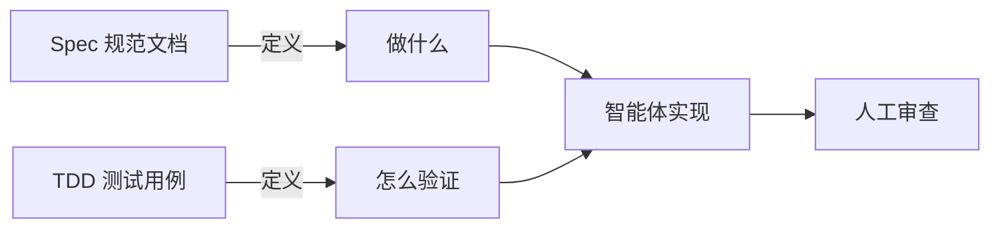

图 10-17：Spec 与 TDD 的互补关系

推荐的工作流是：**先写 Spec 定义边界，再写测试固化预期，最后让智能体实现**。这样智能体既有“目的地”（Spec），又有“导航仪”（测试），产出质量最高。

### 4.4 测试驱动开发

智能体在有明确目标可迭代时表现最佳。测试允许智能体做出更改、评估结果、逐步改进直到成功。

#### 4.4.1 TDD 工作流

把 TDD 交给智能体时，关键是让“写测试”和“写实现”分属两次独立提交，避免它同时改两边。

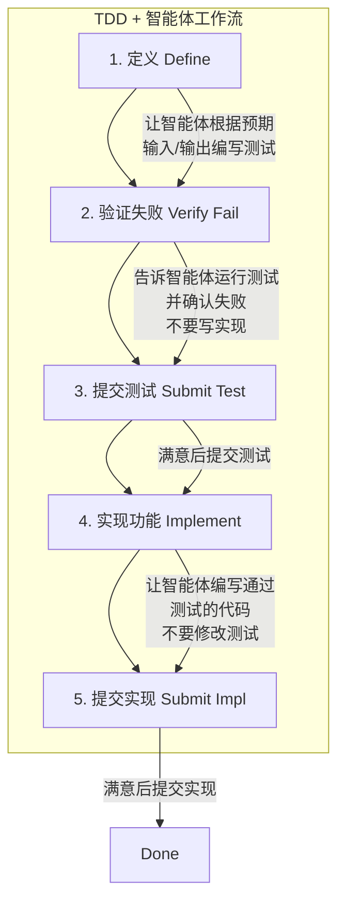

图 10-18：TDD 驱动的智能体工作流

#### 4.4.2 TDD 提示词示例

对应到实际对话，每一步都要明确限制智能体这一轮能做什么。

```markdown
第一步（定义测试）：
"为 LRU 缓存类编写测试，测试以下场景：
 - 基本 get/put 操作
 - 容量超限时淘汰最久未使用的项
 - 并发安全
 不要实现功能，只写测试。"

第二步（验证失败）：
"运行测试确认它们失败（因为还没有实现）"

第三步（实现）：
"现在实现 LRU 缓存类让所有测试通过，不要修改测试文件"
```

### 4.5 架构可视化优先

在编写任何复杂功能之前，先让智能体画图。

#### 4.5.1 为什么先画图？

1. **验证理解**：确认智能体脑子里的架构和你想要的一致
2. **文档化**：生成的图表直接存入 `docs/architecture/`，成为永久文档
3. **发现缺陷**：在写代码之前，通过看图往往能一眼发现逻辑漏洞

#### 4.5.2 架构图提示词示例

让智能体先画图的提示词，重点是把需要覆盖的分支一次列全。

```markdown
"为认证系统创建一个 Mermaid 序列图，包括：
 - 第三方登录提供商交互
 - 会话管理
 - Token 刷新流程
 - 错误处理分支"
```

**智能体输出**：

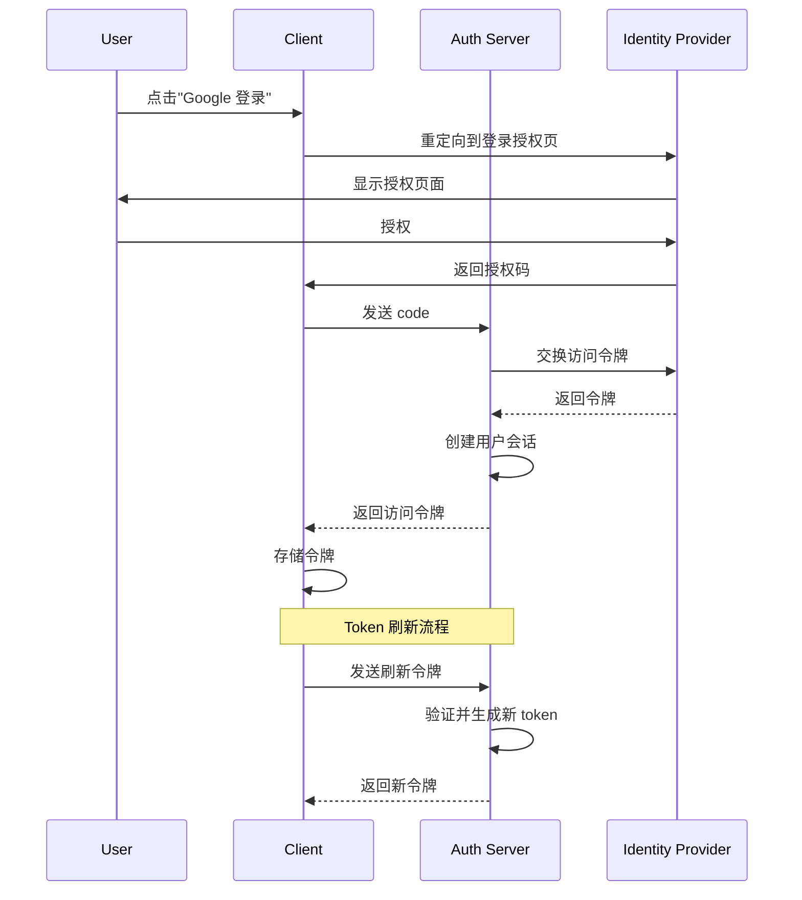

图 10-19：认证系统序列图示例

### 4.6 调试方法

当标准智能体交互难以解决 bug 时，Debug Mode 提供不同的方法：

```
Debug Mode 工作流程：
1. 生成多个关于可能出错的假设
2. 用日志语句检测代码
3. 要求重现 bug 同时收集运行时数据
4. 分析实际行为以定位根因
5. 基于证据进行定向修复
```

**适用场景**：

* 可重现但无法弄清的 bug
* 竞态条件和时序问题
* 性能问题和内存泄漏
* 曾经正常的回归问题

**提示词示例**：

```markdown
"这个函数有时会返回 null，但我不知道什么条件下会发生。
 请帮我：
 1. 列出可能导致返回 null 的所有情况
 2. 添加日志语句来追踪执行路径
 3. 建议如何重现这个问题"
```

## 5. 工程化实践

本节汇总智能体编程的工程化实践，聚焦于如何长期、高效、安全地使用智能体进行开发。

### 5.1 上下文管理与对话策略

上下文是智能体的“视野”。管理好上下文，是高效协作的基础。

#### 5.1.1 让智能体自己找上下文

不需要手动标记每个文件。现代智能体有强大的搜索工具，按需拉取上下文：

```markdown
❌ 不好的做法：
"请看 @src/api/users.py @src/models/user.py @src/services/user_service.py
 @src/repositories/user_repo.py @tests/test_users.py 帮我修改用户验证逻辑"

✅ 好的做法：
"帮我修改用户验证逻辑，登录时需要检查用户是否被禁用"
（让智能体自己搜索相关文件）
```

#### 5.1.2 标准化上下文：项目说明文件：AGENTS.md

虽然智能体擅长搜索，但通过统一的“项目说明文件”（推荐命名为 `AGENTS.md`，见 [附录 12.3](/agentic_ai_guide/di-wu-bu-fen-fu-lu/12_appendix/12.3_agents_md.md)）提供项目级的“机器可读说明书”，能减少幻觉与不必要的上下文检索时间。它更适合承载项目目标、代码约定、协作方式、已知陷阱和任务边界，是智能体编程的“地图与说明书”。

开源项目 [AgentGo](https://github.com/yeasy/AgentGo)（原名 agentrc）提供了一份经过实战打磨的 `AGENTS.md` 最佳实践模板，内置启动序列、自演化循环、渐进式理解（适用于 brownfield 项目）和注入防御等机制，Claude Code、Codex、Cursor、Copilot、Windsurf、Gemini CLI 等主流工具均可直接读取。

> **重要**：`AGENTS.md` 属于**说明性上下文 / 指令层**，不应被误写成权限执行面的“配置中心”。像 Codex 的 approval mode / sandbox configuration，或 Cursor 的 command approval / auto-run / guardrails，这些才是负责最小权限与执行拦截的真实控制面。把权限控制落在工具自身提供的审批、沙箱、MCP allowlist、hooks 与仓库权限上，通常比把它们塞进 `AGENTS.md` 更可靠。

#### 5.1.3 提升智能体可读性：Agent Legibility

OpenAI 在其工程实践中提出了 **“Agent Legibility”（智能体可读性）** 的概念。这要求我们不仅为人类写代码，更要为智能体优化代码库。

* **扁平化结构**：避免过深的目录嵌套，让文件路径清晰地反映功能模块。
* **自描述命名**：函数和变量名应尽可能包含语义信息，减少智能体推理上下文的难度。
* **显性契约**：使用类型系统（Type Hints）和接口定义（Interfaces）明确数据结构，作为智能体理解代码逻辑的“锚点”。

**量化可读性检查 (Quantitative Legibility Checks)**：为了从工程上保障这一点，可以在 CI 流水线中引入针对性指标的防御约束：

1. **圈复杂度 (Cyclomatic Complexity) 限制**：由于 LLM 的注意力窗口在同时追踪过多分支时极易出错，应对复杂度过高（如 McCabe $> 10$）的核心逻辑块进行拦截，强制要求拆分。
2. **类型覆盖率门槛**：强制要求核心模块的方法签名与数据载体必须达到 100% 的类型提示 (Type Hint) 覆盖。
3. **隐式转显式字典拦截**：禁止或强烈警告使用高度动态的黑盒传参（例如 Python 中的 `*args, **kwargs` 满天飞），智能体系统只能基于静态可推导的明确契约生成可靠代码。

#### 5.1.4 回退优于修补

> **提示**：智能体编程黄金法则：如果智能体的实现偏离了轨道，**不要试图通过后续对话来“修补”它**——这通常会导致代码越来越乱。
>
> **正确的做法是**：
>
> 1. 先检查 `git diff` 或变更预览，分清哪些是当前智能体会话的草稿，哪些是你或他人的有效修改
> 2. 优先使用**有边界的回退**：丢弃当前方案、恢复单个文件或单个 hunk、回到独立 worktree / 分支上的上一个稳定检查点，然后从更清晰的 spec 或 prompt 重新开始
> 3. 如果使用规划模式，先修计划再重跑；如果上下文已污染，直接新开对话往往比“补丁式追问”更干净
> 4. `git reset --hard` 之类破坏性命令只能用于你确认没有未提交人工工作、且环境可丢弃的场景；它绝不是共享工作区里的默认正确做法
>
> **记住：一次正确的全新生成，永远优于十次修补。**

#### 5.1.5 何时开启新对话与继续对话

| 开启新对话         | 继续对话          |
| ------------- | ------------- |
| 切换到不同任务或功能    | 迭代同一功能        |
| 智能体看起来困惑或重复犯错 | 智能体需要早期对话的上下文 |
| 完成一个逻辑工作单元    | 调试它刚构建的东西     |
| 对话超过 20 轮     | 对话仍然聚焦        |

> **长对话会导致智能体失去焦点**。经过多轮对话和摘要后，上下文积累噪声，智能体可能分心或切换到无关任务。

#### 5.1.6 引用过去的工作

开始新对话时，引用之前的工作记录，而不是复制粘贴整个对话：

```markdown
"继续上次关于认证模块的工作，现在需要添加多因素认证支持"
```

#### 5.1.7 并行智能体与 Git 工作树

利用 Git 工作树，可让多个智能体同时工作而互不干扰：

```
主分支 ─────────────────────────────────────────→
         │ worktree-1              │ worktree-2
         │ 智能体 A: 实现功能 X     │ 智能体 B: 重构模块 Y
         │                         │
         └─────── 合并 ────────────┴────→ 主分支
```

**创建并行工作环境**： 下面这组命令的目的，是把“并行开发”变成可回滚、可合并、互不干扰的日常流程。

```bash

 # 创建工作树

git worktree add ../project-feature-auth -b feature/auth
git worktree add ../project-refactor-api -b refactor/api

 # 在不同窗口打开，两个智能体同时工作

 # 完成后合并

git merge feature/auth
git merge refactor/api
```

### 5.2 代码审查与人类监督

智能体编程的核心原则：**AI 提案，Human 决策**。

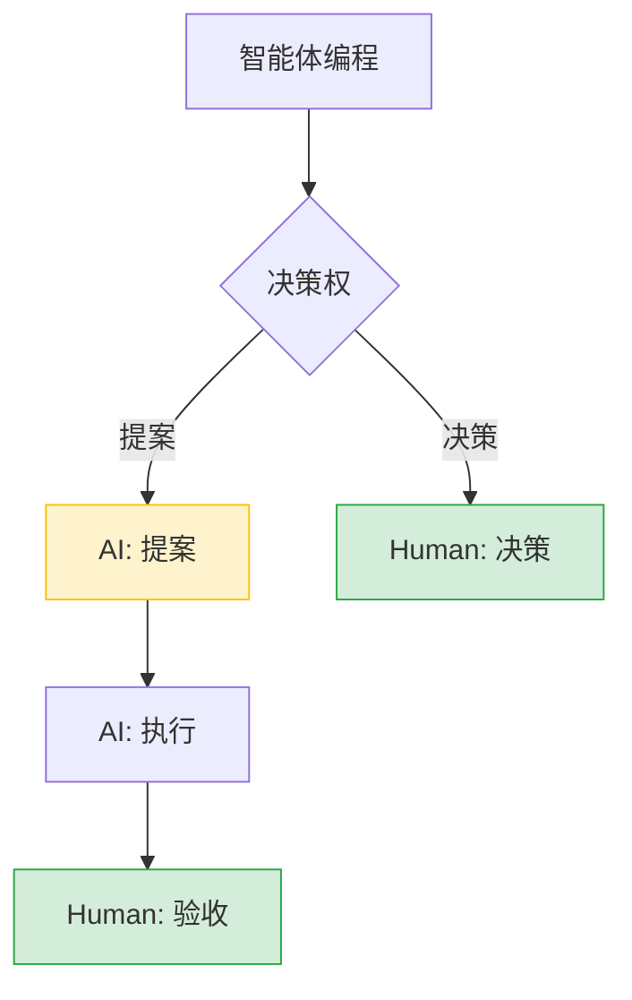

图 10-20：智能体编程中的人类监督模型

#### 5.2.1 监督强度分级

| 任务类型    | 风险级别 | 监督要求        |
| ------- | ---- | ----------- |
| 格式化、重命名 | 低    | 自动执行，事后检查   |
| 新功能开发   | 中    | 逐步执行，每步确认   |
| 重构核心模块  | 高    | 规划先行，详细审查   |
| 安全相关修改  | 极高   | 专家审查，多人确认   |
| 生产环境操作  | 极高   | 人工执行，智能体仅建议 |

#### 5.2.2 建立检查点

复杂任务的执行应当遵循“计划-执行-检查”的循环：

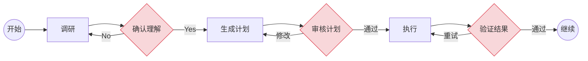

图 10-21：复杂任务的检查点机制

#### 5.2.3 AI 生成代码的审查清单

把清单写成固定模板的价值在于：每次评审都能覆盖同一组风险点，避免“凭感觉漏检”。

```markdown

 ## 功能正确性

- [ ] 代码实现了预期功能
- [ ] 边界情况被正确处理
- [ ] 错误处理完善

 ## 代码质量

- [ ] 遵循项目代码规范
- [ ] 无明显的性能问题
- [ ] 无重复代码
- [ ] 命名清晰合理

 ## 安全性

- [ ] 无硬编码的密钥/密码
- [ ] 输入已正确验证
- [ ] 无 SQL 注入风险
- [ ] 无 XSS 风险

 ## 可维护性

- [ ] 有必要的注释
- [ ] 逻辑清晰易懂
- [ ] 依赖合理

 ## 测试

- [ ] 有对应的测试用例
- [ ] 测试覆盖关键路径
- [ ] 测试可以通过
```

#### 5.2.4 让智能体自审

这份清单也可以直接交回给智能体，让它按同一套标准检查自己刚写的代码。

```markdown
"审查你刚才生成的代码，检查：
 1. 是否有安全漏洞
 2. 是否遵循了项目的代码规范
 3. 是否有性能问题
 4. 是否需要添加更多测试"
```

#### 5.2.5 测试策略

智能体生成的代码具有不确定性，测试是将这种不确定性转化为可控风险的关键手段。

**TDD 驱动智能体**：先写测试，再让智能体实现，是当前最可靠的协作模式。测试既是需求的精确表达，也是智能体自我验证的反馈信号。

```
开发者：编写测试用例（定义"什么算正确"）
    ↓
智能体：实现代码（让测试通过）
    ↓
验证器：运行测试（提供反馈）
    ↓
智能体：根据失败信息修复（精准迭代）
```

**测试类型选择**：

| 测试类型 | 适用场景        | 与智能体的配合方式                          |
| ---- | ----------- | ---------------------------------- |
| 单元测试 | 纯函数、工具函数    | 智能体擅长，可同时生成实现和测试                   |
| 集成测试 | API 端点、服务交互 | 开发者定义测试骨架，智能体填充                    |
| 属性测试 | 对抗不确定性      | 用 Hypothesis 等框架定义不变量，智能体实现满足约束的代码 |
| 快照测试 | UI 组件、输出格式  | 首次由智能体生成，后续作为回归防护                  |

**关键原则**：测试代码的审查标准应**高于**实现代码——因为测试是验证智能体产出的“裁判”，裁判本身必须可靠。

### 5.3 安全边界

#### 5.3.1 永远不要让智能体做的事情

以下操作应被列入 **禁止清单**，必须通过产品提供的审批、沙箱、hooks、策略层或人工确认来拦截：

**敏感目标**（禁止智能体自主访问或修改）：生产数据库、安全配置、敏感数据、生产部署流水线、密钥与凭证。

**禁止行为**：

1. 直接修改生产环境
2. 执行高风险 Shell 命令（如 `rm -rf`、`DROP TABLE`）
3. 在无人审核下部署代码
4. 绕过安全审查流程
5. 进行破坏性或资源耗尽操作

#### 5.3.2 安全护栏配置

可以通过规则文件配置具体的安全护栏。下面是 Cursor 的示例：

```markdown

 # rules/security.md

 ## 禁止操作

- 不要读取或修改 .env 文件
- 不要执行 `rm -rf` 相关命令
- 不要直接操作 production 分支
- 不要输出任何密钥或密码

 ## 敏感文件保护

以下文件只读，不可修改：
- config/production.yml
- secrets/
- .github/workflows/deploy.yml

 ## 命令限制

以下命令需要人工确认：
- docker push
- kubectl apply
- npm publish
```

### 5.4 知识沉淀体系

传统的 AI 编程是线性的（Prompt → Code），而有效的工程实践致力于构建 **具有记忆的系统**。本节将技能系统、钩子系统和复利工程统一为知识沉淀体系。

#### 5.4.1 技能系统

**技能（Skills）** 是一种将过程性知识封装为可复用知识包的高级设计模式。如果说“工具服务”赋予智能体访问外部系统的能力，那么技能则赋予智能体专业领域知识与稳定工作流。关于技能的完整定义、目录结构、三阶段加载机制和 SkillsBench 实证分析，详见[第 4.4 节](/agentic_ai_guide/di-yi-bu-fen-dan-ti-zhi-neng-jia-gou/04_tools/4.4_skills.md)。

本节聚焦技能在编程实践中的**工程化要点**：

**技能设计原则**：

1. **上下文是昂贵的**：每一个 Token 都要通过“租金”考核。与其写大段原理，不如给出一个精炼的 Example。
2. **为机器而写**：技能的读者是 AI，不是人类。避免写 changelog、安装指南等人类元数据。
3. **分层加载**：L1 (Metadata) 始终在上下文中负责触发；L2 (Body) 触发后加载核心指令；L3 (Resources) 按需加载详细文档。

**技能构建六步法**：

1. **Understand**：先手动对话解决问题，理解痛点。
2. **Plan**：规划哪些作为硬约束（脚本），哪些作为软引（文档）。
3. **Init**：建立标准目录结构。
4. **Edit**：填充内容，优先实现依赖的资源（Resources）。
5. **Validate**：检查格式与命名。
6. **Iterate**：在实战中打磨，根据 AI 的错误反馈调整指令。

**技能的加载时机**：

| 类型         | 加载时机  | 示例           |
| ---------- | ----- | ------------ |
| Rules      | 始终加载  | 项目代码规范       |
| Skills     | 按需加载  | SQL 分析、代码审查  |
| References | 技能内按需 | 详细 Schema 定义 |

#### 5.4.2 钩子系统

**钩子（Hooks）** 是智能体的生命周期钩子，允许在特定事件发生时自动执行自定义脚本。

下面这张表应理解为**抽象事件模型**，用于帮助你把 hooks 放到合适的位置；不同产品真正暴露出来的官方 surfaces 并不完全一致。以 Claude Code 当前官方文档为例，事件已经覆盖 session、turn、tool，也扩展到 compaction、worktree、notification 与 elicitation 等面。

| 事件层级            | 抽象事件             | 当前常见官方 surface 示例                                | 典型用途              |
| --------------- | ---------------- | ------------------------------------------------ | ----------------- |
| **Session**     | 会话开始 / 会话结束      | `SessionStart`、`SessionEnd`                      | 注入项目上下文、清理收尾      |
| **Turn**        | 用户提交 / 停止 / 停止失败 | `UserPromptSubmit`、`Stop`、`StopFailure`          | 校验 prompt、生成结束后审计 |
| **Tool**        | 工具前 / 工具后        | `PreToolUse`、`PostToolUse`                       | 拦截危险命令、格式化、审计     |
| **Context**     | 压缩前 / 压缩后        | `PreCompact`、`PostCompact`                       | 总结上下文、记录压缩点       |
| **Workspace**   | 工作树创建 / 删除       | `WorktreeCreate`、`WorktreeRemove`                | 隔离环境准备与清理         |
| **Interaction** | 通知 / 追问 / 用户补充结果 | `Notification`、`Elicitation`、`ElicitationResult` | 人机确认、补充缺失信息       |

**钩子实现示例**：

以下是概念性伪代码，展示钩子系统的核心设计思路（拦截、审计、修改）。实际语法因工具而异，例如 Claude Code 当前支持 command / http / prompt / agent 等 hook 类型；其他工具可能只暴露其中一部分能力，但底层逻辑是相通的。

```typescript
// 概念性伪代码：工具执行前的拦截钩子
export default async function(context: HookContext) {
  const { tool, params } = context;

  // 拦截危险的文件删除
  if (tool === 'file_delete') {
    if (params.path.includes('production')) {
      return {
        block: true,
        message: '禁止删除生产环境文件'
      };
    }
  }

  // 审计所有命令执行
  if (tool === 'run_command') {
    await context.log({
      event: 'command_execution',
      command: params.command,
      user: context.user,
      timestamp: new Date()
    });
  }

  return { block: false };
}
```

**高级模式：长运行智能体循环**

通过钩子配合技能，可以创建能自主迭代直到成功的“长运行智能体”。不过这依赖具体产品是否暴露了足够丰富的事件面与可继续执行的控制返回值：

```typescript
// 概念性伪代码：让智能体"一直改代码直到测试通过"

export default async function(context: HookContext) {
  const MAX_ITERATIONS = 10;

  if (context.loopCount < MAX_ITERATIONS) {
    const result = await context.runTests();

    if (!result.passed) {
      // 拦截停止信号，返回新的用户消息
      return {
        continue: true,
        message: `测试未通过 (${result.failed}/${result.total})。
错误信息：
${result.errors}

请修复代码并重试。这是第 ${context.loopCount + 1} 次尝试。`
      };
    }
  }

  return { continue: false };
}
```

这种模式将“编写-测试-修复”的循环完全自动化，是智能体编程的终极形态之一。

#### 5.4.3 复利工程

复利工程的核心在于构建正向循环——智能体的每一次错误都成为系统进化的养料：

```mermaid
graph TD
    Issue[1. Issue: 遇到 Bug 或坏例子] --> Fix[2. Fix: 修复代码]
    Fix --> Learn[3. Learn: 如何防止再犯?]
    Learn --> Docs[更新项目说明文件]
    Learn --> Rule[添加 Linter 规则]
    Learn --> Prompt[更新系统提示词]
    Learn --> Skill[创建新 Skill]

    style Learn fill:#cce5ff,stroke:#004085
```

图 10-22：复利工程正向循环

> **注意**：版本兼容性提示：智能体工具更新极快，配置文件的文件名和格式可能随版本变化。请务必查阅工具的最新官方文档，但 **“将隐性知识显性化”** 的复利工程核心思想是永恒的。

#### 5.4.4 版本与兼容性自检

框架、模型与平台的版本变化非常快。为了应对这种变化，建议维护一套 **版本管理与兼容性核对的方法**，并把自检拆成“接口、配置、行为”三类：

**接口自检**：

* 工具调用接口：参数结构、返回结构、错误码与重试语义。
* 模型接口：上下文窗口、工具调用能力、结构化输出支持。
* 可观测性接口：链路与跨度数据结构、事件字段、采样策略。

**配置自检**：

* 项目规则文件：位置、格式、加载顺序与覆盖策略。
* 技能与工具服务：目录结构、启用方式、权限与密钥管理。
* 运行模式：审批策略、沙箱策略、网络与文件系统权限。

**行为自检**：

* 任务是否能稳定复现（相同输入的稳定性）。
* 测试与回归是否可自动化运行。
* 失败是否可诊断、可回放、可归因。

与其维护静态的版本号清单表，不如维护一个小而精的 **回归样例集**，用来验证升级前后行为是否一致：

1. 选择 10–30 个代表性任务（覆盖工具调用、检索、结构化输出、长任务）。
2. 为每个任务定义验收标准（输出结构、关键字段、允许波动范围）。
3. 每次升级前后跑一次回归，对差异进行记录与解释。

**知识沉淀形式**：

| 形式        | 位置               | 作用    |
| --------- | ---------------- | ----- |
| 项目说明文件    | 项目根目录            | 项目级知识 |
| Rules     | `.agent/rules/`  | 行为规则  |
| Skills    | `.agent/skills/` | 领域知识  |
| Linter 规则 | ESLint/Pylint 配置 | 自动检查  |
| 测试用例      | tests/           | 回归防护  |

**复利效应**：

随着时间推移，规则与技能会逐步沉淀，带来更低的返工率、更一致的代码风格与更可控的风险边界。

### 5.5 驾驭工程实操

驾驭工程（Harness Engineering）的理论基础与六大组成已在[第 10.1.6 节](/agentic_ai_guide/di-san-bu-fen-gong-cheng-shi-jian-yu-luo-di/10_agentic_coding/10.1_paradigm.md)详细阐述。本节聚焦**如何在自己的项目中落地驾驭系统**。

#### 5.5.1 最小可行驾驭系统

为项目构建驾驭系统不需要一步到位。以下是从零开始的推荐路径：

1. **第一步：可运行的测试套件**——这是驾驭系统的最低要求。没有测试，智能体就是在“裸奔”。哪怕只有 10 个核心路径的测试用例，也比 0 个好得多。
2. **第二步：结构化的错误反馈**——确保测试失败时输出包含文件名、行号和错误原因，而非模糊的 traceback。这是智能体精准修复的前提。
3. **第三步：Mock 数据与生成器**——为 API 调用、数据库查询等外部依赖创建稳定的 Mock，让智能体在确定性环境中工作。

```mermaid
graph LR
    Human[开发者: 定义基座] --> Generators
    Human --> Validators

    subgraph Harness [Agent Harness / 智能体基座]
        Generators[生成器: Mock数据/测试用例] --> Agent
        Agent[Agent: 编写代码] --> Code[代码产物]
        Code --> Validators[验证器: Lint/Test/Policy]
        Validators -- 错误反馈 --> Agent
        Validators -- 通过 --> Result[最终产物]
    end

    style Harness fill:#f8f9fa,stroke:#6c757d,stroke-dasharray: 5 5
```

图 10-23：智能体驾驭工程架构

#### 5.5.2 业界驾驭系统案例

以下是几个代表性的驾驭系统实践，可作为自建的参考：

| 驾驭系统           | 构建者              | 输入               | 验证方式               | 反馈信号    |
| -------------- | ---------------- | ---------------- | ------------------ | ------- |
| **HumanEval**  | OpenAI (2021)    | 函数签名 + docstring | 沙箱运行隐藏单元测试         | Pass\@k |
| **SWE-bench**  | Princeton (2023) | GitHub Issue 描述  | 运行仓库原有测试套件         | 测试通过率   |
| **内部 CI 驾驭系统** | 企业团队             | 需求描述 + 代码骨架      | Lint + 单元测试 + 集成测试 | 结构化错误报告 |

**关键启示**：不要让智能体对着空白编辑器“裸奔”。为最重要的业务逻辑构建类似的驾驭系统——哪怕是一组 Makefile 目标加上几十个测试用例，也能显著提高智能体的产出质量。

### 5.6 刻意练习与进阶路径

为什么有些开发者觉得 AI 没用？因为他们没有进行 **刻意练习**。

#### 5.6.1 练习方法

| 练习方式         | 目的     | 实践建议               |
| ------------ | ------ | ------------------ |
| **把 AI 当乐器** | 熟悉“手感” | 每天使用，观察模式          |
| **干净环境实验**   | 测试极限   | 在 Side Project 中试验 |
| **刻意犯错**     | 理解边界   | 故意给出模糊指令，观察反应      |
| **对比测试**     | 发现差异   | 同任务用不同模型/提示词       |
| **复盘分析**     | 积累经验   | 记录成功/失败的模式         |

#### 5.6.2 建立肌肉记忆

通过反复练习，建立问题处理的“肌肉记忆”：

```
遇到问题 X ──→ 启动 Y 类型对话

示例：
- 遇到 Bug → Debug Mode + 假设列表
- 新功能 → 规划模式 + TDD
- 重构 → 先画架构图 + 分步执行
- 性能问题 → 让智能体分析并建议
- 文档 → 让智能体基于代码生成
```

#### 5.6.3 学习进阶路径

把上述能力按熟练度排开，可以得到一条从初级到高级的进阶路径。

```mermaid
mindmap
    root(("智能体编程<br>学习进阶路径"))
        Junior["初级：1-2 周"]
            Basic[熟悉基本对话]
            Ref[掌握 @ 引用]
            Context[理解上下文管理]
        Intermediate["中级：1-2 月"]
            Plan[掌握规划模式]
            Config[配置 Rules 和 Skills]
            Compound[建立复利工程习惯]
            Tools[多工具组合使用]
        Senior["高级：3+ 月"]
            Workflow[设计自定义工作流]
            Hooks[钩子系统定制]
            Parallel[并行智能体编排]
            KB[团队知识库建设]
```

图 10-24：智能体编程进阶学习路径

### 5.7 企业级落地要点

智能体编程在企业落地时，最值得关注的往往不是“平均提升多少”，而是能否建立可复制、可治理的工程体系。下面给出一组更稳定的落地要点：

#### 5.7.1 关键成功因素

1. **开发周期加速**：减少重复劳动，把注意力放在问题定义与验收。
2. **入职时间降低**：把关键知识沉淀为文档、规则与技能，降低口口相传的成本。
3. **质量与一致性**：用测试、lint、审查与护栏把不确定性锁在可控范围内。
4. **知识传承**：隐性知识显性化为规则、技能与可回放的链路。

> **提示**：案例：OpenAI 的 Harness Engineering
>
> OpenAI 曾披露其内部工程实践：通过构建强大的 Harness（治具），他们将大量繁琐的编码工作自动化。工程师不再手动编写 CRUD 代码，而是专注于维护这个“治具系统”——包括各种 Mock 数据、自动化测试生成器和即时反馈机制。这使得少数工程师能够通过智能体驱动海量的功能开发，且保持极高的代码质量。这正是 Agentic Coding 在企业级落地的终极形态。

#### 5.7.2 常见失败模式

| 失败模式    | 原因     | 解决方案     |
| ------- | ------ | -------- |
| “AI 没用” | 缺乏刻意练习 | 投入时间学习工具 |
| 质量下降    | 跳过审查   | 建立审查流程   |
| 知识流失    | 不做沉淀   | 实践复利工程   |
| 安全事故    | 权限过大   | 实施最小权限   |

## 6. 本章小结

本章探讨了从 Vibe Coding 到 Agentic Coding 的范式转移，深入剖析了智能体编程的核心——**Agent Loop**，并给出了完整的工作流与最佳实践指南。

### 范式对比与认知转变

| 范式                 | 核心理念        | 适用场景    | 局限性       |
| ------------------ | ----------- | ------- | --------- |
| **Vibe Coding**    | 自然语言生成代码    | 原型验证、学习 | 技术债务、可维护性 |
| **Agentic Coding** | AI 作为自主开发伙伴 | 生产级开发   | 需要工程化实践   |

**关键认知转变**：

1. 从“我写代码”到“我指导 AI 写代码”
2. 从“掌握语法”到“掌握意图表达”
3. 从“手动调试”到“设计验证流程”
4. 从“个人技能”到“人机协作效率”

### 智能体循环核心概念

| 概念          | 核心要点           |
| ----------- | -------------- |
| **智能体循环**   | 思考→行动→观察的循环执行  |
| **停止序列**    | 控制模型暂停、等待工具结果  |
| **不可见状态**   | 上下文中大量用户看不到的信息 |
| **智能体驾驭系统** | 指令+工具+消息的组合    |
| **上下文管理**   | 智能体工作记忆的优化     |

**关键认知**：

1. 智能体不是魔法，是可解释的状态机
2. 上下文窗口是稀缺资源，需要精心管理
3. 当智能体“笨”的时候，先检查不可见状态
4. 重置对话是最简单有效的调试手段

### 工作流要点

| 工作流阶段 | 关键实践             |
| ----- | ---------------- |
| 任务分解  | 使用 DECOMPOSE 框架  |
| 规划    | 规划模式先行，回退优于修补    |
| 上下文   | 让智能体自己找，适时开新对话   |
| 并行    | 利用 Git 工作树并行开发   |
| 测试    | TDD 工作流驱动智能体     |
| 架构    | 先画图再写码           |
| 审查    | 执行清单 + 让智能体自审    |
| 调试    | 假设驱动的 Debug Mode |

### 最佳实践要点

| 最佳实践     | 关键要点                 |
| -------- | -------------------- |
| **提示词**  | CLEAR 框架，分步执行，同时请求测试 |
| **监督**   | 分级监督，建立检查点           |
| **技能系统** | 封装领域知识，按需加载          |
| **钩子系统** | 生命周期自动化，长运行智能体       |
| **复利工程** | 每次错误都是进化机会           |
| **刻意练习** | 建立肌肉记忆，持续提升          |
| **安全边界** | 最小权限，禁止清单            |

### 关键概念清单

* **Vibe Coding**：自然语言驱动、沉浸式、忽略代码细节的编程风格。
* **Agentic Coding**：AI 作为自主智能体，具备理解、规划、执行、验证的完整闭环能力。
* **Agent Loop**：`思考 -> 工具调用 -> 环境反馈 -> 思考` 的状态机循环。
* **停止序列**：强制模型中断生成、交还控制权给宿主的关键机制。
* **智能体驾驭系统**：由指令、工具、用户消息构成的组合。
* **上下文工程**：通过规则、技能和文件引用来管理上下文，是 Agentic Coding 的核心技能。
* **规划模式**：规划先于执行，“回退优于修补”。
* **DECOMPOSE 框架**：任务分解的九步方法论。
* **CLEAR 框架**：提示词设计的五要素结构。
* **复利工程**：将隐性知识显性化，让每次错误成为系统进化的养料。

### 实践要点

* **工具选择**：优先按任务形态选工具，例如 IDE 内多文件编辑、终端批处理、平台工作流自动化、本地化部署等。
* **工作流升级**：从关注语法和 API，转向关注需求拆解、上下文准备和验收审查。
* **上下文管理**：不要一次性塞入所有文件，利用 `@` 精确引用或让智能体自主检索。
* **自动化**：利用 AI 代码审查工具和 CI/CD 集成，让 AI 参与代码审查。

### 常见误区

* **误区 1：期望 AI 一次性生成完美代码**。事实：Agentic Coding 是一个迭代过程，第一版往往需要修改。
* **误区 2：试图用对话修补烂代码**。事实：当上下文污染严重时，`git reset` 或开启新对话永远比修补更快。
* **误区 3：认为 Prompt 不重要**。事实：越强大的模型越依赖高质量的 Prompt（清晰的目标、充足的上下文、明确的约束）。

通过刻意练习，你将建立起与 AI 协作的“肌肉记忆”，真正成为 Agentic 时代的超级个体。
