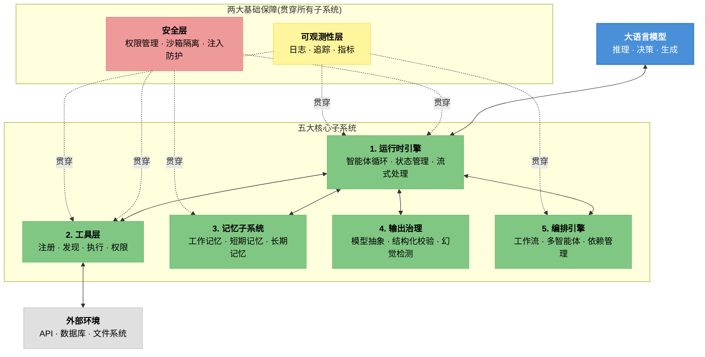
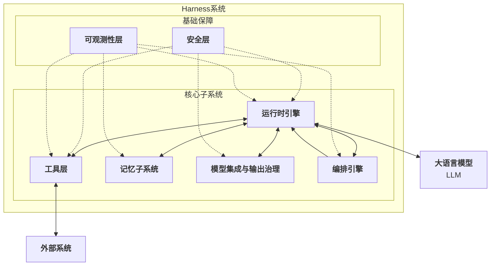
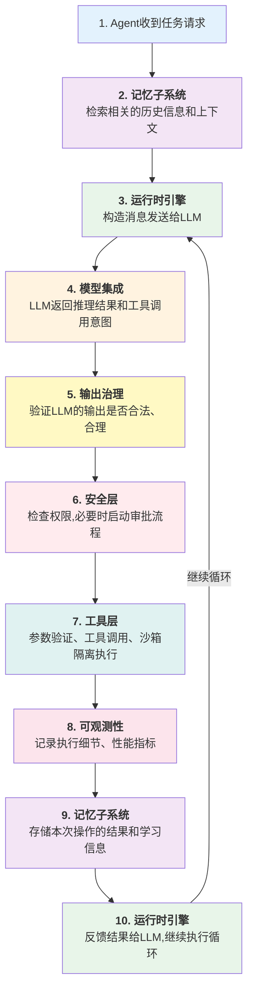

# 第一章：Harness 工程概论

本章通过系统地定义和剖析 Harness 工程这一核心概念，为读者建立起对整个系统工程领域的全面认识。

从智能体原理的简要回顾出发，我们揭示为什么在大语言模型时代，系统工程能力比模型能力本身更为关键。通过“驾驭”这一比喻，我们深刻理解 Harness 的本质——它不是给智能体赋予更强的思考能力，而是用约束、可验证性和层次化的信任机制，让智能体能够在复杂、真实的环境中安全可靠地执行任务。

本章介绍了 Harness 工程的五大核心子系统和两大基础保障，并先通过对比业界领先的两个参考系统（**Claude Code** 和 **OpenClaw**），展示不同的架构选择如何应对不同的使用场景。全书后续章节还会引入 Codex 等参考系统作为扩展对照。同时，我们将通过 MiniHarness 这一实战项目，带领读者从零开始构建一个完整的 Harness 系统。

这一章的内容贯穿全书，后续各章都将基于这里建立的基础概念展开深入讨论。

## 1. 从大语言模型到智能体的快速过渡

本节介绍从大语言模型到完整智能体系统的演进过程，阐述为什么单纯的模型能力还不足以构建生产级应用，以及 Harness 作为关键中间层的必要性。

### 1.1 问题的演变

在大语言模型刚出现时，应用开发的重点聚焦于模型本身：使用更大的模型、更好的提示词、更优质的数据。开发者期望通过改进模型，直接获得智能应用。

然而现实迅速转变。当 LLM 从实验室走向生产环境时，开发者面对了意外的复杂性：

- **可靠性问题**：同样的问题，同一个模型的多次回答可能差异巨大，导致生产系统不可预测。
- **外部交互问题**：LLM 只能生成文本，无法直接与真实世界系统交互。调用数据库、API、执行系统操作都需要额外的工程工作。
- **成本控制问题**：大规模调用 API 的成本快速增长，需要更精细的控制和优化。
- **安全性问题**：让 LLM 任意调用系统权限和外部接口存在严重的安全风险。

对这些挑战的回应，催生了智能体的概念——一个能够感知环境、规划行动、执行任务、学习反馈的自主系统。

### 1.2 智能体的三个核心能力

一个完整的智能体系统需要三个维度的能力：

**第一维：思维能力** 这是 LLM 的长项。通过提示词工程、思维链(Chain-of-Thought)、多步推理等技术，让模型能够分解问题、规划步骤。

**第二维：行动能力** 这是传统系统工程的领地。智能体需要能够调用工具、操纵外部系统、获取实时信息，这涉及工具注册、权限管理、结果验证等一系列机制。

**第三维：学习能力** 即从执行结果中反馈、调整策略、积累经验。这涉及记忆机制、强化学习信号、迭代优化等。

在这三维中，LLM 主要贡献第一维。而第二维和第三维的高质量实现，才是决定智能体系统成败的关键。

由此我们可以得出本书的核心等式：**Agent = LLM + Harness**

大模型提供推理和决策的“大脑”，而 Harness 提供感知、执行、记忆和安全保障的“身体”。

模型决定了智能体的思维上限，Harness 决定了智能体的工程下限。一个没有 Harness 的大模型只是一台发动机，一个经过 Harness 工程化的智能体才是一辆能够可靠载人行驶的汽车。

### 1.3 为什么需要 Harness

一个朴素的想法是：既然大模型已经能够推理和规划，为什么还要额外构建复杂的系统工程层？答案在于 **可靠性和可控性的鸿沟**。

考虑以下场景：一个智能体需要调用一个支付 API。在 LLM 的推理中，它正确地识别了需要支付的金额、收款人等信息。但在实际调用时：

- LLM 是否正确地以 API 期望的格式构造了请求？
- API 返回了错误状态码，智能体是否能够正确地理解和处理？
- 网络超时了，是否应该重试？重试多少次？
- 重复调用相同的支付请求是否会导致重复扣款？

这些问题不能依靠 LLM 的“聪慧”来解决，它们需要系统工程层面的保障——这正是 Harness 要做的工作。

**Harness 不是要让智能体更聪明，而是要让智能体更可靠、更可控、更安全。**

它通过以下方式实现这一目标：

- **标准化的工具调用协议**：确保工具的输入输出格式一致、可预测。
- **多层权限控制**：从 Ask-first（事前询问）/ Approve-once（任务级一次授权）到 Free（自动放行）的梯度化信任管理。
- **执行结果的验证和反馈**：不仅记录智能体做了什么，更要验证它真正做了什么。
- **故障恢复机制**：当某个步骤失败时，系统能够优雅地降级或恢复。
- **完整的可观测性**：通过日志、追踪、指标等多个维度观察系统运行状态。

### 1.4 本章的位置

本书假设读者对智能体的基本概念已有了解。关于智能体理论、多智能体协作、规划算法等深层内容，请参考 [《智能体 AI 权威指南》](https://yeasy.gitbook.io/agentic_ai_guide)。

本章及后续各章的重点，是 **如何将一个理论上的智能体概念转化为生产级别的系统**。这个转化过程，就是 Harness 工程要解决的问题。

带着这样的理解，我们可以开始深入 Harness 的定义与设计。

## 2. Harness 的定义与职责边界

本节深入定义 Harness 的核心概念，阐明其在智能体系统中的关键角色，并通过隐喻、对比和具体示例说明其职责范围。

### 2.1 核心定义

**Harness** 是在大语言模型与真实执行环境之间构建的一套系统工程框架，它通过标准化的消息协议、分层的权限管理、多维的执行可见性和完善的错误处理机制，使得 LLM 能够在受控约束下安全、可靠地感知环境、执行任务、学习反馈。

这个定义的核心要素有三个：

1. **中间层角色**：Harness 本质上是一个适配器和控制层，坐在 LLM 和执行环境之间。它不替代 LLM 产生业务推理，也不直接承担工具内部逻辑——而是把 LLM 的意图转化为可验证、可授权、可执行的操作，并将结果正确反馈给 LLM。
2. **约束和可控性**：Harness 的主要目标不是扩展智能体的能力，而是 **限制智能体的风险**。通过权限管理、操作校验、隔离执行、失败恢复等手段，将智能体的行为控制在安全边界内。
3. **完整的生命周期管理**：从任务接收、状态追踪、工具调用、结果验证、到最终反馈，Harness 需要在整个智能体执行周期中保持可见性和控制力。

### 2.2 驾驭的隐喻

为什么选择“驾驭”(harness)这个名字？Harness 一词源自马具——骑手用来驾驭烈马的缰绳、鞍具和套具系统。它不是给马匹增加力量，而是：

- **引导方向**：通过缰绳确保马匹的力量用在正确的方向上，而非狂奔失控。
- **分散风险**：通过鞍具和套具的多个接点均匀分散冲击力，防止单点失效。
- **标准化协作**：让骑手与马匹之间形成可预期的交互协议。

同样，AI Harness 的工作原理是：

- **约束智能体的行为**：明确定义智能体能做什么、不能做什么。
- **分散执行风险**：通过多个检查点、多层验证，确保没有单个错误能够导致灾难性后果
- **标准化交互**：制定统一的工具调用、权限请求、结果反馈的协议

### 2.3 与传统中间件的区别

在分布式系统中，中间件（Middleware）也提供适配、转发、可见性等功能。那么 Harness 与传统中间件有什么本质区别？

**传统中间件的假设**：参与交互的各方（服务 A、服务 B）都是确定的、行为可预测的，中间件的工作是高效地转发消息、处理协议转换、管理连接。

**Harness 的假设**：Agent 的决策可能包含错误、理解偏差，甚至存在潜在的不当意图。Harness 需要对 Agent 的每一个决策都进行验证、授权、隔离执行。

具体来说，传统中间件通常不会：

- 在转发请求前，拦截和验证请求的合法性
- 对某些危险操作进行权限检查或人工审批
- 在执行失败时自动进行智能重试或降级
- 为每个操作维护完整的审计日志

而这些恰好是 Harness 的核心职责。

### 2.4 Harness 的职责边界

理解 Harness 的职责边界，对于系统架构设计至关重要。以下是几个关键的职责分界线：

#### 2.4.1 Harness 做的事

1. **工具集成**：Harness 负责将各种外部工具和系统集成进来——无论是 API 调用、数据库查询、文件操作还是系统命令。它维护一个统一的工具注册表，确保每个工具都有清晰的接口定义、权限配置和使用说明。
2. **权限和授权**：Harness 实现从 Free 到 Ask-first 再到 Approve-once 的梯度化权限管理。对于高危操作（如删除数据、转账、修改配置），Harness 可以拦截请求、记录意图、等待人工审批。
3. **执行跟踪和验证**：每一个工具调用都被记录、追踪、验证，如果工具返回了意外的结果（如网络错误、超时、权限拒绝），Harness 需要识别这些异常并决策是否重试、降级或报告。
4. **状态管理**：Harness 维护智能体执行过程中的完整上下文状态：当前步骤、已执行的操作、中间结果、依赖关系。这样当智能体被中断或故障后，可以恢复到一致的状态。
5. **可观测性和审计**：通过日志、分布式追踪、性能指标等多个维度，记录 Agent 的每个行为和决策。这不仅用于故障排查，更是合规性和安全审计的基础。

#### 2.4.2 Harness 不做的事

1. **业务推理和任务分解**：Agent 的核心思维过程——如何分解问题、选择使用哪个工具、如何理解反馈——这些主要由 LLM 承担。Harness 不替代模型做业务推理，但会约束、验证、拒绝、重试、路由或升级人工审批；这是执行治理，不是替模型思考。
2. **工具的实际执行**：当调用一个 API、查询一个数据库、执行一个脚本时，实际的执行是由那个工具或系统负责的，而 Harness 只是负责正确地构造请求和处理响应。
3. **模型的优化和训练**：Harness 不涉及模型参数、提示词优化、强化学习训练等，这些都属于模型层的责任。
4. **业务逻辑**：某个具体业务流程应该如何进行——这是应用层的定义，而不是 Harness 层的职责。Harness 只是提供实现这个流程的技术基础。

### 2.5 职责的实际示例

让我们通过一个具体场景来说明这些职责边界。假设 Agent 需要执行“将客户的活期存款转为定期存款”这一金融操作：

**Agent的推理和决策(LLM的职责)**

用户请求转账，我需要:

1. 查询账户余额确认有足够资金
2. 调用转账API
3. 记录操作日志


**实际执行(工具的职责)**

实际向银行后端系统发起转账请求：`transfer_api.execute(source_account, target_account, amount)`


**Harness的职责**

1. 权限: 在调用transfer_api前，检查该Agent是否有权限执行金融转账操作。如果权限等级是Ask-first,则发起审批流程,等待人工确认
2. 验证: 确认请求的参数格式正确、金额合理(防止1000倍的误输入)
3. 隔离: 这次调用在一个事务容器内执行,失败时能够安全回滚
4. 追踪: 记录请求的完整细节、API的响应、任何中间异常
5. 反馈: 将结果(成功/失败)标准化后反馈给Agent继续推理

通过这样的分工，我们实现了三个目标：

- **安全性**：权限层确保不会有非法操作
- **可靠性**：追踪和验证层确保即使出错也能快速定位
- **可用性**：Harness 的重试和降级机制确保系统韧性

### 2.6 总结

Harness 不是一个可有可无的“包装层”，而是让 LLM 和实际系统能够安全协作的 **关键基础设施**。它的存在，使得在生产环境中使用 Agent 不再是一个冒险的赌注，而是一个经过工程化验证的方案。

在接下来的章节，我们将深入探讨 Harness 的五大核心子系统，以及如何将这些原则转化为具体的代码和架构。

## 3. 五大核心子系统总览

一个完整的 Harness 系统可以分解为五个核心子系统和两大基础保障，这个分类方案既符合系统工程的模块化原则，也便于在不同的场景中选择和组合。

下图展示了五大核心子系统与两大基础保障之间的整体关系：



图 1-1：Harness 五大核心子系统与两大基础保障

### 3.1 五大核心子系统

本小节逐一介绍运行时引擎、工具层、记忆子系统、输出治理和编排引擎五大子系统的核心职责和设计要点。

#### 3.1.1 运行时引擎

**职责**：实现智能体的执行循环，协调各个子系统的交互。

运行时引擎是 Harness 的心脏，它维护智能体执行的主循环，通常遵循以下模式：


在这个循环中，运行时引擎的核心职责包括：

- **状态机管理**：智能体从初始化、执行、暂停、恢复到完成的各个状态转移。
- **消息编排**：构造发给 LLM 的消息（包括上下文、历史记录、工具信息），以及处理来自 LLM 的响应。
- **异步执行**：在 I/O 等待期间不阻塞，并发处理多个智能体任务
- **超时和中断**：设置合理的执行超时，支持优雅的任务中断和清理

在生产系统中，运行时引擎的实现策略因场景而异。Claude Code 面向交互式终端工作流，支持文件编辑、命令执行、权限模式切换和 MCP 扩展。OpenClaw 则强调 Gateway、Heartbeat/cron 触发和后台自动化，适合需要持续运行的智能体场景。

#### 3.1.2 工具层

**职责**：抽象和管理各种外部工具的访问，提供统一的调用接口。工具层是智能体与真实世界的连接点。它的设计直接影响智能体的能力范围和安全性。

核心职责包括：

- **工具注册**：维护一个工具注册表(Tool Registry)，记录每个可用工具的定义、参数、返回值类型、权限要求等
- **工具发现**：根据智能体的需求，推荐合适的工具。这可能涉及语义搜索、工具分类、相似度匹配等
- **参数验证**：在调用工具前，验证智能体提供的参数是否符合工具的签名，防止类型错误或格式不当
- **权限检查**：检查智能体是否有权限调用该工具，如果权限不足，启动审批流程
- **执行隔离**：在沙箱或容器中执行工具，防止工具故障对系统的影响
- **结果标准化**：将不同工具返回的结果统一为标准格式，方便智能体处理

在生产系统中，工具层的规模和管理方式差异显著。Claude Code 提供内置工具、MCP 和 skills 扩展，并通过权限模式控制文件编辑、命令执行和网络访问。OpenClaw 的 ClawHub 是公开的 skills/plugins 注册中心；skill 通常是包含 `SKILL.md` 的文件包，可带配置、脚本和元数据。

#### 3.1.3 记忆子系统

**职责**：管理智能体的各种记忆，支持上下文理解和学习。

一个没有记忆的智能体，每次执行都要从零开始。记忆子系统让智能体能够学习、改进、个性化响应。

记忆的类型通常按生命周期分为三层：

* **工作记忆** (Working Memory)：当前对话的上下文窗口，包含最近的消息、执行结果和即时状态，容量受 LLM 上下文窗口限制
* **短期记忆** (Session Memory)：跨轮次但会话级别的信息，如会话摘要、用户在当前项目中的偏好、最近的执行结果，生命周期从数小时到数周
* **长期记忆** (Persistent Memory)：跨会话的用户档案、学到的模式、系统策略，生命周期可达数月至数年，通常借助向量索引支持语义检索

核心职责包括：

* **记忆存储**：实现支持快速访问和更新的存储结构（如向量数据库、缓存层）
* **记忆检索**：根据当前上下文，检索相关的历史信息
* **记忆压缩**：当记忆累积过多时，总结和压缩，以节省存储和计算成本
* **遗忘策略**：决定哪些信息应该被保留，哪些应该被清除

在生产系统中，记忆子系统的设计反映了不同的运行模式。以 Claude Code 为参照时，应优先描述公开的 memory、compact、hooks 与 subagents 机制，而不要把示意性名称写成官方内置引擎。OpenClaw 官方记忆模型采用明文 Markdown 文件：`MEMORY.md` 保存长期记忆，`memory/YYYY-MM-DD.md` 保存每日运行上下文。

#### 3.1.4 模型集成与输出治理

**职责**：管理与 LLM 的交互，控制和验证模型的输出。

这个子系统解决一个关键问题：LLM 的输出不一定总是可靠的。我们需要在充分利用 LLM 能力的同时，防止其产生幻觉、矛盾或危险的决策。

核心职责包括：

* **模型选择**：根据任务的复杂度、成本预算、延迟要求，选择合适的模型（可能是 GPT、Claude、开源模型等）
* **提示词管理**：维护高质量的系统提示(system prompt)、任务描述、工具信息、示例等
* **输出解析**：从 LLM 的文本输出中，结构化地提取工具调用、参数、推理步骤等
* **输出验证**：检查输出是否符合预期的格式、是否包含自相矛盾、是否超出安全边界
* **降级策略**：当输出质量不满足要求时，进行重试、提示词调整、或切换到更强大的模型

在生产系统中，输出治理的侧重点各有不同。Claude Code 通过结构化工具调用、权限模式和上下文管理降低误操作风险。OpenClaw 则结合工具 allow/deny、执行审批、记忆文件和工作流审批点，约束 Agent 提议的操作边界。

#### 3.1.5 编排引擎

**职责**：支持复杂的多步任务和多智能体协作。单个智能体往往无法解决复杂的业务问题，编排引擎提供了一套机制，让多个智能体能够协作完成任务。

核心职责包括：

- **工作流定义**：支持定义复杂的任务流程，包括顺序执行、条件分支、并行执行、循环等。
- **依赖管理**：跟踪任务之间的依赖关系，确保按照正确的顺序执行。
- **智能体分配**：根据任务特点，将子任务分配给合适的智能体专家。
- **结果聚合**：收集各个智能体的执行结果，进行验证和合并。
- **故障恢复**：当某个智能体失败时，启动恢复策略（如重试、切换智能体、降级等）。

在生产系统中，编排引擎的设计体现了确定性与灵活性之间的权衡。Claude Code 的 Coordinator 多智能体编排模块支持动态智能体生成、任务分解和结果合并。OpenClaw 的 Lobster 确定性工作流引擎支持 YAML 定义的流程，可以精确重放和审计每一步。

### 3.2 两大基础保障

除了五大核心子系统，还有两大基础保障贯穿整个 Harness 系统——它们不是独立的模块，而是渗透在每个子系统中的能力。

#### 3.2.1 安全层

**职责**：在整个智能体生命周期中，防止安全威胁和风险。安全层不是一个独立的模块，而是渗透在其他各个子系统中的一组原则和机制：

- **权限管理**：实现梯度化的权限模型（Free/Ask-first/Approve-once）。
- **沙箱隔离**：在隔离环境中执行高危操作，限制其对系统的影响范围。
- **输入验证**：对所有来自外部的输入进行严格验证，防止注入攻击。
- **输出过滤**：在将智能体的决策转化为实际操作前，进行安全检查。
- **审计日志**：记录所有安全相关的事件，支持事后审计和合规性验证。

#### 3.2.2 可观测性层

**职责**：提供对 Harness 系统运行的完整可见性。一个无法观测的系统，一旦出现问题，就很难诊断和修复。可观测性层提供了三个维度的视图：

- **日志(Logs)**：记录详细的事件序列，支持文本搜索和过滤。
- **追踪(Traces)**：跟踪单个请求或任务的完整执行路径，显示各个组件的耗时。
- **指标(Metrics)**：收集系统级别的性能指标（如吞吐量、延迟、错误率），支持告警和趋势分析。

### 3.3 架构总体图

Harness 系统的整体架构可以概括为核心子系统与基础保障的有机结合，如下所示：



图 1-2：Harness 系统的五大核心子系统和两大基础保障

### 3.4 子系统间的交互流程

为了更清晰地理解这些子系统如何协作，让我们跟踪一个典型的 Agent 执行流程：



### 3.5 Claude Code vs OpenClaw 的子系统对比

本节聚焦 Claude Code 与 OpenClaw 这两个参考系统，Codex 等其他系统会在后续章节按具体子系统补充对照。两个参考系统在子系统实现上有各自的特点：

| 子系统     | Claude Code                     | OpenClaw                          |
| ---------- | ------------------------------- | --------------------------------- |
| **运行时引擎** | 交互式终端循环 + 流式执行       | Gateway + Heartbeat/cron 后台触发 |
| **工具层**     | 内置工具 + MCP + skills 扩展    | ClawHub skills/plugins 注册中心   |
| **记忆系统**   | memory/compact/hooks 等公开机制 | `MEMORY.md` + 每日记忆文件        |
| **模型集成**   | 结构化工具调用 + 权限模式       | 多模型策略 + 工具/审批约束        |
| **编排引擎**   | Coordinator 动态多智能体        | Lobster 确定性工作流              |
| **安全层**     | 权限模式 + protected files 检查 | 工具 allow/deny + exec 审批策略   |
| **可观测性**   | 分层追踪 + 实时指标             | Heartbeat 监控 + 审计日志         |

这两个系统分别针对不同的应用场景进行了优化——Claude Code 强调任务型和即时性，OpenClaw 强调自驱型和持久性。

在后续章节，我们将对每个子系统进行深入的讨论，包括其设计原则、接口定义、实现方案和具体代码示例。

## 4. Harness 为什么比模型更重要

本节通过公开案例和教学算例说明，在生产应用中 Harness 工程层的影响力往往超过单纯的模型能力提升。

### 4.1 问题的由来

在 AI 领域，有一种常见的错觉：模型的能力决定了系统的能力。因此，“如何获得更强的模型”成为了许多团队的首要关注。这个观点在学术界和模型开发者中普遍存在。

但在实际的生产应用中，情况更加复杂。我们可以通过几个案例和示意算例来说明这个问题。

### 4.2 公开案例与教学算例

本小节通过 OpenAI Codex、提示词优化、Anthropic Constitutional AI 等案例和算例，说明系统工程的关键影响。

#### 案例 1：OpenAI Codex 团队的观察

OpenAI 在开发 Codex（基于 GPT-3 的代码生成特化模型）和后续的代码生成工具时，遇到了一个出乎意料的现象。

在完全允许模型输出任意代码的设置下（即没有任何 Harness 层的干预），模型更容易出现多类不可直接上线的问题。这包括：

- 代码语法错误（模型无法完全遵守 Python 或 JavaScript 的语法规则）
- 逻辑错误（模型的算法步骤不正确）
- API 调用错误（模型调用了不存在的函数、参数格式错误）

但当引入一个相对简单的 Harness 层后，许多错误会在执行前或执行后被发现并修正。这个 Harness 层主要做三件事：

1. **语法验证**：在执行代码前，用 Python/JavaScript 解析器验证语法。
2. **类型检查**：确保函数调用的参数类型正确。
3. **结果验证**：运行代码，检查输出是否符合预期。

关键是：**即使没有任何模型改进，系统工程也能显著改变最终可用率。**

#### 案例 2：提示词 vs 系统设计

考虑一个 A/B 测试对比（示意场景，数字用于说明相对关系，非某项公开研究的实测值）：

**组 A**：使用较弱的模型，精心优化的提示词（Chain-of-Thought、Few-shot examples 等） **组 B**：使用更强的模型（能力提升约 20%），简单的提示词

在复杂的推理任务上，两组的成功率差不多。但：

**组 A + 系统工程层** （权限管理、结果验证、失败重试）：成功率 73% **组 B + 系统工程层**：成功率 89%

但最有趣的是： **组 A + 更复杂的系统工程层** （更智能的重试策略、执行隔离、多轮验证）：成功率 91%

这个教学算例说明：在多步任务里，系统工程改进可能超过单次模型升级带来的边际收益。

#### 案例 3：生产环境的真实成本

考虑一个金融科技场景下 Agent 执行财务操作的成本结构（示意拆分，按典型生产部署的量级构造）：

* **模型调用成本**：10%
* **工具调用成本**（API、数据库等）：30%
* **系统工程成本** （日志、追踪、审计、重试）：40%
* **故障恢复成本** （修复失败、回滚操作）：20%

换句话说，模型之外的投入（工具执行、系统工程、故障恢复合计 90%）约为模型调用成本的 9 倍。但对应的收益呢？如果没有这些倍数级的投入，系统就根本无法上线——因为无法满足合规性和可靠性要求。

#### 案例 4：Bölük 的"16-LLM-下午"实验

更直接、对照更严格的证据来自一项[公开对照实验](https://blog.can.ac/2026/02/12/the-harness-problem/)（原文标题作“15 LLMs”，但其基准正文明确为“Sixteen models, three edit tools”，本书按正文口径取 16）。

实验设计：

- 从 React 源码中随机挑选文件，注入 5 类典型 bug（操作符交换、布尔翻转、off-by-one、移除可选链、重命名标识符）
- 用自然语言描述 bug，让 **16 个不同的 LLM** 修复
- 同一组模型在同一组 bug 上跑 3 轮 × 180 个任务

**唯一变量**：将“让模型重现行的完整文本”改为“让模型引用行级内容哈希”（Hashline 技法，如 `11:a3` 引用第 11 行哈希前缀 a3）。 **模型权重、提示词、温度、模型本身全部未动。**

结果跨 16 个模型一致提升，最极端的几个：

- **Grok Code Fast 1**：6.7% → 68.3%（**+61.6pp，约 10×**）
- **MiniMax**：成功率翻倍以上
- **Gemini**：+8pp
- **平均输出 token**：下降约 20%（成本同步降低）

这是一个公开的严格对照实验：同模型、同任务，唯一变量是工具表征。它证明 **编辑工具的接口设计对编码 Agent 的可靠性可以产生一个数量级影响**。Bölük 据此提出后来被学术综述命名为 **binding-constraint 论题**（binding-constraint thesis）：可比模型上的基准方差，其驱动力可以来自执行 harness 本身，与模型能力的驱动力同等量级（见 [Agent Harness Engineering: A Survey](https://openreview.net/pdf?id=eONq7FdiHa)，TMLR 投稿中，2026-05）。

### 4.3 为什么会这样？

理解为什么 Harness 比模型更关键，需要回到 Agent 系统的本质。

#### 4.3.1 大语言模型的本质是概率机器

大语言模型，无论有多聪明，其本质都是一个概率生成模型。给定一个上下文，它生成最可能的下一个 token。这导致：

1. **不可能完全消除错误**：即使是最强大的模型，偶尔也会产生语法错误、逻辑矛盾或事实性错误。这不是模型“不够聪明”，而是这种架构的内在特性。
2. **确定性需求无法满足**：在许多生产场景中，我们需要确定的、可重复的执行——比如金融转账、医疗诊断、法律文件生成。LLM 本身无法提供这种保证。即使使用 `temperature=0`（贪心采样），也只是让输出更稳定，但不能保证 100%的正确性。
3. **实时学习困难**：LLM 的权重在训练后就固定了。虽然有少样本学习(in-context learning)，但长期适应和个性化学习能力有限。系统工程层才是让 Agent 能够真正学习和改进的基础。

#### 4.3.2 应用的本质是系统性

一个 Agent 应用涉及数百甚至数千个决策点：

- 选择使用哪个工具？
- 参数该如何设置？
- 如果工具返回了错误怎么办？
- 用户的实际意图是什么？
- 这个操作是否安全？
- 操作完成后是否需要确认？

单个 LLM 调用，即使成功率达到 99%，由于决策点众多，整个系统的可靠性会迅速下降：

- 10 个决策：每个 99%准确，总准确率 99%^10 = 90%。
- 100 个决策：总准确率约 37%。
- 1000 个决策：总准确率约 0.004%。

这说明 **系统级别的可靠性无法仅通过提升单个 LLM 调用的准确率来实现**。必须在系统工程层面进行干预。

#### 4.3.3 成本和规模的考量

随着 Agent 系统的规模增长，模型成本的影响反而会减少。假设我们要用 Agent 自动处理 1000 个客户支持工单：

- 模型成本：与问题复杂度有关，可能是 $0.01-0.10/工单
- Harness 成本：与可靠性要求有关，日志、追踪、验证可能是 $0.05-1/工单

当系统规模扩大到 100 万个工单时，Harness 的绝对投入会很大，但 **每单位的成本会下降** （因为可以共用基础设施）。而模型成本会按比例增长。此时，优化 Harness 的效率，比优化模型的成本效益更好。

### 4.4 行业实践的验证

让我们看看业界领先的实践者是如何看待这个问题的。

#### 4.4.1 缩放定律的启示

OpenAI 与 Google DeepMind 等机构对缩放定律（scaling laws）的系列研究反复确认了同一个事实：模型能力随训练计算量呈幂律式增长——早期的投入带来显著收益，但之后的边际效益迅速递减。相比之下，系统工程的优化直接作用于应用的真实表现，不受这条收益曲线的约束。

由此可以得出一个工程判断：在模型已经足够强大的情况下（能够完成基本的推理和规划），增量投入应该从模型优化转向系统工程。

#### 4.4.2 Anthropic 的设计哲学

Claude 的设计中，Harness 组件（他们称之为“guardrails”和“tool use framework”）占据了核心地位。在 Claude Code 中：

- 系统提示词缓存：确保一致的行为
- 工具执行流(StreamingToolExecutor)：保证工具调用的可靠性
- 权限和隔离机制：防止危险操作

这些都不是模型的改进，而是系统工程的投入。

#### 4.4.3 OpenAI 的工具使用框架

从 Function Calling 到现在的 Structured Output，OpenAI 的方向很清晰：让模型更好地与外部系统交互。这实际上是在说：**我们的模型可能无法完美地调用工具，所以我们需要一个 Harness 层来保证**。

### 4.5 定量的论证

让我们用一个数学模型来量化这个直觉。

假设一个 Agent 系统有 N 个任务步骤，每步的 LLM 调用成功率是 p，系统工程的干预可以提高单步成功率到 p'。

**不使用系统工程的情况**：

- 整体成功率：p^N
- 为了维持目标成功率 R，需要 p^N ≥ R
- 如果 R = 0.95，N = 100，则需要 p ≥ 0.95^(1/100) ≈ 99.95%

这意味着每一步都需要接近完美的成功率，这通常需要使用最强大（也最昂贵）的模型。

**使用系统工程的情况**：

- 原始 LLM 成功率：p = 90%
- 系统工程干预：每步引入结果验证，失败后最多重试 3 次（每步至多 4 次近似独立的尝试）
- 有效成功率：p' = 1 − (1−p)^4 = 1 − 0.1^4 = 99.99%
- 整体成功率：(p')^N = 0.9999^100 ≈ 99% ≥ R

即使使用较弱的模型（p=90%），通过系统工程的干预，我们也能实现高可靠性。这会省去大量成本。

### 4.6 实战建议

基于以上分析，对实际项目的建议是：

1. **不要过度优化模型**：在模型准确率达到 85%以上后，继续追求模型能力的提升面临递减边际效应。此时应该把重点转向系统工程。
2. **优先投入高效益的 Harness 组件**：不是所有的系统工程都等值。优先级应该是：

    1. **工具层**：确保工具调用的格式正确和权限合规
    2. **结果验证**：检查输出是否符合预期
    3. **重试策略**：对失败进行智能重试
    4. **可观测性**：日志和追踪，以便快速定位问题

3. **把模型的“最后一英里”交给 Harness**：使用一个“足够聪慧”的中等能力模型（如 Claude Sonnet），配合完善的 Harness 设计，往往比使用最强模型配置简单系统更具成本效益。
4. **提前规划故障处理**：在设计之初，就考虑“如果这一步失败了怎么办”。这些故障处理逻辑，往往是整个 Harness 的核心价值所在。

### 4.7 行业验证：OpenAI 系统阐述 Harness Engineering

OpenAI 的 Codex 团队通过官方博客和工程实践，系统阐述并推广了“Harness Engineering”这个术语，并用一个大规模实验验证了其核心价值。

来源：Ryan Lopopolo, [Harness engineering: leveraging Codex in an agent-first world](https://openai.com/index/harness-engineering/)（OpenAI Engineering，2026）。

#### 4.7.1 实验规模

OpenAI 团队在 5 个月内通过纯代码生成方式构建了一个内部产品，代码规模达到 **约 100 万行**， **零人工代码编写**。这个规模相当于一个中等规模的企业级系统。

#### 4.7.2 关键发现

**1. 系统工程焦点的决定性转变**

Lopopolo 在文章中指出，团队的工程重心从“写代码”转向“为 agent 设计可读、可验证、可枚举的环境”。在这一约束下，仅由 **3 名（后扩至 7 名）工程师**驱动 Codex，平均吞吐量达到 **3.5 PR / 工程师 / 天**，整个项目以“**1/10 的人工耗时**”完成（原文：“1/10th the time it would have taken to write the code by hand”），单个 Codex run 可在无人值守状态连续工作 **6 小时以上**（原文：“upwards of six hours”，且常发生在工程师睡觉时）。

**2. 范式演进**

业界实践阐述的 AI 辅助开发的三层范式演进：

- **Prompt Engineering** （提示词工程）：单轮交互，无持久化
- **Context Engineering** （上下文工程）：RAG/记忆机制
- **Harness Engineering** （驾驭工程）：系统级执行控制与验证

Birgitta Böckeler 在 [Harness engineering for coding agent users](https://martinfowler.com/articles/harness-engineering.html)（martinfowler.com，2026-04-02）一文中将这套实践归纳为：在机器可读的工件中编码“上下文工程、架构约束、以及对漂移的‘垃圾回收’式定期扫描”三类能力。

**3. 无模型改进的性能突破：LangChain Deep Agents 案例**

LangChain 的 Deep Agents 团队进行了一项实验，完全专注于 Harness 层级的改进，完全不涉及模型微调或升级。他们的成果提供了另一条证据：**在同一模型上，系统工程层也能带来可观提升**。

#### 4.7.3 [LangChain Deep Agents](https://blog.langchain.com/improving-deep-agents-with-harness-engineering/) 的研究

团队的改进全部落在纯 Harness 层级（模型固定为 gpt-5.2-codex，原文明确“只调整了 harness，模型保持不变”）：

**1. 自我验证循环(Self-Verification Loop)**

- Agent 在宣告完成前必须构建、测试、验证并修复自己的方案，而不是一次性给出答案
- 配套的 PreCompletionChecklistMiddleware 会在 Agent 试图退出时拦截，强制走完验证清单

**2. 环境感知与循环检测中间件**

- LocalContextMiddleware 在启动时绘制目录结构、发现可用工具，让 Agent 先了解环境再行动
- LoopDetectionMiddleware 跟踪文件编辑次数，在同一文件被反复无效修改时提示 Agent 重新考虑思路

**3. 推理预算的“三明治”分配(Reasoning Sandwich)**

- 在规划与验证阶段分配更高的推理预算，在中间的机械执行阶段降低预算
- 把思考集中在最需要判断力的环节，而不是平均分摊，并辅以提示词引导与时间预算提醒

#### 4.7.4 实验结果

在 Terminal Bench 2.0（终端任务能力基准）上的性能：

- **基线（无优化）**：52.8% 通过率
- **应用 Harness 改进后**：66.5% 通过率
- **性能提升**：+13.7 个百分点（相对提升 26%）

这个提升完全来自 Harness 层级， **没有使用更新的模型、没有模型微调**。仅仅通过改进系统工程的执行方式（验证循环、中间件、推理预算分配与提示词引导），就实现了与小模型升级相当的性能收益。

#### 4.7.5 更重要的排名变化

在 Terminal Bench 2.0 的全球排行榜上：

- 优化前：排名在 30 名之外
- 优化后：进入全球前 5

这说明 LangChain Deep Agents 的 Harness 优化，使其在 Terminal Bench 2.0 排行榜进入前 5——且提升来自工程层面的改进。

#### 4.7.6 Anthropic 的反向验证：基础设施差异会被误读为模型差异

Anthropic 2026 年的研究 [Quantifying infrastructure noise in agentic coding evals](https://www.anthropic.com/engineering/infrastructure-noise) 从相反角度补强了上述结论：他们固定模型，只改变基础设施配置，测量 Terminal-Bench 2.0 上的成绩漂移。

- 从严格资源限制（1x）切换到完全无限制：成功率提升 **+6 个百分点** (p < 0.01)
- 从严格资源限制切换到 3x 余量：基础设施错误率从 5.8% 降至 2.1% (p < 0.001)
- 1x 与 3x 之间的成功率差异落在噪声范围内 (p = 0.40)

Anthropic 的直接建议是： **排行榜上低于 3 个百分点的差距值得怀疑**——它很可能反映的是基础设施配置，而非模型能力差异。换言之，对一篇宣称“模型 X 比 Y 强 2pp”的报告，正确的反应不是“模型有差距”，而是“先问 harness 是否一样”。

这与前面 Bölük、OpenAI Codex、LangChain Deep Agents 三个案例一起，从正反两个方向收紧了同一结论： **在 agent 系统里，模型与 harness 共同决定可观测的表现，无法把任何一方单独剥离来归因。**

#### 4.7.7 学术验证：自动化 Harness 演进反超人工设计

复旦大学团队 2026 年 4 月的论文 [Agentic Harness Engineering](https://arxiv.org/abs/2604.25850)（arXiv 2604.25850）把上述结论推进到了自动化层面：他们固定底座模型，只让系统依据可观测性信号，自动迭代模型外围的工具、中间件与长期记忆。

- 从一个通过率 69.7% 的初始 harness 出发，经过 10 轮自动进化，Terminal-Bench 2 上的 Pass\@1 提升到 77.0%；
- 更关键的是，这个自动搜索出的 harness 反超了人工精心设计的 Codex-CLI harness（71.9%）——底座模型全程未变，仅靠外围系统的自动演进就超过了人手打磨的结果；
- 迁移到另外三个模型家族上，仍带来 5.1 到 10.1 个百分点的增益；消融实验显示，收益主要来自工具、中间件与长期记忆，单纯改写系统提示词几乎没有贡献。同一套改进还让 SWE-bench Verified 上的 token 消耗下降约 12%。

这条证据的分量，在于它来自可复现的学术实验而非单一产品博客，并指向一个更强的命题：Harness 不只是“比模型重要”，它的设计空间本身已经大到值得用自动化方法去搜索。这与本书第十三章的评估方法论、以及“把 Harness 当作一等工程对象”的整体主张相互印证。

#### 4.7.8 对实践的启示

OpenAI 的大规模实验验证了前文第 4.2-4.4 节的分析并非理论猜想，而是生产级别系统的现实。这意味着：

- 对大规模或高风险 AI 系统，Harness 工程通常不再只是可选最佳实践，而是基础设施的一部分
- 投入强大 Harness 设计往往比投入更强的模型更有 ROI
- 标准化的 Harness 框架（如本书所述的架构约束、文档系统、验证体系）已被行业领先者验证为可行且高效

## 4.8 结论

模型的重要性不是被夸大了，而是需要放在系统里理解。模型提供候选行动；Harness 将候选行动纳入验证、权限、观测、恢复和交付闭环。

真实 Agent 应用的表现由模型与 Harness 共同决定。越接近生产环境，Harness 的权重越高；这不是说模型不重要，而是说 Harness 是让模型能力真正创造价值的关键。

正如一个高性能赛车的发动机很重要，但没有底盘、刹车、悬挂系统的工程，再强大的发动机也无法安全地行驶。Harness 就是这样的“底盘和悬挂”——它不会成为新闻头条，但是它决定了你是否能够到达目的地。

## 5. MiniHarness 项目介绍

本节介绍 MiniHarness 项目的设计目标、快速开始方式、核心组件、代码结构和使用指南，帮助读者快速上手这个配套实战项目。

### 5.1 项目目标

MiniHarness 是本书的配套实战项目，目的是帮助读者从零开始构建一个完整、可运行的 Harness 系统原型。

其设计原则是：

- **最小完整**：包含一个生产级 Harness 系统的所有核心概念和模块，但去掉了不必要的复杂性和优化
- **教学友好**：代码简洁、注释充分，易于理解和修改
- **易于扩展**：架构清晰，便于添加新的子系统或替换实现

通过 MiniHarness，读者可以：

1. 理解 Harness 的各个子系统如何协作
2. 学习如何设计和实现工具调用、权限管理、记忆系统等核心组件
3. 有一个真实的基础代码，可以在此基础上构建生产应用

### 5.2 快速开始

按以下步骤快速搭建和运行 miniharness：

```bash
# 克隆或下载项目
git clone https://github.com/yeasy/harness_engineering_guide
cd harness_engineering_guide/lab

# 创建虚拟环境
python3.11 -m venv venv
source venv/bin/activate  # 在Windows上: venv\Scripts\activate

# 安装依赖
pip install -e ".[dev]"

# 配置示例模型密钥（真实值不要提交到仓库）
cp .env.example .env
# 编辑 .env，填入 LLM_API_KEY 或对应 provider 的密钥

# 运行基本测试
pytest tests/unit/test_core.py -v

# 尝试示例
python examples/simple_agent.py
```

### 5.3 技术栈

MiniHarness 使用 Python 3.11+，选择的原因包括：

(1) **Python 的优势**

* 生态完整：包含 asyncio、httpx、pydantic 等优秀库
* 语法清晰：代码易读易懂，适合教学
* 模型集成：大多数 LLM SDK 都提供 Python 版本
* 数据科学友好：便于后续集成向量数据库、指标收集等

(2) **核心依赖**

| 包               | 用途         | 选择理由               |
| --------------- | ---------- | ------------------ |
| `pydantic>=2.0` | 数据验证和序列化   | 类型安全、自动验证、JSON 序列化 |
| `httpx`         | HTTP 客户端   | 同时支持同步和异步          |
| `asyncio`       | 异步编程       | Python 标准库，充分满足需求  |
| `python-dotenv` | 环境变量管理     | 安全管理 API 密钥        |
| `anthropic`     | Claude API | 作为示例 LLM 集成        |
| `openai`        | OpenAI API | 作为多模型 provider 示例  |
| `pyyaml`        | YAML 解析    | 配置文件和示例数据读取        |

(3) **开发依赖**

```bash
pytest>=7.0          # 单元测试
pytest-asyncio       # 异步测试
black               # 代码格式化
pylint              # 代码质量检查
mypy                # 类型检查
```

### 5.4 项目结构规划

miniharness 项目的目录结构如下所示：

```bash
lab
├── conftest.py
├── examples  # 使用示例
│  └── simple_agent.py  # 最简单的智能体
├── mini_harness
│  ├── __init__.py
│  ├── application.py
│  ├── core  # 核心接口定义
│  │  ├── __init__.py
│  │  ├── agent.py  # 智能体基础类
│  │  ├── event.py  # 事件定义
│  │  ├── message.py # 消息类型定义
│  │  └── tool.py  # 工具接口
│  ├── mcp
│  │  ├── __init__.py
│  │  ├── auth.py
│  │  ├── client.py
│  │  ├── integration.py
│  │  └── transports.py
│  ├── memory
│  │  ├── __init__.py
│  │  ├── consolidation.py
│  │  ├── context.py
│  │  └── storage.py
│  ├── models  # 模型集成
│  │  ├── __init__.py
│  │  ├── parser.py  # 响应解析
│  │  ├── provider.py  # 模型提供者(Claude/OpenAI)
│  │  └── quality.py  # 输出质量门控
│  ├── observability
│  │  └── __init__.py
│  ├── orchestration  # 任务编排
│  │  ├── __init__.py
│  │  └── engine.py  # 编排引擎与状态机
│  ├── reliability  # 可靠性与可观测性
│  │  ├── __init__.py
│  │  ├── logging.py  # 日志记录
│  │  ├── monitoring.py  # 监控指标收集
│  │  ├── redaction.py
│  │  ├── resilience.py  # 容错与重试机制
│  │  └── tracing.py  # 链路追踪
│  ├── runtime  # 运行时引擎
│  │  ├── __init__.py
│  │  ├── checkpoint.py
│  │  ├── engine.py  # 智能体执行循环
│  │  ├── events.py  # 运行时事件
│  │  └── models.py  # 运行时数据模型
│  ├── safety
│  │  └── __init__.py
│  ├── security  # 安全防护
│  │  ├── __init__.py
│  │  ├── guardrails.py  # 危险操作检测
│  │  ├── path_validator.py  # 路径校验与标准化
│  │  ├── permissions.py  # 权限决策引擎
│  │  └── secure_executor.py  # 安全执行器
│  ├── tools  # 工具实现
│  │  ├── __init__.py
│  │  ├── builtin.py  # 内置工具示例
│  │  └── registry.py  # 工具注册表
│  └── utils  # 工具函数
│      ├── __init__.py
│      └── config.py
├── pyproject.toml  # 项目配置和依赖
├── pytest.ini
├── README.md  # 项目说明
├── .env.example  # 环境变量示例
└── tests # 测试目录
    ├── __init__.py
    ├── fakes
    │  ├── __init__.py
    │  ├── mcp_clients.py
    │  └── mcp_server.py
    ├── integration  # 集成测试
    │  ├── __init__.py
    │  ├── test_application.py
    │  ├── test_mcp_lifecycle.py
    │  ├── test_runtime.py
    │  └── test_simple_agent.py
    └── unit  # 单元测试
        ├── __init__.py
        ├── test_checkpoint_store.py
        ├── test_core.py
        ├── test_mcp.py
        ├── test_memory.py
        ├── test_models.py
        ├── test_orchestration.py
        ├── test_project_configuration.py
        ├── test_reliability.py
        ├── test_render_mermaid.py
        ├── test_security.py
        ├── test_tools.py
        └── test_verify_artifacts.py
```

### 5.5 最终效果预览

完成第 2 章后，MiniHarness 将具备以下能力：

#### 5.5.1 基础智能体

一个简单的智能体可以：


#### 5.5.2 完整的执行流程

以下是一个完整的 miniharness 执行示例：

``` python linenums="1"
import asyncio
from mini_harness.runtime.engine import RuntimeEngine
from mini_harness.tools.registry import ToolRegistry
from mini_harness.tools.builtin import BashTool, FileReadTool, FileWriteTool

async def main():
    # 1. 构建工具注册表并注册内置工具
    registry = ToolRegistry()
    registry.register(BashTool())
    registry.register(FileReadTool())
    registry.register(FileWriteTool())

    # 2. 创建运行时引擎（内置推理桩，便于本地试跑）
    engine = RuntimeEngine(tool_registry=registry)

    # 3. 运行并消费事件流：engine.run 返回 AsyncIterator[Event]
    async for event in engine.run("帮我运行 bash 打印 Hello from MiniHarness"):
        safe_keys = {"turn_number", "tool_name", "is_error", "content_length"}
        safe_metadata = {k: v for k, v in event.metadata.items() if k in safe_keys}
        print(f"[{event.__class__.__name__}] {safe_metadata}")

if __name__ == "__main__":
    asyncio.run(main())
```

!!! note "说明"

    仓库内置的 `RuntimeEngine._infer` 是示教用的推理桩；接入真实 Claude/OpenAI 提供方参见第 7 章的 `mini_harness.models` 模块。

### 5.6 代码示例：项目结构验证

项目初始化后，可以通过以下代码验证安装：

```python linenums="1" title="tests/unit/test_setup.py"
import asyncio
from mini_harness.core import Message, MessageType, MessageRole
from mini_harness.tools import ToolRegistry

async def test_basic_setup():
    """验证基本设置"""

    # 测试消息类型
    msg = Message(
        role=MessageRole.USER,
        type=MessageType.TEXT,
        content="Hello, Agent"
    )
    assert msg.role == MessageRole.USER
    assert msg.content == "Hello, Agent"

    # 测试工具注册表
    registry = ToolRegistry()
    assert len(registry.list_tools()) == 0  # 初始为空

    print("Setup verification passed!")

if __name__ == "__main__":
    asyncio.run(test_basic_setup())
```

### 5.7 学习路线

MiniHarness 在各章中的发展路线：

**第 1 章**：项目规划和初始化

* 建立项目结构
* 定义核心接口

**第 2 章**：实现基础脚手架

* 消息系统
* 运行时引擎的基本循环
* 工具注册表

**第 3 章**：设计原则的代码演示

* 权限决策、结果验证、审计日志的原则级示例
* （完整的安全、可靠性子系统分别在第 12 章、第 11 章落地，见 2.5 节的模块-章节对照表）

**第 4 章及后续**：逐步完善各子系统

* 完整的工具执行流程
* 记忆管理系统
* 模型集成优化
* 可观测性基础设施

### 5.8 如何使用本项目

本小节覆盖快速开始指南、自定义扩展方法和相关学习资源。

#### 5.8.1 自定义和扩展

MiniHarness 的设计允许灵活的自定义：

```python
# 示例:注册自定义工具
from typing import Any, Dict

from mini_harness.core import Tool, ToolResult
from mini_harness.tools import ToolRegistry

class CustomTool(Tool):
    """自定义工具实现 —— Tool 是抽象基类，子类实现 4 个抽象方法"""

    def name(self) -> str:
        return "custom_operation"

    def description(self) -> str:
        return "执行自定义操作"

    def input_schema(self) -> Dict[str, Any]:
        return {
            "type": "object",
            "properties": {"param": {"type": "string"}},
            "required": ["param"],
        }

    async def call(self, params: Dict[str, Any]) -> ToolResult:
        param = params["param"]
        # 自定义逻辑
        return ToolResult(
            success=True,
            content=f"Custom result for {param}",
            execution_time=0.0,
        )

# 注册工具
registry = ToolRegistry()
registry.register(CustomTool())
```

### 5.9 相关资源

- **完整源代码**：随书提供，也可在 GitHub 仓库获取
- **代码索引**：见附录 MiniHarness 代码索引
- **示例应用**：examples/目录包含真实场景的使用案例
- **运行说明**：见 `lab/README.md` 中的安装、测试和常见运行约束

通过 MiniHarness 项目的逐步构建，读者将逐步理解 Harness 工程的各个方面，并最终掌握构建生产级 AI Agent 系统的能力。

## 6. 本章小结

本章介绍了 Harness 的核心概念和系统设计理念，以下是关键内容的总结。

### 6.1 核心概念回顾

#### 6.1.1 Harness 的本质

- Harness 是大语言模型与真实执行环境之间的系统工程框架
- 核心目标不是扩展智能体的能力，而是通过约束、验证和可控性，让智能体能够在生产环境中安全可靠地执行
- “驾驭”的比喻准确地捕捉了这一本质：引导方向、分散风险、标准化协作

#### 6.1.2 职责边界的清晰定义

Harness 明确了自己的职责：

- **做**：工具集成、权限管理、执行追踪、状态管理、可观测性
- **不做**：推理决策、工具实际执行、模型优化、业务逻辑

这种清晰的边界是设计高效系统的前提。

#### 6.1.3 五大核心子系统

1. **运行时引擎**：协调智能体执行循环，维护状态一致性
2. **工具层**：抽象外部系统访问，提供统一接口
3. **记忆子系统**：支持工作、短期、长期三层记忆，使智能体能够学习
4. **模型集成与输出治理**：管理与 LLM 的交互，验证和纠正输出
5. **编排引擎**：支持复杂多步任务和多智能体协作

#### 6.1.4 两大基础保障

* **安全层**：权限管理、沙箱隔离、审计日志，贯穿所有操作
* **可观测性层**：日志、追踪、指标，提供完整的系统可见性

### 6.2 关键论证

#### 6.2.1 为什么 Harness 比模型更重要

通过多个维度的论证：

**实证证据**：

- OpenAI Codex 的案例：工程化 Harness 层把模型输出纳入验证、沙箱、权限和反馈闭环，使代码生成工具从“会生成”走向“可交付”
- 金融科技公司的数据：Harness 成本是模型成本的 10 倍，但这 10 倍投入是系统上线的必要条件

**理论分析**：

- LLM 是概率生成模型，无法消除所有错误
- Agent 系统涉及数百个决策点，单点错误率指数级影响整体可靠性
- 系统级可靠性必须在 Harness 层面实现

**行业实践**：

- Google、Anthropic、OpenAI 都将 Harness 放在系统设计的核心
- 早期过度追求模型能力提升会遇到递减边际效应
- 当模型准确率达到 85%以上，系统工程的优化收益更高

#### 6.2.2 对实践的指导

基于这些认识，对实际项目的建议包括：

1. 不要过度优化模型，达到“足够聪慧”后转向系统工程投入
2. 优先实现高效益的 Harness 组件
3. 提前规划故障处理，这是 Harness 的核心价值
4. 充分考虑可靠性要求来设计权限模型

### 6.3 MiniHarness 项目

#### 6.3.1 项目定位

* 完整且最小化的 Harness 系统原型
* 贯穿全书，逐章完善
* 教学友好，易于理解和扩展

#### 6.3.2 技术选择

* Python 3.11+ 作为实现语言
* Pydantic、asyncio、httpx 等成熟库
* 清晰的模块化架构，便于教学和扩展

#### 6.3.3 学习路线

* 第 1 章：项目规划和初始化
* 第 2 章：基础脚手架实现
* 第 3 章及后续：逐步完善各子系统

### 6.4 与参考系统的对比

两个参考系统展示了不同的架构选择：**Claude Code vs OpenClaw**

**Claude Code**：

- 任务型设计，强调流式执行效率
-  QueryEngine 异步生成器循环
- 内置工具、MCP 与 skills 扩展
- memory/compact/hooks 等公开机制
- Coordinator 动态多智能体编排

**OpenClaw**：

- 自驱型设计，支持持久化长期运行
- WebSocket + 30 分钟心跳机制
- ClawHub skills/plugins 注册中心
- MEMORY.md + 每日记忆文件的明文记忆模型，SOUL.md 承担行为约束
- Lobster 确定性工作流

这两个系统虽然架构不同，但都强调了相同的原则：

- 约束优先
- 可验证性
- 权限的梯度化
- 完整的可观测性

### 6.5 后续章节的预告

**第二章：Harness 架构全景** 将提出一个通用的参考架构（三层 + 横切关注点），详细讨论各层的职责和接口设计。MiniHarness 在第 2 章将完成基础脚手架的实现。

**第三章：设计原则与方法论**，将深入讨论五大设计原则：

1. 约束优先(Constraint-first)
2. 可验证性(Verifiability)
3. 渐进信任(Progressive Trust)
4. 故障假设(Design for Failure)
5. 智能体工学(Agent Ergonomics)

这些原则贯穿 Harness 系统的每个决策。

**第四到八章：五大子系统深入**，依次详细讨论五大子系统的设计和实现，每章都包含 MiniHarness 的对应模块实现。

**第九到十四章：高级主题**，包括 MCP 集成、生产部署、可靠性工程、安全加固、评估方法、未来方向等内容。

**关键要点总结**

| 要点   | 说明                                         |
| ---- | ------------------------------------------ |
| 定义   | Harness 是 LLM 与执行环境间的系统工程框架，通过约束和可控性实现安全可靠 |
| 职责   | 工具集成、权限管理、执行追踪、状态管理、可观测性                   |
| 子系统  | 运行时引擎、工具层、记忆系统、模型集成、编排引擎                   |
| 关注点  | 安全层、可观测性层                                  |
| 重要性  | 比模型更重要，系统工程的改进空间更大                         |
| 参考实现 | Claude Code（任务型）和 OpenClaw（自驱）             |
| 项目   | MiniHarness，Python 实现的学习项目                 |

**阅读建议**

- 如果对 Agent 的基本概念不熟悉，建议先阅读 [《智能体 AI 权威指南》](https://github.com/yeasy/agentic_ai_guide)
- 如果急于动手，可以跳过 1.3 和 1.4 小节，直接阅读 1.5 并开始 MiniHarness 项目
- 如果想深入理解设计哲学，应该认真学习 1.4 小节的论证

第二章将系统地展开 Harness 的架构设计，在那里，本章的所有概念都将落地为具体的系统设计图和接口定义。
