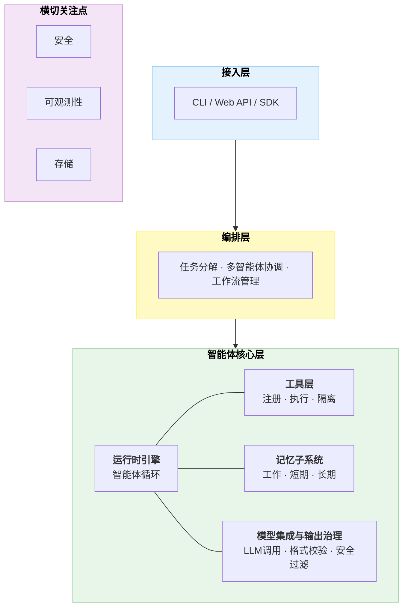
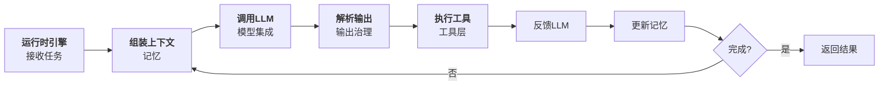
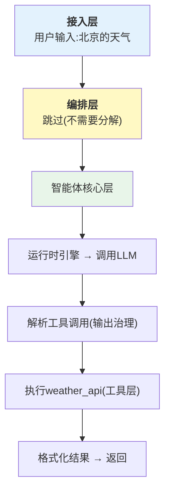
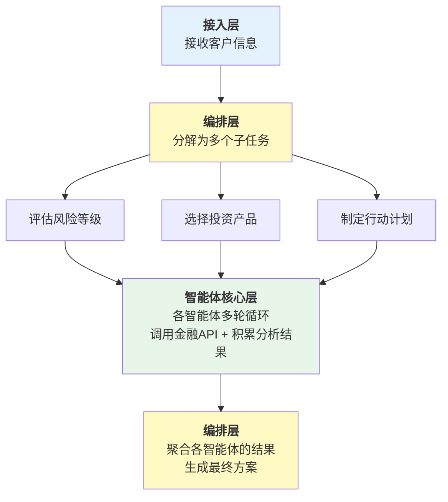
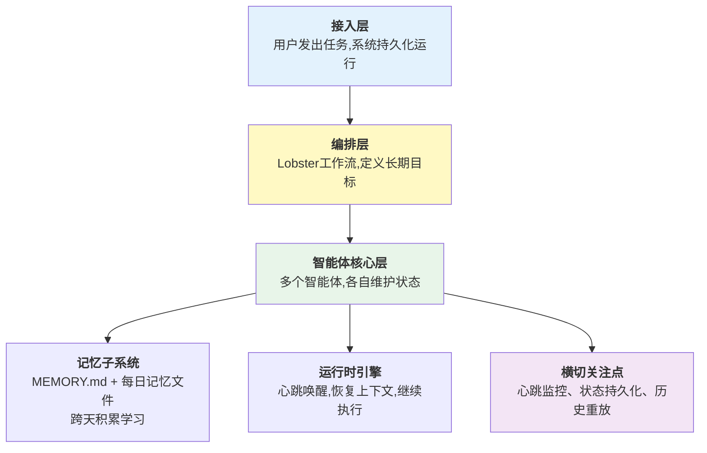
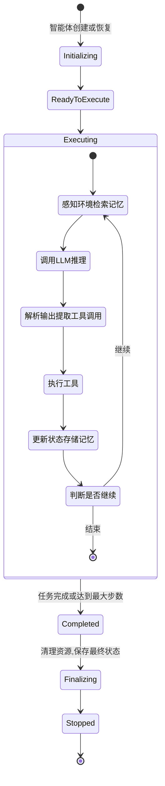
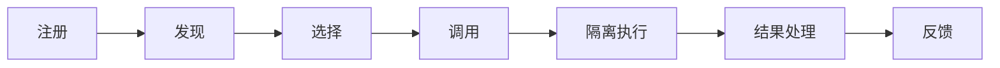

# 第二章：Harness 架构全景

本章从架构设计的高度，对 Harness 系统进行全面的剖析。

首先，我们提出一个通用的参考架构（三层 + 横切关注点），这个架构在不同的 Harness 实现中都能找到对应的概念——虽然名称和细节可能有所不同，但核心的分层思想是一致的。

接着，我们深入讨论每一层的设计原则、职责范围和接口规范。特别是，我们将对比三个业界的参考实现——OpenAI Codex 的性能型架构、Claude Code 的任务型架构和 OpenClaw 的自驱型架构——展示不同应用场景下的架构取舍。

在随后的章节中，我们特别关注两个横切的关注点——安全性和可观测性——它们虽然不是独立的层，但贯穿整个系统的各个角落，对系统的可靠性至关重要。

最后，本章通过 MiniHarness 项目的脚手架搭建，将所有的理论概念转化为可运行的代码。通过这一实践过程，读者不仅能够深化对架构的理解，更能为后续的系统开发奠定坚实的基础。

本章是连接第一章概念认识和后续各章深入设计的桥梁。

## 1. 通用参考架构

本节介绍 Harness 系统的通用参考架构，包括其设计目标、核心特性、分层结构、关键决策点和实现变体，为后续各章的深入讨论提供架构基础。

### 1.1 为什么需要参考架构

在第一章中，我们讨论了 Harness 系统的五大核心子系统和两大基础保障。但从架构的角度看，仅仅列举子系统是不够的。我们需要一个能够显示这些子系统如何组织、如何交互的架构模型。

参考架构的作用是：

- **提供设计指引**：新的 Harness 系统可以参照这个架构进行设计
- **便于比较**：不同的实现方案可以在统一的框架下进行对比
- **支持演进**：当系统需要升级或扩展时，清晰的结构指导我们如何进行改动

本节提出的参考架构，是基于行业最佳实践的抽象，覆盖本书主要案例。简单系统可以裁剪，强实时、强合规或嵌入式场景可能需要变体。

### 1.2 三层 + 横切关注点参考架构

基于第一章的子系统分析，本书提出一个 **三层 + 横切关注点** 的参考架构。三层自上而下分别是：

1. **接入层(Access Layer)**：系统与外部世界的边界，负责接收用户请求、协议转换和响应格式化。CLI、Web API、SDK 都属于接入层的实现形式。
2. **编排层(Orchestration Layer)**：负责复杂任务的分解、多智能体的协调和工作流管理。对于简单的单步任务，编排层可以直接透传；对于需要多个智能体协作的复杂任务，编排层负责分配子任务、管理依赖和聚合结果。
3. **智能体核心层(Agent Core Layer)**：Harness 的核心执行引擎，包含运行时引擎、工具层、记忆子系统和模型集成与输出治理四个子系统。它们在运行时引擎的同一循环中交替协作，而非分层调用。

三层之外， **安全、可观测性和存储** 作为横切关注点贯穿所有层级。

以下架构图展示了三层结构和横切关注点的全景：



图 2-1：三层 + 横切关注点参考架构全景

下面逐层展开。

#### 1.2.1 接入层

接入层是用户与 Harness 系统交互的入口。它的职责相对简单但至关重要：

- **协议适配**：将不同来源的请求（CLI 命令、HTTP API、WebSocket 消息等）统一转换为内部任务格式
- **身份认证**：验证请求方身份，为后续的权限检查提供基础
- **响应格式化**：将内部执行结果转换为用户期望的输出格式（流式文本、JSON 等）

接入层的设计原则是“薄而稳定”——它不应包含业务逻辑，只做格式转换和路由分发。

#### 1.2.2 编排层

编排层处于接入层和智能体核心层之间，负责任务级别的调度：

- **任务分解**：将复杂任务拆分为可独立执行的子任务
- **依赖管理**：识别子任务间的依赖关系，构建执行 DAG
- **多智能体协调**：为每个子任务分配合适的智能体，管理智能体间的通信
- **结果聚合**：收集各子任务的结果，合并为最终输出

对于简单任务（如单轮问答），编排层可以直接透传请求到核心层，不做额外处理。

#### 1.2.3 智能体核心层

智能体核心层是 Harness 的心脏。第一章中，我们看到运行时引擎、工具层、记忆子系统、输出治理这四个核心子系统形成星型拓扑。

这里有一个关键的架构事实：**模型调用、工具执行、记忆更新并非各自独立的层级，而是在运行时引擎的同一个循环中交替发生的**。一个典型的智能体步骤如下：



图 2-2：运行时引擎的七步执行流程

注意步骤 3-7 中，运行时引擎在 **同一个循环内** 交替调用模型集成、输出治理、工具层和记忆子系统。这正是将它们放在同一层而非分层的原因。

核心层的四个子系统各司其职。

**a) 运行时引擎(Runtime Engine)**

运行时引擎是核心层的协调者，驱动上述七步循环。它负责：

- 管理智能体循环的生命周期（启动、暂停、恢复、终止）
- 维护消息类型系统和执行状态
- 协调其他三个子系统的调用顺序
- 处理错误恢复和漂移检测

**b) 模型集成与输出治理(Model Integration & Output Governance)**

模型集成负责与 LLM 的交互：

- 支持多种 LLM（Claude、GPT、开源模型等）
- 管理提示词和系统消息
- 处理 token 限制和成本优化
- 支持流式和批量调用

输出治理负责处理 LLM 输出中最不确定的部分：

- **格式校正**：如果 LLM 没有返回期望的 JSON 格式，尝试修复
- **语义验证**：检查工具调用的参数是否合理（比如，是否调用了不存在的工具）
- **安全检查**：检查输出是否包含有害内容或违反约束
- **置信度评估**：评估 LLM 对其输出的置信度，低置信度时触发重试或人工审批

为什么需要输出治理？因为 LLM 的输出是不可预测的。即使你在提示词中要求“请返回 JSON 格式”，LLM 也可能返回一段 Markdown、多余的解释文字，或者格式不完整的 JSON。输出治理就是应对这种不确定性的防线。

下面的伪代码展示了输出治理的四步防御流程——从格式解析到安全检查，逐层过滤不合格的输出：

```python linenums="1"
# 伪代码示例:输出治理
class OutputGovernance:
    async def validate_and_fix(self, llm_output: str) -> ParsedOutput:
        """对LLM的原始输出进行校验和修复。

        为什么需要这个方法？
        LLM返回的是自然语言文本,即使要求返回JSON,也可能:
        - 格式错误(缺少引号、多余逗号)
        - 调用了不存在的工具
        - 包含不安全的操作指令
        这个方法通过四个步骤,把不可靠的文本转化为可信的结构化数据。
        """
        # 第一步:尝试将文本解析为JSON
        try:
            parsed = self._parse_json(llm_output)
        except JSONDecodeError:
            # 第二步:解析失败——让LLM自己修复格式错误
            # 这是一种常见的"自愈"策略:把出错的输出再发回给LLM,
            # 要求它修正格式问题
            llm_output = await self._ask_llm_to_fix(llm_output)
            parsed = self._parse_json(llm_output)

        # 第三步:语义验证——格式正确不代表内容正确
        # 比如LLM可能调用了一个系统中不存在的工具,
        # 或者传入了明显不合理的参数(如负数的文件大小)
        if not self._is_semantically_valid(parsed):
            raise ValidationError("Semantic validation failed")

        # 第四步:安全检查——即使内容合理,也要确保没有安全隐患
        # 比如LLM是否试图执行 "rm -rf /" 这样的危险命令
        if not await self._security_check(parsed):
            raise SecurityError("Output failed security check")

        return parsed
```

**c) 工具层(Tool Layer)**

工具层是智能体与外部世界的桥梁。它管理：

- 工具的注册和发现
- 参数验证和类型检查
- 工具执行的隔离和超时控制
- 错误处理和结果标准化

**d) 记忆子系统(Memory System)**

记忆允许智能体跨步骤、跨会话地保持上下文。按生命周期分为三层：

- 工作记忆（当前对话的上下文窗口，受 LLM 上下文长度限制）
- 短期记忆（会话级摘要和临时状态，生命周期数小时到数周）
- 长期记忆（持久化的知识和学习，通常借助向量索引支持语义检索）

#### 1.2.4 横切关注点

横切关注点贯穿所有层级，提供非业务逻辑的技术支撑。

**a) 安全(Security)**

- 权限管理和授权
- 敏感操作的隔离和沙箱
- 输入验证和防注入
- 审计日志记录

**b) 可观测性(Observability)**

- 分布式追踪，跟踪请求的完整执行路径
- 结构化日志，便于搜索和分析
- 性能指标收集
- 错误告警和趋势分析

**c) 存储(Storage)**

- 长期记忆的持久化（如向量数据库）
- 审计日志的存储和查询
- 任务状态和执行历史的保存
- 缓存层，用于加速频繁访问的数据

### 1.3 层间通信的设计原则

一个清晰的架构不仅要定义每层的职责，更要定义层间的通信方式。

#### 1.3.1 向下的调用

上层调用下层时，应该使用 **明确的、类型安全的接口**。所谓“类型安全”，是指每个方法的输入参数和返回值都有明确的类型声明，这样在开发阶段就能发现参数传错的问题，而不是等到运行时才报错。

下面定义了两个接口——编排层调用 `AgentCore.run()`，接入层调用 `Orchestrator.execute()`。注意它们都接收 `Task` 类型、返回 `Result` 类型，保持了统一的调用契约：

```python linenums="1"
# 清晰的接口定义
class AgentCore:
    async def run(self, task: Task) -> Result:
        """执行单个智能体任务。

        这是编排层调用智能体核心层的入口。
        Task 包含任务描述、参数、上下文等信息;
        Result 包含执行结果、状态码、耗时等信息。
        """
        pass  # 具体实现在第4章运行时引擎中展开

class Orchestrator:
    async def execute(self, task: Task) -> Result:
        """编排多智能体任务。

        这是接入层调用编排层的入口。
        对于简单任务,编排层可能直接转发给AgentCore;
        对于复杂任务,会先分解再分配。
        """
        pass  # 具体实现在第8章编排引擎中展开
```

#### 1.3.2 向上的反馈

下层向上层报告时，应该使用 **事件或回调机制**，而不是异常（异常应该只在真正的错误情况下使用）。

为什么用事件而不是异常？打个比方：异常就像火警警报，只在出了大问题时才响；而事件更像日常的工作汇报——“我开始执行了”、“我完成了第一步”、“我遇到了一个小问题但已经自行解决”。这些信息对于监控和调试系统至关重要，但它们不是“错误”，不适合用异常来表示。

下面的代码展示了如何通过事件机制实现这种“汇报”：

```python linenums="1"
@dataclass  # @dataclass 是Python的装饰器,自动为类生成构造方法和其他常用方法
class ExecutionEvent:
    """表示系统中发生的一个事件。

    所有层都可以发出事件,上层(或横切关注点中的可观测性模块)
    可以订阅这些事件来监控系统运行状态。
    """
    timestamp: datetime    # 事件发生的时间
    level: str             # 严重程度:"info"(信息), "warning"(警告), "error"(错误)
    source: str            # 事件来源,如 "AgentCore", "ToolLayer"
    message: str           # 人类可读的描述
    context: dict          # 附加信息,如 {"task_id": "abc123", "tool_name": "search"}

class AgentCore:
    def __init__(self, event_handler: Callable[[ExecutionEvent], None]):
        """构造方法接收一个事件处理函数(回调函数)。

        Callable[[ExecutionEvent], None] 的含义是:
        一个接收 ExecutionEvent 参数、不返回值的函数。
        这个函数由上层提供——上层决定收到事件后做什么
        (比如写日志、发告警、更新UI等),
        而下层只负责发出事件,不关心上层如何处理。
        """
        self.event_handler = event_handler

    async def run(self, task: Task):
        # 在开始执行时,发出一个"任务开始"事件
        self.event_handler(
            ExecutionEvent(
                timestamp=datetime.now(),
                level="info",
                source="AgentCore",
                message="Task started",
                context={"task_id": task.id}
            )
        )
        # ... 后续的执行逻辑 ...
```

#### 1.3.3 核心层内部的协作

智能体核心层内部，运行时引擎与其他子系统之间采用星型拓扑通信，正如第一章所述。这种设计意味着：

- 运行时引擎是唯一的协调者，其他子系统不直接互相调用
- 每个子系统通过明确定义的接口与运行时引擎交互
- 数据流始终经过运行时引擎中转，便于追踪和调试

### 1.4 OpenAI Codex 的性能型架构

OpenAI Codex 以 Rust 为核心语言（具体比例以官方代码库统计为准），围绕性能和系统级安全构建了完整的 Harness 架构。其组件到参考架构的映射如下：

| Codex 架构                                           | 参考架构映射        |
| -------------------------------------------------- | ------------- |
| CLI / TUI / Headless 三种入口 + MCP Server             | 接入层           |
| Subagent 层级委派（支持 3+ 层深度）                           | 编排层           |
| codex-core（智能体循环）                                  | 智能体核心层（运行时引擎） |
| skills / core-skills 模块 + MCP 工具集成                 | 智能体核心层（工具层）   |
| SQLite 持久化记忆 + AGENTS.md 项目文档                      | 智能体核心层（记忆子系统） |
| execpolicy（Starlark 策略引擎）                          | 智能体核心层（输出治理）  |
| 平台原生沙箱（Bubblewrap + seccomp，回退自带 bwrap / Seatbelt） | 横切关注点（安全）     |
| OpenTelemetry 原生集成                                 | 横切关注点（可观测性）   |

Codex 的特点：

- **双层安全模型**：execpolicy 策略引擎控制智能体“可以尝试什么”，平台原生沙箱控制“能做什么”，两层独立运作形成纵深防御
- **线性成本的上下文管理**：通过提示缓存和异步上下文压缩，将推理成本从对话长度的二次增长降为线性增长
- **仓库即上下文**：以代码仓库本身作为智能体的首要上下文来源，通过 AGENTS.md 和分层目录结构实现确定性、可版本控制的智能体行为
- **60+ Cargo Crate 的模块化**：每个子系统对应独立的 Rust crate，通过 trait 定义清晰的模块边界

### 1.5 Claude Code 的任务型架构

Claude Code 针对任务型应用进行了优化，其架构可以映射到参考架构：

| Claude Code 架构      | 参考架构映射           |
| ------------------- | ---------------- |
| API 入口 / CLI 界面     | 接入层              |
| Coordinator（多智能体编排） | 编排层              |
| QueryEngine（异步循环）   | 智能体核心层（运行时引擎）    |
| 24+ 内置工具            | 智能体核心层（工具层）      |
| 系统提示词缓存             | 智能体核心层（记忆子系统）    |
| 输出验证                | 智能体核心层（输出治理）     |
| 权限检查 + 追踪系统         | 横切关注点（安全 + 可观测性） |

Claude Code 的特点：

- **流式优化**：支持流式工具执行，提高响应速度
- **类型安全**：TypeScript 确保工具接口的类型安全
- **精细控制**：40+ 特性门控，提供细粒度的行为控制
- **核心层紧耦合**：QueryEngine 在同一循环中完成模型调用、输出解析、工具执行和上下文管理，体现了智能体核心层的设计理念

### 1.6 OpenClaw 的自驱型架构

OpenClaw 是一个自驱型智能体系统，与前两者的“用户发起、完成即停”模式不同，OpenClaw 的智能体可以长期自主运行。它的架构在编排和记忆方面有明显不同的侧重点：

| OpenClaw 架构         | 参考架构映射            |
| ------------------- | ----------------- |
| Gateway（长连接管理）      | 接入层               |
| Lobster（工作流引擎）      | 编排层               |
| 智能体执行循环             | 智能体核心层（运行时引擎）     |
| ClawHub（技能注册与发现）    | 智能体核心层（工具层）       |
| MEMORY.md（记忆持久化）    | 智能体核心层（记忆子系统）     |
| 模型选择与约束             | 智能体核心层（模型集成与输出治理） |
| SOUL.md（行为约束）+ 三级权限 | 横切关注点（安全）         |
| 心跳监控 + 日志系统         | 横切关注点（可观测性）       |

OpenClaw 的特点：

- **单一控制平面**：官方协议将 Gateway WebSocket 定位为“单一控制平面 + 节点传输”——客户端（CLI、Web UI、应用）由此接入下发指令，能力节点经同一通道接入，与参考架构的接入层/横切关注点对应良好
- **强大的编排**：Lobster 工作流引擎支持 YAML 定义的复杂流程
- **持久化智能体**：通过心跳机制，智能体可以长期运行和学习

### 1.7 架构在不同场景中的适配

虽然参考架构是通用的，但在不同的应用场景中，各层的重要性和复杂度会有所不同。下面通过三个由简到繁的场景，帮助读者直观理解架构各层在实际运行时是如何参与工作的。

#### 场景 1：简单的单任务智能体

比如，一个“查询天气”的智能体：



在这个场景中，编排层完全跳过，智能体核心层只需一轮循环。重点应该放在确保工具调用的正确性。

#### 场景 2：复杂的多步工作流

比如，“为客户创建一个完整的财务计划”：



在这个场景中，编排层变得至关重要——它需要确保各子任务的顺序、依赖关系和结果验证。

#### 场景 3：多智能体长期协作

比如，OpenClaw 的一个典型应用场景：



在这个场景中，记忆子系统和横切关注点中的存储变得至关重要，因为智能体需要在相当长的时间内维持一致的行为。

### 1.8 总结

三层 + 横切关注点的参考架构提供了一个通用的、可扩展的 Harness 系统设计框架。相比传统的多层线性模型，这个架构有三个关键优势：

1. **忠实反映真实执行流**：模型调用、工具执行、记忆更新在运行时引擎的同一循环中交替发生，将它们放在同一层（智能体核心层）符合实际
2. **与第一章子系统模型一致**：五大核心子系统和两大基础保障的划分，自然映射到三层结构和横切关注点
3. **灵活适配不同场景**：编排层可选，简单系统可以跳过；横切关注点按需启用，避免过度设计

通过这个框架：

- 新设计师可以快速理解 Harness 系统的全景
- 不同的实现可以在相同的抽象层次上进行比较
- 系统的演进和扩展有了清晰的方向

在接下来的章节中，我们将逐层深入，讨论每一层的具体设计和实现细节。

## 2. 执行层的详细设计

执行层是 Harness 系统的核心工作区域。它包括三个紧密相关的子系统：运行时引擎、工具层和记忆子系统。本节将深入讨论它们的设计原则、职责边界和接口规范。

### 2.1 运行时引擎

运行时引擎是执行层的核心，负责驱动智能体的“感知—推理—行动”循环。本小节介绍其核心职责、执行循环的设计、终止条件和接口规范。

#### 2.1.1 核心职责

运行时引擎管理智能体从创建到销毁的完整生命周期。以下状态机展示了这个生命周期的各个阶段：



图 2-3：运行时引擎的状态机与执行循环

#### 2.1.2 执行循环的六个步骤

执行循环是运行时引擎的核心。每一轮循环由六个步骤组成，每个步骤都有明确的输入、输出和职责边界。

**步骤 1：感知(Perceive)** — 收集当前任务需要的所有上下文信息。这包括三个来源：用户的原始输入（显式上下文）、最近几轮的对话历史（短期记忆）、以及与当前任务语义相关的历史经验（长期记忆的向量检索结果）。感知步骤的质量直接决定了后续推理的质量——如果遗漏了关键上下文，LLM 的推理就会偏离方向。

**步骤 2：推理(Reasoning)** — 将感知阶段收集的上下文组装为 LLM 的输入（系统提示 + 用户消息 + 可用工具列表），然后调用 LLM 获取响应。这一步的关键设计决策是 **上下文组装策略**——哪些信息放在系统提示中、哪些放在用户消息中、如何在有限的 Token 预算内优先保留最重要的内容。第四章和第六章将深入讨论这些策略。

**步骤 3：决策(Decision)** — 解析 LLM 的输出，提取其中的工具调用请求或最终答案。LLM 的输出可能包含多个工具调用（并行或顺序），也可能是一段文本回复。决策步骤需要验证每个工具调用的合法性：工具是否存在、参数格式是否正确、参数值是否在合理范围内。

**步骤 4：执行(Execution)** — 将验证通过的工具调用交给工具层执行。每个工具调用都设有超时限制，执行过程中的异常不会终止整个循环，而是被捕获并记录为错误结果。这种“容错继续”的策略确保单个工具的失败不会导致整个任务中断。

**步骤 5：学习(Learning)** — 将本轮循环的完整记录（输入上下文、LLM 推理、工具调用、执行结果）写入记忆系统。短期记忆总是写入；如果这一步具有较高的学习价值（例如遇到了新类型的错误），还会同步写入长期记忆。

**步骤 6：判断(Judgment)** — 决定是否继续下一轮循环。终止条件通常包括三种：LLM 已输出最终答案、已达到最大步数限制、已超过总执行时间。这些保护机制防止智能体陷入无限循环或消耗过多资源。

#### 2.1.3 接口设计

运行时引擎对外暴露的接口应当简洁明确，核心方法包括：

- `initialize(agent, task)`：初始化执行环境，加载智能体配置和任务定义
- `step()`：执行单步循环，返回本步骤的结果——这是最重要的方法，也是测试和调试的主要入口
- `run(task, max_steps, timeout)`：完整地执行一个任务，内部反复调用 `step()` 直到满足终止条件
- `pause()` / `resume()`：暂停和恢复执行，支持长时任务的中断和续行
- `get_state()`：获取当前执行状态，供可观测性系统使用

其中 `step()` 和 `run()` 的分离是一个重要的设计决策。`step()` 暴露了单步粒度的控制，使得外部系统可以在每一步之间插入检查点、审批流程或日志记录；`run()` 则提供了更简洁的“一键执行”接口，适用于不需要细粒度控制的场景。

### 2.2 工具层

工具层是智能体与外部世界交互的桥梁。LLM 本身只能生成文本，而工具层将文本形式的“意图”转化为真实的系统操作——执行代码、查询数据库、调用 API 等。本小节介绍工具的生命周期、注册表设计、执行流水线和隔离策略。

#### 2.2.1 工具的生命周期

一个工具从被系统感知到执行完毕，经历以下阶段：



图 2-4：工具从注册到执行的完整生命周期

**注册** 是工具进入系统的入口。每个工具需要提供一份结构化的“自我介绍”：名称、功能描述、输入参数的 JSON Schema、所需权限、超时限制等。这些元数据不仅供系统内部使用，更重要的是 **供 LLM 理解工具的能力和使用方式**——LLM 根据工具描述来决定何时调用哪个工具、传入什么参数。因此，工具描述的质量直接影响 LLM 的工具选择准确率。

**发现和选择** 发生在运行时引擎调用 LLM 之前。运行时引擎从注册表中检索当前任务可用的工具列表，将其以 LLM 能理解的格式（通常是 JSON Schema）注入到提示词中。对于工具数量较多的系统，可能需要动态筛选——只向 LLM 暴露与当前任务相关的工具，避免工具列表过长导致 LLM 选择困难。

**隔离执行** 是工具层最关键的环节。工具的执行可能涉及文件操作、网络请求、shell 命令等高风险操作，因此必须在受控的环境中运行。隔离的粒度从低到高包括：异常捕获（最轻量）、进程隔离（通过 subprocess）、容器隔离（通过 Docker）、系统级沙箱（如 Linux 的 seccomp 或 Bubblewrap）。第十二章将详细讨论各级隔离方案的权衡。

#### 2.2.2 注册表设计

工具注册表的核心是一个“名称 → 定义 + 执行器”的映射。设计上有两个关键决策：

**定义与执行器分离**。工具的元数据描述(ToolDefinition)和实际执行逻辑(executor)分开存储。这种分离使得同一个工具定义可以对应不同环境下的执行器——例如测试时使用 mock 执行器，生产时使用真实的 API 调用。

**LLM 友好的导出**。注册表需要提供一个 `list_for_llm()` 方法，将工具定义转换为 LLM API 所要求的格式。不同的 LLM 提供商对工具描述的格式要求略有不同（如 Anthropic 的 tool\_use 和 OpenAI 的 function\_calling），注册表应封装这些差异。

#### 2.2.3 执行流水线

工具执行器的职责不只是“调用函数”，而是一条完整的流水线，每一步都有明确的目的：

1. **查找工具**：从注册表中获取工具定义和执行器。找不到则立即返回错误，避免后续无效操作。
2. **权限检查**：验证当前智能体是否有权使用该工具。这是安全层的第一道防线——即使 LLM 输出了工具调用，如果智能体没有对应权限，调用也会被拒绝。
3. **参数验证**：根据工具定义中的 JSON Schema 验证参数的类型和取值范围。LLM 生成的参数并不总是正确的，验证可以在执行前发现明显的格式错误。
4. **隔离执行**：在设定的超时限制内执行工具逻辑。超时保护防止工具长时间阻塞运行时引擎。
5. **结果标准化**：无论工具执行成功还是失败，都返回统一格式的 `ToolResult`（包含状态码、输出内容、错误信息），使得运行时引擎可以用一致的方式处理所有工具的执行结果。

第五章将深入探讨每个环节的工程实现细节，包括参数校正、重试策略和结果缓存等高级特性。

### 2.3 记忆子系统

本小节讨论记忆子系统的设计动机、分层策略、检索机制和统一接口设计。

#### 2.3.1 为什么需要分层记忆

人类的记忆天然是分层的：工作记忆容量有限但响应极快，长期记忆容量几乎无限但检索较慢。智能体的记忆系统采用了类似的分层策略，但动机更直接—— **LLM 的上下文窗口是有限的**。即使最新的模型支持数十万 Token 的上下文，也无法将智能体所有的执行历史、学习经验和领域知识一次性塞入上下文。因此，记忆子系统的核心任务是：在有限的上下文预算内，为当前任务提供最相关的信息。

这个问题可以类比数据库的存储层级：CPU 缓存（快但小）→ 内存（中等）→ 磁盘（慢但大）。每一层在容量、延迟和访问模式上有不同的特点，系统需要智能地决定什么数据放在哪一层。

#### 2.3.2 记忆的分层结构

按生命周期和访问模式划分，从存储实现的视角看，记忆系统通常包含三层（1.3 节概念分层中的“工作记忆”在此视角下并入会话级短期记忆，“向量检索层”则是长期记忆的语义索引）：

| 层级    | 生命周期    | 容量          | 延迟 | 典型内容                 | 实现方式     |
| ----- | ------- | ----------- | -- | -------------------- | -------- |
| 短期记忆  | 当前会话    | 小（受上下文窗口限制） | 极低 | 最近的对话轮次、临时观察、已完成步骤摘要 | 内存中的双端队列 |
| 长期记忆  | 跨会话持久化  | 大           | 中等 | 成功的执行模式、用户偏好、学到的规则   | 数据库或文件系统 |
| 向量检索层 | 随长期记忆同步 | 大           | 较高 | 长期记忆的语义索引            | 向量数据库    |

**短期记忆** 是智能体的“工作台”。它保存当前会话中最近的执行步骤，供运行时引擎在每一轮循环中组装上下文。短期记忆的关键设计决策是 **容量上限**——当记忆超出上下文窗口的预算时，需要丢弃或压缩旧的条目。常见策略包括滑动窗口（丢弃最早的条目）和摘要压缩（将多条记录浓缩为一段摘要）。

**长期记忆** 让智能体能够跨会话积累经验。并非所有执行步骤都值得长期保存——一个关键的设计决策是 **重要性过滤**：只有满足一定重要性阈值的记录才会写入长期存储。判断重要性的常见信号包括：任务是否成功、是否遇到过异常、用户是否给出了反馈等。

**向量检索层** 为长期记忆提供语义搜索能力。传统的按时间或关键词检索在面对大量记忆时效果有限——智能体需要的是“找到与当前任务最相关的历史经验”，这正是向量检索擅长的。它将每条记忆编码为高维向量，通过余弦相似度等度量找到语义上最接近的记忆条目。

为避免概念混淆，本书区分三类状态：**运行时状态 / 事件日志** 是当前执行的权威记录；**记忆** 保存可检索的事实、摘要、偏好和经验；**上下文** 是运行时在每次模型调用前从状态与记忆中投影出的输入片段。三者可以互相引用，但不能互相替代。

#### 2.3.3 检索策略

记忆管理器需要根据不同的场景选择合适的检索策略：

* **时间优先**：获取最近 N 条记录。适用于需要了解“刚才发生了什么”的场景，例如在多步任务中回顾上一步的结果。
* **语义优先**：按查询与记忆条目的语义相似度排序。适用于“以前遇到过类似问题吗”的场景，例如智能体在执行一个新任务时搜索历史中的类似案例。
* **混合检索**：先通过时间窗口缩小候选集，再按语义排序。这种方式在实践中最为常用，因为它既保证了时效性，又利用了语义匹配的精确度。

#### 2.3.4 统一接口设计

尽管底层有多层存储，记忆管理器应对外暴露统一的接口，让运行时引擎无需关心记忆存储在哪一层。核心接口只需两个操作：

```python
class MemoryManager:
    """统一的记忆接口"""

    async def store_step(self, record: StepRecord, importance: float = 0.5) -> None:
        """存储一步执行记录。短期记忆总是写入;超过重要性阈值时同步写入长期记忆和向量索引。"""

    async def retrieve(self, query: str = None, recent_only: bool = False, top_k: int = 5) -> list[StepRecord]:
        """检索记忆。recent_only=True 走短期记忆;有 query 走向量语义检索;否则走长期记忆时间排序。"""
```

这种“写入时分层、读取时统一”的设计，使得运行时引擎只需调用 `store_step` 和 `retrieve`，而分层逻辑、重要性判断、向量编码等复杂性全部封装在记忆管理器内部。第六章将深入探讨每一层的工程实现细节。

### 2.4 执行层各子系统的协作

前面分别讨论了运行时引擎、工具层和记忆子系统各自的设计。但在实际执行中，这三个子系统并非独立运行，而是在每一步循环中紧密协作。理解它们的协作方式，是理解执行层整体设计的关键。

#### 2.4.1 协作的核心原则

执行层采用 **星型拓扑**：运行时引擎是唯一的协调者，工具层和记忆子系统不直接相互调用。这个设计看似增加了间接性，实则带来了三个重要的工程优势：

* **可追踪性**：所有数据流都经过运行时引擎，便于构建完整的执行轨迹
* **可测试性**：每个子系统可以独立 mock，无需搭建完整的系统环境
* **可替换性**：更换记忆后端（如从内存切换到 Redis）不会影响工具层的实现

因此，工具层只返回标准化 `ToolResult` 和执行元数据；是否写入事件日志、短期记忆或长期记忆，由运行时引擎根据审计、重要性和隐私策略决定。

#### 2.4.2 一步执行的协作流程

在每一步执行中，三个子系统按以下顺序协作：

1. **记忆 → 运行时引擎**：运行时引擎从记忆管理器检索当前任务相关的上下文（最近的对话历史、语义相似的历史经验），组装成 LLM 的输入
2. **运行时引擎 → LLM**：运行时引擎将组装好的上下文发送给 LLM，获取推理结果
3. **运行时引擎 → 工具层**：如果 LLM 输出了工具调用请求，运行时引擎将其转交给工具执行器，由工具层完成参数验证、权限检查和隔离执行
4. **工具层 → 运行时引擎 → 记忆**：工具执行结果返回给运行时引擎，引擎将本步骤的完整记录（输入、推理、动作、结果）写入记忆管理器

这个循环不断重复，直到 LLM 输出最终答案或达到步数上限。

#### 2.4.3 重要性评估

在步骤 4 中，运行时引擎需要为每条记录评估“重要性”，以决定是否写入长期记忆。常见的评估信号包括：工具调用是否失败（失败的经验往往更值得记住）、用户是否给出了明确的反馈、当前任务是否是新类型等。这个评估逻辑虽然简单，却直接影响智能体的长期学习效果——第六章将对此做深入讨论。

### 2.5 托管 Agent 虚拟化：Brain/Hands 解耦架构

传统的 Harness 架构将“大脑”（推理引擎）和“手”（执行环境）紧密耦合在一起。这种单体设计在小规模场景中运作良好，但在长期运行的生产环境中面临两个核心问题：

1. **假设快速老化**：Harness 中编码的关于“模型能力的假设”会随着模型升级而过时。例如，Claude Sonnet 4.5 表现出的“上下文焦虑”（在接近上下文限制时过早结束任务）在升级到 Claude Opus 4.6 后消失了，使得针对此行为的特殊处理变成了无效的开销。
2. **容错性不足**：容器作为“宠物”（手工维护的单个实例）需要精心照顾。任何容器故障都导致整个 Agent 停机，而无法通过重试恢复。

**托管 Agent 虚拟化** 解决这些问题的关键在于将 Agent 的生命周期拆分为三个独立的抽象：

#### 2.5.1 三层虚拟化架构

**会话层 (Session)** — 追加式的事件日志

* 记录 Agent 整个生命周期中发生的每一件事
* 不关心事件的存储位置或格式，仅追加
* 提供 `getEvents()` 接口，支持选择性检索：按范围取切片、按时间戳倒回、按关键词搜索
* 外部状态管理：与 Harness 实现无关，持久化到外部数据库或文件系统

```python
class Session:
    """会话：持久化的事件日志"""

    def __init__(self, session_id: str, storage_backend):
        self.session_id = session_id
        self.storage = storage_backend  # S3, PostgreSQL, 文件系统等
        self.event_stream = []

    async def append_event(self, event: AgentEvent):
        """追加事件，不可删除"""
        event.timestamp = time.time()
        event.session_id = self.session_id
        await self.storage.append(event)

    async def get_events(self,
                        start_index: int = None,
                        start_timestamp: float = None,
                        limit: int = None) -> list[AgentEvent]:
        """灵活检索事件，支持从中间继续、倒回到特定时刻"""
        return await self.storage.query_events(
            session_id=self.session_id,
            start_index=start_index,
            start_timestamp=start_timestamp,
            limit=limit
        )
```

**Harness 层** — 循环逻辑的无状态实现

* 读取 Session 中的事件来恢复上下文，而非依赖内存状态
* 实现 Agent 的核心循环逻辑（感知→推理→执行）
* 对 Session 中的新事件完全无知：只负责生成新事件并写回 Session
* 允许多个 Harness 实例共同处理同一个 Session（例如从另一个实例恢复执行）

```python
class Harness:
    """Harness：无状态的循环引擎"""

    async def step(self, session: Session, resumption_point: int = None):
        """执行一步，从恢复点继续"""
        # 1. 从Session恢复上下文
        events = await session.get_events(start_index=resumption_point or 0)
        context = self._reconstruct_context(events)

        # 2. 执行单步循环
        perception = self._perceive(context)
        reasoning = await self.llm.infer(perception)
        decision = self._parse_decision(reasoning)

        # 3. 执行工具调用（可能失败）
        results = []
        for tool_call in decision.tool_calls:
            result = await self.tools.execute(tool_call)
            results.append(result)  # 记录执行结果，即使失败也继续

        # 4. 追加事件到Session
        await session.append_event(AgentStepCompleted(
            step_number=len(events),
            perception=perception,
            reasoning=reasoning,
            actions=decision.tool_calls,
            results=results
        ))

    def _reconstruct_context(self, events: list[AgentEvent]) -> dict:
        """从事件流重建当前上下文"""
        context = {"history": [], "state": {}}
        for event in events:
            if isinstance(event, AgentStepCompleted):
                context["history"].append({
                    "input": event.perception,
                    "reasoning": event.reasoning,
                    "actions": event.actions
                })
            elif isinstance(event, StateChanged):
                context["state"].update(event.changes)
        return context
```

**沙箱层 (Sandbox)** — 执行环境的可替换实现

* 独立管理代码执行、文件操作、API 调用等环境
* 与 Harness 和 Session 完全解耦
* 容器故障不影响 Session，因为失败的工具调用会记录到 Session 中，Harness 可以重试
* 支持热切换：同一个 Session 可以在不同的容器中继续执行

```python
class Sandbox:
    """沙箱：可替换的执行环境"""

    async def execute_tool(self, tool_call: ToolCall) -> ToolResult:
        """在隔离环境中执行工具"""
        # 真实实现可能涉及：
        # - Docker容器内代码执行
        # - API网关代理外部服务调用
        # - 文件系统隔离
        try:
            result = await self._run_isolated(tool_call)
            return ToolResult(status="success", output=result)
        except Exception as e:
            return ToolResult(status="error", error=str(e))
            # 注意：错误被返回给Harness，不会导致Session中断
```

#### 2.5.2 长期任务的上下文管理

对于超过 LLM 上下文窗口的长期任务，Session 作为“外部上下文对象”解决了这个问题：

```python
async def run_long_horizon_task(task: Task, max_total_time: int):
    """长期任务执行，跨越多个上下文窗口"""
    session = Session(task.id, storage_backend=postgresql)
    harness = Harness(model="claude-opus-4-7")
    sandbox = Sandbox(docker_config)

    start_time = time.time()
    step_count = 0

    while time.time() - start_time < max_total_time:
        # 1. 恢复：从Session中取最近1000个token的事件
        # （即使任务已运行10000步，也只加载最近的上下文）
        recent_events = await session.get_events(
            start_index=max(0, step_count - 50),  # 最近50步
            limit=1000  # 最多1000个token
        )

        # 2. 循环：Harness执行一步
        await harness.step(session, resumption_point=step_count)
        step_count += 1

        # 3. 检查是否完成
        latest_event = await session.get_events(start_index=step_count-1, limit=1)
        if latest_event[0].type == "task_completed":
            break

    # 4. 完整恢复（用于事后分析）
    full_history = await session.get_events()
    return analyze_execution(full_history)
```

#### 2.5.3 托管 Agent 的优势

| 问题    | 单体设计      | 虚拟化设计                     |
| ----- | --------- | ------------------------- |
| 容器故障  | Agent 中断  | 在不同容器继续执行                 |
| 模型升级  | 旧假设变成死代码  | Harness 可灵活适配新模型能力        |
| 上下文溢出 | 需要复杂的压缩策略 | Session 外部管理，Harness 读取切片 |
| 可观测性  | 依赖日志系统    | 事件流天然提供完整轨迹               |
| 多实例并行 | 互相干扰      | 完全隔离，可实现分布式执行             |

这种虚拟化设计遵循操作系统的哲学——将具体实现细节抽象成稳定的接口（Session 的事件 API、Harness 的循环契约、Sandbox 的工具执行接口），使得系统能够长期演进而无需破坏性改动。

### 2.6 总结

执行层通过三个紧密协作的子系统：

* **运行时引擎**：实现智能体的执行循环，从感知、推理、决策到执行的完整流程
* **工具层**：提供安全、标准化的工具调用机制，包括注册、验证、隔离执行
* **记忆系统**：支持工作、短期、长期三层记忆与向量语义检索，让智能体能够学习和改进

这三个子系统的清晰接口设计，使得它们可以独立演进，也可以灵活组合以适应不同的场景需求。

在生产级别的托管 Agent 场景中，进一步的虚拟化（Session/Harness/Sandbox 三层解耦）提供了更强的容错性和适应性，使得系统能够处理长期运行任务并适应模型能力的演进。

## 3. 安全层与可观测性层

本节介绍安全层和可观测性层的设计原则、核心组件、实现策略和最佳实践，这两层贯穿整个 Harness 系统，为所有子系统提供基础保障。

### 3.1 基础保障的重要性

安全层和可观测性层虽然不是独立的执行层，但它们贯穿整个 Harness 系统的每个角落。它们的设计质量直接决定了系统的安全性、可维护性和生产就绪程度。

### 3.2 安全层

安全层的核心理念是：**假设智能体的任何决策都可能存在风险，需要进行多层验证。**

#### 3.2.1 安全的层次化模型

根据操作的风险程度，我们定义了六个信任等级，每个等级对应不同的权限配置：

| 信任等级                   | 权限配置        | 典型应用    |
| ---------------------- | ----------- | ------- |
| Manual Only            | 完全人工操作      | 极高风险    |
| Approve Always         | 每步都需要审批     | 高风险操作   |
| Approve Once           | 整个流程开始前审批   | 生产环境    |
| Ask First              | 关键操作前请求审批   | 开发/测试环境 |
| Auto with Notification | 自动执行+发送通知   | 低风险日常操作 |
| Full Trust             | 完全自主执行，无需通知 | 玩具应用    |

#### 3.2.2 权限管理系统的设计

权限管理系统通过定义权限等级来实现细粒度的访问控制：

```python
from enum import Enum
from typing import Protocol, Optional
from pydantic import BaseModel
from datetime import datetime

class PermissionLevel(str, Enum):
    """权限等级定义(6级信任模型)"""
    MANUAL_ONLY = "manual_only"           # 完全人工操作
    APPROVE_ALWAYS = "approve_always"     # 每步审批
    APPROVE_ONCE = "approve_once"         # 整个任务审批一次
    ASK_FIRST = "ask_first"               # 事前询问
    AUTO_WITH_NOTIFICATION = "auto_with_notification"  # 自动+通知
    FULL_TRUST = "full_trust"             # 完全信任

class ResourcePermission(BaseModel):
    """对某个资源的权限定义"""
    resource_id: str          # 资源标识(如"file://config.yaml")
    resource_type: str        # 资源类型(如"file", "api", "database")
    permission_level: PermissionLevel
    actions: list[str]        # 允许的操作(如"read", "write", "delete")
    conditions: dict = {}     # 额外条件(如"max_size_mb": 100)

class AgentPermissions(BaseModel):
    """智能体的权限配置"""
    agent_id: str
    permissions: list[ResourcePermission]
    default_level: PermissionLevel = PermissionLevel.ASK_FIRST  # 默认询问级别
    created_at: datetime
    expires_at: Optional[datetime] = None  # 权限过期时间

class PermissionManager:
    """权限管理器"""

    def __init__(self, policy_storage: PolicyStorage):
        self.policy_storage = policy_storage
        self.cache = {}  # 权限缓存,加速查询

    async def check_permission(
        self,
        agent_id: str,
        resource_id: str,
        action: str
    ) -> tuple[bool, Optional[str]]:
        """
        检查Agent是否有权进行操作。

        返回:(是否有权, 理由或None)
        """
        # 从缓存中获取权限
        permissions = self.cache.get(agent_id)
        if permissions is None:
            # 从存储中加载
            permissions = await self.policy_storage.load(agent_id)
            self.cache[agent_id] = permissions

        # 检查权限是否过期
        if permissions.expires_at and datetime.now() > permissions.expires_at:
            return False, "Agent permissions have expired"

        # 查找匹配的权限
        for perm in permissions.permissions:
            if self._resource_matches(perm.resource_id, resource_id):
                if action in perm.actions:
                    return True, None

        # 如果没有找到,使用默认权限
        if permissions.default_level == PermissionLevel.FULL_TRUST:
            return True, None
        elif permissions.default_level == PermissionLevel.ASK_FIRST:
            return False, "Request needs human approval"

        return False, "Permission denied"

    async def request_approval(
        self,
        agent_id: str,
        resource_id: str,
        action: str,
        reason: str
    ) -> ApprovalRequest:
        """提交审批请求"""
        return ApprovalRequest(
            agent_id=agent_id,
            resource_id=resource_id,
            action=action,
            reason=reason,
            created_at=datetime.now(),
            status="pending"
        )

    def _resource_matches(self, pattern: str, resource: str) -> bool:
        """检查资源是否匹配权限模式"""
        # 支持通配符匹配
        # 如 "file://*.log" 匹配所有.log文件
        from fnmatch import fnmatch
        return fnmatch(resource, pattern)
```

#### 3.2.3 沙箱隔离的设计

对于高风险的操作（如执行系统命令、修改文件），Harness 需要在隔离的环境中执行，以防止其影响整个系统。

```python
class SandboxExecutor:
    """在沙箱中执行操作"""

    async def execute(
        self,
        tool_call: ToolCall,
        isolation_level: IsolationLevel = IsolationLevel.PROCESS
    ) -> ToolResult:
        """
        在隔离环境中执行工具调用。

        isolation_level:
          - NONE: 直接执行,无隔离
          - PROCESS: 进程级隔离
          - CONTAINER: 容器级隔离(Docker)
          - VM: 虚拟机级隔离
        """
        if isolation_level == IsolationLevel.NONE:
            return await self._execute_directly(tool_call)

        elif isolation_level == IsolationLevel.PROCESS:
            return await self._execute_in_subprocess(tool_call)

        elif isolation_level == IsolationLevel.CONTAINER:
            return await self._execute_in_container(tool_call)

        elif isolation_level == IsolationLevel.VM:
            return await self._execute_in_vm(tool_call)

    async def _execute_in_subprocess(self, tool_call: ToolCall) -> ToolResult:
        """在子进程中执行,隔离系统调用"""
        import subprocess

        try:
            # 构造执行命令
            cmd = self._build_command(tool_call)

            # 在子进程中执行,限制资源
            result = subprocess.run(
                cmd,
                timeout=30,
                capture_output=True,
                text=True,
                # 限制内存和CPU
                # cgroups配置需要在系统层面
            )

            if result.returncode == 0:
                return ToolResult(
                    status="success",
                    output=result.stdout
                )
            else:
                return ToolResult(
                    status="error",
                    error=result.stderr
                )

        except subprocess.TimeoutExpired:
            return ToolResult(
                status="timeout",
                error="Execution exceeded 30s timeout"
            )

    async def _execute_in_container(self, tool_call: ToolCall) -> ToolResult:
        """在Docker容器中执行,完整的资源隔离"""
        import docker

        client = docker.from_env()

        try:
            # 在临时容器中执行
            # containers.run 本身不支持超时参数，超时控制交给 asyncio
            output = await asyncio.wait_for(
                asyncio.to_thread(
                    client.containers.run,
                    image="python:3.11-slim",
                    command=self._build_command(tool_call),
                    remove=True,
                    mem_limit="512m",  # 512MB内存限制
                    memswap_limit="1g",  # 包括swap
                    nano_cpus=500_000_000,  # 限制到50%CPU（单位为1e-9核）
                    network_disabled=True  # 禁用网络
                ),
                timeout=30,
            )

            return ToolResult(
                status="success",
                output=output.decode()
            )

        except docker.errors.ContainerError as e:
            return ToolResult(
                status="error",
                error=str(e)
            )
```

#### 3.2.4 审计日志的设计

审计日志记录所有安全相关事件，便于事后追踪和分析：

```python
class AuditLog(BaseModel):
    """审计日志记录"""
    timestamp: datetime
    agent_id: str
    action_type: str  # "permission_check", "tool_execution", "approval_request"等
    resource: str
    operation: str
    status: str  # "allowed", "denied", "executed", "failed"
    details: dict = {}  # 额外信息
    ip_address: Optional[str] = None
    user_id: Optional[str] = None

class AuditLogger:
    """审计日志系统"""

    def __init__(self, storage: AuditLogStorage):
        self.storage = storage
        self.buffer = []  # 日志缓冲,批量写入以提高性能
        self.buffer_size = 100

    async def log(self, audit_log: AuditLog) -> None:
        """记录一条审计日志"""
        self.buffer.append(audit_log)

        if len(self.buffer) >= self.buffer_size:
            await self._flush()

    async def _flush(self) -> None:
        """将缓冲的日志写入存储"""
        if not self.buffer:
            return

        await self.storage.batch_insert(self.buffer)
        self.buffer.clear()

    async def query(
        self,
        agent_id: str = None,
        action_type: str = None,
        status: str = None,
        time_range: tuple[datetime, datetime] = None,
        limit: int = 100
    ) -> list[AuditLog]:
        """查询审计日志"""
        filters = {}
        if agent_id:
            filters["agent_id"] = agent_id
        if action_type:
            filters["action_type"] = action_type
        if status:
            filters["status"] = status

        return await self.storage.query(
            filters=filters,
            time_range=time_range,
            limit=limit
        )

    async def export(
        self,
        file_path: str,
        format: str = "json"
    ) -> None:
        """导出审计日志"""
        logs = await self.storage.query(filters={})

        if format == "json":
            with open(file_path, "w") as f:
                json.dump(
                    [log.model_dump() for log in logs],
                    f,
                    default=str
                )
        elif format == "csv":
            import csv
            with open(file_path, "w", newline="") as f:
                writer = csv.DictWriter(f, fieldnames=AuditLog.model_fields)
                writer.writeheader()
                for log in logs:
                    writer.writerow(log.model_dump())
```

### 3.3 可观测性层

可观测性的核心目标是：**当系统出现问题时，能够快速定位根本原因。**

可观测性的三个支柱：日志、追踪、指标。

#### 3.3.1 结构化日志

结构化日志使用 JSON 格式记录事件，便于机器解析和检索：

```python
from enum import Enum
import logging
import json
from datetime import datetime

class LogLevel(str, Enum):
    DEBUG = "DEBUG"
    INFO = "INFO"
    WARNING = "WARNING"
    ERROR = "ERROR"
    CRITICAL = "CRITICAL"

class StructuredLogger:
    """结构化日志系统"""

    def __init__(self, name: str, storage: LogStorage):
        self.name = name
        self.storage = storage
        self.context = {}  # 当前的上下文信息

    def set_context(self, **kwargs) -> None:
        """设置日志上下文"""
        self.context.update(kwargs)

    async def log(
        self,
        level: LogLevel,
        message: str,
        **kwargs
    ) -> None:
        """记录一条日志"""
        log_record = {
            "timestamp": datetime.now().isoformat(),
            "logger": self.name,
            "level": level.value,
            "message": message,
            "context": self.context,
            "extra": kwargs
        }

        # 输出到控制台
        print(json.dumps(log_record))

        # 存储
        await self.storage.save(log_record)

    async def search(
        self,
        query: str,
        level: LogLevel = None,
        time_range: tuple[datetime, datetime] = None,
        limit: int = 100
    ) -> list[dict]:
        """搜索日志"""
        return await self.storage.search(
            query=query,
            level=level,
            time_range=time_range,
            limit=limit
        )

# 结构化日志使用示例
logger = StructuredLogger("agent.runtime", storage)
logger.set_context(agent_id="agent-001", task_id="task-123")

await logger.log(
    level=LogLevel.INFO,
    message="Tool execution started",
    tool_name="weather_api",
    params={"city": "Beijing"}
)
```

#### 3.3.2 分布式追踪

分布式追踪通过跟踪请求跨越多个系统组件的执行路径，来诊断性能问题：

```python
from contextlib import asynccontextmanager
from dataclasses import dataclass, field
import uuid
from datetime import datetime
from typing import Optional

@dataclass
class TraceSpan:
    """追踪单元"""
    trace_id: str          # 追踪的全局ID
    span_id: str           # 这个span的ID
    parent_span_id: Optional[str]  # 父span的ID
    operation_name: str    # 操作名称
    start_time: datetime
    end_time: Optional[datetime]
    duration_ms: Optional[float]
    status: str            # "success", "error", "timeout"
    error: Optional[str]
    attributes: dict = field(default_factory=dict)  # 属性(如参数、结果等)

class Tracer:
    """分布式追踪系统"""

    def __init__(self, service_name: str, storage: TraceStorage):
        self.service_name = service_name
        self.storage = storage
        self.current_trace_id: Optional[str] = None
        self.span_stack: list[TraceSpan] = []

    def start_trace(self, trace_id: str = None) -> str:
        """开始一个新的追踪"""
        if trace_id is None:
            trace_id = str(uuid.uuid4())

        self.current_trace_id = trace_id
        self.span_stack = []
        return trace_id

    def start_span(
        self,
        operation_name: str,
        attributes: dict = None
    ) -> TraceSpan:
        """开始一个新的span"""
        parent_span = self.span_stack[-1] if self.span_stack else None

        span = TraceSpan(
            trace_id=self.current_trace_id,
            span_id=str(uuid.uuid4()),
            parent_span_id=parent_span.span_id if parent_span else None,
            operation_name=operation_name,
            start_time=datetime.now(),
            end_time=None,
            duration_ms=None,
            status="pending",
            error=None,
            attributes=attributes or {}
        )

        self.span_stack.append(span)
        return span

    async def end_span(
        self,
        span: TraceSpan,
        status: str = "success",
        error: str = None
    ) -> None:
        """结束一个span"""
        span.end_time = datetime.now()
        span.duration_ms = (
            span.end_time - span.start_time
        ).total_seconds() * 1000
        span.status = status
        span.error = error

        # 弹出栈
        if self.span_stack and self.span_stack[-1] == span:
            self.span_stack.pop()

        # 存储
        await self.storage.save(span)

    @asynccontextmanager
    async def context_manager(
        self,
        operation_name: str,
        attributes: dict = None
    ):
        """上下文管理器,简化span的使用"""
        span = self.start_span(operation_name, attributes)
        try:
            yield span
            await self.end_span(span, status="success")
        except Exception as e:
            await self.end_span(span, status="error", error=str(e))
            raise

# 分布式追踪使用示例
async with tracer.context_manager("tool_execution", {"tool": "weather_api"}):
    # 执行工具
    result = await weather_api.get(city="Beijing")
```

#### 3.3.3 性能指标收集

性能指标收集系统记录和汇总关键性能指标，支持实时监控和告警：

```python
from collections import defaultdict
from statistics import mean, stdev, quantiles
from datetime import datetime
import time

class MetricsCollector:
    """性能指标收集"""

    def __init__(self):
        self.metrics: dict[str, list[float]] = defaultdict(list)
        self.counters: dict[str, int] = defaultdict(int)

    def record_duration(
        self,
        metric_name: str,
        duration_ms: float
    ) -> None:
        """记录一个时间指标"""
        self.metrics[metric_name].append(duration_ms)

    def increment_counter(
        self,
        counter_name: str,
        value: int = 1
    ) -> None:
        """增加计数"""
        self.counters[counter_name] += value

    def get_statistics(self, metric_name: str) -> dict:
        """获取指标的统计信息"""
        if metric_name not in self.metrics or not self.metrics[metric_name]:
            return {}

        values = self.metrics[metric_name]
        return {
            "count": len(values),
            "min": min(values),
            "max": max(values),
            "mean": mean(values),
            "stdev": stdev(values) if len(values) > 1 else 0,
            "p50": quantiles(values, n=4)[1],  # 50th percentile (median)
            "p99": quantiles(values, n=100)[-1]  # 99th percentile
        }

    async def export_metrics(self, time_interval: int = 60) -> dict:
        """定期导出指标"""
        return {
            "timestamp": datetime.now().isoformat(),
            "metrics": {
                name: self.get_statistics(name)
                for name in self.metrics
            },
            "counters": dict(self.counters)
        }

# 性能指标收集使用示例
metrics = MetricsCollector()

# 记录工具执行时间
start = time.time()
result = await tool.execute()
duration = (time.time() - start) * 1000
metrics.record_duration("tool_execution_time", duration)

# 记录错误计数
if result.status != "success":
    metrics.increment_counter("tool_execution_errors")

# 导出指标
stats = metrics.get_statistics("tool_execution_time")
print(f"Tool execution: mean={stats['mean']:.1f}ms, p99={stats['p99']:.1f}ms")
```

#### 3.3.4 可观测性的集成

可观测性的三个支柱（日志、追踪、指标）需要有机集成，通过共同的上下文实现关联：

```python
class ObservabilityManager:
    """统一的可观测性管理"""

    def __init__(
        self,
        logger: StructuredLogger,
        tracer: Tracer,
        metrics: MetricsCollector
    ):
        self.logger = logger
        self.tracer = tracer
        self.metrics = metrics

    async def record_tool_execution(
        self,
        tool_name: str,
        params: dict,
        result: ToolResult,
        duration_ms: float
    ) -> None:
        """记录工具执行的完整可观测性"""
        # 1. 记录日志
        await self.logger.log(
            level=LogLevel.INFO if result.status == "success" else LogLevel.ERROR,
            message=f"Tool execution completed: {tool_name}",
            tool_name=tool_name,
            status=result.status,
            duration_ms=duration_ms
        )

        # 2. 记录指标
        self.metrics.record_duration(
            f"tool_execution_time:{tool_name}",
            duration_ms
        )
        if result.status != "success":
            self.metrics.increment_counter(f"tool_execution_errors:{tool_name}")

        # 3. 追踪信息已通过span记录
```

### 3.4 安全与可观测性的协同

安全检查和可观测性监控需要紧密协作，通过统一的上下文追踪和记录所有安全相关事件：

```python
class SecureObservableHarness:
    """整合安全性和可观测性的Harness"""

    def __init__(
        self,
        permission_manager: PermissionManager,
        audit_logger: AuditLogger,
        observability: ObservabilityManager,
        tool_registry: ToolRegistry
    ):
        self.permission_manager = permission_manager
        self.audit_logger = audit_logger
        self.observability = observability
        self.tool_registry = tool_registry

    async def execute_tool_safely(
        self,
        agent_id: str,
        tool_name: str,
        params: dict
    ) -> ToolResult:
        """安全且可观测的工具执行"""
        # 1. 权限检查
        allowed, reason = await self.permission_manager.check_permission(
            agent_id=agent_id,
            resource_id=f"tool://{tool_name}",
            action="execute"
        )

        if not allowed:
            # 记录被拒绝的尝试
            await self.audit_logger.log(AuditLog(
                timestamp=datetime.now(),
                agent_id=agent_id,
                action_type="permission_check",
                resource=f"tool://{tool_name}",
                operation="execute",
                status="denied",
                details={"reason": reason}
            ))

            return ToolResult(
                status="permission_denied",
                error=reason
            )

        # 2. 记录尝试
        await self.audit_logger.log(AuditLog(
            timestamp=datetime.now(),
            agent_id=agent_id,
            action_type="tool_execution_start",
            resource=f"tool://{tool_name}",
            operation="execute",
            status="started"
        ))

        # 3. 执行工具
        tool = self.tool_registry.get(tool_name)
        start_time = time.time()
        try:
            result = await tool.execute(**params)
            duration_ms = (time.time() - start_time) * 1000

            # 4. 记录成功
            await self.audit_logger.log(AuditLog(
                timestamp=datetime.now(),
                agent_id=agent_id,
                action_type="tool_execution_complete",
                resource=f"tool://{tool_name}",
                operation="execute",
                status="success"
            ))

            # 5. 记录可观测性数据
            await self.observability.record_tool_execution(
                tool_name=tool_name,
                params=params,
                result=result,
                duration_ms=duration_ms
            )

            return result

        except Exception as e:
            duration_ms = (time.time() - start_time) * 1000

            # 记录错误
            await self.audit_logger.log(AuditLog(
                timestamp=datetime.now(),
                agent_id=agent_id,
                action_type="tool_execution_error",
                resource=f"tool://{tool_name}",
                operation="execute",
                status="error",
                details={"error": str(e)}
            ))

            await self.observability.record_tool_execution(
                tool_name=tool_name,
                params=params,
                result=ToolResult(status="error", error=str(e)),
                duration_ms=duration_ms
            )

            raise
```

### 3.5 总结

安全层和可观测性层虽然横切于整个系统，但它们的实现：

- **安全层**：通过权限管理、沙箱隔离、审计日志，确保系统的每一个操作都在控制范围内
- **可观测性层**：通过日志、追踪、指标，确保当出现问题时能够快速定位和诊断

这两层的良好设计是生产级 Harness 系统的必要条件。

