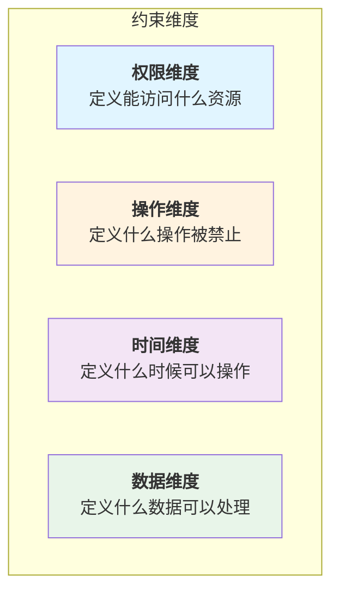
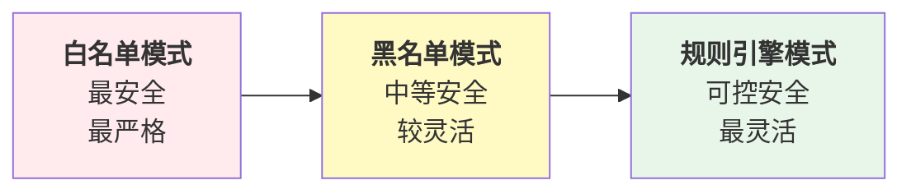
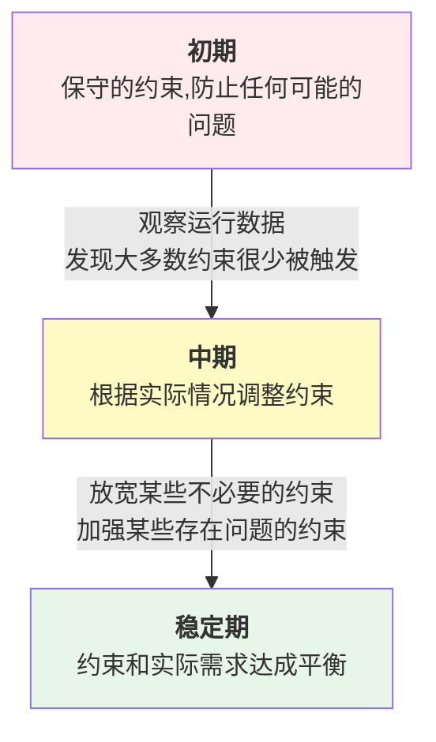
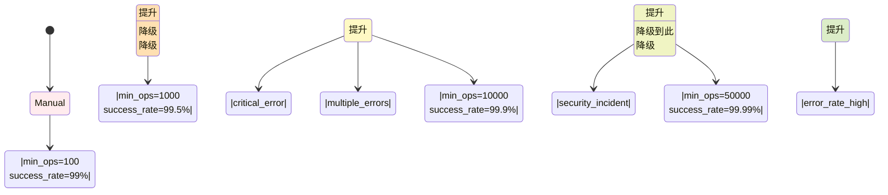
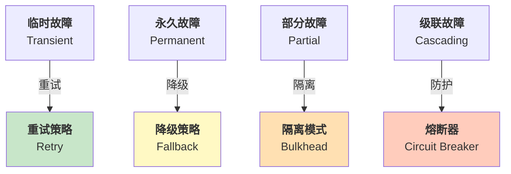
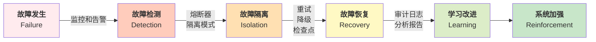
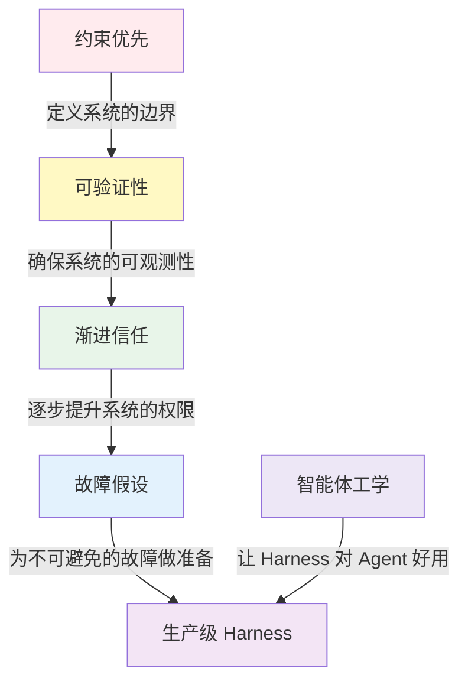
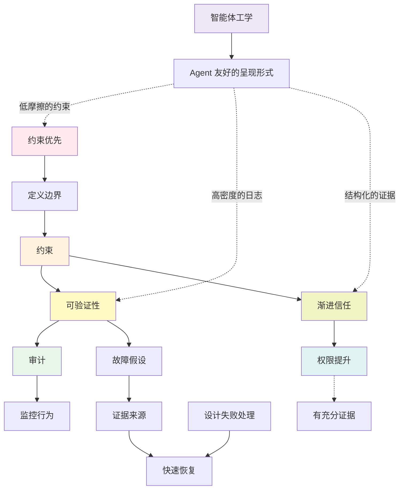
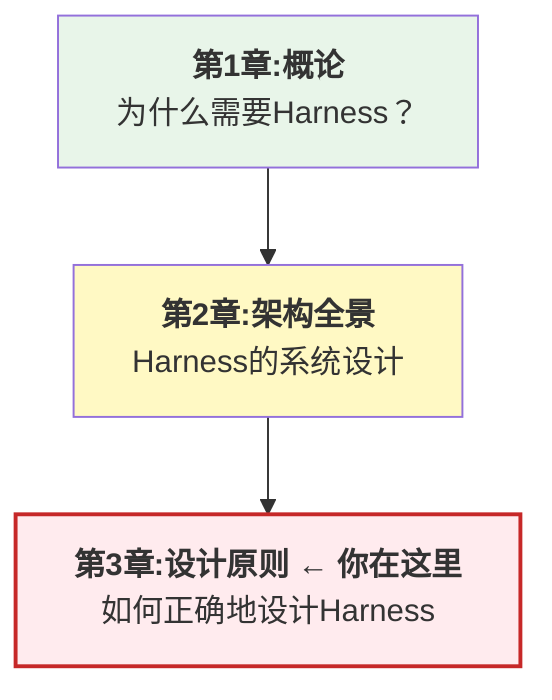

# 第三章：设计原则与方法论

本章从哲学和方法论的高度，总结了在构建生产级 Harness 系统时应该遵循的五大设计原则。

这些原则不是从零开始发明的，而是从 Claude Code、OpenClaw 以及业界其他成功的智能体系统中提炼出来的最佳实践。它们在看似不同的架构中都能找到体现，这证明了它们的普遍性和重要性。

**约束优先(Constraint-first)** 强调的是，对智能体能力的合理限制，往往比无限制地赋予能力更为关键。通过明确的约束边界，我们既保证了安全性，也提高了系统的可预测性。

**可验证性(Verifiability)** 要求系统的每一个操作都应该是可审计的、可重放的、可验证的。这不仅是安全合规的要求，更是快速定位问题的基础。

**渐进信任(Progressive Trust)** 描述了如何从人工密集的管理模式逐步演进到自主执行模式。这个过程应该是可观测的、可回退的、循序渐进的。

**故障假设(Design for Failure)** 要求我们在设计时，主动假设每一步都可能失败，并提前设计失败的处理机制。这样做的收益是，即使出现意外，系统也能够优雅地降级而非彻底崩溃。

**智能体工学(Agent Ergonomics)** 要求我们为 Agent（而非人类）设计更好用的软件系统和开发工具：清晰指令、快速反馈、标准化接口。这一原则由黄东旭在 QCon 2026 提出，提醒我们 Harness 的“使用者”是自主智能体，而非有判断力的人类。

这五大原则相互补充、相互强化，共同构建了一个安全、可靠、可管理且对 Agent 友好的智能体系统。

## 1. 约束优先原则

本节介绍约束优先原则的核心理念、重要性、约束的分类、设计方法和实施策略，阐明为什么约束是构建安全智能体系统的首要考虑。

### 1.1 原则的核心

**约束优先** 意味着：在设计 Harness 系统时，首先考虑的不是“智能体能做什么”，而是“Agent 不能做什么”、“Agent 做事时的限制是什么”。

这与直觉相反。通常我们在构建系统时，首先关心的是功能特性——系统应该具备什么能力。但对于智能体系统，这个思路导致了无尽的“功能蔓延”和安全隐患。

约束优先原则翻转了这个优先级：

1. **首先定义约束**：明确智能体不能做的事及做事的边界(Permission Model)
2. **然后在约束内赋能**：通过工具和模型来实现功能
3. **最后验证合规**：确保所有操作都在约束内

### 1.2 为什么约束如此重要

本小节通过现象观察、成本分析和失败案例，论证约束机制在智能体系统中的关键作用。

#### 现象观察

在 Claude Code 中，有一个叫“protected files”的机制，以及“dangerous patterns”的检测。这些都是约束。

在 OpenClaw 中，有一个叫 SOUL.md 的约束文档。这个文档不是系统的“特性”，而是智能体的“戒律”。它定义了 Agent 绝对不能做的事。

有趣的是，许多智能体系统失败的原因，往往不是因为模型不够聪明，而是因为缺乏足够的约束。Agent 学会了用户没有授权的方式做事，执行了超越权限的操作，或者被用户恶意利用。

#### 约束能解决什么

**1. 安全性** 通过约束，我们明确地防止某些危险操作。比如：

* 不允许删除生产数据库的内容
* 不允许修改系统配置文件
* 不允许执行需要人工审批的操作

**2. 可预测性** 有约束的系统比无约束系统更容易被理解和维护：

| 约束方式    | 系统状态                   | 可测试性                     |
| ------- | ---------------------- | ------------------------ |
| **无约束** | 智能体可以调用任何 API          | 很难预测会发生什么；难以编写测试用例       |
| **有约束** | Agent 只能调用预先批准的 API 列表 | 系统行为在可预期的范围内；易于编写和维护测试用例 |

**3. 可审计性** 有约束的系统更容易被审计：

```
审计问题:智能体为什么执行了X操作？
无约束答案:谁知道呢,模型就是这样决定的
有约束答案:因为这个操作在智能体的权限列表中,
           并且满足了Y条件,所以被批准了
```

### 1.3 约束的多个维度

约束可以在多个维度进行定义和实现。如图所示，约束可以分为四个关键维度：



图 3-1：约束的四个维度

#### 1) 权限维度

定义智能体能访问什么资源：

```python
class PermissionConstraint:
    """权限约束"""

    # 工具级约束:哪些工具可用
    available_tools = [
        "weather_api",
        "send_email",
        "retrieve_documents"
    ]

    # 资源级约束:可以访问哪些资源
    resource_access = {
        "database": {
            "tables": ["users", "orders"],  # 只能访问这些表
            "operations": ["read"],  # 只能读,不能写
            "row_limit": 1000  # 最多一次查询1000行
        },
        "file_system": {
            "paths": ["/data/public/"],  # 只能访问这个目录
            "operations": ["read"]
        }
    }

    # 用户级约束:可以操作哪些用户的数据
    user_scope = {
        "current_user_only": True,  # 只能操作当前用户的数据
        "allowed_org_ids": ["org-123", "org-456"]
    }
```

#### 2) 操作维度

定义什么样的操作是被禁止的：

```python
class OperationConstraint:
    """操作约束"""

    # 绝对禁止的操作
    forbidden_operations = [
        "delete_database_records",
        "modify_user_permissions",
        "export_user_data",
        "disable_audit_logging"
    ]

    # 受限制的操作(需要额外的验证或审批)
    restricted_operations = {
        "transfer_money": {
            "requires_approval": True,
            "approval_type": "human",
            "max_amount_per_operation": 10000,
            "max_amount_per_day": 100000
        },
        "send_communication": {
            "requires_approval": False,
            "rate_limit": "100_per_hour",
            "allowed_channels": ["email", "sms"]
        }
    }

    # 隐藏的危险操作(Agent应该意识不到它们的存在)
    hidden_operations = [
        "access_internal_debug_endpoints",
        "trigger_system_shutdown"
    ]
```

#### 3)` 时间维度

定义什么时候某些操作被允许：

```python
class TimeConstraint:
    """时间约束"""

    # 可用时间窗口
    availability_window = {
        "weekdays": {
            "start_hour": 9,
            "end_hour": 17,
            "timezone": "UTC"
        },
        "weekends": None  # 周末不可用
    }

    # 速率限制
    rate_limits = {
        "api_calls_per_minute": 60,
        "database_queries_per_minute": 100,
        "expensive_operations_per_hour": 10
    }

    # 过期时间
    expiration = {
        "credentials_expire_after_days": 90,
        "session_timeout_minutes": 60
    }
```

#### 4) 数据维度

定义什么样的数据可以被处理：

```python
class DataConstraint:
    """数据约束"""

    # 数据大小限制
    size_limits = {
        "max_file_size_mb": 100,
        "max_api_response_size_mb": 10,
        "max_result_rows": 10000
    }

    # 数据敏感性处理
    sensitive_data_handling = {
        "pii_fields": ["email", "phone", "ssn"],
        "handling": "redact"  # 或 "encrypt", "deny"
    }

    # 数据流向限制
    allowed_data_destinations = [
        "internal_database",
        "approved_third_party_api"
    ]

    forbidden_data_destinations = [
        "public_cloud_storage",
        "external_email"
    ]
```

### 1.4 Claude Code 的 protected files 和 dangerous patterns

Claude Code 的约束体现在多个地方：

#### Protected Files

系统通过保护文件列表来防止访问敏感文件：

```python
PROTECTED_FILES = [
    "/etc/passwd",
    "/etc/shadow",
    "~/.ssh/id_rsa",
    "~/.aws/credentials"
]

# 系统会在Agent尝试访问这些文件前拦截
if file_path in PROTECTED_FILES:
    raise PermissionError(f"Cannot access {file_path}")
```

#### Dangerous Patterns

通过检测危险的命令模式来防止恶意操作：

```python
DANGEROUS_PATTERNS = [
    r"DROP\s+TABLE",  # SQL注入
    r"rm\s+-rf",      # 破坏性命令
    r"format\s+[A-Z]:", # 格式化磁盘
    r"curl.*\|.*sh"   # 下载并执行
]

for pattern in DANGEROUS_PATTERNS:
    if re.search(pattern, agent_output):
        raise SecurityError(f"Dangerous pattern detected: {pattern}")
```

### 1.5 OpenClaw 的 SOUL.md 约束

OpenClaw 使用一个特殊的 SOUL.md 文件来定义智能体的约束：

``` markdown
## 智能体 SOUL.md

### 绝对约束
- 不能访问生产环境中的个人身份信息(PII)
- 不能执行删除操作
- 不能修改其他智能体的配置
- 不能访问加密的密钥存储

### 条件约束
- 只能在工作时间调用昂贵的API
- 财务操作需要人工审批
- 大规模数据导出需要安全主管批准

### 能力约束
- 最多并发10个任务
- 单个任务最多100步
- 内存占用不超过1GB
- 单个API调用超时30秒
```

SOUL.md 的特殊之处在于：

1. **可读可维护**：用人类可读的方式定义约束，便于审查
2. **可验证**：系统在运行时可以检查智能体的行为是否违反 SOUL.md
3. **可追溯**：当出现问题时，可以追踪到具体哪个约束被违反了

### 1.6 约束与效能的平衡

一个常见的疑问是：过度约束会不会限制智能体的能力？

答案是：取决于约束的设计。好的约束不会限制能力，反而会使智能体更加聪明。

**对比：机械臂和外科医生**

**机械臂没有约束** → 可以随意摆动，但容易伤害周围的人 **外科医生有约束** → 规范的操作流程，但能够精确地完成复杂手术

**Agent 没有约束** → 可以做任何事，但经常出错或做不该做的事 **Agent 有约束** → 在清晰的界限内工作，能够可靠地完成任务

好的约束实际上使智能体更有效。它们：

1. **减少歧义**：Agent 不用浪费推理能力在“该不该做”上
2. **加快执行**：许多禁止的路径被剪除，搜索空间变小
3. **提高成功率**：少了“想做但不能做”的冲突

### 1.7 约束的实现模式

如图所示，约束的实现模式从最严格的白名单到最灵活的规则引擎，提供了不同的安全性和灵活性权衡：



图 3-2：约束实现模式的安全性和灵活性权衡

#### 模式 1：白名单模式

白名单模式通过明确指定允许的操作来实现最高的安全性：

```python
class WhitelistConstraint:
    """白名单:只有明确批准的操作才能进行"""

    def can_perform(self, operation: str) -> bool:
        return operation in self.allowed_operations

    allowed_operations = {
        "read_data",
        "send_notification",
        "update_user_profile"
    }
```

#### 模式 2：黑名单模式

黑名单模式通过禁止特定的危险操作，允许其他所有操作：

```python
class BlacklistConstraint:
    """黑名单:明确禁止的操作不能进行"""

    def can_perform(self, operation: str) -> bool:
        return operation not in self.forbidden_operations

    forbidden_operations = {
        "delete_data",
        "modify_permissions",
        "system_shutdown"
    }
```

#### 模式 3：规则引擎模式

规则引擎模式使用条件化的规则集，实现细粒度的访问控制：

```python
class RuleBasedConstraint:
    """基于规则的约束"""

    def can_perform(self, operation: str, context: dict) -> bool:
        """根据上下文和规则判断是否允许操作"""

        # 规则1:删除操作需要特殊权限
        if "delete" in operation:
            if "admin_privileges" not in context:
                return False

        # 规则2:成本超过100元的操作需要审批
        if context.get("operation_cost", 0) > 100:
            if "approval_granted" not in context:
                return False

        # 规则3:工作时间外的某些操作不允许
        if datetime.now().hour > 18:
            if operation in self.after_hours_forbidden:
                return False

        return True
```

### 1.8 约束的监控和违反处理

约束仅仅定义是不够的，还需要在运行时监控和执行。

```python
class ConstraintEnforcer:
    """约束执行器"""

    def __init__(self, constraints: List[Constraint]):
        self.constraints = constraints
        self.violations = []

    async def check_and_enforce(
        self,
        operation: Operation,
        context: dict
    ) -> bool:
        """
        检查操作是否违反约束。

        返回:是否允许操作
        """
        for constraint in self.constraints:
            if not constraint.allows(operation, context):
                # 记录违反
                self.violations.append({
                    "timestamp": datetime.now(),
                    "constraint": constraint.name,
                    "operation": operation,
                    "context": context
                })

                # 日志警告
                logger.warning(
                    f"Constraint violation: {constraint.name}",
                    extra={"operation": operation}
                )

                return False

        return True

    def get_violations(self) -> List[dict]:
        """获取所有的约束违反记录"""
        return self.violations
```

### 1.9 约束的演进

约束不是一成不变的。随着系统的运行和学习，约束也应该演进。



这个演进过程应该基于数据和观测，而不是猜测。

### 1.10 总结

约束优先原则的核心要点：

1. **安全第一**：约束不是限制，而是保护
2. **清晰定义**：约束应该明确、可读、可验证
3. **多维度约束**：权限、操作、时间、数据等多个维度
4. **平衡与灵活**：约束和能力之间找到平衡，使用规则引擎获得灵活性
5. **监控与演进**：约束需要被监控、被验证、随时间演进

在后续章节，我们将看到这个原则如何在具体的工具层、权限管理等地方落实。

## 2. 可验证性原则

本节阐述可验证性原则的含义，说明其在生产系统中的重要性，深入讨论可验证性的三个层次及其实现方法。

### 2.1 原则的核心

**可验证性** 意味着：系统的每一个行为都应该是可观测的、可审计的、可重放的。当被问“Agent 做了什么？”和“为什么这样做？”时，系统应该能够提供清晰、完整的答案。

这一原则在智能体时代变得尤为关键。传统软件的行为由预先编写的代码决定，而 Agent 的行为路径是 LLM 在运行时动态生成的——这些被称为“暗码(Dark Code)”的运行时行为执行完毕后即消散，无法像源代码一样被事先审查或精确复现。可验证性正是 Harness 对抗暗码的核心武器：通过将“即生即灭”的行为转化为“可观测、可追踪、可重放”的记录，让动态行为获得与静态代码同等的可审计性。

可验证性涵盖三个层面：

1. **可观测性**：看得见智能体在做什么
2. **可追踪性**：追踪来自何处，去往何处
3. **可重放性**：给定相同的输入，能够重现相同的结果

## 2.2 为什么可验证性至关重要

本小节通过具体问题场景、法规要求和技术挑战，说明可验证性为什么是系统可靠运行的基础。

#### 问题场景

想象以下情况：

* 智能体执行了一个转账操作，但钱到了错误的账户
* Agent 生成了一个不符合规范的法律文件，造成了合规问题
* Agent 多次调用同一个 API，导致重复扣款

在这些情况下，最紧迫的问题是：**发生了什么？以及为什么？**

如果系统不可验证，这些问题就无法被回答。开发者只能：

* 陷入无尽的调试
* 无法向用户解释
* 无法修复根本原因

#### 可验证性的价值

**1. 快速诊断** 有完整的审计日志和执行追踪，我们可以立即看到问题发生的位置。

**2. 用户信任** 当用户询问“这笔钱去哪了？”，如果我们能够提供详细的操作日志，用户会更有信心。

**3. 法律合规** 许多行业（金融、医疗、法律）都要求对所有关键操作进行审计。

**4. 系统改进** 通过观察和分析执行数据，我们能够识别出系统的瓶颈和改进空间。

### 2.3 可验证性的三个层次

本小节从基础到高级，分别介绍操作日志、执行追踪和可重放性三个层次的可验证性，以及它们的实现方法。

#### 第一层：操作日志

最基础的可验证性：记录发生了什么。

```python
@dataclass
class OperationLog:
    """操作日志"""
    timestamp: datetime
    agent_id: str
    operation_type: str  # "tool_call", "permission_check", "decision"
    operation_name: str  # 具体的操作名称
    input: dict          # 输入参数
    output: dict         # 输出结果
    status: str          # "success", "error", "permission_denied"
    duration_ms: float   # 耗时
    error_message: Optional[str] = None

class OperationLogger:
    """操作日志记录器"""

    async def log(self, operation_log: OperationLog) -> None:
        """记录一个操作"""
        # 格式化为可读的形式
        log_entry = {
            "timestamp": operation_log.timestamp.isoformat(),
            "agent": operation_log.agent_id,
            "type": operation_log.operation_type,
            "operation": operation_log.operation_name,
            "status": operation_log.status,
            "duration_ms": operation_log.duration_ms
        }

        # 写入日志存储
        await self.storage.append(log_entry)

        # 如果是错误,也要输出到错误流
        if operation_log.status == "error":
            logger.error(f"Operation failed: {operation_log.operation_name}",
                        extra={"log_entry": log_entry})
```

#### 第二层：执行追踪

更高级的可验证性：记录操作之间的因果关系。

```python
@dataclass
class ExecutionTrace:
    """执行追踪"""
    trace_id: str                  # 追踪的全局唯一ID
    agent_id: str
    task_id: str
    steps: List[TraceStep] = field(default_factory=list)
    start_time: datetime = field(default_factory=datetime.now)
    end_time: Optional[datetime] = None

@dataclass
class TraceStep:
    """追踪中的一步"""
    step_id: str                   # 步骤ID
    parent_step_id: Optional[str]  # 父步骤(用于嵌套调用)
    operation: str
    input: dict
    output: dict
    duration_ms: float
    timestamp: datetime
    status: str

class ExecutionTracer:
    """执行追踪器"""

    def __init__(self):
        self.traces: Dict[str, ExecutionTrace] = {}

    def start_trace(
        self,
        agent_id: str,
        task_id: str,
        trace_id: str = None
    ) -> str:
        """开始一个新的执行追踪"""
        trace_id = trace_id or str(uuid.uuid4())
        self.traces[trace_id] = ExecutionTrace(
            trace_id=trace_id,
            agent_id=agent_id,
            task_id=task_id
        )
        return trace_id

    def add_step(
        self,
        trace_id: str,
        operation: str,
        input: dict,
        output: dict,
        duration_ms: float,
        parent_step_id: str = None
    ) -> str:
        """在追踪中添加一步"""
        step_id = str(uuid.uuid4())
        step = TraceStep(
            step_id=step_id,
            parent_step_id=parent_step_id,
            operation=operation,
            input=input,
            output=output,
            duration_ms=duration_ms,
            timestamp=datetime.now(),
            status="success"
        )
        self.traces[trace_id].steps.append(step)
        return step_id

    def get_trace(self, trace_id: str) -> Optional[ExecutionTrace]:
        """获取完整的执行追踪"""
        return self.traces.get(trace_id)

    def visualize_trace(self, trace_id: str) -> str:
        """生成可视化的执行追踪"""
        trace = self.traces.get(trace_id)
        if not trace:
            return ""

        # 生成缩进的树形结构
        lines = [f"Trace: {trace.trace_id}"]
        lines.append(f"Agent: {trace.agent_id}, Task: {trace.task_id}")
        lines.append(f"Duration: {(trace.end_time - trace.start_time).total_seconds():.2f}s")
        lines.append("")

        def add_step_lines(step: TraceStep, indent: int = 0):
            prefix = "  " * indent
            lines.append(f"{prefix}├─ {step.operation} ({step.duration_ms:.0f}ms)")
            lines.append(f"{prefix}│  Input: {step.input}")
            lines.append(f"{prefix}│  Output: {step.output}")

        for step in trace.steps:
            if step.parent_step_id is None:
                add_step_lines(step)

        return "\n".join(lines)
```

#### 第三层：可重放性

最高级的可验证性：给定相同的输入，能够重现执行过程。

```python
class ReplayableExecution:
    """可重放的执行"""

    def __init__(self, trace: ExecutionTrace):
        self.trace = trace
        self.step_index = 0

    async def replay(
        self,
        runtime: RuntimeEngine,
        simulation: bool = False
    ) -> ReplayResult:
        """
        重放执行。

        simulation: 如果为True,不实际执行工具,而是返回记录的结果
        """
        results = []

        for step in self.trace.steps:
            if simulation:
                # 模拟模式:直接返回记录的结果
                results.append({
                    "operation": step.operation,
                    "recorded_output": step.output,
                    "simulation": True
                })
            else:
                # 实际重放:重新执行相同的操作
                try:
                    actual_output = await self._execute_step(
                        step.operation,
                        step.input
                    )

                    # 验证输出是否一致
                    if actual_output == step.output:
                        results.append({
                            "operation": step.operation,
                            "status": "consistent",
                            "output": actual_output
                        })
                    else:
                        results.append({
                            "operation": step.operation,
                            "status": "diverged",
                            "recorded_output": step.output,
                            "actual_output": actual_output
                        })

                except Exception as e:
                    results.append({
                        "operation": step.operation,
                        "status": "error",
                        "error": str(e)
                    })

        return ReplayResult(
            trace_id=self.trace.trace_id,
            results=results,
            is_consistent=all(r["status"] == "consistent" for r in results)
        )

    async def _execute_step(self, operation: str, input: dict):
        """执行一个步骤"""
        # 实现取决于具体的操作类型
        pass
```

### 2.4 生产系统中的可验证性实践

Claude Code 的可观测性以 OpenTelemetry 配置导出 metrics 和日志事件为基础；分布式 traces 是增强遥测 beta，默认关闭，开启后可与支持 OTLP 的 APM 工具集成：

```typescript
// Claude Code 追踪示例
const span = tracer.startSpan("tool_execution", {
  attributes: {
    "tool.name": "weather_api",
    "tool.params": JSON.stringify(params),
    "agent.id": agentId
  }
});

try {
  const result = await executeWeatherAPI(params);
  span.setStatus({ code: SpanStatusCode.OK });
  span.end();
} catch (error) {
  span.recordException(error);
  span.setStatus({ code: SpanStatusCode.ERROR });
  span.end();
}
```

这种标准化的追踪方式的好处是：

* 可以与 Jaeger、Zipkin 等可视化工具集成
* 支持分布式追踪（跨多个微服务）
* 标准的性能分析

OpenClaw 的 Lobster 引擎特别强调可重放性。每个工作流的执行都被记录在一个确定性的日志中：

```yaml
## Lobster execution log
workflow_id: workflow-123
execution_id: exec-456
steps:
  - step_id: 1
    operation: query_database
    input:
      query: "SELECT * FROM users WHERE id = ?"
      params: [123]
    output:
      - id: 123
        name: "John Doe"
    timestamp: 2024-04-01T10:30:00Z

  - step_id: 2
    operation: send_notification
    input:
      user_id: 123
      message: "Hello John"
    output:
      status: "sent"
      notification_id: "notif-789"
    timestamp: 2024-04-01T10:30:01Z
```

Lobster 的特点：

1. **确定性**：给定相同的 workflow 和输入，执行顺序总是相同
2. **可重放**：可以从任何步骤重新开始执行
3. **可审计**：完整的操作历史，精确到每一步

### 2.5 可验证性在实战中的应用

**场景：转账操作**

一个典型的转账操作应该被追踪如下：

**Trace ID:** trace-2024-04-01-001

| 步骤 | 操作                        | 输入                                                 | 输出                                             | 耗时    |
| -- | ------------------------- | -------------------------------------------------- | ---------------------------------------------- | ----- |
| 1  | Parse Request             | {"from": "ACC001", "to": "ACC002", "amount": 1000} | {"from\_account": {...}, "to\_account": {...}} | 2ms   |
| 2  | Check Balance             | {"account\_id": "ACC001"}                          | {"balance": 5000}                              | 15ms  |
| 3  | Validate Transaction      | {"amount": 1000, "available\_balance": 5000}       | {"valid": true}                                | 1ms   |
| 4  | Create Transaction Record | {"from": "ACC001", "to": "ACC002", "amount": 1000} | {"transaction\_id": "TXN12345"}                | 50ms  |
| 5  | Execute Transfer          | {"transaction\_id": "TXN12345"}                    | {"status": "completed"}                        | 100ms |
| 6  | Send Confirmation         | {"transaction\_id": "TXN12345"}                    | {"notification\_sent": true}                   | 30ms  |

**总耗时：** 198ms **最终状态：** Success

当用户问“我的转账怎么样了？”，我们可以立即从这个追踪中回答：

* **什么时候执行的？** 2024-04-01 at 10:30:00
* **执行了哪些步骤？** 6 个步骤，每一步都成功了
* **如果失败了，在哪个步骤失败？**（不适用，这里全部成功）
* **整个过程花了多长时间？** 198 毫秒

### 2.6 实现可验证性的最佳实践

本小节介绍实现可验证性的具体方法，包括结构化日志、链接日志和追踪、定期验证和用户可读摘要。

#### 1. 使用结构化日志

结构化日志使用 JSON 格式记录关键字段，便于验证和审计：

```python
# 不好:非结构化日志
logger.info("Transfer from ACC001 to ACC002 for amount 1000")

# 好:结构化日志
logger.info("transfer_executed", extra={
    "from_account": "ACC001",
    "to_account": "ACC002",
    "amount": 1000,
    "transaction_id": "TXN12345",
    "status": "success",
    "duration_ms": 198
})
```

#### 2. 链接日志和追踪

通过 trace ID 将分布式日志和追踪关联起来，实现全链路可观测性：

```python
# 在日志中包含trace ID,便于关联
logger.info("Step completed", extra={
    "trace_id": trace.trace_id,
    "step_id": step.step_id,
    "operation": "tool_call"
})
```

#### 3. 定期验证一致性

通过重放历史执行来验证系统行为的确定性和一致性：

```python
async def periodic_verification():
    """定期验证执行的一致性"""
    # 每小时,随机选择一个旧的执行,尝试重放
    old_traces = await trace_storage.list_old_traces(
        before_hours=1,
        limit=10
    )

    for trace in old_traces:
        replayer = ReplayableExecution(trace)
        result = await replayer.replay(runtime, simulation=False)

        if not result.is_consistent:
            logger.error("Inconsistency detected in replay",
                        extra={"trace_id": trace.trace_id})
            # 触发告警,通知运维
```

#### 4. 提供用户可读的摘要

虽然完整的追踪对于调试很有用，但用户通常需要一个简化版本：

```python
def generate_user_summary(trace: ExecutionTrace) -> str:
    """生成用户友好的摘要"""
    total_duration = (trace.end_time - trace.start_time).total_seconds()
    success_count = sum(1 for step in trace.steps if step.status == "success")
    error_count = sum(1 for step in trace.steps if step.status == "error")

    return f"""
    执行摘要:
    - 执行ID:{trace.trace_id[:8]}...
    - 执行时间:{trace.start_time.strftime('%Y-%m-%d %H:%M:%S')}
    - 耗时:{total_duration:.2f}秒
    - 步骤数:{len(trace.steps)}(成功{success_count},失败{error_count})
    - 状态:{'成功' if error_count == 0 else '失败'}

    详细日志:{generate_trace_url(trace.trace_id)}
    """
```

### 2.7 总结

可验证性原则的关键要点：

1. **三个层次**：操作日志 → 执行追踪 → 可重放性
2. **结构化数据**：使用统一的格式，便于机器和人类读取
3. **完整的链路**：从请求到响应，每一步都能被追踪
4. **可视化**：提供人类可读的总结和可视化工具
5. **定期验证**：通过重放，验证系统的一致性

实现可验证性看起来增加了复杂性，但它的回报是巨大的：快速诊断、用户信任、法律合规、系统改进。

## 3. 渐进信任原则

本节阐述渐进信任原则，介绍权限梯度模型、信任评分机制、动态权限调整和实施策略，说明如何通过观察和学习逐步提升智能体的自主权。

### 3.1 原则的核心

**渐进信任** 意味着：不要期望一下子就完全信任智能体的自主执行。而是应该设计一个逐步提升信任等级的过程，从完全人工控制，通过观察和学习，最终达到自主执行。

这个过程可以用一个信任梯度来表示：

| 信任等级                            | 权限配置   | 实现方式       |
| ------------------------------- | ------ | ---------- |
| Level 0: Manual Only            | 完全人工操作 | 每一步都需要人工批准 |
| Level 1: Approve Always         | 每步审批   | 每个操作都需要批准  |
| Level 2: Approve Once           | 一次性批准  | 任务开始时批准一次  |
| Level 3: Ask First              | 事前询问   | 执行前要求人工确认  |
| Level 4: Auto with Notification | 自动+通知  | 自动执行并发送通知  |
| Level 5: Full Trust             | 充分信任   | 完全自主，无需监控  |

这个梯度不是固定的，而是应该根据系统的表现动态调整的。如图所示，信任等级从完全人工操作逐步提升到完全自主执行：


图 3-3：渐进信任的六个等级

### 3.2 为什么需要渐进信任

本小节分析信任陡崖问题，说明渐进信任相比传统二元模式的优势。

#### 问题背景

许多 AI 系统的部署都失败于“信任陡崖”：

* 开发阶段：我们对模型进行了充分的测试，认为它已经足够聪明
* 部署阶段：我们突然给予它完全的自主权
* 灾难阶段：系统在真实世界中出现意外的行为

这种模式很像是：“我们在学校考试中得了 A，所以直接让这个学生毕业去当医生”。

渐进信任的思想是：**逐步提升权限，同时持续观察系统的行为**。

#### 渐进信任的收益

**1. 降低风险** 新权限的错误不会立即导致大规模灾难，而是被限制在较小的范围内。

**2. 积累证据** 通过观察系统在较低权限级别的表现，我们可以获得足够的证据，来判断是否应该提升权限。

**3. 快速恢复** 如果智能体在某个权限级别出错，我们可以降回之前的级别，而不是直接禁用。

**4. 用户信心** 逐步的权限提升给了用户看得见的进展和控制感。

### 3.3 权限梯度的详细设计

本小节详细介绍六个权限等级，从完全人工到完全信任，每个级别的实现方式和适用场景。

#### Level 0: Manual Only

完全人工模式要求每一步操作都经过人工审批，提供最高的控制和安全性：

```python
class ManualOnlyMode:
    """完全人工操作模式"""

    async def execute_operation(self, operation: Operation) -> Result:
        """
        每一步都需要人工批准。
        """
        # 1. Agent提议操作
        proposal = await agent.propose_operation(task)

        # 2. 等待人工批准
        approval = await request_human_approval(
            operation=proposal,
            timeout=timedelta(hours=24)
        )

        if approval.approved:
            # 3. 由人工或系统执行
            result = await execute_operation(proposal)
        else:
            result = Result(status="rejected", reason=approval.reason)

        return result
```

**适用场景**：系统刚上线，信任度最低

#### Level 1: Approve Always

每步审批模式要求每个操作执行前都获得人工批准，适合高风险操作：

```python
class ApproveAlwaysMode:
    """每个操作都需要人工审批"""

    async def execute_operation(self, operation: Operation) -> Result:
        """
        每个操作都需要事前批准。
        """
        # 请求批准
        approval = await request_human_approval(
            operation=operation,
            timeout=timedelta(minutes=5)
        )

        if not approval.approved:
            return Result(status="rejected")

        # 执行操作
        return await execute_operation(operation)
```

**适用场景**：高风险操作，每一步都需要人工确认

#### Level 2: Approve Once

一次性批准模式在任务开始时获得完整批准，减少审批频次同时保持控制：

```python
class ApprovedOnceMode:
    """任务开始时批准一次"""

    async def execute_task(self, task: Task) -> Result:
        """
        在任务开始时,对整个任务进行一次审批。
        一旦批准,任务执行过程中不再询问。
        """
        # 1. 任务规划阶段:Agent提议任务计划
        plan = await agent.plan_task(task)

        # 2. 人工审查:人工查看任务计划
        approval = await request_task_approval(
            task=task,
            plan=plan,
            timeout=timedelta(hours=1)
        )

        if not approval.approved:
            return Result(status="rejected")

        # 3. 执行阶段:任务自动执行
        result = await execute_task_plan(plan)

        # 4. 完成:生成执行报告
        report = generate_execution_report(result)

        return Result(
            status="success",
            output=result,
            report=report
        )
```

**适用场景**：生产环境，系统已证明可靠性

#### Level 3: Ask First

事前询问模式仅在执行关键操作前进行交互确认，平衡了自动化和安全性：

```python
class AskFirstMode:
    """关键操作事前询问"""

    # 定义哪些操作被认为是关键的
    CRITICAL_OPERATIONS = {
        "delete_data",
        "transfer_money",
        "modify_permissions"
    }

    async def execute_operation(self, operation: Operation) -> Result:
        """
        关键操作需要事前询问,其他操作自动执行。
        """
        if operation.type in self.CRITICAL_OPERATIONS:
            # 关键操作:询问
            approval = await request_human_approval(
                operation=operation,
                timeout=timedelta(minutes=5)
            )

            if not approval.approved:
                return Result(status="rejected")

        # 执行操作
        return await execute_operation(operation)
```

**适用场景**：开发/测试环境，系统表现良好但仍需对关键操作保持警觉

#### Level 4: Auto with Notification

自动执行加通知模式允许自动执行，同时实时通知用户进度和异常情况：

```python
class AutoWithNotificationMode:
    """自动执行,并发送通知"""

    async def execute_operation(self, operation: Operation) -> Result:
        """
        自动执行操作,执行后发送通知。
        """
        try:
            # 执行操作
            result = await execute_operation(operation)

            # 发送通知
            await notify_user(
                message=f"Operation {operation.type} completed",
                details=result,
                urgency="low"
            )

            return result

        except Exception as e:
            # 出错时发送警告通知
            await notify_user(
                message=f"Operation {operation.type} failed",
                error=str(e),
                urgency="high"
            )
            return Result(status="error", error=str(e))
```

**适用场景**：低风险日常操作，需要用户知晓

#### Level 5: Full Trust

充分信任模式完全自主执行，适合已充分验证且风险极低的场景：

```python
class FullTrustMode:
    """充分信任,无需额外监控"""

    async def execute_operation(self, operation: Operation) -> Result:
        """
        完全信任Agent,无需额外的验证或监控。
        """
        return await execute_operation(operation)
```

**适用场景**：系统已经运行多年，证明了其可靠性（罕见）

### 3.4 从一个等级提升到下一个等级

权限提升不应该是自动的，而应该基于明确的证据。

```python
class TrustEvaluator:
    """信任等级评估器"""

    # 各信任等级的提升标准
    PROMOTION_CRITERIA = {
        "Manual Only → Approve Always": {
            "min_operations": 100,
            "min_success_rate": 0.99,  # 99%成功率
            "min_duration_days": 7,    # 运行至少7天
            "no_critical_errors": True
        },
        "Approve Always → Approve Once": {
            "min_operations": 1000,
            "min_success_rate": 0.995,  # 99.5%
            "min_duration_days": 30,
            "no_critical_errors": True,
            "recent_error_rate": 0.005  # 最近的错误率<0.5%
        },
        "Approve Once → Ask First": {
            "min_operations": 10000,
            "min_success_rate": 0.999,  # 99.9%
            "min_duration_days": 90,
            "no_critical_errors": True
        },
        "Ask First → Auto with Notification": {
            "min_operations": 50000,
            "min_success_rate": 0.9999,  # 99.99%
            "min_duration_days": 180,
            "no_critical_errors_in_recent_month": True
        },
        "Auto with Notification → Full Trust": {
            "min_operations": 1000000,
            "min_success_rate": 0.99999,  # 99.999%
            "min_duration_days": 365,
            "no_critical_errors_in_recent_quarter": True
        }
    }

    async def evaluate_promotion(
        self,
        current_level: TrustLevel,
        agent_history: AgentHistory
    ) -> Optional[TrustLevel]:
        """
        评估是否应该提升智能体的信任等级。
        """
        next_level = self._get_next_level(current_level)
        criteria = self.PROMOTION_CRITERIA.get(f"{current_level} → {next_level}")

        if criteria is None:
            return None  # 已经是最高等级

        # 检查所有标准
        checks = {
            "operations": agent_history.total_operations >= criteria["min_operations"],
            "success_rate": agent_history.success_rate >= criteria["min_success_rate"],
            "duration": agent_history.days_running >= criteria["min_duration_days"],
            "critical_errors": not criteria.get("no_critical_errors", False)
                               or not agent_history.has_critical_errors
        }

        # 所有标准都满足才能提升
        if all(checks.values()):
            logger.info(f"Agent {agent_history.agent_id} promoted from {current_level} to {next_level}",
                       extra={"checks": checks})
            return next_level

        logger.info(f"Agent promotion blocked",
                   extra={"agent_id": agent_history.agent_id, "failed_checks": {k: v for k, v in checks.items() if not v}})
        return None

    def _get_next_level(self, current_level: TrustLevel) -> TrustLevel:
        """获取下一个信任等级"""
        levels = [
            "Manual Only",
            "Approve Always",
            "Approve Once",
            "Ask First",
            "Auto with Notification",
            "Full Trust"
        ]
        idx = levels.index(current_level)
        return levels[idx + 1] if idx < len(levels) - 1 else None
```

### 3.5 降级机制

信任不仅可以提升，也应该在必要时降级。如图所示，智能体的信任等级通过提升和降级机制动态调整，以保持安全性和有效性的平衡：



图 3-4：信任等级的提升和降级机制

```python
class TrustDemotionTrigger:
    """信任降级触发器"""

    # 触发降级的条件
    DEMOTION_TRIGGERS = {
        "critical_error": 1,           # 一次严重错误
        "multiple_errors_in_short_time": 3,  # 短时间内多次错误
        "security_incident": 1,        # 一次安全事件
        "user_complaint": 5            # 5个用户投诉
    }

    async def check_and_demote(
        self,
        agent_id: str,
        recent_history: List[AgentEvent]
    ) -> Optional[TrustLevel]:
        """
        检查是否应该降级智能体的信任等级。
        """
        current_level = await get_agent_trust_level(agent_id)

        # 计数各类事件
        event_counts = {
            "critical_errors": sum(1 for e in recent_history if e.type == "critical_error"),
            "errors_24h": sum(1 for e in recent_history if e.type == "error" and
                             e.timestamp > datetime.now() - timedelta(hours=24)),
            "security_incidents": sum(1 for e in recent_history if e.type == "security_incident"),
            "complaints": sum(1 for e in recent_history if e.type == "user_complaint")
        }

        # 检查触发条件
        if event_counts["critical_errors"] >= self.DEMOTION_TRIGGERS["critical_error"]:
            demoted_level = self._get_previous_level(current_level)
            logger.warning(f"Agent {agent_id} demoted due to critical error",
                          extra={"from": current_level, "to": demoted_level})
            return demoted_level

        if event_counts["errors_24h"] >= self.DEMOTION_TRIGGERS["multiple_errors_in_short_time"]:
            demoted_level = self._get_previous_level(current_level)
            logger.warning(f"Agent {agent_id} demoted due to multiple errors",
                          extra={"event_counts": event_counts})
            return demoted_level

        if event_counts["security_incidents"] >= self.DEMOTION_TRIGGERS["security_incident"]:
            demoted_level = "Ask First"  # 直接降回询问级别
            logger.error(f"Agent {agent_id} demoted to Ask First due to security incident")
            return demoted_level

        return None

    def _get_previous_level(self, current_level: TrustLevel) -> TrustLevel:
        """获取前一个信任等级"""
        # 至少降级一个等级,最多保留在Ask-First
        levels = ["Manual Only", "Approve Always", "Approve Once", "Ask First", "Auto with Notification", "Full Trust"]
        idx = max(0, levels.index(current_level) - 1)
        return levels[idx]
```

### 3.6 可视化信任演进

我们可以通过代码来可视化每个智能体的信任等级演进历史：

```python
def visualize_trust_evolution(agent_history: AgentHistory) -> str:
    """生成Agent信任等级演进的可视化"""
    lines = [f"Agent: {agent_history.agent_id}"]
    lines.append(f"Current Trust Level: {agent_history.current_trust_level}\n")

    # 时间线
    lines.append("Timeline of Trust Changes:")
    for event in agent_history.trust_changes:
        lines.append(f"  {event.timestamp.strftime('%Y-%m-%d')} "
                    f"{event.from_level} → {event.to_level}")

    # 统计数据
    lines.append(f"\nStats:")
    lines.append(f"  Total Operations: {agent_history.total_operations}")
    lines.append(f"  Success Rate: {agent_history.success_rate:.2%}")
    lines.append(f"  Critical Errors: {agent_history.critical_errors}")
    lines.append(f"  Days Running: {agent_history.days_running}")

    # 提升建议
    next_level = agent_history.promotion_readiness
    if next_level:
        lines.append(f"\nPromotion Eligible: {agent_history.current_trust_level} → {next_level}")

    return "\n".join(lines)
```

### 3.7 总结

渐进信任原则的关键要点：

1. **信任是逐步建立的**，不要期望一步到位
2. **有明确的提升标准**，不是主观决定
3. **也要有降级机制**，快速响应问题
4. **持续监控**，收集足够的证据
5. **透明可视**，让所有相关者了解信任的演进过程

这个原则特别适用于长期运行的系统，如 OpenClaw 的自驱型 Agent，它们需要在生产环境中逐步获得更多的权限和自主性。

## 4. 故障假设原则

故障假设是构建可靠系统的基础原则。本节介绍这一原则的核心概念，以及对不同故障类型的处理策略、检查点机制、监控告警和完整的故障恢复流程。

### 4.1 原则的核心

**故障假设** 意味着：在设计系统时， **主动假设每一步都可能失败**，并提前设计如何处理这些失败。这不是悲观主义，而是现实主义的系统工程。

与其相反的两种方法对比如下：

| 设计方法     | 处理方式       | 结果                             |
| -------- | ---------- | ------------------------------ |
| **乐观设计** | 假设一切都会正常运行 | 当出现意外时，系统直接崩溃；用户蒙受损失，系统陷入不一致状态 |
| **故障假设** | 假设会出现意外    | 当出现意外时，系统有预案；优雅地降级，数据保持一致      |

### 4.2 为什么故障假设如此重要

故障假设原则的重要性可以从理论基础和实际数据统计两个角度理解。以下内容探讨了支撑这一原则的核心思想和在生产环境中的数据证据。

#### 墨菲定律的启示

墨菲定律说：“任何可能出错的事情，最终都会出错，而且会在最糟糕的时刻出错。”

在智能体系统中，这尤其真实，因为我们处理的是概率系统。LLM 不是确定的，网络不是可靠的，外部 API 也会偶尔宕机。

#### 数据统计

在一个真实的生产系统中：

* **API 调用失败率**：通常在 0.1-1%
* **网络超时率**：通常在 0.01-0.1%
* **数据库连接失败**：通常在 0.001-0.01%

乍一看这些比率很低，但在高并发系统中，这意味着什么？

假设系统每天处理 100 万个任务，每个任务平均进行 10 个 API 调用：

```
总API调用数:100万 × 10 = 1000万次
在0.5%失败率下:1000万 × 0.005 = 50,000次失败
```

50,000 次失败每天都会发生。如果系统没有为这些失败做准备，那就是 50,000 个用户的糟糕体验。

## 4.3 故障的类型和处理策略

如图所示，系统需要针对不同类型的故障采用不同的处理策略，从临时故障的重试到级联故障的熔断器防护：



图 3-5：故障类型和处理策略

#### 类型 1：临时故障

网络超时、API 临时不可用等，通常过一段时间就会恢复。

**处理策略：重试**

```python
import asyncio
import logging
import random
from typing import Any, Callable

logger = logging.getLogger(__name__)


class RetryStrategy:
    """重试策略"""

    def __init__(
        self,
        max_retries: int = 3,
        base_delay_seconds: float = 1.0,
        exponential_base: float = 2.0,
        jitter: bool = True
    ):
        self.max_retries = max_retries
        self.base_delay_seconds = base_delay_seconds
        self.exponential_base = exponential_base
        self.jitter = jitter

    async def execute_with_retry(
        self,
        operation: Callable,
        *args,
        **kwargs
    ) -> Any:
        """
        执行操作,失败时自动重试。
        """
        last_error = None

        for attempt in range(self.max_retries + 1):
            try:
                return await operation(*args, **kwargs)

            except Exception as e:
                last_error = e

                # 判断是否应该重试
                if not self._is_retryable(e):
                    raise

                # 计算延迟
                if attempt < self.max_retries:
                    delay = self._calculate_delay(attempt)
                    logger.info(
                        f"Retry attempt {attempt + 1}/{self.max_retries} "
                        f"after {delay:.1f}s",
                        extra={"error": str(e)}
                    )
                    await asyncio.sleep(delay)

        # 所有重试都失败了
        raise last_error

    def _is_retryable(self, error: Exception) -> bool:
        """判断错误是否可重试"""
        retryable_errors = (
            asyncio.TimeoutError,
            ConnectionError,
            TimeoutError,
            # 某些HTTP错误可以重试
        )
        return isinstance(error, retryable_errors)

    def _calculate_delay(self, attempt: int) -> float:
        """计算重试延迟(指数退避)"""
        delay = self.base_delay_seconds * (self.exponential_base ** attempt)

        if self.jitter:
            # 添加随机抖动,避免"羊群效应"
            jitter = random.uniform(0, delay * 0.1)
            delay += jitter

        # 设置最大延迟
        max_delay = 60  # 最多等60秒
        return min(delay, max_delay)

# 重试策略使用示例
retry_strategy = RetryStrategy(max_retries=3, base_delay_seconds=0.5)

async def call_weather_api(city: str):
    """调用天气API"""
    return await retry_strategy.execute_with_retry(
        weather_api.get,
        city=city
    )
```

#### 类型 2：永久故障

API 被删除、数据库不存在、权限不足等，重试也无法解决。

**处理策略：降级/回退**

```python
class FallbackStrategy:
    """降级/回退策略"""

    def __init__(self, fallbacks: List[Callable]):
        """
        初始化降级策略。
        fallbacks是一个优先级列表,包含多个备选方案。
        """
        self.fallbacks = fallbacks

    async def execute_with_fallback(
        self,
        *args,
        **kwargs
    ) -> Any:
        """
        尝试执行,如果失败则使用备选方案。
        """
        last_error = None

        for i, fallback in enumerate(self.fallbacks):
            try:
                result = await fallback(*args, **kwargs)
                logger.info(
                    f"Fallback {i} succeeded",
                    extra={"fallback": fallback.__name__}
                )
                return result

            except Exception as e:
                last_error = e
                logger.warning(
                    f"Fallback {i} failed, trying next",
                    extra={"error": str(e)}
                )

        # 所有回退都失败了
        raise last_error

# 降级策略使用示例:如果无法获取实时天气,使用缓存数据,再不行使用默认值

async def get_weather_with_fallback(city: str):
    """获取天气,支持降级"""

    # 备选方案优先级:实时数据 > 缓存数据 > 默认值
    strategy = FallbackStrategy([
        lambda c: real_time_weather_api.get(c),
        lambda c: cached_weather.get(c),
        lambda c: default_weather_for(c)
    ])

    return await strategy.execute_with_fallback(city)
```

#### 类型 3：部分故障

在一个分布式系统中，一部分组件失败，但其他部分仍在运行。

**处理策略：分离和隔离**

```python
class BulkheadPattern:
    """隔离模式:防止一个故障影响整个系统"""

    def __init__(self, num_compartments: int = 10):
        self.compartments = [asyncio.Semaphore(10) for _ in range(num_compartments)]

    def get_compartment(self, request_id: str) -> asyncio.Semaphore:
        """根据请求ID,将其分配到某个隔离舱"""
        compartment_idx = hash(request_id) % len(self.compartments)
        return self.compartments[compartment_idx]

    async def execute_isolated(
        self,
        request_id: str,
        operation: Callable,
        *args,
        **kwargs
    ) -> Any:
        """
        在隔离的舱中执行操作。
        如果一个舱出现问题,不会影响其他舱。
        """
        compartment = self.get_compartment(request_id)

        async with compartment:
            return await operation(*args, **kwargs)

# 隔离模式使用示例
bulkhead = BulkheadPattern(num_compartments=20)

async def process_request(request_id: str, request_data: dict):
    """处理请求,使用隔离模式"""
    return await bulkhead.execute_isolated(
        request_id,
        process_request_logic,
        request_data
    )
```

#### 类型 4：级联故障

一个组件的故障导致其他组件也失败，最终整个系统崩溃。

**处理策略：熔断器**

```python
from datetime import datetime
from enum import Enum

class CircuitState(Enum):
    CLOSED = "closed"          # 正常状态
    OPEN = "open"              # 故障状态,拒绝请求
    HALF_OPEN = "half_open"    # 恢复测试状态

class CircuitBreaker:
    """熔断器:防止级联故障"""

    def __init__(
        self,
        failure_threshold: int = 5,
        recovery_timeout_seconds: int = 60
    ):
        self.failure_threshold = failure_threshold
        self.recovery_timeout_seconds = recovery_timeout_seconds
        self.state = CircuitState.CLOSED
        self.failure_count = 0
        self.last_failure_time = None
        self.last_recovery_attempt = None

    async def execute(
        self,
        operation: Callable,
        *args,
        **kwargs
    ) -> Any:
        """
        通过熔断器执行操作。
        """
        # 检查是否应该转换到HALF_OPEN状态
        self._update_state()

        # 根据当前状态决定是否执行
        if self.state == CircuitState.OPEN:
            raise CircuitBreakerOpenError(
                f"Circuit breaker is OPEN, rejecting request"
            )

        try:
            result = await operation(*args, **kwargs)
            # 成功,重置计数
            self._record_success()
            return result

        except Exception as e:
            # 失败,记录
            self._record_failure()
            raise

    def _update_state(self):
        """更新熔断器状态"""
        if self.state == CircuitState.OPEN:
            # 如果已经打开足够长的时间,尝试恢复
            if (datetime.now() - self.last_failure_time).seconds > self.recovery_timeout_seconds:
                self.state = CircuitState.HALF_OPEN
                self.last_recovery_attempt = datetime.now()
                logger.info("Circuit breaker transitioned to HALF_OPEN")

    def _record_success(self):
        """记录成功"""
        if self.state == CircuitState.HALF_OPEN:
            # 从HALF_OPEN成功恢复到CLOSED
            self.state = CircuitState.CLOSED
            self.failure_count = 0
            logger.info("Circuit breaker recovered to CLOSED")
        elif self.state == CircuitState.CLOSED:
            # 恢复失败计数
            if self.failure_count > 0:
                self.failure_count = max(0, self.failure_count - 1)

    def _record_failure(self):
        """记录失败"""
        self.failure_count += 1
        self.last_failure_time = datetime.now()

        if self.failure_count >= self.failure_threshold and self.state != CircuitState.OPEN:
            self.state = CircuitState.OPEN
            logger.warning(
                f"Circuit breaker opened after {self.failure_count} failures"
            )

class CircuitBreakerOpenError(Exception):
    """熔断器打开时的异常"""
    pass

# 熔断器使用示例
breaker = CircuitBreaker(failure_threshold=5, recovery_timeout_seconds=30)

async def call_external_api():
    return await breaker.execute(external_api.request)
```

### 4.4 检查点和事务

对于长流程的操作，需要设置检查点，以便从中间进行恢复。

```python
class CheckpointedExecution:
    """支持检查点的执行"""

    def __init__(self, checkpoint_storage):
        self.checkpoint_storage = checkpoint_storage

    async def execute_with_checkpoints(
        self,
        task_id: str,
        steps: List[Step]
    ) -> Result:
        """
        执行一系列步骤,每个步骤前后都保存检查点。
        """
        # 检查是否有之前的检查点,以便恢复
        checkpoint = await self.checkpoint_storage.load(task_id)
        start_idx = checkpoint.last_completed_step + 1 if checkpoint else 0

        results = []

        for i in range(start_idx, len(steps)):
            step = steps[i]

            try:
                # 执行步骤
                result = await execute_step(step)
                results.append(result)

                # 保存检查点
                await self.checkpoint_storage.save(
                    task_id,
                    CheckPoint(
                        last_completed_step=i,
                        results_so_far=results
                    )
                )

            except Exception as e:
                # 步骤失败,保存失败检查点
                await self.checkpoint_storage.save_error(
                    task_id,
                    ErrorCheckPoint(
                        failed_step=i,
                        error=str(e),
                        partial_results=results
                    )
                )
                raise

        # 完成后,清理检查点
        await self.checkpoint_storage.delete(task_id)
        return Result(status="success", outputs=results)

    async def resume_task(self, task_id: str, steps: List[Step]) -> Result:
        """
        恢复一个之前失败的任务。
        """
        checkpoint = await self.checkpoint_storage.load(task_id)
        if checkpoint is None:
            raise ValueError(f"No checkpoint found for task {task_id}")

        logger.info(
            f"Resuming task {task_id} from step {checkpoint.last_completed_step + 1}",
            extra={"step_index": checkpoint.last_completed_step + 1}
        )

        return await self.execute_with_checkpoints(
            task_id,
            steps
        )
```

### 4.5 监控和告警

故障假设的最后一部分是：**快速检测故障**。

```python
class HealthMonitor:
    """系统健康监控"""

    async def monitor(self):
        """持续监控系统健康"""
        while True:
            metrics = await self._collect_metrics()

            # 检查关键指标
            alerts = []

            # 1. 错误率过高
            if metrics["error_rate"] > 0.01:  # >1%
                alerts.append(Alert(
                    severity="critical",
                    message=f"Error rate {metrics['error_rate']:.2%} exceeds threshold"
                ))

            # 2. 响应时间过长
            if metrics["avg_response_time_ms"] > 1000:
                alerts.append(Alert(
                    severity="warning",
                    message=f"Avg response time {metrics['avg_response_time_ms']:.0f}ms"
                ))

            # 3. 任务积压
            if metrics["pending_tasks"] > 10000:
                alerts.append(Alert(
                    severity="warning",
                    message=f"{metrics['pending_tasks']} tasks pending"
                ))

            # 4. 外部依赖不可用
            for dependency, available in metrics["dependencies"].items():
                if not available:
                    alerts.append(Alert(
                        severity="critical",
                        message=f"Dependency {dependency} is unavailable"
                    ))

            # 发送告警
            for alert in alerts:
                await self._send_alert(alert)

            await asyncio.sleep(60)  # 每分钟检查一次
```

### 4.6 故障恢复的总结

故障恢复包括以下几个关键阶段。如图所示，完整的故障处理流程包括从故障检测到学习改进的全过程：



图 3-6：完整的故障恢复流程

### 4.7 Claude Code 案例：分层防御与远程可控性

以下分层记忆架构是基于 Claude Code 公开能力抽象出的故障假设示例。它从这一哲学出发：“每一层都假设下一层可能失败”，并通过分层防御来最小化成本和故障影响：

**远程功能标志（GrowthBook）**：每个内存层都由远程功能标志控制，允许在生产中即时禁用故障的子系统。例如，若第 6 层“梦想”机制出现故障，工程师可以在 30 秒内远程禁用它，所有会话自动回退到第 5 层。无需部署、无需用户干预。

**3 失败熔断器**：第 6 层梦想 Agent 自带自动熔断——连续 3 次失败后自动禁用，恢复计时器启动。这防止了一个故障的梦想进程导致大范围用户受影响。

**锁文件互斥与陈旧检测**：梦想整合使用 PID+时间戳锁文件。若进程异常退出，新进程检测到锁文件中的 PID 已死亡，自动清除陈旧锁并继续，避免死锁。

这三个机制的组合体现了完整的故障处理流程：**监控检测**（每次失败递增计数器）→ **故障隔离**（本地锁防止重复执行）→ **自动恢复**（熔断器后的定时重试）→ **可观测性**（远程功能标志露出控制面）→ **学习改进**（失败计数及日志可用于事后分析）。

### 4.8 总结

故障假设原则的关键要点：

1. **接受故障会发生**，而不是希望它们不发生
2. **为每种故障类型设计处理机制**：重试、降级、隔离、熔断器
3. **设置检查点和事务**，允许从中间恢复
4. **持续监控和告警**，快速检测故障
5. **从故障中学习**，不断改进系统韧性
6. **构建远程可控性**，使故障响应无需部署（如 GrowthBook 功能标志）

这个原则将一个脆弱的系统变成了一个真正“可靠”(reliable)的系统。

## 5. 智能体工学原则

本节介绍智能体工学(Agent Ergonomics)的概念，阐述为 Agent 设计更好用的软件系统的三大原则，并讨论这个新兴方向在 Harness 工程中的应用。

### 5.1 什么是智能体工学

**智能体工学** 是指：为 Agent（而非人类）设计更好用的软件系统和开发工具的实践。传统的用户体验(UX)设计是以人类用户为中心的，而智能体工学则反转这个视角——我们不再假设使用者是有判断力的人，而是需要清晰指令、快速反馈、标准化接口的自主智能体。

这个概念由黄东旭在 QCon 2026 提出。他指出，当我们进入 Agent 驱动的时代，一个关键的转变是：**基础软件不再给人用，给 Agent 用**。这意味着 Harness 工程的设计原则需要根本转变。

### 5.2 智能体工学的三大原则

智能体工学包含三个相互支撑的核心原则：

#### 原则 1：最小化使用摩擦 (Minimize Friction)

**含义**：为 Agent 提供统一的、结构化的、低成本的接口，减少 Agent 在多个系统间的切换和上下文切换。

**传统问题**：许多系统给 Agent 留下的是碎片化的接口：

```
Agent需要做什么:
1. 从API A查询数据 → 返回JSON格式
2. 从数据库B查询数据 → 返回结构化行
3. 从日志系统C获取信息 → 返回纯文本日志
4. 调用模型D做推理 → 返回概率分布

结果:Agent每次切换系统都需要:
- 理解新的数据格式
- 学习新的API语法
- 调整请求/响应的解析逻辑
- 维护多个小型的适配层
```

这种碎片化对人类用户来说可能还能忍受（因为我们有灵活的认知能力），但对 Agent 来说就是巨大的摩擦——每次系统切换都是推理成本。

**最佳实践**：

黄东旭提出的解决方案是 **Unified Platform**——将所有的状态、数据、内存、日志都统一到一个结构化的数据库中，而不是让 Agent 在多个“小本本”间切换。

```python
# 反面示例:多个系统间的摩擦
class FragmentedHarness:
    def execute(self, task):
        # Agent需要学习多个接口
        data_api_result = self.data_api.query(task)        # JSON
        db_result = self.database.query(task)              # DataFrame
        log_events = self.log_system.search(task)          # Dict[str, str]
        memory = self.memory_service.retrieve(task)        # Markdown
        
        # Agent需要理解4种不同的数据结构和格式,耗费大量推理成本

# 正面示例:统一的结构化平台
class UnifiedHarness:
    def execute(self, task):
        # 所有数据都从同一个结构化存储获取
        context = self.unified_store.get_context(task)
        # context包含:
        # {
        #   "data": <结构化>,
        #   "memory": <结构化>,
        #   "logs": <结构化>,
        #   "state": <结构化>
        # }
        
        # Agent只需要学习一种结构,大幅降低摩擦
```

摩擦最小化的具体措施包括：

1. **统一的数据存储**：数据库、内存、日志都存储在同一个结构化系统中
2. **一致的接口**：所有工具都遵循相同的调用约定和返回格式
3. **快速的反馈回路**：Agent 执行一个操作，毫秒级获得结果反馈
4. **减少概念切换**：Agent 不需要在“API 模式”和“数据库模式”和“日志模式”间频繁切换

### 原则 2：最大化信息密度 (Maximize Information Density)

**含义**：在传递信息给 Agent 时，每个字节都应该是有意义的。消除冗余、废话、格式开销，提供信息密度最高的表示。

**传统问题**：HTML 是为人类阅读设计的，充满了视觉样式标记，对 Agent 来说大量冗余：

```html
<!-- HTML的信息密度很低 -->
<div class="container">
  <div class="card shadow-lg">
    <div class="card-header">
      <h2 class="text-2xl font-bold">用户信息</h2>
    </div>
    <div class="card-body">
      <p class="text-gray-600">
        <span class="font-semibold">用户名:</span>
        <span id="username">John Doe</span>
      </p>
      <p class="text-gray-600">
        <span class="font-semibold">邮箱:</span>
        <span id="email">john@example.com</span>
      </p>
    </div>
  </div>
</div>
```

而 Markdown 用简洁的格式传递同样的信息，信息密度要高得多：

```markdown
## 用户信息

- **用户名**: John Doe
- **邮箱**: john@example.com
```

相同的信息量，Markdown 只需要 HTML 约 20%的字符数。而对于 Agent 来说，这 20%的字符数意味着：

* 更低的 Token 消耗
* 更快的处理速度
* 更好的理解准确度（信噪比更高）

**信息密度最大化的具体措施**：

1. **使用 Markdown 而非 HTML**：简洁的标记格式取代冗余的视觉标记
2. **避免重复**：不要同时用标题、ID、class 等多个方式表示同一个信息
3. **精简格式**：选择 Agent 友好的格式（YAML/JSON 而非 XML）
4. **删除装饰**：颜色、字体、大小等视觉元素对 Agent 毫无帮助，应删除

#### 原则 3：信任模型能力 (Trust Model Capabilities)

**含义**：不要用人类设计的流程规范去限制 Agent。大多数人类工作流对 Agent 来说是不必要的约束。

**传统问题**：许多企业系统仍然遵循人类设计的工作流程：

```
人类工作流:
1. 提交请求 (人工填写表单)
2. 等待审批 (人工等待和思考) 
3. 执行操作 (人工手工操作)
4. 记录结果 (人工填写报告)
```

这些步骤在人类工作中是合理的，因为：

* 人容易出错，所以需要审批
* 人处理速度慢，所以需要队列
* 人注意力有限，所以需要检查清单

但对 Agent 来说，这些约束通常是不必要的开销。

**黄东旭的关键论断**：“99%的人类流程在 Agent 面前是愚蠢的约束。”

这不是说 Agent 不需要任何约束，而是说：**约束应该基于实际的风险和合规需求，而不是基于人类的工作习惯**。

**信任模型的具体实现**：

```python
# 反面:人类工作流约束
class HumanCentricWorkflow:
    def transfer_money(self, amount):
        # 1. 记录意图
        self.log_intent()
        
        # 2. 等待人工审批
        approval = self.request_human_approval()
        
        # 3. 人工执行(实际上由API完成)
        result = self.api.transfer(amount)
        
        # 4. 人工记录日志
        self.log_result(result)
        
        # 整个过程可能需要小时或天

# 正面:Agent友好的约束
class AgentCentricWorkflow:
    def transfer_money(self, amount):
        # 直接执行,但有四层约束:
        
        # 约束1: 权限检查 (基于能力)
        if not self.has_permission("transfer"):
            raise PermissionError()
        
        # 约束2: 风险检查 (基于金额)
        if amount > self.SINGLE_TRANSFER_LIMIT:
            return self.request_approval()  # 只有超限才需要
        
        # 约束3: 合规检查 (基于法规)
        if not self.passes_aml_check(amount):
            return self.quarantine_for_review()
        
        # 约束4: 自动记录 (自动化而非手工)
        result = self.api.transfer(amount)
        self.auto_log_transaction(result)
        
        # 整个过程毫秒完成,而不是小时/天
```

关键区别是：

| 维度       | 人类工作流   | Agent 工作流 |
| -------- | ------- | --------- |
| **约束来源** | 工作习惯、经验 | 风险评估、法规要求 |
| **审批方式** | 人工审批    | 自动化检查     |
| **执行方式** | 人工操作    | API 调用    |
| **记录方式** | 人工填写    | 自动化审计日志   |
| **处理速度** | 分钟/小时   | 毫秒/秒      |

### 5.3 智能体工学与 Harness 设计的关系

智能体工学改变了 Harness 设计的许多决策：

**1. 架构设计**

传统的 Harness 通常采用分层设计，各层间通过明确的 API 通信。智能体工学建议：在满足安全隔离的前提下，最大化层间的数据共享和一致性。

```python
# 传统分层架构
# Layer A -> Layer B -> Layer C
# 每层都有自己独立的数据存储和状态

# Agent友好的架构
# 共享的统一状态存储
# Layer A, B, C都访问同一个结构化的记忆/状态系统
```

**2. 接口设计**

智能体工学要求接口的统一性。所有工具、API、内存访问都应该遵循相同的模式。

```python
# Agent友好的接口模式
class AgentTool:
    """所有工具都遵循相同的接口"""
    
    def execute(self, params: Dict) -> Result:
        """
        统一的执行接口
        输入: 结构化的参数字典
        输出: 统一的Result对象
        """
        pass

# 而不是:
class LegacyTool1:
    def do_something(self, x, y, z): ...

class LegacyTool2:
    async def perform_action(self, payload): ...

class LegacyTool3:
    def invoke(self, config, input): ...
```

**3. 数据格式**

智能体工学推荐使用更新的、更紧凑的格式（JSON/YAML）而不是 HTML/XML。

**4. 反馈机制**

快速、一致的反馈是关键。Agent 执行一个操作，应该立即获得结果反馈，而不是等待异步处理。

## 3.5.4 智能体工学的实际案例

### TiDB Zero 的 onboarding 优化

黄东旭在演讲中提到，TiDB Zero（为 Agent 设计的数据库产品）已经实现了智能体工学的几个原则：

**没有账号体系**：

传统的数据库有复杂的账号、权限、审批体系，都是为人类用户设计的。TiDB Zero 去掉了这些，转而采用：

```python
# 简单的API key认证
# Agent只需要:
db = TiDBClient(api_key="xxx")
result = db.query("SELECT ...")
```

不需要人类用户去理解“数据库用户”、“权限角色”、“审批流程”等概念。

**一行代码的 onboarding**：

```python
# 传统数据库的onboarding:
# 1. 创建账号
# 2. 申请权限
# 3. 通过审批
# 4. 获得连接字符串
# 5. 配置客户端
# ... 10多个步骤

# Agent友好的onboarding:
# 贴一段Skill就跑起来
agent.load_skill("tidb_connector.skill")
# 完成！
```

这体现了摩擦最小化原则：从 10 多个步骤简化为一行代码。

### Claude Code 的统一内存系统

Claude Code 的记忆系统体现了信息密度最大化原则：

* 使用 Markdown 格式存储（简洁）
* 所有信息都在同一个 CLAUDE.md 中（统一）
* Agent 可以直接读写（低摩擦）

而不是：

* 分散到多个 JSON 文件
* 使用复杂的数据库 schema
* 需要通过 API 访问

### 5.5 智能体工学与安全的平衡

一个常见的疑虑是：如果我们信任 Agent 的能力，不对它施加人类工作流的约束，会不会降低安全性？

答案是：**不一定，取决于约束的设计**。

关键区别是：

| 约束类型        | 目的       | 效果               |
| ----------- | -------- | ---------------- |
| **人类工作流约束** | 补偿人的不可靠性 | 降低 Agent 效率      |
| **风险基约束**   | 防止实际的坏结果 | 保持 Agent 效率 + 安全 |

例如，对一个转账操作的约束：

```python
# 约束1: 人类工作流约束 (不必要)
if operation == "transfer_money":
    require_human_approval()  # 这限制了Agent,但没有降低实际风险

# 约束2: 风险基约束 (必要)
if amount > SINGLE_TRANSFER_LIMIT:
    require_approval()  # 这是基于实际的风险阈值
elif not passes_aml_check(recipient):
    quarantine_for_manual_review()  # 基于合规要求
```

智能体工学的目标是：**用有针对性的、基于风险的约束，替代广泛的、基于人类习惯的约束。** 这样既保证安全，也最大化效率。

### 5.6 总结

智能体工学是 Harness 工程的新兴方向，强调三个核心原则：

1. **最小化摩擦**：提供统一、结构化、低成本的接口
2. **最大化信息密度**：删除冗余，提供高密度的信息表示
3. **信任能力**：用基于风险的约束替代基于习惯的约束

这些原则要求我们重新思考系统的设计——不是为人工操作优化，而是为 Agent 的高效、自主执行优化。

当我们进入 Agent 驱动的时代，这些原则将变得越来越重要。

## 6. 本章小结

本章阐述了 Harness 系统的五大设计原则，以下是核心要点的系统回顾。

### 6.1 五大设计原则的完整体系

本章介绍了构建生产级 Harness 系统的五大设计原则。这些原则相互补充、形成了一个完整的设计哲学体系：前四项确保系统安全、可靠、可管理，第五项（智能体工学）则确保系统对自主智能体本身“好用”。



### 6.2 五大原则的各自职责

#### 1) 约束优先

**核心思想**：首先定义 Agent 不能做什么，然后在这个框架内赋予能力。

**关键要素**：

* 权限维度：可以访问哪些资源
* 操作维度：禁止哪些操作
* 时间维度：什么时候允许操作
* 数据维度：什么样的数据可以处理

**实现方法**：

* 白名单（最安全、最严格）
* 黑名单（中等安全、较灵活）
* 规则引擎（可控安全、最灵活）

在实践中，Claude Code 通过 protected files 和 dangerous patterns 实现约束优先，OpenClaw 则通过 SOUL.md 约束文档来定义边界。

#### 2) 可验证性

**核心思想**：系统的每一个操作都应该是可观测的、可追踪的、可重放的。

**三个层次**：

1. **操作日志**：记录发生了什么
2. **执行追踪**：记录操作之间的因果关系
3. **可重放性**：给定相同输入，能够重现执行

**关键实现**：

* 结构化日志，便于搜索和分析
* 分布式追踪，显示完整的执行路径
* 执行重放，验证系统一致性

在实践中，Claude Code 通过 OpenTelemetry 配置导出 metrics 和日志事件，并提供默认关闭的 traces beta；OpenClaw 则通过 Lobster 确定性日志实现执行重放。

#### 3) 渐进信任

**核心思想**：不要期望一下子完全信任 Agent，而是通过观察和学习逐步提升权限。

**信任梯度** （从低到高）：

1. Manual Only：完全人工操作
2. Approve Always：每步审批
3. Approve Once：任务开始时批准一次
4. Ask First：关键操作事前询问
5. Auto with Notification：自动执行并通知
6. Full Trust：充分信任（罕见）

**提升和降级**：

* 提升需要明确的证据和标准
* 降级可以快速响应问题
* 持续的监控和评估

#### 4) 故障假设

**核心思想**：主动假设每一步都可能失败，并提前设计失败处理。

**故障类型和处理**：

* 临时故障 → 重试(Retry)
* 永久故障 → 降级/回退(Fallback)
* 部分故障 → 隔离(Bulkhead)
* 级联故障 → 熔断器(Circuit Breaker)

**关键机制**：

* 指数退避重试，避免羊群效应
* 检查点和事务，支持中间恢复
* 持续监控和告警，快速检测故障

#### 5) 智能体工学

**核心思想**：为 Agent（而非人类）设计更好用的软件系统和开发工具，让 Harness 及其工具对自主智能体“好用”——清晰指令、快速反馈、标准化接口。

**三大子原则**：

1. **最小化使用摩擦**：提供统一、结构化、低成本的接口，减少 Agent 在多个系统间的上下文切换
2. **最大化信息密度**：删除冗余与格式开销，提供信息密度最高的表示（如用 Markdown 取代 HTML）
3. **信任模型能力**：用基于风险与合规的约束，替代基于人类工作习惯的约束

**关键实现**：

* 统一的结构化数据/状态/记忆存储，而非碎片化的多套接口
* 一致的工具调用约定与返回格式
* 快速、一致的反馈回路，避免不必要的异步等待

该原则由黄东旭在 QCon 2026 提出，提醒我们 Harness 的“使用者”已从人类转变为自主智能体。

### 6.3 五大原则的相互关系

五大原则并非孤立，而是相互支撑的完整体系。前四项（约束优先、可验证性、渐进信任、故障假设）保障系统的安全与可靠，智能体工学则横向作用于前四项的落地方式——让约束、日志、信任评估与容错机制都以 Agent 友好的形式呈现，如下所示：



### 6.4 实践中的集成应用

这五大原则在实际系统设计中是高度集成的：

**设计一个转账系统**

**约束优先**：定义智能体的权限

```python
permissions = {
    "transfer_money": {
        "max_amount_per_operation": 1000,
        "max_amount_per_day": 10000,
        "requires_approval": "Approve Always"
    }
}
```

**可验证性**：记录每个转账操作

```
Trace ID: trace-2024-04-01-001
Step 1: Check balance
Step 2: Validate transfer
Step 3: Execute transfer
Step 4: Send confirmation
→ 完整的操作日志供后续审计
```

**渐进信任**：根据 Agent 表现逐步提升权限

```
初期:Approve Always(每次转账都需要人工批准)
一周后:Ask First(小额转账自动,大额需要确认)
一月后:Auto with Notification(自动执行并通知用户)
```

**故障假设**：为可能的失败设计处理

```
失败场景1:网络超时 → 重试3次
失败场景2:余额不足 → 报告给用户
失败场景3:外部API宕机 → 使用缓存的汇率
失败场景4:多个转账失败 → 启动熔断器,停止新转账
```

**智能体工学**：让上述约束以 Agent 友好的形式落地

```
约束基于风险而非习惯:小额自动放行,仅超限/可疑交易才触发审批
接口统一:转账、查询、审计都返回相同结构的Result对象
信息高密度:回执用结构化字段而非HTML页面,降低Token与解析成本
```

### 6.5 与前两章的关系

本章与前两章的关系和递进逻辑如下：



### 6.6 MiniHarness 中应用这些原则

在 MiniHarness 项目中，这些原则的应用包括：

#### 6.6.1 MiniHarness 中的约束优先

在工具注册表中实现约束优先原则：

```python
# 第2章已经定义了ToolRegistry
# 第3章应该添加权限检查

from mini_harness.security.permissions import PermissionDecisionEngine

class ToolRegistry:
    async def call_tool(self, tool_name, params):
        # 首先检查权限
        if not await permission_manager.check_permission(tool_name):
            raise PermissionError(f"Tool {tool_name} not allowed")

        # 然后执行
        return await self._execute_tool(tool_name, params)
```

#### 6.6.2 MiniHarness 中的可验证性

通过结构化日志实现可验证性：

```python
# 添加审计日志

from mini_harness.reliability.logging import StructuredLogger

class ToolExecutor:
    async def execute(self, tool_name, params):
        logger.info("Tool execution started", extra={
            "tool_name": tool_name,
            "params": params
        })

        result = await self._execute_tool(tool_name, params)

        logger.info("Tool execution completed", extra={
            "tool_name": tool_name,
            "status": result.status,
            "duration_ms": result.duration
        })

        return result
```

#### 6.6.3 MiniHarness 中的渐进信任

实现权限等级管理以支持渐进信任：

```python
# 添加权限等级管理

from mini_harness.security.permissions import PermissionLevel

class AgentTrustManager:
    async def update_trust_level(self, agent_id):
        # 评估是否应该提升信任等级
        # 根据agent历史记录调整权限等级
        history = await self.get_agent_history(agent_id)

        # 简化的信任提升逻辑 - 实际实现可更复杂
        if history.success_rate > 0.95:
            new_level = PermissionLevel.AUTO
        else:
            new_level = PermissionLevel.ASK

        current_level = await self.get_agent_level(agent_id)
        if new_level and new_level.value > current_level.value:
            await self.promote_agent(agent_id, new_level)
```

#### 6.6.4 MiniHarness 中的故障假设

实现容错机制以处理故障场景：

```python
# 添加重试和降级机制

from mini_harness.reliability.resilience import RetryConfig, CircuitBreaker

class ResilientToolExecutor:
    async def execute(self, tool_name, params):
        # 重试配置
        retry_config = RetryConfig(max_attempts=3, initial_delay=1.0)

        try:
            # 使用重试机制执行工具调用
            attempt = 1
            while attempt <= retry_config.max_attempts:
                try:
                    return await self.tool_registry.call_tool(tool_name, params)
                except Exception as e:
                    if not retry_config.should_retry(e):
                        raise
                    if attempt >= retry_config.max_attempts:
                        raise
                    delay = retry_config.calculate_delay(attempt)
                    await asyncio.sleep(delay)
                    attempt += 1
        except Exception as e:
            # 降级到缓存结果或默认值
            cached = self.cached_results.get(tool_name)
            if cached:
                return cached
            return self.default_value_for(tool_name)
```

### 6.7 评估清单

在实现一个 Harness 系统时，检查以下清单来确保所有五大原则都被正确应用：

#### 约束优先检查清单

* [ ] 明确定义了智能体可以访问的资源
* [ ] 列出了禁止的操作
* [ ] 实现了权限检查机制
* [ ] 定义了时间和数据的约束

#### 可验证性检查清单

* [ ] 所有操作都被记录在审计日志中
* [ ] 支持执行追踪（可以看到完整的执行路径）
* [ ] 关键操作可以被重放
* [ ] 提供了人类可读的摘要和机器可读的详细日志

#### 渐进信任检查清单

* [ ] 定义了信任等级和升级标准
* [ ] 实现了权限提升评估机制
* [ ] 实现了权限降级触发器
* [ ] 可以可视化信任的演进过程

#### 故障假设检查清单

* [ ] 识别了可能的故障类型
* [ ] 为每种故障设计了处理机制
* [ ] 实现了重试、降级、隔离、熔断器等机制
* [ ] 有监控和告警系统，快速检测故障

#### 智能体工学检查清单

* [ ] 工具与接口遵循统一的调用约定和返回格式，减少 Agent 的上下文切换
* [ ] 状态、记忆、日志尽量统一在结构化存储中，而非碎片化的多套系统
* [ ] 传递给 Agent 的信息删除了视觉装饰与冗余，信息密度高（如优先 Markdown/JSON 而非 HTML/XML）
* [ ] 约束基于实际风险与合规需求，而非照搬人类工作流习惯
* [ ] Agent 执行操作后能获得快速、一致的反馈

### 6.8 常见的误区

#### 误区 1：过度约束

**问题**：为了安全起见，给 Agent 几乎没有权限。 **结果**：Agent 无法完成任何有意义的工作。 **解决**：使用渐进信任，逐步扩展权限。

#### 误区 2：忽视可验证性

**问题**：为了性能，不记录详细日志。 **结果**：出现问题时无法诊断。 **解决**：记录足够的信息用于调试，但使用异步日志避免性能影响。

#### 误区 3：假设不会出现故障

**问题**：认为系统足够可靠，不需要额外的故障处理。 **结果**：小故障导致大事件。 **解决**：主动设计故障处理机制。

#### 误区 4：权限一成不变

**问题**：定义权限后，再也不调整。 **结果**：权限要么太宽松（安全问题），要么太严格（效率问题）。 **解决**：根据运行数据定期评估和调整。

### 6.9 与业界最佳实践的对齐

这五大原则与业界的系统工程最佳实践高度对齐：

* **约束优先** ↔ “白名单优于黑名单”（安全工程）
* **可验证性** ↔ “日志和追踪”（SRE 最佳实践）
* **渐进信任** ↔ “逐步展开”（DevOps 实践）
* **故障假设** ↔ “混沌工程”（系统可靠性）
* **智能体工学** ↔ “开发者体验/API 优先设计”（面向 Agent 的演进）

### 6.10 总结和后续步骤

本章确立了 Harness 系统的五大设计原则。这些原则：

1. **相互补充**：组合在一起，形成了一个完整的安全、可靠、可管理的系统
2. **可操作化**：不是抽象的哲学，而是可以具体实现的工程实践
3. **可度量**：每个原则都有具体的指标可以评估

从第 4 章开始，我们将进入各个子系统的深入实现，而这五大原则将在每个子系统中不断体现。

### 6.11 关键概念回顾表

| 原则    | 核心思想           | 关键实现             | 检验标准            |
| ----- | -------------- | ---------------- | --------------- |
| 约束优先  | 限制比赋能更重要       | 权限检查、隔离          | 能清楚回答智能体能做什么    |
| 可验证性  | 每步都可审计         | 日志、追踪、重放         | 能重现任何操作的细节      |
| 渐进信任  | 信任逐步建立         | 权限评估、升降级         | 有明确的升级标准        |
| 故障假设  | 故障总会发生         | 重试、降级、隔离         | 单个故障不会导致系统崩溃    |
| 智能体工学 | 为 Agent 而非人类设计 | 统一接口、高密度信息、风险基约束 | Agent 能低摩擦地使用系统 |

下一章将深入运行时引擎的实现，这些设计原则将在实践中得到充分体现。
