# 第四章：运行时引擎

运行时引擎是整个 Harness 系统的心脏。如果说架构与原理是智能体系统的“骨架”，那么运行时引擎就是“血液循环系统”——它驱动智能体的每一个思考、决策、行动的周期，协调组件间的协作，管理系统资源的分配，处理边界情况与故障恢复。

在传统的编译原理中，运行时执行程序的代码并管理其生命周期；在 AI 智能体系统中，运行时执行智能体的一轮轮推理与行动循环，并管理整个会话的生命周期。

本章深入 Harness 运行时引擎的设计与实现，涵盖以下核心专题：

1. **智能体循环的工程实现**——从“思考-行动-观察”的概念模型到代码级的流程控制
2. **消息与状态管理**——类型系统设计与不可变状态模式
3. **流式处理与事件驱动**——为什么工具输入应在流式响应中解析、输入完整后立即调度，而非等整条消息后再后处理
4. **错误处理与恢复**——工具故障、API 超时、输出截断的应对策略
5. **漂移检测与纠正**——长时任务如何保持目标对齐
6. **Token 预算管理**——有限上下文下的动态调度与压缩
7. **MiniHarness 实现**——用 Python 从零实现一个完整的智能体运行时

运行时引擎决定了系统的以下关键属性：

* **可靠性**——错误恢复策略决定任务成功率
* **吞吐量**——流式处理与并发执行设计决定响应延迟
* **可观测性**——事件发射与日志设计决定问题诊断能力
* **资源利用**——Token 预算与内存管理决定成本与规模
* **安全性**——权限检查、工具验证、输出治理都在运行时执行

两个参考系统展现了不同的设计哲学：

**Claude Code 的异步生成器**：基于 QueryEngine.submitMessage() 的异步生成器循环，StreamingToolExecutor 并发工具执行，上下文缓存与动态边界，追求低延迟与高吞吐，适合任务型的交互式场景。

**OpenClaw 的线性流水线**：顺序执行 intake → context assembly → inference → tool execution → streaming → persistence，单线程会话模型，强调确定性与可追踪性，适合长运行的自驱型智能体。

本章将对两种模式进行对比分析，并在 MiniHarness 实现中融合两者的优点。

## 1. 智能体循环的工程实现

智能体循环是运行时的核心执行模式，定义了 Agent 如何在思考、行动和观察三个阶段间反复迭代。本节对比 Claude Code 和 OpenClaw 两种实现模式，分析循环的终止条件和消息流演化。

### 1.1 概念模型：思考-行动-观察循环

智能体循环（Agent Loop）是智能体系统的核心执行模式。经典的“思考-行动-观察”(Think-Act-Observe)循环定义如下：

1. **思考(Think)**：Agent 基于当前上下文（历史、状态、工具信息）进行推理，生成意图和下一步行动计划
2. **行动(Act)**：模型发出工具调用意图，运行时验证、调度并由工具层执行，必要时改变外部世界状态
3. **观察(Observe)**：Agent 获得运行时返回的工具执行结果，更新内部认知模型，为下一轮思考做准备

如果工具调用失败或返回意外结果，观察阶段会将其作为“负面证据”反馈给思考模块，触发错误恢复或备选方案。

**思考-行动-观察循环流程：**

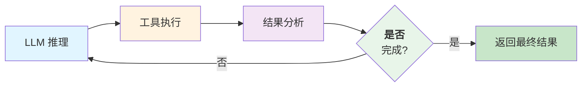

图 4-1：思考-行动-观察循环

**为什么是循环而不是链**

传统的链式智能体(Chain-of-Thought)将思考和行动分开，形如：提示→思考→规划→工具调用→输出。这种设计的缺点是：

* **缺乏适应性**：一旦执行遇到问题（工具调用失败、输出超限），难以动态调整策略
* **低效率**：规划阶段必须预测所有可能的工具调用，容易过度规划或不足规划
* **不可恢复**：一旦规划失败，需要重新启动整个流程

**循环设计** 允许智能体逐步细化目标，在每个循环迭代中获得反馈，动态调整策略。这更符合人类解决问题的过程。

### 1.2 工程实现模式对比

#### Claude Code 的异步生成器模式

Claude Code 采用异步生成器模式实现智能体循环，具体如下：

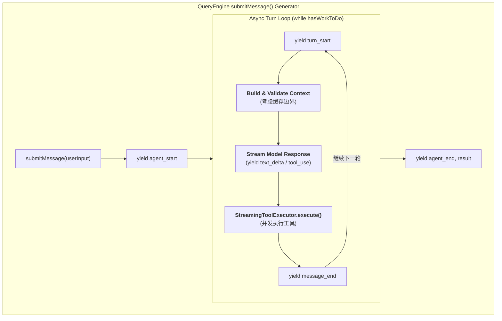

**特点**：

* 异步生成器模式，客户端可以逐个处理事件
* 支持流式响应实时推送(text\_delta)
* StreamingToolExecutor 支持工具的并发执行
* 上下文构建时考虑缓存边界(SYSTEM\_PROMPT\_DYNAMIC\_BOUNDARY)
* AppState 管理会话状态（150+ 字段）

**Claude Code 的核心代码骨架** （伪代码）：

```python
class QueryEngine:
    async def submitMessage(self, user_input: str):
        """异步生成器循环,每次 yield 一个事件"""
        yield AgentStartEvent()

        # 初始化会话状态
        app_state = self.init_app_state(user_input)

        while app_state.has_work_to_do():
            yield TurnStartEvent()

            # 构建完整的消息和上下文
            # 考虑缓存边界,分离系统提示词和动态上下文
            system_prompt = self.get_system_prompt()
            messages = await self.build_messages(app_state)

            # 检查Token预算
            if self.estimate_tokens(system_prompt + messages) > self.token_budget:
                messages = self.auto_compact_history(messages)

            # 流式调用模型
            stream = await self.model_client.create_message_stream(
                messages=messages,
                system=system_prompt,
                tools=self.get_available_tools()
            )

            # 逐个处理流中的事件
            # 按 Anthropic 流式协议增量累积内容块,在消息终止时才执行工具
            assembler = MessageAssembler()
            async for event in stream:
                if event.type == "content_block_start":
                    # 新的内容块开始(文本或工具使用),登记到累积器
                    assembler.start_block(event.index, event.content_block)
                    yield event

                elif event.type == "content_block_delta":
                    # 把增量累积进当前块(文本/工具入参 JSON)
                    assembler.append_delta(event.index, event.delta)
                    if event.delta.type == "text_delta":
                        yield TextDeltaEvent(event.delta.text)
                    elif event.delta.type == "input_json_delta":
                        yield ToolInputDeltaEvent(event.delta.partial_json)

                elif event.type == "content_block_stop":
                    # 当前块完成,定稿(如解析工具入参 JSON)
                    assembler.finish_block(event.index)

                elif event.type == "message_delta":
                    # 顶层增量:仅携带 stop_reason 与累计 usage,不含 content
                    assembler.set_stop_reason(event.delta.stop_reason)
                    assembler.add_usage(event.usage)

                elif event.type == "message_stop":
                    # 消息终止信号(不含 content);此时内容块已累积完毕
                    message = assembler.build_message()

                    # 异步执行工具(StreamingToolExecutor)
                    tool_results = await self.execute_tools(
                        message.content,
                        app_state
                    )

                    # 更新应用状态
                    app_state.add_message(message)
                    app_state.add_tool_results(tool_results)

                    yield MessageEndEvent(message)

                    # 检查是否需要继续
                    if not tool_results:
                        app_state.mark_done()
                    # 否则继续下一轮(while 循环)

        # 返回最终结果
        yield AgentEndEvent(
            result=app_state.final_response,
            message_count=len(app_state.messages)
        )
```

#### OpenClaw 的线性流水线模式

OpenClaw 采用线性流水线模式，在单个事件循环中顺序执行，具体如下：

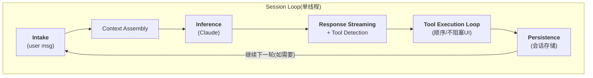

**特点**：

* 每轮循环是独立的阶段：input → assembly → inference → execution → persist
* 单线程执行，一次一个会话，不支持会话间并发
* 工具执行与流式响应紧耦合
* 错误作为“观察”(ToolResultBlock)反馈回消息流

**OpenClaw 的核心代码骨架** （伪代码）：

```python
class SessionRuntime:
    def run_session(self, session_id: str):
        """单个会话的运行时主循环"""
        while True:
            # 1. Intake:获取用户输入或等待事件
            user_message = self.intake_queue.get(timeout=30)
            if user_message is None:
                break  # 会话结束

            # 2. Context Assembly:组装上下文（每条新用户消息只组装一次）
            context = self.context_engine.assemble(
                session_id=session_id,
                user_input=user_message,
                system_prompt=self.system_prompt,
                tools_schema=self.get_tools_schema(),
                memory=self.memory_store.load(session_id)
            )

            # Initialize messages from context
            messages = context.messages.copy()

            # 3-4. 推理与工具调用循环：直到模型不再请求工具（4.1.3 的"工具调用耗尽"终止条件）
            while True:
                # 3. Inference:调用模型
                response = self.model_client.create_message(
                    messages=messages,
                    system=context.system_prompt,
                    tools=context.tools,
                    max_tokens=context.token_budget
                )

                # 4. Tool Execution Loop:处理本轮 response 中的所有工具调用
                tool_results = []
                for tool_use in response.content:
                    if isinstance(tool_use, ToolUseBlock):
                        result = self.execute_tool(
                            tool_use.name,
                            tool_use.input
                        )
                        tool_results.append(ToolResultBlock(
                            tool_use_id=tool_use.id,
                            content=result
                        ))

                # 没有工具调用 → 推理完成，跳出内层循环
                if not tool_results:
                    break

                # 有工具调用 → 把助手回复与工具结果包装成消息追加到 messages，继续内层推理
                # 注意：tool_result 块按 Anthropic Messages 约定属于 user 角色消息
                messages.append({"role": "assistant", "content": response.content})
                messages.append({"role": "user", "content": tool_results})

            # 5. Persistence:持久化（仅在内层循环结束、得到最终回复后执行一次）
            self.message_store.save(session_id, response)
            self.memory_store.maybe_consolidate(session_id)

            # 把最终响应交付给用户，回到 Intake 等待会话的下一条输入
            self.deliver(session_id, response)
```

### 1.3 循环的终止条件

两个系统都需要明确定义何时停止循环，避免无限循环：

#### 终止条件的类型

1. **工具调用耗尽**：Agent 推理出最后一条消息，不包含工具调用，直接回复用户
2. **最大轮数限制**：防止无限循环的安全机制，通常设为 10-30 轮
3. **Token 预算耗尽**：当前轮推理会导致上下文溢出，无法继续
4. **显式停止信号**：用户取消、超时、或智能体发出停止标记
5. **目标达成**：可选的高层目标追踪（自驱型智能体）

#### 实现示例

以下是循环终止检查器的实现示例：

```python
class LoopTerminationChecker:
    def __init__(self, max_turns: int = 20, token_limit: int = 100000):
        self.max_turns = max_turns
        self.token_limit = token_limit

    def should_continue(self, state: AgentState) -> bool:
        """判断是否应该继续循环"""

        # 检查1:轮数上限
        if state.turn_count >= self.max_turns:
            state.termination_reason = "max_turns_reached"
            return False

        # 检查2:是否有工具调用
        last_message = state.messages[-1]
        if not self._has_tool_calls(last_message):
            state.termination_reason = "no_tool_calls"
            return False

        # 检查3:Token预算
        next_turn_tokens = self._estimate_tokens_for_next_turn(state)
        if next_turn_tokens > self.token_limit:
            state.termination_reason = "token_limit_exceeded"
            return False

        # 检查4:显式停止信号
        if state.stop_signal_received:
            state.termination_reason = "user_stop"
            return False

        return True

    def _has_tool_calls(self, message: Message) -> bool:
        """检查消息中是否有工具调用块"""
        for block in message.content:
            if isinstance(block, ToolUseBlock):
                return True
        return False

    def _estimate_tokens_for_next_turn(self, state: AgentState) -> int:
        """估计下一轮推理的Token使用"""
        # 简化版本,实际需要调用计数器
        history_tokens = len(state.messages) * 50  # 粗略估计
        new_input_tokens = 100  # 工具结果的平均大小
        return history_tokens + new_input_tokens
```

### 1.4 消息流的演化过程

一个完整的 智能体循环中，消息流如何演化：

```
轮次 1:
  Input:  [UserMessage("Find files modified in last 7 days")]
  Output: [AssistantMessage([
    TextBlock("I'll find recent files for you."),
    ToolUseBlock(name="bash", input="find /data -mtime -7")
  ])]

轮次 2(工具执行):
  Input:  [
    UserMessage("Find files modified in last 7 days"),
    AssistantMessage([...]),
    ToolResultBlock(tool_use_id=xxx, content="file1.txt\nfile2.log\n...")
  ]
  Output: [AssistantMessage([
    TextBlock("Found 3 recent files: file1.txt, file2.log, file3.csv")
  ])]  # 不再有工具调用,循环终止

最终消息历史:
  [UserMessage, AssistantMessage(Tool 1), ToolResultBlock, AssistantMessage(Final)]
```

这种结构保证了：

* 完整的推理链条可追踪
* 每次工具调用都有对应的结果
* 智能体的决策过程对用户透明

### 1.5 Codex 智能体循环协议规范

Codex Harness 采用了 JSON-RPC 作为循环协议的基础，通过严格的通信原语确保循环的可靠性和可观测性。本节介绍 Codex 循环的协议层设计。

#### 三层通信原语

Codex Agent Loop 定义了三个核心的 JSON-RPC 通信原语，从底层到顶层分别为：

1. **Item** （项）：最小的原子通信单元，代表单次输入/输出操作。每个 Item 都有明确的生命周期：

   * `item/started`：Item 开始处理
   * 可选的 `item/{type}/delta`：内容流式增量到达（适用于文本、工具执行结果等）
   * `item/completed`：Item 完成并返回最终 payload

   Item 的类型包括用户消息、助手消息、工具执行、审批请求、差异(diff)等，类型化设计使客户端能够进行强类型校验。
2. **Turn** （轮）：由用户输入发起的单位工作。一个 Turn 包含一个有序的 Item 序列，表示从用户请求到最终输出的整个执行过程：
   * `turn/start`：接收用户输入（例如“运行测试并总结失败原因”）
   * 中间步骤：思考、工具调用、获取结果等（各自作为 Item）
   * `turn/completed`：最终助手消息返回，Turn 结束
3. **Thread** （线程）：持久化的会话容器，包含多个 Turn。Threads 支持创建、恢复、分叉和归档，历史记录持久化确保客户端可以重连并恢复一致的状态。

#### 前缀一致性与缓存优化

Codex 的 JSON-RPC 协议强制执行 **前缀一致性** 原则：每一轮推理的输入都是上一轮输出的精确前缀。这一设计直接启用了模型推理的 **提示词缓存** (Prompt Caching)，使多轮对话的成本从二次方复杂度降至线性复杂度。

具体地，如果第一轮推理的完整消息列表为 `[msg1, msg2, ..., msgN]`，第二轮新增工具结果后的列表必须为 `[msg1, msg2, ..., msgN, toolResult, assistantMsg]`，旧消息部分保持不变。这对循环的构建有两个影响：

* **工具枚举顺序的重要性**：MCP 工具在初始化时必须以 **确定的顺序** 枚举，否则工具列表顺序变化会破坏前缀，导致缓存未命中(Cache Miss)。Codex 发现过一个 bug：MCP 工具枚举的顺序不确定，在长会话中每一轮都造成缓存未命中，性能严重下降。
* **配置变更的处理**：若在对话中途需要改变权限设置、沙箱配置或工作目录，Codex 不会修改历史消息，而是追加一个新的`role=developer`消息声明配置变更，保持前缀的完整性。

#### 双向通信模式

App Server 的 JSON-RPC 协议是 **完全双向的**，不同于传统的单向请求-响应模式：

* **客户端请求**：初始化握手(initialize)、线程和轮次创建(thread/start, turn/start)、输入提交
* **服务端通知**：进度更新（thread/started, turn/started, item/started 等）、Item 的增量内容（delta 事件）、Item 完成(item/completed)
* **服务端请求**：当需要用户审批（例如“是否允许执行 pnpm test”）时，服务端主动向客户端发起请求，转为 **暂停** 状态，直到客户端响应批准或拒绝

这种双向特性使循环成为一个 **响应式的流程**：客户端 UI 可以在 Item 开始时立即开始渲染，流式地接收 delta 事件进行增量更新，在 Item 完成时进行最终定稿。服务端也可以在关键决策点（如权限检查）暂停转移控制权给用户。

### 1.6 本节小结

智能体循环的工程实现有两种主要模式：

* **Claude Code 的异步生成器** 追求低延迟与高并发，通过事件驱动的方式支持流式响应，适合交互式的任务场景
* **OpenClaw 的线性流水线** 强调确定性与可追踪性，通过单线程阶段化执行保证顺序，适合需要完全控制的自驱型场景

在生产级 Codex 系统中，通过 **JSON-RPC 协议的三层原语** (Item/Turn/Thread)、 **前缀一致性缓存优化** 和 **双向通信模式**，实现了高效可靠的循环编排。这些设计模式的核心是“思考-行动-观察”循环，但将其具体化为可观测、可缓存、可控制的 protocol-level 操作。

理解这两种实现模式和协议规范，是构建生产级 Harness 运行时的基础。

## 2. 消息类型系统与状态管理

清晰的消息类型系统和适当的状态管理方式是运行时的基础。本节介绍消息流转的完整类型体系，对比两种状态管理模式，并讨论消息历史的窗口管理策略。

### 2.1 消息类型的完整体系

在 智能体循环中流转的不仅是文本，还包括多种类型的内容块。清晰的消息类型系统是实现可靠智能体系统的基础。

**核心消息类型：** 系统中使用的核心消息类型定义如下：

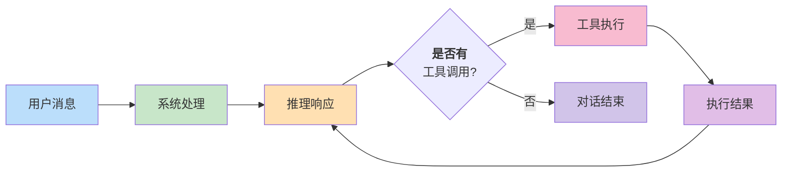

图 4-2：消息流转流程

```python
# 基础消息类型枚举
class MessageRole(Enum):
    USER = "user"           # 用户输入
    ASSISTANT = "assistant" # 智能体响应

class ContentBlockType(Enum):
    TEXT = "text"                     # 纯文本
    TOOL_USE = "tool_use"             # 工具调用请求
    TOOL_RESULT = "tool_result"       # 工具执行结果
    THINKING = "thinking"             # 推理过程(optional)
    IMAGE = "image"                   # 图像内容
```

**消息对象的定义：** 消息对象的数据结构定义如下：

```python
from typing import List, Dict, Any, Optional
from dataclasses import dataclass, field
from datetime import datetime, timezone
from enum import Enum
import json

@dataclass
class TextBlock:
    """纯文本块"""
    type: str = "text"
    text: str = ""

    def to_dict(self) -> Dict[str, Any]:
        return {"type": self.type, "text": self.text}

@dataclass
class ToolUseBlock:
    """工具调用块:Agent 发起工具调用请求"""
    type: str = "tool_use"
    id: str = ""           # 工具使用的唯一ID,用于匹配结果
    name: str = ""         # 工具名称
    input: Dict[str, Any] = field(default_factory=dict)  # 工具参数,已解析为字典

    def __post_init__(self):
        if self.input is None:
            self.input = {}
        if not self.id:
            # 自动生成UUID
            import uuid
            self.id = f"tooluse_{uuid.uuid4().hex[:12]}"

    def to_dict(self) -> Dict[str, Any]:
        return {
            "type": self.type,
            "id": self.id,
            "name": self.name,
            "input": self.input
        }

@dataclass
class ToolResultBlock:
    """工具结果块:工具执行完成后的结果"""
    type: str = "tool_result"
    tool_use_id: str = ""  # 关联的 ToolUseBlock.id
    content: str = ""      # 工具执行结果(文本)
    is_error: bool = False # 是否为错误结果
    error_type: Optional[str] = None  # 错误类型(如果是错误)

    def to_dict(self) -> Dict[str, Any]:
        return {
            "type": self.type,
            "tool_use_id": self.tool_use_id,
            "content": self.content,
            "is_error": self.is_error,
            "error_type": self.error_type
        }

@dataclass
class ThinkingBlock:
    """推理块:Agent 的内部思考过程(使用 extended thinking 时)"""
    type: str = "thinking"
    thinking: str = ""     # 思考内容

    def to_dict(self) -> Dict[str, Any]:
        return {"type": self.type, "thinking": self.thinking}

@dataclass
class Message:
    """完整的消息对象"""
    role: str  # "user" 或 "assistant"
    content: List[Any]  # 可以包含 TextBlock, ToolUseBlock, ToolResultBlock 等
    timestamp: datetime = None
    message_id: str = ""  # 唯一标识符

    def __post_init__(self):
        if self.timestamp is None:
            self.timestamp = datetime.now(timezone.utc)
        if not self.message_id:
            import uuid
            self.message_id = f"msg_{uuid.uuid4().hex[:12]}"

    @classmethod
    def user(cls, text: str) -> "Message":
        """工厂方法:创建用户消息"""
        return cls(
            role="user",
            content=[TextBlock(text=text)]
        )

    @classmethod
    def assistant(cls, content: List[Any]) -> "Message":
        """工厂方法:创建助手消息"""
        return cls(
            role="assistant",
            content=content
        )

    def has_tool_calls(self) -> bool:
        """检查是否包含工具调用"""
        return any(isinstance(block, ToolUseBlock) for block in self.content)

    def get_tool_calls(self) -> List[ToolUseBlock]:
        """提取所有工具调用块"""
        return [block for block in self.content if isinstance(block, ToolUseBlock)]

    def get_text(self) -> str:
        """提取所有文本块,拼接为单个字符串"""
        texts = [block.text for block in self.content if isinstance(block, TextBlock)]
        return "".join(texts)

    def to_dict(self) -> Dict[str, Any]:
        """序列化为字典"""
        return {
            "role": self.role,
            "content": [block.to_dict() for block in self.content],
            "timestamp": self.timestamp.isoformat(),
            "message_id": self.message_id
        }

    @classmethod
    def from_dict(cls, data: Dict[str, Any]) -> "Message":
        """从字典反序列化"""
        content = []
        for block_data in data.get("content", []):
            block_type = block_data.get("type")
            if block_type == "text":
                content.append(TextBlock(**block_data))
            elif block_type == "tool_use":
                content.append(ToolUseBlock(**block_data))
            elif block_type == "tool_result":
                content.append(ToolResultBlock(**block_data))
            elif block_type == "thinking":
                content.append(ThinkingBlock(**block_data))

        return cls(
            role=data["role"],
            content=content,
            timestamp=datetime.fromisoformat(data.get("timestamp", "")),
            message_id=data.get("message_id", "")
        )
```

### 2.2 状态管理模式

**发布-订阅模式：** Claude Code 采用发布-订阅模式：维护可变的 AppState，但通过事件发射的方式通知订阅者状态变化。

```python
from typing import Callable, List
from enum import Enum

class StateChangeEvent(Enum):
    MESSAGE_ADDED = "message_added"
    TOOL_EXECUTED = "tool_executed"
    STATE_RESET = "state_reset"

@dataclass
class AppState:
    """可变的应用状态"""
    session_id: str
    messages: List[Message] = field(default_factory=list)
    current_turn: int = 0
    token_count: int = 0
    _subscribers: List[Callable[[StateChangeEvent, Any], None]] = field(
        default_factory=list
    )

    def subscribe(self, callback: Callable[[StateChangeEvent, Any], None]):
        """订阅状态变化"""
        self._subscribers.append(callback)

    def _notify(self, event: StateChangeEvent, data: Any):
        """通知所有订阅者"""
        for callback in self._subscribers:
            try:
                callback(event, data)
            except Exception as e:
                print(f"Subscriber error: {e}")

    def add_message(self, message: Message):
        """添加消息(修改当前状态)"""
        self.messages.append(message)
        self.token_count += self._estimate_tokens(message)
        self.current_turn += 1
        # 通知订阅者
        self._notify(StateChangeEvent.MESSAGE_ADDED, message)

    def execute_tool(self, tool_name: str, result: str):
        """记录工具执行"""
        # ... 工具执行逻辑
        self._notify(StateChangeEvent.TOOL_EXECUTED, {
            "tool_name": tool_name,
            "result": result
        })

    def _estimate_tokens(self, message: Message) -> int:
        """粗略估计消息的Token数"""
        return int(len(message.get_text().split()) * 1.3)  # 简化估计

# 发布-订阅模式使用示例
app_state = AppState(session_id="sess_456")

def on_state_change(event: StateChangeEvent, data: Any):
    print(f"State changed: {event} -> {data}")

app_state.subscribe(on_state_change)
app_state.add_message(Message.user("Hello"))  # 触发 MESSAGE_ADDED 事件
```

**不可变状态模式：** OpenClaw 采用不可变状态模式：每次状态变化都产生新的状态对象，保留历史状态链。这种方式的优点：

* **可追踪性**：任何时间点的状态都可恢复
* **并发安全**：多个工作线程无需同步即可读取（因为对象不变）
* **调试友好**：可以记录完整的状态转移序列

```python
from dataclasses import dataclass, field
from typing import List, Tuple

@dataclass(frozen=True)  # frozen=True 使对象不可变
class ImmutableSessionState:
    """不可变的会话状态"""
    session_id: str
    messages: Tuple[Message, ...] = field(default_factory=tuple)
    current_turn: int = 0
    token_count: int = 0
    last_updated: datetime = field(default_factory=lambda: datetime.now(timezone.utc))

    def add_message(self, message: Message) -> "ImmutableSessionState":
        """添加消息,返回新的状态对象"""
        new_messages = tuple(list(self.messages) + [message])
        return ImmutableSessionState(
            session_id=self.session_id,
            messages=new_messages,
            current_turn=self.current_turn + 1,
            token_count=self.token_count + self._estimate_tokens(message),
            last_updated=datetime.now(timezone.utc)
        )

    def _estimate_tokens(self, message: Message) -> int:
        """粗略估计消息的Token数"""
        return len(message.get_text().split()) * 1.3  # 简化估计

# 不可变状态模式使用示例
state = ImmutableSessionState(session_id="sess_123")
print(f"初始状态 ID: {id(state)}")

state = state.add_message(Message.user("Hello"))
print(f"添加用户消息后的状态 ID: {id(state)}")  # 不同对象

state = state.add_message(Message.assistant([TextBlock(text="Hi there!")]))
print(f"添加助手消息后的状态 ID: {id(state)}")  # 又是不同对象
```

### 2.3 状态设计的对比

| 方面    | 发布-订阅(Claude Code) | 不可变状态(OpenClaw) |
| ----- | ------------------ | --------------- |
| 内存开销  | 低（原地修改）            | 高（每次变化都复制整个状态）  |
| 时间复杂度 | O(1) 更新成本          | O(n) 复制成本       |
| 调试能力  | 中（需要日志）            | 优（完整历史保留）       |
| 并发友好  | 中（需要锁或事件队列）        | 优（无竞态条件）        |
| 实时反应  | 优（即时通知）            | 中（需要后处理历史）      |

### 2.4 消息历史的窗口管理

由于 LLM 上下文有限，不能无限保留所有消息。需要实现消息窗口管理：

```python
class MessageWindow:
    """消息窗口管理器"""

    def __init__(self, max_messages: int = 50, max_tokens: int = 100000):
        self.max_messages = max_messages
        self.max_tokens = max_tokens

    def filter_messages(self, messages: List[Message]) -> List[Message]:
        """根据约束条件过滤消息"""

        # 策略1:按消息数量限制
        if len(messages) > self.max_messages:
            # 保留最后 max_messages 条,丢弃早期消息
            messages = messages[-self.max_messages:]

        # 策略2:按Token数量限制
        total_tokens = sum(self._estimate_tokens(m) for m in messages)
        if total_tokens > self.max_tokens:
            # 移除早期消息直到满足Token限制
            while messages and total_tokens > self.max_tokens:
                removed = messages.pop(0)
                total_tokens -= self._estimate_tokens(removed)

        return messages

    def _estimate_tokens(self, message: Message) -> int:
        """估计消息的Token数"""
        text = message.get_text()
        return len(text.split()) * 1.3

    def insert_system_context(self, messages: List[Message],
                             system_blocks: List[TextBlock]) -> List[Message]:
        """在消息历史前插入系统上下文"""
        result = []
        # 添加系统消息(不计入限制)
        for block in system_blocks:
            result.append(Message.assistant([block]))
        # 添加过滤后的消息历史
        result.extend(self.filter_messages(messages))
        return result
```

### 2.5 本节小结

清晰的消息类型系统和合理的状态管理方式是运行时的基础：

1. **消息类型体系** 定义了 智能体循环中的各种信息（文本、工具调用、工具结果、思考过程），提供类型安全的接口
2. **不可变状态模式** 适合需要完整追踪和并发安全的场景，代价是内存和性能
3. **发布-订阅模式** 适合需要低延迟反应和实时流式处理的场景，代价是需要额外的同步机制
4. **消息窗口管理** 确保在有限的上下文窗口内动态调度消息，是处理长对话的必需能力

## 3. 流式处理与事件驱动架构

流式处理和事件驱动是现代智能体系统的必要能力，支持低延迟和高吞吐。本节介绍流式处理的优势，对比 OpenClaw 和 Claude Code 的实现方式，并讨论事件流架构和背压控制机制。

### 3.1 为什么工具输入应在流式响应中解析

传统的批处理模型(Batch Model)将智能体推理与工具执行分离：

```
推理完成 → 提取工具调用 → 执行工具 → 等待全部完成 → 反馈给 Agent
```

这种模式的问题：

1. **高延迟**：必须等待所有工具执行完成才能继续推理，单个慢工具阻塞整个流程
2. **无法流式响应**：用户无法看到实时的智能体思考过程
3. **低效的资源利用**：CPU 和网络资源无法充分并发
4. **错误恢复困难**：工具失败后难以进行灵活的备选处理

**流式处理模型** (Streaming Model)将工具调用输入的解析和工具执行调度集成到响应流中。关键边界是：文本增量可以立即转发；工具参数必须等 `input_json_delta` 累积完整、工具块结束后才能执行。

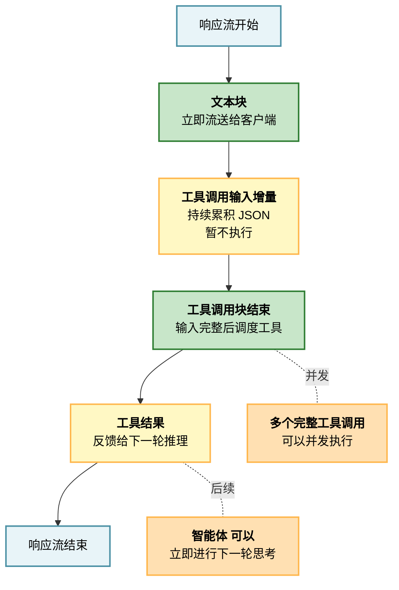

图 4-3：流式处理架构

**流式处理的核心优势**

1. **低时间延迟**：用户可以立即看到智能体的首字节响应，而不需要等待所有工具完成
2. **高吞吐量**：多个完整工具调用可以并发执行，单个慢工具不阻塞其他工具结果收集
3. **更好的用户体验**：实时反馈让用户感知到系统正在工作
4. **灵活的错误恢复**：工具失败时可以立即重试或选择替代方案

### 3.2 Claude Code 的 StreamingToolExecutor 设计

Claude Code 采用 **流式响应 + 异步工具执行** 的模式：

```python
class StreamingToolExecutor:
    """流式工具执行器:在响应流中处理工具调用"""

    def __init__(self, tool_registry: ToolRegistry, max_concurrent: int = 5):
        self.tool_registry = tool_registry
        self.max_concurrent = max_concurrent
        self._pending_executions: Dict[str, asyncio.Task] = {}

    async def execute_tools(
        self,
        tool_uses: List[ToolUseBlock],
        app_state: AppState
    ) -> Dict[str, ToolResultBlock]:
        """
        并发执行多个工具调用,返回所有结果
        使用 asyncio.Semaphore 限制并发数
        """
        semaphore = asyncio.Semaphore(self.max_concurrent)
        tasks = []

        for tool_use in tool_uses:
            task = asyncio.create_task(
                self._execute_single_tool(tool_use, app_state, semaphore)
            )
            tasks.append(task)
            self._pending_executions[tool_use.id] = task

        # 并发等待所有工具完成
        results = await asyncio.gather(*tasks, return_exceptions=True)

        # 组织结果
        tool_results = {}
        for tool_use, result in zip(tool_uses, results):
            if isinstance(result, Exception):
                tool_results[tool_use.id] = ToolResultBlock(
                    tool_use_id=tool_use.id,
                    content=f"Tool execution error: {str(result)}",
                    is_error=True,
                    error_type=type(result).__name__
                )
            else:
                tool_results[tool_use.id] = result

        return tool_results

    async def _execute_single_tool(
        self,
        tool_use: ToolUseBlock,
        app_state: AppState,
        semaphore: asyncio.Semaphore
    ) -> ToolResultBlock:
        """执行单个工具"""
        async with semaphore:
            try:
                # 1. 查找工具
                tool = self.tool_registry.get(tool_use.name)
                if not tool:
                    raise ToolNotFoundError(f"Tool '{tool_use.name}' not found")

                # 2. 权限检查
                if not tool.check_permissions(app_state):
                    raise PermissionDeniedError(
                        f"Permission denied for tool '{tool_use.name}'"
                    )

                # 3. 执行工具
                result = await tool.call(tool_use.input)

                # 4. 组织结果
                return ToolResultBlock(
                    tool_use_id=tool_use.id,
                    content=str(result),
                    is_error=False
                )

            except Exception as e:
                return ToolResultBlock(
                    tool_use_id=tool_use.id,
                    content=str(e),
                    is_error=True,
                    error_type=type(e).__name__
                )

    def get_tool_progress(self, tool_use_id: str) -> Optional[ToolProgress]:
        """获取某个工具的执行进度(如果可用)"""
        task = self._pending_executions.get(tool_use_id)
        if not task:
            return None
        # 实现细节:从工具对象的进度属性中提取(如果工具支持)
        # 通常通过工具返回的结果对象或单独的进度查询接口获取
        # 这是一个简化的实现,实际需要根据具体工具的API调整
        if hasattr(task, '_progress'):
            return task._progress
        return None
```

### 3.3 OpenClaw 的响应流处理

OpenClaw 采用“响应流优先”的设计，在流式响应过程中持续检测工具调用：

```python
class StreamingResponseHandler:
    """处理 API 流式响应"""

    def handle_stream(self, stream):
        """逐个处理流中的事件"""
        accumulated_input_json = ""  # 累积工具参数的 JSON
        current_tool_name = None  # content_block_stop 事件只携带 index，工具名须在 start 时记录

        for event in stream:
            if event.type == "content_block_start":
                if event.content_block.type == "text":
                    # 开始新的文本块
                    pass

                elif event.content_block.type == "tool_use":
                    # 工具调用开始：记下工具名，供 stop 事件使用
                    current_tool_name = event.content_block.name
                    accumulated_input_json = ""

            elif event.type == "content_block_delta":
                if event.delta.type == "text_delta":
                    # 文本增量,直接转发给前端
                    self.send_to_frontend(TextDeltaEvent(event.delta.text))

                elif event.delta.type == "input_json_delta":
                    # 累积 JSON 参数
                    accumulated_input_json += event.delta.partial_json

            elif event.type == "content_block_stop":
                if current_tool_name is not None:
                    # 工具调用完成,此时有完整的 accumulated_input_json
                    tool_input = json.loads(accumulated_input_json)

                    # 输入完整后执行工具(可能阻塞,但用户已看到前面的文本增量)
                    result = self.execute_tool(current_tool_name, tool_input)
                    self.send_to_frontend(ToolResultEvent(result))
                    current_tool_name = None
```

### 3.4 事件流架构

完整的 智能体循环产生的事件序列：

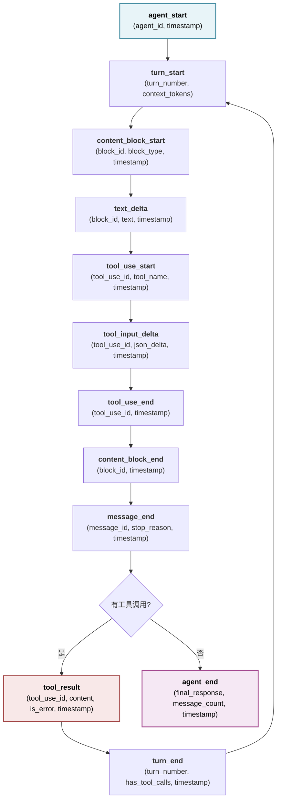

**事件流的实现**

```python
import json
from dataclasses import dataclass, field
from datetime import datetime, timezone
from typing import Any, AsyncIterator, Dict
from enum import Enum

class EventType(Enum):
    AGENT_START = "agent_start"
    TURN_START = "turn_start"
    CONTENT_BLOCK_START = "content_block_start"
    TEXT_DELTA = "text_delta"
    TOOL_USE_START = "tool_use_start"
    TOOL_INPUT_DELTA = "tool_input_delta"
    TOOL_USE_END = "tool_use_end"
    TOOL_RESULT = "tool_result"
    CONTENT_BLOCK_END = "content_block_end"
    MESSAGE_END = "message_end"
    TURN_END = "turn_end"
    AGENT_END = "agent_end"
    ERROR = "error"

@dataclass
class Event:
    """事件基类"""
    event_type: EventType
    timestamp: datetime = field(default_factory=lambda: datetime.now(timezone.utc))
    metadata: Dict[str, Any] = field(default_factory=dict)

    def to_json(self) -> str:
        """序列化为 JSON(用于流式传输)"""
        return json.dumps({
            "event_type": self.event_type.value,
            "timestamp": self.timestamp.isoformat(),
            "metadata": self.metadata
        })

class QueryEngine:
    """生成事件流的查询引擎"""

    async def submit_message(self, user_input: str) -> AsyncIterator[Event]:
        """异步生成器:逐个 yield 事件"""
        try:
            yield Event(EventType.AGENT_START, metadata={
                "user_input_length": len(user_input)
            })

            app_state = AppState(session_id=str(uuid.uuid4()))
            turn_number = 0

            while True:
                turn_number += 1
                yield Event(EventType.TURN_START, metadata={
                    "turn_number": turn_number,
                    "context_tokens": app_state.token_count
                })

                # 构建上下文
                messages = await self._build_messages(app_state)
                system_prompt = self._get_system_prompt()

                # 流式调用模型
                tool_uses = []
                async for event in self._stream_model_response(
                    messages=messages,
                    system=system_prompt
                ):
                    # 转发模型流中的文本和工具使用事件
                    yield event

                    if event.event_type == EventType.TOOL_USE_END:
                        tool_uses.append(event.metadata["tool_use"])

                # 工具输入完整后执行工具；多个工具可以并发，但需要等待结果进入下一轮
                if tool_uses:
                    tool_results = await self.executor.execute_tools(
                        tool_uses, app_state
                    )

                    # 发出工具结果事件
                    for tool_use_id, result in tool_results.items():
                        yield Event(EventType.TOOL_RESULT, metadata={
                            "tool_use_id": tool_use_id,
                            "is_error": result.is_error,
                            "content_length": len(result.content)
                        })

                    # 更新应用状态以继续下一轮推理
                    app_state.add_tool_results(tool_results)

                else:
                    # 没有工具调用,循环结束
                    break

                yield Event(EventType.TURN_END, metadata={
                    "turn_number": turn_number,
                    "has_tool_calls": bool(tool_uses)
                })

            yield Event(EventType.AGENT_END, metadata={
                "final_response": app_state.get_final_response(),
                "turn_count": turn_number,
                "message_count": len(app_state.messages)
            })

        except Exception as e:
            yield Event(EventType.ERROR, metadata={
                "error_type": type(e).__name__,
                "error_message": str(e)
            })
```

### 3.5 背压与流量控制

在流式处理中，如果客户端处理事件的速度慢于服务器生成事件的速度，会导致内存溢出。需要实现背压机制：

```python
class BackpressureQueue:
    """带背压的事件队列"""

    def __init__(self, max_queue_size: int = 100):
        self.queue: asyncio.Queue = asyncio.Queue(maxsize=max_queue_size)

    async def put_event(self, event: Event):
        """发送事件,如果队列满则等待"""
        try:
            self.queue.put_nowait(event)
        except asyncio.QueueFull:
            # 队列满,等待消费者处理
            await self.queue.put(event)

    async def get_event(self) -> Event:
        """接收事件,带超时"""
        return await asyncio.wait_for(
            self.queue.get(),
            timeout=30.0  # 30秒超时
        )

    def queue_size(self) -> int:
        """获取当前队列大小"""
        return self.queue.qsize()
```

### 3.6 本节小结

流式处理与事件驱动是现代智能体系统的必要能力：

1. **流式处理的优势** 明显：低延迟、高吞吐、更好的用户体验、灵活的错误恢复
2. **工具输入应在流式响应中解析**，但工具执行必须等完整输入到达后再调度；这样既保持低延迟文本反馈，也避免半截 JSON 参数触发工具
3. **事件流架构** 定义了清晰的状态转移和事件序列，使得系统行为可观测、可预测、可调试
4. **Claude Code 的异步生成器模式和 OpenClaw 的流响应处理** 都实现了这一原则，但编程模型不同（其中 Claude Code 采用异步并发，OpenClaw 采用流式顺序处理）
5. **背压管理** 是生产环境中必需的，防止内存溢出和系统过载

## 4. 错误处理与故障恢复

在智能体运行时，会遇到多种类型的错误，包括工具执行失败、API 调用超时、输出解析错误等。本节介绍如何对这些错误进行分类、设计恢复策略，以及 OpenClaw 的“错误即观察”模式。

### 4.1 错误的分类与应对策略

智能体循环中可能遇到的错误分为几类，每类需要不同的处理策略：

#### 4.1.1 工具执行错误

包含 **工具调用失败、权限拒绝、参数错误、工具崩溃**， **影响范围**：当前工具调用，**恢复策略**：作为“观察”反馈给 Agent

```python
import asyncio

class ToolExecutionError(Exception):
    """工具执行错误"""
    def __init__(self, tool_name: str, message: str,
                 error_type: str = None, retry_count: int = 0):
        self.tool_name = tool_name
        self.message = message
        self.error_type = error_type or type(self).__name__
        self.retry_count = retry_count
        super().__init__(message)

class ToolTimeoutError(ToolExecutionError):
    """工具执行超时"""
    pass

class ToolPermissionError(ToolExecutionError):
    """工具权限不足"""
    pass

# 处理示例
async def execute_tool_with_recovery(
    tool_use: ToolUseBlock,
    executor: ToolExecutor,
    max_retries: int = 3
) -> ToolResultBlock:
    """执行工具,带重试机制"""

    for attempt in range(max_retries):
        try:
            result = await executor.execute(tool_use.name, tool_use.input)
            return ToolResultBlock(
                tool_use_id=tool_use.id,
                content=str(result),
                is_error=False
            )

        except ToolTimeoutError as e:
            # 超时:使用指数退避重试
            if attempt < max_retries - 1:
                backoff_seconds = 2 ** attempt  # 1, 2, 4 秒
                await asyncio.sleep(backoff_seconds)
                continue
            else:
                # 最后一次重试失败,返回错误
                return ToolResultBlock(
                    tool_use_id=tool_use.id,
                    content=f"Tool timeout after {max_retries} retries: {str(e)}",
                    is_error=True,
                    error_type="ToolTimeoutError"
                )

        except ToolPermissionError as e:
            # 权限错误:不重试,立即反馈
            return ToolResultBlock(
                tool_use_id=tool_use.id,
                content=f"Permission denied: {str(e)}",
                is_error=True,
                error_type="ToolPermissionError"
            )

        except ToolExecutionError as e:
            # 其他工具错误:重试一次
            if attempt < max_retries - 1:
                continue
            else:
                return ToolResultBlock(
                    tool_use_id=tool_use.id,
                    content=f"Tool execution failed: {str(e)}",
                    is_error=True,
                    error_type=e.error_type
                )

        except Exception as e:
            # 未预期的异常
            return ToolResultBlock(
                tool_use_id=tool_use.id,
                content=f"Unexpected error: {str(e)}",
                is_error=True,
                error_type=type(e).__name__
            )
```

#### 4.1.2 API 调用错误

**类型**：模型 API 超时、速率限制、认证失败、API 服务中断 **影响范围**：当前推理轮次 **恢复策略**：重试或回退到备用模型

```python
class ModelAPIError(Exception):
    """模型 API 错误"""
    pass

class RateLimitError(ModelAPIError):
    """速率限制"""
    def __init__(self, retry_after: int = None):
        self.retry_after = retry_after or 60
        super().__init__(f"Rate limited, retry after {self.retry_after}s")

class ModelTimeoutError(ModelAPIError):
    """模型调用超时"""
    pass

class RetryPolicy:
    """重试策略"""

    def __init__(self,
                 max_retries: int = 3,
                 initial_backoff: int = 1,
                 max_backoff: int = 60,
                 exponential_base: float = 2.0):
        self.max_retries = max_retries
        self.initial_backoff = initial_backoff
        self.max_backoff = max_backoff
        self.exponential_base = exponential_base

    async def execute_with_retry(self,
                                 coro_fn,
                                 *args, **kwargs) -> Any:
        """执行异步操作,带重试"""

        for attempt in range(self.max_retries):
            try:
                return await coro_fn(*args, **kwargs)

            except RateLimitError as e:
                # 速率限制:等待指定时间
                if attempt < self.max_retries - 1:
                    await asyncio.sleep(e.retry_after)
                    continue
                else:
                    raise

            except ModelTimeoutError as e:
                # 超时:指数退避
                if attempt < self.max_retries - 1:
                    backoff = min(
                        self.initial_backoff * (self.exponential_base ** attempt),
                        self.max_backoff
                    )
                    await asyncio.sleep(backoff)
                    continue
                else:
                    raise

            except ModelAPIError as e:
                # 其他 API 错误:重试
                if attempt < self.max_retries - 1:
                    backoff = min(
                        self.initial_backoff * (self.exponential_base ** attempt),
                        self.max_backoff
                    )
                    await asyncio.sleep(backoff)
                    continue
                else:
                    raise

# API重试策略使用示例
retry_policy = RetryPolicy()

async def call_model_with_retry(engine: QueryEngine, message: str):
    try:
        result = await retry_policy.execute_with_retry(
            engine.infer,
            messages=[Message.user(message)]
        )
        return result
    except ModelAPIError as e:
        # 重试失败,返回降级响应
        return Message.assistant([TextBlock(
            text=f"Sorry, I encountered an error: {str(e)}"
        )])
```

#### 4.1.3 输出解析错误

**类型**：模型输出格式不符、工具参数非法、JSON 解析失败 **影响范围**：当前推理结果 **恢复策略**：要求智能体重新生成或修复

```python
class OutputParsingError(Exception):
    """输出解析错误"""
    pass

class ToolParameterValidationError(OutputParsingError):
    """工具参数验证失败"""
    def __init__(self, tool_name: str, errors: List[str]):
        self.tool_name = tool_name
        self.errors = errors
        super().__init__(
            f"Tool '{tool_name}' parameter validation failed: {errors}"
        )

def validate_tool_parameters(
    tool_name: str,
    parameters: Dict[str, Any],
    schema: Dict[str, Any]
) -> Tuple[bool, List[str]]:
    """验证工具参数是否符合 Schema"""

    errors = []

    # 检查必需参数
    required = schema.get("required", [])
    for param_name in required:
        if param_name not in parameters:
            errors.append(f"Missing required parameter: {param_name}")

    # 检查参数类型
    properties = schema.get("properties", {})
    for param_name, param_value in parameters.items():
        if param_name not in properties:
            errors.append(f"Unknown parameter: {param_name}")
            continue

        param_schema = properties[param_name]
        expected_type = param_schema.get("type")

        if expected_type == "string" and not isinstance(param_value, str):
            errors.append(
                f"Parameter '{param_name}' should be string, got {type(param_value).__name__}"
            )
        elif expected_type == "integer" and not isinstance(param_value, int):
            errors.append(
                f"Parameter '{param_name}' should be integer, got {type(param_value).__name__}"
            )
        elif expected_type == "array" and not isinstance(param_value, list):
            errors.append(
                f"Parameter '{param_name}' should be array, got {type(param_value).__name__}"
            )

    return len(errors) == 0, errors

# 在工具执行前进行验证
async def execute_tool_validated(tool_use: ToolUseBlock,
                                 tool_registry: ToolRegistry) -> ToolResultBlock:
    """执行工具前进行参数验证"""

    tool = tool_registry.get(tool_use.name)
    if not tool:
        return ToolResultBlock(
            tool_use_id=tool_use.id,
            content=f"Tool '{tool_use.name}' not found",
            is_error=True,
            error_type="ToolNotFoundError"
        )

    # 验证参数
    schema = tool.get_input_schema()
    is_valid, errors = validate_tool_parameters(
        tool_use.name,
        tool_use.input,
        schema
    )

    if not is_valid:
        return ToolResultBlock(
            tool_use_id=tool_use.id,
            content=f"Parameter validation failed:\n" + "\n".join(errors),
            is_error=True,
            error_type="ParameterValidationError"
        )

    # 参数有效,执行工具
    try:
        result = await tool.call(tool_use.input)
        return ToolResultBlock(
            tool_use_id=tool_use.id,
            content=str(result),
            is_error=False
        )
    except Exception as e:
        return ToolResultBlock(
            tool_use_id=tool_use.id,
            content=str(e),
            is_error=True,
            error_type=type(e).__name__
        )
```

### 4. 上下文溢出与 Token 耗尽

**类型**：消息历史太长、推理输出超过 max\_tokens **影响范围**：整个会话 **恢复策略**：清理历史、压缩上下文、或启动新会话

```python
class ContextOverflowError(Exception):
    """上下文溢出"""
    pass

class TokenBudgetExceededError(ContextOverflowError):
    """Token预算超支"""
    def __init__(self, current_tokens: int, budget: int):
        self.current_tokens = current_tokens
        self.budget = budget
        super().__init__(
            f"Token budget exceeded: {current_tokens} > {budget}"
        )

class ContextCompressor:
    """上下文压缩器"""

    def __init__(self, max_summary_length: int = 500):
        self.max_summary_length = max_summary_length

    def compress_message_history(
        self,
        messages: List[Message],
        target_tokens: int,
        summarizer = None  # 可选的摘要函数
    ) -> List[Message]:
        """压缩消息历史以满足Token预算"""

        total_tokens = sum(self._estimate_tokens(m) for m in messages)

        if total_tokens <= target_tokens:
            return messages  # 无需压缩

        # 策略1:先对过长的 Assistant 响应做摘要（信息损失最小）
        if summarizer:
            summarized_messages = []
            for message in messages:
                if message.role == "assistant":
                    # 摘要 Assistant 的长响应
                    original_text = message.get_text()
                    if len(original_text) > self.max_summary_length:
                        summary = summarizer(original_text,
                                           max_length=self.max_summary_length)
                        message = Message.assistant([TextBlock(text=summary)])
                summarized_messages.append(message)

            messages = summarized_messages
            total_tokens = sum(self._estimate_tokens(m) for m in messages)

        # 策略2:摘要后仍超出预算,再从最早的消息开始移除
        while messages and total_tokens > target_tokens:
            removed = messages.pop(0)
            total_tokens -= self._estimate_tokens(removed)

        return messages

    def _estimate_tokens(self, message: Message) -> int:
        """估计消息的Token数"""
        text = message.get_text()
        return int(len(text.split()) * 1.3)  # 粗略估计

# 上下文压缩使用示例
compressor = ContextCompressor()

async def infer_with_context_management(
    engine: QueryEngine,
    messages: List[Message],
    token_budget: int = 100000
) -> Message:
    """推理,带自动的上下文管理"""

    estimated_tokens = compressor._estimate_tokens(
        Message.assistant([TextBlock(text="".join(m.get_text() for m in messages))])
    )

    if estimated_tokens > token_budget * 0.8:  # 80% 阈值
        messages = compressor.compress_message_history(
            messages,
            target_tokens=int(token_budget * 0.5)
        )

    try:
        return await engine.infer(messages)
    except TokenBudgetExceededError as e:
        # Token预算溢出,再次压缩
        messages = compressor.compress_message_history(
            messages,
            target_tokens=int(token_budget * 0.3)
        )
        return await engine.infer(messages)
```

### 4.2 OpenClaw 的“错误即观察”模式

OpenClaw 的设计哲学是 **将所有错误作为观察反馈回 Agent**：

```python
class ErrorAsObservationHandler:
    """将错误作为观察反馈给 Agent"""

    def handle_tool_error(self, tool_use: ToolUseBlock, error: Exception):
        """处理工具错误"""
        # 而不是抛出异常,构造一个 ToolResultBlock,表示错误
        error_message = f"[Tool Error]\nTool: {tool_use.name}\n"
        error_message += f"Error Type: {type(error).__name__}\n"
        error_message += f"Error Message: {str(error)}\n"
        error_message += "Please analyze the error and try a different approach."

        return ToolResultBlock(
            tool_use_id=tool_use.id,
            content=error_message,
            is_error=True,
            error_type=type(error).__name__
        )

    def handle_api_error(self, error: ModelAPIError) -> Message:
        """处理 API 错误"""
        # 返回一条特殊的 Assistant 消息,告知智能体发生了错误
        return Message.assistant([TextBlock(text=(
            f"An error occurred while processing your request:\n"
            f"Error: {str(error)}\n"
            f"The system will retry the request automatically."
        ))])

    def handle_context_overflow(self,
                               messages: List[Message],
                               token_budget: int) -> List[Message]:
        """处理上下文溢出"""
        # 通过压缩历史来恢复
        return self.compress_history(messages, token_budget)
```

优点：

* 智能体可以看到所有错误信息，学习如何处理
* 系统行为更透明、更可预测
* 智能体可以提出替代方案（例如，文件不存在，试试列出目录）

### 4.3 熔断器模式

对于可能频繁失败的外部调用（如模型 API、文件系统操作），使用熔断器模式防止级联失败。

**错误恢复与熔断器状态转移：**

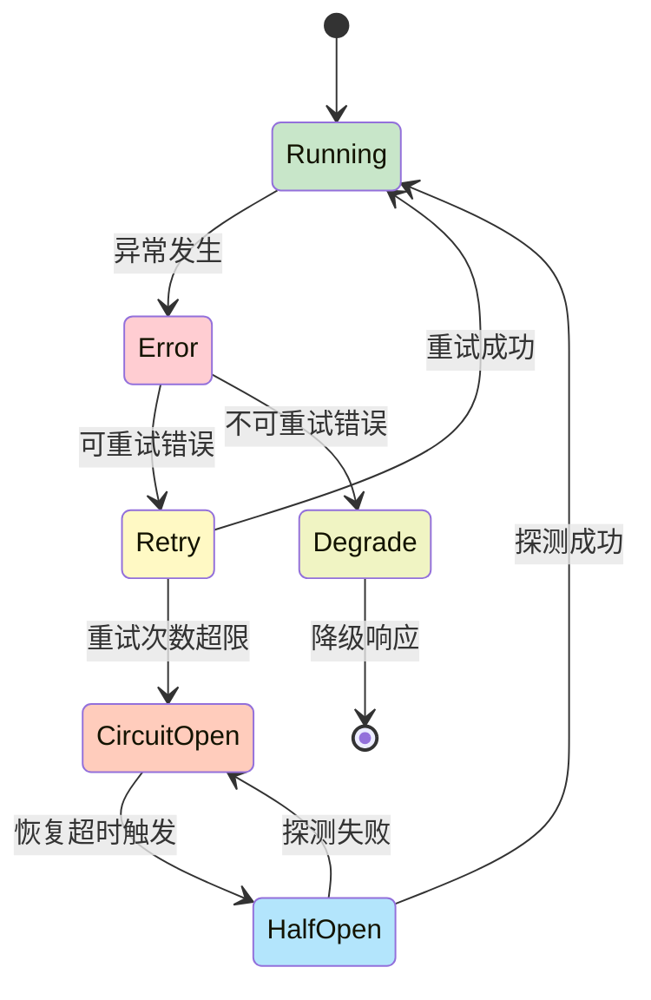

图 4-4：熔断器状态转移图

```python
class CircuitBreakerState(Enum):
    CLOSED = "closed"      # 正常,允许请求
    OPEN = "open"         # 失败过多,拒绝请求
    HALF_OPEN = "half_open"  # 尝试恢复,允许一个请求

class CircuitBreaker:
    """熔断器模式"""

    def __init__(self, failure_threshold: int = 5,
                 recovery_timeout: int = 60):
        self.failure_threshold = failure_threshold
        self.recovery_timeout = recovery_timeout
        self.failure_count = 0
        self.state = CircuitBreakerState.CLOSED
        self.last_failure_time = None

    async def call(self, coro_fn, *args, **kwargs):
        """通过熔断器调用函数"""

        # 检查是否应该打开熔断器
        if self.state == CircuitBreakerState.OPEN:
            if self._should_attempt_recovery():
                self.state = CircuitBreakerState.HALF_OPEN
            else:
                raise Exception("Circuit breaker is OPEN, rejecting request")

        try:
            result = await coro_fn(*args, **kwargs)
            self._on_success()
            return result
        except Exception as e:
            self._on_failure()
            raise

    def _on_success(self):
        """成功后的处理"""
        self.failure_count = 0
        self.state = CircuitBreakerState.CLOSED

    def _on_failure(self):
        """失败后的处理"""
        self.failure_count += 1
        self.last_failure_time = time.time()
        if self.failure_count >= self.failure_threshold:
            self.state = CircuitBreakerState.OPEN

    def _should_attempt_recovery(self) -> bool:
        """判断是否应该尝试恢复"""
        if not self.last_failure_time:
            return False
        return time.time() - self.last_failure_time > self.recovery_timeout
```

### 4.4 本节小结

错误处理是智能体系统可靠性的关键：

1. **分类处理**：不同类型的错误需要不同的恢复策略（重试、降级、熔断）
2. **工具执行错误** 最常见，应该被作为“观察”反馈给 Agent，而不是中断循环
3. **API 错误** 需要重试策略（指数退避、速率限制感知）
4. **输出解析错误** 需要参数验证，防止传递无效的工具调用
5. **上下文溢出** 需要动态压缩和历史管理
6. **熔断器模式** 可以防止级联失败和资源耗尽

## 5. 长时任务的漂移检测与纠正

长时运行的智能体任务容易出现目标漂移现象，即 Agent 在执行过程中逐步偏离原始目标。本节介绍漂移的检测方法、纠正策略以及上下文重置机制。

### 5.1 什么是目标漂移

在长时运行的智能体任务中，存在一个常见问题：Agent 在中间某个环节偏离了原始目标，逐步走向错误的方向。这种现象称为 **目标漂移(Goal Drift)**。

#### 5.1.1 漂移的表现形式

1. **目标遗忘**：Agent 忘记了原始任务，开始追求无关的子目标
2. **目标替代**：Agent 用某个中间目标替代了主目标
3. **范围蠕变**：原始任务范围逐步扩大，导致成本失控
4. **方向漂移**：推理过程偏离最优路径，走向局部最优

#### 5.1.2 漂移的危害

* 任务失败率提高（Agent 最终无法完成原始目标）
* 资源浪费（执行了大量无关的工具调用）
* 用户体验差（Agent 变得不可预测）
* 难以调试（漂移原因通常隐含在推理过程中）

### 5.2 漂移检测机制

**目标漂移的检测与纠正流程：**

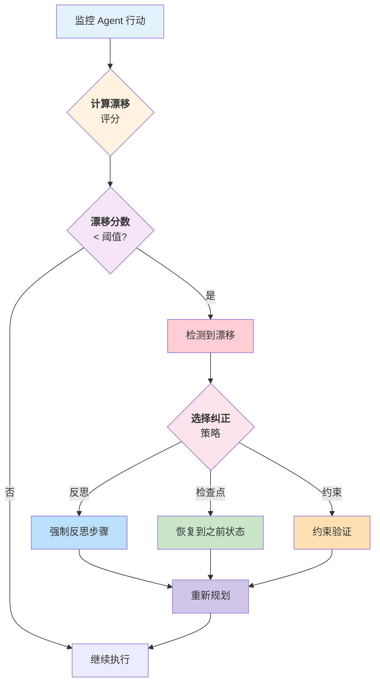

图 4-5：漂移检测与纠正流程

#### 1) 目标与当前行动的相似度检查

通过关键词匹配检查 Agent 是否偏离原始目标：

```python
from dataclasses import dataclass, field
from typing import List, Optional, Tuple
import math

@dataclass
class Goal:
    """任务目标定义"""
    original_goal: str
    main_keywords: List[str] = field(default_factory=list)  # 从目标中提取的关键词
    metric: Optional[str] = None  # 成功指标
    deadline: Optional[int] = None  # 轮数限制

class DriftDetector:
    """漂移检测器"""

    def __init__(self, similarity_threshold: float = 0.3,
                 window_size: int = 5):
        self.similarity_threshold = similarity_threshold
        self.window_size = window_size  # 检查最近 N 轮的行动

    def detect_drift(self, goal: Goal,
                    current_state: AgentState) -> Tuple[bool, float, str]:
        """
        检测是否发生了漂移
        返回: (is_drifted, drift_score, reason)
        """

        recent_actions = self._get_recent_actions(current_state)

        # 计算相似度
        drift_score = self._compute_drift_score(goal, recent_actions)

        if drift_score < self.similarity_threshold:
            # 相似度太低,表示已漂移
            reason = f"Low similarity with goal (score={drift_score:.2f})"
            return True, drift_score, reason

        # 检查其他漂移指标
        is_expanding = self._detect_scope_expansion(goal, current_state)
        if is_expanding:
            return True, drift_score, "Scope expansion detected"

        is_local_optimal = self._detect_local_optimum(goal, current_state)
        if is_local_optimal:
            return True, drift_score, "Stuck in local optimum"

        return False, drift_score, "No drift detected"

    def _get_recent_actions(self, state: AgentState) -> List[str]:
        """提取最近 window_size 轮的工具调用"""
        recent = []
        for msg in state.messages[-self.window_size * 2:]:
            if msg.role == "assistant":
                for tool_use in msg.get_tool_calls():
                    recent.append(f"{tool_use.name}({', '.join(tool_use.input.keys())})")
        return recent

    def _compute_drift_score(self, goal: Goal, actions: List[str]) -> float:
        """计算动作与目标的相关性"""
        if not actions:
            return 0.0

        # 简化版本:检查关键词出现在动作中的频率
        keyword_matches = 0
        for keyword in goal.main_keywords:
            for action in actions:
                if keyword.lower() in action.lower():
                    keyword_matches += 1

        return keyword_matches / len(actions) if actions else 0.0

    def _detect_scope_expansion(self, goal: Goal,
                               state: AgentState) -> bool:
        """检测范围蠕变"""
        # 检查工具调用数量是否超过合理范围
        tool_count = sum(
            len(msg.get_tool_calls())
            for msg in state.messages
            if msg.role == "assistant"
        )

        # 启发式:假设大多数任务不需要 > 50 次工具调用
        if tool_count > 50:
            return True

        return False

    def _detect_local_optimum(self, goal: Goal,
                             state: AgentState) -> bool:
        """检测是否陷入局部最优"""
        # 检查是否重复执行相同的工具调用
        action_counts = {}
        for msg in state.messages[-self.window_size:]:
            if msg.role == "assistant":
                for tool_use in msg.get_tool_calls():
                    key = f"{tool_use.name}({tool_use.input.get('path', '')})"
                    action_counts[key] = action_counts.get(key, 0) + 1

        # 如果有工具被调用了 > 2 次(在小窗口内)
        return max(action_counts.values()) > 2 if action_counts else False
```

#### 2) 语义检测

通过向量相似度检测目标与当前操作的语义偏离：

```python
class SemanticDriftDetector:
    """使用语义相似度的漂移检测"""

    def __init__(self, embedding_model):
        self.embedding_model = embedding_model  # 如 OpenAI embeddings

    async def detect_semantic_drift(
        self,
        original_goal: str,
        recent_messages: List[Message]
    ) -> Tuple[bool, float]:
        """
        使用语义相似度检测漂移
        """

        # 获取原始目标的嵌入
        goal_embedding = await self.embedding_model.embed(original_goal)

        # 获取最近消息内容的嵌入
        recent_text = " ".join(
            msg.get_text() for msg in recent_messages[-10:]
        )
        recent_embedding = await self.embedding_model.embed(recent_text)

        # 计算余弦相似度
        similarity = self._cosine_similarity(goal_embedding, recent_embedding)

        # 相似度 < 0.6 表示可能漂移
        is_drifted = similarity < 0.6

        return is_drifted, similarity

    def _cosine_similarity(self, vec1, vec2) -> float:
        """计算两个向量的余弦相似度"""
        dot_product = sum(a * b for a, b in zip(vec1, vec2))
        norm1 = math.sqrt(sum(a ** 2 for a in vec1))
        norm2 = math.sqrt(sum(b ** 2 for b in vec2))

        if norm1 == 0 or norm2 == 0:
            return 0.0

        return dot_product / (norm1 * norm2)
```

### 5.3 纠正策略

#### 1) 强制反思步骤

OpenClaw 定期在智能体循环中插入强制反思步骤，要求智能体重新评估当前进度：

```python
class ReflectionStep:
    """强制反思步骤"""

    def __init__(self, reflection_interval: int = 5):
        """每 reflection_interval 轮执行一次"""
        self.reflection_interval = reflection_interval

    def should_reflect(self, turn_count: int) -> bool:
        """判断是否应该进行反思"""
        return turn_count > 0 and turn_count % self.reflection_interval == 0

    def build_reflection_prompt(self, goal: Goal,
                               state: AgentState) -> Message:
        """构造反思提示"""
        reflection_prompt = f"""
### Reflection Point

Original goal: {goal.original_goal}

Current progress (last 3 turns):
{self._summarize_recent_progress(state)}

Please answer:
1. Are we still on track to achieve the original goal?
2. Have we deviated from the original objective?
3. Should we adjust our approach?
4. What's the next best action?

Be concise and critical.
"""
        return Message.user(reflection_prompt)

    def _summarize_recent_progress(self, state: AgentState) -> str:
        """摘要最近的进度"""
        summary = []
        for i, msg in enumerate(state.messages[-6:]):
            if msg.role == "assistant":
                text = msg.get_text()[:200]  # 限制长度
                summary.append(f"Turn {i}: {text}")
        return "\n".join(summary)

# 在智能体循环中使用
reflection = ReflectionStep(reflection_interval=5)

async def agent_loop_with_reflection(
    engine: QueryEngine,
    goal: Goal,
    max_turns: int = 30
) -> AgentState:
    """带反思的 智能体循环"""

    state = AgentState(goal=goal)

    for turn in range(max_turns):
        # 正常推理
        response = await engine.infer(state.messages)
        state.add_message(response)

        # 检查是否需要反思
        if reflection.should_reflect(turn):
            print(f"[Turn {turn}] Performing reflection...")
            reflection_prompt = reflection.build_reflection_prompt(goal, state)

            # 让智能体进行反思
            reflection_response = await engine.infer(
                state.messages + [reflection_prompt]
            )

            # 分析反思结果,判断是否需要调整策略
            is_on_track = _analyze_reflection(reflection_response)

            if not is_on_track:
                print(f"[Turn {turn}] Drift detected, correcting course...")
                # 发送纠正提示
                correction_prompt = Message.user(
                    "Your reflection indicates a deviation. "
                    "Please refocus on the original goal and provide a corrected action plan."
                )
                state.add_message(reflection_response)
                state.add_message(correction_prompt)

        # 继续循环
        if not response.has_tool_calls():
            break

    return state

def _analyze_reflection(reflection_response: Message) -> bool:
    """分析反思结果"""
    text = reflection_response.get_text().lower()
    off_track_keywords = ["deviated", "off track", "wrong", "mistake"]
    return not any(kw in text for kw in off_track_keywords)
```

#### 2) 检查点与恢复

使用检查点机制实现恢复功能，快速回到上一个正确状态：

```python
@dataclass
class Checkpoint:
    """检查点:记录某个时刻的完整状态"""
    turn_number: int
    messages: List[Message]
    goal: Goal
    timestamp: datetime
    drift_score: float = 0.0

class CheckpointManager:
    """检查点管理"""

    def __init__(self, checkpoint_dir: str = "./checkpoints"):
        self.checkpoint_dir = checkpoint_dir
        os.makedirs(checkpoint_dir, exist_ok=True)

    def save_checkpoint(self, state: AgentState, goal: Goal) -> str:
        """保存检查点"""
        checkpoint = Checkpoint(
            turn_number=state.current_turn,
            messages=state.messages.copy(),
            goal=goal,
            timestamp=datetime.now(timezone.utc)
        )

        checkpoint_id = f"ckpt_{datetime.now(timezone.utc).strftime('%Y%m%d_%H%M%S')}"
        filepath = os.path.join(self.checkpoint_dir, f"{checkpoint_id}.json")

        with open(filepath, 'w') as f:
            json.dump(
                {
                    "turn_number": checkpoint.turn_number,
                    "messages": [m.to_dict() for m in checkpoint.messages],
                    "goal": goal.original_goal,
                    "timestamp": checkpoint.timestamp.isoformat()
                },
                f,
                indent=2
            )

        return checkpoint_id

    def restore_checkpoint(self, checkpoint_id: str) -> Tuple[AgentState, Goal]:
        """恢复检查点"""
        filepath = os.path.join(self.checkpoint_dir, f"{checkpoint_id}.json")

        with open(filepath, 'r') as f:
            data = json.load(f)

        messages = [Message.from_dict(m) for m in data["messages"]]
        goal = Goal(original_goal=data["goal"])

        state = AgentState(goal=goal)
        state.messages = messages
        state.current_turn = data["turn_number"]

        return state, goal

# 使用
checkpoint_mgr = CheckpointManager()

async def agent_loop_with_checkpointing(
    engine: QueryEngine,
    goal: Goal,
    max_turns: int = 30,
    drift_detector: DriftDetector = None
) -> AgentState:
    """带检查点的 智能体循环,支持漂移恢复"""

    state = AgentState(goal=goal)
    drift_detector = drift_detector or DriftDetector()
    checkpoint_by_turn: Dict[int, str] = {}

    for turn in range(max_turns):
        # 每 5 轮保存一个检查点
        if turn % 5 == 0:
            ckpt_id = checkpoint_mgr.save_checkpoint(state, goal)
            checkpoint_by_turn[turn] = ckpt_id
            print(f"[Checkpoint {ckpt_id}] Saved at turn {turn}")

        # 推理
        response = await engine.infer(state.messages)
        state.add_message(response)

        # 漂移检测
        is_drifted, score, reason = drift_detector.detect_drift(goal, state)

        if is_drifted:
            print(f"[Turn {turn}] Drift detected: {reason}")

            # 回滚到最近的检查点,重新开始
            if turn >= 5:
                previous_turns = [t for t in checkpoint_by_turn if t < turn]
                prev_ckpt_id = checkpoint_by_turn[max(previous_turns)] if previous_turns else None
                try:
                    if prev_ckpt_id:
                        state, goal = checkpoint_mgr.restore_checkpoint(prev_ckpt_id)
                        print(f"[Restored] From checkpoint {prev_ckpt_id}")
                        continue
                except (FileNotFoundError, KeyError):
                    print(f"[Warning] Checkpoint {prev_ckpt_id} unavailable")

            # 如果没有检查点可恢复,发送纠正提示
            correction_msg = Message.user(
                f"The current approach has deviated from the goal. "
                f"Original goal: {goal.original_goal}. "
                f"Please refocus and provide a new action plan."
            )
            state.add_message(correction_msg)

        if not response.has_tool_calls():
            break

    return state
```

### 3. 约束验证

通过约束验证器确保智能体行为在预定界限内：

```python
class ConstraintValidator:
    """约束验证器,确保智能体行为在预定界限内"""

    def __init__(self):
        self.constraints = []

    def add_constraint(self, name: str, check_fn: Callable[[AgentState], bool],
                      violation_msg: str):
        """添加约束条件"""
        self.constraints.append({
            "name": name,
            "check_fn": check_fn,
            "violation_msg": violation_msg
        })

    def validate(self, state: AgentState) -> Tuple[bool, List[str]]:
        """验证所有约束"""
        violations = []
        for constraint in self.constraints:
            if not constraint["check_fn"](state):
                violations.append(constraint["violation_msg"])

        return len(violations) == 0, violations

# 约束验证使用示例
validator = ConstraintValidator()

# 添加约束:工具调用不超过 50 次
validator.add_constraint(
    name="max_tool_calls",
    check_fn=lambda state: sum(
        len(msg.get_tool_calls()) for msg in state.messages
        if msg.role == "assistant"
    ) <= 50,
    violation_msg="Exceeded maximum tool call limit (50)"
)

# 添加约束:消息总长度不超过 1M 字符
validator.add_constraint(
    name="max_message_length",
    check_fn=lambda state: sum(
        len(msg.get_text()) for msg in state.messages
    ) <= 1_000_000,
    violation_msg="Message history exceeded 1M characters"
)

# 添加约束:执行时间不超过 1 小时
validator.add_constraint(
    name="max_execution_time",
    check_fn=lambda state: (datetime.now(timezone.utc) - state.start_time).total_seconds() < 3600,
    violation_msg="Execution time exceeded 1 hour"
)

async def agent_loop_with_constraints(
    engine: QueryEngine,
    goal: Goal,
    validator: ConstraintValidator
) -> AgentState:
    """带约束的 智能体循环"""

    state = AgentState(goal=goal)

    while True:
        # 在每轮推理前验证约束
        is_valid, violations = validator.validate(state)

        if not is_valid:
            print(f"[Constraint Violation] {', '.join(violations)}")
            break

        # 继续推理
        response = await engine.infer(state.messages)
        state.add_message(response)

        if not response.has_tool_calls():
            break

    return state
```

### 5.4 上下文重置

当智能体陷入循环或漂移过远时，传统的漂移纠正方法（反思、修补、约束）可能效果有限。在这种情况下，可以采用一种更激进的方法：**上下文重置**，即清空积累的上下文，从干净状态重新开始。Anthropic 在其 Harness 设计实践中也采用了这一模式，尤其是在处理早期模型的上下文焦虑问题时效果显著。

#### 核心思想

上下文重置是一种“重启”机制，类似于计算机系统的重新启动。当系统积累太多错误状态或陷入深度循环时，与其尝试逐步修复，不如清空并重新开始——但仅保留关键信息。

**关键原则：**

* **清空累积的噪音**：移除所有失败的尝试、错误的推理步骤和无关的中间状态
* **保留关键状态**：将重要信息（原始目标、已验证的进展、关键发现）持久化到外部存储
* **简化上下文窗口**：用清晰的摘要替代冗长的历史记录
* **对比增量压缩**：与其试图压缩所有历史（增量压缩往往失去细节），不如直接丢弃并恢复关键部分

#### 实现流程

以下是上下文重置的完整流程，当检测到陷入循环或深度漂移时执行：

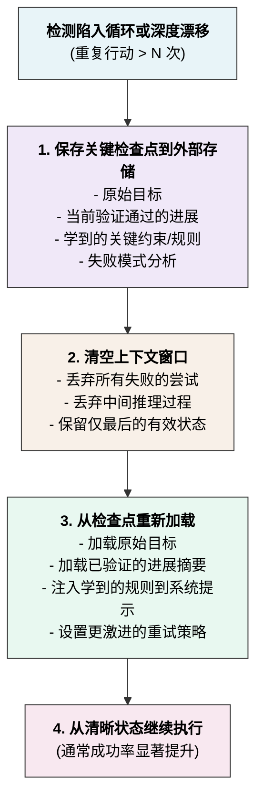

### 伪代码实现

下面是上下文重置管理器的具体实现示例：

```python
class ContextResetManager:
    """上下文重置管理器"""

    def __init__(self, checkpoint_store, max_iterations_before_reset=10):
        self.checkpoint_store = checkpoint_store
        self.max_iterations = max_iterations_before_reset
        self.reset_count = 0

    def should_reset(self, state: AgentState) -> bool:
        """判断是否需要重置上下文"""
        # 检查最近 N 轮是否重复同样的行动(循环)
        recent_actions = self._get_recent_actions(state, window=5)
        if len(set(recent_actions)) < 2:  # 只有 0-1 种不同的行动
            return True

        # 检查消息长度是否过度增长
        total_chars = sum(len(msg.get_text()) for msg in state.messages)
        if total_chars > 100_000:  # 超过 100K 字符
            return True

        return False

    def extract_and_save_checkpoint(self, state: AgentState, goal: Goal):
        """提取关键信息并保存检查点"""
        checkpoint = {
            "timestamp": datetime.now(timezone.utc).isoformat(),
            "original_goal": goal.original_goal,
            "verified_progress": self._extract_verified_progress(state),
            "learned_constraints": self._extract_learned_rules(state),
            "failure_patterns": self._analyze_failure_patterns(state),
        }

        checkpoint_id = self.checkpoint_store.save(checkpoint)
        return checkpoint_id

    def reset_context(
        self, state: AgentState, checkpoint_id: str
    ) -> Tuple[AgentState, str]:
        """重置上下文并从检查点恢复，返回(新状态, 系统提示)"""
        # 加载检查点
        checkpoint = self.checkpoint_store.load(checkpoint_id)

        # 创建新的清晰状态
        new_state = AgentState(goal=Goal(original_goal=checkpoint["original_goal"]))

        # 注入已验证的进展
        progress_msg = Message.assistant([TextBlock(
            text=f"Previous verified progress:\n{checkpoint['verified_progress']}"
        )])
        new_state.add_message(progress_msg)

        # 构造系统提示,包含学到的规则
        system_prompt = self._build_reset_system_prompt(checkpoint)

        # 返回重置后的状态
        return new_state, system_prompt

    def _extract_verified_progress(self, state: AgentState) -> str:
        """从状态中提取已验证完成的部分"""
        # 简化的实现:找到最后一个成功的工具调用
        for msg in reversed(state.messages):
            if msg.has_tool_result() and msg.tool_result_success:
                return f"Successfully: {msg.get_text()[:500]}"
        return "No verified progress yet"

    def _extract_learned_rules(self, state: AgentState) -> List[str]:
        """从失败和纠正过程中提取规则"""
        rules = []
        # 扫描是否有"应该避免"的模式
        for msg in state.messages[-20:]:  # 最近 20 条消息
            if "should not" in msg.get_text().lower():
                rules.append(msg.get_text())
        return rules

    def _analyze_failure_patterns(self, state: AgentState) -> dict:
        """分析常见的失败模式"""
        failure_types = {}
        for msg in state.messages:
            if msg.has_tool_error():
                error_type = self._categorize_error(msg.tool_error)
                failure_types[error_type] = failure_types.get(error_type, 0) + 1
        return failure_types

    def _categorize_error(self, error: str) -> str:
        """按关键词粗略归类错误"""
        for key in ("timeout", "permission", "not found", "rate limit"):
            if key in error.lower():
                return key
        return "other"

    def _build_reset_system_prompt(self, checkpoint: dict) -> str:
        """构造重置后的系统提示,包含学到的约束"""
        prompt = f"""
You are solving: {checkpoint['original_goal']}

Previous verified progress:
{checkpoint['verified_progress']}

Learned constraints:
{chr(10).join(checkpoint['learned_constraints'])}

Common failure patterns to avoid:
{checkpoint['failure_patterns']}

Continue from the verified progress and avoid previous mistakes.
"""
        return prompt.strip()

    def _get_recent_actions(self, state: AgentState, window: int) -> List[str]:
        """获取最近的行动序列"""
        actions = []
        for msg in state.messages[-window * 2:]:
            if msg.role == "assistant" and msg.has_tool_calls():
                for tool in msg.get_tool_calls():
                    actions.append(tool.name)
        return actions

# 上下文重置使用示例
async def agent_loop_with_context_reset(
    engine: QueryEngine,
    goal: Goal,
    max_turns: int = 50
) -> AgentState:
    """带上下文重置的智能体循环"""

    reset_mgr = ContextResetManager(checkpoint_store=CheckpointManager())
    state = AgentState(goal=goal)

    for turn in range(max_turns):
        # 检查是否需要重置
        if reset_mgr.should_reset(state):
            print(f"[Turn {turn}] Detecting loop/deep drift, performing context reset...")

            # 保存关键信息
            ckpt_id = reset_mgr.extract_and_save_checkpoint(state, goal)

            # 重置上下文
            state, new_prompt = reset_mgr.reset_context(state, ckpt_id)
            print(f"[Reset] Context cleared, restarting from checkpoint {ckpt_id}")

        # 正常推理
        response = await engine.infer(state.messages)
        state.add_message(response)

        if not response.has_tool_calls():
            break

    return state
```

#### 何时使用上下文重置

* **循环检测**：同样的工具调用重复超过 3-5 次
* **深度漂移**：即使多轮纠正也无法回到轨道
* **上下文膨胀**：消息历史超过可用上下文窗口的 70%
* **学习瓶颈**：智能体无法从之前的错误中学习

### 5.5 本节小结

长时任务的漂移检测与纠正是智能体系统高可靠性的必要条件：

1. **漂移检测** 有多种方式：基于关键词的启发式、语义相似度、行动重复检测
2. **强制反思步骤** 让智能体定期评估进度，OpenClaw 通过在推理中插入反思提示实现
3. **检查点机制** 允许任务在漂移时恢复到之前的正确状态
4. **约束验证** 在任务执行前确保遵守硬约束（Token 数、时间限制、工具调用数）
5. **上下文重置** 当其他方法失效时，清空积累的上下文并从关键检查点重新开始
6. 这些机制相互配合，构成了可靠的漂移检测与纠正体系

## 6. Token 预算与上下文动态管理

在有限的上下文窗口内运行长时任务，需要对 Token 使用进行精细管理。本节介绍 Token 预算的组成、动态管理策略，以及三级预算控制体系。

## 6.1 Token 预算的关键概念

在 LLM 智能体系统中，每个 API 调用都有 Token 成本和延迟成本。在有限的上下文窗口内，需要精细的 Token 预算管理，确保：

1. **不超过上下文限制**：防止 API 调用失败
2. **保持可用余额**：为推理输出预留空间
3. **最大化有效上下文**：在有限 Token 内承载最多有用信息
4. **支持长对话**：通过动态压缩和历史管理支持跨越多轮的对话

**Token 预算分配结构：**

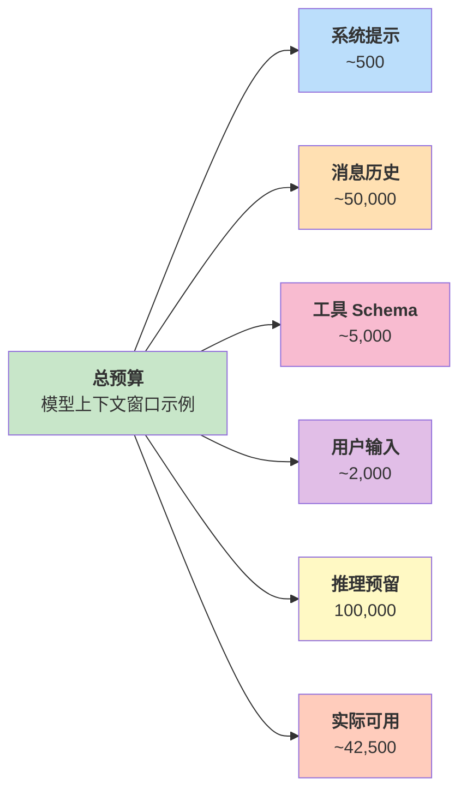

图 4-6：Token 预算分配图

#### Token 预算的组成

Token 预算的详细构成情况如下所示：

| 预算项目           | 分配        | 说明                    |
| -------------- | --------- | --------------------- |
| **总 Token 预算** | **按模型配置** | 模型上下文窗口，实际值随模型和账号权限变化 |
| 系统提示词          | \~500     | 系统级指令                 |
| 消息历史           | \~50,000  | 上下文消息                 |
| 工具 Schema      | \~5,000   | 工具定义                  |
| 用户输入           | \~2,000   | 当前查询                  |
| 可用预留           | \~142,500 | **总计**                |
|   推理预留         | 100,000   | 思考过程                  |
|   实际可用         | \~42,500  | 可用输出空间                |

#### Token 计数的准确性

使用 Token 计数器精确追踪 Token 使用情况：

```python
class TokenCounter:
    """Token计数器"""

    def __init__(self, model_name: str = "claude-sonnet-4-6"):
        self.model_name = model_name
        # 可以使用 tiktoken (OpenAI) 或 Claude 官方 token counting API
        self._initialize_counter()

    def _initialize_counter(self):
        """初始化计数器"""
        # 简化版本:使用粗略估计
        # 实际应使用对应供应商的官方计数 API
        pass

    def count_text_tokens(self, text: str) -> int:
        """计算文本的Token数"""
        from anthropic import Anthropic
        client = Anthropic()
        response = client.messages.count_tokens(
            model=self.model_name,
            messages=[{"role": "user", "content": text}]
        )
        return response.input_tokens

    def count_message_tokens(self, message: Message) -> int:
        """计算消息的Token数"""
        return self.count_text_tokens(message.get_text())

    def count_messages_tokens(self, messages: List[Message]) -> int:
        """计算多个消息的总Token数"""
        # 可以一次性计数,效率更高
        combined_text = "\n".join(msg.get_text() for msg in messages)
        return self.count_text_tokens(combined_text)

    def count_tool_schema_tokens(self, tools: List[Dict]) -> int:
        """计算工具 Schema 定义的Token数"""
        schema_json = json.dumps(tools, indent=2)
        return self.count_text_tokens(schema_json)
```

## 6.2 Token 预算管理策略

#### 6.2.1 前向估计

在发送请求前估计可能的 Token 消耗：

```python
class TokenBudgetManager:
    """Token预算管理器"""

    def __init__(self, total_budget: int = 200000,
                 safety_margin: int = 10000):
        self.total_budget = total_budget
        self.safety_margin = safety_margin  # 10k 的安全裕度
        self.token_counter = TokenCounter()

    def get_available_budget(self, current_state: AgentState) -> int:
        """计算当前可用的Token预算"""
        used_tokens = self._estimate_current_usage(current_state)
        available = self.total_budget - used_tokens - self.safety_margin
        return max(0, available)

    def _estimate_current_usage(self, state: AgentState) -> int:
        """估计当前的Token使用"""
        system_tokens = 500  # 系统提示词
        history_tokens = self.token_counter.count_messages_tokens(state.messages)
        tools_tokens = 5000  # 工具 Schema(缓存)
        return system_tokens + history_tokens + tools_tokens

    def can_continue_inference(self, state: AgentState,
                              expected_output_tokens: int = 2000) -> bool:
        """检查是否还有足够的预算继续推理"""
        available = self.get_available_budget(state)
        return available >= expected_output_tokens

    def plan_inference(self, state: AgentState) -> Dict[str, int]:
        """规划推理的Token分配"""
        available = self.get_available_budget(state)

        return {
            "available_budget": available,
            "recommended_max_tokens": min(available, 4000),
            "warning_threshold": available * 0.2
        }

# Token预算管理使用示例
budget_mgr = TokenBudgetManager()

async def infer_with_budget_check(engine: QueryEngine,
                                 state: AgentState) -> Optional[Message]:
    """推理前检查预算"""

    if not budget_mgr.can_continue_inference(state):
        print(f"Token budget exhausted. Current usage: "
              f"{budget_mgr._estimate_current_usage(state)} / {budget_mgr.total_budget}")
        return None

    plan = budget_mgr.plan_inference(state)
    print(f"[Budget] Available: {plan['available_budget']}, "
          f"Max tokens: {plan['recommended_max_tokens']}")

    response = await engine.infer(
        state.messages,
        max_tokens=plan['recommended_max_tokens']
    )

    return response
```

#### 6.2.2 自动压缩

当 Token 使用接近阈值时，自动压缩历史：

```python
class AutoCompactor:
    """自动压缩器:当Token使用超过阈值时触发压缩"""

    def __init__(self, compression_threshold: float = 0.8):
        """
        compression_threshold: 触发压缩的百分比
        例如 0.8 表示当使用到总预算的 80% 时触发
        """
        self.compression_threshold = compression_threshold
        self.token_counter = TokenCounter()

    def should_compact(self, budget_mgr: TokenBudgetManager,
                       state: AgentState) -> bool:
        """判断是否应该进行压缩"""
        used_tokens = budget_mgr._estimate_current_usage(state)
        threshold_tokens = budget_mgr.total_budget * self.compression_threshold
        return used_tokens > threshold_tokens

    def compact_messages(self, messages: List[Message],
                        target_token_count: int,
                        summarizer = None) -> List[Message]:
        """压缩消息历史以满足Token目标"""

        current_tokens = self.token_counter.count_messages_tokens(messages)

        if current_tokens <= target_token_count:
            return messages  # 无需压缩

        print(f"[Compacting] {current_tokens} tokens -> {target_token_count} tokens")

        # 策略 1:移除早期消息
        compacted = list(messages)
        while compacted and self.token_counter.count_messages_tokens(compacted) > target_token_count:
            # 移除最早的消息
            removed = compacted.pop(0)
            print(f"  Removed: {removed.get_text()[:80]}...")

        return compacted

    def compact_with_summarization(
        self,
        messages: List[Message],
        target_token_count: int,
        summarizer
    ) -> List[Message]:
        """使用摘要进行压缩"""

        # 首先尝试移除消息
        compacted = self.compact_messages(messages, target_token_count)

        # 如果还是太大,使用摘要压缩
        if self.token_counter.count_messages_tokens(compacted) > target_token_count:
            compacted = self._apply_summarization(compacted, summarizer, target_token_count)

        return compacted

    def _apply_summarization(self, messages: List[Message],
                            summarizer, target_tokens: int) -> List[Message]:
        """应用摘要压缩"""
        result = []

        for message in messages:
            if message.role == "assistant" and len(message.get_text()) > 500:
                # 摘要长响应
                summary = summarizer(
                    message.get_text(),
                    max_length=int(len(message.get_text()) * 0.5)
                )
                summary_msg = Message.assistant([TextBlock(text=summary)])
                result.append(summary_msg)
            else:
                result.append(message)

        return result

# 自动压缩使用示例
compactor = AutoCompactor(compression_threshold=0.8)
budget_mgr = TokenBudgetManager()

async def agent_loop_with_auto_compaction(engine: QueryEngine,
                                         state: AgentState):
    """智能体循环,带自动压缩"""

    while True:
        # 检查是否需要压缩
        if compactor.should_compact(budget_mgr, state):
            print(f"[Turn {state.current_turn}] Triggering auto-compaction...")

            # 压缩到预算的 50%
            target_tokens = budget_mgr.total_budget * 0.5
            state.messages = compactor.compact_messages(
                state.messages,
                int(target_tokens)
            )

            print(f"  Compacted to {budget_mgr._estimate_current_usage(state)} tokens")

        # 继续推理
        if not budget_mgr.can_continue_inference(state):
            print(f"Cannot continue: insufficient token budget")
            break

        response = await engine.infer(state.messages)
        state.add_message(response)

        if not response.has_tool_calls():
            break
```

#### 6.2.3 历史片段化

选择性地移除消息，保留最重要的部分：

```python
class HistorySnipper:
    """历史片段化:选择性保留消息"""

    def snip_history(self, messages: List[Message],
                    target_count: int = 20) -> List[Message]:
        """
        保留最重要的消息,进行片段化:
        1. 保留最后 N 条消息(最近的对话)
        2. 保留第一条消息(初始上下文)
        3. 移除中间的消息
        """

        if len(messages) <= target_count:
            return messages

        # 保留最后 target_count 条消息
        recent_messages = messages[-target_count:]

        # 保留第一条消息(通常是系统消息或初始用户输入)
        if messages and messages[0] not in recent_messages:
            result = [messages[0]] + recent_messages
        else:
            result = recent_messages

        return result

    def snip_by_importance(self,
                          messages: List[Message],
                          target_count: int = 20,
                          importance_scorer = None) -> List[Message]:
        """
        基于重要性评分进行片段化
        importance_scorer: 返回消息重要性分数(0-1)的函数
        """

        if len(messages) <= target_count:
            return messages

        # 计算每条消息的重要性
        scores = []
        for i, msg in enumerate(messages):
            if importance_scorer:
                score = importance_scorer(msg, i, len(messages))
            else:
                score = self._default_importance_score(msg, i, len(messages))
            scores.append((i, score, msg))

        # 选择重要性最高的 target_count 条消息
        selected = sorted(scores, key=lambda x: x[1], reverse=True)[:target_count]

        # 按原始顺序重新排列
        selected.sort(key=lambda x: x[0])

        return [msg for _, _, msg in selected]

    def _default_importance_score(self, msg: Message, index: int,
                                 total_count: int) -> float:
        """默认的重要性评分"""
        # 最后的消息最重要(权重 0.5)
        recency_score = index / max(total_count - 1, 1) * 0.5

        # 包含工具调用或长文本的消息较重要(权重 0.3)
        if msg.role == "assistant" and msg.has_tool_calls():
            content_score = 0.3
        else:
            content_score = (len(msg.get_text()) / 1000) * 0.15

        # 第一条消息很重要(权重 0.2)
        if index == 0:
            initial_score = 0.2
        else:
            initial_score = 0

        return recency_score + content_score + initial_score
```

### 6.3 Claude Code 的模型窗口阈值警告

Claude Code 在构建消息时采用分层的 Token 预算管理。注意：Anthropic 官方[上下文窗口说明](https://platform.claude.com/docs/en/build-with-claude/context-windows)中既有 200K 级模型，也有 Claude Opus 5、Sonnet 5、Fable 5 与 Opus 4.8/4.7/4.6、Sonnet 4.6 等 1M 级模型（1M 是这些模型的默认窗口，不需要 beta header）；下面的 200K 是保守示例，不应硬编码为所有 Claude 或 Claude Code 场景的上限。

```python
class AdaptiveContextManager:
    """自适应上下文管理"""

    def __init__(self, model_name: str = "claude-sonnet-4-6",
                 total_budget: int = 200_000):
        self.model_name = model_name
        self.total_budget = total_budget
        self.safety_margin = 10000
        self.token_counter = TokenCounter()

    def build_messages_with_budget(self, original_messages: List[Message],
                                   tools: List[Dict]) -> List[Message]:
        """构建消息,考虑Token预算"""

        system_tokens = 500
        tools_tokens = self.token_counter.count_tool_schema_tokens(tools)
        reserved_output = 4000  # 为输出预留空间

        available_for_messages = (
            self.total_budget -
            system_tokens -
            tools_tokens -
            reserved_output -
            self.safety_margin
        )

        # 估计当前消息的Token数
        current_tokens = self.token_counter.count_messages_tokens(original_messages)

        if current_tokens > available_for_messages:
            # 超出预算,需要压缩
            print(f"[Warning] Messages exceed budget: "
                  f"{current_tokens} > {available_for_messages}")

            # 发出警告
            self._emit_warning(current_tokens, available_for_messages)

            # 进行压缩
            return self._compress_messages_smart(
                original_messages,
                available_for_messages
            )

        return original_messages

    def _emit_warning(self, current: int, available: int):
        """发出Token预算警告"""
        usage_percent = (current / self.total_budget) * 100
        print(f"[Token Budget Warning] {usage_percent:.1f}% used "
              f"({current}/{self.total_budget} tokens)")

    def _compress_messages_smart(self, messages: List[Message],
                                target_tokens: int) -> List[Message]:
        """智能压缩消息"""

        snipper = HistorySnipper()
        compactor = AutoCompactor()

        # 首先尝试片段化
        snipped = snipper.snip_by_importance(messages, target_count=30)

        if self.token_counter.count_messages_tokens(snipped) <= target_tokens:
            return snipped

        # 如果片段化还不够,进行压缩
        return compactor.compact_messages(snipped, target_tokens)
```

### 6.4 OpenClaw 启发的压缩前记忆刷写

OpenClaw 的做法是在正式压缩前，先让智能体把关键事实写入长期记忆，再折叠历史。注意：官方 [Compaction 文档](https://docs.openclaw.ai/concepts/compaction)记录的触发条件是“会话接近上下文上限，或模型返回上下文溢出错误”，并说明“压缩前 OpenClaw 会自动提醒智能体把重要笔记写入记忆文件”；[会话管理与压缩参考](https://docs.openclaw.ai/reference/session-management-compaction)进一步给出“当前上下文超过模型窗口减去内置预留余量（留给提示词与下一次模型输出）”。两者都是绝对 Token 口径，官方并未给出百分比阈值。下面示例中的 0.7 是本书为便于演示采用的简化默认值：

```python
class OpenClawContextManager:
    """OpenClaw 风格的上下文管理"""

    def __init__(self, total_budget: int = 200_000):
        self.total_budget = total_budget
        self.trigger_threshold = 0.7  # 本书示例默认值,真实 OpenClaw 按绝对预留余量触发

    def should_trigger_consolidation(self, current_tokens: int) -> bool:
        """检查是否应该触发记忆整合(压缩)"""
        threshold = self.total_budget * self.trigger_threshold
        return current_tokens > threshold

    def consolidate_memory(self, session_id: str,
                          state: AgentState,
                          memory_store) -> AgentState:
        """
        触发记忆整合:
        1. 摘要当前会话中的重要事实
        2. 更新长期记忆
        3. 清理当前会话的历史
        """

        # 1. 识别关键事实
        key_facts = self._extract_key_facts(state.messages)

        # 2. 保存到长期记忆
        memory_store.add_facts(session_id, key_facts)

        # 3. 清理消息历史
        # 只保留最后几条消息和初始上下文
        cleaned_messages = [
            state.messages[0],  # 保留初始消息
            *state.messages[-5:]  # 保留最后 5 条
        ]

        # 4. 创建摘要消息
        summary = self._create_summary_message(key_facts)
        cleaned_messages.insert(1, summary)

        state.messages = cleaned_messages
        return state

    def _extract_key_facts(self, messages: List[Message]) -> List[str]:
        """从消息中提取关键事实"""
        facts = []

        for msg in messages:
            if msg.role == "assistant":
                text = msg.get_text()
                # 简化版本:提取包含特定关键词的句子
                sentences = text.split('.')
                for sentence in sentences:
                    if any(keyword in sentence for keyword in
                           ['found', 'result', 'error', 'success']):
                        facts.append(sentence.strip())

        return facts[:10]  # 最多 10 个事实

    def _create_summary_message(self, facts: List[str]) -> Message:
        """创建摘要消息"""
        summary_text = "## Session Summary\n\n"
        for i, fact in enumerate(facts, 1):
            summary_text += f"{i}. {fact}\n"

        return Message.assistant([TextBlock(text=summary_text)])
```

### 6.5 三级预算控制体系

生产级系统仅靠单次请求的 Token 预算管理远远不够。成熟的 Harness 需要建立 **三级预算控制体系**，从单次调用到全局账期逐层约束：

| 控制层级              | 控制粒度             | 典型阈值                           | 超限策略       |
| ----------------- | ---------------- | ------------------------------ | ---------- |
| **Per-Request**   | 单次 API 调用        | 4k-100k output tokens          | 截断输出、降级模型  |
| **Per-Task**      | 一个完整任务（可能包含多轮循环） | 50-200 次 API 调用 / 累计 1M tokens | 强制总结、终止循环  |
| **Per-Day/Month** | 账期级全局预算          | $50/天、$1000/月                  | 排队、降级、拒绝服务 |

```python
class ThreeTierBudgetController:
    """三级预算控制器"""

    def __init__(self, config: dict):
        # 第一级:单次请求
        self.per_request_max_tokens = config.get("per_request_max_tokens", 4096)

        # 第二级:任务级
        self.per_task_max_calls = config.get("per_task_max_calls", 100)
        # 跨多次 API 调用累计，不代表单次请求上下文窗口。
        self.per_task_max_tokens = config.get("per_task_max_tokens", 1_000_000)

        # 第三级:账期级
        self.daily_budget_usd = config.get("daily_budget_usd", 50.0)
        self.monthly_budget_usd = config.get("monthly_budget_usd", 1000.0)

        # 运行时计数器
        self._task_call_count = 0
        self._task_token_count = 0
        self._daily_cost_usd = 0.0

    def check_budget(self, estimated_tokens: int) -> dict:
        """在每次 API 调用前检查三级预算"""

        # 第一级:请求级检查
        request_tokens = min(estimated_tokens, self.per_request_max_tokens)

        # 第二级:任务级检查
        if self._task_call_count >= self.per_task_max_calls:
            return {"allowed": False, "reason": "task_call_limit",
                    "action": "force_summarize_and_stop"}

        if self._task_token_count + request_tokens > self.per_task_max_tokens:
            return {"allowed": False, "reason": "task_token_limit",
                    "action": "force_summarize_and_stop"}

        # 第三级:账期级检查
        estimated_cost = self._estimate_cost(request_tokens)
        if self._daily_cost_usd + estimated_cost > self.daily_budget_usd:
            return {"allowed": False, "reason": "daily_budget_exceeded",
                    "action": "queue_or_downgrade"}

        return {"allowed": True, "max_tokens": request_tokens}

    def record_usage(self, input_tokens: int, output_tokens: int,
                     cost_usd: float):
        """记录实际使用量"""
        self._task_call_count += 1
        self._task_token_count += input_tokens + output_tokens
        self._daily_cost_usd += cost_usd

    def _estimate_cost(self, tokens: int) -> float:
        """估算成本(简化版)"""
        return tokens * 3.0 / 1_000_000  # $3/M tokens 近似值
```

三级预算控制与前面介绍的多模型路由（详见 10.3.4 节）协同使用效果更佳：当账期预算紧张时，路由器可以自动将更多请求降级到低成本模型，在不中断服务的前提下控制支出。

### 6.6 本节小结

Token 预算管理是长时智能体任务的关键：

1. **前向估计** 在发送请求前预估 Token 使用，防止超限
2. **自动压缩** 在 Token 使用接近阈值时触发，保留最重要的信息
3. **历史片段化** 选择性保留消息，平衡信息完整性与 Token 成本
4. **Claude Code 的模型窗口阈值警告** 提前感知预算压力，主动调整策略
5. **压缩前的记忆刷写** 先把关键事实落盘再折叠历史，降低有损压缩的风险；触发线应按绝对预留余量计算，本书示例中的 70% 只是简化默认值
6. **三级预算控制** 从单次请求到账期级逐层约束，防止成本失控

这些策略相互配合，使得智能体能够在有限的上下文窗口内处理长时任务，同时将成本控制在可预测的范围内。


## 7. 实战：MiniHarness 运行时实现

本节使用 Python 实现一个完整、可运行的 MiniHarness 运行时引擎。涵盖智能体循环、消息系统、事件处理、工具执行和状态管理等核心概念。

完整代码参见 lab/mini\_harness/runtime/。

### 7.1 设计决策：消息和状态模型

“消息”是 MiniHarness 的核心抽象。系统使用分块(block)结构组织内容，允许混合文本和工具调用。

关键设计点：

* **TextBlock**：“纯文本内容，支持多块拼接”
* **ToolUseBlock**：“智能体要求执行的工具调用，包含输入参数”
* **ToolResultBlock**：“工具执行结果，包括成功/失败状态”
* **Message**：“消息容器，role 标识发送者，content 是块数组”
* **AgentState**：“会话状态跟踪，维护消息历史和轮次计数”

参考实现片段（models.py；实际代码中该类名为 `RuntimeMessage`，书中为行文简洁记作 `Message`）：

```python
@dataclass
class Message:
    role: str
    content: List[Any]

    @classmethod
    def user(cls, text: str) -> "Message":
        return cls(role="user", content=[TextBlock(text=text)])

    def has_tool_calls(self) -> bool:
        return any(isinstance(block, ToolUseBlock)
                  for block in self.content)

    def get_tool_calls(self) -> List[ToolUseBlock]:
        return [b for b in self.content
                if isinstance(b, ToolUseBlock)]
```

### 7.2 事件驱动架构

系统通过“异步事件流”向外部通知执行阶段。每个重要事件都包含 metadata，便于监控和日志记录。

事件类型：

* AGENT\_START, AGENT\_END：“会话生命周期”
* TURN\_START, TURN\_END：“每个智能体循环轮次”
* TEXT\_RESPONSE:“智能体生成的文本内容”
* TOOL\_EXECUTE, TOOL\_RESULT:“工具调用和结果”
* ERROR:“执行异常”

参考片段(events.py)：

```python
class EventType(Enum):
    AGENT_START = "agent_start"
    TURN_START = "turn_start"
    TOOL_EXECUTE = "tool_execute"
    # ... 更多类型

@dataclass
class Event:
    event_type: EventType
    timestamp: datetime = field(default_factory=lambda: datetime.now(timezone.utc))
    metadata: Dict[str, Any] = field(default_factory=dict)

    def to_json(self) -> str:
        return json.dumps({
            "event_type": self.event_type.value,
            "timestamp": self.timestamp.isoformat(),
            "metadata": self.metadata
        })
```

### 7.3 智能体循环核心逻辑

运行时引擎(RuntimeEngine)实现了推理、工具执行、反馈融合的完整循环。

循环流程：

1. **初始化**：创建会话，输入用户提示
2. **推理轮次**（最多 max\_turns）
   * 调用 \_infer() 获取智能体响应
   * 如果包含工具调用，执行并收集结果
   * 将结果添加到状态，继续下一轮
   * 如果无工具调用，循环结束
3. **关闭**：生成 AGENT\_END 事件

关键设计：” **Token 预算管理** “（简化实现中为常量 4000），实际系统需计算累积 Token 数并在超出时截断历史。

参考片段(engine.py)：

```python
async def run(self, user_input: str) -> AsyncIterator[Event]:
    yield AgentStartEvent(metadata={"user_input": user_input})
    session_id = f"sess_{uuid.uuid4().hex[:8]}"
    state = AgentState(session_id=session_id)
    state.add_message(Message.user(user_input))

    for turn in range(self.max_turns):
        yield TurnStartEvent(metadata={"turn_number": turn})
        response = await self._infer(state)

        if response is None:
            yield ErrorEvent(metadata={"error": "Inference failed"})
            break

        state.add_message(response)
        tool_calls = response.get_tool_calls()

        if tool_calls:
            for tool_use in tool_calls:
                result = await self._execute_tool(tool_use)
                state.add_message(Message.tool_result(result))
        else:
            break

        yield TurnEndEvent(metadata={"turn_number": turn})

    yield AgentEndEvent(metadata={"session_id": session_id})
```

### 7.4 工具执行和错误处理

\_execute\_tool() 方法从注册表中查找工具并调用。所有异常都被捕获并转换为 ToolResultBlock，确保循环不中断。

设计原则：“ **故障隔离** ”——单个工具失败不应导致整个会话失败。

```python
async def _execute_tool(self, tool_use: ToolUseBlock) -> ToolResultBlock:
    tool = self.tool_registry.get(tool_use.name)
    if not tool:
        return ToolResultBlock(
            tool_use_id=tool_use.id,
            content=f"Tool not found",
            is_error=True,
            error_type="ToolNotFoundError"
        )

    try:
        result = await tool.call(tool_use.input)
        # Tool.call() 返回 ToolResult 数据类（success/content/execution_time/error_type），
        # 需要解包成 ToolResultBlock 期望的字符串 content + is_error 字段。
        if hasattr(result, "success") and hasattr(result, "content"):
            return ToolResultBlock(
                tool_use_id=tool_use.id,
                content=str(result.content),
                is_error=not result.success,
                error_type=getattr(result, "error_type", None),
            )
        # 向后兼容：若工具直接返回字符串，按成功处理
        return ToolResultBlock(
            tool_use_id=tool_use.id,
            content=str(result),
            is_error=False
        )
    except Exception as e:
        return ToolResultBlock(
            tool_use_id=tool_use.id,
            content=str(e),
            is_error=True,
            error_type=type(e).__name__
        )
```

### 7.5 应用组合入口与工具调用恢复

`RuntimeEngine` 保留为便于阅读的最小事件循环；可运行示例 `lab/examples/simple_agent.py` 则使用 `lab/mini_harness/application.py` 的 `HarnessApplication` 作为组合入口。这个入口把原先容易散落在调用方的能力固定为同一顺序：上下文组装 → 权限/护栏 → 检查点 → 可恢复错误重试 → 本地或 MCP 工具 → 完成事件。

```python
from mini_harness.application import HarnessApplication
from mini_harness.runtime.checkpoint import JSONCheckpointStore

application = HarnessApplication(
    tool_registry=registry,
    mcp_registry=mcp_registry,
    context_assembler=context_assembler,
    secure_executor=secure_executor,
    checkpoint_store=JSONCheckpointStore("runtime-checkpoints.json"),
)

result = await application.execute_tool(
    "file_read",
    {"path": "README.md"},
    user_id="user-1",
    session_id="session-1",
    call_id="tool-call-1",
)
```

检查点以 `session_id + call_id` 标识一次调用，显式保存 `user_id` 所代表的 principal；参数指纹也包含该 principal、工具名和参数。每次调用都先重新经过权限与护栏，再原子认领检查点，因此策略已改为 `DENY` 的请求无法读取旧结果。只有获得随机 Lease 的 Owner 能执行和完成调用，其他并发请求只能回放已完成结果，或对 `started` 状态明确拒绝重放。恢复时：

* `completed`：仅向同一 principal 返回已经保存的结果，不再次调用工具；
* `started`：拒绝自动重放；这既可能表示当前 Owner 正在执行，也可能表示进程在副作用完成后、结果落盘前崩溃；
* 同一调用 ID 被其他 principal 使用，或参数指纹不同：抛出冲突错误。

JSON 存储对同一绝对路径的本进程实例共享线程锁，并使用同目录临时文件、`fsync` 和原子替换，把文件权限设置为仅当前用户可读写。它解决任务/线程并发和本机进程重启后的重复调度问题，但不是跨进程协调器，也不能让远端副作用与本地文件形成分布式事务；多进程部署应改用带条件写入或事务的存储，写操作仍应向服务端传递幂等键。

### 7.6 主要特性总结

1. **消息块架构**：“灵活组合文本和工具”，支持混合内容
2. **异步事件流**：“非阻塞监控”，易于集成日志、指标收集
3. **会话状态隔离**：“独立的 AgentState”，支持并发运行多个会话
4. **工具注册表**：“动态工具加载”，可在运行时增删工具
5. **故障恢复**：“优雅降级”，工具失败不影响会话继续

### 7.7 扩展方向

生产系统需补充：

* **真实 LLM 集成**：“替换 \_infer() 的模拟实现”
* **上下文窗口管理**：“动态截断旧消息以保持在 Token 预算内”
* **会话级持久化**：当前已实现工具调用检查点；完整消息历史、模型轮次和 AgentState 恢复仍需持久化
* **丰富的工具库**：“文件操作、网络、数据库等”
* **高级特性**：“意图分类、工具选择器优化、多智能体协调”

### 7.8 本节小结

MiniHarness 展示了生产级智能体运行时的关键架构模式：

1. **分层设计**：“模型层、事件层、工具层、引擎层”
2. **异步驱动**：“Python asyncio 实现高效并发”
3. **事件中心**：“所有状态变化都生成可观测的事件”
4. **容错设计**：“隔离失败，保证系统稳定”

这些原则直接应用于 Claude Code 和 OpenClaw 等生产系统。参考 lab/mini\_harness/runtime/ 查看完整实现代码。

## 8. 实时控制平面

在长时运行的 Agent 系统中，需要一套实时控制机制，使得外部系统（如 UI、监控服务、用户干预系统）能够动态地暂停、恢复、修改和终止 Agent 执行，同时保持系统的正确性和一致性。本节介绍实时控制平面的架构、关键组件和实现模式。

**设计演示说明**：本节涵盖的详细控制平面实现（CheckpointManager、ActionStream、InterventionHandler 等）为设计参考示例。Lab 已在 `runtime/checkpoint.py` 实现工具调用结果的恢复与重复副作用保护，但它不是完整 AgentState 快照；暂停/恢复、ActionStream 和干预点仍需按本节设计扩展。

### 8.1 控制平面架构

实时控制平面将 Agent 系统分为 **数据平面** 和 **控制平面** 两部分：

* **数据平面**：Agent 的主循环，负责执行任务、调用工具、生成结果
* **控制平面**：暴露的外部接口，接收暂停、恢复、干预等控制命令，管理 Agent 的执行状态

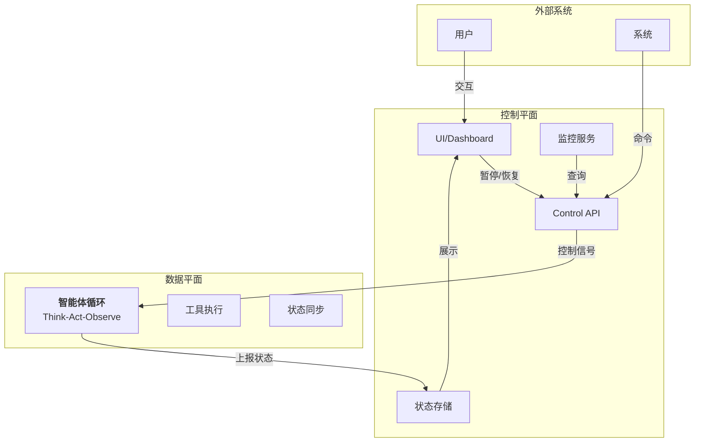

控制平面通过以下机制与数据平面通信：

1. **控制队列**：Agent 周期性检查控制队列中的指令
2. **状态检查点**：Agent 在安全位置（如工具调用前后）暂停和检查控制信号
3. **异步回调**：控制命令通过回调机制通知 Agent 做出响应
4. **检查点存储**：暂停时保存 Agent 状态，便于后续恢复

### 8.2 暂停与恢复机制

#### 状态序列化与检查点创建

Agent 在运行过程中需要在特定的安全点创建检查点，以便暂停和恢复执行：

```python
# core/control_plane.py
from dataclasses import dataclass, field
from typing import Any, Dict, Optional, List
from enum import Enum
from datetime import datetime
import asyncio
import json
import uuid

class AgentState(Enum):
    """Agent执行状态"""
    RUNNING = "running"
    PAUSED = "paused"
    RESUMING = "resuming"
    COMPLETED = "completed"
    FAILED = "failed"
    TERMINATED = "terminated"

@dataclass
class Checkpoint:
    """检查点:包含Agent的完整可恢复状态"""
    checkpoint_id: str
    agent_state: Dict[str, Any]  # Agent的内部状态快照
    message_history: List[Dict[str, Any]]  # 完整消息历史
    tool_context: Dict[str, Any]  # 当前工具调用上下文
    execution_context: Dict[str, Any]  # 任务执行上下文
    timestamp: datetime
    iteration: int
    safe_point: str  # 检查点所在的安全位置标识
    metadata: Dict[str, Any] = field(default_factory=dict)

    def serialize(self) -> bytes:
        """序列化检查点为 JSON 字节，避免反序列化执行任意代码"""
        payload = {
            "checkpoint_id": self.checkpoint_id,
            "agent_state": self.agent_state,
            "message_history": self.message_history,
            "tool_context": self.tool_context,
            "execution_context": self.execution_context,
            "timestamp": self.timestamp.isoformat(),
            "iteration": self.iteration,
            "safe_point": self.safe_point,
            "metadata": self.metadata,
        }
        return json.dumps(payload, ensure_ascii=False).encode("utf-8")

    @classmethod
    def deserialize(cls, data: bytes) -> 'Checkpoint':
        """从 JSON 字节恢复检查点；只接受显式字段"""
        payload = json.loads(data.decode("utf-8"))
        return cls(
            checkpoint_id=payload["checkpoint_id"],
            agent_state=payload["agent_state"],
            message_history=payload["message_history"],
            tool_context=payload["tool_context"],
            execution_context=payload["execution_context"],
            timestamp=datetime.fromisoformat(payload["timestamp"]),
            iteration=payload["iteration"],
            safe_point=payload["safe_point"],
            metadata=payload.get("metadata", {}),
        )

class CheckpointManager:
    """检查点管理器"""

    def __init__(self, storage_backend=None):
        self.checkpoints: Dict[str, Checkpoint] = {}
        self.storage_backend = storage_backend  # 可选的持久化存储
        self.latest_checkpoint_id: Optional[str] = None

    async def create_checkpoint(
        self,
        agent: 'ControlledAgent',
        safe_point: str
    ) -> Checkpoint:
        """在指定的安全点创建检查点"""
        checkpoint = Checkpoint(
            checkpoint_id=str(uuid.uuid4()),
            agent_state=agent._serialize_state(),
            message_history=agent.message_history.copy(),
            tool_context=agent.tool_context.copy(),
            execution_context=agent.execution_context.copy(),
            timestamp=datetime.now(),
            iteration=agent.iteration,
            safe_point=safe_point,
            metadata={
                "task_id": agent.task_id,
                "user_id": agent.user_id,
            }
        )

        # 如果有持久化存储,异步保存
        if self.storage_backend:
            await self.storage_backend.save(checkpoint)

        self.checkpoints[checkpoint.checkpoint_id] = checkpoint
        self.latest_checkpoint_id = checkpoint.checkpoint_id

        return checkpoint

    async def restore_from_checkpoint(
        self,
        agent: 'ControlledAgent',
        checkpoint_id: str
    ) -> bool:
        """从检查点恢复Agent状态"""
        checkpoint = self.checkpoints.get(checkpoint_id)
        if not checkpoint:
            if self.storage_backend:
                checkpoint = await self.storage_backend.load(checkpoint_id)
            else:
                return False

        # 恢复Agent状态
        agent._restore_state(checkpoint.agent_state)
        agent.message_history = checkpoint.message_history.copy()
        agent.tool_context = checkpoint.tool_context.copy()
        agent.execution_context = checkpoint.execution_context.copy()
        agent.iteration = checkpoint.iteration

        return True

    async def list_checkpoints(self) -> List[Dict[str, Any]]:
        """列出所有检查点摘要"""
        return [
            {
                "id": cp.checkpoint_id,
                "timestamp": cp.timestamp.isoformat(),
                "iteration": cp.iteration,
                "safe_point": cp.safe_point,
                "task_id": cp.metadata.get("task_id")
            }
            for cp in self.checkpoints.values()
        ]

    async def delete_checkpoint(self, checkpoint_id: str) -> bool:
        """删除检查点"""
        if checkpoint_id in self.checkpoints:
            del self.checkpoints[checkpoint_id]
            if self.storage_backend:
                await self.storage_backend.delete(checkpoint_id)
            return True
        return False
```

#### 优雅暂停的实现

Agent 在到达安全点时检查暂停信号，并创建检查点：

```python
# core/graceful_pause.py

class ControlledAgent:
    """带控制平面的Agent"""

    def __init__(self, model_client, checkpoint_manager: CheckpointManager):
        self.model_client = model_client
        self.checkpoint_manager = checkpoint_manager
        self.state = AgentState.RUNNING
        self.pause_requested = False
        self.iteration = 0
        self.message_history = []
        self.tool_context = {}
        self.execution_context = {}
        self.task_id = str(uuid.uuid4())
        self.user_id = None
        self.current_checkpoint = None

    def _serialize_state(self) -> Dict[str, Any]:
        """序列化内部状态"""
        return {
            "state": self.state.value,
            "iteration": self.iteration,
            "task_id": self.task_id,
            # 其他需要保存的状态
        }

    def _restore_state(self, state_dict: Dict[str, Any]):
        """恢复内部状态"""
        self.state = AgentState(state_dict.get("state", "running"))
        self.iteration = state_dict.get("iteration", 0)
        self.task_id = state_dict.get("task_id", self.task_id)

    async def _check_pause_at_safe_point(self):
        """在安全点检查暂停请求"""
        if self.pause_requested and self.state == AgentState.RUNNING:
            # 创建检查点
            checkpoint = await self.checkpoint_manager.create_checkpoint(
                self,
                safe_point="tool_execution_boundary"
            )
            self.current_checkpoint = checkpoint

            # 转换状态为已暂停
            self.state = AgentState.PAUSED
            print(f"Agent paused at iteration {self.iteration}, checkpoint: {checkpoint.checkpoint_id}")
            return True
        return False

    async def request_pause(self) -> Dict[str, Any]:
        """请求暂停(从外部调用)"""
        terminal_states = {AgentState.COMPLETED, AgentState.FAILED, AgentState.TERMINATED}
        if self.state in terminal_states:
            return {"status": "error", "message": f"Cannot pause from state {self.state.value}"}

        self.pause_requested = True
        # 等待Agent到达安全点并暂停，但不能无限等待
        deadline = asyncio.get_running_loop().time() + 10.0
        while self.state not in {AgentState.PAUSED, *terminal_states}:
            if asyncio.get_running_loop().time() >= deadline:
                self.pause_requested = False
                return {"status": "error", "message": "Pause timed out before safe point"}
            await asyncio.sleep(0.1)

        if self.state in terminal_states:
            self.pause_requested = False
            return {"status": "error", "message": f"Agent reached {self.state.value} before pausing"}

        return {
            "status": "paused",
            "checkpoint_id": self.current_checkpoint.checkpoint_id if self.current_checkpoint else None,
            "iteration": self.iteration
        }

    async def resume(self, checkpoint_id: Optional[str] = None) -> Dict[str, Any]:
        """恢复执行"""
        if self.state == AgentState.PAUSED:
            if checkpoint_id:
                # 从指定检查点恢复
                success = await self.checkpoint_manager.restore_from_checkpoint(self, checkpoint_id)
                if not success:
                    return {"status": "error", "message": "Checkpoint not found"}
            # 清除暂停标记
            self.pause_requested = False
            self.state = AgentState.RUNNING
            # 如果暂停时主循环已经退出，调用方需要重新调度 run()
            return {"status": "resuming", "iteration": self.iteration}
        else:
            return {"status": "error", "message": f"Cannot resume from state {self.state.value}"}
```

### 8.3 实时行动流

Agent 的每个动作（工具调用、决策、结果生成）都应该以流的形式实时传送到 UI 或日志系统，支持 SSE（Server-Sent Events）和 WebSocket 模式：

```python
# core/action_streaming.py
from typing import AsyncGenerator, Callable
import json

class ActionStream:
    """Agent行动流"""

    def __init__(self):
        self.listeners: List[Callable] = []
        self.history: List[Dict[str, Any]] = []

    async def emit_action(
        self,
        action_type: str,
        content: Dict[str, Any],
        metadata: Dict[str, Any] = None
    ):
        """发出一个行动事件"""
        event = {
            "type": action_type,
            "timestamp": datetime.now().isoformat(),
            "content": content,
            "metadata": metadata or {}
        }
        self.history.append(event)

        # 通知所有监听者
        for listener in self.listeners:
            try:
                if asyncio.iscoroutinefunction(listener):
                    await listener(event)
                else:
                    listener(event)
            except Exception as e:
                print(f"Error notifying listener: {e}")

    def subscribe(self, listener: Callable):
        """订阅行动事件"""
        self.listeners.append(listener)

    def unsubscribe(self, listener: Callable):
        """取消订阅"""
        if listener in self.listeners:
            self.listeners.remove(listener)

    async def stream_sse(self) -> AsyncGenerator[str, None]:
        """以SSE格式流式发出事件"""
        last_sent = 0
        while True:
            if len(self.history) > last_sent:
                for event in self.history[last_sent:]:
                    yield f"data: {json.dumps(event)}\n\n"
                last_sent = len(self.history)
            await asyncio.sleep(0.1)


class AgentWithStreaming(ControlledAgent):
    """支持行动流的Agent"""

    def __init__(self, model_client, checkpoint_manager: CheckpointManager):
        super().__init__(model_client, checkpoint_manager)
        self.action_stream = ActionStream()

    async def _emit_thinking(self, reasoning: str):
        """发出思考事件"""
        await self.action_stream.emit_action(
            action_type="thinking",
            content={"reasoning": reasoning},
            metadata={"iteration": self.iteration}
        )

    async def _emit_tool_call(self, tool_name: str, tool_args: Dict[str, Any]):
        """发出工具调用事件"""
        await self.action_stream.emit_action(
            action_type="tool_call",
            content={"tool": tool_name, "arguments": tool_args},
            metadata={"iteration": self.iteration}
        )

    async def _emit_tool_result(self, tool_name: str, result: Any, duration_ms: float):
        """发出工具结果事件"""
        await self.action_stream.emit_action(
            action_type="tool_result",
            content={"tool": tool_name, "result": str(result)},
            metadata={"iteration": self.iteration, "duration_ms": duration_ms}
        )

    async def run(self) -> Any:
        """Agent主循环,支持行动流"""
        while self.state == AgentState.RUNNING:
            self.iteration += 1

            # 安全点:检查暂停请求
            if await self._check_pause_at_safe_point():
                break

            # LLM推理
            reasoning = "Analyzing current task..."
            await self._emit_thinking(reasoning)

            # 工具调用
            tool_name = "process_data"
            tool_args = {"step": self.iteration}
            await self._emit_tool_call(tool_name, tool_args)

            # 工具执行(模拟)
            import time
            start = time.time()
            result = f"Iteration {self.iteration} completed"
            duration_ms = (time.time() - start) * 1000
            await self._emit_tool_result(tool_name, result, duration_ms)

            # 安全点:检查暂停
            if await self._check_pause_at_safe_point():
                break

            # 模拟工作
            await asyncio.sleep(0.2)

            # 循环终止
            if self.iteration >= 5:
                self.state = AgentState.COMPLETED
                await self.action_stream.emit_action(
                    action_type="completion",
                    content={"result": "Task completed"},
                    metadata={"total_iterations": self.iteration}
                )

        return {"status": self.state.value, "iterations": self.iteration}
```

### 8.4 干预点设计

干预点是智能体循环中允许外部系统注入控制的位置。设计良好的干预点确保不会破坏 Agent 的内部不变量：

```python
# core/intervention_points.py
from enum import Enum

class InterventionPoint(Enum):
    """干预点标识"""
    BEFORE_LLM_CALL = "before_llm"
    AFTER_LLM_CALL = "after_llm"
    BEFORE_TOOL_CALL = "before_tool"
    AFTER_TOOL_CALL = "after_tool"
    AT_TASK_BOUNDARY = "task_boundary"
    BEFORE_STATE_COMMIT = "before_commit"

class InterventionHandler:
    """干预点处理器"""

    def __init__(self):
        self.handlers: Dict[InterventionPoint, List[Callable]] = {
            point: [] for point in InterventionPoint
        }

    def register_intervention(self, point: InterventionPoint, handler: Callable):
        """在干预点注册处理器"""
        self.handlers[point].append(handler)

    async def call_intervention(
        self,
        point: InterventionPoint,
        context: Dict[str, Any]
    ) -> Dict[str, Any]:
        """调用干预点处理器"""
        result = {"proceeded": True, "modifications": {}}

        for handler in self.handlers[point]:
            try:
                handler_result = await handler(context) if asyncio.iscoroutinefunction(handler) else handler(context)

                if handler_result and not handler_result.get("proceeded", True):
                    result["proceeded"] = False
                    break

                if handler_result and "modifications" in handler_result:
                    result["modifications"].update(handler_result["modifications"])
            except Exception as e:
                print(f"Error in intervention handler: {e}")

        return result


class AgentWithInterventions(AgentWithStreaming):
    """支持干预点的Agent"""

    def __init__(self, model_client, checkpoint_manager: CheckpointManager):
        super().__init__(model_client, checkpoint_manager)
        self.intervention_handler = InterventionHandler()

    async def run(self) -> Any:
        """智能体循环,支持干预点"""
        while self.state == AgentState.RUNNING:
            self.iteration += 1

            # 干预点:工具调用前
            context = {"iteration": self.iteration, "message_count": len(self.message_history)}
            intervention = await self.intervention_handler.call_intervention(
                InterventionPoint.BEFORE_TOOL_CALL,
                context
            )

            if not intervention["proceeded"]:
                print(f"Intervention blocked tool call at iteration {self.iteration}")
                self.state = AgentState.FAILED
                break

            # 应用修改
            if intervention["modifications"]:
                self._apply_modifications(intervention["modifications"])

            # 暂停检查
            if await self._check_pause_at_safe_point():
                break

            # 工具调用
            await self._emit_tool_call("process", {})
            await self._emit_tool_result("process", "ok", 100.0)

            # 干预点:工具调用后
            intervention = await self.intervention_handler.call_intervention(
                InterventionPoint.AFTER_TOOL_CALL,
                {"iteration": self.iteration}
            )

            await asyncio.sleep(0.1)

            if self.iteration >= 5:
                self.state = AgentState.COMPLETED

        return {"status": self.state.value, "iterations": self.iteration}

    def _apply_modifications(self, modifications: Dict[str, Any]):
        """应用干预点的修改"""
        if "system_override" in modifications:
            print(f"System override applied: {modifications['system_override']}")
```

### 8.5 成本与安全控制

控制平面应管理资源消耗（Token 预算、API 调用次数）和安全限制（超时、kill switch）：

```python
# core/cost_safety_control.py
from dataclasses import dataclass

@dataclass
class CostBudget:
    """成本预算"""
    max_tokens: int
    max_api_calls: int
    max_duration_seconds: int
    current_tokens: int = 0
    current_api_calls: int = 0

class CostSafetyController:
    """成本与安全控制器"""

    def __init__(self, budget: CostBudget):
        self.budget = budget
        self.start_time = datetime.now()
        self.kill_switch_activated = False

    def check_token_budget(self, tokens_used: int) -> bool:
        """检查Token预算"""
        self.budget.current_tokens += tokens_used
        exceeded = self.budget.current_tokens > self.budget.max_tokens
        if exceeded:
            print(f"Token budget exceeded: {self.budget.current_tokens} > {self.budget.max_tokens}")
        return not exceeded

    def check_api_calls(self) -> bool:
        """检查API调用限制"""
        self.budget.current_api_calls += 1
        exceeded = self.budget.current_api_calls > self.budget.max_api_calls
        if exceeded:
            print(f"API call limit exceeded: {self.budget.current_api_calls}")
        return not exceeded

    def check_timeout(self) -> bool:
        """检查执行超时"""
        elapsed = (datetime.now() - self.start_time).total_seconds()
        exceeded = elapsed > self.budget.max_duration_seconds
        if exceeded:
            print(f"Timeout exceeded: {elapsed}s > {self.budget.max_duration_seconds}s")
        return not exceeded

    def activate_kill_switch(self, reason: str):
        """激活kill switch强制终止"""
        self.kill_switch_activated = True
        print(f"Kill switch activated: {reason}")

    async def check_all_constraints(self) -> Dict[str, bool]:
        """检查所有约束"""
        return {
            "tokens_ok": self.budget.current_tokens <= self.budget.max_tokens,
            "api_calls_ok": self.budget.current_api_calls <= self.budget.max_api_calls,
            "timeout_ok": self.check_timeout(),
            "kill_switch": not self.kill_switch_activated
        }

    def get_status(self) -> Dict[str, Any]:
        """获取当前状态"""
        return {
            "tokens": {
                "used": self.budget.current_tokens,
                "max": self.budget.max_tokens,
                "remaining": max(0, self.budget.max_tokens - self.budget.current_tokens)
            },
            "api_calls": {
                "used": self.budget.current_api_calls,
                "max": self.budget.max_api_calls,
                "remaining": max(0, self.budget.max_api_calls - self.budget.current_api_calls)
            },
            "duration": {
                "elapsed": (datetime.now() - self.start_time).total_seconds(),
                "max": self.budget.max_duration_seconds
            },
            "kill_switch": self.kill_switch_activated
        }


class ControlledAgentWithSafety(AgentWithInterventions):
    """带成本与安全控制的Agent"""

    def __init__(self, model_client, checkpoint_manager: CheckpointManager, budget: CostBudget):
        super().__init__(model_client, checkpoint_manager)
        self.cost_safety = CostSafetyController(budget)

    async def run(self) -> Any:
        """智能体循环,集成成本与安全控制"""
        while self.state == AgentState.RUNNING:
            # 检查所有约束
            constraints = await self.cost_safety.check_all_constraints()
            if not all(constraints.values()):
                print(f"Constraint violation: {constraints}")
                self.state = AgentState.TERMINATED
                break

            self.iteration += 1

            # 检查超时
            if not self.cost_safety.check_timeout():
                self.state = AgentState.TERMINATED
                break

            # 工具调用和资源计费
            await self._emit_tool_call("expensive_operation", {})
            tokens_used = 100
            if not self.cost_safety.check_token_budget(tokens_used):
                self.state = AgentState.TERMINATED
                break

            api_ok = self.cost_safety.check_api_calls()
            if not api_ok:
                self.state = AgentState.TERMINATED
                break

            await self._emit_tool_result("expensive_operation", "ok", 50.0)

            if self.iteration >= 5:
                self.state = AgentState.COMPLETED

            await asyncio.sleep(0.1)

        return {
            "status": self.state.value,
            "iterations": self.iteration,
            "cost_report": self.cost_safety.get_status()
        }
```

### 8.6 实战：完整的实时控制平面

以下是一个完整的示例，展示如何在实际 Agent 中使用控制平面：

```python
# examples/realtime_control_example.py
import asyncio

async def demo_realtime_control_plane():
    """演示实时控制平面"""

    # 初始化管理器
    checkpoint_manager = CheckpointManager()
    budget = CostBudget(
        max_tokens=5000,
        max_api_calls=10,
        max_duration_seconds=30
    )
    agent = ControlledAgentWithSafety(
        model_client=None,
        checkpoint_manager=checkpoint_manager,
        budget=budget
    )

    # 订阅行动流
    async def log_action(event):
        print(f"[STREAM] {event['type']}: {event['content']}")

    agent.action_stream.subscribe(log_action)

    # 创建后台任务:动态控制
    async def control_agent():
        await asyncio.sleep(0.5)  # 让Agent运行一会儿

        # 请求暂停
        print("\n=== Requesting pause ===")
        result = await agent.request_pause()
        print(f"Pause result: {result}")

        # 查询检查点
        checkpoints = await checkpoint_manager.list_checkpoints()
        print(f"Available checkpoints: {checkpoints}")

        await asyncio.sleep(0.5)

        # 恢复执行
        if checkpoints:
            print("\n=== Resuming from checkpoint ===")
            result = await agent.resume(checkpoints[0]["id"])
            print(f"Resume result: {result}")

        await asyncio.sleep(1)

        # 注册干预点处理器
        async def prevent_tool_calls_at_iteration_3(context):
            if context["iteration"] >= 3:
                return {"proceeded": False, "reason": "Too many iterations"}
            return {"proceeded": True}

        # 注意:这在Agent已启动后添加,在这个示例中不会立即生效
        agent.intervention_handler.register_intervention(
            InterventionPoint.BEFORE_TOOL_CALL,
            prevent_tool_calls_at_iteration_3
        )

    # 并发运行Agent和控制任务
    agent_task = asyncio.create_task(agent.run())
    control_task = asyncio.create_task(control_agent())

    results = await asyncio.gather(agent_task, control_task)

    print("\n=== Final Report ===")
    print(f"Agent result: {results[0]}")
    print(f"Cost report:\n{json.dumps(results[0].get('cost_report', {}), indent=2)}")
    print(f"Action history length: {len(agent.action_stream.history)}")


if __name__ == "__main__":
    import json
    asyncio.run(demo_realtime_control_plane())
```

### 8.7 总结

实时控制平面的关键组件：

| 组件    | 功能               | 实现机制                |
| ----- | ---------------- | ------------------- |
| 检查点管理 | 保存/恢复 Agent 状态   | 序列化、存储后端            |
| 暂停/恢复 | 优雅暂停和状态恢复        | 安全检查点、状态锁           |
| 行动流   | 实时发送 Agent 行动    | 发布-订阅、SSE/WebSocket |
| 干预点   | 外部系统控制 Agent     | 回调注册、点间插入           |
| 成本控制  | Token 与 API 调用预算 | 计数器、约束检查            |
| 安全控制  | 超时和 kill switch  | 计时器、强制终止            |

实时控制平面使得 Agent 系统能够响应动态的用户需求和外部约束，是生产级 Harness 的必要组件。

## 9. 本章小结

本章深入讲解了 Harness 运行时引擎的设计与实现，从智能体循环的基本模式、消息状态管理、流式处理、错误恢复到漂移检测和 Token 管理等关键主题。以下是核心要点的总结。

### 9.1 核心要点

#### 运行时的本质

运行时引擎是智能体系统的执行核心，定义了系统如何在每一轮循环中协调推理、行动和观察。两个参考系统展现了不同的设计哲学：

* **Claude Code 的异步生成器**：基于 submitMessage() 异步生成器的事件驱动循环，支持实时流式响应和并发工具执行，适合交互式任务
* **OpenClaw 的线性流水线**：顺序执行 intake → context assembly → inference → tool execution → persistence，提供完整的可追踪性，适合自驱型长时任务

#### 设计权衡

选择哪种模式取决于应用场景的需求：

| 考虑因素 | Claude Code 异步模式 | OpenClaw 线性模式 |
| ---- | ---------------- | ------------- |
| 可追踪性 | 中（需要日志）          | 优（完整阶段化）      |
| 响应延迟 | 低（流式响应）          | 较高（同步执行）      |
| 并发能力 | 高（并发工具执行）        | 低（单会话单线程）     |
| 调试难度 | 中等（异步调试复杂）       | 容易（确定的执行序列）   |
| 长时任务 | 中（需要主动管理）        | 优（状态管理完善）     |

#### 智能体循环的终止条件

明确的终止条件防止无限循环或过度执行：

1. **工具调用耗尽**：最后一条消息不包含工具调用
2. **轮数限制**：通常 10-30 轮
3. **Token 预算耗尽**：无法继续推理
4. **显式停止信号**：用户取消或智能体发出停止标记
5. **目标达成**：自驱型智能体的目标检查

### 9.2 消息与状态管理的核心抉择

#### 消息类型系统

完整的消息类型系统提供类型安全和可追踪性：

| 字段      | 类型                       | 说明                                                                                                                         |
| ------- | ------------------------ | -------------------------------------------------------------------------------------------------------------------------- |
| role    | `"user"` 或 `"assistant"` | 消息发送者角色                                                                                                                    |
| content | array                    | <p>消息内容块数组，包含：<br>- TextBlock: 纯文本<br>- ToolUseBlock: 工具调用请求<br>- ToolResultBlock: 工具执行结果<br>- ThinkingBlock: 推理过程（可选）</p> |

#### 状态管理模式

两种模式的权衡：

* **发布-订阅**：原地修改状态，通过事件通知订阅者，低开销但需要额外同步
* **不可变状态**：每次变化产生新对象，完整的历史链可追踪，但内存和性能开销大

### 9.3 流式处理的必要性

工具输入应在流式响应中解析、输入完整后立即调度执行，而非等整条消息结束后再批处理，这决定了系统的关键性能特性：

**为什么**：

1. 用户可以立即看到首字节响应
2. 工具可以并发执行
3. 智能体可以基于工具结果立即进行下一轮推理

**事件流架构**：

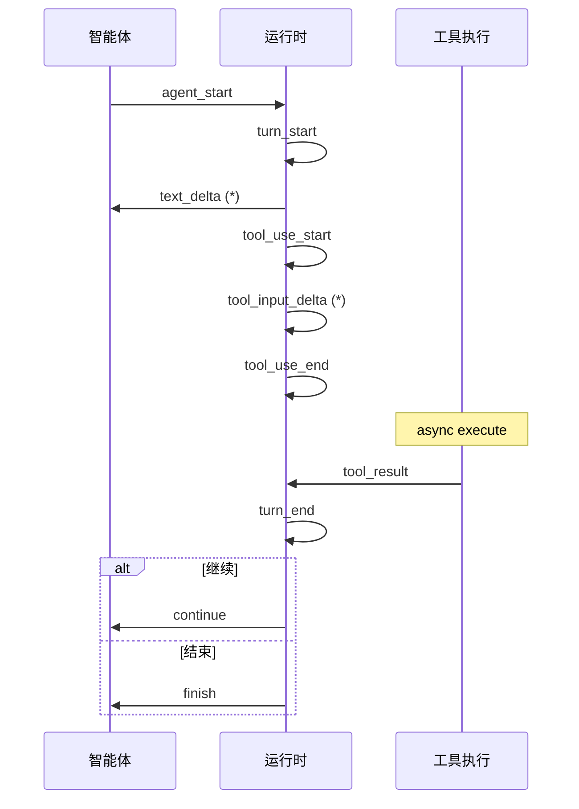

### 9.4 错误处理的分层策略

| 错误类型     | 影响范围 | 处理策略      | 示例          |
| -------- | ---- | --------- | ----------- |
| 工具执行错误   | 单个工具 | 重试或作为观察反馈 | 文件不存在       |
| API 调用错误 | 当前轮次 | 指数退避重试    | 速率限制、超时     |
| 输出解析错误   | 当前结果 | 参数验证、重新生成 | JSON 格式错误   |
| 上下文溢出    | 整个会话 | 自动压缩、历史管理 | 超过 Token 限制 |

**OpenClaw 的“错误即观察”**：所有错误都被转换为 ToolResultBlock 反馈给 Agent，使其能够学习和调适。

### 9.5 长时任务的漂移检测与纠正

#### 漂移的表现

* 目标遗忘：Agent 忘记了原始任务
* 目标替代：用中间目标替代主目标
* 范围蠕变：任务范围逐步扩大
* 方向漂移：推理偏离最优路径

#### 检测方法

1. **启发式**：关键词匹配、重复行动检测
2. **语义**：向量相似度检测（与原始目标的语义距离）
3. **约束检查**：Token 数、工具调用数、执行时间约束

#### 纠正策略

1. **强制反思**：定期插入反思步骤，要求智能体重新评估进度(OpenClaw)
2. **检查点恢复**：保存中间状态，漂移时回滚
3. **约束验证**：硬约束防止出界

### 9.6 Token 预算管理的实践

#### 预算组成

Token 预算的详细分配方案如下所示：

| 预算项目      | 分配                     | 说明               |
| --------- | ---------------------- | ---------------- |
| **总预算**   | **200,000 tokens（示例）** | 实际模型窗口需按当前模型目录确认 |
| 系统提示词     | \~500                  | 系统级指令            |
| 消息历史      | \~50,000               | 上下文消息            |
| 工具 Schema | \~5,000                | 工具定义             |
| 用户输入      | \~2,000                | 当前查询             |
| 预留余额      | \~142,500              | **总计**           |
|   推理预留    | 100,000                | 思考过程             |
|   实际可用    | \~42,500               | 可用输出空间           |

#### 管理策略

1. **前向估计**：发送请求前预估 Token 数，避免超限
2. **自动压缩**：80% 触发压缩、70% 触发记忆整合都是本书 MiniHarness 的示例默认值；真实产品并不按固定百分比触发——OpenClaw [官方参考](https://docs.openclaw.ai/reference/session-management-compaction)给出的条件是“模型窗口减去内置预留余量”，Claude Code 则按绝对 Token 边界（[官方文档](https://code.claude.com/docs/en/model-config#sonnet-5-context-window)记录 Sonnet 5 在 1M 窗口下默认约 967K tokens，可用 `CLAUDE_CODE_AUTO_COMPACT_WINDOW` 调整）
3. **历史片段化**：保留最重要的消息，丢弃中间的
4. **动态边界**：系统提示词与动态上下文的分离缓存(Claude Code)

### 9.7 MiniHarness 实现的启示

通过从零实现一个完整的运行时，我们理解了：

1. **架构分层** 的重要性：模型层、事件层、工具层、运行时层的清晰划分
2. **异步编程** 的必要性：用 asyncio 实现高效的事件驱动循环
3. **可测试性**：每个组件都可以独立测试和扩展
4. **扩展性**：通过注册表、工具抽象、事件系统实现易于扩展

### 9.8 与其他部分的联系

运行时引擎是整个 Harness 系统的枢纽，与其他子系统的关系：

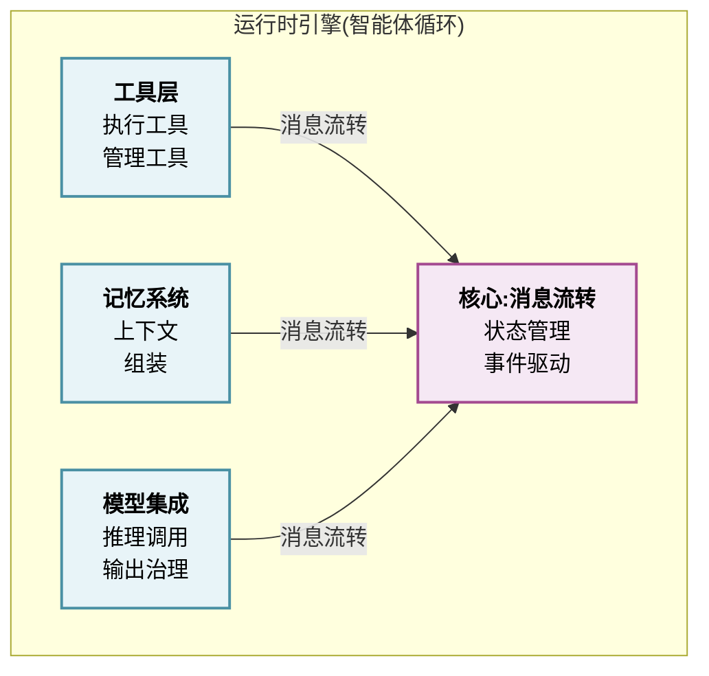

### 9.9 学习路径建议

1. **入门**：理解 智能体循环的基本概念(Think-Act-Observe)
2. **进阶**：对比两种实现模式的权衡，选择适合的架构
3. **实践**：实现 MiniHarness 或扩展其功能（添加真实模型、记忆系统等）
4. **深化**：研究特定场景的优化（流式处理、漂移检测、Token 管理）
5. **生产**：在实际项目中应用这些原则和模式

### 9.10 关键术语速查

| 术语       | 定义                 |
| -------- | ------------------ |
| 智能体循环    | 思考-行动-观察的重复过程      |
| 消息窗口     | 保留在上下文中的消息历史大小     |
| Token 预算 | 单次推理允许的最大 Token 数  |
| 漂移检测     | 识别智能体偏离目标          |
| 流式处理     | 响应和工具执行的实时交互       |
| 事件驱动     | 基于事件的异步编程模型        |
| 工具执行     | 运行智能体调用的外部工具或函数    |
| 上下文组装    | 将系统、历史、工具信息组合成推理输入 |
| 不可变状态    | 每次变化都产生新状态对象       |
| 发布-订阅    | 通过事件通知状态变化         |

### 9.11 延伸阅读建议

* 第五章（工具层）：工具的注册、发现、权限管理
* 第六章（记忆系统）：长期记忆对 智能体循环的支持
* 第七章（模型集成）：推理调用、输出治理、质量控制
* 第十章（生产部署）：运行时的可观测性、监控、扩展

### 9.12 实践练习

1. **扩展 MiniHarness**：添加文件读写工具、网络请求工具
2. **实现漂移检测**：在 MiniHarness 中添加简单的漂移检测机制
3. **Token 管理**：实现消息自动压缩（基于消息数或字符长度）
4. **对比实验**：实现线性流水线版本和异步生成器版本，对比性能
5. **真实集成**：将 MiniHarness 与真实的 LLM API（如 Claude）集成

### 9.13 实时控制平面

在长时运行的智能体系统中，控制平面提供了关键的运行时干预能力：

* **检查点管理**：在安全点序列化智能体完整状态，支持暂停后恢复执行
* **暂停与恢复**：优雅暂停机制，确保状态一致性
* **行动流**：以 SSE/WebSocket 实时传送智能体的每个动作
* **干预点**：允许外部系统在指定位置注入控制逻辑
* **成本与安全控制**：Token 预算、API 调用限制、超时和 kill switch


本章深入讲解了 Harness 运行时引擎的设计与实现，涵盖了智能体循环的核心模式、消息状态管理、流式处理、错误恢复、漂移检测、Token 管理和实时控制平面等关键主题。通过 MiniHarness 的实现，我们展示了这些概念如何落地成可运行的代码。

下一章将深入 **工具层** 的设计，研究工具的抽象、注册、执行、权限管理和动态加载。
