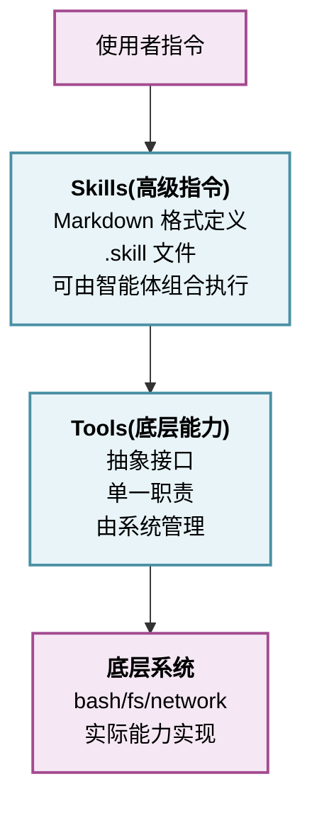
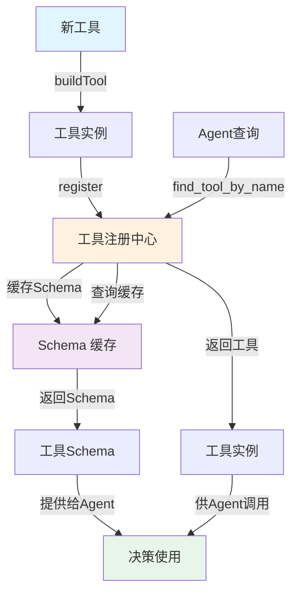
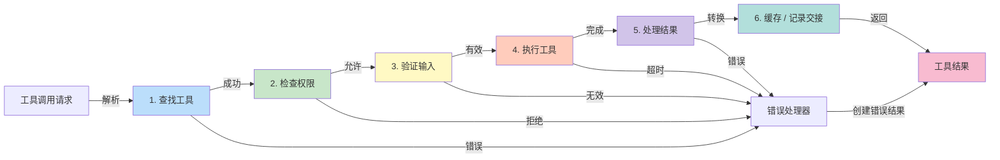
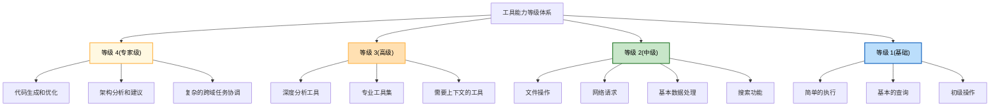
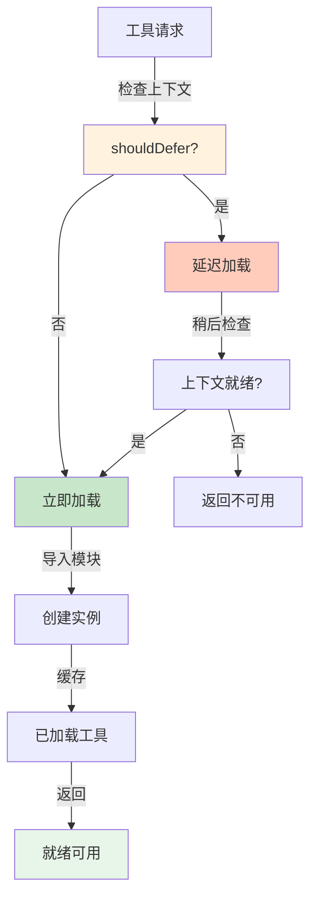
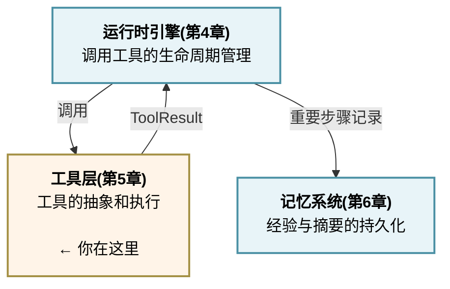

# 第五章：工具层设计

工具(Tools)是智能体与外部世界交互的手段。每一个工具调用都是一次对外部系统的改造、查询或决策。设计良好的工具层决定了智能体系统的能力边界、安全性、可维护性和可扩展性。

如果说智能体循环是“如何思考和行动”，那么工具层就是“用什么工具去行动”。

**工具层的三个核心问题**

1. **工具抽象**：如何定义一个统一的工具接口，使得各种异构的外部能力（Bash、文件系统、网络请求、数据库、API）都能被智能体调用？
2. **工具执行**：如何安全地执行工具调用，处理超时、权限、错误，并向智能体反馈结果？
3. **工具发现**：如何让智能体知道存在哪些工具、如何使用？在静态工具列表和动态工具发现之间如何平衡？

**两个参考系统的工具哲学**

Claude Code 的设计：

* **内置工具与扩展工具**：深度集成，每个工具为特定场景优化
* **工具类型多样**：8 个执行工具、3 个网络工具、8 个 Agent 工具、5+内置专用工具
* **Tool\<Input,Output,Progress> 泛型接口**：类型安全，支持进度报告
* **buildTool() 工厂函数**：动态构造工具
* **shouldDefer 延迟加载**：条件决定是否加载工具
* **FileStateCache 上下文缓存**：工具执行结果的智能缓存
* **异步执行**：StreamingToolExecutor 并发调用多个工具

OpenClaw 的设计：

* **Tools + Skills 双层架构**：
  * **Tools**：底层能力（Bash、文件、搜索）
  * **Skills**：Markdown 指令格式的高级操作
* **6 级技能加载优先级**：
  1. 固定系统技能
  2. 会话上下文技能
  3. 用户自定义技能
  4. 领域专业技能
  5. 通用工具
  6. 动态发现技能
* **工具策略**：允许/拒绝/分层权限模型
* **单线程顺序执行**：每个工具一个一个执行，但可序列化结果

**学习要点**

通过本章的学习，你将理解：

1. 如何定义工具的统一接口，支持异步、进度报告、权限检查
2. 工具执行流水线的完整过程：发现 → 验证 → 执行 → 缓存
3. 不同工具类型的实现特点和权衡
4. 动态工具发现的必要性和实现方式
5. 如何在 Python 中实现一个可扩展的工具系统

**工具与技能的关系**

工具和技能的关系可以用以下层级模型表示：



**设计决策速查**

| 决策点  | Claude Code          | OpenClaw      | MiniHarness    |
| ---- | -------------------- | ------------- | -------------- |
| 工具接口 | Tool\<I,O,P>         | Tool Protocol | Async Protocol |
| 执行模式 | 并发                   | 顺序            | 顺序（可扩展）        |
| 错误处理 | 异常捕获                 | 错误即观察         | 两者结合           |
| 权限管理 | check\_permissions() | 工具策略          | 基础实现           |
| 缓存   | FileStateCache       | 会话记忆          | 简单缓存           |
| 发现机制 | 预定义                  | 6 级优先级        | 注册表            |

本章将深入这些设计细节，为你建立完整的工具系统设计能力。

## 1. 工具抽象接口设计

工具抽象接口是工具系统的核心基础，需要在通用性、类型安全、可观测性和性能间取得平衡。本节介绍 Claude Code 的泛型设计、工具实现示例、注册中心机制，以及权限管理策略。

### 1.1 统一工具接口的设计目标

工具抽象接口的设计需要平衡以下目标：

1. **通用性**：支持各种异构工具（文件、网络、计算、数据库等）
2. **类型安全**：在编译时（或运行时）检查参数和返回值类型
3. **可观测性**：支持进度报告、事件发射、日志记录
4. **可扩展性**：易于添加新工具类型
5. **性能**：最小化开销，支持并发执行
6. **安全性**：权限检查、资源限制、错误隔离

### 1.2 Claude Code 的 Tool\<Input,Output,Progress> 泛型设计

Claude Code 采用泛型 Tool 接口，明确定义输入、输出和进度类型：

```python
"""
Claude Code 风格的工具接口
"""

from abc import ABC, abstractmethod
from dataclasses import dataclass
from typing import Generic, TypeVar, Optional, Dict, Any, List
import asyncio

# 类型变量
# （Claude Code 的 Tool<Input,Output,Progress> 三泛型中的 Progress，
#   本简化实现用下方具体的 ToolProgress 类承载，不再单设类型变量）
InputType = TypeVar('InputType')
OutputType = TypeVar('OutputType')

@dataclass
class ToolProgress:
    """工具执行进度"""
    step: int              # 当前步骤号
    total_steps: int       # 总步骤数
    current_status: str    # 当前状态描述
    estimated_time_remaining: Optional[float] = None  # 剩余时间(秒)

    def percentage(self) -> float:
        """进度百分比"""
        return (self.step / self.total_steps * 100) if self.total_steps > 0 else 0

class Tool(ABC, Generic[InputType, OutputType]):
    """通用工具抽象"""

    @abstractmethod
    async def call(self, input_data: InputType) -> OutputType:
        """
        执行工具

        Args:
            input_data: 工具输入,已验证和类型检查过

        Returns:
            工具执行结果

        Raises:
            ToolExecutionError: 工具执行失败
        """
        pass

    @abstractmethod
    def name(self) -> str:
        """工具名称"""
        pass

    @abstractmethod
    def description(self) -> str:
        """工具描述"""
        pass

    @abstractmethod
    def input_schema(self) -> Dict[str, Any]:
        """输入的 JSON Schema"""
        pass

    def check_permissions(self, context: Any) -> bool:
        """
        检查当前上下文是否有权限调用此工具

        Args:
            context: 执行上下文(包含用户、会话信息等)

        Returns:
            是否有权限
        """
        return True  # 默认允许

    async def get_progress(self) -> Optional[ToolProgress]:
        """
        获取工具执行进度

        Returns:
            进度对象,如果工具不支持进度报告则返回 None
        """
        return None

    def supports_streaming(self) -> bool:
        """工具是否支持流式输出"""
        return False

    async def stream_output(self, input_data: InputType):
        """
        流式输出(可选)

        Yields:
            OutputType: 逐个产生的输出
        """
        if not self.supports_streaming():
            output = await self.call(input_data)
            yield output
```

> ⚠️ **类型系统说明**：上述 `Tool[InputType, OutputType]` 的泛型注解为设计理想。在 Python 运行时，由于动态类型特性，实际实现常使用 `Dict[str,Any]` 承载参数和返回值。这是 Python 动态类型系统与静态类型检查间的权衡——静态分析可以验证泛型约束，但运行时仍需灵活处理异构数据。关于完整的类型安全实现，请参考第 5.3 节和附录 D（MiniHarness 类型体系）。

本节展示了工具的核心设计模式与流程。为了更好地理解如何将这些模式应用于实践，下面我们通过具体的实现示例来演示工具的常见用法。

### 1.3 工具实现示例

#### 1.3.1 简单工具：Bash 执行

一个简单的 Bash 命令执行工具的实现如下：

```python
@dataclass
class BashInput:
    command: str
    timeout: int = 30
    cwd: Optional[str] = None

@dataclass
class BashOutput:
    stdout: str
    stderr: str
    returncode: int
    execution_time: float

class BashTool(Tool[BashInput, BashOutput]):
    """Bash 命令执行工具"""

    async def call(self, input_data: BashInput) -> BashOutput:
        """执行 bash 命令"""
        import shlex
        import subprocess
        import time

        start_time = time.time()
        allowed_commands = {"echo", "pwd", "true", "false", "sleep"}
        argv = shlex.split(input_data.command)
        if not argv or argv[0] not in allowed_commands:
            raise ToolExecutionError("Command is not allowed by policy")

        try:
            result = subprocess.run(
                argv,
                shell=False,
                capture_output=True,
                timeout=input_data.timeout,
                text=True,
                cwd=input_data.cwd
            )

            return BashOutput(
                stdout=result.stdout,
                stderr=result.stderr,
                returncode=result.returncode,
                execution_time=time.time() - start_time
            )

        except subprocess.TimeoutExpired:
            raise ToolExecutionError(
                f"Bash command timeout after {input_data.timeout}s"
            )
        except Exception as e:
            raise ToolExecutionError(f"Bash execution failed: {str(e)}")

    def name(self) -> str:
        return "bash_exec"

    def description(self) -> str:
        return "Execute bash commands on the system"

    def input_schema(self) -> Dict[str, Any]:
        return {
            "type": "object",
            "properties": {
                "command": {
                    "type": "string",
                    "description": "The bash command to execute"
                },
                "timeout": {
                    "type": "integer",
                    "description": "Command timeout in seconds",
                    "default": 30
                },
                "cwd": {
                    "type": "string",
                    "description": "Current working directory"
                }
            },
            "required": ["command"]
        }

    def check_permissions(self, context: Any) -> bool:
        """Bash 工具需要特殊权限"""
        if hasattr(context, 'is_admin'):
            return context.is_admin
        return False
```

#### 1.3.2 支持进度报告的工具：文件复制

一个支持进度报告的文件复制工具，展示如何在长时间运行的操作中提供实时反馈：

```python
@dataclass
class FileCopyInput:
    source: str
    destination: str
    overwrite: bool = False

@dataclass
class FileCopyOutput:
    success: bool
    bytes_copied: int
    destination: str

class FileCopyTool(Tool[FileCopyInput, FileCopyOutput]):
    """文件复制工具,支持进度报告"""

    def __init__(self):
        self._current_progress = None

    async def call(self, input_data: FileCopyInput) -> FileCopyOutput:
        """复制文件"""
        import shutil
        import os
        from pathlib import Path
        from mini_harness.security.path_validator import PathValidator

        validator = PathValidator(base_path="./workspace")
        source = Path(validator.validate(input_data.source))
        destination = Path(validator.validate(input_data.destination))

        # 检查源文件是否存在
        if not source.exists() or source.is_symlink():
            raise ToolExecutionError(f"Source file not found or not allowed: {input_data.source}")

        # 检查目标是否已存在
        if destination.exists() and not input_data.overwrite:
            raise ToolExecutionError(
                f"Destination already exists: {input_data.destination}"
            )
        if destination.exists() and destination.is_symlink():
            raise ToolExecutionError("Symlink destinations are not allowed")

        # 获取文件大小用于进度报告
        file_size = source.stat().st_size
        chunk_size = 1024 * 1024  # 1MB chunks

        bytes_copied = 0

        # 自定义复制逻辑以支持进度报告
        destination.parent.mkdir(parents=True, exist_ok=True)
        with source.open('rb') as src, destination.open('wb') as dst:
            while True:
                chunk = src.read(chunk_size)
                if not chunk:
                    break

                dst.write(chunk)
                bytes_copied += len(chunk)

                # 更新进度
                self._current_progress = ToolProgress(
                    step=bytes_copied,
                    total_steps=file_size,
                    current_status=f"Copying {bytes_copied}/{file_size} bytes"
                )

        return FileCopyOutput(
            success=True,
            bytes_copied=bytes_copied,
            destination=input_data.destination
        )

    async def get_progress(self) -> Optional[ToolProgress]:
        """获取进度"""
        return self._current_progress

    def name(self) -> str:
        return "file_copy"

    def description(self) -> str:
        return "Copy files with progress reporting"

    def input_schema(self) -> Dict[str, Any]:
        return {
            "type": "object",
            "properties": {
                "source": {
                    "type": "string",
                    "description": "Source file path"
                },
                "destination": {
                    "type": "string",
                    "description": "Destination file path"
                },
                "overwrite": {
                    "type": "boolean",
                    "description": "Whether to overwrite existing file",
                    "default": False
                }
            },
            "required": ["source", "destination"]
        }
```

#### 1.3.3 流式输出工具：数据库查询

一个支持流式输出的数据库查询工具，展示如何处理大结果集：

> 💡 **类型参数说明**：以下示例中 `Tool<I,O,P>` 的类型参数为概念占位符。运行时实现使用 `Dict[str,Any]` 承载动态数据。如需真正的静态类型约束，可改用 `Pydantic BaseModel` 或 `TypedDict`（见附录 D MiniHarness 实现）。

```python
from dataclasses import dataclass
from typing import Dict, Any
import asyncio

@dataclass
class DatabaseQueryInput:
    query: str
    limit: int = 1000

@dataclass
class DatabaseQueryRow:
    columns: Dict[str, Any]

class DatabaseQueryTool(Tool[DatabaseQueryInput, DatabaseQueryRow]):
    """数据库查询工具,支持流式输出"""

    def __init__(self, connection_string: str):
        self.connection_string = connection_string

    async def call(self, input_data: DatabaseQueryInput) -> str:
        """执行查询并返回结果"""
        # 这个实现中,我们只返回所有结果的摘要
        # 实际使用应该使用流式输出
        all_rows = []
        async for row in self.stream_output(input_data):
            all_rows.append(row)

        return f"Query returned {len(all_rows)} rows"

    async def stream_output(self, input_data: DatabaseQueryInput):
        """流式输出查询结果"""
        # 在实际实现中,这里会连接到真实的数据库
        # 示例:连接到 PostgreSQL、MySQL 等

        # 模拟流式输出
        for i in range(min(input_data.limit, 10)):
            yield DatabaseQueryRow(
                columns={
                    "id": i,
                    "name": f"Row {i}",
                    "value": i * 100
                }
            )
            await asyncio.sleep(0.1)  # 模拟网络延迟

    def supports_streaming(self) -> bool:
        return True

    def name(self) -> str:
        return "database_query"

    def description(self) -> str:
        return "Query database with streaming results"

    def input_schema(self) -> Dict[str, Any]:
        return {
            "type": "object",
            "properties": {
                "query": {
                    "type": "string",
                    "description": "SQL query to execute"
                },
                "limit": {
                    "type": "integer",
                    "description": "Maximum number of rows to return",
                    "default": 1000
                }
            },
            "required": ["query"]
        }
```

### 1.4 buildTool() 工厂函数

Claude Code 使用工厂函数动态构造工具，支持参数化和延迟初始化：

```python
def build_tool(tool_spec: Dict[str, Any]) -> Tool:
    """
    工厂函数:根据规范构造工具

    Args:
        tool_spec: 工具规范
            {
                "type": "bash" | "file" | "network" | ...,
                "name": "tool_name",
                "config": {...}  # 工具特定的配置
            }

    Returns:
        构造的工具实例
    """

    tool_type = tool_spec.get("type")
    config = tool_spec.get("config", {})

    if tool_type == "bash":
        return BashTool()

    elif tool_type == "file_copy":
        return FileCopyTool()

    elif tool_type == "database_query":
        return DatabaseQueryTool(
            connection_string=config.get("connection_string")
        )

    elif tool_type == "custom":
        # 只允许从受信任配置和受控命名空间加载自定义工具
        module_path = config.get("module")
        class_name = config.get("class")
        allowed_prefixes = ("my_harness_tools.",)
        if not module_path or not module_path.startswith(allowed_prefixes):
            raise ToolExecutionError("Custom tool module is not in the trusted namespace")

        # 使用 importlib 动态加载
        import importlib
        module = importlib.import_module(module_path)
        tool_class = getattr(module, class_name)
        return tool_class(**config.get("args", {}))

    else:
        raise ValueError(f"Unknown tool type: {tool_type}")
```

### 1.5 工具注册中心

工具注册中心是所有工具的中枢，负责工具的注册、发现和管理。下面的流程图展示了工具的注册、发现和查询的完整流程：



图 5-1：工具注册与发现流程

```python
class ToolRegistry:
    """工具注册中心,管理所有可用工具"""

    def __init__(self):
        self.tools: Dict[str, Tool] = {}
        self.tool_cache: Dict[str, Dict[str, Any]] = {}  # Schema 缓存

    def register(self, tool: Tool):
        """注册工具"""
        name = tool.name()
        self.tools[name] = tool

        # 缓存工具的 Schema
        self.tool_cache[name] = {
            "name": name,
            "description": tool.description(),
            "input_schema": tool.input_schema()
        }

        print(f"Tool registered: {name}")

    def get(self, name: str) -> Optional[Tool]:
        """获取工具"""
        return self.tools.get(name)

    def list_tools(self) -> List[Dict[str, Any]]:
        """列出所有工具的 Schema"""
        return list(self.tool_cache.values())

    def get_tool_schema(self, name: str) -> Optional[Dict[str, Any]]:
        """获取单个工具的 Schema"""
        return self.tool_cache.get(name)

    def tool_exists(self, name: str) -> bool:
        """检查工具是否存在"""
        return name in self.tools

    def unregister(self, name: str):
        """注销工具"""
        if name in self.tools:
            del self.tools[name]
            del self.tool_cache[name]
            print(f"Tool unregistered: {name}")

# 使用示例
registry = ToolRegistry()

# 注册内置工具
registry.register(BashTool())
registry.register(FileCopyTool())
registry.register(DatabaseQueryTool("postgresql://localhost/mydb"))

# 列出所有工具
for tool_schema in registry.list_tools():
    print(f"- {tool_schema['name']}: {tool_schema['description']}")

# 获取特定工具
bash_tool = registry.get("bash_exec")
if bash_tool:
    print(f"Found tool: {bash_tool.name()}")
```

### 1.6 OpenClaw 的工具策略模型

OpenClaw 支持更细粒度的权限管理：

```python
class ToolStrategy(Enum):
    """工具使用策略"""
    ALLOW = "allow"           # 允许使用
    DENY = "deny"            # 禁止使用
    REQUIRE_APPROVAL = "require_approval"  # 需要用户批准

class ToolPolicy:
    """工具策略:定义哪些智能体可以使用哪些工具"""

    def __init__(self):
        self.policies: Dict[str, Dict[str, ToolStrategy]] = {}
        # policies[agent_id][tool_name] = strategy

    def set_policy(self, agent_id: str, tool_name: str,
                  strategy: ToolStrategy):
        """设置工具策略"""
        if agent_id not in self.policies:
            self.policies[agent_id] = {}
        self.policies[agent_id][tool_name] = strategy

    def can_use_tool(self, agent_id: str, tool_name: str) -> bool:
        """检查智能体是否可以使用工具"""
        if agent_id not in self.policies:
            return True  # 默认允许

        strategy = self.policies[agent_id].get(
            tool_name,
            ToolStrategy.ALLOW
        )

        return strategy != ToolStrategy.DENY

    def requires_approval(self, agent_id: str, tool_name: str) -> bool:
        """检查是否需要审批"""
        if agent_id not in self.policies:
            return False

        strategy = self.policies[agent_id].get(tool_name)
        return strategy == ToolStrategy.REQUIRE_APPROVAL
```

### 1.7 本节小结

工具抽象接口的设计决定了整个工具系统的质量和可维护性：

1. **Claude Code 的 Tool\<I,O,P> 泛型设计** 提供了强类型检查，但需要 Python 的高级类型系统支持
2. **工具工厂函数** 支持动态工具构造和参数化配置
3. **工具注册中心** 管理工具的生命周期和 Schema 缓存
4. **权限检查** 在工具调用前进行，可以是简单的 boolean 也可以是复杂的策略模型
5. **OpenClaw 的工具策略模型** 提供更细粒度的权限管理，支持不同智能体的不同权限

好的工具抽象应该既通用又灵活，既简单又强大。在实践中，需要根据具体场景选择合适的抽象级别。

## 2. 工具执行流水线

本节介绍工具从被调用到返回结果的完整执行过程，包括 6 个关键阶段、流水线的实现细节、进度报告机制和并发执行策略，并通过实例代码展示如何构建一个可靠的工具执行系统。

### 2.1 执行流水线的完整过程

工具从被调用到返回结果的完整流程可以分为以下 6 个阶段：



图 5-2：工具执行流水线的 6 个阶段

### 2.2 完整的执行流水线实现

工具执行流水线的实现可以分为四个主要部分：初始化和主流程、验证阶段、执行和结果处理、以及缓存管理。

#### 第一部分：流水线初始化与主流程

首先定义执行流水线的主体和 6 个阶段的总体流程：

```python
"""工具执行流水线"""

from dataclasses import dataclass
from typing import Optional, Dict, Any, Callable, Tuple
# 使用第4章定义的消息块类型（anthropic SDK 只提供请求侧的 ToolResultBlockParam，
# 响应侧没有 ToolResultBlock；这里沿用本书 mini_harness 的自定义类型）
from mini_harness.runtime.models import ToolUseBlock, ToolResultBlock
import asyncio
import time
import json

class ExecutionPipeline:
    """工具执行流水线"""

    def __init__(self,
                 tool_registry: ToolRegistry,
                 max_result_size: int = 1024 * 1024,
                 default_timeout: int = 30):
        self.tool_registry = tool_registry
        self.max_result_size = max_result_size
        self.default_timeout = default_timeout
        self.execution_history = []
        self.result_cache = {}

    async def execute(self,
                     tool_use: ToolUseBlock,
                     context: Any,
                     progress_callback: Optional[Callable] = None) -> ToolResultBlock:
        """执行工具的完整流水线"""
        execution_record = {
            "tool_use_id": tool_use.id,
            "tool_name": tool_use.name,
            "start_time": time.time(),
            "stages": {}
        }

        try:
            # 阶段1:工具发现
            tool, error = await self._find_tool(tool_use.name, execution_record)
            if error:
                return self._create_error_result(tool_use, error)

            # 阶段2:权限检查
            is_allowed, error = await self._check_permissions(
                tool, context, execution_record
            )
            if not is_allowed:
                return self._create_error_result(tool_use, error)

            # 阶段3:输入验证
            is_valid, error = await self._validate_input(
                tool, tool_use.input, execution_record
            )
            if not is_valid:
                return self._create_error_result(tool_use, error)

            # 阶段4:工具执行
            result, error = await self._execute_tool(
                tool, tool_use.input, execution_record, progress_callback
            )
            if error:
                return self._create_error_result(tool_use, error)

            # 阶段5:结果处理
            processed_result, error = await self._process_result(
                result, execution_record
            )
            if error:
                return self._create_error_result(tool_use, error)

            # 阶段6:本地缓存与记录交接
            await self._record_result(
                tool_use.id, processed_result, execution_record
            )

            self.execution_history.append(execution_record)

            return ToolResultBlock(
                tool_use_id=tool_use.id,
                content=str(processed_result),
                is_error=False
            )

        except Exception as e:
            execution_record["error"] = str(e)
            self.execution_history.append(execution_record)
            return self._create_error_result(tool_use, str(e))
```

**设计说明**：主流程采用“早期返回”(Early Return)模式。任何阶段失败都立即返回错误，避免继续执行。这提高了效率并简化了错误处理。这里的第 6 阶段只维护工具流水线的本地缓存和执行记录，不直接写入记忆系统；长期持久化由第 4 章运行时引擎统一决定。

#### 第二部分：验证阶段（工具发现、权限检查、输入验证）

这部分处理执行前的三个验证阶段：

```python
    async def _find_tool(self, tool_name: str,
                        execution_record: Dict) -> Tuple[Optional[Tool], Optional[str]]:
        """阶段1:工具发现"""
        start = time.time()
        tool = self.tool_registry.get(tool_name)
        execution_record["stages"]["find_tool"] = {
            "duration": time.time() - start,
            "found": tool is not None
        }
        if not tool:
            return None, f"Tool '{tool_name}' not found"
        return tool, None

    async def _check_permissions(self, tool: Tool, context: Any,
                                execution_record: Dict) -> Tuple[bool, Optional[str]]:
        """阶段2:权限检查"""
        start = time.time()
        try:
            has_permission = tool.check_permissions(context)
            execution_record["stages"]["check_permissions"] = {
                "duration": time.time() - start,
                "result": has_permission
            }
            if not has_permission:
                return False, f"Permission denied for tool '{tool.name()}'"
            return True, None
        except Exception as e:
            return False, f"Permission check error: {str(e)}"

    async def _validate_input(self, tool: Tool, input_data: Dict[str, Any],
                             execution_record: Dict) -> Tuple[bool, Optional[str]]:
        """阶段3:输入验证"""
        start = time.time()
        schema = tool.input_schema()
        errors = []

        required = schema.get("required", [])
        for field in required:
            if field not in input_data:
                errors.append(f"Missing required field: {field}")

        properties = schema.get("properties", {})
        for field_name, field_value in input_data.items():
            if field_name not in properties:
                errors.append(f"Unknown field: {field_name}")
                continue
            field_schema = properties[field_name]
            if not self._check_type(field_value, field_schema):
                expected_type = field_schema.get("type", "unknown")
                errors.append(
                    f"Field '{field_name}' validation failed: "
                    f"expected {expected_type}"
                )

        execution_record["stages"]["validate_input"] = {
            "duration": time.time() - start,
            "valid": len(errors) == 0,
            "errors": errors
        }

        if errors:
            return False, "; ".join(errors)
        return True, None

    def _check_type(self, value: Any, schema: Dict[str, Any]) -> bool:
        """基于JSON Schema的类型验证"""
        import jsonschema
        try:
            jsonschema.validate(value, schema)
            return True
        except jsonschema.ValidationError:
            return False
```

**设计说明**：验证阶段按顺序执行，逐步变严格。工具发现最快，然后是权限检查，最后是复杂的输入验证。这样可以快速拒绝无效请求。

#### 第三部分：执行和结果处理（工具执行、结果处理、本地缓存）

这部分处理核心的执行逻辑和结果的后处理：

```python
    async def _execute_tool(self,
                           tool: Tool,
                           input_data: Dict[str, Any],
                           execution_record: Dict,
                           progress_callback: Optional[Callable] = None
                           ) -> Tuple[Any, Optional[str]]:
        """阶段4:工具执行(带超时控制)"""
        start = time.time()
        try:
            result = await asyncio.wait_for(
                tool.call(input_data),
                timeout=self.default_timeout
            )
            execution_record["stages"]["execute_tool"] = {
                "duration": time.time() - start,
                "success": True
            }
            return result, None
        except asyncio.TimeoutError:
            error = f"Tool execution timeout ({self.default_timeout}s)"
            execution_record["stages"]["execute_tool"] = {
                "duration": time.time() - start,
                "success": False,
                "error": "timeout"
            }
            return None, error
        except Exception as e:
            execution_record["stages"]["execute_tool"] = {
                "duration": time.time() - start,
                "success": False,
                "error": type(e).__name__
            }
            return None, f"Tool execution error: {str(e)}"

    async def _process_result(self, result: Any,
                             execution_record: Dict) -> Tuple[str, Optional[str]]:
        """阶段5:结果处理(序列化和截断)"""
        start = time.time()
        try:
            if isinstance(result, str):
                result_str = result
            elif isinstance(result, (dict, list)):
                result_str = json.dumps(result, indent=2)
            else:
                result_str = str(result)

            if len(result_str) > self.max_result_size:
                original_size = len(result_str)
                result_str = result_str[:self.max_result_size]
                result_str += f"\n... [Output truncated from {original_size} bytes]"
                execution_record["stages"]["process_result"] = {
                    "duration": time.time() - start,
                    "truncated": True,
                    "original_size": original_size,
                }
            else:
                execution_record["stages"]["process_result"] = {
                    "duration": time.time() - start,
                    "truncated": False,
                    "size": len(result_str)
                }
            return result_str, None
        except Exception as e:
            return None, f"Result processing error: {str(e)}"

    async def _record_result(self, tool_use_id: str, result: str,
                             execution_record: Dict):
        """阶段6:本地结果缓存，不写入记忆系统"""
        start = time.time()
        self.result_cache[tool_use_id] = {
            "content": result,
            "timestamp": time.time()
        }
        execution_record["stages"]["record_result"] = {
            "duration": time.time() - start,
            "cached": True
        }

    def _create_error_result(self, tool_use: ToolUseBlock,
                            error: str) -> ToolResultBlock:
        """创建错误结果"""
        return ToolResultBlock(
            tool_use_id=tool_use.id,
            content=error,
            is_error=True,
            error_type="ExecutionError"
        )
```

**设计说明**：`_execute_tool` 使用 `asyncio.wait_for` 实现超时控制，防止卡顿。`_process_result` 对大结果进行截断，确保不超过最大大小限制。这两个措施都是保护系统稳定性的关键。

#### 第四部分：执行历史和缓存管理

最后是查询执行历史和清理缓存的工具方法：

```python
    def get_execution_history(self, tool_use_id: Optional[str] = None):
        """获取执行历史"""
        if tool_use_id:
            return [r for r in self.execution_history
                   if r["tool_use_id"] == tool_use_id]
        return self.execution_history

    def clear_cache(self, max_age: int = 3600):
        """清理缓存(删除超过max_age秒的项)"""
        now = time.time()
        to_delete = [
            key for key, value in self.result_cache.items()
            if now - value["timestamp"] > max_age
        ]
        for key in to_delete:
            del self.result_cache[key]
        return len(to_delete)
```

### 2.3 进度事件流

支持长时间运行的工具的进度报告：

```python
from typing import Optional, Dict
import asyncio
import time

class ProgressMonitor:
    """进度监控器"""

    def __init__(self, tool_use_id: str):
        self.tool_use_id = tool_use_id
        self.progress_events = []

    def report_progress(self, step: int, total_steps: int,
                       status: str, estimated_time_remaining: Optional[float] = None):
        """报告进度"""
        event = {
            "tool_use_id": self.tool_use_id,
            "timestamp": time.time(),
            "step": step,
            "total_steps": total_steps,
            "percentage": (step / total_steps * 100) if total_steps > 0 else 0,
            "status": status,
            "estimated_time_remaining": estimated_time_remaining
        }
        self.progress_events.append(event)
        return event

    def get_current_progress(self) -> Optional[Dict]:
        """获取当前进度"""
        return self.progress_events[-1] if self.progress_events else None

# 在工具执行中使用
async def long_running_tool_call(progress_monitor: ProgressMonitor):
    """长时间运行的工具调用示例"""
    total_items = 1000

    for i in range(total_items):
        # 执行工作
        await asyncio.sleep(0.01)  # 模拟工作

        # 报告进度
        if i % 100 == 0:
            progress_monitor.report_progress(
                step=i,
                total_steps=total_items,
                status=f"Processing item {i}/{total_items}",
                estimated_time_remaining=(total_items - i) * 0.01
            )

    return f"Processed {total_items} items"
```

### 2.4 并发工具执行

具体实现如下：

```python
from typing import List, Dict, Any
import asyncio

class StreamingToolExecutor:
    """并发工具执行器"""

    def __init__(self, pipeline: ExecutionPipeline,
                 max_concurrent: int = 5):
        self.pipeline = pipeline
        self.max_concurrent = max_concurrent

    async def execute_tools(self,
                           tool_uses: List[ToolUseBlock],
                           context: Any) -> Dict[str, ToolResultBlock]:
        """
        并发执行多个工具

        Args:
            tool_uses: 工具调用列表
            context: 执行上下文

        Returns:
            {tool_use_id: tool_result_block}
        """

        semaphore = asyncio.Semaphore(self.max_concurrent)

        async def execute_with_semaphore(tool_use):
            async with semaphore:
                return await self.pipeline.execute(tool_use, context)

        results = await asyncio.gather(
            *[execute_with_semaphore(tu) for tu in tool_uses],
            return_exceptions=True
        )

        # 组织结果：gather 的返回顺序与 tool_uses 一一对应；
        # return_exceptions=True 时异常项是裸 Exception 对象，不能直接解包
        result_dict = {}
        for tool_use, result in zip(tool_uses, results):
            if isinstance(result, Exception):
                result_dict[tool_use.id] = ToolResultBlock(
                    tool_use_id=tool_use.id,
                    content=str(result),
                    is_error=True,
                    error_type=type(result).__name__
                )
            else:
                result_dict[tool_use.id] = result

        return result_dict
```

### 2.5 本节小结

工具执行流水线的设计决定了系统的可靠性和性能：

1. **6 个执行阶段** 清晰分离，每个阶段有明确的职责和错误处理
2. **权限检查** 在执行前进行，防止未授权的操作
3. **输入验证** 基于 JSON Schema，确保工具收到有效参数
4. **超时控制** 防止工具阻塞整个系统
5. **结果处理** 包括序列化、截断、缓存，处理大结果的问题
6. **执行历史记录** 支持审计和调试
7. **并发执行** 和 **进度报告** 支持长时间运行的工具


## 3. 工具类型体系

本节阐述工具的分类标准、能力等级划分、访问控制策略、扩展模式和能力描述，说明如何设计一个既清晰易用又灵活可扩展的工具体系。

### 3.1 工具分类

按功能和特点，Agent 系统的工具可分为以下几类：

#### 1) 执行工具

在本地系统执行代码或命令的工具。

```python
class BashTool(Tool):
    """执行 bash 命令"""
    def name(self) -> str: return "bash_exec"

class PythonTool(Tool):
    """执行 Python 代码"""
    def name(self) -> str: return "python_exec"

class FileReadTool(Tool):
    """读取文件内容"""
    def name(self) -> str: return "file_read"

class FileWriteTool(Tool):
    """写入文件"""
    def name(self) -> str: return "file_write"

class FileListTool(Tool):
    """列出目录内容"""
    def name(self) -> str: return "file_list"
```

**特点**：

* 直接影响本地系统状态
* 需要严格的权限控制
* 可能长时间运行
* 需要超时保护

#### 2) 网络工具

通过网络访问远程资源的工具。

```python
class HTTPTool(Tool):
    """发送 HTTP 请求"""
    def name(self) -> str: return "http_request"

class WebSearchTool(Tool):
    """网络搜索"""
    def name(self) -> str: return "web_search"

class APIDelegationTool(Tool):
    """调用第三方 API"""
    def name(self) -> str: return "api_call"
```

**特点**：

* 依赖网络连接
* 可能有速率限制
* 需要处理超时和重试
* 可能涉及认证令牌管理

#### 3) 智能体工具

让智能体调用其他智能体的工具。

```python
class SubAgentTool(Tool):
    """创建和委托子任务给另一个 Agent"""
    def name(self) -> str: return "delegate_to_agent"

class ParallelAgentsTool(Tool):
    """并行执行多个 Agent"""
    def name(self) -> str: return "parallel_agents"
```

**特点**：

* 支持分解复杂任务
* 智能体间通信和协调
* 结果聚合
* 可能导致深层递归，需要深度限制

#### 4) 专用工具

针对特定领域的工具。

```python
class DatabaseQueryTool(Tool):
    """数据库查询"""
    def name(self) -> str: return "database_query"

class ImageProcessingTool(Tool):
    """图像处理"""
    def name(self) -> str: return "image_process"

class CodeAnalysisTool(Tool):
    """代码分析(静态或动态)"""
    def name(self) -> str: return "code_analyze"

class DataVisualizationTool(Tool):
    """数据可视化"""
    def name(self) -> str: return "plot_data"
```

**特点**：

* 特定领域的深度功能
* 高度优化
* 可能有复杂的依赖

### 3.2 工具能力的等级

不依赖具体工具数量时，Claude Code 一类编码智能体的内置工具可按能力分为以下等级：



### 3.3 OpenClaw 的工具策略模型

核心逻辑如下：

```python
class ToolAccessLevel(Enum):
    """工具访问级别"""
    SYSTEM = "system"      # 仅系统可用
    ADMIN = "admin"        # 管理员可用
    TRUSTED = "trusted"    # 信任的用户可用
    PUBLIC = "public"      # 所有人可用

class ToolPolicy:
    """工具策略定义"""

    def __init__(self):
        self.access_levels: Dict[str, ToolAccessLevel] = {}
        self.resource_limits: Dict[str, Dict[str, Any]] = {}

    def set_access_level(self, tool_name: str,
                        level: ToolAccessLevel):
        """设置工具访问级别"""
        self.access_levels[tool_name] = level

    def set_resource_limit(self, tool_name: str,
                          max_execution_time: int = None,
                          max_memory: int = None,
                          max_disk_usage: int = None):
        """设置工具的资源限制"""
        self.resource_limits[tool_name] = {
            "max_execution_time": max_execution_time,
            "max_memory": max_memory,
            "max_disk_usage": max_disk_usage
        }

    def can_execute(self, tool_name: str,
                   user_role: str) -> bool:
        """检查用户是否可以执行工具"""
        level = self.access_levels.get(
            tool_name,
            ToolAccessLevel.PUBLIC
        )

        if level == ToolAccessLevel.SYSTEM:
            return user_role == "system"
        elif level == ToolAccessLevel.ADMIN:
            return user_role in ["system", "admin"]
        elif level == ToolAccessLevel.TRUSTED:
            return user_role in ["system", "admin", "trusted"]
        else:
            return True
```

为了支持不同的使用场景和性能需求，工具系统提供了多种扩展模式，使开发者能够灵活地定制工具行为。

### 3.4 工具的扩展模式

#### 1）装饰器模式

该模式的实现示例：

```python
import asyncio

def timeout_wrapper(tool: Tool, timeout: int = 30) -> Tool:
    """为工具添加超时装饰器"""
    class TimeoutTool(Tool):
        async def call(self, input_data):
            try:
                return await asyncio.wait_for(
                    tool.call(input_data),
                    timeout=timeout
                )
            except asyncio.TimeoutError:
                raise ToolExecutionError(f"Tool timeout after {timeout}s")

        def name(self) -> str:
            return tool.name()

        def description(self) -> str:
            return tool.description()

        # 其他方法委托...

    return TimeoutTool()

def retry_wrapper(tool: Tool, max_retries: int = 3) -> Tool:
    """为工具添加重试装饰器"""
    class RetryTool(Tool):
        async def call(self, input_data):
            for attempt in range(max_retries):
                try:
                    return await tool.call(input_data)
                except Exception as e:
                    if attempt == max_retries - 1:
                        raise
                    await asyncio.sleep(2 ** attempt)  # 指数退避

        # 其他方法...

    return RetryTool()
```

#### 2) 复合工具

具体代码如下：

```python
from typing import List, Dict

class CompositeToolChain(Tool):
    """工具链:顺序执行多个工具"""

    def __init__(self, tools: List[Tool],
                 input_mapping: Dict[str, List[str]]):
        """
        input_mapping: 定义每个工具的输入如何来自前一个工具的输出
        （上下文键名格式为 "<工具名>_output"，与 call() 中的写入格式一致）
        例如:{
            "tool_2": ["tool_1_output.field_a"],
            "tool_3": ["tool_2_output.field_b", "user_input.param"]
        }
        """
        self.tools = tools
        self.input_mapping = input_mapping

    async def call(self, input_data):
        """依次执行工具"""
        context = {"user_input": input_data}

        for tool in self.tools:
            tool_name = tool.name()

            # 解析这个工具的输入
            tool_input = self._resolve_input(
                self.input_mapping.get(tool_name, []),
                context
            )

            # 执行工具
            result = await tool.call(tool_input)
            context[f"{tool_name}_output"] = result

        return context[f"{self.tools[-1].name()}_output"]

    def _resolve_input(self, mapping: List[str],
                      context: Dict) -> Dict:
        """从上下文中解析输入"""
        result = {}
        for ref in mapping:
            parts = ref.split(".")
            value = context
            for part in parts:
                value = value.get(part, {})
            # 提取字段名
            result[parts[-1]] = value
        return result
```

#### 3) 条件工具

以下是具体实现：

```python
class ConditionalTool(Tool):
    """条件执行:根据条件选择执行哪个工具"""

    def __init__(self, condition_fn, tool_if_true: Tool,
                 tool_if_false: Tool):
        self.condition_fn = condition_fn
        self.tool_if_true = tool_if_true
        self.tool_if_false = tool_if_false

    async def call(self, input_data):
        """根据条件选择执行"""
        if self.condition_fn(input_data):
            return await self.tool_if_true.call(input_data)
        else:
            return await self.tool_if_false.call(input_data)

    def name(self) -> str:
        return "conditional_tool"
```

### 3.5 工具的能力描述

完整的工具描述应包含：

```python
@dataclass
class ToolCapability:
    """工具的能力描述"""
    name: str
    description: str
    input_schema: Dict[str, Any]
    output_schema: Dict[str, Any]
    access_level: ToolAccessLevel
    required_permissions: List[str]
    estimated_execution_time: float  # 秒
    estimated_resource_usage: Dict[str, int]  # 内存、CPU 等
    examples: List[Dict[str, Any]]  # 使用示例
    limitations: List[str]  # 工具的限制
    dependencies: List[str]  # 外部依赖
```

### 3.6 本节小结

工具类型体系和扩展模式决定了工具系统的灵活性：

1. **工具分类**：执行、网络、Agent、专用四大类
2. **访问级别**：系统、管理、信任、公开四个等级
3. **扩展模式**：装饰器、复合、条件等组合方式
4. **能力描述**：完整的元数据帮助智能体理解工具能力

好的工具类型体系应该既清晰易用，又能支持灵活的扩展和组合。

## 4. 动态发现与加载

本节介绍工具的动态发现和加载机制，包括延迟加载的决策、多级优先级加载策略、Schema 缓存、MCP 动态注册和上下文缓存等技术，阐明如何构建灵活高效的工具加载系统。

### 4.1 动态加载的必要性

静态工具列表的问题：

* 无法适应运行时变化
* 新工具需要重新部署
* 无法根据上下文选择性加载

### 4.2 Claude Code 的 shouldDefer 机制

shouldDefer 机制决定了工具是否需要延迟加载。下面的流程图展示了动态工具加载的完整流程：



图 5-3：shouldDefer 延迟加载机制

核心实现如下：

```python
class ToolLoader:
    """延迟加载机制"""

    def __init__(self):
        self.loaded_tools = {}
        self.tool_metadata = {}

    def should_defer_loading(self, tool_name: str,
                            context: Dict) -> bool:
        """判断是否延迟加载工具"""
        # 示例:某些工具只在特定上下文才加载
        if tool_name == "database_query":
            return context.get("user_role") != "admin"
        return False

    async def load_tool_on_demand(self, tool_name: str,
                                 context: Dict) -> Optional[Tool]:
        """按需加载工具"""
        if tool_name in self.loaded_tools:
            return self.loaded_tools[tool_name]

        if self.should_defer_loading(tool_name, context):
            return None

        # 动态导入和加载
        try:
            spec = self.tool_metadata.get(tool_name)
            if not spec:
                return None

            module_path = spec["module"]
            if not module_path.startswith("my_harness_tools."):
                raise ValueError("Tool spec must use a trusted module namespace")

            module = await self._async_import(module_path)
            tool_class = getattr(module, spec["class"])
            tool = tool_class(**spec.get("args", {}))

            self.loaded_tools[tool_name] = tool
            return tool

        except Exception as e:
            print(f"Failed to load tool '{tool_name}': {e}")
            return None

    async def _async_import(self, module_path: str):
        """异步导入模块"""
        import importlib
        return importlib.import_module(module_path)
```

### 4.3 OpenClaw 的 6 级技能加载优先级

实现的代码结构：

```python
class SkillPriority(Enum):
    """技能加载优先级"""
    SYSTEM = 1          # 固定系统技能
    SESSION = 2         # 会话上下文技能
    USER = 3           # 用户自定义
    DOMAIN = 4         # 领域专业技能
    BUILTIN = 5        # 通用工具
    DISCOVERY = 6      # 动态发现

class SkillLoader:
    """6 级优先级技能加载器"""

    def __init__(self, storage):
        self.storage = storage
        self.loaded_skills = {}

    async def load_skills_for_session(self, session_id: str):
        """为会话加载所有技能"""
        skills = []

        # 1. 系统技能
        skills.extend(await self._load_system_skills())

        # 2. 会话上下文技能
        skills.extend(await self._load_session_skills(session_id))

        # 3. 用户自定义技能
        skills.extend(await self._load_user_skills(session_id))

        # 4. 领域技能
        domain = await self._detect_domain(session_id)
        skills.extend(await self._load_domain_skills(domain))

        # 5. 内置工具
        skills.extend(await self._load_builtin_tools())

        # 6. 动态发现技能
        skills.extend(await self._discover_skills_dynamically(session_id))

        return skills

    async def _load_system_skills(self):
        """加载系统技能(始终可用)"""
        return await self.storage.get_system_skills()

    async def _load_session_skills(self, session_id: str):
        """加载会话特定的技能"""
        return await self.storage.get_session_skills(session_id)

    async def _load_user_skills(self, session_id: str):
        """加载用户定义的技能"""
        user_id = await self.storage.get_user_for_session(session_id)
        return await self.storage.get_user_skills(user_id)

    async def _load_domain_skills(self, domain: str):
        """加载特定领域的技能"""
        if not domain:
            return []
        return await self.storage.get_domain_skills(domain)

    async def _load_builtin_tools(self):
        """加载内置工具"""
        return [
            BashTool(),
            FileReadTool(),
            FileWriteTool(),
            # ... 其他内置工具
        ]

    async def _discover_skills_dynamically(self, session_id: str):
        """动态发现技能"""
        # 扫描技能目录或 MCP
        discovered = await self.storage.discover_available_skills()
        return discovered

    async def _detect_domain(self, session_id: str) -> str:
        """根据会话内容检测领域"""
        recent_messages = await self.storage.get_recent_messages(session_id, limit=5)
        # 使用 NLP 检测领域
        text = " ".join(m.get_text() for m in recent_messages)
        return self._classify_domain(text)

    def _classify_domain(self, text: str) -> str:
        """简单的领域分类"""
        keywords = {
            "data": ["sql", "database", "query", "table"],
            "web": ["html", "css", "javascript", "react"],
            "system": ["bash", "shell", "linux", "windows"],
            "code": ["python", "java", "javascript"]
        }

        text_lower = text.lower()
        for domain, kws in keywords.items():
            if any(kw in text_lower for kw in kws):
                return domain
        return "general"
```

### 4.4 JSON Schema 缓存

具体的缓存实现：

```python
class SchemaCache:
    """工具 Schema 缓存"""

    def __init__(self, max_age: int = 3600):
        self.cache = {}
        self.max_age = max_age
        self.timestamps = {}

    def get_schema(self, tool_name: str) -> Optional[Dict]:
        """获取缓存的 Schema"""
        if tool_name in self.cache:
            age = time.time() - self.timestamps[tool_name]
            if age < self.max_age:
                return self.cache[tool_name]
            else:
                del self.cache[tool_name]
                del self.timestamps[tool_name]
        return None

    def set_schema(self, tool_name: str, schema: Dict):
        """缓存 Schema"""
        self.cache[tool_name] = schema
        self.timestamps[tool_name] = time.time()

    def build_all_schemas(self, tools: List[Tool]) -> Dict[str, Dict]:
        """批量构建 Schema 缓存"""
        schemas = {}
        for tool in tools:
            schema = {
                "name": tool.name(),
                "description": tool.description(),
                "input_schema": tool.input_schema()
            }
            self.set_schema(tool.name(), schema)
            schemas[tool.name()] = schema
        return schemas
```

### 4.5 MCP 动态注册

MCP(Model Context Protocol)支持动态工具注册：

> ⚠️ **注意**：以下代码为概念示意，非真实 MCP 调用方式。真实 MCP 客户端使用 JSON-RPC 2.0 over stdio 或 Streamable HTTP，不使用 REST 风格的 `/tools/list` 和 `/tools/call` 端点。详见第 9.3 节与 9.4 节 MCP 协议详解。

```python
class MCPToolRegistry:
    """MCP 协议的工具注册"""

    def __init__(self):
        self.mcp_servers = {}
        self.available_tools = {}

    async def discover_mcp_tools(self, server_url: str):
        """发现 MCP 服务器的工具"""
        try:
            # 连接到 MCP 服务器
            async with aiohttp.ClientSession() as session:
                async with session.get(f"{server_url}/tools") as resp:
                    tools = await resp.json()
                    return tools
        except Exception as e:
            print(f"Failed to discover MCP tools: {e}")
            return []

    def register_mcp_tool(self, server_url: str,
                        tool_name: str,
                        tool_spec: Dict):
        """注册来自 MCP 的工具"""
        if server_url not in self.mcp_servers:
            self.mcp_servers[server_url] = {}

        self.mcp_servers[server_url][tool_name] = tool_spec
        self.available_tools[tool_name] = {
            "source": "mcp",
            "server": server_url,
            "spec": tool_spec
        }

    async def execute_mcp_tool(self, tool_name: str,
                              input_data: Dict) -> Any:
        """执行 MCP 工具"""
        tool_info = self.available_tools.get(tool_name)
        if not tool_info:
            raise ValueError(f"Tool not found: {tool_name}")

        server_url = tool_info["server"]

        async with aiohttp.ClientSession() as session:
            async with session.post(
                f"{server_url}/tools/call",
                json={"name": tool_name, "arguments": input_data}
            ) as resp:
                return await resp.json()
```

### 4.6 FileStateCache 上下文缓存

实现如下：

```python
class FileStateCache:
    """文件状态缓存:减少重复工具调用"""

    def __init__(self, ttl: int = 60):  # 缓存时间(秒)
        self.cache = {}
        self.timestamps = {}
        self.ttl = ttl

    def get(self, key: str) -> Optional[Dict]:
        """获取缓存"""
        if key in self.cache:
            age = time.time() - self.timestamps[key]
            if age < self.ttl:
                return self.cache[key]
            else:
                del self.cache[key]
                del self.timestamps[key]
        return None

    def set(self, key: str, value: Dict):
        """设置缓存"""
        self.cache[key] = value
        self.timestamps[key] = time.time()

    def invalidate(self, pattern: str):
        """失效匹配模式的缓存"""
        import re
        regex = re.compile(pattern)
        to_delete = [k for k in self.cache.keys() if regex.match(k)]
        for key in to_delete:
            del self.cache[key]
            del self.timestamps[key]

# 使用:缓存文件列表结果
cache = FileStateCache()

async def file_list_with_cache(directory: str) -> List[str]:
    """带缓存的文件列表"""
    cache_key = f"file_list:{directory}"

    # 检查缓存
    cached = cache.get(cache_key)
    if cached:
        return cached["files"]

    # 执行结构化文件列表工具，避免把目录名拼进 shell 命令
    files = await file_list_tool.call({"path": directory})

    # 缓存结果
    cache.set(cache_key, {"files": files})

    return files
```

### 4.7 本节小结

动态工具加载是现代智能体系统的必需能力：

1. **shouldDefer 延迟加载**：基于上下文决定是否加载工具
2. **6 级优先级加载**：系统 → 会话 → 用户 → 领域 → 内置 → 发现
3. **Schema 缓存**：减少重复构建 Schema 的开销
4. **MCP 动态注册**：支持第三方工具的即插即用
5. **FileStateCache**：减少重复工具调用，提高性能

这些机制共同构成了一个灵活、高效、可扩展的工具加载系统。

## 5. 实战：MiniHarness 工具层实现

本节实现一个完整的 MiniHarness 工具层，包括工具协议、注册表、执行流水线和几个内置工具。核心设计原则是“发现、权限、执行、结果”四阶段流水线。

### 5.1 工具抽象与基类

工具层的核心是统一的 Tool 基类，定义了所有工具必须实现的接口。工具的设计遵循“契约优先”原则：

```python
from abc import ABC, abstractmethod

class Tool(ABC):
    """工具基类 - 定义工具的通用契约"""

    @abstractmethod
    async def call(self, params: Dict[str, Any]) -> ToolResult:
        """执行工具的核心逻辑"""
        pass

    @abstractmethod
    def name(self) -> str:
        """工具的唯一标识符"""
        pass

    @abstractmethod
    def description(self) -> str:
        """工具描述"""
        pass

    @abstractmethod
    def input_schema(self) -> Dict[str, Any]:
        """JSON Schema 定义输入约束"""
        pass

    def check_permissions(self, context: Any) -> bool:
        """权限检查钩子 - 可被子类覆盖"""
        return True
```

关键设计决策：

1. **异步执行**：所有工具使用 `async/await`，支持 IO 密集型操作
2. **Schema 驱动**：通过 JSON Schema 定义输入，实现自文档化和验证
3. **权限钩子**：`check_permissions()` 允许子类实现细粒度权限控制
4. **统一结果类型**：`ToolResult` 封装成功/失败/执行时间等元数据

完整实现参见 `lab/mini_harness/tools/builtin.py`。

### 5.2 工具执行流水线

执行流水线是系统的核心，实现了 4 阶段的工具调用流程：

```python
class ExecutionPipeline:
    """执行流水线 - 控制工具的调用生命周期"""

    async def execute(self, tool_name: str,
                     input_params: Dict[str, Any]) -> ToolResultBlock:
        # 阶段 1:工具发现(lookup)
        tool = self.tool_registry.get(tool_name)
        if not tool:
            return ToolResultBlock(tool_name=tool_name, success=False,
                                 content=f"Tool not found: {tool_name}")

        # 阶段 2:权限检查(authorization)
        if not tool.check_permissions({}):
            return ToolResultBlock(tool_name=tool_name, success=False,
                                 content=f"Permission denied for tool: {tool_name}")

        # 阶段 3:执行工具(execution)
        # 阶段 4:结果处理(result handling)
        result = await tool.call(input_params)
        return ToolResultBlock(
            tool_name=tool_name,
            success=result.success,
            content=result.content,
            execution_time=result.execution_time,
            error_type=result.error_type,
        )
```

四阶段设计的优点：

* **可观测性**：每个阶段可独立记录日志和监控
* **可扩展性**：插入速率限制、超时控制、重试逻辑等中间件
* **安全性**：权限检查在执行前进行，防止越权操作
* **容错性**：捕获任意异常并转换为统一的失败结果

完整实现参见 `lab/mini_harness/tools/builtin.py` 中的 `ExecutionPipeline` 类。

### 5.3 工具注册表

工具注册表充当服务发现中心和 Schema 缓存：

```python
class ToolRegistry:
    """工具注册中心 - 管理工具的生命周期"""

    def register(self, tool: Tool):
        """注册工具并缓存其 Schema"""
        name = tool.name()
        self.tools[name] = tool

        # 缓存 Schema 避免重复调用
        self.schema_cache[name] = {
            "name": name,
            "description": tool.description(),
            "input_schema": tool.input_schema()
        }

    def list_tools(self) -> List[Dict[str, Any]]:
        """返回所有工具的 Schema(用于 LLM 提示词)"""
        return list(self.schema_cache.values())
```

设计特点：

* **Schema 缓存**：减少重复的 Schema 构建，加速工具列表生成
* **统一发现**：LLM 通过 `list_tools()` 获取全部可用工具及其约束
* **松耦合**：执行流水线仅依赖注册表接口，不需关心工具实现细节

完整实现参见 `lab/mini_harness/tools/registry.py`。

### 5.4 内置工具示例

三个内置工具展示了不同的设计模式：

**BashTool**：命令执行工具，演示了长时间运行任务的超时处理

```python
class BashTool(Tool):
    async def call(self, params: Dict[str, Any]) -> ToolResult:
        import shlex
        import subprocess

        command = params.get("command", "")
        timeout = params.get("timeout", 30)
        allowed_commands = {"echo", "pwd", "true", "false", "sleep"}
        argv = shlex.split(command)
        if not argv or argv[0] not in allowed_commands:
            return ToolResult(success=False, content="Command not in allowlist",
                              execution_time=0.0, error_type="PermissionError")

        try:
            result = subprocess.run(argv, shell=False,
                                  timeout=timeout, text=True,
                                  capture_output=True)
            return ToolResult(
                success=result.returncode == 0,
                # ... 其他结果字段
            )
        except subprocess.TimeoutExpired:
            return ToolResult(
                success=False,
                error_type="TimeoutError",
                # ... 其他结果字段
            )
```

**FileReadTool 和 FileWriteTool**：文件操作工具，演示了错误分类和限制（如 max\_bytes）

这些工具的完整实现包括详细的错误处理、参数验证和边界情况处理，参见 `lab/mini_harness/tools/builtin.py`。

### 5.5 扩展路径

1. **中间件架构**：在执行流水线中插入速率限制、重试、缓存层
2. **权限模型**：为不同用户和工具组合配置细粒度权限
3. **超时和资源限制**：为每个工具实例设置 CPU/内存配额
4. **并发执行**：使用 `asyncio.gather()` 实现多工具并发调用
5. **工具依赖图**：支持工具间的数据流依赖（DAG 执行）
6. **结果缓存**：基于输入哈希缓存工具结果，支持失效策略

### 5.6 本节小结

MiniHarness 工具层的核心贡献：

1. **清晰的抽象边界**：Tool 基类定义统一契约，工具之间互不依赖
2. **四阶段执行流水线**：发现→权限→执行→处理，可观测且可扩展
3. **Schema 驱动设计**：工具通过 JSON Schema 自描述，LLM 可直接理解
4. **错误优先处理**：所有失败路径返回统一的 `ToolResult` 类型

这些原则适用于任何规模的 AI Agent 系统工具层设计。


## 6. 本章小结

本章深入探讨了工具层的设计原则和实现模式，以下是主要内容的总结。

### 6.1 工具层设计的核心原则

#### 6.1.1 统一抽象

无论工具类型如何（文件、网络、计算、数据库），都应该通过统一的接口暴露能力。Claude Code 的 Tool\<I,O,P> 泛型设计实现了强类型检查，OpenClaw 的 Tool Protocol 提供了灵活的抽象。

### 6.1.2 权限隔离

工具调用前必须进行权限检查，防止未授权的操作。不同的工具有不同的权限要求：

* 系统工具(Bash)：只有管理员可用
* 数据库工具：需要认证
* 文件工具：需要文件访问权限

### 6.1.3 错误恢复

工具执行失败是常态，系统必须：

* 捕获所有异常（执行错误、超时、权限拒绝）
* 将错误转化为 ToolResultBlock 反馈给 Agent
* 支持重试策略（指数退避）

### 6.1.4 性能优化

* **并发执行**：多个工具可以并行执行
* **结果缓存**：避免重复调用相同工具
* **Schema 缓存**：减少构建工具信息的开销

### 6.2 工具类型体系速览

| 类型    | 特点          | 示例               |
| ----- | ----------- | ---------------- |
| 执行工具  | 直接改变系统状态    | Bash、Python、文件操作 |
| 网络工具  | 远程调用，有延迟和限制 | HTTP、API、搜索      |
| 智能体工具 | 委托给其他智能体    | SubAgent、并行执行    |
| 专用工具  | 特定领域的深度功能   | 数据库、图像处理         |

### 6.3 执行流水线的 6 个阶段

流程如下：


每个阶段都有明确的职责和错误处理机制，确保整个流程的可靠性。

### 6.4 工具扩展的三种模式

1. **装饰器模式**：为工具添加超时、重试等通用能力
2. **复合工具**：组合多个工具形成工具链
3. **条件工具**：根据条件选择执行的工具

### 6.5 动态加载的必要性

* **shouldDefer 延迟加载**：根据上下文决定是否加载工具，节省内存
* **6 级优先级加载**：OpenClaw 的分层加载策略，支持灵活的工具组织
* **MCP 动态注册**：支持第三方工具的即插即用
* **Schema 缓存**：减少重复构建的开销

### 6.6 Claude Code vs OpenClaw 的工具设计对比

| 方面   | Claude Code          | OpenClaw      |
| ---- | -------------------- | ------------- |
| 工具数量 | 内置工具 + 扩展工具          | 通用工具 + 技能     |
| 执行模式 | 并发                   | 顺序            |
| 接口设计 | Tool\<I,O,P> 泛型      | Tool Protocol |
| 权限模型 | check\_permissions() | 工具策略和访问级别     |
| 加载策略 | shouldDefer          | 6 级优先级        |
| 缓存   | FileStateCache       | 会话记忆          |

### 6.7 MiniHarness 的实现启示

通过从零实现工具层，我们学到：

1. **工具抽象** 需要平衡通用性和类型安全
2. **执行流水线** 需要完整的生命周期管理
3. **工具注册表** 是工具系统的中枢
4. **错误处理** 必须穷尽所有可能的失败模式
5. **可扩展性** 通过接口和工厂模式实现

### 6.8 与其他章节的联系

关系图如下：



运行时引擎调用工具层执行具体操作，工具层返回标准化结果；是否写入记忆系统由运行时根据重要性、审计和隐私策略决定。

### 6.9 设计决策速查

1. **工具接口**：选择类型安全(Tool\<I,O,P>)还是灵活的协议(Tool Protocol)
2. **执行模式**：并发执行还是顺序执行，取决于工具依赖关系
3. **权限模型**：简单的 boolean 检查还是复杂的策略模型
4. **加载策略**：预加载所有工具还是按需加载
5. **缓存策略**：缓存结果、Schema 还是执行历史

### 6.10 学习建议

1. **理解工具抽象**：为什么需要统一接口，不同的设计如何影响系统
2. **掌握执行流水线**：6 个阶段的职责分工和错误处理
3. **学习扩展模式**：如何优雅地扩展工具系统，支持新的工具类型
4. **实践动态加载**：实现工具的延迟加载和按需发现
5. **优化性能**：通过缓存、并发、Schema 预加载提高性能

### 6.11 常见陷阱

1. **权限检查遗漏**：在执行前必须检查权限，防止安全漏洞
2. **错误处理不完整**：必须捕获所有可能的异常（超时、权限、格式错误等）
3. **缺乏超时保护**：没有超时的工具调用可能导致系统挂起
4. **Schema 过时**：工具更新后忘记更新 Schema，导致参数错误
5. **缓存不失效**：缓存的数据如果不及时失效，可能导致数据不一致

### 6.12 进阶话题

1. **工具的分布式执行**：在多个节点执行工具
2. **工具的版本管理**：支持多个版本的同一工具
3. **工具的性能优化**：对慢工具的优化策略
4. **工具的自动化测试**：确保工具的正确性
5. **工具的文档生成**：从 Schema 自动生成文档


本章深入讲解了工具层的设计与实现，涵盖了工具抽象、执行流水线、工具类型体系、动态加载等关键主题。通过 MiniHarness 的实现，我们展示了这些概念如何落地成可运行的代码。

下一章将深入 **记忆与上下文子系统**，研究如何有效地存储、检索和利用过去的交互信息来提高智能体的能力。

