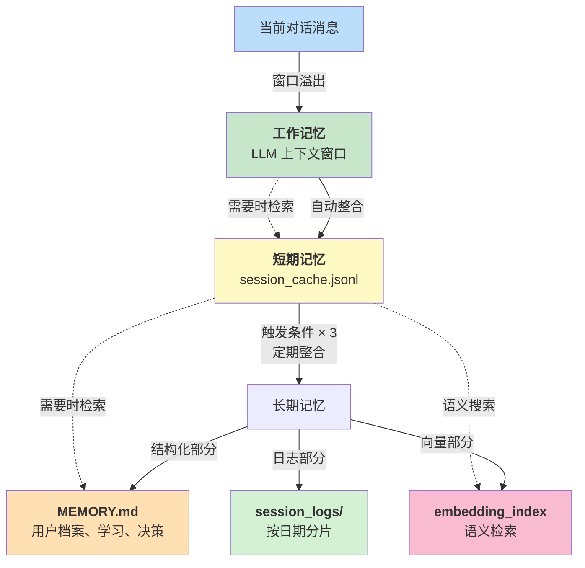
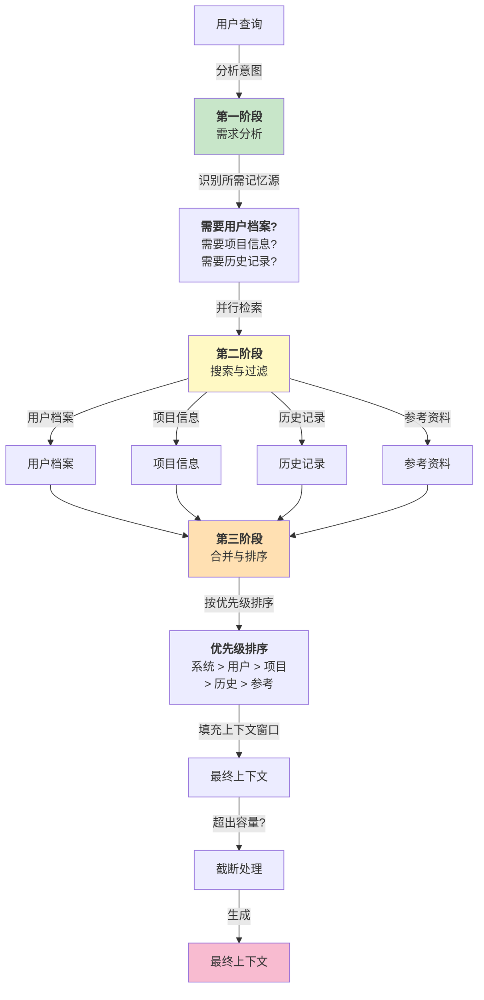
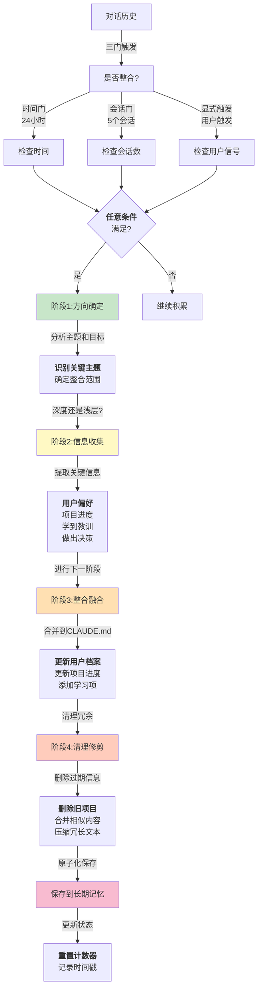
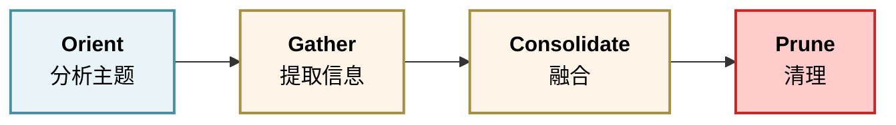

# 第六章：记忆与上下文子系统

记忆是智能体系统的第二大脑。没有记忆，Agent 无法学习，每次对话都是从零开始。记忆系统决定了智能体是否能够：

- 记住用户的偏好和背景
- 在多个会话间保持一致性
- 学习和改进其行为
- 高效地处理长时对话（通过压缩而非简单截断）

本章将深入 Harness 的记忆设计，对比 Claude Code 和 OpenClaw 的不同方法。

**核心设计问题**

1. **多层架构**：工作记忆（当前会话）、短期记忆（会话间）、长期记忆（持久化）如何划分？
2. **可写入性**：Agent 不仅读取记忆，还要能更新和创建记忆
3. **组装能力**：如何从多个来源的记忆组装出完整的上下文？
4. **整合机制**：长对话中，何时触发记忆整合（压缩/清理）？

**两个参考系统**

**Claude Code 的三层模型**：

- 对话历史：当前会话的完整消息
- CLAUDE.md：用户反馈、项目信息、参考资料
- 自动整合管道：本书以 autoDream 为名的示意管道，三门触发、四阶段整合(Orient→Gather→Consolidate→Prune)，详见 6.4（非官方内置引擎）

**OpenClaw 的双层模型**：

- MEMORY.md：永久性记忆（关键事实、学习、历史）
- 每日日志：当前会话的详细记录
- `memory_search` 语义检索：找到相关的历史信息
- 自动刷写：压缩前先把关键事实落盘（本书示例以 70% 上下文为触发点）

记忆系统是智能体系统中最复杂但也最关键的子系统之一。

## 1. Harness 中的记忆系统工程设计

记忆系统是智能体长期学习和适应的基础。关于记忆的认知模型、三层架构理论（工作、短期和长期记忆），以及非参数记忆与参数记忆的根本区别，请参阅《智能体 AI 权威指南》第三章。同时，更多关于记忆系统在上下文工程中的应用，请参阅《上下文工程权威指南》第四章。

> 💡 **理论参考**：
>
> * 《智能体 AI 权威指南》第三章(3.1-3.3)介绍了多层记忆的认知模型和工程映射
> * 《上下文工程权威指南》第四章讨论了上下文管理与记忆的关系

本节重点讨论 **Harness 框架中的记忆实现**，特别是 **autoDream 系统** 和 **记忆整合管道** 的工程细节。

### 1.1 Harness 记忆架构概览

Harness 采用了一个经过验证的三层架构，但针对多任务、多工作流的场景做了特殊优化：



图 6-1：Harness 三层记忆架构

**各层特性**：

1. **工作记忆**：完全委托给 LLM 上下文管理，Harness 无需干预
2. **短期记忆**：轻量化的会话缓存（JSON 格式），存储过去 10 个会话的摘要
3. **长期记忆**：组合式存储，分为三个子系统

### 1.2 autoDream 系统：记忆整合管道

autoDream 是 Harness 的自动记忆整合系统，负责将会话数据定期整合到长期记忆。它的设计借鉴了 Claude Code 的思想，但针对多工作流、多用户的场景进行了扩展。

> 注：Anthropic 于 2026-05-06 在 Managed Agents 中推出了同类官方机制 **Dreaming**（会话间异步整合记忆），与本节 autoDream 的三门触发 + 四阶段管道思路一致，可作为托管侧参照实现。详见附录 C 时效快照。

#### 整合触发的三门机制

autoDream 不是持续运行，而是在满足 **至少一个** 触发条件时才激活：

```python
import time

class MemoryConsolidationTrigger:
    """记忆整合触发器"""

    def __init__(self, config):
        self.time_threshold = config.get("time_threshold", 86400)  # 24小时
        self.session_threshold = config.get("session_threshold", 5)  # 5个会话
        self.last_consolidation_time = time.time()
        self.session_count_since_consolidation = 0

    def should_consolidate(self) -> bool:
        """检查是否应该触发整合"""
        # 触发条件1:时间门槛
        if time.time() - self.last_consolidation_time > self.time_threshold:
            return True

        # 触发条件2:会话计数门槛
        if self.session_count_since_consolidation >= self.session_threshold:
            return True

        # 触发条件3:显式锁定(用户或系统主动触发)
        # 这通过外部API调用实现:POST /consolidate

        return False

    def on_session_end(self):
        """会话结束时调用"""
        self.session_count_since_consolidation += 1
```

#### 四阶段整合管道

一旦触发，autoDream 执行标准化的四阶段流程：

```python
import time
from typing import List, Dict, Any

class MemoryConsolidationPipeline:
    """记忆整合管道"""

    async def consolidate(self, workflow_id: str, session_history: List[Dict[str, Any]]):
        """执行完整的整合流程"""

        # 阶段1:Orient - 分析会话目标和上下文
        orientation = await self.orient_phase(workflow_id, session_history)
        # 结果:{goals, context, decisions, new_patterns}

        # 阶段2:Gather - 从对话历史提取关键信息
        gathered = await self.gather_phase(session_history, orientation)
        # 结果:{facts, preferences, outcomes, patterns}

        # 阶段3:Consolidate - 合并到长期记忆,避免冗余
        consolidated = await self.consolidate_phase(workflow_id, gathered)
        # 结果:更新了MEMORY.md, embedding_index, session_logs

        # 阶段4:Prune - 删除过期或低价值的信息
        pruned = await self.prune_phase(workflow_id, consolidated)
        # 结果:清理过时的会话摘要

        return {
            "orientation": orientation,
            "gathered": gathered,
            "consolidated": consolidated,
            "pruned": pruned
        }

    async def orient_phase(self, workflow_id: str, session_history: List[Message]):
        """阶段1:Orient - 理解会话的核心目标和决策点"""
        prompt = f"""
分析这个工作流的会话记录,提供:
1. 会话的核心目标(1-3个)
2. 关键的决策点和选择(2-3个)
3. 发现的系统级模式或约束(2-3个)
4. 用户展现的新的偏好或工作风格(如有)

会话记录:
{self._format_session_history(session_history)}
"""
        # 调用LLM进行分析
        return await self.llm.analyze(prompt)

    async def gather_phase(self, session_history: List[Message], orientation: dict):
        """阶段2:Gather - 提取结构化事实"""
        facts = {
            "user_preferences": [],
            "task_outcomes": [],
            "technical_discoveries": [],
            "system_constraints": []
        }

        for message in session_history:
            if message.role == "user":
                # 从用户消息提取偏好
                pref = self._extract_preference(message.content)
                if pref:
                    facts["user_preferences"].append(pref)

            elif message.role == "assistant":
                # 从助手消息提取成果
                outcome = self._extract_outcome(message.content)
                if outcome:
                    facts["task_outcomes"].append(outcome)

        return facts

    async def consolidate_phase(self, workflow_id: str, gathered: dict):
        """阶段3:Consolidate - 合并到长期记忆,避免冗余"""

        # 读取现有MEMORY.md
        memory = await self._load_memory_file(workflow_id)

        # 去重:与现有内容比较,只添加新信息
        new_facts = await self._deduplicate(gathered["user_preferences"], memory.get("user_preferences", []))

        # 更新MEMORY.md
        memory["user_preferences"].extend(new_facts)
        memory["last_updated"] = time.time()

        # 更新向量索引(用于语义搜索)
        embeddings = await self._embed_facts(gathered)
        await self._upsert_to_vector_index(workflow_id, embeddings)

        # 追加到日志
        await self._append_to_session_log(workflow_id, gathered)

        return {"updated_memory": memory, "updated_embeddings": embeddings}

    async def prune_phase(self, workflow_id: str, consolidated: dict):
        """阶段4:Prune - 删除过期或低价值的信息"""

        memory = consolidated["updated_memory"]

        # 策略1:删除超过6个月的会话摘要
        cutoff_time = time.time() - 180 * 24 * 3600
        memory["session_summaries"] = [
            s for s in memory.get("session_summaries", [])
            if s.get("timestamp", 0) > cutoff_time
        ]

        # 策略2:删除重复或相似的用户偏好
        memory["user_preferences"] = await self._deduplicate_with_similarity(
            memory["user_preferences"],
            similarity_threshold=0.95
        )

        # 策略3:删除与当前工作无关的信息
        relevant_prefs = await self._filter_by_relevance(
            memory["user_preferences"],
            workflow_id,
            relevance_threshold=0.6
        )
        memory["user_preferences"] = relevant_prefs

        # 保存回磁盘
        await self._save_memory_file(workflow_id, memory)

        return {"pruned_memory": memory}
```

### 1.3 短期记忆与缓存策略

短期记忆的目的是快速恢复最近会话的上下文，无需每次都从长期记忆检索。

```python
class SessionMemoryCache:
    """会话记忆缓存(JSON格式)"""

    def __init__(self, max_sessions: int = 10):
        self.max_sessions = max_sessions
        # open() 不会展开 ~，需要 expanduser
        self.cache_file = os.path.expanduser("~/.harness/session_cache.jsonl")

    async def record_session_summary(self, workflow_id: str, session_data: dict):
        """记录一个会话的摘要"""
        summary = {
            "workflow_id": workflow_id,
            "timestamp": time.time(),
            "user_input": session_data.get("user_input", ""),
            "key_outputs": session_data.get("key_outputs", []),
            "decisions_made": session_data.get("decisions", []),
            "errors_encountered": session_data.get("errors", []),
        }

        # 追加到缓存
        with open(self.cache_file, "a") as f:
            f.write(json.dumps(summary) + "\n")

        # 如果超过max_sessions,删除最旧的
        await self._prune_old_sessions()

    async def _prune_old_sessions(self):
        """只保留最近 max_sessions 条会话摘要"""
        with open(self.cache_file, "r") as f:
            lines = f.readlines()
        if len(lines) > self.max_sessions:
            with open(self.cache_file, "w") as f:
                f.writelines(lines[-self.max_sessions:])

    async def get_recent_sessions(self, workflow_id: str, count: int = 5) -> List[dict]:
        """快速获取最近的几个会话"""
        sessions = []
        with open(self.cache_file, "r") as f:
            for line in f:
                session = json.loads(line)
                if session["workflow_id"] == workflow_id:
                    sessions.append(session)

        return sessions[-count:]  # 返回最近的count个
```

### 1.4 向量索引与语义检索

对于大规模的长期记忆，必须使用向量索引来支持高效的语义搜索。

#### 向量库选型对比

| 向量库          | 许可证              | 适用规模      | 2026 现状             |
| ------------ | ---------------- | --------- | ------------------- |
| **Hnswlib**  | Apache 2.0       | <1M 向量    | 稳定内存索引、C++ 优化、无运维成本 |
| **Qdrant**   | Apache 2.0/商业云   | 1M-10M 向量 | 高性能 Rust、K8s 部署成熟   |
| **pgvector** | PostgreSQL 许可    | <5M 向量    | HNSW 算法、深度 SQL 集成   |
| **Weaviate** | BSD-3-Clause/商业云 | 10M+ 向量   | 多模态支持、GraphQL API   |

**选型建议**：简单应用使用 Hnswlib，中等规模选 Qdrant，已有 PostgreSQL 基础设施选 pgvector，大规模企业级选 Weaviate。

```python
# EMBEDDING_DIM 需与所用 embedding 模型一致：
# text-embedding-3-small=1536, text-embedding-3-large=3072, voyage-3-large=1024

class MemoryVectorIndex:
    """向量索引用于语义搜索"""

    # 关键：维度必须与 embedding 模型匹配
    # 默认 1536 对应 text-embedding-3-small；如使用其他模型需修改
    EMBEDDING_DIM = 1536  # 默认使用 text-embedding-3-small 维度

    def __init__(self, index_path: str, embedding_dim: int = None):
        # 使用轻量级的向量库(如Hnswlib或Faiss)
        # dim 参数必须与所用 embedding 模型的输出维度一致
        dim = embedding_dim or self.EMBEDDING_DIM
        self.index = hnswlib.Index(space='cosine', dim=dim)
        self.index.load_index(index_path)
        self.metadata = {}  # 存储向量到原始数据的映射

    async def search_memory(self, query: str, top_k: int = 5) -> List[dict]:
        """语义搜索记忆"""
        # 将查询嵌入
        query_embedding = await self._embed(query)

        # 搜索最相似的向量
        labels, distances = self.index.knn_query(query_embedding, k=top_k)

        # 返回元数据
        results = [
            {
                "similarity_score": 1 - distances[0][i],  # 归一化
                "memory_content": self.metadata[label],
            }
            for i, label in enumerate(labels[0])
        ]

        return results
```

### 1.5 与 Claude Code 7 层架构的对比

Harness 的三层架构与 Claude Code 的七层递进式架构体现了不同的优化目标：

| 维度        | Harness                           | Claude Code               |
| --------- | --------------------------------- | ------------------------- |
| **触发精度**  | 三门机制（时间、计数、显式）                    | 七层防御，每层阈值独立               |
| **压缩策略**  | 统一的 autoDream 管道                  | 渐进式微压缩 → 完整压缩，差异巨大        |
| **存储媒介**  | 集中式（MEMORY.md + embedding\_index） | 分散式（工具结果冻结 + 会话笔记 + 梦想合并） |
| **成本结构**  | 整合时一次性成本较高                        | 前三层几乎无成本，第四层才产生明显费用       |
| **跨会话恢复** | 向量搜索 + 结构化查询                      | 预构建摘要注入，零查询成本             |

**设计启示**：Claude Code 的“冻结工具结果”策略（第 1-2 层）及“会话摘要预注入”（第 3 层）可直接借鉴至 Harness。特别是对于高频、短周期工作流，避免每次都触发完整 autoDream 管道能显著降低成本。

### 1.6 本小节小结

Harness 的记忆系统通过以下机制支持长期学习：

1. **三门触发机制**：通过时间、会话计数或显式触发来激活整合
2. **四阶段管道**：Orient→Gather→Consolidate→Prune 的标准化流程
3. **去重与去噪**：自动清理冗余和过期信息
4. **多模态存储**：结构化(MEMORY.md)、向量(embedding\_index)、日志(session\_logs)
5. **快速检索**：向量索引支持语义搜索，JSON 缓存支持秒级访问

关于记忆的认知基础和理论模型，请参阅《智能体 AI 权威指南》和《上下文工程权威指南》。

## 2. 可写入式智能体记忆构建

为了赋予智能体真正的学习和适应能力，需要构建完整的可写入式记忆系统。本节涵盖记忆的读写对称性设计、Frontmatter 元数据结构、写入时机策略以及 OpenClaw 的混合检索机制，最后讨论并发环境下的冲突解决方案。

### 2.1 记忆系统的读写对称性

传统的智能体记忆系统往往是 **单向的**：Agent 读取预设的记忆文件，但无法主动更新。这限制了智能体的自适应能力。真正强大的智能体系统应该支持 **可写入式记忆**——Agent 作为主动的参与者，既读取也创建和更新记忆。

可写入式记忆的关键特性：

1. **主动性**：Agent 在对话过程中识别值得记忆的信息，自主决定何时写入
2. **原子性**：记忆写入操作应该是原子的，避免部分更新导致的不一致
3. **可审计性**：每次写入都应该留下痕迹，支持版本回滚
4. **并发安全**：在多会话并发场景下，防止记忆冲突

### 2.2 记忆文件的 Frontmatter 结构

为了支持可写入式记忆，我们采用 **Markdown Frontmatter** 结构，将元数据与内容分离：

```yaml
---
type: episodic            # 记忆类型:user/feedback/project/reference/episodic
version: 3                # 版本号,每次更新递增
last_modified: 2024-01-15T14:30:00Z
modified_by: session_id   # 修改者的会话标识
confidence: 0.85          # 信息可信度(0-1),自动学习可降低
expiry: 2024-06-15        # 过期时间,可选
tags: [user_preference, performance]
---

# 记忆内容

实际的内容从这里开始...
```

各字段的含义：

* **type**：记忆的语义类别
  * `user`：用户档案信息（不改变的属性）
  * `feedback`：用户反馈和评估
  * `project`：项目或任务上下文
  * `reference`：可复用的代码、命令、模式
  * `episodic`：具体事件的记录
* **version**：支持版本追踪，允许回滚
* **last\_modified**：ISO 8601 时间戳
* **modified\_by**：记录是哪个会话或智能体实例修改的
* **confidence**：由智能体自评的信息可信度，用于后续搜索排序
* **expiry**：自动清理过期记忆
* **tags**：用于分类和检索的标签集

### 2.3 记忆写入时机策略

Agent 应该在以下时刻考虑写入记忆：

**显式写入信号** （高优先级）：

* 用户明确要求“记住这个”或“保存这个信息”
* 系统检测到错误或失败，需要记录教训
* 完成一个重要的里程碑或任务

**隐式写入信号** （中优先级）：

* 首次遇到新的用户偏好（如代码风格、工作习惯）
* 发现系统性的性能问题或优化机会
* 完成一个新的项目或学习领域

**实时写入信号** （低优先级）：

* 每个会话结束后的自动总结
* 长对话中的中间检查点

写入决策的伪代码：

```python
async def decide_write_memory(session_context, content):
    """判断是否应该写入记忆"""

    signals = []

    # 检查显式信号
    if "remember" in content.lower() or "记住" in content:
        signals.append(("explicit_user", 0.95))

    # 检查隐式信号
    if is_new_user_preference(content, session_context):
        signals.append(("new_preference", 0.7))

    if is_error_or_lesson_learned(content):
        signals.append(("learning", 0.8))

    if is_milestone_completion(content):
        signals.append(("milestone", 0.85))

    # 综合评分
    max_score = max([score for _, score in signals]) if signals else 0

    if max_score > 0.6:  # 阈值
        return True, dict(signals)
    return False, {}
```

### 2.4 Claude Code 的记忆类型分类

Claude Code 将记忆划分为四个类型，各有不同的更新策略：

**User Profiles**：

* 存储用户的基本属性、技能、工作风格
* 更新频率：低（通常用户主动告知）
* 示例：

  ```
  User: Alex
  - Programming level: Intermediate Python, Advanced JS
  - Preferred style: Concise, comments only for complex logic
  - Work context: Startup, rapid iteration preferred
  ```

**Feedback Records**：

* 用户对智能体建议的反馈
* 更新频率：每次用户评价时更新
* 示例：

  ```
  Feedback [2024-01-14]:
  - Rejected: Suggested async/await pattern
    Reason: Prefers synchronous code in this codebase
  - Approved: Refactoring suggestion for API layer
  ```

**Project Context**：

* 当前项目的架构、进度、关键文件
* 更新频率：每个功能完成后更新
* 示例：

  ```
  Project: WebApp v2.0
  Last activity: 2024-01-15
  - Modules: auth (done), api (in progress), ui (planned)
  - Key files: src/main.py, tests/
  - Architecture decision: Monolithic with plugins
  ```

**Reference Materials**：

* 可复用的代码片段、命令、文档链接
* 更新频率：中等（发现新的有用模式时添加）
* 示例：

  ```yaml
  ## Useful Commands
  - Test: pytest -v --cov
  - Deploy: make deploy-prod

  ## Code Patterns
  - Factory pattern for data access
  - Decorator for logging
  ```

### 2.5 OpenClaw 的 memory\_search 混合检索

OpenClaw 的可写入记忆通过 memory\_search 实现高效的读取，支持 **混合检索**：

**关键词检索阶段**：

```python
def keyword_search(query: str, memory_base: str) -> List[str]:
    """在 MEMORY.md 和日志中执行关键词匹配"""
    results = []
    keywords = query.lower().split()

    for memory_file in get_memory_files():
        content = read_file(memory_file)
        matches = [line for line in content.split('\n')
                   if any(kw in line.lower() for kw in keywords)]
        results.extend(matches)

    return results
```

**向量检索阶段**：

```python
def semantic_search(query: str, embedding_index) -> List[str]:
    """使用向量相似度查找相关内容"""
    query_embedding = embed(query)

    scores = []
    for memory_id, stored_embedding in embedding_index.items():
        similarity = cosine_similarity(query_embedding, stored_embedding)
        scores.append((memory_id, similarity))

    # 返回相似度最高的 Top-K（按相似度排序，而非默认的按 memory_id 排序）
    return [mid for mid, _ in sorted(scores, key=lambda x: x[1], reverse=True)[:5]]
```

**混合排序**：

```python
def hybrid_search(query: str, memory_base: str, embedding_index) -> List[str]:
    """组合关键词和向量搜索结果"""
    kw_results = keyword_search(query, memory_base)
    sem_results = semantic_search(query, embedding_index)

    # 融合:先返回同时匹配两者的结果,再返回单一匹配
    combined = set(kw_results) & set(sem_results)
    rest = (set(kw_results) | set(sem_results)) - combined

    return list(combined) + list(rest)
```

这种混合检索的优势在于：

* **精确性**：关键词搜索捕获精确的事实
* **泛化性**：向量搜索发现语义相似但词汇不同的信息
* **效率**：分阶段执行避免全向量扫描

### 2.6 写入冲突解决

在多会话并发环境下，多个智能体实例可能同时修改同一个记忆文件。冲突解决策略：

**版本号机制**：

```python
def write_memory_atomic(memory_id: str, new_content: str,
                        expected_version: int) -> bool:
    """原子式写入,基于版本号"""
    current = read_memory(memory_id)

    if current['version'] != expected_version:
        # 版本冲突,进行 3-way merge（基础版本从版本历史中取写入方所基于的那一版）
        base = read_memory_version(memory_id, expected_version)
        return merge_versions(base['content'], current['content'], new_content)

    new_version = {
        'version': expected_version + 1,
        'last_modified': now(),
        'modified_by': current_session_id(),
        'content': new_content
    }

    return atomic_write(memory_id, new_version)
```

**3-way Merge 策略**： 当版本冲突时，比较三个版本的差异（基础版本、当前版本、新版本），智能合并：

```python
def merge_versions(base, current, new):
    """3-way merge 用于记忆文件"""
    # 简化示例:按行级别的 diff
    base_lines = base.split('\n')
    curr_lines = current.split('\n')
    new_lines = new.split('\n')

    merged = []
    for i, (b, c, n) in enumerate(zip(base_lines, curr_lines, new_lines)):
        if c == n:  # 无冲突
            merged.append(c)
        elif b == c:  # 只有新版本改动
            merged.append(n)
        elif b == n:  # 只有当前版本改动
            merged.append(c)
        else:  # 双向改动,标记为冲突
            merged.append(f"<<< CONFLICT >>>\n{c}\n---\n{n}\n>>>")

    return '\n'.join(merged)
```

### 2.7 记忆写入工具的接口

对智能体暴露的记忆写入接口应该简洁明确：

```python
class MemoryWriter:
    """Agent 可调用的记忆写入工具"""

    async def save_user_profile(self, key: str, value: any) -> bool:
        """保存用户属性"""
        pass

    async def record_feedback(self, action: str, approved: bool,
                              reason: str) -> bool:
        """记录用户反馈"""
        pass

    async def update_project_context(self, updates: dict) -> bool:
        """更新项目信息"""
        pass

    async def add_reference(self, category: str, content: str,
                            tags: List[str]) -> bool:
        """添加参考资料"""
        pass

    async def record_lesson(self, lesson: str, confidence: float) -> bool:
        """记录学到的教训"""
        pass
```

每次写入都应该触发异步验证和索引更新，确保后续的检索不会出现不一致的状态。

下一节将探讨如何从多个记忆源组装出完整的上下文，为智能体的决策提供支持。

## 3. 上下文组装引擎与缓存策略

上下文的质量直接决定智能体的推理能力，但来自多个源的信息如何高效组装成最优上下文是一个复杂问题。本节介绍静态与动态上下文的分离、三阶段组装流程、Claude Code 的动态边界机制、OpenClaw 的插件化架构，以及通过缓存策略提升性能的方法。

### 3.1 上下文组装的挑战

智能体的推理质量高度依赖于上下文的质量和完整性。但是，一个实时的智能体系统通常要从多个不同的来源拼凑上下文：

* **对话历史**：当前和过去会话的消息
* **用户档案**：用户的偏好、背景、技能
* **项目信息**：当前任务的背景、进度、关键决策
* **参考资料**：可用的代码、文档、最佳实践
* **系统状态**：Agent 本身的能力、当前限制、已知问题

这些来源有不同的更新频率、大小、重要性。简单地将所有内容连接会导致：

1. **上下文膨胀**：超出 LLM 的有效处理能力
2. **噪音淹没信号**：重要信息被海量细节隐埋
3. **冷启动问题**：新会话如何快速获得关键背景

上下文组装引擎的目标是 **动态选择和排序** 这些来源的内容，在容量约束下最大化信息密度。

一个经常被低估的事实是：**表观的模型质量，本质上是上下文质量**。Sebastian Raschka 在分析 Coding Agent 架构时指出，同一个模型在精心设计的 Harness 中表现出的能力，远超在普通聊天界面中的表现。这种差异并非来自模型本身，而是来自 Harness 为模型提供的上下文质量——包括相关的项目信息、精确的工具描述、恰当的历史记录。从这个视角看，上下文组装引擎不仅是一个技术组件，而是决定整个智能体“智商”的关键因素。

### 3.2 静态上下文 vs 动态上下文

上下文可分为两类：

**静态上下文** (Static Context)：

* 在会话期间基本不变的信息
* 示例：用户档案、系统能力说明、工具定义
* 特点：高复用性，可缓存

**动态上下文** (Dynamic Context)：

* 因用户当前目标而变化的信息
* 示例：相关的历史记录、当前项目进度、最近的执行结果
* 特点：低复用性，需要实时生成

高效的上下文管理应该：

1. **缓存静态部分**，避免每次重复计算
2. **按需选择动态部分**，避免无关内容
3. **优先级排序**，确保关键信息不被截断

### 3.3 上下文组装的三阶段流程

上下文组装过程分为三个关键阶段，下面的流程图展示了完整的上下文组装管道：



图 6-2：上下文组装的三阶段流程

**需求分析阶段**：

使用轻量级分类器识别查询的类型，决定需要哪些记忆源：

```python
class ContextRequirement:
    """上下文需求规范"""
    needs_user_profile: bool = False  # 需要用户档案
    needs_project_context: bool = False  # 需要项目信息
    needs_recent_history: bool = False  # 需要最近历史
    needs_references: bool = False  # 需要参考资料
    needs_feedback: bool = False  # 需要反馈记录

def analyze_query(user_message: str) -> ContextRequirement:
    """分析查询内容,确定上下文需求"""
    query_lower = user_message.lower()

    req = ContextRequirement()

    # 启发式规则
    if any(word in query_lower for word in
           ["prefer", "style", "like", "habit"]):
        req.needs_user_profile = True

    if any(word in query_lower for word in
           ["project", "task", "status", "progress"]):
        req.needs_project_context = True

    if any(word in query_lower for word in
           ["previous", "before", "last time", "remember"]):
        req.needs_recent_history = True

    if any(word in query_lower for word in
           ["example", "sample", "pattern", "how to"]):
        req.needs_references = True

    return req
```

**搜索与过滤阶段**：

根据需求，从各记忆源并行检索：

```python
async def search_memory_sources(requirement: ContextRequirement,
                                query: str,
                                memory_manager) -> MemorySearchResult:
    """并行搜索多个记忆源"""
    tasks = []

    if requirement.needs_user_profile:
        tasks.append(memory_manager.search_user_profile(query))

    if requirement.needs_project_context:
        tasks.append(memory_manager.search_project_context(query))

    if requirement.needs_recent_history:
        tasks.append(memory_manager.search_recent_history(query))

    if requirement.needs_references:
        tasks.append(memory_manager.search_references(query))

    results = await asyncio.gather(*tasks, return_exceptions=True)
    return MemorySearchResult(results)
```

**合并与排序阶段**：

将检索结果合并，按相关性和优先级排序，然后填充上下文直到达到容量限制：

```python
def assemble_context(user_message: str,
                     search_result: MemorySearchResult,
                     system_prompt: str,
                     token_budget: int = 50000) -> str:
    """组装最终的上下文"""

    # 优先级:系统提示 > 用户档案 > 项目信息 > 历史 > 参考
    prioritized_items = [
        ("system", system_prompt, 100),
        ("user_profile", search_result.user_profile, 90),
        ("project", search_result.project_context, 80),
        ("history", search_result.recent_history, 70),
        ("references", search_result.references, 60),
    ]

    # 按优先级排序
    prioritized_items.sort(key=lambda x: x[2], reverse=True)

    assembled = []
    current_tokens = 0

    for section_name, content, _ in prioritized_items:
        if not content:
            continue

        content_tokens = estimate_tokens(content)

        if current_tokens + content_tokens <= token_budget:
            assembled.append(f"## {section_name}\n{content}")
            current_tokens += content_tokens
        else:
            # 容量不足,尝试截断
            remaining = token_budget - current_tokens
            if remaining > 100:  # 最少保留 100 tokens
                truncated = truncate_to_tokens(content, remaining)
                assembled.append(f"## {section_name} (truncated)\n{truncated}")
            break

    return '\n\n'.join(assembled)
```

### 3.4 Claude Code 的 SYSTEM\_PROMPT\_DYNAMIC\_BOUNDARY

Claude Code 采用了一个聪明的策略来管理上下文大小的不确定性—— **动态边界机制**：

定义一个 **保护区** (Protected Boundary)，其内包含：

* 系统提示
* 当前会话的关键信息
* 用户最新的 1-2 条消息

这个保护区的大小是固定的（下表示例中约 7% 的上下文窗口），不会被其他内容侵占。剩余的空间（约 93%）用于动态上下文：

| 区域                             | 内容                    | 占比          |
| ------------------------------ | --------------------- | ----------- |
| **保护区(Protected)**             | System Prompt         | \~2%        |
|                                | Current User Messages | \~5%        |
| **动态区(Dynamic Context Space)** | User Profile          | 按需          |
|                                | Project Context       | 按需          |
|                                | Recent History        | 按需          |
|                                | References            | 按需          |
|                                | Free Space (buffer)   | 剩余          |
| **合计**                         | Total Context Window  | 200K tokens |

这样做的好处是：

1. **可预测性**：系统提示和关键信息永不被截断
2. **灵活性**：动态内容可以从几 KB 扩展到几百 KB
3. **简单性**：不需要复杂的优先级算法，只要在约束内填充

### 3.5 OpenClaw 的 ContextEngine 插件架构

OpenClaw 采用了 **插件化的上下文生成**，每个记忆源对应一个插件：

```python
class ContextPlugin:
    """上下文插件的基类"""

    async def generate(self, query: str, token_budget: int) -> str:
        """生成该插件贡献的上下文部分"""
        raise NotImplementedError

    @property
    def priority(self) -> int:
        """该插件的优先级(0-100)"""
        raise NotImplementedError

    @property
    def name(self) -> str:
        """插件名称"""
        raise NotImplementedError
```

具体实现示例：

```python
class UserProfilePlugin(ContextPlugin):
    """用户档案插件"""

    @property
    def name(self) -> str:
        return "user_profile"

    @property
    def priority(self) -> int:
        return 90

    async def generate(self, query: str, token_budget: int) -> str:
        profile = await self.memory_manager.get_user_profile()
        return self._format_profile(profile, token_budget)

class ProjectContextPlugin(ContextPlugin):
    """项目上下文插件"""

    @property
    def name(self) -> str:
        return "project"

    @property
    def priority(self) -> int:
        return 80

    async def generate(self, query: str, token_budget: int) -> str:
        # 搜索相关项目信息
        relevant_info = await self.search_project_db(query)
        return self._format_project_info(relevant_info, token_budget)
```

ContextEngine 协调这些插件的执行：

```python
class ContextEngine:
    """上下文生成引擎"""

    def __init__(self):
        self.plugins: Dict[str, ContextPlugin] = {}

    def register_plugin(self, plugin: ContextPlugin):
        """注册上下文插件"""
        self.plugins[plugin.name] = plugin

    async def assemble(self, query: str,
                       token_budget: int = 100000) -> str:
        """根据查询组装上下文"""
        # 按优先级排序插件
        sorted_plugins = sorted(
            self.plugins.values(),
            key=lambda p: p.priority,
            reverse=True
        )

        assembled = []
        remaining_tokens = token_budget

        for plugin in sorted_plugins:
            if remaining_tokens < 500:  # 最小阈值
                break

            try:
                content = await plugin.generate(query, remaining_tokens)
                if content:
                    assembled.append(content)
                    remaining_tokens -= estimate_tokens(content)
            except Exception as e:
                logger.warning(f"Plugin {plugin.name} failed: {e}")

        return '\n\n'.join(assembled)
```

这种插件化架构的优势：

* **模块化**：新的上下文源无需修改核心引擎
* **容错性**：单个插件失败不影响整体
* **可观测性**：易于追踪每个插件的贡献
* **可测试性**：可以独立测试每个插件

### 3.6 缓存策略

上下文组装的性能瓶颈往往在于重复的搜索和格式化。有效的缓存可以加速 10-100 倍：

```python
class ContextCache:
    """上下文缓存,支持失效管理"""

    def __init__(self, ttl_seconds: int = 300):
        self.cache: Dict[str, CacheEntry] = {}
        self.ttl = ttl_seconds

    def get(self, key: str) -> Optional[str]:
        """获取缓存"""
        if key in self.cache:
            entry = self.cache[key]
            if time.time() - entry.timestamp < self.ttl:
                return entry.value
            else:
                del self.cache[key]
        return None

    def set(self, key: str, value: str, tags: List[str] = None):
        """设置缓存,关联标签用于批量失效"""
        self.cache[key] = CacheEntry(value, time.time(), tags or [])

    def invalidate_by_tag(self, tag: str):
        """按标签批量失效缓存"""
        to_delete = [k for k, v in self.cache.items()
                     if tag in (v.tags or [])]
        for k in to_delete:
            del self.cache[k]
```

缓存失效时机：

* **用户档案变更**：失效所有包含 user\_profile 标签的缓存
* **项目信息更新**：失效 project 标签的缓存
* **时间过期**：使用 TTL 自动清理

下一节将深入探讨如何在长对话中自动触发记忆整合，防止上下文溢出。

## 4. 记忆整合与自动化维护

长对话中的记忆不断膨胀会导致检索低效和成本飙升，需要定期的整合与清理。本节探讨记忆整合的必要性，并用 autoDream 作为本书自定义的示意性记忆整合管道，说明三门触发、四阶段流程、索引维护策略以及监控和调优方法。不要把 autoDream 理解为 Claude Code 的官方内置引擎。

### 4.1 记忆整合的必要性

在长对话或多轮会话中，Agent 系统会积累大量的上下文。纯粹地保留所有历史会导致：

1. **上下文膨胀**：LLM 上下文窗口被填满，新的对话空间受限
2. **检索低效**：搜索需要扫描巨量信息，延迟增加
3. **成本上升**：对于按 token 计费的 API，成本线性增长

**记忆整合** (Memory Consolidation)是解决方案：定期将分散的、细粒度的信息压缩、融合成更高层次的摘要，同时保留关键细节，形成稳定的长期记忆。

记忆整合的目标：

* **无损压缩**：重要信息不丢失
* **语义保留**：摘要捕捉原始内容的核心含义
* **可追溯**：保留原始记录供验证
* **增量更新**：仅处理新增内容，避免重复计算

### 4.2 autoDream 管道详解

本书将一个自动记忆整合管道命名为 **autoDream**，用来表达可复用的工程模式。其核心是三门触发 + 四阶段流程。

#### 三门触发机制

autoDream 通过三个独立的触发条件来决定是否启动整合：

**1. 时间门(Time Gate)**：

```python
from datetime import datetime

def check_time_gate(last_consolidation: datetime) -> bool:
    """检查距离上次整合是否超过 24 小时"""
    elapsed = datetime.now() - last_consolidation
    return elapsed.total_seconds() > 86400  # 24 hours
```

**2. 会话门(Session Gate)**：

```python
def check_session_gate(session_count_since_consolidation: int) -> bool:
    """检查是否已完成 5 个新会话"""
    return session_count_since_consolidation >= 5
```

**3. 显式锁(Explicit Lock)**：

```python
def check_explicit_lock(user_signal: str) -> bool:
    """用户明确触发整合(如"保存进度")"""
    return "consolidate" in user_signal.lower() or \
           "save progress" in user_signal.lower()
```

三个条件采用 **或逻辑**：只要任意一个满足，就启动整合：

```python
def should_consolidate(state: ConsolidationState) -> bool:
    """判断是否应该触发 autoDream"""
    time_gate = check_time_gate(state.last_consolidation)
    session_gate = check_session_gate(state.sessions_since_consolidation)
    explicit_lock = check_explicit_lock(state.latest_user_message)

    return time_gate or session_gate or explicit_lock
```

这种设计的好处在于 **灵活性**——用户可以显式触发，系统也会自动触发，确保记忆不会无限膨胀。

#### 四阶段整合流程

一旦触发整合，autoDream 执行四个阶段：

**阶段 1：Orient（方向确定）**

分析最近对话的主题和目标，确定整合的范围和重点：

```python
async def orient_phase(recent_conversations: List[Message],
                       current_project: str) -> OrientResult:
    """确定整合的方向和范围"""

    # 提取最近对话的摘要
    summary = await extract_summary(recent_conversations)

    # 识别关键主题
    topics = await identify_topics(summary)

    # 确定与项目的相关性
    project_relevance = await assess_relevance(summary, current_project)

    return OrientResult(
        summary=summary,
        topics=topics,
        project_relevance=project_relevance,
        scope="deep" if project_relevance > 0.7 else "shallow"
    )
```

**阶段 2：Gather（信息收集）**

从对话历史中提取关键信息，按类型分类：

```python
async def gather_phase(conversations: List[Message],
                       orient_result: OrientResult) -> GatherResult:
    """收集需要记忆的关键信息"""

    gathered = {
        'user_preferences': [],  # 用户偏好
        'project_updates': [],   # 项目进度
        'learned_lessons': [],   # 学到的教训
        'decisions': [],         # 做出的决策
        'errors': []            # 发现的错误
    }

    for msg in conversations:
        if orient_result.scope == "deep":
            # 深度收集:细粒度提取
            gathered['user_preferences'].extend(
                extract_user_preferences(msg)
            )
            gathered['project_updates'].extend(
                extract_project_updates(msg)
            )
        else:
            # 浅层收集:仅提取顶级要点
            gathered['decisions'].extend(
                extract_top_level_decisions(msg)
            )

    return GatherResult(gathered=gathered)
```

**阶段 3：Consolidate（整合融合）**

将收集的信息融合到 CLAUDE.md，检测并解决冲突：

```python
async def consolidate_phase(gather_result: GatherResult,
                            claude_md: dict) -> ConsolidateResult:
    """融合新信息到长期记忆"""

    updated_claude_md = copy.deepcopy(claude_md)

    # 更新用户档案
    for pref in gather_result.gathered['user_preferences']:
        existing = find_existing(pref, updated_claude_md['user_profile'])
        if existing:
            # 冲突解决:新信息覆盖(可配置)
            updated_claude_md['user_profile'][existing['key']] = pref
        else:
            updated_claude_md['user_profile'].append(pref)

    # 更新项目进度
    for update in gather_result.gathered['project_updates']:
        category = update['category']
        updated_claude_md['project_context'][category].extend(
            update['items']
        )

    # 添加教训和决策到参考资料
    for lesson in gather_result.gathered['learned_lessons']:
        updated_claude_md['learning'].append({
            'date': datetime.now(),
            'content': lesson,
            'confidence': 0.8
        })

    return ConsolidateResult(updated=updated_claude_md)
```

**阶段 4：Prune（清理修剪）**

删除冗余、过期或低价值的信息，保持记忆库的精炼：

```python
async def prune_phase(consolidated: dict,
                      config: PruneConfig) -> dict:
    """清理过期或冗余信息"""

    pruned = copy.deepcopy(consolidated)

    # 删除过期的项目信息（project_context 是“类别 -> 条目列表”的字典，
    # 与 consolidate_phase 的写入结构保持一致）
    cutoff_date = datetime.now() - timedelta(days=config.expiry_days)
    pruned['project_context'] = {
        category: [
            item for item in items
            if item.get('date', datetime.now()) > cutoff_date
        ]
        for category, items in pruned['project_context'].items()
    }

    # 删除置信度过低的学习项
    pruned['learning'] = [
        item for item in pruned['learning']
        if item.get('confidence', 1.0) > config.confidence_threshold
    ]

    # 合并相似的信息
    pruned['user_profile'] = deduplicate_profiles(
        pruned['user_profile']
    )

    # 压缩冗长的文本
    pruned['references'] = compress_references(
        pruned['references'],
        max_lines=config.max_reference_lines
    )

    return pruned
```

#### autoDream 的完整工作流

autoDream 采用四阶段整合流程，将分散的对话信息浓缩为高质量的长期记忆。下面的流程图展示了完整的工作流：



图 6-3：autoDream 四阶段整合流程

以下是 autoDream 四阶段整合流程的完整实现：

```python
async def autoDream_consolidation(state: ConsolidationState) -> bool:
    """autoDream 整合的完整流程(WAL-风格回滚)"""

    if not should_consolidate(state):
        return False

    # [WAL] 保存原始状态用于故障回滚
    original_claude_md = copy.deepcopy(state.claude_md)
    original_state = {
        "last_consolidation": state.last_consolidation,
        "sessions_since_consolidation": state.sessions_since_consolidation
    }

    try:
        # Phase 1: Orient
        orient_result = await orient_phase(
            state.recent_conversations,
            state.current_project
        )

        # Phase 2: Gather
        gather_result = await gather_phase(
            state.conversations,
            orient_result
        )

        # Phase 3: Consolidate
        consolidate_result = await consolidate_phase(
            gather_result,
            state.claude_md
        )

        # Phase 4: Prune
        pruned_result = await prune_phase(
            consolidate_result.updated,
            config=state.prune_config
        )

        # [WAL] 原子化保存：先写临时文件，再原子重命名
        await save_claude_md_atomic(pruned_result)

        # 状态更新(仅在持久化成功后)
        state.last_consolidation = datetime.now()
        state.sessions_since_consolidation = 0
        state.claude_md = pruned_result
        state.consolidation_failed_count = 0  # 重置失败计数

        logger.info("autoDream consolidation completed successfully")
        return True

    except Exception as e:
        logger.error(f"autoDream consolidation failed: {e}")

        # [WAL] 失败回滚：恢复到上次已知的好状态
        try:
            # 1. 放弃本次持久化,不修改磁盘上的 CLAUDE.md
            # 2. 恢复内存中的状态
            state.claude_md = original_claude_md
            state.last_consolidation = original_state["last_consolidation"]
            state.sessions_since_consolidation = original_state["sessions_since_consolidation"]

            # 3. 记录故障，允许下次重试
            state.consolidation_failed_count += 1
            if state.consolidation_failed_count > 3:
                logger.warning(
                    f"Multiple consolidation failures ({state.consolidation_failed_count}) detected. "
                    "Consider manual review of CLAUDE.md integrity."
                )
        except Exception as rollback_error:
            logger.critical(f"Rollback failed: {rollback_error}. Manual intervention required.")

        return False
```

### 4.3 OpenClaw 启发的自动刷写机制

OpenClaw 采用了更简单但高效的 **被动式刷写** 模式：

**触发条件**：

```python
def check_memory_flush_trigger(context_utilization: float) -> bool:
    """当上下文占用达到 70% 时触发刷写（本书示例默认值，非 OpenClaw 官方阈值）"""
    return context_utilization >= 0.7
```

**刷写流程**：

1. **生成日志摘要**：总结当前会话的关键事项
2. **提取可学习部分**：从日志中找出值得记忆的信息
3. **合并到 MEMORY.md**：追加新学习到长期记忆
4. **清空日志**：释放对话历史空间

```python
async def flush_memory_to_permanent(daily_log: str,
                                    memory_md: str) -> str:
    """自动刷写:将日志转换为长期记忆"""

    # 步骤 1:提取日志摘要
    summary = await summarize_log(daily_log, max_lines=10)

    # 步骤 2:从摘要中提取学习
    learnings = await extract_learnings(summary)

    # 步骤 3:合并到 MEMORY.md
    updated_memory = memory_md + "\n\n## Recent Learnings\n"
    for learning in learnings:
        updated_memory += f"- {learning}\n"

    # 步骤 4:版本控制
    updated_memory = add_metadata(
        updated_memory,
        last_updated=datetime.now(),
        version=increment_version(memory_md)
    )

    return updated_memory
```

这种方式的优势：

* **简洁高效**：单一触发条件，实现简单
* **确定性**：固定阈值提供清晰的触发点（本书示例取 70%；真实 OpenClaw 按“模型窗口减去内置预留余量”的绝对 Token 口径触发，详见 4.6.4）
* **成本低**：不需要复杂的阶段处理

但劣势是缺乏灵活性——无法按不同的优先级处理信息。

### 4.4 记忆索引维护

无论采用哪种整合策略，维护记忆的 **可搜索性** 至关重要。

**向量索引维护**：

```python
class EmbeddingIndex:
    """记忆的向量索引"""

    async def add_entry(self, memory_id: str, content: str):
        """添加新的记忆条目到索引"""
        embedding = await embed_text(content)
        self.index[memory_id] = {
            'embedding': embedding,
            'content': content,
            'timestamp': datetime.now()
        }

    async def search(self, query: str, top_k: int = 5) -> List[str]:
        """向量相似度搜索"""
        query_embedding = await embed_text(query)
        scores = []

        for mid, entry in self.index.items():
            similarity = cosine_similarity(
                query_embedding,
                entry['embedding']
            )
            scores.append((mid, similarity, entry['content']))

        # 按相似度排序,返回 Top-K
        return [content for _, _, content in
                sorted(scores, key=lambda x: x[1], reverse=True)[:top_k]]

    async def rebuild_incremental(self, new_entries: List[dict]):
        """增量更新索引"""
        for entry in new_entries:
            await self.add_entry(entry['id'], entry['content'])
```

**关键词索引维护**：

```python
class KeywordIndex:
    """基于关键词的反向索引"""

    def __init__(self):
        self.index: Dict[str, List[str]] = {}  # keyword -> memory_ids

    def add_entry(self, memory_id: str, content: str):
        """提取关键词并建立索引"""
        keywords = extract_keywords(content)  # 使用 TF-IDF 或更简单的方法

        for keyword in keywords:
            if keyword not in self.index:
                self.index[keyword] = []
            self.index[keyword].append(memory_id)

    def search(self, query: str) -> Set[str]:
        """关键词搜索返回所有匹配的记忆ID"""
        query_keywords = extract_keywords(query)
        matching_ids = set()

        for keyword in query_keywords:
            matching_ids.update(self.index.get(keyword, []))

        return matching_ids
```

**垃圾清理**：

```python
async def cleanup_old_memories(memory_store, embedding_index, keyword_index,
                              retention_days: int = 90):
    """定期清理过期记忆"""
    cutoff = datetime.now() - timedelta(days=retention_days)

    for memory_id in memory_store.list_all():
        metadata = memory_store.get_metadata(memory_id)

        if metadata['last_accessed'] < cutoff:
            logger.info(f"Removing unused memory: {memory_id}")
            memory_store.delete(memory_id)

            # 同步更新索引（仅对被删除的记忆执行）
            await embedding_index.remove(memory_id)
            keyword_index.remove(memory_id)
```

### 4.5 记忆整合的监控和调优

为了持续改进整合策略，应该监控关键指标：

```python
class ConsolidationMetrics:
    """记忆整合的性能指标"""

    def __init__(self):
        self.consolidation_latency = []  # 整合耗时
        self.context_compression_ratio = []  # 压缩率
        self.memory_size_growth = []  # 记忆库增长
        self.search_latency = []  # 搜索响应时间
        self.false_negatives = []  # 搜索未命中率

    async def record_consolidation(self,
                                   before_size: int,
                                   after_size: int,
                                   duration_ms: float):
        """记录整合操作"""
        ratio = after_size / before_size if before_size > 0 else 1.0
        self.consolidation_latency.append(duration_ms)
        self.context_compression_ratio.append(ratio)

    async def analyze(self) -> ConsolidationReport:
        """生成整合性能报告"""
        return ConsolidationReport(
            avg_latency=statistics.mean(self.consolidation_latency),
            avg_compression=statistics.mean(self.context_compression_ratio),
            p95_latency=statistics.quantiles(
                self.consolidation_latency,
                n=20
            )[18],  # 95th percentile
        )
```

通过监控这些指标，可以动态调整触发条件和清理策略，保持整个系统的最优性能。

下一节将通过实战代码，演示如何实现完整的 MiniHarness 记忆子系统。

## 5. MiniHarness 记忆系统架构

本节从“设计决策”角度讲解记忆系统的核心架构。完整实现代码已分离至 `lab/mini_harness/memory/` 目录，本文聚焦核心概念、关键权衡和实现要点。

### 5.1 存储层：MemoryEntry 与 MemoryStore

记忆条目是系统的基本单元。关键设计决策：

**为什么使用 Markdown + YAML frontmatter？**

选择文本格式而非二进制 DB，有三个考量：

1. “便于人工审查”：用户可直接读写存储文件，便于调试
2. “版本控制友好”：支持 Git diff，可追踪记忆演变
3. “轻量化”：无需外部数据库依赖

```python
from datetime import datetime
from typing import List, Optional

class MemoryEntry:
    """包含 5 个维度的记忆条目"""
    def __init__(self, memory_id: str, content: str,
                 memory_type: str = "episodic",     # 类型划分
                 tags: List[str] = None,
                 confidence: float = 1.0,           # 置信度
                 expiry: Optional[datetime] = None):  # 过期时间
        self.id = memory_id
        self.content = content
        self.type = memory_type
        self.tags = tags or []
        self.confidence = confidence
        self.expiry = expiry
        # 自动跟踪时间戳和版本
        self.created_at = datetime.now()
        self.last_modified = datetime.now()
        self.version = 1
```

**存储组织策略**：`by_type/` 分类结构。文件组织如下：

```
memory_dir/
  by_type/
    user/          （用户偏好、档案）
    project/       （项目进度、决策）
    episodic/      （每日交互记录）
    reference/     （模式、示例）
    feedback/      （用户反馈、评价）
```

这样设计的好处：

* “热路径优化”：查询特定类型无需全表扫描
* “权限隔离”：便于未来细粒度访问控制
* “过期清理”：批量删除某类型过期项时高效

关键实现位置：`lab/mini_harness/memory/storage.py`

### 5.2 上下文组装：需求驱动的选择性加载

ContextAssembler 解决核心问题：“给定用户输入，应该加载哪些记忆？”

**三层决策链路**：

```python
async def analyze_query(self, user_message: str) -> MemoryRequirement:
    """启发式规则:输入 -> 需求"""
    req = MemoryRequirement()
    msg_lower = user_message.lower()

    # 关键词触发
    if any(w in msg_lower for w in ['prefer', 'style', 'like']):
        req.needs_user_profile = True
    if any(w in msg_lower for w in ['project', 'task', 'status']):
        req.needs_project_context = True
    # ... 其他规则

    # 默认回退:当无法识别时加载用户档案
    if not any([...]):
        req.needs_user_profile = True
    return req
```

**为什么选择启发式而非 LLM？**

* “延迟考量”：LLM 调用需另外 1-2 秒，用户感受延迟
* “成本考量”：每次查询都调 LLM 会显著增加开销
* “可调试性”：规则清晰，易于审计和修改

**并行收集 + Token 预算**：

```python
async def assemble(self, user_message: str) -> str:
    requirement = await self.analyze_query(user_message)

    # 根据需求并行加载多个记忆源
    tasks = []
    if requirement.needs_user_profile:
        tasks.append(('user_profile', self._gather_user_profile()))
    if requirement.needs_project_context:
        tasks.append(('project', self._gather_project_context()))
    # ... 其他需求

    # 并行执行,节省 I/O 等待
    results = await asyncio.gather(*[task[1] for task in tasks])

    # 按优先级排序,限制总大小
    # 保证组装结果不超过 token_budget (如 50k)
```

关键权衡：“所有相关记忆”vs“上下文窗口限制”，通过 Token 预算解决。

关键实现位置：`lab/mini_harness/memory/context.py`

### 5.3 整合层：四阶段记忆整合

ConsolidationEngine 实现“睡眠学习”机制——后台自动处理信息。

**三门触发条件** （防止过度整合）：

```python
def should_consolidate(self) -> bool:
    # 时间门:距上次整合已超 24 小时
    time_gate = (datetime.now() - self.state.last_consolidation
                 > timedelta(hours=24))
    # 会话门:至少完成 5 次对话
    session_gate = self.state.sessions_since_consolidation >= 5
    # 显式门:由外部调用者手动触发(如用户主动要求)
    return time_gate or session_gate
```

**四阶段流程**（基于 autoDream）：

1. “确定阶段”(Orient)：分析最近消息的主题
2. “收集阶段”(Gather)：提取偏好、项目更新、教训、决策
3. “融合阶段”(Consolidate)：写入长期记忆
4. “清理阶段”(Prune)：删除过期项和低置信度项

```python
async def orient_phase(self, recent_messages: List[str]) -> Dict:
    """识别关键主题"""
    topics = set()
    for msg in recent_messages[-5:]:
        if any(w in msg.lower() for w in ['bug', 'error']):
            topics.add('issues')
        if any(w in msg.lower() for w in ['feature', 'new']):
            topics.add('features')
    return {'topics': list(topics)}

async def gather_phase(self, messages: List[str], orient_result: Dict) -> Dict[str, List[str]]:
    """从消息中抽取不同维度的信息"""
    gathered = {
        'user_preferences': [],      # 用户习惯
        'project_updates': [],       # 进度变化
        'learned_lessons': [],       # 知识积累
        'decisions': []              # 重要决策
    }
    # 按关键词提取相关句子
    return gathered

async def consolidate_phase(self, gathered: Dict) -> bool:
    """写入对应类型的存储"""
    if gathered['user_preferences']:
        entry = MemoryEntry(..., memory_type='user')
        await self.memory_store.save(entry)
    # ...
    return True

async def prune_phase(self) -> int:
    """清理两类项:过期项 + 低置信度项"""
    removed = await self.memory_store.cleanup_expired()
    # 清理 confidence < 0.3 且超过 30 天未更新的项
    low_confidence_count = await self.memory_store.cleanup_low_confidence(
        threshold=0.3, stale_days=30
    )
    return removed + low_confidence_count
```

**设计权衡**：

* “自动整合 vs 隐私”：整合过程完全本地化，不上传服务器
* “频率 vs 成本”：三门限制防止频繁整合浪费资源
* “保留 vs 清理”：置信度和过期时间的组合清理策略

关键实现位置：`lab/mini_harness/memory/consolidation.py`

### 5.4 系统集成要点

一个完整的使用流程包括：

```python
# 初始化三个核心组件
memory_store = MemoryStore("/path/to/memory")
assembler = ContextAssembler(memory_store, token_budget=50000)
consolidation = ConsolidationEngine(memory_store)

# 在每次对话前:组装上下文
context = await assembler.assemble(user_message)

# 在后台:定期整合
if consolidation.should_consolidate():
    success = await consolidation.consolidate(recent_messages)
```

**核心设计特点**：

1. “模块化”：存储、组装、整合相互独立，便于扩展
2. “异步友好”：全 async/await，支持并发操作
3. “可观测”：YAML frontmatter 和文本格式便于审查
4. “防御式编程”：大量 try-catch 和类型检查，处理不完整数据

完整代码参考 `lab/mini_harness/memory/` 目录的三个模块。

## 6. 本章小结

本章探讨了记忆与上下文管理这一关键子系统，以下是核心认识的汇总。

### 6.1 核心概念回顾

第六章深入探讨了智能体系统最复杂也最关键的子系统——记忆与上下文管理。核心认识包括：

#### 6.1.1 多层记忆架构的必要性

任何实用的智能体系统都需要三个独立的记忆层：

1. **工作记忆**：当前会话的实时上下文，驻留在 LLM 的上下文窗口中
2. **短期记忆**：跨会话但有时限的信息，存储在内存或快速存储中
3. **长期记忆**：持久化的知识库，支持高效的检索和版本控制

这三层形成递进的关系：工作记忆溢出时流入短期，短期积累到阈值时压缩进长期。Claude Code 实现完整的三层模型，而 OpenClaw 采用简化的双层模型（直接从工作跳到长期）。Harness 建议采用 **自适应三层**，在灵活性和复杂度之间取得平衡。

#### 6.1.2 可写入式记忆的重要性

传统的智能体记忆往往是单向的——Agent 只读取预设的记忆。强大的系统应该支持 Agent **主动创建和更新记忆**。这要求：

* **原子性保证**：避免并发修改导致的数据不一致
* **版本控制**：每次更新都可回溯
* **Frontmatter 结构**：分离元数据和内容，支持快速索引

Claude Code 提出的 **记忆类型分类** (user/feedback/project/reference)简化了这个问题——不同类型的记忆有不同的更新策略和检索方式。

#### 6.1.3 上下文组装是智能体性能的关键

不是所有的记忆都应该在每次请求时加载。高效的上下文组装需要：

* **需求分析**：识别查询需要哪些记忆源
* **并行检索**：从多个源并发获取内容
* **智能排序**：按优先级和相关性排列，优先加载关键信息
* **容量管理**：在 token 预算内最大化信息密度

Claude Code 的 **动态边界机制** （保护系统提示和关键信息，其余空间动态分配）是一个优雅的解决方案。

#### 6.1.4 记忆整合是长期对话的保证

在长对话中，如果不进行整合，上下文会无限膨胀。本书用 **autoDream** 作为示意性管道名称，表达一种可实现的整合范式：

* **三门触发**：时间门（24h）、会话门（5 次）、显式锁，降低整合的频率同时保证灵活性
* **四阶段流程**：Orient → Gather → Consolidate → Prune，分离关注点
* **增量更新**：仅处理新信息，避免重复计算

相比只依赖上下文溢出后的被动刷写，主动整合管道更加可控；具体触发阈值应由模型窗口、成本预算和任务风险决定。

### 6.2 两个参考系统的对比与权衡

| 特征    | Claude Code | OpenClaw     | Harness 建议 |
| ----- | ----------- | ------------ | ---------- |
| 架构复杂度 | 中（三层）       | 低（双层）        | 中（自适应三层）   |
| 整合策略  | 主动（定时+计数）   | 被动（阈值触发）     | 主动+被动混合    |
| 记忆类型  | 分类（4 类）     | 统一           | 分类（5+ 类）   |
| 检索方式  | 格式化提取       | 混合搜索（关键词+向量） | 混合+向量      |
| 实现难度  | 中等          | 易            | 中等         |
| 适用场景  | 项目驱动应用      | 对话型应用        | 通用应用       |

**选型建议**：

* 代码助手、研究工具 → 参考 Claude Code 的细粒度记忆
* 对话机器人、客服系统 → 参考 OpenClaw 的简洁性
* 通用智能体系统 → 采用 Harness 的自适应方案

### 6.3 实现要点

#### 6.3.1 存储抽象必须支持

* **Markdown Frontmatter**：元数据 + 内容分离，便于索引和版本控制
* **文件系统组织**：按类型分目录，支持快速列表和搜索
* **版本备份**：每次写入前备份，支持回滚

#### 6.3.2 上下文组装的三阶段模型

模型流程如下：

```
需求分析 → 并行搜索 → 优先级排序 + 容量管理
```

轻量级分类器识别查询需要哪些记忆，并行从各源检索，最后按优先级填充。

#### 6.3.3 整合的四阶段流程

流程如下：



每个阶段都有明确的责任，支持监控和调试。

#### 6.3.4 索引维护的必要性

* **向量索引**：语义搜索，捕捉语义相似的记忆
* **关键词索引**：精确搜索，捕捉精确的事实
* **过期清理**：定期删除低价值的旧项

### 6.4 常见陷阱与解决方案

#### 陷阱 1：记忆无限增长

**症状**：随着对话轮数增加，系统响应变慢，记忆库无限膨胀

**解决**：

* 设置明确的整合触发条件（时间或会话计数）
* 定期运行清理任务，删除过期项
* 监控记忆库大小，当超过阈值时强制整合

#### 陷阱 2：整合丢失关键信息

**症状**：某些重要上下文被压缩或删除，导致智能体犯重复错误

**解决**：

* 使用多级重要性评分，标记关键项
* 保留原始记录供审计，不直接删除
* 使用置信度字段，低置信度项保留更久

### 陷阱 3：上下文装配不当导致无关信息泛滥

**症状**：组装的上下文包含大量不相关信息，noise 淹没 signal

**解决**：

* 实现需求分析模块，精准选择记忆源
* 为每个记忆源设置相关性阈值
* 支持显式查询语言，用户可以指定需要的记忆类型

#### 陷阱 4：并发修改导致数据不一致

**症状**：多个智能体实例同时修改同一记忆，导致不可预测的结果

**解决**：

* 使用版本号或时间戳，实现乐观锁
* 提供 3-way merge 算法处理冲突
* 对关键记忆使用悲观锁（数据库事务）

### 6.5 性能优化要点

#### 6.5.1 缓存策略

* 静态上下文（系统提示、用户档案）可缓存 5-10 分钟
* 动态上下文（最近历史、项目进度）缓存 30 秒
* 使用 tag-based 失效，支持精细控制

#### 6.5.2 索引优化

* 使用倒排索引加速关键词搜索(O(1) lookup)
* 使用向量量化或产品量化加速向量搜索
* 定期重建索引，删除已删除项的索引条目

#### 6.5.3 异步处理

* 整合操作在后台执行，不阻塞主线程
* 索引更新异步进行
* 批量删除和清理操作优化为批量操作

### 6.6 监控和可观测性

为了保持系统健康，应该监控以下指标：

```python
class MemoryMetrics:
    memory_size_bytes: int        # 记忆库总大小
    consolidation_latency_ms: float  # 整合耗时
    context_assembly_latency_ms: float  # 上下文组装耗时
    search_hit_rate: float        # 搜索命中率
    cache_hit_rate: float         # 缓存命中率
    average_confidence: float     # 记忆平均置信度
    expired_entries_per_day: int  # 每日过期项数
```

通过这些指标，可以及时发现问题（如：缓存命中率下降 → 可能需要调整 TTL；搜索命中率下降 → 可能索引过时）。

### 6.7 下一步方向

#### 1. 分布式记忆系统

本章的实现都是单机的。对于多智能体并发场景，需要考虑：

* 中央记忆服务器（如 Redis 或 PostgreSQL）
* 分布式一致性协议(Raft、Paxos)
* 记忆同步和冲突解决

#### 2. 高级检索技术

* 混合检索：结合关键词和向量，提高召回率
* 知识图谱：将记忆组织成图结构，支持关联查询
* 多模态记忆：支持图像、音频等非文本形式

#### 3. 个性化和学习

* 智能体从用户反馈中主动调整记忆策略
* 动态调整整合触发条件，平衡成本和准确性
* 学习用户的查询模式，优化上下文组装

### 6.8 关键收获

1. **记忆是智能体的“第二大脑”**，良好的记忆系统是智能体能力的倍增器
2. **三层架构是标准范式**，工作 → 短期 → 长期的递进关系
3. **可写入性很关键**，Agent 应主动创建和更新记忆
4. **上下文装配不是简单连接**，需要需求分析、并行搜索、智能排序
5. **自动化整合不可避免**，但需要谨慎设计触发条件和流程

记忆系统的设计直接影响智能体的长期能力。投入时间建立坚实的记忆基础，会在后续的复杂应用中获得巨大收益。
