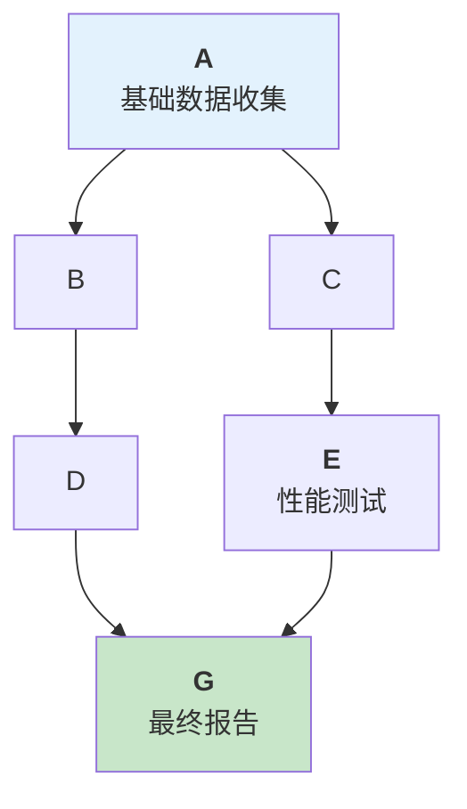
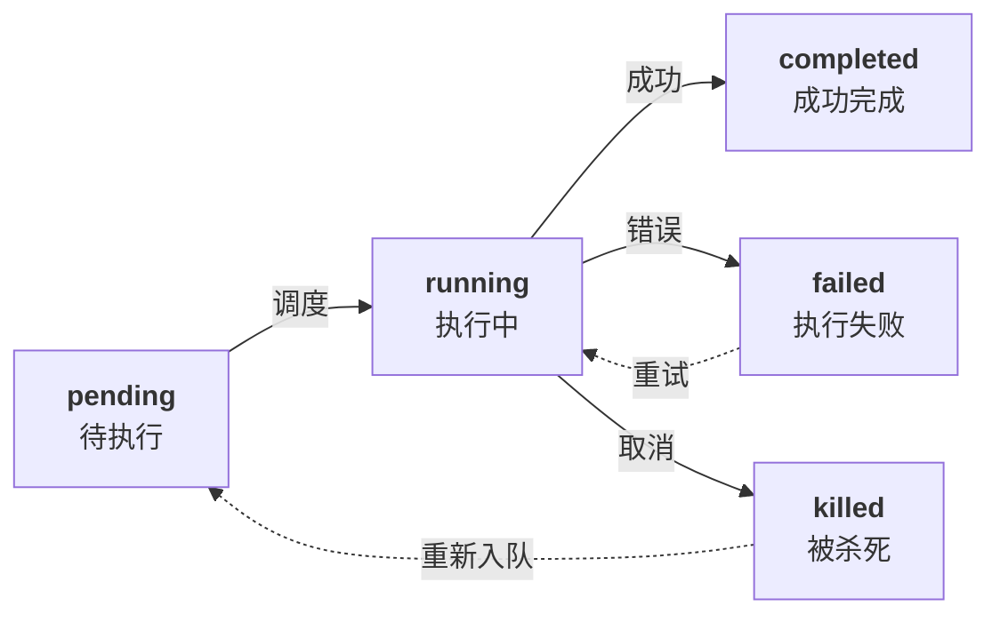
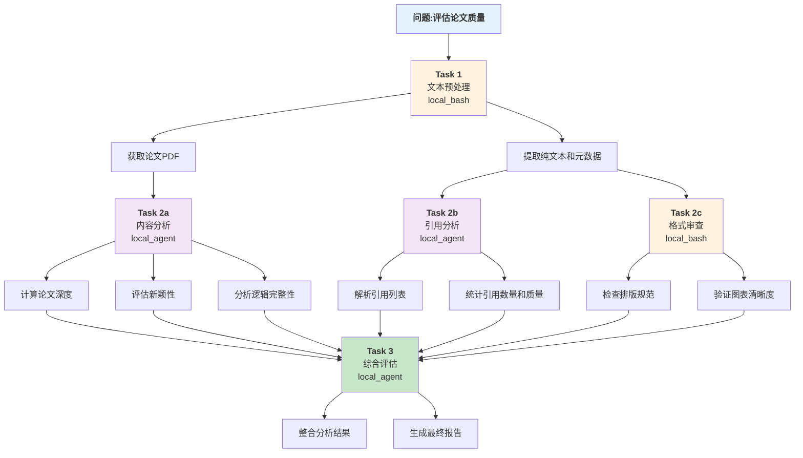

# 第八章：任务编排与工作流引擎

AI Agent 的核心竞争力不仅在于单个决策能力，更在于协调多个任务有序执行的能力。一个复杂的业务问题往往需要分解为多个相互依赖的子任务，这些任务需要按照特定的顺序执行，并在出现错误时能够自动恢复或人工干预。

本章深入探讨任务编排(Task Orchestration)与工作流引擎(Workflow Engine)的设计与实现。我们将从单 Agent 内的任务分解开始，逐步过渡到有限状态机的工作流定义，再到多智能体的协调模式，最后讨论智能体之间的通信机制。

**核心问题**

1. **单 Agent 如何处理多个不可原子的任务？** Claude Code 提供的 7 种 Task 类型（local\_bash、local\_agent、remote\_agent 等）为分解任务提供了基础。
2. **如何定义复杂的工作流逻辑？** Claude Code 的 Coordinator 模式采用 Research→Synthesis→Implementation→Verification 的四阶段方式；OpenClaw 的 Lobster 引擎使用 YAML 工作流定义，支持条件分支、循环和错误处理；LangChain Deep Agents 则用 Interpreter Skills 将确定性流程封装为可导入的代码模块（详见 8.2.7）。
3. **多智能体如何高效协作？** Claude Code 提供了 Task 协调机制，OpenClaw 支持多层级 Agent 组织。
4. **智能体间如何可靠通信？** 我们需要设计消息传递协议和共享状态管理机制。

**本章地位**

本章承前启后：

* **前承**：第 7 章介绍了模型集成与输出治理；
* **后启**：第 9 章将讨论 MCP 生态如何为任务提供工具支持，第 10 章讨论系统级编排的性能优化。

**关键概念预览**

* **任务分解图(DAG)**：将复杂问题分解为有向无环图上的节点
* **状态机**：工作流的核心抽象，定义状态转移和条件
* **多智能体协调**：并行/串行执行、信息传递、上下文隔离
* **通信协议**：消息格式、传递保证、交付顺序

## 1. 复杂任务分解与依赖建模

任务分解是处理复杂问题的关键能力，通过 DAG 模型实现任务间的依赖管理和并行执行。本节介绍 Claude Code 的七种 Task 类型、任务生命周期、依赖建模方法和粒度选择策略。

### 1.1 核心概念：DAG 与任务图

任务分解的根本目标是将不可原子的大问题拆分为可独立执行的小任务，这些任务形成一个 **有向无环图(Directed Acyclic Graph, DAG)**。图中的节点代表任务，边代表任务间的依赖关系。



图 8-1：任务分解的 DAG 模型

依赖关系：A 必须在 B、C 前完成；B 必须在 D 前完成；C 必须在 E 前完成；G 必须在 D、E 都完成后执行。

DAG 模型有三个关键性质：

1. **无环性**：不允许循环依赖，保证任务最终会终止
2. **拓扑排序**：存在一个执行顺序，使所有依赖都被满足
3. **并行潜力**：无直接依赖的任务可以并行执行

### 1.2 Claude Code 的 Task 类型系统

Claude Code 为任务分解提供了 **7 种 Task 类型**，每种类型用于不同的执行环境和场景。其中 MiniHarness 框架实现了三种核心执行类型（local\_bash、local\_agent、in\_process\_teammate），workflow 由第 8.5 节的工作流引擎示例覆盖但尚未接入任务分派路径，其余三种作为扩展留给读者自行实现。

#### 1.2.1 Task 类型总览

| Task 类型               | 执行环境       | 适用场景      | 智能体隔离 |
| --------------------- | ---------- | --------- | ----- |
| local\_bash           | 本地 shell   | 系统命令、文件操作 | 否     |
| local\_agent          | 本地 Agent   | 代码分析、生成   | 是     |
| remote\_agent         | 远程 Harness | 分布式计算     | 是     |
| in\_process\_teammate | 内存中子智能体    | 轻量级分工     | 是     |
| workflow              | Lobster 引擎 | 复杂工作流     | 部分    |
| monitor\_mcp          | MCP 监听     | 长期监控任务    | 是     |
| dream                 | 后台异步任务     | 并发非关键路径   | 是     |

**实现状态说明**：

* **MiniHarness 已实现**：`local_bash`、`local_agent`、`in_process_teammate` 三种任务执行类型提供了本地任务支持；`workflow` 由第 8.5 节的工作流引擎示例覆盖，尚未接入 `_execute_task()` 的任务分派路径
* **概念性设计/扩展**：`remote_agent`（分布式计算）、`monitor_mcp`（长期监控）、`dream`（异步后台任务）作为架构设计展示，具体实现留给读者根据需求自行实现

#### 1.2.2 Task ID 格式规范

每个 Task 都有一个全局唯一的 ID，格式为：

```
{parent_id}#{task_type}#{sequence}
```

例如：

* `root#local_agent#0`：根 Agent 下的第一个 local\_agent 任务
* `root#local_agent#0#in_process_teammate#0`：嵌套的第一个 teammate 任务
* `root#workflow#2`：根 Agent 下的第三个 workflow 任务

### 1.3 任务生命周期

任务从创建到完成经历五个状态：



图 8-2：任务生命周期状态机

各状态含义：

1. **pending（待执行）**：任务已定义，但其依赖任务未全部完成
2. **running（执行中）**：依赖满足，任务开始执行
3. **completed（成功完成）**：任务执行成功，输出可用
4. **failed（执行失败）**：任务执行出错，决策者需决定是否重试
5. **killed（被杀死）**：人工中止或超时导致的任务终止

理解这些状态后，我们需要将复杂问题转化为可执行的任务依赖图。以下介绍如何进行系统的依赖建模，从而为并行执行和任务调度奠定基础。

### 1.4 依赖建模：从问题到 DAG

#### 1.4.1 问题分析框架

给定一个复杂问题，分解为 DAG 的流程：

1. **识别关键决策点**：问题的哪些部分可以并行处理？
2. **提取基础任务**：能否进一步分解某个任务？
3. **定义依赖关系**：哪些任务必须在其他任务之前执行？
4. **分配 Task 类型**：每个任务应该用何种方式执行？

#### 1.4.2 实例：论文质量评估系统

假设要构建一个系统来评估学术论文的质量，需要执行以下分析：



图 8-3：论文质量评估系统的任务分解示例

#### 1.4.3 依赖图的编程表示

以下是任务 DAG 的完整 Python 实现：

```python
from typing import Dict, List, Set, Optional
from dataclasses import dataclass, field
from enum import Enum
import json

class TaskType(Enum):
    """7种Task类型"""
    LOCAL_BASH = "local_bash"
    LOCAL_AGENT = "local_agent"
    REMOTE_AGENT = "remote_agent"
    IN_PROCESS_TEAMMATE = "in_process_teammate"
    WORKFLOW = "workflow"
    MONITOR_MCP = "monitor_mcp"
    DREAM = "dream"

class TaskState(Enum):
    """任务生命周期状态"""
    PENDING = "pending"
    RUNNING = "running"
    COMPLETED = "completed"
    FAILED = "failed"
    KILLED = "killed"

@dataclass
class TaskDefinition:
    """任务定义"""
    task_id: str
    task_type: TaskType
    description: str
    dependencies: List[str] = field(default_factory=list)
    timeout_seconds: int = 300
    max_retries: int = 1
    execution_config: Dict = field(default_factory=dict)

    def add_dependency(self, task_id: str) -> None:
        """添加任务依赖"""
        if task_id not in self.dependencies:
            self.dependencies.append(task_id)

    def to_dict(self) -> dict:
        return {
            "task_id": self.task_id,
            "task_type": self.task_type.value,
            "description": self.description,
            "dependencies": self.dependencies,
            "timeout_seconds": self.timeout_seconds,
            "max_retries": self.max_retries,
            "execution_config": self.execution_config,
        }

class TaskDAG:
    """任务依赖图"""

    def __init__(self):
        self.tasks: Dict[str, TaskDefinition] = {}
        self.execution_order: List[str] = []

    def add_task(self, task_def: TaskDefinition) -> None:
        """添加任务定义"""
        self.tasks[task_def.task_id] = task_def

    def validate(self) -> bool:
        """验证DAG的合法性"""
        # 1. 检查所有依赖都存在
        for task_id, task in self.tasks.items():
            for dep_id in task.dependencies:
                if dep_id not in self.tasks:
                    raise ValueError(f"任务{task_id}依赖的任务{dep_id}不存在")

        # 2. 检查是否存在循环依赖
        if self._has_cycle():
            raise ValueError("检测到循环依赖")

        return True

    def _has_cycle(self) -> bool:
        """DFS检测循环依赖"""
        visited = set()
        rec_stack = set()

        def dfs(node: str) -> bool:
            visited.add(node)
            rec_stack.add(node)

            for neighbor in self.tasks[node].dependencies:
                if neighbor not in visited:
                    if dfs(neighbor):
                        return True
                elif neighbor in rec_stack:
                    return True

            rec_stack.remove(node)
            return False

        for task_id in self.tasks:
            if task_id not in visited:
                if dfs(task_id):
                    return True
        return False

    def topological_sort(self) -> List[str]:
        """拓扑排序,生成执行顺序"""
        self.validate()

        # 入度表
        in_degree = {task_id: 0 for task_id in self.tasks}
        for task in self.tasks.values():
            for dep_id in task.dependencies:
                in_degree[task.task_id] += 1

        # Kahn算法
        queue = [task_id for task_id in self.tasks if in_degree[task_id] == 0]
        order = []

        while queue:
            node = queue.pop(0)
            order.append(node)

            # 找到依赖于这个节点的所有任务
            for task_id, task in self.tasks.items():
                if node in task.dependencies:
                    in_degree[task_id] -= 1
                    if in_degree[task_id] == 0:
                        queue.append(task_id)

        self.execution_order = order
        return order

    def get_parallelizable_groups(self) -> List[List[str]]:
        """获取可并行执行的任务组"""
        # 断言:DAG必须已验证(无循环、无孤立节点)
        assert self.validate(), "DAG验证失败:存在循环或缺失依赖"

        self.topological_sort()
        groups = []
        completed = set()
        remaining = set(self.execution_order)

        while remaining:
            # 只把依赖已经在前一轮完成的任务放入同一并行层。
            # 同一层内的任务不能互相满足依赖，否则会把应串行的任务误排并行。
            ready = [
                task_id
                for task_id in self.execution_order
                if task_id in remaining
                and all(dep in completed for dep in self.tasks[task_id].dependencies)
            ]
            if not ready:
                raise ValueError("无法继续分组:存在循环依赖或缺失依赖")

            groups.append(ready)
            completed.update(ready)
            remaining.difference_update(ready)

        # 断言:所有任务都应被分配到某个组(无孤立节点)
        total_assigned = sum(len(g) for g in groups)
        assert total_assigned == len(self.tasks), \
            f"孤立节点:已分配{total_assigned}/{len(self.tasks)}个任务"

        return groups

    def visualize(self) -> str:
        """生成Mermaid图表代码"""
        lines = ["graph TD"]

        # 添加节点
        for task_id, task in self.tasks.items():
            label = f"{task.task_id}<br/>({task.task_type.value})"
            lines.append(f'    {task_id.replace("#", "_")}["{label}"]')

        # 添加边
        for task_id, task in self.tasks.items():
            for dep_id in task.dependencies:
                lines.append(f"    {dep_id.replace('#', '_')} --> {task_id.replace('#', '_')}")

        return "\n".join(lines)

# 使用示例
if __name__ == "__main__":
    dag = TaskDAG()

    # 添加任务
    dag.add_task(TaskDefinition(
        task_id="task_0",
        task_type=TaskType.LOCAL_BASH,
        description="获取论文数据"
    ))

    dag.add_task(TaskDefinition(
        task_id="task_1",
        task_type=TaskType.LOCAL_AGENT,
        description="内容分析",
        dependencies=["task_0"]
    ))

    dag.add_task(TaskDefinition(
        task_id="task_2",
        task_type=TaskType.LOCAL_AGENT,
        description="引用分析",
        dependencies=["task_0"]
    ))

    dag.add_task(TaskDefinition(
        task_id="task_3",
        task_type=TaskType.LOCAL_AGENT,
        description="综合评估",
        dependencies=["task_1", "task_2"]
    ))

    # 验证和排序
    order = dag.topological_sort()
    print("执行顺序:", order)

    # 获取并行组
    groups = dag.get_parallelizable_groups()
    print("并行组:", groups)

    # 生成可视化
    print(dag.visualize())
```

DAG 的构建和可视化为我们提供了清晰的任务执行流程。然而，在实际应用中还有多个关键的设计决策需要做出，这些决策直接影响系统的效率和可维护性。

### 1.5 关键设计决策

#### 1.5.1 粒度选择

任务粒度太粗导致无法充分并行化，太细导致调度开销大。一般规则：

* **建议粒度**：单个 Task 的预期执行时间在 10 秒到 10 分钟间
* **太粗**：当某个任务的部分可以与其他任务并行时
* **太细**：当多个 Task 的总执行时间小于调度开销时

#### 1.5.2 依赖 vs 控制流

明确区分：

* **数据依赖**：后续任务需要前序任务的输出
* **控制流依赖**：后续任务需要前序任务完成但不需要其输出

这影响任务间的通信设计。

#### 1.5.3 容错策略

为每个 Task 定义：

* **max\_retries**：最多重试次数（默认 1）
* **timeout\_seconds**：超时时间（默认 300 秒）
* **on\_failure**：失败策略(fail-fast vs continue)

### 1.6 本小节小结

任务分解的核心是建立 DAG 模型，利用 Claude Code 的 7 种 Task 类型适配不同执行环境。通过拓扑排序和并行组分析，我们能够同时实现任务的顺序性保证和并行效率。下一节将讨论如何用状态机实现更复杂的工作流逻辑。

## 2. 状态机与工作流引擎

状态机是工作流编排的数学基础，通过有限个状态和转移规则来描述系统行为。本节介绍 FSM 原理、Claude Code 的工作流实现、OpenClaw 的 Lobster 引擎，以及 Python 状态机的完整实现。

### 2.1 有限状态机的核心原理

有限状态机(Finite State Machine, FSM)是工作流引擎的数学基础。FSM 通过状态和转移来描述系统在不同条件下的行为演进。

在 Agent 编排中，FSM 定义了：

1. **有限个状态**：工作流的每个阶段（如“待验证”、“执行中”、“完成”）
2. **输入符号**：触发转移的事件（如“approve”、“error”、“timeout”）
3. **转移函数**：δ(state, event) → new\_state
4. **初始状态** 和 **接受状态**

### 2.2 Claude Code 的工作流执行方式

在 Claude Code 中，FSM 通过智能体的 Task 系统实现，支持通过 Task 的 Workflow 类型来定义状态机。主要特点：

* **代码优先**：通过 Python 代码定义状态和转移
* **灵活的条件**：支持任意 Python 表达式作为转移条件
* **内置上下文**：自动维护上下文变量和执行历史
* **错误处理**：与智能体的错误恢复机制深度集成

### 2.3 OpenClaw Lobster 引擎概述

**Lobster** 是 OpenClaw 的确定性工作流引擎，其核心特点：

* **声明式定义**：YAML 格式工作流定义，无需编码
* **确定性执行**：相同输入保证相同的执行路径和输出
* **副作用暂停**：在执行副作用前暂停，等待人工审批
* **自动恢复**：支持从检查点恢复中断的执行
* **可审计**：完整的执行历史和决策日志

Lobster 引擎的执行过程：

```
1. YAML解析 → 构建内部FSM表示
2. 初始化执行上下文
3. 循环执行:
   - 评估当前状态的出边条件
   - 选择满足条件的转移
   - 标记副作用(需审批)或执行纯计算
   - 状态转移
   - 检查是否到达终止状态

```

状态机的核心循环提供了通用的执行框架。为了使非技术人员也能定义和配置工作流，系统设计了一套标准的 YAML 语法，用于声明式地描述工作流的结构和行为。

### 2.4 YAML 工作流定义语法

#### 2.4.1 基本结构

YAML 工作流定义的基本结构如下：

```yaml
version: "1.0"
name: "工作流名称"
description: "工作流描述"

## 全局变量
variables:
  max_retries: 3
  timeout: 300

## 状态定义
states:
  start:
    type: initial

  validate:
    type: normal
    actions:
      - id: validation_check
        type: tool_call
        tool: validator
        params:
          data: "{{ context.input }}"

  execute:
    type: normal
    actions:
      - id: main_execution
        type: tool_call
        tool: executor
        side_effect: true  # 需要审批

  retry:
    type: normal
    actions:
      - id: retry_execution
        type: tool_call
        tool: executor

  error:
    type: final

  complete:
    type: final

## 转移定义
transitions:
  - from: start
    to: validate

  - from: validate
    to: execute
    condition: "{{ result.validation_check.success }}"

  - from: validate
    to: error
    condition: "{{ not result.validation_check.success }}"

  - from: execute
    to: complete
    condition: "{{ result.main_execution.success }}"

  - from: execute
    to: retry
    condition: "{{ attempt < variables.max_retries }}"

## 错误处理
error_handlers:
  - on_state: "*"
    action: log_error
    fallback_state: error
```

`tool_call` 动作描述的是工作流意图，不代表编排层可以直接绕过执行治理。实际执行必须进入运行时 / 工具执行器的权限、参数验证、审计和追踪路径，尤其是 `side_effect: true` 的动作。

#### 2.4.2 状态类型详解

| 状态类型     | 含义   | 特点                |
| -------- | ---- | ----------------- |
| initial  | 初始状态 | 工作流启动时的状态，有且仅有一个  |
| normal   | 普通状态 | 执行 actions，评估转移条件 |
| final    | 终止状态 | 工作流成功完成，可有多个      |
| error    | 异常状态 | 工作流失败或异常中止        |
| wait     | 等待状态 | 等待外部输入或异步结果       |
| parallel | 并行状态 | 同时执行多个分支          |

#### 2.4.3 条件分支示例

条件分支的 YAML 定义示例如下：

```yaml
states:
  classify:
    type: normal
    actions:
      - id: classify_task
        type: tool_call
        tool: classifier
        params:
          input: "{{ context.data }}"

transitions:
  # 基于分类结果的条件分支
  - from: classify
    to: path_a
    condition: "{{ result.classify_task.category == 'typeA' }}"

  - from: classify
    to: path_b
    condition: "{{ result.classify_task.category == 'typeB' }}"

  - from: classify
    to: path_c
    condition: "{{ result.classify_task.category == 'typeC' }}"

  # 默认分支
  - from: classify
    to: unknown
    condition: "{{ true }}"
```

### 循环与重试

循环与重试的 YAML 定义示例如下：

```yaml
states:
  retry_loop:
    type: normal
    variables:
      attempt: 0
    actions:
      - id: attempt_operation
        type: tool_call
        tool: operation
        params:
          data: "{{ context.data }}"

transitions:
  # 成功则继续
  - from: retry_loop
    to: process_result
    condition: "{{ result.attempt_operation.success }}"

  # 失败且还有重试次数则重试
  - from: retry_loop
    to: retry_loop
    condition: "{{ not result.attempt_operation.success and state.attempt < variables.max_retries }}"
    on_transition:
      - action: increment_variable
        variable: state.attempt

  # 失败且无重试次数则进入错误处理
  - from: retry_loop
    to: handle_error
    condition: "{{ not result.attempt_operation.success and state.attempt >= variables.max_retries }}"
```

### 2.5 Python 状态机实现

状态机的 Python 实现包括数据结构定义、执行引擎逻辑、和具体使用示例。我们将分三部分展示：

#### 第一部分：数据结构与枚举类型

首先定义表示状态、动作、转移的数据结构：

```python
from typing import Dict, List, Callable, Any, Optional, Tuple
from dataclasses import dataclass, field
from enum import Enum
import json
from datetime import datetime

class ActionType(Enum):
    """Action类型"""
    TOOL_CALL = "tool_call"
    CONDITIONAL = "conditional"
    SET_VARIABLE = "set_variable"
    LOG = "log"
    PARALLEL = "parallel"

class StateType(Enum):
    """状态类型"""
    INITIAL = "initial"
    NORMAL = "normal"
    FINAL = "final"
    ERROR = "error"
    WAIT = "wait"
    PARALLEL = "parallel"

@dataclass
class Action:
    """Action定义"""
    action_id: str
    action_type: ActionType
    side_effect: bool = False
    params: Dict[str, Any] = field(default_factory=dict)
    result: Optional[Dict[str, Any]] = None
    executed: bool = False

@dataclass
class State:
    """状态定义"""
    state_id: str
    state_type: StateType
    actions: List[Action] = field(default_factory=list)
    variables: Dict[str, Any] = field(default_factory=dict)

@dataclass
class Transition:
    """转移定义"""
    from_state: str
    to_state: str
    condition: Optional[Callable[[Dict[str, Any]], bool]] = None
    on_transition: List[Callable] = field(default_factory=list)
```

**设计说明**：分离 ActionType 和 StateType 的枚举使代码更加类型安全。每个 Action 都包含“副作用”标记，这对于支持需要人工审批的操作至关重要。

#### 第二部分：工作流执行引擎

执行引擎是状态机的核心，负责状态转移和动作执行的逻辑：

```python
class WorkflowExecutor:
    """工作流执行引擎"""

    def __init__(self):
        self.states: Dict[str, State] = {}
        self.transitions: List[Transition] = []
        self.current_state: Optional[str] = None
        self.execution_history: List[Dict] = []
        self.context: Dict[str, Any] = {}
        self.execution_paused = False
        self.pending_approvals: Dict[str, Action] = {}

    def add_state(self, state: State) -> None:
        """添加状态"""
        self.states[state.state_id] = state

    def add_transition(self, transition: Transition) -> None:
        """添加转移"""
        self.transitions.append(transition)

    def initialize(self, initial_state: str, context: Dict[str, Any]) -> None:
        """初始化工作流"""
        if initial_state not in self.states:
            raise ValueError(f"初始状态{initial_state}不存在")
        self.current_state = initial_state
        self.context = context
        self.execution_history = []
        self.pending_approvals = {}
        self.execution_paused = False

    def evaluate_condition(self, condition: Callable) -> bool:
        """评估转移条件"""
        try:
            return condition(self.context)
        except Exception as e:
            print(f"条件评估失败: {e}")
            return False

    def find_next_state(self) -> Optional[str]:
        """根据当前状态和条件查找下一个状态"""
        applicable_transitions = [
            t for t in self.transitions if t.from_state == self.current_state
        ]
        for transition in applicable_transitions:
            if transition.condition is None or self.evaluate_condition(transition.condition):
                return transition.to_state
        return None
```

**设计说明**：`find_next_state` 采用了第一个满足条件的转移，这意味着转移的顺序很重要。在实际应用中可以添加优先级或更复杂的选择策略。

#### 第三部分：动作执行与审批处理

这部分处理具体的动作执行，包括对副作用的暂停和人工审批：

```python
from __future__ import annotations
from typing import Any, Dict


class WorkflowExecutor:
    # 省略 __init__、状态注册和转移选择方法；此处只展示执行/审批相关方法。

    def execute_action(self, action: Action) -> bool:
        """执行单个Action"""
        if action.executed:
            return True

        if action.action_type == ActionType.TOOL_CALL:
            if action.side_effect:
                self.pending_approvals[action.action_id] = action
                self.execution_paused = True
                print(f"[审批] Action {action.action_id} 需要批准")
                return False
            else:
                action.result = self._simulate_tool_call(action.params)
                action.executed = True
                return True

        elif action.action_type == ActionType.CONDITIONAL:
            result = self.evaluate_condition(action.params.get("condition"))
            action.result = {"value": result}
            action.executed = True
            return True

        elif action.action_type == ActionType.SET_VARIABLE:
            var_name = action.params.get("name")
            var_value = action.params.get("value")
            self.context[var_name] = var_value
            action.executed = True
            return True

        elif action.action_type == ActionType.LOG:
            message = action.params.get("message", "")
            print(f"[日志] {message}")
            action.executed = True
            return True
        return False

    def _simulate_tool_call(self, params: Dict[str, Any]) -> Dict[str, Any]:
        """模拟工具调用"""
        return {"success": True, "output": f"Executed with {params}"}

    def execute_state(self) -> bool:
        """执行当前状态的所有actions"""
        if self.current_state is None:
            return False
        state = self.states[self.current_state]
        print(f"\n[进入状态] {self.current_state}")
        for action in state.actions:
            if not self.execute_action(action):
                if self.execution_paused:
                    return False
        return True

    def approve_action(self, action_id: str) -> bool:
        """批准等待的副作用Action"""
        if action_id not in self.pending_approvals:
            return False
        action = self.pending_approvals[action_id]
        action.result = self._simulate_tool_call(action.params)
        action.executed = True
        del self.pending_approvals[action_id]
        if not self.pending_approvals:
            self.execution_paused = False
        return True

    def step(self) -> bool:
        """执行一步:执行当前状态,查找下一个状态"""
        if self.current_state is None:
            return False
        if not self.execute_state():
            return False
        self.execution_history.append({
            "timestamp": datetime.now().isoformat(),
            "state": self.current_state,
            "context": dict(self.context),
        })
        next_state = self.find_next_state()
        if next_state is None:
            return False
        self.current_state = next_state
        if self.states[self.current_state].state_type == StateType.FINAL:
            return False
        return True

    def run(self) -> Dict[str, Any]:
        """执行工作流直到完成或错误"""
        max_iterations = 100
        iterations = 0
        while iterations < max_iterations:
            if self.execution_paused:
                break
            if not self.step():
                break
            iterations += 1
        return {
            "final_state": self.current_state,
            "context": self.context,
            "history": self.execution_history,
            "paused": self.execution_paused,
            "pending_approvals": list(self.pending_approvals.keys()),
        }

    def get_status(self) -> Dict[str, Any]:
        """获取当前工作流状态"""
        return {
            "current_state": self.current_state,
            "is_paused": self.execution_paused,
            "pending_approvals": list(self.pending_approvals.keys()),
            "context": self.context,
            "history_length": len(self.execution_history),
        }
```

**设计说明**：`approve_action` 方法允许外部系统（如用户或管理员）在工作流暂停时批准或拒绝操作。`execute_action` 必须先跳过已经执行的动作，否则审批后再次 `run()` 会把同一副作用动作重新挂起，无法继续转移到下一个状态。

#### 第四部分：使用示例

以下是一个完整的审批工作流示例，展示如何构建和执行状态机。首先定义状态，然后定义转移，最后执行工作流：

```python
# 构建审批工作流
executor = WorkflowExecutor()

# 定义状态
executor.add_state(State(
    state_id="submitted",
    state_type=StateType.INITIAL,
    actions=[Action(action_id="validate_input", action_type=ActionType.TOOL_CALL)],
))
executor.add_state(State(
    state_id="reviewing",
    state_type=StateType.NORMAL,
    actions=[Action(
        action_id="apply_changes",
        action_type=ActionType.TOOL_CALL,
        side_effect=True,  # 需要人工审批
        params={"target": "production"},
    )],
))
executor.add_state(State(state_id="approved", state_type=StateType.FINAL))
executor.add_state(State(state_id="rejected", state_type=StateType.FINAL))

# 定义转移
executor.add_transition(Transition(
    from_state="submitted",
    to_state="reviewing",
    condition=lambda ctx: ctx.get("valid", False),
))
executor.add_transition(Transition(
    from_state="submitted",
    to_state="rejected",
    condition=lambda ctx: not ctx.get("valid", False),
))
executor.add_transition(Transition(
    from_state="reviewing",
    to_state="approved",
    condition=lambda ctx: ctx.get("approved", False),
))

# 初始化并执行
executor.initialize("submitted", context={"valid": True})
result = executor.run()
print(result)
# {"final_state": "reviewing", "paused": True, "pending_approvals": ["apply_changes"], ...}

# 模拟人工审批
executor.context["approved"] = True
executor.approve_action("apply_changes")
result = executor.run()
print(result)
# {"final_state": "approved", "paused": False, ...}
```

### 2.6 错误处理与恢复

#### 2.6.1 错误处理策略

工作流可能在多个阶段出现错误：

1. **验证错误**：输入数据不合法
2. **执行错误**：工具调用失败
3. **超时错误**：任务执行超时
4. **审批拒绝**：人工审批被拒

```yaml
error_handlers:
  - on_state: validate
    error_type: validation_error
    action: notify_requester
    fallback_state: rejected

  - on_state: execute
    error_type: tool_failure
    action: retry_with_backoff
    max_retries: 3
    fallback_state: manual_intervention

  - on_state: "*"
    error_type: timeout
    action: kill_workflow
    fallback_state: error_state
```

#### 2.6.2 检查点与恢复

通过保存执行状态，工作流可以从中断点恢复：

```python
def save_checkpoint(self) -> str:
    """保存检查点"""
    checkpoint = {
        "current_state": self.current_state,
        "context": self.context,
        "execution_history": self.execution_history,
        "timestamp": datetime.now().isoformat(),
    }
    checkpoint_id = hash_checkpoint(checkpoint)
    # 保存到持久化存储
    return checkpoint_id

def restore_from_checkpoint(self, checkpoint_id: str) -> bool:
    """从检查点恢复"""
    checkpoint = load_checkpoint(checkpoint_id)
    if not checkpoint:
        return False

    self.current_state = checkpoint["current_state"]
    self.context = checkpoint["context"]
    self.execution_history = checkpoint["execution_history"]
    return True
```

### 2.7 代码即工作流：Deep Agents 的 Interpreter Skills

前面两节展示了两种把“确定性”注入工作流的路径：Claude Code 用代码定义的 Task 状态机（8.2.2），OpenClaw 用声明式 YAML 的 Lobster 引擎（8.2.3）。两者都**预先固定了执行路径**。但现代智能体 Harness 的主流设计恰恰相反——让模型基于当前上下文自行决定下一步。这就带来一个反复出现的工程问题：

> 如何在保留模型自主性的同时，确保某段关键流程**一定按既定方式执行**？

LangChain 在 Deep Agents 中给出的一个实验性答案是 [**Interpreter Skills（解释器技能）**](https://www.langchain.com/blog/interpreter-skills)。它把 Agent Skills 标准（`SKILL.md`，开放规范的系统介绍见《智能体 AI 权威指南》4.4 节，本书 1.3、10.2 亦有涉及）与 **解释器（Interpreter）** 结合：解释器是一个与 Harness 协同运行的 TypeScript 运行时，智能体可在其中直接编写并执行代码，而 Harness 仍然控制这段代码能触及什么——文件、网络、工具、子智能体都需要显式授权，便于 Harness 在此处做允许、计量与审查。

Interpreter Skills 的形态是“指令 + 模块”两层：

* `SKILL.md` 通过 frontmatter 声明技能元数据，并用 `metadata.module` 指向一个代码模块，告诉模型**何时**该用这个行为；
* `index.ts` 导出工作流或辅助函数，定义这个行为**如何**执行。

```markdown
---
name: github-triage
description: Use this skill to triage GitHub issues, pull requests, and discussions.
metadata:
  module: ./index.ts
---

当用户请求仓库分诊（triage）时使用本技能。
通过解释器导入模块并调用 `triage(repo, options)`。
```

当技能适用时，模型自行决定调用时机与入参，由解释器执行模块代码：

```ts
const { triage } = await import("@/skills/github-triage");

const result = await triage("langchain-ai/deepagents", {
  issues: true,
  prs: true,
  discussions: true,
});

result.toMarkdown();   // 返回结构化结果，并可渲染为模型友好的报告
```

#### 一个编排型工作流的例子

以“仓库分诊”为例，`triage()` 内部是一条固定的流水线：

1. 按入参从 GitHub 拉取所有未关闭的 issue / PR / discussion；
2. 为**每个条目** spawn 一个子智能体，生成压缩后的描述；
3. 将子智能体的结果投入一个队列；
4. 逐条消费队列，由子智能体判断该条目应归入已有聚类，还是新建聚类。

这正是 8.3 将要展开的多智能体编排，只是这里它被封装成一段**可复用、可测试、可版本化**的代码，而非散落在提示词里的步骤说明。也正因为运行在解释器里、而非外部脚本，模块能直接参与 Harness 循环：spawn 子智能体、调度与等待任务图、处理部分失败，并在全部完成后才把控制权交还模型。

#### 为什么是“技能”，而不是脚本或工具？

| 封装形态                         | 适合做什么                         | 局限                                                              |
| ---------------------------- | ----------------------------- | --------------------------------------------------------------- |
| **工具（Tool）**                 | 跨越外部边界：取数、读写文件、建工单、调用分类器      | 把每个 parse / join / filter 都做成工具会**膨胀动作面**，模型要在更多小动作间做更多次模型中介的决策 |
| **脚本（Script）**               | 一次性外部计算，通过命令行参数 / stdout 通信   | 无法自然参与 Harness 循环（spawn 子智能体、调度任务图、处理部分失败）                      |
| **解释器技能（Interpreter Skill）** | 把“已知有效”的确定性子流程封装为代码，由模型决定何时调用 | 仍依赖模型正确判断“何时适用”；目前是 Deep Agents 特定的实验特性                         |

把确定性放进代码模块，还顺带改善了**长流程下的稳定性**与**可评估性**：

* **缓解上下文焦虑**：仓库分诊不是一个决策，而是数百个小决策的链条。若全靠提示词与上下文窗口来支撑，模型在接近工作上下文边缘时容易过度压缩流程、走捷径——即本书 8.3.4、2.2 讨论的“上下文焦虑”。把流程交给代码后，模型只需调用一次例程，由代码去创建数百个子任务、收集并分类，模型不再为每个中间步骤承担工作记忆负担。
* **更清晰的评估信号**：纯提示词流程只能问“模型大体上遵循指令了吗”；而对解释器技能，可以问出更具体的问题——**是否调用了预期的函数？是否传入了预期的入参？返回的结构是否符合预期？**

#### 工程启示：把“最佳已知例程”沉淀为库

至此，本节出现了三种为工作流注入确定性的路径，可对照理解：

| 方案                 | 确定性来源    | 形态                 | 代表系统                  |
| ------------------ | -------- | ------------------ | --------------------- |
| Task 工作流           | 代码定义的状态机 | Python 代码          | Claude Code（8.2.2）    |
| Lobster 引擎         | 声明式 FSM  | YAML 配置            | OpenClaw（8.2.3）       |
| Interpreter Skills | 可复用代码模块  | TS 模块 + `SKILL.md` | LangChain Deep Agents |

Deep Agents 是本书 1.4 已确立的 Harness 参考系统之一。Interpreter Skills 的设计取向可以概括为一句话：**“外层交给裁量，内层交给确定性（discretion on the outside, determinism on the inside）”**——模型负责判断“要不要用、用在哪”，代码负责“具体怎么跑”。

> **注意**：Interpreter Skills 是 LangChain 在 Deep Agents 中提出的**实验性扩展**（原文明确为 “We're experimenting with”），并非行业标准。它与 8.2.2／8.2.3 的状态机方案是并列的设计选择而非取代关系：当流程天然是有限状态迁移时，声明式 FSM 往往更直观；当流程更像“一段需要原子完成的子程序”时，代码模块更合适。

### 2.8 本小节小结

状态机提供了优雅的方式来描述工作流的行为。OpenClaw 的 Lobster 引擎通过 YAML 声明式定义和确定性执行，使复杂工作流的编写和维护变得简洁可靠；结合 Python 实现的执行引擎，我们可以处理条件分支、循环、重试和错误恢复等复杂场景。而 LangChain Deep Agents 的 Interpreter Skills 则代表另一条路径——把确定性封装为可复用的代码模块，由模型决定调用时机，实现“外层裁量、内层确定”。下一节将探讨多个智能体如何协调执行更复杂的任务。

## 3. Harness 中的多智能体编排实现

多智能体协调的理论基础和主流模式（网络、主管、层级、并行模式）已在《智能体 AI 权威指南》第五章详细介绍。

> 💡 **理论参考**：关于多智能体协作模式的核心理论、架构对比和设计权衡，请参阅《智能体 AI 权威指南》第五章(5.1-5.3)。本节聚焦于 Harness 框架中的 **实现细节** 和 **工程实践**。

### 3.1 Harness 中的状态机驱动编排

与通用多智能体框架不同，Harness 基于 **状态机** + **消息路由** 的机制来编排多个智能体，这种设计特别适合长流程、有分支的工作流。

Harness 通过将智能体的生命周期和任务流程映射到状态机节点，实现了高效的编排和协调。以下内容展示了如何在状态机中创建和管理子智能体，以及它们之间的通信机制。

#### 3.1.1 状态机中的子智能体创建

在 Harness 中，每个智能体（包括主智能体和子智能体）都对应一个或多个状态节点：

```yaml
# orchestration.yaml
states:
  research:
    type: agent_invoke
    agent: ResearchAgent
    config:
      system_prompt: "You are a research specialist..."
      max_tokens: 4000
      tools: [search_web, fetch_document]
    timeout: 300
    on_success: synthesis
    on_failure: retry_research

  synthesis:
    type: agent_invoke
    agent: SynthesisAgent
    config:
      system_prompt: "You are a synthesis expert..."
      input_from: research  # 自动将research的结果作为输入
    timeout: 200
    on_success: implementation

  implementation:
    type: agent_invoke
    agent: ImplementationAgent
    config:
      system_prompt: "Execute the plan step by step..."
      parallel_workers: 3  # 可以并发创建3个子工作者
    timeout: 600
    on_success: verification

  verification:
    type: agent_invoke
    agent: VerificationAgent
    config:
      system_prompt: "Verify the implementation results..."
    on_success: done
    on_failure: request_revision
```

**Harness 的状态机特性**：

1. **自动上下文传递**：从 `research` 状态的输出自动成为 `synthesis` 状态的输入，无需显式编程
2. **并发子智能体**：`parallel_workers: 3` 表示在该阶段可以并发生成最多 3 个子智能体处理任务分片
3. **失败恢复**：如果某个智能体失败，可以配置重试或转移到错误处理状态

#### 3.1.2 状态机中的消息路由

多个智能体之间的通信通过 **消息队列** 和 **路由规则** 来管理：

```python
import asyncio
import time

class OrchestrationContext:
    """编排上下文,管理多智能体间的消息"""

    def __init__(self, dag: dict = None):
        self.message_queue = asyncio.Queue()
        self.agent_channels = {}  # agent_id -> Queue
        self.state_outputs = {}   # state_name -> result
        self.dag = dag or {}      # state_name -> 前驱状态名

    async def send_message(self, from_agent: str, to_agent: str, msg: dict):
        """发送消息给特定智能体"""
        if to_agent not in self.agent_channels:
            self.agent_channels[to_agent] = asyncio.Queue()
        await self.agent_channels[to_agent].put(msg)

    async def broadcast_message(self, from_agent: str, msg: dict):
        """广播消息给所有智能体(用于讨论模式)"""
        for agent_id, queue in self.agent_channels.items():
            if agent_id != from_agent:  # 不发给自己
                await queue.put(msg)

    def store_state_output(self, state_name: str, result: dict):
        """存储状态的输出,用于后续状态访问"""
        self.state_outputs[state_name] = result

    def get_state_input(self, state_name: str) -> dict:
        """从前驱状态获取输入"""
        # 根据DAG定义查找前驱状态
        return self.state_outputs.get(self._get_predecessor(state_name), {})

    def _get_predecessor(self, state_name: str) -> str:
        """根据 DAG 定义返回前驱状态名"""
        return self.dag.get(state_name, "")
```

### 3.2 消息路由与错误传播

在复杂的多智能体工作流中，关键的工程挑战是：**如何在一个智能体失败时，让其他智能体知晓，并决定是继续、重试还是回滚？**

```python
class WorkflowAbortedError(Exception):
    """工作流被错误处理器主动中止"""

class ErrorPropagation:
    """多智能体间的错误传播"""

    def __init__(self, orchestration_context: OrchestrationContext,
                 execute_state=None):
        self.ctx = orchestration_context
        self.execute_state = execute_state  # 状态执行回调,由编排引擎注入
        self.error_handlers = {}

    def register_error_handler(self, source_agent: str, handler_fn):
        """为特定智能体注册错误处理器"""
        self.error_handlers[source_agent] = handler_fn

    async def propagate_error(self, source_agent: str, error: Exception, state: str):
        """传播错误到下游智能体"""
        error_event = {
            "type": "agent_error",
            "source": source_agent,
            "state": state,
            "error_type": error.__class__.__name__,
            "error_message": str(error),
            "timestamp": time.time()
        }

        # 1. 广播错误事件
        await self.ctx.broadcast_message(source_agent, error_event)

        # 2. 触发错误处理器
        if source_agent in self.error_handlers:
            handler_result = await self.error_handlers[source_agent](error_event)

            if handler_result.action == "retry":
                # 重试该阶段
                return await self._retry_state(state)
            elif handler_result.action == "fallback":
                # 使用备选方案
                return handler_result.fallback_result
            elif handler_result.action == "abort":
                # 中止整个工作流
                raise WorkflowAbortedError(error_event)

    async def _retry_state(self, state: str, max_retries: int = 3):
        """重试某个状态"""
        for attempt in range(max_retries):
            try:
                return await self.execute_state(state)
            except Exception as e:
                if attempt == max_retries - 1:
                    raise
                await asyncio.sleep(2 ** attempt)  # 指数退避
```

**使用示例**：

```yaml
states:
  research:
    type: agent_invoke
    agent: ResearchAgent
    on_failure:
      - action: retry
        max_retries: 3
        delay: exponential  # 2s, 4s, 8s

  synthesis:
    type: agent_invoke
    agent: SynthesisAgent
    depends_on: research
    on_failure:
      - action: fallback
        fallback_state: use_cached_synthesis  # 使用缓存的合成结果
      - action: notify
        channel: slack
        message: "Synthesis failed, manual review needed"

  implementation:
    type: agent_invoke
    agent: ImplementationAgent
    depends_on: synthesis
    error_handling:
      research_failed: abort  # 如果research失败,直接中止
      synthesis_failed: retry  # 如果synthesis失败,重试implementation
```

### 3.3 状态机中的上下文隔离

关键问题：当多个智能体并发运行时，如何避免它们的上下文互相污染？

Harness 采用 **层级化的上下文隔离** 机制：

```python
class ExecutionContext:
    """分层执行上下文"""

    def __init__(self, workflow_id: str, parent_context: Optional['ExecutionContext'] = None):
        self.workflow_id = workflow_id
        self.parent = parent_context

        # 本层专有的变量
        self.local_vars: Dict[str, Any] = {}

        # 从父上下文继承的只读副本
        self.inherited_vars: Dict[str, Any] = parent_context.local_vars.copy() if parent_context else {}

    def get(self, key: str, default=None):
        """查询变量:先查本地,再查继承的"""
        if key in self.local_vars:
            return self.local_vars[key]
        return self.inherited_vars.get(key, default)

    def set(self, key: str, value: Any):
        """设置变量(只在本地作用域)"""
        self.local_vars[key] = value

    def commit_to_parent(self, keys: List[str]):
        """显式提交某些变量到父上下文(用于阶段间数据传递)"""
        if self.parent:
            for key in keys:
                if key in self.local_vars:
                    self.parent.set(key, self.local_vars[key])
```

**使用场景示例**：

在多个子智能体并发执行时，每个子智能体都有独立的上下文：

```python
async def execute_parallel_agents(ctx: ExecutionContext, agents: List[Agent]):
    """并发执行多个智能体,隔离上下文"""
    tasks = []

    for agent in agents:
        # 为每个智能体创建独立的子上下文
        child_ctx = ExecutionContext(f"{ctx.workflow_id}::{agent.name}", parent_context=ctx)
        task = agent.execute(child_ctx)
        tasks.append((agent.name, task, child_ctx))

    # 并发运行
    results = {}
    gathered = await asyncio.gather(
        *(task for _, task, _ in tasks),
        return_exceptions=True,
    )
    for (agent_name, _, child_ctx), result in zip(tasks, gathered):
        if isinstance(result, Exception):
            results[agent_name] = {"error": str(result)}
            continue

        results[agent_name] = result

        # 执行完毕后,父上下文可以选择性地获取某些结果
        ctx.set(f"{agent_name}_result", result)

    return results
```

### 3.4 多智能体专化架构与 GAN 式反馈循环

在长时间运行的复杂任务中，单个 Agent 面临两大核心问题：

1. **上下文退化**：随着上下文窗口填满，模型性能下降，某些模型会出现“上下文焦虑”，导致过早结束任务
2. **自评偏差**：Agent 倾向于高估自己的工作质量，而非提供批判性反馈

解决这些问题的关键在于**职能分离**和**对抗性反馈循环**。Harness 支持 GAN 启发式的多智能体架构，其中不同的 Agent 担任专化角色。

#### 三角色专化架构模式

**规划者 Agent** (Planner)：负责理解需求并生成详细规划

* 输入：用户的高层需求
* 输出：分步骤的实现计划，明确定义每步的目标
* 特点：强重点于理解、分解、规范化

**生成者 Agent** (Generator)：负责执行具体的实现工作

* 输入：规划者的详细计划
* 输出：实际可运行的代码、文档或设计
* 特点：强重点于执行效率，但容易高估质量

**评估者 Agent** (Evaluator)：负责质量评价和问题发现

* 输入：生成者的输出，加上评估标准
* 输出：详细的质量评分、问题清单、改进建议
* 特点：强重点于批判性分析，使用多维度评估标准

```yaml
states:
  planning:
    type: agent_invoke
    agent: PlannerAgent
    config:
      system_prompt: |
        You are an expert planner specializing in breaking down complex requirements
        into concrete, measurable implementation steps. Your output must include:
        1. Refined requirements understanding
        2. Detailed step-by-step plan
        3. Success criteria for each step
        4. Potential risk factors
      max_tokens: 2000
    on_success: generation

  generation:
    type: agent_invoke
    agent: GeneratorAgent
    config:
      system_prompt: |
        You are an implementation specialist tasked with executing the detailed plan
        from the previous step. Focus on:
        1. Code quality and correctness
        2. Following the exact plan structure
        3. Documenting your implementation choices
      input_from: planning
      max_tokens: 4000
      parallel_workers: 1
    on_success: evaluation

  evaluation:
    type: agent_invoke
    agent: EvaluatorAgent
    config:
      system_prompt: |
        You are a critical evaluator. Assess the generated output across four dimensions:
        1. Design Quality: Does it follow best practices?
        2. Originality: Is it distinctive and well-crafted?
        3. Technical Craft: Is the implementation sound?
        4. Functional Completeness: Does it meet all requirements?

        For each dimension, provide:
        - 1-5 rating
        - Specific issues found
        - Recommended improvements
      input_from: generation
      max_tokens: 2000
    on_success: refinement_decision

  refinement_decision:
    type: evaluate_quality
    quality_threshold: 4.0  # 平均分需要达到4.0分
    on_pass: completion
    on_fail: refinement

  refinement:
    type: agent_invoke
    agent: GeneratorAgent
    config:
      system_prompt: |
        Based on the detailed evaluation feedback, refine and improve the implementation.
        Address each issue mentioned in the evaluation report.
      input_from: [generation, evaluation]
      max_iterations: 2  # 最多再迭代2次
    on_success: evaluation  # 再评估一次
```

#### GAN 式反馈循环的质量保证

这种架构产生的关键效果是**对抗性迭代**：

```python
class GANStyleEvaluationLoop:
    """GAN启发的迭代优化循环"""

    def __init__(self, generator_agent, evaluator_agent, quality_threshold: float = 4.0):
        self.generator = generator_agent
        self.evaluator = evaluator_agent
        self.quality_threshold = quality_threshold
        self.iteration_history = []

    async def iterate(self, plan: str, max_iterations: int = 3) -> dict:
        """执行GAN式的反馈循环"""
        current_output = None

        for iteration in range(max_iterations):
            # 步骤1：生成
            if iteration == 0:
                current_output = await self.generator.execute(
                    input_text=plan,
                    prompt_variant="initial_generation"
                )
            else:
                current_output = await self.generator.execute(
                    input_text=f"{plan}\n\n上一轮反馈:{previous_feedback}",
                    prompt_variant="refinement"
                )

            # 步骤2：评估
            evaluation_result = await self.evaluator.execute(
                input_text=current_output,
                evaluation_criteria={
                    "design_quality": "Does it follow best practices?",
                    "originality": "Is it distinctive and creative?",
                    "craft": "Is the implementation sound?",
                    "completeness": "Does it meet all requirements?"
                }
            )

            # 步骤3：质量判断
            avg_score = sum(evaluation_result["scores"].values()) / len(evaluation_result["scores"])

            self.iteration_history.append({
                "iteration": iteration,
                "output_length": len(current_output),
                "scores": evaluation_result["scores"],
                "avg_score": avg_score,
                "issues": evaluation_result["issues"]
            })

            # 步骤4：判断是否继续迭代
            if avg_score >= self.quality_threshold:
                return {
                    "status": "completed",
                    "final_output": current_output,
                    "final_score": avg_score,
                    "iterations": iteration + 1,
                    "history": self.iteration_history
                }
            elif iteration < max_iterations - 1:
                previous_feedback = evaluation_result["improvement_suggestions"]
            else:
                # 达到最大迭代次数
                return {
                    "status": "max_iterations_reached",
                    "final_output": current_output,
                    "final_score": avg_score,
                    "iterations": max_iterations,
                    "history": self.iteration_history
                }

        return {
            "status": "failed",
            "final_output": current_output,
            "final_score": avg_score if current_output else 0,
            "iterations": max_iterations,
            "history": self.iteration_history
        }
```

#### 专化角色的效果数据

实际案例表明，这种架构相比单 Agent 方案的收益显著：

| 指标    | 单 Agent（20 分钟, $9） | 多智能体（6 小时, $200） | 改进    |
| ----- | ------------------ | ---------------- | ----- |
| 功能完整性 | 核心功能损坏             | 完整实现             | +100% |
| 代码质量  | 一次性脚本              | 生产级别             | ++++  |
| 迭代次数  | 0                  | 3-4 次            | N/A   |
| 总体可用性 | <20%               | >90%             | +70pp |

关键洞察：**高质量的输出需要多个视角**。规划者提供结构，生成者执行细节，评估者发现问题。这种分工使得每个 Agent 都能在专长领域表现最佳，避免单个 Agent 的认知限制。

### 3.5 工作流的并发执行与资源管理

在 Harness 中，大型工作流通常会生成多个子任务，可以并发执行以提高效率。

```yaml
states:
  batch_processing:
    type: agent_invoke
    agent: DataProcessor
    concurrency:
      max_parallel: 5          # 最多并发5个处理
      batch_size: 100          # 每批处理100条记录
      timeout_per_task: 60s
```

**Harness 的并发执行器**：

```python
class ConcurrencyManager:
    """管理并发任务的执行"""

    def __init__(self, max_concurrent: int = 5):
        self.semaphore = asyncio.Semaphore(max_concurrent)
        self.active_tasks: Dict[str, asyncio.Task] = {}

    async def execute_task(self, task_id: str, coro):
        """限制并发数的任务执行"""
        async with self.semaphore:
            try:
                task = asyncio.create_task(coro)
                self.active_tasks[task_id] = task
                result = await task
                return {"status": "success", "result": result}
            except Exception as e:
                return {"status": "failed", "error": str(e)}
            finally:
                del self.active_tasks[task_id]

    async def execute_batch(self, items: List[Any], executor_fn, max_concurrent: int = 5):
        """批量执行任务,控制并发度"""
        self.semaphore = asyncio.Semaphore(max_concurrent)

        tasks = [
            self.execute_task(f"task_{i}", executor_fn(item))
            for i, item in enumerate(items)
        ]

        results = await asyncio.gather(*tasks)
        return results
```

### 3.6 本小节小结

Harness 通过以下机制支持复杂的多智能体编排：

1. **状态机驱动**：每个智能体和工作流阶段都映射到状态机的节点
2. **消息路由**：智能体间通过队列和路由规则进行通信
3. **错误传播**：失败智能体的错误可以传播到下游，支持重试、降级等恢复策略
4. **上下文隔离**：分层上下文避免并发执行时的数据污染
5. **并发控制**：信号量和并发度限制保证资源不会过载
6. **专化架构**：规划-生成-评估的三角色模式通过对抗性反馈循环提升质量
7. **适应性设计**：根据模型能力动态调整架构复杂度，避免不必要的开销

关于多智能体协作的通用理论和模式对比，请参阅《智能体 AI 权威指南》第五章。

## 4. 智能体间通信

多智能体系统中的通信设计直接影响系统的可靠性和可扩展性。本节介绍消息传递与共享内存两种范式，以及 Claude Code 的混合通信方案、OpenClaw 的多渠道路由机制。

### 4.1 通信的两种范式

智能体间通信的设计直接影响系统的可靠性、可扩展性和延迟。主要有两种范式。

| 维度        | 消息传递                          | 共享内存                      |
| --------- | ----------------------------- | ------------------------- |
| **原理**    | Agent 通过发送/接收消息通信，消息包含数据和操作指令 | Agent 通过共享数据结构通信，在同一进程内实现 |
| **耦合度**   | 松耦合，Agent 不需要知道彼此内部状态         | 紧耦合，需要同步机制（锁）             |
| **延迟**    | 较高                            | 低                         |
| **可扩展性**  | 易于添加新 Agent，分布式友好             | 难以分布式，可能导致数据竞争            |
| **顺序保证**  | 困难，需要额外机制                     | 强                         |
| **实现复杂度** | 较高（需要消息队列、重试等）                | 较低                        |
| **异步支持**  | 天然支持非阻塞操作                     | 需要额外处理                    |
| **适用场景**  | 分布式系统、异步处理、系统级隔离              | 单进程多线程、低延迟要求、智能体间关系紧密     |

### 4.2 Claude Code 的通信机制

Claude Code 采用 **混合方案**：

* Task 间：基于消息的通知机制(task-notification XML)
* Worker 间：通过 Scratchpad 共享内存
* 跨进程：使用 Streamable HTTP（双向 HTTP 流）

#### Task-Notification XML 消息格式

Claude Code 使用 XML 格式的通知消息进行 Task 间的通信。 **注意**：以下 XML 格式是 Claude Code 内部的任务通知格式，与 MCP 协议不同。MCP 协议本身使用 JSON-RPC 2.0 格式（详见第九章），而此处展示的 XML 格式仅用于框架内 Task 间的状态传递：

```xml
<task-notification>
  <id>root#local_agent#0</id>
  <state>completed</state>
  <timestamp>2025-04-04T10:30:45Z</timestamp>
  <result>
    <success>true</success>
    <output>
      <key>value</key>
    </output>
    <metrics>
      <tokens_used>1250</tokens_used>
      <duration_ms>3450</duration_ms>
    </metrics>
  </result>
  <next_tasks>
    <task_id>root#local_agent#1</task_id>
    <task_id>root#local_agent#2</task_id>
  </next_tasks>
</task-notification>
```

**消息结构详解**：

| 字段          | 含义                                            | 类型       |
| ----------- | --------------------------------------------- | -------- |
| id          | Task 的唯一标识符                                   | string   |
| state       | 任务状态(pending/running/completed/failed/killed) | enum     |
| timestamp   | 消息生成时间（ISO 8601 格式）                           | datetime |
| result      | 执行结果（仅当 state 为 completed 或 failed 时）         | object   |
| metrics     | 执行指标（Token 数、耗时等）                             | object   |
| next\_tasks | 后续可执行的 Task ID 列表                             | array    |

#### Scratchpad 跨 Worker 共享

Scratchpad 是 Claude Code 中的共享内存区域，多个 Worker 可以读写：

```python
from typing import Dict, Any, Optional
from dataclasses import dataclass, field
from datetime import datetime
import json
from threading import RLock

@dataclass
class ScratchpadEntry:
    """Scratchpad中的一个条目"""
    key: str
    value: Any
    created_at: datetime
    updated_at: datetime
    writer_id: str  # 最后的写者ID
    version: int = 0
    read_only: bool = False

class Scratchpad:
    """跨Worker的共享内存"""

    def __init__(self):
        self._data: Dict[str, ScratchpadEntry] = {}
        self._lock = RLock()
        self._access_log: list = []

    def put(self, key: str, value: Any, writer_id: str, read_only: bool = False) -> None:
        """写入值"""
        with self._lock:
            now = datetime.now()
            new_version = 0
            created_at = now

            if key in self._data:
                if self._data[key].read_only:
                    raise ValueError(f"Key {key} is read-only")
                new_version = self._data[key].version + 1
                created_at = self._data[key].created_at

            entry = ScratchpadEntry(
                key=key,
                value=value,
                created_at=created_at,
                updated_at=now,
                writer_id=writer_id,
                version=new_version,
                read_only=read_only,
            )
            self._data[key] = entry

            self._access_log.append({
                "timestamp": now,
                "operation": "put",
                "key": key,
                "writer_id": writer_id,
            })

    def get(self, key: str, reader_id: str, default: Optional[Any] = None) -> Any:
        """读取值"""
        with self._lock:
            if key not in self._data:
                return default

            entry = self._data[key]
            self._access_log.append({
                "timestamp": datetime.now(),
                "operation": "get",
                "key": key,
                "reader_id": reader_id,
                "version": entry.version,
            })
            return entry.value

    def get_all(self, reader_id: str) -> Dict[str, Any]:
        """获取所有键值对"""
        with self._lock:
            self._access_log.append({
                "timestamp": datetime.now(),
                "operation": "get_all",
                "reader_id": reader_id,
            })
            return {entry.key: entry.value for entry in self._data.values()}

    def delete(self, key: str, writer_id: str) -> bool:
        """删除键"""
        with self._lock:
            if key not in self._data:
                return False

            if self._data[key].read_only:
                raise ValueError(f"Key {key} is read-only")

            del self._data[key]
            self._access_log.append({
                "timestamp": datetime.now(),
                "operation": "delete",
                "key": key,
                "writer_id": writer_id,
            })
            return True

    def batch_get(self, keys: list, reader_id: str) -> Dict[str, Any]:
        """批量获取"""
        with self._lock:
            result = {}
            for key in keys:
                if key in self._data:
                    result[key] = self._data[key].value

            self._access_log.append({
                "timestamp": datetime.now(),
                "operation": "batch_get",
                "keys": keys,
                "reader_id": reader_id,
                "found": len(result),
            })
            return result

    def exists(self, key: str) -> bool:
        """检查键是否存在"""
        with self._lock:
            return key in self._data

    def get_version(self, key: str) -> int:
        """获取键的版本号"""
        with self._lock:
            return self._data[key].version if key in self._data else -1

    def watch(self, key: str, callback, reader_id: str) -> None:
        """监视键的变化(简化实现)"""
        # 这是一个简化版本,实际实现应该使用观察者模式
        pass

    def get_access_log(self, limit: int = 100) -> list:
        """获取访问日志"""
        with self._lock:
            return self._access_log[-limit:]

    def clear(self) -> None:
        """清空所有数据"""
        with self._lock:
            self._data.clear()
            self._access_log.clear()

# 使用示例:多个Worker共享数据
class Worker:
    """Worker进程"""

    def __init__(self, worker_id: str, scratchpad: Scratchpad):
        self.worker_id = worker_id
        self.scratchpad = scratchpad

    def research_phase(self):
        """Research阶段"""
        print(f"[{self.worker_id}] 执行Research阶段")
        findings = {
            "key_insights": ["洞察1", "洞察2"],
            "requirements": ["需求1", "需求2"],
        }
        self.scratchpad.put("research_findings", findings, self.worker_id)
        print(f"[{self.worker_id}] Research完成,写入Scratchpad")

    def synthesis_phase(self):
        """Synthesis阶段"""
        print(f"[{self.worker_id}] 执行Synthesis阶段")
        # 读取Research的输出
        findings = self.scratchpad.get("research_findings", self.worker_id)
        print(f"[{self.worker_id}] 读取Research结果: {findings}")

        plan = {
            "steps": ["步骤1", "步骤2", "步骤3"],
            "resources": ["资源1", "资源2"],
        }
        self.scratchpad.put("execution_plan", plan, self.worker_id)
        print(f"[{self.worker_id}] Synthesis完成,写入Scratchpad")

    def implementation_phase(self):
        """Implementation阶段"""
        print(f"[{self.worker_id}] 执行Implementation阶段")
        # 读取Synthesis的输出
        plan = self.scratchpad.get("execution_plan", self.worker_id)
        print(f"[{self.worker_id}] 读取执行计划: {plan}")

        # 执行并写入结果
        results = {"artifacts": ["工件1", "工件2"]}
        self.scratchpad.put("implementation_results", results, self.worker_id)

    def run(self):
        """执行所有阶段"""
        self.research_phase()
        self.synthesis_phase()
        self.implementation_phase()

if __name__ == "__main__":
    # 创建共享Scratchpad
    scratchpad = Scratchpad()

    # 创建Workers
    worker1 = Worker("Worker-1", scratchpad)
    worker2 = Worker("Worker-2", scratchpad)

    # 执行(演示单线程执行,实际应为多线程)
    worker1.run()

    print("\n=== 最终Scratchpad内容 ===")
    all_data = scratchpad.get_all("demo")
    for key, value in all_data.items():
        print(f"{key}: {value}")

    print("\n=== 访问日志 ===")
    logs = scratchpad.get_access_log()
    for log in logs:
        print(log)
```

### 4.3 OpenClaw 的渠道路由

OpenClaw 支持多渠道通信路由，支持 20 多个平台的消息分发。

#### 4.3.1 渠道定义

多渠道通信的 YAML 定义示例如下：

```yaml
channels:
  # HTTP webhook渠道
  webhooks:
    type: http_post
    endpoints:
      - url: https://api.example.com/webhook
        method: POST
        headers:
          Authorization: "Bearer token"
    retry_policy:
      max_retries: 3
      backoff: exponential

  # 电子邮件渠道
  email:
    type: email
    smtp_config:
      host: smtp.example.com
      port: 587
      use_tls: true
    from_address: agent@example.com

  # Slack通知
  slack:
    type: slack
    webhook_url: "https://hooks.slack.com/services/..."
    channel: "#agent-notifications"

  # 数据库存储
  database:
    type: database
    connection_string: "postgresql://..."
    table: agent_messages

## 路由规则
routing_rules:
  - trigger: workflow_start
    channels: [webhooks, slack]
    format: json

  - trigger: workflow_complete
    channels: [email, slack]
    format: plain

  - trigger: approval_needed
    channels: [slack, database]
    format: json

  - trigger: error_occurred
    channels: [email, database]
    priority: high
    format: json
```

#### 4.3.2 消息格式规范

为了支持多种渠道，OpenClaw 定义了统一的内部消息格式，然后为每个渠道进行转换：

```python
from typing import Dict, Any, List
from dataclasses import dataclass
from enum import Enum
import json

class MessagePriority(Enum):
    """消息优先级"""
    LOW = 0
    NORMAL = 1
    HIGH = 2
    CRITICAL = 3

@dataclass
class Message:
    """统一的消息格式"""
    id: str
    source_agent_id: str
    target_agent_ids: List[str]
    message_type: str  # e.g., "task_result", "approval_request"
    payload: Dict[str, Any]
    priority: MessagePriority = MessagePriority.NORMAL
    timestamp: str = None
    ttl_seconds: int = 3600  # Time-to-live
    require_acknowledgment: bool = False

    def to_json(self) -> str:
        """转换为JSON"""
        return json.dumps({
            "id": self.id,
            "source_agent_id": self.source_agent_id,
            "target_agent_ids": self.target_agent_ids,
            "message_type": self.message_type,
            "payload": self.payload,
            "priority": self.priority.value,
            "timestamp": self.timestamp,
        })

class ChannelAdapter:
    """渠道适配器"""

    def adapt_to_slack(self, msg: Message) -> Dict[str, Any]:
        """适配到Slack格式"""
        return {
            "text": f"消息ID: {msg.id}",
            "blocks": [
                {
                    "type": "section",
                    "text": {
                        "type": "mrkdwn",
                        "text": f"*{msg.message_type}*\n\n{json.dumps(msg.payload, indent=2)}",
                    }
                }
            ],
        }

    def adapt_to_email(self, msg: Message) -> Dict[str, str]:
        """适配到Email格式"""
        return {
            "subject": f"[{msg.message_type}] Message {msg.id}",
            "body": f"""
消息ID: {msg.id}
来源: {msg.source_agent_id}
类型: {msg.message_type}
优先级: {msg.priority.name}

内容:
{json.dumps(msg.payload, indent=2)}
            """,
        }

    def adapt_to_webhook(self, msg: Message) -> Dict[str, Any]:
        """适配到Webhook格式"""
        return {
            "event": msg.message_type,
            "message_id": msg.id,
            "source": msg.source_agent_id,
            "data": msg.payload,
            "timestamp": msg.timestamp,
        }
```

在实现了消息队列和传输适配器后，我们需要确保整个通信系统具有高可靠性和良好的性能特性。本节阐述了通信协议设计的核心原则，它们在保证消息传递质量方面起着至关重要的作用。

### 4.4 通信协议设计原则

#### 4.4.1 可靠性

消息传递必须保证：

* **至少一次送达(At-Least-Once)**：即使失败也会重试
* **幂等性**：重复消息不会产生重复副作用
* **确认机制**：发送者需要接收确认

```python
class ReliableMessageQueue:
    """可靠的消息队列"""

    def __init__(self):
        self.pending_messages = {}  # msg_id -> message
        self.confirmed_messages = set()

    def send(self, message: Message, max_retries: int = 3) -> bool:
        """发送消息,支持重试"""
        for attempt in range(max_retries):
            try:
                # 发送消息
                self._transmit(message)
                # 等待确认
                if self._wait_for_ack(message.id, timeout=5):
                    self.confirmed_messages.add(message.id)
                    return True
            except Exception as e:
                print(f"发送失败(第{attempt+1}次): {e}")
                if attempt < max_retries - 1:
                    time.sleep(2 ** attempt)  # 指数退避

        return False

    def _transmit(self, message: Message):
        """实际发送"""
        self.pending_messages[message.id] = message
        # 调用实际的传输机制

    def _wait_for_ack(self, msg_id: str, timeout: int) -> bool:
        """等待确认"""
        # 实现等待逻辑
        return True

    def acknowledge(self, msg_id: str) -> None:
        """接收方确认消息"""
        if msg_id in self.pending_messages:
            del self.pending_messages[msg_id]
            self.confirmed_messages.add(msg_id)
```

#### 4.4.2 顺序保证

某些场景需要消息按顺序处理：

```python
class OrderedMessageQueue:
    """保证顺序的消息队列"""

    def __init__(self):
        self.queues: Dict[str, list] = {}  # key -> messages

    def enqueue(self, key: str, message: Message) -> None:
        """入队(保证同一key的消息顺序)"""
        if key not in self.queues:
            self.queues[key] = []
        self.queues[key].append(message)

    def dequeue(self, key: str) -> Message:
        """出队(FIFO)"""
        if key in self.queues and self.queues[key]:
            return self.queues[key].pop(0)
        return None

    def get_queue_length(self, key: str) -> int:
        """获取队列长度"""
        return len(self.queues.get(key, []))
```

#### 4.4.3 背压控制

当消息积压时，应该反馈给发送者：

```python
class BackpressureController:
    """背压控制"""

    def __init__(self, max_queue_size: int = 1000):
        self.max_queue_size = max_queue_size
        self.queue_sizes: Dict[str, int] = {}

    def can_send(self, agent_id: str) -> bool:
        """检查是否可以发送"""
        current_size = self.queue_sizes.get(agent_id, 0)
        return current_size < self.max_queue_size

    def record_send(self, agent_id: str) -> None:
        """记录发送"""
        self.queue_sizes[agent_id] = self.queue_sizes.get(agent_id, 0) + 1

    def record_delivery(self, agent_id: str) -> None:
        """记录送达"""
        if agent_id in self.queue_sizes:
            self.queue_sizes[agent_id] -= 1

    def get_backpressure_status(self, agent_id: str) -> float:
        """获取背压状态(0-1,1表示队列满)"""
        return min(1.0, self.queue_sizes.get(agent_id, 0) / self.max_queue_size)
```

### 4.5 本小节小结

智能体间通信是多智能体系统的血管。Claude Code 采用混合方案(task-notification XML + Scratchpad)，既保证了消息的显式流动，又通过共享内存支持高效的同步操作。OpenClaw 的多渠道路由系统则提供了灵活的消息分发能力。关键是设计好通信协议，确保可靠性、顺序保证和背压控制。下一节将在 MiniHarness 中实现完整的编排引擎。

## 5. 实战：为 MiniHarness 添加编排引擎

本节展示编排引擎的设计原理和关键概念。完整代码见 `lab/mini_harness/orchestration/engine.py`。

### 5.1 架构需求

编排引擎需要解决四个核心问题：

1. **任务生命周期管理**：从注册到执行、完成或失败
2. **依赖关系处理**：确保任务按正确的顺序执行
3. **状态机驱动**：使用 FSM 定义工作流的阶段和转移条件
4. **子智能体隔离**：为每个子智能体创建独立的执行上下文

### 5.2 数据模型设计

编排引擎使用四个核心枚举和数据类：

```python
class TaskType(Enum):
    LOCAL_BASH = "local_bash"
    LOCAL_AGENT = "local_agent"
    IN_PROCESS_TEAMMATE = "in_process_teammate"
    WORKFLOW = "workflow"

class TaskState(Enum):
    PENDING = "pending"
    RUNNING = "running"
    COMPLETED = "completed"
    FAILED = "failed"
    KILLED = "killed"

@dataclass
class TaskDefinition:
    task_id: str
    task_type: TaskType
    description: str
    dependencies: List[str] = field(default_factory=list)
    timeout_seconds: int = 300
    max_retries: int = 1
```

**设计决策**：使用数据类分离「定义」（配置）和「执行」（状态）。TaskDefinition 是只读的任务描述，TaskExecution 记录运行时的状态变化。这种分离使得同一个任务可以重新执行而不产生冲突。

### 5.3 任务管理器

#### 依赖检查机制

TaskManager 的核心是依赖管理。检查任务是否可执行：

```python
def can_execute(self, task_id: str) -> Tuple[bool, Optional[str]]:
    task = self.get_task(task_id)
    for dep_id in task.dependencies:
        dep_exec = self.get_execution(dep_id)
        if not dep_exec or dep_exec.state != TaskState.COMPLETED:
            return False, f"Dependency {dep_id} not completed"
    return True, None
```

此方法在执行主循环中被频繁调用，确保任务只在依赖完全满足时才运行。

#### 通知队列

完整代码见 `lab/mini_harness/orchestration/engine.py`。

当任务完成或失败时，TaskManager 发出通知。这允许工作流响应 Task 状态变化：

```python
def mark_completed(self, task_id: str, result: Dict[str, Any]) -> None:
    exec_record = self.executions[task_id]
    exec_record.state = TaskState.COMPLETED
    exec_record.result = result
    self._emit_notification(task_id, TaskState.COMPLETED, result)

def _emit_notification(self, task_id: str, state: TaskState,
                       result: Optional[Dict[str, Any]]) -> None:
    next_tasks = self._find_dependent_tasks(task_id)
    notification = TaskNotification(
        task_id=task_id,
        state=state,
        next_tasks=next_tasks,
        timestamp=datetime.now(),
    )
    self.notification_queue.append(notification)
```

**关键设计**：通知中包含 `next_tasks` 列表，这是现在可以执行的后续任务。这支持高效的事件驱动调度。

### 5.4 工作流状态机

#### 5.4.1 FSM 基础架构

工作流使用经典的有限状态机模式：

```python
class WorkflowStateMachine:
    def __init__(self):
        self.states: Dict[str, StateDefinition] = {}
        self.transitions: List[TransitionDefinition] = []
        self.current_state: Optional[str] = None
        self.context: Dict[str, Any] = {}

    def find_next_state(self) -> Optional[str]:
        for transition in self.transitions:
            if transition.from_state != self.current_state:
                continue
            if transition.condition is None:
                return transition.to_state
            try:
                if transition.condition(self.context):
                    return transition.to_state
            except Exception as e:
                continue
        return None
```

**设计考虑**：转移条件是可选的。无条件转移自动执行，有条件转移基于当前上下文计算。如果条件抛出异常，状态机会记录但继续尝试其他转移。

#### 5.4.2 执行日志

状态机记录所有状态变化及其上下文快照：

```python
def _log_state_entry(self, state_id: str) -> None:
    self.execution_log.append({
        "timestamp": datetime.now().isoformat(),
        "event": "state_entry",
        "state": state_id,
        "context_snapshot": dict(self.context),
    })
```

这支持调试和可观测性，完整日志保存在执行结果中。

### 5.5 智能体上下文隔离

#### 5.5.1 上下文变量设计

子智能体需要与父 Agent 隔离，但仍可访问继承的值。使用 Python 的 ContextVar 实现线程安全的隔离：

```python
_agent_context: ContextVar = ContextVar('agent_context', default=None)

class AgentContext:
    def __init__(self, agent_id: str,
                 parent_context: Optional[Dict] = None):
        self.agent_id = agent_id
        self.variables: Dict[str, Any] = {}
        self.parent_context = parent_context or {}

    def get(self, key: str, default: Any = None) -> Any:
        if key in self.variables:
            return self.variables[key]
        return self.parent_context.get(key, default)

    def __enter__(self):
        self.token = _agent_context.set(self)
        return self

    def __exit__(self, exc_type, exc_val, exc_tb):
        _agent_context.reset(self.token)
```

**关键设计**：双层查找（本地优先，回退到父）实现变量遮蔽。上下文作为 context manager 使用，确保异步代码中的正确清理。

### 5.6 编排引擎主循环

#### 5.6.1 执行循环

完整代码见 `lab/mini_harness/orchestration/engine.py`。

编排引擎的核心是主执行循环，它驱动 Task 和状态转移：

```python
import asyncio

async def execute_workflow(self, initial_state: str,
                          context: Dict[str, Any],
                          max_iterations: int = 100) -> Dict[str, Any]:
    self.state_machine.initialize(initial_state, context)
    iterations = 0

    while iterations < max_iterations:
        if self.state_machine.is_final_state():
            break
        if self.state_machine.is_error_state():
            break

        # 执行可执行的Task
        for task_id, task in self.task_manager.tasks.items():
            can_exec, _ = self.task_manager.can_execute(task_id)
            if can_exec:
                result = await self._execute_task(task_id, task)
                if result["success"]:
                    self.task_manager.mark_completed(task_id, result)
                else:
                    self.task_manager.mark_failed(task_id, result["error"])

        # 处理通知并转移状态
        # 注:在 asyncio 取消时正确清理通知队列
        try:
            while (notification := self.task_manager.get_notification()):
                # 处理通知逻辑
                pass
        except asyncio.CancelledError:
            # 优雅处理任务取消,清空待处理通知
            self.task_manager.clear_notifications()
            raise

        next_state = self.state_machine.find_next_state()
        if next_state:
            self.state_machine.transition(next_state)

        iterations += 1
```

这种「任务优先」循环模式优先执行所有准备好的 Task，然后在没有 Task 可执行时尝试状态转移。

#### 5.6.2 任务类型处理

编排引擎根据任务类型分发执行：

```python
async def _execute_task(self, task_id: str,
                       task: TaskDefinition) -> Dict[str, Any]:
    try:
        if task.task_type == TaskType.LOCAL_BASH:
            return {"success": True, "output": f"Executed {task_id}"}
        elif task.task_type == TaskType.LOCAL_AGENT:
            return {"success": True, "output": f"Agent executed {task_id}"}
        elif task.task_type == TaskType.IN_PROCESS_TEAMMATE:
            if self.subagent_factory:
                subagent = self.subagent_factory.create_subagent(
                    f"subagent_{task_id}", task.task_type
                )
                result = await subagent.execute(task_id,
                    self.state_machine.context.copy())
                return {"success": True, "result": result}
            return {"success": False, "error": "SubAgent factory not initialized"}
        else:
            return {"success": False, "error": f"Unknown task type: {task.task_type}"}
    except Exception as e:
        return {"success": False, "error": str(e)}
```

上面我们详细介绍了编排引擎的各个核心组件和设计模式。现在通过完整的实际示例，展示如何将这些组件组合在一起，构建一个完整的工作流系统。

### 5.7 使用示例

#### 5.7.1 工作流定义

以下示例展示了如何使用编排引擎定义一个简单的状态工作流，包括起点、研究和完成三个状态及其转换。

```python
engine = OrchestrationEngine()

states = [
    StateDefinition("start", StateType.INITIAL, "起点"),
    StateDefinition("research", StateType.NORMAL, "研究"),
    StateDefinition("complete", StateType.FINAL, "完成"),
]

transitions = [
    TransitionDefinition("start", "research"),
    TransitionDefinition("research", "complete"),
]

engine.setup_workflow(states, transitions)
```

#### 5.7.2 任务依赖

以下示例展示了如何定义带有依赖关系的任务，编排引擎会按照依赖顺序自动调度执行。

```python
tasks = [
    TaskDefinition("task_0", TaskType.LOCAL_BASH, "数据收集"),
    TaskDefinition("task_1", TaskType.LOCAL_AGENT, "数据分析",
                   dependencies=["task_0"]),
    TaskDefinition("task_2", TaskType.IN_PROCESS_TEAMMATE, "模型训练",
                   dependencies=["task_1"]),
]

engine.register_tasks(tasks)
engine.initialize_subagent_factory("main_agent")

result = await engine.execute_workflow("start", {"data": "sample"})
```

### 5.8 本小节小结

编排引擎通过以下设计实现高效的工作流：

* **清晰的分层**：TaskManager 处理依赖，StateMachine 处理阶段
* **事件驱动**：通知队列让调度器对完成做出反应
* **上下文隔离**：ContextVar 保护子智能体免受状态污染
* **可观测性**：完整的日志和指标收集

完整实现见 `lab/mini_harness/orchestration/engine.py`。

## 6. 本章小结

本章系统地介绍了 AI Agent 系统中的任务编排和工作流引擎设计，从单 Agent 内的 Task 分解到多智能体协调和通信机制。以下是核心知识点的总结。

### 6.1 核心知识点回顾

#### 6.1.1 任务分解与依赖建模

**关键概念**：

* DAG 模型：用有向无环图表示任务依赖
* Claude Code 的 7 种 Task 类型：local\_bash、local\_agent、remote\_agent、in\_process\_teammate、workflow、monitor\_mcp、dream
* Task ID 格式：parent#type#sequence，支持嵌套
* 任务生命周期：pending → running → completed/failed/killed

**实践要点**：

* 选择合适的任务粒度（10 秒-10 分钟）
* 区分数据依赖和控制流依赖
* 为每个 Task 定义重试和超时策略
* 使用拓扑排序确定执行顺序

#### 6.1.2 状态机与工作流引擎

**核心概念**：

* 有限状态机(FSM)：状态、事件、转移、初始态、接受态
* OpenClaw Lobster 引擎：YAML 声明式工作流定义
* 确定性执行：相同输入保证相同输出
* 副作用暂停机制：在执行修改前等待人工审批

**工作流元素**：

* 状态类型：initial、normal、final、error、wait、parallel
* 条件转移：基于运行时上下文的条件分支
* 错误处理：on\_state、retry、fallback\_state
* 检查点与恢复：从中断点继续执行

**实践要点**：

* 使用 YAML 定义工作流便于版本控制和审计
* 条件表达式使用模板语言（如 Jinja2）
* 设计清晰的状态名和转移条件
* 预留错误处理路径和超时恢复

### 6.3 多智能体编排架构

**四种协调模式**：

1. **网络模式**：Agent 平等通信，点对点连接
   * 适用：学术讨论、去中心化决策
   * 缺点：通信复杂，难以维护一致性
2. **主管模式**：一个主管管理多个 Worker
   * 适用：明确的任务分工、质量控制
   * 缺点：主管成为瓶颈
3. **层级模式**：多层级组织，上层规划下层执行
   * 适用：大规模任务、复杂分解
   * 缺点：通信延迟，实现复杂
4. **并行模式**：流水线方式处理数据
   * 适用：流式数据处理、多步骤验证
   * 缺点：严格顺序，难以回溯

**Claude Code Coordinator 模式**：

* Research：充分理解问题
* Synthesis：整合信息、制定计划
* Implementation：执行计划
* Verification：质量验证

**上下文隔离**：

* 使用 ContextVar 实现上下文变量
* 支持继承父上下文但保持本地隔离
* 每个 Agent 有独立的执行日志和变量空间

**实践要点**：

* 根据问题特性选择合适的协调模式
* Coordinator 模式特别适合知识工作
* 确保上下文隔离避免数据污染
* 考虑智能体间的通信开销和延迟

### 6.4 智能体间通信

**两种范式对比**：

| 特性    | 消息传递 | 共享内存 |
| ----- | ---- | ---- |
| 耦合度   | 松耦合  | 紧耦合  |
| 延迟    | 高    | 低    |
| 分布式   | 友好   | 困难   |
| 同步复杂度 | 低    | 高    |

**Claude Code 的混合方案**：

* Task-Notification XML：显式的消息流
* Scratchpad：共享内存区域
* Streamable HTTP：跨进程通信

**通信协议设计原则**：

1. **可靠性**：
   * 至少一次送达(At-Least-Once)
   * 幂等性设计（重复消息不产生副作用）
   * 确认机制（发送方需要接收确认）
2. **顺序保证**：
   * 关键消息需要 FIFO 处理
   * 使用消息序列号
   * 构建顺序队列
3. **背压控制**：
   * 监控队列长度
   * 反馈发送者避免溢出
   * 动态调整吞吐量

**OpenClaw 多渠道路由**：

* 支持 20+平台（HTTP、Email、Slack、DB 等）
* 统一的内部消息格式
* 为每个渠道进行转换
* 优先级和重试策略

**实践要点**：

* 选择消息传递作为默认方案（更安全）
* 设计统一的消息格式便于转换
* 实现可靠的传输机制（重试、确认）
* 考虑背压和流量控制

### 6.5 MiniHarness 编排引擎实现

**核心组件**：

1. **TaskManager**：
   * 管理 Task 定义和执行记录
   * 检查依赖满足情况
   * 发出任务完成通知
2. **WorkflowStateMachine**：
   * 维护当前状态
   * 评估转移条件
   * 记录执行日志
3. **AgentContext**：
   * 隔离智能体的执行上下文
   * 支持变量本地存储和父上下文查询
   * 记录执行日志
4. **SubAgentFactory**：
   * 动态创建子智能体
   * 为每个子智能体创建隔离上下文
   * 支持异步执行
5. **OrchestrationEngine**：
   * 协调 TaskManager 和 StateMachine
   * 循环执行 Task 和状态转移
   * 处理异步任务通知

**主要功能**：

* 完整的 Task 生命周期管理
* DAG 依赖解析和拓扑排序
* FSM 风格的工作流执行
* 子智能体的动态创建和隔离
* 异步通知处理

**实践要点**：

* 定义清晰的 Task 依赖
* 使用 StateDefinition 和 TransitionDefinition 构建工作流
* 利用 AgentContext 实现隔离
* 处理异步通知和状态转移

### 6.6 本章在 Harness 中的地位

#### 6.6.1 与前后章节的关联

* **前承** （第 7 章）：模型集成与输出治理
* **本章**：多任务协调和工作流编排
* **后启** （第 9 章）：为任务提供 MCP 工具支持
* **后继** （第 10 章）：优化编排的性能和配置
* **最终** （第 11 章）：确保编排的可靠性

#### 6.6.2 设计原则总结

1. **确定性**：相同输入产生相同的执行路径
2. **可审计**：完整的执行历史和决策日志
3. **可恢复**：支持从检查点恢复
4. **可扩展**：支持添加新的 Task 类型和状态
5. **松耦合**：通过消息传递而非紧耦合

### 6.7 常见问题与最佳实践

#### Q1: 如何选择 Task 粒度？

**答**：以单个 Task 的预期执行时间为基准：

* <1 秒：粒度太细，合并多个操作
* 1-10 分钟：理想范围
* > 10 分钟：考虑进一步分解

#### Q2: 何时使用哪种多智能体模式？

**答**：

* 问题有明确的分工 → 主管模式
* Agent 数量>5 且有层级结构 → 层级模式
* 需要复杂的知识综合 → Coordinator 模式
* 输入/输出是线性流 → 并行模式

#### Q3: 如何处理 Task 失败？

**答**：

1. 定义 max\_retries 和重试策略（指数退避）
2. 区分临时错误和永久错误
3. 记录详细的错误日志便于调试
4. 提供人工干预机制

#### Q4: 如何确保工作流的幂等性？

**答**：

1. 为每个 Task 设计幂等执行逻辑
2. 使用检查点避免重复工作
3. 使用事务或补偿机制
4. 记录已完成的操作

#### Q5: 如何监控长时间运行的工作流？

**答**：

1. 在关键步骤记录日志
2. 定期检查 Task 状态
3. 设置超时告警
4. 提供暂停和恢复机制

### 6.8 关键代码片段速查

#### 6.8.1 构建 DAG

示例代码：

```python
dag = TaskDAG()
dag.add_task(task_def)
order = dag.topological_sort()
groups = dag.get_parallelizable_groups()
```

#### 6.8.2 定义工作流

代码如下：

```python
states = [StateDefinition(...), ...]
transitions = [TransitionDefinition(...), ...]
executor.initialize("start_state", context)
```

#### 6.8.3 创建子智能体

以下是示例：

```python
factory = SubAgentFactory("parent")
subagent = factory.create_subagent("sub1", TaskType.LOCAL_AGENT)
result = await subagent.execute(task, parent_context)
```

#### 6.8.4 发送通知

具体实现如下：

```python
notification = TaskNotification(
    task_id="task_0",
    state=TaskState.COMPLETED,
    result={...},
    next_tasks=["task_1", "task_2"]
)
```

### 6.9 扩展方向

#### 短期优化

1. 添加 Task 优先级支持
2. 实现 Task 超时自动重试
3. 完善错误处理和恢复机制
4. 添加工作流可视化

#### 长期规划

1. 支持动态 Task 生成（运行时添加 Task）
2. 分布式编排（跨多台机器）
3. 高可用编排（编排器故障恢复）
4. 自适应执行（根据资源动态调整并行度）

### 6.10 本章总结

第八章系统地介绍了 AI Agent 系统中的任务编排和工作流引擎设计。从单 Agent 内的 Task 分解开始，逐步深入到 FSM 工作流定义、多智能体协调、通信机制，最后在 MiniHarness 中实现了一个功能完整的编排引擎。

关键要点：

* **DAG 模型** 为任务分解和依赖管理提供了数学基础
* **FSM 工作流** 支持条件分支、循环和错误处理
* **多智能体协调** 有多种模式，需要根据问题特性选择
* **可靠的通信** 是多智能体系统的核心
* **实战实现** 展示了各个概念如何整合成完整系统

这些知识为后续章节的 MCP 工具集成、生产级优化和可靠性保障做了充分准备。
