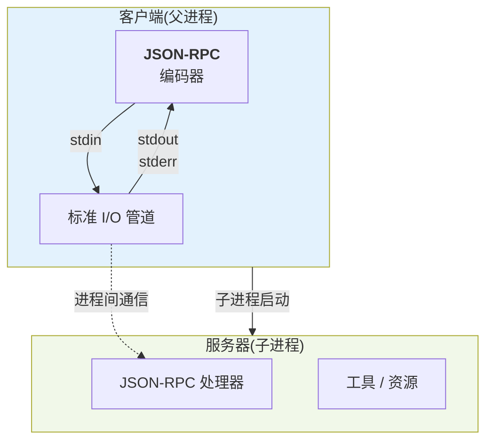
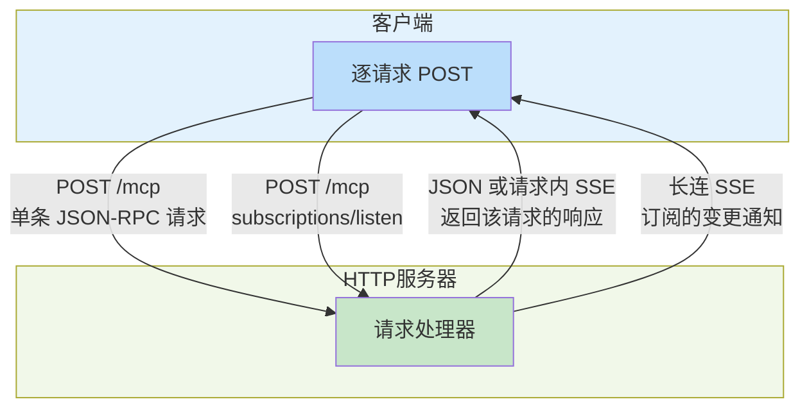
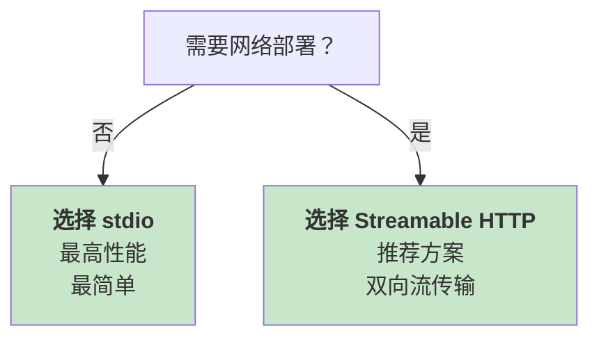

# 第九章：MCP与工具生态集成

Model Context Protocol(MCP)是 Anthropic 在 2024 年 11 月推出的标准化工具调用协议，现已被 OpenAI 和 Google 采纳，成为行业标准。MCP 将智能体与外部服务的集成从点对点的定制开发转变为标准化的协议，大幅降低了工具接入的复杂度。

!!! note "协议版本说明"

    MCP 当前修订版是 **2026-07-28**，它把协议改成了无状态 —— `initialize` / `notifications/initialized` 握手与协议级会话被移除，协议版本和客户端能力改为随每个请求在 `_meta` 中传递，新增 Server 必须实现的 `server/discover`，服务端也不再主动向客户端发起请求（改用 MRTR）。
    
    - 第 1 节 —— 协议设计：按当前修订版讲解协商与发现，并给出与旧版互通的探测顺序；
    - 第 2–4 节：的完整实现示例仍按 **2025-11-25** 修订版编写并已就地标注——现网大量服务端仍讲这一版，这些代码照样能跑，读时请留意各节开头的版本边界说明。
    
    另注意 Roots、Sampling、Logging 属于**弃用**（至少 12 个月过渡期，仍然可用），不是移除。

**为什么 MCP 很重要？**

在 MCP 出现前，每个智能体框架都需要自己定义工具调用的接口。这导致：

1. **重复开发**：同一个工具需要为不同框架写多套集成代码。
2. **标准不统一**：各框架的工具定义和传输方式差异大。
3. **生态割裂**：工具开发者和框架使用者无法有效对接。

MCP 通过统一的协议规范解决了这些问题。现在，一个 MCP Server 可以为任何支持 MCP 的智能体框架服务。

**行业采纳情况**

- **Anthropic Claude**：率先推出 MCP 支持。
- **OpenAI ChatGPT**：随后跟进支持 MCP。
- **Google Gemini**：开始试用 MCP 集成。
- **开源社区**：200+社区维护的 MCP Server 实现。
- **企业应用**：Slack、Notion、GitHub 等已提供官方 MCP Server。

本章从协议设计哲学讲起，逐步深入到传输层、服务端开发、Harness 中的集成模式，最后在 MiniHarness 中实现完整的 MCP 客户端。本章与《Claude 技术指南》中的 MCP 章节互补，本章聚焦于 Harness 框架中的工程实现。

**核心问题**：

1. **MCP 协议的设计哲学是什么？** 为什么选择 Client/Server 模型和三种原语？
2. **如何在生产环境中可靠地传输 MCP 消息？** stdio 与 Streamable HTTP 如何取舍，面对仍停留在握手模型的旧 Server（以及已弃用的 HTTP+SSE 传输）如何做版本探测与降级？
3. **如何开发一个 MCP Server？** 什么是必要的，什么是可选的？
4. **Harness 如何高效地集成大量 MCP Server？** 动态发现、缓存、权限管理如何设计？
5. **企业级部署需要哪些考量？** 审计、SSO、网关等。


本章从浅到深分为五个层级，每一级都建立在前一级的基础之上：

```yaml
Level 1: 协议 - 理解MCP的设计哲学
  ↓
Level 2: 传输 - 选择合适的传输方式
  ↓
Level 3: 服务 - 实现MCP Server
  ↓
Level 4: 集成 - Harness级别的集成
  ↓
Level 5: 实现 - MiniHarness中的完整代码
```

**关键概念预览**

- **Host/Client/Server 模型**：Agent/LLM 运行在 Host 内，MCP Client 是 Host 管理的协议组件，并与单个 MCP Server 建立隔离连接。
- **三种原语**：Tools（可调用的函数）、Resources（可访问的数据）、Prompts（提示词模板）。
- **无状态请求**（2026-07-28 起）：没有握手，协议版本与客户端能力随每个请求在 `params._meta` 中传递；Server 不得从同一连接上的历史请求推断状态
- **输入请求（MRTR）**：2026-07-28 起 Server 不再发起 JSON-RPC 请求，而是返回 `resultType: "input_required"` 与 `inputRequests`，由 Client 收集输入后带 `inputResponses` 重试原请求；面对 2025-11-25 及更早的 Server，仍需保留 Server 主动发起 `sampling/elicitation` 请求的兼容路径。
- **流式传输**：支持大型数据的分块传输。
- **Schema 缓存**：减少重复的 Schema 定义和 Token 消耗；`tools/list` 等列表结果用 `ttlMs`、`cacheScope` 给出新鲜度提示。
- **权限网关**：在 Agent 和 Server 间的访问控制和审计。

**章节关键术语**

| 术语                | 含义                                                                      |
| ----------------- | ----------------------------------------------------------------------- |
| Client            | MCP 协议中的请求方，通常是智能体框架                                                    |
| Server            | MCP 协议中的服务方，提供 Tools / Resources / Prompts      |
| Tools             | 可调用的函数，由 Server 提供                                                      |
| Resources         | 可访问的数据或内容资源                                                             |
| Prompts           | 预定义的提示词模板                                                               |
| Schema            | 工具/资源/提示词的 JSON Schema 定义                                               |
| Sampling          | 由 Server 请求 Client 代为进行 LLM 采样；**已弃用**（至少 12 个月内仍可用，新实现建议直接调用模型提供方 API） |
| Roots             | 资源的根目录或基础路径；**已弃用**（至少 12 个月内仍可用，新实现建议改为通过工具参数或资源 URI 传入目录与文件）          |
| `_meta`           | 请求参数中的元数据字段，承载协议版本、客户端能力等每请求信息                                          |
| `server/discover` | Server 必须实现的发现方法，一次返回支持版本、能力与缓存提示，Client 可按需调用                          |
| `resultType`      | 每个结果必须携带的类型标记，取值为 `complete` 或 `input_required`                         |
| MRTR              | Server 以 `input_required` 结果索取输入、Client 补齐后重试原请求的机制                     |

**与其他章节的关联**：

- 第 7 章（模型集成与输出治理）：MCP 是工具调用的基础设施
- 第 8 章（任务编排）：MCP Server 为任务提供执行能力
- 第 10 章（生产级构建）：缓存、权限等企业级需求
- 第 11 章（可靠性工程）：MCP 错误处理、降级策略

**学习资源**：

- 官方 MCP 文档：<https://modelcontextprotocol.io>
- Claude Code 中的 MCPTool 实现
- OpenClaw 中的 MCP 集成代码
- 开源 MCP Server 示例库

这一章将逐步构建一个深入的 MCP 工程实践体系，从理论到代码，从协议到生产。


## 1. Harness 中的 MCP 集成设计

MCP(Model Context Protocol) 已成为行业标准。关于 MCP 协议的基础介绍、核心架构、三种原语(Tools、Resources、Prompts)和设计哲学，请参阅《Claude 技术指南》第四章。

!!! info "基础参考"
    
    关于 MCP 协议的基础介绍和完整开发指南，请参阅《Claude 技术指南》第四章(4.1-4.5)。本节重点讨论 Harness 框架中的 MCP 集成特性。

### 1.1 Harness 对 MCP 的消费模式

Harness 作为一个多工具整合框架，与标准 MCP 客户端的主要差异在于 **消费策略** 和 **性能优化**。

在标准客户端中，所有 MCP Server 直接连接到主应用。Harness 引入了一个中间抽象层。下图是架构示意，不是 MCP 规范定义的部署拓扑：

```bash
用户请求 → Harness调度器 → 工具抽象层 → [MCP Client] → MCP Server
                           ↓
                        状态机管理
```

**优势**：

- 跨 Server 的事务一致性：同一工作流中的多个 MCP Server 调用可以共享上下文
- 失败恢复：工具层可以捕获单个 Server 故障，而不影响整个工作流
- 审计日志：统一记录所有工具调用，便于合规性检查

### 1.2 MCP Server 发现与注册

#### 1.2.1 动态发现机制

Harness 在启动时扫描配置的 MCP Server，而非硬编码：

```yaml linenums="1" title="harness.yaml"
mcp_servers:
  - name: filesystem
    command: "mcp-server-filesystem"
    args: ["--root", "/workspace"]
    transport: stdio

  - name: postgres
    command: "mcp-server-postgres"
    args: ["--connection-string", "postgresql://..."]
    transport: streamable_http
    health_check:
      interval: 30s
      timeout: 5s
```

Harness 会：

1. 启动每个 Server 进程（或连接到 HTTP 端点）。
2. 调用 `server/discover` 一次性拿到 Server 信息与能力（老版本 Server 不支持该方法时回退到直接探测），再按需调用 `tools/list`、`resources/list`、`prompts/list` 拉取原语清单。
3. 缓存 Schema 以减少运行时开销。
4. 监控 Server 的健康状态。

#### 1.2.2 无状态协商：每个请求自带元数据

当前版本的 MCP 是无状态协议：`initialize` 请求与 `notifications/initialized` 通知已经移除，不存在握手阶段。客户端把协议版本和能力声明放进 **每一个** 请求的 `params._meta`：

```python linenums="1"
CLIENT_META = {
    "io.modelcontextprotocol/protocolVersion": "2026-07-28",
    "io.modelcontextprotocol/clientCapabilities": {
        "elicitation": {}
    },
    "io.modelcontextprotocol/clientInfo": {
        "name": "HarnessMCPClient",
        "version": "1.0.0"
    }
}

def build_request(method: str, params: dict, request_id: int) -> dict:
    """所有 MCP 请求统一在这里构造，确保 _meta 不会漏发"""
    return {
        "jsonrpc": "2.0",
        "id": request_id,
        "method": method,
        "params": {**params, "_meta": dict(CLIENT_META)}
    }
```

`_meta` 中各字段的约定：

| 字段                                           | 类型                               | 是否必需    |
| -------------------------------------------- | -------------------------------- | ------- |
| `io.modelcontextprotocol/protocolVersion`    | 字符串，如 `"2026-07-28"`             | 必需      |
| `io.modelcontextprotocol/clientCapabilities` | ClientCapabilities               | 必需      |
| `io.modelcontextprotocol/clientInfo`         | Implementation（`name`、`version`） | 可选，建议发送 |
| `io.modelcontextprotocol/logLevel`           | LoggingLevel                     | 可选      |

对 Harness 实现者而言，有四条硬性约束：

- **漏发即报错**：缺少必需字段的请求会得到 JSON-RPC `-32602`（HTTP 状态码 400），因此能力声明必须收敛到统一的请求构造函数，而不是散落在各个调用点。
- **能力不足有专门错误**：Server 需要某项客户端能力而客户端没有声明时，返回 `MissingRequiredClientCapabilityError`（`-32021`，HTTP 400），`data.requiredCapabilities` 给出缺失的能力列表，Harness 可据此打印可诊断的配置提示。
- **Server 不得推断状态**：Server 不能依据同一连接上的历史请求推断状态；任何跨请求的状态都必须是显式标识符，由客户端每次带上。一个长期存活的 stdio 进程 **不是** 会话。
- **Server 信息随结果返回**：Server 应在每个结果的 `_meta` 中放入 `io.modelcontextprotocol/serverInfo`，Harness 可以顺带刷新注册表中的 Server 元数据。

此外，每个结果都必须携带 `resultType`，取值为 `"complete"` 或 `"input_required"`；客户端遇到 **缺失** `resultType` 的结果（来自旧版 Server）时，必须按 `"complete"` 处理。

#### 1.2.3 用 `server/discover` 替代探测式发现

`server/discover` 是 Server 必须实现、客户端可选调用的发现入口。请求只带 `_meta`，一次调用即可拿到，过去要靠 `tools/list` + `prompts/list` + `resources/list` 反复探测才能拼出的 Server 画像：

```python linenums="1"
async def discover(server: MCPServer) -> dict:
    request = build_request("server/discover", {}, generate_request_id())
    result = (await server.call(request))["result"]

    return {
        "versions": result["supportedVersions"],     # 支持的协议版本列表
        "capabilities": result["capabilities"],      # Server能力
        "instructions": result.get("instructions"),  # 可选的使用说明
        "ttl_ms": result["ttlMs"],                   # 本结果的新鲜度提示（毫秒）
        "cache_scope": result["cacheScope"],         # "public" 或 "private"
        "info": result["_meta"]["io.modelcontextprotocol/serverInfo"],
    }
```

它对 Harness 有两点直接价值：注册阶段用一次 RPC 取代三四次列表探测；在 stdio 场景下，它还是判断对端讲新版还是旧版协议的探针。

#### 1.2.4 向后兼容：2025-11-25 的握手模型

> ⚠️ **本小节只适用于对接尚未升级的旧版 Server**。新写的客户端与 Server 之间不需要握手。

大量已部署的 Server 仍在讲 2025-11-25：连接后先发 `initialize` 请求协商版本与能力，收到响应后再发 `notifications/initialized` 通知，之后才进入正常 `tools/list`、`resources/read` 等操作阶段。

```python linenums="1"
# 仅用于回退到 2025-11-25 旧版Server的兼容路径
init_message = {
    "jsonrpc": "2.0",
    "id": 0,
    "method": "initialize",
    "params": {
        "protocolVersion": "2025-11-25",
        "capabilities": {
            "sampling": {},
            "roots": {"listChanged": True},
            "elicitation": {}
        },
        "clientInfo": {
            "name": "HarnessMCPClient",
            "version": "1.0.0"
        }
    }
}
```

Harness 的探测顺序是“先按新版发，再按错误回退”：

1. 直接发一个带 `_meta` 的新版请求（HTTP 上还要带 `MCP-Protocol-Version` 头）。
2. 收到 HTTP 400 时检查响应体：如果是可识别的新版 JSON-RPC 错误（例如 `-32020` 头部与 `_meta` 版本不一致、`-32022` 版本不受支持并回带支持列表），说明对端是新版 Server，改正请求后重试；只有响应体为空或无法识别时，才回退到 `initialize` 握手。
3. stdio 场景下用 `server/discover` 做同样的探测。

反过来，一个只实现 2026-07-28 的 Server 在面对旧流量时，应对该端点上的 GET/DELETE 返回 `405 Method Not Allowed`，并忽略 `Mcp-Session-Id` 与 `Last-Event-ID`。

还有几项特性被标记为 **弃用但未移除**，期间它们继续可用。2026-07-28 随之引入了特性生命周期与弃用策略，规定弃用窗口最短 12 个月：Roots、Sampling、Logging 与 OAuth 2.0 动态客户端注册（改用 Client ID Metadata Documents）都是在本修订版被弃用的，[弃用特性登记表](https://modelcontextprotocol.io/specification/2026-07-28/deprecated)给出的最早移除时间是「2027-07-28 或之后发布的第一个修订版」。**2024-11-05 的 HTTP+SSE 传输是例外**：它自 2025-03-26 起就被标注为弃用，本次只是按新策略重新归类，登记表给出的最早移除时间是「SEP-2596 定稿后三个月」——比其余几项短得多，仍在依赖它的实现应优先迁移。迁移方向是：用工具参数或资源 URI 传入目录与文件，替代 Roots；直接调用模型厂商 API，替代 Sampling；写 stderr 或 OpenTelemetry，替代 Logging。需要注意的是 `logging/setLevel` 与 `notifications/roots/list_changed` 已经移除——日志级别改为在每个请求的 `_meta` 中用 `io.modelcontextprotocol/logLevel` 指定。

### 1.3 工具调用的性能优化

在生产环境中，频繁地获取和解析工具 Schema 会成为性能瓶颈。本小节介绍 Harness 采用的几种关键优化策略，包括智能缓存机制和流式传输优化，以减少网络往返和内存占用。

#### 1.3.1 Schema 缓存策略

每次调用工具前重新获取 Schema 会浪费大量往返，Harness 采用缓存+增量更新策略：

**启动时（冷启动）**：

- 一次性获取所有 Server 的 tools/list
- 将 Schema 存入本地缓存（SQLite 或内存）
- 计算 Schema 的哈希值，用于增量检测

**运行时（热启动）**：

- 在工具调用前，先检查缓存中的 Schema 版本
- 调用 `tools/list` 时，根据工具列表内容计算哈希
- 如果哈希不匹配，再做全量同步

**示例实现**：

```python linenums="1"
class ToolSchemaCache:
    def __init__(self, cache_path="~/.harness/tool_cache.db"):
        # sqlite3 不会展开 ~，需要 expanduser
        self.db = sqlite3.connect(os.path.expanduser(cache_path))
        self.db.execute("""
            CREATE TABLE IF NOT EXISTS tool_schemas (
                server_name TEXT,
                tool_name TEXT,
                schema TEXT,
                schema_version TEXT,
                cached_at INTEGER,
                PRIMARY KEY (server_name, tool_name)
            )
        """)

    def get_or_fetch(self, server: MCPServer, tool_name: str) -> dict:
        # 1. 先查缓存
        cached = self.db.execute(
            "SELECT schema, schema_version FROM tool_schemas WHERE server_name = ? AND tool_name = ?",
            (server.name, tool_name)
        ).fetchone()

        if cached:
            schema_json, cached_version = cached

            # 2. 检查本地缓存版本是否过期
            current_version = server.get_cached_schema_version(tool_name)
            if current_version == cached_version:
                return json.loads(schema_json)  # 命中缓存

        # 3. 缓存未命中,重新获取
        schema = server.fetch_tool_schema(tool_name)
        self.db.execute(
            "INSERT OR REPLACE INTO tool_schemas VALUES (?, ?, ?, ?, ?)",
            (server.name, tool_name, json.dumps(schema),
             server.get_cached_schema_version(tool_name), int(time.time()))
        )
        self.db.commit()
        return schema
```

上例中的 `schema_version` 是 Harness 自己维护的缓存元数据，不是 MCP `tools/list` 的标准字段。在 2025-11-25 修订版下，真实实现应根据工具列表哈希、`notifications/tools/list_changed` 通知或服务端自定义元数据来失效缓存；2026-07-28 修订版起，`tools/list`、`prompts/list`、`resources/list` 等列表结果必须携带 `ttlMs`（新鲜度提示，毫秒）与 `cacheScope`（`"public"` 或 `"private"`），面向新版服务端时应优先以这两个字段作为缓存存活时间与共享范围的依据，旧版服务端不返回它们时再回退到哈希与变更通知。

#### 1.3.2 大资源读取与流式响应

对于大数据量的 Resource 读取（如导入大文件），Harness 需要同时处理 JSON 响应和 Streamable HTTP 的 SSE 响应；但 `resources/read` 的结果仍是 MCP JSON-RPC 消息，二进制内容应放在 `BlobResourceContents.blob` 的 base64 字符串中，而不是把 HTTP body 当作任意字节流直接透传。

生产实现应把超大文件拆成资源模板、分页、任务进度或外部对象存储引用，并正确解析响应的 `Content-Type`：

```python linenums="1"
# 连接池配置
HTTP_CLIENT = httpx.AsyncClient(
    limits=httpx.Limits(max_connections=10, max_keepalive_connections=5),
    timeout=30.0
)

async def read_resource_from_server(server: MCPServer, uri: str) -> dict:
    """读取资源内容，兼容 application/json 与 text/event-stream 响应"""
    request = {
        "jsonrpc": "2.0",
        "id": generate_request_id(),
        "method": "resources/read",
        "params": {"uri": uri}
    }

    headers = {
        "Accept": "application/json, text/event-stream",
        "MCP-Protocol-Version": "2025-11-25",
    }
    if server.session_id:
        headers["MCP-Session-Id"] = server.session_id

    async with HTTP_CLIENT.stream("POST", server.endpoint, json=request, headers=headers) as response:
        response.raise_for_status()
        content_type = response.headers.get("content-type", "")
        if content_type.startswith("application/json"):
            return json.loads(await response.aread())

        if content_type.startswith("text/event-stream"):
            async for event in parse_sse_events(response.aiter_lines()):
                if event.get("data"):
                    message = json.loads(event["data"])
                    if message.get("id") == request["id"]:
                        return message

        raise ValueError(f"Unsupported MCP response type: {content_type}")
```

### 1.4 工具调用的状态机集成

在工作流执行中，MCP 工具调用需要与 Harness 的状态机紧密配合。

#### 1.4.1 状态转移中的工具调用

以下示例展示如何在 Harness 的状态机中集成 MCP 工具调用，使得工具调用与状态转移紧密配合：

```python linenums="1"
class ToolCallState(State):
    """工具调用状态"""

    def __init__(self, server_name: str, tool_name: str, params: dict):
        self.server = harness.get_mcp_server(server_name)
        self.tool_name = tool_name
        self.params = params

    async def execute(self, context: ExecutionContext) -> StateTransition:
        try:
            # 1. 准备工具调用请求
            request = {
                "jsonrpc": "2.0",
                "id": context.request_id,
                "method": "tools/call",
                "params": {
                    "name": self.tool_name,
                    "arguments": self.params
                }
            }

            # 2. 发送请求(带超时和重试)
            result = await self.server.call_with_retry(
                request,
                max_retries=3,
                timeout=30
            )

            # 3. 检查结果
            if "error" in result:
                return StateTransition(
                    next_state="error_handling",
                    context={"error": result["error"]}
                )

            # 4. 结果写入上下文
            context.set("tool_result", result["result"])

            return StateTransition(next_state="next_step")

        except TimeoutError:
            return StateTransition(
                next_state="retry_or_fallback",
                context={"reason": "timeout"}
            )
```

#### 1.4.2 工具调用的原子性

在多步工作流中，需要确保工具调用的原子性。Harness 使用一个简单但有效的机制：

```python linenums="1"
class AtomicToolExecution:
    """原子性工具执行"""

    def __init__(self, execution_id: str):
        self.execution_id = execution_id
        self.state_file = f"/tmp/harness/{execution_id}.state"

    async def execute(self, server: MCPServer, request: dict) -> dict:
        # 1. 检查是否已经执行过(幂等性)
        if os.path.exists(self.state_file):
            with open(self.state_file) as f:
                cached_result = json.load(f)
            return cached_result  # 重复执行,直接返回缓存

        # 2. 执行工具调用
        result = await server.call(request)

        # 3. 原子地写入状态(保证不会丢失)
        os.makedirs(os.path.dirname(self.state_file), exist_ok=True)
        with open(self.state_file + ".tmp", "w") as f:
            json.dump(result, f)
        os.rename(self.state_file + ".tmp", self.state_file)  # 原子rename

        return result
```

### 1.5 权限与安全隔离

Harness 中的 MCP Server 运行在受限的沙箱中，权限由 Harness 策略引擎管理。

```yaml linenums="1" title="harness.yaml"
permissions:
  filesystem_server:
    tools:
      read_file:
        allowed_paths: ["/workspace/**", "/tmp/**"]
        denied_paths: ["/etc/**", "/home/**"]
      write_file:
        allowed_paths: ["/workspace/**"]
        denied_paths: ["/**"]

  postgres_server:
    tools:
      query:
        allowed_tables: ["users", "orders"]
        denied_tables: ["audit_log", "secrets"]
      write:
        allowed_operations: ["INSERT", "UPDATE"]
        denied_operations: ["DROP", "DELETE"]
```

Harness 在工具调用前，先验证权限：

```python linenums="1"
async def call_tool(server_name: str, tool_name: str, params: dict) -> dict:
    # 1. 检查权限策略
    if not harness.policy_engine.is_allowed(server_name, tool_name, params):
        raise PermissionDenied(f"Tool call denied by policy: {server_name}/{tool_name}")

    # 2. 执行工具调用
    return await harness.mcp_servers[server_name].call(tool_name, params)
```

### 1.6 本小节小结

Harness 通过以下机制有效地集成了 MCP：

1. **工具层隔离**：在应用逻辑和 MCP Server 之间引入抽象层
2. **性能优化**：Schema 缓存、流式传输、连接复用
3. **状态机集成**：工具调用作为工作流的一部分，支持重试和原子性
4. **安全隔离**：细粒度的权限控制和沙箱隔离

更多关于 MCP 协议本身的深度讨论，以及 MCP Server 的实现指南，请参阅《Claude 技术指南》。Harness 的特色在于如何在 **多工具、多工作流** 的场景中，高效且安全地管理这些 MCP 连接。

## 2. 传输层：stdio 与 Streamable HTTP

MCP 是协议层的规范，但消息需要通过某种传输方式在 Client 和 Server 间流通。传输层的选择影响性能、可靠性和部署方式。

当前 MCP 规范定义的标准传输是 **stdio** 与 **Streamable HTTP**。旧版 HTTP+SSE 属于历史兼容路径，不应再作为与 Streamable HTTP 并列的第三种标准传输来介绍。

### 2.1 stdio - 本地进程间通信

**工作原理**：

- Client 启动 Server 进程作为子进程
- 通过 stdin 向 Server 发送 JSON-RPC 消息（每行一个）
- 通过 stdout 从 Server 读取 JSON-RPC 消息（每行一个）
- 通过 stderr 接收 Server 的日志和错误



图 9-1：stdio 传输架构 —— 通过标准 I/O 进行本地进程间通信

**特点**：

| 特性  | 说明                   |
| --- | -------------------- |
| 架构  | 本地进程间通信              |
| 延迟  | 最低(<1ms)             |
| 实现  | 最简单                  |
| 部署  | 仅支持本地                |
| 扩展性 | 单 Client 单 Server    |
| 容错  | Server 崩溃需要重启 Client |

**stdio 不等于会话**：进程一直开着，并不意味着 Server 可以把上一次请求的状态带到下一次。2026-07-28 修订版要求 Server 不得从同一连接上的历史请求推断状态；需要跨请求保留的状态，必须表达为一个显式标识符，由 Client 每次显式传入。下面的 stdio 客户端示例按当前修订版 **2026-07-28** 编写：没有握手，协议版本与客户端能力随每个请求的 `_meta` 传入，并可用 `server/discover` 一次性发现对端能力——在 stdio 上它同时是判断对端讲新版还是旧版的探针。

**实现示例**：

```python linenums="1"
import json
import subprocess
from typing import Any, Callable, Dict, Optional

PROTOCOL_VERSION = "2026-07-28"
META_VERSION = "io.modelcontextprotocol/protocolVersion"
META_CAPABILITIES = "io.modelcontextprotocol/clientCapabilities"
META_CLIENT_INFO = "io.modelcontextprotocol/clientInfo"
META_LOG_LEVEL = "io.modelcontextprotocol/logLevel"
META_SERVER_INFO = "io.modelcontextprotocol/serverInfo"


class StdioMCPClient:
    """基于stdio的MCP客户端（2026-07-28 无状态模型）

    没有 initialize 握手，每个请求自带完整信封。子进程可以活很久，
    但它不是会话：Server 不得从同一管道上的历史请求推断任何状态。
    """

    def __init__(self, server_path: str, server_args: list = None):
        """启动MCP Server进程"""
        self.server_path = server_path
        self.server_args = server_args or []
        self.process: Optional[subprocess.Popen] = None
        self.request_id = 0
        # 仅客户端侧的本地缓存，属于优化，不构成协议状态
        self.server_info: Optional[Dict[str, Any]] = None

    def start(self) -> None:
        """启动Server进程。stderr 不重定向，Server 日志直接透传到父进程，
        免得管道写满后把子进程堵死"""
        self.process = subprocess.Popen(
            [self.server_path] + self.server_args,
            stdin=subprocess.PIPE,
            stdout=subprocess.PIPE,
            text=True,
            bufsize=1,  # 行缓冲
        )

    def _envelope(self, log_level: Optional[str] = None) -> Dict[str, Any]:
        """构造无状态请求信封。前两个键是必需的，逐请求重复携带是设计而非冗余；
        stdio 上没有 HTTP 头可用，信封只能落在 params._meta 里"""
        meta: Dict[str, Any] = {
            META_VERSION: PROTOCOL_VERSION,
            META_CAPABILITIES: {},
            META_CLIENT_INFO: {"name": "stdio-example", "version": "0.1.0"},
        }
        if log_level:
            # 日志级别也逐请求携带，取代已移除的 logging/setLevel
            meta[META_LOG_LEVEL] = log_level
        return meta

    def send_request(
        self,
        method: str,
        params: Dict[str, Any] = None,
        log_level: str = None,
        on_notification: Callable[[Dict[str, Any]], None] = None,
    ) -> Dict[str, Any]:
        """发送JSON-RPC请求并等待响应"""
        if not self.process:
            raise RuntimeError("Server not started")

        self.request_id += 1
        request_id = self.request_id

        # 每个请求都要注入信封；调用方自带的 _meta（如 progressToken）优先保留
        payload = dict(params or {})
        payload["_meta"] = {**self._envelope(log_level), **payload.get("_meta", {})}
        request = {
            "jsonrpc": "2.0",
            "id": request_id,
            "method": method,
            "params": payload,
        }

        # 写入请求
        self.process.stdin.write(json.dumps(request) + "\n")
        self.process.stdin.flush()

        # 读取响应：stdout 上会混进属于本请求的通知（进度、日志），
        # 必须读到同 id 的那条响应才算收工
        while True:
            response_line = self.process.stdout.readline()
            if not response_line:
                raise RuntimeError("Server closed connection")
            message = json.loads(response_line)
            if message.get("id") == request_id:
                # Server 在每个结果的 _meta 里回带 serverInfo，取代握手时的一次性自述
                meta = (message.get("result") or {}).get("_meta") or {}
                if META_SERVER_INFO in meta:
                    self.server_info = meta[META_SERVER_INFO]
                return message
            if "method" in message and "id" not in message:
                if on_notification:
                    on_notification(message)
                continue
            # 既不是本请求的响应，也不是通知。2026-07-28 的 Server 不会在这里反向
            # 发起请求：要客户端补输入时改走 MRTR，即在响应里返回 input_required
            raise RuntimeError(f"Unexpected message: {message}")

    def send_notification(self, method: str, params: Dict[str, Any] = None) -> None:
        """发送JSON-RPC通知，不等待响应"""
        if not self.process:
            raise RuntimeError("Server not started")
        notification = {"jsonrpc": "2.0", "method": method}
        if params:
            notification["params"] = params
        self.process.stdin.write(json.dumps(notification) + "\n")
        self.process.stdin.flush()

    def cancel(self, request_id: int, reason: str = "") -> None:
        """取消在途请求。HTTP 上关掉 SSE 流就是取消信号，
        stdio 上没有流可关，只能显式发 notifications/cancelled"""
        self.send_notification(
            "notifications/cancelled",
            {"requestId": request_id, "reason": reason},
        )

    def _unwrap(self, response: Dict[str, Any]) -> Dict[str, Any]:
        """取出 result，JSON-RPC 错误直接抛出"""
        if "error" in response:
            error = response["error"]
            raise RuntimeError(f"JSON-RPC error {error['code']}: {error['message']}")
        return response["result"]

    def discover(self) -> Optional[Dict[str, Any]]:
        """探测Server，一次拿到 supportedVersions 与 capabilities

        stdio 上它同时是判断对端新旧的探针：只讲握手协议的 Server 不认识这个方法，
        会回 -32601，此时返回 None，由调用方决定是否退回 2025-11-25 兼容路径。
        """
        response = self.send_request("server/discover")
        error = response.get("error")
        if error:
            if error.get("code") == -32601:
                return None
            raise RuntimeError(f"discover failed: {error}")
        return response["result"]

    def list_tools(self) -> Dict[str, Any]:
        """列出工具。结果自带 cacheScope/ttlMs，缓存放在客户端，Server 依然无状态"""
        return self._unwrap(self.send_request("tools/list"))

    def call_tool(
        self,
        tool_name: str,
        arguments: Dict[str, Any],
        progress_token: str = None,
        log_level: str = None,
        on_notification: Callable[[Dict[str, Any]], None] = None,
    ) -> Dict[str, Any]:
        """调用工具"""
        params: Dict[str, Any] = {
            "name": tool_name,
            "arguments": arguments,
        }
        if progress_token:
            # 进度这类请求内通知只走本请求的往返，不需要常驻订阅
            params["_meta"] = {"progressToken": progress_token}
        return self._unwrap(
            self.send_request(
                "tools/call",
                params,
                log_level=log_level,
                on_notification=on_notification,
            )
        )

    def close(self) -> None:
        """关闭连接"""
        if self.process:
            self.process.terminate()
            self.process.wait()

    def __enter__(self):
        self.start()
        return self

    def __exit__(self, exc_type, exc_val, exc_tb):
        self.close()

# stdio传输使用示例
if __name__ == "__main__":
    with StdioMCPClient("/path/to/mcp_server") as client:
        # 先探测：拿到能力清单，同时确认对端讲的是无状态版本
        info = client.discover()
        if info is None:
            raise SystemExit("对端仍在握手时代，需退回 2025-11-25 兼容路径")
        print("supportedVersions:", info["supportedVersions"])
        print("serverInfo:", client.server_info)

        # 列出可用工具：每个请求各自完备，不依赖上一次请求留下的痕迹
        listed = client.list_tools()
        print("tools:", [tool["name"] for tool in listed["tools"]])
        print("cache:", listed.get("cacheScope"), listed.get("ttlMs"))

        # 调用工具，顺带接收只属于这个请求的进度通知
        result = client.call_tool(
            "add",
            {"a": 2, "b": 3},
            progress_token="call-1",
            log_level="info",
            on_notification=lambda n: print("  notify:", n["method"], n["params"]),
        )
        print("resultType:", result["resultType"], "content:", result["content"])
```

**何时使用**：

- 本地开发和测试
- 单机应用
- 工具的快速原型
- 性能最优的场景（&lt; 100ms 延迟要求）

**限制**：

- 只能本地部署
- Server 崩溃需要重启 Client
- 不支持多 Client 访问同一 Server
- 网络分区完全不适用

### 2.2 Streamable HTTP - 双向 HTTP 流传输

**工作原理**：

- Server 是一个 HTTP 服务器，只暴露单一 MCP 端点，且只接受 POST；每条 JSON-RPC 消息都是一次独立的 POST。
- Client 的 `Accept` 必须同时列出 `application/json` 与 `text/event-stream`。
- 每个请求必须带 `MCP-Protocol-Version`（其值必须与 `params._meta` 中的协议版本一致，否则返回 `-32020` HeaderMismatch 与 HTTP 400）和 `Mcp-Method`（等于 method）；`tools/call`、`resources/read`、`prompts/get` 还必须带 `Mcp-Name`（等于 `params.name` 或 `params.uri`）
- Server 对一个请求的响应，要么是 `application/json` 单个对象，要么是仅作用于该请求的 `text/event-stream` 流：流上先送该请求相关的通知，最后送响应。Server 不得在这条流上发送独立的 JSON-RPC 请求。
- 长期的变更通知不再靠常驻连接推送，而是由 Client POST `subscriptions/listen`，其响应本身就是一条长连 SSE，只承载客户端订阅的通知类型；进度、日志一类请求内通知不走这条流。
- 关闭 SSE 响应流，就是 HTTP 上的取消信号。
- 2026-07-28 版删除了 GET 流端点、协议级会话（`Mcp-Session-Id` 及其 DELETE 终止）与基于 `Last-Event-ID` 的断点续传。
- 与旧版本共存：现实中大量服务器仍只说 2025-11-25，GET 流端点、`Mcp-Session-Id` 会话与 `Last-Event-ID` 续传在那一版仍然有效。Client 应先按新版发一个请求做探测：若收到 HTTP 400，就检查响应体——是可识别的新版 JSON-RPC 错误，说明对方是新版服务器，按错误修正后重试；响应体为空或无法识别，则退回 `initialize` 握手走旧版。反过来，只支持 2026-07-28 的服务器对该端点上的 GET/DELETE 应返回 `405 Method Not Allowed`，并忽略 `Mcp-Session-Id` 与 `Last-Event-ID`。



图 9-2：Streamable HTTP 传输架构 —— 单一 POST 端点，响应可为 JSON 或请求内 SSE

**特点**：

| 特性  | 说明                         |
| --- | -------------------------- |
| 架构  | 单一 POST 端点，响应可为 JSON 或 SSE |
| 延迟  | 低(&lt; 100ms)                  |
| 实现  | 中等复杂度                      |
| 部署  | 网络部署                       |
| 扩展性 | 单 Server 多 Client          |
| 容错  | 请求无状态，失败可直接重发              |

**实现示例**：

```python linenums="1"
import aiohttp
import json
import asyncio
from typing import Dict, Any, List, Optional, AsyncIterator

PROTOCOL_VERSION = "2026-07-28"

# 无状态请求信封的保留键，全部放在 params._meta 里
PROTOCOL_VERSION_KEY = "io.modelcontextprotocol/protocolVersion"
CLIENT_CAPABILITIES_KEY = "io.modelcontextprotocol/clientCapabilities"
CLIENT_INFO_KEY = "io.modelcontextprotocol/clientInfo"
SERVER_INFO_KEY = "io.modelcontextprotocol/serverInfo"
SUBSCRIPTION_ID_KEY = "io.modelcontextprotocol/subscriptionId"

# 需要额外携带 Mcp-Name 头的方法 → 该值所在的参数名
NAME_BEARING_METHODS = {
    "tools/call": "name",
    "prompts/get": "name",
    "resources/read": "uri",
}

PARSE_ERROR = -32700
INVALID_REQUEST = -32600
METHOD_NOT_FOUND = -32601
INVALID_PARAMS = -32602
HEADER_MISMATCH = -32020
UNSUPPORTED_PROTOCOL_VERSION = -32022

# JSON-RPC错误码到HTTP状态的映射表，两端读同一张表
ERROR_HTTP_STATUS = {
    PARSE_ERROR: 400,
    INVALID_REQUEST: 400,
    INVALID_PARAMS: 400,
    HEADER_MISMATCH: 400,
    UNSUPPORTED_PROTOCOL_VERSION: 400,
    METHOD_NOT_FOUND: 404,
}


class MCPRequestError(RuntimeError):
    """服务端返回的JSON-RPC错误"""

    def __init__(self, code: int, message: str, data: Any = None):
        super().__init__(f"[{code}] {message}")
        self.code = code
        self.message = message
        self.data = data


class StreamableHttpMCPClient:
    """基于Streamable HTTP的MCP客户端"""

    def __init__(self, server_url: str):
        self.server_url = server_url.rstrip('/')
        self.request_id = 0
        self.session: Optional[aiohttp.ClientSession] = None
        self.client_info = {"name": "streamable-http-example", "version": "0.1.0"}
        self.client_capabilities: Dict[str, Any] = {}

    def _envelope(self, params: Optional[Dict[str, Any]]) -> Dict[str, Any]:
        """把请求信封写进 params._meta。没有握手，所以每个请求都要自带版本与能力。"""
        params = dict(params or {})
        meta = dict(params.get("_meta") or {})
        meta[PROTOCOL_VERSION_KEY] = PROTOCOL_VERSION
        meta[CLIENT_CAPABILITIES_KEY] = self.client_capabilities
        # clientInfo 是可选键，规范建议带上，服务端只当作展示信息
        meta[CLIENT_INFO_KEY] = self.client_info
        params["_meta"] = meta
        return params

    def _headers(self, method: str, params: Dict[str, Any]) -> Dict[str, str]:
        """Accept必须同时列出两种类型；三个MCP头让中间层无需解析body就能路由。"""
        headers = {
            "Accept": "application/json, text/event-stream",
            "Content-Type": "application/json",
            # 这个头的值必须与 _meta 里的协议版本完全一致
            "MCP-Protocol-Version": PROTOCOL_VERSION,
            "Mcp-Method": method,
        }
        name_key = NAME_BEARING_METHODS.get(method)
        if name_key is not None and isinstance(params.get(name_key), str):
            headers["Mcp-Name"] = params[name_key]
        return headers

    async def connect(self) -> None:
        """只准备HTTP连接池；没有initialize，第一个请求就是正常业务请求。"""
        self.session = aiohttp.ClientSession()

    def _build_request(self, method: str, params: Optional[Dict[str, Any]]) -> Dict[str, Any]:
        """构造一条带信封的JSON-RPC请求"""
        self.request_id += 1
        return {
            "jsonrpc": "2.0",
            "id": self.request_id,
            "method": method,
            "params": self._envelope(params),
        }

    @staticmethod
    def _unwrap(message: Dict[str, Any]) -> Dict[str, Any]:
        """取出result；错误响应连同HTTP 4xx一起抛成MCPRequestError。"""
        if "error" in message:
            error = message["error"]
            raise MCPRequestError(error.get("code"), error.get("message", ""), error.get("data"))
        return message.get("result", {})

    @staticmethod
    async def _iter_sse(resp: aiohttp.ClientResponse) -> AsyncIterator[Dict[str, Any]]:
        """把SSE流切成JSON-RPC消息；以冒号开头的注释行是保活心跳，直接丢弃。"""
        data_lines: List[str] = []
        async for raw_line in resp.content:
            line = raw_line.decode("utf-8").rstrip("\r\n")
            if not line:
                if data_lines:
                    yield json.loads("\n".join(data_lines))
                    data_lines = []
                continue
            if line.startswith(":"):
                continue
            field, _, value = line.partition(":")
            if field == "data":
                data_lines.append(value.removeprefix(" "))

    async def send_request(
        self, method: str, params: Dict[str, Any] = None, timeout: float = 30
    ) -> Dict[str, Any]:
        """一条JSON-RPC请求就是一次独立POST，请求之间不共享任何服务端状态。"""
        request = self._build_request(method, params)
        async with self.session.post(
            f"{self.server_url}/mcp",
            json=request,
            headers=self._headers(method, request["params"]),
            timeout=aiohttp.ClientTimeout(total=timeout),
        ) as resp:
            if resp.content_type == "text/event-stream":
                # 请求内SSE：流上先送本请求的进度、日志通知，最后一帧才是响应。
                # 这条流只服务这一个请求，提前关闭它就是取消信号。
                async for message in self._iter_sse(resp):
                    if message.get("id") == request["id"]:
                        return self._unwrap(message)
                    self.on_notification(message)
                raise MCPRequestError(INVALID_REQUEST, f"{method} 的响应流提前结束")
            if resp.content_type != "application/json":
                # 响应体无法识别成JSON-RPC，才是回落到旧版initialize握手的信号
                raise MCPRequestError(
                    INVALID_REQUEST, f"HTTP {resp.status}: {(await resp.text())[:120]}"
                )
            # 4xx的body同样是JSON-RPC错误对象：缺信封400/-32602、
            # 版本不支持400/-32022、未知方法404/-32601
            return self._unwrap(await resp.json())

    def on_notification(self, message: Dict[str, Any]) -> None:
        """请求内通知的处理钩子，子类覆盖它即可"""
        print(f"Notification: {message.get('method')}")

    async def listen(
        self,
        tools_list_changed: bool = False,
        prompts_list_changed: bool = False,
        resources_list_changed: bool = False,
        resource_subscriptions: Optional[List[str]] = None,
    ) -> AsyncIterator[Dict[str, Any]]:
        """订阅长期变更通知：POST subscriptions/listen，它的响应本身就是一条长连SSE。

        流上第一帧是确认，之后是订阅到的变更通知，服务端优雅关闭时以本请求的响应收尾。
        没有退订方法，跳出循环让流关闭就是退订。
        """
        notifications: Dict[str, Any] = {}
        if tools_list_changed:
            notifications["toolsListChanged"] = True
        if prompts_list_changed:
            notifications["promptsListChanged"] = True
        if resources_list_changed:
            notifications["resourcesListChanged"] = True
        if resource_subscriptions:
            notifications["resourceSubscriptions"] = list(resource_subscriptions)

        request = self._build_request("subscriptions/listen", {"notifications": notifications})
        async with self.session.post(
            f"{self.server_url}/mcp",
            json=request,
            headers=self._headers("subscriptions/listen", request["params"]),
            # 长连流不能设总超时，否则订阅会被客户端自己掐断
            timeout=aiohttp.ClientTimeout(total=None, sock_read=None),
        ) as resp:
            if resp.content_type != "text/event-stream":
                self._unwrap(await resp.json())
                raise MCPRequestError(INVALID_REQUEST, "subscriptions/listen 的响应不是SSE流")
            async for message in self._iter_sse(resp):
                if message.get("id") == request["id"]:
                    return  # 服务端优雅关闭
                yield message

    async def call_tool(self, tool_name: str, arguments: Dict[str, Any]) -> Dict[str, Any]:
        """调用工具"""
        return await self.send_request(
            "tools/call",
            {"name": tool_name, "arguments": arguments}
        )

    async def close(self) -> None:
        """关闭连接"""
        if self.session:
            await self.session.close()

    async def __aenter__(self):
        await self.connect()
        return self

    async def __aexit__(self, exc_type, exc_val, exc_tb):
        await self.close()

# Server端实现示例
from aiohttp import web
import asyncio

class StreamableHttpMCPServer:
    """基于Streamable HTTP的MCP服务器"""

    SUPPORTED_VERSIONS = [PROTOCOL_VERSION]

    # 变更通知方法 → 订阅过滤器里的开关名
    FILTER_KEYS = {
        "notifications/tools/list_changed": "toolsListChanged",
        "notifications/prompts/list_changed": "promptsListChanged",
        "notifications/resources/list_changed": "resourcesListChanged",
    }

    def __init__(
        self,
        host: str = "127.0.0.1",
        port: int = 8000,
        bearer_token: Optional[str] = None,
        allowed_origins: Optional[set] = None,
    ):
        self.host = host
        self.port = port
        self.bearer_token = bearer_token
        self.allowed_origins = allowed_origins or {"http://localhost:8000"}
        self.subscribers: List[Dict[str, Any]] = []  # 打开着的listen流
        self.tools = {}
        self.server_info = {"name": "streamable-http-example-server", "version": "0.1.0"}

    def register_tool(self, name: str, handler, description: str = "", input_schema: Dict = None):
        """注册工具"""
        self.tools[name] = {
            "handler": handler,
            "description": description,
            "inputSchema": input_schema or {"type": "object", "properties": {}},
        }

    def _check_security(self, request) -> Optional[web.Response]:
        """校验Origin和认证；本地开发也不应默认暴露到0.0.0.0。"""
        origin = request.headers.get("Origin")
        if origin and origin not in self.allowed_origins:
            return web.Response(status=403, text="Origin not allowed")
        if self.bearer_token:
            expected = f"Bearer {self.bearer_token}"
            if request.headers.get("Authorization") != expected:
                return web.Response(status=401, text="Unauthorized")
        return None

    def _stamp(self, result: Dict[str, Any]) -> Dict[str, Any]:
        """在每个结果的 _meta 里回serverInfo：没有握手，身份只能靠它带回去。"""
        meta = dict(result.get("_meta") or {})
        meta.setdefault(SERVER_INFO_KEY, self.server_info)
        return {**result, "_meta": meta}

    def _error_response(
        self, request_id: Any, code: int, message: str, data: Any = None
    ) -> web.Response:
        """错误码决定HTTP状态，body仍是完整的JSON-RPC错误对象"""
        error: Dict[str, Any] = {"code": code, "message": message}
        if data is not None:
            error["data"] = data
        return web.json_response(
            {"jsonrpc": "2.0", "id": request_id, "error": error},
            status=ERROR_HTTP_STATUS.get(code, 200),
        )

    def _classify(self, method: str, params: Any, headers) -> Optional[tuple]:
        """信封与三个MCP头的校验阶梯，第一个不通过的就是结论。"""
        meta = params.get("_meta") if isinstance(params, dict) else None
        if not isinstance(meta, dict):
            return (
                INVALID_PARAMS,
                "params._meta must be an object carrying the required "
                f"{PROTOCOL_VERSION_KEY!r} and {CLIENT_CAPABILITIES_KEY!r} envelope keys",
                None,
            )
        missing = [k for k in (PROTOCOL_VERSION_KEY, CLIENT_CAPABILITIES_KEY) if k not in meta]
        if missing:
            return (
                INVALID_PARAMS,
                "params._meta is missing the required envelope key(s): " + ", ".join(missing),
                None,
            )
        version = meta[PROTOCOL_VERSION_KEY]
        # 头里的版本先决定走哪个时代的传输路径，所以它必须与信封里的版本一致
        if headers.get("MCP-Protocol-Version") != version:
            return (
                HEADER_MISMATCH,
                "MCP-Protocol-Version header does not match the envelope's protocol version",
                None,
            )
        if headers.get("Mcp-Method") != method:
            return (HEADER_MISMATCH, "Mcp-Method header does not match the body's method", None)
        name_key = NAME_BEARING_METHODS.get(method)
        if name_key is not None:
            body_value = params.get(name_key)
            if body_value is not None and headers.get("Mcp-Name") != body_value:
                return (
                    HEADER_MISMATCH,
                    f"Mcp-Name header does not match the body's {name_key!r} parameter",
                    None,
                )
        if version not in self.SUPPORTED_VERSIONS:
            return (
                UNSUPPORTED_PROTOCOL_VERSION,
                "Unsupported protocol version",
                {"supported": list(self.SUPPORTED_VERSIONS), "requested": version},
            )
        return None

    async def handle_mcp(self, request):
        """单端点只收POST；Mcp-Session-Id与Last-Event-ID一律忽略，本版已无会话与续传。"""
        if request.method != "POST":
            # GET流端点与DELETE终会话都已删除；规范建议回405并带上Allow
            return web.Response(status=405, headers={"Allow": "POST"})

        security_error = self._check_security(request)
        if security_error:
            return security_error

        accept = request.headers.get("Accept", "")
        if "application/json" not in accept or "text/event-stream" not in accept:
            return web.Response(status=406, text="Accept must include JSON and SSE")

        try:
            data = await request.json()
        except Exception:
            return self._error_response(None, PARSE_ERROR, "Parse error")

        # 本版HTTP传输上没有客户端到服务端的通知（取消靠关闭响应流），只收单个请求对象
        if not isinstance(data, dict) or data.get("id") is None or not isinstance(data.get("method"), str):
            return self._error_response(
                None, INVALID_REQUEST, "Body must be a single JSON-RPC request object"
            )

        request_id = data["id"]
        method = data["method"]
        params = data.get("params")
        rejection = self._classify(method, params, request.headers)
        if rejection is not None:
            return self._error_response(request_id, *rejection)

        if method == "subscriptions/listen":
            return await self._handle_listen(request, request_id, params)

        try:
            result = await self._process_request(method, params)
        except MCPRequestError as exc:
            return self._error_response(request_id, exc.code, exc.message, exc.data)
        return web.json_response(
            {"jsonrpc": "2.0", "id": request_id, "result": self._stamp(result)}
        )

    @staticmethod
    async def _write_event(resp: web.StreamResponse, message: Dict[str, Any]) -> None:
        """写一帧SSE"""
        body = json.dumps(message, ensure_ascii=False)
        await resp.write(f"event: message\r\ndata: {body}\r\n\r\n".encode())

    def _matches(self, subscriber: Dict[str, Any], method: str, params: Dict[str, Any]) -> bool:
        """只投递客户端确实订阅过的通知类型"""
        key = self.FILTER_KEYS.get(method)
        if key is not None:
            return subscriber["honored"].get(key) is True
        if method == "notifications/resources/updated":
            return (params or {}).get("uri") in subscriber["uris"]
        return False

    async def publish(self, method: str, params: Dict[str, Any] = None) -> None:
        """把一条变更通知投递给所有订阅了它的listen流"""
        for subscriber in list(self.subscribers):
            if self._matches(subscriber, method, params):
                subscriber["queue"].put_nowait(
                    {"jsonrpc": "2.0", "method": method, "params": dict(params or {})}
                )

    def close_subscriptions(self) -> None:
        """优雅关闭所有listen流，让客户端知道流是主动结束而不是掉线"""
        for subscriber in list(self.subscribers):
            subscriber["queue"].put_nowait(None)

    async def _handle_listen(self, request, request_id: Any, params: Dict[str, Any]):
        """subscriptions/listen的响应就是那条长连SSE，取代了已删除的GET流端点。"""
        requested = params.get("notifications") or {}
        honored = {key: True for key in self.FILTER_KEYS.values() if requested.get(key)}
        uris = list(requested.get("resourceSubscriptions") or [])
        if uris:
            honored["resourceSubscriptions"] = uris
        stream_meta = {SUBSCRIPTION_ID_KEY: request_id}

        resp = web.StreamResponse(
            status=200,
            headers={
                "Content-Type": "text/event-stream",
                "Cache-Control": "no-cache, no-transform",
                "X-Accel-Buffering": "no",
            },
        )
        await resp.prepare(request)

        subscriber = {"honored": honored, "uris": uris, "queue": asyncio.Queue()}
        self.subscribers.append(subscriber)
        try:
            # 确认帧必须是流上的第一帧，它回报服务端实际认下的订阅子集
            await self._write_event(resp, {
                "jsonrpc": "2.0",
                "method": "notifications/subscriptions/acknowledged",
                "params": {"notifications": honored, "_meta": stream_meta},
            })
            while True:
                try:
                    event = await asyncio.wait_for(subscriber["queue"].get(), timeout=15)
                except asyncio.TimeoutError:
                    await resp.write(b": ping\r\n\r\n")  # 保活，绕开代理的空闲超时
                    continue
                if event is None:
                    break
                event["params"] = {**event.get("params", {}), "_meta": stream_meta}
                await self._write_event(resp, event)
            # 优雅关闭：最后一帧是本请求的响应
            await self._write_event(resp, {
                "jsonrpc": "2.0",
                "id": request_id,
                "result": self._stamp({"resultType": "complete"}),
            })
        except ConnectionResetError:
            pass  # 客户端关掉了响应流，这就是取消信号，不必重连也不必补发
        finally:
            self.subscribers.remove(subscriber)
        return resp

    async def _process_request(self, method: str, params: Dict) -> Dict[str, Any]:
        """处理请求（具体业务逻辑）"""
        if method == "server/discover":
            # 取代initialize的能力探测：只读、可缓存、可被任意请求先行发起
            return {
                "resultType": "complete",
                "supportedVersions": list(self.SUPPORTED_VERSIONS),
                "capabilities": {"tools": {"listChanged": True}},
                "ttlMs": 60000,
                "cacheScope": "public",
            }
        elif method == "tools/list":
            return {
                "resultType": "complete",
                "ttlMs": 60000,
                "cacheScope": "public",
                "tools": [
                    {
                        "name": name,
                        "description": metadata["description"],
                        "inputSchema": metadata["inputSchema"],
                    }
                    for name, metadata in self.tools.items()
                ]
            }
        elif method == "tools/call":
            tool_name = params.get("name")
            arguments = params.get("arguments") or {}
            if tool_name not in self.tools:
                raise MCPRequestError(INVALID_PARAMS, f"Unknown tool: {tool_name}")
            result = await self.tools[tool_name]["handler"](arguments)
            return {"resultType": "complete", **result}
        # 未知方法是404，不是400：客户端据此判断对方根本没有这个能力
        raise MCPRequestError(METHOD_NOT_FOUND, f"Method not found: {method}")

    async def start(self):
        """启动服务器"""
        app = web.Application()
        # 单一端点，且只有POST是合法方法
        app.router.add_route("*", "/mcp", self.handle_mcp)

        runner = web.AppRunner(app)
        await runner.setup()
        site = web.TCPSite(runner, self.host, self.port)
        await site.start()
        print(f"Streamable HTTP MCP Server started at http://{self.host}:{self.port}/mcp")
        return runner

# Streamable HTTP传输使用示例
async def main():
    async with StreamableHttpMCPClient("http://127.0.0.1:8000") as client:
        # 没有握手，第一个请求就是探测：确认对方支持哪些协议版本
        discovered = await client.send_request("server/discover")
        print("Supported versions:", discovered["supportedVersions"])
        listing = await client.send_request("tools/list")
        print("Tools:", [tool["name"] for tool in listing["tools"]])
        print("Result:", await client.call_tool("add", {"a": 1, "b": 2}))
```

**何时使用**：

- 网络部署（Client 和 Server 在不同机器）
- 多 Client 访问同一 Server
- Server 需要高可用（可以前置负载均衡器）
- 支持跨机房部署
- 大文件和流式数据传输

**优点**：

- 灵活的部署架构
- 请求无状态，天然适配多副本部署与负载均衡
- 统一的端点，简化配置
- 支持大型文件流式传输
- 标准 HTTP，易于代理和监控

**缺点**：

- 实现复杂度中等
- 每个请求都要重复携带元数据

#### 向后兼容：与仍在使用 initialize 握手的旧版 Server 互通

无状态模型是 2026-07-28 版才引入的，而线上大量 Server 仍然只会说 2025-11-25：先发 `initialize` 请求、再发 `notifications/initialized` 通知，随后用 `Mcp-Session-Id` 维持会话。规范本身给出了互通规则，客户端需要同时能走这两条路。

**HTTP 上的探测顺序**：先按新版发一个正常请求；如果返回 HTTP 400，就检查响应体——能识别出现代 JSON-RPC 错误码（如 `-32020`、`-32022`、`-32602`）说明对方就是新版 Server，按错误纠正后重试；只有响应体为空或无法识别时，才回落到 `initialize` 握手，按旧版流程继续。

**stdio 上的探测**：把 `server/discover` 当作探针，能正常返回就按无状态模型继续，否则回落到 `initialize`。

**只支持新版的 Server 面对旧流量**：端点上的 GET 与 DELETE 应返回 `405 Method Not Allowed`，忽略请求里的 `Mcp-Session-Id`，忽略 `Last-Event-ID`。

**旧 HTTP+SSE 传输（2024-11-05）已进入废弃期，但不是被删除**：规范承诺至少 12 个月的过渡窗口，这期间它仍然可用。新实现一律用 Streamable HTTP，存量实现按窗口期迁移即可，不必紧急下线。

不同的传输方式各有其优缺点，选择合适的传输协议对系统的整体性能和部署成本有重大影响。本节介绍了如何根据具体的网络部署场景做出传输层决策，以及连接管理的最佳实践。

### 2.3 传输层选择决策与连接管理

#### 2.3.1 传输方式的选择决策

传输方式的选择决策过程如下：



图 9-3：传输方式选择决策树 —— 根据部署需求选择合适的传输方式

### 2.3.2 连接管理与池化

无论采用哪种传输方式，都需要考虑连接的管理和复用。

**stdio 情况下的连接管理：**

stdio 传输方式的连接管理实现如下：

```python linenums="1"
class StdioConnectionPool:
    """stdio连接池"""

    def __init__(self, max_connections: int = 10):
        self.max_connections = max_connections
        self.connections = {}
        self.lock = asyncio.Lock()

    async def get_connection(self, server_path: str) -> StdioMCPClient:
        """获取连接(如果没有则创建)"""
        async with self.lock:
            if server_path not in self.connections:
                if len(self.connections) >= self.max_connections:
                    # 关闭最少使用的连接
                    oldest = min(
                        self.connections.items(),
                        key=lambda x: x[1]['last_used']
                    )
                    oldest[1]['client'].close()
                    del self.connections[oldest[0]]

                client = StdioMCPClient(server_path)
                client.start()
                self.connections[server_path] = {
                    'client': client,
                    'last_used': asyncio.get_running_loop().time(),
                }

            return self.connections[server_path]['client']

    async def release_connection(self, server_path: str) -> None:
        """释放连接(更新使用时间)"""
        async with self.lock:
            if server_path in self.connections:
                self.connections[server_path]['last_used'] = asyncio.get_running_loop().time()
```

**HTTP 情况下的连接管理：** HTTP 传输方式的连接管理实现如下：

```python linenums="1"
class HttpConnectionPool:
    """HTTP连接池(使用aiohttp的连接池)"""

    def __init__(self, max_connections: int = 100):
        self.connector = aiohttp.TCPConnector(
            limit=max_connections,
            limit_per_host=10,
        )
        self.session = aiohttp.ClientSession(connector=self.connector)

    async def get_client(self, server_url: str) -> StreamableHttpMCPClient:
        """获取HTTP客户端"""
        return StreamableHttpMCPClient(server_url)

    async def close(self) -> None:
        """关闭所有连接"""
        await self.session.close()
```

**OAuth 认证流程：** 在 HTTP 传输中，现代 MCP Server 不应假设固定的 `/oauth/authorize` / `/oauth/token` 路径。客户端应先处理 Server 返回的 `401` 与 `WWW-Authenticate` 挑战，读取 OAuth Protected Resource Metadata，再发现授权服务器元数据，并在令牌请求中带上 `resource` 参数。另外，在 2026-07-28 修订版中，OAuth 2.0 动态客户端注册（DCR）进入至少 12 个月的弃用期（仍然可用，但新实现不建议采用），官方建议改用 Client ID Metadata Documents 标识客户端。

```python linenums="1"
class OAuthMCPClient:
    """按 MCP 授权规范发现端点的 HTTP MCP 客户端骨架"""

    def __init__(self, server_url: str, client_id: str):
        self.server_url = server_url
        self.client_id = client_id
        self.access_token = None
        self.session = None

    async def discover_authorization(self) -> dict:
        """从 401 challenge / protected-resource metadata 发现授权服务器"""
        challenge = await self.fetch_www_authenticate_challenge()
        resource_metadata = await self.fetch_protected_resource_metadata(challenge)
        return await self.fetch_authorization_server_metadata(resource_metadata)

    async def authenticate(self, requested_scopes: Optional[list[str]] = None) -> None:
        """执行 OAuth 授权码 + PKCE 流程(默认按资源元数据公布的scope申请)"""
        metadata = await self.discover_authorization()
        if requested_scopes is None:
            requested_scopes = metadata.get("scopes_supported", [])
        resource = self.server_url

        auth_params = {
            "client_id": self.client_id,
            "response_type": "code",
            "redirect_uri": "http://localhost:8080/callback",
            "scope": " ".join(requested_scopes),
            "resource": resource,
            "code_challenge": "...",
            "code_challenge_method": "S256",
        }

        # 浏览器跳转到 metadata["authorization_endpoint"]，拿到授权码后换 token
        token_data = {
            "grant_type": "authorization_code",
            "code": "...",
            "client_id": self.client_id,
            "code_verifier": "...",
            "resource": resource,
        }

        async with aiohttp.ClientSession() as session:
            async with session.post(metadata["token_endpoint"], data=token_data) as resp:
                token_response = await resp.json()
                self.access_token = token_response["access_token"]

        self.session = aiohttp.ClientSession(
            headers={"Authorization": f"Bearer {self.access_token}"}
        )

    async def send_request(self, method: str, params: Dict[str, Any]) -> Dict[str, Any]:
        """发送认证的请求"""
        if not self.access_token:
            await self.authenticate()

        request = {
            "jsonrpc": "2.0",
            "id": 1,
            "method": method,
            "params": params,
        }

        async with self.session.post(
            f"{self.server_url}/mcp",
            json=request,
        ) as resp:
            return await resp.json()
```

### 2.4 本小节小结

传输层的选择是设计 MCP 集成架构的关键决策。stdio 提供最高性能但不支持网络部署，Streamable HTTP 是网络部署的推荐方案：单一端点、逐请求 POST，响应可以是 JSON，也可以是该请求专属的 SSE 流。

关键要点：

- 本地/单机 → stdio
- 网络/多 Client → Streamable HTTP
- 两种传输都已没有握手：协议版本与客户端能力随每个请求放在 `params._meta` 里
- Streamable HTTP 只接受 POST，请求必带 `MCP-Protocol-Version` 与 `Mcp-Method`，`tools/call`、`resources/read`、`prompts/get` 还要带 `Mcp-Name`
- 长期变更通知走 `subscriptions/listen`；`Mcp-Session-Id` 与 `Last-Event-ID` 已被删除
- SSE 是 Streamable HTTP 的流式响应格式之一；旧 HTTP+SSE 传输处于废弃期，仍可用但不应新采用
- 总是考虑连接池复用
- HTTP 环境中实现 OAuth 认证

下一节将深入 MCP Server 的实现。

## 3. MCP 服务端开发

本节详细讲解如何从零开始构建 MCP Server，包括基本开发步骤、完整的 Python 实现示例、关键概念说明以及错误处理方案。通过这些实现细节，你将掌握如何定义工具(Tool)、资源(Resource)和提示词(Prompt)，选择合适的传输方式，并确保 Server 的稳定性。

!!! info "示例的协议版本"

    本节代码按当前修订版 **2026-07-28** 的无状态模型编写——没有 `initialize` 握手，协议版本与客户端能力随每个请求的 `params._meta` 传入，服务端实现 `server/discover` 供客户端一次性发现，每个 result 带 `resultType`，列表与读取类结果带 `ttlMs`/`cacheScope`。若要对接仍讲 2025-11-25 的旧客户端，见 1. 协议设计 的向后兼容小节与本节末尾的旧流量处理建议。

### 3.1 开发 MCP Server 的基本步骤

创建一个完整的 MCP Server 需要：

1. 定义 Tools（可调用的函数）
2. 定义 Resources（可访问的数据）
3. 定义 Prompts（提示词模板）
4. 实现处理器
5. 选择传输方式并启动 Server

### 3.2 完整的 Python MCP Server 实现

MCP Server 的完整 Python 实现包括四个主要部分：工具定义、资源处理、不同传输方式的实现，以及主函数。下面是教学用的最小协议骨架，用来解释 JSON-RPC 消息结构；生产项目应优先使用官方或社区维护的 MCP SDK。

#### 3.2.1 数据模型与工具定义

首先需要定义数据模型来表示工具、资源和提示词：

```python linenums="1" title="mcp_server.py"
# 一个完整的MCP Server示例,提供文件系统工具和资源访问
import json
import os
import subprocess
from typing import Dict, Any, List, Optional
from dataclasses import dataclass, asdict
from enum import Enum
import asyncio
import sys
from pathlib import Path

@dataclass
class MCPTool:
    """MCP工具定义"""
    name: str
    description: str
    inputSchema: Dict[str, Any]

@dataclass
class MCPResource:
    """MCP资源定义"""
    uri: str
    name: str
    description: str
    mimeType: str  # MIME 类型

@dataclass
class MCPPrompt:
    """MCP提示词定义"""
    name: str
    description: str
    arguments: List[Dict[str, Any]]

class MCPServerBase:
    """MCP Server基类"""

    def __init__(self):
        self.tools: Dict[str, MCPTool] = {}
        self.resources: Dict[str, MCPResource] = {}
        self.prompts: Dict[str, MCPPrompt] = {}
        self.tool_handlers: Dict[str, callable] = {}
        self.resource_readers: Dict[str, callable] = {}
        self.prompt_generators: Dict[str, callable] = {}

    def register_tool(
        self, name: str, description: str,
        input_schema: Dict[str, Any], handler: callable
    ) -> None:
        """注册工具"""
        self.tools[name] = MCPTool(name, description, input_schema)
        self.tool_handlers[name] = handler

    def register_resource(
        self, uri: str, name: str, description: str,
        mime_type: str, reader: callable
    ) -> None:
        """注册资源"""
        self.resources[uri] = MCPResource(uri, name, description, mime_type)
        self.resource_readers[uri] = reader

    def register_prompt(
        self, name: str, description: str,
        arguments: List[Dict[str, Any]], generator: callable
    ) -> None:
        """注册提示词"""
        self.prompts[name] = MCPPrompt(name, description, arguments)
        self.prompt_generators[name] = generator
```

**设计说明**：基类采用了“注册模式”(Registration Pattern)，允许在运行时动态注册工具、资源和提示词。这提供了灵活性，使不同的 Server 实例可以有不同的功能集合。

#### 3.2.2 请求处理与 JSON-RPC 协议

MCP 使用 JSON-RPC 2.0 协议进行通信。以下是请求处理的核心逻辑：

```python linenums="1"
# 2026-07-28 无状态时代：协议版本与客户端能力随每个请求的 params._meta 传入
PROTOCOL_VERSION_KEY = "io.modelcontextprotocol/protocolVersion"
CLIENT_CAPABILITIES_KEY = "io.modelcontextprotocol/clientCapabilities"
SERVER_INFO_KEY = "io.modelcontextprotocol/serverInfo"
SUPPORTED_VERSIONS = ["2026-07-28"]
SERVER_INFO = {"name": "example-mcp-server", "version": "1.0.0"}

# 需要客户端能力的方法，值取 ClientCapabilities 的形状。
# 本例的处理器都不向客户端索取输入，因此这里是空的；只有当某个方法确实
# 会返回 input_required 去要 elicitation / sampling / roots 时才在此登记，
# 例如 {"prompts/get": {"elicitation": {"form": {}}}}。登记了但处理器
# 用不到，只会让没声明该能力的客户端白白拿到 -32021。
REQUIRED_CLIENT_CAPABILITIES: Dict[str, Dict[str, Any]] = {}

# 列表与读取类结果必须带新鲜度提示，method 映射到 ttlMs 与 cacheScope
CACHE_HINTS = {
    "server/discover": (60000, "public"),
    "tools/list": (60000, "public"),
    "prompts/list": (60000, "public"),
    "resources/list": (60000, "public"),
    "resources/read": (5000, "private"),  # 用户私有内容不能标成 public
}

async def handle_request(self, request: Dict[str, Any]) -> Dict[str, Any]:
    """处理JSON-RPC请求，没有握手，每个请求自带完整协议信封"""
    method = request.get("method")
    params = request.get("params", {})
    request_id = request.get("id")
    meta = params.get("_meta") or {}

    def error(code: int, message: str, data: Any = None) -> Dict[str, Any]:
        err: Dict[str, Any] = {"code": code, "message": message}
        if data is not None:
            err["data"] = data
        return {"jsonrpc": "2.0", "id": request_id, "error": err}

    # 信封校验一：两个必需键缺一不可，缺失即非法参数
    missing = [
        key
        for key in (self.PROTOCOL_VERSION_KEY, self.CLIENT_CAPABILITIES_KEY)
        if key not in meta
    ]
    if missing:
        return error(-32602, f"Missing required _meta keys: {', '.join(missing)}")

    # 信封校验二：版本不支持时，把本端支持的版本回给客户端去降级
    requested = meta[self.PROTOCOL_VERSION_KEY]
    if requested not in self.SUPPORTED_VERSIONS:
        return error(
            -32022,
            f"Unsupported protocol version: {requested}",
            {"supported": self.SUPPORTED_VERSIONS, "requested": requested},
        )

    # 信封校验三：本次调用要用到的客户端能力必须已在信封里声明
    declared = meta[self.CLIENT_CAPABILITIES_KEY] or {}
    needed = self.REQUIRED_CLIENT_CAPABILITIES.get(method, {})
    lacking = {k: v for k, v in needed.items() if declared.get(k) is None}
    if lacking:
        return error(
            -32021,
            f"Client did not declare the capabilities required by {method}",
            {"requiredCapabilities": lacking},
        )

    try:
        if method == "server/discover":
            # 取代 initialize，无状态时代服务端必须实现的方法
            result = {
                "supportedVersions": self.SUPPORTED_VERSIONS,
                "capabilities": {"tools": {}, "resources": {}, "prompts": {}},
            }
        elif method == "tools/list":
            result = self._handle_tools_list()
        elif method == "tools/call":
            result = await self._handle_tools_call(params)
        elif method == "resources/list":
            result = self._handle_resources_list()
        elif method == "resources/read":
            result = await self._handle_resources_read(params)
        elif method == "prompts/list":
            result = self._handle_prompts_list()
        elif method == "prompts/get":
            result = await self._handle_prompts_get(params)
        else:
            return error(-32601, f"Method not found: {method}")

        # 每个result都要带 resultType，列表与读取类再补缓存提示
        result.setdefault("resultType", "complete")
        hint = self.CACHE_HINTS.get(method)
        if hint is not None:
            result.setdefault("ttlMs", hint[0])
            result.setdefault("cacheScope", hint[1])
        # 服务端身份不再由握手交换，改为每个result的 _meta 回带
        result.setdefault("_meta", {})[self.SERVER_INFO_KEY] = dict(self.SERVER_INFO)
        return {"jsonrpc": "2.0", "id": request_id, "result": result}

    except Exception as e:
        return error(-32000, str(e))
```

**设计说明**：请求处理是 MCP 通信的“中枢”。每个请求必须返回合法的 JSON-RPC 2.0 响应，包括 id、result 或 error。这确保了客户端可以准确关联请求和响应，即使在异步场景中也不会混淆。

#### 3.2.3 资源与提示词处理

现在实现具体的处理方法，展示工具、资源和提示词的导出：

```python linenums="1"
    def _handle_initialize(self) -> Dict[str, Any]:
        """处理初始化请求"""
        return {
            "protocolVersion": "2025-11-25",
            "capabilities": {
                "tools": {},
                "resources": {},
                "prompts": {},
            },
            "serverInfo": {
                "name": "example-mcp-server",
                "version": "1.0.0",
            },
        }

    def _handle_tools_list(self) -> Dict[str, Any]:
        """列出所有工具"""
        tools_list = [asdict(tool) for tool in self.tools.values()]
        return {"tools": tools_list}

    async def _handle_tools_call(self, params: Dict[str, Any]) -> Dict[str, Any]:
        """调用工具"""
        tool_name = params.get("name")
        arguments = params.get("arguments", {})

        if tool_name not in self.tool_handlers:
            raise ValueError(f"Tool not found: {tool_name}")

        handler = self.tool_handlers[tool_name]
        result = await handler(arguments)

        return {
            "content": [
                {
                    "type": "text",
                    "text": result,
                }
            ]
        }

    def _handle_resources_list(self) -> Dict[str, Any]:
        """列出所有资源"""
        resources_list = [asdict(res) for res in self.resources.values()]
        return {"resources": resources_list}

    async def _handle_resources_read(self, params: Dict[str, Any]) -> Dict[str, Any]:
        """读取资源"""
        uri = params.get("uri")

        if uri not in self.resource_readers:
            raise ValueError(f"Resource not found: {uri}")

        reader = self.resource_readers[uri]
        content = await reader()

        return {
            "contents": [
                {
                    "uri": uri,
                    "mimeType": self.resources[uri].mimeType,
                    "text": content,
                }
            ]
        }

    def _handle_prompts_list(self) -> Dict[str, Any]:
        """列出所有提示词"""
        prompts_list = [asdict(prompt) for prompt in self.prompts.values()]
        return {"prompts": prompts_list}

    async def _handle_prompts_get(self, params: Dict[str, Any]) -> Dict[str, Any]:
        """获取提示词"""
        name = params.get("name")
        arguments = params.get("arguments", {})

        if name not in self.prompt_generators:
            raise ValueError(f"Prompt not found: {name}")

        generator = self.prompt_generators[name]
        messages = await generator(arguments)

        return {"messages": messages}
```


**设计说明**：这些处理方法遵循了一致的模式：列表方法返回所有已注册的对象、调用方法执行对应的处理器。注意 `_handle_prompts_get` 支持参数，使提示词能够根据不同的上下文动态生成。上面的返回结构沿用 2025-11-25 修订版；若要适配 2026-07-28 修订版，有两个细节容易被忽略：其一，每个 result 都必须携带 `resultType`，取值是 `"complete"` 或 `"input_required"`；客户端遇到旧服务端返回的、没有 `resultType` 的结果时按 `"complete"` 处理。其二，`tools/list`、`prompts/list`、`resources/list`、`resources/read`、`resources/templates/list` 的结果还必须带 `ttlMs`（新鲜度提示，毫秒）和 `cacheScope`（`"public"` 或 `"private"`），客户端据此缓存——把用户私有的文件内容标成 `"public"` 会让它被跨用户复用。另外，只有 `prompts/get`、`resources/read`、`tools/call` 可以返回 `resultType` 为 `"input_required"` 的结果，用来向客户端索取输入（如获取根目录列表、请求用户确认或请求模型补全），客户端补齐输入后用新的 JSON-RPC id 重试同一请求。

#### 3.2.4 文件系统实现与传输

最后，我们实现一个具体的文件系统 Server 和两种传输方式。以下展示文件系统工具的实现：

```python linenums="1"
class FileSystemMCPServer(MCPServerBase):
    """提供文件系统访问的MCP Server"""

    def __init__(self, root_path: str = "."):
        super().__init__()
        self.root_path = Path(root_path).resolve()

        # 注册三个文件系统工具
        self.register_tool(
            name="read_file",
            description="Read contents of a file",
            input_schema={
                "type": "object",
                "properties": {
                    "path": {"type": "string", "description": "Path to the file"},
                    "encoding": {
                        "type": "string",
                        "enum": ["utf-8", "ascii", "latin-1"],
                        "description": "File encoding (default: utf-8)",
                    },
                },
                "required": ["path"],
            },
            handler=self.handle_read_file,
        )

        self.register_tool(
            name="write_file",
            description="Write contents to a file",
            input_schema={
                "type": "object",
                "properties": {
                    "path": {"type": "string", "description": "Path to the file"},
                    "contents": {"type": "string", "description": "File contents"},
                },
                "required": ["path", "contents"],
            },
            handler=self.handle_write_file,
        )

        self.register_tool(
            name="list_directory",
            description="List files in a directory",
            input_schema={
                "type": "object",
                "properties": {
                    "path": {"type": "string", "description": "Directory path"},
                },
                "required": ["path"],
            },
            handler=self.handle_list_directory,
        )

    async def handle_read_file(self, args: Dict[str, Any]) -> str:
        """处理读文件请求"""
        file_path = self._resolve_path(args["path"])
        encoding = args.get("encoding", "utf-8")
        with open(file_path, "r", encoding=encoding) as f:
            contents = f.read()
        return f"File contents:\n\n{contents}"

    async def handle_write_file(self, args: Dict[str, Any]) -> str:
        """处理写文件请求"""
        file_path = self._resolve_path(args["path"])
        contents = args["contents"]
        file_path.parent.mkdir(parents=True, exist_ok=True)
        with open(file_path, "w") as f:
            f.write(contents)
        return f"File written: {file_path}"

    async def handle_list_directory(self, args: Dict[str, Any]) -> str:
        """处理列出目录请求"""
        dir_path = self._resolve_path(args["path"])
        if not dir_path.is_dir():
            return f"Not a directory: {dir_path}"
        items = []
        for item in dir_path.iterdir():
            item_type = "dir" if item.is_dir() else "file"
            items.append(f"  [{item_type}] {item.name}")
        return f"Contents of {dir_path}:\n" + "\n".join(items)

    def _resolve_path(self, path: str) -> Path:
        """解析路径并严格校验不逃逸根目录"""
        resolved = (self.root_path / path).resolve()
        try:
            resolved.relative_to(self.root_path.resolve())
        except ValueError as e:
            raise ValueError(f"Path traversal not allowed: {path}") from e
        return resolved
```

**设计说明**：文件系统 Server 展示了三个关键的安全做法：(1) 限制可访问的根路径；(2) 验证路径不会逃出根目录；(3) 在执行操作前解析并验证所有路径。这是处理用户输入的敏感操作（如文件访问）的标准防御方式。上面代码使用 `resolved.relative_to(self.root_path.resolve())` 进行边界检查是最佳实践——相比字符串前缀比较（`resolved.startswith()`），它能正确处理 Windows 路径、符号链接和相对路径。完整的五层递进式路径校验实践（长度检查、URL 编码双解码、Unicode 规范化、平台特定规范化、符号链接解析与边界检查）详见第 12.4 节。

#### 3.2.5 传输层实现

MCP 支持多种传输方式。以下展示 stdio 和 HTTP 两种传输的简化实现：

```python linenums="1"
class StdioMCPServer:
    """使用stdio传输的MCP Server"""

    def __init__(self, server: MCPServerBase):
        self.server = server

    async def run(self) -> None:
        """运行服务器"""
        loop = asyncio.get_running_loop()

        while True:
            try:
                # 读取一行JSON
                line = await loop.run_in_executor(None, sys.stdin.readline)
                if not line:
                    break

                request = json.loads(line.strip())
                response = await self.server.handle_request(request)

                # 写入响应
                json_line = json.dumps(response)
                sys.stdout.write(json_line + "\n")
                sys.stdout.flush()

            except json.JSONDecodeError as e:
                sys.stderr.write(f"JSON decode error: {e}\n")
            except Exception as e:
                sys.stderr.write(f"Error: {e}\n")
```

**stdio 传输的优势**：(1) 无需网络配置，完全通过管道通信；(2) 天然支持进程隔离；(3) 无 HTTP 分帧与连接管理开销，只需逐行 JSON 处理。这使 stdio 成为本地工具集成的理想选择。这里要提醒一个常见误解：进程一直开着并不等于“会话一直在”。上面的示例遵循 2025-11-25 修订版，仍带有 `initialize` 握手；而在 2026-07-28 修订版中，握手与协议级会话已被移除，服务端不得把前一条请求留下的信息当作后一条请求的上下文，协议版本与客户端能力改为随每个请求放在 `params._meta` 中传递。迁移时，凡是原本在握手期建立、后续请求默认可见的状态，都要改成由客户端每次显式传入的标识。

```python linenums="1"
try:
    from aiohttp import web
    HAS_AIOHTTP = True
except ImportError:
    HAS_AIOHTTP = False

# 2026-07-28 的无状态请求信封：协议版本与客户端能力随每个请求放在 params._meta 里
PROTOCOL_VERSION = "2026-07-28"
PROTOCOL_VERSION_META_KEY = "io.modelcontextprotocol/protocolVersion"
CLIENT_CAPABILITIES_META_KEY = "io.modelcontextprotocol/clientCapabilities"
# 这几个方法还要多校验一个 Mcp-Name 头；值是要与该头比对的 params 键
NAME_BEARING_METHODS = {"tools/call": "name", "prompts/get": "name", "resources/read": "uri"}
# JSON-RPC 错误码到 HTTP 状态码的映射；未列出的错误码仍用 200 承载
ERROR_HTTP_STATUS = {
    -32700: 400, -32600: 400, -32602: 400,
    -32020: 400, -32021: 400, -32022: 400,
    -32601: 404,
}

class HttpMCPServer:
    """使用Streamable HTTP传输的MCP Server(2026-07-28 无状态形态)"""

    def __init__(
        self,
        server: MCPServerBase,
        host: str = "127.0.0.1",
        port: int = 8000,
        bearer_token: Optional[str] = None,
        allowed_origins: Optional[set] = None,
    ):
        self.server = server
        self.host = host
        self.port = port
        self.bearer_token = bearer_token
        self.allowed_origins = allowed_origins or {"http://localhost:8000"}
        # 协议级会话已移除，因此没有会话字典；跨请求的状态只能由客户端每次显式带上
        if not HAS_AIOHTTP:
            raise RuntimeError("aiohttp not installed. Install it with: pip install aiohttp")

    def _check_security(self, request):
        origin = request.headers.get("Origin")
        if origin and origin not in self.allowed_origins:
            return web.Response(status=403, text="Origin not allowed")
        if self.bearer_token:
            expected = f"Bearer {self.bearer_token}"
            if request.headers.get("Authorization") != expected:
                return web.Response(status=401, text="Unauthorized")
        return None

    def _validate_envelope(self, request, data):
        """校验请求信封与路由头；通过返回None，否则返回(错误码, 说明, 附加数据)"""
        params = data.get("params")
        meta = params.get("_meta") if isinstance(params, dict) else None
        if not isinstance(meta, dict):
            return (-32602, "params._meta must carry the required envelope keys", None)
        missing = [
            key for key in (PROTOCOL_VERSION_META_KEY, CLIENT_CAPABILITIES_META_KEY)
            if key not in meta
        ]
        if missing:
            return (-32602, f"params._meta is missing: {', '.join(missing)}", None)

        # 头必须与body自洽。本实现只服务一个修订版，所以不一致直接判 -32020；
        # 若要同时兼容旧版，请求会先按 MCP-Protocol-Version 头分流到对应时代的传输层，
        # 那时不一致可能表现为别的错误码
        method = data.get("method")
        if request.headers.get("MCP-Protocol-Version") != meta[PROTOCOL_VERSION_META_KEY]:
            return (-32020, "MCP-Protocol-Version header does not match params._meta", None)
        if request.headers.get("Mcp-Method") != method:
            return (-32020, "Mcp-Method header does not match the body method", None)
        name_key = NAME_BEARING_METHODS.get(method)
        if name_key is not None and params.get(name_key) is not None:
            if request.headers.get("Mcp-Name") != params[name_key]:
                return (-32020, f"Mcp-Name header does not match params.{name_key}", None)

        version = meta[PROTOCOL_VERSION_META_KEY]
        if version != PROTOCOL_VERSION:
            err_data = {"supported": [PROTOCOL_VERSION], "requested": version}
            return (-32022, f"Unsupported protocol version: {version}", err_data)
        return None

    def _error_response(self, request_id, code, message, data=None):
        """把JSON-RPC错误按错误码映射到对应的HTTP状态码"""
        error = {"code": code, "message": message}
        if data is not None:
            error["data"] = data
        return web.json_response(
            {"jsonrpc": "2.0", "id": request_id, "error": error},
            status=ERROR_HTTP_STATUS.get(code, 200),
        )

    async def handle_mcp_post(self, request):
        """处理POST /mcp(每条JSON-RPC消息一次独立POST，请求之间不共享状态)"""
        security_error = self._check_security(request)
        if security_error:
            return security_error
        accept = request.headers.get("Accept", "")
        if "application/json" not in accept or "text/event-stream" not in accept:
            return web.Response(status=406, text="Accept must include JSON and SSE")
        data = await request.json()
        request_id = data.get("id")

        # 通知没有 id，无法承载错误，接受后直接返回 202 空响应体；
        # notifications/initialized 已随握手一起移除，不再有“已初始化”这种状态可置
        if request_id is None:
            return web.Response(status=202)

        rejection = self._validate_envelope(request, data)
        if rejection:
            return self._error_response(request_id, *rejection)

        response = await self.server.handle_request(data)
        error = response.get("error")
        if error:
            # 未知方法是 HTTP 404 加 -32601，其余协议级错误是 400，处理器内部错误仍走 200
            return web.json_response(response, status=ERROR_HTTP_STATUS.get(error["code"], 200))
        return web.json_response(response)

    async def run(self):
        """启动Streamable HTTP服务器"""
        app = web.Application()
        # 单端点只注册POST。GET流端点与DELETE会话删除都已移除，
        # aiohttp 会为同一路径上的其他方法自动回 405 并带上 Allow: POST
        app.router.add_post("/mcp", self.handle_mcp_post)
        runner = web.AppRunner(app)
        await runner.setup()
        site = web.TCPSite(runner, self.host, self.port)
        await site.start()
        print(f"Streamable HTTP MCP Server running at http://{self.host}:{self.port}")
        await asyncio.Event().wait()
```

**HTTP 传输的优势**：(1) 支持远程访问，跨机器通信；(2) GET 流连接用于 Server 推送事件；(3) 标准的 HTTP 协议，易于在网络中部署和监控。

#### 3.2.6 启动函数

最后，主函数根据命令行参数选择传输方式：

```python linenums="1"
async def main():
    """主函数"""
    # 创建文件系统MCP Server
    fs_server = FileSystemMCPServer(root_path=".")

    # 选择传输方式
    if len(sys.argv) > 1 and sys.argv[1] == "--http":
        # 使用HTTP传输
        transport = HttpMCPServer(fs_server)
        await transport.run()
    else:
        # 使用stdio传输(默认)
        transport = StdioMCPServer(fs_server)
        await transport.run()

if __name__ == "__main__":
    asyncio.run(main())
```

#### 3.2.7 Server 开发的关键概念

##### 1）工具定义的 JSON Schema

工具的 `inputSchema` 应该是完整的 JSON Schema，包含：

- `type`: 必须是“object”
- `properties`: 参数定义
- `required`: 必需参数列表

```json linenums="1"
{
  "type": "object",
  "properties": {
    "name": {
      "type": "string",
      "description": "User's full name"
    },
    "age": {
      "type": "integer",
      "minimum": 0,
      "maximum": 150
    },
    "tags": {
      "type": "array",
      "items": {"type": "string"}
    }
  },
  "required": ["name"],
  "additionalProperties": false
}
```

#### 2. 资源 URI 规范

Resources 应该有结构化的 URI（统一资源标识符）：

```yaml
file:///path/to/document.md
db://postgres/public/users/123
notion://page_abc123def456
github://owner/repo/issues/42
```

#### 3. 提示词参数化

Prompts 可以接受参数，在生成消息时使用这些参数：

```python
async def generate_code_review_prompt(self, args: Dict[str, Any]) -> List[Dict]:
    """生成代码审查提示词"""
    language = args.get("language", "Python")
    focus_areas = args.get("focus_areas", "correctness,performance")

    prompt = f"""You are an expert code reviewer for {language}.
Review the following code focusing on: {focus_areas}

Provide:
1. Issues found (if any)
2. Suggestions for improvement
3. Overall assessment
"""

    return [
        {
            "role": "user",
            "content": {
                "type": "text",
                "text": prompt,
            }
        }
    ]
```

#### 4. 面向旧版客户端的兼容

真实环境里仍有大量按 2025-11-25 修订版实现的客户端和服务端，兼容问题绕不开。如果你的服务端只实现 2026-07-28，就要让旧流量快速失败，而不是让它挂在半路：

* MCP 端点上的 GET 与 DELETE 一律返回 `405 Method Not Allowed`；
* 收到 `Mcp-Session-Id` 请求头直接忽略，不要据此建立或恢复会话；
* 收到 `Last-Event-ID` 请求头直接忽略，新版不再支持 SSE 断点续传。

如果服务端要同时服务两代客户端，就得在同一端点上保留旧的 `initialize`/`notifications/initialized` 握手分支和旧的结果格式，按请求实际使用的修订版分派。这类兼容代码应当有明确的下线时间，而不是长期并存。反过来，客户端探测服务端时的做法是：先按新版发请求，如果收到 HTTP 400 就检查响应体——能解析出新版定义的 JSON-RPC 错误，说明对方是新版服务端，改正请求重试即可；响应体为空或无法识别，才回退到旧的 `initialize` 握手。stdio 场景下没有 HTTP 状态码可用，`server/discover` 就是那次探测请求：旧服务端不认识它，会按未知方法返回 `-32601`。

注意区分“移除”和“弃用”：Roots、Sampling、Logging 属于后者，它们至少还有 12 个月的弃用期，现有服务端继续可用，但新写的服务端不应再依赖——需要目录或文件范围就用工具参数、资源 URI 传入，需要模型补全就直接调用模型提供方的 API，需要日志就写 stderr 或接入 OpenTelemetry。

### 错误处理

MCP Server 应该正确处理和报告错误。除 JSON-RPC 2.0 标准错误码外，2026-07-28 修订版还增加了几个 MCP 专有错误码：`-32020`（请求头中的协议版本与 `_meta` 中的不一致）、`-32021`（客户端未声明服务端所需的能力）、`-32022`（不支持的协议版本）；资源不存在的错误码也从 `-32002` 改成了 `-32602`，但客户端仍应接受旧服务端返回的 `-32002`：

```python
class MCPServerError(Exception):
    """MCP Server错误"""

    def __init__(self, code: int, message: str, data: Optional[Dict[str, Any]] = None):
        self.code = code
        self.message = message
        self.data = data

    def to_json_rpc_error(self) -> Dict[str, Any]:
        error: Dict[str, Any] = {
            "code": self.code,
            "message": self.message,
        }
        if self.data is not None:
            error["data"] = self.data
        return error

# 标准错误码
class MCPErrorCode(Enum):
    PARSE_ERROR = -32700
    INVALID_REQUEST = -32600
    METHOD_NOT_FOUND = -32601  # 未知方法，HTTP 404
    # 缺少必填的_meta字段，HTTP 400；资源不存在也复用此码
    # （旧版服务端可能仍返回 -32002，客户端应继续接受）
    INVALID_PARAMS = -32602
    INTERNAL_ERROR = -32603
    SERVER_ERROR = -32000  # 到 -32099

# MCP专有错误码
class MCPProtocolErrorCode(Enum):
    # MCP-Protocol-Version 请求头与 _meta 中的版本不一致，HTTP 400
    HEADER_MISMATCH = -32020
    # 服务端需要客户端未声明的能力，data.requiredCapabilities 说明缺哪些，HTTP 400
    MISSING_REQUIRED_CLIENT_CAPABILITY = -32021
    # 客户端请求的修订版不受支持，响应中列出服务端支持的版本，HTTP 400
    UNSUPPORTED_PROTOCOL_VERSION = -32022
```

### 本小节小结

开发 MCP Server 的核心是：

1. 定义 Tool、Resource 和 Prompt 的 Schema
2. 实现对应的处理器
3. 选择合适的传输方式
4. 正确处理错误和异常

关键要点：

* JSON Schema 应该准确且完整
* 资源 URI 应该有明确的结构
* 提示词应该支持参数化
* 错误响应应该遵循 JSON-RPC 2.0 规范

下一节将讨论 Harness 如何在系统级别集成多个 MCP Server。


