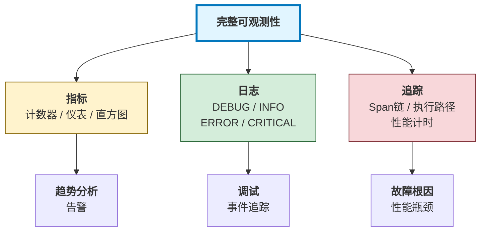
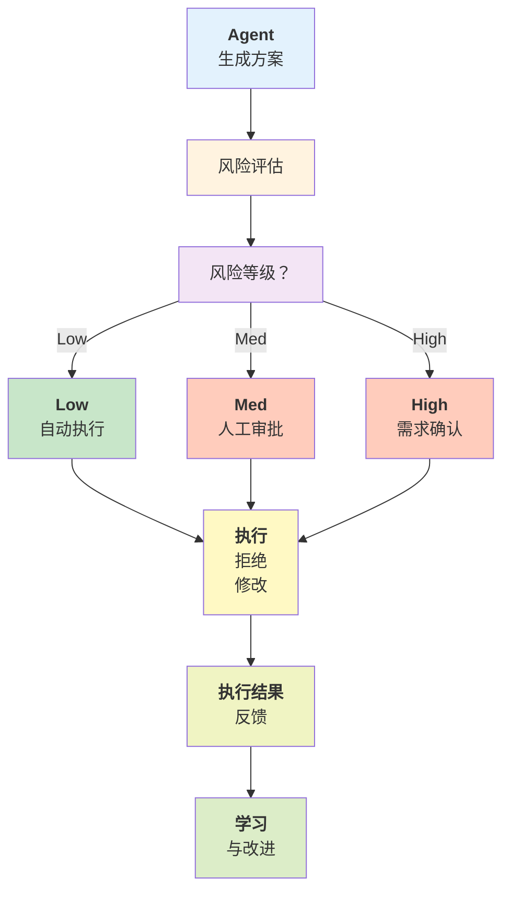
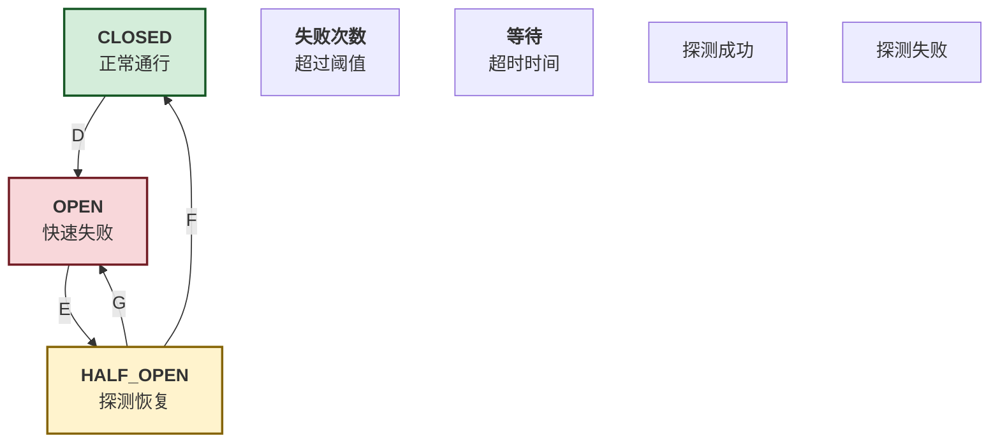
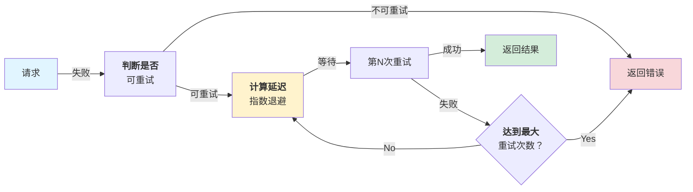
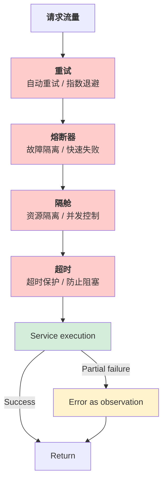
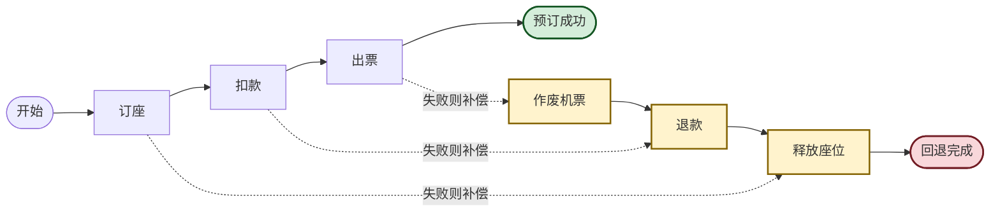

# 第十一章：容错与可靠性工程

一个智能体系统的成功不仅取决于它在正常情况下的表现，更取决于它在异常情况下的表现。第十一章探讨如何设计和实现一个容错、可恢复的智能体系统。

**现实中的故障场景**

在生产环境中，Harness 会面临各种故障：

1. **工具调用失败**
    - API 超时
    - 速率限制
    - 权限错误
    - 部分 Server 宕机
2. **LLM 服务故障**
    - API 不可用
    - 上下文长度超限
    - 配额耗尽
3. **数据和资源故障**
    - 数据库连接丢失
    - 内存溢出
    - 磁盘空间不足
4. **逻辑故障**
    - LLM 幻觉(Hallucination)
    - 无限循环
    - 死锁

**核心问题**

1. **如何可观测？** 我们如何知道系统正在做什么、是否出问题？
2. **如何反馈？** 当智能体做出危险决定时，人类如何介入？
3. **如何容错？** 一个模块故障时，系统如何继续工作？
4. **如何防幻觉？** 如何检测和防止 LLM 的错误输出？


**与其他章节的关联**

- ← 第 10 章的配置系统被用于控制容错策略
- → 这是最后的功能章节，为评估和未来方向做准备

**可靠性的度量**

在讨论具体技术前，我们需要定义目标：

| 指标             | 定义         | 生产目标     |
| -------------- | ---------- | -------- |
| Availability   | 系统可用时间/总时间 | 99.9%    |
| MTBF（平均故障间隔时间） | 故障间隔时间     | >1000 小时 |
| MTTR（平均恢复时间）   | 平均修复时间     | <5 分钟    |
| Error Rate     | 失败的请求比例    | <0.1%    |
| P99 延迟         | 99%的请求完成时间 | <10 秒    |

## 1. 可观测性体系

可观测性(Observability)是现代系统工程的基础。它通过三大支柱——指标(Metrics)、日志(Logs)和追踪(Traces)——帮助我们理解系统的内部状态。

!!! NOTE "行业现状"

    LangChain《State of Agent Engineering》调研数据（1300+从业者）：

    - **89%** 的组织已部署 Agent 可观测性基础设施
    - **94%** 的生产阶段组织拥有完整可观测性
    - **62%** 实现了详细的步骤级追踪(step-level tracing)
    - **质量(32%)** 是生产环境的首要障碍，而非成本
    
    这些数据表明：可观测性已成为行业共识，但从“可观测”到“可评估”再到“可优化”的闭环仍有巨大差距。


### 1.1 三大支柱

可观测性体系建立在指标(Metrics)、日志(Logs)和追踪(Traces)三大支柱之上，三者协同构成完整的系统观测能力。



图 11-1：可观测性三大支柱

### 1.2 Metrics

指标是关键数值的时间序列数据，用于监控系统健康状态。 指标系统分为两个核心层：**底层收集器** 和 **Agent 特定指标**。

首先是通用的指标收集器，支持计数器(counter)、仪表(gauge)和直方图(histogram)三种数据类型：

```python linenums="1" title="core/metrics_collector.py"
from typing import Dict, Any
from datetime import datetime
from collections import defaultdict
import time

class MetricsCollector:
    """指标收集器：计数器、仪表、直方图"""

    def __init__(self):
        self.counters: Dict[str, int] = defaultdict(int)
        self.gauges: Dict[str, float] = {}
        self.histograms: Dict[str, list] = defaultdict(list)
        self.start_time = time.time()

    def increment_counter(self, name: str, value: int = 1, tags: Dict = None) -> None:
        """增加计数器"""
        key = self._make_key(name, tags)
        self.counters[key] += value

    def set_gauge(self, name: str, value: float, tags: Dict = None) -> None:
        """设置仪表值"""
        key = self._make_key(name, tags)
        self.gauges[key] = value

    def record_histogram(self, name: str, value: float, tags: Dict = None) -> None:
        """记录直方图值"""
        key = self._make_key(name, tags)
        self.histograms[key].append({
            "value": value,
            "timestamp": datetime.now().isoformat(),
        })

    def _make_key(self, name: str, tags: Dict) -> str:
        """生成带标签的指标键"""
        if not tags:
            return name
        tag_str = ",".join(f"{k}={v}" for k, v in sorted(tags.items()))
        return f"{name}{{{tag_str}}}"

    def get_percentile(self, name: str, percentile: int) -> float:
        """获取百分位数(如 P50、P99)"""
        values = sorted(self._histogram_values(name))
        if not values:
            return 0.0
        index = int(len(values) * percentile / 100)
        return values[index] if index < len(values) else 0.0

    def _counter_sum(self, name: str) -> int:
        """聚合某个指标名下的所有标签维度"""
        return sum(
            value
            for key, value in self.counters.items()
            if key == name or key.startswith(f"{name}{{")
        )

    def _histogram_values(self, name: str) -> list[float]:
        """聚合某个指标名下的所有标签维度样本"""
        values = []
        for key, samples in self.histograms.items():
            if key == name or key.startswith(f"{name}{{"):
                values.extend(sample["value"] for sample in samples)
        return values

    def get_summary(self) -> Dict[str, Any]:
        """获取指标摘要"""
        return {
            "counters": dict(self.counters),
            "gauges": dict(self.gauges),
            "histograms_summary": {
                name: {
                    "count": len(values),
                    "min": min(v["value"] for v in values),
                    "max": max(v["value"] for v in values),
                    "p50": self.get_percentile(name, 50),
                    "p99": self.get_percentile(name, 99),
                }
                for name, values in self.histograms.items()
            },
            "uptime_seconds": time.time() - self.start_time,
        }
```

Agent 特定的指标收集层记录工具调用和迭代的性能数据：

```python linenums="1" title="core/agent_metrics.py"
class AgentMetrics:
    """Agent相关的指标"""

    def __init__(self):
        self.collector = MetricsCollector()

    def record_tool_call(
        self,
        tool_name: str,
        duration_ms: float,
        success: bool,
        tokens_used: int = 0,
    ) -> None:
        """记录单次工具调用：调用次数、延迟、Token、成功率"""
        tags = {"tool": tool_name, "success": str(success)}
        self.collector.increment_counter("tool_calls_total", tags=tags)
        self.collector.record_histogram("tool_call_duration_ms", duration_ms, tags=tags)
        if tokens_used > 0:
            self.collector.record_histogram("tool_tokens_used", tokens_used, tags=tags)
        if success:
            self.collector.increment_counter("tool_calls_success", tags=tags)
        else:
            self.collector.increment_counter("tool_calls_failed", tags=tags)

    def record_agent_iteration(
        self,
        agent_id: str,
        duration_ms: float,
        tokens_used: int,
        tools_called: int,
    ) -> None:
        """记录 Agent 一次迭代的统计数据"""
        tags = {"agent": agent_id}
        # ... (省略辅助方法)
        self.collector.record_histogram("agent_iteration_ms", duration_ms, tags=tags)
        self.collector.record_histogram("agent_tokens_per_iteration", tokens_used, tags=tags)
        self.collector.record_histogram("agent_tools_per_iteration", tools_called, tags=tags)

    def get_dashboard_data(self) -> Dict[str, Any]:
        """获取仪表板数据"""
        summary = self.collector.get_summary()
        return {
            "total_tool_calls": self.collector._counter_sum("tool_calls_total"),
            "tool_success_rate": self._calculate_success_rate(summary),
            "avg_tool_latency_ms": self._calculate_avg_latency(summary),
            "p99_latency_ms": self.collector.get_percentile("tool_call_duration_ms", 99),
            "total_tokens": sum(self.collector._histogram_values("tool_tokens_used")),
        }

    def _calculate_success_rate(self, summary: Dict) -> float:
        """计算成功率百分比"""
        success = self.collector._counter_sum("tool_calls_success")
        failed = self.collector._counter_sum("tool_calls_failed")
        total = success + failed
        return (success / total * 100) if total > 0 else 0.0

    def _calculate_avg_latency(self, summary: Dict) -> float:
        """计算平均延迟"""
        values = self.collector._histogram_values("tool_call_duration_ms")
        return (sum(values) / len(values)) if values else 0.0
```

### 1.3 Logs

结构化日志用于记录事件和调试信息。 结构化日志的核心是将日志事件转换为 JSON 格式，包含时间戳、日志级别、服务名和附加上下文：

```python linenums="1" title="core/structured_logger.py"
import json
from enum import Enum
from datetime import datetime

class LogLevel(Enum):
    DEBUG = 10
    INFO = 20
    WARNING = 30
    ERROR = 40
    CRITICAL = 50

class StructuredLogger:
    """结构化日志记录器"""

    def __init__(self, service_name: str):
        self.service_name = service_name
        self.logs = []

    def log(self, level: LogLevel, message: str, **kwargs) -> None:
        """记录结构化日志为 JSON"""
        log_entry = {
            "timestamp": datetime.now().isoformat(),
            "level": level.name,
            "service": self.service_name,
            "message": message,
            **kwargs,
        }
        self.logs.append(log_entry)
        print(json.dumps(log_entry))

    # 便捷方法
    def debug(self, message: str, **kwargs) -> None:
        self.log(LogLevel.DEBUG, message, **kwargs)

    def info(self, message: str, **kwargs) -> None:
        self.log(LogLevel.INFO, message, **kwargs)

    def warning(self, message: str, **kwargs) -> None:
        self.log(LogLevel.WARNING, message, **kwargs)

    def error(self, message: str, **kwargs) -> None:
        self.log(LogLevel.ERROR, message, **kwargs)

    def critical(self, message: str, **kwargs) -> None:
        self.log(LogLevel.CRITICAL, message, **kwargs)
```

日志记录器支持特定于 Agent 的便利方法，用于记录工具调用和决策过程：

```python linenums="1"
# 日志记录的智能体专用方法
class StructuredLogger:
    # ... (其他方法如上)

    def log_tool_call(
        self,
        tool_name: str,
        agent_id: str,
        duration_ms: float,
        success: bool,
        error: str = None,
    ) -> None:
        """记录工具调用的性能数据"""
        self.info(
            f"Tool call: {tool_name}",
            tool_name=tool_name,
            agent_id=agent_id,
            duration_ms=duration_ms,
            success=success,
            error=error,
        )

    def log_agent_decision(
        self,
        agent_id: str,
        decision: str,
        reasoning: str,
        confidence: float,
    ) -> None:
        """记录 Agent 决策及其推理"""
        self.info(
            f"Agent decision: {decision}",
            agent_id=agent_id,
            decision=decision,
            reasoning=reasoning,
            confidence=confidence,
        )
```

### 1.4 Traces

分布式追踪用于跟踪单个请求通过系统的完整路径。 分布式追踪通过 Span（跨度）来记录操作的执行路径。每个 Span 代表一个操作，包含时间戳、标签和状态信息：

```python linenums="1" title="core/tracer.py"
import uuid
import time
from dataclasses import dataclass
from typing import Dict, Any, List
from collections import defaultdict

@dataclass
class Span:
    """追踪跨度：表示一个操作的开始、结束和时间"""
    trace_id: str
    span_id: str
    parent_span_id: str
    operation_name: str
    start_time: float
    end_time: float = None
    duration_ms: float = None
    tags: Dict[str, Any] = None
    status: str = "ok"

    def finish(self) -> None:
        """完成 Span 的记录"""
        self.end_time = time.time()
        self.duration_ms = (self.end_time - self.start_time) * 1000

class Tracer:
    """分布式追踪记录器"""

    def __init__(self, service_name: str):
        self.service_name = service_name
        self.traces: Dict[str, list] = defaultdict(list)
        self.current_trace_id: str = None
        self.current_span_id: str = None

    def start_trace(self, request_id: str = None) -> str:
        """开始新的追踪(对应一个请求)"""
        self.current_trace_id = request_id or str(uuid.uuid4())
        self.current_span_id = None
        return self.current_trace_id

    def start_span(
        self,
        operation_name: str,
        parent_span_id: str = None,
        tags: Dict = None,
    ) -> Span:
        """开始新的 Span(子操作)"""
        span_id = str(uuid.uuid4())
        parent = parent_span_id or self.current_span_id
        span = Span(
            trace_id=self.current_trace_id,
            span_id=span_id,
            parent_span_id=parent,
            operation_name=operation_name,
            start_time=time.time(),
            tags=tags or {},
        )
        self.traces[self.current_trace_id].append(span)
        self.current_span_id = span_id
        return span

    def get_trace(self, trace_id: str) -> Dict[str, Any]:
        """获取完整的追踪数据(包括所有 Span)"""
        spans = self.traces.get(trace_id, [])
        root_spans = [s for s in spans if s.parent_span_id is None]
        total_duration = sum(s.duration_ms for s in spans if s.duration_ms)
        return {
            "trace_id": trace_id,
            "service": self.service_name,
            "spans": len(spans),
            "total_duration_ms": total_duration,
            "root_operations": [s.operation_name for s in root_spans],
        }
```

可观测性系统的集成使用示例。在执行工具时同时记录指标、日志和追踪：

```python linenums="1"
# 集成使用：指标 + 日志 + 追踪
logger = StructuredLogger("MiniHarness")
metrics = AgentMetrics()
tracer = Tracer("MiniHarness")

async def execute_tool_with_observability(
    tool_name: str,
    arguments: Dict,
    agent_id: str,
) -> Dict:
    """执行工具时记录完整的可观测信息"""
    trace_id = tracer.start_trace()
    span = tracer.start_span(f"tool.{tool_name}", tags={"tool": tool_name, "agent": agent_id})
    start_time = time.time()

    try:
        logger.debug(f"Calling tool: {tool_name}", tool=tool_name)
        # ... (省略实际工具调用逻辑)
        success, result, error = await registry.call_tool(tool_name, arguments, agent_id)
        duration_ms = (time.time() - start_time) * 1000

        if success:
            span.status = "ok"
            logger.info(f"Tool call succeeded", tool=tool_name, duration_ms=int(duration_ms))
            metrics.record_tool_call(tool_name, duration_ms, True)
        else:
            span.status = "error"
            logger.error(f"Tool call failed", tool=tool_name, error=error)
            metrics.record_tool_call(tool_name, duration_ms, False)

        return {"success": success, "result": result, "error": error}

    except Exception as e:
        span.status = "error"
        logger.critical(f"Tool call exception", tool=tool_name, exception=str(e))
        raise
    finally:
        span.finish()
```

### 1.5 监控仪表板

可观测性仪表板将指标、日志和追踪聚合到单一界面：

```python linenums="1" title="core/observability_dashboard.py"
class ObservabilityDashboard:
    """可观测性仪表板：聚合所有可观测数据"""

    def __init__(self, metrics: AgentMetrics, logger: StructuredLogger, tracer: Tracer):
        self.metrics = metrics
        self.logger = logger
        self.tracer = tracer

    def get_dashboard(self) -> Dict[str, Any]:
        """获取完整的仪表板数据(KPI + 日志 + 追踪)"""
        return {
            "metrics": self.metrics.get_dashboard_data(),
            "recent_logs": self.logger.logs[-100:],
            "active_traces": len([l for l in self.logger.logs if "trace_id" in l]),
            "error_rate_percent": self._calculate_error_rate(),
            "health_status": self._determine_health_status(),
        }

    def _calculate_error_rate(self) -> float:
        """计算错误日志百分比"""
        total_logs = len(self.logger.logs)
        error_logs = sum(1 for l in self.logger.logs if l.get("level") in ["ERROR", "CRITICAL"])
        return (error_logs / total_logs * 100) if total_logs > 0 else 0.0

    def _determine_health_status(self) -> str:
        """根据错误率判断系统健康状态"""
        error_rate = self._calculate_error_rate()
        if error_rate > 5:
            return "critical"
        elif error_rate > 1:
            return "warning"
        else:
            return "healthy"
```

### 1.6 本小节小结

可观测性的三大支柱：

1. **Metrics**：关键数值指标，用于趋势分析和告警
2. **Logs**：结构化日志，用于调试和事件追踪
3. **Traces**：分布式追踪，用于理解请求的完整路径

对于智能体系统，关键指标包括：

* 工具调用的成功率和延迟
* Token 使用量和成本
* Agent 迭代的深度和广度
* 整体系统的吞吐量和可用性

实现完整的可观测性是设计容错系统的第一步。下一节将讨论如何利用这些信息来建立反馈循环。

### 1.7 Claude Code 的可观测性案例：远程功能标志驱动的监控

以下以 Claude Code 公开能力为背景，给出一个分层记忆系统的可观测性分析模型：**每一层都应具备远程开关或配置入口**，允许工程团队在生产中观察、控制和禁用对应子系统。

**指标层**：每个内存层暴露其关键指标——第 1 层冻结的工具结果数量、第 3 层会话摘要注入的频率、第 4 层完整压缩的触发次数。这些指标直接反映系统在不同场景下的成本分布。

**日志层**：梦想 Agent（第 6 层）的每次整合运行都被记录为结构化日志，包括处理的会话数、去重的条目数、清理的过期信息。失败的梦想进程会记录完整的错误堆栈，而不仅仅是“失败”计数。

**追踪层**：从用户会话开始到最终记忆持久化的完整执行路径被追踪。一次梦想整合可能包括 4 个主阶段的 span，每个阶段含子 span 用于数据库查询、相似度计算、LLM 调用等。

**远程可控性**：若某一层表现异常（如梦想 Agent 处理延迟超过 30 秒），工程师可以通过 GrowthBook 远程禁用第 6 层，无需部署代码。所有新会话自动回退至第 5 层。同时，可观测性仪表板立即显示成本变化：内存持久化成本可能略上升，但整体延迟大幅下降。

这种设计的核心原则是：**可观测性不只是用于理解现状，而是用于驱动实时控制**。指标、日志、追踪共同服务于一个目标——在生产环境中安全地探索和优化复杂系统的行为。

**行业现状：可观测性与评估的落差**

LangChain 发布的《State of Agent Engineering》报告（调研 1300+ 从业者）揭示了一个值得关注的现象：**89% 的组织已部署可观测性基础设施，但评估(evals)的采用率仅为 52%**。这意味着大多数团队能够“看到”智能体在做什么，却缺乏系统化的方法来判断“做得好不好”。

报告的其他关键数据同样值得 Harness 工程师关注：

* 57% 的组织已有智能体在生产环境运行
* **质量是最大障碍** (32%)，成本反而不再是主要关切
* 57% 不做微调，依赖 base model + prompt engineering + RAG

这些数据表明：可观测性已成为共识，但从“可观测”到“可评估”再到“可优化”的闭环仍有巨大差距。第 13 章将深入讨论评估体系的构建。

### 1.8 可观测性与故障检测的设计原则

一个成熟的可观测性系统应该服务于三个目标：（1）理解系统现状；（2）快速检测异常；（3）驱动实时控制决策。Claude Code 通过以下设计体现这一整合：

* **主动阈值告警**：不仅监控“梦想 Agent 运行了多久”，更重要的是“这个时间与历史中位数的偏差”。若偏差超过 3 倍，立即触发告警，提示可能的故障或数据不一致。
* **分层监控成本**：不是所有层都需要同等粒度的监控。第 1-2 层采样监控（1%请求），第 3 层全量追踪（关键路径），第 6 层每次整合完整记录。这种差异化策略平衡了可观测成本和故障检测能力。
* **闭环反馈**：可观测数据不仅流向仪表板，也流向自动化决策。若 P99 梦想 Agent 延迟超过阈值连续 5 次，自动通过 GrowthBook 降级至第 5 层存储策略，最小化对用户的影响。

## 2. 反馈循环与人机协同设计

AI Agent 系统的可靠性关键在于与人类的有效协作。本节介绍反馈循环设计、人在环（HITL）模式、审批工作流、权限解释机制和 Ask-First 机制，确保 Agent 的关键决策获得人类监督。

### 2.1 HITL 模式

#### 2.1.1 HITL 流程图

人在环决策的核心流程如下：



图 11-2：人在环决策流程

#### 2.1.2 风险评估模块

风险评估模块的核心实现： 风险评估器使用加权因子模型来量化操作的风险等级。首先定义数据结构和因子权重：

```python linenums="1" title="core/risk_assessment.py"
from enum import Enum
from dataclasses import dataclass
from typing import Any, Dict

class RiskLevel(Enum):
    """风险等级"""
    LOW = 1
    MEDIUM = 2
    HIGH = 3
    CRITICAL = 4

@dataclass
class RiskAssessment:
    """风险评估结果"""
    level: RiskLevel
    score: float  # 0-100
    factors: Dict[str, float]
    explanation: str
    recommended_action: str
    requires_approval: bool

class RiskEvaluator:
    """风险评估器：加权因子模型"""

    def __init__(self):
        self.weights = {
            'data_sensitivity': 0.3,
            'financial_impact': 0.25,
            'irreversibility': 0.2,
            'confidence': 0.15,
            'user_authorization': 0.1
        }

    def assess(
        self,
        action_type: str,
        params: Dict[str, Any],
        context: Dict[str, Any],
        model_confidence: float = 0.8
    ) -> RiskAssessment:
        """评估操作的风险等级(0-100分)"""
        factors = {}
        factors['data_sensitivity'] = self._assess_data_sensitivity(params, context)
        factors['financial_impact'] = self._assess_financial_impact(action_type, params)
        factors['irreversibility'] = self._assess_irreversibility(action_type)
        factors['confidence'] = max(0, 1.0 - model_confidence)
        factors['user_authorization'] = self._assess_authorization(context)

        # 加权求和得到风险分数
        score = sum(factors.get(f, 0) * weight for f, weight in self.weights.items()) * 100

        # 分数映射到风险等级
        if score < 20:
            level = RiskLevel.LOW
        elif score < 50:
            level = RiskLevel.MEDIUM
        elif score < 80:
            level = RiskLevel.HIGH
        else:
            level = RiskLevel.CRITICAL

        return RiskAssessment(
            level=level,
            score=score,
            factors=factors,
            explanation=self._explain_risk(level, factors),
            recommended_action=self._recommend_action(level),
            requires_approval=level in (RiskLevel.HIGH, RiskLevel.CRITICAL)
        )
```

风险评估器的内部评分方法包括敏感性、财务影响和不可逆性评估：

```python linenums="1"
# RiskEvaluator 的评分方法
class RiskEvaluator:
    # ... (初始化如上)

    def _assess_data_sensitivity(self, params: dict, context: dict) -> float:
        """检查参数中是否包含敏感字段(密码、令牌等)"""
        sensitivity_keywords = ['password', 'token', 'secret', 'key', 'ssn', 'credit_card']
        for key in params:
            if any(keyword in key.lower() for keyword in sensitivity_keywords):
                return 1.0
        user_level = context.get('user_permission_level', 0)
        return user_level / 10

    def _assess_financial_impact(self, action_type: str, params: dict) -> float:
        """评估财务操作的风险和金额"""
        financial_actions = {
            'transfer': 0.9, 'charge': 0.8, 'refund': 0.7, 'delete_transaction': 0.85
        }
        base_score = financial_actions.get(action_type, 0.0)
        amount = params.get('amount', 0)
        if amount > 10000:
            base_score = min(1.0, base_score + 0.2)
        return base_score

    def _assess_irreversibility(self, action_type: str) -> float:
        """评估操作是否不可逆"""
        irreversible_actions = {
            'delete': 1.0, 'archive': 0.8, 'disable': 0.6, 'publish': 0.4, 'modify': 0.3
        }
        return irreversible_actions.get(action_type, 0.2)

    def _assess_authorization(self, context: dict) -> float:
        """检查用户是否已明确授权"""
        has_explicit_consent = context.get('has_explicit_consent', False)
        return 0.0 if has_explicit_consent else 1.0

    def _explain_risk(self, level: RiskLevel, factors: dict) -> str:
        """生成人类可读的风险解释"""
        explanations = {
            RiskLevel.LOW: "Low risk: Action is safe to execute automatically.",
            RiskLevel.MEDIUM: "Medium risk: Recommend human review before execution.",
            RiskLevel.HIGH: "High risk: Requires explicit human approval.",
            RiskLevel.CRITICAL: "Critical risk: Requires manager approval and logging."
        }
        return explanations[level]

    def _recommend_action(self, level: RiskLevel) -> str:
        """根据风险等级推荐执行方式"""
        actions = {
            RiskLevel.LOW: "auto_execute",
            RiskLevel.MEDIUM: "request_approval",
            RiskLevel.HIGH: "require_approval",
            RiskLevel.CRITICAL: "escalate_to_manager"
        }
        return actions[level]
```

### 2.2 审批工作流

审批工作流通过状态机管理请求的生命周期。首先定义审批请求的数据结构：

```python linenums="1" title="core/approval_workflow.py"
from enum import Enum
from dataclasses import dataclass, field
from datetime import datetime, timedelta
from typing import List, Optional, Callable
import uuid

class ApprovalStatus(Enum):
    """审批请求的状态"""
    PENDING = "pending"
    APPROVED = "approved"
    REJECTED = "rejected"
    NEEDS_CLARIFICATION = "needs_clarification"
    EXPIRED = "expired"

@dataclass
class ApprovalRequest:
    """审批请求对象"""
    id: str
    action_type: str
    action_params: dict
    requester_id: str
    request_time: datetime
    required_approvals: int
    approval_timeout_minutes: int = 60
    approvals: List[dict] = field(default_factory=list)
    rejections: List[dict] = field(default_factory=list)
    status: ApprovalStatus = ApprovalStatus.PENDING
    notes: str = ""

    def is_approved(self) -> bool:
        """检查是否已获得所有必要的批准"""
        if self.status == ApprovalStatus.APPROVED:
            return True
        if self.status in (ApprovalStatus.REJECTED, ApprovalStatus.EXPIRED):
            return False
        return len(self.approvals) >= self.required_approvals

    def is_expired(self) -> bool:
        """检查请求是否已超时"""
        expiry_time = self.request_time + timedelta(minutes=self.approval_timeout_minutes)
        return datetime.now() > expiry_time

    def get_remaining_approvals(self) -> int:
        """获取还需要的批准数"""
        return max(0, self.required_approvals - len(self.approvals))
```

审批工作流管理器提供创建、批准、拒绝和查询请求的操作：

```python linenums="1"
# 审批工作流管理器
class ApprovalWorkflow:
    """管理审批请求的生命周期"""

    def __init__(self):
        self.requests: dict[str, ApprovalRequest] = {}
        self.callbacks: dict[str, List[Callable]] = {}

    def create_request(
        self,
        action_type: str,
        action_params: dict,
        requester_id: str,
        required_approvals: int = 1,
        timeout_minutes: int = 60
    ) -> ApprovalRequest:
        """创建新的审批请求"""
        request_id = str(uuid.uuid4())
        request = ApprovalRequest(
            id=request_id,
            action_type=action_type,
            action_params=action_params,
            requester_id=requester_id,
            request_time=datetime.now(),
            required_approvals=required_approvals,
            approval_timeout_minutes=timeout_minutes
        )
        self.requests[request_id] = request
        self._trigger_callbacks('on_request_created', request)
        return request

    def approve(self, request_id: str, approver_id: str, comments: str = "") -> bool:
        """批准请求"""
        if request_id not in self.requests:
            return False
        request = self.requests[request_id]
        if request.is_expired():
            request.status = ApprovalStatus.EXPIRED
            self._trigger_callbacks('on_request_expired', request)
            return False
        request.approvals.append({'approver_id': approver_id, 'time': datetime.now(), 'comments': comments})
        if request.is_approved():
            request.status = ApprovalStatus.APPROVED
            self._trigger_callbacks('on_request_approved', request)
        return True

    def reject(self, request_id: str, reviewer_id: str, reason: str) -> bool:
        """拒绝请求"""
        if request_id not in self.requests:
            return False
        request = self.requests[request_id]
        request.status = ApprovalStatus.REJECTED
        request.rejections.append({'reviewer_id': reviewer_id, 'time': datetime.now(), 'reason': reason})
        self._trigger_callbacks('on_request_rejected', request)
        return True

    def request_clarification(self, request_id: str, clarifier_id: str, question: str) -> bool:
        """请求澄清"""
        if request_id not in self.requests:
            return False
        request = self.requests[request_id]
        request.status = ApprovalStatus.NEEDS_CLARIFICATION
        request.notes = question
        self._trigger_callbacks('on_clarification_requested', request)
        return True

    def get_request(self, request_id: str) -> Optional[ApprovalRequest]:
        """获取单个请求"""
        return self.requests.get(request_id)

    def get_pending_requests(self) -> List[ApprovalRequest]:
        """获取所有待审批的请求"""
        return [r for r in self.requests.values() if r.status == ApprovalStatus.PENDING and not r.is_expired()]

    def register_callback(self, event: str, callback: Callable):
        """为事件注册回调处理器"""
        if event not in self.callbacks:
            self.callbacks[event] = []
        self.callbacks[event].append(callback)

    def _trigger_callbacks(self, event: str, request: ApprovalRequest):
        """触发事件回调"""
        if event in self.callbacks:
            for callback in self.callbacks[event]:
                callback(request)
```

### 2.3 权限解释器

权限解释器使用 LLM 来理解用户的自然语言权限声明：

```python linenums="1" title="core/permission_interpreter.py"
from anthropic import Anthropic
from dataclasses import dataclass
from typing import List
import json

@dataclass
class PermissionDeclaration:
    """权限声明的解释结果"""
    user_input: str
    interpreted_permissions: List[str]
    confidence: float
    explanation: str

class PermissionInterpreter:
    """自然语言权限解释器"""

    def __init__(self):
        self.client = Anthropic()

    def interpret(self, user_declaration: str) -> PermissionDeclaration:
        """将用户的自然语言声明转换为权限列表"""
        system_prompt = """You are a permission interpreter for AI agents.
Analyze the user's declaration and extract the implied permissions.
Return a JSON object with:
{
  "permissions": ["permission1", "permission2"],
  "confidence": 0.95,
  "explanation": "The user is granting permission to X because Y"
}

Common patterns: "You can X" → grant X; "Don't X" → deny X; "Ask before Y" → conditional Y
"""
        response = self.client.messages.create(
            model="claude-sonnet-4-6",
            max_tokens=500,
            system=system_prompt,
            messages=[{"role": "user", "content": f"Interpret: {user_declaration}"}]
        )
        result = json.loads(response.content[0].text)
        return PermissionDeclaration(
            user_input=user_declaration,
            interpreted_permissions=result['permissions'],
            confidence=result['confidence'],
            explanation=result['explanation']
        )

    def ask_for_clarification(self, declaration: str, context: str) -> str:
        """在权限解释不清晰时请求澄清"""
        response = self.client.messages.create(
            model="claude-sonnet-4-6",
            max_tokens=300,
            messages=[{"role": "user", "content": f"""User said: "{declaration}"\nContext: {context}\nSuggest clarifying questions."""}]
        )
        return response.content[0].text
```

使用示例展示如何解释不同的权限声明：

```python linenums="1"
# 权限解释器使用示例
if __name__ == "__main__":
    interpreter = PermissionInterpreter()

    # 简单授权:删除缓存文件
    decl1 = interpreter.interpret("You can delete old cache files")
    print(f"Permissions: {decl1.interpreted_permissions}")
    print(f"Confidence: {decl1.confidence}")

    # 条件授权:数据库迁移但要求在删除表前确认
    decl2 = interpreter.interpret("Go ahead with migration, but confirm before dropping tables")
    print(f"Permissions: {decl2.interpreted_permissions}")

    # 请求澄清:对于含糊的权限声明
    clarification = interpreter.ask_for_clarification(
        "You can handle my emails",
        "Agent considering: send, delete, move"
    )
    print(f"Clarification questions:\n{clarification}")
```

### 2.4 OpenClaw Ask-First 模式

Ask-First 权限模型实现了 6 级信任框架。权限管理器跟踪用户的决策并根据时间或上下文变化重新询问：

```python linenums="1" title="core/ask_first_permission.py"
from enum import Enum
from typing import Optional
from datetime import datetime, timedelta

class PermissionLevel(Enum):
    """6 级信任模型"""
    MANUAL_ONLY = "Manual-only"
    APPROVE_ALWAYS = "Approve-always"
    APPROVE_ONCE = "Approve-once"
    ASK_FIRST = "Ask-first"
    AUTO_WITH_NOTIFICATION = "Auto-with-notification"
    FULL_TRUST = "Full-trust"

class AskFirstManager:
    """Ask-First 权限管理器"""

    def __init__(self):
        self.user_decisions = {}  # {user_id: {action_type: (decision, timestamp)}}

    def should_ask(
        self,
        user_id: str,
        action_type: str,
        permission_level: PermissionLevel,
        context_changed: bool = False
    ) -> bool:
        """判断是否需要询问用户"""
        if permission_level == PermissionLevel.FULL_TRUST:
            return False
        if permission_level in (PermissionLevel.MANUAL_ONLY, PermissionLevel.APPROVE_ALWAYS, PermissionLevel.APPROVE_ONCE):
            return True

        if permission_level == PermissionLevel.ASK_FIRST:
            # 检查是否已有用户决策
            if user_id in self.user_decisions:
                action_key = self._normalize_action(action_type)
                if action_key in self.user_decisions[user_id]:
                    decision, timestamp = self.user_decisions[user_id][action_key]
                    # 24 小时后或上下文变化时重新询问
                    if context_changed or (datetime.now() - timestamp > timedelta(hours=24)):
                        return True
                    return not decision
            return True  # 首次询问

        if permission_level == PermissionLevel.AUTO_WITH_NOTIFICATION:
            return False
        return False

    def record_decision(
        self,
        user_id: str,
        action_type: str,
        approved: bool,
        remember_for_hours: int = 24
    ):
        """记录用户决定以便下次记忆"""
        if user_id not in self.user_decisions:
            self.user_decisions[user_id] = {}
        action_key = self._normalize_action(action_type)
        self.user_decisions[user_id][action_key] = (approved, datetime.now())

    def clear_decisions(self, user_id: str):
        """清除用户的决定缓存"""
        if user_id in self.user_decisions:
            del self.user_decisions[user_id]

    @staticmethod
    def _normalize_action(action_type: str) -> str:
        """规范化操作类型为小写"""
        return action_type.lower().strip()
```

Ask-First 对话模块负责生成询问提示和解析用户响应：

```python linenums="1"
# Ask-First 对话生成和解析
class AskFirstDialog:
    """Ask-First 对话生成和响应解析"""

    @staticmethod
    def generate_prompt(action_type: str, action_description: str, impact: str) -> str:
        """生成询问用户的提示"""
        return f"""The AI agent wants to perform the following action:

Action: {action_type}
Description: {action_description}
Impact: {impact}

Should I proceed? Please reply with:
- "yes" or "approve" to allow this action
- "no" or "deny" to block this action
- "ask next time" if you want to be asked again next time
- Or provide modified parameters"""

    @staticmethod
    def parse_response(user_response: str) -> dict:
        """解析用户的响应"""
        response_lower = user_response.lower().strip()

        if response_lower in ('yes', 'approve', 'ok', 'proceed'):
            return {'approved': True, 'remember': True}
        elif response_lower in ('no', 'deny', 'block', 'cancel'):
            return {'approved': False, 'remember': True}
        elif 'ask next time' in response_lower or 'ask again' in response_lower:
            return {'approved': None, 'remember': False}
        else:
            return {'approved': None, 'modified_params': user_response}
```

### 2.5 用户反馈采集

反馈系统收集用户对 Agent 操作的评价，并分析改进领域。首先定义反馈数据结构：

```python linenums="1" title="core/user_feedback.py"
from dataclasses import dataclass
from enum import Enum
from datetime import datetime
from typing import List, Optional
import uuid

class FeedbackType(Enum):
    """反馈类型"""
    POSITIVE = "positive"
    NEGATIVE = "negative"
    CORRECTION = "correction"
    PARTIAL = "partial"
    IRRELEVANT = "irrelevant"

@dataclass
class UserFeedback:
    """用户反馈对象"""
    feedback_id: str
    action_id: str
    feedback_type: FeedbackType
    rating: int  # 1-5
    comment: str
    user_id: str
    timestamp: datetime
    category: Optional[str] = None

class FeedbackCollector:
    """反馈采集器"""

    def __init__(self):
        self.feedbacks: List[UserFeedback] = []

    def collect(
        self,
        action_id: str,
        feedback_type: FeedbackType,
        rating: int,
        comment: str,
        user_id: str,
        category: str = None
    ) -> UserFeedback:
        """采集单条反馈"""
        feedback = UserFeedback(
            feedback_id=str(uuid.uuid4()),
            action_id=action_id,
            feedback_type=feedback_type,
            rating=rating,
            comment=comment,
            user_id=user_id,
            timestamp=datetime.now(),
            category=category
        )
        self.feedbacks.append(feedback)
        return feedback

    def get_action_feedback(self, action_id: str) -> List[UserFeedback]:
        """获取特定操作的所有反馈"""
        return [f for f in self.feedbacks if f.action_id == action_id]

    def get_stats(self) -> dict:
        """获取反馈的聚合统计"""
        total = len(self.feedbacks)
        if total == 0:
            return {'total': 0}

        types = {}
        for feedback in self.feedbacks:
            types[feedback.feedback_type.value] = types.get(feedback.feedback_type.value, 0) + 1

        avg_rating = sum(f.rating for f in self.feedbacks) / total

        return {
            'total': total,
            'types': types,
            'average_rating': avg_rating,
            'negative_percentage': types.get('negative', 0) / total * 100
        }

    def get_improvement_areas(self) -> List[str]:
        """识别需要改进的领域(按负面反馈频率排序)"""
        negative_feedbacks = [f for f in self.feedbacks if f.feedback_type == FeedbackType.NEGATIVE]

        categories = {}
        for feedback in negative_feedbacks:
            category = feedback.category or 'general'
            categories[category] = categories.get(category, 0) + 1

        return sorted(categories.items(), key=lambda x: x[1], reverse=True)
```

### 2.6 实战：完整的 HITL 系统

实现代码如下：

```python
# examples/hitl_system_example.py
"""
完整的人在环决策系统示例
"""

import asyncio
from datetime import datetime

class HITLSystem:
    """人在环决策系统"""

    def __init__(self):
        self.risk_evaluator = RiskEvaluator()
        self.approval_workflow = ApprovalWorkflow()
        self.permission_interpreter = PermissionInterpreter()
        self.feedback_collector = FeedbackCollector()
        self.ask_first_manager = AskFirstManager()

    async def execute_action(
        self,
        user_id: str,
        action_type: str,
        action_params: dict,
        agent_confidence: float = 0.8
    ) -> dict:
        """
        执行行为,带人在环审批

        流程:
        1. 风险评估
        2. 根据风险等级决定是否需要审批
        3. 创建审批请求或直接执行
        4. 收集反馈
        """

        # 步骤 1:风险评估
        context = {'user_id': user_id}
        risk_assessment = self.risk_evaluator.assess(
            action_type, action_params, context, agent_confidence
        )

        print(f"Risk Assessment: {risk_assessment.level.name}")
        print(f"Score: {risk_assessment.score:.1f}")

        # 步骤 2:确定执行方式
        if risk_assessment.level.value <= 1:  # LOW
            # 自动执行
            return await self._auto_execute(action_type, action_params)

        elif risk_assessment.level.value == 2:  # MEDIUM
            # Ask-First 模式
            should_ask = self.ask_first_manager.should_ask(
                user_id, action_type, PermissionLevel.ASK_FIRST
            )

            if should_ask:
                return await self._request_confirmation(
                    user_id, action_type, action_params
                )
            else:
                return await self._auto_execute(action_type, action_params)

        else:  # HIGH or CRITICAL
            # 创建审批请求
            return await self._request_approval(
                user_id, action_type, action_params, risk_assessment
            )

    async def _auto_execute(self, action_type: str, action_params: dict) -> dict:
        """自动执行"""
        print(f"Auto-executing {action_type}")
        # 实际执行逻辑
        return {'status': 'executed', 'action': action_type}

    async def _request_confirmation(
        self,
        user_id: str,
        action_type: str,
        action_params: dict
    ) -> dict:
        """请求确认"""
        prompt = AskFirstDialog.generate_prompt(
            action_type,
            f"Execute {action_type} with params {action_params}",
            "Medium risk operation"
        )

        print(f"\nRequesting confirmation:\n{prompt}")
        user_response = input("Your response: ")

        decision = AskFirstDialog.parse_response(user_response)

        if decision['approved']:
            self.ask_first_manager.record_decision(user_id, action_type, True)
            return await self._auto_execute(action_type, action_params)
        else:
            return {'status': 'rejected', 'reason': 'User denied'}

    async def _request_approval(
        self,
        user_id: str,
        action_type: str,
        action_params: dict,
        risk_assessment
    ) -> dict:
        """请求审批"""
        request = self.approval_workflow.create_request(
            action_type=action_type,
            action_params=action_params,
            requester_id=user_id,
            required_approvals=2 if risk_assessment.level == RiskLevel.CRITICAL else 1
        )

        print(f"\nApproval request created: {request.id}")
        print(f"Risk level: {risk_assessment.level.name}")
        print(f"Explanation: {risk_assessment.explanation}")

        # 模拟审批流程
        # 在实际系统中,这会通过通知系统发给审批人员
        return {
            'status': 'pending_approval',
            'request_id': request.id
        }

# 使用示例
async def main():
    hitl = HITLSystem()

    # 测试场景 1:低风险操作(自动执行)
    print("=" * 50)
    print("Scenario 1: Low-risk operation")
    result1 = await hitl.execute_action(
        user_id="user_123",
        action_type="read_logs",
        action_params={"hours": 24},
        agent_confidence=0.95
    )
    print(f"Result: {result1}\n")

    # 测试场景 2:中等风险(Ask-First)
    print("=" * 50)
    print("Scenario 2: Medium-risk operation")
    result2 = await hitl.execute_action(
        user_id="user_123",
        action_type="modify_settings",
        action_params={"setting": "cache_ttl", "value": 7200},
        agent_confidence=0.7
    )
    print(f"Result: {result2}\n")

    # 测试场景 3:高风险(需要审批)
    print("=" * 50)
    print("Scenario 3: High-risk operation")
    result3 = await hitl.execute_action(
        user_id="user_123",
        action_type="delete_data",
        action_params={"table": "users", "condition": "created_before_2020"},
        agent_confidence=0.6
    )
    print(f"Result: {result3}\n")

if __name__ == "__main__":
    asyncio.run(main())
```

### 2.7 运行时指令注入

前面讨论的反馈机制（审批、Ask-First、反馈采集）都是 **预设流程**——系统在特定节点等待用户响应。但在长时间运行的 Agent 任务中，用户需要能在 **任意时刻** 向正在执行的 Agent 发送新指令，而不必等到下一个预设检查点。

#### 2.7.1 指令注入的架构

运行时指令注入通过独立的 **控制通道** 实现，与 Agent 的数据通道（Think-Act-Observe 循环）并行运行：

```python
from dataclasses import dataclass, field
from enum import IntEnum
from typing import Optional
import asyncio
import time

class InstructionPriority(IntEnum):
    URGENT = 0    # 立即处理(如 "停止")
    HIGH = 1      # 下一个安全点处理(如 "换个方向")
    NORMAL = 2    # 当前步骤完成后处理(如 "顺便也看看 X")
    LOW = 3       # 空闲时处理(如 "改进输出格式")

@dataclass(order=True)
class RuntimeInstruction:
    priority: InstructionPriority
    content: str = field(compare=False)
    timestamp: float = field(default_factory=time.time, compare=False)
    source: str = field(default="user", compare=False)

class InstructionChannel:
    """Agent 运行时指令通道"""

    def __init__(self):
        self._queue: asyncio.PriorityQueue = asyncio.PriorityQueue()

    async def inject(self, instruction: RuntimeInstruction):
        """外部系统注入指令"""
        await self._queue.put(instruction)

    async def poll(self) -> Optional[RuntimeInstruction]:
        """Agent 在安全点轮询指令"""
        if self._queue.empty():
            return None
        return await self._queue.get()

    def has_urgent(self) -> bool:
        """检查是否有紧急指令(不阻塞)"""
        # 实现需根据具体 PriorityQueue 适配
        return not self._queue.empty()
```

### 安全点与状态一致性

Agent 不能在任意时刻处理注入指令——必须在 **安全点** 处理，以保证状态一致性：

```python
class SafeCheckpoint:
    """安全检查点标记"""
    BEFORE_LLM_CALL = "before_llm"      # LLM 调用前
    AFTER_TOOL_EXEC = "after_tool"       # 工具执行后
    AT_TASK_BOUNDARY = "task_boundary"   # 任务边界
    BEFORE_STATE_UPDATE = "before_state" # 状态更新前

class AgentWithInjection:
    """支持运行时指令注入的 智能体循环"""

    def __init__(self, channel: InstructionChannel):
        self.channel = channel
        self._context_additions: list[str] = []

    async def _process_instructions(self, checkpoint: str):
        """在安全检查点处理所有待处理指令"""
        while True:
            instr = await self.channel.poll()
            if instr is None:
                break

            if instr.content.startswith("STOP"):
                raise StopIteration("User stop")
            elif instr.content.startswith("PAUSE"):
                await self._wait_for_resume()
            else:
                # 将指令追加到上下文,影响后续推理
                self._context_additions.append(
                    f"[用户指令 @ {checkpoint}]: {instr.content}"
                )

    async def run_step(self, step):
        # 安全点 1: LLM 调用前
        await self._process_instructions(SafeCheckpoint.BEFORE_LLM_CALL)

        # 执行 LLM 推理(携带注入的上下文)
        result = await self.llm_call(step, extra_context=self._context_additions)

        # 安全点 2: 工具执行后
        if result.needs_tool:
            tool_result = await self.execute_tool(result.tool_call)
            await self._process_instructions(SafeCheckpoint.AFTER_TOOL_EXEC)

        return result
```

这种设计确保注入的指令不会破坏 Agent 的中间状态，而是在下一个安全点被优雅地吸收到执行流程中。

### 2.8 总结

反馈循环与人机协同的关键组件：

| 组件        | 作用           | 参考系统        |
| --------- | ------------ | ----------- |
| 风险评估      | 量化操作风险       | 独立设计        |
| HITL 工作流  | 根据风险级别决定执行方式 | 独立设计        |
| 审批工作流     | 高风险操作的正式审批   | OpenClaw    |
| 权限解释      | 自然语言权限授予     | Claude Code |
| Ask-First | 首次询问，后续记忆    | OpenClaw    |
| 反馈采集      | 从用户反馈中学习     | 独立设计        |
| 运行时指令注入   | 执行中接受新指令     | 控制通道 + 安全点  |

下一节将介绍容错模式与系统级恢复。

## 3. 容错模式与系统级恢复

AI Agent 系统在生产环境中需要面对网络中断、API 超时等各种故障。本节介绍四大容错模式（熔断器、隔舱、超时、重试）、幂等性设计、检查点恢复、SAGA 补偿事务和“错误作为观察”设计模式。

## 3.1 四大容错模式

#### 3.1.1 熔断器

熔断器的状态转移流程如下：



图 11-3：熔断器状态机

熔断器通过状态机实现故障隔离。首先定义状态枚举和配置：

```python linenums="1" title="core/circuit_breaker.py"
from enum import Enum
from datetime import datetime, timedelta
import asyncio

class CircuitState(Enum):
    CLOSED = "closed"      # 正常：请求通过
    OPEN = "open"          # 故障：快速失败
    HALF_OPEN = "half_open"  # 恢复中：探测性请求

class CircuitBreakerConfig:
    """熔断器参数配置"""
    def __init__(
        self,
        failure_threshold: int = 5,
        success_threshold: int = 2,
        timeout_seconds: int = 60,
        expected_exception: type = Exception
    ):
        self.failure_threshold = failure_threshold
        self.success_threshold = success_threshold
        self.timeout_seconds = timeout_seconds
        self.expected_exception = expected_exception

class CircuitBreaker:
    """熔断器实现(CLOSED ↔ HALF_OPEN ↔ OPEN)"""

    def __init__(self, name: str, config: CircuitBreakerConfig):
        self.name = name
        self.config = config
        self.state = CircuitState.CLOSED
        self.failure_count = 0
        self.success_count = 0
        self.last_failure_time = None

    async def call(self, func, *args, **kwargs):
        """通过熔断器调用函数"""
        if self.state == CircuitState.OPEN:
            if self._should_attempt_reset():
                self.state = CircuitState.HALF_OPEN
                self.success_count = 0
                print(f"Circuit breaker {self.name} entering HALF_OPEN")
            else:
                raise Exception(f"Circuit breaker {self.name} is OPEN")

        try:
            result = await func(*args, **kwargs)
            self._on_success()
            return result
        except self.config.expected_exception as e:
            self._on_failure()
            raise

    def _on_success(self):
        """处理成功调用"""
        self.failure_count = 0
        if self.state == CircuitState.HALF_OPEN:
            self.success_count += 1
            if self.success_count >= self.config.success_threshold:
                self.state = CircuitState.CLOSED
                self.success_count = 0
                print(f"Circuit breaker {self.name} closed (recovered)")

    def _on_failure(self):
        """处理失败调用"""
        self.failure_count += 1
        self.last_failure_time = datetime.now()

        if self.state == CircuitState.CLOSED:
            if self.failure_count >= self.config.failure_threshold:
                self.state = CircuitState.OPEN
                print(f"Circuit breaker {self.name} opened")
        elif self.state == CircuitState.HALF_OPEN:
            self.state = CircuitState.OPEN
            print(f"Circuit breaker {self.name} reopened")

    def _should_attempt_reset(self) -> bool:
        """检查是否应该尝试从 OPEN 转为 HALF_OPEN"""
        if self.last_failure_time is None:
            return True
        elapsed = (datetime.now() - self.last_failure_time).total_seconds()
        return elapsed >= self.config.timeout_seconds

    def get_state(self) -> dict:
        """获取熔断器状态信息"""
        return {
            'name': self.name,
            'state': self.state.value,
            'failure_count': self.failure_count,
            'success_count': self.success_count,
            'last_failure_time': self.last_failure_time
        }
```

#### 3.1.2 隔舱

隔舱模式的实现代码如下：

```python linenums="1" title="core/bulkhead.py"
"""
隔舱模式：为不同的操作分配独立的资源池
防止一个故障影响其他操作
"""

import asyncio
from asyncio import Semaphore
from typing import Dict
import logging

logger = logging.getLogger(__name__)

class BulkheadConfig:
    """隔舱配置"""
    def __init__(self, max_concurrent: int = 10, timeout: int = 30):
        self.max_concurrent = max_concurrent
        self.timeout = timeout

class Bulkhead:
    """隔舱：限制并发数"""

    def __init__(self, name: str, config: BulkheadConfig):
        self.name = name
        self.config = config
        self.semaphore = Semaphore(config.max_concurrent)
        self.active_tasks = 0

    async def execute(self, func, *args, **kwargs):
        """在隔舱内执行任务"""
        async with self.semaphore:
            self.active_tasks += 1
            logger.info(
                f"Bulkhead {self.name}: "
                f"{self.active_tasks}/{self.config.max_concurrent} active"
            )

            try:
                return await asyncio.wait_for(
                    func(*args, **kwargs),
                    timeout=self.config.timeout
                )
            finally:
                self.active_tasks -= 1

class BulkheadManager:
    """隔舱管理器"""

    def __init__(self):
        self.bulkheads: Dict[str, Bulkhead] = {}

    def create_bulkhead(self, name: str, config: BulkheadConfig) -> Bulkhead:
        """创建隔舱"""
        bulkhead = Bulkhead(name, config)
        self.bulkheads[name] = bulkhead
        return bulkhead

    async def execute(self, bulkhead_name: str, func, *args, **kwargs):
        """通过指定隔舱执行任务"""
        if bulkhead_name not in self.bulkheads:
            raise ValueError(f"Bulkhead {bulkhead_name} not found")

        return await self.bulkheads[bulkhead_name].execute(func, *args, **kwargs)

    def get_stats(self) -> dict:
        """获取所有隔舱的统计"""
        return {
            name: {
                'max_concurrent': bulkhead.config.max_concurrent,
                'active_tasks': bulkhead.active_tasks
            }
            for name, bulkhead in self.bulkheads.items()
        }
```

#### 3.1.3 超时

实现如下：

```python linenums="1" title="core/timeout.py"
"""
超时模式：设定最长等待时间,避免无限阻塞
"""

import asyncio
from contextlib import asynccontextmanager

class TimeoutManager:
    """超时管理"""

    @staticmethod
    @asynccontextmanager
    async def timeout(seconds: int, operation_name: str = "operation"):
        """
        超时上下文管理器

        使用示例：
            async with TimeoutManager.timeout(30, "database_query") as tm:
                result = await db.query(...)
        """
        try:
            async with asyncio.timeout(seconds):
                yield
        except asyncio.TimeoutError:
            raise TimeoutError(
                f"Operation {operation_name} exceeded {seconds}s timeout"
            )

    @staticmethod
    async def with_timeout(func, timeout_seconds: int, *args, **kwargs):
        """为函数调用添加超时"""
        try:
            return await asyncio.wait_for(
                func(*args, **kwargs),
                timeout=timeout_seconds
            )
        except asyncio.TimeoutError:
            raise TimeoutError(
                f"Function {func.__name__} exceeded {timeout_seconds}s timeout"
            )

class AdaptiveTimeout:
    """自适应超时(根据历史数据调整)"""

    def __init__(self, initial_timeout: int = 30):
        self.initial_timeout = initial_timeout
        self.execution_times = []
        self.max_samples = 100

    def record(self, duration: float):
        """记录执行时间"""
        self.execution_times.append(duration)
        if len(self.execution_times) > self.max_samples:
            self.execution_times.pop(0)

    def get_timeout(self) -> int:
        """获取建议的超时时间"""
        if not self.execution_times:
            return self.initial_timeout

        # 使用 P95 作为超时时间[1]
        sorted_times = sorted(self.execution_times)
        p95_index = int(len(sorted_times) * 0.95)
        p95_time = sorted_times[p95_index]

        # 添加 20% 的缓冲
        return max(self.initial_timeout, int(p95_time * 1.2))
```

#### 3.1.4 重试

具体实现代码如下：



图 11-4：重试机制流程（可重试判断 + 指数退避）



图 11-5：四大容错模式级联防护 重试策略通过指数退避和抖动来处理瞬时故障。首先定义重试配置和策略：

```python linenums="1" title="core/retry.py"
import asyncio
import random
from typing import Callable
import logging

logger = logging.getLogger(__name__)

class RetryConfig:
    """重试配置参数"""
    def __init__(
        self,
        max_attempts: int = 3,
        initial_delay: float = 1.0,
        max_delay: float = 60.0,
        exponential_base: float = 2.0,
        jitter: bool = True,
        retryable_exceptions: tuple = (Exception,)
    ):
        self.max_attempts = max_attempts
        self.initial_delay = initial_delay
        self.max_delay = max_delay
        self.exponential_base = exponential_base
        self.jitter = jitter
        self.retryable_exceptions = retryable_exceptions

class RetryPolicy:
    """重试执行策略(指数退避 + 抖动)"""

    def __init__(self, config: RetryConfig):
        self.config = config
        self.attempt_count = 0

    async def execute(self, func: Callable, *args, **kwargs):
        """执行函数,失败时自动重试"""
        last_exception = None

        for attempt in range(1, self.config.max_attempts + 1):
            try:
                result = await func(*args, **kwargs)
                logger.info(f"Succeeded on attempt {attempt}")
                return result

            except self.config.retryable_exceptions as e:
                last_exception = e
                self.attempt_count = attempt

                if attempt == self.config.max_attempts:
                    logger.error(f"Failed after {attempt} attempts: {e}")
                    raise

                # 计算延迟：指数退避 + 抖动
                delay = self._calculate_delay(attempt)
                logger.warning(f"Attempt {attempt} failed: {e}. Retrying in {delay:.1f}s...")
                await asyncio.sleep(delay)

        raise last_exception

    def _calculate_delay(self, attempt: int) -> float:
        """计算延迟时间：指数退避 + 10% 随机抖动"""
        delay = self.config.initial_delay * (self.config.exponential_base ** (attempt - 1))
        delay = min(delay, self.config.max_delay)

        if self.config.jitter:
            jitter = random.uniform(0, delay * 0.1)
            delay += jitter

        return delay

class RetryDecorator:
    """重试装饰器"""

    @staticmethod
    def retry(config: RetryConfig = None):
        """为函数添加重试能力的装饰器"""
        if config is None:
            config = RetryConfig()

        def decorator(func):
            async def wrapper(*args, **kwargs):
                policy = RetryPolicy(config)
                return await policy.execute(func, *args, **kwargs)
            return wrapper
        return decorator
```

### 3.2 幂等性设计

核心实现如下： 幂等性管理器确保相同操作只执行一次，即使请求重复。通过生成操作的哈希键来检测重复：

```python linenums="1" title="core/idempotency.py"
import hashlib
import json
from typing import Dict, Any, Optional
from datetime import datetime, timedelta
import asyncio

class IdempotencyManager:
    """幂等性管理：重复操作返回缓存结果"""

    def __init__(self, ttl_seconds: int = 3600):
        self.cache: Dict[str, Any] = {}
        self.metadata: Dict[str, Dict] = {}
        self.ttl = ttl_seconds

    @staticmethod
    def generate_key(operation: str, params: dict) -> str:
        """生成幂等性 Key(操作 + 参数的 SHA256 哈希)"""
        key_data = {'operation': operation, 'params': params}
        key_string = json.dumps(key_data, sort_keys=True)
        return hashlib.sha256(key_string.encode()).hexdigest()

    async def execute_idempotent(
        self,
        idempotency_key: str,
        operation: str,
        func,
        *args,
        **kwargs
    ) -> Any:
        """执行幂等操作(缓存相同操作的结果)"""
        # 检查缓存
        if idempotency_key in self.cache:
            metadata = self.metadata[idempotency_key]
            if metadata['status'] == 'completed':
                return self.cache[idempotency_key]
            elif metadata['status'] == 'in_progress':
                # 等待进行中的操作完成
                await asyncio.sleep(0.1)
                return await self.execute_idempotent(
                    idempotency_key, operation, func, *args, **kwargs
                )

        # 标记为进行中
        self.metadata[idempotency_key] = {
            'status': 'in_progress',
            'operation': operation,
            'started_at': datetime.now()
        }

        try:
            result = await func(*args, **kwargs)
            # 缓存成功结果
            self.cache[idempotency_key] = result
            self.metadata[idempotency_key] = {
                'status': 'completed',
                'operation': operation,
                'completed_at': datetime.now()
            }
            return result

        except Exception as e:
            # 记录失败状态
            self.metadata[idempotency_key] = {
                'status': 'failed',
                'operation': operation,
                'error': str(e),
                'failed_at': datetime.now()
            }
            raise

    def cleanup_expired(self):
        """清理超过 TTL 的缓存条目"""
        now = datetime.now()
        expired_keys = []

        for key, metadata in self.metadata.items():
            timestamp = metadata.get('completed_at') or metadata.get('started_at')
            if timestamp and (now - timestamp).total_seconds() > self.ttl:
                expired_keys.append(key)

        for key in expired_keys:
            del self.cache[key]
            del self.metadata[key]
```

### 3.3 检查点恢复

实现代码如下： 检查点管理器在长流程中定期保存状态，支持故障恢复。首先定义检查点数据结构：

```python linenums="1" title="core/checkpoint.py"
from datetime import datetime
from typing import Dict, Any, Optional
import uuid

class Checkpoint:
    """检查点：记录特定步骤的状态"""
    def __init__(self, step_id: str, state: dict, timestamp: datetime):
        self.step_id = step_id
        self.state = state
        self.timestamp = timestamp

class CheckpointManager:
    """检查点管理器：保存和恢复工作流状态"""

    def __init__(self):
        self.checkpoints: Dict[str, list] = {}
        self.current_checkpoint: Dict[str, int] = {}

    def create_checkpoint(self, workflow_id: str, step_id: str, state: dict) -> Checkpoint:
        """创建新检查点"""
        checkpoint = Checkpoint(step_id=step_id, state=state, timestamp=datetime.now())
        if workflow_id not in self.checkpoints:
            self.checkpoints[workflow_id] = []
        self.checkpoints[workflow_id].append(checkpoint)
        return checkpoint

    def get_last_checkpoint(self, workflow_id: str) -> Optional[Checkpoint]:
        """获取最后一个检查点"""
        if workflow_id not in self.checkpoints:
            return None
        checkpoints = self.checkpoints[workflow_id]
        return checkpoints[-1] if checkpoints else None

    def restore_from_checkpoint(self, workflow_id: str) -> Optional[dict]:
        """从最后一个检查点恢复状态"""
        last_checkpoint = self.get_last_checkpoint(workflow_id)
        if last_checkpoint:
            return {
                'step_id': last_checkpoint.step_id,
                'state': last_checkpoint.state,
                'resumed_at': datetime.now()
            }
        return None

    def rollback_to_checkpoint(self, workflow_id: str, steps: int = 1) -> Optional[dict]:
        """回滚到前面的检查点"""
        if workflow_id not in self.checkpoints:
            return None
        checkpoints = self.checkpoints[workflow_id]
        target_index = len(checkpoints) - steps - 1
        if target_index < 0:
            return None
        target_checkpoint = checkpoints[target_index]
        return {
            'step_id': target_checkpoint.step_id,
            'state': target_checkpoint.state,
            'rolled_back_at': datetime.now()
        }
```

可恢复工作流使用检查点来支持长流程的容错执行：

```python linenums="1"
# 可恢复的工作流
class RecoverableWorkflow:
    """长流程工作流(支持故障恢复)"""

    def __init__(self, workflow_id: str):
        self.workflow_id = workflow_id
        self.checkpoint_manager = CheckpointManager()
        self.steps = []

    async def add_step(self, step_id: str, func, *args, **kwargs):
        """添加工作流步骤"""
        self.steps.append({
            'id': step_id,
            'func': func,
            'args': args,
            'kwargs': kwargs
        })

    async def execute(self, resume: bool = False) -> dict:
        """执行工作流,支持恢复"""
        start_step = 0

        if resume:
            last_checkpoint = self.checkpoint_manager.get_last_checkpoint(self.workflow_id)
            if last_checkpoint:
                # 找到恢复点后的第一个步骤
                for i, step in enumerate(self.steps):
                    if step['id'] == last_checkpoint.step_id:
                        start_step = i + 1
                        break

        results = []

        for i in range(start_step, len(self.steps)):
            step = self.steps[i]
            try:
                result = await step['func'](*step['args'], **step['kwargs'])
                results.append(result)
                # 保存检查点
                self.checkpoint_manager.create_checkpoint(
                    self.workflow_id,
                    step['id'],
                    {'results': results}
                )
            except Exception as e:
                return {
                    'status': 'failed',
                    'error': str(e),
                    'failed_step': step['id'],
                    'can_resume': True,
                    'last_checkpoint': step['id']
                }

        return {'status': 'completed', 'results': results}
```

### 3.4 SAGA 模式与补偿事务

重试和检查点解决的是“重来一次就好”的故障，但有一类操作无法靠重来兜底：**带有真实副作用的多步流程**。以航班预订为例，它不是一个动作，而是一串顺序操作——订座、扣款、出票，每一步都在调用一个外部系统，每一步都可能失败。

最朴素的做法（整体重试）会很快失效：如果座位已订、扣款却失败，再整体重试就会重复订座甚至重复扣款，把系统推向更坏的状态。真正需要的是**逐步重试，并在某一步重试耗尽后，只回滚已经发生的那些步骤**。



图 11-6：SAGA 正向流程与逆序补偿

这正是分布式系统中的 **SAGA 模式**：把一个长事务拆成若干个本地事务，为每个步骤配一个**补偿动作**；当正向流程在某一步失败时，按**相反顺序**对已完成的步骤执行补偿，把系统退回一致状态。SAGA 用**最终一致性**替代了单库事务的 ACID 原子性——这是在“无法把多个外部系统装进一个数据库事务”时的标准取舍。

三条设计约束贯穿始终：

* **补偿必须幂等**：补偿动作可能因重试或崩溃恢复被多次调用，重复补偿必须安全（参见 11.3.2 节）。
* **逆序补偿**：按完成的相反顺序回退，后发生的副作用先撤销。
* **失败步骤也要补偿**：失败步骤的副作用是否已部分提交是未知的，因此把它一并纳入补偿范围，靠幂等性兜底。

协调器复用 11.3.1 的重试策略，让每一步先各自吸收瞬时故障：

```python linenums="1" title="core/saga.py"
"""
SAGA 模式:把长事务拆成多个带补偿动作的本地事务。
任一步骤失败时,按相反顺序补偿已完成步骤,把系统退回一致状态
(最终一致性,而非 ACID 原子性)。
"""

import logging
from dataclasses import dataclass
from typing import Awaitable, Callable, List, Optional

logger = logging.getLogger(__name__)

# 正向动作返回对共享上下文的更新;补偿动作只负责撤销副作用
Action = Callable[[dict], Awaitable[dict]]
Compensation = Callable[[dict], Awaitable[None]]


@dataclass
class SagaStep:
    """一个 SAGA 步骤:正向动作 + 对应补偿(只读步骤可省略补偿)"""
    name: str
    action: Action
    compensation: Optional[Compensation] = None


class SagaError(Exception):
    """SAGA 失败(已尝试补偿后抛出),携带失败步骤、根因与补偿结果"""
    def __init__(self, failed_step: str, cause: Exception, compensated: List[str]):
        self.failed_step = failed_step
        self.cause = cause
        self.compensated = compensated
        super().__init__(
            f"saga failed at '{failed_step}': {cause}; compensated: {compensated}"
        )


class SagaCoordinator:
    """SAGA 协调器:顺序执行步骤,失败时逆序补偿"""

    def __init__(self, steps: List[SagaStep], retry_config: "RetryConfig" = None):
        self.steps = steps
        self.retry_config = retry_config  # 复用 11.3.1 的重试配置

    async def execute(self, context: dict) -> dict:
        """正向执行所有步骤;任一步失败则逆序补偿后抛出 SagaError"""
        completed: List[SagaStep] = []

        for step in self.steps:
            try:
                update = await self._run_action(step, context)
                context.update(update or {})
                completed.append(step)
                logger.info("saga step '%s' done", step.name)
            except Exception as cause:
                logger.error("saga step '%s' failed: %s", step.name, cause)
                # 关键:把失败步骤本身也纳入补偿,因为它的副作用
                # 是否已部分提交是未知的;补偿的幂等性保证这样做安全。
                done = await self._compensate(completed + [step], context)
                raise SagaError(step.name, cause, done)

        return context

    async def _run_action(self, step: SagaStep, context: dict) -> dict:
        """执行正向动作;配置了重试则先自动重试瞬时故障"""
        if self.retry_config is not None:
            policy = RetryPolicy(self.retry_config)
            return await policy.execute(step.action, context)
        return await step.action(context)

    async def _compensate(self, steps: List[SagaStep], context: dict) -> List[str]:
        """逆序执行补偿;补偿失败必须告警并转人工,不能继续掩盖"""
        compensated: List[str] = []
        for step in reversed(steps):
            if step.compensation is None:
                continue
            try:
                await step.compensation(context)
                compensated.append(step.name)
            except Exception as e:
                logger.critical("compensation for '%s' failed: %s", step.name, e)
        return compensated
```

把航班预订接入协调器——每个补偿都以预订号 `booking_id` 作为幂等键，即使正向回执丢失也能正确冲正：

```python linenums="1" title="examples/booking_saga.py"
"""航班预订:订座 → 扣款 → 出票,任一步失败则逆序补偿"""

async def reserve_seat(ctx: dict) -> dict:
    seat = await seats.hold(ctx["flight"], idempotency_key=ctx["booking_id"])
    return {"seat": seat}

async def release_seat(ctx: dict) -> None:
    await seats.release(ctx["booking_id"])        # 幂等:重复释放安全

async def process_payment(ctx: dict) -> dict:
    ref = await payments.charge(ctx["amount"], idempotency_key=ctx["booking_id"])
    return {"payment_ref": ref}

async def refund_payment(ctx: dict) -> None:
    await payments.refund(idempotency_key=ctx["booking_id"])  # 幂等:回执丢失也能冲正

async def issue_ticket(ctx: dict) -> dict:
    no = await tickets.issue(ctx["seat"], idempotency_key=ctx["booking_id"])
    return {"ticket_no": no}

async def void_ticket(ctx: dict) -> None:
    await tickets.void(ctx["booking_id"])         # 幂等:按预订号作废


booking_saga = SagaCoordinator(
    steps=[
        SagaStep("reserve_seat", reserve_seat, release_seat),
        SagaStep("process_payment", process_payment, refund_payment),
        SagaStep("issue_ticket", issue_ticket, void_ticket),
    ],
    retry_config=RetryConfig(max_attempts=3, initial_delay=1.0),
)

# 成功返回完整上下文;失败抛出 SagaError,且已完成步骤均已补偿
result = await booking_saga.execute({
    "booking_id": "bk-20260605-001",
    "passenger": "A. Lovelace",
    "flight": "CA1831",
    "amount": 128000,  # 单位:分
})
```

**下沉到工作流引擎**。上面的协调器是手写的；在生产中，补偿逻辑可以下沉为工作流引擎的声明式配置。以 LangGraph 的[官方容错原语](https://docs.langchain.com/oss/python/langgraph/fault-tolerance)为例：每个节点配 `retry_policy` 自动重试，重试耗尽后由 `error_handler` 返回一个 `Command(goto="compensate")` 转入补偿节点，再用 `set_node_defaults` 给所有节点统一挂载：

```python linenums="1"
# 声明式补偿:节点重试耗尽后路由到 compensate 节点
from langgraph.graph import StateGraph, START, END
from langgraph.types import Command, RetryPolicy
from langgraph.errors import NodeError

def to_compensate(state: BookingState, error: NodeError) -> Command:
    # error.node 是失败节点名;一并标记,交给 compensate 决定如何冲正
    return Command(
        update={"completed": [f"FAILED:{error.node}"]},
        goto="compensate",
    )

graph = (
    StateGraph(BookingState)
    # 统一默认值,单个节点仍可用 retry_policy= / error_handler= 覆盖
    .set_node_defaults(
        retry_policy=RetryPolicy(max_attempts=3),
        error_handler=to_compensate,
    )
    .add_node("reserve_seat", reserve_seat)
    .add_node("process_payment", process_payment)
    .add_node("issue_ticket", issue_ticket)
    .add_node("compensate", compensate)
    .add_edge(START, "reserve_seat")
    .add_edge("reserve_seat", "process_payment")
    .add_edge("process_payment", "issue_ticket")
    .add_edge("issue_ticket", END)
    .compile(checkpointer=checkpointer)
)
```

引擎托管 SAGA 的好处在于**转移的原子性**：`error_handler` 只在重试全部失败后触发，且这次“转入补偿”的跳转会随检查点一起提交。即使进程在补偿执行到一半时崩溃，恢复时也会重新调度补偿节点，而不会回到那个失败的正向步骤——这正是 11.3.3 检查点恢复与 SAGA 组合后的价值：补偿过程本身也是可恢复的。

> SAGA 只提供最终一致性：从某一步失败到补偿完成之间，存在“已扣款、尚未退款”的中间窗口。检查点让它可恢复，告警让它可见，二者把窗口压到尽可能短，但无法消除——这是放弃单库原子性必须接受的代价。

### 3.5 “错误作为观察”模式

OpenClaw 的独特模式：系统不抛异常打断流程，而是将错误信息注入观察流。 错误作为观察模式允许系统继续执行，而不是抛出异常。首先定义错误观察数据结构：

```python linenums="1" title="core/error_as_observation.py"
from dataclasses import dataclass
from enum import Enum
from datetime import datetime

class ErrorObservationType(Enum):
    """错误类型分类"""
    TOOL_ERROR = "tool_error"
    TIMEOUT = "timeout"
    RATE_LIMIT = "rate_limit"
    VALIDATION_ERROR = "validation_error"
    NETWORK_ERROR = "network_error"

@dataclass
class ErrorObservation:
    """错误观察对象"""
    type: ErrorObservationType
    source: str
    message: str
    error_code: str
    timestamp: datetime
    severity: int  # 1-5
    recoverable: bool
    suggested_action: str
    retry_after: int = 0

class ErrorAsObservationHandler:
    """错误处理器：将异常转化为观察"""

    def __init__(self):
        self.observations = []

    async def handle_tool_error(
        self,
        tool_name: str,
        error: Exception,
        context: dict
    ) -> ErrorObservation:
        """将工具错误转化为观察(而不是抛异常)"""
        observation = self._classify_error(tool_name, error, context)
        self.observations.append(observation)
        return observation

    def _classify_error(
        self,
        tool_name: str,
        error: Exception,
        context: dict
    ) -> ErrorObservation:
        """根据异常类型分类错误"""
        error_type = type(error).__name__

        if 'timeout' in error_type.lower():
            return ErrorObservation(
                type=ErrorObservationType.TIMEOUT,
                source=tool_name,
                message=str(error),
                error_code='TIMEOUT',
                timestamp=datetime.now(),
                severity=3,
                recoverable=True,
                suggested_action='retry',
                retry_after=5
            )

        elif 'rate' in error_type.lower():
            return ErrorObservation(
                type=ErrorObservationType.RATE_LIMIT,
                source=tool_name,
                message=f"Rate limit exceeded for {tool_name}",
                error_code='RATE_LIMIT',
                timestamp=datetime.now(),
                severity=2,
                recoverable=True,
                suggested_action='backoff_and_retry',
                retry_after=60
            )

        else:
            return ErrorObservation(
                type=ErrorObservationType.TOOL_ERROR,
                source=tool_name,
                message=str(error),
                error_code=error_type,
                timestamp=datetime.now(),
                severity=4,
                recoverable=False,
                suggested_action='report_to_user'
            )

    async def inject_observations(self, agent_context: dict) -> dict:
        """将观察注入到 Agent 上下文"""
        observations_list = [
            {
                'type': obs.type.value,
                'source': obs.source,
                'message': obs.message,
                'recoverable': obs.recoverable,
                'suggested_action': obs.suggested_action,
                'retry_after': obs.retry_after
            }
            for obs in self.observations
        ]
        agent_context['observations'] = agent_context.get('observations', []) + observations_list
        return agent_context

    def get_summary(self) -> dict:
        """获取错误观察摘要"""
        by_type = {}
        for obs in self.observations:
            obs_type = obs.type.value
            by_type[obs_type] = by_type.get(obs_type, 0) + 1

        return {
            'total_observations': len(self.observations),
            'by_type': by_type,
            'unrecoverable_count': sum(1 for o in self.observations if not o.recoverable)
        }
```

## 11.3.6 实战：完整的容错系统

示例代码如下：

```python linenums="1" title="examples/fault_tolerance_system.py"
"""
完整的容错系统示例
"""

import asyncio

class ResilientAgent:
    """具有容错能力的 Agent"""

    def __init__(self):
        self.circuit_breaker = CircuitBreaker(
            "api_calls",
            CircuitBreakerConfig(failure_threshold=5, timeout_seconds=30)
        )
        self.bulkhead_manager = BulkheadManager()
        self.retry_config = RetryConfig(
            max_attempts=3,
            initial_delay=1.0,
            exponential_base=2.0
        )
        self.idempotency_manager = IdempotencyManager()
        self.error_handler = ErrorAsObservationHandler()

        # 创建隔舱
        self.bulkhead_manager.create_bulkhead(
            "external_api",
            BulkheadConfig(max_concurrent=10, timeout=30)
        )

    async def execute_action(
        self,
        action_id: str,
        tool_name: str,
        params: dict
    ) -> dict:
        """执行带容错的操作"""

        # 步骤 1:生成幂等性 Key
        idempotency_key = IdempotencyManager.generate_key(tool_name, params)

        # 步骤 2:通过幂等性管理器执行
        async def execute_with_faults():
            # 步骤 3:通过隔舱限制并发
            async def isolated_call():
                # 步骤 4:通过重试策略执行
                policy = RetryPolicy(self.retry_config)
                return await policy.execute(
                    self._call_tool,
                    tool_name, params
                )

            return await self.bulkhead_manager.execute(
                "external_api",
                isolated_call
            )

        try:
            result = await self.idempotency_manager.execute_idempotent(
                idempotency_key,
                tool_name,
                execute_with_faults
            )

            return {
                'status': 'success',
                'result': result,
                'action_id': action_id
            }

        except Exception as e:
            # 转化为观察而非异常
            error_obs = await self.error_handler.handle_tool_error(
                tool_name, e, {'action_id': action_id}
            )

            return {
                'status': 'error',
                'observation': {
                    'type': error_obs.type.value,
                    'message': error_obs.message,
                    'recoverable': error_obs.recoverable,
                    'suggested_action': error_obs.suggested_action
                },
                'action_id': action_id
            }

    async def _call_tool(self, tool_name: str, params: dict):
        """实际调用工具(模拟)"""
        # 模拟随机失败
        import random
        if random.random() < 0.3:
            raise TimeoutError(f"Tool {tool_name} timeout")

        return f"Result from {tool_name}"

# 测试
async def main():
    agent = ResilientAgent()

    # 执行多个操作
    tasks = []
    for i in range(5):
        task = agent.execute_action(
            action_id=f"action_{i}",
            tool_name="external_api",
            params={"query": f"request_{i}"}
        )
        tasks.append(task)

    results = await asyncio.gather(*tasks)

    print("Results:")
    for result in results:
        print(f"  {result['action_id']}: {result['status']}")

    print("\nError observations:")
    summary = agent.error_handler.get_summary()
    print(f"  Total: {summary['total_observations']}")
    print(f"  By type: {summary['by_type']}")

if __name__ == "__main__":
    asyncio.run(main())
```

### 3.7 总结

容错模式的四大支柱：

| 模式  | 作用        | 适用场景         |
| --- | --------- | ------------ |
| 熔断器 | 快速失败，保护下游 | 故障 API、不稳定服务 |
| 隔舱  | 资源隔离，避免级联 | 并发控制、资源限制    |
| 超时  | 防止无限等待    | 网络请求、长操作     |
| 重试  | 自动恢复瞬时故障  | 临时故障、网络抖动    |

辅助机制：幂等性、检查点、SAGA 补偿、错误作为观察，构成完整的生产级容错系统。
