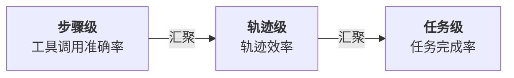
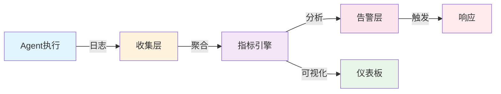
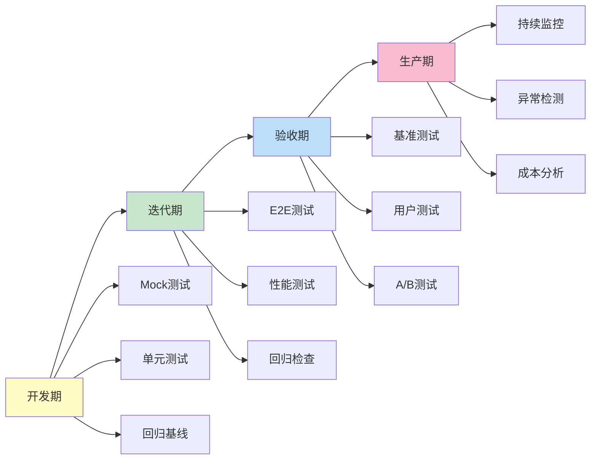
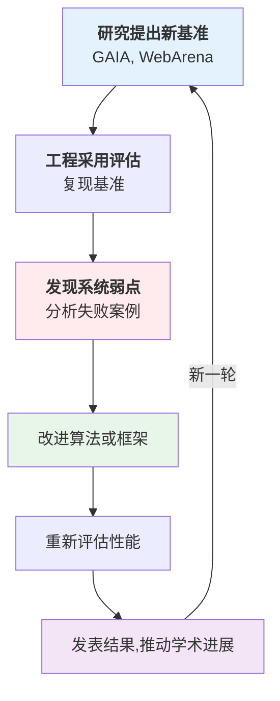

# 第十三章：评估与质量保障

安全防护是必要但不充分的。要让智能体系统进入生产环境，还需要 **可量化的质量保障**。即使工具调用没有被护栏阻止，也可能因为工具选择错误、参数错误、轨迹规划不当而任务失败。

本章介绍如何系统地评估智能体系统的质量。评估的目标是 **在多个维度上定量描述系统性能**：

* 步骤级：单个工具调用是否正确
* 轨迹级：工具调用序列是否高效
* 任务级：最终是否完成用户目标

**核心主题**

1. **评估方法论**：设计科学的评估框架，区分步骤评估和结果评估
2. **端到端测试**：如何在真实场景中测试智能体系统
3. **基准测试**：接轨学术基准(GAIA、WebArena、SWE-Bench)
4. **持续评估**：生产环境中的质量监控
5. **实战测试**：为 MiniHarness 建立完整测试套件

**行业现状**

根据 LangChain 2026 年 State of Agent Engineering 调查，57.3% 的受访者已在生产环境运行智能体，约 89% 已实施可观测性，但离线评估采用率约为 52.4%。NIST 于 2026 年 2 月 17 日宣布 AI Agent Standards Initiative，标志着智能体互操作、安全和身份标准化进入更正式阶段。

## 1. Harness 评估方法论

> **行业现状**
>
> LangChain《State of Agent Engineering》调研数据（1300+从业者）：
>
> * **52.4%** 的组织在测试集上运行离线评估
> * **37.3%** 实施在线评估(online evaluations)
> * **22.8%** 的生产阶段组织根本不做评估
> * **关键落差**：可观测性采用率 89% vs 评估采用率 52%
>
> 这说明许多团队已经能“看到”智能体在做什么，但从可观测性到质量判断仍存在采用率落差。

### 1.1 评估的三个层级

智能体系统的质量评估需要在三个层级进行，从细到粗：



图 13-1：智能体三层评估架构

#### 层级 1：步骤级评估

**定义**：评估单个工具调用是否正确。

**关键问题**：

* 工具选择是否正确？（调用了合适的工具吗？）
* 参数是否正确？（参数值是否符合预期？）
* 工具执行是否成功？（有无错误？）

**评估指标**：

| 指标    | 定义         | 计算                               |
| ----- | ---------- | -------------------------------- |
| 工具准确率 | 选择正确工具的比例  | correct\_tools / total\_calls    |
| 参数准确率 | 参数正确的比例    | correct\_params / total\_params  |
| 执行成功率 | 工具调用不出错的比例 | successful\_calls / total\_calls |

**计算示例**：

```python
from typing import List

def evaluate_step_level(trajectory: List["ToolCall"],
                       ground_truth: List["ToolCall"]) -> dict:
    """步骤级评估"""

    correct_tools = 0
    correct_calls = 0
    successful = 0
    total = len(trajectory)

    for i, predicted_call in enumerate(trajectory):
        # 工具是否正确
        if predicted_call.tool_name == ground_truth[i].tool_name:
            correct_tools += 1

        # 调用是否完全正确(工具+参数)
        if (predicted_call.tool_name == ground_truth[i].tool_name and
            predicted_call.args == ground_truth[i].args):
            correct_calls += 1

        # 执行是否成功
        if predicted_call.success:
            successful += 1

    return {
        "tool_accuracy": correct_tools / total,
        "call_accuracy": correct_calls / total,
        "execution_success_rate": successful / total,
    }
```

#### 层级 2：轨迹级评估

**定义**：评估工具调用序列的效率和正确性。

**关键问题**：

* 是否走了弯路？（多余的调用？）
* 调用顺序是否高效？（能否更快完成？）
* 是否自我纠正？（遇到错误如何反应？）

**评估指标**：

| 指标     | 定义             | 计算                                    |
| ------ | -------------- | ------------------------------------- |
| 轨迹长度效率 | 实际调用数 vs 最优调用数 | optimal\_steps / actual\_steps        |
| 错误恢复率  | 遇到工具错误后成功恢复的比例 | recovered\_errors / total\_errors     |
| 重复调用率  | 相同工具连续调用的次数    | duplicate\_calls / total\_calls       |
| 平均调用深度 | 完成任务所需的平均步骤数   | sum(trajectory\_lengths) / num\_tasks |

**计算示例**：

```python
from typing import List

def evaluate_trajectory_level(trajectory: List["ToolCall"],
                              optimal_trajectory: List["ToolCall"]) -> dict:
    """轨迹级评估"""

    actual_length = len(trajectory)
    optimal_length = len(optimal_trajectory)

    # 调用效率
    efficiency = optimal_length / actual_length if actual_length > 0 else 0

    # 错误恢复
    errors = sum(1 for call in trajectory if not call.success)
    recovered = sum(1 for i, call in enumerate(trajectory)
                   if not call.success and i+1 < len(trajectory) and trajectory[i+1].success)
    recovery_rate = recovered / errors if errors > 0 else 0

    # 重复调用
    duplicates = sum(1 for i in range(len(trajectory)-1)
                    if trajectory[i].tool_name == trajectory[i+1].tool_name)
    duplicate_rate = duplicates / actual_length if actual_length > 0 else 0

    return {
        "efficiency": efficiency,
        "error_recovery_rate": recovery_rate,
        "duplicate_rate": duplicate_rate,
        "trajectory_length": actual_length,
        "optimal_length": optimal_length,
    }
```

#### 层级 3：任务级评估

**定义**：评估是否完成了用户的最终目标。

**关键问题**：

* 最终答案是否正确？
* 完成任务的成功率是否足够高？
* 花费的资源（token、时间、成本）是否可接受？

**评估指标**：

| 指标       | 定义              | 范围      |
| -------- | --------------- | ------- |
| 任务成功率    | 完成任务的比例         | 0-100%  |
| 执行时间     | 完成任务的平均时间       | 秒       |
| Token 效率 | 平均每个任务消耗的 Token | Token 数 |
| 成本效率     | 平均每个任务的 API 成本  | 美元      |
| 用户满意度    | 用户对结果的满意评分      | 1-5 分   |

**计算示例**：

```python
from datetime import datetime
from typing import List

def evaluate_task_level(results: List["TaskResult"]) -> dict:
    """任务级评估"""

    successful = sum(1 for r in results if r.success)
    total = len(results)

    # 任务成功率
    success_rate = successful / total

    # 执行时间
    execution_times = [r.end_time - r.start_time for r in results]
    avg_time = sum(execution_times) / len(execution_times)

    # Token效率
    tokens = [r.tokens_used for r in results]
    avg_tokens = sum(tokens) / len(tokens)

    # 成本效率(假设0.001美元/1000Token)
    costs = [t * 0.001 / 1000 for t in tokens]
    total_cost = sum(costs)
    avg_cost = total_cost / len(results)

    return {
        "success_rate": success_rate,
        "avg_execution_time_sec": avg_time.total_seconds(),
        "avg_tokens_per_task": avg_tokens,
        "total_cost_usd": total_cost,
        "avg_cost_per_task": avg_cost,
    }
```

### 1.2 评估指标体系

综合三个层级，构建完整的评估指标体系：

```python
from dataclasses import dataclass

@dataclass
class EvaluationMetrics:
    """完整的评估指标集"""

    # ======== 步骤级 ========
    tool_accuracy: float              # 工具选择准确率
    parameter_accuracy: float         # 参数准确率
    execution_success_rate: float     # 执行成功率

    # ======== 轨迹级 ========
    trajectory_efficiency: float      # 轨迹效率(最优/实际)
    error_recovery_rate: float        # 错误恢复率
    duplicate_rate: float             # 重复调用率

    # ======== 任务级 ========
    task_success_rate: float          # 任务成功率
    avg_execution_time: float         # 平均执行时间(秒)
    avg_tokens_per_task: float        # 平均Token消耗
    avg_cost_per_task: float          # 平均成本(美元)

    # ======== 综合指标 ========
    overall_quality_score: float      # 综合质量评分(0-100)

    def compute_overall_score(self) -> float:
        """
        计算综合质量评分

        权重配置：
        - 任务成功率：40%(最关键)
        - 轨迹效率：30%(关键)
        - 步骤准确率：20%(基础)
        - 成本效率：10%(现实考虑)
        """
        score = (
            self.task_success_rate * 0.4 * 100 +
            self.trajectory_efficiency * 0.3 * 100 +
            ((self.tool_accuracy + self.parameter_accuracy) / 2) * 0.2 * 100 +
            max(0, (1 - self.avg_cost_per_task / 0.1)) * 0.1 * 100  # 假设0.1美元为基准
        )
        return min(100, max(0, score))
```

### 1.3 评估框架架构

评估框架的核心架构实现：

```python
from abc import ABC, abstractmethod
from typing import Any, Dict, List
import logging

logger = logging.getLogger(__name__)

class Evaluator(ABC):
    """评估器基类"""

    @abstractmethod
    def evaluate(self, prediction: Any, ground_truth: Any) -> Dict[str, float]:
        """评估单个样本"""
        pass

    @abstractmethod
    def aggregate(self, results: List[Dict[str, float]]) -> EvaluationMetrics:
        """聚合多个样本的评估结果"""
        pass

class StepLevelEvaluator(Evaluator):
    """步骤级评估器"""

    def evaluate(self, predicted_call: ToolCall, ground_truth_call: ToolCall) -> Dict[str, float]:
        """评估单个工具调用"""
        tool_correct = predicted_call.tool_name == ground_truth_call.tool_name
        params_correct = predicted_call.args == ground_truth_call.args
        success = predicted_call.success

        return {
            "tool_correct": 1.0 if tool_correct else 0.0,
            "params_correct": 1.0 if params_correct else 0.0,
            "execution_success": 1.0 if success else 0.0,
        }

    def aggregate(self, results: List[Dict[str, float]]) -> Dict[str, float]:
        """聚合结果"""
        if not results:
            return {"tool_accuracy": 0, "param_accuracy": 0, "success_rate": 0}

        tool_sum = sum(r["tool_correct"] for r in results)
        param_sum = sum(r["params_correct"] for r in results)
        success_sum = sum(r["execution_success"] for r in results)
        total = len(results)

        return {
            "tool_accuracy": tool_sum / total,
            "param_accuracy": param_sum / total,
            "success_rate": success_sum / total,
        }

class TrajectoryLevelEvaluator(Evaluator):
    """轨迹级评估器"""

    def evaluate(self, trajectory: List[ToolCall],
                optimal_trajectory: List[ToolCall]) -> Dict[str, float]:
        """评估工具调用序列"""

        actual_len = len(trajectory)
        optimal_len = len(optimal_trajectory)
        efficiency = optimal_len / actual_len if actual_len > 0 else 0

        errors = sum(1 for call in trajectory if not call.success)
        if errors > 0:
            recovery = sum(1 for i in range(len(trajectory)-1)
                         if not trajectory[i].success and trajectory[i+1].success)
            recovery_rate = recovery / errors
        else:
            recovery_rate = 0

        duplicates = sum(1 for i in range(len(trajectory)-1)
                        if trajectory[i].tool_name == trajectory[i+1].tool_name)
        duplicate_rate = duplicates / actual_len if actual_len > 0 else 0

        return {
            "efficiency": efficiency,
            "recovery_rate": recovery_rate,
            "duplicate_rate": duplicate_rate,
        }

    def aggregate(self, results: List[Dict[str, float]]) -> Dict[str, float]:
        """聚合结果"""
        if not results:
            return {"avg_efficiency": 0, "avg_recovery_rate": 0, "avg_duplicate_rate": 0}

        avg_efficiency = sum(r["efficiency"] for r in results) / len(results)
        avg_recovery = sum(r["recovery_rate"] for r in results) / len(results)
        avg_duplicate = sum(r["duplicate_rate"] for r in results) / len(results)

        return {
            "avg_efficiency": avg_efficiency,
            "avg_recovery_rate": avg_recovery,
            "avg_duplicate_rate": avg_duplicate,
        }

class TaskLevelEvaluator(Evaluator):
    """任务级评估器"""

    def evaluate(self, result: TaskResult) -> Dict[str, float]:
        """评估单个任务"""
        success = 1.0 if result.success else 0.0
        time_seconds = (result.end_time - result.start_time).total_seconds()
        cost = result.tokens_used * 0.001 / 1000

        return {
            "success": success,
            "time_seconds": time_seconds,
            "tokens": float(result.tokens_used),
            "cost": cost,
        }

    def aggregate(self, results: List[Dict[str, float]]) -> Dict[str, float]:
        """聚合结果"""
        if not results:
            return {"success_rate": 0, "avg_time": 0, "avg_tokens": 0, "avg_cost": 0}

        success_sum = sum(r["success"] for r in results)
        success_rate = success_sum / len(results)

        avg_time = sum(r["time_seconds"] for r in results) / len(results)
        avg_tokens = sum(r["tokens"] for r in results) / len(results)
        avg_cost = sum(r["cost"] for r in results) / len(results)

        return {
            "success_rate": success_rate,
            "avg_time_seconds": avg_time,
            "avg_tokens": avg_tokens,
            "avg_cost_usd": avg_cost,
        }
```

### 1.4 技能训练评估闭环

前面的三层评估不仅能用于比较模型或 Harness 版本，也能用于优化 Skill 这类过程性知识资产。SkillOpt 一类方法的关键启发是：不要把 Skill 当作一次性手写说明，而要把它当作冻结智能体外部的一份可训练配置；模型、工具和 Harness 保持不变，真正被迭代的是指导证据收集、工具使用、验证和输出格式的 Skill 文档。

工程上可以把这个过程落成一个受控闭环：

1. **Rollout 采样**：让目标智能体在训练任务上执行当前 Skill，记录消息、工具调用、验证反馈、任务元数据和最终得分。
2. **成功/失败分组**：分别分析高分轨迹和失败轨迹，从中提取可复用过程规则，而不是只总结某个样例答案。
3. **受控文本编辑**：只允许对 Skill 做小范围的新增、删除或替换，并设置文本级学习率，避免一次大改覆盖原本有效的规则。
4. **验证集门控**：候选 Skill 只有在 held-out 任务上严格优于当前版本时才被接受；否则进入拒绝编辑缓冲区，作为下一轮优化的负反馈。
5. **产物导出**：部署时只加载最终 Skill 文件，不加载优化器、训练轨迹或历史缓冲区，从而不增加推理时调用次数。

这个闭环把“反思后自动改提示词”升级为“有验证门禁的配置训练”。它对 Harness 评估体系提出了三个额外要求：

| 要求      | 工程含义                                   |
| ------- | -------------------------------------- |
| 固定目标环境  | 比较 Skill 版本时，模型、工具、权限和任务集要保持一致         |
| 区分训练与选择 | 训练 rollout 的分数不能直接作为上线依据，必须保留未参与编辑的选择集 |
| 保留拒绝记录  | 被验证集拒绝的编辑是重要信号，可防止优化器反复提出破坏性改动         |

这类方法适合高重复、流程稳定、可自动评分的任务，如表格处理、搜索问答、文档理解和长时工具任务。对于低频、目标模糊或无法自动判分的任务，应优先采用人工审阅和小样本回归集，而不是让 Skill 自动演化；软件工程任务也可能受益，但需要单独设计可复现评分与回归验证。

### 1.5 评估结果可视化

把上面这套指标画成一页报告图，是让评估结果进入周会与版本决策的最省事方式。布局直接沿用三个层级：步骤级放工具与参数准确率，轨迹级放效率，任务级放成功率，再补上错误恢复率、平均耗时与综合评分——**六个面板恰好覆盖 13.1.1 与 13.1.2 定义的全部口径**，看图的人不必再回头翻指标定义。

具体的绘图实现属于工程细节，放在了仓库的 [tools/eval\_report.py](https://github.com/yeasy/harness_engineering_guide/blob/main/tools/eval_report.py)：它自带与 13.1.2 一致的 `EvaluationMetrics` 定义，可直接运行看示例，也可以 import 其中的 `visualize_evaluation()` 传入自己流水线算出的指标。

读这张图时有一处要当心：六个面板里只有综合评分是加权合成的，其余五个是各自独立的口径，**不要横向比高低**——工具准确率 0.92 与轨迹效率 0.74 不构成「前者更好」，它们量纲不同。真正该盯的是同一格在版本之间的变化。


**本节总结**：Harness 系统的质量评估需要从步骤、轨迹、任务三个层级进行，每层都有特定的指标和计算方法。综合评分权衡了任务成功、效率、准确性和成本；当评估对象是 Skill 时，还要加入训练集与验证集分离、受控编辑和拒绝记录等门控机制。

## 2. 端到端测试策略

本节讨论端到端测试的多种策略，包括 Mock 测试与真实测试的权衡、测试夹具设计、回归基线管理以及完整的 E2E 测试套件构建。

### 2.1 测试分类

端到端(E2E)测试涉及多种不同的测试策略，需要根据目的选择：

| 维度     | 分类                   |
| ------ | -------------------- |
| 模型调用方式 | Mock LLM vs 真实 LLM   |
| 工具调用方式 | Mock Tools vs 真实工具   |
| 数据来源   | 合成数据 vs 真实数据 vs 众包数据 |
| 运行环境   | 离线 vs 实时在线           |
| 评估方式   | 自动化评估 vs 人工评估        |

### 2.2 Mock 测试 vs 真实测试

#### 2.2.1 Mock 测试

Mock 测试的实现代码示例：

```python
from unittest.mock import Mock, patch, MagicMock
import asyncio

class MockLLMResponse:
    """模拟LLM响应"""
    def __init__(self, tool_calls: list):
        self.tool_calls = tool_calls

class E2ETestWithMocks:
    """使用Mock的端到端测试"""

    def setup_mock_llm(self):
        """设置Mock LLM"""
        self.mock_llm = Mock()

        # 预设第一步响应：读取文件
        self.mock_llm.generate.side_effect = [
            MockLLMResponse([
                {"tool_name": "read_file", "args": {"path": "data.txt"}}
            ]),
            MockLLMResponse([
                {"tool_name": "analyze_text", "args": {"text": "file content"}}
            ]),
            MockLLMResponse([
                {"tool_name": "write_file", "args": {"path": "result.txt", "content": "analysis"}}
            ])
        ]

    def setup_mock_tools(self):
        """设置Mock工具"""
        self.mock_tools = {
            "read_file": Mock(return_value="file content"),
            "analyze_text": Mock(return_value="analysis result"),
            "write_file": Mock(return_value=True),
        }

    async def test_file_analysis_workflow(self):
        """测试文件分析工作流"""

        self.setup_mock_llm()
        self.setup_mock_tools()

        # 创建Agent(使用Mock)
        agent = Agent(
            llm=self.mock_llm,
            tools=self.mock_tools
        )

        # 运行任务
        result = await agent.run("分析data.txt文件并保存结果到result.txt")

        # 验证
        assert result.success == True
        assert self.mock_tools["read_file"].called
        assert self.mock_tools["analyze_text"].called
        assert self.mock_tools["write_file"].called

        # 验证调用顺序
        calls = self.mock_llm.generate.call_args_list
        assert len(calls) == 3  # 三步调用
```

**Mock 测试的优点**：

* 快速(<100ms)
* 确定性（相同输入→相同输出）
* 易于隔离问题

**缺点**：

* 无法测试 LLM 实际行为
* Mock 可能不够真实
* 无法测试新的工具组合

### 真实测试

使用真实 LLM 的测试实现代码：

```python
import os
from anthropic import Anthropic

class E2ETestWithRealLLM:
    """使用真实LLM的端到端测试"""

    def __init__(self):
        self.client = Anthropic(api_key=os.environ.get("ANTHROPIC_API_KEY"))
        self.test_data_dir = "/tmp/e2e_test_data"
        os.makedirs(self.test_data_dir, exist_ok=True)

    async def test_real_file_analysis(self):
        """使用真实LLM的测试"""

        # 准备测试数据
        test_file = os.path.join(self.test_data_dir, "sample.txt")
        with open(test_file, "w") as f:
            f.write("This is a sample document for testing.\nIt contains multiple lines.")

        # 定义真实工具
        tools = [
            {
                "name": "read_file",
                "description": "读取文件内容",
                "input_schema": {
                    "type": "object",
                    "properties": {
                        "path": {"type": "string", "description": "文件路径"}
                    },
                    "required": ["path"]
                }
            },
            {
                "name": "write_file",
                "description": "写入文件",
                "input_schema": {
                    "type": "object",
                    "properties": {
                        "path": {"type": "string"},
                        "content": {"type": "string"}
                    },
                    "required": ["path", "content"]
                }
            }
        ]

        # 系统消息
        system_prompt = """你是一个文件分析助手。
        可用工具：read_file(读取文件)、write_file(写入文件)
        任务：读取文件并分析其内容,然后将分析结果写入输出文件。
        """

        # 初始消息
        messages = [
            {"role": "user", "content": f"请分析{test_file}的内容,并将结果写入 {os.path.join(self.test_data_dir, 'result.txt')}"}
        ]

        # 迭代交互
        max_iterations = 5
        iteration = 0
        tool_calls_made = []

        while iteration < max_iterations:
            iteration += 1

            # 调用真实LLM
            response = self.client.messages.create(
                model="claude-sonnet-4-6",
                max_tokens=1024,
                system=system_prompt,
                tools=tools,
                messages=messages
            )

            # 检查是否需要工具调用
            if response.stop_reason == "tool_use":
                tool_use_block = next(
                    (block for block in response.content if block.type == "tool_use"),
                    None
                )

                if tool_use_block:
                    tool_name = tool_use_block.name
                    tool_input = tool_use_block.input

                    tool_calls_made.append({
                        "tool": tool_name,
                        "input": tool_input
                    })

                    # 执行真实工具
                    if tool_name == "read_file":
                        with open(tool_input["path"], "r") as f:
                            tool_result = f.read()
                    elif tool_name == "write_file":
                        with open(tool_input["path"], "w") as f:
                            f.write(tool_input["content"])
                        tool_result = "文件已写入"
                    else:
                        tool_result = "未知工具"

                    # 继续对话
                    messages.append({"role": "assistant", "content": response.content})
                    messages.append({
                        "role": "user",
                        "content": [
                            {
                                "type": "tool_result",
                                "tool_use_id": tool_use_block.id,
                                "content": tool_result
                            }
                        ]
                    })
            else:
                # LLM完成
                break

        # 验证结果
        result_file = os.path.join(self.test_data_dir, "result.txt")
        assert os.path.exists(result_file), "结果文件未创建"

        with open(result_file, "r") as f:
            result_content = f.read()

        assert len(result_content) > 0, "结果文件为空"
        assert len(tool_calls_made) >= 2, f"工具调用不足,只有{len(tool_calls_made)}次"

        return {
            "success": True,
            "tool_calls": len(tool_calls_made),
            "iterations": iteration,
            "result": result_content
        }
```

**真实测试的优点**：

* 真实性强
* 能发现 Mock 无法发现的问题
* 能评估 LLM 在新任务上的表现

**缺点**：

* 慢（每个测试 5-30 秒）
* API 费用（真实调用）
* 不确定性（LLM 输出变化）

## 13.2.3 测试夹具设计

测试夹具(Test Fixtures)是测试的基础设施，包括测试数据、环境配置等。

```python
import pytest
import tempfile
import json
from pathlib import Path

class TestFixture:
    """测试夹具基类"""

    @pytest.fixture(scope="session")
    def test_data_dir(self):
        """创建临时测试数据目录"""
        with tempfile.TemporaryDirectory() as tmpdir:
            yield tmpdir

    @pytest.fixture
    def sample_files(self, test_data_dir):
        """创建示例文件"""
        files = {}

        # 创建文本文件
        text_file = Path(test_data_dir) / "sample.txt"
        text_file.write_text("Sample text content for testing")
        files["text"] = str(text_file)

        # 创建JSON文件
        json_file = Path(test_data_dir) / "data.json"
        json_file.write_text(json.dumps({"key": "value", "number": 42}))
        files["json"] = str(json_file)

        # 创建CSV文件
        csv_file = Path(test_data_dir) / "data.csv"
        csv_file.write_text("name,age,city\nAlice,30,NYC\nBob,25,LA")
        files["csv"] = str(csv_file)

        return files

    @pytest.fixture
    def mock_tools(self):
        """Mock工具集合"""
        from unittest.mock import Mock

        return {
            "read_file": Mock(return_value="mocked file content"),
            "analyze_text": Mock(return_value="analysis result"),
            "list_files": Mock(return_value=["file1.txt", "file2.txt"]),
        }

    @pytest.fixture
    def agent_config(self):
        """Agent配置"""
        return {
            "model": "claude-sonnet-4-6",
            "max_iterations": 10,
            "timeout": 30,
            "tools_enabled": ["read_file", "analyze_text", "write_file"]
        }
```

### 2.4 回归测试基线

当系统演进时，需要维护一个基线来检测性能退化。

```python
class RegressionTestBaseline:
    """回归测试基线管理"""

    def __init__(self, baseline_file: str = "test_baseline.json"):
        self.baseline_file = baseline_file
        self.baseline = self._load_baseline()

    def _load_baseline(self) -> dict:
        """加载基线"""
        try:
            with open(self.baseline_file, "r") as f:
                return json.load(f)
        except FileNotFoundError:
            return {}

    def save_baseline(self, metrics: dict):
        """保存新基线"""
        with open(self.baseline_file, "w") as f:
            json.dump(metrics, f, indent=2)
        print(f"基线已保存: {self.baseline_file}")

    def check_regression(self, current_metrics: dict, threshold: float = 0.05) -> list:
        """
        检查回归

        Args:
            current_metrics: 当前指标
            threshold: 允许的降低幅度(5%)

        Returns:
            回归列表：[(指标名, 基线值, 当前值, 降低%)]
        """
        regressions = []

        for metric_name, baseline_value in self.baseline.items():
            if metric_name not in current_metrics:
                continue

            current_value = current_metrics[metric_name]

            # 对于"越高越好"的指标(accuracy, success_rate等)
            if "accuracy" in metric_name or "success" in metric_name or "rate" in metric_name:
                if current_value < baseline_value * (1 - threshold):
                    degradation = (baseline_value - current_value) / baseline_value
                    regressions.append((
                        metric_name,
                        baseline_value,
                        current_value,
                        degradation * 100
                    ))

            # 对于"越低越好"的指标(latency, cost等)
            elif "time" in metric_name or "cost" in metric_name or "latency" in metric_name:
                if current_value > baseline_value * (1 + threshold):
                    degradation = (current_value - baseline_value) / baseline_value
                    regressions.append((
                        metric_name,
                        baseline_value,
                        current_value,
                        degradation * 100
                    ))

        return regressions

# 使用示例
baseline_mgr = RegressionTestBaseline()

# 首次运行：保存基线
baseline_mgr.save_baseline({
    "success_rate": 0.95,
    "avg_tokens": 250,
    "avg_time_sec": 5.2
})

# 后续运行：检查回归
current = {
    "success_rate": 0.92,  # 降低了
    "avg_tokens": 280,     # 增加了
    "avg_time_sec": 4.8    # 降低了(好的)
}

regressions = baseline_mgr.check_regression(current)
if regressions:
    print("⚠ 检测到性能退化：")
    for metric, baseline, current, degradation in regressions:
        print(f"  {metric}: {baseline} → {current} (降低{degradation:.1f}%)")
```

### 2.5 完整的 E2E 测试套件

代码如下：

```python
# tests/test_e2e.py
import pytest
import asyncio
from pathlib import Path

class TestE2EWorkflows:
    """端到端工作流测试"""

    @pytest.mark.asyncio
    async def test_simple_file_read(self, sample_files, mock_tools):
        """简单的文件读取"""
        # 这个应该成功
        pass

    @pytest.mark.asyncio
    async def test_multi_step_workflow(self, sample_files, mock_tools):
        """多步工作流"""
        # 读取 → 分析 → 写入
        pass

    @pytest.mark.asyncio
    async def test_error_recovery(self, sample_files, mock_tools):
        """错误恢复测试"""
        # 工具调用失败后是否能恢复
        pass

    @pytest.mark.asyncio
    async def test_edge_cases(self, sample_files):
        """边界情况"""
        # 空文件、大文件、特殊字符等
        pass

    def test_token_efficiency(self):
        """Token效率测试"""
        # 平均调用数、Token使用
        pass

    def test_performance_baseline(self):
        """性能基线测试"""
        # 与基线对比
        pass
```

***

**本节总结**：E2E 测试需要结合 Mock 测试（快速反馈）和真实测试（真实验证），使用明确的测试夹具和回归测试基线来确保质量。

## 3. 基准测试

本节介绍学术基准的选择与应用、在自有系统上的复现方法、基准评估报告的生成以及 NIST 标准化倡议的最新进展。

### 3.1 学术基准概览

智能体系统的评估需要接轨学术研究，建立可对标的基准。主要基准包括：

#### 3.3.1 GAIA

**来源**：Meta-FAIR, Meta-GenAI & Hugging Face(2023)

**特点**：

* 三个难度等级(Level 1-3)
* 强调推理和工具使用的综合能力
* 人类表现远超当前最强模型

**数据分布**：

```
Level 1: 基础任务(简单推理+单工具)
Level 2: 中等任务(多步推理+多工具协作)
Level 3: 困难任务(长链推理+复杂工具组合)
总计: 466个任务
```

**任务类型**：

* 文件系统操作（解压、搜索、分析）
* 网页浏览与信息提取
* 数学计算与推理
* 多步骤问题解决

#### 3.3.2 WebArena

**来源**：CMU（2023，发表于 ICLR 2024）

**特点**：

* 812 个现实网站任务
* 涵盖电商、社交论坛、协作软件开发、内容管理四大官方领域
* 需要真实交互（不是模拟）

**任务分类**（四大官方领域，合计 812 个任务）：

```yaml
电商(OneStopShop):     购物、订单、评价类任务
社交论坛(Reddit 风格):  发帖、搜索、互动类任务
协作开发(GitLab):      仓库、Issue、合并请求类任务
内容管理(CMS):         店铺运营、内容维护类任务
```

#### 3.3.3 SWE-Bench

**来源**：Princeton University（发表于 ICLR 2024；OpenAI 后续合作推出 SWE-bench Verified）

**SWE-bench Verified**：由 OpenAI Preparedness 团队于 2024 年 8 月发布，包含 500 个经过人工验证的高质量 issue-PR 对，从 SWE-Bench 原始 2294 个任务中精选。筛选标准是问题描述足够明确（非欠规格）、且 FAIL\_TO\_PASS 单元测试不会误判正确的修复，每个样本由三位标注者独立审查，是评估 Agent 代码理解和修改能力的重要基准。

**特点**：

* 原始 SWE-Bench：2,294 个真实 GitHub 问题
* Verified 版本：500 个经人工验证的高质量子集
* 需要修改代码、运行测试
* 评估代码理解与修改能力

**评估维度**：

* 是否通过 FAIL\_TO\_PASS 测试（问题确实被修复）
* 是否保持 PASS\_TO\_PASS 测试通过（未引入回归）

#### 3.3.4 AgentBench

**来源**：Tsinghua University（发表于 ICLR 2024）

**特点**：

* 8 个官方环境（操作系统、数据库、知识图谱、数字卡牌、横向思维谜题、家务模拟、网购、网页浏览）
* 模拟真实工作场景

**领域分布**（下表为便于讲解的示意分布及任务量级，非 AgentBench 官方任务划分）：

```yaml
知识库操作:   200 任务
数据库操作:   300 任务
Web浏览:      350 任务
文件操作:     200 任务
API调用:      200 任务
邮件管理:     100 任务
日程安排:     97 任务
```

### 3.2 在自有系统上复现基准

以上四大基准（GAIA、WebArena、SWE-Bench、AgentBench）提供了多维度的评测标准，但如何在自己的系统上高效地复现这些基准、收集性能指标是后续工作的关键。本节介绍了基准复现的具体方法和工具支持。

#### 3.2.1 构建 GAIA 的子集

GAIA 基准的实现代码：

```python
import json
import random
from pathlib import Path

class GAIABenchmark:
    """GAIA基准实现"""

    def __init__(self, data_dir: str = "./data/gaia"):
        self.data_dir = Path(data_dir)
        self.tasks = self._load_tasks()

    def _load_tasks(self) -> dict:
        """加载GAIA任务"""
        tasks = {"level1": [], "level2": [], "level3": []}

        for level in ["level1", "level2", "level3"]:
            level_dir = self.data_dir / level
            if level_dir.exists():
                for task_file in level_dir.glob("*.json"):
                    with open(task_file) as f:
                        task = json.load(f)
                        tasks[level].append(task)

        return tasks

    def get_sample(self, level: str, size: int = 10) -> list:
        """获取该等级的样本"""
        tasks = self.tasks.get(level, [])
        return random.sample(tasks, min(size, len(tasks)))

    async def run_evaluation(self, agent, level: str, size: int = 10):
        """在该等级上运行评估"""
        tasks = self.get_sample(level, size)
        if not tasks:
            return {
                "level": level,
                "success_rate": 0.0,
                "total": 0,
                "results": [],
                "warning": f"No GAIA tasks found for {level} in {self.data_dir}",
            }
        results = []

        for task in tasks:
            try:
                # 执行任务
                result = await agent.execute(
                    instruction=task["instruction"],
                    ground_truth=task.get("ground_truth")
                )

                # 评估
                is_correct = self._evaluate_task(result, task)
                results.append({
                    "task_id": task["id"],
                    "correct": is_correct,
                    "result": result
                })
            except Exception as e:
                results.append({
                    "task_id": task["id"],
                    "correct": False,
                    "error": str(e)
                })

        # 计算成功率
        success_rate = sum(1 for r in results if r["correct"]) / len(results)
        return {
            "level": level,
            "success_rate": success_rate,
            "total": len(results),
            "results": results
        }

    def _evaluate_task(self, result, task) -> bool:
        """评估任务是否正确"""
        # 简化:字符串匹配
        ground_truth = task.get("ground_truth", "")
        return ground_truth.lower() in str(result).lower()

# GAIA基准评估使用示例
benchmark = GAIABenchmark()

# 在Level 1上测试
level1_results = asyncio.run(benchmark.run_evaluation(agent, "level1", size=10))
print(f"Level 1 Success Rate: {level1_results['success_rate']:.1%}")
```

#### 3.2.2 WebArena 风格子集评估

下面是一个 WebArena 风格的 toy adapter，用于展示评估接口。官方 WebArena 是自托管环境，覆盖在线购物、论坛、协作开发和企业内容管理等站点；真实评测应对齐官方任务和环境，而不是直接使用下列示意域名。

```python
class WebArenaBenchmark:
    """WebArena基准实现"""

    def __init__(self, domain: str = "ecommerce"):
        """
        domain: 'ecommerce', 'social_media', 'forum', 'government'
        """
        self.domain = domain
        self.tasks = self._get_sample_tasks()

    def _get_sample_tasks(self) -> list:
        """获取示例任务"""
        tasks = {
            "ecommerce": [
                {
                    "id": "shop_001",
                    "instruction": "在Amazon上搜索'笔记本电脑',按价格从低到高排序",
                    "expected_steps": ["navigate", "search", "sort"],
                    "ground_truth": "sorted by price ascending"
                },
                {
                    "id": "shop_002",
                    "instruction": "添加商品到购物车并查看总价",
                    "expected_steps": ["add_to_cart", "view_cart"],
                    "ground_truth": "total price displayed"
                }
            ],
            "social_media": [
                {
                    "id": "social_001",
                    "instruction": "在Twitter上发布一条包含#AgentBench标签的推文",
                    "expected_steps": ["navigate", "compose", "post"],
                    "ground_truth": "tweet posted"
                }
            ]
        }
        return tasks.get(self.domain, [])

    async def run_evaluation(self, agent, size: int = 5):
        """运行评估"""
        tasks = self.tasks[:size]
        results = []

        for task in tasks:
            try:
                # 模拟网页交互
                trajectory = await agent.interact_with_web(
                    instruction=task["instruction"]
                )

                # 检查是否完成了预期步骤
                completed_steps = [step for step in task["expected_steps"]
                                 if step in [call.tool_name for call in trajectory]]

                success = len(completed_steps) == len(task["expected_steps"])

                results.append({
                    "task_id": task["id"],
                    "success": success,
                    "steps_completed": len(completed_steps),
                    "steps_expected": len(task["expected_steps"])
                })
            except Exception as e:
                results.append({
                    "task_id": task["id"],
                    "success": False,
                    "error": str(e)
                })

        success_rate = sum(1 for r in results if r["success"]) / len(results)
        return {
            "domain": self.domain,
            "success_rate": success_rate,
            "total": len(results),
            "results": results
        }
```

### 3.3 基准评估报告生成

基准报告不应只给出一个分数。对于第三方或可对外引用的评测，报告还应说明：本次评测主张属于能力激发、安全防护还是模型比较；被测系统的 harness、工具、上下文、护栏、turn/token/retry/time/cost 预算是什么；是否做过 reward hacking、拒答掩盖、样本污染、坏题和 sandbagging 检查；人工复核样本如何影响最终判定。否则读者无法判断分数是模型能力上限、某个 harness 下的当前表现，还是评测设置本身的产物。

实现如下：

```python
import json
from datetime import datetime
import pandas as pd

class BenchmarkReport:
    """基准评估报告"""

    def __init__(self, agent_name: str):
        self.agent_name = agent_name
        self.results = []
        self.timestamp = datetime.now().isoformat()

    def add_result(self, benchmark_name: str, metrics: dict):
        """添加评估结果"""
        self.results.append({
            "benchmark": benchmark_name,
            "metrics": metrics,
            "timestamp": datetime.now().isoformat()
        })

    def generate_report(self, output_file: str = "benchmark_report.json"):
        """生成报告"""
        report = {
            "agent_name": self.agent_name,
            "generated_at": self.timestamp,
            "benchmarks": self.results,
            "summary": self._compute_summary()
        }

        with open(output_file, "w") as f:
            json.dump(report, f, indent=2)

        return report

    def _compute_summary(self) -> dict:
        """计算汇总统计"""
        success_rates = [r["metrics"].get("success_rate", 0) for r in self.results]

        return {
            "avg_success_rate": sum(success_rates) / len(success_rates) if success_rates else 0,
            "best_benchmark": max(self.results, key=lambda x: x["metrics"].get("success_rate", 0))
                             ["benchmark"] if self.results else None,
            "benchmarks_count": len(self.results)
        }

    def to_dataframe(self) -> pd.DataFrame:
        """转为DataFrame用于分析"""
        data = []
        for result in self.results:
            row = {"benchmark": result["benchmark"]}
            row.update(result["metrics"])
            data.append(row)
        return pd.DataFrame(data)

    def print_summary(self):
        """打印汇总"""
        summary = self._compute_summary()
        print(f"\n{'='*60}")
        print(f"Agent: {self.agent_name}")
        print(f"Generated: {self.timestamp}")
        print(f"{'='*60}")
        print(f"\nBenchmark Results:")
        print(f"{'Benchmark':<20} {'Success Rate':<15}")
        print(f"{'-'*35}")

        for result in self.results:
            benchmark = result["benchmark"]
            sr = result["metrics"].get("success_rate", 0)
            print(f"{benchmark:<20} {sr:>6.1%}")

        print(f"\n{'='*60}")
        print(f"Average Success Rate: {summary['avg_success_rate']:.1%}")
        print(f"Best Performing: {summary['best_benchmark']}")
        print(f"{'='*60}\n")

# 综合基准评估使用示例
report = BenchmarkReport("MiniHarness-v1.0")

# 评估GAIA
gaia_benchmark = GAIABenchmark()
level1_result = asyncio.run(gaia_benchmark.run_evaluation(agent, "level1", size=10))
report.add_result("GAIA Level 1", {"success_rate": level1_result["success_rate"]})

# 评估WebArena
web_benchmark = WebArenaBenchmark("ecommerce")
web_result = asyncio.run(web_benchmark.run_evaluation(agent, size=5))
report.add_result("WebArena E-commerce", {"success_rate": web_result["success_rate"]})

# 生成报告
report.generate_report()
report.print_summary()
```

### 3.4 NIST AI 智能体标准化倡议

NIST 发起 AI 智能体标准化倡议，当前公开材料聚焦标准制定、开源协议社区、安全与身份研究等方向。下面的维度和代码是本书用于工程评估的示意性映射，不代表 NIST 已发布的合规 API 或标准任务集合。

####3.4.1  标准化维度

1. **功能分类**：
   * 任务类型（信息检索、事务处理、推理等）
   * 能力等级（基础、中级、高级）
   * 复杂度度量
2. **安全评估**：
   * 对抗鲁棒性
   * 隐私保护
   * 可解释性
3. **性能评估**：
   * 任务成功率
   * 效率指标
   * 成本效益
4. **可靠性评估**：
   * 错误处理能力
   * 恢复能力
   * 一致性

#### 3.4.2 合规性检查

具体实现如下：

```python
class AgentStandardsReadiness:
    """示意性的智能体标准化准备度检查"""

    def __init__(self):
        self.requirements = {
            "functional_classification": False,
            "safety_assessment": False,
            "performance_evaluation": False,
            "reliability_assessment": False,
            "documentation": False,
            "testing_coverage": False,
        }

    def check_compliance(self, system) -> dict:
        """检查系统合规性"""

        results = {
            "functional_classification": self._check_function_classification(system),
            "safety_assessment": self._check_safety(system),
            "performance_evaluation": self._check_performance(system),
            "reliability_assessment": self._check_reliability(system),
            "documentation": self._check_documentation(system),
            "testing_coverage": self._check_testing(system),
        }

        compliance_score = sum(results.values()) / len(results)
        results["overall_compliance"] = compliance_score

        return results

    def _check_function_classification(self, system) -> float:
        """功能分类评估"""
        # 检查系统是否有明确的任务分类
        return 0.8 if hasattr(system, "task_categories") else 0.0

    def _check_safety(self, system) -> float:
        """安全评估"""
        # 检查是否有安全防护
        has_permissions = hasattr(system, "permission_engine")
        has_sandboxing = hasattr(system, "sandbox")
        return (has_permissions + has_sandboxing) / 2

    def _check_performance(self, system) -> float:
        """性能评估"""
        # 检查是否有性能指标
        return 0.7 if hasattr(system, "metrics") else 0.0

    def _check_reliability(self, system) -> float:
        """可靠性评估"""
        # 检查是否有错误处理和恢复机制
        has_error_handling = hasattr(system, "error_handler")
        has_recovery = hasattr(system, "recovery_mechanism")
        return (has_error_handling + has_recovery) / 2

    def _check_documentation(self, system) -> float:
        """文档检查"""
        # 检查是否有完整文档
        return 0.8  # 假设有文档

    def _check_testing(self, system) -> float:
        """测试覆盖率检查"""
        # 检查是否有测试套件
        return 0.75 if hasattr(system, "test_suite") else 0.0

# 使用
compliance = AgentStandardsReadiness()
results = compliance.check_compliance(harness_system)

print(f"智能体标准化准备度评分: {results['overall_compliance']:.1%}")
for criterion, score in results.items():
    if criterion != "overall_compliance":
        print(f"  {criterion}: {score:.1%}")
```

### 3.5 基准评估的最新动态

智能体评估基准在持续演进，以下是值得关注的最新进展：

**SWE-bench / Terminal-Bench 演进**：SWE-bench Verified 仍是 500 个经过人工筛选的问题子集，适合做软件工程 Agent 的回归参考；OpenAI 发布 GPT-5.2-Codex 时则重点报告了 SWE-Bench Pro 与 Terminal-Bench 2.0 等更贴近真实终端任务的结果。这一趋势再次印证了 Harness 工程的重要性——同一底座模型在不同 Harness、工具权限和执行环境中的表现差异巨大。具体分数应以排行榜或厂商发布页的查询日期为准。

**长时任务的时间跨度**：与上述以“单题成功率”为核心的基准互补，METR 在《Measuring AI Ability to Complete Long Tasks》中提出“任务完成时间跨度”（task-completion time horizon）——把能力刻画为智能体在给定成功率阈值（其公开页同时报告 50% 与 80% 两档）下能够独立完成的人类专家任务时长，前沿模型大致呈现每约七个月翻倍的趋势（具体跨度不宜写死，以 METR 报告为准）。这一视角对 Harness 工程尤为贴切：真正延长可达时间跨度的往往不是底座模型本身，而是上下文管理、任务持久化、错误恢复与预算调度等 Harness 能力——正是它们决定了长链推理中的错误累积能被压制多远。由此，时间跨度也可视为对 14.3.1 节所述“可靠性的理论上限”的一种可度量的经验刻画。

**GAIA Level 3**：作为通用 AI 助手能力的高阶测试，GAIA Level 3 一度由 Writer 的 Action Agent 以 61%（2025-03）领跑，此后 HAL 等公开排行榜上的成绩仍在持续刷新；该层级远低于人类水平的得分，反映出复杂多步骤任务仍然是智能体的瓶颈。

**评估资源整合**：Phil Schmid 整理了 50+ 智能体评估基准的合集，涵盖代码生成、网页导航、工具使用、多步推理等维度。对于 Harness 工程师而言，选择与自身场景匹配的基准进行定期回归测试，比追求单一排行榜排名更有价值。

**行业采用差距**：根据 LangChain《State of Agent Engineering》报告，虽然 89% 的组织已部署可观测性，但系统化评估的采用率仅为 52%。这意味着近半数的生产级智能体缺乏客观的质量度量——这是 Harness 工程亟需填补的空白。


**本节总结**：基准测试将自有系统与学术标准对标，GAIA、WebArena、SWE-Bench、AgentBench 涵盖了智能体系统的多个维度。NIST 标准化倡议标志着该领域走向成熟。

## 4. 持续评估与监控

本节涵盖生产环境的质量监控、异常检测、A/B 测试框架以及可观测性工具（Langfuse、Prometheus）的集成方案。

### 4.1 生产环境中的质量监控

生产系统中的智能体需要 **实时监控** 质量指标，以及时发现问题。

#### 4.1.1 监控架构

连续监控系统的核心架构如下：



图 13-2：生产环境监控架构

#### 4.1.2 关键指标

生产环境的关键指标定义：

```python
from dataclasses import dataclass
from datetime import datetime
from typing import List, Dict

@dataclass
class ProductionMetrics:
    """生产环境关键指标"""

    # 可用性指标
    uptime_percent: float              # 系统可用性
    error_rate: float                  # 错误率
    crash_rate: float                  # 崩溃率

    # 质量指标
    success_rate: float                # 任务成功率
    avg_task_duration_sec: float       # 平均任务耗时
    timeout_rate: float                # 超时率

    # 效率指标
    avg_tokens_per_task: float         # 平均Token消耗
    tool_call_accuracy: float          # 工具调用准确率
    error_recovery_rate: float         # 错误恢复率

    # 用户满意度
    user_satisfaction_score: float     # 用户满意度评分
    complaint_count: int               # 投诉数

    # 成本指标
    total_cost_usd: float              # 总成本
    cost_per_successful_task: float    # 每个成功任务的成本

    timestamp: datetime = None

class MetricsCollector:
    """指标收集器"""

    def __init__(self, window_size_minutes: int = 60):
        self.window_size = window_size_minutes * 60  # 转为秒
        self.metrics_buffer = []

    def record_execution(self,
                        task_id: str,
                        success: bool,
                        duration_sec: float,
                        tokens_used: int,
                        cost_usd: float,
                        tool_calls: int,
                        correct_tool_calls: int):
        """记录一次执行"""

        self.metrics_buffer.append({
            "task_id": task_id,
            "success": success,
            "duration": duration_sec,
            "tokens": tokens_used,
            "cost": cost_usd,
            "tool_calls": tool_calls,
            "correct_calls": correct_tool_calls,
            "timestamp": datetime.now()
        })

    def compute_metrics(self) -> ProductionMetrics:
        """计算当前指标"""

        if not self.metrics_buffer:
            return None

        # 筛选时间窗口内的数据
        now = datetime.now()
        current_data = [
            m for m in self.metrics_buffer
            if (now - m["timestamp"]).total_seconds() < self.window_size
        ]

        if not current_data:
            return None

        # 计算各项指标
        total = len(current_data)
        successful = sum(1 for m in current_data if m["success"])
        errors = total - successful

        success_rate = successful / total if total > 0 else 0
        error_rate = errors / total if total > 0 else 0

        avg_duration = sum(m["duration"] for m in current_data) / total if total > 0 else 0
        avg_tokens = sum(m["tokens"] for m in current_data) / total if total > 0 else 0
        total_cost = sum(m["cost"] for m in current_data)

        # 工具调用准确率
        total_calls = sum(m["tool_calls"] for m in current_data)
        correct_calls = sum(m["correct_calls"] for m in current_data)
        tool_accuracy = correct_calls / total_calls if total_calls > 0 else 0

        cost_per_success = total_cost / successful if successful > 0 else float('inf')

        return ProductionMetrics(
            uptime_percent=99.9,  # 从基础设施监控获取
            error_rate=error_rate,
            crash_rate=0.0,  # 从日志获取
            success_rate=success_rate,
            avg_task_duration_sec=avg_duration,
            timeout_rate=sum(1 for m in current_data if m["duration"] > 30) / total,
            avg_tokens_per_task=avg_tokens,
            tool_call_accuracy=tool_accuracy,
            error_recovery_rate=0.8,  # 需要额外逻辑计算
            user_satisfaction_score=0.0,  # 需要反馈收集
            complaint_count=0,
            total_cost_usd=total_cost,
            cost_per_successful_task=cost_per_success,
            timestamp=now
        )
```

### 4.2 异常检测

实现如下：

```python
from scipy import stats
import numpy as np

class AnomalyDetector:
    """异常检测"""

    def __init__(self, history_window: int = 100):
        self.history_window = history_window
        self.history = {
            "success_rate": [],
            "avg_duration": [],
            "error_rate": [],
            "tokens_per_task": []
        }

    def add_observation(self,
                       success_rate: float,
                       avg_duration: float,
                       error_rate: float,
                       tokens_per_task: float):
        """添加观测值"""

        self.history["success_rate"].append(success_rate)
        self.history["avg_duration"].append(avg_duration)
        self.history["error_rate"].append(error_rate)
        self.history["tokens_per_task"].append(tokens_per_task)

        # 保持历史窗口大小
        for key in self.history:
            if len(self.history[key]) > self.history_window:
                self.history[key].pop(0)

    def detect_anomalies(self) -> Dict[str, bool]:
        """检测异常"""

        anomalies = {}

        for metric, values in self.history.items():
            if len(values) < 10:  # 需要足够的历史数据
                continue

            # 使用Z-score检测异常
            if len(values) > 0:
                z_scores = np.abs(stats.zscore(values[-10:]))  # 最近10个数据
                current_z = z_scores[-1]

                # Z-score > 2.5 认为异常
                anomalies[metric] = current_z > 2.5

        return anomalies

    def get_recommendation(self, anomalies: Dict[str, bool]) -> str:
        """基于异常给出建议"""

        if not any(anomalies.values()):
            return "系统状态正常"

        recommendations = []

        if anomalies.get("success_rate"):
            recommendations.append("成功率异常下降,建议检查模型更新或工具配置")

        if anomalies.get("avg_duration"):
            recommendations.append("执行时间异常增加,建议检查系统负载或网络延迟")

        if anomalies.get("error_rate"):
            recommendations.append("错误率异常升高,建议查看错误日志")

        if anomalies.get("tokens_per_task"):
            recommendations.append("Token消耗异常增加,建议优化prompt工程")

        return "; ".join(recommendations)

# 异常检测使用示例
detector = AnomalyDetector()

# 模拟一段时间的正常操作
for _ in range(50):
    detector.add_observation(
        success_rate=0.92 + np.random.normal(0, 0.02),
        avg_duration=5.0 + np.random.normal(0, 0.5),
        error_rate=0.08 + np.random.normal(0, 0.02),
        tokens_per_task=250 + np.random.normal(0, 20)
    )

# 模拟一个异常事件
for _ in range(5):
    detector.add_observation(
        success_rate=0.70,  # 异常下降
        avg_duration=8.5,   # 异常增加
        error_rate=0.30,    # 异常增加
        tokens_per_task=400 # 异常增加
    )

anomalies = detector.detect_anomalies()
print(f"检测到异常: {anomalies}")
print(f"建议: {detector.get_recommendation(anomalies)}")
```

### 4.3 A/B 测试框架

具体实现如下：

```python
from enum import Enum
from typing import Callable
import random

class Treatment(Enum):
    """A/B测试中的处理"""
    CONTROL = "control"    # 对照组(现有系统)
    EXPERIMENTAL = "experimental"  # 实验组(新系统)

class ABTestManager:
    """A/B测试管理"""

    def __init__(self, split_ratio: float = 0.5):
        self.split_ratio = split_ratio  # 0.5 = 50% 分配给实验组
        self.results = {
            "control": [],
            "experimental": []
        }

    def assign_treatment(self, user_id: str) -> Treatment:
        """分配处理"""
        # 使用稳定哈希确保同一用户始终分配到同一组
        # (内置 hash() 对 str 带进程随机盐,重启后分组会漂移,不能用)
        import hashlib
        digest = hashlib.sha256(user_id.encode()).hexdigest()
        hash_value = int(digest, 16) % 100
        if hash_value < self.split_ratio * 100:
            return Treatment.EXPERIMENTAL
        else:
            return Treatment.CONTROL

    async def run_task(self,
                      user_id: str,
                      agent_control: "Agent",
                      agent_experimental: "Agent",
                      task: str):
        """运行A/B测试"""

        treatment = self.assign_treatment(user_id)

        if treatment == Treatment.CONTROL:
            result = await agent_control.execute(task)
            group = "control"
        else:
            result = await agent_experimental.execute(task)
            group = "experimental"

        # 记录结果
        self.results[group].append({
            "user_id": user_id,
            "success": result.success,
            "duration": result.duration,
            "tokens": result.tokens_used,
            "cost": result.cost
        })

        return result

    def compute_statistics(self) -> Dict:
        """计算统计显著性"""

        control_results = self.results["control"]
        exp_results = self.results["experimental"]

        if not control_results or not exp_results:
            return {"significant": False, "reason": "数据不足"}

        # 计算成功率
        control_sr = sum(1 for r in control_results if r["success"]) / len(control_results)
        exp_sr = sum(1 for r in exp_results if r["success"]) / len(exp_results)

        # 计算平均执行时间
        control_duration = sum(r["duration"] for r in control_results) / len(control_results)
        exp_duration = sum(r["duration"] for r in exp_results) / len(exp_results)

        # 简单的显著性检验:如果差异>5%且样本足够
        sample_sufficient = len(control_results) >= 30 and len(exp_results) >= 30
        sr_improvement = exp_sr - control_sr
        significant = sample_sufficient and abs(sr_improvement) > 0.05

        return {
            "significant": significant,
            "control_success_rate": control_sr,
            "experimental_success_rate": exp_sr,
            "improvement": sr_improvement,
            "control_avg_duration": control_duration,
            "experimental_avg_duration": exp_duration,
            "sample_size_control": len(control_results),
            "sample_size_experimental": len(exp_results)
        }

# A/B测试使用示例
ab_test = ABTestManager(split_ratio=0.5)

# 运行测试...
# stats = ab_test.compute_statistics()
# if stats["significant"] and stats["improvement"] > 0:
#     print("实验组显著优于对照组,建议上线")
```

A/B 测试提供了量化的决策依据，但要构建完整的持续评估体系，还需要与可观测性平台集成，实现全面的数据收集和分析。本节介绍了业界流行的可观测性工具与系统的集成方法。

### 4.4 可观测性工具集成

#### 4.4.1 Langfuse 集成

代码如下：

```python
from langfuse import Langfuse

class LangfuseIntegration:
    """Langfuse可观测性集成"""

    def __init__(self, public_key: str, secret_key: str):
        # Langfuse 客户端使用 public_key + secret_key 鉴权(无单一 api_key 参数)
        self.langfuse = Langfuse(public_key=public_key, secret_key=secret_key)

    def log_execution(self,
                     task_id: str,
                     instruction: str,
                     tool_calls: List,
                     result: Any,
                     metadata: Dict = None):
        """记录执行到Langfuse"""

        # 注:trace()/span() 为 Langfuse v2 SDK 写法;
        # v3 SDK 改用 start_as_current_observation 等上下文管理器
        trace = self.langfuse.trace(
            id=task_id,
            name="Agent Execution",
            metadata=metadata or {}
        )

        # 记录步骤
        for i, call in enumerate(tool_calls):
            trace.span(
                name=f"Tool Call {i+1}",
                input={
                    "tool": call.tool_name,
                    "args": call.args
                },
                output={
                    "success": call.success,
                    "result": call.result
                },
                level="DEBUG"
            )

        # 记录最终结果
        trace.span(
            name="Task Complete",
            output={
                "success": result.get("success"),
                "duration": result.get("duration"),
                "tokens": result.get("tokens_used")
            }
        )

        self.langfuse.flush()  # 确保数据被发送

# Langfuse集成使用
langfuse = LangfuseIntegration(public_key="pk-lf-...", secret_key="sk-lf-...")
langfuse.log_execution(
    task_id="task_001",
    instruction="分析文件",
    tool_calls=[...],
    result={...}
)
```

#### 4.4.2 Prometheus 指标导出

实现如下：

```python
from prometheus_client import Counter, Histogram, Gauge

class PrometheusMetrics:
    """Prometheus指标导出"""

    def __init__(self):
        # 计数器
        self.task_counter = Counter(
            'agent_tasks_total',
            'Total tasks executed',
            ['status']  # success/failure
        )

        # 直方图(执行时间分布)
        self.execution_time = Histogram(
            'agent_task_duration_seconds',
            'Task execution duration',
            buckets=(1, 2, 5, 10, 30, 60)
        )

        # 仪表盘(当前成功率)
        self.success_rate = Gauge(
            'agent_success_rate',
            'Current success rate'
        )

        # 计数器(Token消耗)
        self.tokens_counter = Counter(
            'agent_tokens_total',
            'Total tokens used'
        )

    def record_task_result(self,
                          success: bool,
                          duration_sec: float,
                          tokens_used: int,
                          success_rate: float):
        """记录任务结果"""

        status = "success" if success else "failure"
        self.task_counter.labels(status=status).inc()
        self.execution_time.observe(duration_sec)
        self.tokens_counter.inc(tokens_used)
        self.success_rate.set(success_rate)

# Prometheus指标导出使用
prometheus = PrometheusMetrics()
prometheus.record_task_result(
    success=True,
    duration_sec=5.2,
    tokens_used=250,
    success_rate=0.92
)
```


**本节总结**：生产环境需要实时监控关键指标，使用异常检测发现问题，通过 A/B 测试验证改进，利用 Langfuse/Prometheus 等工具提升可观测性。持续评估是确保系统质量的关键。


## 5. 实战：MiniHarness 完整测试

本节为 MiniHarness 构建金字塔型测试套件：当前仓库已经落地单元测试与集成测试，E2E 和性能测试作为后续扩展层。

> 完整代码见 `lab/tests/`，本节聚焦测试策略与关键用例。

### 5.1 测试框架与固件

pytest 固件提供隔离的测试环境与可复用数据。下面是目标形态示意；当前 Lab 的真实共享固件见 `lab/conftest.py` 中的 `tmp_dir` 和 `sample_tool_schema`：

```python
@pytest.fixture
def test_data_dir():
    """临时目录(自动清理)"""
    with tempfile.TemporaryDirectory() as tmpdir:
        yield tmpdir

@pytest.fixture
def miniharness(test_data_dir):
    """Harness 实例"""
    return SecureMiniHarness(base_path=test_data_dir)
```

实际仓库中的完整测试以 `lab/tests/unit/` 为主，E2E 和更高层封装可按上面的目标形态继续扩展。

### 5.2 单元测试：路径校验与命令检测

单元测试测试最小的可测试单元（函数/类）。路径校验的关键用例：

```python
class TestPathValidator:
    def test_path_traversal_attacks(self, test_data_dir):
        """验证五层防护能阻止各种编码方式的穿越"""
        validator = PathValidator(base_path=test_data_dir)

        attacks = [
            "../../../etc/passwd",      # 基本穿越
            "..%2f..%2fetc%2fpasswd",  # URL 编码
            "..%252f..%252fetc",       # 双重编码
        ]

        for attack in attacks:
            with pytest.raises(ValueError):
                validator.validate(attack)
```

命令检测的关键用例：

```python
class TestDangerousCommandDetector:
    def test_piped_dangerous_commands(self):
        """危险命令可能隐藏在管道中"""
        detector = DangerousCommandDetector()

        # ls 是安全的,但管道后的 rm 是危险的
        assert detector.detect("ls | rm -rf /") is True
```

关键原则：**多个小的、独立的测试**，而非一个巨大的测试。

完整实现参见 `lab/tests/unit/test_security.py` 与 `lab/tests/unit/test_tools.py`。

### 5.3 集成测试：权限与护栏流程

集成测试测试多个组件的协作。权限 + 护栏的集成：

```python
@pytest.mark.asyncio
async def test_permission_and_guardrail_integration(miniharness):
    """权限决策 → 护栏检查 → 执行的完整流程"""

    # 危险命令被阻止(护栏层)
    with pytest.raises(PermissionError):
        await miniharness.execute_tool(
            tool_name='bash_exec',
            args={'command': 'rm -rf /'},
            user_id='user1'
        )

    # 安全命令被允许
    result = await miniharness.execute_tool(
        tool_name='bash_exec',
        args={'command': 'echo test'},
        user_id='user1'
    )
    assert result['status'] == 'success'
```

对应的真实实现已拆到 `lab/tests/unit/test_security.py`、`lab/tests/unit/test_tools.py` 与 `lab/tests/unit/test_core.py`；本段展示的是集成层目标用例。

### 5.4 端到端测试：多步工作流

E2E 测试测试真实用户工作流。文件分析流程：

```python
@pytest.mark.asyncio
async def test_file_read_and_analyze_workflow(miniharness, sample_files):
    """读取文件 → 分析 → 返回结果"""

    # 步骤1:读取文件
    content = await miniharness.read_file(sample_files['text'])

    # 步骤2:调用分析工具
    result = await miniharness.analyze_text(content)

    # 步骤3:验证结果
    assert 'summary' in result
```

并发工作流：

```python
@pytest.mark.asyncio
async def test_concurrent_file_reads(miniharness, sample_files):
    """多用户并发读取"""

    tasks = [
        miniharness.read_file(sample_files['text'])
        for _ in range(10)
    ]
    results = await asyncio.gather(*tasks)

    assert all(r is not None for r in results)
```

当前仓库尚未提供独立的 E2E 测试文件。落地时可放在 `lab/tests/integration/` 或新建 `lab/tests/e2e/`，并在 CI 中单独标记为慢速用例。

### 5.5 性能基准：延迟与吞吐

性能测试衡量系统能力指标。延迟基准：

```python
@pytest.mark.asyncio
async def test_tool_execution_latency(miniharness):
    """工具执行延迟(目标 <100ms)"""

    latencies = []
    for _ in range(100):
        start = time.time()
        await miniharness.execute_tool(tool_name='echo', args={...})
        latencies.append((time.time() - start) * 1000)

    avg = statistics.mean(latencies)
    p99 = sorted(latencies)[99]

    assert avg < 50, f"平均延迟过高: {avg}ms"
    assert p99 < 100, f"P99 延迟过高: {p99}ms"
```

吞吐基准：

```python
@pytest.mark.asyncio
async def test_permission_decision_throughput(miniharness):
    """权限决策吞吐(目标 >1000/s)"""

    start = time.time()
    count = 0

    while time.time() - start < 1.0:
        await miniharness.permission_engine.decide(...)
        count += 1

    assert count > 1000, f"吞吐太低: {count}/s"
```

当前仓库尚未提供独立的性能测试文件。落地时应使用明确的硬件、样本规模和阈值，并与功能测试分开运行，避免让日常 CI 受环境噪声影响。

### 5.6 运行与覆盖率

命令：

```bash
# 运行所有测试
pytest tests/ -v

# 按类别运行
pytest tests/unit -v
pytest tests/integration -v

# 生成覆盖率报告(需要安装 pytest-cov)
python -m pip install pytest-cov
pytest tests/unit tests/integration --cov=mini_harness --cov-report=html
```

目标覆盖率：>80%。共享固件参见 `lab/conftest.py`。

### 5.7 总结

MiniHarness 测试策略：

| 层级  | 数量  | 速度 | 成本 | 示例        |
| --- | --- | -- | -- | --------- |
| 单元  | 已落地 | 快  | 低  | 路径校验、命令检测 |
| 集成  | 已落地 | 中  | 中  | 权限+护栏流程   |
| E2E | 待扩展 | 慢  | 高  | 完整工作流     |
| 性能  | 待扩展 | 持续 | 中  | 延迟、吞吐基准   |

金字塔形测试：**快速反馈** （单元） → **保证集成** → **真实验证** (E2E) → **性能监控**。

## 8. 本章小结

本章阐述了智能体系统的多层级评估方法，以下是核心要点的总结。

### 8.1 评估的三层级架构

智能体系统的评估需要从 **步骤、轨迹、任务** 三个层级进行：

* **步骤级**：单个工具调用的准确性（工具选择、参数正确性、执行成功性）
* **轨迹级**：工具调用序列的效率（最优性比、错误恢复率、重复率）
* **任务级**：最终目标达成（成功率、执行时间、Token 效率、成本）

三者环环相扣，步骤级的准确性支撑轨迹级的效率，轨迹级的优化保证任务级的成功。

### 8.2 Mock vs 真实测试的取舍

* **Mock 测试**：快速、确定性强、易隔离问题，适合开发迭代
* **真实测试**：真实度高、能发现 Mock 无法发现的问题，适合验收阶段

**最佳实践**：开发期用 Mock 确保快速反馈，发布前用真实测试验证。

### 8.3 基准测试的标准化

四大学术基准各有侧重：

| 基准         | 焦点      | 任务数   | 难度           |
| ---------- | ------- | ----- | ------------ |
| GAIA       | 推理+工具使用 | 466   | 三级           |
| WebArena   | 网页自动化   | 812   | 真实网站         |
| SWE-Bench  | 代码修改    | 2294  | 真实 GitHub 问题 |
| AgentBench | 多领域综合   | 8 个环境 | 工作场景模拟       |

在自有系统上复现这些基准，能客观评估智能体能力。NIST 2026 标准化倡议将进一步统一评估方法。

### 8.4 生产环境的持续监控

三个维度的实时监控：

**质量指标**：成功率、错误恢复率、执行时间 **异常检测**：Z-score 等统计方法自动识别性能下滑 **A/B 测试**：科学验证系统改进是否显著优于基线

配合 Langfuse/Prometheus 等工具，实现完整的可观测性。

### 8.5 完整测试套件

MiniHarness 的四层测试确保全面覆盖：

1. **单元测试**：路径校验、命令检测等模块单独验证
2. **集成测试**：权限流程、护栏集成等模块间协作验证
3. **端到端测试**：完整工作流验证
4. **性能基准**：延迟、吞吐量等性能指标验证

### 8.6 评估框架选择指南

根据项目阶段选择合适的评估方法：



### 8.7 常见评估误区

#### 误区 1：只看任务成功率

**问题**：成功率高但单个任务消耗大量 Token，成本难以承受。 **正确做法**：平衡成功率、效率、成本的加权评分。

#### 误区 2：用人工评分代替自动化

**问题**：不可扩展，主观性强，难以持续监控。 **正确做法**：优先建立自动化指标，人工评分仅用于难以自动化的维度。

#### 误区 3：忽视生产与开发的差异

**问题**：开发期性能好，上线后性能下降（冷启动、真实流量等）。 **正确做法**：生产环境需专门的监控和告警机制。

#### 误区 4：基准测试过度参考

**问题**：优化以适应基准，但在真实场景表现不佳（对标优化）。 **正确做法**：基准用于建立基线，但要结合业务 KPI 调整权重。

### 8.8 评估成本考虑

| 评估方法      | 成本 | 时间      | 精度 |
| --------- | -- | ------- | -- |
| Mock 测试   | 低  | 快（秒）    | 中  |
| E2E 测试    | 中  | 中（分钟）   | 高  |
| 真实 API 调用 | 高  | 慢（秒/调用） | 最高 |
| 基准测试      | 中  | 中（小时）   | 高  |
| 持续监控      | 中  | 实时      | 高  |

**成本优化**：结合 Mock 和采样真实调用，控制整体成本。

### 8.9 与 AI 研究的联系

学术研究与工程实践的反馈循环：



本章的评估方法论正是这个循环的工程侧面。

### 8.10 生产就绪检查清单

部署前确保：

* [ ] 建立了三层级评估指标体系
* [ ] 准备了 Mock 和真实两套测试用例
* [ ] 在至少一个学术基准上验证了性能基线
* [ ] 实现了实时监控和异常告警
* [ ] 设计了 A/B 测试框架用于验证改进
* [ ] 测试覆盖率≥80%
* [ ] 有专门的性能基准跟踪
* [ ] 建立了用户反馈收集机制
* [ ] 准备好了性能退化的应急响应
* [ ] 定期进行评估和优化周期


**完成第 13 章意味着掌握了“如何衡量好坏”的系统方法。下一章展望 Harness 工程的未来方向——从今天的工程实践走向明天的范式创新。**
