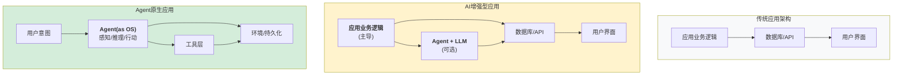
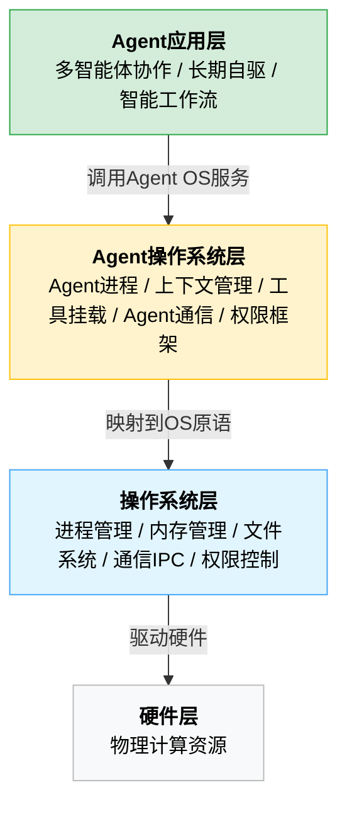
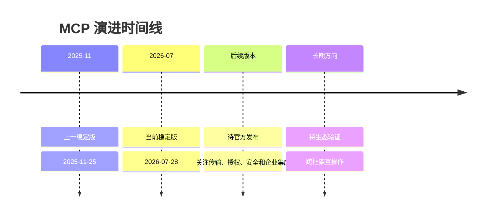
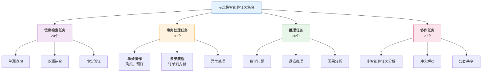
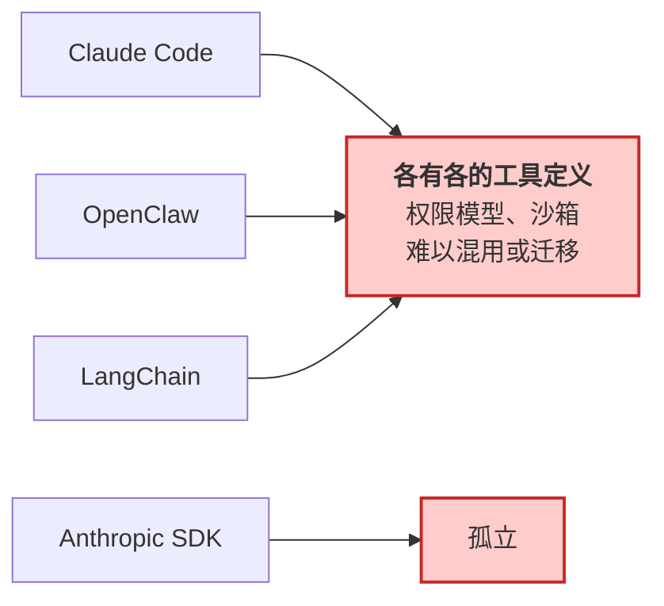
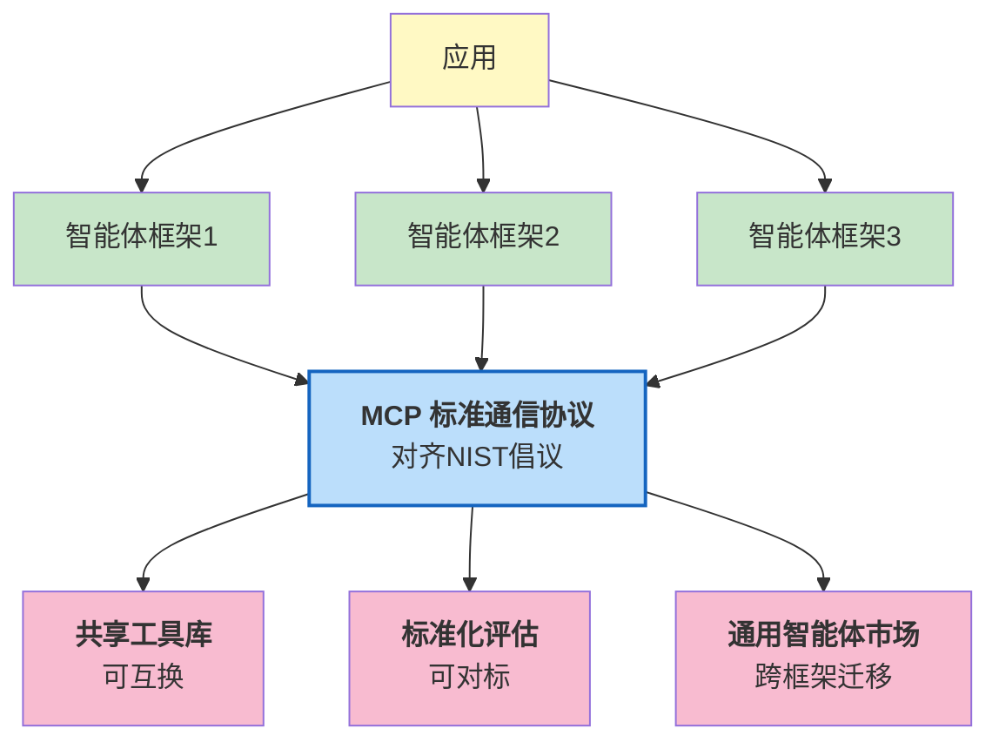
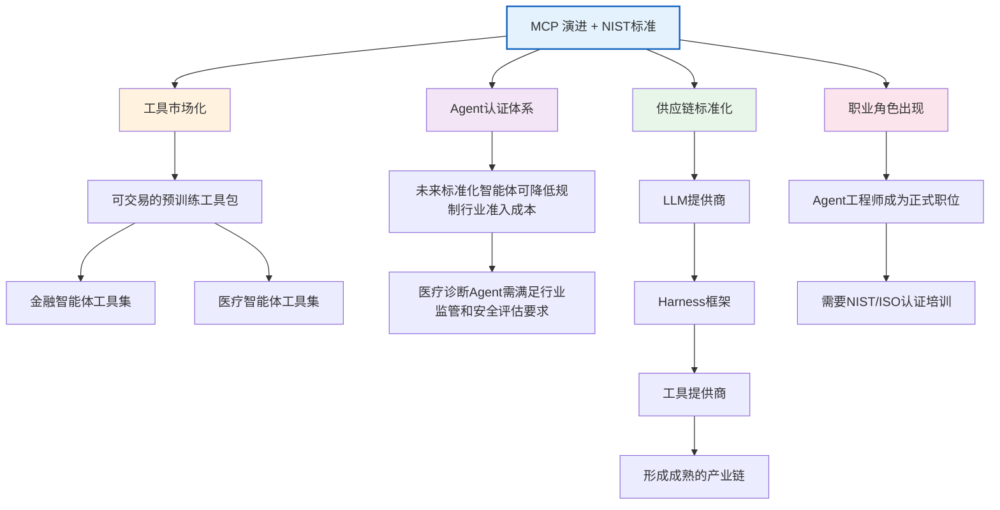
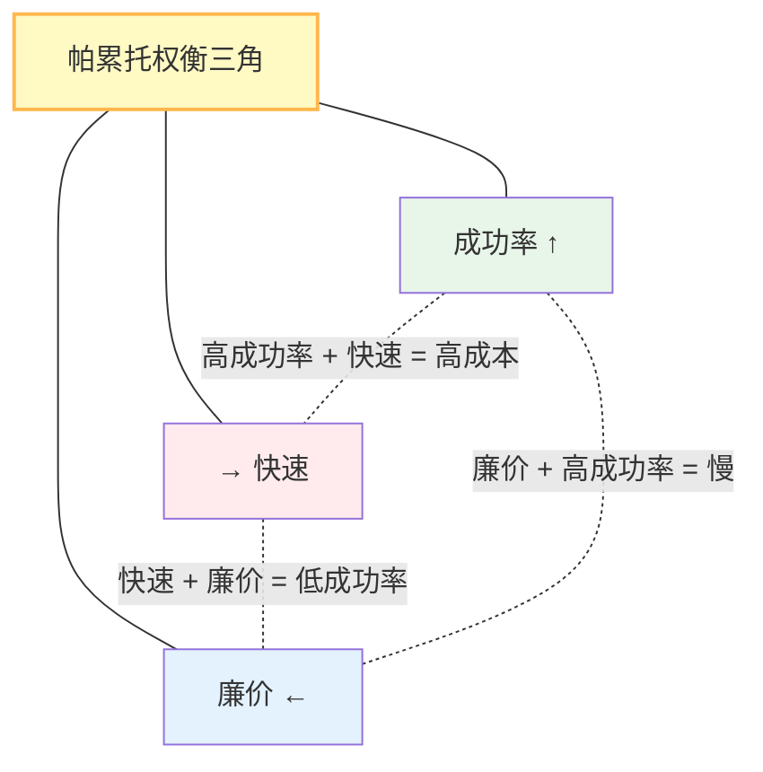
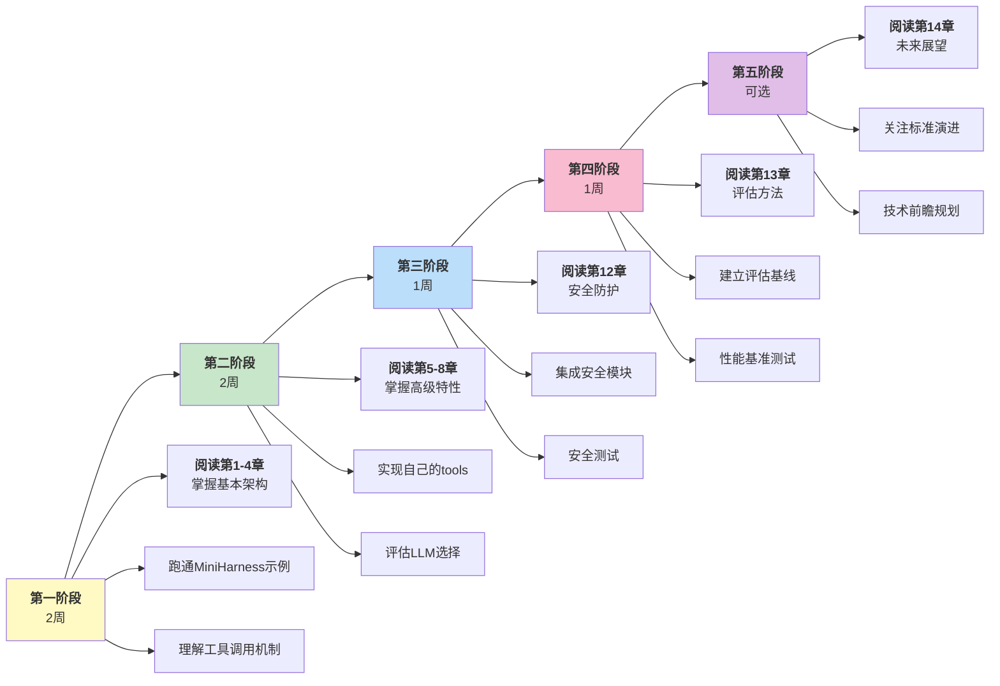

# 第十四章：Harness 工程的未来

前十三章介绍了 Harness 系统的当今现状：如何架构（第 1-4 章）、如何交互（第 5-8 章）、如何优化（第 9-11 章）、如何守护（第 12 章）、如何评估（第 13 章）。本章转向未来：**Harness 工程将走向何方**。

这不是科幻，而是基于以下证据的发展预测：

1. **学术进展**：GAIA、WebArena 等基准揭示了智能体能力的天花板，推动框架创新
2. **工业实践**：超过半数的组织已在生产环境运行智能体系统（LangChain [State of Agent Engineering](https://www.langchain.com/state-of-agent-engineering) 调研，57.3%），积累了大量经验
3. **标准化动向**：NIST 于 2026 年 2 月正式发起 AI Agent 标准化倡议（CAISI 主导），标志着从混沌走向秩序
4. **技术趋势**：多智能体、智能体即操作系统(Agent-as-OS)、持久化智能体等新范式不断涌现

**核心主题**

1. **智能体原生应用**：从“AI 增强现有应用”到“应用由 Agent 构成”的范式转移
2. **标准化演进**：MCP 持续演进、NIST CAISI 标准、跨框架互操作性
3. **开放问题**：可靠性、长期记忆、涌现行为控制等学术挑战

**本章的目标**

* 识别下一个十年 Harness 工程的关键方向
* 理解标准化对工程实践的影响
* 为读者的技术选择和投资决策提供指导

## 14.1 智能体原生应用

本节探讨从 AI 增强型应用向智能体原生应用的演进，阐述智能体即操作系统的愿景、关键技术挑战以及多智能体协作的实现模式。

> **框架视角：Harness 是 Token 经济里的 RaaS 层**
>
> 从商业模式看，智能体服务正沿 **Token 即服务（TaaS）→ 智能体即服务（AaaS）→ 结果即服务（RaaS）** 拾级而上，计费口径也随之从“按 Token 消耗量”转向“按价值”。Harness 工程支撑的正是最上层的 RaaS：它把“交付可信结果”这一商业承诺，落到两项可度量的交付物上——[结果可验证性](/harness_engineering_guide/di-yi-bu-fen-harness-gong-cheng-ji-chu/03_principles/3.2_verifiability.md)与[任务完成率](/harness_engineering_guide/di-si-bu-fen-an-quan-ping-gu-yu-yan-jin/13_evaluation.md)。2026 年 7 月《北京市加快智能体引领发展若干措施》已把“发展 Token（词元）经济”“从 Token 消耗量计费转向价值计费”写入正式文本，为这一阶梯写下政策注脚。（本书只取 Harness 视角的一角，完整的商业模式讨论不在本书范围。）

### 1.1 从 AI 增强到智能体原生

当前的智能体应用大多是 **AI 增强** (AI-Enhanced)的变体：



图 14-1：应用架构演进

关键差异：

| 维度   | AI 增强型     | 智能体原生型   |
| ---- | ---------- | -------- |
| 核心驱动 | 传统代码逻辑     | 智能体推理    |
| 控制流  | 过程式/事件驱动   | 自主目标导向   |
| 适配性  | 固定的 API 契约 | 动态的能力发现  |
| 失败处理 | 异常处理       | 自我修正与重试  |
| 学习能力 | 无（非学习系统）   | 有（从经验改进） |

### 1.2 智能体即操作系统愿景

**智能体即操作系统(Agent-as-OS)** 是智能体原生应用的终极形态。传统 OS 的职责扩展到智能体：



图 14-2：Agent 操作系统架构堆栈

#### 1.2.1 传统操作系统的核心职责

1. **进程管理**：创建、调度、销毁任务
2. **内存管理**：分配隔离的内存空间
3. **文件系统**：持久化存储管理
4. **通信**：进程间通信(IPC)
5. **权限控制**：访问控制与安全

#### 1.2.2 智能体操作系统中的对应角色

智能体操作系统的概念设计如下：

```python
class AgentOS:
    """Agent操作系统概念设计"""

    def __init__(self):
        self.process_manager = AgentProcessManager()      # 进程管理
        self.memory_manager = AgentMemoryManager()        # 上下文/内存管理
        self.tool_filesystem = ToolFilesystem()          # 工具即文件系统
        self.ipc = InterAgentCommunication()             # 多智能体通信
        self.security = SecurityManager()                # 权限和安全

    async def spawn_agent(self,
                         objective: str,
                         tools: List[Tool],
                         context: dict = None) -> "Agent":
        """创建一个Agent进程"""
        agent = Agent(
            objective=objective,
            tools=tools,
            context=context,
            os=self
        )
        await self.process_manager.register(agent)
        return agent

    async def allocate_context(self,
                              agent_id: str,
                              size_tokens: int) -> "ContextWindow":
        """为Agent分配上下文窗口(类似内存分配)"""
        return await self.memory_manager.allocate(agent_id, size_tokens)

    async def mount_tools(self,
                         agent_id: str,
                         tools: List[Tool]) -> None:
        """将工具挂载为"文件系统"(工具发现与调用)"""
        await self.tool_filesystem.mount(agent_id, tools)

    async def send_message(self,
                          from_agent: str,
                          to_agent: str,
                          message: str) -> None:
        """Agent间通信"""
        await self.ipc.send(from_agent, to_agent, message)

    async def enforce_permissions(self,
                                 agent_id: str,
                                 tool_name: str) -> bool:
        """权限检查(第12章的Permission Engine)"""
        return await self.security.check_permission(agent_id, tool_name)
```

#### 1.2.3 智能体操作系统的应用场景

**1. 多智能体协作系统**

```python
async def collaborative_task():
    """多个智能体协作解决复杂问题"""

    os = AgentOS()

    # 创建专用Agent
    researcher = await os.spawn_agent(
        objective="研究问题背景",
        tools=["search_web", "read_document"]
    )

    analyst = await os.spawn_agent(
        objective="分析研究结果",
        tools=["data_analysis", "visualization"]
    )

    writer = await os.spawn_agent(
        objective="撰写报告",
        tools=["write_document", "format_text"]
    )

    # Agent间通信
    research_result = await researcher.execute()
    await os.send_message("researcher", "analyst", research_result)

    analysis = await analyst.execute()
    await os.send_message("analyst", "writer", analysis)

    report = await writer.execute()
    return report
```

**2. 长期自驱智能体**

```python
class AlwaysOnAssistant:
    """持久化的自驱Assistant(Heartbeat模式)"""

    def __init__(self):
        self.os = AgentOS()
        self.persistence = PersistenceLayer()
        self.heartbeat_interval = 300  # 5分钟

    async def start_heartbeat(self):
        """心跳机制:定期检查待办事项"""
        while True:
            # 从持久化存储读取状态
            state = await self.persistence.load_state()

            # 检查是否有待处理的任务或消息
            pending = await self.persistence.get_pending_actions()

            if pending:
                # 恢复智能体并继续执行
                agent = await self.os.spawn_agent(
                    objective="处理待处理任务",
                    tools=state.get("tools", []),
                    context=state.get("context", {})
                )
                await agent.execute()

            # 持久化智能体状态
            await self.persistence.save_state(agent.state)

            # 等待下一个心跳
            await asyncio.sleep(self.heartbeat_interval)

# OpenClaw中的Heartbeat自驱模式是智能体操作系统的早期形态
```

**3. 智能流程自动化**

```python
async def intelligent_workflow():
    """智能体驱动的动态工作流"""

    os = AgentOS()

    # 智能体自主决定下一步(不是预先定义的流程)
    current_agent = await os.spawn_agent(
        objective="处理客户投诉",
        tools=["read_email", "access_database", "draft_response"]
    )

    while True:
        # 智能体执行并决定下一步
        action = await current_agent.decide_next_action()

        if action.type == "transfer":
            # 动态转交给其他智能体
            current_agent = await os.spawn_agent(
                objective=action.objective,
                tools=action.required_tools,
                context=action.context  # 传递上下文
            )
        elif action.type == "complete":
            break
        elif action.type == "escalate":
            # 升级到人工
            break
```

Agent-native 架构的设计理念为智能体系统的演进指明了方向。但在实现这一愿景的过程中，系统架构师们面临着多个重大的技术挑战，这些挑战涉及持久化、可用性和与外部系统的集成。

### 1.3 技术挑战

#### 1.3.1 上下文持久化

**问题**：传统应用数据可以持久化到数据库，但智能体的 **推理状态** 无法显式存储。

**当前方案**：

* 将上下文的关键决定点序列化存储
* 重启时重新执行推理恢复状态
* 成本：O（历史长度）

**未来方向**：

```python
class PersistentContext:
    """持久化推理上下文"""

    async def checkpoint(self):
        """定期保存推理检查点"""
        # 不仅保存最终答案,也保存中间推理步骤
        checkpoint = {
            "timestamp": now(),
            "reasoning_steps": self.reasoning_trace,
            "decisions": self.decision_log,
            "context_window": self.current_context,
            "learned_facts": self.extracted_knowledge,
        }
        await self.storage.save(checkpoint)

    async def restore(self, checkpoint_id):
        """从检查点恢复"""
        checkpoint = await self.storage.load(checkpoint_id)
        self.reasoning_trace = checkpoint["reasoning_steps"]
        self.decision_log = checkpoint["decisions"]
        # ...
```

#### 1.3.2 多智能体协调

**问题**：多个智能体可能有冲突的目标或输出，如何协调？

**当前方案**：中央调度器（智能体操作系统）仲裁

**挑战**：

* 如何设计智能体间的通信协议
* 如何检测和解决冲突
* 如何确保整体系统稳定性

#### 1.3.3 能力发现与绑定

**问题**：智能体操作系统需要动态发现可用的工具和能力

**MCP(Model Context Protocol)的角色**：

* 标准化工具定义
* 支持动态能力查询
* 能力协商(capability negotiation)已内置于现行规范的 initialize 握手；MCP 路线图进一步规划了 Server Cards（经 `.well-known` URL 暴露服务器元数据）等特性

#### 1.3.4 学习与自适应

**问题**：智能体操作系统中的智能体应该如何从经验学习？

**两种层级的学习**：

1. **单体智能体学习**：
   * 当前 Harness 中缺失
   * 未来可通过微调或检索增强学习
2. **系统级学习**：
   * 跨智能体的知识共享
   * 整个智能体操作系统的性能优化
   * 需要新的架构（如中央知识库）

```python
class AgentSystemLearning:
    """智能体操作系统级学习"""

    async def share_knowledge(self,
                            source_agent: str,
                            knowledge: dict,
                            scope: str = "global"):
        """共享知识
        scope: "global" (全系统) / "team" (同团队) / "private" (私有)
        """
        await self.knowledge_store.save(
            source_agent,
            knowledge,
            scope=scope
        )

    async def learn_from_failure(self,
                                failed_agent: str,
                                error: Exception,
                                context: dict):
        """从失败学习"""
        # 1. 记录失败原因
        failure_case = {
            "agent": failed_agent,
            "error": error,
            "context": context,
            "timestamp": now()
        }
        await self.failure_store.save(failure_case)

        # 2. 其他智能体避免相同错误
        similar_agents = await self.find_similar_agents(failed_agent)
        for agent_id in similar_agents:
            await self.notify_agent(
                agent_id,
                f"避免在类似场景下使用: {error}"
            )
```


**本节总结**：智能体原生应用代表了 Harness 工程的终极形态——从工具调用框架演进为 **自主操作系统**。虽然当前还有许多技术挑战，但 OpenClaw 的自驱模式和 MCP 标准已经指向这个方向。

## 2. 标准化演进

本节阐述智能体系统的标准化方向，包括 MCP 的技术演进、NIST 标准化倡议、框架间互操作性以及智能体协议栈的完整生态。

### 2.1 MCP 的演进路线图

MCP(Model Context Protocol)采用日期版本号；当前官方 latest 路径指向 2026-07-28，上一修订版为 2025-11-25。由于协议仍在迭代，正文只描述当前规范中可确认的机制，并把未来能力作为示意性方向处理。

**MCP 当前版本：**

**核心特性**：

* 工具定义的通用格式(JSON Schema)
* 客户端-服务器通信模型
* 支持 stdio（本地子进程）和 Streamable HTTP（远程服务）两种传输层
* 进度、取消、日志等通用能力可配合长时操作使用
* 动态工具注册（通过 `notifications/tools/list_changed` 通知）

**当前限制**：

* 工具定义虽支持动态注册，但大多数实现仍以启动时静态注册为主
* 缺乏正式的智能体间通信标准
* 企业级特性（审计、SSO、网关）仍在规划中

> **注**：早期版本曾使用 SSE(Server-Sent Events)作为独立传输层，已在 2025-03-26 版本中废弃，统一为 Streamable HTTP。

**MCP 下一代演进：**

**特性 1：动态能力协商**

以下“动态能力协商”是 Harness 可能采用的扩展设计，用来说明未来方向；它不是当前 MCP 规范或官方 SDK 中的 API：

```python
# MCP 下一代 - 动态能力协商
@dataclass
class CapabilityQuery:
    """智能体查询可用能力"""
    agent_id: str
    required_capabilities: List[str]  # ["read_file", "write_file"]
    optional_capabilities: List[str]
    resource_constraints: dict        # {"memory_mb": 512, "timeout_sec": 30}

@dataclass
class CapabilityOffer:
    """服务提供的能力"""
    capabilities: List[ToolDefinition]
    cost: dict                        # {"latency_ms": 100, "cost_usd": 0.001}
    constraints: dict                 # {"rate_limit": 100_per_hour}

async def negotiate_capabilities(query: CapabilityQuery) -> CapabilityOffer:
    """动态协商能力

    LLM不再依赖启动时加载的工具列表,而是在运行时查询可用能力
    """
    pass
```

**应用场景**：

```python
# 示例：智能体需要处理PDF,检查是否有能力
query = CapabilityQuery(
    agent_id="data-analyzer",
    required_capabilities=["read_pdf", "extract_text"],
    optional_capabilities=["ocr_scan"],
    resource_constraints={"memory_mb": 256}
)

# MCP 服务返回可用的实现
capabilities = await mcp_server.negotiate(query)

if "read_pdf" in capabilities:
    # 使用该能力
    pdf_content = await agent.call_tool("read_pdf", file_path="doc.pdf")
else:
    # 降级方案：上传到云服务
    await agent.call_tool("upload_to_cloud", file_path="doc.pdf")
```

**特性 2：增强的持久化会话与流式通信**

MCP 2025-11-25 通过 Streamable HTTP 支持 HTTP POST/GET、可选 SSE 流式响应、会话 ID、恢复与重投递等机制；2026-07-28 移除了协议级会话（`Mcp-Session-Id`）、GET 端点与 SSE 重投递，订阅推送改由 `subscriptions/listen` 承担。下面的“增强持久化会话”是概念示意，不代表当前规范已有同名 API：

```python
# MCP 下一代 - 增强持久化会话
class StreamingMCPSession:
    """支持流式通信的持久化会话"""

    async def open_stream(self, agent_id: str) -> Stream:
        """打开持久化流"""
        # 保持连接开放,支持实时推送(而不仅是请求-响应)
        pass

    async def push_event(self, event: Event):
        """服务器主动推送事件到智能体"""
        # 例：外部事件到达,直接推送给Agent
        # 当前MCP通过SSE支持服务端推送,但缺乏完整的事件订阅机制
        pass

    async def bidirectional_tool_call(self):
        """工具可以回调Agent"""
        # 当前：智能体 -> 工具(单向为主)
        # 下一代：工具 -> 智能体(完整的反向调用支持)
        # 应用：工具需要智能体决策时
        pass
```

**特性 3：智能体间通信标准**

实现如下：

```python
# MCP 下一代 - 智能体间通信
@dataclass
class AgentMessage:
    from_agent: str
    to_agent: str
    message_type: str              # "request", "response", "event"
    content: dict
    correlation_id: str            # 追踪相关消息

class AgentProtocolCommunication:
    """未来 MCP 或 A2A 类协议可能支持的智能体间通信"""

    async def send_message(self, msg: AgentMessage) -> None:
        """智能体A发送消息给智能体B"""
        # 若未来 MCP 或 A2A 类协议提供标准消息路由，可在此接入
        pass

    async def broadcast_event(self, event: dict, target_group: str) -> None:
        """广播事件到智能体组"""
        # 类似发布-订阅
        pass

    async def request_capability(self,
                                requesting_agent: str,
                                capability: str,
                                params: dict) -> Any:
        """跨智能体能力请求"""
        # 智能体A要求智能体B执行某个能力
        pass
```

**应用例**：多智能体协作

```python
async def collaborative_data_analysis():
    """多智能体协作分析(MCP下一代版本支持)"""

    # 智能体A(爬虫)向智能体B(分析员)发送数据
    message = AgentMessage(
        from_agent="scraper_agent",
        to_agent="analyst_agent",
        message_type="request",
        content={"data": scraped_data, "analysis_type": "statistical"}
    )

    await mcp_server.send_message(message)

    # 智能体B接收并处理
    result = await analyst_agent.process_request(message)

    # 智能体B响应智能体A
    response = AgentMessage(
        from_agent="analyst_agent",
        to_agent="scraper_agent",
        message_type="response",
        content=result
    )

    await mcp_server.send_message(response)
```

**MCP 演进时间线：** 官方规范使用日期版本号发布。下面仅保留确定的当前版本，并把后续方向写成待观察事项，避免把社区讨论或预测写成官方路线图：



图 14-3：MCP 标准演进路线图

### 2.2 NIST AI 智能体标准化

NIST 的 CAISI(Center for AI Standards and Innovation)于 2026 年 2 月 17 日正式发起 AI Agent 标准化倡议，聚焦三大战略支柱：行业标准制定与国际标准话语权、开源协议社区发展、以及智能体安全与身份研究。其目标是建立 **跨行业的智能体系统标准**。

**标准化可能覆盖的关键领域**

下面的能力等级、检查清单和任务集合是本书基于 NIST 倡议方向抽象出的示意性评估框架，不是 NIST 已发布的官方合规 API、能力等级或标准任务集。实际标准、术语和时间表应以 NIST 后续正式发布为准。

#### 2.2.1 功能分类与能力等级

分类如下：

```
Level 1: 基础工具调用
  - 单步工具调用
  - 简单参数
  - 示例：单个文件操作、查询API

Level 2: 多步推理
  - 多步工具链
  - 错误恢复
  - 示例：复杂数据分析、问题求解

Level 3: 自适应规划
  - 动态工具选择
  - 目标分解
  - 示例：长期项目规划、复杂系统设计

Level 4: 多智能体协调
  - 智能体间通信
  - 分布式执行
  - 示例：组织协作、跨域问题解决

Level 5: 持久自主系统
  - 长期记忆
  - 自主学习
  - 示例：智能体操作系统、完全自驱助手

```

#### 2.2.2 安全性基线

评估方案如下：

```python
class AgentSecurityBaselineExample:
    """示意性的智能体安全基线，不代表 NIST 已发布标准"""

    @staticmethod
    def evaluate_system(agent_system) -> SecurityReport:
        """评估系统的安全合规性"""

        report = SecurityReport()

        # Category 1: 工具调用安全
        report.tool_safety = {
            "dangerous_command_detection": True,      # 12.3
            "path_validation": True,                  # 12.4
            "parameter_validation": True,
            "rate_limiting": True,
        }

        # Category 2: 隐私保护
        report.privacy = {
            "data_minimization": check_data_minimization(agent_system),
            "encryption_at_rest": check_encryption(agent_system),
            "access_control": check_access_control(agent_system),
            "audit_logging": check_logging(agent_system),
        }

        # Category 3: 可靠性
        report.reliability = {
            "failure_handling": check_error_handling(agent_system),
            "recovery_capability": check_recovery(agent_system),
            "health_monitoring": check_monitoring(agent_system),
            "graceful_degradation": check_degradation(agent_system),
        }

        # Category 4: 可解释性
        report.interpretability = {
            "decision_traceability": check_traceability(agent_system),
            "reasoning_transparency": check_transparency(agent_system),
            "human_oversight": check_oversight(agent_system),
        }

        # 合规评分
        report.compliance_score = compute_score(report)

        return report
```

#### 2.2.3 性能基准的标准化

示意性任务集合如下：



标准化的长期目标已经清晰，但当前生态中各个框架各自为政，形成了事实上的碎片化。实现框架间的互操作性是推进标准化的重要一步，需要在工具定义、权限模型和通信协议等多个层面进行统一。

### 2.3 框架间互操作性

#### 2.3.1 现状：碎片化

情景如下：



#### 2.3.2 MCP 演进 + NIST 标准的未来

架构如下：



#### 2.3.3 互操作性的代码示例

示例如下：

```python
# MCP + NIST 标准下的互操作性
from mcp import MCPClient, CapabilityQuery

class FrameworkAgnosticAgent:
    """框架无关的智能体(未来)"""

    def __init__(self):
        self.mcp_client = MCPClient()

    async def use_tool(self, tool_name: str, **kwargs):
        """使用任何通过MCP暴露的工具,无论来自哪个框架"""

        # 1. 查询工具能力
        tool_spec = await self.mcp_client.query_tool(tool_name)

        # 2. 验证NIST安全基线
        assert tool_spec.is_nist_compliant()

        # 3. 调用工具(框架无关)
        result = await self.mcp_client.call_tool(
            tool_name=tool_name,
            args=kwargs,
            timeout=tool_spec.recommended_timeout
        )

        return result

    async def migrate_to_new_framework(self, new_framework_name: str):
        """迁移到新框架

        由于使用了标准化工具和通信,迁移成本大幅降低
        """

        # 1. 导出当前智能体的定义(MCP标准格式)
        agent_definition = await self.export_mcp_definition()

        # 2. 在新框架中导入
        new_agent = await new_framework.import_agent(agent_definition)

        # 3. 由于工具定义标准化,不需要重新绑定工具
        return new_agent
```

> 2026-04-09 GA 的 **Anthropic Cowork** 是该方向的早期产品形态：跨工具（Claude Code、Claude.ai、第三方 IDE）共享 skill/plugin 与 MCP 配置，可视为“Harness 配置层”的标准化尝试。详见附录 C 的 2026-05 时效快照。

### 2.4 从技术标准到行业生态

**标准化的涟漪效应**



**从推演到现实：政策层面的落地**

上面的涟漪效应曾长期停留在推演阶段，但 2026 年 7 月北京市发布的 [《北京市加快智能体引领发展若干措施》](https://www.beijing.gov.cn/zhengce/zhengcefagui/202607/t20260723_4781085.html)（京发改〔2026〕1185 号）已经把其中几条写进了正式文件：

* **职业角色被正式命名**：措施第三条写入“前沿部署工程师（FDE）”，与上图预测的“Agent 工程师成为正式职位”直接对应；
* **工具市场与互联标准入政策**：第二条提出建设“智能体技能市场”，并要求推广智能体互联协议（AIP）等智能体互联的关键国家标准与行业标准，与 14.2.5 的协议栈演进同向；
* **术语进入官方文本**：同样在第二条，“驾驭层工程（Harness Engineering）”——本书的核心概念与中文译名——被逐字写入政策原文（“支持创新主体实施驾驭层工程（Harness Engineering）……”）。

这份文件的意义不在于某一条具体条款，而在于它标志着 Harness 工程正从技术社区的实践共识，进入产业政策与标准体系的视野。对 Harness 工程师而言，这既是概念被主流承认的信号，也预示未来的接口、身份、权限与互联标准，会越来越多地由公共标准而非单一厂商来定义。

### 2.5 智能体协议栈的完整版图

MCP 解决了“智能体如何调用工具和访问上下文”的问题，但智能体生态的完整通信需求远不止于此。下面列出若干常见方向，成熟度和治理归属应以各项目官方资料为准：

| 协议        | 职责                    | 发起方                 | 状态    |
| --------- | --------------------- | ------------------- | ----- |
| **MCP**   | 智能体 ↔ 工具/数据源          | Anthropic 发起，开放规范维护 | 生产采用中 |
| **A2A**   | 智能体 ↔ 智能体             | Google 等生态参与        | 早期采用  |
| **AG-UI** | 智能体 → 前端 UI（事件流）      | CopilotKit 开源       | 社区驱动  |
| **A2UI**  | 智能体 → 声明式 UI（JSON 描述） | Google              | 提案阶段  |

这些协议和项目体现了智能体通信从私有集成走向开放规范的趋势，但治理结构和版本状态变化很快，工程选型时应直接核对各官方规范页面。

对 Harness 工程师而言，这意味着：

* **MCP 仍是 Harness 层最核心的协议**，负责工具调用和数据访问
* **A2A 将影响多智能体编排的实现方式**：当前基于私有消息传递的编排（如第 8 章所述），未来可能迁移到标准化的 A2A 协议上
* **AG-UI/A2UI 影响前端集成**：智能体的中间状态和结果如何呈现给用户，将有标准化的事件流格式
* **Harness 需要成为协议网关**：在不同协议之间做翻译和路由，而非只支持单一协议

### 2.6 专用应用协议：另一条标准化路径

虽然 MCP 已成为重要的开放协议，但复杂 IDE 工作流仍可能需要专用应用协议来表达编辑、审批、会话和 UI 状态。以下内容是概念化架构草图，不代表任何厂商的官方 API。

#### 2.6.1 为何拒绝 MCP

在大型代码生成或 IDE 深度集成项目中，直接把 MCP 当作唯一基础协议可能遇到表达力限制：

**MCP 的工具模型(tool-oriented)** 设计优秀，但缺乏表达 IDE 工作流的能力：

* MCP 聚焦“调用工具获取结果”的请求-响应模式
* IDE 工作流需要：流式代码 diff、多轮审批流程、持久会话管理、双向交互
* MCP 缺乏这些原语的标准化定义，导致每个 IDE 集成都要自行扩展

#### 2.6.2 专用应用协议的设计

一种可行设计是采用 **JSON-RPC 双向通信** 模型，并定义面向 IDE 的核心原语：

**1. Items** （原子 I/O 单位）

* 具有生命周期的可执行单元
* 支持流式推送（如代码 diff 的增量推送）
* 支持元数据和关联的 approval 对象

**2. Turns** （用户交互组）

* 单个用户操作对应的 Items 集合
* 原子性提交或回滚
* 支持多轮交互的会话聚合

**3. Threads** （持久会话）

* 跨越多轮用户交互的 durable session
* 完整的消息历史和执行状态持久化
* 支持长期的智能体决策追踪

#### 2.6.3 服务端请求

与普通工具调用不同，IDE 专用协议通常需要支持 **agent 暂停后请求用户批准**：

```jsonc
{
  "method": "request_approval",
  "params": {
    "turn_id": "turn_123",
    "action": "apply_changes",
    "changes": {...},
    "rationale": "..."
  }
}
```

这在 IDE 交互、高风险操作、长期规划修正中至关重要。

#### 2.6.4 战略意义

这类专用协议的设计动机表明：

* **MCP 不是全能的**：工具调用的标准化已足够，但丰富的 IDE 集成需要不同的协议
* **标准化是渐进的**：不同的协议面向不同的 use case，最终会形成分层的协议栈
* **Harness 工程师需要多协议思维**：未来系统可能同时使用 MCP、A2A 和面向 IDE/UI 的专用协议

**本节总结**：标准化（MCP 持续演进、NIST CAISI 倡议）将 Harness 工程从“野生西部”转变为“规范产业”。对工程师而言，意味着更少的碎片化、更强的可移植性、更高的行业认可度。对企业而言，意味着风险降低、成本优化、生态互联。

## 3. 开放问题

即使有了成熟的框架、完善的评估、严格的安全防护，智能体系统仍面临深层的、可能需要多年研究才能解决的问题。

本节讨论六大开放问题：可靠性的理论上限、长期记忆与目标保持、多智能体系统的涌现行为控制、智能体安全的攻防升级、成本效率与性能的帕累托权衡、以及 Harness 假设过时的困境。

### 3.1 可靠性的理论上限

#### 3.1.1 可靠性问题陈述

给定一个 LLM（能力有限），通过工具扩展能力。 **最终的系统可靠性有上限吗？**

```
可靠性 = P(正确完成任务)
        = P(LLM正确推理) × P(工具正确执行) × P(系统无故障)
        ≤ min(P(LLM推理), P(工具执行), P(系统稳定))
```

**当前现状**：

* 多步推理和工具链越长，错误累积越明显
* 同一系统在简单任务和复杂任务上的可靠性差距可能很大
* 公开排行榜数据变化较快，具体数字应以基准官网和模型供应商当前报告为准

**理论问题**：

* 是否存在一个 k，使得 k 步推理后成功率→0？
* 如何从根本上提升长链推理的可靠性？
* 或者，Agent 应该避免长链推理，转为交互式设计？

#### 3.1.2 研究方向

可靠性研究框架的参考实现：

```python
class ReliabilityFramework:
    """可靠性研究框架"""

    @staticmethod
    def theoretical_analysis():
        """理论分析"""
        # 1. 建立可靠性的数学模型
        # 2. 证明在某些条件下的上下界
        # 3. 识别提升可靠性的关键点

        # 例:能否通过多数投票提升可靠性？
        single_agent_reliability = 0.6
        n_agents = 3
        from math import comb
        ensemble_reliability = sum(
            comb(3, k) * (0.6**k) * (0.4**(3-k))
            for k in range(2, 4)
        )  # 多数投票时的可靠性

        print(f"单Agent可靠性: {single_agent_reliability}")
        print(f"3-Agent集成: {ensemble_reliability}")

    @staticmethod
    def empirical_evaluation():
        """实证评估"""
        # 在GAIA基准上评估多步推理的可靠性衰减
        # 绘制"推理深度 vs 成功率"的曲线
        pass
```

### 3.2 长期记忆与目标保持

#### 3.2.1 长期记忆问题陈述

现有 Agent 使用的上下文窗口虽已显著扩展，但仍然是有限的短期窗口；不同模型、账号权限和供应商界面的上限需要按官方模型目录确认。 **如何让智能体维持长期记忆并在多天/月的时间尺度上保持目标？**

#### 3.2.2 当前方案的局限

当前短期内存实现的局限性示例：

```python
# 当前方案:上下文管理
class ShortTermMemory:
    """短期上下文(当前实现)"""
    def __init__(self):
        self.context_window = 200_000  # 示例值；按实际模型可调到 1_000_000
        self.history = []

    def add(self, item):
        self.history.append(item)
        # 当超出限制时,丢弃早期项
        if total_tokens() > self.context_window:
            self.history.pop(0)

# 问题:长期信息丢失,无法维持跨天的目标
```

#### 3.2.3 理想的长期记忆系统

代码示例如下：

```python
from dataclasses import dataclass
from datetime import datetime

@dataclass
class MemoryItem:
    content: str
    importance_score: float       # 1-10
    timestamp: datetime
    retrieval_count: int          # 被检索次数
    last_accessed: datetime
    relationships: List[str]      # 与其他记忆的关联

class LongTermMemorySystem:
    """长期记忆系统(理想版本)"""

    async def store(self, item: MemoryItem):
        """存储记忆"""
        # 1. 重要性评估:是否值得长期保留
        if item.importance_score > threshold:
            await self.long_term_store.save(item)

    async def retrieve(self, query: str) -> List[MemoryItem]:
        """检索相关记忆"""
        # 1. 向量相似性搜索
        # 2. 时间衰减:距今越近的记忆权重越高
        # 3. 检索频率:常被访问的记忆优先

        decay_factor = exp(-days_since_access / half_life)
        recency_score = item.retrieval_count * decay_factor

        return sorted_by(recency_score)

    async def consolidate(self):
        """记忆整合(类似睡眠)"""
        # 周期性地对记忆进行:
        # 1. 去重(移除冗余记忆)
        # 2. 总结(将相关记忆聚类摘要)
        # 3. 关联(找出跨时间的因果关系)
        pass

    async def maintain_goal(self, goal: str):
        """维持长期目标"""
        # 定期检查:目标是否仍然相关
        # 更新:中间里程碑的进展
        # 适应:根据新信息调整目标

        current_state = await self.assess_goal_progress(goal)
        if current_state.progress_stalled:
            # 重新规划
            new_plan = await self.replan(goal)
        elif current_state.environment_changed:
            # 适应新环境
            await self.adapt(goal, current_state)
```

#### 3.2.4 技术挑战

1. **存储成本**：长期记忆的向量化和检索成本
2. **一致性**：多智能体系统中的记忆一致性
3. **遗忘**：何时有意遗忘，以防止记忆过载
4. **隐私**：长期存储敏感信息的风险

### 3.3 涌现行为与控制

#### 3.3.1 涌现行为问题陈述

当多个智能体交互时， **整个系统可能出现非预期的涌现行为** (Emergent Behavior)。

#### 3.3.2 案例：多智能体竞争

示例如下：

```python
class EmergentBehaviorExample:
    """涌现行为案例"""

    async def scenario_auction():
        """竞拍场景中的涌现行为"""

        # 初始设计:每个Agent独立报价,最高价获胜
        agents = [BiddingAgent(budget=1000) for _ in range(3)]

        # 预期:平均成交价~500-600
        # 实际:可能出现以下涌现行为
        # 1. 恶性竞争:价格螺旋上升到1000+(超过价值)
        # 2. 串谋:多个Agent协调压价
        # 3. 市场操纵:一个强Agent驱逐其他竞争者

        final_price = await conduct_auction(agents, item_value=500)

        # 系统无法预测final_price具体是多少
```

#### 3.3.3 解决方向

方案如下：

```python
class EmergentBehaviorControl:
    """涌现行为控制"""

    @staticmethod
    def mechanism_design():
        """机制设计"""
        # 不是事后修复涌现行为,而是事前设计机制
        # 使得个体最优 = 系统最优(激励兼容)

        # 例:Vickrey竞拍(次高价机制)
        # 激励诚实竞价,防止恶性竞争
        pass

    @staticmethod
    async def runtime_monitoring():
        """运行时监控与干预"""

        while True:
            # 监控系统行为指标
            metrics = await measure_system()

            # 检测异常
            if metrics.price_volatility > threshold:
                # 触发干预:临时暂停、改变规则等
                await system.intervene("high_volatility_detected")

    @staticmethod
    def formal_verification():
        """形式化验证"""
        # 使用模型检验等形式化方法
        # 证明在某些条件下不会出现特定涌现行为
        pass
```

### 3.4 智能体安全的攻防升级

#### 3.4.1 安全攻防问题陈述

随着智能体能力提升， **安全防护需要持续进化**。攻击者可能：

1. **发现新的 Harness 漏洞**
   * 当前的路径校验可能被新编码方式绕过
   * 新的危险命令组合出现
2. **提示注入进化**

   ```
   当前:直接指令注入
   未来:隐藏的指令(隐写术)、多语言混淆、偶然触发等
   ```
3. **工具链攻击**

   ```
   当前:单个工具滥用
   未来:跨工具协调,利用工具间的隐含依赖
   ```

#### 3.4.2 防守策略的展望

框架示例如下：

```python
class AdaptiveSecurityFramework:
    """自适应安全框架"""

    async def red_team_simulation(self):
        """红队模拟"""
        # 定期用对抗性示例测试系统
        # 发现新的攻击方式

        adversarial_cases = [
            "新的编码方式",
            "符号链接变体",
            "权限提升新向量",
            "提示注入变体"
        ]

        for case in adversarial_cases:
            result = await test_defenses(case)
            if result.bypassed:
                # 更新防护
                await update_guardrails(case)

    async def zero_knowledge_verification(self):
        """零知识验证"""
        # 验证工具输出的有效性,无需信任工具
        # 例:验证计算正确性而不重新计算

        tool_output = await tool.execute()
        verified = await zkproof.verify(tool_output)

        if not verified:
            raise SecurityError("Tool output failed ZK verification")
```

### 3.5 成本效率的帕累托前沿

#### 3.5.1 成本效率问题陈述

**成功率、响应时间、成本之间无法同时优化**，存在帕累托权衡。



#### 3.5.2 权衡问题

示例代码如下：

```python
class ParetoFrontier:
    """成本效率的帕累托前沿"""

    @staticmethod
    def characterize_frontier():
        """描述帕累托前沿"""

        scenarios = [
            {
                "name": "低成本",
                "model": "Llama 4 Scout",
                "success_rate": 0.70,
                "cost_per_task": 0.001,
                "latency_sec": 3.0
            },
            {
                "name": "均衡",
                "model": "Claude Haiku 4.5",
                "success_rate": 0.85,
                "cost_per_task": 0.01,
                "latency_sec": 2.0
            },
            {
                "name": "高精度",
                "model": "Claude Sonnet 4.6",
                "success_rate": 0.93,
                "cost_per_task": 0.05,
                "latency_sec": 5.0
            }
        ]

        # 问题:如何选择？
        # 答案:取决于业务KPI(容忍的成本/延迟/准确度权衡)

        return scenarios

    @staticmethod
    async def adaptive_routing():
        """自适应路由"""
        # 根据任务特征和系统状态,动态选择最优模型

        for task in incoming_tasks:
            # 1. 估计任务难度
            difficulty = await estimate_difficulty(task)

            # 2. 选择合适的模型
            if difficulty == "easy":
                model = "Llama 4 Scout"  # 廉价
            elif difficulty == "medium":
                model = "Claude Haiku 4.5"  # 均衡
            else:
                model = "Claude Sonnet 4.6"  # 精确

            result = await run_with_model(task, model)
```

### 3.6 Harness-as-Assumption 困境：何时该简化

#### 3.6.1 问题陈述

本书前 13 章一直在讲 **如何往 Harness 里加东西**——加沙箱、加 guardrail、加重试、加压缩、加审计。但有一个反向问题同样关键： **什么时候该把已经加进去的东西拿掉？**

每一个 Harness 组件——每一次工具重试、每一段上下文压缩、每一道权限护栏、每一个结构化输出校验——本质上都在编码一个隐含假设： **“模型自己做不到这件事，所以基础设施必须替它兜底。”**

这个观察被 Anthropic 在 2026 年的 [Harness design for long-running application development](https://www.anthropic.com/engineering/harness-design-long-running-apps) 一文中明确化：

> "every component in a harness encodes an assumption about what the model can't do on its own, and those assumptions are worth stress testing."

随着模型能力快速演进，这些被编码的假设会过期。一个为弱模型设计的 Harness，在强模型上会变成 **不必要的开销、延迟和复杂度**——更糟的是，它甚至可能限制强模型本来能做到的事。

#### 3.6.2 案例：Anthropic 的 sprint construct 移除

Anthropic 给出了一个具体案例：

* **Opus 4.5 时代**：为了防止 agent 在长任务中“过度自我表扬”，引入了 sprint construct（把长任务切成 sprint，每个 sprint 末尾用独立 evaluator 验证）
* **升级到 Opus 4.6**：原文判断“模型的原生能力已有充分理由相信不再需要这种分解”，于是移除了该组件
* **移除后的 V2 驭具**：在另一项同等复杂度的应用构建任务（DAW 音乐工作站）上用时约 3 小时 50 分、成本约 **$125**；作为对照，完整驭具 + Opus 4.5 构建复古游戏编辑器用时 6 小时、成本约 **$200**。注意两次运行的任务与模型都不同，降幅不能单独归因于移除 sprint construct——但它体现了“随模型变强而精简驭具”带来的开销下降

如果没有人主动审视这个组件是否仍然必要，团队会持续为一个已经无效的假设付钱。

#### 3.6.3 为什么是一个未解的开放问题

简化听起来是常识，但实践中难做到：

1. **缺少“哪个假设还有效”的可观测信号**：移除一个 Harness 组件需要确认它的失败率在新模型下足够低。但 Harness 的失败被 Harness 自己吸收掉了——guardrail 拦下的注入、retry 救回的瞬时失败、validator 挡下的格式错——这些都不会在常规 metric 里出现，因而无法直接看到“已经多久没救场了”
2. **复合效应难以解耦**：A 组件的简化可能让 B 组件的负载上升。需要 factorial（模型 × Harness 配置）实验，运行成本高
3. **长尾回归风险**：移除一个 guardrail 后，新模型在 99% 任务上 OK，但 1% 长尾任务上发生严重失败，单次代价可能远大于保留 guardrail 的固定开销
4. **组织惯性**：Harness 通常是多个团队、多次事故后的层层堆积，很少有人能完整说出“为什么这一段还在”

#### 3.6.4 研究方向

```python
class HarnessAssumptionAudit:
    """Harness 假设有效性的审计框架"""

    async def shadow_ablation(self, component_to_remove, n_tasks=1000):
        """影子实验:在生产流量上并行运行 baseline 与 ablated 版本"""
        baseline = await run(full_harness, tasks)
        ablated = await run(
            harness.without(component_to_remove),
            tasks
        )

        return {
            "success_delta_pp": ablated.success - baseline.success,
            "cost_delta_pct": (ablated.cost - baseline.cost) / baseline.cost,
            "long_tail_failure_rate": ablated.tail_failures,
            # load_bearing_score 接近 0 → 该组件已可移除
            "load_bearing_score": baseline.success - ablated.success,
        }

    async def factorial_evaluation(self, models, harness_configs):
        """因子化评估:识别哪些干预是'模型相关'的"""
        # 一些 Harness 组件对所有模型都有效 → 应保留
        # 一些组件只对弱模型有效 → 强模型升级时应移除
        # 一些组件反而损害强模型 → 应紧急移除
        ...

    async def meta_monitoring(self):
        """元监控:追踪'哪些 Harness 干预还在救场'"""
        # 对每个 guardrail/validator/retry, 记录:
        # - 多久没有触发过(组件可能已无效)
        # - 触发后挽救的失败类型(组件还在防御什么)
        # - 触发对成本的开销(组件是否值)
        ...
```

理想的 Harness 不是 **单调增长的脚手架**，而是 **持续自问“哪些控制还需要”的自适应系统**。学术综述 [Agent Harness Engineering: A Survey](https://openreview.net/pdf?id=eONq7FdiHa)（TMLR 投稿中，2026-05）将这个问题列为五大长期开放问题之一，并提出“adaptive simplification”作为长期目标。这一方向与本书 14.2 节“标准化演进”互补——前者关注实现层的精简， **后者关注协议层的趋同**。


**本节总结**：这些开放问题代表了 Agent 工程的科学边界。解决它们需要跨越工程、数学、经济学的多学科合作，可能需要十年或更长时间。但正是这些挑战驱动了该领域的创新和进步。

## 4. 本章小结

本章展望了 Harness 工程的未来发展方向，以下是三条关键道路的阐述。

### 4.1 三条未来的道路

Harness 工程的未来不是单一方向，而是三条相互交织的道路：

#### 道路 1：智能体原生应用

**从** “AI 增强现有应用” **到** “应用由 Agent 构成”

**标志**：智能体即操作系统(Agent-as-OS)、多智能体协作、持久化自驱智能体

**工程影响**：

* 架构从 C/S 转为 Agent-OS
* 开发从过程式转为目标驱动式
* 测试从单元测试转为行为验证

**时间表（本书判断）**：若可靠性、成本和标准化继续推进，2026-2028 年将以小规模应用为主，2030 年代可能主流化

#### 道路 2：标准化演进

**从** “各框架各自为战” **到** “统一的生态”

**标志**：MCP 持续演进、NIST CAISI 标准、跨框架互操作

**工程影响**：

* 工具可复用（一次编写，多框架使用）
* 人员可流动（技能可迁移）
* 产业可协同（供应链形成）

**时间表**：2026 年 NIST 推进调研、工作坊和标准化协作；互操作性框架、合规要求和企业采用节奏仍以官方后续发布和行业验证为准

#### 道路 3：基础研究突破

**从** “启发式工程” **到** “理论驱动设计”

**标志**：可靠性理论、长期记忆机制、涌现控制

**工程影响**：

* 更智能的自适应系统
* 更可预测的行为
* 更高的鲁棒性

**时间表**：进行中，持续多年

### 4.2 工程师的决策指南

#### 当前阶段

**现在做什么**：

1. 深化当前框架的掌握（Claude Code、OpenClaw 等）
2. 实现完整的安全防护（第 12 章）
3. 建立评估基线（第 13 章）
4. 关注 MCP 规范演进，为适配做准备

**不要过早投入**：

* 多智能体系统（标准未定）
* 长期记忆系统（仍在研究）
* 智能体即操作系统(Agent-as-OS)实现（为时过早）

#### 中期方向

**积极探索**：

* MCP 新版本迁移
* 跟踪 NIST AI Agent 标准化倡议与自愿指南
* 多智能体协作原型
* 框架间互操作性

**投资重点**：

* 标准化工具库（未来易复用）
* 评估框架完善（未来易对标）
* 文档和培训（人员易流动）

#### 长期视野

**准备就绪**：

* 迎接 Agent-native 范式
* 参与标准制定
* 投资基础研究人才

### 4.2 反思：工程的本质

本书从架构、优化、安全、评估四个维度深入 Harness 系统。但在更高的层面，这些都是为了回答一个根本问题：

> **如何让 AI 系统可靠、安全、有效地扩展人类的能力？**

这不是纯技术问题，而是涉及设计哲学、伦理、经济学的综合问题：

* **设计**：Agent-OS 的架构应该如何演进？
* **伦理**：自主智能体的责任边界在哪里？
* **经济**：谁来为失败负责？谁收益？
* **社会**：Agent 工作的崛起如何影响就业？

### 4.3 给读者的建议

#### 对工程师

1. **打好基础**：掌握第 1-8 章的架构和交互原理
2. **追求深度**：选择一个维度（安全、性能、评估）深研
3. **保持学习**：每半年评估一次技术栈是否仍是最佳选择
4. **参与社区**：在 MCP、NIST 标准讨论中发出声音

#### 对技术管理者

1. **投资培训**：Agent 工程是新领域，需要系统培训
2. **建立标准**：参考本书的架构、安全、评估建议
3. **平衡创新与稳定**：不要过早追逐最新特性，但要为未来规划
4. **关注人才**：优秀的 Agent 工程师会越来越稀缺

#### 对企业领导

1. **认识价值**：本书判断，智能体系统将成为 2026 年及以后的重要竞争能力
2. **评估风险**：安全和可靠性不是可选的
3. **规划投资**：3-5 年的时间跨度考虑 Agent 策略
4. **拥抱开放**：支持标准化和生态建设，长期有利

### 4.4 结语

《智能体 Harness 工程指南》记录的是 Harness 工程刚刚站稳为一门独立工程学科的这个阶段。它的特征是：

* 大模型已经足够强大（Claude Opus 5 / Sonnet 5、GPT-5.6、Llama 4 等当代旗舰）
* Harness 框架已有可复用的早期成熟形态
* 生产应用已经足够支撑工程实践总结
* NIST 已正式启动 AI Agent 标准化，但标准仍在制定中
* 基础研究仍在早期

这是一个充满机遇的时刻。无论你是工程师、管理者、研究者还是企业决策者，都可以在这个浪潮中找到自己的位置和贡献。

下一个十年，Harness 工程将如何演进，取决于像你一样的从业者的选择和创新。

***

## 附加资源

### 进阶阅读

* **论文**：GAIA, WebArena, SWE-Bench 原始论文
* **官方文档**：Anthropic SDK、Claude API、MCP 规范
* **开源项目**：LangChain、LlamaIndex、AutoGen

### 社区

* NIST AI Agent 标准化工作组
* MCP 社区论坛
* Anthropic 开发者社区
* 国内 AI 工程学习社区

### 建议的学习路径

推荐的学习路径和阶段划分如下：



**感谢阅读《智能体 Harness 工程指南》。现在，该是你用所学去构建下一代应用的时候了。**

