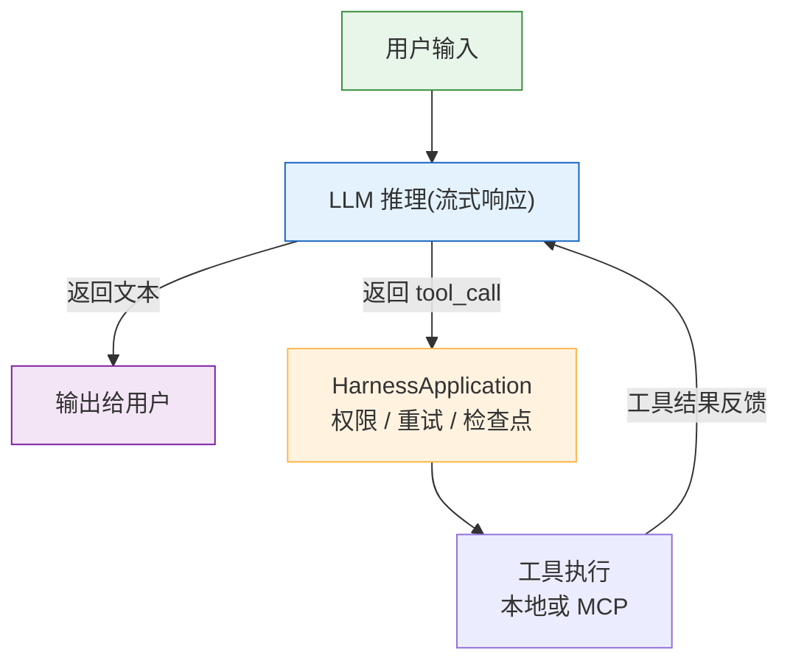
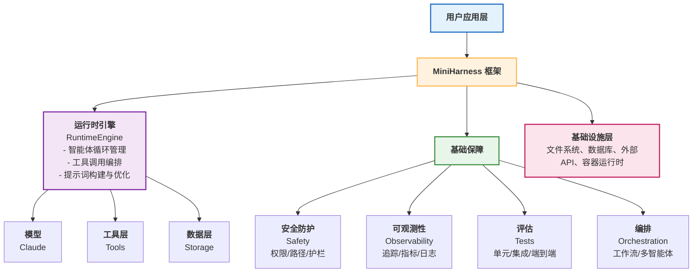

# 附录 

## 1. 术语表

本术语表收录全书涉及的技术术语，按字母排序。中文术语标注中英对照。

| 术语 | 解释 |
| --- | --- |
| **Agent** （智能体）| 能够感知环境、自主决策和执行行动的自治系统。本书特指基于 LLM 的工具调用 Agent。|
| **AgentBench* | Tsinghua University 等机构开发的多领域 Agent 基准测试，覆盖 8 个领域。|
| **Always-On Assistant** （持久化助手）| 长期在线的 Agent，能跨会话维持状态和目标。OpenClaw 的 Heartbeat 模式是其实现。 |
| **Auto Mode Classifier** | Claude Code Auto Mode 使用的权限分类器，用于在无提示运行时评估工具调用风险，并阻止不可逆、破坏性或超出环境边界的操作。 |
| **Backpressure** （背压）| 当下游处理速度跟不上上游生产速度时，系统通过队列限流或暂停接收来保护自身的机制。Harness 中常见于工具调用并发控制。|
| **Budget** （预算）| 参见 Token Budget。|
| **Capability** （能力/功能）| 智能体对外暴露的高层能力或权限面，通常由一个或多个工具、技能或服务支撑。它描述“系统能做什么”，不等同于单个可执行调用。|
| **Checkpoint** （检查点）| 智能体推理过程的保存点，用于恢复和持久化。|
| **Circuit Breaker** （熔断器，又译断路器）| 借鉴电路保护的容错模式——当连续失败次数达到阈值时自动切断调用，避免雪崩。MiniHarness 的 `ModelSelectionEngine` 中有实现。|
| **Claude Code**：| Anthropic 官方提供的智能体编码工具(Agentic Coding Tool)，内置权限管理、路径校验、危险命令检测。|
| **Composed Tool** （复合工具）| 由多个基础工具组合而成的高层工具。|
| **Dangerous Patterns**：| Claude Code 中的危险命令检测模块，包含多个禁止命令的黑名单。
| **Defense in Depth** （纵深防护）：| 多层安全防护设计，单层失效不导致整体失败。
| **Drift Detection** （漂移检测）：| 在长时任务中监测智能体行为是否偏离预期目标，并在必要时进行纠正。参见第 4.5 节。
| **Dynamic Tool Discovery** （动态工具发现）：| 运行时查询和发现可用工具，而非启动时静态加载。MCP 支持 `tools/list` 查询，并可通过 `notifications/tools/list_changed` 通知工具列表变化。
| **E2E Testing** （端到端测试）：| 测试完整工作流，从用户输入到最终输出。
| **Emergent Behavior** （涌现行为）：| 多智能体系统中出现的非预期、无法从单个 Agent 推断的系统级行为。
| **Execution Harness** （执行驾驭层）：| Harness 的别名或强调执行面的说法，指 LLM 之外的运行时支撑系统，包含工具定义、运行时引擎、安全防护、评估系统等，本身不含 LLM。参见 Harness。
| **Fallback** （降级/回退）：| 主路径失败时切换到备用路径的策略。常见于模型选择（主模型不可用时自动切换到备用模型）和工具调用。
| **Feature Gate** （特性门控）：| 通过配置开关控制功能的启用/禁用，无需重新部署。参见第 10.4 节。
| **GAIA**：| 由 Meta、Hugging Face 等机构研究者开发的通用 AI 助手基准，三个难度等级，约 466 个任务。
| **Guardrail** （护栏）：| 执行前对工具调用的检查机制，防止危险操作。包括危险命令检测、约束检查、超时强制。
| **Harness** （驾驭）：| 本书的核心概念。Harness 一词意为“驾驭”，原指骑手用以驾驭烈马的缰绳和鞍具系统。在本书中，指包裹在大模型外围、将其推理能力转化为可靠可控生产级系统的完整工程基础设施。
| **Heartbeat** （心跳）：| OpenClaw 的自驱模式，定期检查待办事项并执行。
| **Injection Attack** （注入攻击）：| 通过恶意输入改变系统行为的攻击。包括提示注入、路径穿越等。
| **Interoperability** （互操作性）：| 不同框架和系统之间的兼容性和协作能力。
| **JSON Schema**：| 用于描述 JSON 数据结构的规范。MCP 协议和工具定义中广泛使用，用于声明工具参数的类型和约束。
| **Key Rotation** （密钥轮换）：| 定期更换 API 密钥或加密密钥的安全实践，降低密钥泄露后的影响范围。
| **LangChain**：| 开源智能体框架，提供工具调用、记忆管理、链式推理等功能。
| **Langfuse**：| 开源可观测性工具，用于监控智能体执行和收集指标。
| **LLM** （大语言模型）：基础模型，如 Claude、GPT、Llama。
| **Long-term Memory** （长期记忆）：跨会话的持久化记忆，与短期上下文对比。
| **MCP** (Model Context Protocol)：| Anthropic 发起的开放协议，用于让 LLM 应用与外部工具、资源和提示词集成。当前规范支持 JSON-RPC 2.0 消息、stdio 与 Streamable HTTP 等机制。
| **Mock Testing** （模拟测试）：| 用模拟对象代替真实依赖的测试方式，快速但可能不够真实。
| **Multi-Agent System** （多智能体系统）：| 多个智能体协作完成任务的系统。
| **NIST**：| 美国国家标准技术研究院，2026 年发起 AI Agent 标准化倡议。
| **Null Hypothesis** （零假设）：| 统计测试中的默认假设，用于验证改进是否显著。
| **OpenClaw**：| 开源自驱型智能体框架（前身为 Clawdbot），特色是 Heartbeat 模式和 SOUL.md 行为约束。由 Peter Steinberger 创建，非 Anthropic 内部项目。
| **Orchestration** （编排）：| 多工具或多智能体的协调和控制。
| **Pareto Frontier** （帕累托前沿）：| 多目标优化中，无法同时改进所有目标的最优解集合。
| **Path Validation** （路径校验）：| 防止路径穿越攻击的 5 层防护机制（长度、解码、Unicode、平台、realpath）。
| **PermissionMode**：| Claude Code 的权限管理模式，主要包括 default（按需询问）、acceptEdits（自动接受编辑）、plan（只读计划）、auto、dontAsk 和 bypassPermissions（跳过权限检查，仅限隔离环境）等。
| **Prompt Injection** （提示注入）：| 通过恶意输入改变 LLM 的行为，使其执行非预期操作。
| **Quality Gate** （质量门控）：| 对模型输出进行自动化检查的机制，不满足质量标准的输出会被拦截或重试。参见第 7.3 节。
| **Regression Test** （回归测试）：| 确保新改动不会导致已有功能性能下降的测试。
| **Reliability** （可靠性）：| 系统正确完成任务的概率。
| **Retrieval-Augmented Generation** （检索增强生成）：| 结合信息检索和文本生成的方法。
| **Sandbox** （沙箱）：| 隔离执行环境，限制工具调用的破坏范围。分为进程级、容器级、VM 级。
| **Schema Validation** （Schema 校验）：| 验证工具参数是否符合定义的 Schema。
| **SOUL.md**：| OpenClaw 中的智能体行为约束文档，定义智能体的工作原则和限制。
| **Streaming** （流式处理）：| 将模型输出按 token 或事件逐步返回给客户端的方式，降低首字延迟并支持实时反馈。参见第 4.3 节。
| **Sub-Agent** （子智能体）：| 由父 Agent 创建的 Agent，权限边界通常由父 Agent 或宿主应用的策略控制。MCP 的 HTTP 授权规范提供 OAuth 2.1、scope、resource 绑定和 step-up auth 等机制，但不是通用的子智能体权限委托层。
| **SWE-Bench**：| 软件工程基准，包含 2294 个真实 GitHub 问题，用于评估代码修改能力。
| **Token Budget** （Token 预算）：| 为单次任务或单轮对话设定的 token 消耗上限，用于控制成本和防止上下文溢出。参见第 4.6 节。
| **Token Efficiency** （Token 效率）：| 完成任务所消耗的 Token 数，越少越高效。
| **Tool** （工具）：| 运行时可调度的可执行调用单元，包括 API 调用、文件操作、代码执行等。一个 Capability 可以由一个或多个 Tool 支撑。
| **Tool Calling** （工具调用）：| LLM 根据推理结果调用工具的过程。
| **Trajectory** （轨迹）：| 智能体执行过程中的工具调用序列。
| **Trajectory-level Evaluation** （轨迹级评估）：| 评估工具调用序列的效率（最优性比、错误恢复率等）。
| **Unicode Normalization** （Unicode 规范化）：| 统一 Unicode 字符的多种表示形式，防止基于 Unicode 的路径穿越。
| **URL Encoding** （URL 编码）：| 将特殊字符编码为%xx 形式，可能被利用进行路径穿越。
| **Vector Store** （向量存储）：| 存储文本嵌入向量的数据库，支持语义相似度检索。智能体的长期记忆和 RAG 系统的核心组件。
| **WebArena**：| CMU 研究者开发的网页自动化基准，包含 812 个现实网站任务。
| **Whitelist** （白名单）：| 允许的操作或资源列表。相比黑名单更安全。
| **XSS** (Cross-Site Scripting)：| 跨站脚本攻击。在 Harness 中，当智能体生成 HTML 内容或操作 Web 页面时需要防范。
| **YOLO Mode**：| Claude Code 中的非正式称呼，指使用 `--dangerously-skip-permissions` 标志跳过所有权限检查的模式。注意与 Auto Mode（使用 ML 分类器自动决策）不同。
| **Zero-Knowledge Proof** （零知识证明）：| 证明某个陈述真实，而无需披露具体信息。在 Agent 安全中用于验证工具输出。


**说明**：本术语表定期更新，反映该领域的最新发展。有遗漏或错误，欢迎反馈。

## 2. 参考文献

本附录列举全书引用的学术论文、技术规范和行业报告，按主题分类。开源工具和学习资源见附录 C。

### 2.1 学术论文与研究

#### 2.1.1 智能体基准与评估

1. **GAIA: A Benchmark for General AI Assistants**
   * Mialon, Fourrier 等（Meta, Hugging Face 等机构），2023
   * <https://arxiv.org/abs/2311.12983> | [archive.org](https://web.archive.org/web/*/arxiv.org/abs/2311.12983)
   * 涵盖三个难度等级的约 466 个任务，用于评估智能体推理和工具使用能力
2. **WebArena: A Realistic Web Environment for Building Autonomous Agents**
   * Zhou 等(CMU)，2023
   * <https://arxiv.org/abs/2307.13854>
   * 812 个现实网站自动化任务，覆盖电商、社交论坛、协作软件开发与内容管理四域
3. **SWE-bench: Can Language Models Resolve Real-World GitHub Issues?**
   * Jimenez 等（Princeton & UChicago），2023（ICLR 2024）
   * <https://arxiv.org/abs/2310.06770> | [archive.org](https://web.archive.org/web/*/arxiv.org/abs/2310.06770)
   * 2294 个真实 GitHub 问题，评估代码理解和修改能力
4. **AgentBench: Evaluating LLMs as Agents**
   * Liu 等（Tsinghua University 等），2023
   * <https://arxiv.org/abs/2308.03688>
   * 跨 8 个领域的多类别基准任务
5. **SkillOpt: Executive Strategy for Self-Evolving Agent Skills**
   * Yang 等（Microsoft Research 等），2026
   * <https://arxiv.org/abs/2605.23904>
   * 将自然语言 Skill 文档作为冻结智能体的外部可训练状态，通过 scored rollout、受控编辑和 held-out 验证门禁优化可复用 Skill
6. **Agentic Harness Engineering: Observability-Driven Automatic Evolution of Coding-Agent Harnesses**
   * Lin, Liu 等（复旦大学、北京大学等），2026-04
   * <https://arxiv.org/abs/2604.25850>
   * 固定底座模型，依据可观测性信号自动迭代工具/中间件/长期记忆；10 轮进化使 Terminal-Bench 2 的 Pass\@1 从 69.7% 升至 77.0%，反超人工设计的 Codex-CLI harness（71.9%），收益主要来自工具、中间件与长期记忆而非系统提示词
7. **Measuring AI Ability to Complete Long Software Tasks**
   * METR，2025-03
   * <https://arxiv.org/abs/2503.14499> 和 <https://metr.org/time-horizons/>
   * 提出“任务完成时间跨度”(task-completion time horizon)指标：智能体在给定成功率阈值（同时报告 50% 与 80%）下能完成的人类专家任务时长，前沿模型约每七个月翻倍；具体跨度以 METR 报告为准

#### 2.1.2 提示词工程与优化

8. **Chain-of-Thought Prompting Elicits Reasoning in Large Language Models**
   * Google, 2022
   * <https://arxiv.org/abs/2201.11903>
   * 基础论文，展示逐步推理如何改善 LLM 能力
9. **ReAct: Synergizing Reasoning and Acting in Language Models**
   * Google & Princeton, 2023
   * <https://arxiv.org/abs/2210.03629>
   * 推理与行动结合的智能体框架原理

#### 2.1.3 安全性与对抗性

10. **Not What You've Signed Up For: Compromising Real-World LLM-Integrated Applications with Indirect Prompt Injection**
    * Greshake, Abdelnabi 等（CISPA, Saarland University 等），2023
    * <https://arxiv.org/abs/2302.12173>
    * 间接提示注入攻击的系统分类与实际危害分析，涵盖数据窃取、蠕虫传播等攻击向量
11. **Identifying the Risks of LM Agents with an LM-Emulated Sandbox (ToolEmu)**
    * Ruan 等（University of Toronto、Vector Institute、Stanford 等），2024（ICLR 2024）
    * <https://arxiv.org/abs/2309.15817>
    * 用 LM 模拟工具执行环境，评估智能体安全风险；36 个高风险工具 + 144 个测试用例
12. **Agent-SafetyBench: Evaluating the Safety of LLM Agents**
    * Zhang, Cui 等，2024
    * <https://arxiv.org/abs/2412.14470>
    * 349 个交互环境、2000 个测试用例，覆盖 8 类安全风险和 10 种常见失败模式

#### 2.1.4 长期记忆与推理

13. **In-Context Learning and Induction Heads**
    * Anthropic, 2022
    * <https://arxiv.org/abs/2209.11895>
    * 理解 LLM 如何利用上下文进行学习

### 2.2 技术文档与规范

#### 2.2.1 Anthropic 官方文档

14. **Claude API Documentation**
    * Anthropic, 2026
    * <https://platform.claude.com/docs/en/home> | [archive.org](https://web.archive.org/web/*/platform.claude.com/docs/en/home)
    * Claude 模型的 API 使用、限制、最佳实践
15. **Model Context Protocol (MCP) Specification**
    * Anthropic 发起，Linux Foundation 托管，2024-2026
    * <https://modelcontextprotocol.io/specification/latest> 和 <https://github.com/modelcontextprotocol/modelcontextprotocol> | [archive.org](https://web.archive.org/web/*/modelcontextprotocol.io/specification/latest)
    * 工具定义和交互的开放标准协议；最新版本以官方 specification/latest 页面为准
16. **Claude Code Documentation**
    * Anthropic, 2026
    * <https://code.claude.com/docs/en/overview> 和 <https://code.claude.com/docs/en/permissions>
    * Harness 框架特定文档，含权限、路径校验、护栏细节

#### 2.2.2 国际标准

17. **NIST AI Agent Standards Initiative**
    * NIST CAISI(Center for AI Standards and Innovation)，2026
    * <https://www.nist.gov/artificial-intelligence/ai-agent-standards-initiative> | [archive.org](https://web.archive.org/web/*/nist.gov/artificial-intelligence/ai-agent-standards-initiative)
    * 美国国家标准与技术研究院发起的 AI 智能体标准化工作，涵盖互操作性和安全等方面
18. **IEEE Standards for Autonomous Systems**
    * IEEE, 2024
    * <https://standards.ieee.org/initiatives/autonomous-intelligence-systems/standards/>
    * 自主系统的行为、安全、可靠性标准

#### 2.2.3 开源框架文档

19. **LangChain Documentation**
    * LangChain, 2023-2026
    * <https://docs.langchain.com/oss/python/langchain/overview>
    * Agent、工具、链式推理、记忆管理等
20. **LlamaIndex (formerly GPT Index)**
    * Jerry Liu & team, 2023-2026
    * <https://www.llamaindex.ai>
    * 数据连接与检索增强生成(RAG)
21. **AutoGen: Enabling Next-Gen Large Language Model Applications**
    * Microsoft, 2023
    * <https://microsoft.github.io/autogen>
    * 多智能体框架和对话工程

### 2.3 行业报告

22. **State of Agent Engineering**
    * LangChain, 2026（调研于 2025-11/12，1,340 名受访者）
    * <https://www.langchain.com/state-of-agent-engineering>
    * 57% 的组织已在生产运行智能体系统；智能体工程的成熟度和挑战分析
23. **Magic Quadrant for AI Application Development Platforms**
    * Gartner, 2025（该领域首份 MQ）
    * <https://www.gartner.com/en/documents/7188230>
    * 智能体框架和工具的市场定位和评估
24. **北京市加快智能体引领发展若干措施**
    * 北京市发展和改革委员会等（京发改〔2026〕1185 号），2026-07
    * <https://www.beijing.gov.cn/zhengce/zhengcefagui/202607/t20260723\\_4781085.html>
    * 北京市系统部署智能体产业发展的政策文件，共 10 条；第二条将“驾驭层工程（Harness Engineering）”与智能体互联协议（AIP）写入正式文本，第三条命名“前沿部署工程师（FDE）”，第六条提出 Token（词元）经济与价值计费
25. **智能体规范应用与创新发展实施意见**
    * 国家网信办、国家发展改革委、工业和信息化部（三部门），2026-05-08
    * <https://www.cac.gov.cn/2026-05/08/c\\_1779979789472520.htm>
    * 中国首份面向智能体的综合性政策文件，厘清“仅限用户本人决策、需由用户授权决策、智能体自主决策”三类决策方式的合理边界及所需权限，要求用户对智能体自主决策享有知情权与最终决策权，且智能体执行操作不得超出用户授权范围

### 2.4 工程实践博客

26. **Building workflows for agents with Skills and Interpreters**
    * Hunter Lovell（LangChain），2026-05-29
    * <https://www.langchain.com/blog/interpreter-skills>
    * Deep Agents 的 Interpreter Skills：将确定性子流程封装为可导入的 TypeScript 模块，由 `SKILL.md` 声明何时调用、由解释器在 Harness 内执行，兼顾工作流确定性与智能体自主性
27. **Harness design for long-running application development**
    * Prithvi Rajasekaran（Anthropic），2026-03
    * <https://www.anthropic.com/engineering/harness-design-long-running-apps>
    * 长程智能体应用的 Harness 设计实践；定义“上下文焦虑”(context anxiety)，主张以上下文重置等手段支撑长时自主任务（本书 2.2、4.5、8.3.4、14.3 引用）

***

**获取方法**：大多数论文可通过 arXiv、Google Scholar、官方网站免费获取。开源项目均可通过 GitHub 访问。商业工具通常提供免费试用。

## 3. 推荐资源

本附录汇总了学习和实践 Harness 工程所需的关键资源和参考资料。学术论文和技术规范见附录 B。

### 3.1 官方框架文档

**Anthropic / Claude**

**Claude API 官方文档**

* <https://platform.claude.com/docs/en/home>
* 包含最新的模型信息、API 参考、最佳实践
* 推荐度：必读，5 星

**Model Context Protocol (MCP)**

* <https://modelcontextprotocol.io/specification/latest>
* MCP 规范、参考实现、工具开发指南（Anthropic 发起，Linux Foundation 托管）
* 推荐度：必读，5 星

**Claude 代码示例库**

* <https://github.com/anthropics/anthropic-sdk-python>
* 官方 Python SDK 和完整示例
* 推荐度：参考，5 星

**开源框架**

**LangChain 官方教程**

* <https://docs.langchain.com/oss/python/langchain/overview>
* 智能体、链式推理、工具集成等
* 推荐度：深度使用，4 星

**LlamaIndex 文档**

* <https://developers.llamaindex.ai/python/framework/>
* RAG、数据连接、智能体集成
* 推荐度：数据管理时必读，4 星

**AutoGen / Microsoft Agent Framework**

* <https://microsoft.github.io/autogen/>
* 多智能体对话、协作框架（注意：Microsoft 已将 AutoGen 与 Semantic Kernel 整合为 Microsoft Agent Framework）
* 推荐度：多智能体项目参考，3 星

### 3.2 开源项目与工具

**智能体框架**

**OpenClaw**

* <https://github.com/openclaw/openclaw>
* 由 Peter Steinberger 创建的自驱型智能体框架（前身 Clawdbot），支持 Heartbeat 模式、SOUL.md 行为约束
* 推荐度：架构参考，5 星

**Claude Code**

* <https://github.com/anthropics/claude-code>
* Anthropic 官方智能体编码工具，含完整的 Harness 实现（权限、安全、评估功能）；仓库公开但许可证为 Anthropic 商业条款约束，不应称为开源
* 推荐度：必读，5 星

**AgentLego**

* <https://github.com/InternLM/agentlego>
* 工具集成框架，支持多模态工具组合
* 推荐度：参考，3 星

**可观测性与监控**

**Langfuse**

* <https://github.com/langfuse/langfuse>
* 开源 LLM 应用可观测性平台，支持智能体轨迹追踪
* 推荐度：生产环境必用，5 星

**LangSmith**

* LangChain 官方产品，智能体调试、评估、监控
* 推荐度：LangChain 用户首选，4 星

**OpenTelemetry**

* <https://opentelemetry.io>
* 开源可观测性标准，应用性能监控
* 推荐度：标准化部署推荐，3 星

**Prometheus**

* <https://prometheus.io>
* 开源时序数据库，指标收集与告警
* 推荐度：大规模系统推荐，4 星

**安全工具**

**OWASP GenAI Security Project**

* <https://genai.owasp.org/>
* AI 系统安全风险和防护，包含 LLM 应用和智能体应用两个 Top 10 列表
* 推荐度：安全评估必读，5 星

**Bandit**

* <https://github.com/PyCQA/bandit>
* Python 静态分析工具，检测危险模式
* 推荐度：CI/CD 集成，4 星

### 3.3 学习资源

**在线课程**

**Anthropic Academy**

* <https://anthropic.skilljar.com/>
* Anthropic 官方免费 AI 工程课程平台，已于 2026 年 3 月上线，提供 13+ 自学课程
* 推荐度：必学，5 星

**LangChain Academy**

* <https://academy.langchain.com>
* LangChain 官方学习平台，提供 LangGraph、智能体工程等自学课程
* 推荐度：快速上手，4 星

**Fast.ai - Practical Deep Learning**

* <https://course.fast.ai>
* 虽然重点是深度学习，但涉及智能体相关内容
* 推荐度：基础补充，3 星

**书籍**

**Anthropic Official Documentation & Cookbook**

* <https://platform.claude.com/docs/en/home> 和 <https://github.com/anthropics/claude-cookbooks>
* Anthropic 官方文档和实用示例集，持续更新
* 推荐度：必读，5 星

**LangChain Official Documentation**

* <https://docs.langchain.com/oss/python/langchain/overview>
* LangChain 框架详细文档和教程
* 推荐度：使用 LangChain 时必读，4 星

**Designing Machine Learning Systems**

* Chip Huyen
* ML 系统设计思想，智能体系统可借鉴
* 推荐度：系统设计思维，4 星

**博客与文章**

**Anthropic Blog**

* <https://www.anthropic.com/research>
* 最新研究和技术洞察
* 推荐度：必读，更新频率：双周

**LangChain Blog**

* <https://www.langchain.com/blog>
* 智能体工程案例和最佳实践
* 推荐度：必读，更新频率：周

**Towards AI on Medium**

* <https://pub.towardsai.net>
* 社区智能体工程文章和讨论
* 推荐度：参考，更新频率：日

**AI 工程化分享** （中文）

* 国内从业者的实践经验分享
* 推荐度：本地化参考，更新频率：不定

### 3.4 工具与平台

**开发工具**

**VS Code with Python Extensions**

* <https://code.visualstudio.com>
* 标准开发环境
* 推荐度：5 星

**Jupyter Notebook / JupyterLab**

* <https://jupyter.org>
* 探索和原型开发
* 推荐度：4 星

**Git & GitHub**

* <https://github.com>
* 版本控制和协作
* 推荐度：5 星必学

**API 测试工具**

**Postman**

* <https://postman.com>
* REST API 测试
* 推荐度：调试 API 时推荐，3 星

**Python httpx**

* 异步 HTTP 客户端
* CLI 测试工具推荐

**测试框架**

**pytest**

* <https://docs.pytest.org/en/stable/>
* Python 标准测试框架
* 推荐度：必学，5 星

**pytest-asyncio**

* 异步测试支持
* 推荐度：智能体系统必需，5 星

**Hypothesis**

* <https://hypothesis.works>
* 基于属性的测试
* 推荐度：高级测试，4 星

### 3.5 安全资源

**NIST AI Safety Institute (AISI) / CAISI**

* <https://www.nist.gov/caisi>
* AI 安全研究和标准化（2025 年更名为 Center for AI Standards and Innovation）
* 推荐度：标准化跟踪必读，5 星

**CWE - Common Weakness Enumeration**

* <https://cwe.mitre.org>
* 常见编码漏洞分类
* 推荐度：安全审计参考，4 星

**SonarQube**

* <https://www.sonarsource.com/products/sonarqube/>
* 代码质量和安全扫描
* 推荐度：企业级推荐，4 星

**Trivy**

* <https://github.com/aquasecurity/trivy>
* 容器和依赖漏洞扫描
* 推荐度：容器部署必需，4 星

#### 社区与讨论

**Discord 社区**

**Anthropic Developer Community**

* <https://discord.gg/anthropic>
* 官方开发者社区
* 推荐度：获取最新信息，5 星

**LangChain Community**

* <https://discord.gg/6adMQxSpJS>
* LangChain 用户和开发者
* 推荐度：遇到问题求助，4 星

**OpenAI Community**

* <https://community.openai.com>
* 跨平台智能体讨论
* 推荐度：参考比较，3 星

**GitHub 讨论**

**Model Context Protocol Issues**

* <https://github.com/modelcontextprotocol/modelcontextprotocol/issues>
* MCP 官方问题追踪和讨论
* 推荐度：跟踪问题和建议，4 星

**LangChain Discussions**

* <https://github.com/langchain-ai/langchain/discussions>
* 社区讨论和知识共享
* 推荐度：最佳实践参考，4 星

**会议与线下活动**

**AI 工程化论坛** （中国区）

* 不定期举办
* 推荐度：本地化交流，4 星

**Code with Claude** （Anthropic 开发者活动）

* Anthropic 官方开发者大会
* 推荐度：前沿进展分享，5 星

**NeurIPS / ICML / ICLR** （学术会议）

* 年度举办
* 推荐度：研究前沿，4 星

### 3.6 学习路径建议

**第一个月：基础建立**

**周 1-2**

* 阅读本书第 1-4 章
* 学习 Claude API 基础
* 完成 hello-world 智能体示例

**周 3-4**

* 实现基础工具调用
* 学习 MCP 基础
* 初步了解安全防护

**推荐资源**

* Claude API 文档
* LangChain 快速开始
* 本书第 1-4 章

**第二个月：实战深化**

**周 5-6**

* 构建多步骤智能体
* 学习调试和可观测性
* 集成 Langfuse 监控

**周 7-8**

* 实现安全防护（第 12 章）
* 建立评估基线（第 13 章）
* 性能优化初步

**推荐资源**

* LangChain 完整文档
* 本书第 5-13 章
* Langfuse 用户指南

**第三个月：高阶探索**

**周 9-10**

* 多智能体系统原型
* 标准化和互操作性探索
* 关注 MCP 新版规范进展（**协议**采用日期版本号，如 `2025-11-25`、`2026-07-28`，没有“2.0”这样的语义版本；容易混的是各语言 **SDK** 走的是语义版本，例如 Python `mcp` 包已发到 `2.0.0`——协议修订版与 SDK 版本号是两条独立的线）

**周 11-12**

* 阅读智能体论文（GAIA, WebArena 等）
* 参与社区讨论
* 规划后续发展方向

**推荐资源**

* Agent 论文和基准
* 本书第 14 章
* NIST 标准化文档
* 社区讨论和案例

### 3.7 按角色的推荐资源

**开发工程师**

**必读**

* Claude API 官方文档
* MCP 规范
* 本书第 1-8、12-13 章

**推荐阅读**

* LangChain 文档
* GAIA 和 WebArena 论文
* 开源框架源代码

**推荐工具**

* VS Code + Python
* Jupyter for exploration
* Langfuse for monitoring

**技术负责人**

**必读**

* 本书全部
* NIST AI Safety 文档
* LangChain State of Agent Engineering 报告

**推荐阅读**

* 主要论文（GAIA, SWE-Bench 等）
* 框架对比分析
* 成本效益分析

**推荐参与**

* NIST 标准化工作组
* MCP 社区讨论
* 行业论坛

**安全/合规人员**

**必读**

* 本书第 12 章
* OWASP AI Security
* NIST 标准化文档

**推荐阅读**

* CWE 分类
* 威胁建模案例
* 安全审计指南

**推荐工具**

* Bandit
* SonarQube
* Trivy

**产品经理**

**必读**

* 本书第 1、9-14 章概览
* GAIA/WebArena 基准
* 智能体应用案例研究

**推荐阅读**

* LangChain State of Agent Engineering
* Gartner Magic Quadrant
* 竞品分析

**推荐参与**

* 行业论坛和会议
* 标准化讨论

### 3.8 推荐阅读路径

**初学者**

* 从 GAIA、WebArena 论文（附录 B）了解智能体基准
* 阅读 Claude API 文档掌握基础
* 学习 LangChain 快速上手开发

**进阶**

* 研究 ReAct 论文理解推理框架
* 深入 MCP 规范和实现
* 学习安全防护（OWASP、ToolEmu 等）

**专家**

* 跟踪 NIST AI Agent Standards Initiative 进展
* 研究多智能体系统和涌现行为
* 探索智能体操作系统架构

***

**资源更新频率**：此列表每季度更新一次，反映最新的工具、资源和社区动向。

**反馈渠道**：如有资源推荐或错误发现，欢迎提交反馈。

### 3.8 2026-05 时效快照（as_of: 2026-05-18）

下表收集 2026-04/05 与 Harness 工程直接相关的官方发布事件。具体技术细节以官方文档为准。

| 条目                                | 发起方       | 状态                                                                               | as\_of     | 官方链接 / 影响章节                                                        |
| --------------------------------- | --------- | -------------------------------------------------------------------------------- | ---------- | ------------------------------------------------------------------ |
| Anthropic Managed Agents          | Anthropic | 公测 (beta header `managed-agents-2026-04-01`)，standard token + $0.08/session-hour | 2026-04-09 | platform.claude.com/docs/en/managed-agents/overview；影响 §10.5、§14.1 |
| Anthropic Cowork GA               | Anthropic | GA                                                                               | 2026-04-09 | anthropic.com/news；影响 §14.2                                        |
| Anthropic Dreaming                | Anthropic | Managed Agents 新增特性（离线记忆整合）                                                      | 2026-05-06 | anthropic.com/news；影响 §6.1 / §14.3                                 |
| claude-agent-sdk 更名               | Anthropic | 由 `claude-code-sdk` 改名，面向 Harness/Agent 应用层                                      | 2026       | pypi.org/project/claude-agent-sdk；影响附录 C、§4.5                      |
| Claude Code Plugins + Marketplace | Anthropic | 公测（public beta）上线，提供 `.claude-plugin/marketplace.json` 与 `/plugin` 命令            | 2025-10    | code.claude.com/docs；影响 §10.2                                      |

## 4. MiniHarness 实战项目

MiniHarness 是本书配套的实战项目——一个最小但完整的 Agent Harness 系统，使用 Python 实现。源代码位于 `lab/` 目录。

### 4.1 项目概览

MiniHarness 从架构、工具调用、记忆、编排、安全、评估等方面全方位展示 Harness 框架的核心设计原理。通过本项目，读者可以理解 Harness 系统的完整架构，学习安全防护的具体实现，掌握评估框架的搭建，并在此基础上构建生产级系统。

项目特性包括：完整的工具调用框架、多层安全防护（权限、路径校验、护栏）、评估测试体系、可观测性与日志基础设施。

### 4.2 工作原理

`examples/simple_agent.py` 实现了一个约 360 行的完整 Agent，展示了 Harness 的核心循环：



关键组件对应关系：

| 示例中的代码                          | MiniHarness 模块                           | 书中章节               |
| ------------------------------- | ---------------------------------------- | ------------------ |
| `LLMClient`                     | `models/provider.py` → `OpenAIProvider`  | 第 7 章              |
| `ToolRegistry` + `FileReadTool` | `tools/registry.py` + `tools/builtin.py` | 第 5 章              |
| `HarnessApplication`            | `application.py`                         | 第 4、9、11、12 章的集成边界 |
| 工具调用检查点                         | `runtime/checkpoint.py`                  | 第 11 章             |
| `SimpleAgent.run()` 循环          | `runtime/engine.py` → `RuntimeEngine`    | 第 4 章              |
| 流式事件输出                          | `runtime/events.py`                      | 第 4 章              |

### 4.3 目录结构

MiniHarness 项目的完整目录结构：

```mermaid
graph TD
    A["harness_engineering_guide/"]

    A --> B["lab/"]

    B --> B1["<b>pyproject.toml</b><br/>项目配置"]
    B --> B2["<b>README.md</b><br/>项目说明"]

    B --> B3["<b>mini_harness/</b><br/>主包"]

    B3 --> B3a["__init__.py"]
    B3 --> B3b["application.py"]

    B3 --> C1["<b>core/</b><br/>核心模块第2章"]
    C1 --> C1a["__init__.py"]
    C1 --> C1b["message.py"]
    C1 --> C1c["tool.py"]
    C1 --> C1d["agent.py"]
    C1 --> C1e["event.py"]

    B3 --> C2["<b>runtime/</b><br/>运行时模块第4章"]
    C2 --> C2a["__init__.py"]
    C2 --> C2b["engine.py"]
    C2 --> C2c["models.py"]
    C2 --> C2d["events.py"]
    C2 --> C2e["checkpoint.py"]

    B3 --> C3["<b>tools/</b><br/>工具层第5章"]
    C3 --> C3a["__init__.py"]
    C3 --> C3b["registry.py"]
    C3 --> C3c["builtin.py"]

    B3 --> C4["<b>memory/</b><br/>记忆层第6章"]
    C4 --> C4a["__init__.py"]
    C4 --> C4b["storage.py"]
    C4 --> C4c["context.py"]
    C4 --> C4d["consolidation.py"]

    B3 --> C5["<b>models/</b><br/>模型层第7章"]
    C5 --> C5a["__init__.py"]
    C5 --> C5b["provider.py"]
    C5 --> C5c["parser.py"]
    C5 --> C5d["quality.py"]

    B3 --> C6["<b>orchestration/</b><br/>编排层第8章"]
    C6 --> C6a["__init__.py"]
    C6 --> C6b["engine.py"]

    B3 --> C7["<b>mcp/</b><br/>MCP集成第9章"]
    C7 --> C7a["__init__.py"]
    C7 --> C7b["client.py"]
    C7 --> C7c["transports.py"]
    C7 --> C7d["auth.py"]
    C7 --> C7e["integration.py"]

    B3 --> C8["<b>reliability/</b><br/>可观测性和可靠性第11章"]
    C8 --> C8a["__init__.py"]
    C8 --> C8b["tracing.py"]
    C8 --> C8c["monitoring.py"]
    C8 --> C8d["logging.py"]
    C8 --> C8e["resilience.py"]

    B3 --> C9["<b>security/</b><br/>安全防护第12章"]
    C9 --> C9a["__init__.py"]
    C9 --> C9b["permissions.py"]
    C9 --> C9c["path_validator.py"]
    C9 --> C9d["guardrails.py"]
    C9 --> C9e["secure_executor.py"]

    B3 --> C10["<b>utils/</b><br/>工具函数第10章"]
    C10 --> C10a["__init__.py"]
    C10 --> C10b["config.py"]

    B --> D["<b>examples/</b><br/>使用示例"]
    D --> D1["simple_agent.py"]

    B --> E["<b>tests/</b><br/>测试套件第13章"]
    E --> E1["../conftest.py"]
    E --> E2["unit/"]
    E2 --> E2a["test_core.py"]
    E2 --> E2b["test_tools.py"]
    E2 --> E2c["test_memory.py"]
    E2 --> E2d["test_models.py"]
    E2 --> E2e["test_orchestration.py"]
    E2 --> E2f["test_mcp.py"]
    E2 --> E2g["test_reliability.py"]
    E2 --> E2h["test_security.py"]
    E2 --> E2i["test_checkpoint_store.py"]
    E2 --> E2j["test_project_configuration.py"]
    E2 --> E2k["test_render_mermaid.py"]
    E2 --> E2l["test_verify_artifacts.py"]
    E --> E3["integration/"]
    E3 --> E3a["test_runtime.py"]
    E3 --> E3b["test_application.py"]
    E3 --> E3c["test_mcp_lifecycle.py"]
    E3 --> E3d["test_simple_agent.py"]
    E --> E4["fakes/<br/>测试替身"]
    E4 --> E4a["mcp_server.py"]
    E4 --> E4b["mcp_clients.py"]

    style A fill:#e3f2fd
    style B3 fill:#fff3e0
    style E fill:#f3e5f5
    style D fill:#c8e6c9
```



### 4.4 核心模块代码索引

#### 4.4.1 应用组合入口

`mini_harness/application.py`

**关键类**：`HarnessApplication`

**主要方法**：

* `prepare_context()`：组装记忆上下文，事件只记录长度而不记录正文
* `execute_tool()`：让本地与 MCP 工具共用权限、护栏、重试、事件和检查点
* `list_tools()`：向模型适配层提供本地工具 Schema

#### 4.4.2 消息和事件

`mini_harness/core/message.py`、`mini_harness/core/event.py`

**关键类**：`Message`、`Event`

**主要方法**：

* 消息格式定义
* 事件类型枚举

**代码位置**：第 2 章详细代码实现

#### 4.4.3 Tool 基类和智能体定义

`mini_harness/core/tool.py`、`mini_harness/core/agent.py`

**关键类**：`Tool`、`Agent`

**主要方法**：

* 工具定义接口
* Agent 状态管理

**代码位置**：第 2 章完整实现

#### 4.4.4 运行时引擎

`mini_harness/runtime/engine.py`、`mini_harness/runtime/checkpoint.py`

**关键类**：`RuntimeEngine`

**主要方法**：

* `run()`: 主智能体循环，生成运行时事件流
* `_infer()`: 模拟模型推理
* `_execute_tool()`: 执行工具调用并转换为 `ToolResultBlock`
* `JSONCheckpointStore`: 原子写入工具调用状态和可重放结果

**代码位置**：第 4 章详细代码实现

#### 4.4.5 工具注册表

`mini_harness/tools/registry.py`

**关键类**：`ToolRegistry`

**主要方法**：

* `register()`: 注册工具
* `get()`: 获取工具
* `list_tools()`: 列出所有工具

**代码位置**：第 5 章完整实现

#### 4.4.6 内置工具

`mini_harness/tools/builtin.py`

**关键类**：内置工具实现

**主要方法**：

* 标准工具的完整实现

**代码位置**：第 5 章详细代码

#### 4.4.7 记忆存储

`mini_harness/memory/storage.py`、`mini_harness/memory/context.py`、`mini_harness/memory/consolidation.py`

**关键类**：`MemoryStore`、`MemoryEntry`、`ContextAssembler`、`ConsolidationEngine`

**主要方法**：

* 长期记忆存储
* 上下文管理
* 记忆整合

**代码位置**：第 6 章完整实现

#### 4.4.8 模型提供者

`mini_harness/models/provider.py`、`mini_harness/models/parser.py`、`mini_harness/models/quality.py`

**关键类**：`BaseProvider`、`OpenAIProvider`、`ClaudeProvider`、`ResponseParser`、`QualityGate`

**主要方法**：

* 模型调用接口
* 输出解析逻辑
* 质量评估

**代码位置**：第 7 章详细代码实现

### 4.4.9 编排引擎

`mini_harness/orchestration/engine.py`

**关键类**：`OrchestrationEngine`

**主要方法**：

* 复杂工作流编排
* 多智能体协调

**代码位置**：第 8 章完整实现

#### 4.4.10 MCP 集成

`mini_harness/mcp/client.py`、`mini_harness/mcp/transports.py`、`mini_harness/mcp/auth.py`、`mini_harness/mcp/integration.py`

**关键类**：`MCPClient`、`MCPToolRegistry`、`MCPToolAdapter`、`MiniHarnessWithMCP`

**主要方法**：

* 官方 SDK 的 stdio 与 Streamable HTTP 生命周期
* Bearer Token、自定义请求头、超时取消和显式关闭
* 工具发现、Schema 缓存与 LLM 格式适配

**代码位置**：第 9 章详细代码

#### 4.4.11 生产化加固

`mini_harness/utils/config.py`

**关键类**：`Config`

**主要方法**：

* 配置管理
* 生产参数调优

**代码位置**：第 10 章完整实现

#### 4.4.12 可观测性和可靠性

`mini_harness/reliability/tracing.py`、`mini_harness/reliability/monitoring.py`、`mini_harness/reliability/logging.py`、`mini_harness/reliability/resilience.py`

**关键类**：`Span`、`TraceCollector`、`MonitoringSystem`、`StructuredLogger`、`RetryDecorator`、`CircuitBreaker`

**主要方法**：

* 链路追踪
* 指标收集
* 日志记录
* 可靠性保障

**代码位置**：第 11 章详细代码实现

#### 4.4.13 权限系统

`mini_harness/security/permissions.py`

**关键类**：

* `PermissionDecisionEngine`: 权限决策核心
* `PermissionPolicy`: 工具权限策略

**主要方法**：

* `decide()`: 做出权限决策(ASK/AUTO/DENY)
* `record_approval()`: 记录用户批准
* `get_audit_logs()`: 读取权限决策审计记录

**代码位置**：第 12.2 节详细代码

#### 4.4.14 路径校验

`mini_harness/security/path_validator.py`

**关键类**：`PathValidator`

**主要方法**：

* `validate()`: 5 层路径校验
  * 第 1 层 - 长度检查（内联在 `validate()` 中，超过 4096 字符即拒绝）
  * `_decode_all_encodings()`: 第 2 层 - URL 解码
  * `_normalize_unicode()`: 第 3 层 - Unicode 规范化
  * `_normalize_path()`: 第 4 层 - 路径规范化（`posixpath.normpath`，移除 `..` 与冗余分隔符）
  * `_resolve_and_check_boundaries()`: 第 5 层 - realpath + 边界检查

**代码位置**：第 12.4 节给出完整的教学实现（其中长度检查与平台规范化各自拆成了独立方法 `_check_length()`、`_normalize_platform()`），第 12.5 节的精简版与本仓库代码一致

#### 4.4.15 护栏框架

`mini_harness/security/guardrails.py`

**关键类**：

* `DangerousCommandDetector`: 危险命令检测

**主要方法**：

* `detect()`: 检测危险命令
* `get_reason()`: 返回危险命令命中的原因

**代码位置**：第 12.3 节完整实现

#### 4.4.16 评估系统

`lab/tests/`

**关键类**：测试套件

**主要方法**：

* 单元测试
* 集成测试
* 安全测试
* 端到端和性能测试属于扩展目标，当前仓库未提供独立测试层

**代码位置**：第 13 章完整实现

### 4.5 快速开始

#### 4.5.1 安装与配置

```bash
# 克隆仓库
git clone https://github.com/yeasy/harness_engineering_guide.git
cd harness_engineering_guide/lab

# 创建虚拟环境并安装
python -m venv venv
source venv/bin/activate  # Windows: venv\Scripts\activate
pip install -e ".[dev]"
```

MiniHarness 兼容所有 OpenAI API 格式的 LLM 服务。复制 `.env.example` 并配置：

```bash
cp .env.example .env

# 支持的服务（任选其一）
# OpenAI
read -rsp "LLM_API_KEY: " LLM_API_KEY; echo; export LLM_API_KEY
export LLM_BASE_URL="https://api.openai.com/v1" LLM_MODEL="gpt-5.4-mini"
# DeepSeek
export LLM_API_KEY="<LLM_API_KEY>" LLM_BASE_URL="https://api.deepseek.com" LLM_MODEL="deepseek-chat"
# Ollama 本地模型(无需付费 API Key)
export LLM_API_KEY="ollama" LLM_BASE_URL="http://localhost:11434/v1" LLM_MODEL="qwen2.5:7b"
```

#### 4.5.2 运行示例

```bash
# 命令行传入任务
python examples/simple_agent.py "读取 README.md 并总结项目"

# 交互式输入
python examples/simple_agent.py
```

### 运行测试

```bash
# 全部测试
pytest tests/ -v

# 只跑某个模块
pytest tests/unit/test_security.py -v
pytest tests/integration/ -v

# 覆盖率报告
pytest tests/ --cov=mini_harness --cov-report=html
```

### 4.6 使用 MiniHarness 库

除了运行示例，还可以在自己的代码中导入 MiniHarness 模块：

```python
import asyncio
from mini_harness.tools.builtin import BashTool, FileReadTool, FileWriteTool
from mini_harness.tools.registry import ToolRegistry
from mini_harness.models.provider import (
    ModelConfig, ModelProviderType, create_provider, ProviderMessage
)

# 1. 注册工具
registry = ToolRegistry()
registry.register(BashTool())
registry.register(FileReadTool())
registry.register(FileWriteTool())

# 2. 创建 LLM Provider
config = ModelConfig(
    provider=ModelProviderType.OPENAI,
    model_id="deepseek-chat",
    api_key="<LLM_API_KEY>",
    base_url="https://api.deepseek.com",
)
provider = create_provider(config)

# 3. 调用 LLM（带工具）
tools = registry.list_tools()
response = provider.complete_with_tools(
    messages=[ProviderMessage("user", "用 bash 查看系统信息")],
    tools=tools,
)
print(response.content)
print(response.tool_calls)
```

**使用熔断器做故障转移**

```python
from mini_harness.models.provider import ModelConfig, ModelProviderType, ModelSelectionEngine, ProviderMessage

primary = ModelConfig(ModelProviderType.OPENAI, "gpt-5.4", api_key="<LLM_API_KEY>")
fallback = ModelConfig(ModelProviderType.OPENAI, "gpt-5.4-mini", api_key="<LLM_API_KEY>")

engine = ModelSelectionEngine(primary, fallback_chain=[fallback])
provider = engine.select_model()  # 自动选择可用的模型

try:
    response = provider.complete([ProviderMessage("user", "Hello")])
    engine.mark_success(provider.config.model_id)
except Exception:
    engine.mark_failure(provider.config.model_id)
    # 下次调用 select_model() 会自动切换到 fallback
```

### 4.7 架构总览图

MiniHarness 的整体架构由多个层级组成，以下是完整的系统架构关系：



### 4.8 文件到章节的映射

| 文件                          | 对应章节 | 关键概念                                                          |
| --------------------------- | ---- | ------------------------------------------------------------- |
| core/message.py             | 2    | 消息类型定义                                                        |
| core/tool.py                | 2    | Tool 基类定义                                                     |
| core/agent.py               | 2    | Agent 定义                                                      |
| core/event.py               | 2    | 事件系统                                                          |
| runtime/engine.py           | 4    | 执行流程和循环                                                       |
| runtime/models.py           | 4    | 模型管理                                                          |
| runtime/events.py           | 4    | 运行时事件                                                         |
| tools/registry.py           | 5    | 工具注册和管理                                                       |
| tools/builtin.py            | 5    | 内置工具实现（BashTool、FileReadTool、FileWriteTool、ExecutionPipeline） |
| memory/storage.py           | 6    | 记忆存储                                                          |
| memory/context.py           | 6    | 上下文管理                                                         |
| memory/consolidation.py     | 6    | 记忆整合                                                          |
| models/provider.py          | 7    | 模型提供者                                                         |
| models/parser.py            | 7    | 输出解析                                                          |
| models/quality.py           | 7    | 质量评估                                                          |
| orchestration/engine.py     | 8    | 编排引擎                                                          |
| mcp/integration.py          | 9    | MCP 集成                                                        |
| utils/config.py             | 10   | 生产化加固                                                         |
| reliability/tracing.py      | 11   | 链路追踪                                                          |
| reliability/monitoring.py   | 11   | 指标收集                                                          |
| reliability/logging.py      | 11   | 日志系统                                                          |
| security/permissions.py     | 12.2 | 权限系统                                                          |
| security/path\_validator.py | 12.4 | 路径校验                                                          |
| security/guardrails.py      | 12.3 | 护栏防护                                                          |
| tests/                      | 13   | 测试框架                                                          |

### 4.9 扩展和集成点

#### 4.9.1 添加新工具

示例如下：

```python
# 在 tools/ 目录创建 new_tool.py
from mini_harness.core.tool import Tool
from mini_harness.core.tool import ToolResult

class MyCustomTool(Tool):
    def name(self) -> str:
        return "my_tool"

    def description(self) -> str:
        return "描述"

    def input_schema(self) -> dict:
        return {
            "type": "object",
            "properties": {"text": {"type": "string"}},
            "required": ["text"],
        }

    async def call(self, params: dict) -> ToolResult:
        # 实现逻辑
        return ToolResult(success=True, content=params["text"], execution_time=0.0)

# 通过工具注册表注册
from mini_harness.tools.registry import ToolRegistry
registry = ToolRegistry()
registry.register(MyCustomTool())
```

#### 4.9.2 自定义测试

代码如下：

```python
# 在 tests/ 目录创建 test_custom.py
from mini_harness.runtime import RuntimeEngine
from mini_harness.tools.registry import ToolRegistry
import pytest

@pytest.mark.asyncio
async def test_my_feature():
    registry = ToolRegistry()
    engine = RuntimeEngine(tool_registry=registry)
    # 自定义测试逻辑
    async for event in engine.run("test input"):
        pass
```

#### 4.9.3 集成新的大语言模型

示例如下：

```python
# 在 models/ 目录创建 new_llm_provider.py
from mini_harness.models.provider import BaseProvider, ModelConfig, ModelProviderType, ProviderResponse
from typing import List, Dict, Optional, Generator

class MyLLMProvider(BaseProvider):
    def complete(self, messages: List, tools: Optional[List[Dict]] = None) -> ProviderResponse:
        # 调用新的LLM
        return ProviderResponse(content="Response", tokens_used=0, model="custom-llm")

    def stream(self, messages: List, tools: Optional[List[Dict]] = None) -> Generator[str, None, None]:
        yield "Streamed response"

    def complete_with_tools(self, messages: List, tools: List[Dict]) -> ProviderResponse:
        return self.complete(messages, tools=tools)
```

### 4.10 性能基准

在标准硬件上的参考指标（仅供参考）：

| 操作   | 延迟        | 吞吐量                     |
| ---- | --------- | ----------------------- |
| 工具调用 | 10-50ms   | 100-200 calls/sec       |
| 路径校验 | <1ms （缓存） | 10000+ validations/sec  |
| 权限决策 | 5-10ms    | 1000-2000 decisions/sec |
| 测试执行 | <100ms    | 可实时运行                   |

***

**仓库地址**：<https://github.com/yeasy/harness\\_engineering\\_guide>

**获取最新版本**：参见本书各章节的 MiniHarness 实战部分

**问题反馈**：欢迎在 GitHub Issues 中反馈 bug 和建议
