# 第一章：DSH项目回顾与LLM Wiki介绍

首先我们预览一下最终的 LLM Wiki 系统，它包含了知识工作台、企业文档管理、Wiki知识库、知识图谱、Agent 智能问答、评估与优化以及系统设置。


///caption
LLM Wiki系统界面预览
///

本次课程会使用 DeepSeek Harness，从一个空项目开始，逐步开发一套能够管理企业资料、编译Wiki、构建知识图谱、进行可溯源问答并评估问答质量的完整产品。

正式进入开发之前，我们先用这一章完成三件事：回顾 DeepSeekHarness 的核心设计和最新进展；熟悉本次课程使用的桌面工作环境；提前看清 FF-LLM Wiki 的最终形态、开发路线与使用方式。

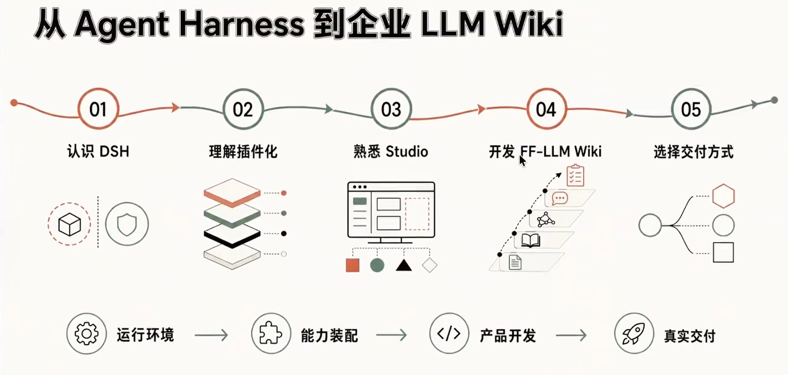

## 1. DeepSeek Harness 项目回顾

### 1.1 DeepSeek Harness 是什么？

DeepSeek Harness，简称 DSH，是 DeepSeek AI 开源的 Agent Harness。这里的 Harness 可以理解为“让大模型持续完成工作的运行环境”：模型负责理解、推理与生成，Harness负责把上下文、文件、工具、Skills、会话、权限、存储、任务循环和用户界面组织起来，使模型能够真正读取项目、调用工具、修改代码、运行命令，并把复杂任务推进到可检查的结果。

它和单纯的聊天产品有一个根本区别：聊天产品的终点往往是一段回答，Agent Harness 的终点则可以是一组真实文件、一次可复现构建、一套能够运行的应用，或者一个外部系统中已经发生的业务结果。

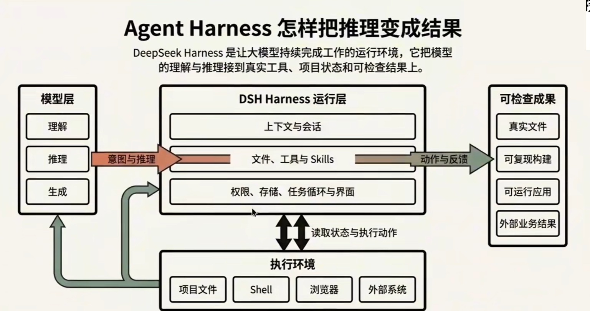

[Deepseek Harness 官网](https://www.deepseek.com/harness) 将 DSH 定义为 Developer Preview（开发者预览版），这意味着它已经公开源码并可以真实使用，但接口、插件合同与产品形态仍可能快速变化。

官方给出的快速启动命令是：

```bash
npx @deepseek-ai/dsh web
```

默认启动后可以访问 http://127.0.0.1:3080。如果需要阅读和修改完整源码，也可以从官方仓库克隆项目，使用 `pnpm` 安装、构建并启动。

截至 2026年10月3日，[DSH 官方仓库](https://github.com/deepseek-ai/deepseek-harness)约有 **24.3万Stars、2.91 万 Forks**，采用MITLicense。这个数字说明项目在发布后的极短时间内获得了高度集中的开发者关注；它不等于生产部署数量，但足以说明 Agent Harness 已经成为 DeepSeek 从“模型能力”继续走向 “Agent运行环境” 的重要一步。

### 1.2 理解一切皆插件

DeepSeek Harness 官方用一句话概括自己的架构：Everythingis a Plugin，**一切皆插件**。

这里的 “插件” 并不只是我们平时理解的侧边栏小工具。DSH 由Cordis 驱动，模型接入、工具、Skills、会话、沙箱、存储、循环、调度乃至界面，都可以被拆成边界明确的能力，再由运行时重新组合。于是，同一套 Harness 可以因为装配方式不同，变成代码开发 Agent、数据分析 Agent、内容生产Agent，也可以成为本次课程中的 LLM Wiki 全栈开发 Agent。

对初学者来说，可以先把 DSH 中最常见的四类对象分清：

| 对象 | 它解决什么问题 | 在本项目中怎样出现 |
| --- | --- | --- |
| **Agent Preset** | 从标准模式复制并定制出“LLM Wiki全栈工程师”，让每个开发阶段沿用同一套工程纪律 | 把角色、模型、工具、提示词段、Skills 来源和工作纪律组合成可重复选择的工作模式 |
| **Skill** | 把某一类任务的专业方法、步骤、检查点和验收方式交给 Agent | 资料中心、编译式Wiki、图谱数据、图谱可视化、问答、评估与交接分别读取对应 Skill |
| **Plugin** | 为 DSH 运行时增加原本不存在的工具、界面和确定性能力 | 开发过程中用 `dsh-diagram` 生成可编辑的架构图，用 `dsh-builtin-browser` 完成真实页面的验收 |
| **MCP** | 用统一协议把外部工具或业务系统连接给 Agent | 本项目核心开发不依赖额外 MCP；在其他任务中可用于接入数据库、浏览器或业务平台 | 

这四类对象不是同义词。Preset 决定“这次会话以什么方式工作”，SkilL 提供“遇到某类问题该怎样做”，Plugin 增加“运行时现在能调用什么能力”，MCP 则把“外部系统怎样接进来”标准化。

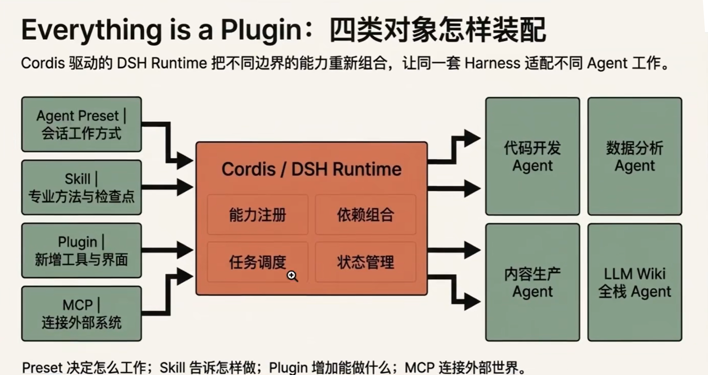


本次 LLM Wiki 开发正好能够看到这套插件化思想的完整落地：我们不会只发送一个大 Prompt 等待最终成品，而是先装配开发 Agent，再按阶段加载不同 Skill；需要可编辑架构图和真实浏览器时再调用对应 Plugin；产品完成后，又把同一套产品封装为可安装的 DSH 应用插件。

### 1.3 DeepSeek Harness发布至今进行了哪些更新

DeepSeek 于 2026 年 8 月13 日正式公开 DSH v0.1 Developer Preview。官方 npm 包在发布准备期和正式公开初期连续经过多个 RC 版本；截至 2026年8月19日，`@deepseek-ai/dsh` 的 latest 与 next 都指向 0.1.0-rc.7，官方主仓库也只发布了这一项正式 GitHub Release。

从公开版本的提交与 rc.7 发布说明看，发布后的更新主要集中在四条线上。

#### 1.3.1 插件与扩展面继续完善

- 插件现在可以注册自己的设置卡片，不必把所有配置挤进统一页面。
- Cordis 动态插件面板得到优化，插件提供的能力更容易被发现和管理。
- MCP与ACP增加持久化图片附件支持，PTC Mode可以继续转发嵌套图片。

这条更新线非常关键。它说明“一切皆插件”不是一句宣传语，而是在持续补齐插件从安装、配置到富媒体传递的完整使用链。

#### 1.3.2 多 Agent 与任务管理能力增强

- Codex 与 Claude Code 的子代理任务可以接入 Job Panel。
- 后台任务不再只是聊天记录中的一段文字，而是可以进入统一任务视图管理。

对复杂项目而言，这意味着 Harness 开始承担更明确的多任务编排与状态观察职责。一个主 Agent 可以拆出不同子任务，而用户仍能在产品界面中理解哪些任务正在推进。

#### 1.3.3 长会话、终端与跨平台问题集中修复

- 修复极简模式下持久 Bash 调用卡顿。
- 修复大量历史消息分页时可能出现的栈溢出。
- 修复输出达到 max-tokens 后会话无法继续的问题。
- 修复 Safari 输入框光标与文本错位。
- 升级 node-pty 1.2 beta，改善不同平台的 PTY 兼容性。

这些更新看起来不像“新增一个大功能”那么醒目，却直接决定Agent 能不能完成长时间开发任务。LLM Wiki 正是一个多阶段、长会话、频繁调用 Shell 和浏览器的项目，因此稳定的会话恢复、终端调用和历史记录不是细节，而是开发体验的地基。

#### 1.3.4 模型与交互体验继续细化

- DeepSeek 模型新增 `low` 推理强度，默认仍是 `high`。
- 英文内置预设中的 `Code mode` 更名为 `PTC mode`。
- 提问卡片支持折叠，并在收起后保留草稿。

完整更新可以查看 DeepSeek Harness v0.1.0-rc.7 官方发布说明。这里需要特别注意：上面统计的是 DeepSeek 官方 DSH 主仓库的版本线，不包含九天讲研所团队维护的 DeepSeek Harness Studio 桌面发行版本；Studio 是建立在 DSH之上的另一条产品线，将在下一部分单独介绍。

## 2. DeepSeek Harness Studio 使用方法介绍

我们可以去 [DSH Studio GitHub 仓库](https://github.com/fufankeji/deepseek-harness-studio) 下载 Deepseek Harness Studio 桌面端软件，开启后如下图所示。

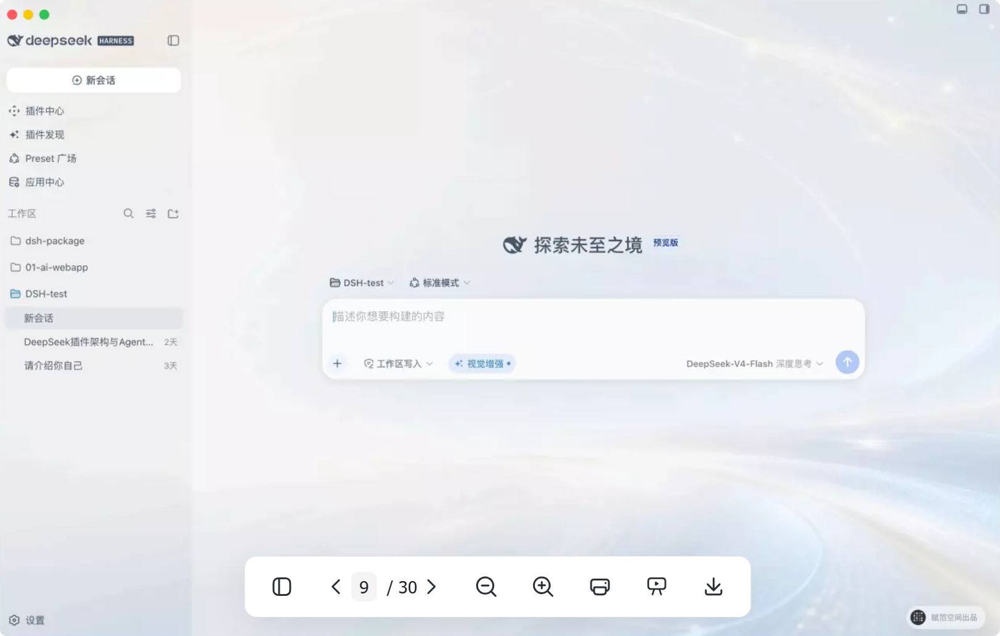

此外，我们还增加了视觉增强功能，使用阿里云百炼 `qwen3.8-max` 读取对话或工作区中的截图、照片、图表和图片文字，并把识别结果提供给 Agent。

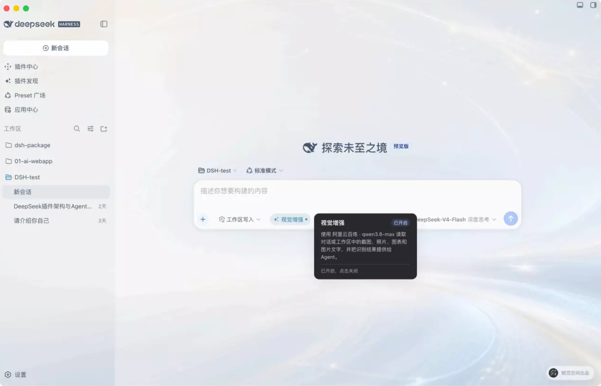
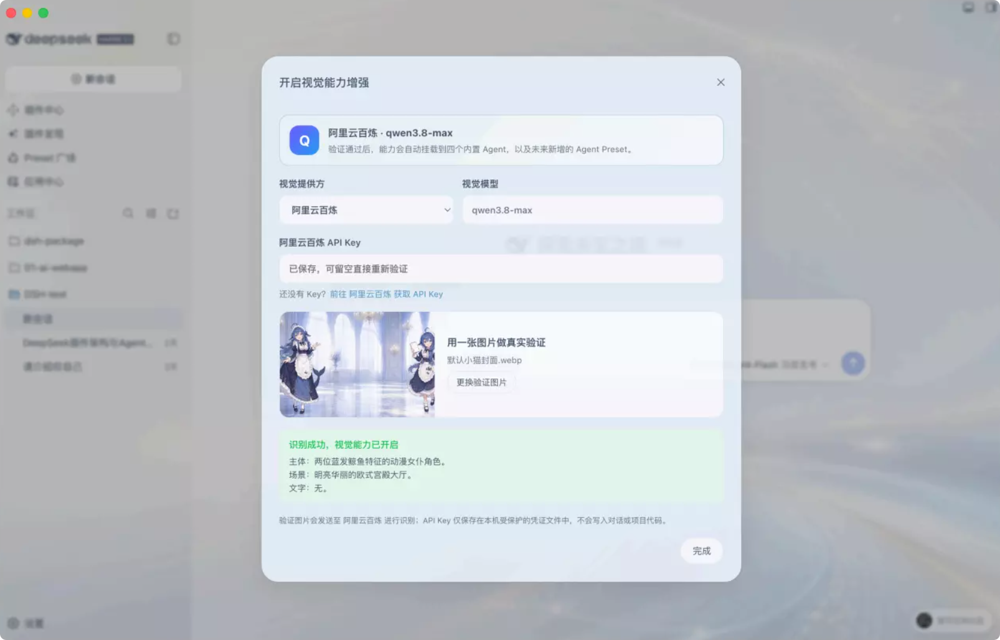
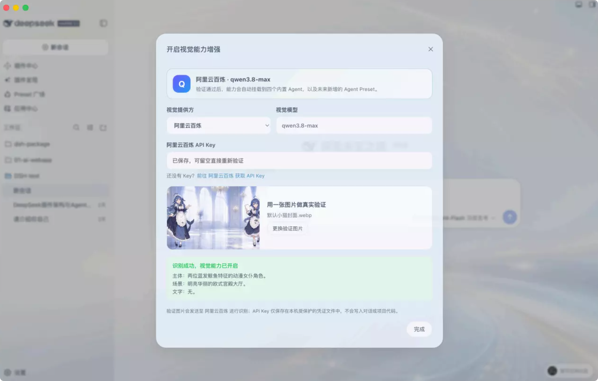
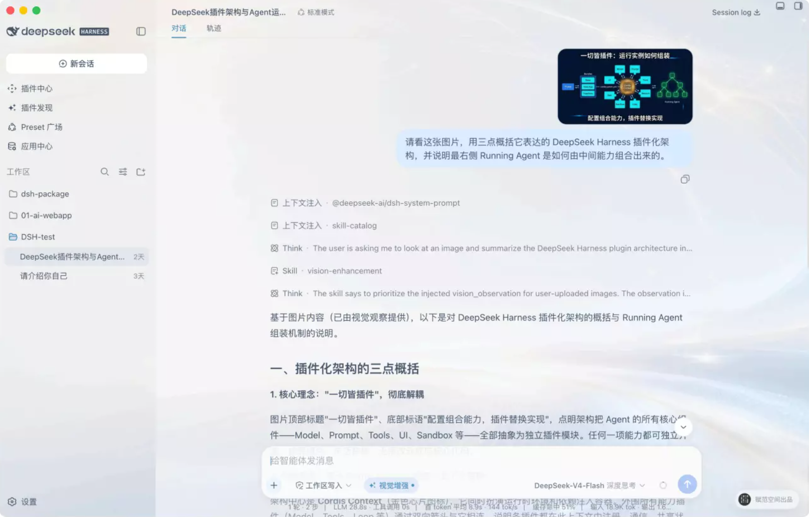

“插件中心” 允许我们查找已知名称的插件并进行安装，而“插件发现” 则可以根据想要的功能让智能体推荐相关的插件。

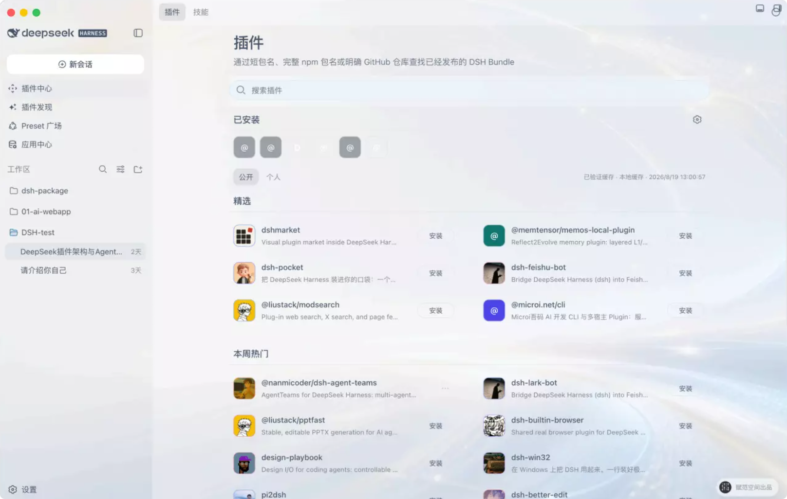
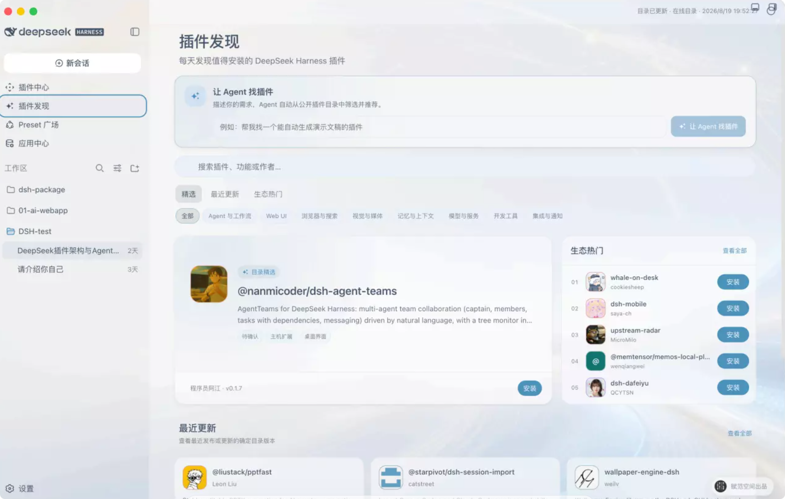

“Preset 广场” 是查找适合项目的 Agent Preset，安装后即可在新会话中进行使用。

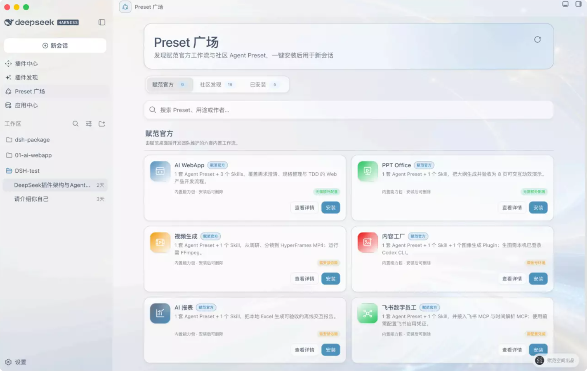

最终应用中心，支持我们发现并启动由赋范桌面端集成的完整 AI 应用。每一个应用拥有独立界面、数据与运行流程。

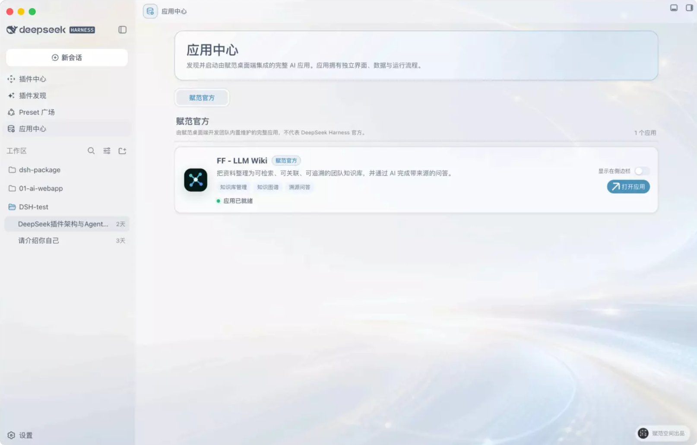

## 3. 本期公开课LLM Wiki项目开发流程与成果介绍

### 3.1 先看最终成品：FF-LLM Wiki企业知识库

本期公开课最终完成的不是一张“知识库效果图”，而是一套可以真实运行的全栈项目：**FF-LLM Wiki 企业知识库**。

它把企业资料转换成一条连续的知识生产与使用链：

1. 资料先进入可搜索、可筛选、可重试的处理流程；
2. 18份原始资料继续被确定性编译为 47 个 Wiki 知识页；
3. 知识页形成98条来源引用、99条语义互链和6个业务主题；图谱管道再抽取 75 个节点与 291 条边；问答系统从SQLite 中检索证据，由 DeepSeek 在证据约束下生成回答，并把正文引用与原文片段联动；
4. 最后使用 16 道固定题目、7个指标和可复现配置检查问答质量，当前总分为 93.4。

DSH Studio 官方仓库中约 60 秒的成片适合先建立整体感受：资料不再只是文件夹中的孤立文档，而是逐步变成可以浏览、关联、提问和检查的知识空间。

完整功能演示保留了DSH桌面端入口、资料提交与处理进度、知识图谱、模型连通验证、SSE流式问答和引用证据。后续课程会把这些结果逐阶段拆开，说明每一次 Prompt 到底新增了哪些代码和产品能力。

### 3.2 最终产品包含哪些真实功能

#### 3.2.1 知识工作台：一眼看见整条知识流水线

工作台同时展示 Wiki 页、来源引用、语义互链、业务主题、问答质量、资料处理进度和图谱概览。这里不是把几组统计数字硬编码到页面中，而是让用户知道当前知识资产已经走到哪一步，还有哪些环节正在处理。


#### 3.2.2 资料中心：管理输入，也管理失败

资料中心支持 PDF、DOCX、Markdown、TXT 等资料的导入、搜索、类型与主题筛选、分页、详情查看、删除和重新处理。处理中、待处理、完成与异常不是装饰标签，而是后端 SQLite 中可以继续推进和恢复的真实状态。


#### 3.2.3 Wiki知识库：把多份资料编译成同一知识对象

Wiki 不按原始文件逐篇照搬，而是按照统一规则把跨来源内容重新组织为概念、系统、手册和策略等知识页。页面能够同时展示知识要点、来源证据、关联页面和重新编译入口，用户可以沿着知识关系继续阅读，也可以随时回到原始依据。


#### 3.2.4 知识图谱：在同一份数据合同上浏览关系

知识图谱读取真实生成的 75 个节点和 291 条边，支持 G6聚类图与结构视图、节点搜索、类型与关系筛选、聚类复位、适配全图、节点详情和跳转 Wiki。它不是一张固定背景图，所有交互都围绕同一份图谱数据工作。


#### 3.2.5 Agent智能问答：回答和证据必须一起出现

问答页面采用三栏工作区：左侧管理会话，中间呈现SSE流式回答，右侧展示检索范围、命中片段、采用证据与置信信息。正文中的引用编号能够定位右侧证据卡，再从证据卡打开 Wiki 原文。证据不足时，系统会澄清或拒答；模型不可用时，也会明确进入本地可追溯降级，而不是伪造一次成功调用。

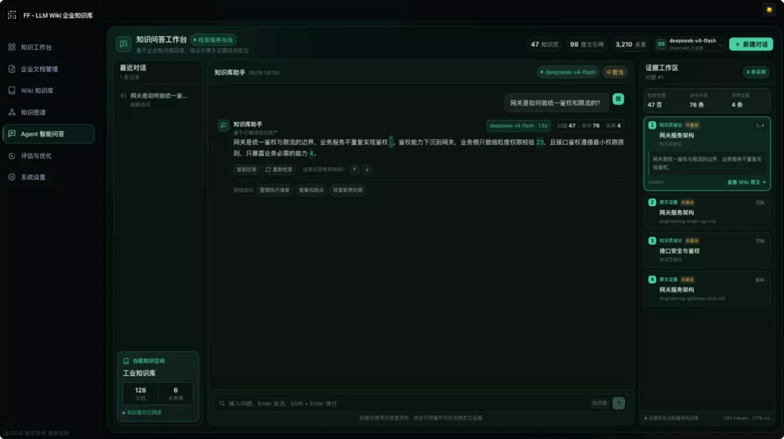

#### 3.2.6评估与优化：用固定题库观察改动是否真的有效

评估页面使用 16 道固定题目和 7 个指标，对同一问答链进行基线与优化后对比。当前记录中总分由 90.1 提升到 93.4，检索命中从 38 提升到 62，回归项为 0。页面还能展开每道题的证据、得分和失败原因，帮助开发者判断下一步应该改检索、改证据覆盖，还是保持现状。


### 3.3 完整开发流程：每个阶段都增加可运行成果

这个项目不是 “前面十个阶段都在准备资料，最后一个阶段才集中写代码”。真实过程是：先搭起能够运行的全栈骨架，随后资料中心、Wiki、图谱数据、图谱页面、问答和评估逐个加入同一个项目。每个开发阶段结束时，都有新增代码、测试结果、页面状态和独立检查点；后续阶段继续在上一个检查点上生长。

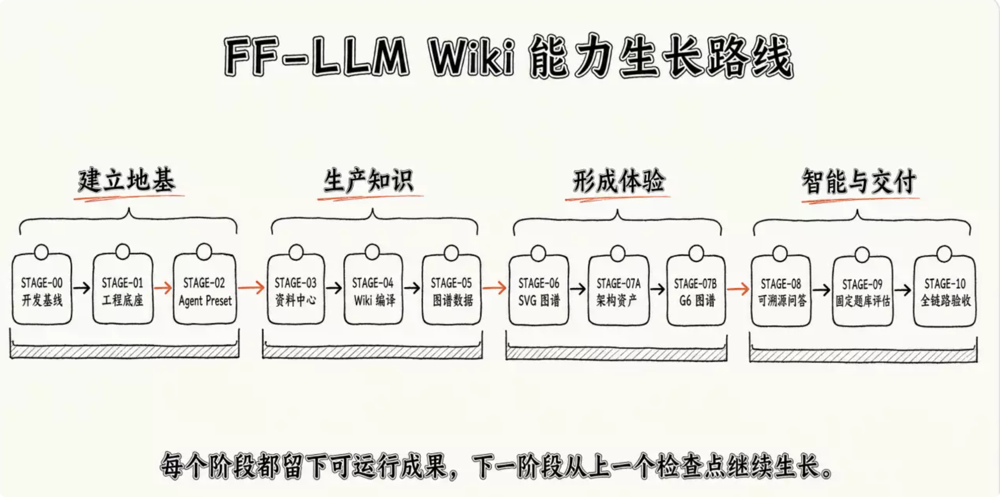


| 阶段 | 这一阶段真正完成什么 | 阶段结束时能看见什么 |
| --- | --- | --- |
| STAGE-01 | 固定Workspace、模型、权限与视觉能力 | 同一会话的开发基线已经就绪，但项目还没有源码 |
| STAGE-01 | 从空目录创建pnpm monorepo、Next.js Web、FastifyAPI与共享合同 | 首页、`/health`、`/api/overview` 和统一开发命令可以真实运行 |
| STAGE-02 | 从标准模式复制并定制 “LLM Wiki全栈工程师” Preset | 后续会话可以重复选择同一套角色、工具、Skill发现与验证纪律；这一阶段不改产品代码 |
| STAGE-03 | 开发资料中心的前端、API、SQLite 状态与操作闭环 | 用户可以搜索、筛选、分页、导入、查看、重新处理并观察异常状态 |
| STAGE-04 | 开发三层内容结构与确定性 Wiki 编译器 | 18份原始资料可以重复编译为47个知识页，并保留引用、互链与编译记录 |
| STAGE-05 | 开发图谱抽取管道、数据合同、API与检查器 | 真实得到75个节点、291条边，无孤儿边、无自环，并可重复生成 |
| STAGE-06 | 开发第一版原生 SVG 图谱 | 节点边数据第一次变成可搜索、可筛选、可点击、可回到 Wiki 的页面 |
| STAGE-07 | 安装并调用 `dsh-diagram`,生成可编辑系统架构资产 | 得到PNG、SVG与Excalidraw架构图；这一阶段交付沟通资产，不改产品源码 |
| STAGE-08 | 读取可视化Skill，在同一数据合同上升级图谱体验 | G6聚类图、结构视图、图例、搜索、筛选、详情和跳转形成正式产品体验 |
| STAGE-09 | 开发 SQLite 证据检索、DeepSeek受约束生成、SSE流与引用联动 | 用户能够提问、观看流式回答、定位证据、打开原文，并看见澄清、拒答与降级 |
| STAGE-10 | 开发固定题库、七维评估、基线／优化对比和回归门 | 每次问答优化都能用同一套条件重放，最终形成 93.4 分的可复现结果 |
| STAGE-11 | 使用真实浏览器完成全链路验收，并补齐README与接手文档 | 六个核心页面、测试、类型检查、生产构建、截图和恢复方法形成最终交付状态 |

下面这张图是 STAGE-07 生成的真实架构资产，记录了项目当时已经成立的资料层、编译层、图谱层和应用层。图中问答仍标注为本地演示；到 STAGE-09，项目才继续接入 DeepSeek 生成式回答与引用联动。把这两个时刻放在一起，正好能看出产品是怎样逐层成长的。

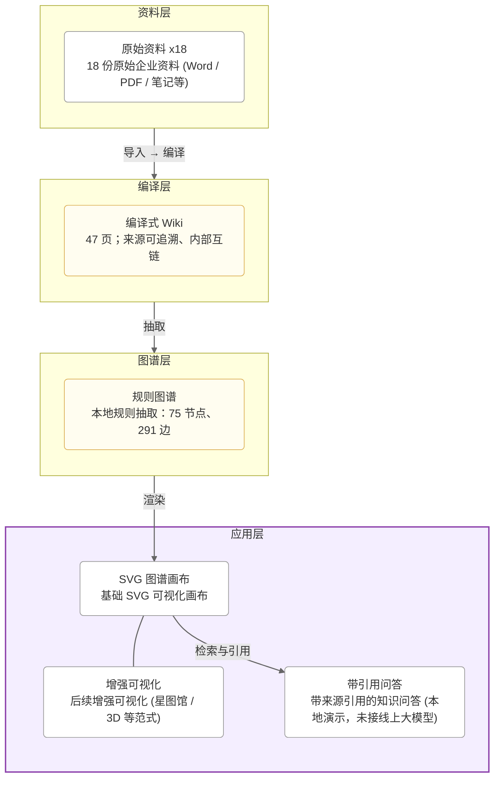

#### 3.3.1 真实开发不是一条“永远成功”的直线

每个阶段都遵循相似的开发节奏：发送完整主 Prompt，Agent 读取指定 Skill 和现有代码，先列任务再实施；随后运行最窄测试、类型检查、构建和页面验收；如果结果暴露真实问题，就发送纠偏 Prompt，在同一阶段修复后再固化检查点。


后续每个 STAGE 章节都会沿用这个结构展开：先说明它承接了什么现状，再完整给出使用的 Skill 与 Prompt，随后讲清新增代码、真实运行过程、失败与纠偏、页面结果和阶段检查点。这样学员看到的不只是最终代码，而是一个复杂产品怎样被 Agent 逐步开发出来。

### 3.4 最终知识库有三种使用方式

FF-LLM Wiki 的产品本体是独立的全栈应用，DSH 插件只是其中一种分发和启动方式。因此，完成项目后可以根据使用环境选择三条路径。

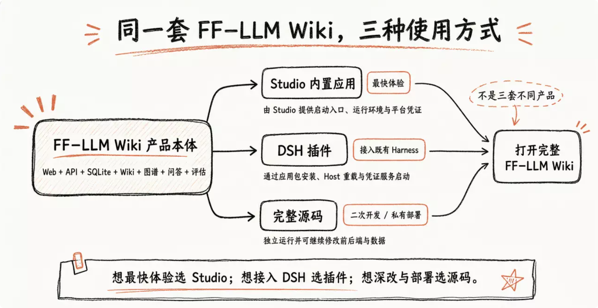


#### 3.4.1 在DeepSeek Harness Studio中直接使用

团队自研的 DeepSeek Harness Studio 已经把 FF-LLM Wiki 作为内置 AI应用接入 “应用中心”。这条路径不需要学员再手动解压源码或安装 LLM Wiki 插件。

使用流程如下：
1. 启动 DeepSeek Harness Studio。
2. 在左侧进入“应用中心”。
3. 找到 `FF-LLM Wiki`，确认卡片显示 “应用已就绪”。
4. 点击 “打开应用”，系统浏览器会打开完整知识库。
5. 如果经常使用，可以开启 “显示在侧边栏”，以后直接从左侧快捷入口启动。

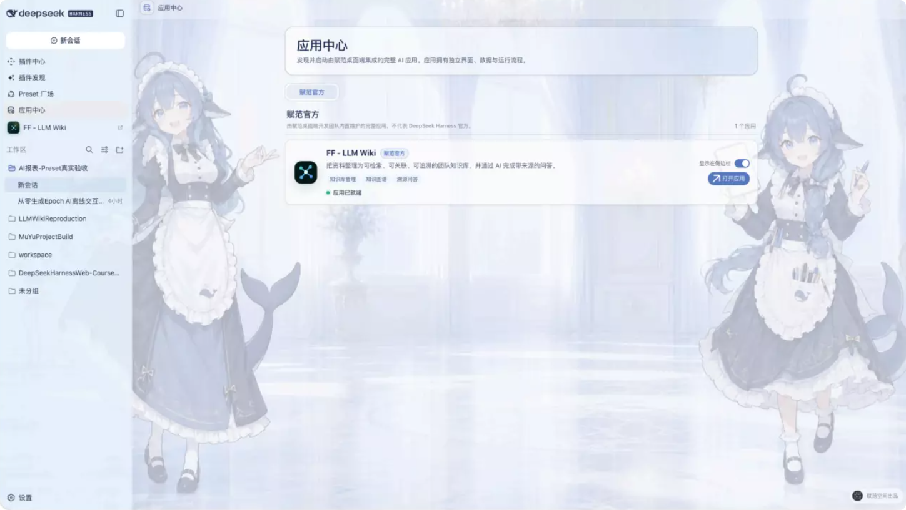

Studio 负责启动入口、运行环境和平台凭证，FF-LLM Wiki 仍负责自己的页面、API、SQLite数据、资料处理、Wiki、图谱、问答和评估。点击 “打开应用”后，DSH主界面不会被替换，完整产品会在系统浏览器中独立打开。


#### 3.4.2 作为DSH插件安装

如果使用的是支持本地插件安装的其他 DSH Desktop 环境，可以安装课程提供的
`@fufan/dsh-plugin-11m-wiki@1.1.2`。它不是另一套重新开发的知识库，而是把同一份 `FF-LLM Wiki`产品封装成 DSH 可以安装、启动和托管凭证的应用包。

课程资料中的安装包位于：下载或定位 fufan-dsh-plugin-1lm-wiki-1.1.2.tgz

完整安装流程如下：

1. 打开 DSH Desktop 的“插件中心”。
2. 选择本地安装，定位课程资料中的 fufan-dsh-plugin-1lm-wiki-1.1.2.tgz。
3. 核对包名与版本，阅读权限和社区插件风险提示，再确认安装。
4. 安装完成后，按照客户端提示重启或重新加载 Host。只显示 Installed、没有Loaded 时，不要继续运行应用，先完成 Host 重载。
5. 打开 DSH 左下角“设置”并进入“模型”，配置DEEPSEEK_API_KEY。密钥由 DSH 凭证中心托管，不需要再写入插件包或浏览器页面。
6. 回到“应用中心”，确认 FF - LLM Wiki 显示“应用已就绪”。
7. 点击“打开应用”，或者开启“显示在侧边栏”后从快捷入口启动。

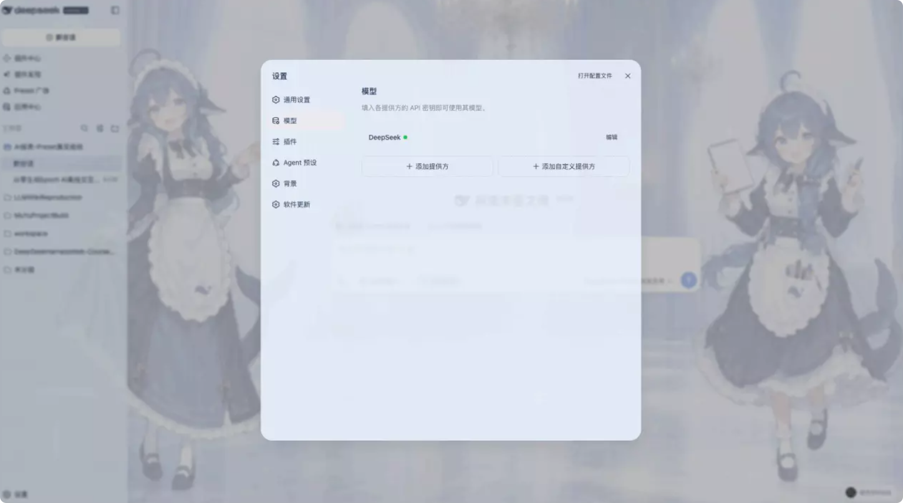

插件启动时会通过 DSH 的 `credentials` 服务读取同一个 `DEEPSEEK_API_KEY` 引用，只把密钥注入 FF-LLM Wiki 的服务端进程。应用设置页显示的是脱敏状态，并可以执行一次最小真实模型验证。


插件版的数据保存在 DSH Home 下的 `plugins/ff-llm-wiki/application/` 专属目录。卸载插件不会修改 DSH 原有产品代码；需要保留业务数据时，应先按实际使用环境完成备份，再执行卸载。

#### 3.4.3 使用完整源码独立部署

如果不需要 DSH 入口，或者希望继续修改前后端、接入自己的数据与部署环境，可以直接使用完整源码。课程资料同时提供可阅读目录和独立ZIP:

- 完整源码目录说明
- FF-LLM Wiki学员源码包

运行环境需要Node.js 24或更高版本，以及 pnpm 11.22.0。解压后进入项目根目录：

```bash
cd FF-LLM-Wiki
corepack enable
pnpm install --frozen-lockfile
pnpm dev
```

启动成功后打开：

- Web知识工作台：http://localhost:3000
- API健康检查：http://localhost:4000/health

真实 DeepSeek 生成与模型验证需要在服务端配置 `DEEPSEEK_API_KEY`；不配置模型密钥时，资料、Wiki、图谱、评估以及本地可追溯降级结果仍然可以运行。源码包不会携带真实密钥、运行数据库或私人数据。

准备部署或继续开发之前，可以运行项目已经保留的四组验收命令：

```bash
pnpm test
pnpm typecheck
pnpm build
pnpm eval:qa
```

源码包的独立解压验收结果为：49／49测试通过、全 workspace 类型检查通过、production build 通过，评估链可以重放。默认端口被占用时，需要同时修改API的`PORT` 和 Web 的 `NEXT_PUBLIC_API_URL`，两者必须指向同一个 API 地址。

<div class="grid cards" markdown>

///caption
源码独立运行后可以继续查看资料详情、处理状态与操作入口
///


///caption
服务端配置模型凭证后，可以在设置页选择模型并完成真实连通验证
///
</div>

三种方式最终打开的是同一套 FF-LLM Wiki 产品能力，但适合的目标不同：Studio 内置应用适合最快体验；DSH 插件适合把成品接入既有 Harness 环境；完整源码适合二次开发、私有部署和继续扩展。后续课程的重点，就是从空目录开始，把这套产品按照真实历史顺序一层层开发出来。
