# 第二章：LLM Wiki 从原始文档到可追溯知识层

## 1. LLM Wiki的产生背景与工作定义

前两场课程已经建立了 DeepSeek Harness Studio、Workspace、Session、Agent Preset、Skills 与 Plugin/MCP 的基础操作和对象区别。进入 LLM Wiki 后，“知识库” 在实际项目中经常指向完全不同的对象：一个集中存放文件的目录、一套带全文搜索的文档站、一条先检索再回答的 RAG 链路，或者由实体和关系组成的知识图谱。它们都能帮助用户使用知识，却分别解决保存、查询、关系表达等不同问题。LLM Wiki 关注的是另一个容易被忽略的环节：原始资料已经存在之后，怎样把散落在不同文档中的知识持续整理为可以反复读取、彼此连接并回查依据的主题知识层。

这里的 “LLM Wiki” 是本课采用的工作定义，不是已经形成统一规范的行业术语。判断一个系统是否符合这个定义，应当观察它怎样处理来源、页面、规则、链接、查询和维护，而不能只看产品名称、页面外观或是否带有聊天框。

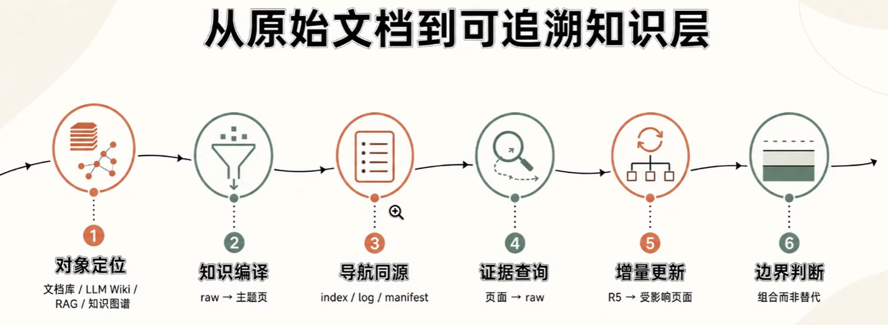

### 1.1 从查询时组织到持久知识层

2020 年的检索增强生成(Retrieval-Augmented Generation，RAG) 原始论文把参数化生成模型与显式的非参数记忆结合起来：系统在回答知识密集型问题时检索外部内容，再利用命中的内容生成结果。论文中的具体实现使用 WikiPedia 稠密向量索引，但它承担的核心职责是查询时取证并辅助生成，不等于规定了 2026 年所有 RAG 系统都必须采用同一种向量索引。

RAG 解决了“回答之前到哪里找证据”的问题，却没有天然规定“多次查询之间怎样保存已经形成的主题理解”。如果一个团队的资料分散在产品说明、设计记录、运维手册和故障复盘中，同一个概念可能在四份文档里各出现一部分。每次提问都可以重新搜索这些文件，但跨来源得到的主题结论通常只停留在当次回答中；下一次遇到相近问题，系统还要重新定位、阅读和组合来源。

2026年4月4日，Andrej Karpathy 发布的 [`LLM Wiki`](https://gist.github.com/karpathy/442a6bf555914893e9891c11519de94f) idea file 把另一种做法描述为一个 pattern：在原始来源与用户之间维护一层持久、互链的 Wiki，使已经整理出的知识不必在每次查询时从头派生。该文件还区分了 raw sources(原始来源)、Wiki与schema(结构和工作流规则)，并以 ingest(纳入来源)、query(查询)、lint(检查)等操作说明来源进入、知识读取与持续维护的职责。原件同时强调它表达的是一种模式，而不是特定实现；向量检索、MCP、具体目录和输出形式均可按需要选择。

图中是 Andrej Karpathy 公开的 llm-wiki.md ideafile 原件，不是标准规范。原件写道："incrementally builds and maintains a persistent wiki"。这支持持久、互链和增量维护的模式；不能据此推出 LLM Wiki 已有统一标准，也不能把它与 LLM Council 联系起来。

2026年5月提交的论文 [Retrieval as Reasoning: Self-Evolving Agent-Native Retrieval via LLM-Wiki](https://arxiv.org/abs/2605.25480) 则给出了—个具体研究系统：文档被整理为带双向链接的结构化 Wiki 页面，智能体通过 `search`、`read`、`follow-link` 等接口执行多步检索。它说明持久化的主题知识组织可以服务智能体检索已经有明确的系统化研究实例，但不能据此认定该论文与前述 ideafile 属于同一实现或存在已证实的直接影响关系。


2026年论文 Retrieval as Reasoning: Self-Evolving Agent-Native Retrieval via LLM-Wiki 摘要将其研究对象表述为:"external knowledge as a compilable composable, and self-evolving sururture"。这支持持久化知识结构服务智能体检索已有特定论文实现；不能证明它与 Karpathy 的 ideafile 同也不能把论文中的 Error Book、双向链专或工具楼口规定力通用标准。

这条发展线并不是“文档搜索先被 RAG 淘汰，RAG 又被 LLM Wiki 淘太”的营代史。更准确的理解是：又档保存、查询时险家构化关系表达E持久王题重组逐步形成了可以组合的不同层一个完整系统完全可以同时保留原始文档、维护主题WikI、建立图结构，并债用RAG回答问题


### 1.2 本课采用的 LLM Wiki 工作定义

在本课中，LLM Wiki指：**由 LLM 或智能体按照明确规则，把只读来源重组为持久、可互链、可回溯并能继续维护的主题知识层；查询优先读取这层知识，并在需要核验时回查原始来源**。

这个定义包含五项承重特征:

1. **来源与派生知识分离**：原始资料保存作者的原始叙事和事实上下文，不能为了方便整理而被知识页面覆盖。Wiki 页面是从来源形成的派生产物，可以重建、修订和更新。
2. **知识按主题持久化**：页面围绕概念、系统、操作或策略等主题组织，而不是机械地对每篇文档各写一份摘要。同一页面可以综合多篇来源，同一来源也可以支持多个主题页面。
3. **结论可以回查依据**：来源引用回答“这条结论依据什么”。引用必须能回到真实原件；页面存在、文字流畅或模型自称已核验，都不能替代这一关系。
4. **页面之间存在可用连接**：内部链接回答 “理解当前主题后还应读什么”。链接用于扩展上下文和形成导航，但链接数量本身不代表知识质量，也不能自动把 Wiki 变成完整知识图谱。
5. **知识层具有维护机制**：新来源进入后，系统需要识别受影响页面，处理陈旧、冲突、缺链和孤立页面，并保留变化记录。所谓 “持久” 不是内容写入后永久正确，而是知识有明确位置，可以持续检查和修订。

这五项特征描述的是知识层的职责，不是固定技术栈。Markdown、特定页面元数据头、固定页面类型、机器清单、浏览器界面、向量数据库和知识图谱都可以成为某个实现的一部分，却不是所有 LLM Wiki 必须具备的统一组件。本课后续出现的目录名、页面数量和浏览方式，也只是为了把这些职责放进一个可观察的小型实例。

### 1.3 六类对象怎样组成知识链

LLM Wiki 的核心并不是一批页面，而是一条能够从结论返回依据、从当前主题继续扩展、从新来源触发维护的对象链。

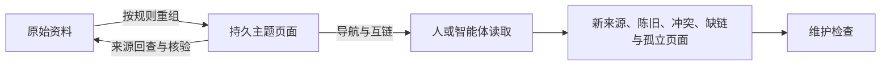
```mermaid
flowchart LR
    A["原始资料"] -->|"按规则重组"| B["持久主题页面"]
    B -->|"导航与互链"| C["人或智能体读取"]
    C --> D["新来源、陈旧、冲突、缺链与孤立页面"]
    D --> E["维护检查"]
    B --> |"来源回查与核验"| A
```

这条链中的对象分别承担以下职责：

| 对象 | 主要职责 | 不能由什么信号替代 |
| --- | --- | --- |
| 原始资料 | 保存原始事实、上下文、版本和出处，是后续结论的事实入口 |文件已经被模型读过，不代表其中事实正确或已经形成知识层 | 
| 主题页面 | 把跨文档信息重组为可反复读取的概念、系统、操作或策略知识 |一文一摘要或把原文切成小文件，不等于完成主题重组 |
| 规则层 | 约束页面结构、引用方式、链接方式、证据不足处理和更新责任 | 有一份规则文件，不代表规则已经被执行 |
| 来源引用与内部互链 | 分别提供事实回查和上下文扩展 | 链接多、页面多或界面精美，不代表结论可靠 |
| 导航、维护记录与机器清单 | 让人找到页面，让维护者看见变化，让程序稳定读取当前知识对象 | 统计一致只能说明对象对得上，不能自动证明内容正确 |
| 查询与维护动作 | 一个最终答案或一次成功运行，不能证明查询过程有依据 | 定位页面、沿链接补充、必要时回查来源，并检查冲突、陈旧和孤立知识 |

例如，一个关于 DSH Agent Preset 的主题页，可以同时引用 Workspace、Preset、Skills、Plugin/MCP 和权限资料；它又可以链接到能力分层、团队委派和凭证边界等相关页面。来源引用保留事实依据，内部互链提供阅读路径，页面本身保存跨来源形成的主题理解。三者缺少任意一项，系统都会退化：没有来源，结论难以核验；没有主题重组，只剩文件索引；没有维护，持久页面会逐渐变成过期副本。

对象地图在这里暂时只说明“持久主题重组”要承担什么职责：主题对象应当脱离单篇文档的章节顺序，同时保留来源关系和后续维护入口。原文片段究竟怎样进入第一个页面，跨来源内容又怎样形成一个共同主题，仍需要到真实文件中逐项回答，不能由这张对象地图预先给出完成结论。

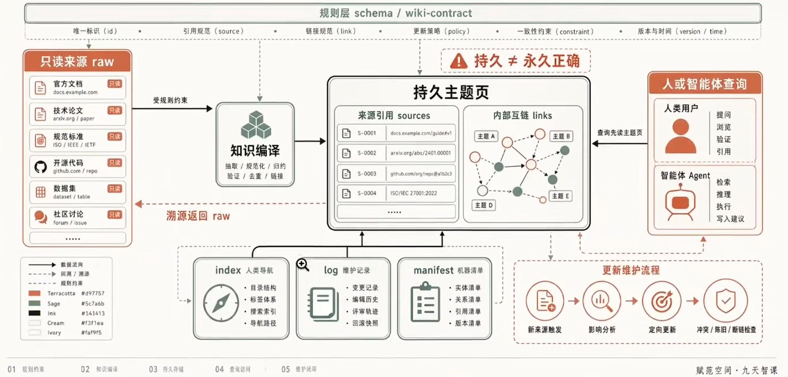
///caption
LLM Wiki的可追溯知识链
///

### 1.4 文档库、RAG与知识图谱的位置

文档库、LLM Wiki、RAG 和知识图谱不是四个只能选择其一的产品类别，而是可以叠加的职责层。

- **文档库提供原料**：核心产物是原始文件及其目录、元数据和版本。它擅长保存原件，也可以提供全文搜索；但“能够搜索文件”不代表跨来源主题知识已经形成。
- **LLM Wiki组织持久知识**：核心产物是主题页、来源引用、内部互链和维护记录。它把资料进入后的持久主题重组放在查询复用之前，减少相近问题反复从原始叙事中重新组织主题的需要。
- **RAG提供查询机制**：核心动作是先检索证据，再用证据增强生成。检索对象既可以是原始文档，也可以是Wiki页面或其他索引；是否使用LLMWiki，不由“有没有聊天框”决定。
- **知识图谱提供显式关系表示**：核心产物是带明确语义的节点、边及其派生结构。Wiki 页面和内部链接可以投影成图，但普通页面链接并不自动具备实体类型、关系语义、消歧和图查询合同。

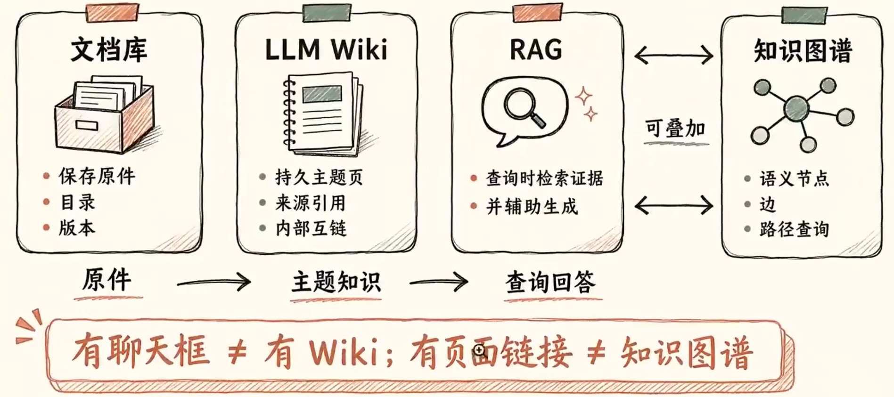
///caption
LLM Wiki的可追溯知识链
///

图中是 2020年原始 [RAG 论文](https://arxiv.org/abs/2005.11401)的 arXiv 标题与摘要页。摘要把论文方法表述为：“combine pre-trained parametric and non-parametric memory for language generation"，这支持把 RAG 定位为检索增强生成机制；论文实例使用 WikiPedia 稠密向量索引，但不能推出所有 RAG 都必须使用同一种向量库。

[Microsoft GraphRAG](https://microsoft.github.io/graphrag) 是这种可组合关系的具体例子。其官方流程会从 raw text 形成实体、关系、社区和社区报告，再以Local、Global、DRIFT 等方式查询；Local Search 还可以同时使用图数据与原始文本片段。GraphRAG 因而是一种利用图结构增强检索与生成的具体系统，不是所有知识图谱的同义词，也不是 LLM Wiki 的替代名称。

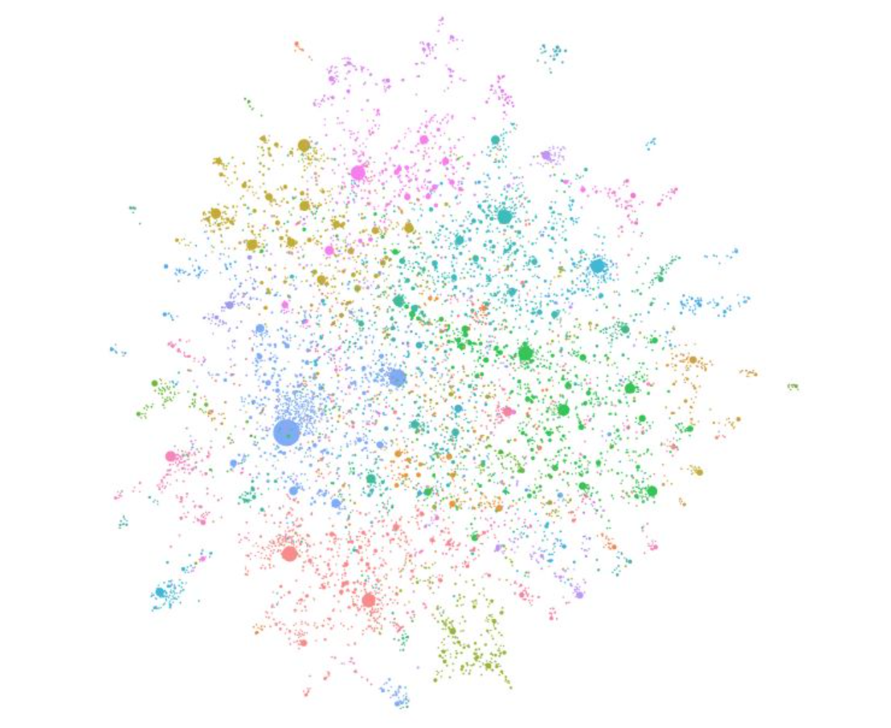
///caption
An LLM-generated knowledge graph built using GPT-4 Turbo.
///


图中是 Microsoft GraphRAG 官方文档主页内容，画面直接显示知识图谱和过程说明。官方将 GraphRAG 称为：“structured,hierarchical approach to Retrieval Augmented Generation (RAG)"，这支持 GraphRAG 从原始文本抽取图、构建社区层级与摘要，再把这些结构用于RAG；不能把Markdown 互链直接等同知识图谱，也不能把 GraphRAG 当作所有知识图谱的定义。

面对一个新系统时，可以用三个问题先确定各对象的位置：**事实原件保存在哪里；跨来源主题知识是否在查询之外被持续保存；一次回答怎样找到证据并回到原件**。如果系统还显式维护实体与关系，再继续检查图结构由什么抽取、怎样更新、支持什么查询。这样的判断不依赖产品命名，也不会把浏览界面、检索算法和知识组织层混为一谈。

### 1.5 价值、适用条件与停止边界

LLM Wiki 的主要价值来自知识的持续复用，而不是页面形式本身。

- **减少重复理解**：稳定的主题页让后续查询先读取已经形成的知识，再按需要回查来源，而不必每次从多篇作者叙事重新开始。
- **支持跨来源重组**：产品规则、实现说明、故障记录和安全边界可以围绕同一主题汇合，同时保留各自依据。
- **兼顾人和智能体阅读**：人可以沿导航和链接建立系统认识，智能体可以读取结构化页面、来源和机器入口继续执行任务。
- **保留可追溯性**：结论可以回到原始资料，新增证据也能定位受影响页面，使知识更新具有可检查对象。
- **形成渐进维护入口**：冲突、陈旧、缺链和孤立页面可以被持续发现，而不是散落在一次性回答中。

这些价值成立需要相应条件。语料通常包含多份有交叉关系的资料；同一批知识会被团队反复查询、解释或用于后续任务；来源能够保留版本并允许引用；主题结构具有一定稳定性；同时还需要明确的规则和维护责任。团队知识、长期项目文档、持续研究资料、客服知识和运维经验通常具备这些特征。

如果任务只是查询单篇短文中的一个事实，或者资料只使用一次，额外维护主题层的成本可能高于收益。资料变化极快却没有维护责任、来源无法保存版本、权限不允许建立派生知识，或者系统只需要确定性字段查询时，也不应因为名称新颖而强行引入 LLM Wiki。

LLMWiki还不能自动解决来源错误、事实冲突、知识过期、权限治理和回答幻觉。它不会因为使用LLM就自然获得正确性，也不会因为具有互链就自动成为知识图谱，更不会因为可被查询就自动具备高质量RAG。大规模切分、Embedding、向量数据库、召回与重排、实体抽取、社区聚类、自动冲突消解、多租户、审计、容灾和评估，均属于需要单独设计和验证的工程能力。


因此，判断 LLM Wiki 是否成立，最小标准不是 “生成了多少页”，而是 **原件是否保留，主题知识是否持久，结论能否回查，页面能否扩展，新增证据是否有维护入口**。下一步将把这套关系放进四篇内容交叉的 DSH 原始资料中：先保留只有原始资料时的查询基线，再观察主题页面怎样在不改写原件的前提下形成。到那时，工作定义才会从对象地图进入真实文件。

## 2. 从原始资料到主题知识页

前一部分已经把原始资料、持久知识页、来源引用和内部互链放到了各自的位置。现在需要观察这组对象怎样在真实资料中形成。起点不是空目录，而是 `content/raw/` 中四篇已经可以搜索、也足以支持临时问答的DSH技术资料。问题恰恰在这里：**能搜索到原文，不等于已经形成可以反复读取的主题知识层**。

### 2.1 四篇 raw 保存的是来源原件

隔离 Workspace 的 `content/raw/` 中有四篇 Markdown:

| 来源 | 原文的主要叙事 | 与其他来源交叉的主题 |
| --- | --- | --- |
| `R1-dsh-workspace-session.md` | Workspace、Session `cwd`、持久历史与文件可见范围 | Preset 在 Session 中生效、权限边界、交付证据 |
| `R2-dsh-agent-preset.md` | Agent Preset 的 composition、生效时机与失败恢复 | Skill、Plugin/MCP、Subagent、Host 权限 |
| `R3-dsh-skills-plugins-mcp.md` | Skill、Plugin 与 MCP 的职责和各自成功信号 | Preset 装配、凭证、工具验收 |
| `R4-dsh-team-security-credentials.md` | 父子 Agent 委派、Session 权限与凭证消费 | Preset、Plugin/MCP、Workspace 可见范围、交付验收 |

这四篇资料都有完整标题、事实时间、运行版本和结论边界。例如 R1 解释Workspace 是对既有目录的持久登记，而 Session 是带 `cwd`、装配、权限和事件历史的运行对象；R2 解释 Preset 怎样组合角色、规则、Skill 与工具；R3 区分方法层、运行时装配和外部工具连接；R4 把委派、权限和凭证放在同一套有效边界中。它们不是为了 Wiki 临时拼出的短句，而是可以独立阅读的来源原件。

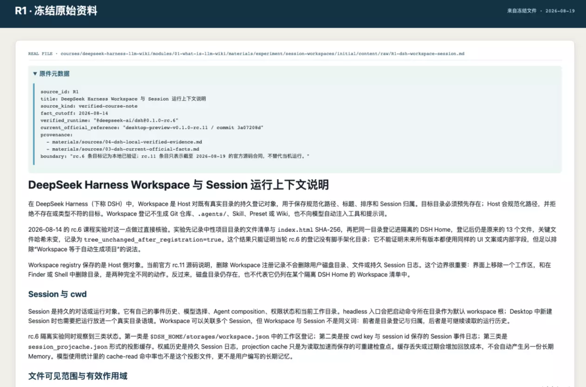
///caption
R1冻结Markdown的确定性排版渲染
///
R1 冻结 Markdown 的确定性排版渲染，不是编辑器或 DSH 原生界面。画面同时保留 `fact_cutoff`、运行版本、证据边界与正文开头；应观察 “Workspace 是 Host 对既有真实目录的持久登记对象” 以及登记不会生成 Git 仓库、Skill、Preset 或 Wiki。rc.6条目来自本地验证，rc.11 条目只表示截至2026-08-19的官方源码合同。


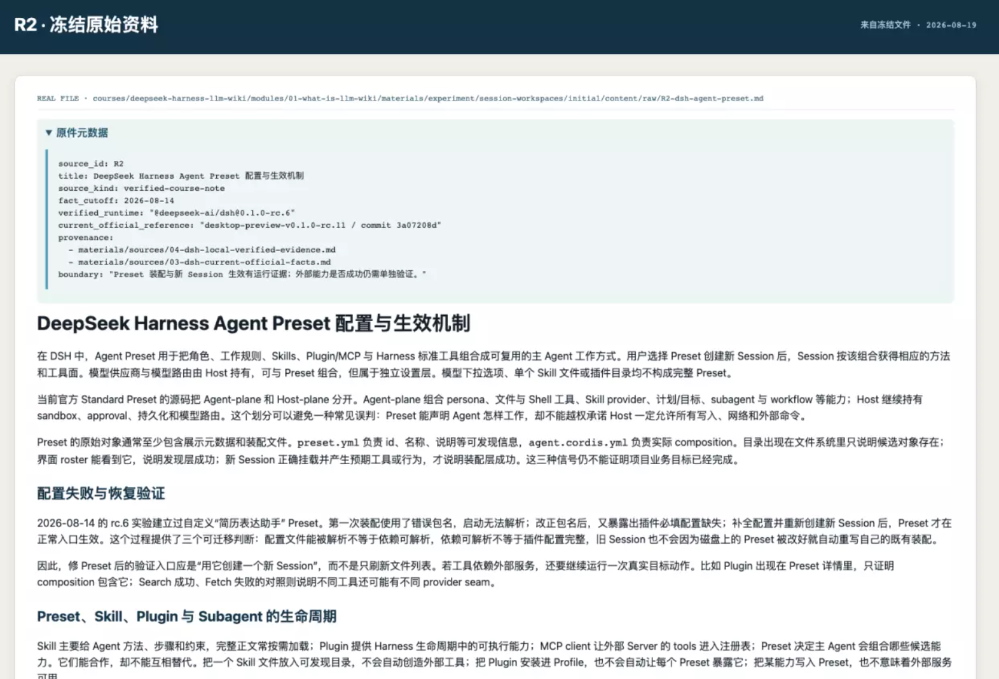
///caption
R2冻结Markdown的确定性排版渲染
///

R2 冻结 Markdown 的确定性排版渲染，不是原生配置界面。正文开头明确显示 Preset 把角色、工作规则、Skills、Plugin/MCP与标准工具组合成可复用的主 Agent 工作方式。Preset 装配和新 Session 生效有运行依据，仍不能由此推出外部能力已经完成真实调用。

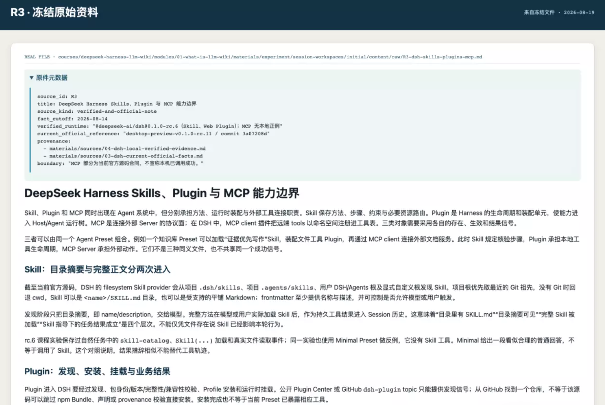
///caption
R3冻结Markdown的确定性排版渲染
///
R3 冻结 Markdown 的确定性排版渲染，不是 Plugin Center 或 MCP 客户端界面。可见原文分别把 Skill 定位为方法层、Plugin 定位为 Harness 生命周期与装配单元、MCP 定位为外部 Server 的协议面。MCP 部分只有当前官方源码合同支撑，不能从这张图推出本机 MCP 已调用成功。

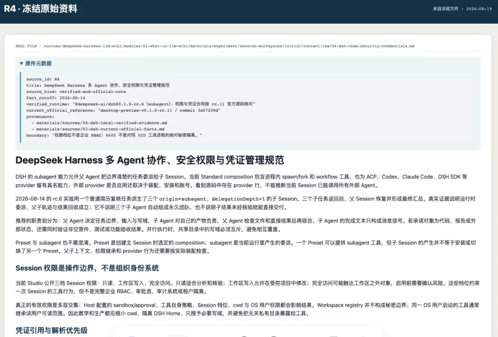
///caption
R4冻结Markdown的确定性排版渲染
///
R4 冻结 Markdown 的确定性排版渲染，不是团队管理或权限后台。正文开头说明 subagent 允许父 Agent 将边界清楚的任务委派给子 Session，并进一步区分 Session 操作权限与组织身份系统。权限档位不是企业 RBAC，`0600` 也不代表同 UID 工具进程绝对无法读取凭证。

原件的组织方式服从各自作者的叙事，因此同一问题往往分散在多篇文件中。“Preset 何时真正生效” 主要在 R2，但 Session 的上下文来自 R1，Skill 与 Plugin 的生命周期来自 R3，Host 和权限限制又来自 R4。反过来，R2 也不只服务 Preset 页面，它还会支持Skill、Plugin、委派和交付判断等多个主题。这已经埋下了一个重要关系：来源与主题页不会是一一对应。

打开该目录时，四个文件的权限位均显示为只读：

```bash
-r--r--r--  R1-dsh-workspace-session.md
-r--r--r--  R2-dsh-agent-preset.md
-r--r--r--  R3-dsh-skills-plugins-mcp.md
-r--r--r--  R4-dsh-team-security-credentials.md
```

这里的 `raw` 表示 “作为依据保存的来源原件”，不是 “格式混乱、可以随手清洗覆盖的临时文件”。主题页可以修订和重建，R1-R4 不因页面措辞变化而被反向改写。页面如果出现问题，应修改页面规格或派生页；原文事实需要更新时，则应新增有身份和时间边界的来源。只有保留这条分界，页面中的结论才有稳定的回查对象。

### 2.2 先保存只有raw时的查询基线

在主题页形成之前，先向只有R1-R4的Workspace提出一个固定问题。这样做不是为了预先证明raw一定更慢、更差或更贵，而是为了保存“查询时临时组织原文”的真实状态，稍后才能与持久页面的读取方式作同口径比较。

!!! question "提问"
    
    这次提问来自官方 DSH CLI0.1.0-rc.7 的新 Session，不是 Studio rc.11 Desktop 画面。输入原文如下：

    请只依据当前 Workspace 的 `content/raw/` 回答：Plugin、Agent Preset 与完整 AI 应用分别是什么？运行 FF-LLM Wiki 是否所有步骤都需要 DeepSeek API Key？请先搜索相关文件，再打开实际使用的来源；用相对路径引用证据。语料没有支持的部分请明确写“证据不足”，不要用外部常识补答。

同次 Session 的可见事件依次列出了 Workspace、发现四篇 raw、打开R1-R4、搜索 `Plugin`、`Preset`、`AI 应用`、`FF-LLM` 和 `API Key` 等关键词，最后生成回答。这里能够确认的是实际发生的 `glob`、`read`、`grep` 等工具动作；看不到、也不需要猜测模型的隐藏思考过程。

!!! info "回答"

    原始回答对有依据和没有依据的部分作出了不同处理：

    - Plugin 是 Harness 的生命周期和装配单元，使能力进入 Host/Agent 运行树。
    - Agent Preset 用于把角色、工作规则、Skills、Plugin/MCP 与Harness 标准工具组合成可复用的主Agent 工作方式。
    - 完整AI 应用:证据不足。
    - 运行 FF-LLM Wiki 是否所有步骤都需要 DeepSeek API Key:证据不足，无法回答。


```markdown
REAL DSH CLI·@deepseek-ai/dsh rc.7· 可见事件(已脱敏)
模型: deepseek-official / deepseek-v4-flash
事件: assistant/final, tool/call, tool/result, user/message

用户问题
请只依据当前 Workspace 的 `content/raw/` 回答：Plugin、Agent Preset 与完整AI 应用分别是什么?运行 FF-LLM Wiki 是否所有步骤都需要DeepSeek APIKey？请先搜索相关文件，再打开实际使用的来源；用相对路径引用证据。语料没有支持的部分请明确写“证据不足”，不要用外部常识补答。

同次运行保存的最终回答（节选）
搜索与读取已完成。Workspace内实际文件仅 `content/raw/`、下R1-R4四篇来源(另有 `rules/wiki-contract.md` 为规则文件，非来源原件)。以下回答全部依据 `content/raw/` 四篇来源原文，逐条给出相对路径证据。

## 一、Plugin、Agent Preset 与完整AI应用分别是什么

### Plugin (插件)

依据 `content/raw/R3-dsh-skills-plugins-mcp.md` 与 `content/raw/R2-dsh-agent-preset.md`:

- **Plugin 是Harness 的生命周期和装配单元，使能力进入 Host/Agent 运行树**(`content/raw/R3-dsh-skills-plugins-mcp.md` 第 16行)；“Plugin 提供Harness 生命周期中的可执行能力”(`content/raw/R2-dsh-agent-preset.md` 第30 行)。
- 进入 DSH 要经过**发现→包身份/版本/完整性/兼容性校验→ Profile 安装→ 运行时挂载**(`content/raw/R3-dsh-skills-plugins-mcp.md` 第 30 行)。
- 与 Skill、MCP 的职责区分：Skill 保存方法、步骤、约束；Plugin 承担本地工具生命周期/运行时装配；MCP client 让外部 Server 的 tools 进入注册表(`content/raw/R3-dsh-skills-plugins-mcp.md` 第 16、18 行)。

### Agent Preset(代理预设)

依据`content/raw/R2-dsh-agent-preset.md`:

- **Agent Preset 用于把角色、工作规则、Skills、Plugin/MCP与Harness 标准工具组合成可复用的主Agent 工作方式**；用户选择 Preset 创建新 Session后，Session 按该组合获得相应的方法和工具面；模型供应商与模型路由由 Host 持有，可与 Preset 组合，但属于独立设置层(第16行)。
- 原始对象至少包含展示元数据与装配文件：`preset.yml` 负责id、名称、说明等可发现信息，`agent.cordis.yml` 负责实际 composition(第20行)。
- 截至rc.11，官方源码仍将 Preset 定义为"角色、规则、Skill与工具的工作方式组合(第40行)。单是模型下拉选项、单个 Skill 文件或插件目录均不构成完整 Preset(第16 行)。

### 完整 AI 应用

**证据不足。**`content/raw/` 语料对 “完整AI应用” 只有一处提及，且该来源明确表示不吸收此结论：`content/raw/R1-dsh-workspace-session.md` 第36行写道—"2026-08-19的Studio rc.11 还公开了带专属界面、数据和端到端流程的AI 应用；它们的数据位置属于后续新增来源，**初始资料不提前吸收该结论**。"也就是说，语料既没有给出"完整AI应用"的定义或边界，也没有任何展开说明；仅有的这处引述还被来源自身标注为不纳入初始事实。因此"完整AI应用是什么"无法从语料得出定义，只能确认：R1-R4 初始资料范围内不存在对它的正式定义—**证据不足**。

## 二、运行 FF-LLM Wiki 是否所有步骤都需要 DeepSeek API Key

**证据不足，无法回答。**

- 我在整个 Workspace(含 `content/raw/` 全部四篇与 `rules/wiki-contract.md`)中搜索了 FF-LLM、DeepSeek API`、`API Key等
关键词，**零匹配**：语料中根本没有出现 "FF-LLM Wiki"这一对象，也没有任何"运行FF-LLM Wiki的步骤"的记录，更没有"哪些步骤需要/不需要DeepSeek API Key"的说明。
- `content/raw/R4-dsh-team-security-credentials.md` 第 32 行只涉及通用的凭证解析优先级(进程环境变量 → `$DSH_HOME/.credentials.yaml` → 项目`.env` → 用户级 `.env`)，第 40 行只涉及"Plugin 或 MCP 工具声称需要 Key"时的四层验证方法(配置引用、受保护来源、解析成功、真实调用返回预期结果)，均未点名DeepSeek APIKey，也未对应任何FF-LLM Wiki步骤。
- 结论：关于"运行FF-LLM Wiki"的步骤集合及其是否全部需要DeepSeek API Key，语料没有证据支撑，按规则明确写**证据不足**，不用外部常识补答。

---

**已读对象与缺口**(按rules/wiki-contract.md查询合同口径):
- 已读:`content/raw/R1-dsh-workspace-session.md`、`content/raw/R2-dsh-agent-preset.md`、`content/raw/R3-dsh-skills-plugins-mcp.md`、`content/raw/R4-dsh-team-security-credentials.md`(全部4篇来源，均为只读原件)。
- 缺口：语料中不存在"完整AI应用"的定义性说明(仅R1第 36 行一处被标注"不提前吸收"的提及)；不存在"FF-LLM Wiki"及其运行步骤、DeepSeekAPI Key 需求的任何记录。
```

同次 DSH CLI rc.7可见事件与最终回答的静态终端渲染，不是现场终端，也不是Studio Desktop画面。画面把固定问题、已脱敏 `user/message`、`tool/call`、`tool/result` 事件和回答节选放在一起；应观察 `Plugin/Preset` 可以由 R1-R4 支持，而完整AI应用与 FF-LLM Wiki 的 Key 边界均停在“证据不足”。它只说明这组固定语料和问题的 raw 基线，不能推出 raw 查询普遍更差。

回答随后分别引|用了 `content/raw/R2-dsh-agent-preset.md`、`R3-dsh-skills-plugins-mcp.md` 等相对路径，并明确列出两个缺口：R1-R4 没有完整AI应用的定义性说明，也没有 FF-LLM Wiki 运行步骤及其 Key 需求。这个结果说明 raw 状态并非“不能问答”；Agent 已经能够搜索四篇文件、综合若干事实，并在语料外停止补答。此时尚未形成的是另一种能力：Plugin、Preset、权限、交付等主题仍然依附在原文叙事中，下一次遇到相关问题，仍要重新搜索、打开和组织这些片段。

### 2.3 规则层约束派生知识怎样成立

原件与主题页之间还需要一层公开规则。隔离 Workspac e中的 `rules/wiki-contract.md` 不是第五篇业务资料，它不提供新的 DSH 产品事实，而是约束知识怎样形成、怎样回查以及证据不足时怎样停止。

规则首先分开两个目录：`content/raw/` 保存只读来源，`content/wiki/pages/` 保存可重建、可修订的主题页。随后定义四种页面类型：

- `concept`：解释一个概念及其边界；
- `system`：解释多个对象怎样组合并产生行为;
- `playbook`：给出可以迁移到相似任务的操作与判断顺序；
- `policy`：定义权限、安全、拒答或治理边界。

每页都使用同一份 YAML frontmatter，至少包含 `id`、`title`、`type`、`topic`、`slug`、`sources`、`links` 和 `updated`。正文再按“摘要一结论一来源证据一相关页面”的顺序展开。其中有两组字段最容易混淆：


| 对象 | 回答的问题 | 使用规则 |
| :--- | :--- | :--- |
| `sources` 与“来源证据” | 这条结论依据哪篇原件？ | 使用真实 raw 相对路径，并说明哪篇来源支持哪项结论 |
| `links` 与“相关页面” | 理解当前主题后还应读取哪个主题？ | 使用能够落到真实页面的页面 id，并在正文给出可打开的相对链接 |

因此，来源引用负责**溯源**，内部链接负责**扩展知识上下文**。一个链接即使能打开，也不能代替事实依据；一条来源引用即使准确，也不会自动告诉读者下一步该读什么。综合性建议如果不是原文直接陈述，还必须明确标为“本Wiki的操作性归纳”，不能伪装成来源事实。

规则文件只声明约束，不会自动产生合格页面。真正的判断仍要落到页面：字段是否齐全、来源是否真实、结论能否回到原文、相关页面是否存在，以及证据缺失时是否停止扩写。

### 2.4 第一个页面从一个明确问题开始

第一份形成过程文档先把范围压到一个问题：Workspace 与 Session 是不是同一个对象，登记 Workspace 会不会修改原目录？这个阶段只读 R1，不借 R2-R4 补充 Preset 或权限结论。

R1 提供三个直接片段：Workspace是Host对既有目录的持久登记；rc.6 的一次隔离验证中，登记前后仍是13个文件且关键文件未变化；Session 则是带 `cwd` 和事件历史的运行对象，projection cache是可重建检查点，不是长期 Memory。由这些片段可以形成一个受证据约束的草稿结论：

> Workspace 是目录登记，Session 是持久运行；登记不等于生成项目，也不等于模型已经读取目录。


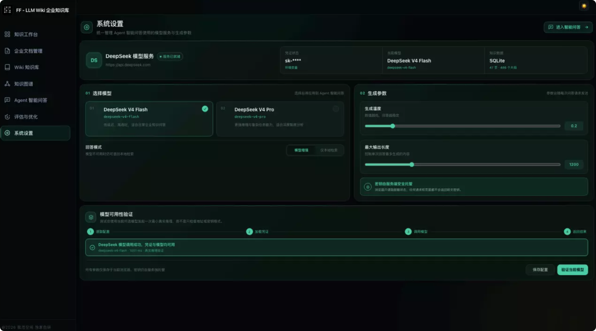

课堂中间 Markdown 的确定性排版渲染，不是编辑器原生界面，也不是最终 Wiki 页面。画面保留“先选问题”、三个R1证据片段、单来源草稿结论以及“为什么最终P1会变成跨来源页”；应观察这个对象只解释形成过程，不进入最终八页集合。

这个中间草稿有意不进入最终八页集合。它的价值在于把页面形成过程拆开给读者看：先明确页面回答的问题，再选取支持该问题的原文片段，然后写出不越过来源边界的结论，最后才补齐类型、摘要、来源证据和相关页面。页面不是“把R1缩短一点”，而是围绕一个主题重新安排R1中分散的事实。

当问题扩大为 “Workspace、Session与上下文边界” 时，单一来源就不够了。R2需要解释Preset 在新 Session中生效，R4需要解释 Session 权限与 OS 权限的交集。因此最终的 P1会成为跨来源页面。单来源草稿没有被包装成最终结果，它诚实保留了知识页从窄问题走向完整主题的中间状态。

### 2.5 跨来源重组正式形成知识编译

第二份形成过程文档选择P2 “Agent Preset的组合与生效”。它要回答的不是“四篇资料分别说了什么”，而是一个横跨四篇原件的问题：Preset怎样组合角色、Skill、工具与规则，并在什么时刻算生效？

四篇来源在这个页面中承担不同职责：R1提供 Session 的 `cwd`、装配与持久历史；R2提供 Preset composition、新 Session生效以及错误包名到缺配置再到修复的恢复过程；R3 提供Skill、Plugin、MCP各自的发现、加载和调用信号；R4提供 Host/Session 权限与 Subagent运行时委派的边界。每篇来源同时都有“不进入”的内容，例如不能从Workspace登记推断模型已经读取目录，不能把 roster 中出现 Preset 当作业务成功，也不能把 MCP 的官方能力合同写成本机调用成功。

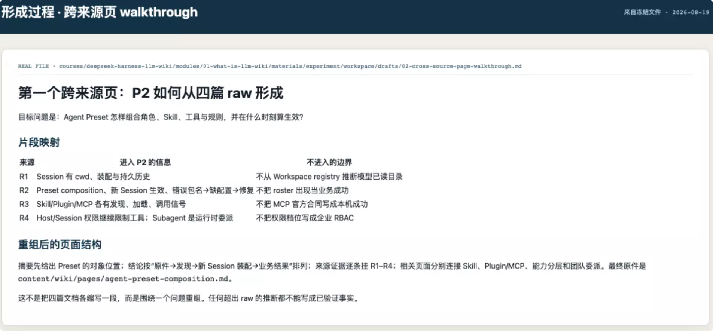

跨来源形成过程Markdown的确定性排版渲染，不是DSH实时编写页面的界面。画面把R1-R4“进入P2的信息”和“不进入的边界”并排展示，并明确结论围绕一个问题重组，而不是把四篇摘要拼接。它只解释P2的选择过程，不能据此把越过 raw 的推断升级成事实。

#### 2.5.1 先判断：为P2选择来源与链接

在查看最终页面前，先根据已经打开的R1-R4完成下面三项判断。此处只需要填写来源编号、相关主题和事实类别，不需要运行编译脚本。

```markdown
主题问题:Preset怎样组合角色、Skill、工具与规则，并在什么时刻算生效?

1. sources: 从R1、R2、R3、R4 中选择直接支持这个问题的来源。
2. links: 从“Workspace/Session、Skill、Plugin/MCP、能力分层、团队委派、凭证政策、交付判断”中，选择读完P2后应继续进入的主题。
3. 判断下列内容属于“来源事实”“本Wiki的操作性归纳”还是“证据不足”:
    A. 修改Preset后，应创建新Session 检查装配是否生效。
    B. 本机已经成功调用MCP Server。
    C. P2 按“原件→发现→新Session 装配→业务结果”的顺序组织结论。
```

#### 2.5.2 再核对：来源回答依据，链接负责扩展

`sources` 应选择 R1-R4。R2是主题的主来源；R1补足 Session上下文，R3补足 Skill、Plugin 与 MCP 的生命周期，R4补足权限和运行时委派边界。少选任何一篇，页面都会缺少当前问题的一部分；全选也不表示四篇的所有内容都应进入P2，只能取与主题问题直接相关的片段。

`links` 应选择 Workspace/Session、Skill、Plugin/MCP、能力分层和团队委派。它们在最终页面中分别对应P1、P3、P4、P5、P6。凭证政策和交付判断与P2有间接关系，但不是这张页面规定的第一跳。这个选择没有增加事实依据；它只决定读者离开P2后怎样扩展上下文。

三条内容的类别如下：A是R2直接支持的来源事实；B是证据不足，R3明确说明MCP只有官方合同、没有本机调用正例；C是本Wiki为便于理解而采用的操作性归纳，四个阶段各有原文事实支持，但这个排列顺序不是某篇raw的原句。核对时先看形成过程文档中的片段职责，再看公开规格要求的字段，最后与下面的P2页面比对。这样可以把“来源说了什么”、“Wiki怎样组织这些事实”和“读完后去哪里”分成三个问题。

按这个问题重组后，P2真实页面的frontmatter如下：

```markdown
---
id: P2
title: Agent Preset 的组合与生效
type: system
topic: 主 Agent 装配
slug: agent-preset-composition
sources:
 - ../../raw/R1-dsh-workspace-session.md
 - ../../raw/R2-dsh-agent-preset.md
 - ../../raw/R3-dsh-skills-plugins-mcp.md
 - ../../raw/R4-dsh-team-security-credentials.md

links:
- P1
- P3
- P4
- P5
- P6

updated:2026-08-19T16:00:00+08:00
---
```

页面摘要先确定Preset的对象位置；结论按照“原件一发现一新Session装配一业务结果”排列；来源证据逐条挂接R1-R4；相关页面再连接Workspace/Session、Skill、Plugin/MCP、能力分层和团队委派。这个过程称为**知识编译**：把按作者叙事保存的来源，按稳定主题重组为可持续读取的派生知识。它既不是“一篇文档生成一篇摘要”，也不是把原文切成更小的文件。

P2同时让多对多关系变得可见。一个页面综合了R1-R4；R2又继续支持P1、P3、P4、P5、P6和P8等不同主题。`sources` 让读者可以从页面回到原件，`links` 则让读者从Preset主题继续进入相关概念。两个方向共同存在，但职责始终分开。

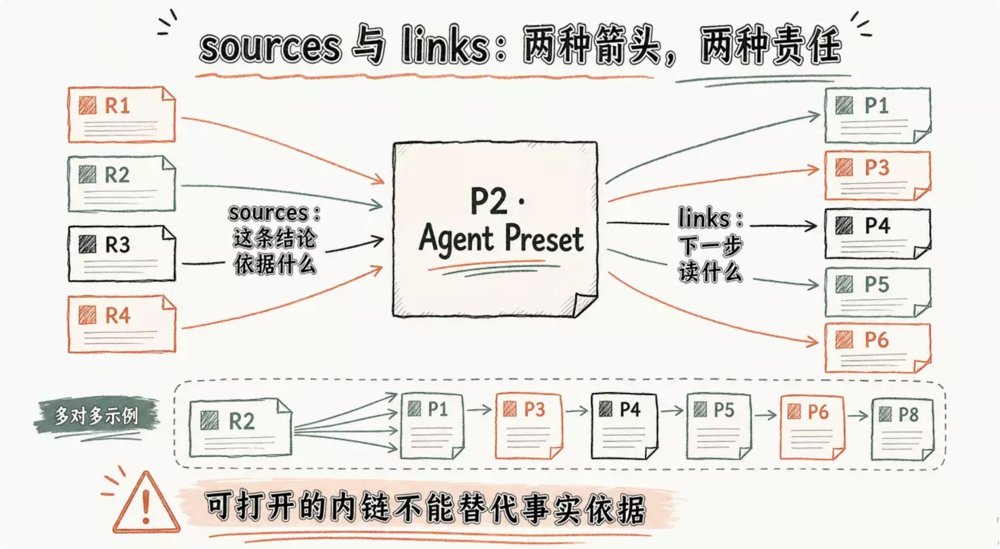

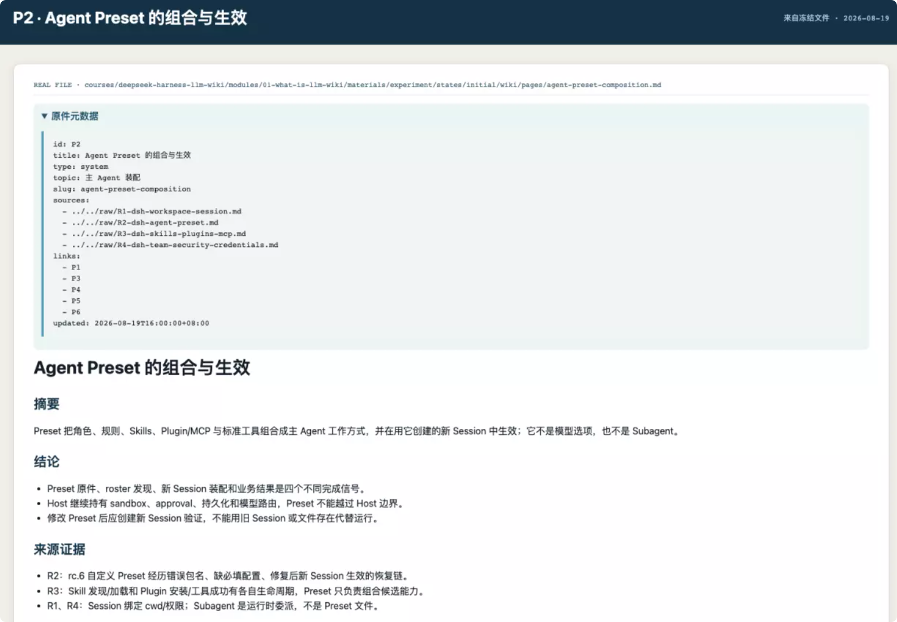

initial 冻结 P2 Markdown 的确定性排版渲染，不是Wiki原生应用界面。画面同时显示 R1-R4 四个来源、P1/P3/P4/P5/P6五条内链，以及摘要、结论和来源证据；它用于核对前面的选择答案。P2是公开规格确定并由脚本落盘的页面，不能从成图推出DSH在同一Session中实时创建了它。

### 2.6 同一规则形成八页Markdown

单来源页和跨来源页把选择与重组过程展开之后，其余页面不再依赖一段不可见的DSH实时生成过程。八页终态由公开的 `page-specs` 与确定性的 `compile_wiki.py` 形成：页面内容先在公开规格中确定，脚本只按规格落盘并检查统一结构。它是透明复现工具，不是一个在课堂 Session 中自行理解四篇资料、即时创作八页的 DSH Agent。

初始页面集合覆盖四种页面类型:


| id | 页面 | 类型 | 主要问题 |
| :--- | :--- | :--- | :--- |
| P1 | Workspace、Session 与上下文边界 | concept | 目录登记、运行历史和文件可见范围怎样区分 |
| P2 | Agent Preset 的组合与生效 | system | 主 Agent 工作方式怎样装配并在新 Session 生效 |
| P3 | Skill: 按需加载的方法层 | concept | 文件存在、目录摘要、完整加载与任务结果怎样分层 |
| P4 | Plugin、MCP 与工具成功信号 | system | 发现、安装、挂载、调用和外部结果怎样区分 |
| P5 | DSH 能力层: 方法、工具、装配与委派 | concept | Skill、Plugin/MCP、Preset 与委派分别处于哪一层 |
| P6 | 父子 Agent 委派与回收流程 | playbook | 怎样定义写域、核验子产物并由父级汇总 |
| P7 | Session 权限与凭证消费政策 | policy | 有效权限和凭证消费的安全边界是什么 |
| P8 | 用证据链判断 Agent 项目是否完成 | playbook | 怎样从原件、装配、工具事件和直接结果判断完成 |

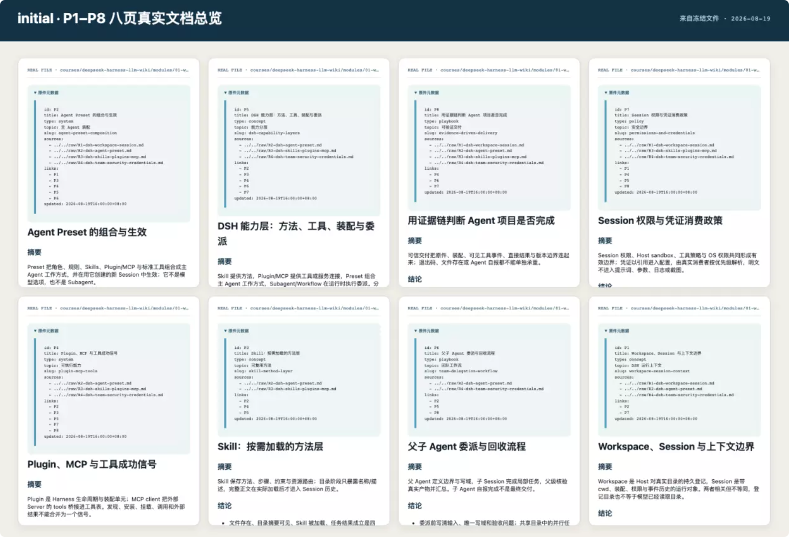

八个 initial 冻结Markdown的确定性排版总览，不是重新手写的知识卡片，也不是原生 WikiUI。八个格子均保留各自的 `id`、标题、类型、主题、来源、链接、更新时间与正文开头，用于一次确认P1-P8真实存在。总览只能证明八页文件及其结构可见，不能用页面或链接数量证明知识质量，也不能把它们写成DSH实时生成结果。逐页原件：P1、P2、P3、P4、P5、P6、P7、P8。

读取任意一页时，都可以用同一顺序判断它是否成立：先看frontmatter中的页面身份、类型、来源和链接；再读摘要确认页面只回答一个稳定主题；然后逐项核对结论与“来源证据”;最后打开“相关页面”，确认链接指向的是另一个真实主题页。编译脚本如果遇到缺失字段、不存在的来源或无法落到真实页面的链接，应回到公开规格修正派生产物，而不是改写raw来迁就页面。

八页成立时，知识编译已经满足两个结构性条件：至少一个页面综合多篇来源，并且至少一篇来源支持多个页面。四篇raw仍保留作者叙事和只读身份，八页则提供按主题组织、可以修订和重建的知识层。这一结果只能说明当前缩微Wiki的页面结构、来源关系和互链成立；页面多、链接多本身不能证明结论质量，也不能把本课采用的八页与四种类型提升为行业标准。

到这里得到的仍是一组Markdown页面。知识编译已经完成，但页面集合还没有成为可持续读取的整体。

## 3. 导航、清单与可见查询

八个主题页已经按照同一规则形成，每页都有来源证据和相关页面。然而，页面存在并不等于知识层已经便于持续使用。缺少整体入口时，读者只能逐个翻找文件；缺少变化记录时，维护者无法判断这一批页面何时、由哪些来源形成；缺少结构化清单时，程序又只能临时扫描目录、猜测字段和关系。

小型 Wiki 因此在 `content/wiki/` 根目录增加了三个职责不同的对象：`index.md` 面向人类阅读，`log.md` 面向维护过程，`manifest.json` 面向程序读取。它们指向的是前面已经形成的同一批页面和来源，不是三份相互独立的知识副本。

本章会同时遇到三个时间点的文件，必须先区分再观察：

| 媒介与时间点 | 实际内容 | 本章怎样使用 |
| :--- | :--- | :--- |
| 查询保存态 | DSH CLI rc.7 查询事件中内嵌的初始清单；它保留了来源路径规范化前的历史内容，`pages[].sources` 仍写成 `../../raw/` | 只用于还原当次查询实际看见了什么，不作为浏览来源回跳的清单 |
| 修复后冻结／浏览验收态 | 仍是 R1-R4、P1-P8 的 `initial`，但清单中相对 `content/wiki/manifest.json` 的来源路径已经修复为 `../raw/` | 本章讲解索引、日志、机器清单和薄浏览时采用的初始参照 |
| 当前 Workspace | `content/wiki/` 已经进入包含第五篇来源的 `update`，来源数为 5 | 只作为下一章的进入状态；本章不把当前可变目录写成仍停在 `initial` |

### 3.1 人类入口、维护记录与机器清单

#### 3.1.1 从index.md进入主题页

在讲师提供的修复后冻结初始文件中打开 `content/wiki/index.md`。该文件先给出初始 Wiki 的规模，再按页面类型组织八个主题页。若直接打开当前 Workspace 中的同名路径，会

看到后续 `update` 内容，不应将它与下面的初始示例混为一态。

```markdown
# 小型 DSH LLM Wiki

这是人类导航入口。页面由只读raw按主题重组；来源回答“依据在哪里”，内链回答“下一步读什么”。

-当前状态更新时间:2026-08-19T16:00:00+08:00
- 主题页:8
- 页面类型:4

## 概念页

-[P1·Workspace、Session 与上下文边界](pages/workspace-session-context.md)- DSH 运行上下文
-[P3·Skill:按需加载的方法层](pages/skill-method-layer.md) - 可复用方法
-[P5·DSH能力层:方法、工具、装配与委派](pages/dsh-capability-layers.md)-能力分层
```

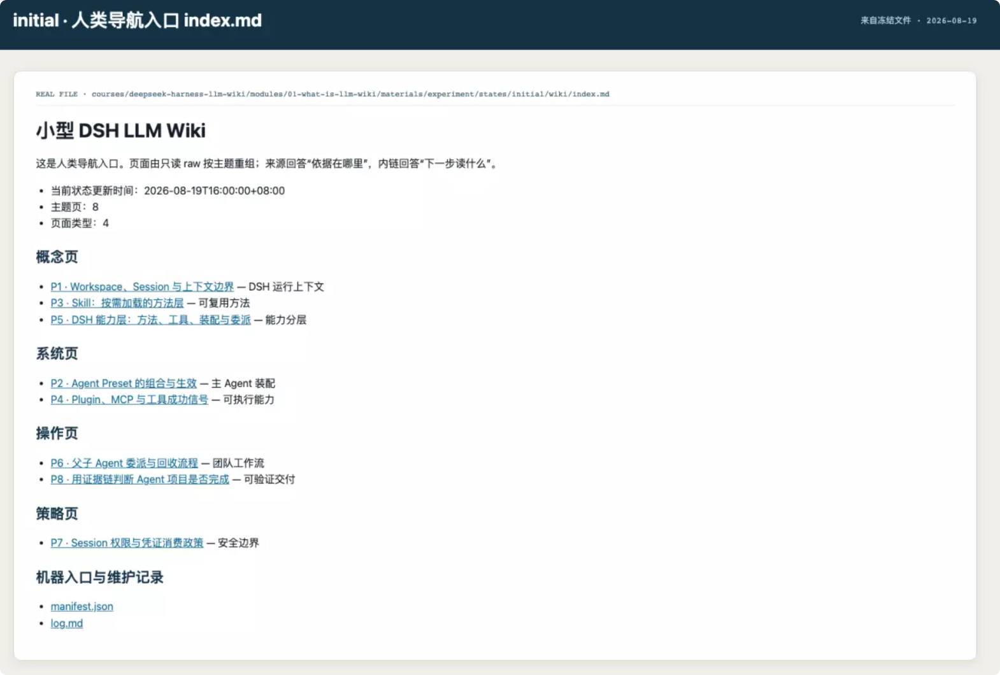

这是一张对冻结 `initial` Markdown原件的确定性排版图，不是另建的Wiki页面。图中可见“页面由只读raw按主题重组；来源回答依据，内链回答下一步读什么”，并列出P1-P8、`manifest.json` 和 `log.md` 的入口；可从冻结的 `index.md` 原件逐字核对。它只证明初始导航对象、分类与链接文字真实存在，不能据此推出目标文件没有断链，更不能证明页面结论正确。

索引中的“概念页、系统页、操作页、策略页”不是装饰性分组。它们让读者先按问题类型缩小范围，再进入具体页面。例如，要判断删除Workspace登记是否会删除项目目录，应先在概念页中定位P1；要判断Plugin是否真正完成外部动作，则应进入系统页P4，并根据其相关页面继续阅读P8的交付判断顺序。

打开链接后的成功信号，是目标确实落到 `content/wiki/pages/` 中对应的Markdown文件，而且页面的 `id`、标题和主题与索引一致。若索引链接打不开，不能仅凭标题仍然显示就判定导航有效；应回到索引中的相对路径，检查目标页面是否真实存在。索引解决的是“从哪里开始读”，不负责保存每页的全部字段，也不替代原始来源。

#### 3.1.2 用log.md 读取形成过程

`content/wiki/1og.md` 是追加式维护记录。修复后冻结的初始文件只有一条事件：

```markdown
# Wiki 维护日志(append-only)

## 2026-08-19T16:00:00+08:00 · initial

- 输入来源:R1-R4
- 创建页面:P1-P8
- 创建人类入口、机器清单与初始维护记录。
```

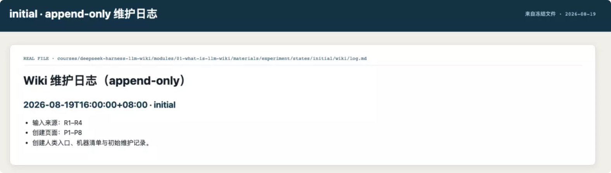

这是一张对冻结 `log.md` 原件的确定性排版图。可见部分原文包括 2026-08-
19T16:00:00+08:00·initial、“输入来源：R1-R4”和“创建页面：P1-P8”；可在冻结的 `log.md` 原件中复核。图像只能证明这一条维护事件已经写入；`append-only` 是本课程小型 Wiki 采用的维护约定，不是所有 Wiki 都必须遵循的通用标准，也不能反向证明被登记页面的内容正确。

这里的(`append-only`)表示后续变化只能追加新事件，不能重写旧记录。当前Workspace的同名日志已经在这条 `initial` 之后追加了 `update`，但这不改变初始事件本身。日志保留“这批知识何时由什么输入形成”的时间线，而不是再写一遍页面内容。因而，判断日志是否可信，至少要把三个对象连起来：初始事件声称输入为R1-R4，冻结的原始资料中就应存在这四篇文件；它声称创建P1-P8，初始索引和页面集合就应能找到八页；时间也应与修复后的初始索引和清单一致。

一条日志存在，只能说明维护记录已经写下，不能反向证明页面内容正确。内容依据仍要回到页面的 `sources` 和对应 raw 原件核查。

#### 3.1.3 用 manifest.json 读取稳定字段

`content/wiki/manifest.json` 是机器可读清单。修复后冻结并完成浏览验收的初始清单以如下字段开始：

```json
{
  "schema_version": 1,
  "state": "initial",
  "generated_at": "2026-08-19T16:00:00+08:00",
  "statistics": {
    "page_count": 8,
    "source_count": 4,
    "type_count": 4,
    "link_count": 30
  },
  "pages": [
    {
      "id": "P1",
      "slug": "workspace-session-context",
      "title": "Workspace、Session 与上下文边界",
      "type": "concept",
      "topic": "DSH 运行上下文",
      "path": "pages/workspace-session-context.md",
      "sources": [
        "../../raw/R1-dsh-workspace-session.md",
        "../../raw/R2-dsh-agent-preset.md",
        "../../raw/R4-dsh-team-security-credentials.md"
      ],
      "links": ["P2", "P7"],
      "updated": "2026-08-19T16:00:00+08:00"
    }
  ]
}
```

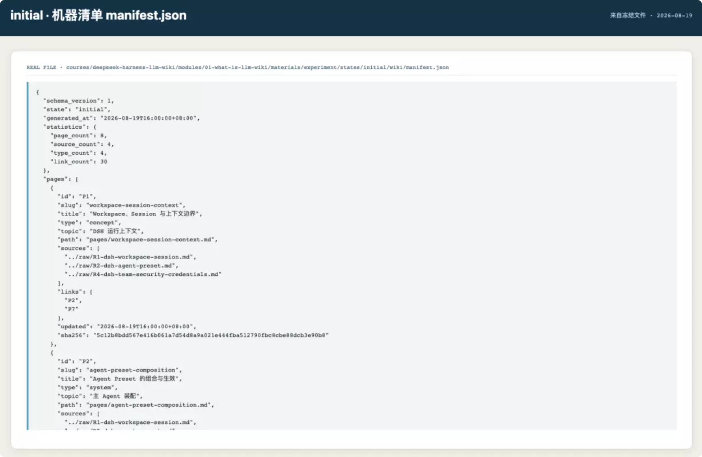

这是一张对修复后冻结 `manifest.json` 原件的确定性排版图。图中可见 `state: initial`、`page_count: 8`、`source_count: 4`，以及 P1 的 `sources`、`links`、`updated` 和 `sha256`；可在冻结的 `manifest.json` 原件中核对完整结构。尤其要观察这里的来源从清单所在目录出发写成 `../raw/`；页面 frontmatter 位于更深一层，才写 `../../raw/`。这张机器清单不能替代页面正文，也不代表查询保存态内嵌的、修复前清单与浏览验收清单字节一致。

`statistics` 提供这个冻结集合的总体规模；`pages` 则逐页登记稳定标识、自然路径、类型、主题、来源、内链和更新时间。程序由此不必解析索引中的自然语言，就能找到 P1、列出它的来源，或继续访问 P2 和 P7。完整清单还保存页面与来源的内容摘要值，用于判断对象在两次生成之间是否改变。摘要值只能回答“内容是否相同”，不能证明结论一定正确。

来源路径必须按“路径写在哪个文件里”解释。`manifest.json` 位于 `content/wiki/`，所以它回到 `content/raw/` 使用 `../raw/`；P1 页面位于 `content/wiki/pages/`，页面 frontmatter 回到同一 raw 则使用 `../../raw/`。两种写法的基准目录不同，不能为了表面一致而写成同一个字符串。查询保存态内嵌清单中的 `../../raw/` 是规范化修复前的历史记录，仍可证明当次查询看到了哪些字段，但不能作为修复后浏览来源链接的路径。

在修复后冻结态中，三个入口可以用 P1 交叉核对：`index.md` 把它列为概念页；`manifest.json` 把它登记为 `type: concept`，路径为 `pages/workspace-session-context.md`；打开页面后，frontmatter 中的 `id`、`type` 和 `links` 应与清单表达同一对象，分别按各自目录解析的 `sources` 最终都应回到 R1、R2、R4 原件。任何一层只有名称、没有真实目标，都属于断链。

这份 `manifest.json` 是 Wiki 自己的知识清单，不是课程制作或实验运行记录。初始状态下，四项统计应为 **8** 页、**4** 个来源、**4** 种类型和 **30** 条页面链接。统计相符说明对象关系可以被稳定读取，仍不能用页面数或链接数代替知识质量判断。

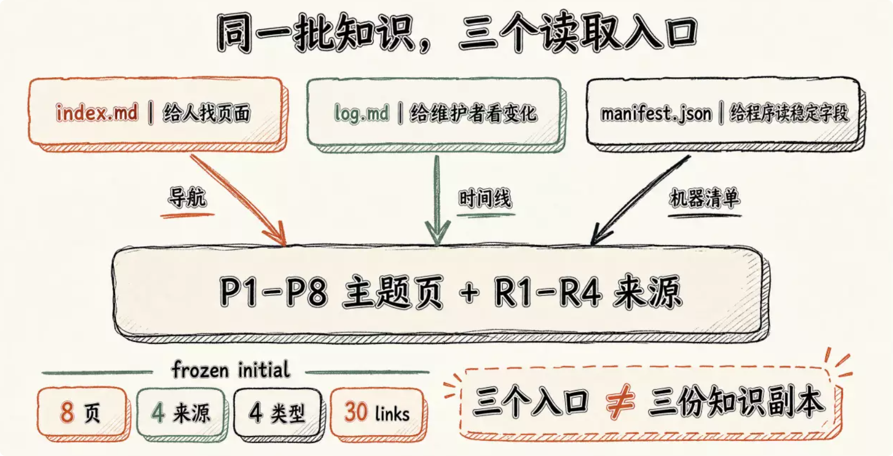

### 3.2 薄只读浏览页读取同一批文件

Markdown文件已经足以构成知识层，但连续阅读时，浏览器可以提供更自然的页面列表、详情、来源回跳和内链跳转。当前可用形态是一个薄只读浏览页。它没有自己的知识副本，也没有编辑或编译能力。

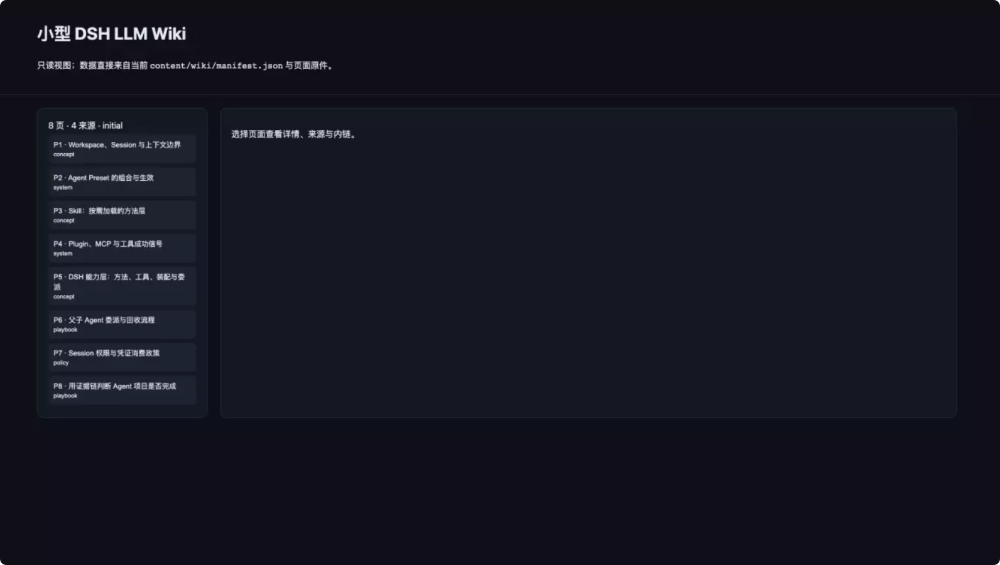


这是真实浏览页面截图：讲师验收时，既有只读server读取修复后冻结的initial数据，首页实际显示“8页·4来源·initial”以及P1-P8。可同时检查冻结的浏览前端原件和它当时读取的冻结initial清单。截图所用服务已经停止，因此它证明的是当次只读呈现成功，不提供一个仍在运行的固定端口，也不能推出前端保存了独立知识副本。

浏览服务由讲师或配套环境预先启动，当次访问入口及端口随课堂环境提供，不设置需要学员记忆的固定端口。学员的动作从在Browser中打开当次只读入口开始，不要求运行 `wiki_browser_server.py` 或管理后台进程。用于本章验收的入口绑定修复后冻结的初始文件；若入口绑定当前 Workspace，则页面会如实显示 `update`，不能冒充初始浏览结果。

入口页面标题为“小型DSH LLM Wiki”，首屏说明数据来自该环境中的
`content/wiki/manifest.json` 与页面原件。真实 `browser/index.html` 中的数据入口如下：

```js linenums="1"
fetch('/api/manifest').then(r => r.json()).then(m => {

    manifest = m

    document.querySelector('#stats').textContent = 
        `${m.statistics.page_count} 页 · ${m.statistics.source_count} 来源 · ${m.state}`

    document.querySelector('#pages').innerHTML = m.pages
        .map(p => `<button onclick="openPage('${p.id}')">${p.id} · ${p.title}<br><small>${p.type}</small>
    </button>`)
        .join('')

})
```

这段代码直接请求(`/api/manifest`)，用清单中的(`page_count`)`source_countstate`和 `pages`生成统计与页面按钮。选择P1后，`openPage('P1')` 再请求 `/api/page/P1`，页面详情显示真实 Markdown；来源链接请求 `/api/source?path=...`，内链按钮则继续打开目标页面。浏览器负责呈现，知识仍保存在 `content/wiki/` 和 `content/raw/`。

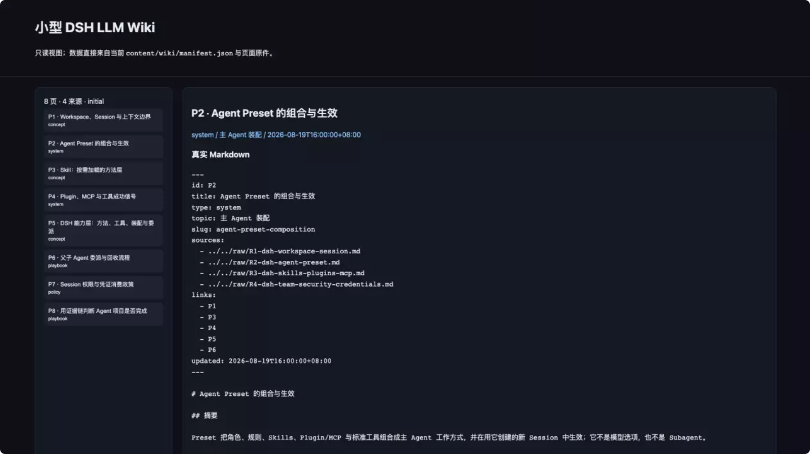


这张真实页面截图来自同一次已停止的只读server验收。选择P2后，界面可见系统页标题“Agent Preset：主Agent的可复用装配”、主题、更新时间和原始Markdown；正文frontmatter中的来源路径实际使用 `../../raw/`。可对照冻结的浏览前端原件与冻结P2 Markdown原件。它只证明浏览器读取并展示了真实页面，不证明界面能够生成答案、修改文件或执行Wiki更新。

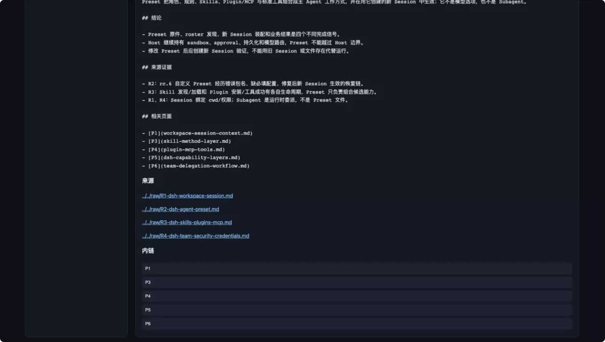

这仍是既有只读 server 读取 `initial` 的真实页面，服务现已停止。图中可见四条 raw 来源跳转，以及P1、P3、P4、P5、P6五个相关页面按钮；它把“来源回答依据在哪里，内链回答下一步读什么”落实为两种不同跳转。链接关系可回到冻结P2Markdown原件核对，呈现逻辑可回到冻结浏览前端原件核对。按钮可见不等于每条引用天然可靠，也不能推出浏览页具备写入、问答或图谱构建能力。

浏览页的核对顺序如下：

1. 左侧页面数量、来源数量和状态应与 `manifest.json` 一致;
2. 选择一个页面后，标题、类型、主题和更新时间应与对应Markdown一致；
3. 点击来源链接应能打开清单登记的raw，而不是一段复制到前端的演示文字；
4. 点击相关页面应切换到真实目标页，目标 `id`应能在清单中找到。

若页面列表为空、入口无法访问或某个来源返回错误，学员不需要自行寻找端口或启动服务，而应回到讲师提供的同一状态文件，直接用同批Markdown与 `manifest.json` 完成页面、来源和内链核对。不能在前端补一份静态数据来掩盖错误。即使浏览页不可用，索引、日志、清单和页面原件仍应独立成立；反过来，界面能够点击也不表示引用内容天然可靠。

当前浏览入口只承担只读阅读。“LLM Wiki构建图谱”演示页尚不是可用入口，不能用尚未存在的页面替代这里已经可核查的薄浏览页。这个只读页也没有证明完整Web后端、问答服务、知识图谱或工业级权限系统已经存在。

### 3.3 真实查询回放的阅读方法

下面三次查询均来自官方DSHCLI 0.1.0-rc.7 的隔离 Session。每组材料保留两类原件：`raw-answer.txt` 是模型原始回答，`visible-trace.json` 是同次Session导出的脱敏可见事件。后者只包含用户消息、可见工具调用、工具结果和最终回答；系统提示、增量片段、凭证以及隐藏推理均未进入教材。

因此，这些材料是CLI真实运行的脱敏回放，不是Studio rc.11 Desktop操作画面。可见的 `read`、`glob`、`grep` 和 `bash` 事件可以说明“实际打开或搜索了什么”，不能被描述为模型在内部怎样思考。

三组回放还保留了来源路径规范化前的查询保存态。事件中内嵌的初始清单是当时真实读到的历史内容，不是后来修复并用于薄浏览验收的清单副本。阅读轨迹时关注实际打开的索引、页面和raw；核对修复后的来源跳转时，则以 `manifest.ison` 中的 `../raw/` 和页面 frontmatter 中的 `../../raw/` 为准。

判断一次回答是否有依据，可以使用五项连续检查：问题是否被完整保留；索引是否真的被读取；回答所用页面是否出现在工具结果中；需要原文支持时是否回查了raw；最终结论是否给出可以打开的相对路径。语料没有证据时，第五步应变成明确拒答和缺口说明，而不是从常识补写答案。

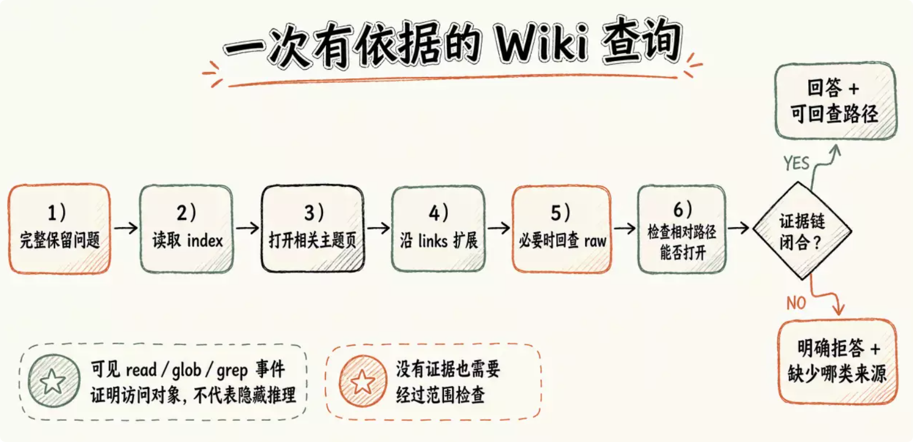

#### 3.3.1 单页面事实查询：索引定位后回查原件

完整回答和同次可见事件分别保存在 `outputs/wiki-query/Q-FACT.dsh/raw-answer.txt` 与 `outputs/wiki-query/Q-FACT.dsh/visible-trace.json`。事实问题的真实输入是：

```
请根据当前Workspace 的小型Wiki回答:删除 DSH的Workspace 登记会不会删除真实项目目录和持久 Session?从 `content/wiki/index.md` 定位页面，读取页面并在必要时回查 raw；用相对路径引用依据。
```

同次可见轨迹依次出现：确认当前 Workspace；列出 `content/wiki/`；读取`index.md` 和初始 `manifest.json`；定位并读取P1；列出 raw；读取R1；再从R2和R4中检索 Workspace、Session、权限等旁证。原始回答紧接着给出结论：

```
结论:不会

删除DSH的Workspace 登记≠删除真实项目目录，也不等于删除持久 Session。
````

```markdown title="Wiki事实问答·P1 回查R1"
REAL DSH CLI · @deepseek-ai/dsh rc.7 · 可见事件 (已脱敏)
模型: deepseek-official / deepseek-v4-flash
事件: assistant/final, tool/call, tool/result, user/message

用户问题
请根据当前 Workspace 的小型 Wiki 回答：删除 DSH 的 Workspace 登记会不会删除真实项目目录和持久 Session？从 `content/wiki/index.md` 定位页面，读取页面并在必要时回查 raw；用相对路径引用依据。

同次运行保存的最终回答（节选）
## 结论：不会

**删除 DSH 的 Workspace 登记 ≠ 删除真实项目目录，也不等于删除持久 Session。** 这是两种完全不同的动作。依据链路如下：

### 1. 定位页面

从入口 `content/wiki/index.md` 的概念页清单定位到 **[P1 · Workspace、Session 与上下文边界](content/wiki/pages/workspace-session-context.md)** (index.md:11, topic 「DSH 运行上下文)。

页面结论直接命中问题 (`content/wiki/pages/workspace-session-context.md`)：

- 摘要（第 21 行）："Workspace 是 Host 对真实目录的持久登记，Session 是带 cwd、装配、权限与事件历史的运行对象。**两者相关但不等同**"
- 结论（第 25 行）："**删除登记也不等于删除磁盘目录或持久 Session**"
- 来源证据（第 31 行）：R1 记录 rc.6 登记前后文件与哈希未变，"当前官方合同说明 create 规范化真实目录，**delete 不删用户文件**"

### 2. 回查 raw 取证

该页主要来源是 `content/raw/R1-dsh-workspace-session.md` (manifest.json 中 P1 的 sources 第一项)，关键原文：

- 第 16 行：Workspace 是"Host 对既有真实目录的持久登记对象"，目标目录必须预先存在；"Workspace 登记不生成 Git 仓库、`.agents/`、Skill、Preset 或 Wiki"—登记本身不产生任何项目文件。
- 第 20 行：**"当前官方 rc.11 源码说明，删除 Workspace 注册记录不会删除用户磁盘目录、文件或持久 Session 日志。这个边界很重要：界面上移除一个工作区，和在 Finder 或 Shell 中删除目录，是两种完全不同的动作。"**
- 第 24 行：Workspace 与 Session 不是同义词—"前者是目录登记与归属，后者是可继续读取的运行历史"，Workspace 可关联多个 Session。
- 第 26 行：权威运行历史是**持久 Session 日志**；projection cache 只是可重建的读取加速，不构成长期 Memory—删除登记不会触碰这两类对象。
- 第 38 行：删除、归档与迁移要按对象分别处理，"移除 Workspace 登记不会自动销毁目录；Session 日志比 projection cache 更有迁移价值"。

旁证（P1 引用的其他来源）：

- `content/raw/R2-dsh-agent-preset.md` 第 24 行：旧 Session 不会因磁盘上对象变化而自动改写自己的既有装配—Session composition 与 Workspace registry 是不同生命周期。
- `content/raw/R4-dsh-team-security-credentials.md` 第 28 行：Workspace registry 不构成秘密边界，操作面由 cwd、Session 权限档位、Host sandbox 与 OS 权限共同限定。
```

这是官方DSH CLI rc.7同次Session的脱敏可见事件与最终回答排版，不是隐藏推理，也不是Studio rc.11 Desktop画面。图中可见查询从 `content/wiki/index.md` 定位P1、再回查R1，最终回答“删除DSH的Workspace登记≠删除真实项目目录，也不等于删除持久Session”。可分别打开事实查询的 `visible-trace.json` 和`raw-answer.txt` 核对事件与原始答案。它只证明这次问题的可见证据路径闭合，不能揭示模型未导出的内部过程，也不能外推到所有 Workspace 删除场景。

这不是因为回答语气确定，而是证据路径闭合：索引的P1链接真实存在；P1明确写出“删除登记也不等于删除磁盘目录或持久Session”；P1的来源列表指向R1、R2、R4；轨迹又实际打开了R1，并检查另外两篇旁证。最终回答还把主要依据写成 `content/wiki/pages/workspace-session-context.md` 与 `content/raw/R1-dsh-workspace-session.md`，学员可以沿相对路径再次打开。

需要保留的版本边界是：回答中的rc.6结果来自当轮课程实验，rc.11内容来自固定官方源码合同。这次CLI查询本身不能写成“Studio rc.11 Desktop 已在本机验证”。

#### 3.3.2 跨页面综合查询：沿内链扩展并核对不同来源

完整回答和同次可见事件分别保存在 `outputs/wiki-query/Q-CROSS.dsh/raw-answer.txt` 与 `outputs/wiki-query/Q-CROSS.dsh/visible-trace.json`。综合问题的真实输入是:

```
请根据当前Workspace 的小型Wiki 说明 Skill、Plugin/MCP、Agent Preset 与 Subagent/Workflow 各负责什么,以及怎样避免把“能力存在”误判成“项目完成”。从 `content/wiki/index.md` 开始，沿相关页面内链扩展，并在需要时回查raw。用相对路径引用依据，不要把未真跑的MCP写成已成功。
```

这次轨迹不能由单个页面承重。可见事件先读取索引，再打开P3、P4、P2、P6，随后沿关系扩展到P5、P8、P7、P1；接着读取初始 `manifest.json`、`log.md` 和查询规则，并回查R3、R2、R1、R4。原始回答把分散事实重组成一个统一判断：

```
Skill 提供方法，Plugin/MCP 提供工具或服务连接，Preset 组合主 Agent 工作方式,
Subagent/Workflow在运行时执行委派。分层的目的，是为每个对象选择正确完成信号。
```

```markdown title="跨页综合·P5→P3/P4/P2/P6"
REAL DSH CLI · @deepseek-ai/dsh rc.7 · 可见事件 (已脱敏)
模型: deepseek-official / deepseek-v4-flash
事件: assistant/final, tool/call, tool/result, user/message

用户问题
请根据当前 Workspace 的小型 Wiki 说明 Skill、Plugin/MCP、Agent Preset 与 Subagent/Workflow 各负责什么，以及怎样避免把“能力存在”误判成“项目完成”。从 `content/wiki/index.md` 开始，沿相关页面内链扩展，并在需要时回查 raw。用相对路径引用依据，不要把未真跑的 MCP 写成已成功。

同次运行保存的最终回答（节选）
我已按 `rules/wiki-contract.md` 的查询合同走完：`content/wiki/index.md` 定位 → 读取全部 8 个主题页 → 沿 `links` 内链扩展（P1-P8 图全连通）→ 对结论回查 `content/raw/R1-R4`。以下是基于该 Wiki 的说明，所有依据用相对路径标注。

---

# 四类能力对象的分工，与“能力存在 ≠ 项目完成”的判定

## 一、总览：四类对象各负责什么

`content/wiki/pages/dsh-capability-layers.md` (P5) 给出分层口径：

> **Skill 提供方法，Plugin/MCP 提供工具或服务连接，Preset 组合主 Agent 工作方式，Subagent/Workflow 在运行时执行委派。分层的目的，是为每个对象选择正确完成信号。**

四类对象可以协作（例如一个知识库 Preset 可以同时加载 Skill、装配 Plugin、经 MCP client 连外部服务），但文件格式、生命周期和验证入口都不同（P5 结论；`content/raw/R3-dsh-skills-plugins-mcp.md` 第 16-18 行）。

### 1. Skill — 按需加载的“方法层” (`content/wiki/pages/skill-method-layer.md` P3)

- **负责什么**：保存方法、步骤、约束与资源路由，回答“怎样做”。它只是方法文本，**不能凭方法文本本身创造外部工具能力**（P3 结论）。
- **生命周期**：发现阶段只把目录摘要（name/description）交给模型，完整正文在实际加载后才作为持久工具结果进入 Session 历史（R3 第 22-24 行）。
- **发现位置**：项目 `.dsh/skills`、项目 `.agents/skills`、用户 DSH/Agents 根及显式自定义根；项目根优先取最近 Git 祖先，无 Git 时回退 cwd（R3 第 22 行）。
- **信号分层**：文件存在 → 目录摘要可见 → 完整 Skill 被加载 → 任务结果成立，是**四层**信号（P3 结论）。

### 2. Plugin / MCP — "可执行能力"层 (`content/wiki/pages/plugin-mcp-tools.md` P4)

- **Plugin 负责什么**: Harness 的生命周期与装配单元，使能力进入 Host/Agent 运行树—要经过发现、包身份/版本/完整性/兼容性校验、Profile 安装、运行时挂载 (R3 第 28-34 行)。
- **MCP 负责什么**: 连接外部 Server 的协议面；DSH 的 MCP client 把远端 tools 以 server namespace 注册进工具表，处理工具集合重同步、断线、重连和注销 (R3 第 36-40 行)。
- **重要边界**: 当前 DSH MCP 合同只桥接 tools，resources 和 prompts 没有对应 Harness 消费接口—不能把"某 MCP Server 声明了 resources"写成"DSH Agent 已能读取" (P4 结论；R3 第 38 行)。
- **状态如实说明**: 本 Wiki 中 MCP 只有 rc.11 官方源码合同 (`content/raw/R3-dsh-skills-plugins-mcp.md` frontmatter 明确 `MCP 无本地正例`、boundary 写"不宣称本机已调用成功")，本实验没有任何 MCP 本机调用正例。因此下面的回答不会把 MCP 写成"已成功"。

### 3. Agent Preset — 主 Agent 的"装配层" (`content/wiki/pages/agent-preset-composition.md` P2)

- **负责什么**: 把角色、工作规则、Skills、Plugin/MCP 与 Harness 标准工具组合成可复用的主 Agent 工作方式，并在用它创建的新 Session 中生效 (P2 摘要；R2 第 16 行)。
- **组成**: `preset.yml` 负责 id、名称、说明等可发现信息；`agent.cordis.yml` 负责实际 composition (R2 第 20 行)。
- **边界**: 不是模型下拉选项，也不是 Subagent；Host 继续持有 sandbox、approval、持久化和模型路由，Preset 不能越过 Host 边界 (P2 结论；R2 第 18 行)。

### 4. Subagent / Workflow — 运行时"委派与编排"层 (`content/wiki/pages/team-delegation-workflow.md` P6)
```

这是官方DSHCLIrc.7可见事件与最终回答的脱敏排版，不是隐藏推理，也不是Studiorc.11Desktop。图中可见回答从能力分层页统摄Skill、Plugin/MCP、Agent Preset与Subagent/Workflow，再分别给出职责和完成信号；可打开综合查询的 `visible-trace.json` 与 `raw-answer.txt` 复核完整访问序列和原答。它能证明本次综合实际跨页并回查来源，不能证明所有MCP已在本机调用成功，也不能由“读取八页”推出回答具有通用准确率。

回答随后分别列出各对象的生命周期和完成信号，并用P8的顺序收束：先打开配置、源码或输入原件，再看运行装配和可见工具事件，最后用目标对象或功能问题验收。这里的“综合”不是把多个文件名罗列在一起，而是把P2-P8的职责连接成一套判断规则，并由R1-R4回查关键事实。

这次回答还主动保留了MCP边界：当前材料只有rc.11官方源码合同，没有本机真实调用正例。因此，回答只能说明DSH当前桥接MCPtools的合同，不能把MCP写成已在本机调用成功。八页被读取、答案很长或链接图连通，都不能据此推出查询对任意问题具有通用准确率。

#### 3.3.3语料外查询：搜索完成后停止强答

完整回答和同次可见事件分别保存在 `outputs/wiki-query/Q-OUT.dsh/raw-answer.txt` 与 `outputs/wiki-query/Q-OUT.dsh/visible-trace.json`。语料外问题的真实输入是：

```
请只依据当前 Workspace 的小型Wiki 回答:DSH 企业版支持哪些 SSO 协议,SAML 元数据 URL 是什么?从 `content/wiki/index.md`开始查找。若页面与raw没有证据，请明确拒答并说明缺少哪类来源，不要用外部常识补齐。
```

可见轨迹先读取索引并列出八页；在整个 `content/wiki/` 中检索 `SSO`、`SAML`、`单点登录`、`企业版`和 `Enterprise`，结果为 `No matches found`；随后读取初始 `manifest.json`，确认来源只有R1-R4；对raw扩大关键词检索后，只发现与SAML无关的“展示元数据”，再用身份、认证和联邦等词补查，并打开最可能涉及安全边界的R4。原始回答没有生成协议名或URL，而是明确结束：

```
拒答:Workspace内无证据，无法回答

本Wiki缺少任何记录DSH企业版SSO功能的一手来源，例如官方企业版产品文档、
SS0/身份认证配置指南或已验证的官方事实摘录。
```

```markdown title="语料外问题·明确拒答"
REAL DSH CLI · @deepseek-ai/dsh rc.7 · 可见事件 (已脱敏)
模型: deepseek-official / deepseek-v4-flash
事件: assistant/final, tool/call, tool/result, user/message

用户问题
请只依据当前 Workspace 的小型 Wiki 回答: DSH 企业版支持哪些 SSO 协议、SAML 元数据 URL 是什么? 从 `content/wiki/index.md` 开始查找。若页面与 raw 没有证据，请明确拒答并说明缺少哪类来源，不要用外部常识补齐。

同次运行保存的最终回答 (节选)
已核查完毕，结论如下。

## 拒答: Workspace 内无证据，无法回答

**问题**: DSH 企业版支持哪些 SSO 协议、SAML 元数据 URL 是什么?

**查找过程 (仅限当前 Workspace)**:

1. **入口** `content/wiki/index.md`: 共 8 个主题页 (P1-P8)，主题覆盖运行上下文、Agent Preset、Skill、Plugin/MCP、能力分层、委派流程、权限凭证、证据链交付——**没有**任何"企业版 / SSO / 单点登录"主题页。
2. **全部页面** `content/wiki/pages/*.md`: 检索 `SSO|SAML|单点登录|企业版|Enterprise` 等关键词，**0 匹配**。
3. **全部 raw 原文** `content/raw/R1-R4` (manifest 登记的全部 4 个来源，即 Wiki 的唯一证据来源): 同样检索 `SSO|SAML|OIDC|OAuth|LDAP|企业版|Enterprise|单点登录|元数据|metadata|federat|IdP|identity` 等，**0 处相关匹配**。仅有的 2 处"元数据"是 Agent Preset 的展示元数据 (R2)，与 SAML 无关；仅有的 1 处"身份" (R4) 是"Session 权限是操作边界，不是组织身份系统"。

**raw 中的相反证据**: R4 (安全权限与凭证规范) 明确写道——现有权限档位"不是完整企业 RBAC、审批流、审计系统或租户隔离"，且"不能推出完整多 Agent 可视化后台、企业 RBAC、绝对秘密隔离或任何团队 Key 已经存在"。即 Workspace 明确声明当前材料**不覆盖企业级身份/认证能力**。

**缺少的来源类型**: 本 Wiki 缺少任何记录 DSH 企业版 SSO 功能的一手来源，例如官方企业版产品文档、SSO/身份认证配置指南或已验证的官方事实摘录 (raw 中现有 4 份来源均不含此类内容)。因此在页面与 raw 均无证据的情况下，我无法回答"支持哪些 SSO 协议"和"SAML 元数据 URL"——不会用外部常识或官方站点记忆补全。
```

这是官方DSH CLI rc.7脱敏可见事件与最终回答的排版，不是隐藏推理，也不是Studio rc.11Desktop画面。图中可见页面与raw对 SSO、SAML等关键词没有证据，最终回答“Workspace内无证据，无法回答”，并列出缺少的官方企业版产品文档、SSO身份认证配置指南等一手来源；可核对语料外查询的 `visible-trace.json` 和 `raw-answer.txt`。零匹配只说明这批冻结语料未覆盖问题，不能推出DSH企业版不支持SSO，也不能保证任意语料外问题都会被正确拒答。

“没有证据”同样需要证据。这里的拒答成立，不是因为索引没有专门标题就立即停止，而是因为页面范围、清单登记的四篇来源和最相关的安全原件都经过了可见检查。回答还区分了两个容易混淆的词：R2中的“展示元数据”属于Preset 描述，不是 SAML metadata；R4中的Session权限属于操作边界，不是企业身份系统。

这次拒答只证明当前固定语料对这个问题保持了边界，不能推出任意语料外问题都会被正确识别。若实际轨迹未检查来源、回答却直接说“无资料”，拒答仍然缺少依据。

### 3.4 初始知识层的固定参照

三次分项查询结束后，固定教学参照应指向修复后冻结的初始 Wiki，而不是当前可变的 `content/wiki/`：只读来源为R1-R4，主题页为P1-P8，`index.md` 提供四类人类导航，`log.md` 保留 initial 事件，修复后的 `manifest.json` 记录 `state:initial`、8页、4个来源、4种类型和30条页面链接；薄浏览验收读取这组修复后初始文件。事实、综合和语料外三类问题则保留在路径修复前的真实CLI查询保存态中，分别留下定位、扩展、回查、引用或拒答的可见路径。两类材料共同解释初始知识层，但不是字节相同的一份清单。

为了让后续新增证据的变化可以同口径比较，初始Wiki还保存了一次固定问题回放。完整输入、回答和可见事件位于 `outputs/wiki-query/Q-FIXED.dsh/`，真实问题是：

```
请根据当前 Workspace 的小型 Wiki 回答:Plugin、Agent Preset 与完整 AI 应用分别是什么?运行 FF-LLM Wiki 是否所有步骤都需要DeepSeek API Key?从`content/wiki/index.md` 开始，读取相关页面并沿内链补充；必要时回查`content/raw/`。只访问当前Workspace内的`content/`、与 `rules/`，不要搜索父目录或其他项目。用相对路径引用证据，证据不足的部分不要强答。
```

这次官方DSH CLI rc.7回放先从 `content/wiki/index.md` 进入，读取P4、P2、P5和查询规则，再检索整个 `content/` 与 `rules/`，沿页面关系补读其他主题页，并回查R1-R4。原始回答对 Plugin和 Agent Preset 给出了页面与 raw双重依据；对“完整AI应用”只找到R1中“初始资料不提前吸收该结论”的边界；对FF-LLM Wiki的运行步骤与DeepSeek APIKey分界没有找到专门来源，因此明确回答“证据不足”。这正是initial Wiki的固定结论边界，不能用后续已经出现的材料倒填。

同一固定问题现在具有三个可见参照：

| 知识状态 | 可见入口与读取路径 | 当前可下的结论 |
| :--- | :--- | :--- |
| 只有 raw | `outputs/baseline-query/dsh/`; 从 R1-R4 搜索并临时组织 | 可以依据 raw 说明已有的 Plugin 与 Preset 事实；完整应用和 FF-LLM Wiki 的 Key 分界仍缺少证据 |
| 初始 Wiki | `outputs/wiki-query/Q-FIXED.dsh/`; `index` → 主题页与内链 → 必要时 R1-R4 | Plugin 与 Preset 获得持久主题入口；完整应用和 Key 分界仍明确停在证据不足 |
| 更新后 Wiki | `outputs/update-query/Q-FIXED.dsh/`; 沿更新后的索引、页面与新来源复查 | 本章只固定入口和同一问题，不提前解释更新后的回答；新证据改变了什么由下一章展开 |

这个参照说明初始知识层已经能够被人和DSHCLI持续读取，并且回答依据可以回到文件；它也让“页面组织带来的增量”和“新来源带来的增量”成为两次可区分的变化。当前Workspace已是 `update`，但本章没有执行第五篇来源更新，也没有证明自动更新、冲突消解或长期无人维护已经成立。下一章从这组冻结的初始对象、固定问题和已存在的更新后回放继续。

## 4. 新来源更新与技术边界

这个固定参照使新增来源前后的变化能够按同一口径比较。此时判断更新是否成立，不能只看“多了一个文件”，而要同时检查四件事：旧原件是否保留，真正受影响的知识页是否修订，导航与清单是否同步，固定问题的回答是否确实使用了新证据。

### 4.1 第五篇来源带来的真实变化

第五篇来源保存在 `content/raw/R5-dsh-studio-rc11-application-update.md`。它是一个新文件，没有覆盖初始的R1-R4。文件头部明确给出事实日期、官方版本、官方提交和结论边界：它记录的是截至2026年8月19日 desktop-preview-v0.1.0-rc.11 的官方声明。这里的“新”是相对初始四篇语料而言，并不表示应用中心或FF-LLM Wiki由rc.11首次发布；回查rc.10的官方README时，这两个对象已经存在。

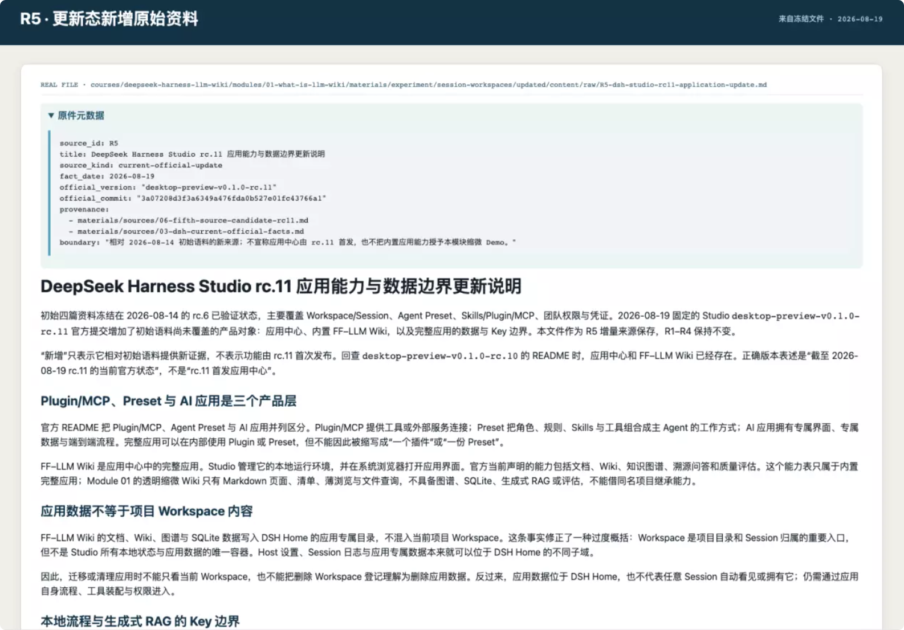

这是R5冻结Markdown原件的确定性排版渲染，不是Studio界面截图。画面同时保留fact date、rc.11版本与commit、来源边界和正文，其中“Plugin/MCP、Preset与AI应用是三个产品层”是本次更新的核心原文。它只表示相对initial语料增加了新证据，不能推出应用中心由rc.11首发，也不能把内置完整应用的能力授予缩微Wiki。

R5补入了初始知识层没有覆盖的三组事实：

1. Plugin/MCP、Agent Preset与 AI应用属于不同产品层。Plugin/MCP提供工具或外部服务连接，Preset组合主Agent的角色、规则、Skills和工具，AI应用则拥有专属界面、专属数据与端到端流程。完整应用可以使用Plugin或Preset，但不能因此被简称为一个插件或一份Preset。
2. FF-LLM Wiki的文档、Wiki、图谱与 SQLite数据位于DSHHome的应用专属目录，不混入当前项目 Workspace。Workspace 仍是项目目录和 Session 归属的重要入口，却不是Studio所有本地数据的唯一容器。
3. 知识编译、浏览和本地检索属于不要求模型Key的本地流程；生成式DeepSeekRAG发起真实模型请求时，才需要用户自己的 `DEEPSEEK_API_KEY`。应用不携带团队Key，因此不能把整个应用笼统地说成“需要Key”或“不需要Key”。

这三组事实分别进入三个既有页面，而不是把八页全部改写：

| 受影响页面 | 新增知识 | 为什么必须更新 |
| :--- | :--- | :--- |
| P1 `workspace-session-context.md` | AI 应用可以在 DSH Home 拥有专属数据目录 | 修正“所有本地数据都在项目 Workspace”这一过度概括 |
| P5 `dsh-capability-layers.md` | AI 应用是有专属 UI、数据和端到端流程的产品层 | 把能力分层从 Skill、Plugin/MCP、Preset 和运行时委派扩展到完整应用 |
| P7 `permissions-and-credentials.md` | 本地编译/浏览/检索与生成式 RAG 的 Key 需求不同 | 把凭证判断落到具体动作，而不是给整个应用贴统一标签 |

```markdown title="P1·initial → updated 真实差异"
--- initial/P1.md
+++ updated/P1.md
@@ -8,10 +8,11 @@
   - ../../raw/R1-dsh-workspace-session.md
   - ../../raw/R2-dsh-agent-preset.md
   - ../../raw/R4-dsh-team-security-credentials.md
+- - ../../raw/R5-dsh-studio-rc11-application-update.md
 links:
   - P2
   - P7
-updated: 2026-08-19T16:00:00+08:00
+updated: 2026-08-19T18:00:00+08:00
 ---

# Workspace、Session 与上下文边界

@@ -25,12 +26,14 @@
 - 登记 Workspace 不会自动生成项目、Skill、Preset 或 Wiki；删除登记也不等于删除磁盘目录或持久 Session。
 - Session 日志是权威运行历史，projection cache 是可重建读取加速，不应称为长期 Memory。
 - 可见文件范围由 cwd、工具、Session 权限与 OS 权限共同决定，Workspace registry 本身不是秘密边界。
+- 截至 Studio rc.11，完整 AI 应用可在 DSH Home 拥有专属数据目录；项目 Workspace 不是 Studio 所有本地数据的唯一容器。

## 来源证据

- R1: rc.6 登记前后 13 个文件与关键 SHA-256 未变；当前官方合同说明 create 规范化真实目录，delete 不删用户文件。
- R2: Preset 在新 Session 生效，说明 Session composition 与 Workspace registry 不是一个生命周期。
- R4: Session 权限、Host sandbox 和 OS 权限共同限定操作面。
+- R5: FF-LLM Wiki 的文档、Wiki、图谱与 SQLite 数据属于 DSH Home 的应用专属目录，不混入当前项目 Workspace。

## 相关页面
```

真实 `diff -u` 的静态终端渲染，对照initialP1与updatedP1。画面可见`sources` 新增R5、`updated` 时间变化，以及“完整AI应用可在DSHHome拥有专属数据目录”的新增结论。它只证明P1的数据容器边界发生了指定变化，不能据此声称整个Wiki被重写。

```markdown title="P5·initial → updated 真实差异"
--- initial/P5.md
+++ updated/P5.md
@@ -8,13 +8,14 @@
   - ../../raw/R2-dsh-agent-preset.md
   - ../../raw/R3-dsh-skills-plugins-mcp.md
   - ../../raw/R4-dsh-team-security-credentials.md
+- - ../../raw/R5-dsh-studio-rc11-application-update.md
 links:
   - P2
   - P3
   - P4
   - P6
   - P7
-updated: 2026-08-19T16:00:00+08:00
+updated: 2026-08-19T18:00:00+08:00
 ---

# DSH 能力层：方法、工具、装配与委派
@@ -28,12 +29,14 @@
 - 四类对象可以协作，但文件格式、生命周期和验证入口不同。
 - 能力存在于源码或配置中，只能说明候选；必须继续验证 Session 可见性、调用和直接结果。
 - 底层已有 subagent/workflow 不等于完整 Desktop 多 Agent 管理产品面已交付。
+- 截至 rc.11，AI 应用是另一个产品层：拥有专属 UI、数据与端到端流程；完整应用可使用 Plugin/Preset，但不与二者同义。

## 来源证据

- R2: Preset 是主 Agent composition，Subagent 是运行时委派。
- R3: Skill 与 Plugin/MCP 分别承担方法和可执行能力。
- R4: 父子 Session 与权限/凭证边界要求最终由父级核验。
+- R5: 官方 README 将 Plugin/MCP、Agent Preset、AI 应用三分，并把 FF-LLM Wiki 作为应用中心中的完整应用。

## 相关页面
```

真实 `diff -u`的静态终端渲染，对照initialP5与updatedP5。新增行把AI应用明确为拥有专属UI、数据和端到端流程的产品层，并回引R5。它只证明P5增加了完整应用这一层，不能推出Plugin、Preset与应用已经在本机逐项运行成功。

```markdown title="P7·initial→updated 真实差异"
--- initial/P7.md
+++ updated/P7.md
@@ -8,12 +8,13 @@
   - ../../raw/R1-dsh-workspace-session.md
   - ../../raw/R3-dsh-skills-plugins-mcp.md
   - ../../raw/R4-dsh-team-security-credentials.md
+- - ../../raw/R5-dsh-studio-rc11-application-update.md
 links:
   - P1
   - P4
   - P5
   - P8
-updated: 2026-08-19T16:00:00+08:00
+updated: 2026-08-19T18:00:00+08:00
 ---

# Session 权限与凭证消费政策
@@ -27,12 +28,14 @@
 - 只读、工作区写入、完全访问是 Session 操作档位，不是企业 RBAC 或完整审计。
 - 凭证优先级为进程环境、受管凭证文件、项目 .env、用户 .env；配置只保存引用。
 - 0600 保护其他 OS 用户，不能保证同 UID 工具进程绝对无法读取；因此仍要缩小可见路径与消费面。
+- FF-LLM Wiki 的知识编译、浏览与本地检索不要求模型 Key；生成式 DeepSeek RAG 才需要用户自己的 Key，应用不携带团队 Key。

## 来源证据

- R4: 当前官方凭证 provider 的引用、describe、优先级、0600 与同 UID caveat。
- R1: Workspace registry 不是文件秘密边界。
- R3: Plugin/MCP 的外部动作仍要单独证明凭证消费与目标结果。
+- R5: rc.11 官方状态明确区分无 Key 的本地确定性路径与需要用户 DEEPSEEK_API_KEY 的生成式 RAG。

## 相关页面
```

真实 `diff -u` 的静态终端渲染，对照initialP7与updatedP7。画面新增了本地知识编译、浏览、检索不要求模型Key，以及生成式DeepSeekRAG才需要用户Key的分界。它只证明P7按R5修订了凭证判断，不能推出所有流程均已在rc.11 Desktop本机验收。

P2、P3、P4、P6、P8保持不变同样重要。新资料没有改变Agent Preset的生效机制、Skill的方法层职责、Plugin/MCP的工具桥接、父子Agent委派和证据驱动交付，因此没有理由为了制造“更新很多”的效果而重写它们。增量维护的目标是让变化范围与新证据的影响范围一致。

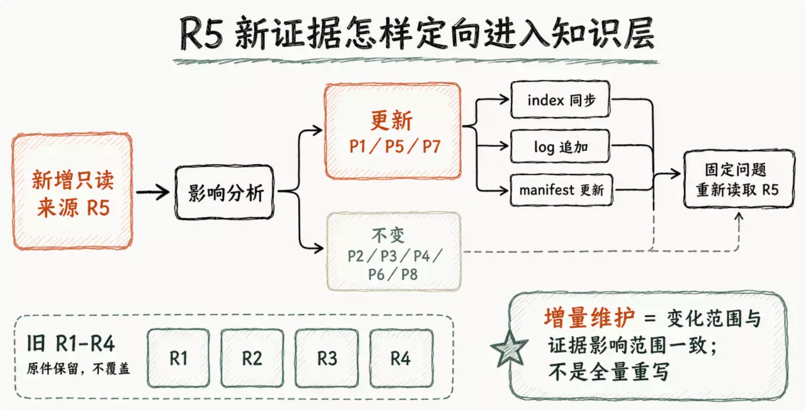
///caption
R5新证据怎样定向进入知识层
///

### 4.2 从三个入口核对更新结果

更新后的三个入口分别回答“人从哪里进入”“变化怎样追踪”“程序读取什么”。学员可以在 `content/wiki/` 中依次打开它们，按同一状态核对。

`index.md` 仍列出8个主题页和4种页面类型，状态时间变为2026-08-
19T18:00:00+08:00。这说明此次更新没有凭空增加页面类型，也没有为R5单独创建一篇文档摘要；新知识被编译进已有主题页。

`log.md` 保留了 `initial` 记录，并在其后追加 `update`：

```markdown
## 2026-08-19T18:00:00+08:00 · update

-新增来源: `../raw/R5-dsh-studio-rc11-application-update.md`
-更新页面: P1、P5、P7
-保持不变: P2、P3、P4、P6、P8
- 说明: 新增来源相对初始语料为新证据，不宣称应用中心由rc.11 首发。
```

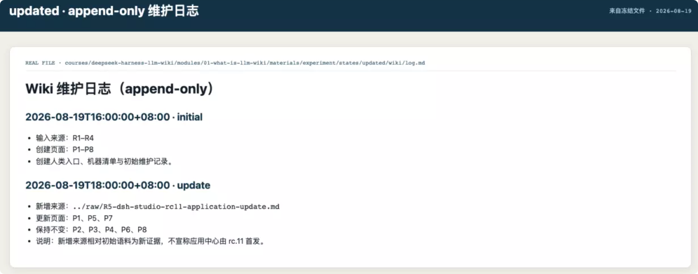

这是 updated `log.md` 冻结原件的确定性排版渲染。画面在同一文件中保留initial记录，并追加新增R5、更新P1／P5／P7、其余五页不变的update记录。它证明本次维护历史可见；“只追加”是本课小型Wiki的维护合同，不是所有Wiki的强制规范。

这份记录采用追加方式保存历史：初始状态没有被改写，维护者可以同时看到“原来是什么”和“这次改了什么”。如果日志只保留最终状态，虽然页面仍能阅读，却失去了知识如何演进的时间线。

`manifest.json` 的 `state` 变为 `update`，统计为8个页面、5个来源、4种类型和30条链接。P1、P5、P7的 `sources` 中新增R5，更新时间和内容哈希随之改变；其余五页仍保持初始更新时间和内容哈希。R5本身也以相对路径、文件大小和内容哈希进入来源清单。由此可以区分两类成功信号：来源数量从4增至5，说明新原件已登记；只有受影响页面、日志和清单同时变化，才说明新证据真正进入了持久知识层。

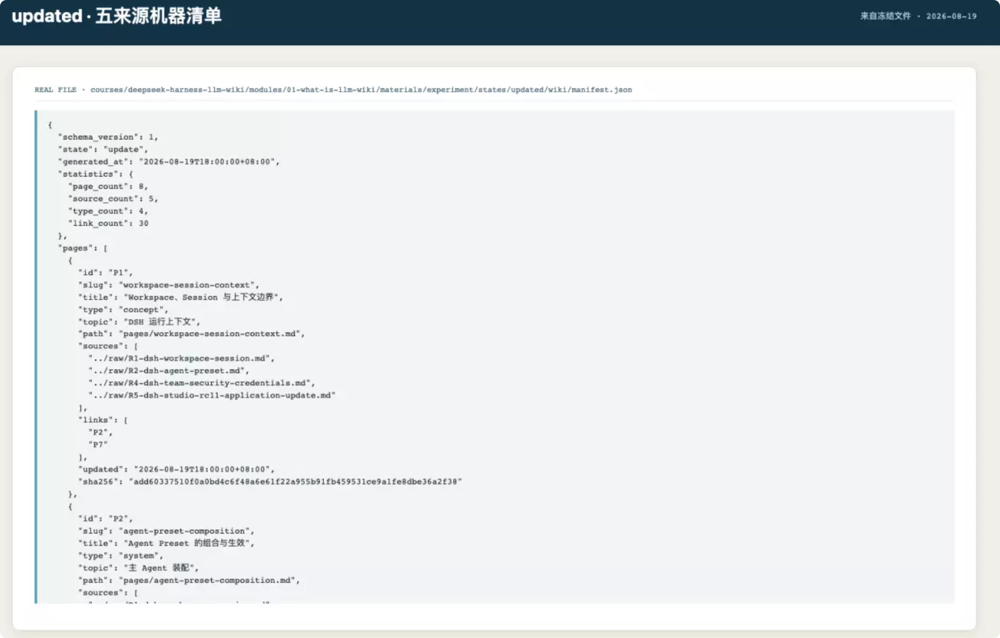

这是 updated `manifest.json` 冻结原件的确定性排版渲染。画面可直接观察`state:update`、`source_count:5`，以及P1的 `sources` 新增R5、更新时间与SHA-256改变。机器清单只说明当前文件、来源和字段之间的一致关系，不能单独证明页面结论正确或知识质量更高。

检查失败时，应按对象继续处理。R5存在但页面没有引用它，说明知识尚未更新；页面已经改动但manifest.json仍是旧状态，说明机器入口与文件层脱节；所有页面都变化，则需要检查是否发生了无关重写；旧来源被覆盖，则已经破坏了回溯基础，不能用最终页面“看起来正确”掩盖这一问题。

### 4.3 用固定问题确认新证据进入回答

文件变化还不能证明查询会读取新知识。更新后使用官方DSH CLI 0.1.0-rc.7创建新的隔离Session，按与初始状态一致的入口提出固定问题：

```
请根据当前 Workspace 更新后的小型 Wiki 回答:Plugin、Agent Preset 与完整 AI 应用分别是什么?运行 FF-LLM Wiki 是否所有步骤都需要 DeepSeek API Key?从 content/wiki/index.md开始，读取相关页面并沿内链扩展；回查新增来源 R5。用相对路径引用证据，并区分 rc.6 已验证事实与 rc.11 当前官方声明。
```

同次运行保存的可见事件显示，查询先打开 `content/wiki/index.md`，再读取P5、P2、P4、P1、P7等相关页面，随后回查 `content/raw/R5-dsh-studio-rc11-application-update.md`。最终回答新增了两个初始状态无法完整回答的结论：完整AI应用与Plugin、Agent Preset 是不同产品层；知识编译、浏览和本地检索不要求模型Key，生成式DeepSeekRAG才需要用户自己的Key。

原始回答中的核心结果如下：

```
Plugin = 可执行能力/工具连接；

Agent Preset =组合角色、规则、Skills、工具的主 Agent 工作方式，在新

Session 生效;

完整AI应用=有专属UI、数据与端到端流程的独立产品层。

FF-LLM Wiki 并非所有步骤都需要 Key:

编译、浏览和本地检索无需Key;

生成式 DeepSeek RAG 需要用户自己的 DEEPSEEK_API_KEY，应用不携带团队 Key。
```

```markdown
REAL DSH CLI · @deepseek-ai/dsh rc.7 · 可见事件 (已脱敏)
模型: deepseek-official / deepseek-v4-flash
事件: assistant/final, tool/call, tool/result, user/message

用户问题
请根据当前 Workspace 更新后的小型 Wiki 回答：Plugin、Agent Preset 与完整 AI 应用分别是什么？运行 FF-LLM Wiki 是否所有步骤都需要 DeepSeek API Key？从 `content/wiki/index.md` 开始，读取相关页面并沿内链扩展；回查新增来源 R5。用相对路径引用证据，并区分 rc.6 已验证事实与 rc.11 当前官方声明。

同次运行保存的最终回答 (节选)
所有证据已读完并完成 R5 回查 (含哈希核对)。以下是基于小型 Wiki 的回答。

---

# 小型 Wiki 查询结果

## 查询路径 (遵守 `rules/wiki-contract.md` 第 4 条查询合同)

`content/wiki/index.md` (人类入口) → 定位概念页/系统页 → 沿内链扩展：P5「DSH 能力层」是三个概念的枢纽页，其 `links` 指向 P2 (Agent Preset)、P4 (Plugin/MCP)、P6、P7；P7 覆盖 Key 边界 → 按各页 `sources` 回查 `content/raw/` 原件 (含新增 R5) → 回引回答。

---

## 一、Plugin、Agent Preset 与完整 AI 应用分别是什么？

三者是**三个不同产品层**，可协作但不互相替代：

| 对象 | 是什么 | 证据 |
| ---- | ---- | ---- |
| **Plugin (与 MCP)** | 可执行能力层：Plugin 是 Harness 的**生命周期与装配单元**，使能力进入 Host/Agent 运行树；MCP client 把外部 Server 的 **tools** 以命名空间桥接进工具表。提供“工具或外部服务连接” | `content/wiki/pages/plugin-mcp-tools.md` (摘要/结论)；raw 佐证：`content/raw/R3-dsh-skills-plugins-mcp.md` |
| **Agent Preset** | 主 Agent 装配层：把**角色、工作规则、Skills、Plugin/MCP 与 Harness 标准工具**组合成可复用的主 Agent 工作方式，在用它创建的**新 Session** 中生效；它不是模型选项，也不是 Subagent | `content/wiki/pages/agent-preset-composition.md` (摘要)；raw 佐证：`content/raw/R2-dsh-agent-preset.md` |
| **完整 AI 应用** | 另一个产品层：拥有**专属 UI、专属数据与端到端流程**。完整应用可以在内部使用 Plugin 或 Preset，但不能因此被缩写成“一个插件”或“一份 Preset” | `content/wiki/pages/dsh-capability-layers.md` 结论与来源证据；raw 佐证：`content/raw/R5-dsh-studio-rc11-application-update.md` |

**关键边界**（`content/wiki/pages/dsh-capability-layers.md` 结论）：
- 四类对象（Skill/Plugin/Preset/Subagent+应用）文件格式、生命周期与验证入口不同，可协作但不能同义。
- **FF-LLM Wiki 是应用中心中的完整应用**（R5 官方声明），Studio 管理其本地运行环境并在系统浏览器打开应用界面。
- 能力存在于源码/配置只说明"候选"，必须继续验证 Session 可见性、真实调用与直接结果（P5 结论）。

---

## 二、运行 FF-LLM Wiki 是否所有步骤都需要 DeepSeek API Key?

**不是。** 依据 `content/wiki/pages/permissions-and-credentials.md`（P7 结论）与 `content/raw/R5-dsh-studio-rc11-application-update.md`：

- **不需要 Key**：知识编译、浏览、本地检索（本地确定性流程）；
- **需要用户自己的 Key**：生成式 DeepSeek RAG 的真实模型请求—用户需在 Harness 凭证中心配置自己的 `DEEPSEEK_API_KEY`；
- **应用不携带团队 Key**。

因此不能把整个应用概括为统一的"需要 Key"或"不需要 Key"，必须按具体动作一一对应（R5「本地流程与生成式 RAG 的 Key 边界」）。这是 **rc.11 当前官方声明**（本 Wiki 没有本机浏览器旅程验收证据，见下方区分）。

---

## 三、新增来源 R5 回查（已完成，证据闭合）
```

真实DSH CLI rc.7可见事件与同次最终回答的静态终端渲染。可分别打开脱敏`visible-trace.json`和原始 `raw-answer.txt`核对。画面显示固定问题从index进入P5/P7并回查R5，最终补出完整AI应用产品层与Key分界；它不包含隐藏思维链。rc.6条目是本机已验证事实，rc.11条目是当前官方声明，而此次问答媒介是CLI rc.7，三者不能合并成Studio rc.11 Desktop 验收。

判断成功的关键不是回答措辞流畅，而是可见路径中确实出现P5、P7和R5，且相对路径能打开对应原件。可见工具事件只说明实际搜索、打开和读取了什么，不等于模型的隐藏推理，也不能由一次回答推出通用准确率、成本或速度优势。

版本口径必须在这里严格分开。R1-R4中的Workspace登记、Preset恢复、Skill加载、WebPlugin和 Subagent 等结论，来自 rc.6的本机运行证据；R5 中应用中心、FF-LLM Wiki能力、应用数据位置与Key分界，来自截至固定提交的rc.11官方声明。此次真实问答运行在官方DSH CLI rc.7。因而，R5 不是本机 Studio rc.11 Desktop 验收，CLIrc.7的查询轨迹也不能冒充DesktopUI画面。官方文档写“已支持”，只能证明当前官方能力合同，不能证明本机已经打开应用中心或完成FF-LLM Wiki的浏览器旅程。

### 4.4 增量知识层的价值与维护责任

这次更新体现的价值不是“自动读到最新版”，而是变化可以被定位、复用和回查。R5作为原件独立保存，旧资料仍可读取；三个受影响页面把新事实放回既有主题；`log.md` 记录变化过程；`manifest.json` 为程序提供当前清单；固定问题再从索引、页面回到新来源。人和Agent因而读取的是同一组持久对象，而不必在每次提问时重新决定所有资料应怎样组织。

这种方式适合团队技术资料、项目规范、研究资料、客服知识和运维手册等场景：来源会逐步增加，同一主题散布在多篇文档中，结论需要被多次读取，并且回答必须能够回到依据。它尤其适合需要同时保留“原文由谁提供”和“跨来源主题怎样归纳”的知识工作。

它并不普遍优于简单文档管理。资料很少、只查一个来源中的单一事实时，直接浏览或全文搜索可能更合适；信息变化极快却没有维护流程时，持久页面反而可能迅速陈旧；来源错误、规则错误或归纳错误还会传播到多个页面和后续回答。互链数量、页面数量和一次问答成功都不是知识质量本身。

当前小型Wiki只证明了受控条件下的透明增量：新增一篇已知来源，更新三页，保持五页不变，再复查一个固定问题。它没有证明自动发现新资料、自动解决来源冲突、长期无人维护或任意规模下稳定更新。当新旧来源互相矛盾时，仍需要明确保留哪些表述、怎样标记时效、由谁裁决；当页面数量增长时，还需要处理陈旧页面、孤立页面、断链、重复主题和错误传播。

小型Wiki也不能继承同名完整应用的能力。当前对象只有Markdown主题页、来源引用、内部互链、`index.md`、`log.md`、`manifest.json`、薄只读浏览和文件级查询；它没有知识图谱、SQLite、生成式RAG、质量评估、多租户、完整权限审计或容灾能力。R5列出的文档、Wiki、知识图谱、溯源问答和质量评估属于完整FF-LLM Wiki的官方能力声明，不属于这个缩微实例，更不是已经在本机逐项验收的结果。

### 4.5 文档库、LLMWiki、RAG与知识图谱的统一辨析

四类技术不是按“初级到高级”排列的竞品，而是在同一知识系统中承担不同职责。使用统一维度比较，才能避免把文件、知识页、查询机制和关系结构混成一个“知识库”标签。

| 比较维度 | 普通文档库 | LLM Wiki | RAG | 知识图谱 |
| :--- | :--- | :--- | :--- | :--- |
| 核心产物 | 原始文件、目录和元数据 | 持久主题页、来源引用、内部互链与维护记录 | 检索索引、命中证据和基于证据的生成结果 | 带语义的节点、边与属性 |
| 组织时机 | 作者写作或资料收集时 | 来源进入后、查询复用前持续编译与修订 | 索引阶段准备检索对象，每次查询时取证并辅助生成 | 抽取、消歧、建图和索引阶段形成结构化关系 |
| 查询方式 | 目录浏览、关键词或全文搜索 | 从索引或搜索进入主题页，沿内链扩展，必要时回查来源 | 先检索相关证据，再把证据用于生成；可读取 raw，也可读取 Wiki | 图遍历、实体查询或路径查询 |
| 关系表达 | 主要保留文档作者原有目录和链接，跨文档关系可有可无 | 以主题页互链表达阅读与概念关联，可进一步投影成图 | 不强制显式关系；关系能力取决于所用索引和检索方案 | 以有语义的节点和边显式表达实体及其关系 |
| 维护责任 | 保持原件完整、版本清楚、权限合适 | 维护规则、来源溯源、冲突、陈旧、孤页、断链和增量更新 | 维护召回质量、证据约束、生成边界、拒答与降级 | 维护实体/关系质量、消歧、图更新、索引和查询策略 |
| 适用场景 | 保存原件、审阅正式文档、简单事实查找 | 跨来源主题重组、团队知识复用、人机共读和持续维护 | 面向问题的证据检索与生成式回答 | 关系密集、多跳关联、路径分析和全局结构问题 |

这张表得到的是组合关系，而不是替代结论。文档库提供可追溯原料，LLM Wiki把分散内容编译成持久主题知识，RAG在查询时检索证据并辅助生成，知识图谱显式表示实体与关系。一个完整系统可以同时拥有四层：原始文档进入知识编译，主题页和来源再形成检索索引或图结构，查询层按问题选择全文、向量或图检索，并把可核查证据交给生成模型。

以MicrosoftGraphRAG为例，它的索引流程还会形成claims、社区与社区报告，查询引擎提供使用社区报告的社区级检索。这些是GraphRAG这一具体系统的派生产物和查询机制，不是所有知识图谱都必须具备的通用组成。

边界同样需要明确。RAG不必使用某一种向量数据库，也不要求输入一定是原始文档；它可以检索Wiki页面。Wiki页面之间有链接，不等于已经具备语义知识图谱，因为节点类型、边语义和图查询合同仍需另行定义。GraphRAG是把图结构用于检索增强生成的一种具体系统，不是所有知识图谱的同义词。LLMWiki也不取代文档库：如果失去只读原件，主题页就失去了可回查的事实基础。

接下来真正需要回答的问题是：怎样自动处理更多来源，怎样让同一输入稳定重建相同知识产物，怎样加入完整检索与证据约束，怎样用固定评估发现退化，以及怎样把源码、数据、测试和使用说明组织成可接手的交付物。
