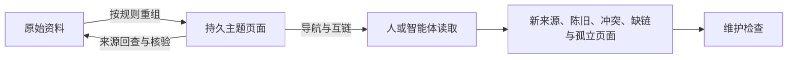

# 第二章：LLM Wiki 从原始文档到可追溯知识层


## 1. LLM Wiki的产生背景与工作定义

前两场课程已经建立了 DeepSeek Harness Studio、Workspace、Session、Agent Preset、Skills 与 Plugin/MCP 的基础操作和对象区别。进入 LLM Wiki 后，“知识库” 在实际项目中经常指向完全不同的对象：一个集中存放文件的目录、一套带全文搜索的文档站、一条先检索再回答的 RAG 链路，或者由实体和关系组成的知识图谱。它们都能帮助用户使用知识，却分别解决保存、查询、关系表达等不同问题。LLM Wiki 关注的是另一个容易被忽略的环节：原始资料已经存在之后，怎样把散落在不同文档中的知识持续整理为可以反复读取、彼此连接并回查依据的主题知识层。

这里的 “LLM Wiki” 是本课采用的工作定义，不是已经形成统一规范的行业术语。判断一个系统是否符合这个定义，应当观察它怎样处理来源、页面、规则、链接、查询和维护，而不能只看产品名称、页面外观或是否带有聊天框。

### 1.1 从查询时组织到持久知识层

2020 年的检索增强生成(Retrieval-Augmented Generation，RAG) 原始论文把参数化生成模型与显式的非参数记忆结合起来：系统在回答知识密集型问题时检索外部内容，再利用命中的内容生成结果。论文中的具体实现使用 WikiPedia 稠密向量索引，但它承担的核心职责是查询时取证并辅助生成，不等于规定了 2026 年所有 RAG 系统都必须采用同一种向量索引。

RAG 解决了“回答之前到哪里找证据”的问题，却没有天然规定“多次查询之间怎样保存已经形成的主题理解”。如果一个团队的资料分散在产品说明、设计记录、运维手册和故障复盘中，同一个概念可能在四份文档里各出现一部分。每次提问都可以重新搜索这些文件，但跨来源得到的主题结论通常只停留在当次回答中；下一次遇到相近问题，系统还要重新定位、阅读和组合来源。

2026 年4 月 4日，Andrej Karpathy 发布的 LLM Wiki idea file 把另一种做法描述为一个 pattern：在原始来源与用户之间维护一层持久、互链的 Wiki，使已经整理出的知识不必在每次查询时从头派生。该文件还区分了 rawsources(原始来源)、Wiki与schema(结构和工作流规则)，并以 ingest(纳入来源)、query(查询)、lint(检查)等操作说明来源进入、知识读取与持续维护的职责。原件同时强调它表达的是一种模式，而不是特定实现；向量检索、MCP、具体目录和输出形式均可按需要选择。

图中是 Andrej Karpathy 公开的 llm-wiki.md ideafile 原件，不是标准规范。原件写道："incre maintains a persistent wiki"。这支持持久、互链和增量维护的模式；不能据此推出 LLM Wiki 已有统一标准，也不能把它与 LLM Council 联系起来。

2026年 5 月提交的论文 Retrieval as Reasoning: Self-Evolving Agent-Native Retrieval via LLM-Wiki 则给出了—个具体研究系统：文档被整理为带双向链接的结构化 Wiki 页面，智能体通过 `search`、`read`、`follow-link` 等接口执行多步检索。它说明持久化的主题知识组织可以服务智能体检索已经有明确的系统化研究实例，但不能据此认定该论文与前述 ideafile 属于同一实现或存在已证实的直接影响关系。


图中是 2026 年论文 Retrieval as Reasoning: Self-Evolving Agent-Native Retrieval via LLM-Wiki 摘要将其研究对象表述为:"external knowledge as a compilable composable, and self-evolving sururture"。这支持持久化知识结构服务智能体检索已有特定论文实现；不能证明它与 Karpathy 的 ideafile 同也不能把论文中的 Error Book、双向链专或工具楼口规定力通用标准。

这条发展线并不是“文档搜索先被 RAG 淘汰，RAG 又被 LLM Wiki 淘太”的营代史。更准确的理解是：又档保存、查询时险家构化关系表达E持久王题重组逐步形成了可以组合的不同层一个完整系统完全可以同时保留原始文档、维护主题WikI、建立图结构，并债用RAG回答问题


### 1.2 本课采用的 LLM Wiki 工作定义

在本课中，LLM Wiki指：**由 LLM 或智能体按照明确规则，把只读来源重组为持久、可互链、可回溯并能继续维护的主题知识层；查询优先读取这层知识，并在需要核验时回查原始来源**。

这个定义包含五项承重特征:

1. **来源与派生知识分离**：原始资料保存作者的原始叙事和事实上下文，不能为了方便整理而被知识页面覆盖。Wiki 页面是从来源形成的派生产物，可以重建、修订和更新。
2. **知识按主题持久化**：页面围绕概念、系统、操作或策略等主题组织，而不是机械地对每篇文档各写一份摘要。同一页面可以综合多篇来源，同一来源也可以支持多个主题页面。
3. **结论可以回查依据**：来源引用回答“这条结论依据什么”。引用必须能回到真实原件；页面存在、文字流畅或模型自称已核验，都不能替代这一关系。
4. **页面之间存在可用连接**：内部链接回答 “理解当前主题后还应读什么”。链接用于扩展上下文和形成导航，但链接数量本身不代表知识质量，也不能自动把 Wiki 变成完整知识图谱。
5. **知识层具有维护机制**：新来源进入后，系统需要识别受影响页面，处理陈旧、冲突、缺链和孤立页面，并保留变化记录。所谓 “持久” 不是内容写入后永久正确，而是知识有明确位置，可以持续检查和修订。

这五项特征描述的是知识层的职责，不是固定技术栈。Markdown、特定页面元数据头、固定页面类型、机器清单、浏览器界面、向量数据库和知识图谱都可以成为某个实现的一部分，却不是所有 LLM Wiki 必须具备的统一组件。本课后续出现的目录名、页面数量和浏览方式，也只是为了把这些职责放进一个可观察的小型实例。

### 1.3 六类对象怎样组成知识链

LLM Wiki 的核心并不是一批页面，而是一条能够从结论返回依据、从当前主题继续扩展、从新来源触发维护的对象链。



这条链中的对象分别承担以下职责：

| 对象 | 主要职责 | 不能由什么信号替代 |
| --- | --- | --- |
| 原始资料 | 保存原始事实、上下文、版本和出处，是后续结论的事实入口 |文件已经被模型读过，不代表其中事实正确或已经形成知识层 | 
| 主题页面 | 把跨文档信息重组为可反复读取的概念、系统、操作或策略知识 |一文一摘要或把原文切成小文件，不等于完成主题重组 |
| 规则层 | 约束页面结构、引用方式、链接方式、证据不足处理和更新责任 | 有一份规则文件，不代表规则已经被执行 |
| 来源引用与内部互链 | 分别提供事实回查和上下文扩展 | 链接多、页面多或界面精美，不代表结论可靠 |
| 导航、维护记录与机器清单 | 让人找到页面，让维护者看见变化，让程序稳定读取当前知识对象 | 统计一致只能说明对象对得上，不能自动证明内容正确 |
| 查询与维护动作 | 一个最终答案或一次成功运行，不能证明查询过程有依据 | 定位页面、沿链接补充、必要时回查来源，并检查冲突、陈旧和孤立知识 |


///caption
LLM Wiki的可追溯知识链
///

### 1.4 文档库、RAG与知识图谱的位置

文档库、LLM Wiki、RAG 和知识图谱不是四个只能选择其一的产品类别，而是可以叠加的职责层。

- **文档库提供原料**：核心产物是原始文件及其目录、元数据和版本。它擅长保存原件，也可以提供全文搜索；但“能够搜索文件”不代表跨来源主题知识已经形成。
- **LLM Wiki组织持久知识**：核心产物是主题页、来源引用、内部互链和维护记录。它把资料进入后的持久主题重组放在查询复用之前，减少相近问题反复从原始叙事中重新组织主题的需要。
- **RAG提供查询机制**：核心动作是先检索证据，再用证据增强生成。检索对象既可以是原始文档，也可以是Wiki页面或其他索引；是否使用LLMWiki，不由“有没有聊天框”决定。
- **知识图谱提供显式关系表示**：核心产物是带明确语义的节点、边及其派生结构。Wiki 页面和内部链接可以投影成图，但普通页面链接并不自动具备实体类型、关系语义、消歧和图查询合同。


///caption
LLM Wiki的可追溯知识链
///

图中是 2020年原始 RAG 论文的 arXiv 标题与摘要页。摘要把论文方法表述为：“combine pre-trained parametric and non-parametric memory for language generation"，这支持把 RAG 定位为检索增强生成机制；论文实例使用 WikiPedia 稠密向量索引，但不能推出所有 RAG 都必须使用同一种向量库。

[Microsoft GraphRAG](https://microsoft.github.io/graphrag) 是这种可组合关系的具体例子。其官方流程会从 raw text 形成实体、关系、社区和社区报告，再以Local、Global、DRIFT 等方式查询；Local Search 还可以同时使用图数据与原始文本片段。GraphRAG 因而是一种利用图结构增强检索与生成的具体系统，不是所有知识图谱的同义词，也不是 LLM Wiki 的替代名称。


///caption
An LLM-generated knowledge graph built using GPT-4 Turbo.
///


图中是 Microsoft GraphRAG 官方文档主页内容，画面直接显示知识图谱和过程说明。官方将 GraphRAG 称为：“structured,hierarchical approach to Retrieval Augmented Generation (RAG)"，这支持 GraphRAG 从原始文本抽取图、构建社区层级与摘要，再把这些结构用于RAG；不能把Markdown 互链直接等同知识图谱，也不能把 GraphRAG 当作所有知识图谱的定义。

面对一个新系统时，可以用三个问题先确定各对象的位置：**事实原件保存在哪里；跨来源主题知识是否在查询之外被持续保存；一次回答怎样找到证据并回到原件**。如果系统还显式维护实体与关系，再继续检查图结构由什么抽取、怎样更新、支持什么查询。这样的判断不依赖产品命名，也不会把浏览界面、检索算法和知识组织层混为一谈。

### 1.5 价值、适用条件与停止边界

LLM Wiki 的主要价值来自知识的持续复用，而不是页面形式本身。

- **减少重复理解**：稳定的主题页让后续查询先读取已经形成的知识，再按需要回查来源，而不必每次从多篇作者叙事重新开始。
- **支持跨来源重组**：产品规则、实现说明、故障记录和安全边界可以围绕同一主题汇合，同时保留各自依据。
- **兼顾人和智能体阅读**：人可以沿导航和链接建立系统认识，智能体可以读取结构化页面、来源和机器入口继续执行任务。
- **保留可追溯性**：结论可以回到原始资料，新增证据也能定位受影响页面，使知识更新具有可检查对象。
- **形成渐进维护入口**：冲突、陈旧、缺链和孤立页面可以被持续发现，而不是散落在一次性回答中。

这些价值成立需要相应条件。语料通常包含多份有交叉关系的资料；同一批知识会被团队反复查询、解释或用于后续任务；来源能够保留版本并允许引用；主题结构具有一定稳定性；同时还需要明确的规则和维护责任。团队知识、长期项目文档、持续研究资料、客服知识和运维经验通常具备这些特征。

如果任务只是查询单篇短文中的一个事实，或者资料只使用一次，额外维护主题层的成本可能高于收益。资料变化极快却没有维护责任、来源无法保存版本、权限不允许建立派生知识，或者系统只需要确定性字段查询时，也不应因为名称新颖而强行引入 LLM Wiki。

LLMWiki还不能自动解决来源错误、事实冲突、知识过期、权限治理和回答幻觉。它不会因为使用LLM就自然获得正确性，也不会因为具有互链就自动成为知识图谱，更不会因为可被查询就自动具备高质量RAG。大规模切分、Embedding、向量数据库、召回与重排、实体抽取、社区聚类、自动冲突消解、多租户、审计、容灾和评估，均属于需要单独设计和验证的工程能力。


因此，判断 LLM Wiki 是否成立，最小标准不是 “生成了多少页”，而是 **原件是否保留，主题知识是否持久，结论能否回查，页面能否扩展，新增证据是否有维护入口**。下一步将把这套关系放进四篇内容交叉的 DSH 原始资料中：先保留只有原始资料时的查询基线，再观察主题页面怎样在不改写原件的前提下形成。到那时，工作定义才会从对象地图进入真实文件。

## 2. 从原始资料到主题知识页

前一部分已经把原始资料、持久知识页、来源引用和内部互链放到了各自的位置。现在需要观察这组对象怎样在真实资料中形成。起点不是空目录，而是 `content/raw/` 中四篇已经可以搜索、也足以支持临时问答的DSH技术资料。问题恰恰在这里：**能搜索到原文，不等于已经形成可以反复读取的主题知识层**。

### 2.1 四篇 raw 保存的是来源原件

隔离 Workspace 的 `content/raw/` 中有四篇 Markdown:

| 来源 | 原文的主要叙事 | 与其他来源交叉的主题 |
| --- | --- | --- |
| `R1-dsh-workspace-session.md` | Workspace、Session `cwd`、持久历史与文件可见范围 | Preset 在 Session 中生效、权限边界、交付证据 |
| `R2-dsh-agent-preset.md` | Agent Preset 的 composition、生效时机与失败恢复 | Skill、Plugin/MCP、Subagent、Host 权限 |
| `R3-dsh-skills-plugins-mcp.md` | Skill、Plugin 与 MCP 的职责和各自成功信号 | Preset 装配、凭证、工具验收 |
| `R4-dsh-team-security-credentials.md` | 父子 Agent 委派、Session 权限与凭证消费 | Preset、Plugin/MCP、Workspace 可见范围、交付验收 |

这四篇资料都有完整标题、事实时间、运行版本和结论边界。例如 R1 解释Workspace 是对既有目录的持久登记，而 Session 是带 `cwd`、装配、权限和事件历史的运行对象；R2 解释 Preset 怎样组合角色、规则、Skill 与工具；R3 区分方法层、运行时装配和外部工具连接；R4 把委派、权限和凭证放在同一套有效边界中。它们不是为了 Wiki 临时拼出的短句，而是可以独立阅读的来源原件。


///caption
图：R1 冻结 Markdown 的确定性排版渲染，不是编辑器或 DSH 原生界面。画面同时保留 `fact_cutoff`、运行版本、证据边界与正文开头；应观察 “Workspace 是 Host 对既有真实目录的持久登记对象” 以及登记不会生成 Git 仓库、Skill、Preset 或 Wiki。rc.6条目来自本地验证，rc.11 条目只表示截至2026-08-19的官方源码合同。
///


///caption
图：R2 冻结 Markdown 的确定性排版渲染，不是原生配置界面。正文开头明确显示 Preset 把角色、工作规则、Skills、Plugin/MCP与标准工具组合成可复用的主 Agent 工作方式。Preset 装配和新 Session 生效有运行依据，仍不能由此推出外部能力已经完成真实调用。
///


///caption
图：R3 冻结 Markdown 的确定性排版渲染，不是 Plugin Center 或 MCP 客户端界面。可见原文分别把 Skill 定位为方法层、Plugin 定位为 Harness 生命周期与装配单元、MCP 定位为外部 Server 的协议面。MCP 部分只有当前官方源码合同支撑，不能从这张图推出本机 MCP 已调用成功。
///


///caption
图：R4 冻结 Markdown 的确定性排版渲染，不是团队管理或权限后台。正文开头说明 subagent 允许父 Agent 将边界清楚的任务委派给子 Session，并进一步区分 Session 操作权限与组织身份系统。权限档位不是企业 RBAC，`0600` 也不代表同 UID 工具进程绝对无法读取凭证。
///

原件的组织方式服从各自作者的叙事，因此同一问题往往分散在多篇文件中。“Preset 何时真正生效” 主要在 R2，但 Session 的上下文来自 R1，Skill 与 Plugin 的生命周期来自 R3，Host 和权限限制又来自 R4。反过来，R2 也不只服务 Preset 页面，它还会支持Skill、Plugin、委派和交付判断等多个主题。这已经埋下了一个重要关系：来源与主题页不会是一一对应。

打开该目录时，四个文件的权限位均显示为只读：

```bash
-r--r--r--  R1-dsh-workspace-session.md
-r--r--r--  R2-dsh-agent-preset.md
-r--r--r--  R3-dsh-skills-plugins-mcp.md
-r--r--r--  R4-dsh-team-security-credentials.md
```

这里的 `raw` 表示 “作为依据保存的来源原件”，不是 “格式混乱、可以随手清洗覆盖的临时文件”。主题页可以修订和重建，R1-R4 不因页面措辞变化而被反向改写。页面如果出现问题，应修改页面规格或派生页；原文事实需要更新时，则应新增有身份和时间边界的来源。只有保留这条分界，页面中的结论才有稳定的回查对象。


!!! question "提问"
    
    这次提问来自官方 DSH CLI0.1.0-rc.7 的新 Session，不是 Studio rc.11 Desktop 画面。输入原文如下：

    请只依据当前 Workspace 的 `content/raw/` 回答：Plugin、Agent Preset 与完整 AI 应用分别是什么？运行 FF-LLM Wiki 是否所有步骤都需要 DeepSeek API Key？请先搜索相关文件，再打开实际使用的来源；用相对路径引用证据。语料没有支持的部分请明确写“证据不足”，不要用外部常识补答。

同次 Session 的可见事件依次列出了 Workspace、发现四篇 raw、打开R1-R4、搜索Plugin、Preset、AI 应用、FF-LLM和 API Key等关键词，最后生成回答。这里能够确认的是实际发生的 `glob`、`read`、`grep` 等工具动作；看不到、也不需要猜测模型的隐藏思考过程。

!!! info "回答"

    原始回答对有依据和没有依据的部分作出了不同处理：

    - Plugin 是 Harness 的生命周期和装配单元，使能力进入 Host/Agent 运行树。
    - Agent Preset 用于把角色、工作规则、Skills、Plugin/MCP 与Harness 标准工具组合成可复用的主Agent 工作方式。
    - 完整AI 应用:证据不足。
    - 运行 FF-LLM Wiki 是否所有步骤都需要 DeepSeek API Key:证据不足，无法回答。


