# 第三章 认识最终项目：开发全路线与DSH环境装配

## 1. 最终产品与对象关系

上一模块（01）已经建立了从原始资料到知识页、索引、引用、互链和查询结果的基本对象关系。FF-LLM Wiki 把这条关系落实成一套完整产品：资料先进入可管理的处理流程，随后形成可浏览的 Wiki；知识页继续提供关系数据和检索证据；问答把证据送到用户面前；评估再检查整条链路是否稳定。完整产品的重点不在“页面很多”，而在同一批知识对象能够被连续生产、使用和检查。

### 1.1 两套成片呈现同一个产品目标

电影级演示负责建立整体目标。播放时先辨认 DSH 中的应用入口，再观察资料中心、Wiki、知识图谱、问答和评估是否始终属于同一套界面与数据语境。片中的开发画面是来自真实操作记录的蒙太奇，不能据此推断每一步的实现机制。

功能演示适合暂停观察状态变化：资料提交后经历处理过程，知识图谱读取已经形成的关系，模型先完成可用性验证，问答随后以流式方式返回正文与引用证据。视频保留了提交、处理中、完成和最终结果，因而可以确认这些状态确实出现在同一产品链中；它仍不能替代后续的源码和机制讲解。

### 1.2 七个入口组成一条用户旅程
#### 1.2.1 知识工作台：读取全局状态

知识工作台是进入系统后的总览。它同时读取知识资产统计、问答评估结果、构建流水线状态、最近资料和图谱预览，把分散在各页的结果汇总成一张运行地图。图中的47个知识页、98个来源引用、99条语义互链以及93.4的当前评估结果，都是这个版本的快照；工作台展示已有对象的状态，不负责替代各对象的生成过程。


#### 1.2.2 资料中心：让输入可管理、让失败可恢复

资料中心接收的是资料记录及其处理状态。默认列表把搜索、筛选、分页、类型、业务主题和处理状态放在同一入口；切换到“异常”后，可以看到失败原因和“重新处理”动作。提交重处理后，异常数由8变为7，处理中由10变为11，并出现明确反馈。这组前后状态比一张“完成”画面更重要：成功判断不是按钮被点击，而是目标资料离开原失败集合并进入新的处理状态。


详情弹窗用于查看单条资料的来源、类型、业务主题和处理信息；导入弹窗提供新资料的入口。这些界面共同闭合“进入一检查一失败一恢复一继续”的资料管理路径。当前版本记录资料元数据和处理状态，不能据此声称已经完整解析所有PDF或 DOCX 正文。


#### 1.2.3 Wiki知识库：把资料组织为可用知识页

Wiki 入口消费已经编译出来的主题页、来源引用和内部互链。首页先展示知识页清单与统计；搜索负责定位主题；概念页呈现当前主题内容；跨来源视图让同一主题的多个依据并列出现；相关页把内部互链变成继续阅读路径；重新编译则把源资料变化重新传递到派生知识层。


这里的关键判断是“页面能否回到来源，并继续走向相关知识”，而不是知识页数量是否足够大。Wiki 是后续图谱与问答共同依赖的知识层，因此源资料与派生产物不能混为一份可随意改写的内容。

#### 1.2.4 知识图谱：读取同一知识层的关系数据

知识图谱消费的是由知识层抽取并校验后的节点、边和类型信息。主视图把75个节点、291条边以及6个业务主题组织为可交互关系；搜索聚焦某个对象，结构视图切换观察层次，筛选则缩小主题或关系范围。三个动作改变的是观察投影，不是另建三份数据。


图谱提供关系浏览能力，但不能代替来源文本。需要核查事实时，用户仍应回到Wiki页面和原始引用。

#### 1.2.5 Agent智能问答：把回答与证据放在一起

问答空态先给出可提问范围和示例，避免把输入框误解成无边界聊天。发送问题后，中间区域呈现回答，右侧证据工作区同时给出检索范围、命中片段、采用证据和置信信息。点击正文中的引用编号可以定位对应证据，再从证据卡打开Wiki 原文；当问题缺少足够限定时，产品进入澄清状态，而不是强行组织答案。亮色主题只改变显示方式，不改变检索对象和引用关系。


这一路径消费的是Wiki检索结果和引用对象。在上述最终交付态中，配置可用时由DeepSeek基于证据生成回答；调用失败时转为本地确定性降级。

#### 1.2.6 评估与优化：检查问答链而非凭感觉试问

评估入口消费固定题目、逐题运行结果和指标报告。总览显示当前运行，指标页拆开覆盖、忠实、引用、拒答和检索等维度，对比页把优化前后的同一组条件放在一起，用例页保留具体失败，重放区则显示固定时间、串行执行、状态隔离和生产隔离等约束。只有题目、评估器和重放条件一致，90.1到93.4的变化才具有对照意义。


这些数字只描述当前题库和当前评估规则，不能推广为产品在任意知识主题上的普遍准确率。

#### 1.2.7 系统设置：管理问答运行条件

系统设置页消费模型服务状态、当前模型、知识数据状态和生成参数。初始画面显示凭证的脱敏状态；执行最小连接验证后，页面给出明确成功反馈。判断成功要看真实调用返回，而不是仅凭输入框里存在掩码。延迟数值是录制时的单次结果，不是其他机器上的性能承诺。


至此，七个入口可以还原为一条对象流：资料记录与处理状态进入知识编译，形成Wiki页面、引用和互链；知识层继续形成图谱合同与检索对象；检索证据进入回答，固定题库和运行报告再评估问答链。工作台读取全局结果，系统设置提供问答运行条件。任意一页脱离这条对象流，都只能说明局部界面存在，不能说明完整知识工程已经成立。

### 1.3 产品本体、DSHHost与最终应用插件

FF-LLM Wiki 可以从 DSH 启动，但产品并不“只存在于DSH页面里”。安装 `@fufan/dsh-plugin-11m-wiki@1.1.2` 后，DSH 应用中心出现 FF - LLM Wiki卡片和侧栏入口；点击“打开应用”后，DSH Host保持原页面，系统浏览器打开独立的完整知识工作台。


三个对象的责任边界如下：

| 对象 | 负责什么 | 不负责什么 |
| :--- | :--- | :--- |
| 完整 FF-LLM Wiki 项目本体 | 页面、API、SQLite 数据、资料处理、Wiki、图谱、问答与评估 | 不负责把自己注册到 DSH 应用中心 |
| DSH Host | 提供插件安装与启动环境、应用中心入口和平台凭证服务 | 不承载 FF-LLM Wiki 的七个产品页面与业务实现 |
| `@fufan/dsh-plugin-llm-wiki@1.1.2` | 封装同步的应用基线，增加 Host 启动、平台凭证传递和运行路径适配 | 不是产品本体，不是 Agent Preset，也不是开发期工具插件 |


凭证关系也遵循这层分工。DSH模型设置只显示DeepSeek已配置状态，不显示密钥明文；最终应用插件通过Host的凭证服务把所需值注入服务端进程；FF-LLM Wiki设置页只显示脱敏状态，并执行最小模型验证。验收记录中的真实调用成功说明这条适配链当时可用，但不会把凭证写入前端、安装包或项目文件。


因此，最终应用插件不会改写DSH原有产品代码，也不会把DSH自身变成知识库产品；插件安装完成更不能等同于产品开发完成。最终产品和对象身份已经明确，接下来的问题是：资料、知识页、关系、问答与评估这些能力，究竟按照怎样的依赖顺序逐步生长出来？

## 2. 从运行基线到图谱数据

这条增量路线从统一运行基线开始，并以每个阶段留下的可验证项目状态为坐标。

这里先建立一个贯穿后续开发的判断框架：一个阶段只有同时出现了明确输入、实际能力调用、代码或配置变化、最窄验证以及用户可见结果，才算形成了可继续前进的项目状态。阶段名称、提交记录、截图数量和Agent的完成说明，都不能单独替代这个闭环。


### 2.1 STAGE-00～10的因果坐标

真实Prompt总路线把完整历史分为11个主阶段。它们不是并列功能清单，而是一条逐层增加约束的开发链：

| 阶段 | 上一状态缺少什么 | 本阶段形成的直接结果 |
| :--- | :--- | :--- |
| STAGE-00 | 工作区、模型、权限与视觉能力尚未统一 | 首条开发 Prompt 之前的共同运行基线 |
| STAGE-01 | 空目录里没有可运行产品 | monorepo、共享合同、Web/API 骨架和满载工作台 |
| STAGE-02 | 每轮都要重新强调工程纪律 | 可重复选择的 `LLM Wiki 全栈工程师` Preset |
| STAGE-03 | 首页有统计数据，但资料不可操作 | 资料搜索、筛选、分页、导入、失败、重试和详情闭环 |
| STAGE-04 | 原始资料仍按各自作者的叙事存在 | 可重建、可引用、可互链的编译式 Wiki |
| STAGE-05 | Wiki 页面还不是稳定图数据 | 可重复生成的节点、边与检查器合同 |
| STAGE-06 | 节点边已经存在，但最小交互链未验证 | 消费真实 API 数据的基础 SVG 图谱 |
| STAGE-07A | 团队缺少统一的系统视图 | 可编辑、可导出的架构沟通资产 |
| STAGE-07B | 基础图谱难以识别关键关系 | 同一数据合同上的正式图谱体验 |
| STAGE-08 | 用户能阅读知识，但不能提问并核查依据 | 检索、流式回答、引用联动与无证据拒答 |
| STAGE-09 | 零散试问无法形成质量判断 | 固定题库、指标、基线、优化与回归门 |
| STAGE-10 | Agent 自报完成不能作为交付依据 | 浏览器全链路、工程验证、截图和接手文档 |


这张坐标中有三类不同产物。STAGE-01、03、04、05、06、07B、08、09持续增加产品代码和数据合同；STAGE-02装配开发会话的工作方式；STAGE-07A交付工程沟通资产；STAGE-10负责验收和交接。把它们分开，才能看清“能力装配”与“产品开发”并没有互相替代。

### 2.2 STAGE-00：先固定运行基线

第一轮代码尚未产生之前，DSH已经需要确定四个对象：Workspace指向哪个目录、使用哪个PRO模型、当前允许怎样访问文件，以及视觉增强是否可用。DSH环境配置记录的真实环境是 `LLMWikiReproduction` Workspace、`DeepSeek-V4-Pro`、工作区写入模式和已验证的视觉增强。


这张图需要同时观察输入框上下两处：上方Workspace是LLMwikiReproduction，下方可见工作区写入、视觉增强和DeepSeek-V4-Pro。它只证明后续任务从统一会话状态开始，并不证明任何产品代码已经生成。视觉增强也只用于检查白屏、层级、文字可读性等画面问题；按钮是否可用、数据是否真实，仍要由点击、API、console和测试共同判断。

这一步的恢复原则也很明确：路径不对就先切回正确Workspace；模型、访问模式或视觉能力不可见，就不要发送阶段Prompt。否则后面即使生成了文件，也很难判断它们写到了哪里、使用了什么能力。

### 2.3 STAGE-01：空目录开始产生可运行代码

STAGE-01是最容易被误读的地方。它不是“先规划工程”，而是从空目录直接创建一个可以启动的全栈项目。工程底座Prompt明确要求建立`pnpm workspace`，至少包含 `apps/web`、`apps/api` 和 `packages/contracts`；Web 使用 Next.js、React与 TypeScript，API使用Fastify，并提供 `/health` 和 `/api/overview`。Wiki、图谱和问答此时可以保持占位，但首页必须能够真实读取统一业务数据。

`packages/contracts` 是这一轮尤其重要的增量。统计卡、最近文档和处理进度不能由前端随意拼一套字段、后端再返回另一套字段；共享合同先固定双方都要遵守的数据形状，Web优先读取API，API不可用时才使用同结构的预置数据并明确标识状态。这样，首页即使在第一阶段使用的是预置业务数据，也已经具备可替换后端实现的工程边界，而不是一张与API无关的静态效果页。


Prompt 的停止条件同样属于输入的一部分：只完成工程底座，实际运行 `typecheck` 与 `build`，不要提前实现文件解析、RAG、图谱算法或模型调用。对应的关键验证命令是：

```bash
pnpm typecheck
pnpm build
pnpm test
pnpm dev
```

四条命令分别回答类型合同是否闭合、生产构建是否成立、API行为是否符合预期，以及 Web/API 能否一起启动。真实过程中还修复了pnpm 11阻止 `esbuild` 安装脚本、共享contracts 缺少TypeScript依赖两类问题。修复以后，类型检查、构建、3项API测试、编译API启动和根目录开发启动链均通过。


完成画面中可以看到启动命令、产物文件和“当前阶段还没有做什么”。这个边界很重要：此时已有真实Web／API工程和满载Dashboard，但文档正文解析、SQLite真实迁移、RAG、图谱与模型调用仍未实现。代码增量集中在 `apps/web`、`apps/api`、`packages/contracts`，可由阶段变更索引定位。

STAGE-01检查点保存的是这一里程碑的源码快照。它的作用是回看差异、定位恢复起点，而不是要求学员在本章解压运行。检查点存在只能说明这份阶段状态可恢复，不能替代当时的测试和页面结果。

### 2.4 STAGE-02：装配工作方式，不改产品源码

工程底座成立以后，新的问题不是“再写一个功能”，而是每轮都要重复声明范围、Skill读取、测试、视觉验收和停止条件。STAGE-02因此切换到DSH的创造模式，把标准模式复制并定制为LLM Wiki全栈工程师。Preset创建Prompt点名目录ID、显示名称和七条开发约束，并明确要求不要修改产品源码。


标准模式提供文件、Shell、Skills、计划和工作流等通用编码底座；创造模式负责读取、复制和定制Preset。最终产物不是一段聊天提示词，而是用户Preset目录中的真实配置：`preset.yml` 保存名称、说明与排序，`agent.cordis.yml` 保留标准编码工具，并加入中文 persona、Skill发现和分阶段验证纪律；随附的 `find-plugins` Skill 继续提供插件发现能力。

真实创建过程没有一次成功。临时注册的探针工具没有进入当前轮次已经冻结的工具表，随后出现重复空调用。恢复Prompt没有要求“继续尝试”，而是根据已观察事实收窄路径：停止探针、读取标准模式与发现规则、复制标准Preset，再只修改显示元数据和persona。因为用户级Preset目录位于Workspace之外，写入还必须经过一次明确审批。


审批画面证明的是作用域边界：产品代码仍留在Workspace，Preset写入DSH用户级目录。之后再做 YAML解析、Preset 发现和 `broken` 状态检查。


两个画面分别回答“配置能否被DSH发现”和“新会话能否真正选择”。STAGE-02的成果到此为止：开发纪律变成了可重复装配的会话能力。Preset不会替用户选择Workspace、模型、访问权限或视觉增强，更不会自动生成产品代码。

### 2.5 STAGE-03：资料中心本身就是前后端产品

STAGE-01的首页已经显示128份资料，但这些数字还不能搜索、筛选、导入或恢复异常状态。STAGE-03的输入因此不是“处理一批数据”，而是“让业务人员完成一次资料操作闭环”。资料中心Prompt要求先读取`product-form-design-pack`，再把前台业务语言、明确视觉约束和真实点击验收带入实现。

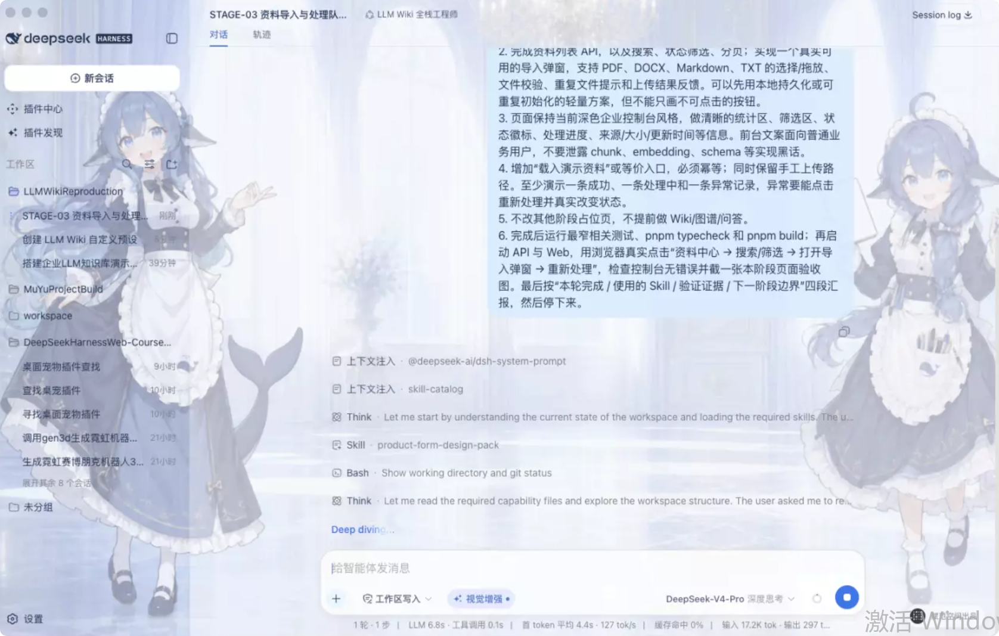

代码变化从共享合同延伸到后端和前端：`apps/api/src/data` 保存统一 fixture/seed与repository，documents routes提供搜索、状态筛选、分页、上传和重新处理接口，`apps/web/src/app/documents` 与相应组件实现资料中心页面。上传路径支持PDF、DOC、Markdown、TXT的选择或拖放，但此阶段只保存文件元数据与处理状态，没有完成PDF／DOCX正文解析。

资料状态也不是装饰性标签。成功、处理中和异常记录共同构成可验证的状态机：筛选必须返回对应集合，异常项点击“重新处理”后必须真实更新后端状态和统计，重复文件与格式错误则要在导入入口给出明确反馈。预置资料由幂等初始化自动载入，正式页面不提供“载入演示数据”按钮；这样重复启动不会越积越多，用户路径也保持在真实资料操作上。

验证不能停在“接口文件已写入”。后端最窄测试、类型检查和构建通过以后，还要启动应用，沿“资料中心→搜索／筛选→导入弹窗→重新处理”真实点击。结果画面记录了搜索唯一命中、异常筛选、异常数从8变为7、导入弹窗出现，以及console无error／pageerror。

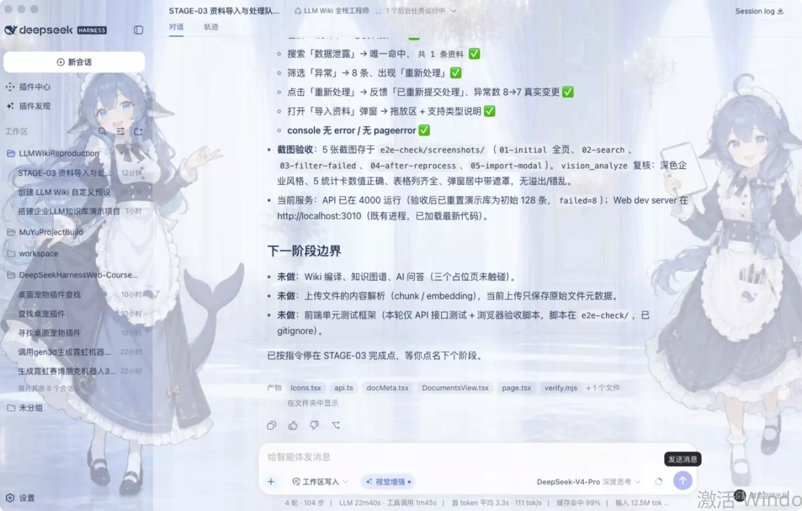

这个结果说明128份资料已经形成可操作的产品状态，不说明128份文件正文已经被解析。若重新处理后数字不变，应依次核对重新处理API的返回、实际SQLite持久化位置、最窄API测试和浏览器旅程，而不能只刷新页面宣布完成。STAGE-03检查点保存的是资料闭环成立后的恢复点。

### 2.6 STAGE-04：把原始资料编译成可治理知识层

资料可操作以后，内容仍按原文件的作者叙事存在，尚不能稳定支撑跨来源阅读。STAGE-04引入“编译式Wiki”：原始资料只保存一次，规则层决定知识页面结构，确定性编译器生成可再生产物。编译式 WikiPrompt点名compiled-rag-pack，并要求读取源不可变规则与Wiki编译方法。

这一阶段同时增加四层真实对象：`content/CLAUDE.md` 是页面schema和链接约定，`content/raw/` 保存18份只读基准资料，`content/wiki/` 保存编译页面、`index.md`、`log.md` 与机器可读编译清单，`apps/api/src/wiki` 和 Wiki 页面负责让用户搜索、筛选、打开详情、沿内部链接跳转并触发重新编译。它不是把一份源文件改名为一页，而是按concept、system、playbook、policy等知识单元跨来源重组。

“编译”可以用源代码构建来理解：`raw/` 相当于不可被构建过程偷偷改写的输入，规则层规定输出格式，`wiki/` 是可以删除后重新生成的派生产物。稳定 `slug` 使内部链接在重复编译后仍能指向同一知识单元，`sources` 使结论能够回到原始资料，`log.md` 说明这一轮发生了什么变化。只把原文逐份复制到新目录，即使文件数量增加，也没有完成跨来源重组，更没有获得可治理的知识层。

```bash
pnpm wiki:compile
python3 .agents/skills/compiled-rag-pack/scripts/verify_source_immutability.py content
pnpm test
pnpm typecheck
pnpm build
```

真实编译结果是18个来源形成47页、98条来源引用和99条内部链接；随后最窄Wiki测试、完整类型检查、构建和浏览器E2E通过。

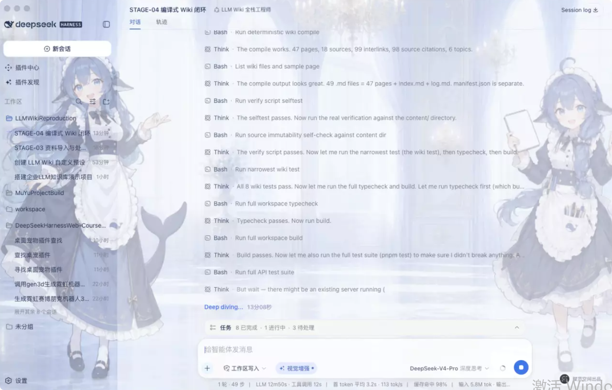

这些数字说明编译产物的实际规模和引用结构，不自动等于知识质量。质量判断仍需打开跨来源页面，核对正文是否真正重组、`sources` 是否可回查、内部链接是否指向真实页面，并确认重新编译不会改动 `raw/`。

这一阶段还保留了一次必要的恢复：验收时误把3000端口上的外部项目当成本项目进程。纠正动作先用后台任务、PID和cwd确认归属，只停止本阶段误启动的进程，保留外部服务，让LLM Wiki 继续使用 Web 3010、API 4000。

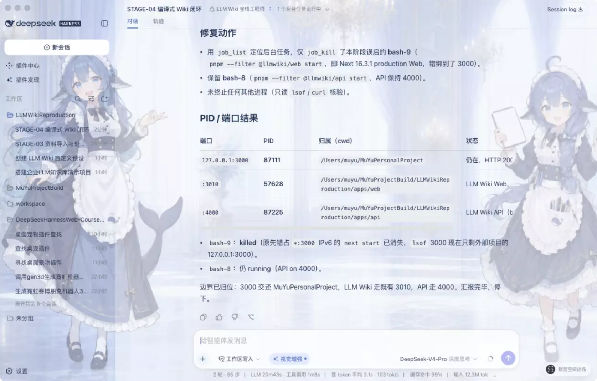

恢复后的结果说明浏览器链路指向了正确项目，也展示了一条可迁移原则：端口相同或相近不能证明进程归属，停止后台任务前必须同时核对PID与cwd。STAGE-04检查点保存了这份可再编译知识层。

### 2.7 STAGE-05：让关系成为稳定数据合同

47个Wiki页面已经可读、可引用、可互链，但前端不能把Markdown页面直接当作稳定图谱输入。图谱需要固定字段、确定性ID、合法边端点和可重复生成的输出。STAGE-05因此先做数据地基，不急于制作复杂画布。

图谱数据 Prompt 明确点名 `rag-graphrag-pack` 及其Bridge管道能力，但同时限定当前项目没有外部模型密钥，不得假装调用LangExtract或线上大模型。实际实现读取机器可读编译清单、页面frontmatter、标题、来源和`[[wiki/...]]` 内链，通过本地规则确定性地产生 `output/kg_nodes.json` 与 `output/kg_edges.json`。

节点合同至少包含 `id`、`name`、`type`、`source_doc`、字符位置、置信度与页面；边合同至少包含 `source`、`target`、`relation`、`doc_id` 与页面。`apps/api/src/graph` 进一步提供概览、节点／边列表和重新抽取接口，所有统计从真实输出文件计算，而不是写在组件里。

这些字段各自承担不同的恢复责任。稳定 `id` 让前端可以保存选中状态，`type` 支持后续筛选和图例，`source_doc`、`doc_id` 与页面位置把节点和边送回来源证据，`source`、`target` 则必须指向实际存在的节点。如果只有名称和展示坐标，图谱也许能画出来，却无法稳定重建、排查悬空关系或继续支持引用查询。数据合同的意义正是把“看起来像图的数据”变成多个后续页面都能可靠消费的产品接口。

```bash
pnpm graph:extract
python3 .agents/skills/rag-graphrag-pack/scripts/check_kg_output.py --dir output/
pnpm test
pnpm typecheck
pnpm build
```

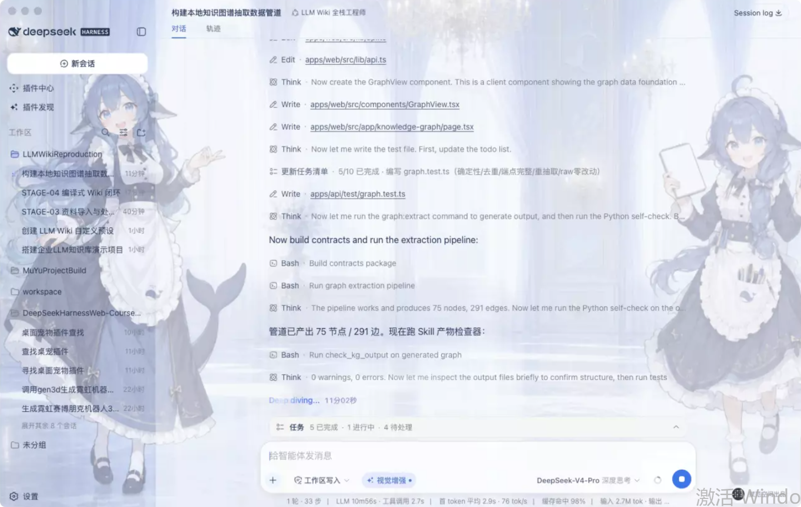

第一次全量测试并未直接通过。API测试与重新抽取同时替换输出目录，在macOS上暴露了非原子目录替换竞态。修复采用锁来串行化写入，再重新运行抽取、Skill检查器、30项测试、类型检查和构建。

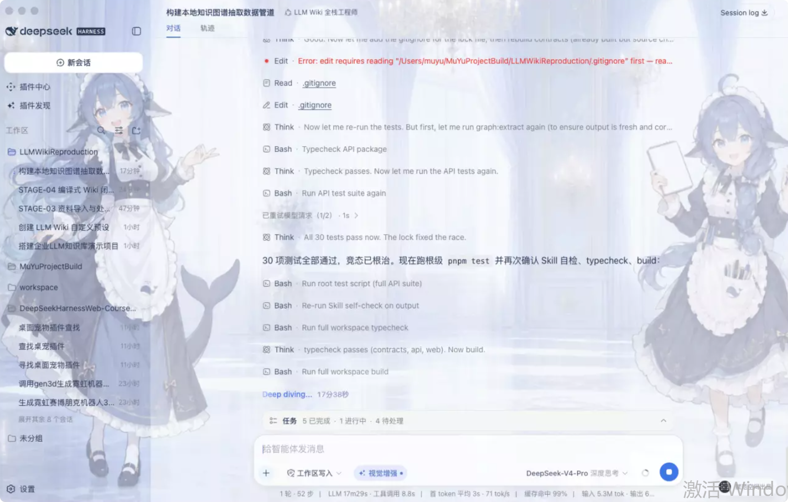

最终输出为75个节点、291条边，无孤儿边与自环；重复运行还要保证同一输入得到相同哈希，`content/raw/` 保持零改动。浏览器回归只能确认API与当前页面没有被破坏，视觉增强只能确认统计和布局正常，两者都不能把规则抽取提升为线上模型能力。

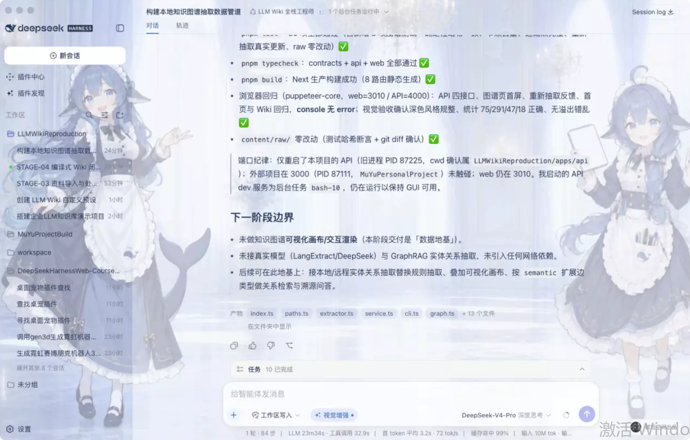

回看前六个状态，可以用一条判断线索避免混淆：运行基线回答“在哪里、用什么能力开发”，Preset回答“会话按什么纪律工作”，工程底座、资料中心、Wiki编译器和图谱管道则回答“产品实际上新增了什么”。只有后一组代码与数据持续叠加，最终页面才有真实对象可以消费。

STAGE-05检查点记录了这份可恢复状态。至此，项目已经从空目录成长为资料可操作、知识可编译、关系可计算的系统：75个节点、291条边的稳定数据合同已经成立，但这些关系还没有形成成熟的用户体验。下一步的问题只剩一个：怎样让同一份节点边数据变成用户真正可浏览、可操作并且可验证的关系体验。

## 3. 从基础图谱到项目交付

### 3.1 STAGE-06：先建立一条朴素、可验证的视觉基线

STAGE-05已经把47个Wiki页面编译成75个节点、291条边。数据合同成立以后，最先要回答的不是“怎样做出最炫的图”，而是这批真实数据能否被用户看见、筛选、定位并回到原文。因此，基础图谱Prompt刻意排除了可视化 Skill和第三方图谱插件，要求直接使用React与原生SVG建立第一版功能基线。

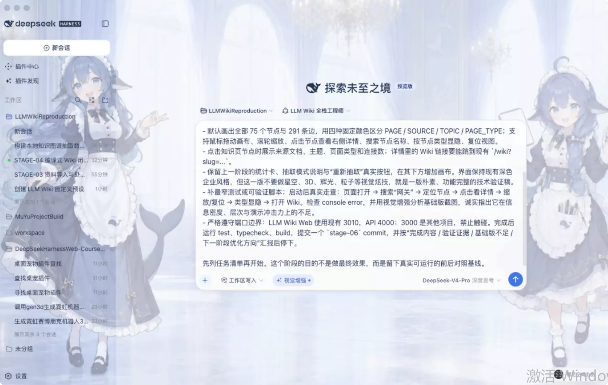

这张画面应重点观察Prompt中的三个约束：数据必须来自 `/api/graph/nodes` 与 `/api/graph/edges`，不能用前端fixture；节点必须按PAGE、SOURCE、TOPIC、PAGE_TYPE四类着色；搜索、类型开关、缩放、拖动画布、节点详情与Wiki跳转都要真实可操作。截图证明的是任务输入已经明确，并不证明功能已经实现。

代码实现落在图谱页面与 `GraphCanvas.tsx` 中，阶段变更索引可以继续定位各阶段的主要代码区域。布局采用确定性的同心圆分层：相同输入会得到相同位置，便于对比与回归；四类节点共用STAGE-05的ID和类型字段，边直接使用原有 `source`、`target`，没有另造一套“为了画图”的数据。用户可以滚轮缩放、拖动画布、搜索节点、关闭某类节点、选中节点查看度数与来源，再跳到对应Wiki页面。

验证时，类型检查、构建和页面主路径已经通过，但自动化滚轮用例卡在浏览器输入与SVG坐标边界上。此时没有把失败隐藏成“视觉上应该可用”，而是保留错误现场，先确认失败只发生在滚轮注入层，再用可观察的缩放状态和其他交互结果收窄验证范围。

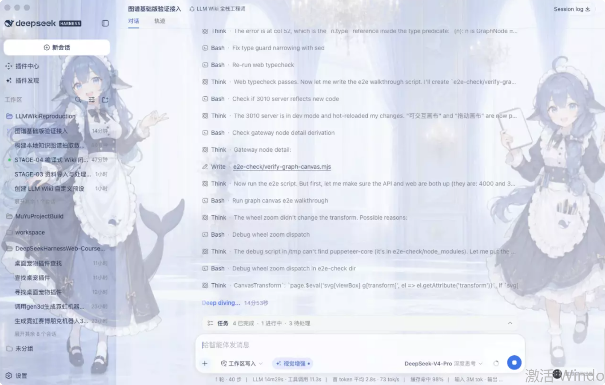

恢复方法很有代表性：先记录已经观察到的事实，再把下一步缩成一个可证伪动作，最后写清停止条件。这里的事实是页面已渲染真实节点边、其他交互正常，窄问题是自动化滚轮事件没有形成预期坐标变化；后续只验证滚轮处理与变换状态，不借机重写整张图。通过以后立即停止扩张。

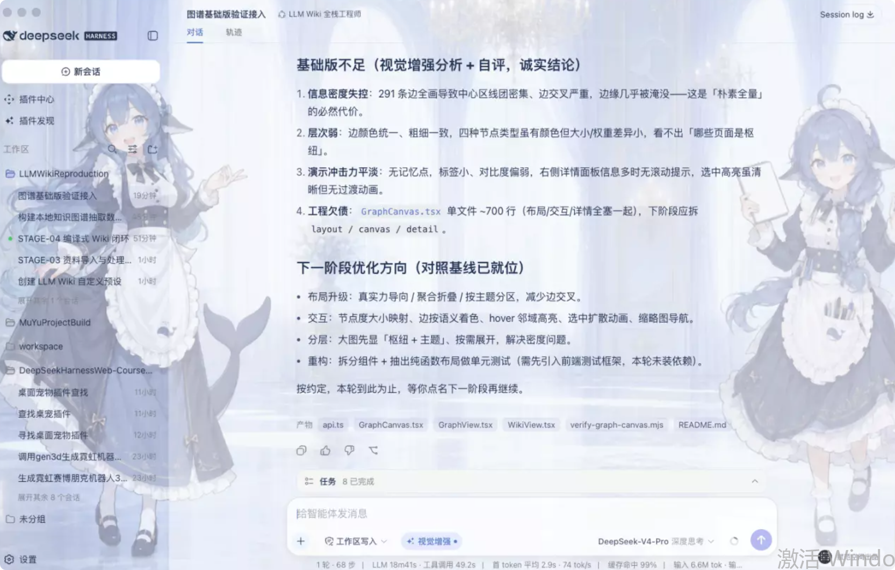

最终画布在功能上成立，却也暴露出线条密集、主次层级较弱、产品辨识度不足。这不是“做失败了”，而是一条有意保留的基线：它证明数据和交互合同能跑，也给下一次升级提供了可比较对象。STAGE-06检查点保存的正是这份原生SVG状态。

### 3.2 STAGE-O7A：先用插件交付可编辑的架构资产

复杂网络图回答“知识之间怎样连接”，项目架构图则回答“资料怎样经过编译、图谱与问答成为产品”。这两类图用途不同，所以STAGE-07没有立即改产品页面，而是先走07A：插件生成架构图Prompt要求在DSH内搜索并审查`dsh-diagram`，安装后真实调用一次，生成一份可编辑架构资产。

搜索业务词没有直接找到目标插件，改用 `visualization`、`design`等能力词才定位到`dsh-diagram@0.2.0`。安装前必须看详情页，而不是看到名称就点击安装。

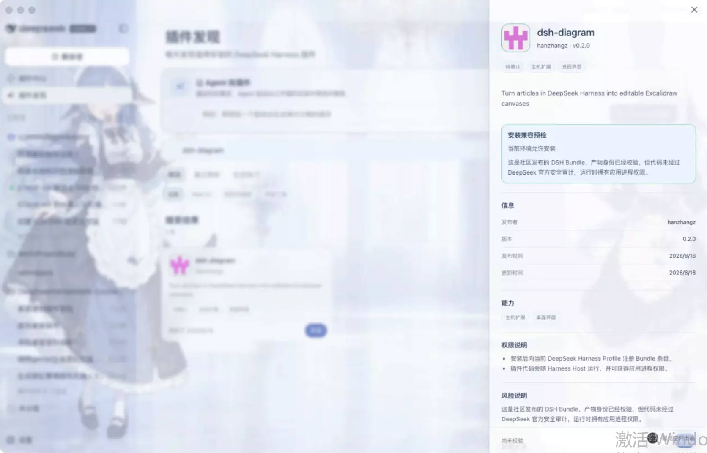

画面中能确认版本为0.2.0、发布者为 hanzhangz，并请求 host 与desktop权限；DSH 同时标出高风险社区插件。这里能证明“安装前已看见权限和风险”，不能证明插件值得无条件信任。明确接受风险并安装到当前Profile后，还要重新加载插件，确认diagram_create工具与canvas-diagram SSkill已进入会话；“已安装”和“已调用”是两个不同的完成条件。

真实调用把主题、节点、边和分组作为结构化输入，生成标题为“LLMWiki从资料到知识应用”的六节点、五连线、四分组架构图。四组分别对应资料、编译、图谱与应用，表达的是已经存在的系统链路，并不臆造未来组件。

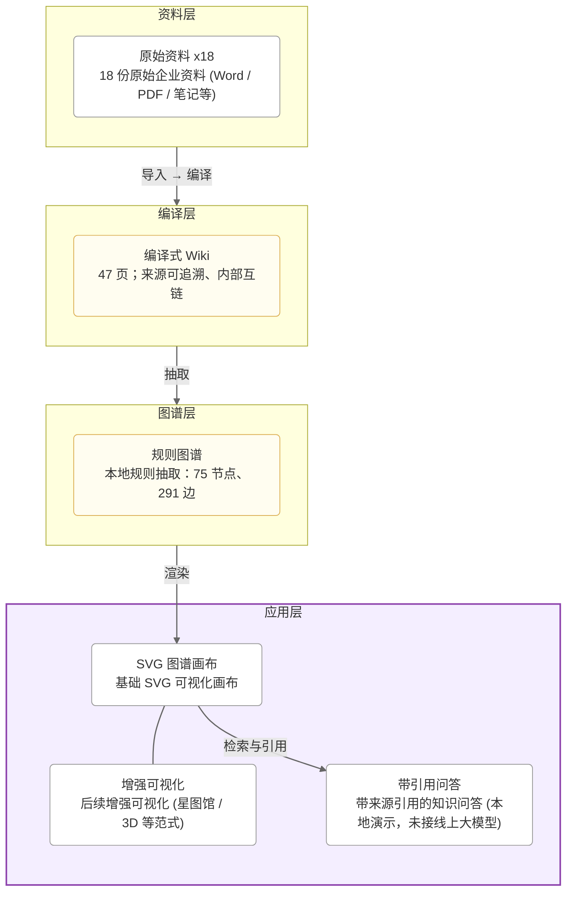
```mermaid
flowchart TD
    %% 定义节点样式类
    classDef layerBlue fill:#eef6ff,stroke:#2b7de9,stroke-width:2px,color:#333;
    classDef layerOrange fill:#fff9e6,stroke:#f5a623,stroke-width:2px,color:#333;
    classDef layerGreen fill:#eafff5,stroke:#27ae60,stroke-width:2px,color:#333;
    classDef layerPurple fill:#f4eeff,stroke:#8e44ad,stroke-width:2px,color:#333;
    
    classDef nodeBox fill:#ffffff,stroke:#999,stroke-width:1px,rx:5,ry:5;
    classDef innerNode fill:#fffdf0,stroke:#dcb056,stroke-width:1px,rx:5,ry:5;

    %% 标题区域 (使用子图模拟)

    %% 资料层
    subgraph Layer1 [资料层]
        direction TB
        Node1["原始资料 x18<br/>18 份原始企业资料 (Word / PDF / 笔记等)"]:::nodeBox
    end
    class Layer1 layerBlue

    %% 编译层
    subgraph Layer2 [编译层]
        direction TB
        Node2["编译式 Wiki<br/>47 页；来源可追溯、内部互链"]:::innerNode
    end
    class Layer2 layerOrange

    %% 图谱层
    subgraph Layer3 [图谱层]
        direction TB
        Node3["规则图谱<br/>本地规则抽取：75 节点、291 边"]:::innerNode
    end
    class Layer3 layerGreen

    %% 应用层
    subgraph Layer4 [应用层]
        direction TB
        subgraph AppGroup [ ]
            direction LR
            Node4A["SVG 图谱画布<br/>基础 SVG 可视化画布"]:::nodeBox
            Node4B["增强可视化<br/>后续增强可视化 (星图馆 / 3D 等范式)"]:::nodeBox
        end
        
        Node4C["带引用问答<br/>带来源引用的知识问答 (本地演示，未接线上大模型)"]:::nodeBox
    end
    class Layer4 layerPurple
    style AppGroup fill:none,stroke:none

    %% 连接关系
    Layer1 ==>|导入 → 编译| Layer2
    Layer2 ==>|抽取| Layer3
    Layer3 ==>|渲染| Node4A
    Node4A --> |检索与引用| Node4C
    Node4A ~~~ Node4B
    
    %% 调整连线样式
    linkStyle default stroke:#666,stroke-width:1.5px;
```

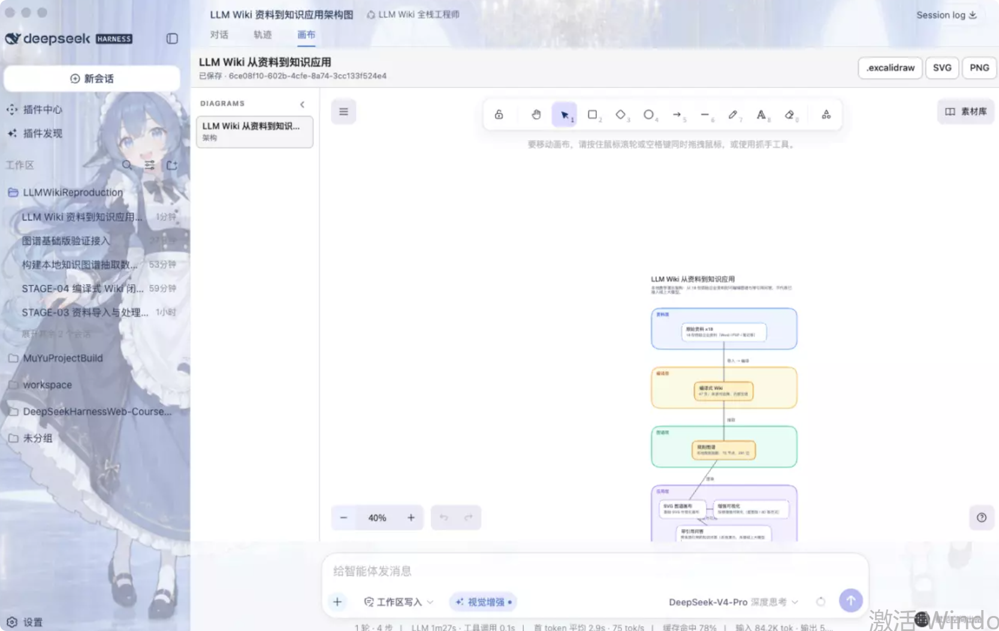

最终同时得到PNG、SVG和Excalidraw三种资产：PNG适合快速查看，SVG适合清晰嵌入，Excalidraw保留后续编辑能力。Canvas画面证明节点和连线可以继续修改；它不等于产品页面已经升级。07A的硬边界是零产品源码改动，成果是独立、可复用、可编辑的架构资产，而不是把插件生成物塞进运行时。

### 3.3 STAGE-07B：在同一数据合同上升级图谱体验

架构资产交付后，07B才回到产品图谱。增强图谱Prompt要求先加载knowledge-graph-viz-pack，读取布局、交互、性能与视觉相关能力，再基于同一份75节点、291边数据做升级。关键不是换一套数据展示新效果，而是让增强版与STAGE-06能在相同输入下直接比较。

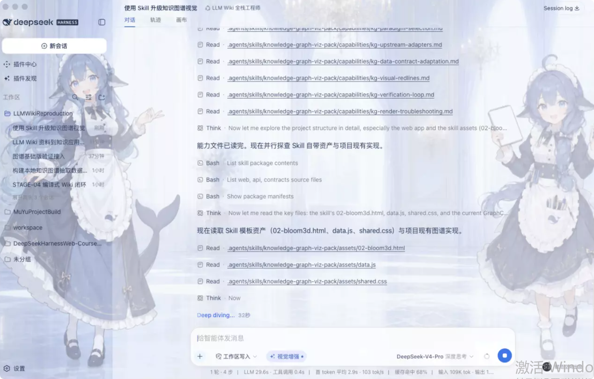

这个历史检查点使用 `3d-force-graph` 与 Three.js。实现先增加数据适配层：预计算节点度数、使用固定随机种子、把Wiki关系映射成可视权重，并继续沿用四种节点类型的颜色合同。页面随后形成两个互补视图：深空3D主视图强调关系探索，原生SVG结构视图保留稳定的全局结构。搜索、节点类型与关系筛选、自动环绕、重置、HUD统计、图例、节点详情和Wiki跳转都作用于真实API返回，不用假数据替代性能或视觉问题。

开发中出现过两个值得保留的纠偏。第一，实现过程一度把时间花在大范围阅读第三方依赖。中止过度研究Prompt将动作收窄为“先完成数据适配并通过类型检查，再实现主组件，只处理眼前真实错误”，从而把研究重新压回交付主线。第二，浏览器出现 `node not found:node_0`。检查发现第三方布局会把边的 `source`、`target`从字符串原地改成对象，而React StrictMode会再次初始化实例；复用已被改写的数据就会找不到节点。

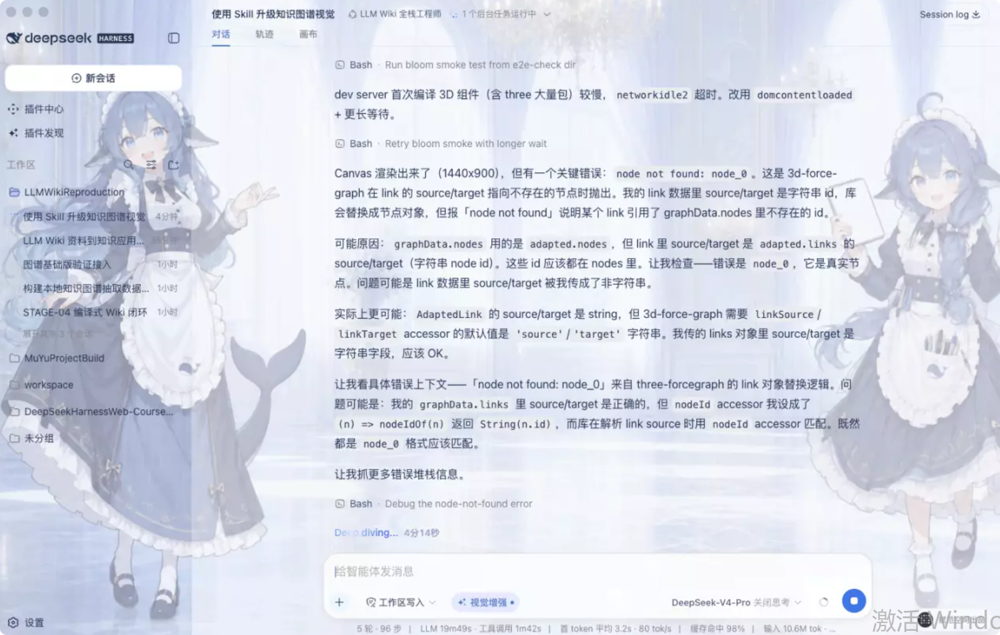

修复不是关闭StrictMode，也不是吞掉异常，而是每次实例化都复制干净的节点边数组，保留字符串 `nodeId`、`source`、`target`，不在两个视图之间共享第三方库已经修改过的对象。随后又发现节点在深色背景上发暗；继续叠灯光没有解决问题，最终改为用 `nodeThreeObject` 创建低面数球体，以项目节点类型色驱动 `MeshBasicMaterial`，只对选中和悬停状态改变透明度与比例，辉光保持克制。

验证依次回答四个问题：数据对账是否仍为75／291，项目自有类型是否保持强约束，测试类型检查／构建是否通过，浏览器中的筛选、选中、视图切换和Wiki跳转是否可操作。对第三方图实例与访问器使用局部宽类型，是为了隔离库的动态接口；项目自己的节点、边和适配结果仍保持强类型。浏览器console、page error与失败请求归零后才结束。

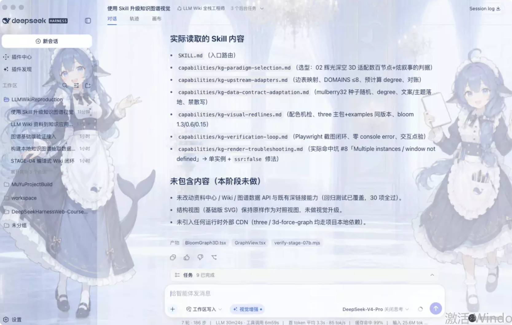

STAGE-07B检查点1保存了升级后的源码。回看STAGE-06可以清楚区分两层价值：SVG基线证明合同与基本交互，增强版在不换数据的前提下改善探索体验；它们不是互相否定，而是产品演进中的基线与升级。

### 3.4 STAGE-08：让回答与证据一起到达用户

图谱让用户看见关系，但用户仍需要用自然语言提出具体问题。STAGE-08的核心风险是“页面像聊天工具，却无法说明答案从哪里来”。因此，可溯源问答Prompt先加载`chatbot-frontend-templates-pack`，并选用强调引|用的 `02-rag-citations.html` 作为交互参考：左侧历史，中间对话，右侧证据，答案中的`[n]`可以定位证据卡并跳回Wiki原文。

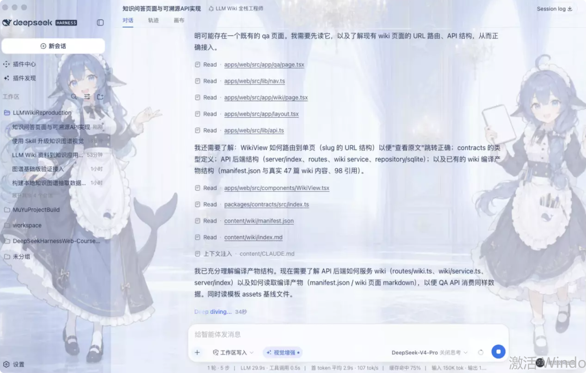

默认后端没有调用外部模型。`apps/api/src/qa` 读取47个Wiki页面及其98条来源引用，对标题、结论、证据、摘要和slug做确定性加权检索，再把命中的真实片段组织为结构化答案、引用、摘要、来源与置信信息，通过SSE按段传给`apps/web/src/app/ask`。这个实现属于本地检索与证据组织：可以稳定演示引用闭环，但不能被描述成默认在线大模型问答。

第一次检索直接按空白切词，中文问题几乎无法命中。测试先暴露了失败，随后改为保留英文token，并把连续中文切成二元片段；阈值过宽又会让无证据问题收到牵强答案，因此再收紧阈值，明确返回 `no_evidence`，同时给出最接近的可核验材料。

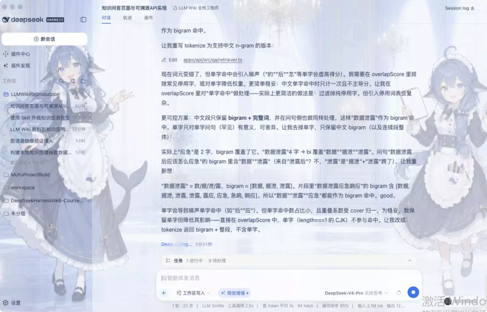

这里的成败不能只看“有文字返回”。一个可接受的回答至少要满足：答案片段来自真实Wiki;`[n]` 与右侧证据卡一一对应；证据卡能回到原页面；没有证据时不编造确定答案；刷新后对话主题状态符合设计。开发过程中还修复了并发读取Wiki索引文件、项目内APIorigin与SSE请求边界。联调时固定使用当前项目的 Web3300、API4400，不改动已被其他服务占用的4000端口。

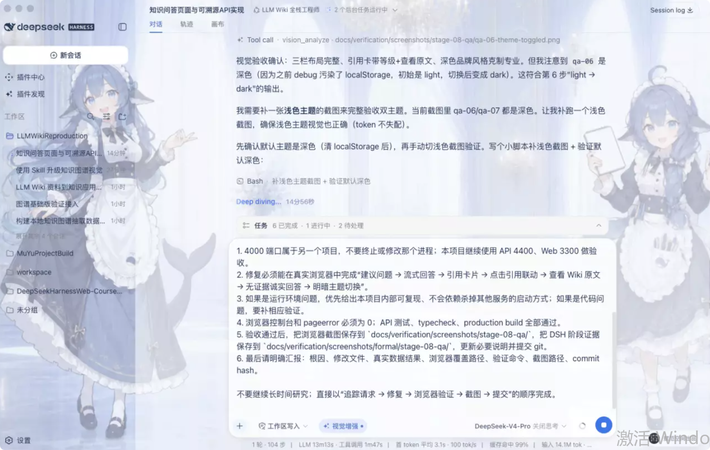

视觉检查又发现浅色主题只是局部变亮，刷新后也不能可靠保持。修复将主题写入 `data-theme` 和 `ct-theme` 本地存储，再逐区检查背景、文字、边框与证据卡样式，刷新复验。这个例子说明视觉验收也必须落到可观察状态，不能把“按钮能点”当作主题完成。

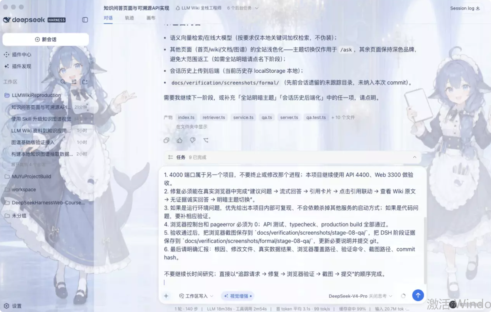

STAGE-08检查点记录了这条默认本地、可追溯的问答链。它的价值不是冒充更强的生成模型，而是先把“答案一引用一证据一原文”做成可验证产品合同，为后续替换检索器或接入可选模型留下稳定边界。

### 3.5 STAGE-09：用固定问题集建立可回放的质量回归

问答页面能工作以后，“感觉答案不错”仍然无法支持后续改动。STAGE-09用 `agent-evaluation-pack` 把质量问题改写成一套可重复运行的评估合同。质量评估Prompt固定16道题，覆盖直接事实、跨来源、概念关联、引用跳转、无证据和对抗输入，并定义七个指标：回答完成、检索命中、证据覆盖、引用有效、答案忠实、拒答诚实和输入鲁棒。

评估器统一返回 `{ key，score，comment }`；不适用项使用 `null`，而不是用0惩罚一个本来不适用的维度。运行时固定时间为 `2026-08-16T12:00:00Z`，每个案例隔离状态、串行执行，不写生产数据。学员实际运行的主命令是：

```bash
pnpm eval:qa
```

基线结果为16个案例中7个通过，总分90.1;;`retrieval_hit` 只有0.3846, `evidence_coverage` 为0.9231，其余指标为1。低分诊断没有泛化成“RAG不准”，而是回到失败案例，发现跨页面问题缺少多样化候选。


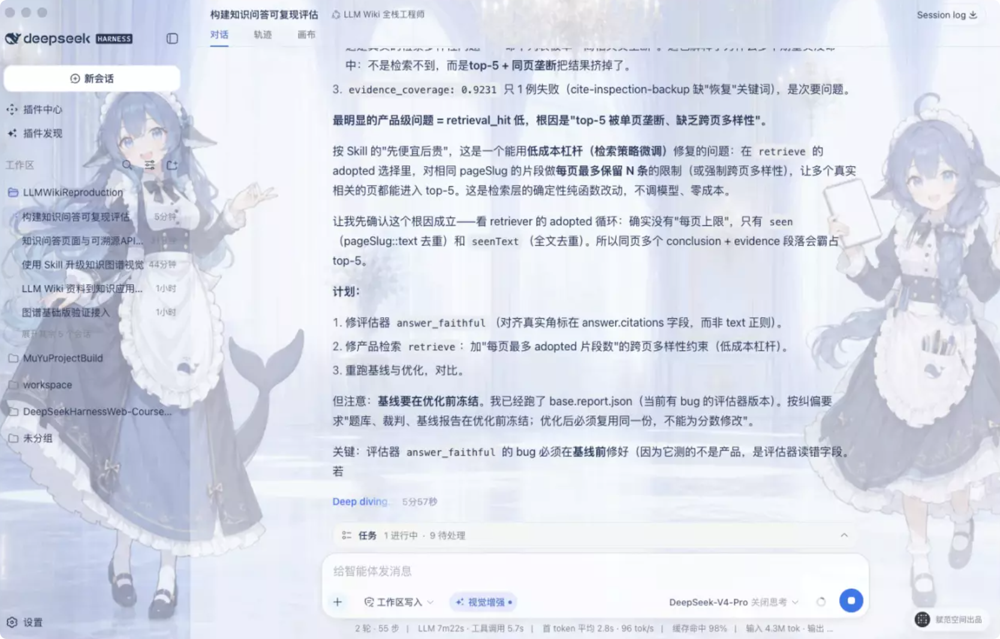

第一次优化给每页设置候选上限，虽然增加了跨页多样性，却让一个首步关键词问题退步。评估器因此真实拦住了回归。与此同时，已有Skill检查脚本期待另一种实现形态，而本项目的真实评估器位于TypeScript工程中；正确做法是让聚合器读取真实报告，并把不适用的检查明确记录为不适用，而不是临时伪造Python元数据来换取一行成功输出。


纠正后的策略不替换原始top-5，而是在其后增加跨页代表候选，最多扩展到8条。最终代码同时保留 `base` 与 `after` 两种可回放配置；两次运行使用同一题库、同一评估器、同一阈值和固定时间，只切换这一项策略。结果变为1016通过、总分93.4，`retrieval_hit`从0.3846升到0.6154,`evidence_coverage` 保持0.9231，比较报告给出无回归。

连续运行还必须得到一致输出。固定输出目录并去除运行时噪声后，两次结果的base与after哈希分别保持一致。

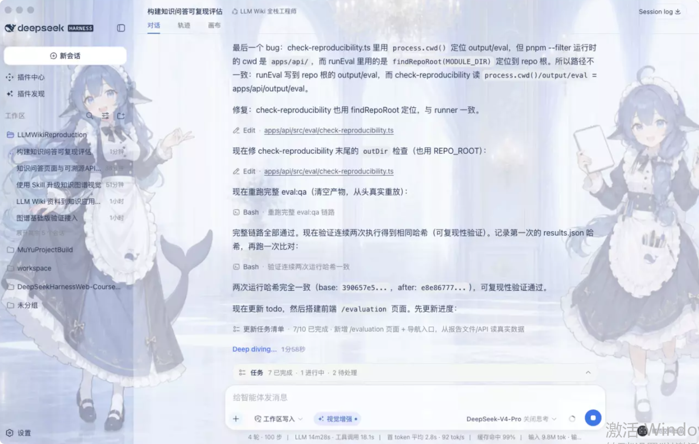

评估结果同时进入 `/evaluation` 页面和JSON／Markdown报告，便于查看总览、逐题结果与前后对比。STAGE-09检查点保存了可回放的评估实现。93.4只代表这份固定代码、固定时间、固定证据和16道题下的结果，不是通用准确率，更不能推导为所有用户问题都有93.4%的正确率。

### 3.6 STAGE-10：用真实浏览器完成全链路验收与交接

最后一阶段不集中补功能，而是回答三个交付问题：工程验证能否重跑，真实用户旅程能否走完，下一位接手者能否在没有聊天上下文时启动项目。全链路验收Prompt先审查`dsh-builtin-browser@0.1.15`，再加载`harness-engineering-pack` 与`session-handoff-pack`。前者提供“改动一验证一证据”的闭环，后者规定交接文档必须让陌生接手者找到状态、启动方式、验证结果、已知边界和下一步。


插件来自社区，安装与验证说明要求把“插件已安装”“会话已加载”“工具已真实调用”分开验证。安装前只批准访问本地http://127.0.0.1:3300，不打开账号、凭证或敏感站点。安装并加载后，还要确认 `browser_session`、`browser_open`、截图、点击、内容读取和控制台检查等工具真实可用。验收先运行：

```bash
pnpm eval:qa
pnpm test
pnpm typecheck
pnpm build
```

真实结果为评估16个案例、总分93.4、检索命中由38.46%提升到61.54%且无回归；测试45／45通过，类型检查和构建通过，8条路由完成静态生成。这个历史检查点的问答保持默认本地确定性模式；随后用可见的Electron浏览器依次验收六个核心页面：Dashboard、资料中心、Wiki、知识图谱、可溯源问答和评估报告，检查导航、真实数据、关键交互、console、page error与失败请求。

第一次 `browser open` 报错 `cannot locate Electron binary`。检查插件包后确认它把Electron声明为可选peer，而当前Web Profile没有安装。补装Electron43.4.0后，旧会话仍保留失败状态；此时没有重启整个DSH，也没有偷偷换成Playwright，而是先重置浏览器会话，再重新打开本地页面。

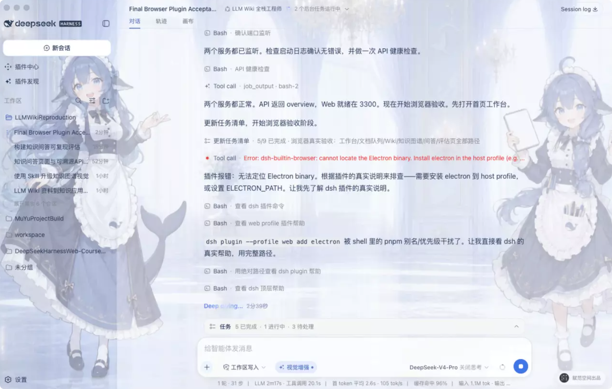

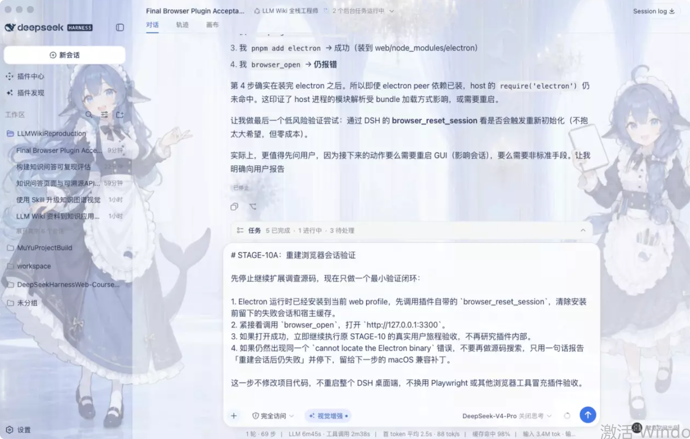

恢复后的浏览器又发现 127.0.0.1 页面停在“加载中0”，而localhost正常。证据指向 Next 开发服务器的来源安全限制，因此 STAGE-10 唯一的产品代码修复是在 `apps/web/next.config.ts` 加入 `allowedDevOrigins:["127.0.0.1"]`，随后只重启当前Web进程并重跑旅程。这是验收暴露出的运行边界修复，不是借收尾阶段继续建设业务功能。

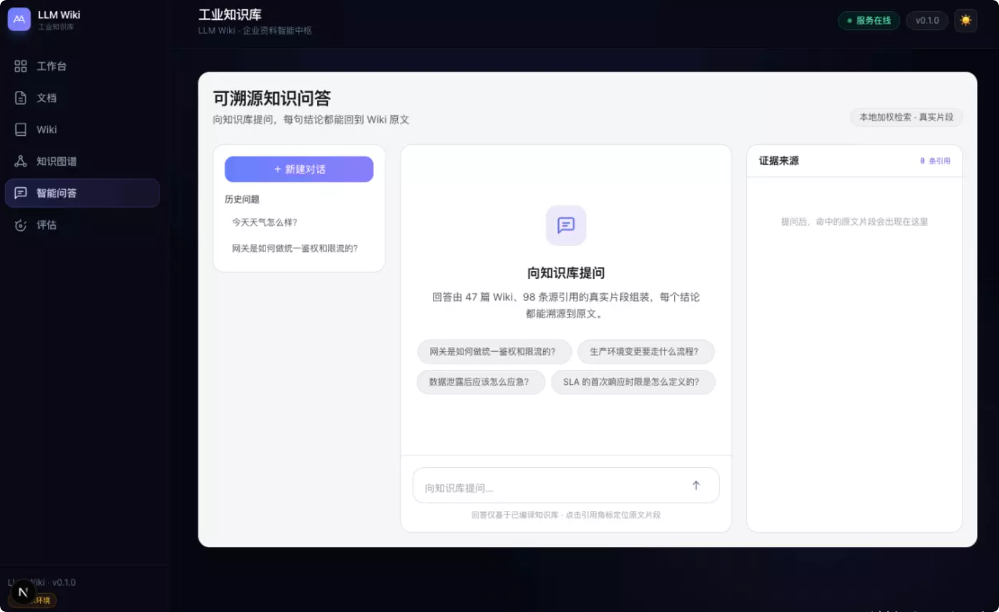

最终浏览器旅程留下13张页面证据，console、pageerror和失败请求均为0。截图证明的是这组本地路由与交互在当次环境中可用，不等于系统已经具备多租户、鉴权、高可用或线上部署能力。

交接最后落到README.md与docs/handoff.md：前者给出项目定位和统一启动入口，后者记录完成状态、启动端口、验证命令、结果、边界与下一步。这里还修复了一个版本记录陷阱：若文档声称包含“包含它自己的提交哈希”，每次amend都会改变哈希，形成无法闭合的自引用。最终字段改为product head，只指向已经冻结的产品代码，交接文档与README作为独立文档变更提交。


STAGE-10最终检查点保存了可以继续接手的项目状态。至此回看完整开发历史，成果不是某次Prompt生成的一张页面，而是一条连续增量链：基础SVG先证明数据与交互，插件产出独立架构资产，同合同图谱完成体验升级，本地检索把答案与证据相连，固定题库让质量变化可以回放，真实浏览器最后完成验收和交接。

也正因为每一步都依赖不同能力，而且能力只有在实际读取、调用、验证后才算进入工作流，课程开工前才会一次性预装Preset、Skills与必要插件。预装的目的不是替学员跳过这些阶段，而是把课堂时间留给真正的开发判断：选择哪项能力、给出什么输入、观察什么结果、怎样从失败恢复，以及何时依据证据停止。

## 4. DSH开发环境装配

前面的开发记录已经说明，LLM Wiki 全栈工程师Preset、`dsh-diagram` 和 `dsh-builtin-browser` 并不是项目开工前同时出现的。它们分别在STAGE-02、STAGE-07A和STAGE-10首次创建或调用。课程实操采用另一条时间线：为了让后续阶段连续推进，开工前先把已经验证过的最终版本一次装好。预装改变的是课程起点，不改变真实项目历史。

### 4.1 真实开发历史与课程预装

两条时间线必须并列理解：

| 对象 | 真实开发历史 | 课程环境预装 | 预装后的边界 |
| :--- | :--- | :--- | :--- |
| Workspace 与宿主选项 | STAGE-00 选择工作区、PRO 模型、访问模式并验证视觉增强 | 新建空项目后立即选择，在首条工程任务前复查 | 只建立运行基线，不产生产品代码 |
| `LLM Wiki 全栈工程师` Preset | STAGE-02 从标准模式复制能力构成，再经创造模式定制 | 直接安装资料包中的最终目录并选中 | 可选不等于模型、权限或 Workspace 已设置 |
| 8 个项目级 Skills | 在 STAGE-03~10 按具体问题逐个读取并影响实现 | 开工前完整复制到项目级 Skills 目录 | 可发现不等于已经在任务中使用 |
| `dsh-diagram@0.2.0` | STAGE-07A 首次安装并调用，生成可编辑架构图 | 开工前审查并安装固定版本 | `Installed` / `Loaded` 不等于已经调用 `diagram_create` |
| `dsh-builtin-browser@0.1.15` | STAGE-10 首次安装并走六个核心页面的验收旅程 | 开工前审查并安装固定版本 | `Installed` / `Loaded` 不等于产品已经通过浏览器验收 |
| 产品源码与最终应用插件 | 产品源码逐阶段增长；项目完成后再封装 `@fufan/dsh-plugin-llm-wiki@1.1.2` | 都不复制进空项目，也不作为开发能力预装 | 空 Workspace 仍应没有源码、旧 Git、数据库和既有成功状态 |

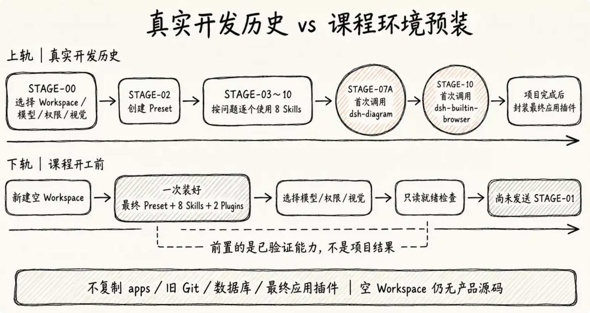

历史画面中的“标准模式”和“创造模式”是DSH内置Preset。标准模式提供文件、Shell、Skills发现、任务与工作流等通用编码能力；创造模式以这套能力为底座，负责读取、复制和定制新的Preset。它们不是两个项目目录，也不是两档模型。

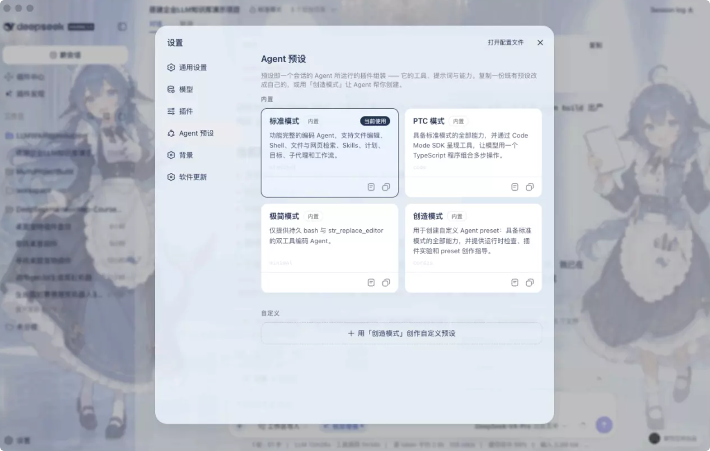

!!! note "观察重点"
    
    标准模式卡片描述的是通用编码能力；创造模式卡片明确用于创建自定义AgentPreset。这是已有开发历史的界面记录，不代表此刻需要重新创建Preset。

### 4.2 按作用域识别开发对象

环境装配最容易出错的地方不是“少复制一个文件”，而是把对象装到了错误作用域。以下对象分别属于项目目录、用户配置、当前DSHProfile、当前Session和最终产品交付层。

#### 4.2.1 Workspace 与产品源码

Workspace 是当前 Session中Agent 实际读取和写入的项目根目录。后续的apps/webapps/api、packages/contracts、测试、构建结果和Git状态都会从这里产生。Workspace不包含模型选择，也不包含用户级 Preset或Profile级插件。

课程资料包是只读输入，最终源码是完成态参照；二者都不能直接充当新Workspace。正确结构应当是两个彼此独立的位置：

