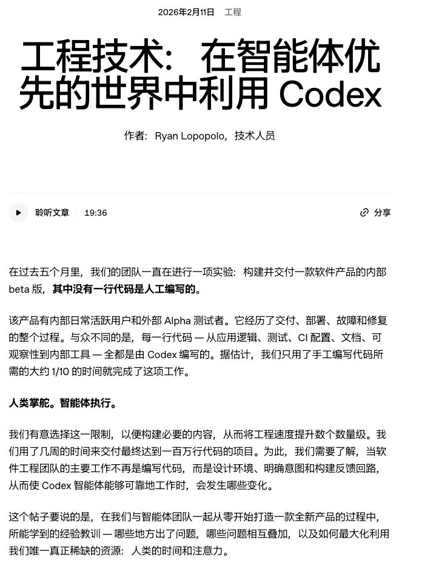
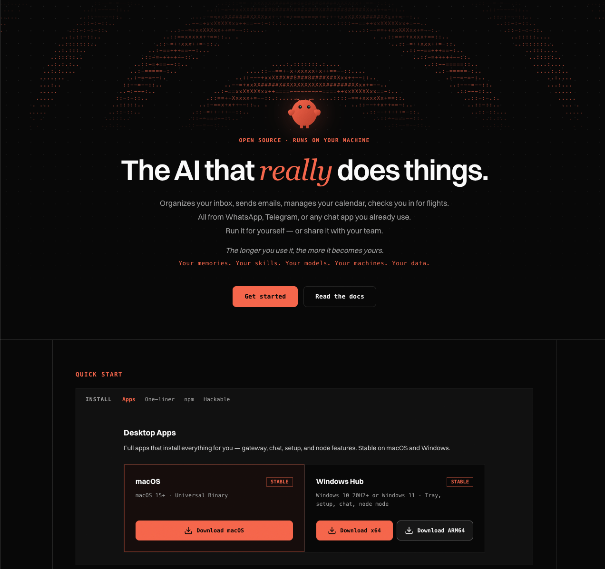
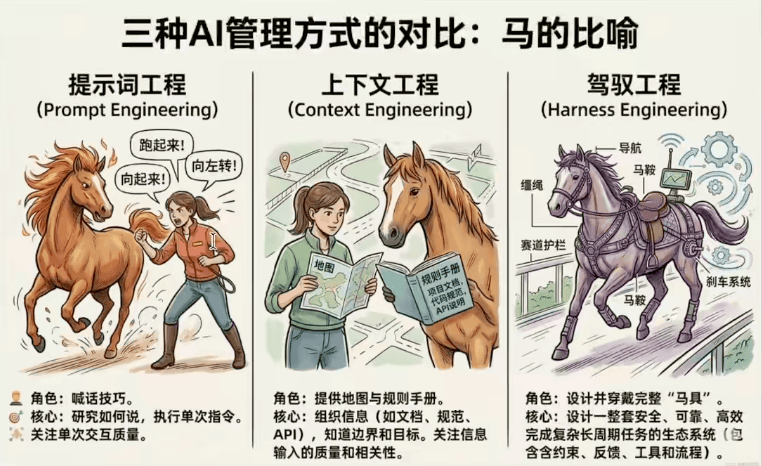
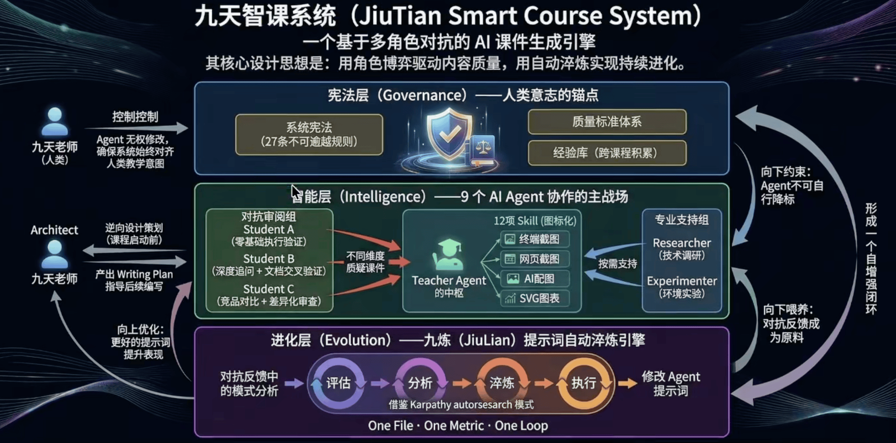

# 第一章：通用智能体应用步入生产力阶段

2026年2月，OpenAI Codex 团队发布了一篇博文，正式引爆了一个技术概念。博文中的一组数据让整个技术圈沉默了几秒：3个工程师，5个月，产出了100万行生产级代码一一其中没有一行是人手写的。他们通过大约 1500 个 PullRequest 完成了一款内部 beta 产品的构建和迭代，每人日均合并 3.5 个PR。

{width="80%"}
///caption
图1：harness engineering leveraging codex in an agent-first world
///

这 3 个人没有用什么秘密的超级模型一一他们用的是市面上所有人都能用的 AI。但他们做到了 10 倍效率的产出。他们做对了什么？

答案是：他们不写代码，他们设计让 Agent 写代码的环境。这篇博文正式引爆的技术概念，叫做 Harness Engineering。

!!! "课外阅读"

    有兴趣的同学可以阅读下 OpenAI 发布于2026年2月的这篇文章 [harness engineering leveraging codex in an agent-first world](https://openai.com/zh-Hans-CN/index/harness-engineering)。

## 1. 通用智能体的爆发式普及

你可能注意到了，我们现在讨论的不只是"AI编程"。事实上，AI智能体已经远远超出了编程领域。

2025 年底到 2026 年初，通用智能体迎来了爆发式普及。[OpenClaw](https://openclaw.ai/) 以超过 33 万 GitHubStars 成为全平台最高星标的软件项目之一，它不是一个编程工具一一它是一个通用智能体平台，支持飞书、钉钉、Telegram、企业微信等十余个平台，接入OpenAI、Anthropic、MiniMax等多家模型提供商，任何人都可以在自己常用的工作场景中部署 Agent。与此同时，ClaudeCode、OpenAI Codex这些本来定位为“AI编程工具”的产品，也在被越来越多的人用于非代码领域一一写技术文档、做内容策划、搭建自动化工作流。说白了，所谓的AI编程智能体，本质上就是通用智能体，ClaudeCode 能写代码，当然也能写课件、做调研、搞数据分析。

{width="80%"}
///caption
图2：OpenClaw 
///

智能体变得触手可及了，但一个更深层的问题也随之浮出水面。

## 2. 核心痛点：简单任务没问题，复杂任务做不了

如果你用过 OpenClaw 或 Claude Code，你大概率有过这样的体验：
问答一一没问题。“解释一下什么是RAG”，回答得头头是道。简单任务一一也没问题。“帮我写一个Python函数”、“帮我翻译这段话” 几秒钟就能搞定。

但当你试图让Agent做更复杂的事情时，问题就来了。

举一个我们团队亲历的例子：我们想让 OpenClaw 帮忙编写课件、搭建一个全自动内容工厂。结果发现—— OpenClaw 能帮你回答技术知识点、能帮你做技术调研、能帮你做头脑风暴。但如果要它一步到位生产一份 2 小时的高品质图文课件？做出来的东西似是而非一一结构混乱、知识点浮于表面、关键步骤缺失、截图全靠编造。

这不只是内容领域的问题，编程领域也一样。Agent写个函数没问题，但要它独立完成一个完整功能的开发、测试、集成？大概率半途而废或者产出一堆不可维护的代码。

这到底是 Agent 的能力问题吗?

不是。OpenAI 那 3 个人用同样的模型产出了 100 万行生产级代码。Stripe 用同样的 Claude 每周自动完成 1,300 多个 PullRequest。**模型是一样的，区别在于我们会不会用**。

## 3. 三个时代：我们学会“用好智能体”的过程

回顾过去两年，人们“学会使用智能体”的过程，恰好经历了三个阶段：

- 2024年：**提示工程**(PromptEngineering)时代。智能体概念刚刚诞生，我们用 Agent 主要是问答一一在 ChatGPT 里精心措辞一个问题，期待得到一个好回答。当时最流行的技术是“提示工程”：提示写得好，回答质量就高；提示写得差，回答就跑偏。整个互动模式是“一问一答”，我们在乎的是那一次回答的质量。

- 2025年：**上下文工程**(ContextEngineering)时代。我们发现，仅靠一次好提示是不够的。在 Agent 运行的过程中，在合适的时间输入合适的内容，比如先给 Agent 看相关文档，再给它看用户需求，最后让它动手，就能显著提升它完成具体任务的能力。大纲策划、头脑风暴、意图理解...这些任务的质量明显提升了。但想要一步到位生产出高品质课件？它还是做不到。

- 2026年：**驾驭工程**(HarnessEngineering)时代。经过了一段时间的技术发展和大量的实践探索，人们不约而同地发现了同一个结论一一给 Agent 创建一个适合运行的环境，比优化单次提示或上下文输入更能驱动它完成复杂的系统性任务。这个“环境”包括：项目导航配置(让 Agent 知道自己在做什么项目)、自动化约束(阻止 Agent 犯危险错误)、反馈循环(让  Agent 知道每一步做得对不对)、多 Agent 协作(让不同角色的 Agent 互相检查)。这就是 HarnessEngineering —— 2026年最热门的“如何用好智能体”的技术概念。

{width="80%"}
///caption
图3：三种AI管理方式的对比——马的比喻
///

## 4. 不是突然诞生，而是经验汇聚

值得一提的是，HarnessEngineering 并不是突然从天上掉下来的新概念一一它是无数团队在长期实践中不约而同总结出的一致经验，只是在 2026 年 2 月被正式命名和引爆。

事实上，在 HarnessEngineering 这个概念爆火之前，我们团队研发的九天智课系统就已经完全采用了这套思路。九天智课系统是一个多 Agent 协作的课件制作系统：Teacher Agent 负责编写课件并实时截图验证，3 个 Student Agent 分别从零基础学员视角、深度技术追问视角和竞品对比视角对课件发起质疑，通过多轮对抗迭代驱动内容质量提升。整个系统配备了完整的约束体系（Agent 权限控制、行为边界）、反馈循环（Student质疑→Teacher修改→Student再验证）和自动化工具链（真实环境执行、截图上传、质量自检）。这不就是 HarnessEngineering 吗?只不过我们是把它用在了内容生产领域，而不仅仅是编程。

这恰恰说明了一个关键认知：HarnessEngineering 的价值不局限于AI编程，它是让任何 AI智能体从“玩具级问答”进化到“生产级产出”的通用方法论。

{width="80%"}
///caption
图4：三种AI管理方式的对比——马的比喻
///