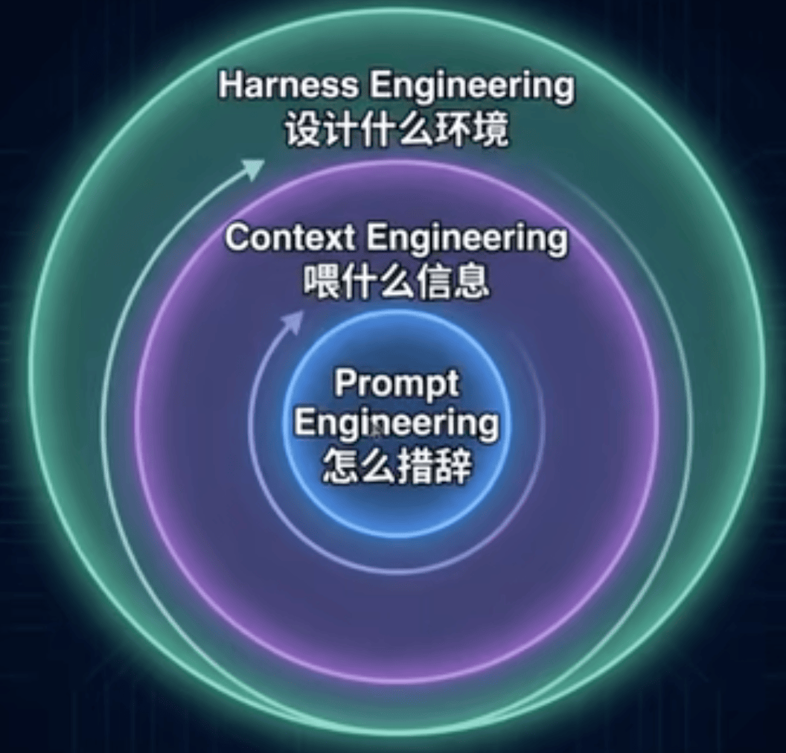

# 第二章 概念起源：从 Prompt Engineering 到 Harness Engineering

在逐步展开概念的历史脉络之前，我们先给出 HarnessEngineering 的标准技术定义，并用一组行业标杆成果让你直观感受这个领域的能量级。

> Harness Engineering 的技术定义

HarnessEngineering 是设计、构建和持续优化 AI Agent 运行时环境的工程学科，它通过四类核心机制：**声明式知识注入**（项目配置文件，让Agent自动理解项目）、**自动化行为约束**（生命周期钩子与规则引擎，拦截危险操作、强制执行规范）、**多层反馈循环**（从即时检查到独立评估Agent，确保每一步都有验证）和**系统熵管理**（持续清理Agent产出的技术债，防止代码库退化），将 Agent 的可靠性、产出质量和自主工作能力从"演示级"提升到"生产级"。

其核心公式：**AI Agent 的产出质量 = AI 模型能力 + Harness 设计水平**。

Harness 之于 AI Agent，如同操作系统之于CPU一一裸机能运算，但只有在操作系统的调度、约束和资源管理下，才能稳定地运行复杂应用。

> 行业标杆成果一览

如果你是第一次接触这个概念，下面这组数据可能会让你心跳加速一一先不用理解它们的技术细节，只需要感受这些数字的分量：

| 团队 / 项目 | 规模 | 核心成果 | Harness 关键机制 |
| :--- | :--- | :--- | :--- |
| **OpenAI Codex** | 3 人 → 7 人 | 5 个月产出 **100 万行**生产级代码，零人手写 | AGENTS.md + 六层架构约束 + 自动垃圾回收 |
| **Stripe Minions** | 企业级 | 每周自动完成 **1,300+ Pull Requests**，~500 个工具 | Blueprint 审批 + CI/CD 管线 + 人工终审 |
| **LangChain** | 开源团队 | 不换模型，仅改 Harness：基准排名从 30+ → **Top 5** | 系统提示词 + 工具优化 + 死循环检测中间件 |
| **GStack(Garry Tan)** | 个人开发者 | 60 天 60 万行代码，GitHub **48k** Stars | 项目配置+28个角色定义+ Sprint 流程 |
| **Peter Steinberger** | 个人（极端）|  月均 6,600 次代码提交 | 轻量配置+高信任模式 | 

## 1. 三个时代的嵌套关系

在进入核心理论之前，我们需要先建立一个关键认知一一 HarnessEngineering 不是来替代 Prompt Engineering 的，它们是包含关系。

Philipp Schmid 提出了一个非常直观的计算机类比，帮助我们理解这层嵌套关系：

| 计算机组件 | AI Agent 类比 | 职责 |
| --- | --- | --- |
| CPU | AI 模型（如 Cluade、GPT）| 提供原始推理能力 |
| RAM | 上下文窗口（Context Window） | 有限的、易丢失的工作记忆 |
| 操作系统 | Harness | 管理上下文、处理启动序列、提供标准工具接口 |
| 应用程序 | Agent | 在操作系统上运行特定任务逻辑 |

!!! note "课外阅读"

    学有余力的同学，可以看下这篇文章 [The importance of Agent Harness in 2026](https://www.philschmid.de/agent-harness-2026)。

总所周知，你不可能在没有操作系统的 CPU 上直接跑程序。同理，让 AI Agent 在没有 Harness 的环境里“裸跑”，效率和可靠性都会大打折扣。

{width="50%"}
/// caption
图1：Evolution of Al Engineering Paradigms
/// 

这三个时代各自解决不同层次的问题，每一层都在前一层基础上扩展了问题域：

| 维度  | Prompt Engineering | Context Engineering  | Harness Engineering |
| ------------------------- | ------------------ | ------------------ | ------------------ |
| **核心问题** | "我怎么措辞？" | "给模型喂什么信息?" | "Agent需要什么环境才能自主工作?" |
| **工作单位** | 单次 API 调用 | 多轮对话/工具链 | 完整功能（从需求到交付）|
| **人类角色** | 提示词作者 | 信息架构师 | 环境设计师 |
| **时间尺度** | 一次推理（秒级） | 一个会话（分钟级） | 系统全生命周期（天/周级） |
| **典型工具** | ChatGPT、API Playground | RAG、MCP、Few-shot | CLAUDE.md、Hooks、Sub-agents、CI/CD |
| **思维模型** | "写一个好问题" | "导演一个好剧本" | "搭建一个好剧场" |

这里对表中几个专有名词的缩写做下解释：
    
- **RAG**（Retrieval-AugmentedGeneration，检索增强生成）：让模型检索外部知识后再回答的技术；
- **MCP**（ModelContext Protocol,模型上下文协议）：Anthropic提出的工具调用标准协议；
- **CI/CD**（持续集成/持续交付）：自动化构建、测试、部署的管线。

这不是“Prompt Engineering 过时了”，它仍然是一切的基座。写好提示词的能力永远有用，只是仅凭提示词已经不够应对 Agent 时代的复杂需求了。

!!! danger "三个常见误区"

    1. “三个时代是替代关系” → 错。实际是包含关系，Harness Engineering 的从业者依然需要写好提示词、管好上下文。
    2. “只有大团队才需要Harness” → 错。个人开发者搭一个 CLAUDE.md + 安全 Hook 只需要5分钟，但能避免 90% 的低级失误。
    3. “Harness越复杂越好” → 大错特错。Vercel 删掉了 80% 的 Agent 工具后反而效果更好，简洁的 Harness 比臃肿的更高效。

## 2. Karpathy 推文与 Context Engineering 的兴起

每一次技术范式的转变都有一个起点。2025年6月25日，前 OpenAI 联合创始人、前 Tesla AI 总监 Andrej Karpathy 推发了一条推文，引爆了技术圈:

!!! quote "Karpathy 推文"

    +1 for 'context engineering' over 'prompt engineering'. People associate prompts with shorttask descriptions you'd give an LLM in your day-to-day use. When in every industrial-strengthLLM app, context engineering is the delicate art and science of filling the context window withjust the right information for the next step.

Karpathy 的观点很明确：人们把 “prompt”和日常聊天时的短指令联系在一起，但真正工业级的 LLM 应用，核心功夫是"上下文工程”，精心填充上下文窗口，让模型在每一步都拿到恰好足够的信息。

