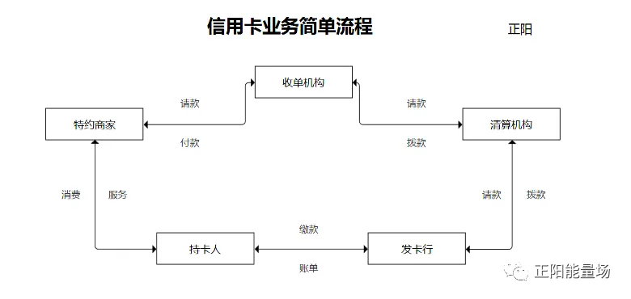
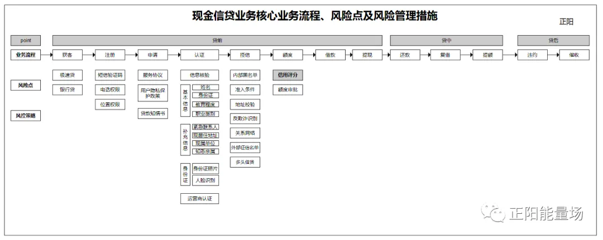
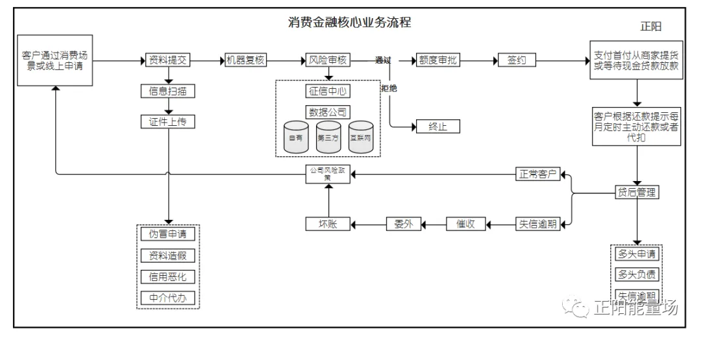
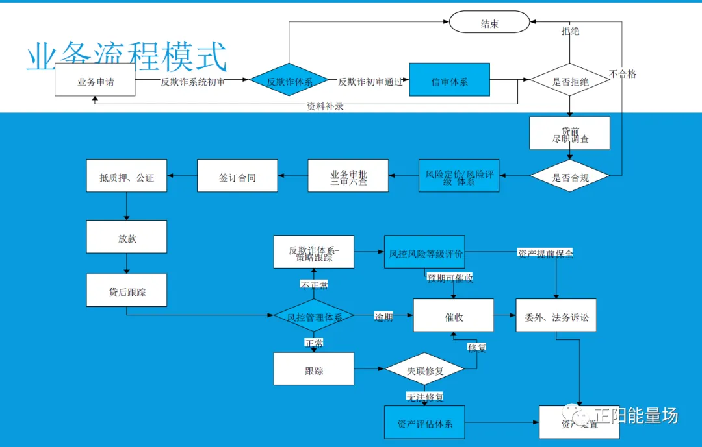

# 业务流程

!!! info 参考文档

    本文摘录[全面了解信贷业务流程](https://geekdaxue.co/read/yingtaoxiang@hello/bv6qtf)仅作为学习。

信贷业务流程对很多风控从业者来说既熟悉又陌生，多数人在日常工作中的职能覆盖范围远远达不到全面了解信贷风险点的要求，而不论是传统风控体系，还是大数据风控体系，都需要基于用户信贷生命周期的特点才能完整的建立。

本文旨在帮助大家全新认识用户借贷生命周期，全面了解网络借贷流程，包括信贷历史、不同产品形态、信贷业务流程、用户生命周期管理等。

## 1. 信贷历史

### 1.1 信贷定义

信贷是体现一定经济关系的不同所有者之间的借贷行为，是以偿还为条件的价值运动特殊形式，是债权人贷出货币，债务人按期偿还并支付一定利息的信用活动（通过转让资金使用权获取收益）。

信贷有广义和狭义之分：

- 广义的信贷是指以银行为中介、以存贷为主体的信用活动的总称，包括存款、贷款和结算业务；
- 狭义的信贷通常指银行的贷款，即以银行为主体的货币资金发放行为。

信贷是社会主义国家用有偿方式动员和分配资金的重要形式，是发展经济的有力杠杆。

#### 1.1.1 贷款条件

对象及条件:

1. 借款人具有完全民事行为能力的中国公民或符合国家有关规定的境外自然人；
2. 贷款用途明确合法；
3. 贷款申请金额、期限和币种合理；
4. 借款人具备还款意愿和还款能力；
5. 借款人信用状况良好，无重大不良信用记录；
6. 要求的其它条件。 

#### 1.1.2 信贷原则

1. 安全性原则：指银行在经营信贷业务的过程中尽量建设和避免信贷资金遭受风险和损失。
2. 流动性原则：指商业银行在经营信贷业务时能预定定期限收回贷款资金或者在不发生损失的情况下将信贷迅速转化为现金的原则。
3. 收益性原则：指通过合理的运用资金，提高信贷资金的使用效益，谋取利润最大化，力求银行自身的经济效益和社会效益的统一。 

### 1.2 发展演变

#### 1.2.1 民间借贷

民间借贷通常是指某些个人或组织低条件借出的高利息的借款，俗称高利贷，表现为无银行信贷要求的职业收入和房产所有权审批程序，极容易借款成功，代价是到期需返还高于银行贷款利率更多利息，如逾期未还完的，遭受利滚利的利息加本金的巨额摧残，情节较为恶劣，后果较为严重。

#### 1.2.2 商业银行信贷

- 银行信贷是银行将部分存款暂时借给企事业单位或个人使用，在约定时间内收回并收取一定利息的经济活动。
- 银行信贷指以银行为中介、并要求利息为回报的货币借贷。以银行为中介，界定了信用形式及其发展阶段，指借贷需要通过银行进行。

## 2. 常见产品形态

一般来说，信贷产品主要有以下几种类型：

- 银行系：微众银行-微粒贷、建设银行-快贷等；
- 持牌消费金融系：招联好期贷、马上金融马上贷等；
- 小额贷款公司系：蚂蚁借呗；
- P2P网贷系：拍拍贷借款、宜人贷借款。

我们举三种常见产品形态来展开说明，分别是信用卡、现金分期、消费分期。
### 2.1 信用卡

#### 2.1.1 定义

信用卡又叫贷记卡，是由商业银行或信用卡公司对信用合格的消费者发行的信用证明。其形式是一张正面印有发卡银行名称、有效期、号码、持卡人姓名等内容，背面有磁条、签名条的卡片。持有信用卡的消费者可以到特约商业服务部门购物或消费，再由银行同商户和持卡人进行结算，持卡人可以在规定额度内透支。

我国有关法律（《全国人民代表大会常务委员会关于<中华人民共和国刑法>有关信用卡规定的解释》）规定的信用卡，是指由商业银行或者其他金融机构发行的具有消费支付、信用贷款、转账结算、存取现金等全部功能或者部分功能的电子支付卡。

信用卡消费是一种非现金交易付款的方式，消费时无须支付现金，待账单日（Billing Date）时再进行还款。 

#### 2.1.2 种类

信用卡分为 **贷记卡** 和 **准贷记卡**：

- 贷记卡是指持卡人拥有一定的信用额度、可在信用额度内先消费后还款的信用卡；
- 准贷记卡是指持卡人按要求交存一定金额的备用金，当备用金账户余额不足支付时，可在规定的信用额度内透支的准贷记卡。

日常所说的信用卡，一般单指贷记卡。传统信用卡使用场景通常为线下商超，随着互联网的发展和个人信贷的普及，信用卡越老越多的嵌入到了线上消费场景当中。 

#### 2.1.3 模式

持卡人在商户那里刷卡消费的一瞬间，其实有很多数据是需要再银行、银联和第三方支付公司之间做数据交换记账的，以下就是整个交易流程的概略图。

#### 2.1.4 提额

- 银行发行；
- 循环授信；
- 业务网点多；
- 申卡门槛高；
- 提额难度大； 

#### 2.1.5 延展

- 信用卡贷款业务
- 信用卡代偿业务 

## 2.2 现金分期

### 2.2.1 定义

现金贷，是小额现金贷款业务的简称，是针对申请人发放的消费类贷款业务。现金贷的概念来自于美国的 Payday Loan（发薪日贷款） ，这是一种小额、短期无担保贷款，一般期限为 14 天到 30 天；而使用发薪日贷款的人群，大部分为收入低且无法申领到信用卡的人士。

国内所谓的现金贷，一般指针对个人的小额短期信用贷款，借款额度在一万元以下，是消费金融的一个重要分支，这种模式更多的是针对那些没有征信记录的低收入群体。

从 2015 年开始，现金贷作为消费金融一个重要的分支在中国开始强势崛起。一二线城市以线上为主，三四线城市以线下为主。截至目前，现金贷平台融资渠道遭全面封堵，除了银行和 ABS 产品融资渠道遭封堵，资本市场融资渠道也在收紧。 

#### 2.2.2 种类

据不完全统计，目前国内的小额现金贷平台已有上千家，大体上可以分为几类：

- 互联网系：以微粒贷、京东金条、蚂蚁借呗为代表，资金实力比较雄厚，内部流量转化获客成本低；
- 垂直平台：以手机贷、闪电借贷、现金巴士、工资钱包、量化派为代表，主要针对细分人群，获客及资金成本相对较高；
- 消费金融系：以苏宁消金的任性借、捷信消金的福袋为代表，基于目前分期业务扩展，资金来源广、成本低；
- 银行系：目前很多银行推出自有现金贷产品，如包商银行有氧贷、幸福金，产品大多针对行内白名单客户，利率普遍较低，客群与其他现金贷产品差异显著。

现金贷与 P2P 借贷不同，P2P 是借款人通过信息中介平台来借贷，而现金贷的资金可以来自于 P2P 平台，也可能来自金融机构等。

#### 2.2.3 模式

#### 2.2.4 特点

- 方便灵活的借款与还款方式
- 实时审批
- 快速到账
- 借贷生命周期短

#### 2.2.5 发展

- 本土合规监管要求更严；
- 继续向更深层次渗透，线下渠道重要性再次显现（深化的流量业务）；
- 更多卖水的公司涌现（稳健的技术服务业务）；
- 社会化平台化（小微现金贷平台）；
- 坏账率上升（面向互联网用户的催收业务）；
- 战场向海外转移（尤其是亚非拉这样的市场）；
- 利率市场化；
- 社会资金充盈；
- 移动支付和电商/O2O的成熟；
- 消费升级。

### 2.3 消费分期

#### 2.3.1 定义

消费贷也称 “消费者贷款”，主要是指对消费者个人放贷、用于购买耐用消费品或支付各种费用的贷款。长期以来，商业银行主要对工商企业或其他各类机构和团体发放贷款，一般不对个人消费支出提供资助。第二次世界大战后，商业银行所以大规模开办消费贷款业务，主要原因在于：

1. 金融业竞争日益激烈，为谋求发展，商业银行需要开拓新的业务领域。
2. 战后西方经济发展比较稳定，个人有比较可靠的货币收入。
3. 日益增多的各类征信机构出现，使银行可以较低的成本了解到借款人的信用状况，保证贷款的安全。
4. 西方国家居民为避免通贷膨胀影响，也乐于利用消费贷款。 

#### 2.3.2 种类

消费贷款的迅速发展，对于推销产品、促进生产发展起了重要作用。消费贷款依不同标准划分为不同的种类：

- 从偿还期看，可分为一次偿还贷款和分次偿还贷款；
- 从银行与消费者的借贷关系看，可分为直接贷款与间接贷款；
- 依据贷款的用途，又分为汽车贷款、住宅贷款、住宅改良或修缮贷款、教育和学资贷款、小额生活贷款、度假和旅游贷款等。 

#### 2.3.3 模式

#### 2.3.4 特点

- 消费用途广泛，有丰富的应用场景；
- 贷款额度较高；
- 贷款期限较长；
- 高风险、高收益、利率不敏感性；
- 简单的流程；
- 周期性（长期性）；
- 审批快、利息低。

#### 2.3.5 发展

- **模式创新**
    - 助贷模式升级
    - 资产证券化产品方兴未艾
    - 场景化消费金融逐步得到更全面的认可
    - 科技创新

- **产品升级**:
    - 精准营销
    - 量化风控
    - 智能催收
    - 大数据、风控及反欺诈服务进一步完善

## 3. 信贷业务流程

几种信贷模式有所差异，但核心流程基本相同，如无特殊说明，本节信贷业务流程内容均 **以现金分期为例**。

### 3.1 组织架构

| 组织架构 | 作用 | 
| --- | --- |
| 总裁办 | 组织管理；业务决策；资金准备 |
| 财务部 | 成本预测；跟踪资产动态，评估项目风险 |
| 技术部 | 产品经理；系统开发；后台设计；前端开发 |
| 运营部 | 方案设计；活动运营；用户运营 |
| 市场部 | 营销推广；商机扩展；客情维护 |
| 风控部 | 风控总监；风控经理；风控策略；反欺诈；模型开发；数据测试；风险分析 |
| 贷中管理部 | 风险追踪；用户管理 |
| 贷后管理部 | 数据中心；催收中心；委外中心 |

### 3.2 市场调研

| 分类 | 功能 |
| --- | --- |
| 产品定位 | 市场定位；区域定位；客群定位；渠道定位 |
| 合规监管 | 公司属性；产品属性；金融牌照；创新政策 |
| 目标客群 | 风险偏好；营销难度；扩展空间 |
| 行业现状 | 通过率；首逾率；坏账率；饱和度；风向标 |

### 3.2.5 核心问题

| 分类 | 描述 |
| --- | --- |
| 风控 | 所谓以线上大数据风控为主，结合传统风控手段，其实风控还是偏弱真正的目标用户其实风险还是很低的（底层客户都是一样的，收益高的反而风险小），试想对于几千到几万这样的额度，正常的老百姓绝对犯不着冒着违约的成本，真正比较危险的是职业性欺诈，所以一般都要接入专业的反欺诈服务。另外，部分平台还会读取用户通讯录并备份到服务器（可能造成隐私信息滥用）。|
| 利率 | 非常高，远超目前法律约定的36%由于额度小、期限短、且坏账高，所以高利率也是必然。另外，大部分平台会使用技术服务费、手续费等方式转换概念，从已出台的一些政策来看，也并未对此大开杀戒。 |

## 4. 生命周期风险建议

