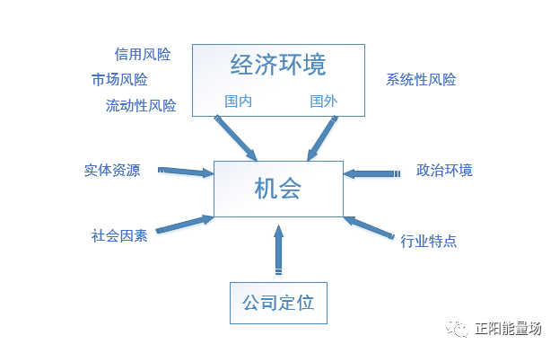
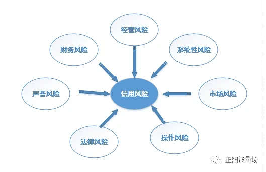

# 量化风险管理

!!! info 参考文档

    本文摘录[全面了解量化风险管理](https://geekdaxue.co/read/yingtaoxiang@hello/iaynwv)仅作为学习，请查看[原文]( https://mp.weixin.qq.com/s/hfJ3d5oSc-foF5HOF1sGPQ)。

过去 400 年间，只有保险公司始终积极从事风险管理活动；150年前，风险管理的范围开始扩大到信用风险和市场风险；最近40年，市场剧变让风险变得越来越复杂，潜在成本和未来机遇难以把握，企业开始有意识地从公司层面管理风险；20世纪80年代起， 企业在识别和管理风险上投入更多精力，带有“风险”的头衔成为新的职位。

## 1. 风险相关架构

风险存在于所有商业活动中，根据产生风险的来源不同，评估风险所需的策略、数据、模型会千差万别，控制甚至利用风险的工具也大相径庭。本节将包含非常多的风险相关术语，我们将其进行提炼，总结为以下三个方面，初步形成一个比较宽泛的风险框架：风险环境、风险类型、风险关联。

### 1.1 风险环境

所处环境不同，企业面临的风险也不尽相同。以供给、需求、竞争等方面的因素为起点展开分析，企业面临的无数风险，许多都是相通的。

- **市场竞争** —— 由市场需求、科学技术和当前竞争环境所定；
- **企业定位** —— 企业提供的产品、价格、促销、包装、分销方案；
- **实体资源** —— 主要指与农业和矿业生产相关的资源，也适用于其他产业；
- **经济环境** —— 国内外的利率、汇率、税收、经济增长、大宗商品价格等因素；
- **社会因素** —— 影响劳动市场和潜在需求的因素，包括人口规模、教育水平、职业道德、宗教文化、社会稳定性等；
- **政治风气** —— 政府的意识形态立场、政府对经济的干预、政治经济自由度、稳定与潜在动荡的平衡。

### 1.2 风险类型

企业风险有多种分类方式：

- 按照 **能否分散**，可分为系统风险和非系统风险；
- 按照 **会计标准**，可分为会计风险和经济风险；
- 按照 **驱动因素**，可分为经济风险、信用风险、操作风险、流动性风险。

金融风险主要包括信用风险、市场风险、操作风险、流动性风险、国家风险、声誉风险、法律风险、战略风险八大类。 

#### 1.2.1 系统风险

系统风险是指由于多种因素的影响和变化，导致投资者风险增大，从而给投资者带来损失的可能性。系统风险包括 **国家风险、宏观经济风险、购买力风险、利率风险、汇率风险、市场风险**。

| 风险类型 | 描述 |
| --- | --- |
| 国家风险 | 指经济主体在与非本国居民进行国际经济与金融往来中，由于他国经济、政治和社会等方面的变化而遭受损失的可能学习。国家风险通常是由债务人所在国家的行为引起的，超出了债权人的控制范围。国家风险可分为政治风险、社会风险和经济风险三类。 国家风险有两个特点： 一是国家风险发生在国际经济金融活动中，在同一个国家范围内的经济金融活动不存在国家风险；二是在国际经济金融活动中，不论是政府、银行、企业，还是个人，都可能遭受国家风险所带来的损失。|
| 宏观经济风险 | 经济活动和物价波动可能导致的企业利润损失。|
| 购买力风险 | 又称通货膨胀风险，指由通货膨胀的不确定性变动导致金融机构遭受经济损失的可能性。|
| 利率风险 | 指由于利率的变动而给金融机构带来损失或收益的可能性。|
| 汇率风险 | 指由于汇率变动而使以外币计价的收付款、资产负债造成损失或收益的不确定。|
| 市场风险 | 市场风险是指因市场价格(包括利率、汇率、股票价格和商品价格)的不利变动而使银行表内和表外业务发生损失的风险。市场风险包括利率风险、汇率风险、股票价格风险和商品价格风险四大类。|
| 经济周期波动风险 | 指证券市场行情周期性变动引起的风险。 |
| 自然风险 | 指自然力的不规则变化使社会生产和社会生活遭受威胁的风险。|

系统风险案例：因为疫情影响，中国C端消费信贷面临一定系统性风险，该风险程度以及潜在的破坏力会因为疫情发展情况以及滞后效应有待观察。

#### 1.2.2 非系统风险

非系统风险指某些因素的变化造成单个股票价格或者单个期货、外汇品种以及其他金融衍生品种下跌，从而给有价证券带来损失的可能性。包括 **合规风险、财务风险、经营风险、信用风险、经营风险、流动性风险、声誉风险、法律风险、战略风险、操作风险等**。

| 风险类型 | 描述 |
| --- | --- |
| 合规风险 | 指银行因未能遵循法律法规、监管要求、规则、自律性组织制定的有关准则、已经适用于银行自身业务活动的行为准则，而可能遭受法律制裁或监管处罚、重大财务损失或声誉损失的风险。合规风险广泛存在于金融机构业务和管理的各个方面，较其他风险更具有主观、主导等内生性特点。|
| 财务风险 | 指公司财务结构不合理、融资不当使公司可能丧失偿债能力而导致投资者预期收益下降的风险。|
| 经营风险 | 指公司决策人员与管理人员在经营管理过程中出现失误而导致公司盈利水平变化，从而使投资者预期收益下降的可能性。|
| 信用风险 | 称为违约风险，是指债务人或交易对手未能履行合同所规定的义务或信用质量发生变化，从而给银行带来损失的可能性。对大多数银行来说，信用风险几乎存在于银行的所有业务中。信用风险是银行最为复杂的风险种类，也是银行面临的最主要的风险。|
| 经营风险 | 指企业由于误判经济或竞争环境，选择了错误的生产和销售策略，没有达到经营目标的风险。|
| 流动性风险 | 指无法在不增加成本或资产价值不发生损失的条件下及时满足客户的流动性需求，从而使银行遭受损失的可能性。流动性风险包括资产流动性风险和负债流动性风险：资产流动性风险是指资产到期不能如期足额收回，不能满足到期负债的偿还和新的合理贷款及其他融资需要，从而给银行带来损失的可能性。负债流动性风险是指银行过去筹集的资金特别是存款资金由于内外因素的变化而发生不规则波动，受到冲击并引发相关损失的可能性。|
| 声誉风险 | 声誉风险是指由于意外事件、银行的政策调整、市场表现或日常经营活动所产生的负面结果，可能对银行的这种无形资产造成损失的风险。|
| 法律风险 | 法律风险是指银行在日常经营活动中，因为无法满足或违反相关的商业准则和法律要求，导致不能履行合同、发生争议/诉讼或其他法律纠纷，而可能给银行造成经济损失的风险。|
| 战略风险 | 战略风险是指银行在追求短期商业目的和长期发展目标的系统化管理过程中，不适当的未来发展规划和战略决策可能威胁银行未来发展的潜在风险。主要来自四个方面：银行战略目标的整体兼容性;为实现这些目标而制定的经营战略;为这些目标而动用的资源;战略实施过程的质量。|
| 操作风险 | 指由于内部程序、人员和系统的不完备或失效，或由于外部事件造成损失的风险。 |

操作风险按照发生的频率和损失大小，可分为人员、系统、流程和外部事件所引发的四类风险，并由此分为七种表现形式：

- 内部欺诈：有机构内部人员参与的诈骗、盗用资产、违反法律以及公司的规章制度的行为；
- 外部欺诈：第三方的诈骗、盗用资产、违反法律的行为；
- 雇用合同以及工作状况带来的风险事件：由于不履行合同，或者不符合劳动健康、安全法规所引起的赔偿要求；
- 客户、产品以及商业行为引起的风险事件：有意或无意造成的无法满足某一顾客的特定需求,或者是由于产品的性质、设计问题造成的失误；
- 有形资产的损失：由于灾难性事件或其他事件引起的有形资产的损坏或损失；
- 经营中断和系统出错：例如，软件或者硬件错误、通信问题以及设备老化；
- 涉及执行、交割以及交易过程管理的风险事件。例如，交易失败、与合作伙伴的合作失败、交易数据输入错误、不完备的法律文件、未经批准访问客户账户，以及卖方纠纷等。

操作风险较分散，且主体多样，可以由内部工作人员操作不当、管理流程设计缺陷、系统设计缺陷等引发。存在于银行业务和管理的各个方面，并且具有可转化性，即可以转化为市场风险、信用风险等其他风险。

操作风险特点：

- 操作风险中的风险因素很大比例上来源于银行的业务操作,属于银行可控范围内的内生风险。单个操作风险因素与操作损失之间并不存在清晰的、可以界定的数量关系；
- 从覆盖范围看,操作风险管理几乎覆盖了银行经营管理所有方面的不同风险。既包括发生频率高、但损失相对较低的日常业务流程处理上的小纰漏，也包括发生频率低、但一旦发生就会造成极大损失,甚至危及到银行存亡的自然灾害、大规模舞弊等。因此,试图用一种方法来覆盖操作风险的所有领域几乎是不可能的；
- 对于信用风险和市场风险而言，风险与报酬存在一一映射关系，但这种关系并不一定适用于操作风险；
- 业务规模大、交易量大、结构变化迅速的业务领域，受操作风险冲击的可能性最大；
- 操作风险是一个涉及面非常广的范畴，操作风险管理几乎涉及银行内部的所有部门。因此，操作风险管理不仅仅是风险管理部门和内部审计部门的事情。

操作风险案例

- 线下门店经理偶然获得了后台管理权限，可以直接看到用户基本信息及借款订单明细数据，手动复制粘贴上千条记录，倒卖给数据公司，北京总部总监火速飞往深圳，防止数据进一步泄露；
- 后台技术人员代码逻辑有误，热点期间用户进件量大，同异步事件处理有严重bug，导致同一个客户成功放款3次~5次，按客单价1000元算，半个工作日直接损失近50万；
- 技术人员代码逻辑有误，同异步轮询问题，热点期间同一用户借款申请时因bug多次请求三方数据接口，而数据合作按查得计费，客户只看你调取的接口次数，半个工作日直接损失近10万；
- 技术人员后台点选按钮写错，产品经理一个按钮导致数据库某个渠道用户的全部数据直接删除，虽然阿里云服务器可以回溯备份，但数据未完全恢复，半个工作日直接损失近10万；
- 拼多多羊毛事件，直接损失近 2 亿。

### 1.3 风险关联

本文后续内容基本指向信用风险，而信用风险只是企业面临众多风险的一小部分。它可以被单独研究，但绝不能被孤立分析，无论借贷是否是主要活动，其他风险总是存在，并且互相关联。

举例：合规风险是金融机构能够持续运营的前提。较之信用风险和市场风险的被动性，合规风险和操作风险在管理方法和控制措施方面有着千丝万缕的联系。

| 关联 | 描述 |
| --- | --- |
| 合规风险可以诱发操作风险 | 合规风险往往是操作风险存在和发生的重要起因，或是因为对合规风险的不重视、未能及时掌握政策法规要求而触发了操作风险，或是明知不合规却由于外部刺激、利益驱使、侥幸心理等因素而引发了操作风险。金融机构“合规文化”的缺失，合规风险意识的淡漠，必将通过操作风险等形式暴露。|
| 操作风险可以导致合规风险 | 操作风险可能是由于主观上的疏忽，也可能由于相对客观的原因给操作风险的发生提供了可能性。无论主观与否，操作风险发生的前提都与合规风险管理不到位有关。操作人员未能按照合规要求操作，设计人员和管理人员未能按合规要求执行或设置相应控制措施等等，最终往往导致合规风险的产生。|
| 操作风险使合规风险管理难度增加 | 简单地理解合规风险，主要指金融机构做了违法、违规的事，而招致的风险或损失，其动机主要受机构主观性的行为影响。而由于操作风险的存在，其分散性的特点，动机的不确定性，使得风险发生的点更加错综复杂。从而由操作风险可能引起一系列连锁反应，包括引发其他类风险而最终导致合规风险事件，为合规风险管理增加了难度，使得合规风险管理与操作风险管理不能割裂地进行。|
| 内部控制中的关联性 | 虽然合规风险与操作风险有诸如以上的这些联系，但仍然不可以把两种风险的管理等同起来，尤其不能仅以操作风险管理措施替代合规风险管理。因为操作风险往往针对具体操作人员或者流程的具体环节而言，而合规风险往往发生在已经过管理层、决策层审批的流程中不合规的设计基础上。这就意味着合规风险更多体现了制度设计层面、合规意识层面的缺陷，而操作风险更多体现了具体执行中风险发生的可能性。但在内部控制方面两者也有较大的关联性，一方面，合规风险与操作风险在控制目标、控制措施设计上可以联动考虑，增强风险管理的力度。另一方面，要明确控制措施所面对的主体，使得风险管控措施更具针对性。|

### 1.4 信贷风险

如果说金融风险是一个不朽的话题的话，那风控就是一个永恒的课题。

#### 1.4.1  信贷要素及风险点

信贷业务本身是一种授信行为，从金融学的角度，信用包括履约意愿和履约能力两方面，信贷机构在办理信贷业务时需要对借款人的还款意愿和还款能力进行调查和了解，并且需要在调查和了解的基础上进行评估，并根据评估情况决定是否对借款人授信以及授信的额度和期限。

要想做好信贷业务，对一些基础的问题要有清晰的了解。一般认为，信贷业务包含授信对象、金额、期限、利率、还款方式、还款来源、用途、担保方式等八个要素，清晰了解这八个要素及相对应的风险点是做好信贷业务的基础。

| 授信对象 | 金额 | 期限 | 利率 | 还款方式 | 还款来源 | 用途 | 担保方式 |
| --- | --- | --- | --- | --- | --- | --- | --- |
| 不具备资质 | 过渡授信 | 期限设置不合理 | 贷款利率定价随意 | 还款方式设置不合理 | 现金流不足 | 借款用途存在法律风险 | 过渡依赖担保 |
| 限控行业 | 授信不足 | | | | | | 抵（质）押物不合法 |
| 不符合准入条件 | 违反程度授信 | | | | | | 抵押等级手续不规范 |
| 冒名贷款和借名贷款风险 | | | | | | | |
| 关联企业引发的贷款风险 | | | | | | | |
| 授信过于集中 | | | | | | | |

=== "贷款对象"

    